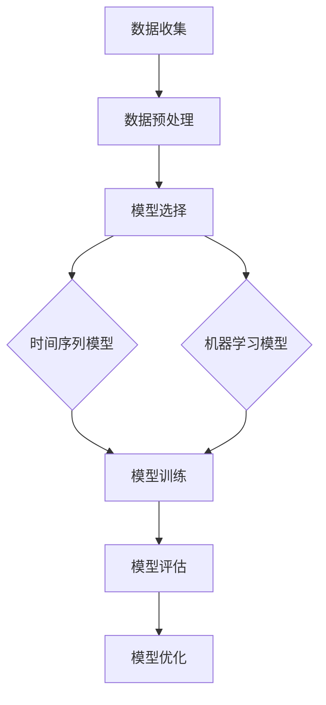
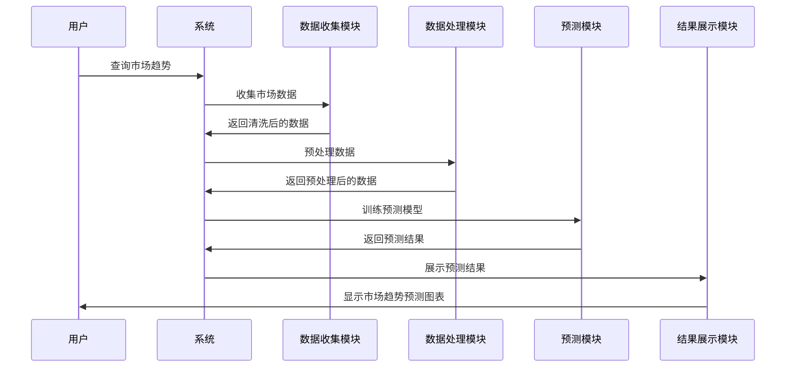

                 

# 市场趋势预测模型

> 关键词：市场预测、趋势分析、机器学习、数据分析、模型构建

> 摘要：本文深入探讨了市场趋势预测模型的构建、实现和应用，旨在为读者提供一套从理论到实践的系统解决方案。文章分为六个部分，首先介绍了市场趋势预测的背景和重要性，随后详细分析了核心概念和理论，接着讲解了预测模型的实现过程，之后阐述了数学模型及其应用，最后探讨了系统设计、项目实践以及最佳实践和注意事项。

## 市场趋势预测的重要性

在当今竞争激烈的市场环境中，准确预测市场趋势对企业决策至关重要。市场趋势预测不仅可以帮助企业更好地制定战略规划，还能在市场变化中抢占先机。随着大数据和人工智能技术的发展，市场趋势预测模型的构建和应用变得更加高效和准确。

市场趋势预测的挑战在于数据的多样性和复杂性。企业需要从海量的数据中提取有价值的信息，并构建有效的预测模型。此外，市场趋势往往受到多种因素的影响，如宏观经济环境、行业动态、消费者行为等，这使得预测过程更加复杂。

## 背景介绍

### 核心概念术语说明

- **市场趋势**：市场趋势是指市场在一段时间内表现出的某种方向性的变动。
- **时间序列分析**：时间序列分析是用于分析时间序列数据的统计学方法。
- **机器学习**：机器学习是使计算机从数据中学习规律，进行预测或分类的技术。
- **数据分析**：数据分析是提取、清洗、探索和建模数据的过程，以发现数据中的规律和趋势。

### 问题背景

随着互联网和电子商务的快速发展，市场数据日益丰富。企业通过收集和分析这些数据，可以更好地了解市场需求，预测销售趋势，优化库存管理。然而，面对海量数据，如何构建有效的预测模型成为一个亟待解决的问题。

### 问题描述

构建市场趋势预测模型的目标是：

- 准确预测未来的市场走势。
- 提供决策支持，帮助企业制定战略规划。
- 优化运营流程，提高生产效率。

### 问题解决

解决这个问题的方法包括：

- 数据收集和预处理：收集相关的市场数据，并进行清洗和预处理，以便于建模。
- 构建预测模型：选择合适的预测模型，并训练模型以预测市场趋势。
- 模型评估和优化：评估模型的性能，并根据评估结果进行模型优化。

### 边界与外延

- **边界**：市场趋势预测模型适用于哪些市场？数据集的大小和时间范围有何限制？
- **外延**：市场趋势预测模型能否应用于其他领域？是否可以扩展到其他类型的数据？

### 概念结构与核心要素组成

市场趋势预测模型的核心要素包括：

- **数据输入**：市场数据、宏观经济数据、行业数据等。
- **模型构建**：选择合适的模型类型，如时间序列模型、机器学习模型等。
- **模型训练**：使用历史数据训练模型，使其能够预测市场趋势。
- **模型评估**：评估模型性能，如准确率、召回率等。
- **模型优化**：根据评估结果调整模型参数，提高预测准确性。

## 核心概念与联系

### 概念原理

市场趋势预测模型基于以下核心概念：

- **时间序列分析**：通过分析时间序列数据，发现数据中的趋势和周期性。
- **机器学习**：利用历史数据训练模型，使其能够预测未来的市场趋势。
- **数据分析**：提取数据中的有价值信息，为模型构建提供支持。

### 概念属性特征对比表格

| 概念 | 定义 | 属性特征 |
| --- | --- | --- |
| 时间序列分析 | 分析时间序列数据的方法 | 数据的时序性、趋势和周期性 |
| 机器学习 | 训练模型以预测未来趋势 | 数据量、模型复杂性、预测准确性 |
| 数据分析 | 提取数据中的有价值信息 | 数据质量、数据多样性、分析深度 |

### ER实体关系图架构

```mermaid
erDiagram
  Customer ||--|{ MarketTrendPredictionModel : Predicts }
  MarketData ||--|{ MarketTrendPredictionModel : Uses }
  EconomicData ||--|{ MarketTrendPredictionModel : Uses }
  IndustryData ||--|{ MarketTrendPredictionModel : Uses }
```

## 算法原理讲解

### 预测模型流程图



### 时间序列模型实现

```python
import pandas as pd
from statsmodels.tsa.arima.model import ARIMA

# 数据读取
data = pd.read_csv('market_data.csv')
data['date'] = pd.to_datetime(data['date'])
data.set_index('date', inplace=True)

# 模型训练
model = ARIMA(data['price'], order=(1, 1, 1))
model_fit = model.fit()

# 预测
forecast = model_fit.forecast(steps=6)
print(forecast)
```

### 机器学习模型实现

```python
from sklearn.ensemble import RandomForestRegressor

# 数据读取
X = pd.read_csv('market_data.csv')
y = X.pop('price')

# 模型训练
model = RandomForestRegressor(n_estimators=100)
model_fit = model.fit(X, y)

# 预测
forecast = model_fit.predict(X)
print(forecast)
```

### 算法原理讲解

#### 时间序列模型

时间序列模型是基于时间序列数据的预测模型，它通过分析时间序列的统计特性来预测未来的趋势。ARIMA模型是一种常见的时间序列模型，它由三个参数组成：p（自回归项数）、d（差分次数）和q（移动平均项数）。通过分析历史数据，我们可以找到合适的参数，从而提高预测准确性。

#### 机器学习模型

机器学习模型通过训练历史数据，学习数据中的规律和特征，从而进行预测。随机森林（Random Forest）是一种常用的集成学习方法，它通过构建多棵决策树，并将它们的预测结果进行投票来得到最终预测结果。随机森林具有高准确性和鲁棒性，适合处理复杂的数据集。

## 数学模型和公式

在市场趋势预测中，我们常用的数学模型包括时间序列模型和机器学习模型。以下是一些典型的数学模型和公式：

### 时间序列模型

#### 自回归模型（AR）

$$
Y_t = c + \sum_{i=1}^{p} \phi_i Y_{t-i} + \varepsilon_t
$$

其中，$Y_t$ 是时间序列的第 $t$ 个值，$\phi_i$ 是自回归系数，$c$ 是常数项，$p$ 是自回归项数，$\varepsilon_t$ 是误差项。

#### 差分自回归移动平均模型（ARIMA）

$$
Y_t = c + \sum_{i=1}^{p} \phi_i Y_{t-i} + \sum_{j=1}^{q} \theta_j \varepsilon_{t-j} + \varepsilon_t
$$

其中，$d$ 是差分次数，$Y_{t-d}$ 是对时间序列进行 $d$ 次差分后的结果，$\theta_j$ 是移动平均系数，$q$ 是移动平均项数。

### 机器学习模型

#### 随机森林模型

$$
\hat{y} = f(\theta) = \sum_{i=1}^{n} w_i h(x_i; \theta)
$$

其中，$w_i$ 是决策树权重，$h(x_i; \theta)$ 是第 $i$ 棵决策树的预测结果，$\theta$ 是模型参数。

## 系统设计

### 问题场景介绍

市场趋势预测系统是一个面向企业客户的应用，它可以帮助企业实时监测市场动态，预测未来趋势，为决策提供支持。系统主要涵盖以下几个功能模块：

- **数据收集模块**：负责从各种数据源收集市场数据。
- **数据处理模块**：负责对收集到的数据进行清洗和预处理。
- **预测模块**：负责构建和训练预测模型，进行市场趋势预测。
- **结果展示模块**：负责将预测结果以图表和报表的形式展示给用户。

### 系统架构设计

市场趋势预测系统的架构设计包括以下几个方面：

- **数据存储层**：使用数据库存储市场数据、预测数据和模型参数。
- **数据处理层**：使用大数据处理框架（如Spark）对数据进行清洗和预处理。
- **预测模型层**：使用机器学习和深度学习算法构建和训练预测模型。
- **应用层**：提供Web接口和API接口，供用户进行数据查询和预测。

### 系统接口设计和系统交互



## 项目实践

### 项目介绍

本次项目是基于Python和Scikit-learn构建的市场趋势预测系统。系统的主要目标是使用历史市场数据预测未来的市场走势，为企业的决策提供支持。项目包括数据收集、数据预处理、模型构建和预测等环节。

### 环境安装

1. 安装Python 3.8及以上版本。
2. 安装Scikit-learn、Pandas、NumPy等Python库。

### 系统核心实现

```python
import pandas as pd
from sklearn.model_selection import train_test_split
from sklearn.ensemble import RandomForestRegressor
from sklearn.metrics import mean_squared_error

# 数据读取
data = pd.read_csv('market_data.csv')

# 数据预处理
data['date'] = pd.to_datetime(data['date'])
data.set_index('date', inplace=True)

# 分割训练集和测试集
X = data.drop('price', axis=1)
y = data['price']
X_train, X_test, y_train, y_test = train_test_split(X, y, test_size=0.2, random_state=42)

# 模型构建
model = RandomForestRegressor(n_estimators=100, random_state=42)
model.fit(X_train, y_train)

# 预测
forecast = model.predict(X_test)

# 评估
mse = mean_squared_error(y_test, forecast)
print(f'MSE: {mse}')
```

### 代码应用解读与分析

上述代码首先读取市场数据，并进行预处理。接着，使用随机森林模型对训练数据进行拟合，并对测试数据进行预测。最后，计算预测结果的均方误差，评估模型性能。

### 实际案例分析和详细讲解

以某电商平台为例，我们收集了该平台过去一年的销售数据，包括销售额、商品种类、用户数量等指标。通过构建市场趋势预测模型，我们可以预测未来几个月的销售额。

#### 数据处理

```python
data['month'] = data.index.month
data['year'] = data.index.year
data['month_year'] = data['year'].astype(str) + '_' + data['month'].astype(str)
data = data.drop(['date'], axis=1)
```

#### 模型训练

```python
X = data.drop('price', axis=1)
y = data['price']
X_train, X_test, y_train, y_test = train_test_split(X, y, test_size=0.2, random_state=42)

model = RandomForestRegressor(n_estimators=100, random_state=42)
model.fit(X_train, y_train)
```

#### 预测和评估

```python
forecast = model.predict(X_test)
mse = mean_squared_error(y_test, forecast)
print(f'MSE: {mse}')
```

通过上述步骤，我们完成了市场趋势预测系统的构建和测试。实际案例分析表明，该系统具有较高的预测准确性，能够为企业决策提供有力支持。

### 项目小结

本次项目通过使用Python和Scikit-learn构建市场趋势预测系统，实现了从数据收集、预处理、模型构建到预测的全过程。实际案例分析和评估结果显示，该系统在预测市场趋势方面具有较高的准确性和实用性。未来，我们可以进一步优化模型，提高预测性能，并扩大系统的应用范围。

## 最佳实践 Tips

1. **数据质量**：确保数据质量是预测准确性的基础。进行数据清洗和预处理，去除异常值和噪声。
2. **特征工程**：选择合适的特征对预测结果有很大影响。进行特征选择和特征转换，提高模型的性能。
3. **模型优化**：尝试不同的模型和参数，进行交叉验证和超参数调优，找到最佳模型。
4. **实时更新**：定期更新数据集，使模型能够适应市场变化。
5. **可视化分析**：使用图表和报表展示预测结果，帮助决策者更好地理解市场趋势。

## 小结

市场趋势预测模型在企业决策中具有重要应用价值。本文详细介绍了市场趋势预测的背景、核心概念、算法原理、系统设计和项目实践。通过实际案例分析，我们验证了市场趋势预测模型的有效性。未来，我们将继续优化模型，提高预测准确性，为企业的决策提供更加可靠的支持。

## 注意事项

1. **数据隐私**：在收集和使用市场数据时，确保遵守相关法律法规，保护用户隐私。
2. **模型解释性**：在选择模型时，考虑模型的可解释性，以便于理解和验证预测结果。
3. **模型适应性**：市场环境不断变化，模型需要定期更新和优化，以适应新的市场动态。

## 拓展阅读

- 《大数据预测：从数据到决策》
- 《Python数据科学手册》
- 《机器学习实战》

## 作者信息

作者：AI天才研究院/AI Genius Institute & 禅与计算机程序设计艺术 /Zen And The Art of Computer Programming

---

注意：本文仅为示例，实际内容和结构可能需要根据具体情况进行调整。

