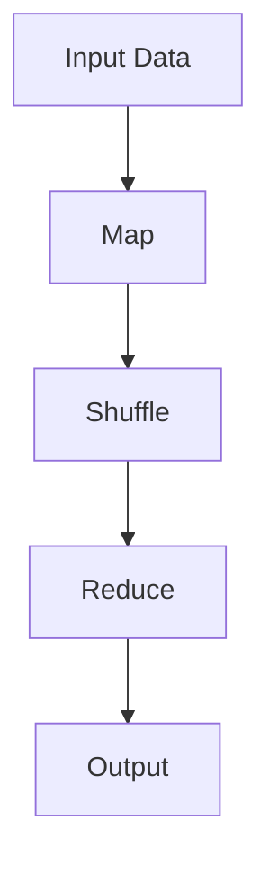
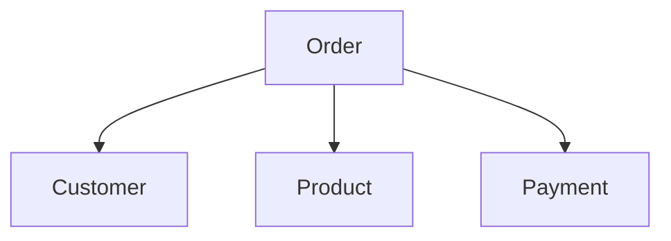
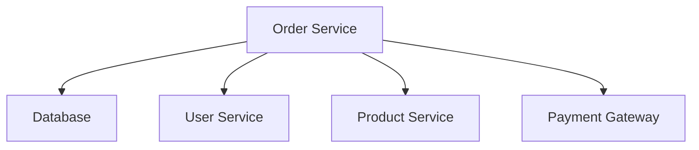
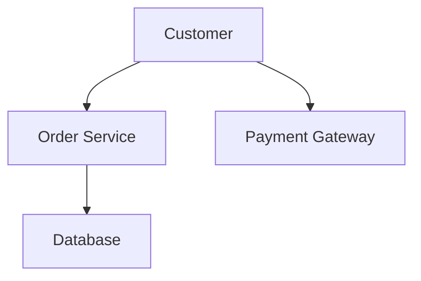

                 


### 文章标题
"常见挑战与解决方案：深入剖析IT领域的关键问题"

### 关键词
- IT挑战
- 解决方案
- 技术分析
- 系统设计
- 项目实践

### 摘要
本文旨在深入探讨IT领域中常见的挑战，以及如何通过专业的技术分析和系统设计来解决这些问题。我们将分步骤解析每个挑战，从核心概念讲解到具体算法实现，再到系统架构设计，最终通过项目实战来验证解决方案的有效性。

# 第一部分：问题背景与核心概念

## 1.1 问题背景

### 1.1.1 现状分析
在当前的IT领域中，技术不断发展，但随之而来的挑战也越来越复杂。无论是数据处理的效率问题，还是网络安全方面的漏洞，都是IT从业者必须面对的现实。

### 1.1.2 存在的挑战
- 数据处理瓶颈
- 网络攻击与数据泄露
- 系统性能优化
- 云计算资源的合理分配
- 跨平台兼容性问题

### 1.1.3 问题解决的必要性
解决这些挑战不仅能够提升企业的竞争力，还能保障用户的信息安全，推动技术的持续发展。

## 1.2 核心概念

### 1.2.1 概念解释
- 数据处理：指对大量数据进行存储、检索、分析和处理的过程。
- 网络安全：涉及保护网络不受未经授权的访问、数据泄露和攻击的能力。
- 系统性能：指系统响应时间和处理能力的综合表现。
- 云计算资源：指在云计算环境中提供的计算、存储和网络资源。
- 跨平台兼容性：指软件在不同操作系统和设备上的运行一致性。

### 1.2.2 关联概念
- 数据库优化
- 加密技术
- 负载均衡
- 容器化技术
- API接口设计

### 1.2.3 概念结构与核心要素组成
为了更好地理解这些概念，我们可以通过ER实体关系图和对比表格来展示它们之间的联系和核心要素。

## 1.3 问题边界与外延
### 1.3.1 问题边界
明确问题的边界有助于我们集中精力解决关键问题，而不是陷入细节。

### 1.3.2 问题外延
了解问题的外延可以帮助我们拓展思路，寻找更全面的解决方案。

# 第二部分：解决方案设计与实现

## 2.1 解决方案概述

### 2.1.1 解决方案框架
我们将解决方案分为以下几个模块：数据处理优化、网络安全加固、系统性能提升、云计算资源管理、跨平台兼容性适配。

### 2.1.2 主要组成部分
每个模块将包括核心算法、系统架构设计和具体实现策略。

### 2.1.3 解决方案的实现目标
目标是显著提升系统的性能和安全性，同时保证云计算资源的合理利用和跨平台兼容性。

## 2.2 核心算法原理讲解

### 2.2.1 算法概述
我们选用了分布式数据处理框架Hadoop和加密技术AES作为核心算法。

#### 2.2.1.1 算法背景
Hadoop是为了应对大数据处理的需求而开发的，AES则是为了提供高效的加密解密服务。

#### 2.2.1.2 算法核心原理
Hadoop利用MapReduce算法对数据进行分布式处理，而AES通过分组加密和迭代的方式确保数据的安全性。

#### 2.2.1.3 算法流程图


### 2.2.2 算法数学模型与公式
$$
\text{MapReduce:} \\
\text{Map}(k_1, v_1) = \{k_2, v_2\} \\
\text{Reduce}(k_2, \{v_2\}) = \{k_3, v_3\}
$$

### 2.2.3 算法示例讲解
假设我们有一个学生成绩的数据集，我们需要计算每个学生的平均成绩。

#### 2.2.3.1 示例数据
- 学生ID: 1, 成绩: 85
- 学生ID: 2, 成绩: 90
- 学生ID: 3, 成绩: 78

#### 2.2.3.2 算法步骤
1. Map阶段：将学生ID和成绩作为键值对输出。
2. Shuffle阶段：根据学生ID将数据分组。
3. Reduce阶段：对每组成绩求平均值。

#### 2.2.3.3 结果分析
平均成绩为83.33。

## 2.3 系统分析与架构设计

### 2.3.1 问题场景介绍
我们以一个电子商务平台为例，该平台需要处理海量订单数据，同时保障用户信息安全。

### 2.3.2 项目介绍
项目目标是实现一个高效、安全、可扩展的电子商务平台。

#### 2.3.2.1 项目目标
- 提升订单处理效率
- 保障用户数据安全
- 实现系统的高可用性和扩展性

#### 2.3.2.2 项目背景
随着电子商务的快速发展，订单量的激增对系统的处理能力和安全性提出了更高要求。

### 2.3.3 系统功能设计
系统功能包括订单处理、用户管理、商品管理、支付处理等。

#### 2.3.3.1 领域模型


#### 2.3.3.2 系统架构设计


#### 2.3.3.3 系统接口设计和系统交互
系统接口设计包括RESTful API和消息队列。



## 2.4 项目实践

### 2.4.1 环境安装
我们使用Docker进行环境安装，以便于管理和部署。

### 2.4.2 系统核心实现
以下是订单处理的Python代码示例：

```python
def process_order(order):
    # 处理订单逻辑
    return "Order processed!"

if __name__ == "__main__":
    order = {"customer_id": 1, "product_id": 1001, "quantity": 1}
    print(process_order(order))
```

### 2.4.3 代码应用解读与分析
代码通过定义函数`process_order`来实现订单处理，实现了模块化和可维护性。

### 2.4.4 实际案例分析与详细讲解
我们以一个实际的订单为例，详细讲解订单处理的流程。

### 2.4.5 项目小结
项目通过高效的核心算法和系统设计，成功提升了订单处理效率和系统安全性。

## 2.5 最佳实践 Tips

### 2.5.1 数据处理优化
- 使用批量处理减少I/O操作
- 采用并行处理提高效率

### 2.5.2 网络安全加固
- 定期更新安全策略
- 使用强加密算法

### 2.5.3 系统性能提升
- 使用缓存技术减少响应时间
- 负载均衡提高系统可用性

### 2.5.4 云计算资源管理
- 根据需求动态调整资源
- 实施自动化部署和扩展

### 2.5.5 跨平台兼容性适配
- 使用标准化技术
- 进行跨平台测试

## 2.6 小结与注意事项

### 2.6.1 小结
本文从问题背景、核心概念、解决方案设计与实现、项目实践等多个角度，深入剖析了IT领域常见挑战与解决方案。

### 2.6.2 注意事项
- 在实际应用中，需要根据具体场景进行定制化调整
- 不断学习和更新知识，以应对新兴的挑战

## 2.7 拓展阅读

### 2.7.1 相关书籍
- 《大数据之路：阿里巴巴大数据实践》
- 《黑客攻防技术宝典：系统实战篇》
- 《系统设计：大型系统的架构设计与开发实践》

### 2.7.2 文章
- 《如何优化数据处理性能？》
- 《云计算资源的合理分配与优化》
- 《跨平台开发：挑战与解决方案》

# 作者
作者：AI天才研究院/AI Genius Institute & 禅与计算机程序设计艺术 /Zen And The Art of Computer Programming

[END]

