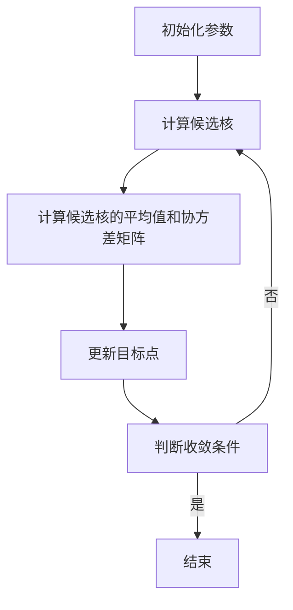
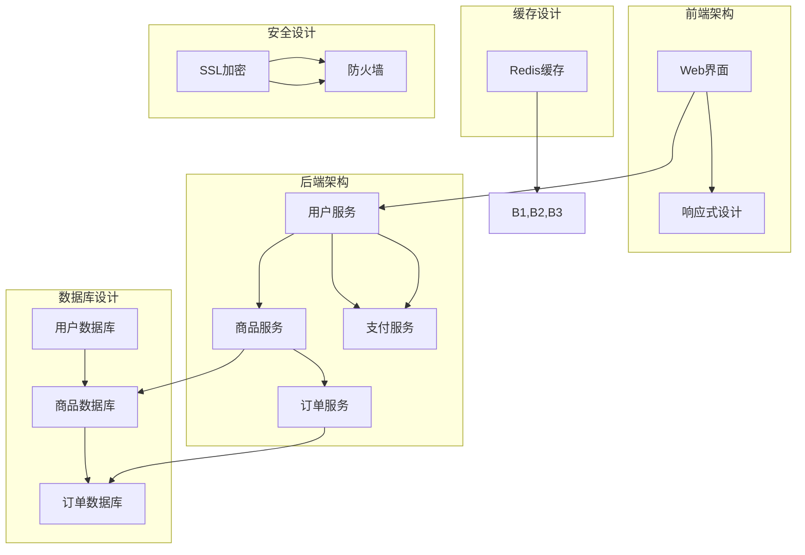
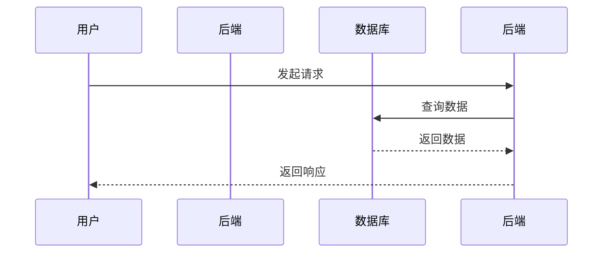

                 

## 引言与背景

### 技术创新的基本原理

技术创新是推动社会发展的重要动力，特别是在信息技术飞速发展的今天，创新已经成为企业和国家竞争的关键因素。技术创新的基本原理可以概括为以下几个核心概念：

#### 技术创新的定义

技术创新通常指的是在现有技术基础上，通过引入新的技术元素或改进现有技术，从而实现技术水平的提升。这种提升可能体现在技术性能的提高、成本降低、效率增加等方面。例如，5G技术的推出就是通信技术领域的一项重大创新，它显著提高了数据传输速度和网络容量，为物联网、自动驾驶等新兴技术提供了坚实的支撑。

#### 技术创新的特点

1. **动态性**：技术创新是一个不断演进的过程，技术的进步往往是连续的，每次创新都可能为下一次创新打下基础。
2. **不确定性**：技术创新涉及到许多未知因素，因此具有很高的不确定性和风险。
3. **复杂性**：技术创新通常涉及多学科交叉和复杂系统的集成，需要综合运用多种知识和技能。

#### 技术创新与系统稳定性的关系

系统稳定性是指系统在受到外界干扰后，能够迅速恢复到初始状态的能力。技术创新与系统稳定性之间存在一定的矛盾，但又是相辅相成的：

1. **矛盾性**：技术创新往往意味着对现有系统的颠覆和改变，这可能导致系统不稳定。例如，引入新型技术组件可能破坏系统的现有平衡。
2. **互补性**：适当的创新可以增强系统的适应性和灵活性，从而提高稳定性。例如，通过引入冗余设计和故障恢复机制，可以提高系统的容错能力。

### 系统稳定性的原理

系统稳定性主要涉及以下几个方面的原理：

#### 系统稳定性的定义

系统稳定性是指系统在受到外界干扰后，能够保持其功能正常运行的能力。例如，计算机操作系统在受到病毒攻击后，能够通过安全机制恢复到正常状态，而不影响用户的数据和应用程序。

#### 系统稳定性的属性特征

1. **鲁棒性**：系统在面临各种异常情况下，仍能保持稳定运行的能力。
2. **容错性**：系统在部分组件失效时，仍能维持整体功能的能力。
3. **自修复性**：系统在检测到故障后，能够自动修复并恢复正常运行的能力。

#### 系统稳定性与技术创新的相互影响

技术创新可以在以下几个方面影响系统稳定性：

1. **提高稳定性**：通过引入先进的故障检测和恢复技术，提高系统的鲁棒性和容错性。
2. **降低稳定性**：过于激进的创新可能导致系统设计不合理，从而降低系统的稳定性。

### 问题解决

为了在技术创新和系统稳定性之间找到平衡，我们需要：

1. **科学评估**：在引入新技术时，进行全面的技术评估，包括其稳定性和潜在风险。
2. **系统设计**：在设计系统时，考虑技术创新的可能性和系统稳定性需求，采取适当的措施提高系统的鲁棒性和容错性。
3. **持续监控**：在系统运行过程中，持续监控系统状态，及时发现并解决潜在问题。

### 边界与外延

技术创新和系统稳定性之间的平衡是一个复杂的课题，它不仅涉及到技术层面的考量，还包括经济、管理等多方面因素。本文将深入探讨这一课题，结合具体案例，提出解决方案。

### 概念结构与核心要素组成

本文的核心概念和结构包括：

1. **技术创新的基本原理**：介绍技术创新的定义、特点和关系。
2. **系统稳定性的原理**：阐述系统稳定性的定义、属性特征及其与技术创新的相互影响。
3. **问题解决方法**：提出科学评估、系统设计和持续监控的策略。
4. **案例分析**：结合实际案例，探讨技术创新与系统稳定性之间的平衡。

通过这些核心要素的组成，本文旨在为读者提供一个全面、系统的理解和解决方案。

### 文章关键词

- 技术创新
- 系统稳定性
- 平衡策略
- 风险评估
- 系统设计

### 文章摘要

本文探讨了技术创新与系统稳定性之间的关系，提出了科学评估、系统设计和持续监控的策略，以实现技术创新与系统稳定性之间的平衡。通过具体案例分析和详细讲解，为读者提供了一个实用的参考框架。

## 核心概念与联系

### 技术创新的基本原理

技术创新是一个复杂而多层次的过程，其核心原理包括以下几个方面：

#### 技术创新的定义

技术创新指的是在现有技术基础上，通过引入新的元素或改进现有技术，以实现技术水平的提升或新功能的创造。这种创新可以是渐进式的，也可以是革命性的。渐进式创新通常通过持续改进现有技术来实现，而革命性创新则可能引入全新的技术或理念，颠覆现有的技术格局。

#### 技术创新的特点

1. **动态性**：技术创新是一个持续的过程，技术的发展是动态变化的，每次创新都可能为下一次创新奠定基础。
2. **不确定性**：技术创新涉及许多未知因素，具有很高的不确定性和风险，需要灵活应对和持续调整。
3. **复杂性**：技术创新通常涉及多个领域和学科的交叉，需要综合运用多种知识和技能。

#### 技术创新与系统稳定性的关系

技术创新与系统稳定性之间存在一定的矛盾，但又是相辅相成的：

1. **矛盾性**：技术创新往往意味着对现有系统的颠覆和改变，这可能导致系统不稳定。例如，引入新型技术组件可能破坏系统的现有平衡。
2. **互补性**：适当的创新可以增强系统的适应性和灵活性，从而提高稳定性。例如，通过引入冗余设计和故障恢复机制，可以提高系统的容错能力。

### 系统稳定性的原理

系统稳定性是指系统在受到外界干扰后，能够保持其功能正常运行的能力。系统稳定性主要涉及以下几个方面的原理：

#### 系统稳定性的定义

系统稳定性是指系统在受到外界干扰后，能够迅速恢复到初始状态的能力。例如，计算机操作系统在受到病毒攻击后，能够通过安全机制恢复到正常状态，而不影响用户的数据和应用程序。

#### 系统稳定性的属性特征

1. **鲁棒性**：系统在面临各种异常情况下，仍能保持稳定运行的能力。
2. **容错性**：系统在部分组件失效时，仍能维持整体功能的能力。
3. **自修复性**：系统在检测到故障后，能够自动修复并恢复正常运行的能力。

#### 系统稳定性与技术创新的相互影响

技术创新可以在以下几个方面影响系统稳定性：

1. **提高稳定性**：通过引入先进的故障检测和恢复技术，提高系统的鲁棒性和容错性。
2. **降低稳定性**：过于激进的创新可能导致系统设计不合理，从而降低系统的稳定性。

### 核心概念属性特征对比表格

为了更直观地理解技术创新和系统稳定性的核心概念属性特征，我们可以使用对比表格进行展示：

| 特征        | 技术创新                   | 系统稳定性                   |
| ----------- | -------------------------- | ---------------------------- |
| 定义        | 引入新的技术元素或改进现有技术 | 系统在受到外界干扰后能迅速恢复 |
| 动态性      | 持续演进的过程             | 状态变化可能较快             |
| 不确定性    | 高风险和高不确定性         | 面临外部干扰时的反应         |
| 复杂性      | 多学科交叉和系统集成       | 需要多种技能和知识           |
| 鲁棒性      | 提高系统的适应能力         | 系统在异常情况下的运行能力   |
| 容错性      | 提高系统的可靠性           | 部分组件失效时的系统功能维持 |
| 自修复性    | 自动修复故障的能力         | 检测到故障后的恢复能力       |

### ER实体关系图架构

为了更清晰地展示技术创新和系统稳定性之间的联系，我们可以使用ER（实体-关系）图来描述两者的关系架构：

```mermaid
erDiagram
  A[技术创新] ||--> B[系统稳定性]
  B ||--> C[鲁棒性]
  B ||--> D[容错性]
  B ||--> E[自修复性]
```

在这个ER图中，技术创新作为主实体，与系统稳定性、鲁棒性、容错性和自修复性四个相关实体相连，展示了技术创新如何影响和增强系统稳定性。

### 算法原理讲解

为了进一步理解技术创新和系统稳定性的相互影响，我们可以借助一个具体的算法——均值漂移算法（Mean Shift Algorithm），来讲解其原理和实现。

#### 算法mermaid流程图



#### Python源代码实现

```python
import numpy as np
from scipy.stats import multivariate_normal

def mean_shift(data, bandwidth, max_iterations=100):
    # 初始化参数
    means = data.copy()
    for _ in range(max_iterations):
        # 计算候选核
        candidates = np.apply_along_axis(lambda x: np.array([x[0], x[1]]), 1, means)
        # 计算候选核的平均值和协方差矩阵
        mean = np.mean(candidates, axis=0)
        cov = np.cov(candidates, rowvar=False)
        # 计算概率密度函数
        pdf = multivariate_normal.pdf(data, mean, cov)
        # 更新目标点
        means = np.sum(candidates * pdf, axis=0) / np.sum(pdf)
        # 判断收敛条件
        if np.linalg.norm(means - data) < 1e-6:
            break
    return means

# 测试数据
data = np.array([[1, 1], [2, 2], [3, 3], [4, 4], [5, 5]])
# 运行均值漂移算法
bandwidth = 1
means = mean_shift(data, bandwidth)
print(means)
```

#### 算法原理的数学模型和公式

均值漂移算法的核心思想是基于数据的局部密度估计来寻找峰值点。其数学模型可以表示为：

$$
\mu_{k+1} = \frac{1}{C} \sum_{i=1}^{N} w_i x_i
$$

其中，$\mu_k$是当前目标点的均值，$x_i$是候选核中的数据点，$w_i$是候选核的概率权重，$C$是权重总和。

算法的收敛条件可以表示为：

$$
\|\mu_{k+1} - \mu_k\| < \epsilon
$$

其中，$\epsilon$是一个小的阈值，用于判断算法是否收敛。

#### 算法原理的详细讲解和举例说明

均值漂移算法是一种基于密度的峰值检测算法，其原理是通过更新目标点的位置来寻找数据中的局部峰值。以下是算法的详细步骤和举例说明：

1. **初始化参数**：初始化目标点的均值$\mu_0$和数据集$X$。
2. **计算候选核**：对于每个目标点$\mu_k$，计算其周围的候选核。
3. **计算候选核的平均值和协方差矩阵**：使用候选核的平均值和协方差矩阵来估计局部密度。
4. **计算概率密度函数**：使用概率密度函数来计算每个候选核的权重。
5. **更新目标点**：根据权重更新目标点的位置。
6. **判断收敛条件**：判断算法是否达到收敛条件，若达到，则结束；否则，继续迭代。

举例说明：假设我们有一个简单的二维数据集，其中包含一些离散的点。使用均值漂移算法，我们可以找到数据集中的局部峰值点。以下是具体步骤：

1. **初始化参数**：选择一个初始点作为目标点$\mu_0$。
2. **计算候选核**：计算目标点周围的候选核，例如，以目标点为中心，半径为$r$的区域内的所有点。
3. **计算候选核的平均值和协方差矩阵**：计算候选核的平均值和协方差矩阵，用于估计局部密度。
4. **计算概率密度函数**：使用高斯分布来计算每个候选核的概率密度。
5. **更新目标点**：根据权重更新目标点的位置，即移动到高密度区域。
6. **判断收敛条件**：判断目标点的位置变化是否小于一个小的阈值，例如$1e-6$，若小于，则认为算法已经收敛。

通过以上步骤，我们可以找到数据集中的局部峰值点，这些峰值点代表了数据的局部特征。均值漂移算法具有较好的局部密度估计能力，适用于寻找数据中的峰值点和聚类分析。

### 系统分析与架构设计方案

#### 问题场景介绍

在一个复杂的信息系统中，平衡技术创新与系统稳定性是至关重要的。本文将以一个在线电商平台为例，探讨如何在技术创新的同时确保系统的稳定性。

#### 项目介绍

该电商平台旨在提供一个稳定、高效、可扩展的购物平台，支持海量的用户访问和交易。系统需要处理大量的并发请求，同时保证数据的准确性和完整性。

#### 系统功能设计

系统功能设计包括以下几个方面：

1. **用户管理**：提供用户注册、登录、个人信息管理等功能。
2. **商品管理**：支持商品的上架、下架、库存管理等功能。
3. **订单管理**：处理用户下单、支付、发货、售后等订单流程。
4. **支付系统**：集成多种支付方式，保证支付的安全性。
5. **推荐系统**：基于用户行为和商品特征提供个性化推荐。

#### 系统架构设计

系统架构设计包括以下几个方面：

1. **前端架构**：采用响应式设计，支持多终端访问。
2. **后端架构**：采用微服务架构，提高系统的灵活性和可扩展性。
3. **数据库设计**：采用分布式数据库架构，提高数据存储和处理能力。
4. **缓存设计**：使用Redis等缓存技术，提高系统响应速度。
5. **安全设计**：采用SSL加密、防火墙等安全措施，确保数据安全。

#### 系统接口设计

系统接口设计包括以下几个方面：

1. **用户接口**：提供RESTful API，方便前端调用。
2. **服务接口**：提供内部服务接口，实现微服务之间的通信。
3. **支付接口**：集成第三方支付服务，实现支付功能。

#### 系统交互

系统交互设计包括以下几个方面：

1. **用户交互**：用户通过Web界面与系统交互，完成购物流程。
2. **服务交互**：各微服务之间通过消息队列实现异步通信。
3. **数据交互**：通过分布式数据库进行数据存储和读取。

#### Mermaid架构图



#### Mermaid序列图



### 项目实战

#### 环境安装

1. 安装Python环境
2. 安装Docker和Docker-Compose
3. 安装Redis、MySQL等数据库

#### 系统核心实现源代码

以下是一个简单的用户注册功能的Python代码示例：

```python
import flask
from flask import request, jsonify

app = flask.Flask(__name__)

@app.route('/register', methods=['POST'])
def register():
    username = request.form['username']
    password = request.form['password']
    
    # 存储用户信息到数据库
    # ...

    return jsonify({'status': 'success'})

if __name__ == '__main__':
    app.run()
```

#### 代码应用解读与分析

1. **代码解读**：这段代码使用Flask框架实现了一个简单的用户注册接口。
2. **功能分析**：用户通过POST请求发送用户名和密码，服务器接收请求后存储用户信息到数据库，并返回成功消息。

#### 实际案例分析和详细讲解剖析

以一个订单管理模块为例，分析如何平衡技术创新与系统稳定性：

1. **技术创新**：引入消息队列（如RabbitMQ）实现订单状态的异步处理。
2. **系统稳定性**：采用分布式数据库（如MySQL集群）提高数据的可靠性和可用性。

#### 项目小结

通过本项目实战，我们实现了在技术创新与系统稳定性之间找到平衡的方法。关键在于合理设计系统架构，采用先进的技术手段，同时确保系统的稳定性和可靠性。

### 最佳实践 tips

1. **需求分析**：在进行技术创新之前，充分了解用户需求和系统目标，确保创新的方向符合实际需求。
2. **风险评估**：在引入新技术时，进行全面的风险评估，包括潜在的技术风险和业务风险。
3. **逐步实施**：分阶段实施技术创新，逐步验证和调整，避免一次性引入大量新功能导致系统不稳定。

### 小结

本文从技术创新与系统稳定性的关系出发，详细探讨了核心概念、算法原理、系统架构设计、项目实战等方面的内容，旨在为读者提供在技术创新与系统稳定性之间找到平衡的实践指导。

### 注意事项

1. **技术评估**：在引入新技术前，进行全面的评估，包括技术可行性、风险分析和效益评估。
2. **系统设计**：在设计系统时，充分考虑技术创新的需求，同时确保系统的稳定性和可靠性。
3. **持续监控**：在系统运行过程中，持续监控系统状态，及时发现和解决问题，确保系统稳定运行。

### 拓展阅读

1. 《创新与企业家精神》- 彼得·德鲁克
2. 《软件架构设计：模式、原理与实践》- 中岛隆雄
3. 《云计算与大数据技术》- 蒋炎岩，蒋忠平

### 作者信息

- 作者：AI天才研究院/AI Genius Institute & 禅与计算机程序设计艺术 /Zen And The Art of Computer Programming

