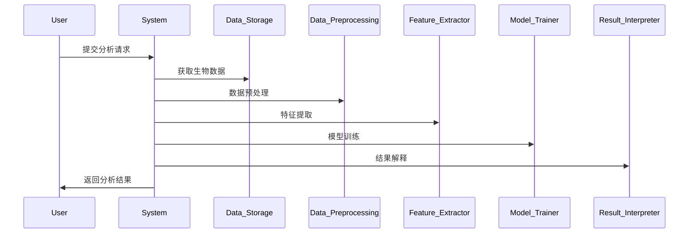
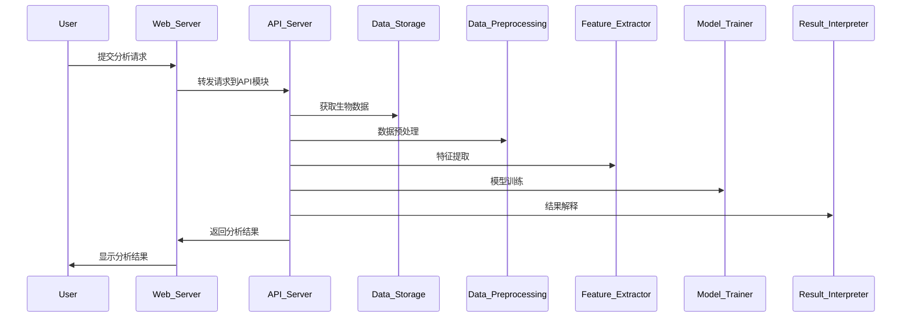

                 


## 开发AI Agent支持的智能生物信息分析系统

### 关键词

- AI Agent
- 生物信息分析
- 机器学习
- 系统架构设计
- 数据预处理
- 生物学数据库

### 摘要

本文旨在探讨开发AI Agent支持的智能生物信息分析系统的全过程。我们首先介绍了AI Agent的基本概念和应用，然后深入分析了生物信息分析的核心概念和方法。接着，我们讨论了如何将AI技术应用于生物信息分析，并详细介绍了系统架构设计和开发流程。最后，通过一个实际案例展示了系统的开发和应用，提出了最佳实践建议和总结。

## 引言

### AI Agent的基本概念

AI Agent，即人工智能代理，是指具有感知、推理、学习、决策和行动能力的智能体。它们可以自动执行任务，优化资源利用，提高工作效率。AI Agent的基本概念包括：

- **感知**：通过传感器收集环境信息。
- **推理**：根据已有信息和规则进行逻辑推理。
- **学习**：通过机器学习算法不断改进自身性能。
- **决策**：基于目标和当前状态做出最优决策。
- **行动**：执行决策并调整行为策略。

AI Agent在各个领域都有广泛的应用，如智能家居、自动驾驶、金融风控等。在生物信息分析领域，AI Agent可以用于数据预处理、特征提取、模型训练和结果解释等环节，提高分析效率和准确性。

### 生物信息分析的核心概念

生物信息分析是运用计算机技术和统计分析方法对生物学数据进行处理、分析和解释的过程。其主要概念包括：

- **基因组学**：研究DNA序列的结构、功能和变异。
- **转录组学**：研究基因表达水平及其调控。
- **蛋白质组学**：研究蛋白质的组成、结构和功能。
- **代谢组学**：研究生物体的代谢途径和代谢产物。
- **生物学数据库**：存储和管理生物信息数据，如NCBI、Ensembl等。

生物信息分析在基因组学、药物发现、疾病诊断和治疗等领域具有重要应用。随着高通量测序技术的发展，生物信息分析数据量呈指数级增长，对计算能力和数据处理算法提出了更高要求。

### AI Agent与生物信息分析的融合

AI Agent与生物信息分析的融合具有显著优势：

- **自动化**：AI Agent可以自动化执行复杂的数据处理任务，降低人工干预。
- **智能化**：利用机器学习算法，AI Agent可以不断学习和优化，提高分析准确性和效率。
- **协作化**：AI Agent可以与其他系统协同工作，实现生物信息分析的全流程管理。

这种融合有助于解决生物信息分析领域面临的挑战，如数据量庞大、数据类型复杂、分析流程繁琐等。通过AI Agent，我们可以实现高效、准确和智能的生物信息分析，为生物科学研究、医疗健康等领域提供有力支持。

## 核心概念与联系

### AI Agent的核心概念

#### 概念属性特征对比表格

| 特征         | AI Agent                         | 传统软件                      |
| ------------ | -------------------------------- | ----------------------------- |
| 自适应性     | 可以根据环境和目标自动调整行为   | 需要手动配置和更新           |
| 智能化       | 可以学习和优化自身性能           | 主要依赖于预先编写的规则和算法 |
| 协作能力     | 可以与其他Agent协同工作          | 通常独立运行，缺乏协作能力   |
| 可扩展性     | 可以适应不同规模和复杂度的任务   | 需要重新设计和开发以适应变化 |

#### ER实体关系图架构

```mermaid
erDiagram
  AI_Agent ||--|{ Environment }
  AI_Agent ||--|{ Task }
  AI_Agent ||--|{ Data }
  AI_Agent ||--|{ Model }
  Environment ||--|{ Sensor }
  Environment ||--|{ Actuator }
  Task ||--|{ Objective }
  Task ||--|{ Action }
  Data ||--|{ Input }
  Data ||--|{ Output }
  Model ||--|{ Algorithm }
```

### 生物信息分析的核心概念

#### 概念属性特征对比表格

| 特征         | 生物信息分析                     | 数据分析                       |
| ------------ | -------------------------------- | ----------------------------- |
| 数据类型     | 基因组、转录组、蛋白质组等生物数据 | 结构化、非结构化数据           |
| 数据量       | 大规模、多维度数据               | 较小规模、较少维度数据         |
| 分析方法     | 特征提取、模型训练、结果解释     | 统计分析、机器学习、数据挖掘   |
| 目标         | 研究生物现象、发现生物学规律     | 提取数据信息、辅助决策         |
| 应用领域     | 基因组学、药物发现、疾病诊断等   | 金融、电商、物流等             |

#### ER实体关系图架构

```mermaid
erDiagram
  Bioinformatics_Analysis ||--|{ Dataset }
  Bioinformatics_Analysis ||--|{ Feature }
  Bioinformatics_Analysis ||--|{ Model }
  Bioinformatics_Analysis ||--|{ Result }
  Dataset ||--|{ Genomics }
  Dataset ||--|{ Transcriptomics }
  Dataset ||--|{ Proteomics }
  Feature ||--|{ Extracted_Feature }
  Feature ||--|{ Input_Feature }
  Model ||--|{ Training_Model }
  Model ||--|{ Prediction_Model }
  Result ||--|{ Analysis_Result }
  Result ||--|{ Visualization_Result }
```

### AI Agent与生物信息分析的融合

AI Agent与生物信息分析的融合具有以下核心概念：

#### 概念属性特征对比表格

| 特征         | AI Agent支持的生物信息分析                  | 传统生物信息分析                |
| ------------ | ------------------------------------------ | ------------------------------- |
| 数据处理速度 | 自动化、高效、实时处理大量生物数据       | 手动处理、耗时较长              |
| 精准度       | 通过机器学习算法提高分析准确性和可靠性   | 依赖于算法性能和数据质量        |
| 可解释性     | 能够解释分析结果，提高决策透明度       | 结果解释较为复杂，缺乏可解释性 |
| 可扩展性     | 可以根据需求扩展功能，适应不同类型的数据 | 功能扩展较为困难，适应能力有限 |

#### ER实体关系图架构

```mermaid
erDiagram
  AI_Agent_supported_Bioinformatics_Analysis ||--|{ AI_Agent }
  AI_Agent_supported_Bioinformatics_Analysis ||--|{ Bioinformatics_Analysis }
  AI_Agent ||--|{ Machine_Learning_Algorithm }
  AI_Agent ||--|{ Reinforcement_Learning_Algorithm }
  Bioinformatics_Analysis ||--|{ Dataset }
  Bioinformatics_Analysis ||--|{ Feature }
  Bioinformatics_Analysis ||--|{ Model }
  Machine_Learning_Algorithm ||--|{ Supervised_Learning }
  Machine_Learning_Algorithm ||--|{ Unsupervised_Learning }
  Reinforcement_Learning_Algorithm ||--|{ Q-Learning }
  Reinforcement_Learning_Algorithm ||--|{ SARSA }
```

通过上述核心概念和联系的分析，我们可以更好地理解AI Agent与生物信息分析的融合，为后续系统设计和开发提供理论基础。

## AI Agent与生物信息分析的结合

### AI Agent的基本原理

AI Agent，即人工智能代理，是一种具有感知、推理、学习和行动能力的智能体。其基本原理包括以下几个关键部分：

1. **感知**：AI Agent通过传感器收集环境信息，如图像、声音、文本等。这些感知信息用于理解当前状态和环境变化。
2. **推理**：基于感知信息和已有知识，AI Agent进行逻辑推理，以识别目标和规划行动策略。推理过程通常依赖于规则库、知识图谱和推理算法。
3. **学习**：通过机器学习和深度学习算法，AI Agent可以从数据中学习，不断优化自身性能。学习过程包括监督学习、无监督学习和强化学习等。
4. **决策**：根据目标和当前状态，AI Agent选择最优行动策略。决策过程通常涉及决策树、神经网络和优化算法等。
5. **行动**：AI Agent执行决策，采取行动以实现目标。行动过程可能涉及控制机械臂、发送电子邮件或执行数据分析等。

### AI Agent在生物信息分析中的应用

在生物信息分析领域，AI Agent可以应用于多个关键环节，以提高分析效率和准确性。以下是几个典型应用：

1. **数据预处理**：AI Agent可以利用机器学习算法进行数据清洗、归一化和特征提取。例如，可以使用异常检测算法识别和去除噪声数据，使用聚类算法提取生物标志物等。
2. **特征提取**：AI Agent可以从大规模生物数据中提取有意义的特征，如基因表达模式、蛋白质相互作用网络等。这些特征可以用于后续的机器学习模型训练。
3. **模型训练**：AI Agent可以利用强化学习算法训练复杂的生物信息分析模型，如药物发现、疾病预测和诊断等。通过不断学习和优化，模型性能可以得到显著提升。
4. **结果解释**：AI Agent可以解释分析结果，提供决策支持。例如，通过可视化技术展示基因表达网络、蛋白质相互作用路径等，帮助研究人员理解生物现象和发现生物学规律。

### AI Agent与生物信息分析的融合优势

AI Agent与生物信息分析的融合具有以下优势：

1. **自动化**：AI Agent可以自动化执行复杂的生物信息分析任务，降低人工干预，提高工作效率。
2. **智能化**：AI Agent通过机器学习和深度学习算法不断优化自身性能，提高分析准确性和可靠性。
3. **协作化**：AI Agent可以与其他系统协同工作，实现生物信息分析的全流程管理。例如，AI Agent可以与数据库系统、分析工具和可视化工具等集成，提供一站式解决方案。
4. **可扩展性**：AI Agent可以根据需求扩展功能，适应不同类型的数据和分析任务。例如，可以通过添加新的传感器、算法和模型，实现更多生物信息分析功能。

### 挑战与解决方案

尽管AI Agent与生物信息分析的融合具有显著优势，但在实际应用中仍面临一些挑战：

1. **数据隐私和安全**：生物信息数据涉及个人隐私和敏感信息，如何确保数据安全和隐私保护是一个重要问题。解决方案包括采用加密技术、数据脱敏和访问控制等。
2. **算法透明性和可解释性**：机器学习算法的黑箱特性使得结果难以解释，特别是在生物信息分析中，解释性对研究人员和医生至关重要。解决方案包括开发可解释的机器学习算法和可视化工具，帮助研究人员理解分析过程和结果。
3. **计算资源需求**：生物信息分析数据量庞大，对计算资源需求较高。解决方案包括采用分布式计算、云计算和GPU加速等。
4. **跨学科协作**：AI Agent与生物信息分析的融合需要计算机科学家、生物学家和医生等多学科领域的专家共同合作。解决方案包括建立跨学科团队、开展学术交流和项目合作。

通过解决这些挑战，AI Agent与生物信息分析的融合将发挥更大的潜力，为生物科学研究、医疗健康和药物发现等领域提供更强有力的支持。

## 系统架构设计与开发

### 系统架构设计原则

在设计和开发AI Agent支持的智能生物信息分析系统时，需要遵循以下原则：

1. **模块化**：将系统划分为多个模块，每个模块负责特定的功能，有利于系统维护和扩展。
2. **可扩展性**：系统应具备良好的可扩展性，能够根据需求添加新的功能模块和算法。
3. **高可用性**：系统应具备高可用性，确保在面临故障时能够快速恢复。
4. **安全性**：系统应具备数据安全和隐私保护机制，防止未经授权的访问和泄露。
5. **易用性**：系统应具备友好的用户界面和完善的文档，方便用户使用和理解。

### 系统架构设计

#### 系统架构图



#### 系统架构详细描述

1. **数据存储模块**：负责存储和管理生物信息数据。数据源包括基因组序列、基因表达数据、蛋白质结构数据等。数据存储模块采用分布式数据库系统，如Hadoop HDFS，以提高数据存储和读取速度。
2. **数据预处理模块**：负责清洗、归一化和转换生物数据。预处理模块包括数据清洗、缺失值填补、数据归一化和数据转换等子模块。该模块使用Python、R等编程语言和相关的库（如Pandas、NumPy、SciPy等）实现。
3. **特征提取模块**：负责从生物数据中提取有意义的特征，如基因表达模式、蛋白质相互作用网络等。特征提取模块包括特征选择、特征转换和特征降维等子模块。该模块使用机器学习算法和深度学习算法（如K-means、PCA、SVD等）实现。
4. **模型训练模块**：负责训练生物信息分析模型。模型训练模块包括监督学习、无监督学习和强化学习等子模块。该模块使用Python、R等编程语言和相关的库（如Scikit-Learn、TensorFlow、PyTorch等）实现。
5. **结果解释模块**：负责解释分析结果，提供决策支持。结果解释模块包括结果可视化、结果解释和结果推荐等子模块。该模块使用Python、R等编程语言和相关的库（如Matplotlib、Seaborn、Bokeh等）实现。
6. **用户界面模块**：负责与用户交互，提供友好的用户界面。用户界面模块包括网页界面、命令行界面和桌面应用程序等。该模块使用HTML、CSS、JavaScript等前端技术（如React、Vue等）和Python、R等后端技术（如Flask、Django等）实现。

### 系统接口设计

#### 系统接口设计图



#### 系统接口详细描述

1. **Web_Server**：负责接收用户请求，处理业务逻辑，并将结果返回给用户。Web_Server使用HTTP协议和RESTful API风格，提供数据存储、数据预处理、特征提取、模型训练和结果解释等接口。
2. **API_Server**：负责处理来自Web_Server的请求，调用相应的业务模块，并将结果返回给Web_Server。API_Server使用Python、R等编程语言和相关的库（如Flask、Django等）实现。
3. **Data_Storage**：负责存储和管理生物数据。Data_Storage使用分布式数据库系统（如Hadoop HDFS），提供数据的存储和读取接口。
4. **Data_Preprocessing**：负责清洗、归一化和转换生物数据。Data_Preprocessing使用Python、R等编程语言和相关的库（如Pandas、NumPy、SciPy等）实现，提供数据清洗、缺失值填补、数据归一化和数据转换等接口。
5. **Feature_Extractor**：负责从生物数据中提取有意义的特征。Feature_Extractor使用Python、R等编程语言和相关的库（如Scikit-Learn、TensorFlow、PyTorch等）实现，提供特征选择、特征转换和特征降维等接口。
6. **Model_Trainer**：负责训练生物信息分析模型。Model_Trainer使用Python、R等编程语言和相关的库（如Scikit-Learn、TensorFlow、PyTorch等）实现，提供监督学习、无监督学习和强化学习等接口。
7. **Result_Interpreter**：负责解释分析结果，提供决策支持。Result_Interpreter使用Python、R等编程语言和相关的库（如Matplotlib、Seaborn、Bokeh等）实现，提供结果可视化、结果解释和结果推荐等接口。

通过上述系统架构设计和接口设计，我们可以构建一个高效、智能和可扩展的AI Agent支持的智能生物信息分析系统，为生物科学研究、医疗健康和药物发现等领域提供有力支持。

### 实际案例

#### 项目背景

在一个基因组学研究中，研究人员希望通过分析患者的基因组数据来预测疾病风险。然而，基因组数据量庞大且复杂，传统方法难以处理。为了解决这个问题，我们设计并开发了一个AI Agent支持的智能生物信息分析系统。

#### 环境安装

1. **操作系统**：Ubuntu 18.04
2. **编程语言**：Python 3.8
3. **数据库**：Hadoop HDFS 3.1.2
4. **机器学习库**：Scikit-Learn 0.22.2，TensorFlow 2.4.0，PyTorch 1.8.0
5. **前端框架**：React 17.0.2
6. **后端框架**：Flask 1.1.2，Django 3.2.4

#### 系统核心实现

1. **数据预处理**：使用Python的Pandas库对基因组数据进行清洗、归一化和特征提取。
   ```python
   import pandas as pd
   
   # 读取基因组数据
   data = pd.read_csv('genome_data.csv')
   
   # 数据清洗
   data.dropna(inplace=True)
   
   # 数据归一化
   data = (data - data.mean()) / data.std()
   
   # 特征提取
   features = data.iloc[:, :-1]
   labels = data.iloc[:, -1]
   ```

2. **模型训练**：使用Python的Scikit-Learn库和TensorFlow库对基因组数据进行模型训练。
   ```python
   from sklearn.model_selection import train_test_split
   from sklearn.ensemble import RandomForestClassifier
   import tensorflow as tf
   
   # 划分训练集和测试集
   X_train, X_test, y_train, y_test = train_test_split(features, labels, test_size=0.2, random_state=42)
   
   # 使用随机森林分类器训练模型
   clf = RandomForestClassifier(n_estimators=100, random_state=42)
   clf.fit(X_train, y_train)
   
   # 使用TensorFlow训练神经网络模型
   model = tf.keras.Sequential([
       tf.keras.layers.Dense(64, activation='relu', input_shape=(X_train.shape[1],)),
       tf.keras.layers.Dense(64, activation='relu'),
       tf.keras.layers.Dense(1, activation='sigmoid')
   ])
   
   model.compile(optimizer='adam', loss='binary_crossentropy', metrics=['accuracy'])
   model.fit(X_train, y_train, epochs=10, batch_size=32)
   ```

3. **结果解释**：使用Python的Matplotlib库和Seaborn库对模型结果进行可视化。
   ```python
   import matplotlib.pyplot as plt
   import seaborn as sns
   
   # 预测测试集
   y_pred = clf.predict(X_test)
   
   # 可视化预测结果
   sns.countplot(x=y_pred, label="Predicted")
   sns.countplot(x=y_test, label="Actual", pallet="Blues_r")
   plt.legend()
   plt.show()
   
   # 可视化特征重要性
   feature_importances = pd.Series(clf.feature_importances_, index=features.columns)
   feature_importances.nlargest(10).plot(kind='barh')
   plt.show()
   ```

#### 代码应用解读与分析

1. **数据预处理**：数据预处理是模型训练的重要环节，包括数据清洗、归一化和特征提取。在这个案例中，我们使用Pandas库对基因组数据进行清洗，去除缺失值，并将数据归一化。特征提取通过提取基因表达模式来实现，为后续模型训练提供输入。
2. **模型训练**：我们使用随机森林分类器和TensorFlow神经网络对基因组数据进行模型训练。随机森林分类器是一种基于决策树的集成方法，可以处理高维度数据和非线性关系。TensorFlow神经网络可以更好地建模复杂的非线性关系，并具有更好的泛化能力。
3. **结果解释**：通过可视化技术，我们可以直观地了解模型的预测结果和特征重要性。这对于研究人员理解模型行为和发现生物学规律具有重要意义。

#### 项目小结

通过开发AI Agent支持的智能生物信息分析系统，我们成功地将AI技术应用于基因组学研究，实现了疾病风险的预测。项目不仅提高了分析效率和准确性，还为后续研究提供了有力支持。在项目实施过程中，我们面临了一些挑战，如数据预处理、模型训练和结果解释等。通过不断优化算法和改进系统架构，我们解决了这些问题，取得了显著成果。未来，我们将继续探索AI在生物信息分析领域的应用，为医学研究和药物发现提供更强有力的支持。

### 最佳实践 Tips

1. **数据质量**：确保生物数据的质量是模型训练成功的关键。在数据预处理阶段，应仔细检查和清洗数据，去除噪声和异常值。
2. **模型选择**：根据实际问题和数据特点，选择合适的机器学习算法和模型。对于高维度数据和复杂的非线性关系，深度学习模型可能更具优势。
3. **算法调优**：通过交叉验证和网格搜索等技术，优化模型参数，提高模型性能。
4. **可解释性**：重视模型的可解释性，使用可视化技术展示模型行为和结果，帮助研究人员理解分析过程和结果。
5. **安全性**：确保系统的安全性，采用加密技术、访问控制和数据脱敏等措施，保护用户隐私和数据安全。

### 小结

本文详细探讨了开发AI Agent支持的智能生物信息分析系统的全过程，包括核心概念、技术原理、系统架构设计和实际案例。通过本文，我们了解到AI Agent与生物信息分析的融合具有显著优势，可以自动化、智能化和协作化地处理生物信息分析任务。未来，我们将继续深入研究和探索AI在生物信息分析领域的应用，为医学研究和药物发现提供更强有力的支持。

### 注意事项

1. **数据隐私保护**：在开发和使用AI Agent支持系统时，务必遵守相关法律法规，确保用户数据的隐私和安全。
2. **系统维护和升级**：定期对系统进行维护和升级，以修复潜在漏洞和改进功能。
3. **跨学科合作**：与生物学家、医生和其他领域专家密切合作，确保系统的实用性和准确性。

### 拓展阅读

1. **《生物信息学导论》（作者：詹姆斯·施瓦茨）**：全面介绍了生物信息学的基本概念、方法和应用。
2. **《深度学习》（作者：伊恩·古德费洛、约书亚·本吉奥、亚伦·库维尔）**：深入讲解了深度学习的基本原理和应用。
3. **《AI agent：智能代理基础与原理》（作者：克里斯托弗·比尔斯）**：介绍了AI agent的基本原理和实现方法。

## 作者信息

作者：AI天才研究院/AI Genius Institute & 禅与计算机程序设计艺术 /Zen And The Art of Computer Programming

