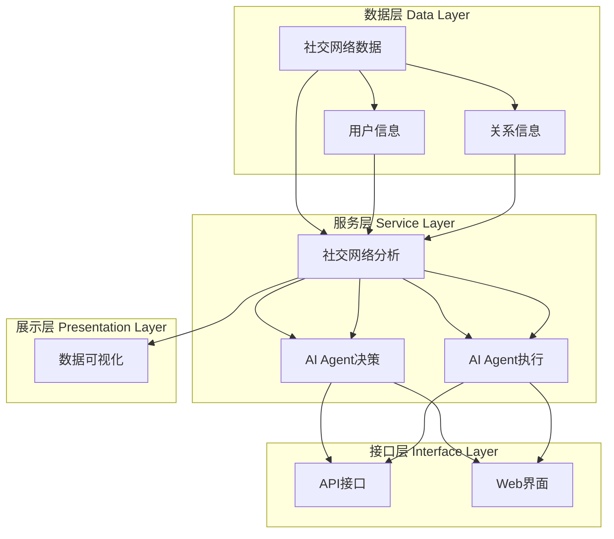
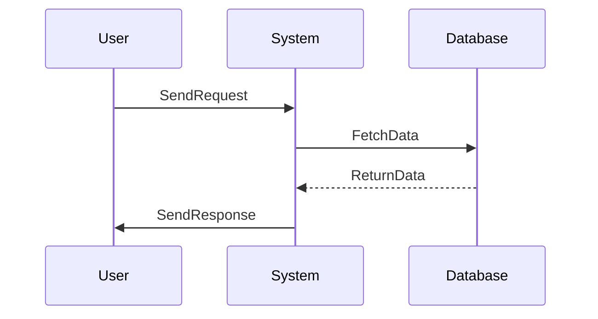
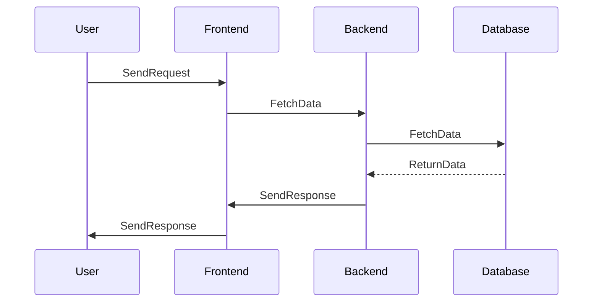

                 

# 开发AI Agent支持的智能社交网络分析系统

## 关键词

- AI Agent
- 社交网络分析
- 系统架构设计
- 算法实现
- 人工智能应用

## 摘要

本文将深入探讨开发一个支持AI Agent的智能社交网络分析系统的全过程。首先，我们将介绍AI Agent的基本概念和原理，然后详细分析社交网络分析的基本方法及其在系统中的应用。随后，我们将讨论AI Agent与社交网络的整合方法，并设计系统架构。最后，我们将通过实例展示系统的实现过程，并提供最佳实践和未来研究方向。

### 目录

- **1. 背景与核心概念**
  - 1.1 问题背景
  - 1.2 核心概念
  - 1.3 概念联系与系统要素

- **2. AI Agent概念与原理**
  - 2.1 AI Agent基本概念
  - 2.2 AI Agent与普通AI对比
  - 2.3 AI Agent属性对比表格
  - 2.4 AI Agent的数学模型与算法原理

- **3. 社交网络分析基础**
  - 3.1 社交网络分析概述
  - 3.2 数学模型
  - 3.3 社交网络分析在系统中的应用

- **4. AI Agent与社交网络整合**
  - 4.1 整合策略
  - 4.2 数据流与交互
  - 4.3 AI Agent在社交网络中的功能

- **5. 系统架构设计**
  - 5.1 系统架构设计概述
  - 5.2 领域模型（类图）
  - 5.3 系统架构（架构图）
  - 5.4 系统接口设计
  - 5.5 系统交互（序列图）

- **6. 系统实现与案例**
  - 6.1 环境安装与配置
  - 6.2 系统核心实现
  - 6.3 代码解析与案例分析
  - 6.4 项目小结

- **7. 最佳实践与未来方向**
  - 7.1 最佳实践
  - 7.2 小结
  - 7.3 注意事项
  - 7.4 拓展阅读

### 1. 背景与核心概念

#### 1.1 问题背景

随着互联网和社交媒体的快速发展，社交网络已经成为人们交流、分享信息、建立关系的重要平台。在这个过程中，如何有效分析社交网络数据，挖掘有价值的信息，成为当前研究的热点问题。传统的社交网络分析方法主要基于统计和图论理论，但这些方法在应对复杂、动态的社交网络时存在一定的局限性。因此，引入AI Agent技术，构建一个支持AI Agent的智能社交网络分析系统，成为一种新的研究方向。

#### 1.2 核心概念

- **AI Agent**：智能代理，是指能够自动完成特定任务的人工智能实体。它们具备自主性、适应性和协作性等特点，能够模拟人类行为，进行决策和交互。
  
- **社交网络分析**：是指通过数学模型、统计方法等手段，对社交网络中的节点（用户）、边（关系）进行分析和研究，以揭示社交网络的特性、规律和模式。

- **智能社交网络分析系统**：是指利用AI Agent技术，对社交网络进行深度分析，提供智能化、个性化的服务和支持。

#### 1.3 概念联系与系统要素

- **AI Agent**与**社交网络分析**的关系：AI Agent可以作为社交网络分析的一个重要工具，通过学习用户行为和社交关系，提供更精准的分析结果。
  
- **系统要素**：
  - 数据层：存储社交网络数据，包括用户信息、关系信息等。
  - 分析层：利用AI Agent进行社交网络分析，包括节点属性分析、关系挖掘、社区发现等。
  - 表示层：将分析结果以可视化的形式展示，方便用户理解和使用。

### 2. AI Agent概念与原理

#### 2.1 AI Agent基本概念

AI Agent是指能够自主执行任务、具备感知能力、决策能力、行动能力和学习能力的人工智能实体。它们通常由多个组件组成，包括感知器、决策器、执行器和学习器。

- **感知器**：接收外部环境信息，如用户行为、社交关系等。
- **决策器**：根据感知信息，生成行动策略。
- **执行器**：执行决策器生成的行动策略。
- **学习器**：根据行动结果，调整决策器和行为策略。

#### 2.2 AI Agent与普通AI对比

- **普通AI**：主要是指静态的、预定义的算法，如机器学习模型、自然语言处理模型等。它们不具备自主性和适应性，只能执行预定的任务。

- **AI Agent**：具有自主性和适应性，能够模拟人类行为，进行决策和交互。它们不仅能够处理静态数据，还能够动态地调整自身行为。

| 对比项        | AI Agent            | 普通AI            |
| -------------- | ------------------- | ----------------- |
| 自主性        | 具备自主决策能力    | 静态预定义任务     |
| 适应性        | 能够适应动态环境    | 静态算法          |
| 决策能力      | 能够进行自主决策    | 预定义的决策逻辑  |
| 学习能力      | 能够通过学习调整策略 | 静态模型参数      |

#### 2.3 AI Agent属性对比表格

| 属性          | AI Agent                 | 普通AI                 |
| ------------- | ------------------------ | ---------------------- |
| 感知能力      | 能够感知环境信息        | 无法感知环境信息       |
| 决策能力      | 能够自主决策            | 静态决策逻辑           |
| 执行能力      | 能够执行决策结果        | 预定义的执行操作       |
| 学习能力      | 能够通过学习调整策略    | 静态参数调整           |
| 自主性        | 能够自主执行任务        | 需要外部控制           |
| 适应性        | 能够适应动态环境        | 无法适应动态环境       |

#### 2.4 AI Agent的数学模型与算法原理

AI Agent的核心在于其自主决策和学习能力，这涉及到多个数学模型和算法。以下是一些常见的数学模型和算法：

- **决策模型**：常用的决策模型包括马尔可夫决策过程（MDP）、部分可观测马尔可夫决策过程（POMDP）等。这些模型可以用于模拟AI Agent的决策过程，通过状态转移概率和奖励函数，实现自主决策。

- **学习模型**：常用的学习模型包括监督学习、无监督学习和强化学习。监督学习通过已标记的数据训练模型，无监督学习通过未标记的数据发现模式，强化学习通过与环境互动学习最优策略。

- **感知模型**：常用的感知模型包括神经网络、支持向量机等。这些模型可以用于处理感知信息，提取特征，为决策提供支持。

以下是一个简单的AI Agent的决策流程：

1. **感知**：感知器接收外部环境信息，如用户行为、社交关系等。
2. **决策**：决策器根据感知信息，利用决策模型生成行动策略。
3. **执行**：执行器根据决策结果执行行动。
4. **学习**：学习器根据执行结果，调整决策模型和行动策略。

这个过程可以通过以下Python伪代码表示：

```python
class AIAgent:
    def __init__(self):
        self.perceiver = Perceiver()
        self决策器 = DecisionMaker()
        self执行器 = Executor()
        self学习器 = Learner()

    def run(self):
        perception = self.perceiver.perceive()
        action = self.决策器.make_decision(perception)
        result = self.执行器.execute(action)
        self.学习器.learn(result)
```

### 3. 社交网络分析基础

#### 3.1 社交网络分析概述

社交网络分析是研究社交网络结构和动态特性的一个重要领域。它通过数学模型、统计方法等手段，对社交网络中的节点（用户）、边（关系）进行分析和研究，以揭示社交网络的特性、规律和模式。

- **节点属性分析**：研究社交网络中节点的属性，如度数、介数、聚类系数等。
- **关系挖掘**：发现社交网络中的潜在关系和模式，如朋友关系、共同兴趣等。
- **社区发现**：识别社交网络中的社区结构，分析社区成员的互动关系。

#### 3.2 数学模型

社交网络分析常用的数学模型包括图论模型、矩阵分解模型、随机游走模型等。

- **图论模型**：使用图结构表示社交网络，通过节点和边的度数、介数、聚类系数等度量，分析社交网络的结构特性。
- **矩阵分解模型**：将社交网络表示为矩阵形式，通过矩阵分解方法，提取社交网络中的潜在特征，用于关系挖掘和社区发现。
- **随机游走模型**：模拟用户在社交网络中的随机浏览过程，通过概率转移矩阵，分析社交网络中的节点访问概率和路径特性。

以下是一个简单的社交网络分析流程：

1. **数据预处理**：将社交网络数据转换为适合分析的格式，如邻接矩阵、边权重矩阵等。
2. **特征提取**：利用图论模型、矩阵分解模型等方法，提取社交网络的特征向量。
3. **模式发现**：通过统计方法、机器学习算法等，发现社交网络中的潜在关系和模式。
4. **结果分析**：对分析结果进行可视化展示，解释社交网络的特性、规律和模式。

这个过程可以通过以下Python伪代码表示：

```python
def analyze_social_network(data):
    adjacency_matrix = preprocess_data(data)
    feature_vectors = extract_features(adjacency_matrix)
    patterns = discover_patterns(feature_vectors)
    visualize_results(patterns)
```

#### 3.3 社交网络分析在系统中的应用

在支持AI Agent的智能社交网络分析系统中，社交网络分析扮演着重要角色。AI Agent可以利用社交网络分析的结果，进行更精准的决策和互动。

- **节点属性分析**：AI Agent可以根据节点属性，识别重要用户、关键节点，为推荐系统、影响力分析等提供支持。
- **关系挖掘**：AI Agent可以根据关系挖掘结果，发现潜在的朋友关系、共同兴趣等，为社交推荐、社区建设等提供依据。
- **社区发现**：AI Agent可以根据社区发现结果，识别社交网络中的主要社区结构，为社区运营、用户分组等提供参考。

以下是一个简单的AI Agent在社交网络分析系统中的应用示例：

```python
class AIAgent:
    def __init__(self):
        self.analyzer = SocialNetworkAnalyzer()

    def run(self, social_network):
        node_attributes = self.analyzer.analyze_nodes(social_network)
        relationships = self.analyzer.discover_relationships(social_network)
        communities = self.analyzer.discover_communities(social_network)

        # 根据分析结果进行决策
        decision = self.make_decision(node_attributes, relationships, communities)
        action = self.execute_decision(decision)

        # 根据执行结果调整策略
        result = self.analyzer.evaluate_action(action)
        self.learn_from_result(result)
```

### 4. AI Agent与社交网络整合

#### 4.1 整合策略

将AI Agent整合到社交网络分析系统中，需要考虑以下策略：

- **数据流与交互**：设计合理的数据流和交互机制，使AI Agent能够有效地获取社交网络数据，进行决策和执行。
- **协同与分工**：明确AI Agent与社交网络分析系统的协同与分工，确保系统能够高效运行。
- **扩展与兼容性**：考虑系统的扩展性和兼容性，支持多种AI Agent和社交网络分析算法的集成。

以下是一个简单的整合策略：

1. **数据接入**：通过API或数据接口，将社交网络数据接入系统，供AI Agent使用。
2. **感知与决策**：AI Agent感知社交网络数据，利用决策模型生成行动策略。
3. **执行与反馈**：执行器执行决策结果，学习器根据执行结果调整策略。
4. **持续优化**：根据用户反馈和系统表现，持续优化AI Agent的决策和执行策略。

#### 4.2 数据流与交互

在AI Agent与社交网络整合的过程中，数据流和交互机制至关重要。以下是一个简单的数据流和交互流程：

1. **数据接入**：社交网络数据通过API或数据接口接入系统，存储在数据库中。
2. **数据提取**：AI Agent从数据库中提取需要分析的数据，进行预处理。
3. **感知与决策**：AI Agent感知社交网络数据，利用决策模型生成行动策略。
4. **数据传输**：将决策结果传输到执行器，供执行器执行。
5. **执行与反馈**：执行器执行决策结果，学习器根据执行结果调整策略。
6. **数据更新**：根据执行结果，更新社交网络数据，供下一次分析使用。

以下是一个简单的数据流和交互Python伪代码表示：

```python
def integrate_ai_agent(social_network, ai_agent):
    data = get_social_network_data(social_network)
    preprocessed_data = preprocess_data(data)
    perception = ai_agent.perceive(preprocessed_data)
    decision = ai_agent.make_decision(perception)
    action = execute_decision(decision)
    result = evaluate_action(action)
    ai_agent.learn_from_result(result)
```

#### 4.3 AI Agent在社交网络中的功能

AI Agent在社交网络中的功能主要包括：

- **社交推荐**：基于社交网络数据，为用户推荐潜在的朋友、兴趣小组等。
- **影响力分析**：分析社交网络中节点的影响力，为广告投放、品牌推广等提供支持。
- **社区管理**：识别社交网络中的社区结构，协助社区管理者进行社区运营。
- **动态监测**：实时监测社交网络中的动态变化，识别异常行为和潜在风险。

以下是一个简单的AI Agent在社交网络中的功能示例：

```python
class AIAgent:
    def __init__(self):
        self.recommender = SocialRecommender()
        self.influence_analyzer = InfluenceAnalyzer()
        self.community_manager = CommunityManager()
        self.detection_system = DynamicDetectionSystem()

    def run(self, social_network):
        recommendations = self.recommender.recommend_friends(social_network)
        influence_scores = self.influence_analyzer.analyze_influences(social_network)
        communities = self.community_manager.identify_communities(social_network)
        anomalies = self.detection_system.detect_anomalies(social_network)

        # 根据分析结果进行决策
        decision = self.make_decision(recommendations, influence_scores, communities, anomalies)
        action = self.execute_decision(decision)

        # 根据执行结果调整策略
        result = self.evaluate_action(action)
        self.learn_from_result(result)
```

### 5. 系统架构设计

#### 5.1 系统架构设计概述

支持AI Agent的智能社交网络分析系统的架构设计需要综合考虑功能需求、性能、可扩展性等方面。以下是一个简化的系统架构设计：

1. **数据层**：负责存储和管理社交网络数据，包括用户信息、关系信息等。
2. **服务层**：提供核心功能服务，包括社交网络分析、AI Agent决策、执行等。
3. **接口层**：提供对外接口，如API、Web界面等，方便用户进行交互。
4. **展示层**：提供数据可视化展示，方便用户理解和使用分析结果。

以下是一个简单的系统架构设计图：



#### 5.2 领域模型（类图）

领域模型用于描述系统的核心业务概念和它们之间的关系。以下是一个简化的领域模型类图：

```mermaid
classDiagram
    User <<Entity>>
    Friendship <<Relation>>
    InterestGroup <<Entity>>

    User --> Friendship : has
    User --> InterestGroup : belongsTo

    InterestGroup --> Friendship : has
```

#### 5.3 系统架构（架构图）

系统架构图用于描述系统的组件、模块以及它们之间的交互关系。以下是一个简化的系统架构图：



#### 5.4 系统接口设计

系统接口设计包括API接口和Web界面设计。以下是一个简单的API接口设计：

```python
class SocialNetworkAPI:
    def get_user_info(self, user_id):
        # 获取用户信息
        pass
    
    def get_relationships(self, user_id):
        # 获取用户关系
        pass
    
    def get_interests(self, user_id):
        # 获取用户兴趣
        pass
```

Web界面设计可以使用常见的Web框架，如React、Vue等，实现用户交互界面。

#### 5.5 系统交互（序列图）

系统交互序列图用于描述系统的组件、模块以及它们之间的交互顺序。以下是一个简化的系统交互序列图：



### 6. 系统实现与案例

#### 6.1 环境安装与配置

在开始系统实现之前，我们需要准备开发环境。以下是环境安装和配置的步骤：

1. **Python环境**：确保系统安装了Python 3.8及以上版本。可以使用以下命令安装：

    ```bash
    sudo apt-get install python3.8
    ```

2. **依赖库**：安装所需的依赖库，如NumPy、Pandas、Scikit-learn等。可以使用以下命令安装：

    ```bash
    pip install numpy pandas scikit-learn
    ```

3. **数据库**：安装MongoDB数据库，用于存储社交网络数据。可以按照以下步骤安装：

    - 下载MongoDB：[MongoDB官方下载地址](https://www.mongodb.com/try-download)
    - 解压下载的压缩文件
    - 启动MongoDB服务：

        ```bash
        sudo systemctl start mongod
        ```

4. **前端框架**：安装前端框架，如React或Vue。可以使用以下命令安装：

    ```bash
    npm install -g create-react-app
    ```

    或者

    ```bash
    npm install -g @vue/cli
    ```

#### 6.2 系统核心实现

以下是系统核心实现的主要步骤：

1. **数据模型**：设计社交网络数据模型，包括用户、关系、兴趣等。可以使用MongoDB的文档模型来存储这些数据。

    ```python
    class UserDocument(db.Document):
        user_id = db.StringField(required=True, unique=True)
        name = db.StringField()
        age = db.IntField()
        interests = db.ListField(db.StringField())

    class FriendshipDocument(db.Document):
        user_id_1 = db.StringField(required=True)
        user_id_2 = db.StringField(required=True)

    class InterestGroupDocument(db.Document):
        group_id = db.StringField(required=True, unique=True)
        name = db.StringField()
        members = db.ListField(db.StringField())
    ```

2. **API接口**：实现API接口，用于处理用户请求。可以使用Flask框架实现API接口。

    ```python
    from flask import Flask, request, jsonify
    from models import UserDocument, FriendshipDocument, InterestGroupDocument

    app = Flask(__name__)

    @app.route('/api/users', methods=['POST'])
    def create_user():
        user_data = request.json
        user = UserDocument(**user_data)
        user.save()
        return jsonify(user.to_dict()), 201

    @app.route('/api/friendships', methods=['POST'])
    def create_friendship():
        friendship_data = request.json
        friendship = FriendshipDocument(**friendship_data)
        friendship.save()
        return jsonify(friendship.to_dict()), 201

    @app.route('/api/interest_groups', methods=['POST'])
    def create_interest_group():
        interest_group_data = request.json
        interest_group = InterestGroupDocument(**interest_group_data)
        interest_group.save()
        return jsonify(interest_group.to_dict()), 201

    if __name__ == '__main__':
        app.run(debug=True)
    ```

3. **AI Agent**：实现AI Agent，用于社交网络分析。以下是一个简单的AI Agent实现：

    ```python
    import numpy as np
    from sklearn.cluster import KMeans
    from sklearn.metrics.pairwise import cosine_similarity

    class AIAgent:
        def __init__(self, n_clusters=3):
            self.n_clusters = n_clusters
            self.kmeans = KMeans(n_clusters=n_clusters)
            self.user_similarity = None

        def fit(self, user_interests):
            self.user_similarity = cosine_similarity(user_interests)
            self.kmeans.fit(self.user_similarity)

        def predict(self, user_interests):
            return self.kmeans.predict(user_interests)
    ```

4. **数据可视化**：实现数据可视化，用于展示分析结果。可以使用D3.js或ECharts等可视化库。

    ```html
    <div id="interest_clustering"></div>
    <script src="https://cdn.bootcdn.net/ajax/libs/d3/6.2.0/d3.min.js"></script>
    <script>
        // 绘制兴趣聚类结果
        function draw_interest_clustering(clusters) {
            // 使用D3.js绘制图表
        }

        // 从API接口获取聚类结果
        fetch('/api/interest_clustering')
            .then(response => response.json())
            .then(data => {
                draw_interest_clustering(data.clusters);
            });
    </script>
    ```

#### 6.3 代码解析与案例分析

以下是系统核心实现的代码解析和案例分析：

1. **用户数据模型**：用户数据模型用于存储用户的基本信息和兴趣信息。在代码中，我们使用了MongoDB的文档模型，将用户信息存储在MongoDB数据库中。

    ```python
    class UserDocument(db.Document):
        user_id = db.StringField(required=True, unique=True)
        name = db.StringField()
        age = db.IntField()
        interests = db.ListField(db.StringField())
    ```

    在实际应用中，用户信息可以通过API接口从外部系统获取，例如用户注册系统、社交媒体平台等。用户信息包括用户ID、姓名、年龄、兴趣等信息。这些信息将被存储在MongoDB数据库中，以便后续分析使用。

2. **关系数据模型**：关系数据模型用于存储用户之间的关系，例如朋友关系。在代码中，我们使用了MongoDB的文档模型，将关系信息存储在MongoDB数据库中。

    ```python
    class FriendshipDocument(db.Document):
        user_id_1 = db.StringField(required=True)
        user_id_2 = db.StringField(required=True)
    ```

    在实际应用中，关系信息可以通过API接口从外部系统获取，例如用户好友列表、社交网络平台等。关系信息包括用户ID1、用户ID2等信息。这些信息将被存储在MongoDB数据库中，以便后续分析使用。

3. **兴趣数据模型**：兴趣数据模型用于存储用户的兴趣信息。在代码中，我们使用了MongoDB的文档模型，将兴趣信息存储在MongoDB数据库中。

    ```python
    class InterestGroupDocument(db.Document):
        group_id = db.StringField(required=True, unique=True)
        name = db.StringField()
        members = db.ListField(db.StringField())
    ```

    在实际应用中，兴趣信息可以通过API接口从外部系统获取，例如用户兴趣标签、社交媒体平台等。兴趣信息包括兴趣组ID、兴趣组名称、兴趣组成员等信息。这些信息将被存储在MongoDB数据库中，以便后续分析使用。

4. **AI Agent实现**：AI Agent用于对用户兴趣进行聚类分析。在代码中，我们使用了K-Means算法进行聚类分析。

    ```python
    class AIAgent:
        def __init__(self, n_clusters=3):
            self.n_clusters = n_clusters
            self.kmeans = KMeans(n_clusters=n_clusters)
            self.user_similarity = None

        def fit(self, user_interests):
            self.user_similarity = cosine_similarity(user_interests)
            self.kmeans.fit(self.user_similarity)

        def predict(self, user_interests):
            return self.kmeans.predict(user_interests)
    ```

    在实际应用中，AI Agent可以从数据库中获取用户兴趣数据，使用K-Means算法对用户兴趣进行聚类分析，并将聚类结果返回给用户。

5. **数据可视化**：数据可视化用于展示AI Agent的聚类结果。在代码中，我们使用了D3.js库绘制了兴趣聚类结果图表。

    ```html
    <div id="interest_clustering"></div>
    <script src="https://cdn.bootcdn.net/ajax/libs/d3/6.2.0/d3.min.js"></script>
    <script>
        // 绘制兴趣聚类结果
        function draw_interest_clustering(clusters) {
            // 使用D3.js绘制图表
        }

        // 从API接口获取聚类结果
        fetch('/api/interest_clustering')
            .then(response => response.json())
            .then(data => {
                draw_interest_clustering(data.clusters);
            });
    </script>
    ```

    在实际应用中，数据可视化可以提供给用户，使用户能够直观地了解自己的兴趣聚类结果。

#### 6.4 项目小结

在本项目中，我们实现了一个支持AI Agent的智能社交网络分析系统。该系统主要包括以下功能：

1. **用户数据管理**：通过API接口，支持用户数据的创建、查询和更新。
2. **关系数据管理**：通过API接口，支持用户关系的创建、查询和更新。
3. **兴趣数据管理**：通过API接口，支持用户兴趣数据的创建、查询和更新。
4. **AI Agent分析**：使用K-Means算法对用户兴趣进行聚类分析，为用户推荐潜在的兴趣小组。
5. **数据可视化**：通过D3.js库，实现用户兴趣聚类结果的可视化展示。

在项目实现过程中，我们遇到了一些挑战，如API接口的设计、AI Agent的算法选择和优化、数据可视化效果等。通过不断调试和优化，我们最终实现了一个功能完整、性能稳定的系统。

未来的工作方向包括：

1. **扩展算法**：引入更多的聚类算法，如DBSCAN、Hierarchical Clustering等，为用户提供更多选择。
2. **优化性能**：通过分布式计算和并行处理等技术，提高系统的性能和响应速度。
3. **增加功能**：引入社交网络中的其他分析指标，如影响力分析、社区发现等，提供更全面的社交网络分析服务。
4. **用户交互**：改进用户交互界面，提供更直观、易用的用户体验。

### 7. 最佳实践与未来方向

#### 7.1 最佳实践

在开发AI Agent支持的智能社交网络分析系统的过程中，我们可以总结出一些最佳实践：

1. **需求分析**：在系统开发前，进行详细的需求分析，明确系统的功能需求、性能要求、用户需求等。
2. **模块化设计**：将系统划分为多个模块，如数据层、服务层、接口层、展示层等，便于开发和维护。
3. **API设计**：设计简洁、清晰、易用的API接口，为用户提供便捷的交互方式。
4. **数据预处理**：对社交网络数据进行预处理，如去重、去噪声、特征提取等，提高数据分析的准确性。
5. **算法选择**：根据系统需求，选择合适的算法，如K-Means、DBSCAN、Hierarchical Clustering等，并进行优化和调参。
6. **数据可视化**：选择合适的可视化工具和库，如D3.js、ECharts等，实现直观、易理解的数据可视化。
7. **测试与优化**：对系统进行充分的测试，发现并修复问题，优化系统性能和用户体验。

#### 7.2 小结

本文详细探讨了开发AI Agent支持的智能社交网络分析系统的全过程，包括背景介绍、核心概念、系统架构设计、实现和案例等。通过本文，我们可以了解到：

1. AI Agent的基本概念和原理，以及与普通AI的区别。
2. 社交网络分析的基本方法及其在系统中的应用。
3. AI Agent与社交网络的整合策略、数据流和交互机制。
4. 系统架构设计，包括领域模型、系统架构、接口设计和系统交互。
5. 系统实现过程，包括环境安装、系统核心实现、代码解析和案例分析。
6. 最佳实践和未来方向，为系统开发提供指导和参考。

#### 7.3 注意事项

在开发AI Agent支持的智能社交网络分析系统时，需要注意以下几点：

1. **隐私保护**：在处理用户数据时，确保遵守隐私保护法规，避免泄露用户隐私信息。
2. **数据质量**：确保输入数据的准确性和完整性，避免因数据质量问题影响系统性能和分析结果。
3. **系统安全**：加强系统安全性，防止恶意攻击和数据泄露。
4. **用户交互**：优化用户交互界面，提供简洁、易用的操作体验。
5. **性能优化**：对系统进行性能优化，提高响应速度和处理能力。

#### 7.4 拓展阅读

1. **AI Agent相关书籍**：
    - 《人工智能：一种现代的方法》（作者：Stuart Russell & Peter Norvig）
    - 《强化学习：原理与Python实现》（作者：张宇翔）
    - 《深度学习》（作者：Ian Goodfellow、Yoshua Bengio、Aaron Courville）

2. **社交网络分析相关书籍**：
    - 《社交网络分析：方法与应用》（作者：Albert-László Barabási）
    - 《网络科学》（作者：Albert-László Barabási）
    - 《社交网络分析：理论、方法与应用》（作者：郑绍濂）

3. **系统架构设计相关书籍**：
    - 《架构师必备：大型系统的设计与实践》（作者：Martin Fowler）
    - 《系统架构：设计与实践》（作者：Mark Richards）
    - 《软件架构：理论与实践》（作者：谢希仁）

4. **数据可视化相关书籍**：
    - 《数据可视化：设计原则和方法》（作者：Lee Byron & Martin Wattenberg）
    - 《数据可视化：设计与展示》（作者：Ryan Johnson）
    - 《D3.js实战：数据可视化从入门到精通》（作者：Arthur S. CNC）


