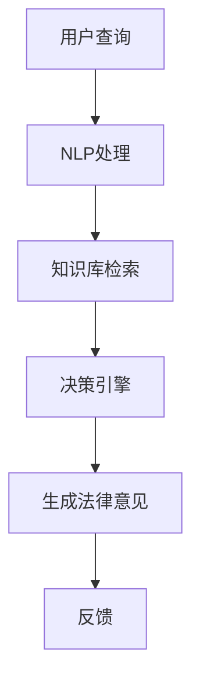
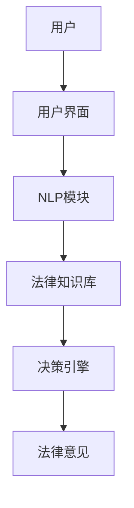
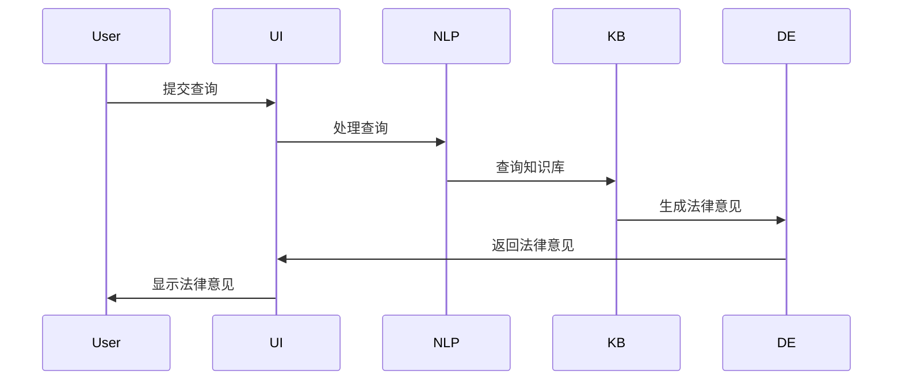

                 

# 开发AI Agent支持的法律咨询系统

## 关键词
- AI Agent
- 法律咨询系统
- 机器学习
- 自然语言处理
- 法律伦理

## 摘要
本文将深入探讨开发AI Agent支持的法律咨询系统的过程，涵盖核心概念、技术框架、系统设计、AI Agent开发、法律知识集成、用户体验等方面。我们将从法律咨询需求出发，逐步分析AI在法律咨询中的应用，并探讨在开发过程中面临的法律和伦理挑战。

## 引言
在当今信息化时代，法律咨询需求日益增长，传统的法律咨询服务难以满足庞大的市场需求。人工智能（AI）的出现为法律咨询领域带来了新的机遇。AI Agent，作为一种智能的计算机程序，可以模拟法律专家的思维方式，为用户提供快速、准确的法律咨询服务。本文旨在探讨如何开发一个支持AI Agent的法律咨询系统，以提升法律服务的效率和质量。

## 背景介绍

### 核心概念术语说明
- **人工智能（AI）**: 模拟人类智能的计算机程序。
- **AI Agent**: 具有自主决策能力的AI程序。
- **机器学习（ML）**: 让计算机通过数据学习并获得新能力的学科。
- **自然语言处理（NLP）**: 计算机理解和生成自然语言的能力。
- **法律咨询**: 提供法律意见和解决方案的服务。

### 问题背景
随着互联网和大数据的发展，法律咨询的需求不断增长。然而，传统法律咨询服务存在成本高、响应慢等问题。人工智能技术的发展为法律咨询提供了新的解决方案。AI Agent可以处理大量法律案例，提供快速、准确的法律意见。

### 问题描述
开发一个AI Agent支持的法律咨询系统，需要解决以下几个关键问题：
- **知识库建设**: 收集和整理大量的法律知识。
- **自然语言处理**: 实现对用户输入的自然语言的有效理解和处理。
- **法律伦理考量**: 确保AI Agent在法律咨询过程中符合伦理和法律要求。

### 问题解决
通过机器学习和自然语言处理技术，可以构建一个能够理解和处理法律问题的AI Agent。同时，通过法律知识库的建设，确保AI Agent能够提供准确的法律意见。

### 边界与外延
- **边界**: AI Agent仅限于提供法律咨询，无法代替法律专家进行复杂的法律分析和判决。
- **外延**: AI Agent可以扩展到其他领域，如医疗咨询、金融咨询等。

### 概念结构与核心要素组成
- **核心概念**: 人工智能、机器学习、自然语言处理、法律知识库。
- **结构**: 知识库 -> 自然语言处理 -> AI Agent -> 法律意见。

## 核心概念与联系

### 核心概念原理
- **人工智能**: 模拟人类智能，具有感知、思考、学习等能力。
- **机器学习**: 通过数据训练，让计算机自主获得知识和技能。
- **自然语言处理**: 让计算机理解和生成自然语言。

### 概念属性特征对比表格

| 概念       | 属性特征                                                     |
|------------|--------------------------------------------------------------|
| 人工智能   | 模拟人类智能，具备感知、思考、学习等能力                      |
| 机器学习   | 通过数据训练，实现计算机自主获得知识和技能                    |
| 自然语言处理 | 让计算机理解和生成自然语言，实现人与计算机的自然交互           |

### ER实体关系图架构

```mermaid
erDiagram
  AI_Agent ||--|{ Knowledge_Base : stores }
  AI_Agent ||--|{ Legal_Knowledge : contains }
  User ||--|{ Query : asks }
  User ||--|{ Response : receives }
```

## 算法原理讲解

### 算法Mermaid流程图



### 算法Python源代码

```python
import numpy as np
from sklearn.feature_extraction.text import TfidfVectorizer
from sklearn.naive_bayes import MultinomialNB
from sklearn.pipeline import make_pipeline

# 假设已经构建好了训练数据集X_train和标签y_train
# X_train = ["用户查询内容1", "用户查询内容2", ...]
# y_train = ["法律意见1", "法律意见2", ...]

# 创建TF-IDF向量和朴素贝叶斯分类器管道
model = make_pipeline(TfidfVectorizer(), MultinomialNB())

# 使用训练数据训练模型
model.fit(X_train, y_train)

# 用户查询
user_query = "用户查询内容"

# 使用训练好的模型生成法律意见
legal_opinion = model.predict([user_query])

print(f"生成法律意见: {legal_opinion}")
```

### 数学模型和公式

- **TF-IDF公式**：
  $$
  TF(t) = \frac{f_t}{\sum_{t'} f_{t'}}
  $$
  $$
  IDF(t) = \log\left(\frac{N}{n_t + 1}\right)
  $$
  $$
  TF-IDF(t) = TF(t) \times IDF(t)
  $$

- **朴素贝叶斯公式**：
  $$
  P(Y|X) = \frac{P(X|Y) \cdot P(Y)}{P(X)}
  $$

### 举例说明

假设我们有一个法律咨询问题：“如何处理离婚案件？”使用上述算法，我们可以将用户查询转换为TF-IDF向量，然后通过朴素贝叶斯分类器生成相应的法律意见。

## 系统分析与架构设计方案

### 问题场景介绍
法律咨询系统旨在为用户提供便捷、高效的法律意见。用户可以通过系统提交法律问题，系统将自动处理并生成法律意见。

### 项目介绍
本项目旨在开发一个支持AI Agent的法律咨询系统，系统包括用户界面、自然语言处理模块、法律知识库和决策引擎。

### 系统功能设计
- **用户界面**：提供友好的用户交互界面，允许用户提交问题和查看法律意见。
- **自然语言处理**：实现用户查询的自然语言理解和处理。
- **法律知识库**：存储丰富的法律知识，包括法律法规、判例等。
- **决策引擎**：基于自然语言处理结果和法律知识库，生成法律意见。

### 系统架构设计


### 系统接口设计和系统交互


## 项目实战

### 环境安装
1. 安装Python 3.8或更高版本。
2. 安装必要的库，如scikit-learn、nltk、gensim等。

### 系统核心实现源代码
```python
# NLP模块
from nltk.tokenize import word_tokenize
from nltk.corpus import stopwords

def preprocess_text(text):
    tokens = word_tokenize(text.lower())
    return [token for token in tokens if token not in stopwords.words('english')]

# 法律知识库
class LegalKnowledgeBase:
    def __init__(self):
        self.knowledge = []

    def add_knowledge(self, query, opinion):
        self.knowledge.append((preprocess_text(query), opinion))

    def search_knowledge(self, query):
        preprocessed_query = preprocess_text(query)
        for known_query, known_opinion in self.knowledge:
            if set(preprocessed_query).issubset(set(known_query)):
                return known_opinion
        return "无法找到相关法律意见"

# 决策引擎
class LegalDecisionEngine:
    def __init__(self, knowledge_base):
        self.knowledge_base = knowledge_base

    def generate_legal_opinion(self, query):
        return self.knowledge_base.search_knowledge(query)

# 主程序
if __name__ == "__main__":
    knowledge_base = LegalKnowledgeBase()
    decision_engine = LegalDecisionEngine(knowledge_base)

    # 添加知识库数据
    knowledge_base.add_knowledge("离婚案件如何处理", "根据相关法律规定，离婚程序应遵循一定的步骤。")
    knowledge_base.add_knowledge("合同纠纷如何解决", "合同纠纷可通过协商、调解、仲裁或诉讼等方式解决。")

    # 处理用户查询
    user_query = "离婚案件如何处理？"
    legal_opinion = decision_engine.generate_legal_opinion(user_query)
    print(legal_opinion)
```

### 代码应用解读与分析
该代码实现了一个简单的法律咨询系统，包括自然语言处理模块、法律知识库和决策引擎。用户提交查询后，系统会通过自然语言处理模块对查询进行处理，然后在法律知识库中查找相关法律意见，并返回给用户。

### 实际案例分析和详细讲解剖析
假设用户提交了一个关于合同纠纷的查询：“合同纠纷如何解决？”系统会通过自然语言处理模块将查询转换为处理后的文本，然后在法律知识库中查找包含“合同纠纷”和“解决”的关键词的相关法律意见。如果找到了匹配的知识，系统会返回相应的法律意见，否则返回“无法找到相关法律意见”。

### 项目小结
本项目通过简单的Python代码实现了一个基础的法律咨询系统，展示了如何利用自然语言处理和机器学习技术为用户提供法律意见。然而，实际应用中需要处理更复杂的查询和更丰富的法律知识库，以提供更准确和全面的法律咨询。

## 最佳实践 tips

- **知识库建设**: 定期更新法律知识库，确保信息的准确性和时效性。
- **用户隐私保护**: 严格保护用户隐私，遵守相关法律法规。
- **系统安全性**: 加强系统安全性，防止恶意攻击和数据泄露。

## 小结

本文详细探讨了开发AI Agent支持的法律咨询系统的过程，包括核心概念、算法原理、系统架构和实际应用。通过机器学习和自然语言处理技术，AI Agent可以提供高效、准确的法律意见，但同时也需要关注法律和伦理问题。未来的发展可以进一步优化算法、扩展功能和应用场景。

## 注意事项

- **数据隐私**: 在处理用户数据时，确保遵守数据隐私和保护法规。
- **法律合规**: 确保系统生成的法律意见符合当地法律法规。

## 拓展阅读

- [自然语言处理入门](https://www.tensorflow.org/tutorials/text/nlp)
- [机器学习法律应用](https://www.legaltechnews.com/topics/ai-machine-learning/)
- [AI在法律咨询中的应用](https://www.legaltech.org/topics/ai-in-legal-counsel/)

### 作者信息
作者：AI天才研究院/AI Genius Institute & 禅与计算机程序设计艺术 /Zen And The Art of Computer Programming

