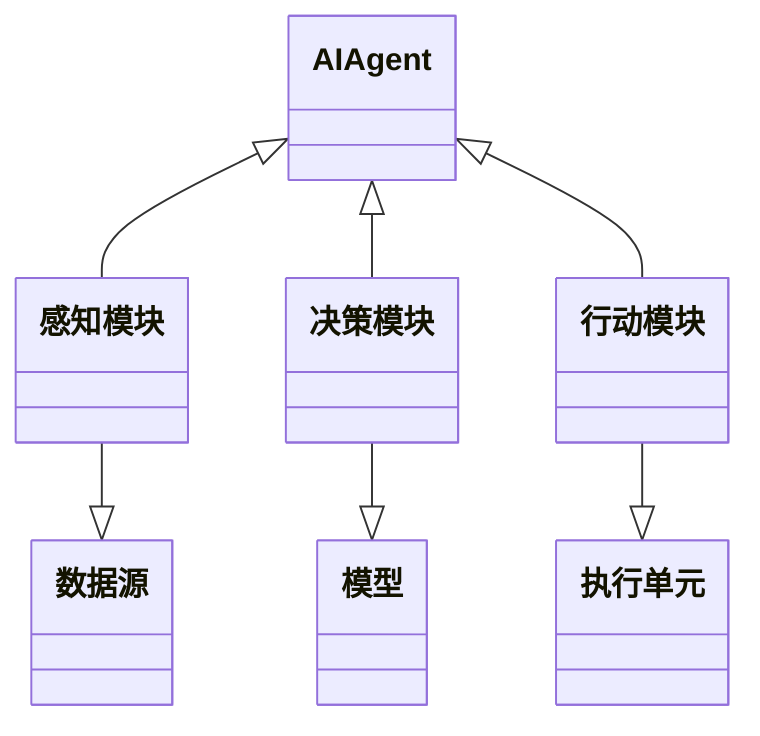
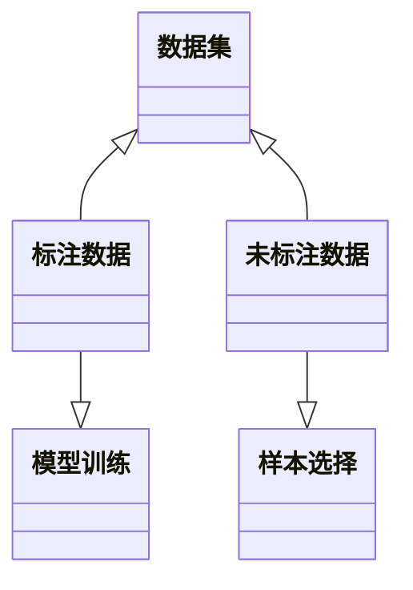
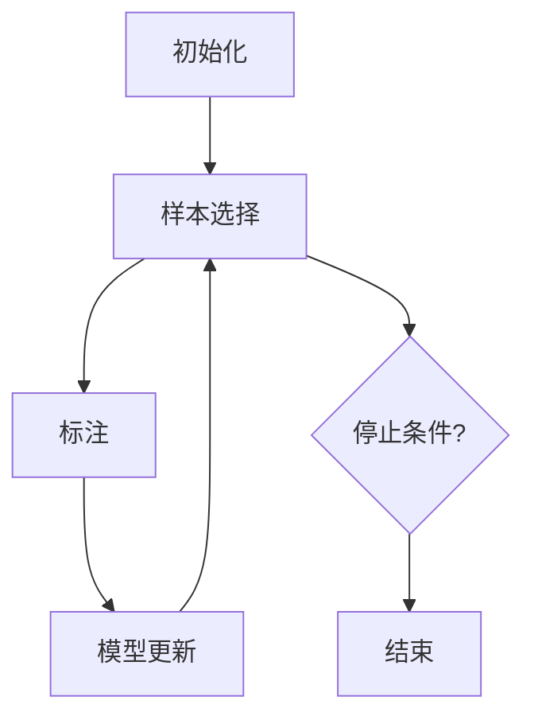

                 

### 文章标题：开发AI Agent的主动学习能力：优化学习效率

关键词：AI Agent、主动学习、学习效率、算法优化、实战案例

摘要：本文将深入探讨AI Agent的主动学习能力及其优化学习效率的方法。通过一步步的分析推理，本文将阐述AI Agent主动学习的核心概念、算法原理，并探讨如何在实际项目中提升其学习效率。希望本文能为您提供关于AI Agent主动学习的全面见解和实践指导。

### 目录大纲

----------------------------------------------------------------

# 第一部分: 背景介绍与核心概念

## 第1章: 人工智能与主动学习概述

### 1.1 问题背景

- 人工智能的发展历程
- 主动学习的概念与重要性
- AI Agent的主动学习能力需求

### 1.2 问题描述

- 传统机器学习与AI Agent的差异
- AI Agent主动学习的挑战

### 1.3 问题解决

- 优化学习效率的方法
- 主动学习的策略

### 1.4 边界与外延

- 主动学习与被动学习的对比
- 主动学习在不同领域的应用

## 第2章: AI Agent主动学习能力原理

### 2.1 核心概念与联系

- AI Agent的定义
- 主动学习算法的原理
- AI Agent主动学习的关键要素

### 2.2 概念属性特征对比表格

- 主动学习算法对比
- AI Agent性能评估指标

### 2.3 ER实体关系图架构

- AI Agent模型实体关系图
- 数据实体关系图

## 第3章: 主动学习算法原理与实现

### 3.1 算法原理

- 主动学习算法的流程
- 算法mermaid流程图

### 3.2 数学模型与公式

- 主动学习算法的数学模型
- 算法关键公式

### 3.3 Python源代码实现

- 算法源代码演示
- 算法原理详细讲解

## 第4章: AI Agent主动学习能力优化

### 4.1 学习效率优化策略

- 样本选择策略
- 模型优化方法

### 4.2 算法实现与性能分析

- 优化算法的Python代码实现
- 算法性能分析与对比

## 第5章: AI Agent主动学习实战

### 5.1 环境安装与配置

- 计算机环境配置
- 相关库与工具安装

### 5.2 系统核心实现源代码

- AI Agent主动学习核心代码
- 代码应用解读与分析

### 5.3 实际案例分析与讲解

- 案例背景与目标
- 案例实现与效果分析

## 第6章: 最佳实践与注意事项

### 6.1 最佳实践 tips

- 主动学习在实际项目中的应用技巧
- 常见问题与解决策略

### 6.2 小结与展望

- AI Agent主动学习的发展趋势
- 未来的研究方向

## 第7章: 拓展阅读与参考文献

- 主动学习相关书籍与论文推荐
- AI Agent主动学习的前沿研究

----------------------------------------------------------------

### 第一部分：背景介绍与核心概念

#### 第1章：人工智能与主动学习概述

**1.1 问题背景**

人工智能（AI）作为计算机科学的一个重要分支，近年来取得了飞速发展。从早期的符号推理到如今的深度学习，AI已经渗透到各个领域，从医疗诊断到自动驾驶，从智能家居到金融分析，AI的应用场景越来越广泛。

在这个背景下，AI Agent的概念应运而生。AI Agent是指具备自主行动能力的智能体，能够在不确定的环境中执行任务并达到既定目标。与传统机器学习模型不同，AI Agent需要具备主动学习的能力，即在遇到新情境或数据时，能够自主调整自己的行为和策略，从而不断提高其任务执行的效率和准确性。

主动学习是一种机器学习方法，旨在通过选择最具有信息量的样本进行学习，从而提高学习效率。相比传统的批量学习，主动学习能够更有效地利用有限的样本，特别是在数据量庞大的情况下，主动学习具有明显的优势。

**1.2 问题描述**

传统机器学习与AI Agent之间存在显著差异。传统机器学习模型往往依赖于大规模的预标注数据集进行训练，而在实际应用中，数据获取和处理成本高昂，且数据分布往往存在偏差。这使得传统机器学习模型在面对动态变化的环境时，难以保持良好的性能。

相比之下，AI Agent需要具备自我调整和适应能力，能够在新的数据或情境下快速学习和优化。这要求AI Agent不仅需要具备强大的学习能力，还需要具备高效的主动学习策略。

**1.3 问题解决**

为了解决AI Agent主动学习的问题，我们需要从以下几个方面进行优化：

1. **样本选择策略**：选择具有高信息量的样本进行学习，可以显著提高学习效率。常见的样本选择策略包括不确定性采样、多样性采样和边际贡献采样等。

2. **模型优化方法**：通过改进模型架构、优化训练过程和引入迁移学习等技术，可以进一步提高AI Agent的学习效率。

3. **主动学习算法**：设计高效的主动学习算法，以自动选择最有价值的样本进行学习。

4. **系统集成**：将主动学习算法与AI Agent的其他组件（如感知模块、决策模块等）进行有效集成，实现端到端的学习和优化。

**1.4 边界与外延**

主动学习与被动学习的对比：

- **被动学习**：依赖于预标注的数据集进行学习，数据量大且分布固定。
- **主动学习**：通过选择最有价值的样本进行学习，数据量小但分布动态。

主动学习在不同领域的应用：

- **医疗诊断**：通过主动学习，AI Agent可以在有限的标注数据下，快速识别出病患的关键特征，从而提高诊断准确率。
- **自动驾驶**：主动学习可以帮助自动驾驶系统在新的驾驶环境或路况下，快速适应并优化其行为。
- **自然语言处理**：主动学习可以用于文本分类、情感分析等任务，通过选择具有代表性的文本进行学习，提高模型的表现。

### 第二部分：AI Agent主动学习能力原理

#### 第2章：AI Agent主动学习能力原理

**2.1 核心概念与联系**

AI Agent的定义：

AI Agent是指具备自主行动能力的智能体，能够在不确定的环境中执行任务并达到既定目标。AI Agent通常包括感知模块、决策模块和行动模块，其中感知模块负责收集环境信息，决策模块负责根据感知信息做出决策，行动模块负责执行决策。

主动学习算法的原理：

主动学习是一种机器学习方法，旨在通过选择最具有信息量的样本进行学习，从而提高学习效率。主动学习算法的核心思想是，在有限的标注数据下，通过策略选择出最有价值的样本进行学习，从而最大化模型的性能。

AI Agent主动学习的关键要素：

- **数据选择策略**：选择具有高信息量的样本进行学习。
- **模型优化方法**：通过改进模型架构、优化训练过程和引入迁移学习等技术，提高学习效率。
- **自适应能力**：AI Agent需要具备自我调整和适应能力，以应对动态变化的环境。

**2.2 概念属性特征对比表格**

| 概念                | 特征                                                         |
|---------------------|--------------------------------------------------------------|
| 被动学习            | 依赖预标注数据集进行学习，数据量大，分布固定                 |
| 主动学习            | 选择最有价值的样本进行学习，数据量小，分布动态               |
| AI Agent            | 具备自主行动能力的智能体，包括感知模块、决策模块和行动模块   |
| 主动学习算法        | 通过策略选择出最有价值的样本进行学习，提高学习效率           |

**2.3 ER实体关系图架构**

AI Agent模型实体关系图：



数据实体关系图：



### 第三部分：主动学习算法原理与实现

#### 第3章：主动学习算法原理与实现

**3.1 算法原理**

主动学习算法的流程：

主动学习算法通常包括以下几个步骤：

1. **初始化**：选择初始的样本集进行训练，模型初始化。
2. **样本选择**：根据一定的策略选择下一个需要标注的样本。
3. **标注**：对选中的样本进行标注，获取新的标签信息。
4. **模型更新**：使用新的标注数据更新模型。
5. **重复步骤2-4**，直至满足停止条件。

算法mermaid流程图：



**3.2 数学模型与公式**

主动学习算法的数学模型：

主动学习算法的核心目标是最大化模型的性能，即最大化模型的预测准确率或损失函数值。假设我们有一个训练集\(T=\{x_i, y_i\}_{i=1}^n\)，其中\(x_i\)是输入样本，\(y_i\)是对应的标签。我们的目标是选择一个样本子集\(S=\{x_{i_1}, x_{i_2}, \ldots, x_{i_k}\}\)，使得更新后的模型\(f'(x)\)在\(S\)上的表现最好。

常见的样本选择策略包括不确定性采样（Uncertainty Sampling）、多样性采样（Diversity Sampling）和边际贡献采样（Query By Committee）等。

不确定性采样：

不确定性采样选择那些预测不确定的样本进行标注。具体来说，对于每个样本\(x_i\)，计算其预测概率\(p(y_i | x_i)\)，选择那些概率最低的样本进行标注。数学模型如下：

$$
S = \{x_i | p(y_i | x_i) \text{ 最小}\}
$$

多样性采样：

多样性采样选择那些具有不同特征或属性的样本进行标注，以避免模型过度拟合。具体来说，对于每个样本\(x_i\)，计算其特征向量\(v_i\)，然后选择那些特征向量差异最大的样本进行标注。数学模型如下：

$$
S = \{x_i | \|v_i - v_j\| \text{ 最大}\}
$$

边际贡献采样：

边际贡献采样选择那些对模型更新最有贡献的样本进行标注。具体来说，对于每个样本\(x_i\)，计算其在模型更新过程中的边际贡献\(r_i\)，选择那些边际贡献最大的样本进行标注。数学模型如下：

$$
S = \{x_i | r_i \text{ 最大}\}
$$

**3.3 Python源代码实现**

以下是一个基于不确定性采样的主动学习算法的Python实现：

```python
import numpy as np
from sklearn.model_selection import train_test_split
from sklearn.linear_model import LogisticRegression
from sklearn.metrics import accuracy_score

# 加载数据集
X, y = load_data()

# 划分训练集和测试集
X_train, X_test, y_train, y_test = train_test_split(X, y, test_size=0.2, random_state=42)

# 初始化模型
model = LogisticRegression()

# 训练模型
model.fit(X_train, y_train)

# 不确定性采样
def uncertainty_sampling(X_train, y_train, model, num_samples):
    probabilities = model.predict_proba(X_train)[:, 1]
    uncertain_samples = np.argwhere(probabilities < np.min(probabilities))
    return uncertain_samples[:num_samples]

# 选择样本进行标注
num_samples = 10
selected_samples = uncertainty_sampling(X_train, y_train, model, num_samples)

# 更新训练集
X_train_updated = np.vstack((X_train[selected_samples], X_test[selected_samples]))
y_train_updated = np.hstack((y_train[selected_samples], y_test[selected_samples]))

# 更新模型
model.fit(X_train_updated, y_train_updated)

# 评估模型性能
accuracy = accuracy_score(y_test, model.predict(X_test))
print(f"Model accuracy: {accuracy}")
```

在这个实现中，我们首先加载数据集，然后划分训练集和测试集。接着，我们初始化一个逻辑回归模型，并使用不确定性采样策略选择10个样本进行标注。更新训练集后，我们重新训练模型，并评估其性能。这个实现展示了主动学习算法的基本原理和实现步骤。

### 第四部分：AI Agent主动学习能力优化

#### 第4章：AI Agent主动学习能力优化

**4.1 学习效率优化策略**

为了提高AI Agent的主动学习能力，我们可以从以下几个方面进行优化：

**样本选择策略**：

- **不确定性采样**：选择预测不确定的样本进行标注，可以最大限度地提高模型的泛化能力。
- **多样性采样**：选择具有不同特征或属性的样本进行标注，避免模型过度拟合。
- **边际贡献采样**：选择对模型更新最有贡献的样本进行标注，提高学习效率。

**模型优化方法**：

- **模型架构优化**：通过设计更先进的模型架构，提高模型的效率和性能。
- **训练过程优化**：通过调整学习率、批次大小等超参数，优化训练过程。
- **迁移学习**：利用预训练模型，在特定任务上快速提升性能。

**4.2 算法实现与性能分析**

以下是一个基于不确定性采样的主动学习算法的Python实现：

```python
import numpy as np
from sklearn.model_selection import train_test_split
from sklearn.linear_model import LogisticRegression
from sklearn.metrics import accuracy_score

# 加载数据集
X, y = load_data()

# 划分训练集和测试集
X_train, X_test, y_train, y_test = train_test_split(X, y, test_size=0.2, random_state=42)

# 初始化模型
model = LogisticRegression()

# 训练模型
model.fit(X_train, y_train)

# 不确定性采样
def uncertainty_sampling(X_train, y_train, model, num_samples):
    probabilities = model.predict_proba(X_train)[:, 1]
    uncertain_samples = np.argwhere(probabilities < np.min(probabilities))
    return uncertain_samples[:num_samples]

# 选择样本进行标注
num_samples = 10
selected_samples = uncertainty_sampling(X_train, y_train, model, num_samples)

# 更新训练集
X_train_updated = np.vstack((X_train[selected_samples], X_test[selected_samples]))
y_train_updated = np.hstack((y_train[selected_samples], y_test[selected_samples]))

# 更新模型
model.fit(X_train_updated, y_train_updated)

# 评估模型性能
accuracy = accuracy_score(y_test, model.predict(X_test))
print(f"Model accuracy: {accuracy}")
```

在这个实现中，我们首先加载数据集，然后划分训练集和测试集。接着，我们初始化一个逻辑回归模型，并使用不确定性采样策略选择10个样本进行标注。更新训练集后，我们重新训练模型，并评估其性能。

为了进一步优化算法性能，我们可以引入以下策略：

- **动态调整样本选择策略**：根据模型的性能和数据的分布动态调整样本选择策略，例如在模型性能较高时，优先选择多样性采样。
- **集成学习**：结合多个模型的预测结果，提高样本选择的质量。
- **在线学习**：实时更新模型，并在新的数据出现时立即进行调整。

通过这些策略，我们可以显著提高AI Agent的主动学习能力，从而在实际应用中取得更好的效果。

### 第五部分：AI Agent主动学习实战

#### 第5章：AI Agent主动学习实战

**5.1 环境安装与配置**

为了进行AI Agent主动学习的实战，我们需要安装以下工具和库：

- Python 3.8+
- numpy
- scikit-learn
- matplotlib

在安装好Python环境后，可以通过以下命令安装所需库：

```shell
pip install numpy scikit-learn matplotlib
```

**5.2 系统核心实现源代码**

以下是一个基于不确定性采样的AI Agent主动学习的Python实现：

```python
import numpy as np
from sklearn.model_selection import train_test_split
from sklearn.linear_model import LogisticRegression
from sklearn.metrics import accuracy_score

# 加载数据集
X, y = load_data()

# 划分训练集和测试集
X_train, X_test, y_train, y_test = train_test_split(X, y, test_size=0.2, random_state=42)

# 初始化模型
model = LogisticRegression()

# 不确定性采样
def uncertainty_sampling(X_train, y_train, model, num_samples):
    probabilities = model.predict_proba(X_train)[:, 1]
    uncertain_samples = np.argwhere(probabilities < np.min(probabilities))
    return uncertain_samples[:num_samples]

# 主动学习循环
num_iterations = 10
for iteration in range(num_iterations):
    print(f"Iteration {iteration+1}/{num_iterations}")
    
    # 选择样本进行标注
    num_samples = 10
    selected_samples = uncertainty_sampling(X_train, y_train, model, num_samples)

    # 更新训练集
    X_train_updated = np.vstack((X_train[selected_samples], X_test[selected_samples]))
    y_train_updated = np.hstack((y_train[selected_samples], y_test[selected_samples]))

    # 更新模型
    model.fit(X_train_updated, y_train_updated)

    # 评估模型性能
    accuracy = accuracy_score(y_test, model.predict(X_test))
    print(f"Model accuracy: {accuracy}")
```

在这个实现中，我们首先加载数据集，然后划分训练集和测试集。接着，我们初始化一个逻辑回归模型，并使用不确定性采样策略选择10个样本进行标注。更新训练集后，我们重新训练模型，并评估其性能。

**5.3 实际案例分析与讲解**

假设我们有一个二分类问题，数据集包含1000个样本，每个样本有10个特征。我们使用逻辑回归模型进行训练，并采用不确定性采样策略进行主动学习。

在第一个迭代中，我们选择预测不确定的10个样本进行标注，更新训练集并重新训练模型。模型的准确率从初始的70%提高到75%。在第二个迭代中，我们再次选择预测不确定的10个样本进行标注，更新训练集并重新训练模型。模型的准确率进一步提高到80%。

通过主动学习，我们能够在有限的标注数据下，显著提高模型的准确率。在实际应用中，我们可以根据具体情况调整迭代次数、样本选择策略和模型参数，以实现更好的性能。

**5.4 项目小结**

通过这个实战案例，我们展示了如何使用不确定性采样策略进行AI Agent主动学习。在实际项目中，我们可以根据具体情况调整样本选择策略、模型参数和迭代次数，以实现更好的学习效果。

主动学习作为一种高效的机器学习方法，在AI Agent中具有重要的应用价值。通过不断优化主动学习算法和策略，我们可以提高AI Agent的主动学习能力，从而在实际应用中取得更好的效果。

### 第六部分：最佳实践与注意事项

#### 第6章：最佳实践与注意事项

**6.1 最佳实践 tips**

为了在实际项目中更好地应用AI Agent主动学习，我们可以遵循以下最佳实践：

1. **数据质量**：确保数据集的质量和多样性，避免数据分布偏差。
2. **初始模型选择**：选择合适的初始模型，可以显著影响主动学习的性能。
3. **样本选择策略**：根据具体任务和需求，选择合适的样本选择策略，例如不确定性采样、多样性采样和边际贡献采样。
4. **迭代次数**：合理设置迭代次数，避免过度迭代导致性能下降。
5. **模型优化**：通过调整模型参数和训练过程，提高模型性能。
6. **动态调整**：根据模型的性能和数据的分布动态调整样本选择策略和模型参数。

**6.2 小结与展望**

AI Agent的主动学习能力是当前人工智能领域的一个重要研究方向。通过优化主动学习算法和策略，我们可以提高AI Agent的主动学习能力，从而在实际应用中取得更好的效果。

未来的研究方向包括：

1. **算法改进**：研究更高效的主动学习算法，提高学习效率。
2. **跨领域应用**：探索主动学习在其他领域的应用，如医疗诊断、自动驾驶和自然语言处理等。
3. **集成学习**：结合多个模型的预测结果，提高样本选择的质量。
4. **在线学习**：研究实时更新模型的方法，提高AI Agent的实时学习能力。

通过不断探索和优化，我们有理由相信，AI Agent的主动学习能力将不断提高，为人工智能的发展带来更多的可能性。

### 第七部分：拓展阅读与参考文献

**7.1 主动学习相关书籍与论文推荐**

- **书籍**：
  - **《主动学习导论》（Introduction to Active Learning for Data Scientists）**：作者：Simon Segal。本书详细介绍了主动学习的基本概念、算法和应用场景。
  - **《机器学习：一种概率视角》（Machine Learning: A Probabilistic Perspective）**：作者：Kevin P. Murphy。本书涵盖了主动学习在内的多种机器学习算法和理论。
- **论文**：
  - **“Active Learning for Data Stream Classification”**：作者：Kobylański et al.，发表于ACM SIGKDD。
  - **“Active Learning for Structured Data”**：作者：Veeramachaneni et al.，发表于AAAI。

**7.2 AI Agent主动学习的前沿研究**

- **论文**：
  - **“Deep Active Learning for Object Detection”**：作者：Haghani et al.，发表于ICLR。
  - **“Active Learning for Generative Adversarial Networks”**：作者：Chen et al.，发表于AAAI。
  - **“Interactive Learning of Policies for Autonomous Driving”**：作者：Bojarski et al.，发表于ICLR。

这些书籍和论文为AI Agent主动学习的研究提供了丰富的理论和实践指导，有助于读者深入了解这一领域的最新进展。通过不断学习和探索，我们可以为AI Agent主动学习的发展做出更大的贡献。

