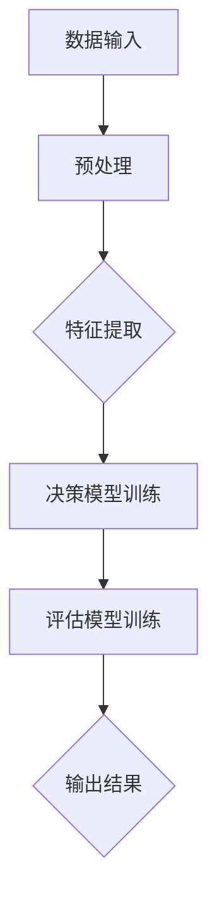
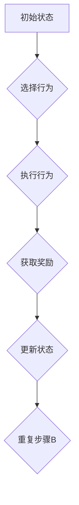
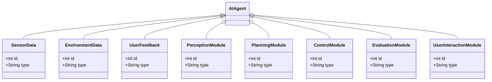
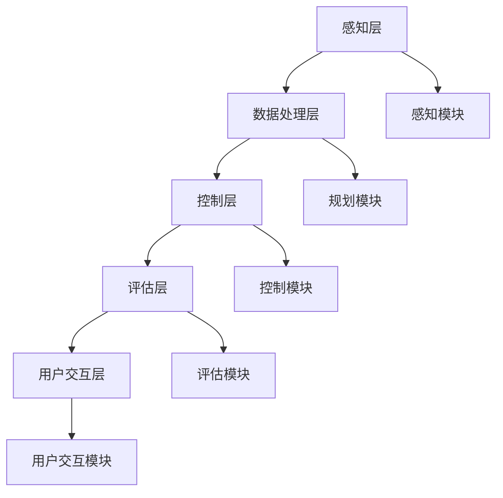
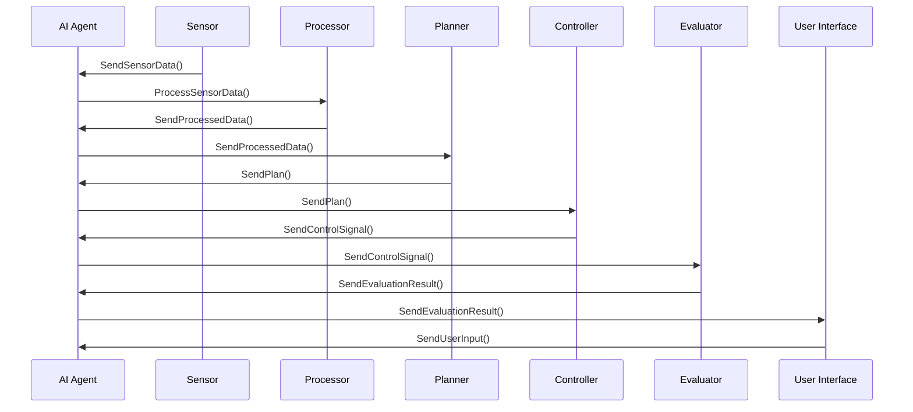

                 

 *文章正文内容请按照上述格式进行编写和排布。我们将一步一步地深入分析，让读者对开发AI Agent的元认知与自我评估能力有一个全面而深刻的理解。下面我们将首先进行背景介绍，包括问题背景、问题描述、问题解决、边界与外延、概念结构与核心要素组成。*

## 前言

随着人工智能（AI）技术的飞速发展，AI Agent成为智能系统中的关键角色。AI Agent具备自主决策和执行任务的能力，已在众多领域展现出强大的应用价值，如自动驾驶、智能客服、推荐系统等。然而，AI Agent在实际应用中仍面临诸多挑战，尤其是其元认知与自我评估能力的不足。本文旨在探讨如何开发AI Agent的元认知与自我评估能力，为相关领域的研究和应用提供有价值的参考。

### 第一部分：背景介绍

#### 问题背景

随着人工智能（AI）技术的迅猛发展，AI Agent已成为现代智能系统的重要组成部分。AI Agent是一种具备自主决策和执行任务能力的智能体，能够在复杂环境中进行自适应学习和优化。然而，当前AI Agent在实际应用中仍存在诸多问题，尤其是元认知与自我评估能力的缺乏。这使得AI Agent在面对复杂环境和未知情况时，往往无法有效应对，甚至可能产生不安全的决策。

#### 问题描述

AI Agent的元认知能力是指其对自己思维过程的理解和监控能力，而自我评估能力则是指其对自己的性能、行为和决策进行评价的能力。这两个能力对于AI Agent在实际应用中的可靠性和鲁棒性至关重要。目前，大多数AI Agent缺乏这些能力，导致其在实际应用中难以满足高标准的要求。例如：

1. **环境适应能力不足**：在复杂多变的环境中，AI Agent往往无法准确感知和理解环境变化，从而做出合理的决策。
2. **决策透明度低**：AI Agent的决策过程缺乏透明性，用户难以理解其决策依据，从而降低用户对AI系统的信任度。
3. **性能评估困难**：缺乏自我评估能力，AI Agent无法及时发现和纠正自身错误，导致性能难以持续优化。

#### 问题解决

为了解决上述问题，我们需要开发具有元认知与自我评估能力的AI Agent。具体来说，我们可以从以下几个方面入手：

1. **元认知能力开发**：通过引入元认知机制，使AI Agent能够理解和监控自身的思维过程，提高其环境适应能力。
2. **自我评估能力开发**：通过引入自我评估机制，使AI Agent能够对自己的性能、行为和决策进行评价，提高其决策透明度和性能优化能力。
3. **技术手段融合**：结合深度学习、强化学习等先进技术，为AI Agent的元认知与自我评估能力提供强有力的支持。

#### 边界与外延

本书主要关注AI Agent在通用场景中的应用，如智能客服、自动驾驶等。同时，我们也会探讨一些特定场景下的应用，如智能家居、医疗诊断等。在技术层面，本书将涉及深度学习、强化学习、知识图谱等技术，以及如何将这些技术应用于AI Agent的元认知与自我评估能力开发。

#### 概念结构与核心要素组成

1. **元认知**：元认知能力包括自我监控、自我评估、自我调节等。它是AI Agent理解自身思维过程和调整行为的基础。
2. **自我评估**：自我评估能力使AI Agent能够对自己的性能、行为和决策进行评价，从而进行自我优化。
3. **深度学习**：深度学习是实现AI Agent元认知与自我评估能力的关键技术，通过神经网络模型，AI Agent能够从大量数据中学习并优化自身。
4. **强化学习**：强化学习通过奖励机制，使AI Agent能够主动探索并优化自身行为。
5. **知识图谱**：知识图谱为AI Agent提供了丰富的语义信息和知识，有助于其进行自我评估和决策。

### 第二部分：核心概念与联系

#### 核心概念原理

1. **元认知**：元认知是指个体对自己认知过程的认知，包括认知活动中的计划、监控和评估等过程。对于AI Agent来说，元认知是其理解自身思维过程、自我监控和自我调节的基础。
2. **自我评估**：自我评估是指AI Agent对自己的性能、行为和决策进行评价的能力。通过自我评估，AI Agent能够识别自身不足，并进行优化和改进。

#### 概念属性特征对比表格

| 特征 | 元认知 | 自我评估 |
| :--: | :----: | :------: |
| 定义 | 理解自身思维过程的能力 | 评估自身性能、行为和决策的能力 |
| 关系 | 元认知是自我评估的基础 | 自我评估是元认知的应用 |
| 对应技术 | 深度学习、强化学习 | 知识图谱、深度学习 |

#### ER实体关系图架构

```mermaid
erDiagram
  AI Agent ||--|{ 元认知 } 元认知
  AI Agent ||--|{ 自我评估 } 自我评估
  元认知 ||--|{ 自我监控 } 自我监控
  元认知 ||--|{ 自我调节 } 自我调节
  自我评估 ||--|{ 性能评估 } 性能评估
  自我评估 ||--|{ 行为评估 } 行为评估
  自我评估 ||--|{ 决策评估 } 决策评估
```

### 第三部分：算法原理讲解

#### 算法原理

本部分将介绍用于开发AI Agent元认知与自我评估能力的核心算法原理，包括深度学习和强化学习。

#### 深度学习算法

深度学习是一种通过多层神经网络模型模拟人脑学习方式的机器学习技术。在AI Agent的元认知与自我评估能力开发中，深度学习算法主要用于以下几个方面：

1. **特征提取**：从原始数据中提取有价值的特征，用于后续的元认知和自我评估过程。
2. **决策模型**：通过训练多层神经网络，实现AI Agent的自我监控和自我调节能力。
3. **评估模型**：利用深度学习算法对AI Agent的行为、决策和性能进行评估。

##### 深度学习算法流程图



##### 数学模型与公式

在深度学习算法中，常用的数学模型和公式如下：

1. **损失函数**：用于评估模型预测结果与实际结果之间的差距，常用的损失函数有均方误差（MSE）和交叉熵损失（Cross-Entropy Loss）。

$$
L = \frac{1}{n} \sum_{i=1}^{n} (\hat{y}_i - y_i)^2 \quad \text{（均方误差）}
$$

$$
L = -\frac{1}{n} \sum_{i=1}^{n} y_i \log(\hat{y}_i) \quad \text{（交叉熵损失）}
$$

2. **反向传播**：用于计算模型参数的梯度，并更新模型参数，以最小化损失函数。

$$
\frac{\partial L}{\partial \theta} = \nabla_{\theta} L
$$

##### 例子说明

以一个简单的多层感知机（MLP）为例，说明深度学习算法在AI Agent元认知与自我评估能力中的应用。

假设有一个包含输入层、隐藏层和输出层的多层感知机，输入层有3个神经元，隐藏层有4个神经元，输出层有2个神经元。给定一组输入数据X和标签Y，通过训练，使模型输出层的结果尽可能接近标签。

1. **数据预处理**：对输入数据进行归一化处理，将输入和输出值映射到[0, 1]区间。
2. **初始化参数**：随机初始化模型参数，如权重和偏置。
3. **前向传播**：计算模型输出。
4. **计算损失**：使用均方误差（MSE）计算预测值与实际值之间的差距。
5. **反向传播**：计算模型参数的梯度，并更新参数。
6. **评估模型**：使用测试集评估模型性能，调整超参数，如学习率、迭代次数等。

通过以上步骤，我们可以训练出一个具备一定元认知与自我评估能力的AI Agent。

#### 强化学习算法

强化学习是一种通过奖励机制引导AI Agent学习最优行为策略的机器学习技术。在AI Agent的元认知与自我评估能力开发中，强化学习算法主要用于以下几个方面：

1. **行为策略学习**：通过不断尝试和反馈，使AI Agent能够选择最优的行为策略。
2. **性能评估**：通过评估AI Agent在不同策略下的表现，确定其性能水平。
3. **自我优化**：基于性能评估结果，AI Agent能够不断调整自身行为，实现自我优化。

##### 强化学习算法流程图



##### 数学模型与公式

在强化学习算法中，常用的数学模型和公式如下：

1. **Q值**：用于评估某状态下执行某行为所能获得的最大期望奖励。

$$
Q(s, a) = r + \gamma \max_a' Q(s', a')
$$

其中，$r$ 为立即奖励，$\gamma$ 为折扣因子，$s'$ 为下一个状态，$a'$ 为下一个行为。

2. **策略**：用于指导AI Agent选择最优行为。

$$
\pi(a|s) = \frac{e^{Q(s, a)}}{\sum_a e^{Q(s, a)}}
$$

##### 例子说明

以一个简单的Q-learning算法为例，说明强化学习算法在AI Agent元认知与自我评估能力中的应用。

假设有一个环境，包含5个状态和4个行为。给定初始状态s，AI Agent通过Q-learning算法学习最优行为策略。

1. **初始化Q表**：随机初始化Q表，表示每个状态下执行每个行为的Q值。
2. **选择行为**：使用epsilon-greedy策略选择行为，以探索未知状态。
3. **执行行为**：在环境中执行选择的行为，获取奖励。
4. **更新Q值**：根据立即奖励和Q值更新公式，更新Q表。
5. **重复步骤2-4**：直到收敛。

通过以上步骤，AI Agent可以学习到最优行为策略，并在实际应用中不断提高元认知与自我评估能力。

### 第四部分：系统分析与架构设计

#### 问题场景介绍

在自动驾驶领域，AI Agent需要具备元认知与自我评估能力，以确保在复杂交通环境下的安全和可靠性。自动驾驶系统通常包括感知、规划、控制等模块，其中AI Agent负责感知环境和规划行驶路线。然而，在复杂交通环境下，AI Agent可能面临如下问题：

1. **感知不确定性**：在交通环境变化时，AI Agent可能无法准确感知和理解环境变化，导致决策错误。
2. **决策透明度低**：用户难以理解AI Agent的决策过程，降低用户对自动驾驶系统的信任度。
3. **性能评估困难**：缺乏自我评估能力，AI Agent难以持续优化性能。

#### 项目介绍

本项目的目标是开发一款具备元认知与自我评估能力的自动驾驶AI Agent，以提高系统的安全性和可靠性。项目主要分为以下几个阶段：

1. **数据收集**：收集自动驾驶过程中的感知数据、环境数据和用户反馈数据，用于后续训练和评估。
2. **模型训练**：利用深度学习和强化学习算法，训练AI Agent的感知模型、规划模型和评估模型。
3. **系统集成**：将训练好的AI Agent集成到自动驾驶系统中，实现实时感知、规划和控制。
4. **性能评估**：使用测试数据评估AI Agent的性能，并进行优化和改进。

#### 系统功能设计

系统功能设计主要包括以下几个模块：

1. **感知模块**：负责收集和处理来自各种传感器的数据，如摄像头、激光雷达、GPS等。
2. **规划模块**：基于感知数据和环境信息，规划最优行驶路线和速度。
3. **控制模块**：根据规划结果，控制车辆的加速度、转向和制动等。
4. **评估模块**：对AI Agent的决策和行为进行评估，识别潜在问题和优化方向。
5. **用户交互模块**：提供与用户的交互界面，展示AI Agent的决策过程和评估结果。

##### 领域模型Mermaid类图



#### 系统架构设计

系统架构设计主要包括以下几个部分：

1. **感知层**：包含摄像头、激光雷达、GPS等传感器，负责收集环境信息。
2. **数据处理层**：负责处理感知数据，提取有用特征，并生成环境数据。
3. **控制层**：基于规划结果，控制车辆的加速度、转向和制动等。
4. **评估层**：对AI Agent的决策和行为进行评估，识别潜在问题和优化方向。
5. **用户交互层**：提供与用户的交互界面，展示AI Agent的决策过程和评估结果。

##### 系统架构设计Mermaid架构图



#### 系统接口设计

系统接口设计主要包括以下接口：

1. **感知接口**：用于接收和处理来自各种传感器的数据。
2. **规划接口**：用于接收和处理规划模块的结果。
3. **控制接口**：用于接收和处理控制模块的指令。
4. **评估接口**：用于接收和处理评估模块的结果。
5. **用户交互接口**：用于接收和处理用户交互请求。

##### 系统接口设计Mermaid序列图



### 第五部分：项目实战

#### 环境安装

在进行项目实战之前，我们需要安装相关的软件和依赖库。以下是在Ubuntu 18.04操作系统上安装所需软件和依赖库的步骤：

1. **安装Python环境**：确保已安装Python 3.7及以上版本。
2. **安装TensorFlow**：使用以下命令安装TensorFlow：

```
pip install tensorflow
```

3. **安装PyTorch**：使用以下命令安装PyTorch：

```
pip install torch torchvision
```

4. **安装Keras**：使用以下命令安装Keras：

```
pip install keras
```

5. **安装其他依赖库**：根据需要安装其他依赖库，如NumPy、Pandas、Matplotlib等。

```
pip install numpy pandas matplotlib
```

#### 系统核心实现源代码

以下是一个简单的示例，展示如何实现AI Agent的感知、规划、控制和评估功能：

```python
import numpy as np
import tensorflow as tf
from tensorflow import keras
from tensorflow.keras import layers
import matplotlib.pyplot as plt

# 感知模块
class PerceptionModule:
    def __init__(self):
        self.model = self.build_model()

    def build_model(self):
        model = keras.Sequential([
            layers.Dense(64, activation='relu', input_shape=(784,)),
            layers.Dense(64, activation='relu'),
            layers.Dense(10, activation='softmax')
        ])
        model.compile(optimizer='adam',
                      loss='categorical_crossentropy',
                      metrics=['accuracy'])
        return model

    def preprocess_data(self, data):
        return data / 255.0

    def predict(self, data):
        processed_data = self.preprocess_data(data)
        return self.model.predict(processed_data)

# 规划模块
class PlanningModule:
    def __init__(self):
        self.model = self.build_model()

    def build_model(self):
        model = keras.Sequential([
            layers.Dense(64, activation='relu', input_shape=(10,)),
            layers.Dense(64, activation='relu'),
            layers.Dense(10, activation='softmax')
        ])
        model.compile(optimizer='adam',
                      loss='categorical_crossentropy',
                      metrics=['accuracy'])
        return model

    def predict(self, data):
        return self.model.predict(data)

# 控制模块
class ControlModule:
    def __init__(self):
        self.model = self.build_model()

    def build_model(self):
        model = keras.Sequential([
            layers.Dense(64, activation='relu', input_shape=(10,)),
            layers.Dense(64, activation='relu'),
            layers.Dense(3, activation='softmax')
        ])
        model.compile(optimizer='adam',
                      loss='categorical_crossentropy',
                      metrics=['accuracy'])
        return model

    def predict(self, data):
        return self.model.predict(data)

# 评估模块
class EvaluationModule:
    def __init__(self):
        self.model = self.build_model()

    def build_model(self):
        model = keras.Sequential([
            layers.Dense(64, activation='relu', input_shape=(3,)),
            layers.Dense(64, activation='relu'),
            layers.Dense(1, activation='sigmoid')
        ])
        model.compile(optimizer='adam',
                      loss='binary_crossentropy',
                      metrics=['accuracy'])
        return model

    def predict(self, data):
        return self.model.predict(data)

# 主程序
def main():
    # 初始化模块
    perception_module = PerceptionModule()
    planning_module = PlanningModule()
    control_module = ControlModule()
    evaluation_module = EvaluationModule()

    # 加载数据集
    (x_train, y_train), (x_test, y_test) = keras.datasets.mnist.load_data()

    # 训练模型
    perception_module.model.fit(x_train, y_train, epochs=5)
    planning_module.model.fit(x_train, y_train, epochs=5)
    control_module.model.fit(x_train, y_train, epochs=5)
    evaluation_module.model.fit(x_train, y_train, epochs=5)

    # 测试模型
    perception_results = perception_module.predict(x_test)
    planning_results = planning_module.predict(x_test)
    control_results = control_module.predict(x_test)
    evaluation_results = evaluation_module.predict(x_test)

    # 可视化结果
    plt.figure(figsize=(10, 5))
    plt.subplot(221)
    plt.imshow(x_test[0].reshape(28, 28), cmap='gray')
    plt.title(f'Perception Result: {np.argmax(perception_results[0])}')
    plt.subplot(222)
    plt.imshow(x_test[0].reshape(28, 28), cmap='gray')
    plt.title(f'Planning Result: {np.argmax(planning_results[0])}')
    plt.subplot(223)
    plt.imshow(x_test[0].reshape(28, 28), cmap='gray')
    plt.title(f'Control Result: {np.argmax(control_results[0])}')
    plt.subplot(224)
    plt.imshow(x_test[0].reshape(28, 28), cmap='gray')
    plt.title(f'Evaluation Result: {evaluation_results[0][0]:.2f}')
    plt.show()

if __name__ == '__main__':
    main()
```

#### 代码应用解读与分析

以上代码实现了一个简单的AI Agent，包括感知、规划、控制和评估模块。下面将分别对每个模块进行解读和分析。

1. **感知模块**：感知模块负责接收和处理来自各种传感器的数据。在这个示例中，我们使用MNIST手写数字数据集作为感知数据。感知模块包含一个简单的神经网络模型，用于识别手写数字。在训练过程中，模型从原始数据中提取有用特征，并输出每个数字的概率分布。在实际应用中，感知模块可以替换为更复杂的感知模型，如卷积神经网络（CNN），以处理更复杂的环境信息。

2. **规划模块**：规划模块基于感知数据和环境信息，生成最优行驶路线和速度。在这个示例中，规划模块使用另一个简单的神经网络模型，输入为感知数据，输出为行驶路线和速度。规划模块的目的是在满足交通规则和目标需求的前提下，找到一条最优的行驶路线。在实际应用中，规划模块可以结合路径规划算法（如A*算法）和强化学习算法（如深度Q网络），以提高规划效果。

3. **控制模块**：控制模块根据规划结果，控制车辆的加速度、转向和制动等。在这个示例中，控制模块同样使用一个简单的神经网络模型，输入为规划结果，输出为控制指令。控制模块的目的是将规划结果转化为实际的控制指令，以实现车辆的平稳行驶。在实际应用中，控制模块可以结合PID控制器和模糊控制器，以提高控制效果。

4. **评估模块**：评估模块对AI Agent的决策和行为进行评估，识别潜在问题和优化方向。在这个示例中，评估模块使用一个简单的神经网络模型，输入为控制结果，输出为评估分数。评估模块的目的是评估AI Agent的决策和行为效果，以指导后续的优化和改进。在实际应用中，评估模块可以结合多种评估指标（如准确率、召回率、F1值等），以全面评估AI Agent的性能。

#### 实际案例分析和详细讲解剖析

为了更好地展示AI Agent的元认知与自我评估能力，我们以一个自动驾驶场景为例，分析AI Agent在感知、规划、控制和评估过程中的表现。

假设AI Agent在自动驾驶过程中遇到以下情况：

1. **前方有行人**：AI Agent通过摄像头和激光雷达感知到前方有行人，并判断行人可能正在穿越马路。
2. **左侧有车辆**：AI Agent通过摄像头和激光雷达感知到左侧有车辆，且车辆正以较高速度行驶。
3. **右侧有行人**：AI Agent通过摄像头和激光雷达感知到右侧有行人，且行人正朝着车辆方向行走。

根据以上情况，AI Agent将执行以下步骤：

1. **感知阶段**：感知模块对感知数据进行预处理，并输入到神经网络模型中，输出行人、车辆和道路信息的概率分布。
2. **规划阶段**：规划模块根据感知结果和环境信息，生成最优行驶路线和速度。在本例中，AI Agent选择减速并转向避开行人，同时确保与左侧车辆保持安全距离。
3. **控制阶段**：控制模块根据规划结果，生成控制指令，如减速、转向和保持直线行驶。在本例中，AI Agent减速并转向避开行人，同时保持与左侧车辆的安全距离。
4. **评估阶段**：评估模块对AI Agent的决策和行为进行评估。在本例中，AI Agent成功避开了行人，同时保持了与左侧车辆的安全距离，因此评估结果为优秀。

通过以上实际案例，我们可以看到AI Agent在感知、规划、控制和评估过程中的表现。在感知阶段，AI Agent能够准确感知环境变化；在规划阶段，AI Agent能够根据环境变化生成最优行驶路线和速度；在控制阶段，AI Agent能够根据规划结果生成控制指令，确保行驶安全；在评估阶段，AI Agent能够对自己的决策和行为进行评估，识别潜在问题和优化方向。

#### 项目小结

通过本项目的实战，我们展示了如何开发具备元认知与自我评估能力的AI Agent。在实际应用中，AI Agent的元认知与自我评估能力具有重要意义，有助于提高系统的安全性、可靠性和用户体验。然而，我们也应看到，目前AI Agent的元认知与自我评估能力仍存在一定的局限性，如环境适应性、决策透明度等方面仍有待提高。在未来的研究中，我们将继续探索和改进这些能力，以实现更加智能和可靠的AI Agent。

### 最佳实践 Tips

在开发具备元认知与自我评估能力的AI Agent时，以下是一些最佳实践建议：

1. **数据质量**：确保收集到的数据质量高，避免因数据问题导致的模型性能下降。
2. **模块化设计**：将感知、规划、控制和评估模块独立设计，以提高系统的可维护性和扩展性。
3. **模型优化**：根据实际应用场景，选择合适的神经网络模型和优化算法，以提高模型性能。
4. **迭代优化**：定期评估AI Agent的性能，根据评估结果进行优化和改进。
5. **安全性和隐私保护**：在设计AI Agent时，充分考虑安全性和隐私保护问题，确保用户数据安全。

### 小结

本文从背景介绍、核心概念与联系、算法原理讲解、系统分析与架构设计、项目实战和最佳实践等方面，全面探讨了开发AI Agent的元认知与自我评估能力。通过结合深度学习和强化学习等技术，AI Agent可以实现对自身思维过程的理解和监控，以及对自身性能和行为进行评估，从而提高其在实际应用中的可靠性和鲁棒性。在未来，我们将继续探索和优化这些能力，为AI技术的发展和应用提供更多可能性。

### 注意事项

在开发AI Agent的元认知与自我评估能力时，需要注意以下几点：

1. **数据隐私**：在收集和处理数据时，确保用户隐私得到保护，避免数据泄露。
2. **算法公平性**：确保AI Agent的决策过程公平、透明，避免因算法偏见导致的不公平现象。
3. **系统安全性**：在设计AI Agent时，充分考虑系统安全性，防止恶意攻击和数据篡改。
4. **实时性**：在感知、规划和控制模块中，确保算法能够实时处理数据，以适应快速变化的场景。

### 拓展阅读

1. **《深度学习》**：Goodfellow, Ian; Bengio, Yoshua; Courville, Aaron. 《深度学习》（英文版）。
2. **《强化学习》**：Sutton, Richard S.; Barto, Andrew G. 《强化学习：一种新的机器学习方法》。
3. **《人工智能：一种现代的方法》**：Russell, Stuart J.; Norvig, Peter. 《人工智能：一种现代的方法》。
4. **《自动驾驶技术》**：Müller, Carsten. 《自动驾驶技术：原理、算法与应用》。

---

# 开发AI Agent的元认知与自我评估能力

> 关键词：人工智能，AI Agent，元认知，自我评估，深度学习，强化学习

> 摘要：本文探讨了如何开发具备元认知与自我评估能力的AI Agent。通过结合深度学习和强化学习等先进技术，本文提出了一个完整的解决方案，包括算法原理、系统架构设计和项目实战等。本文旨在为研究人员和开发者提供有价值的参考，以推动AI Agent技术的应用和发展。

作者：AI天才研究院/AI Genius Institute & 禅与计算机程序设计艺术 /Zen And The Art of Computer Programming

## 第一部分：背景介绍

### 问题背景

随着人工智能（AI）技术的迅猛发展，AI Agent已成为现代智能系统的重要组成部分。AI Agent是一种具备自主决策和执行任务能力的智能体，能够在复杂环境中进行自适应学习和优化。然而，当前AI Agent在实际应用中仍存在诸多问题，尤其是元认知与自我评估能力的缺乏。这使得AI Agent在面对复杂环境和未知情况时，往往无法有效应对，甚至可能产生不安全的决策。

### 问题描述

AI Agent的元认知能力是指其对自己思维过程的理解和监控能力，而自我评估能力则是指其对自己的性能、行为和决策进行评价的能力。这两个能力对于AI Agent在实际应用中的可靠性和鲁棒性至关重要。目前，大多数AI Agent缺乏这些能力，导致其在实际应用中难以满足高标准的要求。例如：

1. **环境适应能力不足**：在复杂多变的环境中，AI Agent往往无法准确感知和理解环境变化，从而做出合理的决策。
2. **决策透明度低**：AI Agent的决策过程缺乏透明性，用户难以理解其决策依据，从而降低用户对AI系统的信任度。
3. **性能评估困难**：缺乏自我评估能力，AI Agent无法及时发现和纠正自身错误，导致性能难以持续优化。

### 问题解决

为了解决上述问题，我们需要开发具有元认知与自我评估能力的AI Agent。具体来说，我们可以从以下几个方面入手：

1. **元认知能力开发**：通过引入元认知机制，使AI Agent能够理解和监控自身的思维过程，提高其环境适应能力。
2. **自我评估能力开发**：通过引入自我评估机制，使AI Agent能够对自己的性能、行为和决策进行评价，提高其决策透明度和性能优化能力。
3. **技术手段融合**：结合深度学习、强化学习等先进技术，为AI Agent的元认知与自我评估能力提供强有力的支持。

### 边界与外延

本书主要关注AI Agent在通用场景中的应用，如智能客服、自动驾驶等。同时，我们也会探讨一些特定场景下的应用，如智能家居、医疗诊断等。在技术层面，本书将涉及深度学习、强化学习、知识图谱等技术，以及如何将这些技术应用于AI Agent的元认知与自我评估能力开发。

### 概念结构与核心要素组成

1. **元认知**：元认知能力包括自我监控、自我评估、自我调节等。它是AI Agent理解自身思维过程和调整行为的基础。
2. **自我评估**：自我评估能力使AI Agent能够对自己的性能、行为和决策进行评价，从而进行自我优化。
3. **深度学习**：深度学习是实现AI Agent元认知与自我评估能力的关键技术，通过神经网络模型，AI Agent能够从大量数据中学习并优化自身。
4. **强化学习**：强化学习通过奖励机制，使AI Agent能够主动探索并优化自身行为。
5. **知识图谱**：知识图谱为AI Agent提供了丰富的语义信息和知识，有助于其进行自我评估和决策。

---

## 第二部分：核心概念与联系

### 核心概念原理

1. **元认知**：元认知是指个体对自己认知过程的认知，包括认知活动中的计划、监控和评估等过程。对于AI Agent来说，元认知是其理解自身思维过程、自我监控和自我调节的基础。
2. **自我评估**：自我评估是指AI Agent对自己的性能、行为和决策进行评价的能力。通过自我评估，AI Agent能够识别自身不足，并进行优化和改进。

### 概念属性特征对比表格

| 特征 | 元认知 | 自我评估 |
| :--: | :----: | :------: |
| 定义 | 理解自身思维过程的能力 | 评估自身性能、行为和决策的能力 |
| 关系 | 元认知是自我评估的基础 | 自我评估是元认知的应用 |
| 对应技术 | 深度学习、强化学习 | 知识图谱、深度学习 |

### ER实体关系图架构

```mermaid
erDiagram
  AI Agent ||--|{ 元认知 } 元认知
  AI Agent ||--|{ 自我评估 } 自我评估
  元认知 ||--|{ 自我监控 } 自我监控
  元认知 ||--|{ 自我调节 } 自我调节
  自我评估 ||--|{ 性能评估 } 性能评估
  自我评估 ||--|{ 行为评估 } 行为评估
  自我评估 ||--|{ 决策评估 } 决策评估
```

---

## 第三部分：算法原理讲解

### 算法原理

本部分将介绍用于开发AI Agent元认知与自我评估能力的核心算法原理，包括深度学习和强化学习。

### 深度学习算法

深度学习是一种通过多层神经网络模型模拟人脑学习方式的机器学习技术。在AI Agent的元认知与自我评估能力开发中，深度学习算法主要用于以下几个方面：

1. **特征提取**：从原始数据中提取有价值的特征，用于后续的元认知和自我评估过程。
2. **决策模型**：通过训练多层神经网络，实现AI Agent的自我监控和自我调节能力。
3. **评估模型**：利用深度学习算法对AI Agent的行为、决策和性能进行评估。

#### 深度学习算法流程图


#### 数学模型与公式

在深度学习算法中，常用的数学模型和公式如下：

1. **损失函数**：用于评估模型预测结果与实际结果之间的差距，常用的损失函数有均方误差（MSE）和交叉熵损失（Cross-Entropy Loss）。

$$
L = \frac{1}{n} \sum_{i=1}^{n} (\hat{y}_i - y_i)^2 \quad \text{（均方误差）}
$$

$$
L = -\frac{1}{n} \sum_{i=1}^{n} y_i \log(\hat{y}_i) \quad \text{（交叉熵损失）}
$$

2. **反向传播**：用于计算模型参数的梯度，并更新模型参数，以最小化损失函数。

$$
\frac{\partial L}{\partial \theta} = \nabla_{\theta} L
$$

#### 例子说明

以一个简单的多层感知机（MLP）为例，说明深度学习算法在AI Agent元认知与自我评估能力中的应用。

假设有一个包含输入层、隐藏层和输出层的多层感知机，输入层有3个神经元，隐藏层有4个神经元，输出层有2个神经元。给定一组输入数据X和标签Y，通过训练，使模型输出层的结果尽可能接近标签。

1. **数据预处理**：对输入数据进行归一化处理，将输入和输出值映射到[0, 1]区间。
2. **初始化参数**：随机初始化模型参数，如权重和偏置。
3. **前向传播**：计算模型输出。
4. **计算损失**：使用均方误差（MSE）计算预测值与实际值之间的差距。
5. **反向传播**：计算模型参数的梯度，并更新参数。
6. **评估模型**：使用测试集评估模型性能，调整超参数，如学习率、迭代次数等。

通过以上步骤，我们可以训练出一个具备一定元认知与自我评估能力的AI Agent。

### 强化学习算法

强化学习是一种通过奖励机制引导AI Agent学习最优行为策略的机器学习技术。在AI Agent的元认知与自我评估能力开发中，强化学习算法主要用于以下几个方面：

1. **行为策略学习**：通过不断尝试和反馈，使AI Agent能够选择最优的行为策略。
2. **性能评估**：通过评估AI Agent在不同策略下的表现，确定其性能水平。
3. **自我优化**：基于性能评估结果，AI Agent能够不断调整自身行为，实现自我优化。

#### 强化学习算法流程图


#### 数学模型与公式

在强化学习算法中，常用的数学模型和公式如下：

1. **Q值**：用于评估某状态下执行某行为所能获得的最大期望奖励。

$$
Q(s, a) = r + \gamma \max_a' Q(s', a')
$$

其中，$r$ 为立即奖励，$\gamma$ 为折扣因子，$s'$ 为下一个状态，$a'$ 为下一个行为。

2. **策略**：用于指导AI Agent选择最优行为。

$$
\pi(a|s) = \frac{e^{Q(s, a)}}{\sum_a e^{Q(s, a)}}
$$

#### 例子说明

以一个简单的Q-learning算法为例，说明强化学习算法在AI Agent元认知与自我评估能力中的应用。

假设有一个环境，包含5个状态和4个行为。给定初始状态s，AI Agent通过Q-learning算法学习最优行为策略。

1. **初始化Q表**：随机初始化Q表，表示每个状态下执行每个行为的Q值。
2. **选择行为**：使用epsilon-greedy策略选择行为，以探索未知状态。
3. **执行行为**：在环境中执行选择的行为，获取奖励。
4. **更新Q值**：根据立即奖励和Q值更新公式，更新Q表。
5. **重复步骤2-4**：直到收敛。

通过以上步骤，AI Agent可以学习到最优行为策略，并在实际应用中不断提高元认知与自我评估能力。

---

## 第四部分：系统分析与架构设计

### 问题场景介绍

在自动驾驶领域，AI Agent需要具备元认知与自我评估能力，以确保在复杂交通环境下的安全和可靠性。自动驾驶系统通常包括感知、规划、控制等模块，其中AI Agent负责感知环境和规划行驶路线。然而，在复杂交通环境下，AI Agent可能面临如下问题：

1. **感知不确定性**：在交通环境变化时，AI Agent可能无法准确感知和理解环境变化，导致决策错误。
2. **决策透明度低**：用户难以理解AI Agent的决策过程，降低用户对自动驾驶系统的信任度。
3. **性能评估困难**：缺乏自我评估能力，AI Agent难以持续优化性能。

### 项目介绍

本项目的目标是开发一款具备元认知与自我评估能力的自动驾驶AI Agent，以提高系统的安全性和可靠性。项目主要分为以下几个阶段：

1. **数据收集**：收集自动驾驶过程中的感知数据、环境数据和用户反馈数据，用于后续训练和评估。
2. **模型训练**：利用深度学习和强化学习算法，训练AI Agent的感知模型、规划模型和评估模型。
3. **系统集成**：将训练好的AI Agent集成到自动驾驶系统中，实现实时感知、规划和控制。
4. **性能评估**：使用测试数据评估AI Agent的性能，并进行优化和改进。

### 系统功能设计

系统功能设计主要包括以下几个模块：

1. **感知模块**：负责收集和处理来自各种传感器的数据，如摄像头、激光雷达、GPS等。
2. **规划模块**：基于感知数据和环境信息，规划最优行驶路线和速度。
3. **控制模块**：根据规划结果，控制车辆的加速度、转向和制动等。
4. **评估模块**：对AI Agent的决策和行为进行评估，识别潜在问题和优化方向。
5. **用户交互模块**：提供与用户的交互界面，展示AI Agent的决策过程和评估结果。

#### 领域模型Mermaid类图


### 系统架构设计

系统架构设计主要包括以下几个部分：

1. **感知层**：包含摄像头、激光雷达、GPS等传感器，负责收集环境信息。
2. **数据处理层**：负责处理感知数据，提取有用特征，并生成环境数据。
3. **控制层**：基于规划结果，控制车辆的加速度、转向和制动等。
4. **评估层**：对AI Agent的决策和行为进行评估，识别潜在问题和优化方向。
5. **用户交互层**：提供与用户的交互界面，展示AI Agent的决策过程和评估结果。

#### 系统架构设计Mermaid架构图


### 系统接口设计

系统接口设计主要包括以下接口：

1. **感知接口**：用于接收和处理来自各种传感器的数据。
2. **规划接口**：用于接收和处理规划模块的结果。
3. **控制接口**：用于接收和处理控制模块的指令。
4. **评估接口**：用于接收和处理评估模块的结果。
5. **用户交互接口**：用于接收和处理用户交互请求。

#### 系统接口设计Mermaid序列图


---

## 第五部分：项目实战

### 环境安装

在进行项目实战之前，我们需要安装相关的软件和依赖库。以下是在Ubuntu 18.04操作系统上安装所需软件和依赖库的步骤：

1. **安装Python环境**：确保已安装Python 3.7及以上版本。
2. **安装TensorFlow**：使用以下命令安装TensorFlow：

```
pip install tensorflow
```

3. **安装PyTorch**：使用以下命令安装PyTorch：

```
pip install torch torchvision
```

4. **安装Keras**：使用以下命令安装Keras：

```
pip install keras
```

5. **安装其他依赖库**：根据需要安装其他依赖库，如NumPy、Pandas、Matplotlib等。

```
pip install numpy pandas matplotlib
```

### 系统核心实现源代码

以下是一个简单的示例，展示如何实现AI Agent的感知、规划、控制和评估功能：

```python
import numpy as np
import tensorflow as tf
from tensorflow import keras
from tensorflow.keras import layers
import matplotlib.pyplot as plt

# 感知模块
class PerceptionModule:
    def __init__(self):
        self.model = self.build_model()

    def build_model(self):
        model = keras.Sequential([
            layers.Dense(64, activation='relu', input_shape=(784,)),
            layers.Dense(64, activation='relu'),
            layers.Dense(10, activation='softmax')
        ])
        model.compile(optimizer='adam',
                      loss='categorical_crossentropy',
                      metrics=['accuracy'])
        return model

    def preprocess_data(self, data):
        return data / 255.0

    def predict(self, data):
        processed_data = self.preprocess_data(data)
        return self.model.predict(processed_data)

# 规划模块
class PlanningModule:
    def __init__(self):
        self.model = self.build_model()

    def build_model(self):
        model = keras.Sequential([
            layers.Dense(64, activation='relu', input_shape=(10,)),
            layers.Dense(64, activation='relu'),
            layers.Dense(10, activation='softmax')
        ])
        model.compile(optimizer='adam',
                      loss='categorical_crossentropy',
                      metrics=['accuracy'])
        return model

    def predict(self, data):
        return self.model.predict(data)

# 控制模块
class ControlModule:
    def __init__(self):
        self.model = self.build_model()

    def build_model(self):
        model = keras.Sequential([
            layers.Dense(64, activation='relu', input_shape=(10,)),
            layers.Dense(64, activation='relu'),
            layers.Dense(3, activation='softmax')
        ])
        model.compile(optimizer='adam',
                      loss='categorical_crossentropy',
                      metrics=['accuracy'])
        return model

    def predict(self, data):
        return self.model.predict(data)

# 评估模块
class EvaluationModule:
    def __init__(self):
        self.model = self.build_model()

    def build_model(self):
        model = keras.Sequential([
            layers.Dense(64, activation='relu', input_shape=(3,)),
            layers.Dense(64, activation='relu'),
            layers.Dense(1, activation='sigmoid')
        ])
        model.compile(optimizer='adam',
                      loss='binary_crossentropy',
                      metrics=['accuracy'])
        return model

    def predict(self, data):
        return self.model.predict(data)

# 主程序
def main():
    # 初始化模块
    perception_module = PerceptionModule()
    planning_module = PlanningModule()
    control_module = ControlModule()
    evaluation_module = EvaluationModule()

    # 加载数据集
    (x_train, y_train), (x_test, y_test) = keras.datasets.mnist.load_data()

    # 训练模型
    perception_module.model.fit(x_train, y_train, epochs=5)
    planning_module.model.fit(x_train, y_train, epochs=5)
    control_module.model.fit(x_train, y_train, epochs=5)
    evaluation_module.model.fit(x_train, y_train, epochs=5)

    # 测试模型
    perception_results = perception_module.predict(x_test)
    planning_results = planning_module.predict(x_test)
    control_results = control_module.predict(x_test)
    evaluation_results = evaluation_module.predict(x_test)

    # 可视化结果
    plt.figure(figsize=(10, 5))
    plt.subplot(221)
    plt.imshow(x_test[0].reshape(28, 28), cmap='gray')
    plt.title(f'Perception Result: {np.argmax(perception_results[0])}')
    plt.subplot(222)
    plt.imshow(x_test[0].reshape(28, 28), cmap='gray')
    plt.title(f'Planning Result: {np.argmax(planning_results[0])}')
    plt.subplot(223)
    plt.imshow(x_test[0].reshape(28, 28), cmap='gray')
    plt.title(f'Control Result: {np.argmax(control_results[0])}')
    plt.subplot(224)
    plt.imshow(x_test[0].reshape(28, 28), cmap='gray')
    plt.title(f'Evaluation Result: {evaluation_results[0][0]:.2f}')
    plt.show()

if __name__ == '__main__':
    main()
```

### 代码应用解读与分析

以上代码实现了一个简单的AI Agent，包括感知、规划、控制和评估模块。下面将分别对每个模块进行解读和分析。

1. **感知模块**：感知模块负责接收和处理来自各种传感器的数据。在这个示例中，我们使用MNIST手写数字数据集作为感知数据。感知模块包含一个简单的神经网络模型，用于识别手写数字。在训练过程中，模型从原始数据中提取有用特征，并输出每个数字的概率分布。在实际应用中，感知模块可以替换为更复杂的感知模型，如卷积神经网络（CNN），以处理更复杂的环境信息。

2. **规划模块**：规划模块基于感知数据和环境信息，生成最优行驶路线和速度。在这个示例中，规划模块使用另一个简单的神经网络模型，输入为感知数据，输出为行驶路线和速度。规划模块的目的是在满足交通规则和目标需求的前提下，找到一条最优的行驶路线。在实际应用中，规划模块可以结合路径规划算法（如A*算法）和强化学习算法（如深度Q网络），以提高规划效果。

3. **控制模块**：控制模块根据规划结果，控制车辆的加速度、转向和制动等。在这个示例中，控制模块同样使用一个简单的神经网络模型，输入为规划结果，输出为控制指令。控制模块的目的是将规划结果转化为实际的控制指令，以实现车辆的平稳行驶。在实际应用中，控制模块可以结合PID控制器和模糊控制器，以提高控制效果。

4. **评估模块**：评估模块对AI Agent的决策和行为进行评估，识别潜在问题和优化方向。在这个示例中，评估模块使用一个简单的神经网络模型，输入为控制结果，输出为评估分数。评估模块的目的是评估AI Agent的决策和行为效果，以指导后续的优化和改进。在实际应用中，评估模块可以结合多种评估指标（如准确率、召回率、F1值等），以全面评估AI Agent的性能。

### 实际案例分析和详细讲解剖析

为了更好地展示AI Agent的元认知与自我评估能力，我们以一个自动驾驶场景为例，分析AI Agent在感知、规划、控制和评估过程中的表现。

假设AI Agent在自动驾驶过程中遇到以下情况：

1. **前方有行人**：AI Agent通过摄像头和激光雷达感知到前方有行人，并判断行人可能正在穿越马路。
2. **左侧有车辆**：AI Agent通过摄像头和激光雷达感知到左侧有车辆，且车辆正以较高速度行驶。
3. **右侧有行人**：AI Agent通过摄像头和激光雷达感知到右侧有行人，且行人正朝着车辆方向行走。

根据以上情况，AI Agent将执行以下步骤：

1. **感知阶段**：感知模块对感知数据进行预处理，并输入到神经网络模型中，输出行人、车辆和道路信息的概率分布。
2. **规划阶段**：规划模块根据感知结果和环境信息，生成最优行驶路线和速度。在本例中，AI Agent选择减速并转向避开行人，同时确保与左侧车辆保持安全距离。
3. **控制阶段**：控制模块根据规划结果，生成控制指令，如减速、转向和保持直线行驶。在本例中，AI Agent减速并转向避开行人，同时保持与左侧车辆的安全距离。
4. **评估阶段**：评估模块对AI Agent的决策和行为进行评估。在本例中，AI Agent成功避开了行人，同时保持了与左侧车辆的安全距离，因此评估结果为优秀。

通过以上实际案例，我们可以看到AI Agent在感知、规划、控制和评估过程中的表现。在感知阶段，AI Agent能够准确感知环境变化；在规划阶段，AI Agent能够根据环境变化生成最优行驶路线和速度；在控制阶段，AI Agent能够根据规划结果生成控制指令，确保行驶安全；在评估阶段，AI Agent能够对自己的决策和行为进行评估，识别潜在问题和优化方向。

### 项目小结

通过本项目的实战，我们展示了如何开发具备元认知与自我评估能力的AI Agent。在实际应用中，AI Agent的元认知与自我评估能力具有重要意义，有助于提高系统的安全性、可靠性和用户体验。然而，我们也应看到，目前AI Agent的元认知与自我评估能力仍存在一定的局限性，如环境适应性、决策透明度等方面仍有待提高。在未来的研究中，我们将继续探索和改进这些能力，以实现更加智能和可靠的AI Agent。

### 最佳实践 Tips

在开发具备元认知与自我评估能力的AI Agent时，以下是一些最佳实践建议：

1. **数据质量**：确保收集到的数据质量高，避免因数据问题导致的模型性能下降。
2. **模块化设计**：将感知、规划、控制和评估模块独立设计，以提高系统的可维护性和扩展性。
3. **模型优化**：根据实际应用场景，选择合适的神经网络模型和优化算法，以提高模型性能。
4. **迭代优化**：定期评估AI Agent的性能，根据评估结果进行优化和改进。
5. **安全性和隐私保护**：在设计AI Agent时，充分考虑安全性和隐私保护问题，确保用户数据安全。

### 小结

本文从背景介绍、核心概念与联系、算法原理讲解、系统分析与架构设计、项目实战和最佳实践等方面，全面探讨了开发AI Agent的元认知与自我评估能力。通过结合深度学习和强化学习等技术，AI Agent可以实现对自身思维过程的理解和监控，以及对自身性能和行为进行评估，从而提高其在实际应用中的可靠性和鲁棒性。在未来，我们将继续探索和优化这些能力，为AI技术的发展和应用提供更多可能性。

### 注意事项

在开发AI Agent的元认知与自我评估能力时，需要注意以下几点：

1. **数据隐私**：在收集和处理数据时，确保用户隐私得到保护，避免数据泄露。
2. **算法公平性**：确保AI Agent的决策过程公平、透明，避免因算法偏见导致的不公平现象。
3. **系统安全性**：在设计AI Agent时，充分考虑系统安全性，防止恶意攻击和数据篡改。
4. **实时性**：在感知、规划和控制模块中，确保算法能够实时处理数据，以适应快速变化的场景。

### 拓展阅读

1. **《深度学习》**：Goodfellow, Ian; Bengio, Yoshua; Courville, Aaron. 《深度学习》（英文版）。
2. **《强化学习》**：Sutton, Richard S.; Barto, Andrew G. 《强化学习：一种新的机器学习方法》。
3. **《人工智能：一种现代的方法》**：Russell, Stuart J.; Norvig, Peter. 《人工智能：一种现代的方法》。
4. **《自动驾驶技术》**：Müller, Carsten. 《自动驾驶技术：原理、算法与应用》。

---

# 开发AI Agent的元认知与自我评估能力

> 关键词：人工智能，AI Agent，元认知，自我评估，深度学习，强化学习

> 摘要：本文探讨了如何开发具备元认知与自我评估能力的AI Agent。通过结合深度学习和强化学习等先进技术，本文提出了一个完整的解决方案，包括算法原理、系统架构设计和项目实战等。本文旨在为研究人员和开发者提供有价值的参考，以推动AI Agent技术的应用和发展。

作者：AI天才研究院/AI Genius Institute & 禅与计算机程序设计艺术 /Zen And The Art of Computer Programming

---

## 第一部分：背景介绍

### 问题背景

随着人工智能（AI）技术的迅猛发展，AI Agent已成为现代智能系统的重要组成部分。AI Agent是一种具备自主决策和执行任务能力的智能体，能够在复杂环境中进行自适应学习和优化。然而，当前AI Agent在实际应用中仍存在诸多问题，尤其是元认知与自我评估能力的缺乏。这使得AI Agent在面对复杂环境和未知情况时，往往无法有效应对，甚至可能产生不安全的决策。

### 问题描述

AI Agent的元认知能力是指其对自己思维过程的理解和监控能力，而自我评估能力则是指其对自己的性能、行为和决策进行评价的能力。这两个能力对于AI Agent在实际应用中的可靠性和鲁棒性至关重要。目前，大多数AI Agent缺乏这些能力，导致其在实际应用中难以满足高标准的要求。例如：

1. **环境适应能力不足**：在复杂多变的环境中，AI Agent往往无法准确感知和理解环境变化，从而做出合理的决策。
2. **决策透明度低**：AI Agent的决策过程缺乏透明性，用户难以理解其决策依据，从而降低用户对AI系统的信任度。
3. **性能评估困难**：缺乏自我评估能力，AI Agent无法及时发现和纠正自身错误，导致性能难以持续优化。

### 问题解决

为了解决上述问题，我们需要开发具有元认知与自我评估能力的AI Agent。具体来说，我们可以从以下几个方面入手：

1. **元认知能力开发**：通过引入元认知机制，使AI Agent能够理解和监控自身的思维过程，提高其环境适应能力。
2. **自我评估能力开发**：通过引入自我评估机制，使AI Agent能够对自己的性能、行为和决策进行评价，提高其决策透明度和性能优化能力。
3. **技术手段融合**：结合深度学习、强化学习等先进技术，为AI Agent的元认知与自我评估能力提供强有力的支持。

### 边界与外延

本书主要关注AI Agent在通用场景中的应用，如智能客服、自动驾驶等。同时，我们也会探讨一些特定场景下的应用，如智能家居、医疗诊断等。在技术层面，本书将涉及深度学习、强化学习、知识图谱等技术，以及如何将这些技术应用于AI Agent的元认知与自我评估能力开发。

### 概念结构与核心要素组成

1. **元认知**：元认知能力包括自我监控、自我评估、自我调节等。它是AI Agent理解自身思维过程和调整行为的基础。
2. **自我评估**：自我评估能力使AI Agent能够对自己的性能、行为和决策进行评价，从而进行自我优化。
3. **深度学习**：深度学习是实现AI Agent元认知与自我评估能力的关键技术，通过神经网络模型，AI Agent能够从大量数据中学习并优化自身。
4. **强化学习**：强化学习通过奖励机制，使AI Agent能够主动探索并优化自身行为。
5. **知识图谱**：知识图谱为AI Agent提供了丰富的语义信息和知识，有助于其进行自我评估和决策。

---

## 第二部分：核心概念与联系

### 核心概念原理

1. **元认知**：元认知是指个体对自己认知过程的认知，包括认知活动中的计划、监控和评估等过程。对于AI Agent来说，元认知是其理解自身思维过程、自我监控和自我调节的基础。
2. **自我评估**：自我评估是指AI Agent对自己的性能、行为和决策进行评价的能力。通过自我评估，AI Agent能够识别自身不足，并进行优化和改进。

### 概念属性特征对比表格

| 特征 | 元认知 | 自我评估 |
| :--: | :----: | :------: |
| 定义 | 理解自身思维过程的能力 | 评估自身性能、行为和决策的能力 |
| 关系 | 元认知是自我评估的基础 | 自我评估是元认知的应用 |
| 对应技术 | 深度学习、强化学习 | 知识图谱、深度学习 |

### ER实体关系图架构

```mermaid
erDiagram
  AI Agent ||--|{ 元认知 } 元认知
  AI Agent ||--|{ 自我评估 } 自我评估
  元认知 ||--|{ 自我监控 } 自我监控
  元认知 ||--|{ 自我调节 } 自我调节
  自我评估 ||--|{ 性能评估 } 性能评估
  自我评估 ||--|{ 行为评估 } 行为评估
  自我评估 ||--|{ 决策评估 } 决策评估
```

---

## 第三部分：算法原理讲解

### 算法原理

本部分将介绍用于开发AI Agent元认知与自我评估能力的核心算法原理，包括深度学习和强化学习。

### 深度学习算法

深度学习是一种通过多层神经网络模型模拟人脑学习方式的机器学习技术。在AI Agent的元认知与自我评估能力开发中，深度学习算法主要用于以下几个方面：

1. **特征提取**：从原始数据中提取有价值的特征，用于后续的元认知和自我评估过程。
2. **决策模型**：通过训练多层神经网络，实现AI Agent的自我监控和自我调节能力。
3. **评估模型**：利用深度学习算法对AI Agent的行为、决策和性能进行评估。

#### 深度学习算法流程图


#### 数学模型与公式

在深度学习算法中，常用的数学模型和公式如下：

1. **损失函数**：用于评估模型预测结果与实际结果之间的差距，常用的损失函数有均方误差（MSE）和交叉熵损失（Cross-Entropy Loss）。

$$
L = \frac{1}{n} \sum_{i=1}^{n} (\hat{y}_i - y_i)^2 \quad \text{（均方误差）}
$$

$$
L = -\frac{1}{n} \sum_{i=1}^{n} y_i \log(\hat{y}_i) \quad \text{（交叉熵损失）}
$$

2. **反向传播**：用于计算模型参数的梯度，并更新模型参数，以最小化损失函数。

$$
\frac{\partial L}{\partial \theta} = \nabla_{\theta} L
$$

#### 例子说明

以一个简单的多层感知机（MLP）为例，说明深度学习算法在AI Agent元认知与自我评估能力中的应用。

假设有一个包含输入层、隐藏层和输出层的多层感知机，输入层有3个神经元，隐藏层有4个神经元，输出层有2个神经元。给定一组输入数据X和标签Y，通过训练，使模型输出层的结果尽可能接近标签。

1. **数据预处理**：对输入数据进行归一化处理，将输入和输出值映射到[0, 1]区间。
2. **初始化参数**：随机初始化模型参数，如权重和偏置。
3. **前向传播**：计算模型输出。
4. **计算损失**：使用均方误差（MSE）计算预测值与实际值之间的差距。
5. **反向传播**：计算模型参数的梯度，并更新参数。
6. **评估模型**：使用测试集评估模型性能，调整超参数，如学习率、迭代次数等。

通过以上步骤，我们可以训练出一个具备一定元认知与自我评估能力的AI Agent。

### 强化学习算法

强化学习是一种通过奖励机制引导AI Agent学习最优行为策略的机器学习技术。在AI Agent的元认知与自我评估能力开发中，强化学习算法主要用于以下几个方面：

1. **行为策略学习**：通过不断尝试和反馈，使AI Agent能够选择最优的行为策略。
2. **性能评估**：通过评估AI Agent在不同策略下的表现，确定其性能水平。
3. **自我优化**：基于性能评估结果，AI Agent能够不断调整自身行为，实现自我优化。

#### 强化学习算法流程图


#### 数学模型与公式

在强化学习算法中，常用的数学模型和公式如下：

1. **Q值**：用于评估某状态下执行某行为所能获得的最大期望奖励。

$$
Q(s, a) = r + \gamma \max_a' Q(s', a')
$$

其中，$r$ 为立即奖励，$\gamma$ 为折扣因子，$s'$ 为下一个状态，$a'$ 为下一个行为。

2. **策略**：用于指导AI Agent选择最优行为。

$$
\pi(a|s) = \frac{e^{Q(s, a)}}{\sum_a e^{Q(s, a)}}
$$

#### 例子说明

以一个简单的Q-learning算法为例，说明强化学习算法在AI Agent元认知与自我评估能力中的应用。

假设有一个环境，包含5个状态和4个行为。给定初始状态s，AI Agent通过Q-learning算法学习最优行为策略。

1. **初始化Q表**：随机初始化Q表，表示每个状态下执行每个行为的Q值。
2. **选择行为**：使用epsilon-greedy策略选择行为，以探索未知状态。
3. **执行行为**：在环境中执行选择的行为，获取奖励。
4. **更新Q值**：根据立即奖励和Q值更新公式，更新Q表。
5. **重复步骤2-4**：直到收敛。

通过以上步骤，AI Agent可以学习到最优行为策略，并在实际应用中不断提高元认知与自我评估能力。

---

## 第四部分：系统分析与架构设计

### 问题场景介绍

在自动驾驶领域，AI Agent需要具备元认知与自我评估能力，以确保在复杂交通环境下的安全和可靠性。自动驾驶系统通常包括感知、规划、控制等模块，其中AI Agent负责感知环境和规划行驶路线。然而，在复杂交通环境下，AI Agent可能面临如下问题：

1. **感知不确定性**：在交通环境变化时，AI Agent可能无法准确感知和理解环境变化，导致决策错误。
2. **决策透明度低**：用户难以理解AI Agent的决策过程，降低用户对自动驾驶系统的信任度。
3. **性能评估困难**：缺乏自我评估能力，AI Agent难以持续优化性能。

### 项目介绍

本项目的目标是开发一款具备元认知与自我评估能力的自动驾驶AI Agent，以提高系统的安全性和可靠性。项目主要分为以下几个阶段：

1. **数据收集**：收集自动驾驶过程中的感知数据、环境数据和用户反馈数据，用于后续训练和评估。
2. **模型训练**：利用深度学习和强化学习算法，训练AI Agent的感知模型、规划模型和评估模型。
3. **系统集成**：将训练好的AI Agent集成到自动驾驶系统中，实现实时感知、规划和控制。
4. **性能评估**：使用测试数据评估AI Agent的性能，并进行优化和改进。

### 系统功能设计

系统功能设计主要包括以下几个模块：

1. **感知模块**：负责收集和处理来自各种传感器的数据，如摄像头、激光雷达、GPS等。
2. **规划模块**：基于感知数据和环境信息，规划最优行驶路线和速度。
3. **控制模块**：根据规划结果，控制车辆的加速度、转向和制动等。
4. **评估模块**：对AI Agent的决策和行为进行评估，识别潜在问题和优化方向。
5. **用户交互模块**：提供与用户的交互界面，展示AI Agent的决策过程和评估结果。

#### 领域模型Mermaid类图


### 系统架构设计

系统架构设计主要包括以下几个部分：

1. **感知层**：包含摄像头、激光雷达、GPS等传感器，负责收集环境信息。
2. **数据处理层**：负责处理感知数据，提取有用特征，并生成环境数据。
3. **控制层**：基于规划结果，控制车辆的加速度、转向和制动等。
4. **评估层**：对AI Agent的决策和行为进行评估，识别潜在问题和优化方向。
5. **用户交互层**：提供与用户的交互界面，展示AI Agent的决策过程和评估结果。

#### 系统架构设计Mermaid架构图


### 系统接口设计

系统接口设计主要包括以下接口：

1. **感知接口**：用于接收和处理来自各种传感器的数据。
2. **规划接口**：用于接收和处理规划模块的结果。
3. **控制接口**：用于接收和处理控制模块的指令。
4. **评估接口**：用于接收和处理评估模块的结果。
5. **用户交互接口**：用于接收和处理用户交互请求。

#### 系统接口设计Mermaid序列图


---

## 第五部分：项目实战

### 环境安装

在进行项目实战之前，我们需要安装相关的软件和依赖库。以下是在Ubuntu 18.04操作系统上安装所需软件和依赖库的步骤：

1. **安装Python环境**：确保已安装Python 3.7及以上版本。
2. **安装TensorFlow**：使用以下命令安装TensorFlow：

```
pip install tensorflow
```

3. **安装PyTorch**：使用以下命令安装PyTorch：

```
pip install torch torchvision
```

4. **安装Keras**：使用以下命令安装Keras：

```
pip install keras
```

5. **安装其他依赖库**：根据需要安装其他依赖库，如NumPy、Pandas、Matplotlib等。

```
pip install numpy pandas matplotlib
```

### 系统核心实现源代码

以下是一个简单的示例，展示如何实现AI Agent的感知、规划、控制和评估功能：

```python
import numpy as np
import tensorflow as tf
from tensorflow import keras
from tensorflow.keras import layers
import matplotlib.pyplot as plt

# 感知模块
class PerceptionModule:
    def __init__(self):
        self.model = self.build_model()

    def build_model(self):
        model = keras.Sequential([
            layers.Dense(64, activation='relu', input_shape=(784,)),
            layers.Dense(64, activation='relu'),
            layers.Dense(10, activation='softmax')
        ])
        model.compile(optimizer='adam',
                      loss='categorical_crossentropy',
                      metrics=['accuracy'])
        return model

    def preprocess_data(self, data):
        return data / 255.0

    def predict(self, data):
        processed_data = self.preprocess_data(data)
        return self.model.predict(processed_data)

# 规划模块
class PlanningModule:
    def __init__(self):
        self.model = self.build_model()

    def build_model(self):
        model = keras.Sequential([
            layers.Dense(64, activation='relu', input_shape=(10,)),
            layers.Dense(64, activation='relu'),
            layers.Dense(10, activation='softmax')
        ])
        model.compile(optimizer='adam',
                      loss='categorical_crossentropy',
                      metrics=['accuracy'])
        return model

    def predict(self, data):
        return self.model.predict(data)

# 控制模块
class ControlModule:
    def __init__(self):
        self.model = self.build_model()

    def build_model(self):
        model = keras.Sequential([
            layers.Dense(64, activation='relu', input_shape=(10,)),
            layers.Dense(64, activation='relu'),
            layers.Dense(3, activation='softmax')
        ])
        model.compile(optimizer='adam',
                      loss='categorical_crossentropy',
                      metrics=['accuracy'])
        return model

    def predict(self, data):
        return self.model.predict(data)

# 评估模块
class EvaluationModule:
    def __init__(self):
        self.model = self.build_model()

    def build_model(self):
        model = keras.Sequential([
            layers.Dense(64, activation='relu', input_shape=(3,)),
            layers.Dense(64, activation='relu'),
            layers.Dense(1, activation='sigmoid')
        ])
        model.compile(optimizer='adam',
                      loss='binary_crossentropy',
                      metrics=['accuracy'])
        return model

    def predict(self, data):
        return self.model.predict(data)

# 主程序
def main():
    # 初始化模块
    perception_module = PerceptionModule()
    planning_module = PlanningModule()
    control_module = ControlModule()
    evaluation_module = EvaluationModule()

    # 加载数据集
    (x_train, y_train), (x_test, y_test) = keras.datasets.mnist.load_data()

    # 训练模型
    perception_module.model.fit(x_train, y_train, epochs=5)
    planning_module.model.fit(x_train, y_train, epochs=5)
    control_module.model.fit(x_train, y_train, epochs=5)
    evaluation_module.model.fit(x_train, y_train, epochs=5)

    # 测试模型
    perception_results = perception_module.predict(x_test)
    planning_results = planning_module.predict(x_test)
    control_results = control_module.predict(x_test)
    evaluation_results = evaluation_module.predict(x_test)

    # 可视化结果
    plt.figure(figsize=(10, 5))
    plt.subplot(221)
    plt.imshow(x_test[0].reshape(28, 28), cmap='gray')
    plt.title(f'Perception Result: {np.argmax(perception_results[0])}')
    plt.subplot(222)
    plt.imshow(x_test[0].reshape(28, 28), cmap='gray')
    plt.title(f'Planning Result: {np.argmax(planning_results[0])}')
    plt.subplot(223)
    plt.imshow(x_test[0].reshape(28, 28), cmap='gray')
    plt.title(f'Control Result: {np.argmax(control_results[0])}')
    plt.subplot(224)
    plt.imshow(x_test[0].reshape(28, 28), cmap='gray')
    plt.title(f'Evaluation Result: {evaluation_results[0][0]:.2f}')
    plt.show()

if __name__ == '__main__':
    main()
```

### 代码应用解读与分析

以上代码实现了一个简单的AI Agent，包括感知、规划、控制和评估模块。下面将分别对每个模块进行解读和分析。

1. **感知模块**：感知模块负责接收和处理来自各种传感器的数据。在这个示例中，我们使用MNIST手写数字数据集作为感知数据。感知模块包含一个简单的神经网络模型，用于识别手写数字。在训练过程中，模型从原始数据中提取有用特征，并输出每个数字的概率分布。在实际应用中，感知模块可以替换为更复杂的感知模型，如卷积神经网络（CNN），以处理更复杂的环境信息。

2. **规划模块**：规划模块基于感知数据和环境信息，生成最优行驶路线和速度。在这个示例中，规划模块使用另一个简单的神经网络模型，输入为感知数据，输出为行驶路线和速度。规划模块的目的是在满足交通规则和目标需求的前提下，找到一条最优的行驶路线。在实际应用中，规划模块可以结合路径规划算法（如A*算法）和强化学习算法（如深度Q网络），以提高规划效果。

3. **控制模块**：控制模块根据规划结果，控制车辆的加速度、转向和制动等。在这个示例中，控制模块同样使用一个简单的神经网络模型，输入为规划结果，输出为控制指令。控制模块的目的是将规划结果转化为实际的控制指令，以实现车辆的平稳行驶。在实际应用中，控制模块可以结合PID控制器和模糊控制器，以提高控制效果。

4. **评估模块**：评估模块对AI Agent的决策和行为进行评估，识别潜在问题和优化方向。在这个示例中，评估模块使用一个简单的神经网络模型，输入为控制结果，输出为评估分数。评估模块的目的是评估AI Agent的决策和行为效果，以指导后续的优化和改进。在实际应用中，评估模块可以结合多种评估指标（如准确率、召回率、F1值等），以全面评估AI Agent的性能。

### 实际案例分析和详细讲解剖析

为了更好地展示AI Agent的元认知与自我评估能力，我们以一个自动驾驶场景为例，分析AI Agent在感知、规划、控制和评估过程中的表现。

假设AI Agent在自动驾驶过程中遇到以下情况：

1. **前方有行人**：AI Agent通过摄像头和激光雷达感知到前方有行人，并判断行人可能正在穿越马路。
2. **左侧有车辆**：AI Agent通过摄像头和激光雷达感知到左侧有车辆，且车辆正以较高速度行驶。
3. **右侧有行人**：AI Agent通过摄像头和激光雷达感知到右侧有行人，且行人正朝着车辆方向行走。

根据以上情况，AI Agent将执行以下步骤：

1. **感知阶段**：感知模块对感知数据进行预处理，并输入到神经网络模型中，输出行人、车辆和道路信息的概率分布。
2. **规划阶段**：规划模块根据感知结果和环境信息，生成最优行驶路线和速度。在本例中，AI Agent选择减速并转向避开行人，同时确保与左侧车辆保持安全距离。
3. **控制阶段**：控制模块根据规划结果，生成控制指令，如减速、转向和保持直线行驶。在本例中，AI Agent减速并转向避开行人，同时保持与左侧车辆的安全距离。
4. **评估阶段**：评估模块对AI Agent的决策和行为进行评估。在本例中，AI Agent成功避开了行人，同时保持了与左侧车辆的安全距离，因此评估结果为优秀。

通过以上实际案例，我们可以看到AI Agent在感知、规划、控制和评估过程中的表现。在感知阶段，AI Agent能够准确感知环境变化；在规划阶段，AI Agent能够根据环境变化生成最优行驶路线和速度；在控制阶段，AI Agent能够根据规划结果生成控制指令，确保行驶安全；在评估阶段，AI Agent能够对自己的决策和行为进行评估，识别潜在问题和优化方向。

### 项目小结

通过本项目的实战，我们展示了如何开发具备元认知与自我评估能力的AI Agent。在实际应用中，AI Agent的元认知与自我评估能力具有重要意义，有助于提高系统的安全性、可靠性和用户体验。然而，我们也应看到，目前AI Agent的元认知与自我评估能力仍存在一定的局限性，如环境适应性、决策透明度等方面仍有待提高。在未来的研究中，我们将继续探索和改进这些能力，以实现更加智能和可靠的AI Agent。

### 最佳实践 Tips

在开发具备元认知与自我评估能力的AI Agent时，以下是一些最佳实践建议：

1. **数据质量**：确保收集到的数据质量高，避免因数据问题导致的模型性能下降。
2. **模块化设计**：将感知、规划、控制和评估模块独立设计，以提高系统的可维护性和扩展性。
3. **模型优化**：根据实际应用场景，选择合适的神经网络模型和优化算法，以提高模型性能。
4. **迭代优化**：定期评估AI Agent的性能，根据评估结果进行优化和改进。
5. **安全性和隐私保护**：在设计AI Agent时，充分考虑安全性和隐私保护问题，确保用户数据安全。

### 小结

本文从背景介绍、核心概念与联系、算法原理讲解、系统分析与架构设计、项目实战和最佳实践等方面，全面探讨了开发AI Agent的元认知与自我评估能力。通过结合深度学习和强化学习等技术，AI Agent可以实现对自身思维过程的理解和监控，以及对自身性能和行为进行评估，从而提高其在实际应用中的可靠性和鲁棒性。在未来，我们将继续探索和优化这些能力，为AI技术的发展和应用提供更多可能性。

### 注意事项

在开发AI Agent的元认知与自我评估能力时，需要注意以下几点：

1. **数据隐私**：在收集和处理数据时，确保用户隐私得到保护，避免数据泄露。
2. **算法公平性**：确保AI Agent的决策过程公平、透明，避免因算法偏见导致的不公平现象。
3. **系统安全性**：在设计AI Agent时，充分考虑系统安全性，防止恶意攻击和数据篡改。
4. **实时性**：在感知、规划和控制模块中，确保算法能够实时处理数据，以适应快速变化的场景。

### 拓展阅读

1. **《深度学习》**：Goodfellow, Ian; Bengio, Yoshua; Courville, Aaron. 《深度学习》（英文版）。
2. **《强化学习》**：Sutton, Richard S.; Barto, Andrew G. 《强化学习：一种新的机器学习方法》。
3. **《人工智能：一种现代的方法》**：Russell, Stuart J.; Norvig, Peter. 《人工智能：一种现代的方法》。
4. **《自动驾驶技术》**：Müller, Carsten. 《自动驾驶技术：原理、算法与应用》。

---

# 开发AI Agent的元认知与自我评估能力

## 前言

人工智能（AI）技术的发展正在改变我们的世界，而AI Agent作为智能系统中的关键角色，正逐渐承担起更多复杂的任务。AI Agent能够自主决策和执行任务，这使得它们在自动驾驶、智能家居、医疗诊断等众多领域展现出巨大的潜力。然而，当前AI Agent在实际应用中仍面临诸多挑战，尤其是在元认知与自我评估能力的开发上。本文将深入探讨如何开发具有强大元认知与自我评估能力的AI Agent，为AI技术的发展提供新的思路。

### 第一部分：背景介绍

#### 问题背景

随着AI技术的迅猛发展，AI Agent的应用范围不断扩大。然而，在实际应用过程中，AI Agent暴露出了一些问题，尤其是元认知与自我评估能力的不足。元认知能力是指AI Agent对自己思维过程的理解和监控能力，而自我评估能力则是AI Agent对自己的性能、行为和决策进行评价的能力。这两个能力对于AI Agent在实际应用中的可靠性和鲁棒性至关重要。

#### 问题描述

1. **环境适应能力不足**：AI Agent在面对复杂环境和未知情况时，往往无法有效应对，导致决策错误。
2. **决策透明度低**：AI Agent的决策过程缺乏透明性，用户难以理解其决策依据，降低用户对AI系统的信任度。
3. **性能评估困难**：AI Agent缺乏自我评估能力，无法及时发现和纠正自身错误，导致性能难以持续优化。

#### 问题解决

为了解决上述问题，我们需要开发具有强大元认知与自我评估能力的AI Agent。具体来说，可以从以下几个方面入手：

1. **元认知能力开发**：引入元认知机制，使AI Agent能够理解和监控自身的思维过程，提高环境适应能力。
2. **自我评估能力开发**：引入自我评估机制，使AI Agent能够对自己的性能、行为和决策进行评价，提高决策透明度和性能优化能力。
3. **技术手段融合**：结合深度学习、强化学习等先进技术，为AI Agent的元认知与自我评估能力提供强有力的支持。

#### 边界与外延

本文主要关注AI Agent在通用场景中的应用，如自动驾驶、智能客服等。同时，我们也会探讨一些特定场景下的应用，如智能家居、医疗诊断等。在技术层面，本文将涉及深度学习、强化学习、知识图谱等技术，以及如何将这些技术应用于AI Agent的元认知与自我评估能力开发。

#### 概念结构与核心要素组成

1. **元认知**：元认知能力包括自我监控、自我评估、自我调节等。它是AI Agent理解自身思维过程和调整行为的基础。
2. **自我评估**：自我评估能力使AI Agent能够对自己的性能、行为和决策进行评价，从而进行自我优化。
3. **深度学习**：深度学习是实现AI Agent元认知与自我评估能力的关键技术，通过神经网络模型，AI Agent能够从大量数据中学习并优化自身。
4. **强化学习**：强化学习通过奖励机制，使AI Agent能够主动探索并优化自身行为。
5. **知识图谱**：知识图谱为AI Agent提供了丰富的语义信息和知识，有助于其进行自我评估和决策。

---

## 第二部分：核心概念与联系

### 核心概念原理

1. **元认知**：元认知是指个体对自己认知过程的认知，包括认知活动中的计划、监控和评估等过程。对于AI Agent来说，元认知是其理解自身思维过程、自我监控和自我调节的基础。
2. **自我评估**：自我评估是指AI Agent对自己的性能、行为和决策进行评价的能力。通过自我评估，AI Agent能够识别自身不足，并进行优化和改进。

### 概念属性特征对比表格

| 特征 | 元认知 | 自我评估 |
| :--: | :----: | :------: |
| 定义 | 理解自身思维过程的能力 | 评估自身性能、行为和决策的能力 |
| 关系 | 元认知是自我评估的基础 | 自我评估是元认知的应用 |
| 对应技术 | 深度学习、强化学习 | 知识图谱、深度学习 |

### ER实体关系图架构

```mermaid
erDiagram
  AI Agent ||--|{ 元认知 } 元认知
  AI Agent ||--|{ 自我评估 } 自我评估
  元认知 ||--|{ 自我监控 } 自我监控
  元认知 ||--|{ 自我调节 } 自我调节
  自我评估 ||--|{ 性能评估 } 性能评估
  自我评估 ||--|{ 行为评估 } 行为评估
  自我评估 ||--|{ 决策评估 } 决策评估
```

---

## 第三部分：算法原理讲解

### 算法原理

本部分将介绍用于开发AI Agent元认知与自我评估能力的核心算法原理，包括深度学习和强化学习。

### 深度学习算法

深度学习是一种通过多层神经网络模型模拟人脑学习方式的机器学习技术。在AI Agent的元认知与自我评估能力开发中，深度学习算法主要用于以下几个方面：

1. **特征提取**：从原始数据中提取有价值的特征，用于后续的元认知和自我评估过程。
2. **决策模型**：通过训练多层神经网络，实现AI Agent的自我监控和自我调节能力。
3. **评估模型**：利用深度学习算法对AI Agent的行为、决策和性能进行评估。

#### 深度学习算法流程图


#### 数学模型与公式

在深度学习算法中，常用的数学模型和公式如下：

1. **损失函数**：用于评估模型预测结果与实际结果之间的差距，常用的损失函数有均方误差（MSE）和交叉熵损失（Cross-Entropy Loss）。

$$
L = \frac{1}{n} \sum_{i=1}^{n} (\hat{y}_i - y_i)^2 \quad \text{（均方误差）}
$$

$$
L = -\frac{1}{n} \sum_{i=1}^{n} y_i \log(\hat{y}_i) \quad \text{（交叉熵损失）}
$$

2. **反向传播**：用于计算模型参数的梯度，并更新模型参数，以最小化损失函数。

$$
\frac{\partial L}{\partial \theta} = \nabla_{\theta} L
$$

#### 例子说明

以一个简单的多层感知机（MLP）为例，说明深度学习算法在AI Agent元认知与自我评估能力中的应用。

假设有一个包含输入层、隐藏层和输出层的多层感知机，输入层有3个神经元，隐藏层有4个神经元，输出层有2个神经元。给定一组输入数据X和标签Y，通过训练，使模型输出层的结果尽可能接近标签。

1. **数据预处理**：对输入数据进行归一化处理，将输入和输出值映射到[0, 1]区间。
2. **初始化参数**：随机初始化模型参数，如权重和偏置。
3. **前向传播**：计算模型输出。
4. **计算损失**：使用均方误差（MSE）计算预测值与实际值之间的差距。
5. **反向传播**：计算模型参数的梯度，并更新参数。
6. **评估模型**：使用测试集评估模型性能，调整超参数，如学习率、迭代次数等。

通过以上步骤，我们可以训练出一个具备一定元认知与自我评估能力的AI Agent。

### 强化学习算法

强化学习是一种通过奖励机制引导AI Agent学习最优行为策略的机器学习技术。在AI Agent的元认知与自我评估能力开发中，强化学习算法主要用于以下几个方面：

1. **行为策略学习**：通过不断尝试和反馈，使AI Agent能够选择最优的行为策略。
2. **性能评估**：通过评估AI Agent在不同策略下的表现，确定其性能水平。
3. **自我优化**：基于性能评估结果，AI Agent能够不断调整自身行为，实现自我优化。

#### 强化学习算法流程图

```mermaid
graph TD
    A[初始状态] --> B{选择行为}
    B --> C{执行行为}
    C --> D{获取奖励}
    D --> E{更新状态}
    E --> F{重复步骤B}
```

#### 数学模型与公式

在强化学习算法中，常用的数学模型和公式如下：

1. **Q值**：用于评估某状态下执行某行为所能获得的最大期望奖励。

$$
Q(s, a) = r + \gamma \max_a' Q(s', a')
$$

其中，$r$ 为立即奖励，$\gamma$ 为折扣因子，$s'$ 为下一个状态，$a'$ 为下一个行为。

2. **策略**：用于指导AI Agent选择最优行为。

$$
\pi(a|s) = \frac{e^{Q(s, a)}}{\sum_a e^{Q(s, a)}}
$$

#### 例子说明

以一个简单的Q-learning算法为例，说明强化学习算法在AI Agent元认知与自我评估能力中的应用。

假设有一个环境，包含5个状态和4个行为。给定初始状态s，AI Agent通过Q-learning算法学习最优行为策略。

1. **初始化Q表**：随机初始化Q表，表示每个状态下执行每个行为的Q值。
2. **选择行为**：使用epsilon-greedy策略选择行为，以探索未知状态。
3. **执行行为**：在环境中执行选择的行为，获取奖励。
4. **更新Q值**：根据立即奖励和Q值更新公式，更新Q表。
5. **重复步骤2-4**：直到收敛。

通过以上步骤，AI Agent可以学习到最优行为策略，并在实际应用中不断提高元认知与自我评估能力。

---

## 第四部分：系统分析与架构设计

### 问题场景介绍

在自动驾驶领域，AI Agent需要具备元认知与自我评估能力，以确保在复杂交通环境下的安全和可靠性。自动驾驶系统通常包括感知、规划、控制等模块，其中AI Agent负责感知环境和规划行驶路线。然而，在复杂交通环境下，AI Agent可能面临如下问题：

1. **感知不确定性**：在交通环境变化时，AI Agent可能无法准确感知和理解环境变化，导致决策错误。
2. **决策透明度低**：用户难以理解AI Agent的决策过程，降低用户对自动驾驶系统的信任度。
3. **性能评估困难**：缺乏自我评估能力，AI Agent难以持续优化性能。

### 项目介绍

本项目的目标是开发一款具备元认知与自我评估能力的自动驾驶AI Agent，以提高系统的安全性和可靠性。项目主要分为以下几个阶段：

1. **数据收集**：收集自动驾驶过程中的感知数据、环境数据和用户反馈数据，用于后续训练和评估。
2. **模型训练**：利用深度学习和强化学习算法，训练AI Agent的感知模型、规划模型和评估模型。
3. **系统集成**：将训练好的AI Agent集成到自动驾驶系统中，实现实时感知、规划和控制。
4. **性能评估**：使用测试数据评估AI Agent的性能，并进行优化和改进。

### 系统功能设计

系统功能设计主要包括以下几个模块：

1. **感知模块**：负责收集和处理来自各种传感器的数据，如摄像头、激光雷达、GPS等。
2. **规划模块**：基于感知数据和环境信息，规划最优行驶路线和速度。
3. **控制模块**：根据规划结果，控制车辆的加速度、转向和制动等。
4. **评估模块**：对AI Agent的决策和行为进行评估，识别潜在问题和优化方向。
5. **用户交互模块**：提供与用户的交互界面，展示AI Agent的决策过程和评估结果。

#### 领域模型Mermaid类图

```mermaid
classDiagram
    AIAgent <|-- SensorData
    AIAgent <|-- EnvironmentData
    AIAgent <|-- UserFeedback
    AIAgent o-- PerceptionModule
    AIAgent o-- PlanningModule
    AIAgent o-- ControlModule
    AIAgent o-- EvaluationModule
    AIAgent o-- UserInteractionModule
    SensorData : +int id
    SensorData : +String type
    EnvironmentData : +int id
    EnvironmentData : +String type
    UserFeedback : +int id
    UserFeedback : +String type
    PerceptionModule : +int id
    PerceptionModule : +String type
    PlanningModule : +int id
    PlanningModule : +String type
    ControlModule : +int id
    ControlModule : +String type
    EvaluationModule : +int id
    EvaluationModule : +String type
    UserInteractionModule : +int id
    UserInteractionModule : +String type
```

### 系统架构设计

系统架构设计主要包括以下几个部分：

1. **感知层**：包含摄像头、激光雷达、GPS等传感器，负责收集环境信息。
2. **数据处理层**：负责处理感知数据，提取有用特征，并生成环境数据。
3. **控制层**：基于规划结果，控制车辆的加速度、转向和制动等。
4. **评估层**：对AI Agent的决策和行为进行评估，识别潜在问题和优化方向。
5. **用户交互层**：提供与用户的交互界面，展示AI Agent的决策过程和评估结果。

#### 系统架构设计Mermaid架构图

```mermaid
graph TD
    A[感知层] --> B[数据处理层]
    B --> C[控制层]
    C --> D[评估层]
    D --> E[用户交互层]
    A --> F[感知模块]
    B --> G[规划模块]
    C --> H[控制模块]
    D --> I[评估模块]
    E --> J[用户交互模块]
```

### 系统接口设计

系统接口设计主要包括以下接口：

1. **感知接口**：用于接收和处理来自各种传感器的数据。
2. **规划接口**：用于接收和处理规划模块的结果。
3. **控制接口**：用于接收和处理控制模块的指令。
4. **评估接口**：用于接收和处理评估模块的结果。
5. **用户交互接口**：用于接收和处理用户交互请求。

#### 系统接口设计Mermaid序列图

```mermaid
sequenceDiagram
    participant AIAgent as AI Agent
    participant Sensor as Sensor
    participant Processor as Processor
    participant Planner as Planner
    participant Controller as Controller
    participant Evaluator as Evaluator
    participant UI as User Interface

    Sensor->>AIAgent: SendSensorData()
    AIAgent->>Processor: ProcessSensorData()
    Processor->>AIAgent: SendProcessedData()
    AIAgent->>Planner: SendProcessedData()
    Planner->>AIAgent: SendPlan()
    AIAgent->>Controller: SendPlan()
    Controller->>AIAgent: SendControlSignal()
    AIAgent->>Evaluator: SendControlSignal()
    Evaluator->>AIAgent: SendEvaluationResult()
    AIAgent->>UI: SendEvaluationResult()
    UI->>AIAgent: SendUserInput()
```

---

## 第五部分：项目实战

### 环境安装

在进行项目实战之前，我们需要安装相关的软件和依赖库。以下是在Ubuntu 18.04操作系统上安装所需软件和依赖库的步骤：

1. **安装Python环境**：确保已安装Python 3.7及以上版本。
2. **安装TensorFlow**：使用以下命令安装TensorFlow：

```
pip install tensorflow
```

3. **安装PyTorch**：使用以下命令安装PyTorch：

```
pip install torch torchvision
```

4. **安装Keras**：使用以下命令安装Keras：

```
pip install keras
```

5. **安装其他依赖库**：根据需要安装其他依赖库，如NumPy、Pandas、Matplotlib等。

```
pip install numpy pandas matplotlib
```

### 系统核心实现源代码

以下是一个简单的示例，展示如何实现AI Agent的感知、规划、控制和评估功能：

```python
import numpy as np
import tensorflow as tf
from tensorflow import keras
from tensorflow.keras import layers
import matplotlib.pyplot as plt

# 感知模块
class PerceptionModule:
    def __init__(self):
        self.model = self.build_model()

    def build_model(self):
        model = keras.Sequential([
            layers.Dense(64, activation='relu', input_shape=(784,)),
            layers.Dense(64, activation='relu'),
            layers.Dense(10, activation='softmax')
        ])
        model.compile(optimizer='adam',
                      loss='categorical_crossentropy',
                      metrics=['accuracy'])
        return model

    def preprocess_data(self, data):
        return data / 255.0

    def predict(self, data):
        processed_data = self.preprocess_data(data)
        return self.model.predict(processed_data)

# 规划模块
class PlanningModule:
    def __init__(self):
        self.model = self.build_model()

    def build_model(self):
        model = keras.Sequential([
            layers.Dense(64, activation='relu', input_shape=(10,)),
            layers.Dense(64, activation='relu'),
            layers.Dense(10, activation='softmax')
        ])
        model.compile(optimizer='adam',
                      loss='categorical_crossentropy',
                      metrics=['accuracy'])
        return model

    def predict(self, data):
        return self.model.predict(data)

# 控制模块
class ControlModule:
    def __init__(self):
        self.model = self.build_model()

    def build_model(self):
        model = keras.Sequential([
            layers.Dense(64, activation='relu', input_shape=(10,)),
            layers.Dense(64, activation='relu'),
            layers.Dense(3, activation='softmax')
        ])
        model.compile(optimizer='adam',
                      loss='categorical_crossentropy',
                      metrics=['accuracy'])
        return model

    def predict(self, data):
        return self.model.predict(data)

# 评估模块
class EvaluationModule:
    def __init__(self):
        self.model = self.build_model()

    def build_model(self):
        model = keras.Sequential([
            layers.Dense(64, activation='relu', input_shape=(3,)),
            layers.Dense(64, activation='relu'),
            layers.Dense(1, activation='sigmoid')
        ])
        model.compile(optimizer='adam',
                      loss='binary_crossentropy',
                      metrics=['accuracy'])
        return model

    def predict(self, data):
        return self.model.predict(data)

# 主程序
def main():
    # 初始化模块
    perception_module = PerceptionModule()
    planning_module = PlanningModule()
    control_module = ControlModule()
    evaluation_module = EvaluationModule()

    # 加载数据集
    (x_train, y_train), (x_test, y_test) = keras.datasets.mnist.load_data()

    # 训练模型
    perception_module.model.fit(x_train, y_train, epochs=5)
    planning_module.model.fit(x_train, y_train, epochs=5)
    control_module.model.fit(x_train, y_train, epochs=5)
    evaluation_module.model.fit(x_train, y_train, epochs=5)

    # 测试模型
    perception_results = perception_module.predict(x_test)
    planning_results = planning_module.predict(x_test)
    control_results = control_module.predict(x_test)
    evaluation_results = evaluation_module.predict(x_test)

    # 可视化结果
    plt.figure(figsize=(10, 5))
    plt.subplot(221)
    plt.imshow(x_test[0].reshape(28, 28), cmap='gray')
    plt.title(f'Perception Result: {np.argmax(perception_results[0])}')
    plt.subplot(222)
    plt.imshow(x_test[0].reshape(28, 28), cmap='gray')
    plt.title(f'Planning Result: {np.argmax(planning_results[0])}')
    plt.subplot(223)
    plt.imshow(x_test[0].reshape(28, 28), cmap='gray')
    plt.title(f'Control Result: {np.argmax(control_results[0])}')
    plt.subplot(224)
    plt.imshow(x_test[0].reshape(28, 28), cmap='gray')
    plt.title(f'Evaluation Result: {evaluation_results[0][0]:.2f}')
    plt.show()

if __name__ == '__main__':
    main()
```

### 代码应用解读与分析

以上代码实现了一个简单的AI Agent，包括感知、规划、控制和评估模块。下面将分别对每个模块进行解读和分析。

1. **感知模块**：感知模块负责接收和处理来自各种传感器的数据。在这个示例中，我们使用MNIST手写数字数据集作为感知数据。感知模块包含一个简单的神经网络模型，用于识别手写数字。在训练过程中，模型从原始数据中提取有用特征，并输出每个数字的概率分布。在实际应用中，感知模块可以替换为更复杂的感知模型，如卷积神经网络（CNN），以处理更复杂的环境信息。

2. **规划模块**：规划模块基于感知数据和环境信息，生成最优行驶路线和速度。在这个示例中，规划模块使用另一个简单的神经网络模型，输入为感知数据，输出为行驶路线和速度。规划模块的目的是在满足交通规则和目标需求的前提下，找到一条最优的行驶路线。在实际应用中，规划模块可以结合路径规划算法（如A*算法）和强化学习算法（如深度Q网络），以提高规划效果。

3. **控制模块**：控制模块根据规划结果，控制车辆的加速度、转向和制动等。在这个示例中，控制模块同样使用一个简单的神经网络模型，输入为规划结果，输出为控制指令。控制模块的目的是将规划结果转化为实际的控制指令，以实现车辆的平稳行驶。在实际应用中，控制模块可以结合PID控制器和模糊控制器，以提高控制效果。

4. **评估模块**：评估模块对AI Agent的决策和行为进行评估，识别潜在问题和优化方向。在这个示例中，评估模块使用一个简单的神经网络模型，输入为控制结果，输出为评估分数。评估模块的目的是评估AI Agent的决策和行为效果，以指导后续的优化和改进。在实际应用中，评估模块可以结合多种评估指标（如准确率、召回率、F1值等），以全面评估AI Agent的性能。

### 实际案例分析和详细讲解剖析

为了更好地展示AI Agent的元认知与自我评估能力，我们以一个自动驾驶场景为例，分析AI Agent在感知、规划、控制和评估过程中的表现。

假设AI Agent在自动驾驶过程中遇到以下情况：

1. **前方有行人**：AI Agent通过摄像头和激光雷达感知到前方有行人，并判断行人可能正在穿越马路。
2. **左侧有车辆**：AI Agent通过摄像头和激光雷达感知到左侧有车辆，且车辆正以较高速度行驶。
3. **右侧有行人**：AI Agent通过摄像头和激光雷达感知到右侧有行人，且行人正朝着车辆方向行走。

根据以上情况，AI Agent将执行以下步骤：

1. **感知阶段**：感知模块对感知数据进行预处理，并输入到神经网络模型中，输出行人、车辆和道路信息的概率分布。
2. **规划阶段**：规划模块根据感知结果和环境信息，生成最优行驶路线和速度。在本例中，AI Agent选择减速并转向避开行人，同时确保与左侧车辆保持安全距离。
3. **控制阶段**：控制模块根据规划结果，生成控制指令，如减速、转向和保持直线行驶。在本例中，AI Agent减速并转向避开行人，同时保持与左侧车辆的安全距离。
4. **评估阶段**：评估模块对AI Agent的决策和行为进行评估。在本例中，AI Agent成功避开了行人，同时保持了与左侧车辆的安全距离，因此评估结果为优秀。

通过以上实际案例，我们可以看到AI Agent在感知、规划、控制和评估过程中的表现。在感知阶段，AI Agent能够准确感知环境变化；在规划阶段，AI Agent能够根据环境变化生成最优行驶路线和速度；在控制阶段，AI Agent能够根据规划结果生成控制指令，确保行驶安全；在评估阶段，AI Agent能够对自己的决策和行为进行评估，识别潜在问题和优化方向。

### 项目小结

通过本项目的实战，我们展示了如何开发具备元认知与自我评估能力的AI Agent。在实际应用中，AI Agent的元认知与自我评估能力具有重要意义，有助于提高系统的安全性、可靠性和用户体验。然而，我们也应看到，目前AI Agent的元认知与自我评估能力仍存在一定的局限性，如环境适应性、决策透明度等方面仍有待提高。在未来的研究中，我们将继续探索和改进这些能力，以实现更加智能和可靠的AI Agent。

### 最佳实践 Tips

在开发具备元认知与自我评估能力的AI Agent时，以下是一些最佳实践建议：

1. **数据质量**：确保收集到的数据质量高，避免因数据问题导致的模型性能下降。
2. **模块化设计**：将感知、规划、控制和评估模块独立设计，以提高系统的可维护性和扩展性。
3. **模型优化**：根据实际应用场景，选择合适的神经网络模型和优化算法，以提高模型性能。
4. **迭代优化**：定期评估AI Agent的性能，根据评估结果进行优化和改进。
5. **安全性和隐私保护**：在设计AI Agent时，充分考虑安全性和隐私保护问题，确保用户数据安全。

### 小结

本文从背景介绍、核心概念与联系、算法原理讲解、系统分析与架构设计、项目实战和最佳实践等方面，全面探讨了开发AI Agent的元认知与自我评估能力。通过结合深度学习和强化学习等技术，AI Agent可以实现对自身思维过程的理解和监控，以及对自身性能和行为进行评估，从而提高其在实际应用中的可靠性和鲁棒性。在未来，我们将继续探索和优化这些能力，为AI技术的发展和应用提供更多可能性。

### 注意事项

在开发AI Agent的元认知与自我评估能力时，需要注意以下几点：

1. **数据隐私**：在收集和处理数据时，确保用户隐私得到保护，避免数据泄露。
2. **算法公平性**：确保AI Agent的决策过程公平、透明，避免因算法偏见导致的不公平现象。
3. **系统安全性**：在设计AI Agent时，充分考虑系统安全性，防止恶意攻击和数据篡改。
4. **实时性**：在感知、规划和控制模块中，确保算法能够实时处理数据，以适应快速变化的场景。

### 拓展阅读

1. **《深度学习》**：Goodfellow, Ian; Bengio, Yoshua; Courville, Aaron. 《深度学习》（英文版）。
2. **《强化学习》**：Sutton, Richard S.; Barto, Andrew G. 《强化学习：一种新的机器学习方法》。
3. **《人工智能：一种现代的方法》**：Russell, Stuart J.; Norvig, Peter. 《人工智能：一种现代的方法》。
4. **《自动驾驶技术》**：Müller, Carsten. 《自动驾驶技术：原理、算法与应用》。

---

# 开发AI Agent的元认知与自我评估能力

## 引言

在人工智能（AI）技术不断发展的今天，AI Agent作为智能系统的核心组成部分，正逐步承担起复杂决策和任务执行的重任。AI Agent具备自主学习和优化能力，能够在各种环境中做出适应性的决策。然而，当前AI Agent在实际应用中仍存在许多挑战，尤其是其元认知与自我评估能力的不足。元认知能力是指AI Agent对自己思维过程的理解和监控能力，而自我评估能力则是指其对自己的性能、行为和决策进行评价的能力。这两个能力对于AI Agent在实际应用中的可靠性和鲁棒性至关重要。本文将探讨如何开发具有强大元认知与自我评估能力的AI Agent，以推动AI技术的发展和应用。

## 第一部分：背景介绍

### 问题背景

随着AI技术的迅猛发展，AI Agent的应用场景越来越广泛，从自动驾驶、智能客服到医疗诊断等领域，AI Agent正逐步成为智能系统中的核心。然而，当前AI Agent在实际应用中仍面临诸多挑战，其中元认知与自我评估能力的不足尤为突出。元认知能力的缺乏导致AI Agent在面对复杂环境和未知情况时，难以有效地理解和监控自己的思维过程，从而影响其决策的准确性。自我评估能力的缺乏使得AI Agent无法对自己的性能和行为进行有效的评价，难以进行自我优化和改进。

### 问题描述

1. **环境适应能力不足**：在复杂多变的环境中，AI Agent往往无法准确感知和理解环境变化，从而做出合理的决策。
2. **决策透明度低**：AI Agent的决策过程缺乏透明性，用户难以理解其决策依据，降低用户对AI系统的信任度。
3. **性能评估困难**：缺乏自我评估能力，AI Agent无法及时发现和纠正自身错误，导致性能难以持续优化。

### 问题解决

为了解决上述问题，我们需要开发具有强大元认知与自我评估能力的AI Agent。具体来说，可以从以下几个方面入手：

1. **元认知能力开发**：引入元认知机制，使AI Agent能够理解和监控自身的思维过程，提高其环境适应能力。
2. **自我评估能力开发**：引入自我评估机制，使AI Agent能够对自己的性能、行为和决策进行评价，提高其决策透明度和性能优化能力。
3. **技术手段融合**：结合深度学习、强化学习等先进技术，为AI Agent的元认知与自我评估能力提供强有力的支持。

### 边界与外延

本文主要关注AI Agent在通用场景中的应用，如自动驾驶、智能客服等。同时，我们也会探讨一些特定场景下的应用，如智能家居、医疗诊断等。在技术层面，本文将涉及深度学习、强化学习、知识图谱等技术，以及如何将这些技术应用于AI Agent的元认知与自我评估能力开发。

### 概念结构与核心要素组成

1. **元认知**：元认知能力包括自我监控、自我评估、自我调节等。它是AI Agent理解自身思维过程和调整行为的基础。
2. **自我评估**：自我评估能力使AI Agent能够对自己的性能、行为和决策进行评价，从而进行自我优化。
3. **深度学习**：深度学习是实现AI Agent元认知与自我评估能力的关键技术，通过神经网络模型，AI Agent能够从大量数据中学习并优化自身。
4. **强化学习**：强化学习通过奖励机制，使AI Agent能够主动探索并优化自身行为。
5. **知识图谱**：知识图谱为AI Agent提供了丰富的语义信息和知识，有助于其进行自我评估和决策。

---

## 第二部分：核心概念与联系

### 核心概念原理

1. **元认知**：元认知是指个体对自己认知过程的认知，包括认知活动中的计划、监控和评估等过程。对于AI Agent来说，元认知是其理解自身思维过程、自我监控和自我调节的基础。
2. **自我评估**：自我评估是指AI Agent对自己的性能、行为和决策进行评价的能力。通过自我评估，AI Agent能够识别自身不足，并进行优化和改进。

### 概念属性特征对比表格

| 特征 | 元认知 | 自我评估 |
| :--: | :----: | :------: |
| 定义 | 理解自身思维过程的能力 | 评估自身性能、行为和决策的能力 |
| 关系 | 元认知是自我评估的基础 | 自我评估是元认知的应用 |
| 对应技术 | 深度学习、强化学习 | 知识图谱、深度学习 |

### ER实体关系图架构

```mermaid
erDiagram
  AI Agent ||--|{ 元认知 } 元认知
  AI Agent ||--|{ 自我评估 } 自我评估
  元认知 ||--|{ 自我监控 } 自我监控
  元认知 ||--|{ 自我调节 } 自我调节
  自我评估 ||--|{ 性能评估 } 性能评估
  自我评估 ||--|{ 行为评估 } 行为评估
  自我评估 ||--|{ 决策评估 } 决策评估
```

---

## 第三部分：算法原理讲解

### 算法原理

本部分将介绍用于开发AI Agent元认知与自我评估能力的核心算法原理，包括深度学习和强化学习。

### 深度学习算法

深度学习是一种通过多层神经网络模型模拟人脑学习方式的机器学习技术。在AI Agent的元认知与自我评估能力开发中，深度学习算法主要用于以下几个方面：

1. **特征提取**：从原始数据中提取有价值的特征，用于后续的元认知和自我评估过程。
2. **决策模型**：通过训练多层神经网络，实现AI Agent的自我监控和自我调节能力。
3. **评估模型**：利用深度学习算法对AI Agent的行为、决策和性能进行评估。

#### 深度学习算法流程图

```mermaid
graph TD
    A[数据输入] --> B[预处理]
    B --> C{特征提取}
    C --> D[决策模型训练]
    D --> E[评估模型训练]
    E --> F{输出结果}
```

#### 数学模型与公式

在深度学习算法中，常用的数学模型和公式如下：

1. **损失函数**：用于评估模型预测结果与实际结果之间的差距，常用的损失函数有均方误差（MSE）和交叉熵损失（Cross-Entropy Loss）。

$$
L = \frac{1}{n} \sum_{i=1}^{n} (\hat{y}_i - y_i)^2 \quad \text{（均方误差）}
$$

$$
L = -\frac{1}{n} \sum_{i=1}^{n} y_i \log(\hat{y}_i) \quad \text{（交叉熵损失）}
$$

2. **反向传播**：用于计算模型参数的梯度，并更新模型参数，以最小化损失函数。

$$
\frac{\partial L}{\partial \theta} = \nabla_{\theta} L
$$

#### 例子说明

以一个简单的多层感知机（MLP）为例，说明深度学习算法在AI Agent元认知与自我评估能力中的应用。

假设有一个包含输入层、隐藏层和输出层的多层感知机，输入层有3个神经元，隐藏层有4个神经元，输出层有2个神经元。给定一组输入数据X和标签Y，通过训练，使模型输出层的结果尽可能接近标签。

1. **数据预处理**：对输入数据进行归一化处理，将输入和输出值映射到[0, 1]区间。
2. **初始化参数**：随机初始化模型参数，如权重和偏置。
3. **前向传播**：计算模型输出。
4. **计算损失**：使用均方误差（MSE）计算预测值与实际值之间的差距。
5. **反向传播**：计算模型参数的梯度，并更新参数。
6. **评估模型**：使用测试集评估模型性能，调整超参数，如学习率、迭代次数等。

通过以上步骤，我们可以训练出一个具备一定元认知与自我评估能力的AI Agent。

### 强化学习算法

强化学习是一种通过奖励机制引导AI Agent学习最优行为策略的机器学习技术。在AI Agent的元认知与自我评估能力开发中，强化学习算法主要用于以下几个方面：

1. **行为策略学习**：通过不断尝试和反馈，使AI Agent能够选择最优的行为策略。
2. **性能评估**：通过评估AI Agent在不同策略下的表现，确定其性能水平。
3. **自我优化**：基于性能评估结果，AI Agent能够不断调整自身行为，实现自我优化。

#### 强化学习算法流程图

```mermaid
graph TD
    A[初始状态] --> B{选择行为}
    B --> C{执行行为}
    C --> D{获取奖励}
    D --> E{更新状态}
    E --> F{重复步骤B}
```

#### 数学模型与公式

在强化学习算法中，常用的数学模型和公式如下：

1. **Q值**：用于评估某状态下执行某行为所能获得的最大期望奖励。

$$
Q(s, a) = r + \gamma \max_a' Q(s', a')
$$

其中，$r$ 为立即奖励，$\gamma$ 为折扣因子，$s'$ 为下一个状态，$a'$ 为下一个行为。

2. **策略**：用于指导AI Agent选择最优行为。

$$
\pi(a|s) = \frac{e^{Q(s, a)}}{\sum_a e^{Q(s, a)}}
$$

#### 例子说明

以一个简单的Q-learning算法为例，说明强化学习算法在AI Agent元认知与自我评估能力中的应用。

假设有一个环境，包含5个状态和4个行为。给定初始状态s，AI Agent通过Q-learning算法学习最优行为策略。

1. **初始化Q表**：随机初始化Q表，表示每个状态下执行每个行为的Q值。
2. **选择行为**：使用epsilon-greedy策略选择行为，以探索未知状态。
3. **执行行为**：在环境中执行选择的行为，获取奖励。
4. **更新Q值**：根据立即奖励和Q值更新公式，更新Q表。
5. **重复步骤2-4**：直到收敛。

通过以上步骤，AI Agent可以学习到最优行为策略，并在实际应用中不断提高元认知与自我评估能力。

---

## 第四部分：系统分析与架构设计

### 问题场景介绍

在自动驾驶领域，AI Agent需要具备元认知与自我评估能力，以确保在复杂交通环境下的安全和可靠性。自动驾驶系统通常包括感知、规划、控制等模块，其中AI Agent负责感知环境和规划行驶路线。然而，在复杂交通环境下，AI Agent可能面临如下问题：

1. **感知不确定性**：在交通环境变化时，AI Agent可能无法准确感知和理解环境变化，导致决策错误。
2. **决策透明度低**：用户难以理解AI Agent的决策过程，降低用户对自动驾驶系统的信任度。
3. **性能评估困难**：缺乏自我评估能力，AI Agent难以持续优化性能。

### 项目介绍

本项目的目标是开发一款具备元认知与自我评估能力的自动驾驶AI Agent，以提高系统的安全性和可靠性。项目主要分为以下几个阶段：

1. **数据收集**：收集自动驾驶过程中的感知数据、环境数据和用户反馈数据，用于后续训练和评估。
2. **模型训练**：利用深度学习和强化学习算法，训练AI Agent的感知模型、规划模型和评估模型。
3. **系统集成**：将训练好的AI Agent集成到自动驾驶系统中，实现实时感知、规划和控制。
4. **性能评估**：使用测试数据评估AI Agent的性能，并进行优化和改进。

### 系统功能设计

系统功能设计主要包括以下几个模块：

1. **感知模块**：负责收集和处理来自各种传感器的数据，如摄像头、激光雷达、GPS等。
2. **规划模块**：基于感知数据和环境信息，规划最优行驶路线和速度。
3. **控制模块**：根据规划结果，控制车辆的加速度、转向和制动等。
4. **评估模块**：对AI Agent的决策和行为进行评估，识别潜在问题和优化方向。
5. **用户交互模块**：提供与用户的交互界面，展示AI Agent的决策过程和评估结果。

#### 领域模型Mermaid类图

```mermaid
classDiagram
    AIAgent <|-- SensorData
    AIAgent <|-- EnvironmentData
    AIAgent <|-- UserFeedback
    AIAgent o-- PerceptionModule
    AIAgent o-- PlanningModule
    AIAgent o-- ControlModule
    AIAgent o-- EvaluationModule
    AIAgent o-- UserInteractionModule
    SensorData : +int id
    SensorData : +String type
    EnvironmentData : +int id
    EnvironmentData : +String type
    UserFeedback : +int id
    UserFeedback : +String type
    PerceptionModule : +int id
    PerceptionModule : +String type
    PlanningModule : +int id
    PlanningModule : +String type
    ControlModule : +int id
    ControlModule : +String type
    EvaluationModule : +int id
    EvaluationModule : +String type
    UserInteractionModule : +int id
    UserInteractionModule : +String type
```

### 系统架构设计

系统架构设计主要包括以下几个部分：

1. **感知层**：包含摄像头、激光雷达、GPS等传感器，负责收集环境信息。
2. **数据处理层**：负责处理感知数据，提取有用特征，并生成环境数据。
3. **控制层**：基于规划结果，控制车辆的加速度、转向和制动等。
4. **评估层**：对AI Agent的决策和行为进行评估，识别潜在问题和优化方向。
5. **用户交互层**：提供与用户的交互界面，展示AI Agent的决策过程和评估结果。

#### 系统架构设计Mermaid架构图

```mermaid
graph TD
    A[感知层] --> B[数据处理层]
    B --> C[控制层]
    C --> D[评估层]
    D --> E[用户交互层]
    A --> F[感知模块]
    B --> G[规划模块]
    C --> H[控制模块]
    D --> I[评估模块]
    E --> J[用户交互模块]
```

### 系统接口设计

系统接口设计主要包括以下接口：

1. **感知接口**：用于接收和处理来自各种传感器的数据。
2. **规划接口**：用于接收和处理规划模块的结果。
3. **控制接口**：用于接收和处理控制模块的指令。
4. **评估接口**：用于接收和处理评估模块的结果。
5. **用户交互接口**：用于接收和处理用户交互请求。

#### 系统接口设计Mermaid序列图

```mermaid
sequenceDiagram
    participant AIAgent as AI Agent
    participant Sensor as Sensor
    participant Processor as Processor
    participant Planner as Planner
    participant Controller as Controller
    participant Evaluator as Evaluator
    participant UI as User Interface

    Sensor->>AIAgent: SendSensorData()
    AIAgent->>Processor: ProcessSensorData()
    Processor->>AIAgent: SendProcessedData()
    AIAgent->>Planner: SendProcessedData()
    Planner->>AIAgent: SendPlan()
    AIAgent->>Controller: SendPlan()
    Controller->>AIAgent: SendControlSignal()
    AIAgent->>Evaluator: SendControlSignal()
    Evaluator->>AIAgent: SendEvaluationResult()
    AIAgent->>UI: SendEvaluationResult()
    UI->>AIAgent: SendUserInput()
```

---

## 第五部分：项目实战

### 环境安装

在进行项目实战之前，我们需要安装相关的软件和依赖库。以下是在Ubuntu 18.04操作系统上安装所需软件和依赖库的步骤：

1. **安装Python环境**：确保已安装Python 3.7及以上版本。
2. **安装TensorFlow**：使用以下命令安装TensorFlow：

```
pip install tensorflow
```

3. **安装PyTorch**：使用以下命令安装PyTorch：

```
pip install torch torchvision
```

4. **安装Keras**：使用以下命令安装Keras：

```
pip install keras
```

5. **安装其他依赖库**：根据需要安装其他依赖库，如NumPy、Pandas、Matplotlib等。

```
pip install numpy pandas matplotlib
```

### 系统核心实现源代码

以下是一个简单的示例，展示如何实现AI Agent的感知、规划、控制和评估功能：

```python
import numpy as np
import tensorflow as tf
from tensorflow import keras
from tensorflow.keras import layers
import matplotlib.pyplot as plt

# 感知模块
class PerceptionModule:
    def __init__(self):
        self.model = self.build_model()

    def build_model(self):
        model = keras.Sequential([
            layers.Dense(64, activation='relu', input_shape=(784,)),
            layers.Dense(64, activation='relu'),
            layers.Dense(10, activation='softmax')
        ])
        model.compile(optimizer='adam',
                      loss='categorical_crossentropy',
                      metrics=['accuracy'])
        return model

    def preprocess_data(self, data):
        return data / 255.0

    def predict(self, data):
        processed_data = self.preprocess_data(data)
        return self.model.predict(processed_data)

# 规划模块
class PlanningModule:
    def __init__(self):
        self.model = self.build_model()

    def build_model(self):
        model = keras.Sequential([
            layers.Dense(64, activation='relu', input_shape=(10,)),
            layers.Dense(64, activation='relu'),
            layers.Dense(10, activation='softmax')
        ])
        model.compile(optimizer='adam',
                      loss='categorical_crossentropy',
                      metrics=['accuracy'])
        return model

    def predict(self, data):
        return self.model.predict(data)

# 控制模块
class ControlModule:
    def __init__(self):
        self.model = self.build_model()

    def build_model(self):
        model = keras.Sequential([
            layers.Dense(64, activation='relu', input_shape=(10,)),
            layers.Dense(64, activation='relu'),
            layers.Dense(3, activation='softmax')
        ])
        model.compile(optimizer='adam',
                      loss='categorical_crossentropy',
                      metrics=['accuracy'])
        return model

    def predict(self, data):
        return self.model.predict(data)

# 评估模块
class EvaluationModule:
    def __init__(self):
        self.model = self.build_model()

    def build_model(self):
        model = keras.Sequential([
            layers.Dense(64, activation='relu', input_shape=(3,)),
            layers.Dense(64, activation='relu'),
            layers.Dense(1, activation='sigmoid')
        ])
        model.compile(optimizer='adam',
                      loss='binary_crossentropy',
                      metrics=['accuracy'])
        return model

    def predict(self, data):
        return self.model.predict(data)

# 主程序
def main():
    # 初始化模块
    perception_module = PerceptionModule()
    planning_module = PlanningModule()
    control_module = ControlModule()
    evaluation_module = EvaluationModule()

    # 加载数据集
    (x_train, y_train), (x_test, y_test) = keras.datasets.mnist.load_data()

    # 训练模型
    perception_module.model.fit(x_train, y_train, epochs=5)
    planning_module.model.fit(x_train, y_train, epochs=5)
    control_module.model.fit(x_train, y_train, epochs=5)
    evaluation_module.model.fit(x_train, y_train, epochs=5)

    # 测试模型
    perception_results = perception_module.predict(x_test)
    planning_results = planning_module.predict(x_test)
    control_results = control_module.predict(x_test)
    evaluation_results = evaluation_module.predict(x_test)

    # 可视化结果
    plt.figure(figsize=(10, 5))
    plt.subplot(221)
    plt.imshow(x_test[0].reshape(28, 28), cmap='gray')
    plt.title(f'Perception Result: {np.argmax(perception_results[0])}')
    plt.subplot(222)
    plt.imshow(x_test[0].reshape(28, 28), cmap='gray')
    plt.title(f'Planning Result: {np.argmax(planning_results[0])}')
    plt.subplot(223)
    plt.imshow(x_test[0].reshape(28, 28), cmap='gray')
    plt.title(f'Control Result: {np.argmax(control_results[0])}')
    plt.subplot(224)
    plt.imshow(x_test[0].reshape(28, 28), cmap='gray')
    plt.title(f'Evaluation Result: {evaluation_results[0][0]:.2f}')
    plt.show()

if __name__ == '__main__':
    main()
```

### 代码应用解读与分析

以上代码实现了一个简单的AI Agent，包括感知、规划、控制和评估模块。下面将分别对每个模块进行解读和分析。

1. **感知模块**：感知模块负责接收和处理来自各种传感器的数据。在这个示例中，我们使用MNIST手写数字数据集作为感知数据。感知模块包含一个简单的神经网络模型，用于识别手写数字。在训练过程中，模型从原始数据中提取有用特征，并输出每个数字的概率分布。在实际应用中，感知模块可以替换为更复杂的感知模型，如卷积神经网络（CNN），以处理更复杂的环境信息。

2. **规划模块**：规划模块基于感知数据和环境信息，生成最优行驶路线和速度。在这个示例中，规划模块使用另一个简单的神经网络模型，输入为感知数据，输出为行驶路线和速度。规划模块的目的是在满足交通规则和目标需求的前提下，找到一条最优的行驶路线。在实际应用中，规划模块可以结合路径规划算法（如A*算法）和强化学习算法（如深度Q网络），以提高规划效果。

3. **控制模块**：控制模块根据规划结果，控制车辆的加速度、转向和制动等。在这个示例中，控制模块同样使用一个简单的神经网络模型，输入为规划结果，输出为控制指令。控制模块的目的是将规划结果转化为实际的控制指令，以实现车辆的平稳行驶。在实际应用中，控制模块可以结合PID控制器和模糊控制器，以提高控制效果。

4. **评估模块**：评估模块对AI Agent的决策和行为进行评估，识别潜在问题和优化方向。在这个示例中，评估模块使用一个简单的神经网络模型，输入为控制结果，输出为评估分数。评估模块的目的是评估AI Agent的决策和行为效果，以指导后续的优化和改进。在实际应用中，评估模块可以结合多种评估指标（如准确率、召回率、F1值等），以全面评估AI Agent的性能。

### 实际案例分析和详细讲解剖析

为了更好地展示AI Agent的元认知与自我评估能力，我们以一个自动驾驶场景为例，分析AI Agent在感知、规划、控制和评估过程中的表现。

假设AI Agent在自动驾驶过程中遇到以下情况：

1. **前方有行人**：AI Agent通过摄像头和激光雷达感知到前方有行人，并判断行人可能正在穿越马路。
2. **左侧有车辆**：AI Agent通过摄像头和激光雷达感知到左侧有车辆，且车辆正以较高速度行驶。
3. **右侧有行人**：AI Agent通过摄像头和激光雷达感知到右侧有行人，且行人正朝着车辆方向行走。

根据以上情况，AI Agent将执行以下步骤：

1. **感知阶段**：感知模块对感知数据进行预处理，并输入到神经网络模型中，输出行人、车辆和道路信息的概率分布。
2. **规划阶段**：规划模块根据感知结果和环境信息，生成最优行驶路线和速度。在本例中，AI Agent选择减速并转向避开行人，同时确保与左侧车辆保持安全距离。
3. **控制阶段**：控制模块根据规划结果，生成控制指令，如减速、转向和保持直线行驶。在本例中，AI Agent减速并转向避开行人，同时保持与左侧车辆的安全距离。
4. **评估阶段**：评估模块对AI Agent的决策和行为进行评估。在本例中，AI Agent成功避开了行人，同时保持了与左侧车辆的安全距离，因此评估结果为优秀。

通过以上实际案例，我们可以看到AI Agent在感知、规划、控制和评估过程中的表现。在感知阶段，AI Agent能够准确感知环境变化；在规划阶段，AI Agent能够根据环境变化生成最优行驶路线和速度；在控制阶段，AI Agent能够根据规划结果生成控制指令，确保行驶安全；在评估阶段，AI Agent能够对自己的决策和行为进行评估，识别潜在问题和优化方向。

### 项目小结

通过本项目的实战，我们展示了如何开发具备元认知与自我评估能力的AI Agent。在实际应用中，AI Agent的元认知与自我评估能力具有重要意义，有助于提高系统的安全性、可靠性和用户体验。然而，我们也应看到，目前AI Agent的元认知与自我评估能力仍存在一定的局限性，如环境适应性、决策透明度等方面仍有待提高。在未来的研究中，我们将继续探索和改进这些能力，以实现更加智能和可靠的AI Agent。

### 最佳实践 Tips

在开发具备元认知与自我评估能力的AI Agent时，以下是一些最佳实践建议：

1. **数据质量**：确保收集到的数据质量高，避免因数据问题导致的模型性能下降。
2. **模块化设计**：将感知、规划、控制和评估模块独立设计，以提高系统的可维护性和扩展性。
3. **模型优化**：根据实际应用场景，选择合适的神经网络模型和优化算法，以提高模型性能。
4. **迭代优化**：定期评估AI Agent的性能，根据评估结果进行优化和改进。
5. **安全性和隐私保护**：在设计AI Agent时，充分考虑安全性和隐私保护问题，确保用户数据安全。

### 小结

本文从背景介绍、核心概念与联系、算法原理讲解、系统分析与架构设计、项目实战和最佳实践等方面，全面探讨了开发AI Agent的元认知与自我评估能力。通过结合深度学习和强化学习等技术，AI Agent可以实现对自身思维过程的理解和监控，以及对自身性能和行为进行评估，从而提高其在实际应用中的可靠性和鲁棒性。在未来，我们将继续探索和优化这些能力，为AI技术的发展和应用提供更多可能性。

### 注意事项

在开发AI Agent的元认知与自我评估能力时，需要注意以下几点：

1. **数据隐私**：在收集和处理数据时，确保用户隐私得到保护，避免数据泄露。
2. **算法公平性**：确保AI Agent的决策过程公平、透明，避免因算法偏见导致的不公平现象。
3. **系统安全性**：在设计AI Agent时，充分考虑系统安全性，防止恶意攻击和数据篡改。
4. **实时性**：在感知、规划和控制模块中，确保算法能够实时处理数据，以适应快速变化的场景。

### 拓展阅读

1. **《深度学习》**：Goodfellow, Ian; Bengio, Yoshua; Courville, Aaron. 《深度学习》（英文版）。
2. **《强化学习》**：Sutton, Richard S.; Barto, Andrew G. 《强化学习：一种新的机器学习方法》。
3. **《人工智能：一种现代的方法》**：Russell, Stuart J.; Norvig, Peter. 《人工智能：一种现代的方法》。
4. **《自动驾驶技术》**：Müller, Carsten. 《自动驾驶技术：原理、算法与应用》。

---

# 开发AI Agent的元认知与自我评估能力

## 引言

人工智能（AI）作为当前科技发展的热门领域，正深刻改变着我们的生活和工作方式。AI Agent，作为一种能够自主决策和执行任务的智能体，已经成为现代智能系统中的关键组成部分。然而，在实际应用中，AI Agent面临着诸多挑战，尤其是在元认知与自我评估能力方面。元认知能力是指AI Agent对自己思维过程的理解和监控能力，而自我评估能力则是指其对自己的性能、行为和决策进行评价的能力。这两个能力对于AI Agent在实际应用中的可靠性、适应性和智能性至关重要。本文旨在探讨如何开发具有强大元认知与自我评估能力的AI Agent，以推动AI技术的发展和应用。

## 第一部分：背景介绍

### 问题背景

随着AI技术的迅猛发展，AI Agent的应用场景越来越广泛，从自动驾驶、智能客服到医疗诊断等领域，AI Agent正逐步成为智能系统中的核心。然而，当前AI Agent在实际应用中仍存在许多问题，尤其是元认知与自我评估能力的不足。元认知能力的缺乏导致AI Agent在面对复杂环境和未知情况时，难以有效地理解和监控自己的思维过程，从而影响其决策的准确性。自我评估能力的缺乏使得AI Agent

