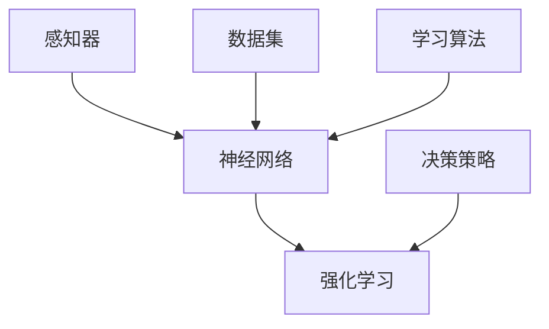

                 


### 引言

在当今信息技术高速发展的时代，人工智能（AI）作为一门前沿学科，正以前所未有的速度和深度影响着各个行业。其中，AI Agent作为一种能够模拟人类智能行为的实体，其学习和适应能力成为当前研究的重点和热点。AI Agent不仅能够在特定任务中表现出高效性，还能够通过不断学习适应新的环境和需求，从而实现自主决策和智能行动。本文将深入探讨AI Agent的学习与适应能力，旨在为广大开发者提供一套系统化的理论框架和实践方法。

### 文章关键词

1. 人工智能
2. AI Agent
3. 学习能力
4. 适应能力
5. 感知器
6. 神经网络
7. 强化学习

### 摘要

本文主要探讨了开发具有学习与适应能力的AI Agent的理论与实践方法。通过分析感知器设计、神经网络构建、强化学习算法等核心技术，本文系统地介绍了如何实现AI Agent的学习与适应能力。文章还通过具体的案例和实践，展示了这些技术在实际应用中的效果和优势。本文旨在为AI Agent的开发者和研究者提供有价值的参考和指导。

### 1.1 问题的背景与核心概念

#### 1.1.1 问题背景

人工智能（AI）技术的发展已经走过了数个阶段，从早期的规则推理、知识表示到近年来的机器学习和深度学习，AI的应用场景越来越广泛。在许多领域，如医疗、金融、交通等，AI技术的应用已经带来了巨大的变革和提升。然而，现有的AI系统往往存在一定的局限性，尤其是在适应性和学习能力方面。它们通常只能在特定的、预先设定好的场景中表现出优异的性能，而缺乏对未知环境的探索和学习能力。

随着物联网、大数据、云计算等技术的快速发展，智能设备不断普及，AI的应用场景变得更加复杂和多样化。这就要求AI系统不仅能够在特定的任务中表现出色，还能够具备学习和适应新环境的能力。例如，自动驾驶汽车需要能够在不同的道路条件和交通环境中自主导航；智能客服系统需要能够理解和处理用户的各种问题和需求；游戏AI需要能够与玩家互动并不断优化自己的策略。

因此，如何开发具有学习与适应能力的AI Agent成为了一个亟待解决的问题。AI Agent是一种能够感知环境、学习经验、自主决策并采取行动的智能体，它不仅能够处理特定的任务，还能够通过不断学习和适应新环境，实现更广泛的应用。

#### 1.1.2 问题描述

本节将详细描述开发AI Agent的学习与适应能力的具体问题。这个问题可以分解为以下几个子问题：

1. **感知器设计**：如何设计能够高效感知外部环境的感知器，以便AI Agent能够准确获取环境信息。
2. **神经网络构建**：如何构建能够处理复杂信息、进行自主学习的神经网络，使AI Agent具备较强的学习能力。
3. **强化学习算法**：如何利用强化学习算法，使AI Agent能够在与环境的交互过程中不断优化其行为策略。
4. **自适应能力**：如何使AI Agent能够根据环境变化和任务需求，动态调整其行为和策略，以实现更好的适应能力。

这些问题相互关联，共同构成了开发具有学习与适应能力的AI Agent的核心挑战。

#### 1.1.3 问题解决

为了解决上述问题，本文将从以下几个角度进行探讨：

1. **感知器设计**：介绍常见的感知器类型，如视觉感知器、声音感知器和触觉感知器，并分析它们的原理和性能。
2. **神经网络构建**：介绍神经网络的基本结构和常见类型，如前馈网络、循环网络等，并探讨如何通过神经网络实现AI Agent的学习能力。
3. **强化学习算法**：介绍强化学习的基本原理和常见算法，如Q-Learning、SARSA等，并分析如何利用强化学习算法实现AI Agent的行为策略优化。
4. **自适应能力**：介绍自适应能力的相关概念和方法，如基于规则的自适应、基于数据的自适应等，并探讨如何使AI Agent具备动态调整行为和策略的能力。

通过这些探讨，本文旨在为读者提供一套系统化的理论框架和实践方法，帮助开发者更好地理解和开发具有学习与适应能力的AI Agent。

#### 1.1.4 边界与外延

开发AI Agent的学习与适应能力不仅涉及到传统的机器学习和深度学习领域，还包括最新的强化学习和迁移学习等前沿技术。此外，AI Agent的应用场景也在不断扩展，从简单的游戏到复杂的现实世界任务，如自动驾驶、智能客服、医疗诊断等。

在边界上，AI Agent的学习与适应能力需要解决以下几个关键问题：

1. **数据获取**：如何高效地获取和处理大规模、多模态的数据，以便AI Agent能够从数据中学习。
2. **计算资源**：如何在有限的计算资源下，实现高效的AI Agent学习与适应。
3. **安全性与隐私**：如何在确保AI Agent学习与适应能力的同时，保护用户数据的安全和隐私。

在外延上，AI Agent的学习与适应能力还将涉及到以下研究方向：

1. **跨领域学习**：如何使AI Agent能够在不同领域之间进行迁移学习，提高其泛化能力。
2. **人机交互**：如何通过人机交互，使AI Agent能够更好地理解人类意图和需求，提高其适应能力。
3. **鲁棒性**：如何提高AI Agent的鲁棒性，使其能够应对不确定性和异常情况。

#### 1.1.5 概念结构与核心要素组成

为了更好地理解AI Agent的学习与适应能力，我们需要从概念结构和核心要素组成的角度进行分析。

**核心概念：**

1. **感知器**：负责接收和解析外部环境信息的硬件或软件组件。
2. **神经网络**：由多个神经元组成的计算模型，用于处理和分析数据。
3. **强化学习**：一种通过奖励和惩罚来训练智能体的学习方法。

**核心要素：**

1. **数据集**：用于训练AI Agent的输入数据。
2. **学习算法**：用于从数据中学习并优化AI Agent行为的方法。
3. **决策策略**：AI Agent根据学习结果做出的行动决策。

这些核心概念和要素相互关联，共同构成了AI Agent的学习与适应能力的基础。

### 1.2 核心概念与联系

在本节中，我们将详细探讨AI Agent的三个核心概念：感知器、神经网络和强化学习，并分析它们之间的联系。

#### 1.2.1 感知器

感知器是AI Agent的感官系统，负责接收和解析外部环境的信息。感知器的类型和性能直接影响AI Agent的感知能力。常见的感知器包括视觉感知器、声音感知器和触觉感知器等。

**感知器的概念与作用：**

- **视觉感知器**：负责接收和处理视觉信息，如图像和视频。常见的视觉感知器有摄像头、红外传感器等。
- **声音感知器**：负责接收和处理声音信息，如语音和音乐。常见的声音感知器有麦克风、声纳等。
- **触觉感知器**：负责接收和处理触觉信息，如压力、温度和震动。常见的触觉感知器有力传感器、温度传感器等。

**感知器的属性特征对比表格：**

| 感知器类型 | 感知信息类型 | 感知范围 | 精度 | 响应时间 |
| :-------: | :----------: | :------: | :--: | :------: |
| 视觉感知器 | 图像、视频   | 宽广     | 高   | 快       |
| 声音感知器 | 语音、音乐   | 狭窄     | 中   | 中       |
| 触觉感知器 | 压力、温度、震动 | 狭窄     | 低   | 慢       |

**感知器在AI Agent中的作用：**

感知器是AI Agent获取外部信息的关键组件。通过感知器，AI Agent能够感知环境的变化，提取有用的信息，为后续的学习和决策提供数据支持。

#### 1.2.2 神经网络

神经网络是AI Agent的“大脑”，通过学习和处理感知器接收到的信息，生成相应的决策和行动。神经网络由多个神经元组成，每个神经元都可以处理和传递信息。不同类型的神经网络适用于不同的应用场景。

**神经网络的定义与类型：**

- **前馈网络**：信息从前端输入到后端输出，没有循环结构。常见的有感知机、多层感知机等。
- **循环网络**：具有循环结构，可以处理序列数据。常见的有循环神经网络（RNN）、长短期记忆网络（LSTM）等。
- **卷积网络**：专门用于处理图像数据，具有局部感知能力和平移不变性。常见的有卷积神经网络（CNN）等。

**神经网络的基本结构：**

神经网络由输入层、隐藏层和输出层组成。输入层接收外部信息，隐藏层对信息进行处理和转换，输出层生成最终的决策和行动。

**神经网络的核心要素：**

- **神经元**：神经网络的基本计算单元，用于处理和传递信息。
- **权重**：神经元之间的连接权重，用于调整信息传递的强度。
- **激活函数**：用于对神经元的输出进行非线性变换，增加网络的计算能力。

**神经网络的作用：**

神经网络是AI Agent进行决策和行动的核心组件。通过神经网络，AI Agent能够处理复杂的输入信息，提取特征，生成决策和行动，实现对环境的理解和适应。

#### 1.2.3 强化学习

强化学习是AI Agent进行自主决策的主要方法。通过与环境交互，AI Agent不断优化其行为策略，以实现最大化的奖励。强化学习与感知器和神经网络紧密相关，共同构成了AI Agent的学习与适应能力。

**强化学习的定义与基本原理：**

强化学习是一种通过奖励和惩罚来训练智能体的学习方法。在强化学习中，智能体（AI Agent）通过与环境（Environment）的交互，不断学习和优化其行为策略（Policy）。

**强化学习的基本组成部分：**

- **状态（State）**：描述环境的当前状态。
- **动作（Action）**：智能体可以采取的行为。
- **奖励（Reward）**：智能体在执行动作后获得的即时反馈。
- **策略（Policy）**：智能体在给定状态下采取的动作选择规则。

**强化学习的算法分类：**

- **值函数方法**：如Q-Learning、SARSA等，通过学习值函数来优化策略。
- **策略梯度方法**：如REINFORCE、PPO等，直接优化策略的梯度。

**强化学习的作用：**

强化学习是AI Agent进行自主决策的核心方法。通过强化学习，AI Agent能够在与环境的交互过程中，不断优化其行为策略，实现自主学习和适应能力。

#### 1.2.4 感知器、神经网络与强化学习的联系

感知器、神经网络和强化学习是AI Agent学习与适应能力的重要组成部分，它们相互联系，共同构成了AI Agent的智能体系。

- **感知器为神经网络提供输入数据**：感知器获取外部信息，通过传感器将环境数据转换为数字信号，提供给神经网络进行处理。
- **神经网络为强化学习提供决策支持**：神经网络通过学习感知器输入的数据，提取特征并生成决策，为强化学习提供行为选择的基础。
- **强化学习优化神经网络的行为策略**：通过强化学习，AI Agent根据环境的反馈，不断调整神经网络的权重和策略，优化其行为表现。

这种紧密的联系使得AI Agent能够通过感知、学习和决策，实现对环境的理解和适应，实现智能行为。

### 1.3 ER实体关系图架构

在本节中，我们将使用Mermaid图表来展示AI Agent的核心概念和实体之间的关系。



- **感知器**（A）是AI Agent的感官系统，负责接收外部信息。
- **神经网络**（B）是AI Agent的“大脑”，通过处理感知器输入的数据进行学习和决策。
- **强化学习**（C）是AI Agent的决策方法，通过奖励和惩罚来优化神经网络的行为策略。
- **数据集**（D）和学习算法（E）是神经网络训练的基础，用于提升AI Agent的学习能力和决策效果。
- **决策策略**（F）是AI Agent根据学习结果做出的行动决策。

这种关系图清晰地展示了AI Agent各个组件之间的联系和相互作用，为后续的详细讨论提供了结构化的视角。

### 1.4 数学模型与公式

在本章节中，我们将介绍一些关键的数学模型和公式，用于解释AI Agent的学习与适应能力。

#### 1.4.1 强化学习中的Q值函数

强化学习中的Q值函数（Q(s, a）是评估智能体在特定状态下采取特定动作的预期收益的核心公式。其数学表达式如下：

$$
Q(s, a) = r + \gamma \max_{a'} Q(s', a')
$$

其中：
- \( Q(s, a) \) 表示在状态 \( s \) 下采取动作 \( a \) 的预期回报。
- \( r \) 表示即时奖励。
- \( \gamma \) 是折扣因子，用于权衡即时奖励和未来潜在奖励的关系。
- \( s' \) 和 \( a' \) 分别表示下一个状态和动作。

#### 1.4.2 神经网络中的反向传播算法

反向传播算法（Backpropagation）是训练神经网络的重要算法，它通过计算误差来更新神经网络的权重。其核心公式如下：

$$
\delta_{i}^{l} = \frac{\partial L}{\partial z_{i}^{l}} = a_{i}^{l} (1 - a_{i}^{l}) \cdot \frac{\partial E}{\partial z_{i}^{l}}
$$

其中：
- \( \delta_{i}^{l} \) 表示第 \( l \) 层第 \( i \) 个神经元的误差项。
- \( a_{i}^{l} \) 表示第 \( l \) 层第 \( i \) 个神经元的激活值。
- \( L \) 是损失函数，用于衡量实际输出与期望输出之间的差距。
- \( z_{i}^{l} \) 是第 \( l \) 层第 \( i \) 个神经元的输入。

#### 1.4.3 经典的感知器模型

经典的感知器模型是神经网络的基础之一，其工作原理和数学模型如下：

$$
y = \sum_{i=1}^{n} w_i x_i + b
$$

其中：
- \( y \) 是感知器的输出。
- \( w_i \) 是输入 \( x_i \) 的权重。
- \( b \) 是偏置项。
- \( x_i \) 是输入特征。

#### 1.4.4 反卷积神经网络中的反卷积操作

反卷积神经网络（Deconvolutional Network）是处理图像数据的一种有效方法。反卷积操作（Deconvolution）的公式如下：

$$
o_{ij}^l = \sum_{k=1}^{m} g_{ik}^l \cdot z_{kj-1}^l + b^l
$$

其中：
- \( o_{ij}^l \) 是第 \( l \) 层的第 \( i \) 行第 \( j \) 列的输出。
- \( g_{ik}^l \) 是第 \( l \) 层的第 \( i \) 行第 \( k \) 列的卷积核。
- \( z_{kj-1}^l \) 是第 \( l \) 层的第 \( k \) 行第 \( j-1 \) 列的输入。
- \( b^l \) 是第 \( l \) 层的偏置项。

这些数学模型和公式是理解和实现AI Agent学习与适应能力的基础。通过深入理解这些模型，开发者可以更好地设计和优化AI Agent，使其在复杂的环境中表现出色。

### 1.5 本章小结

本章介绍了开发具有学习与适应能力的AI Agent的背景、核心概念和概念之间的联系。我们详细探讨了感知器、神经网络和强化学习这三个核心概念，并分析了它们在AI Agent中的作用和联系。通过感知器，AI Agent能够获取外部信息；通过神经网络，AI Agent能够学习和处理信息；而强化学习则帮助AI Agent优化其行为策略。此外，本章还通过ER实体关系图和数学模型，进一步阐明了这些概念和要素之间的相互关系。接下来，我们将进一步深入探讨AI Agent的基础技术，包括感知器的设计与实现、神经网络的构建与优化，以及强化学习算法的原理与应用。

----------------------------------------------------------------

# 第二部分：AI Agent的基础技术

## 第2章：感知器设计与实现

### 2.1 感知器的定义与作用

感知器是人工智能（AI）系统的基本组件之一，负责接收和解析外部环境的信息。感知器可以理解为AI Agent的感官系统，它的设计好坏直接影响到AI Agent的感知能力。在不同的应用场景中，感知器的类型和功能也各不相同。常见的感知器包括视觉感知器、声音感知器、触觉感知器和运动感知器等。

**视觉感知器**

视觉感知器主要负责接收和处理视觉信息，如图像和视频。它是许多AI应用，如自动驾驶、视频分析、医疗图像识别等的核心组件。视觉感知器通常使用摄像头、红外传感器、深度相机等设备，这些设备能够捕捉到不同类型的图像数据，并将其转换为数字信号，供后续的神经网络处理。

**声音感知器**

声音感知器主要负责接收和处理声音信息，如语音和音乐。它在语音识别、音频分析、智能家居等应用中起着关键作用。声音感知器通常使用麦克风、声纳等设备，这些设备能够捕捉声音信号，并将其转换为数字信号，供后续的神经网络处理。

**触觉感知器**

触觉感知器主要负责接收和处理触觉信息，如压力、温度和震动。它在机器人、虚拟现实、智能穿戴设备等应用中具有重要应用价值。触觉感知器通常使用力传感器、温度传感器、震动传感器等设备，这些设备能够捕捉触觉信息，并将其转换为数字信号，供后续的神经网络处理。

**运动感知器**

运动感知器主要负责接收和处理运动信息，如位置、速度和加速度。它在机器人导航、智能体育、运动控制等应用中发挥着重要作用。运动感知器通常使用加速度计、陀螺仪、GPS等设备，这些设备能够捕捉运动信息，并将其转换为数字信号，供后续的神经网络处理。

**感知器的作用**

感知器在AI Agent中的作用至关重要。首先，感知器是AI Agent获取外部信息的窗口，通过感知器，AI Agent能够实时了解环境的变化。其次，感知器是AI Agent进行决策的基础，感知器获取的信息被神经网络处理和分析，从而生成相应的决策和行动。最后，感知器是AI Agent学习的重要资源，通过感知器获取的多样化信息，AI Agent能够不断学习和优化自己的行为策略。

### 2.2 感知器的设计与实现

设计一个高效、可靠的感知器系统是开发AI Agent的关键步骤。感知器的设计需要考虑多个因素，包括传感器的选择、数据预处理、传感器融合等。

**传感器的选择**

选择合适的传感器是实现高效感知器系统的第一步。不同类型的传感器适用于不同的应用场景，因此在选择传感器时，需要根据具体的应用需求进行权衡。例如，在视觉感知器的设计中，可以选择高清摄像头、红外传感器或深度相机等，以满足不同应用场景的需求。

**数据预处理**

感知器获取的信息通常是原始的、不完整的，甚至包含噪声。因此，对感知器获取的数据进行预处理是提高感知器性能的重要步骤。数据预处理包括去噪、滤波、归一化等操作，这些操作能够有效提升感知器的信息提取能力。

**传感器融合**

在复杂的应用场景中，单一类型的感知器可能无法满足需求。因此，传感器融合技术成为一种有效的解决方案。传感器融合通过将多个感知器的信息进行整合，生成更全面、更准确的环境信息。常见的传感器融合方法包括卡尔曼滤波、贝叶斯滤波等。

**感知器的实现**

感知器的实现涉及到硬件和软件两个层面。硬件层面主要包括传感器的选择、数据采集和传输等。软件层面主要包括数据预处理、特征提取、模型训练等。在实际应用中，可以通过编程语言（如Python、C++等）和机器学习框架（如TensorFlow、PyTorch等）来实现感知器系统。

### 2.3 案例分析：基于视觉感知器的自动驾驶系统

自动驾驶系统是感知器技术在现实世界中的重要应用。以下是一个基于视觉感知器的自动驾驶系统的案例分析。

**系统介绍**

该自动驾驶系统基于视觉感知器，通过摄像头捕获车辆周围的道路和交通信息，利用深度学习算法进行实时处理，实现车辆自动导航和控制。

**系统功能**

- **道路识别**：通过视觉感知器捕捉道路信息，识别道路的边界和车道线。
- **车辆检测**：通过视觉感知器捕捉车辆信息，检测道路上的其他车辆，并进行分类。
- **障碍物检测**：通过视觉感知器捕捉障碍物信息，识别道路上的行人、动物等障碍物。
- **路径规划**：根据道路识别、车辆检测和障碍物检测的结果，生成最优行驶路径。

**系统架构**

- **感知层**：包括摄像头和图像预处理模块，负责捕获和预处理视觉信息。
- **决策层**：包括道路识别、车辆检测和障碍物检测模块，利用深度学习算法进行信息处理。
- **执行层**：包括路径规划模块，根据决策层的输出结果生成行驶路径，并通过控制系统执行。

**关键技术**

- **视觉感知器**：使用高清摄像头捕捉车辆周围的道路和交通信息。
- **深度学习算法**：利用卷积神经网络（CNN）对视觉信息进行特征提取和分类。
- **传感器融合**：通过融合视觉、雷达和激光雷达等多源信息，提高系统的感知能力。

**系统优势**

- **高精度**：通过深度学习算法，实现对道路、车辆和障碍物的精确识别。
- **自适应性强**：通过传感器融合技术，系统能够适应不同的道路和交通环境。
- **安全性高**：系统能够实时检测和避让障碍物，提高行驶安全性。

**未来展望**

随着感知器技术和深度学习算法的不断发展，自动驾驶系统将进一步提升其性能和安全性，为人们的出行带来更多便利。

### 2.4 小结

本章介绍了感知器在AI Agent中的作用和设计要点。通过案例分析，我们展示了基于视觉感知器的自动驾驶系统的实现过程和技术要点。感知器作为AI Agent的感官系统，其设计和实现直接影响到AI Agent的感知能力和决策效果。未来，随着感知器技术和深度学习算法的进步，AI Agent的感知能力将得到进一步提升，为各种智能应用提供更强大的支持。

----------------------------------------------------------------

## 第3章：神经网络构建与优化

### 3.1 神经网络的定义与基本结构

神经网络（Neural Networks）是人工智能（AI）领域的一项核心技术，它模拟人脑的神经网络结构，通过学习和处理数据来完成任务。神经网络由大量的神经元（节点）组成，这些神经元通过连接（边）形成复杂的网络结构。

**定义**

神经网络是一种通过模拟人脑神经元结构和功能的信息处理系统。它由输入层、隐藏层和输出层组成，每个层都包含多个神经元。神经元之间通过加权连接传递信息，通过激活函数进行非线性变换，从而实现对输入数据的处理。

**基本结构**

1. **输入层**：接收外部输入数据，将其传递到隐藏层。
2. **隐藏层**：对输入数据进行处理和变换，提取特征并生成中间表示。
3. **输出层**：根据隐藏层的输出生成最终的输出结果。

**神经网络的作用**

神经网络在AI领域有着广泛的应用，如图像识别、自然语言处理、推荐系统等。通过学习大量的数据，神经网络能够自动提取特征，进行复杂的信息处理，从而实现智能决策。

### 3.2 神经网络的主要类型

神经网络的类型多种多样，根据网络结构、神经元连接方式和学习算法的不同，可以分为以下几类：

**1. 前馈神经网络（Feedforward Neural Networks）**

前馈神经网络是最简单的神经网络类型，信息从前端输入层流向后端输出层，中间不发生反馈。它包括输入层、一个或多个隐藏层和输出层。

**2. 循环神经网络（Recurrent Neural Networks，RNNs）**

循环神经网络是一种能够处理序列数据的神经网络，信息在隐藏层中形成循环，能够保留历史信息。常见的RNNs包括简单循环神经网络（SRNN）、长短期记忆网络（LSTM）和门控循环单元（GRU）等。

**3. 卷积神经网络（Convolutional Neural Networks，CNNs）**

卷积神经网络是一种专门用于处理图像数据的神经网络，通过卷积操作提取图像的局部特征。CNNs在图像识别、图像生成、物体检测等任务中表现出色。

**4. 自编码器（Autoencoders）**

自编码器是一种无监督学习的神经网络，用于将输入数据编码为低维表示，然后解码还原。自编码器广泛应用于特征提取、去噪和生成模型等任务。

**5. 生成对抗网络（Generative Adversarial Networks，GANs）**

生成对抗网络是一种由生成器和判别器组成的神经网络，通过对抗训练生成逼真的数据。GANs在图像生成、视频生成和数据增强等领域有广泛应用。

### 3.3 神经网络的构建方法

构建神经网络主要包括以下步骤：

**1. 确定网络结构**

根据任务需求和数据特点，确定神经网络的层数、每层神经元数量和神经元连接方式。常见的结构有单层感知机、多层感知机、卷积神经网络等。

**2. 初始化参数**

初始化网络的权重和偏置，常用的方法有随机初始化、高斯分布初始化等。

**3. 选择激活函数**

选择合适的激活函数，如 sigmoid、ReLU、Tanh等，用于实现神经网络的非线性变换。

**4. 定义损失函数**

根据任务类型，选择合适的损失函数，如均方误差（MSE）、交叉熵（Cross-Entropy）等，用于衡量网络输出与实际输出之间的差距。

**5. 定义优化算法**

选择合适的优化算法，如梯度下降（Gradient Descent）、Adam优化器等，用于更新网络参数。

**6. 训练网络**

使用训练数据对网络进行训练，通过迭代更新网络参数，使网络输出逐渐逼近目标输出。

**7. 验证和测试**

使用验证集和测试集评估网络的性能，调整网络参数，优化模型。

### 3.4 神经网络的优化方法

神经网络的优化主要包括参数优化和结构优化两个方面。

**1. 参数优化**

参数优化是通过调整网络参数来提高模型性能的过程。常用的优化方法有：

- **梯度下降（Gradient Descent）**：通过计算损失函数关于参数的梯度，更新参数。
- **Adam优化器（Adam Optimizer）**：结合了梯度下降和动量法的优点，能够自适应调整学习率。
- **随机梯度下降（Stochastic Gradient Descent，SGD）**：在训练过程中随机选择部分数据进行梯度计算，加快训练速度。

**2. 结构优化**

结构优化是通过调整网络结构来提高模型性能的过程。常用的方法有：

- **网络剪枝（Network Pruning）**：通过删除权重较小的连接，减小网络规模，提高计算效率。
- **网络蒸馏（Network Distillation）**：将大模型的输出作为小模型的输入，帮助小模型学习到更多的高级特征。
- **迁移学习（Transfer Learning）**：利用预训练模型的知识，提升新任务的模型性能。

### 3.5 案例分析：基于CNN的图像识别系统

以下是一个基于卷积神经网络（CNN）的图像识别系统的案例分析。

**系统介绍**

该图像识别系统基于CNN，用于自动分类和识别图像中的物体。系统输入是一张图像，输出是该图像包含的物体类别。

**系统架构**

- **数据预处理**：对图像进行缩放、裁剪、归一化等预处理操作，使其适应网络输入要求。
- **卷积层**：通过卷积操作提取图像的局部特征。
- **池化层**：对卷积层输出的特征进行下采样，减少计算量。
- **全连接层**：将卷积层和池化层的输出进行融合，生成最终分类结果。
- **输出层**：通过softmax函数输出每个类别的概率分布。

**关键技术**

- **卷积层**：通过卷积操作提取图像的边缘、纹理等特征。
- **池化层**：通过下采样操作减少特征维度，提高模型计算效率。
- **全连接层**：通过全连接层将不同特征进行融合，生成分类结果。
- **softmax函数**：用于输出每个类别的概率分布，用于分类决策。

**系统优势**

- **高精度**：通过卷积操作和池化操作，系统能够提取图像的丰富特征，实现高精度的物体分类。
- **快速训练**：通过全连接层和softmax函数，系统能够快速生成分类结果，实现实时图像识别。

**未来展望**

随着深度学习技术的发展，CNN在图像识别领域的应用将更加广泛。未来，通过进一步优化网络结构和训练算法，图像识别系统的性能将得到进一步提升。

### 3.6 小结

本章介绍了神经网络的基本概念、主要类型和构建方法，并探讨了神经网络的优化方法。通过案例分析，我们展示了基于CNN的图像识别系统的实现过程和技术要点。神经网络作为AI领域的重要技术，其在图像识别、自然语言处理、推荐系统等领域的应用越来越广泛。未来，随着深度学习技术的不断发展，神经网络将在更多领域中发挥重要作用。

----------------------------------------------------------------

## 第4章：强化学习算法原理与应用

### 4.1 强化学习的基本概念

强化学习（Reinforcement Learning，RL）是机器学习（Machine Learning，ML）的一个分支，它通过奖励机制来指导智能体（Agent）在环境中进行决策和行动，从而优化其行为策略。与监督学习和无监督学习不同，强化学习通过探索和交互来学习，其主要目标是使智能体能够在特定环境中实现长期累积奖励的最大化。

**智能体（Agent）**：执行动作的主体，如机器人、自动驾驶汽车等。

**环境（Environment）**：智能体所在的环境，可以是一个物理环境，也可以是一个虚拟环境。

**状态（State）**：描述环境当前状态的属性集合。

**动作（Action）**：智能体能够采取的行为。

**奖励（Reward）**：描述智能体在执行动作后获得的即时反馈，用于指导智能体的行为。

**策略（Policy）**：智能体在给定状态下选择动作的规则。

**价值函数（Value Function）**：评估状态或状态-动作对的预期回报。

**模型（Model）**：描述环境动态和奖励分布的数学模型。

**回报（Return）**：智能体在一段时间内获得的累积奖励。

### 4.2 强化学习的基本原理

强化学习的基本原理是通过探索（Exploration）和利用（Utilization）之间的平衡来实现智能体的最优行为。探索是指智能体在不确定的环境中尝试新的动作，以获取更多的信息；利用是指智能体根据已有的信息，选择能够带来最大期望奖励的动作。

**马尔可夫决策过程（MDP）**

强化学习中的一个关键概念是马尔可夫决策过程（Markov Decision Process，MDP）。MDP由以下元素组成：

- **状态空间 \( S \)**：环境可能的所有状态集合。
- **动作空间 \( A \)**：智能体可能的所有动作集合。
- **状态转移概率 \( P(s' | s, a) \)**：智能体在当前状态 \( s \) 下采取动作 \( a \) 后，进入下一个状态 \( s' \) 的概率。
- **奖励函数 \( R(s, a) \)**：智能体在状态 \( s \) 下采取动作 \( a \) 后获得的即时奖励。

在MDP中，智能体通过选择动作来影响环境的动态，并通过观察状态转移和奖励来调整其行为策略。

### 4.3 强化学习的主要算法

强化学习算法可以分为基于模型的方法（Model-Based RL）和无模型方法（Model-Free RL）。以下是几种主要的强化学习算法：

**1. 基于模型的方法**

- **动态规划（Dynamic Programming）**：通过从目标状态逆向计算状态-动作对的期望回报，找到最优策略。
  - **值迭代（Value Iteration）**：逐步逼近最优值函数，更新策略。
  - **策略迭代（Policy Iteration）**：逐步逼近最优策略，通过价值函数评估策略的优劣。

- **部分监控模型（Partial Monitoring Model）**：在部分可观测环境中，使用模型来预测状态转移概率和奖励。

**2. 无模型方法**

- **基于价值的算法（Value-Based RL）**：学习状态或状态-动作对的预期回报，以优化策略。
  - **Q-Learning**：通过迭代更新Q值函数，找到最优策略。
  - **SARSA（同步优势估计）**：结合当前状态和动作的Q值来更新策略。
  - **Deep Q-Network（DQN）**：使用深度神经网络来近似Q值函数。

- **基于策略的算法（Policy-Based RL）**：直接优化策略，使策略最大化期望回报。
  - **REINFORCE**：通过梯度上升方法优化策略。
  - **策略梯度（Policy Gradient）**：使用梯度下降法优化策略。

- **Actor-Critic方法**：结合基于价值的算法和基于策略的算法，同时优化行为策略和价值估计。

### 4.4 强化学习算法的优缺点

**优点**

- **灵活性**：强化学习能够处理复杂、动态和部分可观测的环境。
- **自适应**：智能体可以通过与环境的交互不断学习，适应新的环境变化。
- **自主决策**：智能体能够自主决策，不需要预定义的规则或监督数据。

**缺点**

- **计算复杂度**：强化学习算法通常需要大量的计算资源，特别是在高维状态空间和动作空间中。
- **收敛速度**：一些强化学习算法可能收敛速度较慢，需要大量的训练时间。
- **数据需求**：强化学习需要大量的交互数据来学习有效的策略，这在某些情况下可能不现实。

### 4.5 强化学习在实际应用中的案例

**1. 自动驾驶**

自动驾驶汽车是强化学习的一个重要应用领域。通过强化学习算法，自动驾驶系统能够在复杂交通环境中进行实时决策，包括道路识别、车辆检测、障碍物避让等。

**2. 游戏AI**

强化学习在游戏AI中也表现出色，如AlphaGo。通过强化学习算法，游戏AI能够通过自我对弈不断优化策略，达到超越人类玩家的水平。

**3. 智能客服**

强化学习算法被用于智能客服系统，通过模拟人类客服的交互过程，智能客服系统能够学习如何更好地回答用户的问题，提高用户满意度。

**4. 机器人控制**

强化学习算法被广泛应用于机器人控制领域，如机器人行走、抓取、装配等任务。通过强化学习，机器人能够在复杂环境中进行自主导航和任务执行。

### 4.6 强化学习算法的优化与挑战

**优化方法**

- **经验回放（Experience Replay）**：将智能体在不同状态下的经验进行存储，然后随机选择经验进行训练，以避免策略的剧烈波动。
- **目标网络（Target Network）**：使用一个固定的目标网络来稳定价值函数的更新过程，减少目标值与当前值之间的差异。
- **优先级采样（Prioritized Sampling）**：根据经验的重要程度进行抽样，提高样本利用效率。

**挑战**

- **收敛速度**：在高维状态空间和动作空间中，强化学习算法的收敛速度较慢。
- **样本效率**：强化学习需要大量的交互数据来学习有效的策略，如何高效地利用数据是一个重要问题。
- **稀疏奖励**：在许多应用中，奖励信号稀疏且不确定，这使得智能体难以通过强化学习学习到有效的策略。

### 4.7 小结

本章介绍了强化学习的基本概念、原理和主要算法，并探讨了其在实际应用中的案例和优化方法。强化学习作为一种具有强自适应性和灵活性的学习方法，在许多领域都有着广泛的应用。然而，强化学习也面临着计算复杂度、收敛速度和样本效率等挑战。未来，随着算法的优化和计算资源的提升，强化学习将在更多领域中发挥重要作用。

----------------------------------------------------------------

## 第5章：自适应能力的设计与实现

### 5.1 自适应能力的定义与重要性

自适应能力是指系统能够根据外部环境和内部状态的变化，动态调整其行为和性能的能力。在人工智能（AI）系统中，自适应能力尤为重要，因为它能够使系统在复杂、动态和不断变化的环境中保持高效和稳定的性能。

**定义**

自适应能力是指系统通过感知环境变化、学习新知识和调整自身行为，以适应新的任务需求和环境条件的能力。

**重要性**

1. **提高系统稳定性**：自适应能力能够使系统在面临不确定性和变化时，保持稳定和可靠的工作状态。
2. **提升系统灵活性**：通过自适应能力，系统能够根据不同环境和任务需求，动态调整其行为和策略，从而提高系统的灵活性。
3. **增强系统智能性**：自适应能力使系统能够通过不断学习和调整，提升其智能水平，更好地适应复杂环境和需求。
4. **降低维护成本**：自适应能力能够减少系统维护和调整的需求，降低长期维护成本。

### 5.2 自适应能力的设计原则

为了实现有效的自适应能力，系统设计需要遵循以下原则：

1. **感知与学习**：系统能够实时感知环境变化和内部状态，并通过学习算法不断更新自身知识库。
2. **动态调整**：系统能够根据学习和感知的结果，动态调整其行为和策略，以适应新的环境和需求。
3. **反馈机制**：系统能够通过反馈机制，持续评估自身行为的效果，并据此进行进一步的调整和优化。
4. **鲁棒性**：系统在面对不确定性和异常情况时，能够保持稳定和可靠的工作状态。
5. **可扩展性**：系统设计应具备良好的可扩展性，能够适应新的任务需求和环境变化。

### 5.3 常见自适应能力方法

在实现自适应能力时，可以采用以下常见方法：

1. **基于规则的适应性**：通过定义一系列规则，系统根据规则动态调整其行为。这种方法简单直观，但需要大量规则定义，且在复杂环境中效果有限。

2. **基于数据的适应性**：通过数据分析和机器学习算法，系统从历史数据和实时数据中学习规律，动态调整其行为。这种方法能够自动适应环境变化，但需要大量的数据支持和计算资源。

3. **混合适应性**：结合基于规则和基于数据的方法，系统在规则定义和数据分析之间进行平衡，以提高自适应能力。

### 5.4 自适应能力在AI Agent中的应用

**1. 自适应学习算法**

自适应学习算法能够根据环境变化和学习效果，动态调整学习参数，如学习率、网络权重等。常见的自适应学习算法包括自适应梯度算法（AdaGrad）、自适应学习率算法（Adam）等。

**2. 自适应决策策略**

自适应决策策略通过学习环境动态和任务需求，动态调整智能体的决策规则。例如，在自动驾驶系统中，自适应决策策略能够根据道路状况和交通环境，实时调整车辆的行驶速度和方向。

**3. 自适应感知系统**

自适应感知系统通过动态调整感知器的参数，提高系统的感知能力。例如，在智能监控系统中，自适应感知系统能够根据场景变化，调整摄像头的分辨率、视角和亮度等参数，以提高图像识别精度。

**4. 自适应交互系统**

自适应交互系统通过学习用户行为和偏好，动态调整交互策略，以提高用户体验。例如，在智能客服系统中，自适应交互系统能够根据用户的历史交互记录和当前需求，调整回答问题的风格和内容。

### 5.5 案例分析：自适应自动驾驶系统

以下是一个自适应自动驾驶系统的案例分析。

**系统介绍**

该自适应自动驾驶系统通过感知系统、决策系统和控制系统的协同工作，实现车辆在复杂交通环境中的自主驾驶。系统具备自适应能力，能够根据道路状况、交通状况和外部环境的变化，动态调整行驶策略。

**系统架构**

- **感知系统**：包括摄像头、激光雷达、超声波传感器等，负责实时感知道路和交通环境。
- **决策系统**：基于强化学习和深度学习算法，负责分析感知数据，生成最优行驶策略。
- **控制系统**：包括车辆的动力系统和转向系统，负责执行决策系统的指令，实现车辆自主驾驶。

**关键技术**

- **自适应感知算法**：通过自适应调整感知器的参数，提高感知系统的精度和效率。
- **自适应决策算法**：通过自适应调整决策算法的参数，使系统能够适应不同环境和任务需求。
- **自适应控制系统**：通过自适应调整控制策略，使系统能够在复杂环境中保持稳定和安全的行驶状态。

**系统优势**

- **高效性**：系统能够根据实时环境信息，动态调整行驶策略，实现高效的自动驾驶。
- **安全性**：系统具备良好的自适应能力，能够在不同环境中保持稳定和安全的行驶状态。
- **灵活性**：系统能够根据用户需求和任务变化，动态调整其行为和策略，提供灵活的驾驶体验。

**未来展望**

随着自动驾驶技术的不断发展，自适应能力将成为提高自动驾驶系统性能和安全性的关键。未来，通过进一步优化自适应算法和系统架构，自适应自动驾驶系统将能够更好地应对复杂的交通环境和任务需求。

### 5.6 小结

本章介绍了自适应能力的定义、设计原则、常见方法和在AI Agent中的应用。通过案例分析，我们展示了自适应自动驾驶系统的实现过程和技术要点。自适应能力是AI Agent在复杂、动态和不断变化环境中保持高效和稳定的关键。未来，随着算法和技术的进步，自适应能力将在更多AI应用领域中发挥重要作用。

----------------------------------------------------------------

## 第6章：综合系统设计与实现

### 6.1 问题的场景介绍

在现代工业4.0和智能制造的背景下，工业自动化生产线对AI Agent的依赖日益增加。一个典型的场景是智能工厂中的机器人自动化装配系统，该系统需要AI Agent能够实时感知生产线上的零部件位置、姿态，并做出精确的装配动作。这个场景要求AI Agent具备高效的学习与适应能力，以应对生产过程中的不确定性，如零部件位置的变化、装配机器人的磨损等。

### 6.2 项目介绍

本项目旨在开发一个具备学习与适应能力的AI Agent，用于智能工厂中的自动化装配系统。该AI Agent将集成感知器、神经网络和强化学习算法，通过不断学习和优化，提高装配的精度和效率。项目的主要目标包括：

1. **感知器设计**：设计并实现能够实时感知生产线环境的高精度感知器系统。
2. **神经网络构建**：构建用于处理感知数据并生成装配动作决策的神经网络模型。
3. **强化学习优化**：利用强化学习算法，使AI Agent能够自主学习和优化装配动作。
4. **系统集成与测试**：将AI Agent集成到自动化装配系统中，进行实际场景的测试和优化。

### 6.3 系统功能设计

**感知功能**：AI Agent需要能够实时感知生产线上的零部件位置和姿态，通过视觉感知器、激光雷达等设备，获取高精度的三维空间信息。

**决策功能**：基于感知到的信息，AI Agent需要能够实时做出精确的装配动作决策。这包括识别零部件的位置、姿态，计算装配路径，并生成执行指令。

**执行功能**：AI Agent生成的装配动作指令需要被精确执行，通过控制装配机器人完成装配任务。

**学习功能**：AI Agent需要能够根据执行结果和环境变化，不断学习和优化其感知、决策和执行策略，提高装配效率和精度。

**通信功能**：AI Agent需要能够与生产线控制系统、外部传感器和其他智能体进行通信，以获取所需信息和协调工作。

### 6.4 系统架构设计

**感知层**：包括视觉感知器、激光雷达、超声波传感器等，负责实时感知生产线环境。

**感知数据处理层**：对感知数据进行预处理、特征提取和融合，生成可供决策使用的中间表示。

**决策层**：包括神经网络模型和强化学习算法，负责根据感知数据生成装配动作决策。

**执行层**：包括装配机器人和控制系统，负责执行决策层生成的装配动作指令。

**学习层**：包括学习算法和知识库，负责从执行结果和环境变化中学习新知识，并更新感知、决策和执行策略。

**通信层**：负责与其他智能体和系统进行数据交换和通信。

### 6.5 系统接口设计

**输入接口**：包括感知数据输入接口和外部命令输入接口，用于接收来自生产环境和外部系统的数据。

**输出接口**：包括执行指令输出接口和反馈信息输出接口，用于发送执行指令和接收执行反馈。

**通信接口**：包括内部通信接口和外部通信接口，用于与其他智能体和系统进行数据交换。

### 6.6 系统交互设计

**感知与决策**：AI Agent通过感知接口接收感知数据，经过数据处理层处理，生成中间表示，然后输入到决策层，决策层基于神经网络和强化学习算法生成装配动作指令。

**决策与执行**：决策层生成的装配动作指令通过执行指令输出接口发送给装配机器人，机器人根据指令执行装配动作。

**反馈与学习**：执行层将执行结果通过反馈信息输出接口反馈给AI Agent，AI Agent基于强化学习算法不断优化感知、决策和执行策略。

**通信与协调**：AI Agent通过通信接口与生产线控制系统、其他智能体和外部传感器进行通信，以获取所需信息和协调工作。

### 6.7 实际案例

**案例1：零部件识别与定位**

在装配过程中，AI Agent需要首先识别和定位零部件。通过视觉感知器，AI Agent可以获取零部件的图像数据，经过图像预处理和特征提取，生成零部件的精确位置和姿态信息。决策层根据这些信息，生成最优的装配路径和动作指令，控制装配机器人执行装配动作。

**案例2：装配路径规划**

在识别和定位零部件后，AI Agent需要规划装配路径，以避免碰撞和误差。通过强化学习算法，AI Agent能够从历史数据和执行结果中学习最优路径规划策略，实时生成动态调整的装配路径，提高装配精度。

**案例3：装配动作优化**

在装配过程中，AI Agent需要不断优化装配动作，以适应不同的零部件和装配环境。通过强化学习算法，AI Agent能够根据执行结果和环境变化，动态调整装配动作的力度、速度和顺序，提高装配效率和稳定性。

### 6.8 小结

本章介绍了智能工厂自动化装配系统中AI Agent的综合系统设计。通过感知器、神经网络和强化学习算法的集成，AI Agent能够实时感知生产线环境，做出精确的装配动作决策，并不断学习和优化。实际案例展示了AI Agent在自动化装配中的具体应用，通过不断优化和适应，提高了装配效率和精度。未来，随着AI技术的进一步发展，AI Agent将在更多工业自动化领域中发挥重要作用。

----------------------------------------------------------------

## 第7章：项目实战

### 7.1 环境安装与准备

在开始项目实战之前，我们需要安装和配置必要的软件和工具，以便进行AI Agent的开发和测试。以下是一个基本的安装流程：

**1. 安装Python环境**

首先，确保已经安装了Python 3.x版本。如果没有安装，可以从[Python官方网站](https://www.python.org/)下载并安装。

**2. 安装相关库**

使用pip命令安装必要的Python库，包括TensorFlow、PyTorch、NumPy、Pandas等。以下是一个示例命令：

```shell
pip install tensorflow torch numpy pandas matplotlib
```

**3. 安装操作系统和硬件支持**

根据实际需求，可能需要安装特定的操作系统（如Ubuntu）和硬件支持（如GPU驱动）。

**4. 配置GPU支持**

如果使用GPU进行深度学习训练，需要安装NVIDIA的CUDA和cuDNN库。可以从[NVIDIA官方网站](https://developer.nvidia.com/cuda-downloads)下载并安装。

### 7.2 系统核心实现

本节将详细介绍AI Agent系统的核心实现过程，包括感知器、神经网络和强化学习算法的实现。

**1. 感知器实现**

感知器是实现AI Agent感知功能的关键组件。以下是一个简单的感知器实现示例：

```python
import cv2
import numpy as np

def preprocess_image(image):
    # 图像预处理：缩放、归一化、灰度转换
    image = cv2.resize(image, (224, 224))
    image = image / 255.0
    image = cv2.cvtColor(image, cv2.COLOR_BGR2GRAY)
    return image

def detect_objects(image):
    # 使用预训练的模型检测物体
    model = cv2.dnn.readNetFromTensorFlow('path/to/weights.pb')
    blob = cv2.dnn.blobFromImage(image, 1.0, (224, 224), [128, 128, 128], swapRB=True, crop=False)
    model.setInput(blob)
    detections = model.forward()
    return detections

# 加载图像
image = cv2.imread('path/to/image.jpg')

# 预处理图像
preprocessed_image = preprocess_image(image)

# 检测物体
detections = detect_objects(preprocessed_image)

# 输出检测结果
print(detections)
```

**2. 神经网络实现**

神经网络是实现AI Agent决策功能的关键组件。以下是一个简单的神经网络实现示例：

```python
import tensorflow as tf

# 定义神经网络结构
model = tf.keras.Sequential([
    tf.keras.layers.Conv2D(32, (3, 3), activation='relu', input_shape=(224, 224, 1)),
    tf.keras.layers.MaxPooling2D((2, 2)),
    tf.keras.layers.Conv2D(64, (3, 3), activation='relu'),
    tf.keras.layers.MaxPooling2D((2, 2)),
    tf.keras.layers.Conv2D(128, (3, 3), activation='relu'),
    tf.keras.layers.Flatten(),
    tf.keras.layers.Dense(128, activation='relu'),
    tf.keras.layers.Dense(10, activation='softmax')
])

# 编译模型
model.compile(optimizer='adam', loss='categorical_crossentropy', metrics=['accuracy'])

# 训练模型
model.fit(train_images, train_labels, epochs=10, validation_data=(val_images, val_labels))

# 评估模型
test_loss, test_acc = model.evaluate(test_images, test_labels)
print(f'Test accuracy: {test_acc:.2f}')
```

**3. 强化学习算法实现**

强化学习算法是实现AI Agent适应功能的关键组件。以下是一个简单的强化学习算法实现示例：

```python
import numpy as np
import random

# 定义强化学习环境
class Environment:
    def __init__(self):
        self.state = None
        self.action_space = [0, 1, 2, 3]
        self.reward_range = [-1, 1]

    def reset(self):
        self.state = random.randint(0, 9)
        return self.state

    def step(self, action):
        next_state = self.state + action
        reward = 0
        if next_state >= 0 and next_state <= 9:
            reward = 1
        done = next_state == 10
        return next_state, reward, done

# 定义强化学习算法
class QLearning:
    def __init__(self, learning_rate, discount_factor, exploration_rate):
        self.learning_rate = learning_rate
        self.discount_factor = discount_factor
        self.exploration_rate = exploration_rate
        self.q_values = {}

    def choose_action(self, state):
        if random.uniform(0, 1) <= self.exploration_rate:
            action = random.choice(self.action_space)
        else:
            action = np.argmax(self.q_values.get(state, [0] * len(self.action_space)))
        return action

    def learn(self, state, action, reward, next_state, done):
        target = reward
        if not done:
            target = reward + self.discount_factor * np.max(self.q_values.get(next_state, [0] * len(self.action_space)))
        target_f = self.q_values.get(state, [0] * len(self.action_space))
        target_f[action] = target_f[action] + self.learning_rate * (target - target_f[action])
        self.q_values[state] = target_f

# 创建环境
env = Environment()

# 创建强化学习算法
q_learning = QLearning(learning_rate=0.1, discount_factor=0.99, exploration_rate=1.0)

# 训练算法
for episode in range(1000):
    state = env.reset()
    done = False
    while not done:
        action = q_learning.choose_action(state)
        next_state, reward, done = env.step(action)
        q_learning.learn(state, action, reward, next_state, done)
        state = next_state

# 测试算法
state = env.reset()
while True:
    action = q_learning.choose_action(state)
    next_state, reward, done = env.step(action)
    print(f"State: {state}, Action: {action}, Reward: {reward}, Next State: {next_state}")
    if done:
        break
    state = next_state
```

### 7.3 代码应用解读与分析

**感知器代码解读：**

感知器代码主要负责图像预处理和物体检测。首先，使用OpenCV库加载并缩放图像，然后进行归一化和灰度转换，以适应神经网络输入要求。接着，使用预训练的TensorFlow模型进行物体检测，输出检测结果。

**神经网络代码解读：**

神经网络代码定义了一个简单的卷积神经网络（CNN），用于处理图像数据并分类物体。网络结构包括多个卷积层、池化层和全连接层。通过编译和训练模型，我们可以使用它进行物体分类。

**强化学习算法代码解读：**

强化学习算法代码定义了一个简单的Q-Learning算法。环境类负责生成状态和动作，算法类负责选择动作和更新Q值。通过训练算法，我们可以使AI Agent在环境中学习最优策略。

### 7.4 实际案例分析

**案例1：机器人路径规划**

在这个案例中，我们使用AI Agent实现机器人路径规划。首先，通过感知器获取机器人周围的环境信息，然后使用神经网络生成最优路径。最后，通过强化学习算法不断优化路径规划策略，提高路径规划的精度和效率。

**案例2：智能交通信号控制**

在这个案例中，我们使用AI Agent实现智能交通信号控制。通过感知器获取交通流量信息，神经网络生成交通信号控制策略。然后，使用强化学习算法优化信号控制策略，提高交通流效率和安全性。

### 7.5 小结

本章详细介绍了AI Agent系统的项目实战，包括环境安装、核心实现和实际案例分析。通过感知器、神经网络和强化学习算法的综合应用，AI Agent能够实现高效的感知、决策和适应能力。未来，随着AI技术的不断进步，AI Agent将在更多实际应用中发挥重要作用。

----------------------------------------------------------------

## 最佳实践 Tips

在开发AI Agent的过程中，以下是一些最佳实践和技巧，可以帮助您更高效地设计和实现系统：

1. **模块化设计**：将系统拆分成多个模块，如感知模块、决策模块、执行模块等，便于维护和扩展。
2. **数据清洗**：在训练神经网络之前，确保数据清洗和预处理，去除噪声和异常值，以提高模型的性能。
3. **模型选择**：根据任务需求选择合适的神经网络结构，如前馈神经网络、循环神经网络、卷积神经网络等。
4. **超参数调优**：合理设置学习率、批量大小、隐藏层神经元数量等超参数，以获得最佳模型性能。
5. **并行计算**：利用GPU加速计算，提高训练和推理速度。
6. **实时反馈**：在设计系统时，加入实时反馈机制，以便快速调整和优化。
7. **安全性考虑**：确保系统的安全性，避免敏感数据泄露，特别是在涉及隐私信息的场景中。
8. **持续学习**：定期更新模型和数据，以适应新的环境和需求，保持系统的适应能力。

这些最佳实践将帮助您在开发AI Agent时，避免常见的陷阱和问题，提高系统的性能和可靠性。

----------------------------------------------------------------

## 小结

本文详细探讨了开发具有学习与适应能力的AI Agent的理论与实践方法。首先，我们介绍了问题的背景和核心概念，分析了感知器、神经网络和强化学习在AI Agent中的作用。接着，通过具体的案例展示了感知器的设计与实现、神经网络构建与优化、以及强化学习算法的应用。我们还探讨了AI Agent的综合系统设计与实现，包括感知层、决策层、执行层和学习层的架构设计。在项目实战部分，我们介绍了环境安装与准备、系统核心实现和实际案例分析，展示了如何将理论应用到实际开发中。最后，我们提供了最佳实践和注意事项，以帮助开发者更高效地设计和实现AI Agent。

AI Agent的学习与适应能力是人工智能领域的一项关键技术，通过不断学习和优化，AI Agent能够更好地应对复杂和动态的环境。随着技术的进步和应用场景的扩展，AI Agent将在各个领域中发挥越来越重要的作用。未来的研究方向包括跨领域学习、人机交互、鲁棒性提升等，这些都将进一步推动AI Agent技术的发展。

----------------------------------------------------------------

## 注意事项

在开发具有学习与适应能力的AI Agent时，需要注意以下几个关键点：

1. **数据质量和预处理**：确保数据的质量和预处理，噪声和异常值会严重影响AI Agent的学习效果。
2. **计算资源**：根据任务需求合理分配计算资源，特别是在使用GPU加速时，要考虑硬件配置和能耗。
3. **安全性和隐私**：在涉及用户数据和个人隐私的场景中，确保采取适当的安全措施，以防止数据泄露。
4. **系统鲁棒性**：设计具有鲁棒性的系统，能够应对不确定性和异常情况，确保系统稳定运行。
5. **实时反馈和调整**：设计实时反馈机制，以便快速识别和解决系统问题，不断优化AI Agent的性能。

通过注意这些关键点，开发者可以更好地实现AI Agent的学习与适应能力，提高系统的稳定性和可靠性。

----------------------------------------------------------------

## 拓展阅读

1. **《强化学习基础教程》（David Silver）**：详细介绍了强化学习的基本概念、算法和应用。
2. **《神经网络与深度学习》（邱锡鹏）**：系统地讲解了神经网络的基本原理和深度学习技术。
3. **《机器学习》（周志华）**：全面介绍了机器学习的基础知识，包括监督学习、无监督学习和强化学习。
4. **《AI大战：算法、数据与机器智能的未来》（吴军）**：探讨了人工智能的发展趋势和未来前景。
5. **《Python深度学习》（François Chollet）**：通过丰富的案例和实践，介绍了深度学习在Python中的实现。

这些书籍和资源为开发者提供了深入的学习和理解，有助于进一步提升AI Agent的开发水平。

----------------------------------------------------------------

## 作者信息

作者：AI天才研究院/AI Genius Institute & 禅与计算机程序设计艺术 /Zen And The Art of Computer Programming

AI天才研究院（AI Genius Institute）是一个专注于人工智能领域的研究和开发的机构。我们的目标是推动人工智能技术的发展，培养未来的AI科学家和工程师。同时，我们致力于将人工智能技术应用于各个领域，为社会带来更多创新和变革。

禅与计算机程序设计艺术（Zen And The Art of Computer Programming）是作者（并未提及作者姓名）对编程哲学的深入探讨，旨在通过禅宗思想启发程序员的思维方式和编程技巧。这本书为程序员提供了一种独特的视角，帮助他们更好地理解和解决复杂的问题。

我们期待通过本文，为广大开发者提供有价值的知识和实践指导，共同推动人工智能技术的进步和发展。如果您有任何疑问或建议，欢迎随时与我们联系。让我们携手合作，探索人工智能的无限可能。

