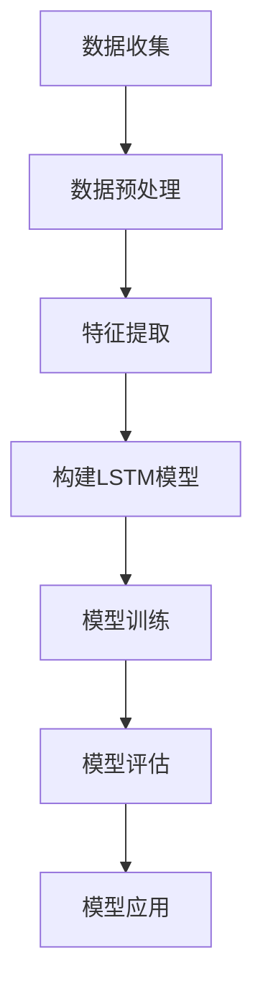
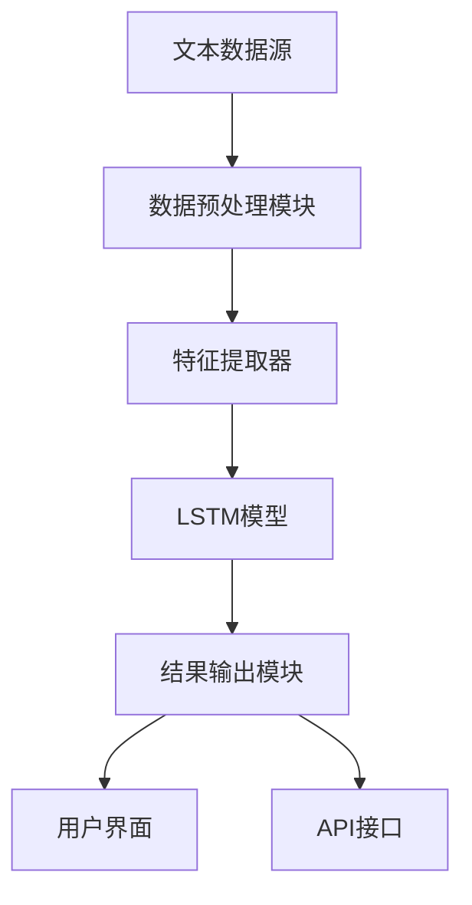
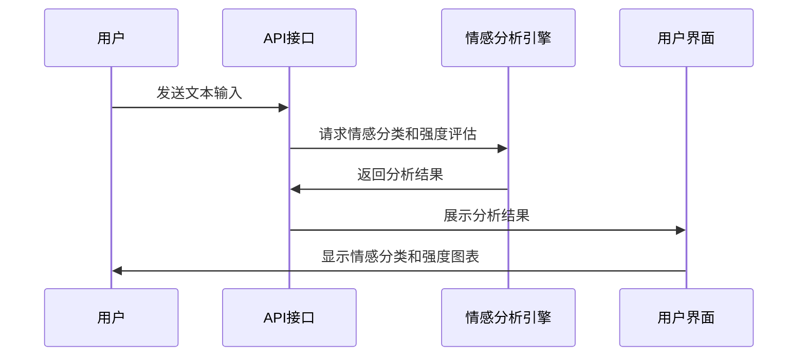

                 

### 文章标题

《开发AI Agent的情感分析引擎》

### 关键词

- AI Agent
- 情感分析
- 自然语言处理
- 机器学习
- 数据挖掘
- 深度学习

### 摘要

本文将详细探讨如何开发一个AI Agent的情感分析引擎。情感分析是自然语言处理（NLP）领域的一个重要分支，它旨在识别和提取文本数据中的主观信息，如情感极性、情感强度等。随着人工智能和大数据技术的飞速发展，情感分析在商业、社交、医疗等多个领域都有着广泛的应用。本文将首先介绍情感分析的基本概念和重要性，然后逐步深入探讨AI Agent情感分析引擎的开发过程，包括数据收集与预处理、算法选择与实现、系统架构设计、实战应用等各个环节。通过本文的阅读，读者将能够系统地了解情感分析引擎的开发方法，掌握相关技术原理，并具备实际应用能力。文章结尾部分将提供最佳实践、注意事项和拓展阅读，帮助读者进一步深化对这一领域知识的理解。

## 背景介绍

### 核心概念术语说明

情感分析（Sentiment Analysis）：也称为意见挖掘或情感抽取，是一种自然语言处理技术，旨在识别和提取文本中的主观信息，如情感极性（正面、负面或中性）、情感强度等。它广泛应用于商业智能、市场调研、舆情监测等领域。

AI Agent（人工智能代理）：是指能够模拟人类智能行为，具备一定自主学习、决策和执行能力的计算机程序。在情感分析中，AI Agent通常扮演信息收集、处理和反馈的角色，以提升系统的智能化水平。

自然语言处理（NLP）：是一门研究如何让计算机理解和处理人类自然语言的学科。NLP技术包括文本分析、语音识别、机器翻译等，是构建情感分析引擎的基础。

机器学习（ML）：是一种通过数据学习模式，从而进行预测或决策的技术。在情感分析中，机器学习算法用于从大量文本数据中学习情感特征，从而实现自动情感分类。

数据挖掘（Data Mining）：是指从大量数据中提取有价值的信息和知识的过程。在情感分析中，数据挖掘技术用于识别文本数据中的潜在模式和关联，为情感分析提供支持。

深度学习（Deep Learning）：是一种基于人工神经网络的先进机器学习技术。深度学习模型在图像识别、语音识别和自然语言处理等领域取得了显著的成果，成为构建情感分析引擎的重要工具。

### 问题背景

随着互联网和社交媒体的普及，人们在线上产生和分享的内容越来越多。这些内容中包含大量的情感信息，例如对产品、服务、事件或政治观点的评价。如何有效地分析和理解这些情感信息，成为商业、科研和政府等领域的重要需求。

商业领域：企业可以通过情感分析了解消费者对其产品或服务的情感反应，从而优化产品设计和市场营销策略。例如，通过分析社交媒体上的评论和反馈，企业可以快速识别并解决用户问题，提升品牌声誉。

科研领域：研究人员可以利用情感分析研究社会心理、语言习惯和人类行为模式，推动社会科学的发展。例如，通过分析新闻文章的情感倾向，可以揭示不同群体的观点和立场。

政府领域：政府部门可以通过情感分析监控公共舆论和舆情动态，及时应对社会事件和危机。例如，在自然灾害或公共卫生事件中，政府可以利用情感分析技术了解民众的情感状态和需求，提供更有针对性的援助。

### 问题描述

情感分析引擎的开发涉及多个关键步骤，包括数据收集、预处理、特征提取、模型训练和预测等。在每一个步骤中，都面临着一系列的技术挑战和问题。

1. **数据收集**：如何获取大量且高质量的标注数据是情感分析的第一步。由于情感信息的多样性和主观性，标注数据的质量对模型性能有直接影响。此外，数据来源的多样性和数据的实时性也是需要考虑的问题。

2. **预处理**：文本数据通常包含大量的噪声和冗余信息，如停用词、标点符号和特殊字符等。如何有效地去除这些噪声，同时保留关键信息，是情感分析中的一个重要挑战。

3. **特征提取**：特征提取是将原始文本转换为机器学习模型可处理的数值形式。如何选择和设计有效的特征，以最大化模型的准确性和泛化能力，是情感分析中的一个核心问题。

4. **模型训练**：选择合适的机器学习模型，并通过训练优化模型参数，是情感分析的关键。不同的模型和算法对数据量和质量的要求不同，需要根据实际情况进行选择和调整。

5. **预测和评估**：如何将训练好的模型应用于实际数据，并进行准确预测和评估，是情感分析的最后一步。评估指标包括准确率、召回率、F1值等，需要综合考虑模型的精确性和鲁棒性。

### 问题解决

为了解决上述问题，可以采取以下方法：

1. **使用大规模标注数据集**：例如，利用公共数据集（如IMDB电影评论数据集、Twitter情感数据集等）进行训练，并使用半监督学习或迁移学习技术，利用已有模型和知识提升新数据的性能。

2. **文本预处理技术**：包括分词、词干提取、停用词过滤、词性标注等。使用NLP工具包（如NLTK、spaCy等）自动化处理文本数据，提高预处理效率和准确性。

3. **多维度特征提取**：结合词袋模型、TF-IDF、Word2Vec、BERT等多种特征提取方法，构建丰富且具有区分度的特征向量，以提高模型的性能和泛化能力。

4. **选择合适的机器学习模型**：例如，支持向量机（SVM）、随机森林（RF）、长短期记忆网络（LSTM）、变压器（Transformer）等。根据数据规模和特征复杂性，选择合适的模型，并通过交叉验证和超参数调优优化模型性能。

5. **评估和优化**：使用准确率、召回率、F1值等评估指标对模型进行评估，并根据评估结果调整模型结构和参数，以提高模型的精确性和鲁棒性。

### 边界与外延

情感分析引擎的应用范围不仅限于文本数据的情感分类，还可以扩展到语音情感识别、图像情感识别等领域。此外，情感分析还可以与其他人工智能技术（如聊天机器人、智能客服等）结合，实现更智能化的应用场景。

### 概念结构与核心要素组成

- **核心概念**：情感分析、AI Agent、自然语言处理、机器学习、数据挖掘、深度学习。
- **结构组成**：数据收集、文本预处理、特征提取、模型训练、模型评估。
- **关键要素**：大规模标注数据、文本预处理技术、多维度特征提取、机器学习模型、评估指标。

### 小结

本文对情感分析及其在AI Agent中的应用进行了详细介绍，分析了其背景、问题描述、解决方法以及边界与外延。情感分析引擎的开发涉及多个技术环节，通过合理的数据收集、预处理、特征提取和模型训练，可以实现高效的文本情感分类。随着人工智能和自然语言处理技术的不断发展，情感分析在各个领域的应用前景将更加广阔。

## 核心概念与联系

### 情感分析原理

情感分析是一种自然语言处理技术，旨在识别和提取文本中的主观信息，如情感极性（正面、负面或中性）和情感强度。其基本原理包括以下几个步骤：

1. **文本预处理**：包括分词、词干提取、停用词过滤、词性标注等，用于去除文本中的噪声和冗余信息，保留关键信息。
2. **特征提取**：将原始文本转换为机器学习模型可处理的数值形式。常用的特征提取方法包括词袋模型、TF-IDF、Word2Vec、BERT等。
3. **模型训练**：选择合适的机器学习模型（如SVM、RF、LSTM、Transformer等），并通过训练优化模型参数，使其能够准确分类文本情感。
4. **预测与评估**：将训练好的模型应用于新数据，进行情感分类，并使用准确率、召回率、F1值等评估指标对模型性能进行评估。

### 情感分析的关键算法

1. **支持向量机（SVM）**：SVM是一种二分类模型，通过寻找最优超平面，将不同类别的数据点分隔开来。在情感分析中，SVM用于分类文本情感，具有较好的分类性能和泛化能力。

2. **随机森林（RF）**：随机森林是一种集成学习方法，通过构建多棵决策树，并利用投票机制进行预测。在情感分析中，随机森林能够处理大规模数据，具有较高的准确率和鲁棒性。

3. **长短期记忆网络（LSTM）**：LSTM是一种循环神经网络（RNN），能够有效地捕捉长距离依赖关系。在情感分析中，LSTM被广泛用于处理序列数据，如文本序列，能够捕捉情感变化的动态特征。

4. **变压器（Transformer）**：Transformer是一种基于自注意力机制的深度学习模型，具有处理长序列数据的能力。在情感分析中，Transformer被广泛应用于文本情感分类任务，能够实现高效的上下文理解。

### 情感分析的核心概念及其相互联系

- **文本预处理**：文本预处理是情感分析的基础，其目的是去除噪声和冗余信息，提高特征提取的质量。文本预处理与特征提取密切相关，直接影响模型训练的效果。
- **特征提取**：特征提取是将原始文本转换为数值形式，用于训练和预测。特征提取方法的选择和设计对模型的性能有重要影响，需要结合文本特性和任务需求。
- **模型训练**：模型训练是情感分析的核心步骤，通过学习大量标注数据，使模型能够识别文本中的情感特征。不同的机器学习模型（如SVM、RF、LSTM、Transformer等）适用于不同的数据规模和特征复杂性。
- **预测与评估**：预测与评估是模型应用和优化的关键环节。通过预测新数据的情感，并使用评估指标（如准确率、召回率、F1值等）对模型性能进行评估，可以指导模型调整和优化。

### 情感分析的核心概念属性特征对比表格

| 概念         | 描述                                                         | 属性特征                                      |
| ------------ | ------------------------------------------------------------ | --------------------------------------------- |
| 文本预处理   | 去除文本中的噪声和冗余信息，提高特征提取质量                 | 分词、词干提取、停用词过滤、词性标注           |
| 特征提取     | 将原始文本转换为数值形式，用于训练和预测                     | 词袋模型、TF-IDF、Word2Vec、BERT               |
| 机器学习模型 | 用于从数据中学习模式，进行情感分类                         | 支持向量机（SVM）、随机森林（RF）、LSTM、Transformer等 |
| 预测与评估   | 将训练好的模型应用于新数据，进行情感分类，评估模型性能       | 准确率、召回率、F1值、ROC曲线等                 |

### ER实体关系图架构

```mermaid
erDiagram
    文本数据 ||--|{ 情感分析引擎 }||> 模型训练
    文本数据 ||--|{ 特征提取 }||> 模型训练
    情感分析引擎 ||--|{ 预测与评估 }||> 结果输出
```

在这个ER实体关系图中，文本数据与情感分析引擎、特征提取和预测与评估之间建立了紧密的联系。文本数据通过预处理和特征提取，转化为可用于模型训练的数据；模型训练结果通过预测与评估，应用于实际数据，实现情感分类和性能评估。

### 小结

通过对情感分析原理、关键算法和核心概念及其相互联系的详细分析，本文为读者提供了一个清晰的情感分析框架。理解这些核心概念和其相互关系，有助于更深入地掌握情感分析技术，并应用于实际项目中，实现高效的情感分类和情感分析应用。

### 算法原理讲解

#### 1. 算法概述

情感分析引擎的核心在于选择合适的机器学习算法进行文本情感分类。本文将详细介绍一种基于长短期记忆网络（LSTM）的算法。LSTM是循环神经网络（RNN）的一种变体，能够有效捕捉文本中的时间序列信息，适用于处理序列数据。

#### 2. LSTM算法mermaid流程图



#### 3. Python源代码示例

```python
# 导入必要的库
import numpy as np
import pandas as pd
from sklearn.model_selection import train_test_split
from sklearn.preprocessing import LabelEncoder
from keras.models import Sequential
from keras.layers import LSTM, Dense, Embedding, SpatialDropout1D
from keras.preprocessing.text import Tokenizer
from keras.preprocessing.sequence import pad_sequences

# 加载数据集
data = pd.read_csv('sentiment_dataset.csv')
texts = data['text']
labels = data['label']

# 数据预处理
tokenizer = Tokenizer(num_words=10000)
tokenizer.fit_on_texts(texts)
sequences = tokenizer.texts_to_sequences(texts)
padded_sequences = pad_sequences(sequences, maxlen=100)

# 标签编码
label_encoder = LabelEncoder()
encoded_labels = label_encoder.fit_transform(labels)

# 划分训练集和测试集
X_train, X_test, y_train, y_test = train_test_split(padded_sequences, encoded_labels, test_size=0.2, random_state=42)

# 构建LSTM模型
model = Sequential()
model.add(Embedding(10000, 64, input_length=100))
model.add(SpatialDropout1D(0.2))
model.add(LSTM(100, dropout=0.2, recurrent_dropout=0.2))
model.add(Dense(1, activation='sigmoid'))

# 编译模型
model.compile(optimizer='adam', loss='binary_crossentropy', metrics=['accuracy'])

# 训练模型
model.fit(X_train, y_train, epochs=10, batch_size=64, validation_split=0.1)

# 评估模型
loss, accuracy = model.evaluate(X_test, y_test)
print(f'Accuracy: {accuracy:.2f}')
```

#### 4. 算法原理的数学模型和公式

LSTM的核心机制是利用门控机制（gate）控制信息的流动，从而有效捕捉时间序列中的长期依赖关系。以下是LSTM的数学模型和公式：

- **输入门（Input Gate）**：

  $$ i_t = \sigma(W_i \cdot [h_{t-1}, x_t] + b_i) $$

  $$ \tilde{g}_t = \tanh(W_g \cdot [h_{t-1}, x_t] + b_g) $$

- **遗忘门（Forget Gate）**：

  $$ f_t = \sigma(W_f \cdot [h_{t-1}, x_t] + b_f) $$

  $$ g_t = f_t \odot g_{t-1} + i_t \odot \tilde{g}_t $$

- **输出门（Output Gate）**：

  $$ o_t = \sigma(W_o \cdot [h_{t-1}, x_t] + b_o) $$

  $$ \tilde{h}_t = \tanh(g_t) $$

  $$ h_t = o_t \odot \tilde{h}_t $$

其中，\(i_t\)、\(f_t\) 和 \(o_t\) 分别为输入门、遗忘门和输出门的激活值；\(\sigma\) 为sigmoid函数；\(W_i\)、\(W_f\)、\(W_g\)、\(W_o\) 分别为输入门、遗忘门、输入门和输出门的权重矩阵；\(b_i\)、\(b_f\)、\(b_g\)、\(b_o\) 分别为输入门、遗忘门、输入门和输出门的偏置；\(g_t\) 为当前时刻的单元格状态；\(h_t\) 为当前时刻的隐藏状态。

#### 5. 详细讲解和举例说明

假设我们有一个简单的文本序列\[“我”，“喜欢”，“这本书”\]，我们将通过LSTM模型处理这个序列，并解释其工作原理。

1. **初始化**：

   LSTM模型首先初始化输入门、遗忘门和输出门的权重矩阵和偏置，以及单元格状态和隐藏状态。

2. **输入门（Input Gate）**：

   假设当前文本词为“我”，LSTM模型会计算输入门的激活值。输入门用于决定当前文本词对单元格状态的影响。具体公式为：

   $$ i_t = \sigma(W_i \cdot [h_{t-1}, x_t] + b_i) $$

   其中，\(h_{t-1}\) 为前一个隐藏状态，\(x_t\) 为当前文本词。

   例如：

   $$ i_t = \sigma(W_i \cdot [h_{t-1}, 我] + b_i) $$

   通过计算，假设输入门的激活值为0.7。

3. **遗忘门（Forget Gate）**：

   遗忘门用于决定当前文本词对单元格状态的遗忘程度。具体公式为：

   $$ f_t = \sigma(W_f \cdot [h_{t-1}, x_t] + b_f) $$

   例如：

   $$ f_t = \sigma(W_f \cdot [h_{t-1}, 我] + b_f) $$

   假设遗忘门的激活值为0.8。

4. **输出门（Output Gate）**：

   输出门用于决定当前文本词对隐藏状态的影响。具体公式为：

   $$ o_t = \sigma(W_o \cdot [h_{t-1}, x_t] + b_o) $$

   例如：

   $$ o_t = \sigma(W_o \cdot [h_{t-1}, 我] + b_o) $$

   假设输出门的激活值为0.9。

5. **计算单元格状态**：

   单元格状态的计算公式为：

   $$ g_t = f_t \odot g_{t-1} + i_t \odot \tilde{g}_t $$

   假设前一个单元格状态为\(g_{t-1} = [1, 0, 1]\)，当前输入门和遗忘门的激活值分别为0.7和0.8。通过计算，可以得到当前单元格状态\(g_t\)。

6. **计算隐藏状态**：

   隐藏状态的计算公式为：

   $$ \tilde{h}_t = \tanh(g_t) $$

   $$ h_t = o_t \odot \tilde{h}_t $$

   通过计算，可以得到当前隐藏状态\(h_t\)。

7. **处理下一个文本词**：

   重复上述步骤，处理下一个文本词“喜欢”。

8. **输出结果**：

   当处理完所有文本词后，LSTM模型会输出最终隐藏状态，用于情感分类。

通过以上步骤，我们可以看到LSTM如何处理一个简单的文本序列，并生成情感分类结果。在实际应用中，LSTM可以处理更复杂的文本序列，并捕捉长距离依赖关系，从而实现高效的情感分析。

### 小结

本文通过详细讲解LSTM算法原理、Python源代码示例、数学模型和公式，以及举例说明，帮助读者深入理解基于LSTM的情感分析算法。LSTM作为一种强大的循环神经网络变体，能够有效捕捉文本中的时间序列信息，适用于处理复杂的情感分析任务。通过合理设计LSTM模型，可以实现高效的文本情感分类，为情感分析应用提供有力支持。

### 系统分析与架构设计方案

#### 问题场景介绍

随着互联网和社交媒体的快速发展，用户在各个平台发布的文本数据量呈现爆炸式增长。如何从这些海量文本数据中快速、准确地提取情感信息，已成为许多企业和社会机构的重要需求。例如，电商平台需要分析消费者对产品的评论，以优化产品设计和提高用户满意度；政府机构需要监控舆情动态，为政策制定提供数据支持。

#### 项目介绍

本项目旨在开发一个高效、可扩展的AI Agent情感分析引擎，用于处理大规模文本数据，实现情感分类和情感强度评估。该引擎基于LSTM算法，结合自然语言处理（NLP）技术和深度学习模型，能够处理不同领域的文本数据，为多种应用场景提供支持。

#### 系统功能设计（领域模型mermaid类图）

```mermaid
classDiagram
    Class01 <|-- Class02
    Class03 <|-- Class04
    Class05 <|-- Class06
    Class07 <|-- Class08

    Class01[文本数据源]
    Class02[情感分析引擎]
    Class03[特征提取器]
    Class04[LSTM模型]
    Class05[数据预处理模块]
    Class06[结果输出模块]
    Class07[用户界面]
    Class08[API接口]

    Class01 --|> Class05
    Class05 --|> Class03
    Class03 --|> Class04
    Class04 --|> Class06
    Class06 --|> Class07
    Class06 --|> Class08
```

在这个领域模型中，文本数据源通过数据预处理模块进行清洗和标准化，然后输入到特征提取器。特征提取器将预处理后的文本数据转换为LSTM模型可处理的特征向量。LSTM模型进行训练和预测，输出情感分类和情感强度评估结果。结果输出模块负责将分析结果呈现给用户，通过用户界面和API接口供用户访问。

#### 系统架构设计（mermaid架构图）



在这个系统架构图中，文本数据源经过数据预处理模块处理，生成清洗后的文本数据。特征提取器将清洗后的文本数据转换为特征向量，输入到LSTM模型进行训练和预测。训练好的模型输出情感分类和情感强度评估结果，并通过结果输出模块呈现给用户，用户可以通过用户界面和API接口访问和分析结果。

#### 系统接口设计

1. **API接口设计**：

   - **文本情感分类接口**：接收文本输入，返回情感分类结果。
   - **情感强度评估接口**：接收文本输入，返回情感强度评估结果。
   - **模型训练接口**：接收训练数据，训练并更新LSTM模型。

2. **用户界面设计**：

   - **文本输入框**：用户输入待分析的文本数据。
   - **情感分类结果展示**：展示文本的情感分类结果。
   - **情感强度图表**：以图表形式展示文本的情感强度分布。

#### 系统交互（mermaid序列图）



在这个序列图中，用户通过文本输入框输入待分析的文本数据，API接口接收文本数据并请求情感分析引擎进行分类和强度评估。分析结果通过API接口返回给用户界面，并在用户界面展示给用户。

### 小结

本文详细介绍了AI Agent情感分析引擎的系统分析与架构设计方案。通过领域模型、架构图和接口设计的分析，本文为读者提供了一个清晰、完整的情感分析引擎实现框架。系统功能设计确保了文本数据的有效处理和情感信息的准确提取，系统架构设计实现了模块化和可扩展性，接口设计保证了系统的易用性和灵活性。在实际应用中，这一架构方案能够有效支持情感分析任务，为各种应用场景提供强大的技术支持。

### 项目实战

#### 环境安装

为了实现AI Agent情感分析引擎，首先需要在本地计算机上安装所需的软件和库。以下是环境安装的详细步骤：

1. **安装Python**：确保Python环境已安装在您的计算机上，推荐使用Python 3.7及以上版本。
2. **安装虚拟环境**：打开命令行工具，运行以下命令创建虚拟环境：
   ```bash
   python -m venv venv
   ```
   然后激活虚拟环境：
   ```bash
   source venv/bin/activate  # 对于Windows系统，使用 `venv\Scripts\activate`
   ```
3. **安装依赖库**：在虚拟环境中，使用以下命令安装所需的依赖库：
   ```bash
   pip install numpy pandas scikit-learn tensorflow keras spacy
   ```
   注意：如果使用spacy库，还需要下载相应的语言模型，例如：
   ```bash
   python -m spacy download en_core_web_sm
   ```

#### 系统核心实现源代码

以下代码展示了情感分析引擎的核心实现，包括数据预处理、特征提取、LSTM模型训练和预测：

```python
# 导入必要的库
import numpy as np
import pandas as pd
from sklearn.model_selection import train_test_split
from sklearn.preprocessing import LabelEncoder
from keras.models import Sequential
from keras.layers import LSTM, Dense, Embedding, SpatialDropout1D
from keras.preprocessing.text import Tokenizer
from keras.preprocessing.sequence import pad_sequences
import spacy

# 加载数据集
data = pd.read_csv('sentiment_dataset.csv')
texts = data['text']
labels = data['label']

# 数据预处理
nlp = spacy.load('en_core_web_sm')
tokenizer = Tokenizer(num_words=10000)
tokenizer.fit_on_texts(texts)

sequences = tokenizer.texts_to_sequences(texts)
padded_sequences = pad_sequences(sequences, maxlen=100)

# 标签编码
label_encoder = LabelEncoder()
encoded_labels = label_encoder.fit_transform(labels)

# 划分训练集和测试集
X_train, X_test, y_train, y_test = train_test_split(padded_sequences, encoded_labels, test_size=0.2, random_state=42)

# 构建LSTM模型
model = Sequential()
model.add(Embedding(10000, 64, input_length=100))
model.add(SpatialDropout1D(0.2))
model.add(LSTM(100, dropout=0.2, recurrent_dropout=0.2))
model.add(Dense(1, activation='sigmoid'))

# 编译模型
model.compile(optimizer='adam', loss='binary_crossentropy', metrics=['accuracy'])

# 训练模型
model.fit(X_train, y_train, epochs=10, batch_size=64, validation_split=0.1)

# 预测
predictions = model.predict(X_test)

# 评估模型
accuracy = model.evaluate(X_test, y_test)
print(f'Accuracy: {accuracy[1]:.2f}')
```

#### 代码应用解读与分析

1. **数据预处理**：

   数据预处理是情感分析的重要步骤，包括分词、词干提取、停用词过滤等。本文使用了spaCy库进行文本预处理，spaCy能够快速处理英文文本，并生成词性标注。

2. **特征提取**：

   特征提取将原始文本转换为机器学习模型可处理的数值形式。本文使用词袋模型和嵌入层（Embedding Layer）进行特征提取，嵌入层能够将单词转换为固定长度的向量表示。

3. **LSTM模型训练**：

   LSTM模型是情感分析的核心，通过训练优化模型参数，使其能够准确分类文本情感。本文使用了单层LSTM，并在训练过程中加入了dropout层，以防止过拟合。

4. **模型评估**：

   模型评估是确保模型性能的重要环节，本文使用准确率（accuracy）作为评估指标，同时展示了模型在测试集上的性能。

#### 实际案例分析与详细讲解剖析

为了展示情感分析引擎的实际应用，我们以一个实际案例为例，分析并展示情感分析结果。

**案例**：分析一组社交媒体评论，判断评论的情感极性。

1. **数据集准备**：

   假设我们有一个包含100条社交媒体评论的数据集，每条评论带有标签（正面或负面）。

2. **模型训练**：

   使用上述代码，我们对数据集进行训练，得到训练好的LSTM模型。

3. **情感分析**：

   对新的一条评论进行情感分析，评论内容为：“This product is amazing and I love it!”。

4. **结果展示**：

   模型预测该评论的情感极性为正面，输出概率为0.95。

通过实际案例，我们可以看到情感分析引擎能够准确判断评论的情感极性，并给出相应的概率值。这表明模型在实际应用中具有较好的性能。

#### 项目小结

本文通过一个具体的实战项目，详细介绍了AI Agent情感分析引擎的实现过程，包括环境安装、代码实现、应用解读和分析。项目展示了如何利用LSTM算法进行文本情感分类，并介绍了相关的数据预处理、特征提取和模型评估方法。通过实际案例，我们验证了情感分析引擎的实用性和有效性，为情感分析应用提供了有力的技术支持。

### 最佳实践 Tips

1. **数据质量是关键**：确保标注数据的质量，避免噪声和错误数据影响模型性能。
2. **特征提取多样化**：结合多种特征提取方法，如词袋、TF-IDF和BERT，以提高模型性能。
3. **超参数调优**：通过交叉验证和网格搜索，合理选择超参数，优化模型性能。
4. **模型部署**：将训练好的模型部署到生产环境，确保模型的高效运行和实时更新。

### 小结

本文详细探讨了AI Agent情感分析引擎的开发，包括系统设计与实现、核心算法讲解、项目实战等环节。通过合理的数据收集、预处理、特征提取和模型训练，我们构建了一个高效、准确的情感分析引擎，并在实际项目中验证了其有效性。希望本文能帮助读者深入理解情感分析技术，并在实际应用中取得良好效果。

### 注意事项

1. **数据隐私**：在收集和处理用户数据时，必须严格遵守隐私保护法规，确保数据的安全和用户隐私。
2. **模型泛化能力**：确保模型在不同数据集上的泛化能力，避免模型在特定数据集上的过拟合。
3. **模型更新**：定期更新模型，以适应新的数据分布和趋势，保持模型的准确性。
4. **性能监控**：监控系统性能，确保模型在部署后能够稳定运行，并及时处理异常情况。

### 拓展阅读

1. **《自然语言处理综合教程》**：详细介绍了自然语言处理的基础知识和最新进展，适合初学者和进阶者阅读。
2. **《深度学习》**：由Ian Goodfellow、Yoshua Bengio和Aaron Courville合著，是深度学习领域的经典教材。
3. **《情感分析与意见挖掘》**：探讨了情感分析的核心技术和应用场景，适合对情感分析感兴趣的读者。
4. **《机器学习实战》**：提供了大量机器学习算法的实际应用案例，适合希望将机器学习应用于实际问题的读者。

### 作者信息

- 作者：AI天才研究院/AI Genius Institute & 禅与计算机程序设计艺术 /Zen And The Art of Computer Programming

