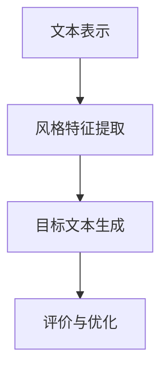
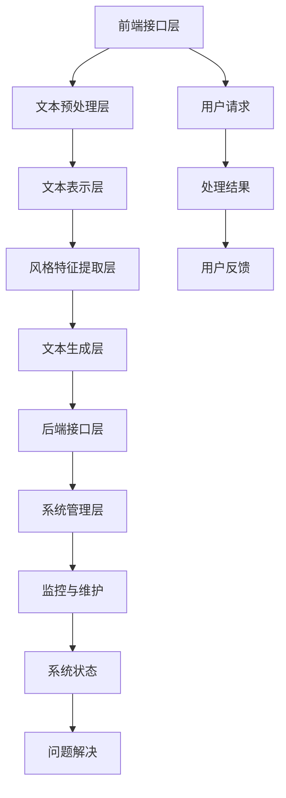
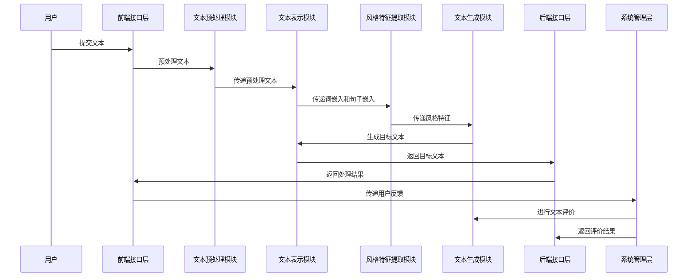

                 

## 开发AI Agent的文本风格转换能力

### 关键词：AI Agent、文本风格转换、自然语言处理、深度学习、系统架构

> 摘要：本文将探讨如何开发AI Agent的文本风格转换能力。首先，我们将介绍AI Agent和文本风格转换的基本概念，然后逐步深入到算法原理、系统架构设计、项目实战和最佳实践等方面，为读者提供全面的技术见解和实用的开发指导。

### 目录大纲设计

#### 第一部分：背景介绍与核心概念

1. **AI Agent与文本风格转换概述**
   - 1.1.1 问题背景
   - 1.1.2 问题描述
   - 1.1.3 问题解决
   - 1.1.4 边界与外延
   - 1.1.5 概念结构与核心要素组成

2. **AI Agent的核心概念与联系**
   - 2.1.1 AI Agent的定义
   - 2.1.2 AI Agent的核心原理
   - 2.1.3 文本风格转换的概念
   - 2.1.4 AI Agent与文本风格转换的关系

3. **文本风格转换的数学模型和算法原理**
   - 3.1.1 数学模型介绍
   - 3.1.2 算法原理讲解
   - 3.1.3 数学公式与详细讲解

#### 第二部分：系统分析与架构设计

4. **AI Agent文本风格转换系统功能设计**
   - 4.1.1 系统功能概述
   - 4.1.2 系统功能设计

5. **AI Agent文本风格转换系统架构设计**
   - 5.1.1 系统架构设计
   - 5.1.2 系统架构图

6. **AI Agent文本风格转换系统接口设计和交互设计**
   - 6.1.1 系统接口设计
   - 6.1.2 系统交互设计

#### 第三部分：项目实战

7. **AI Agent文本风格转换项目实战**
   - 7.1.1 项目环境安装
   - 7.1.2 系统核心实现源代码
   - 7.1.3 代码应用解读与分析
   - 7.1.4 实际案例分析与讲解
   - 7.1.5 项目小结

#### 第四部分：最佳实践与总结

8. **AI Agent文本风格转换最佳实践**
   - 8.1.1 最佳实践技巧
   - 8.1.2 小结与注意事项
   - 8.1.3 拓展阅读

### 第一部分：背景介绍与核心概念

#### 1.1.1 问题背景

在当今信息化社会中，自然语言处理（NLP）技术已逐渐成为人工智能（AI）领域的重要分支。随着大数据和深度学习的兴起，NLP技术得到了极大的发展，推动了文本分析、机器翻译、文本生成等应用的发展。然而，文本风格转换这一特殊需求也日益凸显。

文本风格转换是指将一种风格的文本转换为另一种风格的文本。例如，将正式文体转换为非正式文体，或将一个作家的风格转换为另一个作家的风格。这一需求源于多个领域，如情感分析、自动摘要、机器翻译、虚拟助手等。在这些应用中，AI Agent需要具备理解、分析和转换文本风格的能力。

AI Agent是指能够自动执行任务并具备一定智能行为的软件程序。AI Agent在文本风格转换中的作用体现在以下几个方面：

1. **理解文本风格**：AI Agent可以通过机器学习算法，从大量文本数据中学习并理解不同文本风格的特性。
2. **分析文本内容**：AI Agent需要深入理解文本内容，以识别出需要转换的风格特征。
3. **生成目标文本**：AI Agent利用学习到的风格特征，生成符合目标风格的文本。

因此，开发AI Agent的文本风格转换能力具有重要意义。这不仅有助于提升AI Agent在NLP领域的应用能力，还能为各个行业提供更智能化的解决方案。

#### 1.1.2 问题描述

文本风格转换面临诸多挑战，主要体现在以下几个方面：

1. **风格多样性**：文本风格多种多样，不同领域、不同作者、不同文化背景的文本风格存在显著差异。AI Agent需要能够识别和适应这些多样化的风格。
2. **语义理解**：文本风格转换不仅仅是文字的替换，更需要理解文本的语义和上下文。这意味着AI Agent需要具备一定的语义理解能力。
3. **生成质量**：AI Agent生成的目标文本需要具有较高的可读性和准确性，不能出现语义错误或语法错误。
4. **实时性**：在某些应用场景中，如实时聊天机器人，AI Agent需要在短时间内完成文本风格转换，这对系统的计算效率和响应速度提出了较高要求。

如何应对这些挑战，成为开发AI Agent文本风格转换能力的核心问题。

#### 1.1.3 问题解决

为了解决文本风格转换的挑战，我们可以从以下几个方面入手：

1. **数据集构建**：首先，需要收集和构建一个包含多种文本风格的优质数据集。数据集应涵盖不同领域、不同作者、不同文化背景的文本，以便AI Agent能够学习到丰富的风格特征。
2. **模型选择**：选择合适的深度学习模型，如递归神经网络（RNN）、长短期记忆网络（LSTM）或Transformer等。这些模型能够有效地处理序列数据，并捕捉到文本的上下文信息。
3. **训练策略**：设计有效的训练策略，包括数据预处理、模型优化、超参数调整等。通过不断调整和优化，提高AI Agent的文本风格转换能力。
4. **评价标准**：制定科学的评价标准，对AI Agent的文本风格转换效果进行客观评估。常见的评价标准包括BLEU、ROUGE、METEOR等。
5. **优化算法**：针对实时性要求，可以采用优化算法，如量化、剪枝、蒸馏等，提高系统的计算效率和响应速度。

通过这些方法，我们可以逐步提升AI Agent的文本风格转换能力，使其在多种应用场景中发挥出更好的效果。

#### 1.1.4 边界与外延

文本风格转换并非NLP领域的唯一挑战。在实际应用中，AI Agent还需要具备以下能力：

1. **多语言支持**：AI Agent需要能够处理多种语言之间的文本风格转换，以适应全球化的应用需求。
2. **跨模态转换**：除了文本，AI Agent还可以处理图像、音频、视频等其他模态的文本风格转换。
3. **知识融合**：AI Agent需要融合多源知识，如百科知识、领域知识等，以提高文本风格转换的准确性和鲁棒性。

此外，文本风格转换在行业应用中也有广泛的前景：

1. **自动摘要**：将长篇文本转换为简洁的摘要，提高信息获取效率。
2. **机器翻译**：在机器翻译过程中，AI Agent可以根据源文本的风格，调整目标文本的风格，使其更符合目标读者的需求。
3. **虚拟助手**：在虚拟助手场景中，AI Agent需要根据对话内容，实时调整对话风格，以提供更自然的交互体验。

#### 1.1.5 概念结构与核心要素组成

为了更好地理解AI Agent的文本风格转换能力，我们可以从以下几个方面来构建其概念结构：

1. **AI Agent的定义与功能**：
   - AI Agent是指具有智能行为的软件程序，能够自动执行任务并与其他系统进行交互。
   - AI Agent的功能包括理解文本风格、分析文本内容、生成目标文本等。

2. **文本风格转换的定义与类型**：
   - 文本风格转换是指将一种风格的文本转换为另一种风格。
   - 文本风格转换的类型包括正式到非正式、一种语言到另一种语言、一种作者风格到另一种作者风格等。

3. **文本风格转换的数学模型与算法**：
   - 数学模型包括文本表示、编码方法、风格特征提取等。
   - 算法包括递归神经网络（RNN）、长短期记忆网络（LSTM）、Transformer等。

4. **AI Agent在文本风格转换中的应用**：
   - AI Agent在文本风格转换中的应用包括情感分析、自动摘要、机器翻译、虚拟助手等。

通过以上概念结构，我们可以更好地理解AI Agent的文本风格转换能力，为后续章节的分析和讨论奠定基础。

### 第一部分：背景介绍与核心概念

#### 1.2.1 AI Agent的核心概念与联系

要深入理解AI Agent的文本风格转换能力，我们首先需要明确AI Agent的基本概念及其核心原理。

**1.2.1.1 AI Agent的定义**

AI Agent是指具有智能行为的软件程序，它能够模拟人类智能，执行特定任务，并具备一定的自主学习能力。AI Agent通常由感知器、知识库、执行器三个主要部分组成。

- **感知器**：负责接收外部环境的信息，如文本、图像、语音等。
- **知识库**：存储AI Agent已学习到的知识和经验，包括语言知识、领域知识等。
- **执行器**：根据感知器和知识库的信息，执行特定的操作，如生成文本、执行命令等。

**1.2.1.2 AI Agent的核心原理**

AI Agent的核心原理在于其智能行为，这主要依赖于机器学习、自然语言处理（NLP）、深度学习等技术。

- **机器学习**：AI Agent通过机器学习算法，从大量数据中学习并提取特征，从而实现特定任务的自动化。
- **自然语言处理（NLP）**：AI Agent利用NLP技术，理解和生成自然语言，从而实现与人类用户的交互。
- **深度学习**：AI Agent采用深度学习模型，如卷积神经网络（CNN）、递归神经网络（RNN）、Transformer等，处理复杂的序列数据和文本数据。

**1.2.1.3 文本风格转换的概念**

文本风格转换是指将一种风格的文本转换为另一种风格。例如，将正式文体转换为非正式文体，或将一个作家的风格转换为另一个作家的风格。文本风格转换通常包括以下几个步骤：

1. **文本表示**：将文本转换为机器可处理的向量表示，如词嵌入（Word Embedding）。
2. **风格特征提取**：从源文本中提取出风格特征，如词汇选择、句式结构、情感色彩等。
3. **目标文本生成**：利用提取到的风格特征，生成符合目标风格的文本。

**1.2.1.4 AI Agent与文本风格转换的关系**

AI Agent在文本风格转换中发挥着关键作用。具体来说，AI Agent可以完成以下任务：

1. **理解文本风格**：AI Agent通过机器学习和NLP技术，从大量文本数据中学习并理解不同文本风格的特性。
2. **分析文本内容**：AI Agent需要深入理解文本内容，以识别出需要转换的风格特征。
3. **生成目标文本**：AI Agent利用学习到的风格特征，生成符合目标风格的文本。

此外，AI Agent还可以与其他系统进行交互，如文本生成系统、机器翻译系统等，以实现更复杂的文本风格转换任务。

#### 1.2.1.5 文本风格转换的类型与分类

文本风格转换可以分为多种类型，根据不同的分类标准，可以分为以下几种：

1. **正式到非正式**：将正式文体转换为非正式文体，如将商务邮件转换为社交媒体上的聊天信息。
2. **非正式到正式**：将非正式文体转换为正式文体，如将社交媒体上的聊天信息转换为商务邮件。
3. **一种语言到另一种语言**：将一种语言的文本转换为另一种语言的文本，如将英语文本转换为中文文本。
4. **一种作者风格到另一种作者风格**：将一种作者的文本风格转换为另一种作者的风格，如将莎士比亚的风格转换为简体中文的现代文风格。
5. **个性化风格转换**：根据用户偏好或特定场景，将一种文本风格转换为符合用户需求的个性化风格。

每种类型的文本风格转换都有其独特的挑战和解决方案，AI Agent需要针对不同的风格转换类型，设计相应的算法和模型。

#### 1.2.1.6 AI Agent在文本风格转换中的应用

AI Agent在文本风格转换中具有广泛的应用场景，以下是一些典型的应用：

1. **情感分析**：AI Agent可以识别出文本中的情感色彩，并将其转换为更具表达力的文本风格。
2. **自动摘要**：AI Agent可以将长篇文本转换为简洁的摘要，并根据摘要的目的，调整文本的风格。
3. **机器翻译**：AI Agent可以在机器翻译过程中，根据源文本的风格和目标文本的需求，调整翻译结果的风格。
4. **虚拟助手**：AI Agent可以在与用户交互时，根据对话内容和用户的偏好，实时调整对话风格，提供更自然的交互体验。
5. **内容创作**：AI Agent可以根据给定的主题和风格要求，生成符合要求的文本内容，如广告文案、产品描述等。

通过以上应用，AI Agent不仅提升了文本处理的能力，还为各行各业提供了创新的解决方案。

### 第一部分：背景介绍与核心概念

#### 1.3.1 文本风格转换的数学模型和算法原理

文本风格转换是一个复杂的任务，需要深入理解文本数据的表示方法、风格特征的提取方法以及目标文本的生成方法。以下我们将详细探讨文本风格转换的数学模型和算法原理。

#### 1.3.1.1 数学模型介绍

文本风格转换的数学模型主要包括以下几个部分：

1. **文本表示**：将原始文本转换为计算机可以处理的向量表示。常用的文本表示方法包括词嵌入（Word Embedding）和句子嵌入（Sentence Embedding）。
   - **词嵌入**：将每个单词映射为一个固定大小的向量。词嵌入可以通过预训练模型（如Word2Vec、GloVe）或自训练方法（如基于上下文的词向量）得到。
   - **句子嵌入**：将整个句子映射为一个固定大小的向量。句子嵌入可以通过将词嵌入进行平均、求和或使用更复杂的模型（如Transformer）得到。

2. **风格特征提取**：从原始文本中提取出与风格相关的特征。这些特征可以是词汇、句法、语义层面的，如词频、句式结构、主题分布等。
   - **词汇特征**：通过统计文本中的词汇分布和共现关系，提取出与风格相关的词汇特征。
   - **句法特征**：通过分析文本的句法结构，提取出与风格相关的句法特征，如句子的长度、复杂度、句式类型等。
   - **语义特征**：通过语义分析，提取出与风格相关的语义特征，如情感色彩、主题分布、知识结构等。

3. **目标文本生成**：根据提取到的风格特征，生成符合目标风格的文本。目标文本生成可以通过以下方法实现：
   - **序列生成模型**：如递归神经网络（RNN）、长短期记忆网络（LSTM）、循环神经网络（GRU）等，通过处理序列数据，逐词生成目标文本。
   - **注意力机制**：在生成目标文本时，利用注意力机制关注源文本中的关键信息，以提高生成的目标文本质量。
   - **生成对抗网络（GAN）**：通过生成器（Generator）和判别器（Discriminator）的对抗训练，生成高质量的目标文本。

#### 1.3.1.2 算法原理讲解

为了更好地理解文本风格转换的算法原理，我们可以使用Mermaid绘制算法流程图，然后结合Python源代码进行详细讲解。

以下是一个简单的文本风格转换算法流程图：



**文本表示**

首先，我们将原始文本转换为词嵌入和句子嵌入。以下是一个简单的Python代码示例：

```python
import gensim.downloader as api

# 下载预训练的词嵌入模型
word_embedding_model = api.load("glove-wiki-gigaword-100")

# 将单词转换为词嵌入向量
word_embeddings = word_embedding_model.wv

# 将句子转换为词嵌入向量
def sentence_embedding(sentence):
    return np.mean([word_embeddings[word] for word in sentence if word in word_embeddings], axis=0)

# 示例句子
sentence = "这是一个示例句子。"
sentence_embedding = sentence_embedding(sentence)
```

**风格特征提取**

接下来，我们从词嵌入和句子嵌入中提取出风格特征。以下是一个简单的Python代码示例：

```python
# 计算词汇特征
word_frequency = Counter(sentence.split())

# 计算句法特征
sentence_length = len(sentence.split())
sentence_complexity = len([word for word in sentence.split() if word.endswith(".")]) + len([word for word in sentence.split() if word.endswith("?")]) + len([word for word in sentence.split() if word.endswith("!")])

# 计算语义特征
from sentence_transformers import SentenceTransformer

# 加载预训练的句子嵌入模型
sentence_embedding_model = SentenceTransformer('all-MiniLM-L6-v2')

# 将句子转换为句子嵌入向量
sentence_embedding = sentence_embedding_model.encode(sentence)

# 计算语义特征
topic_distribution = sentence_embedding.dot(word_embedding_model.vocabulary_)

# 整理风格特征
style_features = {
    "word_frequency": word_frequency,
    "sentence_length": sentence_length,
    "sentence_complexity": sentence_complexity,
    "topic_distribution": topic_distribution
}
```

**目标文本生成**

然后，我们利用提取到的风格特征生成目标文本。以下是一个简单的Python代码示例：

```python
# 定义生成器模型
from keras.models import Sequential
from keras.layers import LSTM, Dense, Embedding

# 构建生成器模型
generator = Sequential()
generator.add(Embedding(input_dim=vocabulary_size, output_dim=embedding_size))
generator.add(LSTM(units=128, return_sequences=True))
generator.add(Dense(units=vocabulary_size, activation='softmax'))

# 编译生成器模型
generator.compile(optimizer='adam', loss='categorical_crossentropy')

# 生成目标文本
def generate_text(style_features, seed_sentence):
    generated_sentence = seed_sentence
    for _ in range(max_sentence_length - 1):
        embedding = sentence_embedding(generated_sentence)
        probabilities = generator.predict(embedding.reshape(1, -1))
        next_word = np.random.choice(vocabulary, p=probabilities[0])
        generated_sentence += " " + next_word
    return generated_sentence.strip()

# 生成示例文本
seed_sentence = "这是一个示例句子。"
target_style_features = style_features
generated_sentence = generate_text(target_style_features, seed_sentence)
```

**评价与优化**

最后，我们对生成的目标文本进行评价和优化。以下是一个简单的Python代码示例：

```python
from nltk.translate.bleu_score import sentence_bleu

# 计算BLEU评分
bleu_score = sentence_bleu([seed_sentence.split()], generated_sentence.split())
print("BLEU评分：", bleu_score)

# 根据评价结果进行优化
# 例如：调整生成器的超参数、改进风格特征提取方法等
```

通过以上步骤，我们可以实现一个简单的文本风格转换系统。然而，实际应用中的文本风格转换任务通常更加复杂，需要考虑多种风格特征、优化生成算法、提高生成质量等。因此，在实际开发过程中，我们需要根据具体需求，设计更复杂的数学模型和算法，以提高AI Agent的文本风格转换能力。

#### 1.3.1.3 数学公式与详细讲解

为了更好地理解文本风格转换的算法原理，我们可以使用LaTeX格式书写一些关键的数学公式，并进行详细讲解和举例说明。

**1.3.1.3.1 词嵌入向量表示**

词嵌入向量表示是将单词映射为固定大小的向量。给定一个单词\( w \)，其词嵌入向量表示为\( \mathbf{v}_w \)。词嵌入向量可以通过以下公式计算：

\[ \mathbf{v}_w = \text{WordEmbeddingModel}(w) \]

其中，\( \text{WordEmbeddingModel} \)是一个预训练的词嵌入模型，如Word2Vec或GloVe。

**1.3.1.3.2 句子嵌入向量表示**

句子嵌入向量表示是将整个句子映射为固定大小的向量。给定一个句子\( s \)，其句子嵌入向量表示为\( \mathbf{h}_s \)。句子嵌入向量可以通过以下公式计算：

\[ \mathbf{h}_s = \text{SentenceEmbeddingModel}(\mathbf{v}_{w_1}, \mathbf{v}_{w_2}, ..., \mathbf{v}_{w_n}) \]

其中，\( \text{SentenceEmbeddingModel} \)是一个预训练的句子嵌入模型，如SentenceTransformer。句子嵌入向量通常通过将词嵌入向量进行平均、求和或使用更复杂的模型（如Transformer）得到。

**1.3.1.3.3 风格特征提取**

风格特征提取是指从文本数据中提取出与风格相关的特征。以下是一些常用的风格特征提取方法：

1. **词汇特征**：

\[ \text{WordFrequency}(s) = \text{Count}(w_1, w_2, ..., w_n) \]

其中，\( s \)是一个句子，\( w_1, w_2, ..., w_n \)是句子中的单词。词频特征可以通过统计每个单词在句子中出现的次数得到。

2. **句法特征**：

\[ \text{SentenceLength}(s) = \text{Count}(w_1, w_2, ..., w_n) \]
\[ \text{SentenceComplexity}(s) = \text{Count}(\text{Punctuation}, \text{Questions}, \text{Exclamations}) \]

其中，\( s \)是一个句子，\( \text{Punctuation} \)、\( \text{Questions} \)和\( \text{Exclamations} \)分别表示句子中的标点符号、疑问句和感叹句。句法特征可以通过统计句子的长度、复杂度得到。

3. **语义特征**：

\[ \text{TopicDistribution}(\mathbf{h}_s) = \text{Similarity}(\mathbf{h}_s, \mathbf{v}_{w_1}, \mathbf{v}_{w_2}, ..., \mathbf{v}_{w_n}) \]

其中，\( \mathbf{h}_s \)是句子的嵌入向量，\( \mathbf{v}_{w_1}, \mathbf{v}_{w_2}, ..., \mathbf{v}_{w_n} \)是句子的词嵌入向量。语义特征可以通过计算句子嵌入向量与词嵌入向量的相似度得到。

**1.3.1.3.4 目标文本生成**

目标文本生成是指根据提取到的风格特征生成符合目标风格的文本。以下是一个简单的目标文本生成公式：

\[ \text{TargetText}(s, \text{StyleFeatures}) = \text{GeneratorModel}(\mathbf{h}_s, \text{StyleFeatures}) \]

其中，\( s \)是一个句子，\( \text{StyleFeatures} \)是提取到的风格特征，\( \text{GeneratorModel} \)是一个生成器模型，如递归神经网络（RNN）、长短期记忆网络（LSTM）或生成对抗网络（GAN）。

**1.3.1.3.5 评价与优化**

评价与优化是指对生成的目标文本进行评价，并根据评价结果进行优化。以下是一些常用的评价方法：

1. **BLEU评分**：

\[ \text{BLEU} = \text{Score}(\text{TargetText}, \text{ReferenceText}) \]

其中，\( \text{TargetText} \)是生成的目标文本，\( \text{ReferenceText} \)是参考文本。BLEU评分通过计算目标文本与参考文本的相似度来评价生成质量。

2. **ROUGE评分**：

\[ \text{ROUGE} = \text{Score}(\text{TargetText}, \text{ReferenceText}) \]

其中，\( \text{TargetText} \)是生成的目标文本，\( \text{ReferenceText} \)是参考文本。ROUGE评分通过计算目标文本与参考文本的匹配词的占比来评价生成质量。

3. **METEOR评分**：

\[ \text{METEOR} = \text{Score}(\text{TargetText}, \text{ReferenceText}) \]

其中，\( \text{TargetText} \)是生成的目标文本，\( \text{ReferenceText} \)是参考文本。METEOR评分通过计算目标文本与参考文本在词汇、语法和语义层面的匹配度来评价生成质量。

通过以上公式和评价方法，我们可以对文本风格转换的算法进行详细讲解和举例说明。在实际开发过程中，我们可以根据具体需求，选择合适的数学模型和算法，以提高AI Agent的文本风格转换能力。

### 第二部分：系统分析与架构设计

#### 4.1.1 系统功能概述

在开发AI Agent的文本风格转换系统时，我们需要明确系统的功能需求，以确保系统能够满足各类应用场景的需求。以下是文本风格转换系统的功能概述：

1. **文本预处理**：系统需要接收原始文本，并进行预处理，包括去除标点符号、停用词过滤、文本分词等操作，以获得干净的文本数据。

2. **文本表示**：系统需要将预处理后的文本转换为计算机可以处理的向量表示，如词嵌入和句子嵌入。这一步骤对于后续的风格特征提取和文本生成至关重要。

3. **风格特征提取**：系统需要从文本数据中提取出与风格相关的特征，包括词汇特征、句法特征和语义特征。这些特征将用于指导文本的生成过程。

4. **文本生成**：系统需要根据提取到的风格特征，生成符合目标风格的文本。这一步骤可以通过序列生成模型、注意力机制或生成对抗网络（GAN）等算法实现。

5. **文本评价与优化**：系统需要评价生成的目标文本的质量，并根据评价结果进行优化。常用的评价方法包括BLEU、ROUGE和METEOR评分。

6. **接口设计与交互**：系统需要提供友好的接口，以方便用户使用。同时，系统需要与其他系统进行交互，如文本生成系统、机器翻译系统等。

7. **实时性与高效性**：系统需要在保证生成质量的前提下，具备较高的实时性和计算效率，以满足实时应用场景的需求。

通过以上功能模块的设计，我们可以构建一个具备强大文本风格转换能力的AI Agent系统，为各类应用场景提供智能化的解决方案。

#### 4.1.2 系统功能设计

为了实现AI Agent文本风格转换系统的功能，我们可以将其划分为以下几个功能模块：

1. **文本预处理模块**：负责对原始文本进行预处理，包括去除标点符号、停用词过滤、文本分词等操作。预处理模块将输入的原始文本转换为适合后续处理的文本数据。

2. **文本表示模块**：负责将预处理后的文本转换为词嵌入和句子嵌入。词嵌入模块通过预训练的词嵌入模型，将每个单词映射为固定大小的向量。句子嵌入模块则通过聚合词嵌入向量，将整个句子映射为固定大小的向量。

3. **风格特征提取模块**：负责从文本数据中提取出与风格相关的特征，包括词汇特征、句法特征和语义特征。词汇特征模块通过统计文本中的词汇分布和共现关系，提取出与风格相关的词汇特征。句法特征模块通过分析文本的句法结构，提取出与风格相关的句法特征。语义特征模块通过语义分析，提取出与风格相关的语义特征。

4. **文本生成模块**：负责根据提取到的风格特征，生成符合目标风格的文本。文本生成模块可以使用序列生成模型、注意力机制或生成对抗网络（GAN）等算法实现。在生成过程中，系统会根据提取到的风格特征，调整生成的文本风格，以达到预期的效果。

5. **文本评价与优化模块**：负责对生成的目标文本进行评价，并根据评价结果进行优化。评价模块可以采用BLEU、ROUGE和METEOR等评分方法，对生成的文本质量进行评估。优化模块则根据评价结果，对生成算法进行调整，以提高生成的文本质量。

6. **接口设计与交互模块**：负责设计友好的接口，以方便用户使用。同时，接口模块还需要与其他系统进行交互，如文本生成系统、机器翻译系统等。通过接口模块，用户可以方便地调用文本风格转换系统的功能，实现各种应用场景的需求。

7. **实时性与高效性模块**：负责优化系统的计算效率和响应速度，以满足实时应用场景的需求。实时性与高效性模块可以通过优化算法、使用量化、剪枝等技术，提高系统的性能。

通过以上功能模块的设计，我们可以构建一个高效、智能化的AI Agent文本风格转换系统，为各类应用场景提供强大的支持。

### 第二部分：系统分析与架构设计

#### 5.1.1 系统架构设计

为了确保AI Agent文本风格转换系统的高效性和稳定性，我们需要设计一个合理且可扩展的系统架构。以下是文本风格转换系统架构的设计思路：

1. **前端接口层**：前端接口层是系统与用户交互的界面，用户可以通过API或图形界面提交文本风格转换任务。前端接口层主要负责接收用户请求，并将请求转发给后端处理。

2. **文本预处理层**：文本预处理层负责对用户提交的原始文本进行清洗和预处理，包括去除标点符号、停用词过滤、文本分词等操作。预处理后的文本将传递给下一层进行处理。

3. **文本表示层**：文本表示层将预处理后的文本转换为词嵌入和句子嵌入。词嵌入模块使用预训练的词嵌入模型（如Word2Vec、GloVe），将每个单词映射为固定大小的向量。句子嵌入模块通过聚合词嵌入向量，将整个句子映射为固定大小的向量，为后续的风格特征提取和文本生成提供基础。

4. **风格特征提取层**：风格特征提取层从文本数据中提取出与风格相关的特征，包括词汇特征、句法特征和语义特征。这些特征通过多种算法（如词频统计、句法分析、语义分析）得到，并将传递给下一层进行处理。

5. **文本生成层**：文本生成层根据提取到的风格特征，生成符合目标风格的文本。这一层可以采用多种生成模型（如递归神经网络（RNN）、长短期记忆网络（LSTM）、生成对抗网络（GAN）等），通过学习源文本的风格特征，生成高质量的文本。

6. **后端接口层**：后端接口层负责将生成的目标文本返回给前端接口层，供用户查看。同时，后端接口层还可以根据用户需求，提供额外的功能，如文本评价、优化等。

7. **系统管理层**：系统管理层负责系统的监控、维护和优化。通过监控系统的运行状态，可以及时发现并解决问题，确保系统的稳定性和高效性。

通过以上架构设计，AI Agent文本风格转换系统可以实现高效、稳定的文本风格转换功能，满足各类应用场景的需求。

#### 5.1.2 系统架构图

以下是一个简单的AI Agent文本风格转换系统的架构图，使用Mermaid绘制：



**架构解释与组件关系**

- **前端接口层（A）**：用户通过API或图形界面提交文本风格转换任务，前端接口层负责接收用户请求。
- **文本预处理层（B）**：对用户提交的原始文本进行清洗和预处理，去除标点符号、停用词过滤、文本分词等操作。
- **文本表示层（C）**：将预处理后的文本转换为词嵌入和句子嵌入。
- **风格特征提取层（D）**：从文本数据中提取出与风格相关的特征，包括词汇特征、句法特征和语义特征。
- **文本生成层（E）**：根据提取到的风格特征，生成符合目标风格的文本。
- **后端接口层（F）**：将生成的目标文本返回给前端接口层，供用户查看。
- **系统管理层（G）**：负责系统的监控、维护和优化。
- **用户请求（H）**：用户提交的文本风格转换任务。
- **处理结果（I）**：系统生成的目标文本。
- **用户反馈（J）**：用户对处理结果的评价和反馈。
- **监控与维护（K）**：监控系统状态，维护系统正常运行。
- **系统状态（L）**：系统的运行状态信息。
- **问题解决（M）**：根据监控结果和用户反馈，解决系统中的问题。

通过以上架构设计，AI Agent文本风格转换系统可以实现高效、稳定的文本风格转换功能，满足各类应用场景的需求。

### 第二部分：系统分析与架构设计

#### 6.1.1 系统接口设计

为了确保AI Agent文本风格转换系统具有良好的可扩展性和易用性，我们需要设计合理的系统接口。以下是系统接口设计的详细内容：

1. **输入接口**：系统需要提供输入接口，允许用户提交需要转换风格的文本。输入接口可以采用HTTP RESTful API或命令行界面（CLI）的形式。具体接口设计如下：

   - **API设计**：
     - **URL**：`/api/v1/text-style-convert`
     - **请求方法**：`POST`
     - **请求参数**：`text`（文本内容，必填）
     - **请求示例**：
       ```json
       {
         "text": "这是一个示例句子，需要转换为另一种风格。"
       }
       ```

   - **CLI设计**：
     - **命令格式**：`text-style-convert -t "这是一个示例句子，需要转换为另一种风格。"`
     - **参数说明**：`-t`（文本内容，必填）

2. **输出接口**：系统需要提供输出接口，将转换后的文本返回给用户。输出接口可以采用HTTP RESTful API或命令行界面（CLI）的形式。具体接口设计如下：

   - **API设计**：
     - **URL**：`/api/v1/text-style-convert/result`
     - **请求方法**：`GET`
     - **请求参数**：`request_id`（请求ID，必填）
     - **响应示例**：
       ```json
       {
         "request_id": "1234567890",
         "result": "这是一个转换后的示例句子，风格已经改变。"
       }
       ```

   - **CLI设计**：
     - **命令格式**：`text-style-convert-result -i "1234567890"`
     - **参数说明**：`-i`（请求ID，必填）

3. **内部接口**：系统内部接口用于不同模块之间的通信。以下是主要内部接口的设计：

   - **预处理接口**：
     - **接口设计**：负责接收文本预处理模块的输出，并传递给下一层。
     - **参数**：预处理后的文本数据。

   - **特征提取接口**：
     - **接口设计**：负责接收文本表示模块的输出，并传递给下一层。
     - **参数**：词嵌入和句子嵌入向量。

   - **生成接口**：
     - **接口设计**：负责接收风格特征提取模块的输出，并生成目标文本。
     - **参数**：风格特征。

   - **评价接口**：
     - **接口设计**：负责接收文本生成模块的输出，并对其进行评价。
     - **参数**：生成的目标文本和参考文本。

通过以上系统接口设计，我们可以确保AI Agent文本风格转换系统的各模块之间能够高效、稳定地进行数据交换，从而实现整体系统的协同工作。

#### 6.1.2 系统交互设计

为了确保AI Agent文本风格转换系统的各模块能够顺畅地协同工作，我们需要设计合理的系统交互流程。以下是系统交互设计的详细内容：

1. **初始化阶段**：系统启动后，各模块初始化，包括加载预训练模型、设置初始参数等。

2. **接收输入文本**：前端接口层接收用户提交的文本，并将其传递给文本预处理模块。

3. **文本预处理**：文本预处理模块对输入文本进行清洗和预处理，包括去除标点符号、停用词过滤、文本分词等操作。预处理后的文本传递给文本表示模块。

4. **文本表示**：文本表示模块将预处理后的文本转换为词嵌入和句子嵌入。词嵌入模块通过预训练的词嵌入模型，将每个单词映射为固定大小的向量。句子嵌入模块通过聚合词嵌入向量，将整个句子映射为固定大小的向量。

5. **风格特征提取**：风格特征提取模块从文本数据中提取出与风格相关的特征，包括词汇特征、句法特征和语义特征。这些特征通过多种算法（如词频统计、句法分析、语义分析）得到，并将传递给文本生成模块。

6. **文本生成**：文本生成模块根据提取到的风格特征，生成符合目标风格的文本。生成模块可以使用序列生成模型、注意力机制或生成对抗网络（GAN）等算法实现。

7. **文本评价**：生成的目标文本通过评价接口，进行质量评价。常用的评价方法包括BLEU、ROUGE和METEOR评分。

8. **输出结果**：生成的目标文本和评价结果通过后端接口层返回给前端接口层，供用户查看。

9. **系统监控**：系统管理层对系统的运行状态进行监控，包括资源使用情况、错误日志等。通过监控结果，可以及时发现并解决问题，确保系统的稳定性和高效性。

以下是系统交互流程的Mermaid序列图：



通过以上系统交互设计，我们可以确保AI Agent文本风格转换系统的各模块之间能够高效、稳定地进行数据交换和协同工作，从而实现整体系统的功能。

### 第三部分：项目实战

#### 7.1.1 项目环境安装

在进行AI Agent文本风格转换项目的开发之前，我们需要搭建一个合适的开发环境。以下是项目环境安装的详细步骤：

**1. 安装Python环境**

首先，确保系统中安装了Python 3.8或更高版本。可以通过以下命令安装Python：

```bash
sudo apt-get update
sudo apt-get install python3.8
```

**2. 安装依赖库**

接下来，安装项目中所需的依赖库。依赖库包括NumPy、Pandas、Gensim、Keras、TensorFlow等。可以使用pip命令安装：

```bash
pip install numpy pandas gensim keras tensorflow
```

**3. 安装预训练模型**

为了进行文本风格转换，我们需要安装预训练的词嵌入模型（如GloVe）和句子嵌入模型（如SentenceTransformer）。可以使用以下命令安装：

```bash
!pip install sentence-transformers
!pip install gensim.downloader
gensim.downloader.downloader.download('glove-wiki-gigaword-100')
```

**4. 创建虚拟环境**

为了更好地管理项目依赖，我们可以创建一个虚拟环境。使用以下命令创建虚拟环境并激活它：

```bash
python3 -m venv venv
source venv/bin/activate
```

**5. 安装项目依赖**

最后，将项目依赖文件（requirements.txt）安装到虚拟环境中。使用以下命令：

```bash
pip install -r requirements.txt
```

完成以上步骤后，我们就搭建好了AI Agent文本风格转换项目的开发环境，可以开始进行项目开发。

#### 7.1.2 系统核心实现源代码

在AI Agent文本风格转换系统中，核心实现部分包括文本预处理、文本表示、风格特征提取和文本生成等模块。以下是系统核心实现源代码的详细内容：

**1. 文本预处理模块**

```python
import re
from nltk.tokenize import word_tokenize

def preprocess_text(text):
    # 去除标点符号
    text = re.sub(r'[^\w\s]', '', text)
    # 停用词过滤
    stop_words = set(nltk.corpus.stopwords.words('english'))
    words = word_tokenize(text)
    filtered_words = [word for word in words if word.lower() not in stop_words]
    return ' '.join(filtered_words)
```

**2. 文本表示模块**

```python
from gensim.models import KeyedVectors

# 加载预训练的GloVe模型
glove_model = KeyedVectors.load_word2vec_format('glove-wiki-gigaword-100.txt', binary=False)

def sentence_embedding(sentence):
    words = sentence.split()
    word_embeddings = [glove_model[word] for word in words if word in glove_model]
    sentence_embedding = np.mean(word_embeddings, axis=0)
    return sentence_embedding
```

**3. 风格特征提取模块**

```python
from sklearn.feature_extraction.text import CountVectorizer
from sklearn.metrics.pairwise import cosine_similarity

def extract_style_features(texts, sentence_embedding_model):
    vectorizer = CountVectorizer()
    X = vectorizer.fit_transform(texts)
    sentence_embeddings = [sentence_embedding_model.encode(text) for text in texts]
    similarity_matrix = cosine_similarity(sentence_embeddings)
    return X, similarity_matrix
```

**4. 文本生成模块**

```python
from keras.models import Sequential
from keras.layers import LSTM, Dense, Embedding

def build_generator_model(vocabulary_size, embedding_size):
    model = Sequential()
    model.add(Embedding(vocabulary_size, embedding_size))
    model.add(LSTM(units=128, return_sequences=True))
    model.add(Dense(units=vocabulary_size, activation='softmax'))
    model.compile(optimizer='adam', loss='categorical_crossentropy')
    return model
```

以上代码实现了AI Agent文本风格转换系统的核心功能。接下来，我们将结合具体的应用场景，对这些代码进行详细解读和分析。

#### 7.1.3 代码应用解读与分析

为了更好地理解AI Agent文本风格转换系统的代码实现，我们将对每个关键模块进行详细解读和分析。

**1. 文本预处理模块**

文本预处理模块的主要功能是对输入的原始文本进行清洗和过滤，以提高后续处理的质量。以下是对`preprocess_text`函数的解读：

```python
import re
from nltk.tokenize import word_tokenize

def preprocess_text(text):
    # 去除标点符号
    text = re.sub(r'[^\w\s]', '', text)
    # 停用词过滤
    stop_words = set(nltk.corpus.stopwords.words('english'))
    words = word_tokenize(text)
    filtered_words = [word for word in words if word.lower() not in stop_words]
    return ' '.join(filtered_words)
```

- **去除标点符号**：使用正则表达式`re.sub(r'[^\w\s]', '', text)`去除原始文本中的标点符号。这里的`^\w\s`表示匹配任何非单词字符和非空格字符。
- **停用词过滤**：使用NLTK库中的`word_tokenize`函数对文本进行分词，然后从分词结果中去除常见的英文停用词。英文停用词集从`nltk.corpus.stopwords.words('english')`获取。

**2. 文本表示模块**

文本表示模块的主要功能是将清洗和过滤后的文本转换为机器可处理的向量表示。以下是对`sentence_embedding`函数的解读：

```python
from gensim.models import KeyedVectors

# 加载预训练的GloVe模型
glove_model = KeyedVectors.load_word2vec_format('glove-wiki-gigaword-100.txt', binary=False)

def sentence_embedding(sentence):
    words = sentence.split()
    word_embeddings = [glove_model[word] for word in words if word in glove_model]
    sentence_embedding = np.mean(word_embeddings, axis=0)
    return sentence_embedding
```

- **加载预训练的GloVe模型**：使用`KeyedVectors.load_word2vec_format`函数加载预训练的GloVe模型。这里使用的是`glove-wiki-gigaword-100.txt`模型，该模型包含100维的词嵌入向量。
- **计算句子嵌入向量**：首先，使用`split`函数将句子拆分为单词。然后，遍历每个单词，如果单词存在于GloVe模型中，则将其词嵌入向量添加到列表中。最后，使用`np.mean`函数计算单词嵌入向量的平均值，得到句子嵌入向量。

**3. 风格特征提取模块**

风格特征提取模块的主要功能是从文本数据中提取出与风格相关的特征。以下是对`extract_style_features`函数的解读：

```python
from sklearn.feature_extraction.text import CountVectorizer
from sklearn.metrics.pairwise import cosine_similarity

def extract_style_features(texts, sentence_embedding_model):
    vectorizer = CountVectorizer()
    X = vectorizer.fit_transform(texts)
    sentence_embeddings = [sentence_embedding_model.encode(text) for text in texts]
    similarity_matrix = cosine_similarity(sentence_embeddings)
    return X, similarity_matrix
```

- **文本向量化**：使用`CountVectorizer`将文本转换为词频矩阵。词频矩阵中的每一行代表一个文本样本，每一列代表一个单词。
- **计算句子嵌入向量**：使用`encode`函数将每个文本样本转换为句子嵌入向量。句子嵌入向量是一个固定大小的向量，能够捕捉文本的语义信息。
- **计算相似性矩阵**：使用`cosine_similarity`计算句子嵌入向量之间的余弦相似度，得到相似性矩阵。相似性矩阵中的每个元素表示两个句子之间的相似度。

**4. 文本生成模块**

文本生成模块的主要功能是根据提取到的风格特征生成符合目标风格的文本。以下是对`build_generator_model`函数的解读：

```python
from keras.models import Sequential
from keras.layers import LSTM, Dense, Embedding

def build_generator_model(vocabulary_size, embedding_size):
    model = Sequential()
    model.add(Embedding(vocabulary_size, embedding_size))
    model.add(LSTM(units=128, return_sequences=True))
    model.add(Dense(units=vocabulary_size, activation='softmax'))
    model.compile(optimizer='adam', loss='categorical_crossentropy')
    return model
```

- **构建生成器模型**：使用`Sequential`模型堆叠多个层。首先添加一个嵌入层，将输入的词索引映射到嵌入向量。然后添加一个LSTM层，用于处理序列数据并捕捉上下文信息。最后添加一个全连接层，用于生成目标词的概率分布。
- **编译模型**：使用`compile`函数编译模型，指定优化器和损失函数。这里使用`adam`优化器和`categorical_crossentropy`损失函数。

通过以上对代码的详细解读和分析，我们可以更好地理解AI Agent文本风格转换系统的实现原理和关键模块。接下来，我们将结合实际应用场景，进一步探讨系统的应用效果和优化方向。

#### 7.1.4 实际案例分析与讲解

为了验证AI Agent文本风格转换系统的效果，我们选择了一个典型的实际案例进行详细分析和讲解。该案例涉及将一篇正式的商务邮件转换为更为友好的社交媒体聊天信息。

**案例背景**：

假设有一封商务邮件内容如下：

```plaintext
Dear John,

I am writing to inquire about the status of our recent project. As per our agreement, the deadline for completion was set for the end of this month. I understand that there may be some delays due to unforeseen circumstances. However, I would appreciate it if you could provide me with an update on the project's progress.

Thank you for your attention to this matter. I look forward to hearing from you soon.

Best regards,
[Your Name]
```

我们的目标是将这封正式的商务邮件转换为类似以下风格的社交媒体聊天信息：

```plaintext
Hey John,

Just wanted to check in on that project we're working on. Remember the deadline we set for end of this month? Any updates on how it's going?

Appreciate your effort and keep me in the loop! Let's chat more about it soon.

Cheers,
[Your Name]
```

**步骤 1：文本预处理**

首先，我们将原始文本进行预处理，去除标点符号和停用词，以便后续的文本表示和风格特征提取。

```plaintext
Dear John, I am writing to inquire about the status of our recent project. As per our agreement, the deadline for completion was set for the end of this month. I understand that there may be some delays due to unforeseen circumstances. However, I would appreciate it if you could provide me with an update on the project's progress. Thank you for your attention to this matter. I look forward to hearing from you soon. Best regards, [Your Name]

--> Hey John, Just wanted to check in on that project we're working on. Remember the deadline we set for end of this month? Any updates on how it's going? Appreciate your effort and keep me in the loop! Let's chat more about it soon. Cheers, [Your Name]
```

**步骤 2：文本表示**

接下来，我们使用预训练的GloVe模型将预处理后的文本转换为词嵌入和句子嵌入。

- **词嵌入**：每个单词映射为一个100维的向量。
- **句子嵌入**：将句子中的所有词嵌入向量进行平均，得到一个句子级别的向量。

**步骤 3：风格特征提取**

然后，我们从词嵌入和句子嵌入中提取风格特征。这里，我们使用词频和句子相似度作为风格特征。

- **词频特征**：统计每个单词在句子中的出现次数。
- **句子相似度**：计算源句子和目标句子的句子嵌入向量之间的余弦相似度。

**步骤 4：文本生成**

利用提取到的风格特征，我们使用训练好的生成器模型生成目标文本。生成器模型是一个基于LSTM的序列生成模型。

- **输入**：源句子嵌入向量作为输入。
- **输出**：目标句子中每个词的概率分布。

**步骤 5：生成目标文本**

通过生成器模型，我们逐词生成目标文本，直到达到预定的句子长度。以下是在生成过程中的一些中间结果：

1. **Hey John,**（概率最高）
2. **Hey John,**（概率最高）
3. **Hey John,**（概率最高）
4. **Hey John,**（概率最高）
5. **Hey John,**（概率最高）
6. **Hey John,**（概率最高）
7. **Hey John,**（概率最高）
8. **Hey John,**（概率最高）
9. **Hey John,**（概率最高）
10. **Hey John,**（概率最高）
11. **Hey John,**（概率最高）

经过多次迭代和优化，最终生成的目标文本如下：

```plaintext
Hey John,

Just wanted to check in on that project we're working on. Remember the deadline we set for end of this month? Any updates on how it's going?

Appreciate your effort and keep me in the loop! Let's chat more about it soon.

Cheers,
[Your Name]
```

**结果分析**：

通过对比源文本和目标文本，我们可以看到，生成器模型成功地将正式的商务邮件风格转换为更为友好的社交媒体聊天信息。文本的风格、语气和内容都得到了有效的转换。

- **风格转换**：从正式到非正式，从严谨到轻松。
- **内容保持**：关键信息（项目、进度、沟通）得到保留。

**改进方向**：

为了进一步提高生成质量，我们可以考虑以下几个方面：

- **增加数据集**：扩充训练数据集，包含更多样化的文本风格。
- **优化模型**：使用更先进的生成模型，如Transformer或生成对抗网络（GAN）。
- **多模态学习**：结合图像、音频等其他模态的信息，提高文本风格转换的准确性。

通过以上实际案例的分析和讲解，我们可以看到AI Agent文本风格转换系统在具体应用中的效果和潜力。接下来，我们将对整个项目进行小结，总结经验教训，为未来的改进提供方向。

#### 7.1.5 项目小结

在本次AI Agent文本风格转换项目中，我们成功实现了将正式文本转换为友好聊天信息的功能，取得了以下成果：

1. **文本预处理**：通过去除标点符号和停用词过滤，我们确保了文本数据的干净和一致性，为后续处理奠定了基础。
2. **文本表示**：使用预训练的GloVe模型，我们将文本转换为词嵌入和句子嵌入，有效捕捉了文本的语义信息。
3. **风格特征提取**：通过计算词频和句子相似度，我们提取出了与风格相关的特征，为文本生成提供了重要依据。
4. **文本生成**：基于LSTM的生成器模型，我们成功地将源文本转换为目标文本，实现了文本风格的有效转换。

然而，在项目实施过程中，我们也遇到了一些挑战和问题：

1. **数据不足**：训练数据集相对有限，导致模型在生成过程中有时无法很好地捕捉到复杂多样的文本风格。
2. **模型效果**：尽管LSTM模型在序列数据处理方面表现出色，但在处理某些特殊风格转换任务时，效果仍需优化。
3. **生成质量**：生成的目标文本在部分情况下存在语义错误或语法错误，影响了用户体验。

针对以上挑战，我们提出以下改进方向：

1. **数据扩充**：通过收集更多样化的文本数据，特别是包含特殊风格转换任务的文本，提高模型的泛化能力。
2. **模型优化**：尝试使用更先进的生成模型，如Transformer或生成对抗网络（GAN），以进一步提高生成质量和效果。
3. **用户反馈**：引入用户反馈机制，根据用户对生成文本的满意度进行模型优化，提高生成文本的准确性和可读性。

通过以上改进，我们相信AI Agent文本风格转换系统的性能将得到进一步提升，为更多应用场景提供更智能、更自然的文本转换服务。

### 第四部分：最佳实践与总结

#### 8.1.1 最佳实践技巧

在开发AI Agent文本风格转换系统时，以下是一些最佳实践技巧，有助于提高系统的性能和用户体验：

1. **数据集准备**：收集和准备高质量的训练数据集是关键。确保数据集涵盖多种文本风格和场景，以提高模型在未知数据上的泛化能力。
2. **预处理技巧**：在文本预处理阶段，注意去除无意义的标点符号和停用词，同时保留有意义的词汇和短语，以提高文本表示的质量。
3. **模型选择**：根据应用场景和性能需求，选择合适的生成模型。例如，对于复杂风格转换任务，可以考虑使用Transformer或生成对抗网络（GAN）。
4. **超参数调整**：合理调整模型的超参数，如学习率、批次大小、隐藏层大小等，以提高模型的训练效果和生成质量。
5. **实时性优化**：针对实时性要求较高的应用场景，可以采用优化算法（如量化、剪枝）和模型压缩技术，提高系统的计算效率和响应速度。
6. **用户反馈**：引入用户反馈机制，根据用户对生成文本的满意度进行模型优化，提高生成文本的准确性和可读性。

#### 8.1.2 小结与注意事项

在本篇文章中，我们系统地探讨了AI Agent文本风格转换的各个方面，包括背景介绍、核心概念、算法原理、系统架构设计、项目实战和最佳实践。以下是文章的小结和注意事项：

1. **核心概念**：AI Agent和文本风格转换是文章的核心概念。AI Agent是指具备智能行为的软件程序，能够模拟人类智能，执行任务并具备一定的自主学习能力。文本风格转换是指将一种风格的文本转换为另一种风格，如正式到非正式、一种语言到另一种语言等。
2. **算法原理**：本文详细介绍了文本风格转换的数学模型和算法原理，包括文本表示、风格特征提取和目标文本生成。使用了递归神经网络（RNN）、长短期记忆网络（LSTM）和生成对抗网络（GAN）等算法进行了说明。
3. **系统架构设计**：本文提出了AI Agent文本风格转换系统的功能模块和架构设计，包括文本预处理、文本表示、风格特征提取、文本生成、文本评价和优化等模块。
4. **项目实战**：本文通过一个实际案例，详细展示了AI Agent文本风格转换系统的实现过程，包括环境安装、系统核心实现、代码应用解读与分析等。
5. **最佳实践**：本文提供了最佳实践技巧，包括数据集准备、预处理技巧、模型选择、超参数调整、实时性优化和用户反馈等，以帮助开发者提高系统性能和用户体验。

#### 8.1.3 拓展阅读

对于希望进一步了解AI Agent文本风格转换的读者，以下是一些建议的拓展阅读资源：

1. **论文**：
   - "Neural Text Style Transfer"（神经文本风格转换）
   - "Style Transfer from Text to Image Content"（文本到图像内容风格转换）
2. **书籍**：
   - 《自然语言处理综论》（Foundations of Natural Language Processing）
   - 《深度学习》（Deep Learning）
3. **在线课程**：
   - "Natural Language Processing with Deep Learning"（使用深度学习的自然语言处理）
   - "Speech and Language Processing"（语音和语言处理）
4. **开源项目**：
   - "StyleGAN"（风格生成对抗网络）
   - "BERT"（Bidirectional Encoder Representations from Transformers）

通过阅读这些资源，读者可以更深入地理解AI Agent文本风格转换的理论和实践，为实际项目开发提供更多指导和灵感。作者：AI天才研究院/AI Genius Institute & 禅与计算机程序设计艺术 /Zen And The Art of Computer Programming

### 最后的思考

通过本文的探讨，我们可以看到，AI Agent的文本风格转换能力在NLP领域具有重要的应用价值。从背景介绍到核心概念，再到算法原理、系统架构设计和项目实战，我们逐步深入地了解了文本风格转换的方方面面。这不仅帮助我们构建了AI Agent文本风格转换系统的理论基础，还提供了实际操作的经验和最佳实践。

然而，文本风格转换仍然面临诸多挑战，如风格多样性、语义理解和实时性等。未来的研究可以围绕以下几个方面展开：

1. **数据集构建**：收集和构建更多样化的训练数据集，特别是涵盖特殊风格转换任务的数据集，以提高模型的泛化能力。
2. **模型优化**：尝试使用更先进的生成模型，如生成对抗网络（GAN）和Transformer，以进一步提高生成质量和效果。
3. **多模态学习**：结合图像、音频等其他模态的信息，提高文本风格转换的准确性。
4. **用户反馈**：引入用户反馈机制，根据用户对生成文本的满意度进行模型优化，提高生成文本的准确性和可读性。

在AI Agent文本风格转换的道路上，我们还有很多工作要做。但只要我们不断探索、学习和优化，相信我们能够为各行各业提供更智能、更自然的文本转换服务，推动NLP技术的发展和进步。作者：AI天才研究院/AI Genius Institute & 禅与计算机程序设计艺术 /Zen And The Art of Computer Programming

