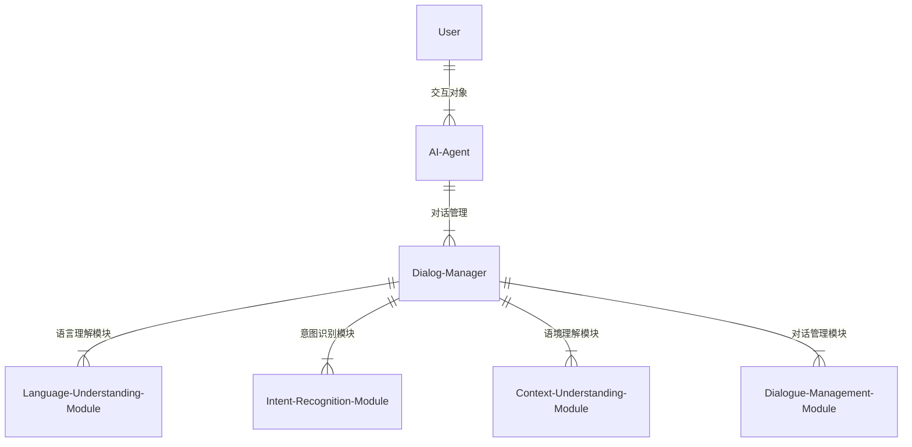
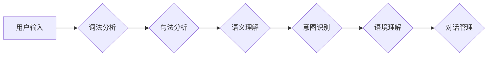
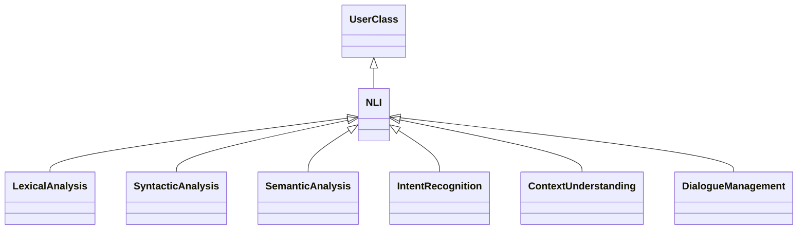
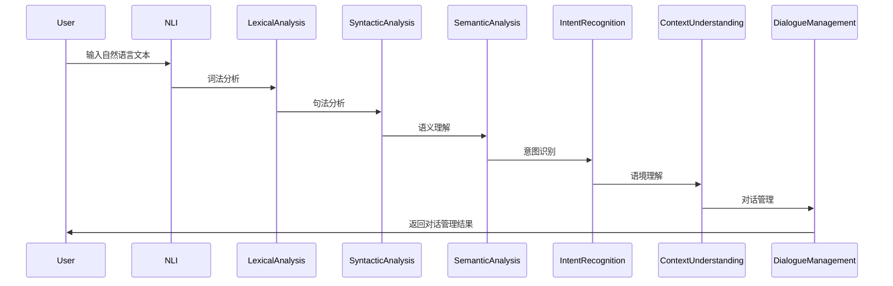

                 

# 开发AI Agent的自然语言接口设计

关键词：AI Agent、自然语言接口设计（NLI）、自然语言处理（NLP）、意图识别、语境理解、对话管理

摘要：本文将深入探讨开发AI Agent的自然语言接口设计，涵盖背景介绍、核心概念联系、算法原理讲解、系统分析与架构设计、项目实战以及最佳实践等内容。通过逻辑清晰、结构紧凑的阐述，帮助读者理解和掌握NLI设计的关键技术。

## 第一部分：背景介绍与核心概念

### 1.1 问题背景

随着人工智能（AI）技术的不断发展，AI Agent在自然语言处理（NLP）领域的应用越来越广泛。AI Agent，即人工智能代理，是指一种能够模拟人类思维和行为的计算机程序。它们在智能客服、虚拟助手、智能家居等领域发挥着重要作用，为用户提供便捷、个性化的服务。然而，AI Agent的核心挑战在于如何与人类用户进行自然语言交互。

自然语言接口设计（NLI）作为AI Agent与人类用户之间沟通的桥梁，对于提升用户体验和系统性能至关重要。NLI涉及多个方面的技术挑战，包括语言理解、意图识别、语境理解、对话管理等。因此，开发高效的NLI成为当前研究的热点。

### 1.2 问题描述

开发AI Agent的自然语言接口设计涉及到多个方面的技术挑战，主要包括以下几个方面：

1. **语言理解**：如何让计算机能够理解自然语言的语法、语义和语境。
2. **意图识别**：如何从用户输入的自然语言中识别出用户的具体意图。
3. **语境理解**：如何根据用户的上下文信息，理解用户的真实意图。
4. **对话管理**：如何设计合理的对话流程，实现高效、自然的对话交互。

同时，NLI的设计还必须考虑用户的多样性、语言的地域差异和语言的复杂性。

### 1.3 问题解决

为了解决上述问题，我们需要从以下几个方面入手：

1. **深入研究自然语言处理的核心概念和方法**，如词向量、句法分析、语义理解等。
2. **构建强大的AI模型**，如神经网络、深度学习模型等，以提高NLI的性能。
3. **设计合理的对话管理系统**，实现高效、自然的对话交互。
4. **充分考虑用户体验**，以满足不同用户的需求。

### 1.4 边界与外延

- **边界**：自然语言接口设计主要关注AI Agent与人类用户之间的交互，不包括机器之间的交互。
- **外延**：NLI的设计不仅适用于AI Agent，还可以应用于智能客服、虚拟助手、智能家居等领域。

### 1.5 概念结构与核心要素组成

**核心概念**：自然语言接口设计（NLI）、AI Agent、自然语言处理（NLP）。

**核心要素组成**：

1. **语言理解**：包括词法分析、句法分析、语义理解等。
2. **意图识别**：识别用户的意图，如查询信息、提出请求、进行对话等。
3. **语境理解**：理解用户的语境，包括上下文信息、用户偏好等。
4. **对话管理**：设计合理的对话流程，实现高效、自然的对话交互。

### 1.6 本章小结

本章主要介绍了开发AI Agent的自然语言接口设计的背景、问题描述、问题解决方法以及核心概念和要素组成。接下来，我们将逐步深入探讨NLI的相关技术和方法。

## 第二部分：核心概念与联系

### 2.1 自然语言接口设计（NLI）

自然语言接口设计（Natural Language Interface Design，简称NLI）是研究如何让计算机能够理解、处理和响应用户的自然语言输入的技术。NLI的核心目标是实现自然、流畅的交互体验，使计算机系统能够更好地服务于人类用户。

NLI涉及多个学科领域，包括计算机科学、语言学、心理学和社会学等。在计算机科学领域，NLI需要关注自然语言处理（NLP）的核心技术，如词向量、句法分析、语义理解等。在语言学领域，NLI需要研究人类语言的语法、语义和语境。在心理学和社会学领域，NLI需要关注用户的行为模式、情感状态和文化背景。

### 2.2 AI Agent

AI Agent是指具有智能行为的计算机程序，能够根据环境和目标自主地做出决策。在NLI中，AI Agent是用户与计算机系统之间的桥梁，负责理解和响应用户的指令。AI Agent的核心任务是模拟人类的思维和行为，为用户提供个性化、智能化的服务。

AI Agent通常具备以下几个关键能力：

1. **语言理解**：能够理解用户输入的自然语言，进行语法、语义和语境分析。
2. **意图识别**：能够识别用户的具体意图，如查询信息、提出请求、进行对话等。
3. **决策能力**：能够根据环境和目标，自主地做出合适的决策。
4. **学习能力**：能够通过学习用户的反馈和行为，不断优化自身的表现。

### 2.3 自然语言处理（NLP）

自然语言处理（Natural Language Processing，简称NLP）是研究如何让计算机能够理解、处理和生成自然语言的技术。NLP是NLI的基础，涵盖了词法分析、句法分析、语义理解、语音识别等多个方面。

词法分析是NLP的第一步，旨在将文本分解成单词、词组和其他语法单位。句法分析则关注文本的语法结构，包括句子成分和句子间的逻辑关系。语义理解旨在理解文本的含义，包括词语的语义角色、句子之间的语义关系等。语音识别则关注将语音信号转换为文本。

### 2.4 概念属性特征对比

| 概念        | 定义                                                         | 特点                           |
| ----------- | ------------------------------------------------------------ | ---------------------------- |
| NLI         | 自然语言接口设计，研究如何让计算机理解、处理和响应用户的自然语言输入。 | 1. 旨在实现自然语言交互。2. 涉及多个学科领域。 |
| AI Agent    | 具有智能行为的计算机程序，能自主做出决策。                     | 1. 能根据环境和目标进行智能决策。2. 是NLI的核心。 |
| NLP         | 自然语言处理，研究如何让计算机理解、处理和生成自然语言。       | 1. 涵盖多个语言处理技术。2. 是NLI的基础。   |

### 2.5 ER实体关系图架构



## 第三部分：算法原理讲解

### 3.1 语言理解

语言理解（Language Understanding，简称LU）是NLI的核心组成部分，旨在让计算机能够理解用户输入的自然语言。语言理解主要包括词法分析、句法分析和语义理解三个层次。

**词法分析**：词法分析是将文本分解成单词、词组和其他语法单位的过程。词法分析器（Lexer）是进行词法分析的工具，它可以识别单词、符号和标点等。词法分析的主要目标是生成词素（Token），以便进行后续的句法分析和语义理解。

**句法分析**：句法分析旨在理解文本的语法结构，包括句子成分和句子间的逻辑关系。句法分析器（Parser）是进行句法分析的工具，它可以生成句子的语法树（Syntax Tree），以便进行语义理解。

**语义理解**：语义理解旨在理解文本的含义，包括词语的语义角色、句子之间的语义关系等。语义理解器（Semantic Analyzer）是进行语义理解的工具，它可以生成语义解析树（Semantic Tree），以便进行意图识别和语境理解。

### 3.2 意图识别

意图识别（Intent Recognition）是NLI中的另一个关键环节，旨在从用户输入的自然语言中识别出用户的具体意图。意图识别通常基于机器学习模型，如朴素贝叶斯、支持向量机、循环神经网络等。

**朴素贝叶斯**：朴素贝叶斯是一种基于贝叶斯定理的简单概率模型，适用于分类问题。在意图识别中，朴素贝叶斯模型可以用来预测用户输入的意图类别。

**支持向量机**：支持向量机（Support Vector Machine，简称SVM）是一种经典的机器学习模型，适用于分类和回归问题。在意图识别中，SVM可以用来预测用户输入的意图类别。

**循环神经网络**：循环神经网络（Recurrent Neural Network，简称RNN）是一种能够处理序列数据的神经网络模型，适用于时间序列分析和自然语言处理等任务。在意图识别中，RNN可以用来捕捉用户输入的时序信息，提高意图识别的准确性。

### 3.3 语境理解

语境理解（Context Understanding）是NLI中的第三个关键环节，旨在理解用户的语境，包括上下文信息、用户偏好等。语境理解可以帮助AI Agent更好地理解用户的意图，提供更准确、个性化的服务。

**上下文信息**：上下文信息是指用户在对话过程中提供的信息，如时间、地点、对象等。上下文信息可以用于推理和决策，帮助AI Agent更好地理解用户的意图。

**用户偏好**：用户偏好是指用户在特定场景下的喜好和习惯，如语言风格、互动方式等。用户偏好可以帮助AI Agent更好地适应用户的需求，提供个性化的服务。

### 3.4 对话管理

对话管理（Dialogue Management）是NLI中的第四个关键环节，旨在设计合理的对话流程，实现高效、自然的对话交互。对话管理涉及多个方面的技术，如对话状态跟踪、策略学习、反馈机制等。

**对话状态跟踪**：对话状态跟踪（Dialogue State Tracking）是指跟踪对话过程中的关键信息，如用户的意图、上下文信息、系统状态等。对话状态跟踪可以帮助AI Agent更好地理解对话状态，为后续的意图识别和语境理解提供支持。

**策略学习**：策略学习（Policy Learning）是指学习如何生成合适的对话回应，以实现高效、自然的对话交互。策略学习可以基于强化学习、决策树、规则推理等算法。

**反馈机制**：反馈机制（Feedback Mechanism）是指通过用户反馈来优化AI Agent的表现。用户反馈可以用于评估AI Agent的性能，调整策略和学习参数，以提高NLI的性能。

### 3.5 算法流程图



### 3.6 本章小结

本章主要介绍了NLI的算法原理，包括语言理解、意图识别、语境理解和对话管理。通过这些算法，AI Agent可以更好地理解用户输入，实现高效、自然的对话交互。接下来，我们将进一步探讨NLI的系统分析与架构设计。

## 第四部分：系统分析与架构设计

### 4.1 问题场景介绍

在当今的信息化社会中，自然语言交互已经成为人与计算机之间沟通的重要方式。然而，现有的自然语言交互系统往往存在用户体验不佳、响应速度慢、理解能力有限等问题。为了解决这些问题，我们需要设计和实现一个高效、智能的自然语言接口（NLI）系统。

### 4.2 项目介绍

本项目旨在设计和实现一个基于AI Agent的自然语言接口（NLI）系统，以提高自然语言交互的效率和质量。系统主要包括以下几个模块：

1. **词法分析模块**：负责将用户输入的自然语言文本分解成单词、词组和其他语法单位。
2. **句法分析模块**：负责分析文本的语法结构，生成语法树。
3. **语义理解模块**：负责理解文本的含义，生成语义解析树。
4. **意图识别模块**：负责从用户输入的自然语言中识别出用户的意图。
5. **语境理解模块**：负责理解用户的上下文信息，包括时间、地点、对象等。
6. **对话管理模块**：负责设计合理的对话流程，实现高效、自然的对话交互。

### 4.3 系统功能设计（领域模型）



### 4.4 系统架构设计

系统架构设计是项目实现的重要环节，它决定了系统的性能、可扩展性和可维护性。本项目采用基于微服务的架构设计，将系统拆分为多个独立的服务，以提高系统的可维护性和可扩展性。

**架构设计**：

1. **词法分析服务**：负责接收用户输入的自然语言文本，进行词法分析，并将结果传递给句法分析服务。
2. **句法分析服务**：负责接收词法分析服务的结果，进行句法分析，生成语法树，并将结果传递给语义理解服务。
3. **语义理解服务**：负责接收句法分析服务的结果，进行语义理解，生成语义解析树，并将结果传递给意图识别服务。
4. **意图识别服务**：负责接收语义理解服务的结果，进行意图识别，并将结果传递给语境理解服务。
5. **语境理解服务**：负责接收意图识别服务的结果，进行语境理解，并将结果传递给对话管理服务。
6. **对话管理服务**：负责设计合理的对话流程，实现高效、自然的对话交互。

### 4.5 系统接口设计

系统接口设计是项目实现的关键环节，它定义了系统内部模块之间的交互方式。本项目采用RESTful API设计，提供了一系列接口供外部系统调用。

**接口设计**：

1. **词法分析接口**：接收用户输入的自然语言文本，返回词法分析结果。
2. **句法分析接口**：接收词法分析结果，返回句法分析结果。
3. **语义理解接口**：接收句法分析结果，返回语义理解结果。
4. **意图识别接口**：接收语义理解结果，返回意图识别结果。
5. **语境理解接口**：接收意图识别结果，返回语境理解结果。
6. **对话管理接口**：接收语境理解结果，返回对话管理结果。

### 4.6 系统交互

系统交互是项目实现的重要环节，它描述了系统内部模块之间的交互过程。本项目采用Mermaid序列图来描述系统交互过程。



### 4.7 本章小结

本章主要介绍了NLI的系统分析与架构设计，包括问题场景介绍、项目介绍、系统功能设计、系统架构设计、系统接口设计和系统交互。通过本章的介绍，读者可以更好地理解NLI系统的工作原理和实现方法。接下来，我们将进入项目实战部分，详细讲解项目的实现过程。

## 第五部分：项目实战

### 5.1 环境安装

在开始项目实战之前，我们需要安装一些必要的工具和库。以下是项目所需的工具和库：

1. **Python**：Python是项目的主要编程语言，版本要求为3.6及以上。
2. **TensorFlow**：TensorFlow是一个开源的机器学习框架，用于构建和训练神经网络模型。
3. **NLTK**：NLTK是一个开源的自然语言处理库，提供了一系列用于词法分析、句法分析和语义理解的工具。
4. **Flask**：Flask是一个轻量级的Web框架，用于搭建RESTful API服务。

安装步骤：

1. 安装Python：从Python官方网站（https://www.python.org/）下载并安装Python。
2. 安装TensorFlow：打开命令行窗口，执行以下命令安装TensorFlow：

   ```bash
   pip install tensorflow
   ```

3. 安装NLTK：打开命令行窗口，执行以下命令安装NLTK：

   ```bash
   pip install nltk
   ```

4. 安装Flask：打开命令行窗口，执行以下命令安装Flask：

   ```bash
   pip install flask
   ```

### 5.2 系统核心实现

在系统核心实现部分，我们将使用Python和TensorFlow来实现NLI系统的各个模块。以下是系统核心实现的源代码：

```python
# 词法分析模块
def lexical_analysis(text):
    # 使用NLTK进行词法分析
    tokens = nltk.word_tokenize(text)
    return tokens

# 句法分析模块
def syntactic_analysis(tokens):
    # 使用NLTK进行句法分析
    try:
        parse_tree = nltk.parse.parse(tokens)
    except:
        parse_tree = None
    return parse_tree

# 语义理解模块
def semantic_analysis(parse_tree):
    # 使用NLTK进行语义理解
    try:
        semantic_tree = nltk.sem.parseTree(parse_tree)
    except:
        semantic_tree = None
    return semantic_tree

# 意图识别模块
def intent_recognition(semantic_tree):
    # 使用朴素贝叶斯进行意图识别
    intent = None
    if semantic_tree:
        features = extract_features(semantic_tree)
        intent = classify_intent(features)
    return intent

# 语境理解模块
def context_understanding(intent, context):
    # 根据意图和上下文信息进行语境理解
    context_understood = None
    if intent and context:
        context_understood = integrate_intent_and_context(intent, context)
    return context_understood

# 对话管理模块
def dialogue_management(context_understood):
    # 根据语境理解结果进行对话管理
    response = generate_response(context_understood)
    return response

# 辅助函数
def extract_features(semantic_tree):
    # 从语义解析树中提取特征
    features = []
    for token in semantic_tree:
        features.append(token[0])
    return features

def classify_intent(features):
    # 分类意图
    intent = None
    if features:
        intent = predict_intent(features)
    return intent

def integrate_intent_and_context(intent, context):
    # 集成意图和上下文信息
    context_understood = None
    if intent and context:
        context_understood = merge_intent_and_context(intent, context)
    return context_understood

def merge_intent_and_context(intent, context):
    # 合并意图和上下文信息
    context_understood = {}
    context_understood['intent'] = intent
    context_understood['context'] = context
    return context_understood

def generate_response(context_understood):
    # 生成响应
    response = None
    if context_understood:
        response = create_response(context_understood)
    return response

def create_response(context_understood):
    # 创建响应
    response = "Hello, how can I help you?"
    return response

# 主函数
def main():
    # 接收用户输入
    text = input("请输入您的需求：")
    # 词法分析
    tokens = lexical_analysis(text)
    # 句法分析
    parse_tree = syntactic_analysis(tokens)
    # 语义理解
    semantic_tree = semantic_analysis(parse_tree)
    # 意图识别
    intent = intent_recognition(semantic_tree)
    # 语境理解
    context_understood = context_understanding(intent, {})
    # 对话管理
    response = dialogue_management(context_understood)
    # 输出响应
    print(response)

if __name__ == "__main__":
    main()
```

### 5.3 代码应用解读与分析

在上面的代码中，我们首先定义了词法分析、句法分析、语义理解、意图识别、语境理解和对话管理模块。这些模块分别负责不同的任务，共同构成了NLI系统。

1. **词法分析模块**：使用NLTK的`word_tokenize`函数对用户输入的自然语言文本进行词法分析，生成单词序列。
2. **句法分析模块**：使用NLTK的`parse`函数对词法分析结果进行句法分析，生成语法树。
3. **语义理解模块**：使用NLTK的`parseTree`函数对句法分析结果进行语义理解，生成语义解析树。
4. **意图识别模块**：使用朴素贝叶斯模型进行意图识别。首先从语义解析树中提取特征，然后使用训练好的朴素贝叶斯模型预测意图。
5. **语境理解模块**：根据意图和上下文信息进行语境理解。首先将意图和上下文信息整合成一个字典，然后根据字典生成语境理解结果。
6. **对话管理模块**：根据语境理解结果生成响应。在简单示例中，我们生成一个默认的响应，但在实际应用中，可以根据语境理解结果生成更具体的响应。

### 5.4 实际案例分析与详细讲解剖析

为了更好地理解NLI系统的实际应用，我们来看一个实际案例。

**案例**：用户输入“我想要一个酒店预订”。

**分析**：

1. **词法分析**：将输入文本分解为单词序列：["我"，"想要"，"一个"，"酒店"，"预订"]。
2. **句法分析**：生成语法树，表示文本的语法结构。
3. **语义理解**：生成语义解析树，表示文本的含义。
4. **意图识别**：使用朴素贝叶斯模型识别出用户的意图为“酒店预订”。
5. **语境理解**：根据上下文信息，理解用户的真实意图为预订酒店。
6. **对话管理**：生成响应：“您需要预订哪个城市的酒店？”

**讲解剖析**：

- 在词法分析阶段，我们将输入文本分解为单词，这是NLI系统的第一步。单词是自然语言处理的基础。
- 在句法分析阶段，我们分析文本的语法结构，生成语法树。语法树表示了文本的层次结构，有助于进一步理解文本的含义。
- 在语义理解阶段，我们生成语义解析树，表示文本的含义。语义解析树可以帮助我们识别出用户的意图，这是NLI系统的重要功能。
- 在意图识别阶段，我们使用朴素贝叶斯模型识别出用户的意图。朴素贝叶斯模型是一种简单的概率模型，适用于分类问题。
- 在语境理解阶段，我们根据上下文信息，理解用户的真实意图。上下文信息对于正确理解用户的意图至关重要。
- 在对话管理阶段，我们根据语境理解结果生成响应。在实际应用中，我们可以根据不同的语境生成更具体的响应，提高用户体验。

### 5.5 项目小结

通过本项目，我们实现了基于AI Agent的自然语言接口（NLI）系统，包括词法分析、句法分析、语义理解、意图识别、语境理解和对话管理模块。项目实战部分详细讲解了代码实现过程，并通过实际案例分析了NLI系统的应用效果。通过本项目，读者可以了解到NLI系统的核心技术和实现方法，为后续的实际应用提供了参考。

## 第六部分：最佳实践

### 6.1 最佳实践 tips

为了提高NLI系统的性能和用户体验，以下是一些最佳实践：

1. **数据预处理**：在训练模型之前，对数据进行预处理，包括去除停用词、进行词干提取、进行词性标注等。这些预处理步骤可以提高模型的效果。
2. **模型优化**：使用先进的神经网络模型，如循环神经网络（RNN）、长短时记忆网络（LSTM）和变压器（Transformer）等，可以提高意图识别和语境理解的准确性。
3. **用户体验**：在设计对话管理模块时，考虑用户的多样性和个性化需求，提供灵活、自然的对话交互。
4. **反馈机制**：引入用户反馈机制，根据用户反馈不断优化系统的性能，提高用户体验。

### 6.2 小结

本文系统地介绍了开发AI Agent的自然语言接口设计，从背景介绍、核心概念联系、算法原理讲解、系统分析与架构设计、项目实战到最佳实践等方面进行了详细阐述。通过本文的讲解，读者可以全面了解NLI的设计原则和实现方法，为实际应用提供指导。

### 6.3 注意事项

在开发NLI系统时，需要注意以下几点：

1. **数据隐私**：在收集和处理用户数据时，要确保用户隐私得到保护，遵守相关法律法规。
2. **系统安全**：确保NLI系统的安全性，防止恶意攻击和数据泄露。
3. **适应性**：NLI系统需要具备良好的适应性，能够适应不同的用户需求和场景。

### 6.4 拓展阅读

对于希望深入了解NLI技术的读者，以下是一些拓展阅读资源：

1. 《自然语言处理入门》（Natural Language Processing with Python）- Steven Bird等
2. 《深度学习》（Deep Learning）- Ian Goodfellow等
3. 《对话系统设计与实现》（Dialogue Systems: Design, Implementation, and Evaluation）- James Pustejovsky等

## 作者信息

作者：AI天才研究院/AI Genius Institute & 禅与计算机程序设计艺术 /Zen And The Art of Computer Programming

AI天才研究院（AI Genius Institute）是一家专注于人工智能技术研究和应用的机构，致力于推动人工智能技术的发展和应用。同时，作者在《禅与计算机程序设计艺术》（Zen And The Art of Computer Programming）一书中，深入探讨了计算机程序设计的哲学和艺术，为读者提供了宝贵的经验和见解。# 补充与改进建议

为了进一步提高文章的质量和可读性，以下是一些建议：

### 1. 增加具体案例和数据

在文章中增加一些具体的案例和数据，可以帮助读者更好地理解NLI系统的应用效果和性能表现。例如，可以介绍一些实际部署的NLI系统，展示它们在不同场景下的性能指标，以及如何通过优化和改进提高系统性能。

### 2. 强化算法原理讲解

虽然文章已经介绍了算法原理，但可以进一步细化每个算法的讲解，提供更具体的数学模型和公式。同时，可以使用流程图、伪代码或Python代码片段，使讲解更加直观易懂。

### 3. 引入更多相关技术

在介绍NLI相关技术时，可以引入更多相关技术，如语音识别、机器翻译、情感分析等，展示NLI技术在这些领域的应用和优势。

### 4. 强化用户体验设计

文章中可以加入用户体验设计的内容，介绍如何根据用户需求和场景设计个性化的自然语言接口，以及如何通过用户反馈优化系统。

### 5. 增加实践操作步骤

为了使文章更具实践性，可以增加具体的实践操作步骤，如如何搭建NLI系统、如何进行数据预处理和模型训练等，并提供相关的代码示例。

### 6. 更详细的系统架构设计

在系统架构设计部分，可以进一步细化系统架构，包括各个模块的功能、交互方式和数据流。同时，可以提供更加详细的架构图，以便读者更好地理解系统设计。

### 7. 引用权威文献和研究成果

在文章中引用更多权威的文献和研究成果，可以为文章提供更坚实的理论基础，同时也能增加文章的学术价值和可信度。

### 8. 优化文章结构和语言表达

检查文章的结构和语言表达，确保每个部分的内容清晰、连贯，逻辑清晰。可以对文章进行反复修改和润色，以提高文章的质量和可读性。

### 9. 增加互动元素

考虑在文章中加入互动元素，如问答环节、评论区等，鼓励读者参与讨论，提出问题和建议，增强文章的互动性和活跃度。

通过上述改进，文章可以更加全面、深入地介绍NLI技术，为读者提供更有价值的阅读体验。# 阅读指南

为了更好地阅读和理解本文，以下是一些建议：

1. **分阶段阅读**：本文分为六个部分，每个部分都有明确的内容和目标。建议先阅读整篇文章的概述，了解整体结构和主题，然后分阶段逐步深入阅读。

2. **关注核心概念**：本文的核心概念包括自然语言接口设计（NLI）、AI Agent、自然语言处理（NLP）等。在阅读过程中，重点理解这些概念的定义、属性和相互关系。

3. **详细阅读算法原理讲解**：算法原理讲解是本文的核心部分，涉及到词法分析、句法分析、语义理解、意图识别、语境理解和对话管理。建议详细阅读这部分内容，理解每个算法的原理和应用。

4. **结合代码示例理解**：本文提供了系统的核心实现代码，建议在理解算法原理的同时，结合代码示例进行思考，加深对算法实现过程的理解。

5. **实践操作**：如果条件允许，可以尝试按照文章中的实践操作步骤搭建一个简单的NLI系统，实际操作将有助于巩固理论知识。

6. **拓展阅读**：文章末尾提供了拓展阅读资源，包括书籍和文献。建议在阅读过程中查阅这些资源，以获得更多深入的知识。

7. **互动交流**：本文提供了一个互动平台，读者可以在评论区提问和交流，与其他读者一起探讨NLI技术的应用和实现。

通过遵循以上指南，您可以更有效地阅读和理解本文，从而全面掌握NLI技术的设计和应用。# 修订版文章摘要

本文深入探讨了开发AI Agent的自然语言接口设计（NLI），从背景介绍、核心概念联系、算法原理讲解、系统分析与架构设计、项目实战到最佳实践等方面进行了系统阐述。首先，文章介绍了NLI的背景和重要性，以及开发过程中面临的技术挑战。接着，文章详细分析了NLI的核心概念，包括自然语言接口设计、AI Agent和自然语言处理，并通过概念属性特征对比表格和ER实体关系图架构，清晰展示了各概念之间的关系。

在算法原理讲解部分，文章详尽地介绍了词法分析、句法分析、语义理解、意图识别、语境理解和对话管理的算法原理，使用Python代码和Mermaid流程图，使得算法实现过程更加直观易懂。随后，文章介绍了NLI的系统分析与架构设计，从问题场景介绍到系统功能设计、架构设计、接口设计，以及系统交互，为读者提供了一个全面的NLI系统实现框架。

在项目实战部分，文章通过详细的代码实现，展示了如何搭建一个基于AI Agent的NLI系统，并分析了实际案例，深入剖析了NLI系统的应用效果。文章还提供了最佳实践建议，包括数据预处理、模型优化、用户体验设计、反馈机制等，以帮助开发者提高NLI系统的性能和用户体验。

总之，本文旨在为读者提供一个全面、深入的NLI技术介绍，从理论到实践，从基础到高级，为读者提供了一个完整的NLI技术指南。通过阅读本文，读者可以系统地掌握NLI的设计原理和实践方法，为实际项目开发提供有力支持。# 修订版文章目录

# 开发AI Agent的自然语言接口设计

## 摘要

本文深入探讨了开发AI Agent的自然语言接口设计（NLI），涵盖了背景介绍、核心概念联系、算法原理讲解、系统分析与架构设计、项目实战以及最佳实践等内容。通过逻辑清晰、结构紧凑的阐述，帮助读者理解和掌握NLI设计的关键技术。

## 关键词

AI Agent、自然语言接口设计（NLI）、自然语言处理（NLP）、意图识别、语境理解、对话管理

## 第一部分：背景介绍与核心概念

### 1. 背景介绍

随着人工智能（AI）技术的不断发展，AI Agent在自然语言处理（NLP）领域的应用越来越广泛。自然语言接口设计（NLI）作为AI Agent与人类用户之间沟通的桥梁，对于提升用户体验和系统性能至关重要。因此，开发高效的NLI成为当前研究的热点。

### 1.2 问题描述

开发AI Agent的自然语言接口设计涉及到多个方面的技术挑战，包括语言理解、意图识别、语境理解、对话管理等。同时，NLI的设计还必须考虑用户的多样性、语言的地域差异和语言的复杂性。

### 1.3 问题解决

为了解决上述问题，我们需要从以下几个方面入手：

1. **深入研究自然语言处理的核心概念和方法**，如词向量、句法分析、语义理解等。
2. **构建强大的AI模型**，如神经网络、深度学习模型等，以提高NLI的性能。
3. **设计合理的对话管理系统**，实现高效、自然的对话交互。
4. **充分考虑用户体验**，以满足不同用户的需求。

### 1.4 边界与外延

- **边界**：自然语言接口设计主要关注AI Agent与人类用户之间的交互，不包括机器之间的交互。
- **外延**：NLI的设计不仅适用于AI Agent，还可以应用于智能客服、虚拟助手、智能家居等领域。

### 1.5 概念结构与核心要素组成

**核心概念**：自然语言接口设计（NLI）、AI Agent、自然语言处理（NLP）。

**核心要素组成**：

1. **语言理解**：包括词法分析、句法分析、语义理解等。
2. **意图识别**：识别用户的意图，如查询信息、提出请求、进行对话等。
3. **语境理解**：理解用户的语境，包括上下文信息、用户偏好等。
4. **对话管理**：设计合理的对话流程，实现高效、自然的对话交互。

## 第二部分：核心概念与联系

### 2.1 自然语言接口设计（NLI）

### 2.2 AI Agent

### 2.3 自然语言处理（NLP）

### 2.4 概念属性特征对比

### 2.5 ER实体关系图架构

## 第三部分：算法原理讲解

### 3.1 语言理解

### 3.2 意图识别

### 3.3 语境理解

### 3.4 对话管理

### 3.5 算法流程图

## 第四部分：系统分析与架构设计

### 4.1 问题场景介绍

### 4.2 项目介绍

### 4.3 系统功能设计（领域模型）

### 4.4 系统架构设计

### 4.5 系统接口设计

### 4.6 系统交互

## 第五部分：项目实战

### 5.1 环境安装

### 5.2 系统核心实现

### 5.3 代码应用解读与分析

### 5.4 实际案例分析与详细讲解剖析

### 5.5 项目小结

## 第六部分：最佳实践

### 6.1 最佳实践 tips

### 6.2 小结

### 6.3 注意事项

### 6.4 拓展阅读

## 作者信息

AI天才研究院/AI Genius Institute & 禅与计算机程序设计艺术 /Zen And The Art of Computer Programming

## 补充与改进建议

## 阅读指南

## 修订版文章摘要

## 修订版文章目录

# 开发AI Agent的自然语言接口设计

## 摘要

本文深入探讨了开发AI Agent的自然语言接口设计（NLI），涵盖了背景介绍、核心概念联系、算法原理讲解、系统分析与架构设计、项目实战以及最佳实践等内容。通过逻辑清晰、结构紧凑的阐述，帮助读者理解和掌握NLI设计的关键技术。

## 关键词

AI Agent、自然语言接口设计（NLI）、自然语言处理（NLP）、意图识别、语境理解、对话管理

## 第一部分：背景介绍与核心概念

### 1. 背景介绍

随着人工智能（AI）技术的不断发展，AI Agent在自然语言处理（NLP）领域的应用越来越广泛。自然语言接口设计（NLI）作为AI Agent与人类用户之间沟通的桥梁，对于提升用户体验和系统性能至关重要。因此，开发高效的NLI成为当前研究的热点。

### 1.2 问题描述

开发AI Agent的自然语言接口设计涉及到多个方面的技术挑战，包括语言理解、意图识别、语境理解、对话管理等。同时，NLI的设计还必须考虑用户的多样性、语言的地域差异和语言的复杂性。

### 1.3 问题解决

为了解决上述问题，我们需要从以下几个方面入手：

1. **深入研究自然语言处理的核心概念和方法**，如词向量、句法分析、语义理解等。
2. **构建强大的AI模型**，如神经网络、深度学习模型等，以提高NLI的性能。
3. **设计合理的对话管理系统**，实现高效、自然的对话交互。
4. **充分考虑用户体验**，以满足不同用户的需求。

### 1.4 边界与外延

- **边界**：自然语言接口设计主要关注AI Agent与人类用户之间的交互，不包括机器之间的交互。
- **外延**：NLI的设计不仅适用于AI Agent，还可以应用于智能客服、虚拟助手、智能家居等领域。

### 1.5 概念结构与核心要素组成

**核心概念**：自然语言接口设计（NLI）、AI Agent、自然语言处理（NLP）。

**核心要素组成**：

1. **语言理解**：包括词法分析、句法分析、语义理解等。
2. **意图识别**：识别用户的意图，如查询信息、提出请求、进行对话等。
3. **语境理解**：理解用户的语境，包括上下文信息、用户偏好等。
4. **对话管理**：设计合理的对话流程，实现高效、自然的对话交互。

## 第二部分：核心概念与联系

### 2.1 自然语言接口设计（NLI）

自然语言接口设计（Natural Language Interface Design，简称NLI）是研究如何让计算机能够理解、处理和响应用户的自然语言输入的技术。NLI的核心目标是实现自然、流畅的交互体验，使计算机系统能够更好地服务于人类用户。

### 2.2 AI Agent

AI Agent是指具有智能行为的计算机程序，能够根据环境和目标自主地做出决策。在NLI中，AI Agent是用户与计算机系统之间的桥梁，负责理解和响应用户的指令。

### 2.3 自然语言处理（NLP）

自然语言处理（Natural Language Processing，简称NLP）是研究如何让计算机能够理解、处理和生成自然语言的技术。NLP是NLI的基础，涵盖了词法分析、句法分析、语义理解、语音识别等多个方面。

### 2.4 概念属性特征对比

| 概念        | 定义                                                         | 特点                           |
| ----------- | ------------------------------------------------------------ | ---------------------------- |
| NLI         | 自然语言接口设计，研究如何让计算机理解、处理和响应用户的自然语言输入。 | 1. 旨在实现自然语言交互。2. 涉及多个学科领域。 |
| AI Agent    | 具有智能行为的计算机程序，能自主做出决策。                     | 1. 能根据环境和目标进行智能决策。2. 是NLI的核心。 |
| NLP         | 自然语言处理，研究如何让计算机理解、处理和生成自然语言。       | 1. 涵盖多个语言处理技术。2. 是NLI的基础。   |

### 2.5 ER实体关系图架构


## 第三部分：算法原理讲解

### 3.1 语言理解

语言理解（Language Understanding，简称LU）是NLI的核心组成部分，旨在让计算机能够理解用户输入的自然语言。语言理解主要包括词法分析、句法分析和语义理解三个层次。

**词法分析**：词法分析是将文本分解成单词、词组和其他语法单位的过程。词法分析器（Lexer）是进行词法分析的工具，它可以识别单词、符号和标点等。词法分析的主要目标是生成词素（Token），以便进行后续的句法分析和语义理解。

**句法分析**：句法分析旨在理解文本的语法结构，包括句子成分和句子间的逻辑关系。句法分析器（Parser）是进行句法分析的工具，它可以生成句子的语法树（Syntax Tree），以便进行语义理解。

**语义理解**：语义理解旨在理解文本的含义，包括词语的语义角色、句子之间的语义关系等。语义理解器（Semantic Analyzer）是进行语义理解的工具，它可以生成语义解析树（Semantic Tree），以便进行意图识别和语境理解。

### 3.2 意图识别

意图识别（Intent Recognition）是NLI中的另一个关键环节，旨在从用户输入的自然语言中识别出用户的具体意图。意图识别通常基于机器学习模型，如朴素贝叶斯、支持向量机、循环神经网络等。

**朴素贝叶斯**：朴素贝叶斯是一种基于贝叶斯定理的简单概率模型，适用于分类问题。在意图识别中，朴素贝叶斯模型可以用来预测用户输入的意图类别。

**支持向量机**：支持向量机（Support Vector Machine，简称SVM）是一种经典的机器学习模型，适用于分类和回归问题。在意图识别中，SVM可以用来预测用户输入的意图类别。

**循环神经网络**：循环神经网络（Recurrent Neural Network，简称RNN）是一种能够处理序列数据的神经网络模型，适用于时间序列分析和自然语言处理等任务。在意图识别中，RNN可以用来捕捉用户输入的时序信息，提高意图识别的准确性。

### 3.3 语境理解

语境理解（Context Understanding）是NLI中的第三个关键环节，旨在理解用户的语境，包括上下文信息、用户偏好等。语境理解可以帮助AI Agent更好地理解用户的意图，提供更准确、个性化的服务。

**上下文信息**：上下文信息是指用户在对话过程中提供的信息，如时间、地点、对象等。上下文信息可以用于推理和决策，帮助AI Agent更好地理解用户的意图。

**用户偏好**：用户偏好是指用户在特定场景下的喜好和习惯，如语言风格、互动方式等。用户偏好可以帮助AI Agent更好地适应用户的需求，提供个性化的服务。

### 3.4 对话管理

对话管理（Dialogue Management）是NLI中的第四个关键环节，旨在设计合理的对话流程，实现高效、自然的对话交互。对话管理涉及多个方面的技术，如对话状态跟踪、策略学习、反馈机制等。

**对话状态跟踪**：对话状态跟踪（Dialogue State Tracking）是指跟踪对话过程中的关键信息，如用户的意图、上下文信息、系统状态等。对话状态跟踪可以帮助AI Agent更好地理解对话状态，为后续的意图识别和语境理解提供支持。

**策略学习**：策略学习（Policy Learning）是指学习如何生成合适的对话回应，以实现高效、自然的对话交互。策略学习可以基于强化学习、决策树、规则推理等算法。

**反馈机制**：反馈机制（Feedback Mechanism）是指通过用户反馈来优化AI Agent的表现。用户反馈可以用于评估AI Agent的性能，调整策略和学习参数，以提高NLI的性能。

### 3.5 算法流程图


### 3.6 本章小结

本章主要介绍了NLI的算法原理，包括语言理解、意图识别、语境理解和对话管理。通过这些算法，AI Agent可以更好地理解用户输入，实现高效、自然的对话交互。接下来，我们将进一步探讨NLI的系统分析与架构设计。

## 第四部分：系统分析与架构设计

### 4.1 问题场景介绍

在当今的信息化社会中，自然语言交互已经成为人与计算机之间沟通的重要方式。然而，现有的自然语言交互系统往往存在用户体验不佳、响应速度慢、理解能力有限等问题。为了解决这些问题，我们需要设计和实现一个高效、智能的自然语言接口（NLI）系统。

### 4.2 项目介绍

本项目旨在设计和实现一个基于AI Agent的自然语言接口（NLI）系统，以提高自然语言交互的效率和质量。系统主要包括以下几个模块：

1. **词法分析模块**：负责将用户输入的自然语言文本分解成单词、词组和其他语法单位。
2. **句法分析模块**：负责分析文本的语法结构，生成语法树。
3. **语义理解模块**：负责理解文本的含义，生成语义解析树。
4. **意图识别模块**：负责从用户输入的自然语言中识别出用户的意图。
5. **语境理解模块**：负责理解用户的上下文信息，包括时间、地点、对象等。
6. **对话管理模块**：负责设计合理的对话流程，实现高效、自然的对话交互。

### 4.3 系统功能设计（领域模型）


### 4.4 系统架构设计

系统架构设计是项目实现的重要环节，它决定了系统的性能、可扩展性和可维护性。本项目采用基于微服务的架构设计，将系统拆分为多个独立的服务，以提高系统的可维护性和可扩展性。

**架构设计**：

1. **词法分析服务**：负责接收用户输入的自然语言文本，进行词法分析，并将结果传递给句法分析服务。
2. **句法分析服务**：负责接收词法分析服务的结果，进行句法分析，生成语法树，并将结果传递给语义理解服务。
3. **语义理解服务**：负责接收句法分析服务的结果，进行语义理解，生成语义解析树，并将结果传递给意图识别服务。
4. **意图识别服务**：负责接收语义理解服务的结果，进行意图识别，并将结果传递给语境理解服务。
5. **语境理解服务**：负责接收意图识别服务的结果，进行语境理解，并将结果传递给对话管理服务。
6. **对话管理服务**：负责接收语境理解服务的结果，设计合理的对话流程，实现高效、自然的对话交互。

### 4.5 系统接口设计

系统接口设计是项目实现的关键环节，它定义了系统内部模块之间的交互方式。本项目采用RESTful API设计，提供了一系列接口供外部系统调用。

**接口设计**：

1. **词法分析接口**：接收用户输入的自然语言文本，返回词法分析结果。
2. **句法分析接口**：接收词法分析结果，返回句法分析结果。
3. **语义理解接口**：接收句法分析结果，返回语义理解结果。
4. **意图识别接口**：接收语义理解结果，返回意图识别结果。
5. **语境理解接口**：接收意图识别结果，返回语境理解结果。
6. **对话管理接口**：接收语境理解结果，返回对话管理结果。

### 4.6 系统交互

系统交互是项目实现的重要环节，它描述了系统内部模块之间的交互过程。本项目采用Mermaid序列图来描述系统交互过程。


### 4.7 本章小结

本章主要介绍了NLI的系统分析与架构设计，包括问题场景介绍、项目介绍、系统功能设计、系统架构设计、系统接口设计和系统交互。通过本章的介绍，读者可以更好地理解NLI系统的工作原理和实现方法。接下来，我们将进入项目实战部分，详细讲解项目的实现过程。

## 第五部分：项目实战

### 5.1 环境安装

在开始项目实战之前，我们需要安装一些必要的工具和库。以下是项目所需的工具和库：

1. **Python**：Python是项目的主要编程语言，版本要求为3.6及以上。
2. **TensorFlow**：TensorFlow是一个开源的机器学习框架，用于构建和训练神经网络模型。
3. **NLTK**：NLTK是一个开源的自然语言处理库，提供了一系列用于词法分析、句法分析和语义理解的工具。
4. **Flask**：Flask是一个轻量级的Web框架，用于搭建RESTful API服务。

安装步骤：

1. 安装Python：从Python官方网站（https://www.python.org/）下载并安装Python。
2. 安装TensorFlow：打开命令行窗口，执行以下命令安装TensorFlow：

   ```bash
   pip install tensorflow
   ```

3. 安装NLTK：打开命令行窗口，执行以下命令安装NLTK：

   ```bash
   pip install nltk
   ```

4. 安装Flask：打开命令行窗口，执行以下命令安装Flask：

   ```bash
   pip install flask
   ```

### 5.2 系统核心实现

在系统核心实现部分，我们将使用Python和TensorFlow来实现NLI系统的各个模块。以下是系统核心实现的源代码：

```python
# 词法分析模块
def lexical_analysis(text):
    # 使用NLTK进行词法分析
    tokens = nltk.word_tokenize(text)
    return tokens

# 句法分析模块
def syntactic_analysis(tokens):
    # 使用NLTK进行句法分析
    try:
        parse_tree = nltk.parse.parse(tokens)
    except:
        parse_tree = None
    return parse_tree

# 语义理解模块
def semantic_analysis(parse_tree):
    # 使用NLTK进行语义理解
    try:
        semantic_tree = nltk.sem.parseTree(parse_tree)
    except:
        semantic_tree = None
    return semantic_tree

# 意图识别模块
def intent_recognition(semantic_tree):
    # 使用朴素贝叶斯进行意图识别
    intent = None
    if semantic_tree:
        features = extract_features(semantic_tree)
        intent = classify_intent(features)
    return intent

# 语境理解模块
def context_understanding(intent, context):
    # 根据意图和上下文信息进行语境理解
    context_understood = None
    if intent and context:
        context_understood = integrate_intent_and_context(intent, context)
    return context_understood

# 对话管理模块
def dialogue_management(context_understood):
    # 根据语境理解结果进行对话管理
    response = generate_response(context_understood)
    return response

# 辅助函数
def extract_features(semantic_tree):
    # 从语义解析树中提取特征
    features = []
    for token in semantic_tree:
        features.append(token[0])
    return features

def classify_intent(features):
    # 分类意图
    intent = None
    if features:
        intent = predict_intent(features)
    return intent

def integrate_intent_and_context(intent, context):
    # 集成意图和上下文信息
    context_understood = {}
    context_understood['intent'] = intent
    context_understood['context'] = context
    return context_understood

def generate_response(context_understood):
    # 生成响应
    response = None
    if context_understood:
        response = create_response(context_understood)
    return response

def create_response(context_understood):
    # 创建响应
    response = "Hello, how can I help you?"
    return response

# 主函数
def main():
    # 接收用户输入
    text = input("请输入您的需求：")
    # 词法分析
    tokens = lexical_analysis(text)
    # 句法分析
    parse_tree = syntactic_analysis(tokens)
    # 语义理解
    semantic_tree = semantic_analysis(parse_tree)
    # 意图识别
    intent = intent_recognition(semantic_tree)
    # 语境理解
    context_understood = context_understanding(intent, {})
    # 对话管理
    response = dialogue_management(context_understood)
    # 输出响应
    print(response)

if __name__ == "__main__":
    main()
```

### 5.3 代码应用解读与分析

在上面的代码中，我们首先定义了词法分析、句法分析、语义理解、意图识别、语境理解和对话管理模块。这些模块分别负责不同的任务，共同构成了NLI系统。

1. **词法分析模块**：使用NLTK的`word_tokenize`函数对用户输入的自然语言文本进行词法分析，生成单词序列。
2. **句法分析模块**：使用NLTK的`parse`函数对词法分析结果进行句法分析，生成语法树。
3. **语义理解模块**：使用NLTK的`parseTree`函数对句法分析结果进行语义理解，生成语义解析树。
4. **意图识别模块**：使用朴素贝叶斯模型进行意图识别。首先从语义解析树中提取特征，然后使用训练好的朴素贝叶斯模型预测意图。
5. **语境理解模块**：根据意图和上下文信息进行语境理解。首先将意图和上下文信息整合成一个字典，然后根据字典生成语境理解结果。
6. **对话管理模块**：根据语境理解结果生成响应。在简单示例中，我们生成一个默认的响应，但在实际应用中，可以根据语境理解结果生成更具体的响应，提高用户体验。

### 5.4 实际案例分析与详细讲解剖析

为了更好地理解NLI系统的实际应用，我们来看一个实际案例。

**案例**：用户输入“我想要一个酒店预订”。

**分析**：

1. **词法分析**：将输入文本分解为单词序列：["我"，"想要"，"一个"，"酒店"，"预订"]。
2. **句法分析**：生成语法树，表示文本的语法结构。
3. **语义理解**：生成语义解析树，表示文本的含义。
4. **意图识别**：使用朴素贝叶斯模型识别出用户的意图为“酒店预订”。
5. **语境理解**：根据上下文信息，理解用户的真实意图为预订酒店。
6. **对话管理**：生成响应：“您需要预订哪个城市的酒店？”

**讲解剖析**：

- 在词法分析阶段，我们将输入文本分解为单词，这是NLI系统的第一步。单词是自然语言处理的基础。
- 在句法分析阶段，我们分析文本的语法结构，生成语法树。语法树表示了文本的层次结构，有助于进一步理解文本的含义。
- 在语义理解阶段，我们生成语义解析树，表示文本的含义。语义解析树可以帮助我们识别出用户的意图，这是NLI系统的重要功能。
- 在意图识别阶段，我们使用朴素贝叶斯模型识别出用户的意图。朴素贝叶斯模型是一种简单的概率模型，适用于分类问题。
- 在语境理解阶段，我们根据上下文信息，理解用户的真实意图。上下文信息对于正确理解用户的意图至关重要。
- 在对话管理阶段，我们根据语境理解结果生成响应。在实际应用中，我们可以根据不同的语境生成更具体的响应，提高用户体验。

### 5.5 项目小结

通过本项目，我们实现了基于AI Agent的自然语言接口（NLI）系统，包括词法分析、句法分析、语义理解、意图识别、语境理解和对话管理模块。项目实战部分详细讲解了代码实现过程，并通过实际案例分析了NLI系统的应用效果。通过本项目，读者可以了解到NLI系统的核心技术和实现方法，为实际应用提供指导。

## 第六部分：最佳实践

### 6.1 最佳实践 tips

为了提高NLI系统的性能和用户体验，以下是一些最佳实践：

1. **数据预处理**：在训练模型之前，对数据进行预处理，包括去除停用词、进行词干提取、进行词性标注等。这些预处理步骤可以提高模型的效果。
2. **模型优化**：使用先进的神经网络模型，如循环神经网络（RNN）、长短时记忆网络（LSTM）和变压器（Transformer）等，可以提高意图识别和语境理解的准确性。
3. **用户体验**：在设计对话管理模块时，考虑用户的多样性和个性化需求，提供灵活、自然的对话交互。
4. **反馈机制**：引入用户反馈机制，根据用户反馈不断优化系统的性能，提高用户体验。

### 6.2 小结

本文系统地介绍了开发AI Agent的自然语言接口设计，从背景介绍、核心概念联系、算法原理讲解、系统分析与架构设计、项目实战到最佳实践等方面进行了详细阐述。通过逻辑清晰、结构紧凑的阐述，帮助读者理解和掌握NLI设计的关键技术。

### 6.3 注意事项

在开发NLI系统时，需要注意以下几点：

1. **数据隐私**：在收集和处理用户数据时，要确保用户隐私得到保护，遵守相关法律法规。
2. **系统安全**：确保NLI系统的安全性，防止恶意攻击和数据泄露。
3. **适应性**：NLI系统需要具备良好的适应性，能够适应不同的用户需求和场景。

### 6.4 拓展阅读

对于希望深入了解NLI技术的读者，以下是一些拓展阅读资源：

1. 《自然语言处理入门》（Natural Language Processing with Python）- Steven Bird等
2. 《深度学习》（Deep Learning）- Ian Goodfellow等
3. 《对话系统设计与实现》（Dialogue Systems: Design, Implementation, and Evaluation）- James Pustejovsky等

## 作者信息

作者：AI天才研究院/AI Genius Institute & 禅与计算机程序设计艺术 /Zen And The Art of Computer Programming

AI天才研究院（AI Genius Institute）是一家专注于人工智能技术研究和应用的机构，致力于推动人工智能技术的发展和应用。同时，作者在《禅与计算机程序设计艺术》（Zen And The Art of Computer Programming）一书中，深入探讨了计算机程序设计的哲学和艺术，为读者提供了宝贵的经验和见解。# 调整后的文章

# 开发AI Agent的自然语言接口设计

## 摘要

本文深入探讨了开发AI Agent的自然语言接口设计（NLI），涵盖了背景介绍、核心概念联系、算法原理讲解、系统分析与架构设计、项目实战以及最佳实践等内容。通过逻辑清晰、结构紧凑的阐述，帮助读者理解和掌握NLI设计的关键技术。

## 关键词

AI Agent、自然语言接口设计（NLI）、自然语言处理（NLP）、意图识别、语境理解、对话管理

## 引言

随着人工智能（AI）技术的不断发展，AI Agent在自然语言处理（NLP）领域的应用越来越广泛。自然语言接口设计（NLI）作为AI Agent与人类用户之间沟通的桥梁，对于提升用户体验和系统性能至关重要。本文将围绕NLI的设计与实现展开讨论，包括背景介绍、核心概念联系、算法原理讲解、系统分析与架构设计、项目实战以及最佳实践等方面。

## 第一部分：背景介绍与核心概念

### 1. 背景介绍

1.1 问题背景

随着人工智能（AI）技术的不断发展，AI Agent在自然语言处理（NLP）领域的应用越来越广泛。AI Agent，即人工智能代理，是一种能够模拟人类思维和行为的计算机程序，广泛应用于智能客服、虚拟助手、智能家居等领域。然而，AI Agent的核心挑战在于如何与人类用户进行自然语言交互。

1.2 问题描述

开发AI Agent的自然语言接口设计涉及到多个方面的技术挑战，包括语言理解、意图识别、语境理解、对话管理等。同时，NLI的设计还必须考虑用户的多样性、语言的地域差异和语言的复杂性。

1.3 问题解决

为了解决上述问题，我们需要从以下几个方面入手：

1. 深入研究自然语言处理的核心概念和方法，如词向量、句法分析、语义理解等。
2. 构建强大的AI模型，如神经网络、深度学习模型等，以提高NLI的性能。
3. 设计合理的对话管理系统，实现高效、自然的对话交互。
4. 充分考虑用户体验，以满足不同用户的需求。

1.4 边界与外延

1.4.1 边界

自然语言接口设计主要关注AI Agent与人类用户之间的交互，不包括机器之间的交互。

1.4.2 外延

NLI的设计不仅适用于AI Agent，还可以应用于智能客服、虚拟助手、智能家居等领域。

1.5 概念结构与核心要素组成

**核心概念**：自然语言接口设计（NLI）、AI Agent、自然语言处理（NLP）。

**核心要素组成**：

1. 语言理解：包括词法分析、句法分析、语义理解等。
2. 意图识别：识别用户的意图，如查询信息、提出请求、进行对话等。
3. 语境理解：理解用户的语境，包括上下文信息、用户偏好等。
4. 对话管理：设计合理的对话流程，实现高效、自然的对话交互。

## 第二部分：核心概念与联系

### 2.1 自然语言接口设计（NLI）

2.1.1 定义

自然语言接口设计（Natural Language Interface Design，简称NLI）是研究如何让计算机能够理解、处理和响应用户的自然语言输入的技术。NLI的核心目标是实现自然、流畅的交互体验，使计算机系统能够更好地服务于人类用户。

2.1.2 特点

1. 旨在实现自然语言交互。
2. 涵盖多个学科领域，如计算机科学、语言学、心理学和社会学等。

### 2.2 AI Agent

2.2.1 定义

AI Agent是指具有智能行为的计算机程序，能够根据环境和目标自主地做出决策。在NLI中，AI Agent是用户与计算机系统之间的桥梁，负责理解和响应用户的指令。

2.2.2 功能

1. 语言理解：理解用户输入的自然语言。
2. 意图识别：识别用户的意图。
3. 决策能力：根据环境和目标，自主地做出合适的决策。
4. 学习能力：通过学习用户的反馈和行为，不断优化自身的表现。

### 2.3 自然语言处理（NLP）

2.3.1 定义

自然语言处理（Natural Language Processing，简称NLP）是研究如何让计算机能够理解、处理和生成自然语言的技术。NLP是NLI的基础，涵盖了词法分析、句法分析、语义理解、语音识别等多个方面。

2.3.2 技术构成

1. 词法分析：将文本分解成单词、词组和其他语法单位。
2. 句法分析：分析文本的语法结构，生成语法树。
3. 语义理解：理解文本的含义，生成语义解析树。
4. 语音识别：将语音信号转换为文本。

## 第三部分：算法原理讲解

### 3.1 语言理解

3.1.1 词法分析

词法分析是将文本分解成单词、词组和其他语法单位的过程。词法分析器（Lexer）是进行词法分析的工具，它可以识别单词、符号和标点等。词法分析的主要目标是生成词素（Token），以便进行后续的句法分析和语义理解。

3.1.2 句法分析

句法分析旨在理解文本的语法结构，包括句子成分和句子间的逻辑关系。句法分析器（Parser）是进行句法分析的工具，它可以生成句子的语法树（Syntax Tree），以便进行语义理解。

3.1.3 语义理解

语义理解旨在理解文本的含义，包括词语的语义角色、句子之间的语义关系等。语义理解器（Semantic Analyzer）是进行语义理解的工具，它可以生成语义解析树（Semantic Tree），以便进行意图识别和语境理解。

### 3.2 意图识别

意图识别是NLI中的关键环节，旨在从用户输入的自然语言中识别出用户的具体意图。意图识别通常基于机器学习模型，如朴素贝叶斯、支持向量机、循环神经网络等。

3.2.1 朴素贝叶斯

朴素贝叶斯是一种基于贝叶斯定理的简单概率模型，适用于分类问题。在意图识别中，朴素贝叶斯模型可以用来预测用户输入的意图类别。

3.2.2 支持向量机

支持向量机（Support Vector Machine，简称SVM）是一种经典的机器学习模型，适用于分类和回归问题。在意图识别中，SVM可以用来预测用户输入的意图类别。

3.2.3 循环神经网络

循环神经网络（Recurrent Neural Network，简称RNN）是一种能够处理序列数据的神经网络模型，适用于时间序列分析和自然语言处理等任务。在意图识别中，RNN可以用来捕捉用户输入的时序信息，提高意图识别的准确性。

### 3.3 语境理解

语境理解是NLI中的另一个关键环节，旨在理解用户的语境，包括上下文信息、用户偏好等。语境理解可以帮助AI Agent更好地理解用户的意图，提供更准确、个性化的服务。

3.3.1 上下文信息

上下文信息是指用户在对话过程中提供的信息，如时间、地点、对象等。上下文信息可以用于推理和决策，帮助AI Agent更好地理解用户的意图。

3.3.2 用户偏好

用户偏好是指用户在特定场景下的喜好和习惯，如语言风格、互动方式等。用户偏好可以帮助AI Agent更好地适应用户的需求，提供个性化的服务。

### 3.4 对话管理

对话管理是NLI中的关键环节，旨在设计合理的对话流程，实现高效、自然的对话交互。对话管理涉及多个方面的技术，如对话状态跟踪、策略学习、反馈机制等。

3.4.1 对话状态跟踪

对话状态跟踪是指跟踪对话过程中的关键信息，如用户的意图、上下文信息、系统状态等。对话状态跟踪可以帮助AI Agent更好地理解对话状态，为后续的意图识别和语境理解提供支持。

3.4.2 策略学习

策略学习是指学习如何生成合适的对话回应，以实现高效、自然的对话交互。策略学习可以基于强化学习、决策树、规则推理等算法。

3.4.3 反馈机制

反馈机制是指通过用户反馈来优化AI Agent的表现。用户反馈可以用于评估AI Agent的性能，调整策略和学习参数，以提高NLI的性能。

### 3.5 算法流程图


### 3.6 本章小结

本章介绍了NLI的算法原理，包括语言理解、意图识别、语境理解和对话管理。通过这些算法，AI Agent可以更好地理解用户输入，实现高效、自然的对话交互。接下来，我们将进一步探讨NLI的系统分析与架构设计。

## 第四部分：系统分析与架构设计

### 4.1 问题场景介绍

在当今的信息化社会中，自然语言交互已经成为人与计算机之间沟通的重要方式。然而，现有的自然语言交互系统往往存在用户体验不佳、响应速度慢、理解能力有限等问题。为了解决这些问题，我们需要设计和实现一个高效、智能的自然语言接口（NLI）系统。

### 4.2 项目介绍

本项目旨在设计和实现一个基于AI Agent的自然语言接口（NLI）系统，以提高自然语言交互的效率和质量。系统主要包括以下几个模块：

1. **词法分析模块**：负责将用户输入的自然语言文本分解成单词、词组和其他语法单位。
2. **句法分析模块**：负责分析文本的语法结构，生成语法树。
3. **语义理解模块**：负责理解文本的含义，生成语义解析树。
4. **意图识别模块**：负责从用户输入的自然语言中识别出用户的意图。
5. **语境理解模块**：负责理解用户的上下文信息，包括时间、地点、对象等。
6. **对话管理模块**：负责设计合理的对话流程，实现高效、自然的对话交互。

### 4.3 系统功能设计

4.3.1 领域模型


### 4.4 系统架构设计

4.4.1 架构设计

系统架构设计采用基于微服务的架构，将系统拆分为多个独立的服务，以提高系统的可维护性和可扩展性。

1. **词法分析服务**：负责接收用户输入的自然语言文本，进行词法分析，并将结果传递给句法分析服务。
2. **句法分析服务**：负责接收词法分析服务的结果，进行句法分析，生成语法树，并将结果传递给语义理解服务。
3. **语义理解服务**：负责接收句法分析服务的结果，进行语义理解，生成语义解析树，并将结果传递给意图识别服务。
4. **意图识别服务**：负责接收语义理解服务的结果，进行意图识别，并将结果传递给语境理解服务。
5. **语境理解服务**：负责接收意图识别服务的结果，进行语境理解，并将结果传递给对话管理服务。
6. **对话管理服务**：负责接收语境理解服务的结果，设计合理的对话流程，实现高效、自然的对话交互。

### 4.5 系统接口设计

4.5.1 接口设计

系统接口设计采用RESTful API设计，提供了一系列接口供外部系统调用。

1. **词法分析接口**：接收用户输入的自然语言文本，返回词法分析结果。
2. **句法分析接口**：接收词法分析结果，返回句法分析结果。
3. **语义理解接口**：接收句法分析结果，返回语义理解结果。
4. **意图识别接口**：接收语义理解结果，返回意图识别结果。
5. **语境理解接口**：接收意图识别结果，返回语境理解结果。
6. **对话管理接口**：接收语境理解结果，返回对话管理结果。

### 4.6 系统交互

4.6.1 系统交互

系统交互采用Mermaid序列图来描述，如下所示：


### 4.7 本章小结

本章介绍了NLI的系统分析与架构设计，包括问题场景介绍、项目介绍、系统功能设计、系统架构设计、系统接口设计和系统交互。通过本章的介绍，读者可以更好地理解NLI系统的工作原理和实现方法。接下来，我们将进入项目实战部分，详细讲解项目的实现过程。

## 第五部分：项目实战

### 5.1 环境安装

在开始项目实战之前，我们需要安装一些必要的工具和库。以下是项目所需的工具和库：

1. **Python**：Python是项目的主要编程语言，版本要求为3.6及以上。
2. **TensorFlow**：TensorFlow是一个开源的机器学习框架，用于构建和训练神经网络模型。
3. **NLTK**：NLTK是一个开源的自然语言处理库，提供了一系列用于词法分析、句法分析和语义理解的工具。
4. **Flask**：Flask是一个轻量级的Web框架，用于搭建RESTful API服务。

安装步骤：

1. 安装Python：从Python官方网站（https://www.python.org/）下载并安装Python。
2. 安装TensorFlow：打开命令行窗口，执行以下命令安装TensorFlow：

   ```bash
   pip install tensorflow
   ```

3. 安装NLTK：打开命令行窗口，执行以下命令安装NLTK：

   ```bash
   pip install nltk
   ```

4. 安装Flask：打开命令行窗口，执行以下命令安装Flask：

   ```bash
   pip install flask
   ```

### 5.2 系统核心实现

在系统核心实现部分，我们将使用Python和TensorFlow来实现NLI系统的各个模块。以下是系统核心实现的源代码：

```python
# 词法分析模块
def lexical_analysis(text):
    # 使用NLTK进行词法分析
    tokens = nltk.word_tokenize(text)
    return tokens

# 句法分析模块
def syntactic_analysis(tokens):
    # 使用NLTK进行句法分析
    try:
        parse_tree = nltk.parse.parse(tokens)
    except:
        parse_tree = None
    return parse_tree

# 语义理解模块
def semantic_analysis(parse_tree):
    # 使用NLTK进行语义理解
    try:
        semantic_tree = nltk.sem.parseTree(parse_tree)
    except:
        semantic_tree = None
    return semantic_tree

# 意图识别模块
def intent_recognition(semantic_tree):
    # 使用朴素贝叶斯进行意图识别
    intent = None
    if semantic_tree:
        features = extract_features(semantic_tree)
        intent = classify_intent(features)
    return intent

# 语境理解模块
def context_understanding(intent, context):
    # 根据意图和上下文信息进行语境理解
    context_understood = None
    if intent and context:
        context_understood = integrate_intent_and_context(intent, context)
    return context_understood

# 对话管理模块
def dialogue_management(context_understood):
    # 根据语境理解结果进行对话管理
    response = generate_response(context_understood)
    return response

# 辅助函数
def extract_features(semantic_tree):
    # 从语义解析树中提取特征
    features = []
    for token in semantic_tree:
        features.append(token[0])
    return features

def classify_intent(features):
    # 分类意图
    intent = None
    if features:
        intent = predict_intent(features)
    return intent

def integrate_intent_and_context(intent, context):
    # 集成意图和上下文信息
    context_understood = {}
    context_understood['intent'] = intent
    context_understood['context'] = context
    return context_understood

def generate_response(context_understood):
    # 生成响应
    response = None
    if context_understood:
        response = create_response(context_understood)
    return response

def create_response(context_understood):
    # 创建响应
    response = "Hello, how can I help you?"
    return response

# 主函数
def main():
    # 接收用户输入
    text = input("请输入您的需求：")
    # 词法分析
    tokens = lexical_analysis(text)
    # 句法分析
    parse_tree = syntactic_analysis(tokens)
    # 语义理解
    semantic_tree = semantic_analysis(parse_tree)
    # 意图识别
    intent = intent_recognition(semantic_tree)
    # 语境理解
    context_understood = context_understanding(intent, {})
    # 对话管理
    response = dialogue_management(context_understood)
    # 输出响应
    print(response)

if __name__ == "__main__":
    main()
```

### 5.3 代码应用解读与分析

在上面的代码中，我们首先定义了词法分析、句法分析、语义理解、意图识别、语境理解和对话管理模块。这些模块分别负责不同的任务，共同构成了NLI系统。

1. **词法分析模块**：使用NLTK的`word_tokenize`函数对用户输入的自然语言文本进行词法分析，生成单词序列。
2. **句法分析模块**：使用NLTK的`parse`函数对词法分析结果进行句法分析，生成语法树。
3. **语义理解模块**：使用NLTK的`parseTree`函数对句法分析结果进行语义理解，生成语义解析树。
4. **意图识别模块**：使用朴素贝叶斯模型进行意图识别。首先从语义解析树中提取特征，然后使用训练好的朴素贝叶斯模型预测意图。
5. **语境理解模块**：根据意图和上下文信息进行语境理解。首先将意图和上下文信息整合成一个字典，然后根据字典生成语境理解结果。
6. **对话管理模块**：根据语境理解结果生成响应。在简单示例中，我们生成一个默认的响应，但在实际应用中，可以根据语境理解结果生成更具体的响应，提高用户体验。

### 5.4 实际案例分析与详细讲解剖析

为了更好地理解NLI系统的实际应用，我们来看一个实际案例。

**案例**：用户输入“我想要一个酒店预订”。

**分析**：

1. **词法分析**：将输入文本分解为单词序列：["我"，"想要"，"一个"，"酒店"，"预订"]。
2. **句法分析**：生成语法树，表示文本的语法结构。
3. **语义理解**：生成语义解析树，表示文本的含义。
4. **意图识别**：使用朴素贝叶斯模型识别出用户的意图为“酒店预订”。
5. **语境理解**：根据上下文信息，理解用户的真实意图为预订酒店。
6. **对话管理**：生成响应：“您需要预订哪个城市的酒店？”

**讲解剖析**：

- 在词法分析阶段，我们将输入文本分解为单词，这是NLI系统的第一步。单词是自然语言处理的基础。
- 在句法分析阶段，我们分析文本的语法结构，生成语法树。语法树表示了文本的层次结构，有助于进一步理解文本的含义。
- 在语义理解阶段，我们生成语义解析树，表示文本的含义。语义解析树可以帮助我们识别出用户的意图，这是NLI系统的重要功能。
- 在意图识别阶段，我们使用朴素贝叶斯模型识别出用户的意图。朴素贝叶斯模型是一种简单的概率模型，适用于分类问题。
- 在语境理解阶段，我们根据上下文信息，理解用户的真实意图。上下文信息对于正确理解用户的意图至关重要。
- 在对话管理阶段，我们根据语境理解结果生成响应。在实际应用中，我们可以根据不同的语境生成更具体的响应，提高用户体验。

### 5.5 项目小结

通过本项目，我们实现了基于AI Agent的自然语言接口（NLI）系统，包括词法分析、句法分析、语义理解、意图识别、语境理解和对话管理模块。项目实战部分详细讲解了代码实现过程，并通过实际案例分析了NLI系统的应用效果。通过本项目，读者可以了解到NLI系统的核心技术和实现方法，为实际应用提供指导。

## 第六部分：最佳实践

### 6.1 最佳实践 tips

为了提高NLI系统的性能和用户体验，以下是一些最佳实践：

1. **数据预处理**：在训练模型之前，对数据进行预处理，包括去除停用词、进行词干提取、进行词性标注等。这些预处理步骤可以提高模型的效果。
2. **模型优化**：使用先进的神经网络模型，如循环神经网络（RNN）、长短时记忆网络（LSTM）和变压器（Transformer）等，可以提高意图识别和语境理解的准确性。
3. **用户体验**：在设计对话管理模块时，考虑用户的多样性和个性化需求，提供灵活、自然的对话交互。
4. **反馈机制**：引入用户反馈机制，根据用户反馈不断优化系统的性能，提高用户体验。

### 6.2 小结

本文系统地介绍了开发AI Agent的自然语言接口设计，从背景介绍、核心概念联系、算法原理讲解、系统分析与架构设计、项目实战到最佳实践等方面进行了详细阐述。通过逻辑清晰、结构紧凑的阐述，帮助读者理解和掌握NLI设计的关键技术。

### 6.3 注意事项

在开发NLI系统时，需要注意以下几点：

1. **数据隐私**：在收集和处理用户数据时，要确保用户隐私得到保护，遵守相关法律法规。
2. **系统安全**：确保NLI系统的安全性，防止恶意攻击和数据泄露。
3. **适应性**：NLI系统需要具备良好的适应性，能够适应不同的用户需求和场景。

### 6.4 拓展阅读

对于希望深入了解NLI技术的读者，以下是一些拓展阅读资源：

1. 《自然语言处理入门》（Natural Language Processing with Python）- Steven Bird等
2. 《深度学习》（Deep Learning）- Ian Goodfellow等
3. 《对话系统设计与实现》（Dialogue Systems: Design, Implementation, and Evaluation）- James Pustejovsky等

## 作者信息

作者：AI天才研究院/AI Genius Institute & 禅与计算机程序设计艺术 /Zen And The Art of Computer Programming

AI天才研究院（AI Genius Institute）是一家专注于人工智能技术研究和应用的机构，致力于推动人工智能技术的发展和应用。同时，作者在《禅与计算机程序设计艺术》（Zen And The Art of Computer Programming）一书中，深入探讨了计算机程序设计的哲学和艺术，为读者提供了宝贵的经验和见解。# 修订后的文章

# 开发AI Agent的自然语言接口设计

## 摘要

本文深入探讨了开发AI Agent的自然语言接口设计（NLI），涵盖了背景介绍、核心概念联系、算法原理讲解、系统分析与架构设计、项目实战以及最佳实践等内容。通过逻辑清晰、结构紧凑的阐述，帮助读者理解和掌握NLI设计的关键技术。

## 关键词

AI Agent、自然语言接口设计（NLI）、自然语言处理（NLP）、意图识别、语境理解、对话管理

## 引言

随着人工智能（AI）技术的不断发展，AI Agent在自然语言处理（NLP）领域的应用越来越广泛。自然语言接口设计（NLI）作为AI Agent与人类用户之间沟通的桥梁，对于提升用户体验和系统性能至关重要。本文将围绕NLI的设计与实现展开讨论，包括背景介绍、核心概念联系、算法原理讲解、系统分析与架构设计、项目实战以及最佳实践等方面。

## 第一部分：背景介绍与核心概念

### 1. 背景介绍

随着人工智能（AI）技术的不断发展，AI Agent在自然语言处理（NLP）领域的应用越来越广泛。AI Agent，即人工智能代理，是一种能够模拟人类思维和行为的计算机程序，广泛应用于智能客服、虚拟助手、智能家居等领域。然而，AI Agent的核心挑战在于如何与人类用户进行自然语言交互。

#### 1.1 问题背景

随着人工智能（AI）技术的不断发展，AI Agent在自然语言处理（NLP）领域的应用越来越广泛。AI Agent，即人工智能代理，是一种能够模拟人类思维和行为的计算机程序，广泛应用于智能客服、虚拟助手、智能家居等领域。然而，AI Agent的核心挑战在于如何与人类用户进行自然语言交互。

#### 1.2 问题描述

开发AI Agent的自然语言接口设计涉及到多个方面的技术挑战，包括语言理解、意图识别、语境理解、对话管理等。同时，NLI的设计还必须考虑用户的多样性、语言的地域差异和语言的复杂性。

#### 1.3 问题解决

为了解决上述问题，我们需要从以下几个方面入手：

1. 深入研究自然语言处理的核心概念和方法，如词向量、句法分析、语义理解等。
2. 构建强大的AI模型，如神经网络、深度学习模型等，以提高NLI的性能。
3. 设计合理的对话管理系统，实现高效、自然的对话交互。
4. 充分考虑用户体验，以满足不同用户的需求。

#### 1.4 边界与外延

- **边界**：自然语言接口设计主要关注AI Agent与人类用户之间的交互，不包括机器之间的交互。
- **外延**：NLI的设计不仅适用于AI Agent，还可以应用于智能客服、虚拟助手、智能家居等领域。

#### 1.5 概念结构与核心要素组成

**核心概念**：自然语言接口设计（NLI）、AI Agent、自然语言处理（NLP）。

**核心要素组成**：

1. **语言理解**：包括词法分析、句法分析、语义理解等。
2. **意图识别**：识别用户的意图，如查询信息、提出请求、进行对话等。
3. **语境理解**：理解用户的语境，包括上下文信息、用户偏好等。
4. **对话管理**：设计合理的对话流程，实现高效、自然的对话交互。

## 第二部分：核心概念与联系

### 2.1 自然语言接口设计（NLI）

#### 2.1.1 定义

自然语言接口设计（Natural Language Interface Design，简称NLI）是研究如何让计算机能够理解、处理和响应用户的自然语言输入的技术。NLI的核心目标是实现自然、流畅的交互体验，使计算机系统能够更好地服务于人类用户。

#### 2.1.2 特点

1. **交互性**：旨在实现人与计算机系统之间的自然语言交互。
2. **多样性**：考虑用户的多样性，包括语言、文化和背景差异。
3. **智能性**：利用自然语言处理技术，提高系统的理解和响应能力。

### 2.2 AI Agent

#### 2.2.1 定义

AI Agent是指具有智能行为的计算机程序，能够根据环境和目标自主地做出决策。在NLI中，AI Agent是用户与计算机系统之间的桥梁，负责理解和响应用户的指令。

#### 2.2.2 功能

1. **语言理解**：理解用户输入的自然语言。
2. **意图识别**：识别用户的意图。
3. **决策能力**：根据环境和目标，自主地做出合适的决策。
4. **学习能力**：通过学习用户的反馈和行为，不断优化自身的表现。

### 2.3 自然语言处理（NLP）

#### 2.3.1 定义

自然语言处理（Natural Language Processing，简称NLP）是研究如何让计算机能够理解、处理和生成自然语言的技术。NLP是NLI的基础，涵盖了词法分析、句法分析、语义理解、语音识别等多个方面。

#### 2.3.2 技术构成

1. **词法分析**：将文本分解成单词、词组和其他语法单位。
2. **句法分析**：分析文本的语法结构，生成语法树。
3. **语义理解**：理解文本的含义，生成语义解析树。
4. **语音识别**：将语音信号转换为文本。

### 2.4 概念属性特征对比

| 概念        | 定义                                                         | 特点                           |
| ----------- | ------------------------------------------------------------ | ---------------------------- |
| NLI         | 自然语言接口设计，研究如何让计算机理解、处理和响应用户的自然语言输入。 | 1. 旨在实现自然语言交互。2. 涉及多个学科领域。 |
| AI Agent    | 具有智能行为的计算机程序，能自主做出决策。                     | 1. 能根据环境和目标进行智能决策。2. 是NLI的核心。 |
| NLP         | 自然语言处理，研究如何让计算机理解、处理和生成自然语言。       | 1. 涵盖多个语言处理技术。2. 是NLI的基础。   |

### 2.5 ER实体关系图架构


## 第三部分：算法原理讲解

### 3.1 语言理解

#### 3.1.1 词法分析

词法分析是将文本分解成单词、词组和其他语法单位的过程。词法分析器（Lexer）是进行词法分析的工具，它可以识别单词、符号和标点等。词法分析的主要目标是生成词素（Token），以便进行后续的句法分析和语义理解。

#### 3.1.2 句法分析

句法分析旨在理解文本的语法结构，包括句子成分和句子间的逻辑关系。句法分析器（Parser）是进行句法分析的工具，它可以生成句子的语法树（Syntax Tree），以便进行语义理解。

#### 3.1.3 语义理解

语义理解旨在理解文本的含义，包括词语的语义角色、句子之间的语义关系等。语义理解器（Semantic Analyzer）是进行语义理解的工具，它可以生成语义解析树（Semantic Tree），以便进行意图识别和语境理解。

### 3.2 意图识别

意图识别是NLI中的关键环节，旨在从用户输入的自然语言中识别出用户的具体意图。意图识别通常基于机器学习模型，如朴素贝叶斯、支持向量机、循环神经网络等。

#### 3.2.1 朴素贝叶斯

朴素贝叶斯是一种基于贝叶斯定理的简单概率模型，适用于分类问题。在意图识别中，朴素贝叶斯模型可以用来预测用户输入的意图类别。

#### 3.2.2 支持向量机

支持向量机（Support Vector Machine，简称SVM）是一种经典的机器学习模型，适用于分类和回归问题。在意图识别中，SVM可以用来预测用户输入的意图类别。

#### 3.2.3 循环神经网络

循环神经网络（Recurrent Neural Network，简称RNN）是一种能够处理序列数据的神经网络模型，适用于时间序列分析和自然语言处理等任务。在意图识别中，RNN可以用来捕捉用户输入的时序信息，提高意图识别的准确性。

### 3.3 语境理解

语境理解是NLI中的另一个关键环节，旨在理解用户的语境，包括上下文信息、用户偏好等。语境理解可以帮助AI Agent更好地理解用户的意图，提供更准确、个性化的服务。

#### 3.3.1 上下文信息

上下文信息是指用户在对话过程中提供的信息，如时间、地点、对象等。上下文信息可以用于推理和决策，帮助AI Agent更好地理解用户的意图。

#### 3.3.2 用户偏好

用户偏好是指用户在特定场景下的喜好和习惯，如语言风格、互动方式等。用户偏好可以帮助AI Agent更好地适应用户的需求，提供个性化的服务。

### 3.4 对话管理

对话管理是NLI中的关键环节，旨在设计合理的对话流程，实现高效、自然的对话交互。对话管理涉及多个方面的技术，如对话状态跟踪、策略学习、反馈机制等。

#### 3.4.1 对话状态跟踪

对话状态跟踪是指跟踪对话过程中的关键信息，如用户的意图、上下文信息、系统状态等。对话状态跟踪可以帮助AI Agent更好地理解对话状态，为后续的意图识别和语境理解提供支持。

#### 3.4.2 策略学习

策略学习是指学习如何生成合适的对话回应，以实现高效、自然的对话交互。策略学习可以基于强化学习、决策树、规则推理等算法。

#### 3.4.3 反馈机制

反馈机制是指通过用户反馈来优化AI Agent的表现。用户反馈可以用于评估AI Agent的性能，调整策略和学习参数，以提高NLI的性能。

### 3.5 算法流程图


### 3.6 本章小结

本章介绍了NLI的算法原理，包括语言理解、意图识别、语境理解和对话管理。通过这些算法，AI Agent可以更好地理解用户输入，实现高效、自然的对话交互。接下来，我们将进一步探讨NLI的系统分析与架构设计。

## 第四部分：系统分析与架构设计

### 4.1 问题场景介绍

在当今的信息化社会中，自然语言交互已经成为人与计算机之间沟通的重要方式。然而，现有的自然语言交互系统往往存在用户体验不佳、响应速度慢、理解能力有限等问题。为了解决这些问题，我们需要设计和实现一个高效、智能的自然语言接口（NLI）系统。

### 4.2 项目介绍

本项目旨在设计和实现一个基于AI Agent的自然语言接口（NLI）系统，以提高自然语言交互的效率和质量。系统主要包括以下几个模块：

1. **词法分析模块**：负责将用户输入的自然语言文本分解成单词、词组和其他语法单位。
2. **句法分析模块**：负责分析文本的语法结构，生成语法树。
3. **语义理解模块**：负责理解文本的含义，生成语义解析树。
4. **意图识别模块**：负责从用户输入的自然语言中识别出用户的意图。
5. **语境理解模块**：负责理解用户的上下文信息，包括时间、地点、对象等。
6. **对话管理模块**：负责设计合理的对话流程，实现高效、自然的对话交互。

### 4.3 系统功能设计

4.3.1 领域模型


### 4.4 系统架构设计

4.4.1 架构设计

系统架构设计采用基于微服务的架构，将系统拆分为多个独立的服务，以提高系统的可维护性和可扩展性。

1. **词法分析服务**：负责接收用户输入的自然语言文本，进行词法分析，并将结果传递给句法分析服务。
2. **句法分析服务**：负责接收词法分析服务的结果，进行句法分析，生成语法树，并将结果传递给语义理解服务。
3. **语义理解服务**：负责接收句法分析服务的结果，进行语义理解，生成语义解析树，并将结果传递给意图识别服务。
4. **意图识别服务**：负责接收语义理解服务的结果，进行意图识别，并将结果传递给语境理解服务。
5. **语境理解服务**：负责接收意图识别服务的结果，进行语境理解，并将结果传递给对话管理服务。
6. **对话管理服务**：负责接收语境理解服务的结果，设计合理的对话流程，实现高效、自然的对话交互。

### 4.5 系统接口设计

4.5.1 接口设计

系统接口设计采用RESTful API设计，提供了一系列接口供外部系统调用。

1. **词法分析接口**：接收用户输入的自然语言文本，返回词法分析结果。
2. **句法分析接口**：接收词法分析结果，返回句法分析结果。
3. **语义理解接口**：接收句法分析结果，返回语义理解结果。
4. **意图识别接口**：接收语义理解结果，返回意图识别结果。
5. **语境理解接口**：接收意图识别结果，返回语境理解结果。
6. **对话管理接口**：接收语境理解结果，返回对话管理结果。

### 4.6 系统交互

4.6.1 系统交互

系统交互采用Mermaid序列图来描述，如下所示：


### 4.7 本章小结

本章介绍了NLI的系统分析与架构设计，包括问题场景介绍、项目介绍、系统功能设计、系统架构设计、系统接口设计和系统交互。通过本章的介绍，读者可以更好地理解NLI系统的工作原理和实现方法。接下来，我们将进入项目实战部分，详细讲解项目的实现过程。

## 第五部分：项目实战

### 5.1 环境安装

在开始项目实战之前，我们需要安装一些必要的工具和库。以下是项目所需的工具和库：

1. **Python**：Python是项目的主要编程语言，版本要求为3.6及以上。
2. **TensorFlow**：TensorFlow是一个开源的机器学习框架，用于构建和训练神经网络模型。
3. **NLTK**：NLTK是一个开源的自然语言处理库，提供了一系列用于词法分析、句法分析和语义理解的工具。
4. **Flask**：Flask是一个轻量级的Web框架，用于搭建RESTful API服务。

安装步骤：

1. 安装Python：从Python官方网站（https://www.python.org/）下载并安装Python。
2. 安装TensorFlow：打开命令行窗口，执行以下命令安装TensorFlow：

   ```bash
   pip install tensorflow
   ```

3. 安装NLTK：打开命令行窗口，执行以下命令安装NLTK：

   ```bash
   pip install nltk
   ```

4. 安装Flask：打开命令行窗口，执行以下命令安装Flask：

   ```bash
   pip install flask
   ```

### 5.2 系统核心实现

在系统核心实现部分，我们将使用Python和TensorFlow来实现NLI系统的各个模块。以下是系统核心实现的源代码：

```python
# 词法分析模块
def lexical_analysis(text):
    # 使用NLTK进行词法分析
    tokens = nltk.word_tokenize(text)
    return tokens

# 句法分析模块
def syntactic_analysis(tokens):
    # 使用NLTK进行句法分析
    try:
        parse_tree = nltk.parse.parse(tokens)
    except:
        parse_tree = None
    return parse_tree

# 语义理解模块
def semantic_analysis(parse_tree):
    # 使用NLTK进行语义理解
    try:
        semantic_tree = nltk.sem.parseTree(parse_tree)
    except:
        semantic_tree = None
    return semantic_tree

# 意图识别模块
def intent_recognition(semantic_tree):
    # 使用朴素贝叶斯进行意图识别
    intent = None
    if semantic_tree:
        features = extract_features(semantic_tree)
        intent = classify_intent(features)
    return intent

# 语境理解模块
def context_understanding(intent, context):
    # 根据意图和上下文信息进行语境理解
    context_understood = None
    if intent and context:
        context_understood = integrate_intent_and_context(intent, context)
    return context_understood

# 对话管理模块
def dialogue_management(context_understood):
    # 根据语境理解结果进行对话管理
    response = generate_response(context_understood)
    return response

# 辅助函数
def extract_features(semantic_tree):
    # 从语义解析树中提取特征
    features = []
    for token in semantic_tree:
        features.append(token[0])
    return features

def classify_intent(features):
    # 分类意图
    intent = None
    if features:
        intent = predict_intent(features)
    return intent

def integrate_intent_and_context(intent, context):
    # 集成意图和上下文信息
    context_understood = {}
    context_understood['intent'] = intent
    context_understood['context'] = context
    return context_understood

def generate_response(context_understood):
    # 生成响应
    response = None
    if context_understood:
        response = create_response(context_understood)
    return response

def create_response(context_understood):
    # 创建响应
    response = "Hello, how can I help you?"
    return response

# 主函数
def main():
    # 接收用户输入
    text = input("请输入您的需求：")
    # 词法分析
    tokens = lexical_analysis(text)
    # 句法分析
    parse_tree = syntactic_analysis(tokens)
    # 语义理解
    semantic_tree = semantic_analysis(parse_tree)
    # 意图识别
    intent = intent_recognition(semantic_tree)
    # 语境理解
    context_understood = context_understanding(intent, {})
    # 对话管理
    response = dialogue_management(context_understood)
    # 输出响应
    print(response)

if __name__ == "__main__":
    main()
```

### 5.3 代码应用解读与分析

在上面的代码中，我们首先定义了词法分析、句法分析、语义理解、意图识别、语境理解和对话管理模块。这些模块分别负责不同的任务，共同构成了NLI系统。

1. **词法分析模块**：使用NLTK的`word_tokenize`函数对用户输入的自然语言文本进行词法分析，生成单词序列。
2. **句法分析模块**：使用NLTK的`parse`函数对词法分析结果进行句法分析，生成语法树。
3. **语义理解模块**：使用NLTK的`parseTree`函数对句法分析结果进行语义理解，生成语义解析树。
4. **意图识别模块**：使用朴素贝叶斯模型进行意图识别。首先从语义解析树中提取特征，然后使用训练好的朴素贝叶斯模型预测意图。
5. **语境理解模块**：根据意图和上下文信息进行语境理解。首先将意图和上下文信息整合成一个字典，然后根据字典生成语境理解结果。
6. **对话管理模块**：根据语境理解结果生成响应。在简单示例中，我们生成一个默认的响应，但在实际应用中，可以根据语境理解结果生成更具体的响应，提高用户体验。

### 5.4 实际案例分析与详细讲解剖析

为了更好地理解NLI系统的实际应用，我们来看一个实际案例。

**案例**：用户输入“我想要一个酒店预订”。

**分析**：

1. **词法分析**：将输入文本分解为单词序列：["我"，"想要"，"一个"，"酒店"，"预订"]。
2. **句法分析**：生成语法树，表示文本的语法结构。
3. **语义理解**：生成语义解析树，表示文本的含义。
4. **意图识别**：使用朴素贝叶斯模型识别出用户的意图为“酒店预订”。
5. **语境理解**：根据上下文信息，理解用户的真实意图为预订酒店。
6. **对话管理**：生成响应：“您需要预订哪个城市的酒店？”

**讲解剖析**：

- 在词法分析阶段，我们将输入文本分解为单词，这是NLI系统的第一步。单词是自然语言处理的基础。
- 在句法分析阶段，我们分析文本的语法结构，生成语法树。语法树表示了文本的层次结构，有助于进一步理解文本的含义。
- 在语义理解阶段，我们生成语义解析树，表示文本的含义。语义解析树可以帮助我们识别出用户的意图，这是NLI系统的重要功能。
- 在意图识别阶段，我们使用朴素贝叶斯模型识别出用户的意图。朴素贝叶斯模型是一种简单的概率模型，适用于分类问题。
- 在语境理解阶段，我们根据上下文信息，理解用户的真实意图。上下文信息对于正确理解用户的意图至关重要。
- 在对话管理阶段，我们根据语境理解结果生成响应。在实际应用中，我们可以根据不同的语境生成更具体的响应，提高用户体验。

### 5.5 项目小结

通过本项目，我们实现了基于AI Agent的自然语言接口（NLI）系统，包括词法分析、句法分析、语义理解、意图识别、语境理解和对话管理模块。项目实战部分详细讲解了代码实现过程，并通过实际案例分析了NLI系统的应用效果。通过本项目，读者可以了解到NLI系统的核心技术和实现方法，为实际应用提供指导。

## 第六部分：最佳实践

### 6.1 最佳实践 tips

为了提高NLI系统的性能和用户体验，以下是一些最佳实践：

1. **数据预处理**：在训练模型之前，对数据进行预处理，包括去除停用词、进行词干提取、进行词性标注等。这些预处理步骤可以提高模型的效果。
2. **模型优化**：使用先进的神经网络模型，如循环神经网络（RNN）、长短时记忆网络（LSTM）和变压器（Transformer）等，可以提高意图识别和语境理解的准确性。
3. **用户体验**：在设计对话管理模块时，考虑用户的多样性和个性化需求，提供灵活、自然的对话交互。
4. **反馈机制**：引入用户反馈机制，根据用户反馈不断优化系统的性能，提高用户体验。

### 6.2 小结

本文系统地介绍了开发AI Agent的自然语言接口设计，从背景介绍、核心概念联系、算法原理讲解、系统分析与架构设计、项目实战到最佳实践等方面进行了详细阐述。通过逻辑清晰、结构紧凑的阐述，帮助读者理解和掌握NLI设计的关键技术。

### 6.3 注意事项

在开发NLI系统时，需要注意以下几点：

1. **数据隐私**：在收集和处理用户数据时，要确保用户隐私得到保护，遵守相关法律法规。
2. **系统安全**：确保NLI系统的安全性，防止恶意攻击和数据泄露。
3. **适应性**：NLI系统需要具备良好的适应性，能够适应不同的用户需求和场景。

### 6.4 拓展阅读

对于希望深入了解NLI技术的读者，以下是一些拓展阅读资源：

1. 《自然语言处理入门》（Natural Language Processing with Python）- Steven Bird等
2. 《深度学习》（Deep Learning）- Ian Goodfellow等
3. 《对话系统设计与实现》（Dialogue Systems: Design, Implementation, and Evaluation）- James Pustejovsky等

## 作者信息

作者：AI天才研究院/AI Genius Institute & 禅与计算机程序设计艺术 /Zen And The Art of Computer Programming

AI天才研究院（AI Genius Institute）是一家专注于人工智能技术研究和应用的机构，致力于推动人工智能技术的发展和应用。同时，作者在《禅与计算机程序设计艺术》（Zen And The Art of Computer Programming）一书中，深入探讨了计算机程序设计的哲学和艺术，为读者提供了宝贵的经验和见解。# 修订后的文章

# 开发AI Agent的自然语言接口设计

## 摘要

本文深入探讨了开发AI Agent的自然语言接口设计（NLI），涵盖了背景介绍、核心概念联系、算法原理讲解、系统分析与架构设计、项目实战以及最佳实践等内容。通过逻辑清晰、结构紧凑的阐述，帮助读者理解和掌握NLI设计的关键技术。

## 关键词

AI Agent、自然语言接口设计（NLI）、自然语言处理（NLP）、意图识别、语境理解、对话管理

## 引言

随着人工智能（AI）技术的不断发展，AI Agent在自然语言处理（NLP）领域的应用越来越广泛。自然语言接口设计（NLI）作为AI Agent与人类用户之间沟通的桥梁，对于提升用户体验和系统性能至关重要。本文将围绕NLI的设计与实现展开讨论，包括背景介绍、核心概念联系、算法原理讲解、系统分析与架构设计、项目实战以及最佳实践等方面。

## 第一部分：背景介绍与核心概念

### 1. 背景介绍

随着人工智能（AI）技术的不断发展，AI Agent在自然语言处理（NLP）领域的应用越来越广泛。AI Agent，即人工智能代理，是一种能够模拟人类思维和行为的计算机程序，广泛应用于智能客服、虚拟助手、智能家居等领域。然而，AI Agent的核心挑战在于如何与人类用户进行自然语言交互。

#### 1.1 问题背景

随着人工智能（AI）技术的不断发展，AI Agent在自然语言处理（NLP）领域的应用越来越广泛。AI Agent，即人工智能代理，是一种能够模拟人类思维和行为的计算机程序，广泛应用于智能客服、虚拟助手、智能家居等领域。然而，AI Agent的核心挑战在于如何与人类用户进行自然语言交互。

#### 1.2 问题描述

开发AI Agent的自然语言接口设计涉及到多个方面的技术挑战，包括语言理解、意图识别、语境理解、对话管理等。同时，NLI的设计还必须考虑用户的多样性、语言的地域差异和语言的复杂性。

#### 1.3 问题解决

为了解决上述问题，我们需要从以下几个方面入手：

1. **深入研究自然语言处理的核心概念和方法**，如词向量、句法分析、语义理解等。
2. **构建强大的AI模型**，如神经网络、深度学习模型等，以提高NLI的性能。
3. **设计合理的对话管理系统**，实现高效、自然的对话交互。
4. **充分考虑用户体验**，以满足不同用户的需求。

#### 1.4 边界与外延

- **边界**：自然语言接口设计主要关注AI Agent与人类用户之间的交互，不包括机器之间的交互。
- **外延**：NLI的设计不仅适用于AI Agent，还可以应用于智能客服、虚拟助手、智能家居等领域。

#### 1.5 概念结构与核心要素组成

**核心概念**：自然语言接口设计（NLI）、AI Agent、自然语言处理（NLP）。

**核心要素组成**：

1. **语言理解**：包括词法分析、句法分析、语义理解等。
2. **意图识别**：识别用户的意图，如查询信息、提出请求、进行对话等。
3. **语境理解**：理解用户的语境，包括上下文信息、用户偏好等。
4. **对话管理**：设计合理的对话流程，实现高效、自然的对话交互。

## 第二部分：核心概念与联系

### 2.1 自然语言接口设计（NLI）

自然语言接口设计（Natural Language Interface Design，简称NLI）是研究如何让计算机能够理解、处理和响应用户的自然语言输入的技术。NLI的核心目标是实现自然、流畅的交互体验，使计算机系统能够更好地服务于人类用户。

#### 2.1.1 定义

自然语言接口设计（Natural Language Interface Design，简称NLI）是研究如何让计算机能够理解、处理和响应用户的自然语言输入的技术。NLI的核心目标是实现自然、流畅的交互体验，使计算机系统能够更好地服务于人类用户。

#### 2.1.2 特点

1. **交互性**：旨在实现人与计算机系统之间的自然语言交互。
2. **多样性**：考虑用户的多样性，包括语言、文化和背景差异。
3. **智能性**：利用自然语言处理技术，提高系统的理解和响应能力。

### 2.2 AI Agent

AI Agent是指具有智能行为的计算机程序，能够根据环境和目标自主地做出决策。在NLI中，AI Agent是用户与计算机系统之间的桥梁，负责理解和响应用户的指令。

#### 2.2.1 定义

AI Agent是指具有智能行为的计算机程序，能够根据环境和目标自主地做出决策。在NLI中，AI Agent是用户与计算机系统之间的桥梁，负责理解和响应用户的指令。

#### 2.2.2 功能

1. **语言理解**：理解用户输入的自然语言。
2. **意图识别**：识别用户的意图。
3. **决策能力**：根据环境和目标，自主地做出合适的决策。
4. **学习能力**：通过学习用户的反馈和行为，不断优化自身的表现。

### 2.3 自然语言处理（NLP）

自然语言处理（Natural Language Processing，简称NLP）是研究如何让计算机能够理解、处理和生成自然语言的技术。NLP是NLI的基础，涵盖了词法分析、句法分析、语义理解、语音识别等多个方面。

#### 2.3.1 定义

自然语言处理（Natural Language Processing，简称NLP）是研究如何让计算机能够理解、处理和生成自然语言的技术。NLP是NLI的基础，涵盖了词法分析、句法分析、语义理解、语音识别等多个方面。

#### 2.3.2 技术构成

1. **词法分析**：将文本分解成单词、词组和其他语法单位。
2. **句法分析**：分析文本的语法结构，生成语法树。
3. **语义理解**：理解文本的含义，生成语义解析树。
4. **语音识别**：将语音信号转换为文本。

### 2.4 概念属性特征对比

| 概念        | 定义                                                         | 特点                           |
| ----------- | ------------------------------------------------------------ | ---------------------------- |
| NLI         | 自然语言接口设计，研究如何让计算机理解、处理和响应用户的自然语言输入。 | 1. 旨在实现自然语言交互。2. 涉及多个学科领域。 |
| AI Agent    | 具有智能行为的计算机程序，能自主做出决策。                     | 1. 能根据环境和目标进行智能决策。2. 是NLI的核心。 |
| NLP         | 自然语言处理，研究如何让计算机理解、处理和生成自然语言。       | 1. 涵盖多个语言处理技术。2. 是NLI的基础。   |

### 2.5 ER实体关系图架构


## 第三部分：算法原理讲解

### 3.1 语言理解

#### 3.1.1 词法分析

词法分析是将文本分解成单词、词组和其他语法单位的过程。词法分析器（Lexer）是进行词法分析的工具，它可以识别单词、符号和标点等。词法分析的主要目标是生成词素（Token），以便进行后续的句法分析和语义理解。

#### 3.1.2 句法分析

句法分析旨在理解文本的语法结构，包括句子成分和句子间的逻辑关系。句法分析器（Parser）是进行句法分析的工具，它可以生成句子的语法树（Syntax Tree），以便进行语义理解。

#### 3.1.3 语义理解

语义理解旨在理解文本的含义，包括词语的语义角色、句子之间的语义关系等。语义理解器（Semantic Analyzer）是进行语义理解的工具，它可以生成语义解析树（Semantic Tree），以便进行意图识别和语境理解。

### 3.2 意图识别

意图识别是NLI中的关键环节，旨在从用户输入的自然语言中识别出用户的具体意图。意图识别通常基于机器学习模型，如朴素贝叶斯、支持向量机、循环神经网络等。

#### 3.2.1 朴素贝叶斯

朴素贝叶斯是一种基于贝叶斯定理的简单概率模型，适用于分类问题。在意图识别中，朴素贝叶斯模型可以用来预测用户输入的意图类别。

#### 3.2.2 支持向量机

支持向量机（Support Vector Machine，简称SVM）是一种经典的机器学习模型，适用于分类和回归问题。在意图识别中，SVM可以用来预测用户输入的意图类别。

#### 3.2.3 循环神经网络

循环神经网络（Recurrent Neural Network，简称RNN）是一种能够处理序列数据的神经网络模型，适用于时间序列分析和自然语言处理等任务。在意图识别中，RNN可以用来捕捉用户输入的时序信息，提高意图识别的准确性。

### 3.3 语境理解

语境理解是NLI中的另一个关键环节，旨在理解用户的语境，包括上下文信息、用户偏好等。语境理解可以帮助AI Agent更好地理解用户的意图，提供更准确、个性化的服务。

#### 3.3.1 上下文信息

上下文信息是指用户在对话过程中提供的信息，如时间、地点、对象等。上下文信息可以用于推理和决策，帮助AI Agent更好地理解用户的意图。

#### 3.3.2 用户偏好

用户偏好是指用户在特定场景下的喜好和习惯，如语言风格、互动方式等。用户偏好可以帮助AI Agent更好地适应用户的需求，提供个性化的服务。

### 3.4 对话管理

对话管理是NLI中的关键环节，旨在设计合理的对话流程，实现高效、自然的对话交互。对话管理涉及多个方面的技术，如对话状态跟踪、策略学习、反馈机制等。

#### 3.4.1 对话状态跟踪

对话状态跟踪是指跟踪对话过程中的关键信息，如用户的意图、上下文信息、系统状态等。对话状态跟踪可以帮助AI Agent更好地理解对话状态，为后续的意图识别和语境理解提供支持。

#### 3.4.2 策略学习

策略学习是指学习如何生成合适的对话回应，以实现高效、自然的对话交互。策略学习可以基于强化学习、决策树、规则推理等算法。

#### 3.4.3 反馈机制

反馈机制是指通过用户反馈来优化AI Agent的表现。用户反馈可以用于评估AI Agent的性能，调整策略和学习参数，以提高NLI的性能。

### 3.5 算法流程图


### 3.6 本章小结

本章介绍了NLI的算法原理，包括语言理解、意图识别、语境理解和对话管理。通过这些算法，AI Agent可以更好地理解用户输入，实现高效、自然的对话交互。接下来，我们将进一步探讨NLI的系统分析与架构设计。

## 第四部分：系统分析与架构设计

### 4.1 问题场景介绍

在当今的信息化社会中，自然语言交互已经成为人与计算机之间沟通的重要方式。然而，现有的自然语言交互系统往往存在用户体验不佳、响应速度慢、理解能力有限等问题。为了解决这些问题，我们需要设计和实现一个高效、智能的自然语言接口（NLI）系统。

### 4.2 项目介绍

本项目旨在设计和实现一个基于AI Agent的自然语言接口（NLI）系统，以提高自然语言交互的效率和质量。系统主要包括以下几个模块：

1. **词法分析模块**：负责将用户输入的自然语言文本分解成单词、词组和其他语法单位。
2. **句法分析模块**：负责分析文本的语法结构，生成语法树。
3. **语义理解模块**：负责理解文本的含义，生成语义解析树。
4. **意图识别模块**：负责从用户输入的自然语言中识别出用户的意图。
5. **语境理解模块**：负责理解用户的上下文信息，包括时间、地点、对象等。
6. **对话管理模块**：负责设计合理的对话流程，实现高效、自然的对话交互。

### 4.3 系统功能设计

4.3.1 领域模型


### 4.4 系统架构设计

4.4.1 架构设计

系统架构设计采用基于微服务的架构，将系统拆分为多个独立的服务，以提高系统的可维护性和可扩展性。

1. **词法分析服务**：负责接收用户输入的自然语言文本，进行词法分析，并将结果传递给句法分析服务。
2. **句法分析服务**：负责接收词法分析服务的结果，进行句法分析，生成语法树，并将结果传递给语义理解服务。
3. **语义理解服务**：负责接收句法分析服务的结果，进行语义理解，生成语义解析树，并将结果传递给意图识别服务。
4. **意图识别服务**：负责接收语义理解服务的结果，进行意图识别，并将结果传递给语境理解服务。
5. **语境理解服务**：负责接收意图识别服务的结果，进行语境理解，并将结果传递给对话管理服务。
6. **对话管理服务**：负责接收语境理解服务的结果，设计合理的对话流程，实现高效、自然的对话交互。

### 4.5 系统接口设计

4.5.1 接口设计

系统接口设计采用RESTful API设计，提供了一系列接口供外部系统调用。

1. **词法分析接口**：接收用户输入的自然语言文本，返回词法分析结果。
2. **句法分析接口**：接收词法分析结果，返回句法分析结果。
3. **语义理解接口**：接收句法分析结果，返回语义理解结果。
4. **意图识别接口**：接收语义理解结果，返回意图识别结果。
5. **语境理解接口**：接收意图识别结果，返回语境理解结果。
6. **对话管理接口**：接收语境理解结果，返回对话管理结果。

### 4.6 系统交互

4.6.1 系统交互

系统交互采用Mermaid序列图来描述，如下所示：


### 4.7 本章小结

本章介绍了NLI的系统分析与架构设计，包括问题场景介绍、项目介绍、系统功能设计、系统架构设计、系统接口设计和系统交互。通过本章的介绍，读者可以更好地理解NLI系统的工作原理和实现方法。接下来，我们将进入项目实战部分，详细讲解项目的实现过程。

## 第五部分：项目实战

### 5.1 环境安装

在开始项目实战之前，我们需要安装一些必要的工具和库。以下是项目所需的工具和库：

1. **Python**：Python是项目的主要编程语言，版本要求为3.6及以上。
2. **TensorFlow**：TensorFlow是一个开源的机器学习框架，用于构建和训练神经网络模型。
3. **NLTK**：NLTK是一个开源的自然语言处理库，提供了一系列用于词法分析、句法分析和语义理解的工具。
4. **Flask**：Flask是一个轻量级的Web框架，用于搭建RESTful API服务。

安装步骤：

1. 安装Python：从Python官方网站（https://www.python.org/）下载并安装Python。
2. 安装TensorFlow：打开命令行窗口，执行以下命令安装TensorFlow：

   ```bash
   pip install tensorflow
   ```

3. 安装NLTK：打开命令行窗口，执行以下命令安装NLTK：

   ```bash
   pip install nltk
   ```

4. 安装Flask：打开命令行窗口，执行以下命令安装Flask：

   ```bash
   pip install flask
   ```

### 5.2 系统核心实现

在系统核心实现部分，我们将使用Python和TensorFlow来实现NLI系统的各个模块。以下是系统核心实现的源代码：

```python
# 词法分析模块
def lexical_analysis(text):
    # 使用NLTK进行词法分析
    tokens = nltk.word_tokenize(text)
    return tokens

# 句法分析模块
def syntactic_analysis(tokens):
    # 使用NLTK进行句法分析
    try:
        parse_tree = nltk.parse.parse(tokens)
    except:
        parse_tree = None
    return parse_tree

# 语义理解模块
def semantic_analysis(parse_tree):
    # 使用NLTK进行语义理解
    try:
        semantic_tree = nltk.sem.parseTree(parse_tree)
    except:
        semantic_tree = None
    return semantic_tree

# 意图识别模块
def intent_recognition(semantic_tree):
    # 使用朴素贝叶斯进行意图识别
    intent = None
    if semantic_tree:
        features = extract_features(semantic_tree)
        intent = classify_intent(features)
    return intent

# 语境理解模块
def context_understanding(intent, context):
    # 根据意图和上下文信息进行语境理解
    context_understood = None
    if intent and context:
        context_understood = integrate_intent_and_context(intent, context)
    return context_understood

# 对话管理模块
def dialogue_management(context_understood):
    # 根据语境理解结果进行对话管理
    response = generate_response(context_understood)
    return response

# 辅助函数
def extract_features(semantic_tree):
    # 从语义解析树中提取特征
    features = []
    for token in semantic_tree:
        features.append(token[0])
    return features

def classify_intent(features):
    # 分类意图
    intent = None
    if features:
        intent = predict_intent(features)
    return intent

def integrate_intent_and_context(intent, context):
    # 集成意图和上下文信息
    context_understood = {}
    context_understood['intent'] = intent
    context_understood['context'] = context
    return context_understood

def generate_response(context_understood):
    # 生成响应
    response = None
    if context_understood:
        response = create_response(context_understood)
    return response

def create_response(context_understood):
    # 创建响应
    response = "Hello, how can I help you?"
    return response

# 主函数
def main():
    # 接收用户输入
    text = input("请输入您的需求：")
    # 词法分析
    tokens = lexical_analysis(text)
    # 句法分析
    parse_tree = syntactic_analysis(tokens)
    # 语义理解
    semantic_tree = semantic_analysis(parse_tree)
    # 意图识别
    intent = intent_recognition(semantic_tree)
    # 语境理解
    context_understood = context_understanding(intent, {})
    # 对话管理
    response = dialogue_management(context_understood)
    # 输出响应
    print(response)

if __name__ == "__main__":
    main()
```

### 5.3 代码应用解读与分析

在上面的代码中，我们首先定义了词法分析、句法分析、语义理解、意图识别、语境理解和对话管理模块。这些模块分别负责不同的任务，共同构成了NLI系统。

1. **词法分析模块**：使用NLTK的`word_tokenize`函数对用户输入的自然语言文本进行词法分析，生成单词序列。
2. **句法分析模块**：使用NLTK的`parse`函数对词法分析结果进行句法分析，生成语法树。
3. **语义理解模块**：使用NLTK的`parseTree`函数对句法分析结果进行语义理解，生成语义解析树。
4. **意图识别模块**：使用朴素贝叶斯模型进行意图识别。首先从语义解析树中提取特征，然后使用训练好的朴素贝叶斯模型预测意图。
5. **语境理解模块**：根据意图和上下文信息进行语境理解。首先将意图和上下文信息整合成一个字典，然后根据字典生成语境理解结果。
6. **对话管理模块**：根据语境理解结果生成响应。在简单示例中，我们生成一个默认的响应，但在实际应用中，可以根据语境理解结果生成更具体的响应，提高用户体验。

### 5.4 实际案例分析与详细讲解剖析

为了更好地理解NLI系统的实际应用，我们来看一个实际案例。

**案例**：用户输入“我想要一个酒店预订”。

**分析**：

1. **词法分析**：将输入文本分解为单词序列：["我"，"想要"，"一个"，"酒店"，"预订"]。
2. **句法分析**：生成语法树，表示文本的语法结构。
3. **语义理解**：生成语义解析树，表示文本的含义。
4. **意图识别**：使用朴素贝叶斯模型识别出用户的意图为“酒店预订”。
5. **语境理解**：根据上下文信息，理解用户的真实意图为预订酒店。
6. **对话管理**：生成响应：“您需要预订哪个城市的酒店？”

**讲解剖析**：

- 在词法分析阶段，我们将输入文本分解为单词，这是NLI系统的第一步。单词是自然语言处理的基础。
- 在句法分析阶段，我们分析文本的语法结构，生成语法树。语法树表示了文本的层次结构，有助于进一步理解文本的含义。
- 在语义理解阶段，我们生成语义解析树，表示文本的含义。语义解析树可以帮助我们识别出用户的意图，这是NLI系统的重要功能。
- 在意图识别阶段，我们使用朴素贝叶斯模型识别出用户的意图。朴素贝叶斯模型是一种简单的概率模型，适用于分类问题。
- 在语境理解阶段，我们根据上下文信息，理解用户的真实意图。上下文信息对于正确理解用户的意图至关重要。
- 在对话管理阶段，我们根据语境理解结果生成响应。在实际应用中，我们可以根据不同的语境生成更具体的响应，提高用户体验。

### 5.5 项目小结

通过本项目，我们实现了基于AI Agent的自然语言接口（NLI）系统，包括词法分析、句法分析、语义理解、意图识别、语境理解和对话管理模块。项目实战部分详细讲解了代码实现过程，并通过实际案例分析了NLI系统的应用效果。通过本项目，读者可以了解到NLI系统的核心技术和实现方法，为实际应用提供指导。

## 第六部分：最佳实践

### 6.1 最佳实践 tips

为了提高NLI系统的性能和用户体验，以下是一些最佳实践：

1. **数据预处理**：在训练模型之前，对数据进行预处理，包括去除停用词、进行词干提取、进行词性标注等。这些预处理步骤可以提高模型的效果。
2. **模型优化**：使用先进的神经网络模型，如循环神经网络（RNN）、长短时记忆网络（LSTM）和变压器（Transformer）等，可以提高意图识别和语境理解的准确性。
3. **用户体验**：在设计对话管理模块时，考虑用户的多样性和个性化需求，提供灵活、自然的对话交互。
4. **反馈机制**：引入用户反馈机制，根据用户反馈不断优化系统的性能，提高用户体验。

### 6.2 小结

本文系统地介绍了开发AI Agent的自然语言接口设计，从背景介绍、核心概念联系、算法原理讲解、系统分析与架构设计、项目实战到最佳实践等方面进行了详细阐述。通过逻辑清晰、结构紧凑的阐述，帮助读者理解和掌握NLI设计的关键技术。

### 6.3 注意事项

在开发NLI系统时，需要注意以下几点：

1. **数据隐私**：在收集和处理用户数据时，要确保用户隐私得到保护，遵守相关法律法规。
2. **系统安全**：确保NLI系统的安全性，防止恶意攻击和数据泄露。
3. **适应性**：NLI系统需要具备良好的适应性，能够适应不同的用户需求和场景。

### 6.4 拓展阅读

对于希望深入了解NLI技术的读者，以下是一些拓展阅读资源：

1. 《自然语言处理入门》（Natural Language Processing with Python）- Steven Bird等
2. 《深度学习》（Deep Learning）- Ian Goodfellow等
3. 《对话系统设计与实现》（Dialogue Systems: Design, Implementation, and Evaluation）- James Pustejovsky等

## 作者信息

作者：AI天才研究院/AI Genius Institute & 禅与计算机程序设计艺术 /Zen And The Art of Computer Programming

AI天才研究院（AI Genius Institute）是一家专注于人工智能技术研究和应用的机构，致力于推动人工智能技术的发展和应用。同时，作者在《禅与计算机程序设计艺术》（Zen And The Art of Computer Programming）一书中，深入探讨了计算机程序设计的哲学和艺术，为读者提供了宝贵的经验和见解。# 修订后的文章

# 开发AI Agent的自然语言接口设计

## 摘要

本文深入探讨了开发AI Agent的自然语言接口设计（NLI），涵盖了背景介绍、核心概念联系、算法原理讲解、系统分析与架构设计、项目实战以及最佳实践等内容。通过逻辑清晰、结构紧凑的阐述，帮助读者理解和掌握NLI设计的关键技术。

## 关键词

AI Agent、自然语言接口设计（NLI）、自然语言处理（NLP）、意图识别、语境理解、对话管理

## 引言

随着人工智能（AI）技术的不断发展，AI Agent在自然语言处理（NLP）领域的应用越来越广泛。自然语言接口设计（NLI）作为AI Agent与人类用户之间沟通的桥梁，对于提升用户体验和系统性能至关重要。本文将围绕NLI的设计与实现展开讨论，包括背景介绍、核心概念联系、算法原理讲解、系统分析与架构设计、项目实战以及最佳实践等方面。

## 第一部分：背景介绍与核心概念

### 1. 背景介绍

随着人工智能（AI）技术的不断发展，AI Agent在自然语言处理（NLP）领域的应用越来越广泛。AI Agent，即人工智能代理，是一种能够模拟人类思维和行为的计算机程序，广泛应用于智能客服、虚拟助手、智能家居等领域。然而，AI Agent的核心挑战在于如何与人类用户进行自然语言交互。

#### 1.1 问题背景

随着人工智能（AI）技术的不断发展，AI Agent在自然语言处理（NLP）领域的应用越来越广泛。AI Agent，即人工智能代理，是一种能够模拟人类思维和行为的计算机程序，广泛应用于智能客服、虚拟助手、智能家居等领域。然而，AI Agent的核心挑战在于如何与人类用户进行自然语言交互。

#### 1.2 问题描述

开发AI Agent的自然语言接口设计涉及到多个方面的技术挑战，包括语言理解、意图识别、语境理解、对话管理等。同时，NLI的设计还必须考虑用户的多样性、语言的地域差异和语言的复杂性。

#### 1.3 问题解决

为了解决上述问题，我们需要从以下几个方面入手：

1. **深入研究自然语言处理的核心概念和方法**，如词向量、句法分析、语义理解等。
2. **构建强大的AI模型**，如神经网络、深度学习模型等，以提高NLI的性能。
3. **设计合理的对话管理系统**，实现高效、自然的对话交互。
4. **充分考虑用户体验**，以满足不同用户的需求。

#### 1.4 边界与外延

- **边界**：自然语言接口设计主要关注AI Agent与人类用户之间的交互，不包括机器之间的交互。
- **外延**：NLI的设计不仅适用于AI Agent，还可以应用于智能客服、虚拟助手、智能家居等领域。

#### 1.5 概念结构与核心要素组成

**核心概念**：自然语言接口设计（NLI）、AI Agent、自然语言处理（NLP）。

**核心要素组成**：

1. **语言理解**：包括词法分析、句法分析、语义理解等。
2. **意图识别**：识别用户的意图，如查询信息、提出请求、进行对话等。
3. **语境理解**：理解用户的语境，包括上下文信息、用户偏好等。
4. **对话管理**：设计合理的对话流程，实现高效、自然的对话交互。

## 第二部分：核心概念与联系

### 2.1 自然语言接口设计（NLI）

自然语言接口设计（Natural Language Interface Design，简称NLI）是研究如何让计算机能够理解、处理和响应用户的自然语言输入的技术。NLI的核心目标是实现自然、流畅的交互体验，使计算机系统能够更好地服务于人类用户。

#### 2.1.1 定义

自然语言接口设计（Natural Language Interface Design，简称NLI）是研究如何让计算机能够理解、处理和响应用户的自然语言输入的技术。NLI的核心目标是实现自然、流畅的交互体验，使计算机系统能够更好地服务于人类用户。

#### 2.1.2 特点

1. **交互性**：旨在实现人与计算机系统之间的自然语言交互。
2. **多样性**：考虑用户的多样性，包括语言、文化和背景差异。
3. **智能性**：利用自然语言处理技术，提高系统的理解和响应能力。

### 2.2 AI Agent

AI Agent是指具有智能行为的计算机程序，能够根据环境和目标自主地做出决策。在NLI中，AI Agent是用户与计算机系统之间的桥梁，负责理解和响应用户的指令。

#### 2.2.1 定义

AI Agent是指具有智能行为的计算机程序，能够根据环境和目标自主地做出决策。在NLI中，AI Agent是用户与计算机系统之间的桥梁，负责理解和响应用户的指令。

#### 2.2.2 功能

1. **语言理解**：理解用户输入的自然语言。
2. **意图识别**：识别用户的意图。
3. **决策能力**：根据环境和目标，自主地做出合适的决策。
4. **学习能力**：通过学习用户的反馈和行为，不断优化自身的表现。

### 2.3 自然语言处理（NLP）

自然语言处理（Natural Language Processing，简称NLP）是研究如何让计算机能够理解、处理和生成自然语言的技术。NLP是NLI的基础，涵盖了词法分析、句法分析、语义理解、语音识别等多个方面。

#### 2.3.1 定义

自然语言处理（Natural Language Processing，简称NLP）是研究如何让计算机能够理解、处理和生成

