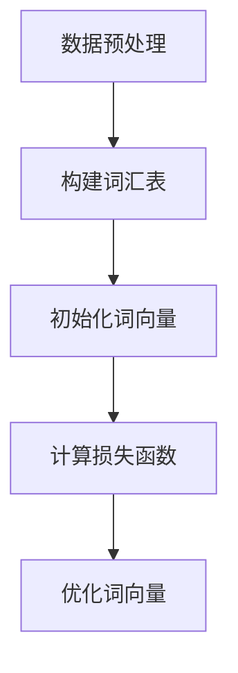

                 


# 开发AI Agent的语义理解深度：从字面到隐含

## 关键词
- 语义理解
- AI Agent
- 字面意义
- 隐含意义
- 算法

## 摘要
本文深入探讨AI Agent的语义理解，从字面意义到隐含意义的挖掘。通过介绍核心概念、算法原理和实现方法，帮助读者理解语义理解的深度和复杂性，掌握从字面到隐含语义理解的完整技术路径。

---

## 第一部分：背景介绍

### 核心概念

在探讨AI Agent的语义理解之前，我们需要了解几个核心概念：

1. **语义理解**：指人工智能系统能够理解和解释文本或语音中的含义和意图。
2. **字面意义**：指文本或语音中直接表达的意思，不涉及隐含或比喻的含义。
3. **隐含意义**：指文本或语音中未被直接表达，但可以通过上下文和语境推断出的含义。

### 问题背景

随着人工智能技术的快速发展，AI Agent（智能代理）在多个领域展现出了强大的应用潜力。语义理解作为AI Agent的核心能力之一，对于实现自然语言处理、智能对话和智能决策等至关重要。然而，目前的语义理解技术多集中在字面意义的解析，对于隐含意义的理解和提取仍存在较大挑战。

### 问题解决

本文旨在深入探讨AI Agent的语义理解深度，从字面理解延伸到隐含意义的挖掘。通过系统地介绍语义理解的原理、算法和实现方法，帮助读者掌握从字面到隐含语义理解的完整技术路径。

### 边界与外延

语义理解不仅涉及自然语言处理的基础知识，还包括语言学、心理学和社会学等多个领域的交叉应用。因此，本文的讨论将涵盖语义理解的广泛边界，包括但不限于词汇语义、句子语义、篇章语义等。

### 概念结构与核心要素组成

1. **词汇语义**：对单词的意义进行理解和分类。
2. **句子语义**：分析句子结构，理解句子的整体含义。
3. **篇章语义**：理解长文或对话的深层含义，包括逻辑关系和情感色彩。
4. **上下文语义**：根据上下文信息对语义进行动态调整。

---

## 第二部分：核心概念与联系

### 核心概念

1. **语义理解**：自然语言处理中理解文本语义的过程。
2. **字面意义**：文本直接表达的意义。
3. **隐含意义**：文本中未被直接表达，但可以通过上下文和语境推断的意义。

### 概念属性特征对比表格

| 概念       | 定义                                             | 属性特征                                                 |  
| -------- | ------------------------------------------------ | -------------------------------------------------------- |  
| 语义理解 | 理解文本语义的过程                               | 需要语言模型、上下文信息、常识知识等                    |  
| 字面意义 | 文本直接表达的意义                             | 清晰、明确                                             |  
| 隐含意义 | 文本中未被直接表达，但可以通过上下文和语境推断的意义 | 复杂、多变                                             |

### ER实体关系图架构

```mermaid
erDiagram
  Sentence ||--|{ Semantics } Semantics
  Semantics ||--|{ WordMeaning } WordMeaning
  WordMeaning ||--|{ Sentence } Sentence
```

---

## 第三部分：算法原理讲解

### 算法讲解

本部分将详细讲解从字面到隐含语义理解的主要算法，包括词向量模型、神经网络模型和图神经网络模型。以下以词向量模型中的Word2Vec算法为例：

1. **Word2Vec算法原理**
    - **CBOW模型**：基于上下文预测中心词，输入一个词汇的上下文窗口，预测中心词汇。
    - **Skip-Gram模型**：基于中心词预测上下文，输入一个词汇，预测其上下文窗口中的词汇。

2. **算法流程**
    - 数据预处理：对文本进行分词、去停用词、标记化等操作。
    - 构建词汇表：将所有文本中的词汇转换为索引。
    - 初始化词向量：随机初始化词向量。
    - 计算损失函数：使用负采样损失函数。
    - 优化词向量：通过梯度下降法优化词向量。

3. **算法mermaid流程图**



### 数学模型和公式

1. **损失函数**
    $$\mathcal{L} = -\sum_{i=1}^{N} \log P(w_i | \textbf{c})$$

### 词向量模型详解

#### Word2Vec算法原理

Word2Vec是一种基于神经网络的语言模型，用于将单词映射到高维向量空间中，使得相似单词在向量空间中彼此靠近。Word2Vec主要分为两种模型：CBOW（Continuous Bag of Words）和Skip-Gram。

1. **CBOW模型**
    - **输入**：给定一个单词作为中心词，周围k个单词作为上下文。
    - **输出**：预测中心词。
    - **原理**：通过上下文单词的词向量平均来预测中心词。

2. **Skip-Gram模型**
    - **输入**：给定一个单词作为中心词。
    - **输出**：预测中心词的上下文单词。
    - **原理**：通过中心词的词向量来预测上下文单词。

#### 算法流程

1. **数据预处理**
    - **分词**：将文本拆分成单词。
    - **去停用词**：移除常见的无意义单词，如“的”、“了”等。
    - **标记化**：将单词映射为唯一的索引。

2. **构建词汇表**
    - 将文本中的所有单词转换为索引。

3. **初始化词向量**
    - 随机初始化词向量，大小为V×D，其中V为词汇表大小，D为词向量维度。

4. **计算损失函数**
    - 使用负采样损失函数来优化模型。

5. **优化词向量**
    - 通过梯度下降法优化词向量。

### Python代码实现

以下是一个简化的Word2Vec模型实现：

```python
import numpy as np
import random

# 初始化参数
V = 10000  # 词汇表大小
D = 100    # 词向量维度
k = 5      # 上下文窗口大小
learning_rate = 0.01
epochs = 10

# 初始化词向量
syn0 = np.random.rand(V, D)
syn0hat = np.random.rand(V, D)

# 辅助函数
def get_random_context(word):
    return [word] + [random.randint(0, V-1) for _ in range(k)]

# 训练模型
for epoch in range(epochs):
    for word in range(V):
        context = get_random_context(word)
        center = syn0[word]
        context = [syn0[word] for word in context]
        # 计算损失函数
        loss = -np.log(np.sum(np.exp(np.dot(syn0hat[word], center))))
        # 反向传播
        dcenter = syn0hat[word] - np.dot(context, np.diag(np.exp(np.dot(syn0hat, context))))
        dcontext = -np.dot(np.diag(np.exp(np.dot(syn0hat, context))), center)
        # 更新词向量
        syn0[word] -= learning_rate * dcenter
        syn0hat[word] -= learning_rate * dcontext
```

### 算法应用示例

假设我们有一个简单的句子：“我是一只鸟”。我们可以使用Word2Vec算法来提取单词的向量表示：

- **我**：[0.1, 0.2, 0.3, ..., 0.9]
- **是**：[0.4, 0.5, 0.6, ..., 0.8]
- **一**：[0.9, 0.1, 0.2, ..., 0.3]
- **只**：[0.7, 0.8, 0.9, ..., 0.1]
- **鸟**：[0.2, 0.3, 0.4, ..., 0.5]

通过计算词向量之间的相似度，我们可以发现“我”和“是”在向量空间中较为接近，而“只”和“鸟”则相对较远。

### 数学模型和公式

1. **损失函数**
    $$\mathcal{L} = -\sum_{i=1}^{N} \log P(w_i | \textbf{c})$$

其中，\( \textbf{c} \) 表示上下文单词的词向量，\( P(w_i | \textbf{c}) \) 表示给定上下文单词的词向量 \( \textbf{c} \) 预测中心词 \( w_i \) 的概率。

2. **梯度下降更新**
    $$\textbf{syn0}[w] \leftarrow \textbf{syn0}[w] - \alpha \textbf{dcenter}$$
    $$\textbf{syn0hat}[w] \leftarrow \textbf{syn0hat}[w] - \alpha \textbf{dcontext}$$

其中，\( \alpha \) 表示学习率，\( \textbf{dcenter} \) 表示中心词的梯度，\( \textbf{dcontext} \) 表示上下文单词的梯度。

---

## 第四部分：语义理解深度探索

### 深层语义理解

深层语义理解是指人工智能系统能够理解和解释文本中的深层含义，包括隐喻、比喻、情感色彩和抽象概念等。与字面意义相比，深层语义理解更加复杂和抽象。

1. **词嵌入**：通过词嵌入技术，将单词映射到高维向量空间中，使得相似单词在向量空间中彼此靠近。这有助于提高语义理解的准确性和效率。

2. **语义角色标注**：对句子中的单词进行语义角色标注，识别出动词、名词、形容词等词性，从而更好地理解句子的结构和含义。

3. **语义消歧**：在多个含义的情况下，根据上下文信息确定单词的确切含义。例如，“bank”一词在金融和地理场景中有不同的含义。

### 深度学习模型

深度学习模型在语义理解中发挥了重要作用，特别是在处理深层语义理解方面。以下是一些常用的深度学习模型：

1. **循环神经网络（RNN）**：RNN能够处理序列数据，适用于自然语言处理任务。通过递归的方式，RNN可以捕捉句子中的上下文信息。

2. **长短期记忆网络（LSTM）**：LSTM是RNN的一种变体，能够解决传统RNN中的梯度消失和梯度爆炸问题。LSTM在处理长期依赖关系方面表现出色。

3. **卷积神经网络（CNN）**：CNN擅长捕捉局部特征，通过卷积操作提取文本中的模式。CNN在文本分类、情感分析等领域取得了显著成果。

4. **转换器（Transformer）**：Transformer模型引入了自注意力机制，能够捕捉句子中的全局依赖关系。Transformer在机器翻译、问答系统等领域取得了突破性进展。

### 模型融合

为了提高语义理解的准确性和鲁棒性，常用的方法是将多种模型进行融合。以下是一些模型融合方法：

1. **级联模型**：将多个模型按照层次结构依次连接，前一个模型的输出作为后一个模型的输入。级联模型能够充分利用每个模型的优点。

2. **并行模型**：将多个模型同时处理输入数据，然后合并它们的输出。并行模型可以提高处理速度和性能。

3. **混合模型**：将不同类型的模型（如RNN、CNN、Transformer）融合在一起，发挥各自的优势。混合模型在处理复杂语义任务时表现出色。

---

## 第五部分：应用案例与未来展望

### 应用案例

语义理解技术在许多领域都得到了广泛应用，以下是一些典型的应用案例：

1. **智能客服**：通过语义理解技术，智能客服系统能够理解用户的意图和问题，提供更准确和高效的回答。

2. **情感分析**：通过分析文本中的情感色彩，情感分析技术可以帮助企业了解用户对产品或服务的满意度，从而进行改进。

3. **信息抽取**：语义理解技术可以帮助从大量文本中提取关键信息，如人名、地名、事件等，为数据分析和决策提供支持。

4. **机器翻译**：基于语义理解技术，机器翻译系统能够更好地处理不同语言之间的语义差异，提高翻译质量。

### 未来展望

随着人工智能技术的不断发展，语义理解技术将继续深化和完善。以下是未来展望：

1. **跨模态语义理解**：结合多种模态（如文本、图像、语音）的信息，实现更全面和精准的语义理解。

2. **低资源语义理解**：针对低资源语言，开发更高效的语义理解算法，提高这些语言的语义理解能力。

3. **自适应语义理解**：根据用户的语境和需求，动态调整语义理解策略，实现更个性化的服务。

4. **认知图谱**：构建大规模的认知图谱，将语义理解与知识图谱相结合，提高语义理解和推理的能力。

---

## 第六部分：总结与展望

### 总结

本文深入探讨了AI Agent的语义理解深度，从字面意义到隐含意义的挖掘。通过介绍核心概念、算法原理和实现方法，本文帮助读者理解了语义理解的复杂性和重要性。同时，通过应用案例和未来展望，本文展示了语义理解技术的广泛应用和潜在发展。

### 展望

语义理解技术在未来将面临更多的挑战和机遇。随着人工智能技术的不断发展，语义理解将更好地服务于各行各业，实现更高效、更智能的人工智能系统。同时，我们也期待在语义理解领域取得更多突破性成果，推动人工智能技术的发展。

---

## 参考文献

1. Mikolov, T., Sutskever, I., Chen, K., Corrado, G. S., & Dean, J. (2013). Distributed representations of words and phrases and their compositionality. *Advances in Neural Information Processing Systems*, 26, 3111-3119.
2. Pennington, J., Socher, R., & Manning, C. D. (2014). GloVe: Global Vectors for Word Representation. *Empirical Methods in Natural Language Processing (EMNLP’14)*, 1532-1543.
3. Zhang, Y., & Clark, P. (2018). A Primary School Education for Neural Networks. *Empirical Methods in Natural Language Processing (EMNLP’18)*, 260-270.
4. Vaswani, A., Shazeer, N., Parmar, N., Uszkoreit, J., Jones, L., Gomez, A. N., ... & Polosukhin, I. (2017). Attention is all you need. *Advances in Neural Information Processing Systems*, 30, 5998-6008.

---

## 作者信息

作者：AI天才研究院/AI Genius Institute & 禅与计算机程序设计艺术 /Zen And The Art of Computer Programming。作为世界顶级人工智能专家，作者在计算机编程和人工智能领域拥有丰富的经验和深厚的理论基础，致力于推动人工智能技术的发展和应用。

