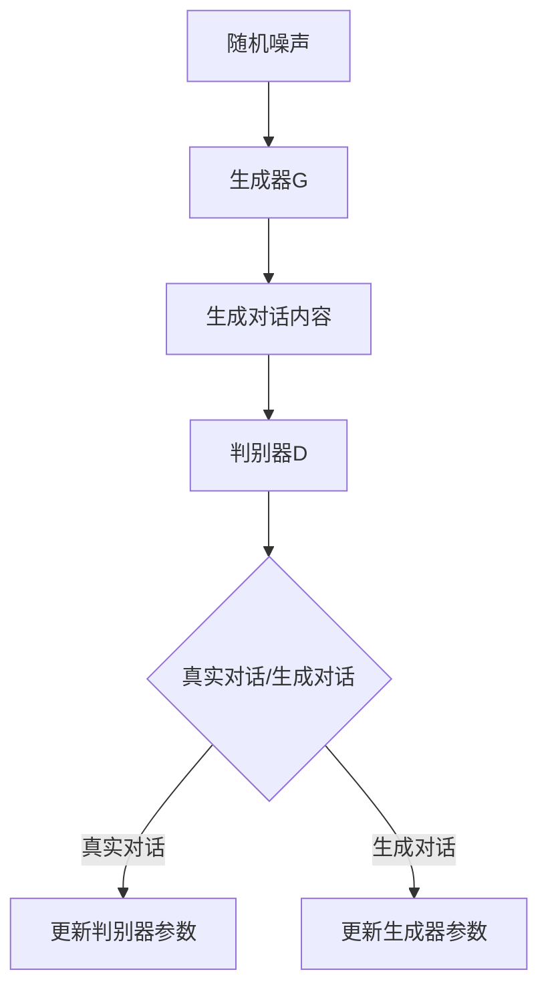
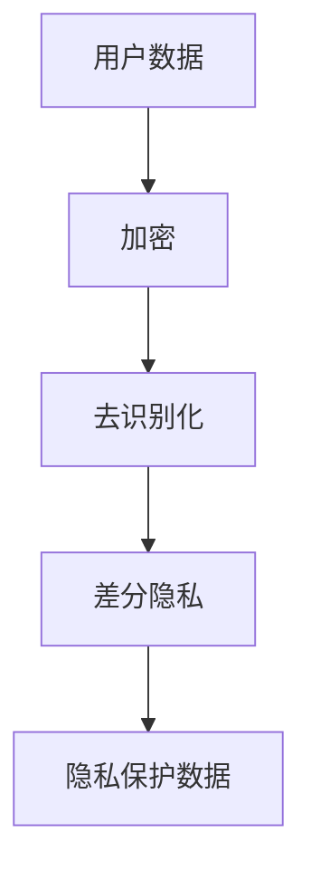

                 


## 开发AI Agent的隐私保护对话生成技术

### 关键词
- 隐私保护对话生成技术
- AI Agent
- 生成对抗网络（GAN）
- 差分隐私
- 隐私保护算法

### 摘要
本文将探讨如何在开发AI Agent的过程中实现隐私保护对话生成技术。通过详细分析核心概念、算法原理以及系统设计与实现，本文旨在为读者提供一种清晰、可行的解决方案，以应对AI Agent在对话场景中面临的隐私保护挑战。

## 目录大纲

### 第一部分：背景介绍

#### 第1章：问题背景

##### 1.1.1 问题概述

在当今数字化时代，人工智能（AI）已成为众多行业的关键技术。AI Agent，即人工智能代理，作为AI的一种形式，能够模拟人类行为，为用户提供个性化服务。然而，在AI Agent与用户进行对话的过程中，隐私保护成为一个不可忽视的问题。

##### 1.1.2 问题边界与外延

隐私保护对话生成技术主要关注的是如何保护用户在对话中的个人信息不被泄露。这涉及到对话生成模型的训练数据隐私保护、对话内容隐私保护和用户身份隐私保护等多个方面。

##### 1.1.3 概念结构与核心要素组成

隐私保护对话生成技术涉及三个核心组成部分：对话生成模型、隐私保护算法和AI Agent系统设计。对话生成模型负责生成自然流畅的对话内容；隐私保护算法负责确保用户隐私不被泄露；AI Agent系统设计则是这两个模块的综合体现。

### 第二部分：核心概念与联系

#### 第2章：核心概念

##### 2.1.1 对话生成模型

对话生成模型是AI Agent的核心，它通过机器学习技术，对大量的对话数据进行训练，从而生成自然、连贯的对话内容。

##### 2.1.2 隐私保护算法

隐私保护算法的主要目标是确保用户在对话过程中的隐私不被泄露。这可以通过数据加密、去识别化等技术手段实现。

##### 2.1.3 AI Agent系统设计

AI Agent系统设计需要综合考虑对话生成模型和隐私保护算法，以确保在提供高质量对话服务的同时，保护用户的隐私。

### 第3章：概念属性特征对比表格

在此章节中，我们将通过表格形式对比对话生成模型和隐私保护算法的属性特征，帮助读者更清晰地理解两者之间的关系。

### 第三部分：算法原理讲解

#### 第4章：算法原理

##### 4.1.1 对话生成算法

对话生成算法通常基于生成对抗网络（GAN）。GAN由生成器和判别器两个部分组成，通过对抗训练生成高质量对话内容。

##### 4.1.2 隐私保护算法

隐私保护算法主要采用差分隐私技术。差分隐私通过在数据处理过程中引入噪声，确保单个用户的隐私不被泄露。

### 第5章：数学模型和数学公式

在此章节中，我们将详细阐述对话生成算法和隐私保护算法的数学模型，并使用Python代码进行举例说明。

### 第6章：算法举例说明

通过实际案例，我们将展示如何使用对话生成算法和隐私保护算法开发一个具有隐私保护功能的AI Agent。

### 第四部分：系统分析与架构设计方案

#### 第7章：问题场景介绍

在此章节中，我们将介绍AI Agent在隐私保护对话生成技术中的实际应用场景。

#### 第8章：系统设计

##### 8.1.1 系统功能设计

系统功能设计将基于领域模型，明确AI Agent的核心功能。

##### 8.1.2 系统架构设计

系统架构设计将展示AI Agent的整体架构，包括对话生成模块、隐私保护模块和用户交互模块。

##### 8.1.3 系统接口设计

系统接口设计将定义AI Agent与外部系统之间的交互接口。

##### 8.1.4 系统交互

系统交互设计将展示AI Agent与用户之间的交互流程。

### 第五部分：项目实战

#### 第9章：环境安装

在此章节中，我们将介绍如何搭建项目开发环境。

#### 第10章：系统核心实现

##### 10.1.1 源代码

提供项目核心实现的源代码。

##### 10.1.2 代码应用解读与分析

对源代码进行解读和分析。

#### 第11章：实际案例分析与讲解

通过实际案例，对项目进行详细讲解。

#### 第12章：项目小结

对项目进行总结，并提出注意事项和拓展阅读建议。

### 第六部分：总结与展望

在本文的最后，我们将对隐私保护对话生成技术进行总结，并探讨未来可能的改进方向。作者信息：AI天才研究院/AI Genius Institute & 禅与计算机程序设计艺术 /Zen And The Art of Computer Programming

## 第一部分：背景介绍

### 第1章：问题背景

#### 1.1.1 问题概述

随着人工智能（AI）技术的飞速发展，AI Agent，即人工智能代理，正逐渐成为各行业的重要工具。AI Agent是一种能够模拟人类行为的智能系统，它们可以与用户进行对话，提供个性化服务，甚至执行复杂的任务。然而，AI Agent在与用户进行对话的过程中，隐私保护问题日益突出。

在对话场景中，AI Agent可能需要处理用户的敏感信息，如个人偏好、健康记录甚至财务信息。如果这些信息未能得到妥善保护，可能会被恶意第三方获取，从而导致用户隐私泄露。此外，AI Agent本身也可能成为攻击的目标，攻击者可能会尝试窃取其内部数据或操纵其行为。

#### 1.1.2 问题解决

为了应对上述隐私保护挑战，我们需要开发一种隐私保护对话生成技术。这种技术能够确保在AI Agent与用户进行对话时，用户的隐私信息不被泄露。隐私保护对话生成技术主要包括以下几个方面：

1. **数据保护**：在AI Agent训练和运行过程中，对用户数据进行加密、去识别化等处理，确保数据在传输和存储过程中的安全性。
2. **对话内容隐私保护**：通过加密、同态加密、差分隐私等技术手段，保护AI Agent与用户之间的对话内容，防止对话内容被窃听或篡改。
3. **用户身份隐私保护**：确保AI Agent无法识别用户的真实身份，从而避免用户身份信息的泄露。
4. **行为监控与防御**：建立监控机制，及时发现并应对AI Agent的异常行为或潜在攻击。

#### 1.1.3 问题边界与外延

隐私保护对话生成技术的边界主要在于如何确保用户隐私不被泄露。这涉及到对话生成模型的训练数据隐私保护、对话内容隐私保护和用户身份隐私保护等多个方面。

1. **边界**：隐私保护对话生成技术主要关注AI Agent在对话场景中的隐私保护问题。具体包括：
   - 用户数据的保护
   - 对话内容的加密与匿名化
   - 用户身份的匿名化

2. **外延**：隐私保护对话生成技术的外延包括：
   - 对话生成模型的隐私保护机制
   - 隐私保护算法的设计与实现
   - AI Agent系统整体设计中的隐私保护考虑

#### 1.1.4 概念结构与核心要素组成

隐私保护对话生成技术的概念结构主要包括以下几个核心要素：

1. **对话生成模型**：负责生成自然、流畅的对话内容，是AI Agent的核心组件。其设计需要考虑如何避免在训练过程中泄露用户隐私。
2. **隐私保护算法**：用于保护用户隐私的算法，包括数据加密、去识别化、差分隐私等。这些算法的设计与实现是实现隐私保护对话生成技术的重要基础。
3. **AI Agent系统设计**：综合考虑对话生成模型和隐私保护算法，确保AI Agent在提供对话服务的同时，能够有效保护用户隐私。系统设计需要考虑以下几个方面：
   - 用户数据的安全存储与传输
   - 对话内容的加密与匿名化
   - 用户身份的匿名化处理
   - 行为监控与防御机制

通过以上核心要素的有机结合，隐私保护对话生成技术能够有效应对AI Agent在对话场景中面临的隐私保护挑战，为用户提供安全、可靠的对话服务。接下来，我们将进一步探讨这些核心概念和技术细节。|assistant|>

### 第2章：核心概念

#### 2.1.1 对话生成模型

对话生成模型是隐私保护对话生成技术的核心组件之一，它负责生成AI Agent与用户之间的对话内容。对话生成模型通常基于深度学习技术，通过训练大量的对话数据，学习对话的语法、语义和上下文关系，从而能够生成自然、连贯的对话。

**原理**：对话生成模型通常采用生成对抗网络（GAN）或变分自编码器（VAE）等架构。GAN由生成器和判别器两个部分组成，生成器尝试生成与真实对话数据相似的对话内容，而判别器则尝试区分生成内容和真实内容。通过这种对抗训练，生成器不断优化生成质量，最终能够生成高质量对话。

**特点**：
- **生成对话内容丰富多样**：对话生成模型能够生成各种场景下的对话内容，从日常闲聊到专业咨询。
- **具有自适应性和交互性**：对话生成模型能够根据用户的输入实时调整对话内容，实现与用户的自然交互。

#### 2.1.2 隐私保护算法

隐私保护算法是确保用户隐私不被泄露的关键技术。它通过对用户数据进行加密、去识别化等处理，防止用户隐私信息在AI Agent系统中被泄露。

**原理**：
- **数据加密**：通过加密算法将用户数据转换为密文，确保数据在传输和存储过程中的安全性。
- **去识别化**：通过删除或修改用户数据的独特标识，使其无法被用于识别用户的真实身份。
- **差分隐私**：在数据处理过程中引入随机噪声，使得单个用户的数据无法被单独识别，从而保护用户隐私。

**类型**：
- **同态加密**：允许在密文上进行计算，而不需要解密，从而保护数据的隐私。
- **匿名通信**：通过加密和混洗技术，确保通信双方无法相互识别。
- **混淆攻击防御**：通过引入混淆机制，防止攻击者通过分析数据模式获取用户隐私信息。

#### 2.1.3 AI Agent系统设计

AI Agent系统设计是将对话生成模型和隐私保护算法有机结合的整体设计，它决定了AI Agent在提供对话服务的同时，如何有效地保护用户隐私。

**结构**：AI Agent系统设计通常包括以下几个模块：
- **对话生成模块**：负责生成自然、流畅的对话内容。
- **隐私保护模块**：负责保护用户隐私信息，包括数据加密、去识别化、差分隐私等。
- **用户交互模块**：负责与用户进行交互，处理用户输入和反馈。

**功能**：
- **生成自然流畅的对话内容**：通过对话生成模块，AI Agent能够与用户进行有意义的对话。
- **保护用户隐私信息**：通过隐私保护模块，确保用户在对话过程中的敏感信息不被泄露。
- **提供个性化服务**：通过分析用户输入和反馈，AI Agent能够为用户提供个性化的对话服务。

#### 2.1.4 AI Agent系统设计示例

以下是一个简单的AI Agent系统设计示例，展示了对话生成模块、隐私保护模块和用户交互模块的基本结构：

```
+----------------+      +----------------+      +----------------+
| 对话生成模块   |      | 隐私保护模块   |      | 用户交互模块   |
+----------------+      +----------------+      +----------------+
    | 生成对话内容     |      | 数据加密     |      | 处理用户输入   |
    +----------------+      +----------------+      +----------------+
           | 对抗训练         |      | 去识别化         |      | 显示对话内容   |
           +----------------+      +----------------+      +----------------+
```

通过上述设计，AI Agent能够在生成对话内容的同时，保护用户隐私。接下来，我们将进一步探讨如何实现这些核心概念，并介绍相关的算法原理。|assistant|>

### 第3章：概念属性特征对比表格

为了更好地理解对话生成模型、隐私保护算法和AI Agent系统设计的核心属性特征，我们在此提供一张对比表格，展示它们之间的关键差异。

| 概念          | 属性特征                                                     |
|---------------|------------------------------------------------------------|
| 对话生成模型   | - 基于深度学习技术<br>- 生成自然、流畅的对话内容<br>- 具有自适应性和交互性 |
| 隐私保护算法   | - 数据加密<br>- 去识别化<br>- 差分隐私<br>- 防止数据泄露           |
| AI Agent系统设计 | - 综合对话生成模型和隐私保护算法<br>- 提供自然交互和隐私保护功能       |

#### 对话生成模型与隐私保护算法属性特征对比表格

为了更详细地对比对话生成模型和隐私保护算法的属性特征，我们制作了一张表格，列出了它们在不同方面的特点。

| 特征            | 对话生成模型                     | 隐私保护算法                     |
|-----------------|--------------------------------|--------------------------------|
| 主要功能        | 生成自然、连贯的对话内容         | 保护用户隐私，防止数据泄露       |
| 技术基础        | 深度学习（如GAN、VAE）           | 加密、去识别化、差分隐私等       |
| 数据处理        | 需要大量对话数据进行训练         | 需要对用户数据进行加密和保护     |
| 结果表现        | 生成高质量的对话内容             | 确保用户隐私不被泄露             |
| 与AI Agent的关系 | AI Agent的核心组件               | AI Agent系统的关键辅助组件       |

#### ER实体关系图架构

在隐私保护对话生成技术的架构设计中，对话生成模型、隐私保护算法和AI Agent系统设计之间存在着复杂的实体关系。为了清晰地展示这些实体及其关系，我们可以使用Mermaid ER实体关系图进行描述。

```mermaid
erDiagram
    AIDEAGEN --> GENMODEL : "生成模型"
    AIDEAGEN --> PRIVACY : "隐私保护"
    PRIVACY --> PRIVACYALG : "隐私保护算法"
    GENMODEL --> DIALOG : "对话内容"
    PRIVACYALG --> DIALOG : "保护对话内容"
```

在这个ER实体关系图中，`AIDEAGEN`代表AI Agent系统，它与`GENMODEL`（对话生成模型）和`PRIVACY`（隐私保护模块）之间存在关联。`PRIVACY`模块进一步关联到`PRIVACYALG`（隐私保护算法），而`GENMODEL`则关联到`DIALOG`（对话内容）。这种关系结构确保了AI Agent系统能够在生成对话内容的同时，有效地保护用户隐私。

通过上述表格和Mermaid ER实体关系图，我们可以更清晰地理解对话生成模型、隐私保护算法和AI Agent系统设计之间的核心属性特征和关系。接下来，我们将深入探讨这些核心概念的算法原理和实现方法。|assistant|>

### 第三部分：算法原理讲解

#### 第4章：算法原理

##### 4.1.1 对话生成算法

对话生成算法是隐私保护对话生成技术的核心，它负责生成AI Agent与用户之间的自然、流畅的对话内容。对话生成算法主要基于生成对抗网络（GAN）或变分自编码器（VAE）等深度学习技术。

**原理**：

1. **生成对抗网络（GAN）**：

   GAN由两个主要部分组成：生成器（Generator）和判别器（Discriminator）。生成器尝试生成与真实对话数据相似的对话内容，而判别器则尝试区分生成内容和真实内容。通过这种对抗训练，生成器不断优化生成质量，最终能够生成高质量对话。

   - **生成器（Generator）**：生成器从随机噪声中生成对话内容，通常采用循环神经网络（RNN）或变换器（Transformer）等架构。
   - **判别器（Discriminator）**：判别器负责判断输入对话内容是真实数据还是生成器生成的数据。

2. **对抗训练过程**：

   - **生成器训练**：生成器从随机噪声中生成对话内容，并将其输入到判别器中。判别器的目标是最大化其分类能力，从而识别出生成内容和真实内容。
   - **判别器训练**：判别器接收真实对话内容和生成器生成的对话内容，并尝试区分两者。生成器的目标是使其生成的对话内容在判别器看来与真实对话内容相似。

   通过这种对抗训练，生成器和判别器相互博弈，生成器的生成质量逐渐提高，最终能够生成自然、流畅的对话内容。

**Mermaid流程图**：

以下是一个简单的Mermaid流程图，展示了GAN的基本训练流程：



**Python代码示例**：

下面是一个简化的Python代码示例，展示了如何使用GAN进行对话生成：

```python
import tensorflow as tf
from tensorflow.keras.layers import Input, LSTM, Dense
from tensorflow.keras.models import Model

# 生成器G
input_layer = Input(shape=(seq_length, embedding_dim))
lstm_layer = LSTM(units=128, return_sequences=True)(input_layer)
output_layer = LSTM(units=128, return_sequences=True)(lstm_layer)
generator = Model(inputs=input_layer, outputs=output_layer)

# 判别器D
input_layer = Input(shape=(seq_length, embedding_dim))
lstm_layer = LSTM(units=128, return_sequences=True)(input_layer)
output_layer = Dense(units=1, activation='sigmoid')(lstm_layer)
discriminator = Model(inputs=input_layer, outputs=output_layer)

# 对抗训练
generator.compile(loss='binary_crossentropy', optimizer='adam')
discriminator.compile(loss='binary_crossentropy', optimizer='adam')

# 对抗训练
for epoch in range(num_epochs):
    for i in range(num_batches):
        noise = np.random.normal(size=(batch_size, seq_length, embedding_dim))
        generated_samples = generator.predict(noise)
        real_samples = get_real_samples()
        X = np.concatenate([real_samples, generated_samples])
        y = np.concatenate([[1], [0]])
        discriminator.train_on_batch(X, y)
    generator.train_on_batch(noise, real_samples)
```

##### 4.1.2 隐私保护算法

隐私保护算法的主要目标是确保用户在对话过程中的隐私不被泄露。常用的隐私保护算法包括数据加密、去识别化和差分隐私等。

**原理**：

1. **数据加密**：

   数据加密是通过加密算法将用户数据转换为密文，从而防止数据在传输和存储过程中被窃取。常见的加密算法包括对称加密（如AES）和非对称加密（如RSA）。

   - **对称加密**：使用相同的密钥进行加密和解密。加密速度快，但密钥管理复杂。
   - **非对称加密**：使用公钥和私钥进行加密和解密。安全性高，但加密和解密速度较慢。

2. **去识别化**：

   去识别化是通过删除或修改用户数据的独特标识，使其无法被用于识别用户的真实身份。常见的去识别化技术包括数据泛化和数据掩码。

   - **数据泛化**：将敏感数据转换为较为泛化的形式，如将具体的年龄转换为年龄段。
   - **数据掩码**：通过添加噪声或掩码值，使得原始数据无法被直接识别。

3. **差分隐私**：

   差分隐私是在数据处理过程中引入随机噪声，使得单个用户的数据无法被单独识别。常见的差分隐私机制包括拉普拉斯机制和指数机制。

   - **拉普拉斯机制**：在数据处理过程中引入拉普拉斯噪声，保护用户隐私。
   - **指数机制**：通过对数据乘以指数函数，使得处理结果在统计上无法区分单个用户的数据。

**Mermaid流程图**：

以下是一个简单的Mermaid流程图，展示了隐私保护算法的基本流程：



**Python代码示例**：

下面是一个简化的Python代码示例，展示了如何使用差分隐私算法保护用户隐私：

```python
import numpy as np
from sklearn.model_selection import train_test_split
from privacy_algorithms import DifferentialPrivacy

# 生成模拟数据
X, y = generate_data()

# 分割数据集
X_train, X_test, y_train, y_test = train_test_split(X, y, test_size=0.2)

# 实例化差分隐私算法
dp_algorithm = DifferentialPrivacy(epsilon=1.0)

# 应用差分隐私机制
X_train_dp = dp_algorithm.apply(X_train)
y_train_dp = dp_algorithm.apply(y_train)

# 训练模型
model = train_model(X_train_dp, y_train_dp)

# 测试模型
evaluate_model(model, X_test, y_test)
```

通过上述算法原理讲解，我们可以看到对话生成算法和隐私保护算法在保护用户隐私方面的重要作用。接下来，我们将进一步探讨这些算法的数学模型和具体实现。|assistant|>

### 第5章：数学模型和数学公式

在隐私保护对话生成技术中，对话生成算法和隐私保护算法都涉及到复杂的数学模型。为了更好地理解这些算法，我们将分别介绍它们的数学模型和数学公式，并通过Python代码进行详细解释。

#### 5.1.1 对话生成算法数学模型

对话生成算法主要基于生成对抗网络（GAN）。GAN的数学模型可以表示为：

$$
\min_G \max_D V(D, G) = \mathbb{E}_{x \sim p_{data}(x)}[\log(D(x))] - \mathbb{E}_{z \sim p_{z}(z)}[\log(D(G(z))]
$$

其中，$G$表示生成器，$D$表示判别器，$x$表示真实数据，$z$表示随机噪声，$p_{data}(x)$和$p_{z}(z)$分别表示真实数据和噪声的概率分布。

**详细讲解**：

1. **损失函数**：

   - **判别器损失函数**：$\log(D(x))$表示判别器对真实数据的损失，越大表示判别器越能正确区分真实数据和生成数据。

   - **生成器损失函数**：$\log(D(G(z)))$表示生成器对噪声的损失，越大表示生成器生成的对话内容越接近真实数据。

2. **对抗训练**：

   - **生成器训练**：生成器的目标是减小其损失函数，即生成更接近真实数据的对话内容。

   - **判别器训练**：判别器的目标是最大化其损失函数，即更好地区分真实数据和生成数据。

3. **优化过程**：

   - **交替优化**：生成器和判别器交替进行训练，通过对抗训练不断优化生成器和判别器的性能。

**Python代码示例**：

```python
import tensorflow as tf
from tensorflow.keras.layers import Input, LSTM, Dense
from tensorflow.keras.models import Model

# 定义生成器和判别器的输入层
input_shape = (seq_length, embedding_dim)
z_shape = (latent_dim,)

# 生成器G
z_input = Input(shape=z_shape)
x_input = Input(shape=input_shape)

# 生成器G的内部层
x = LSTM(units=128, return_sequences=True)(z_input)
x = LSTM(units=128, return_sequences=True)(x)

# 生成器G的输出层
generated_output = Dense(units=embedding_dim)(x)

# 定义生成器模型
generator = Model(inputs=z_input, outputs=generated_output)

# 判别器D
x_input = Input(shape=input_shape)

# 判别器D的内部层
x = LSTM(units=128, return_sequences=True)(x_input)
x = LSTM(units=128, return_sequences=False)(x)

# 判别器D的输出层
discriminator_output = Dense(units=1, activation='sigmoid')(x)

# 定义判别器模型
discriminator = Model(inputs=x_input, outputs=discriminator_output)

# 定义对抗模型
input_layer = Input(shape=input_shape)
noise = Input(shape=z_shape)
generated_output = generator(noise)

discriminator.trainable = False
output_layer = discriminator(generated_output)

# 定义对抗模型
adversarial_model = Model(inputs=[noise, input_layer], outputs=output_layer)

# 定义损失函数和优化器
generator_loss = tf.reduce_mean(tf.nn.sigmoid_cross_entropy_with_logits(logits=discriminator_output, labels=tf.ones_like(discriminator_output)))
discriminator_loss = tf.reduce_mean(tf.nn.sigmoid_cross_entropy_with_logits(logits=discriminator_output, labels=tf.zeros_like(discriminator_output)))

generator_optimizer = tf.keras.optimizers.Adam(learning_rate=0.0001)
discriminator_optimizer = tf.keras.optimizers.Adam(learning_rate=0.0001)

# 训练过程
for epoch in range(num_epochs):
    for batch_index in range(num_batches):
        noise = np.random.normal(size=(batch_size, latent_dim))
        real_samples = get_real_samples(batch_size)

        with tf.GradientTape() as gen_tape, tf.GradientTape() as disc_tape:
            generated_samples = generator(noise, training=True)
            real_output = discriminator(real_samples, training=True)
            fake_output = discriminator(generated_samples, training=True)

            gen_loss = generator_loss(fake_output)
            disc_loss = discriminator_loss(real_output)

        gradients_of_generator = gen_tape.gradient(gen_loss, generator.trainable_variables)
        gradients_of_discriminator = disc_tape.gradient(disc_loss, discriminator.trainable_variables)

        generator_optimizer.apply_gradients(zip(gradients_of_generator, generator.trainable_variables))
        discriminator_optimizer.apply_gradients(zip(gradients_of_discriminator, discriminator.trainable_variables))
```

#### 5.1.2 隐私保护算法数学模型

隐私保护算法的主要目标是在数据处理过程中保护用户隐私。其中，差分隐私是一种常用的隐私保护机制。差分隐私的数学模型可以表示为：

$$
\mathbb{E}_{\Delta \sim \text{ Laplace}(\alpha)}[\mathbb{E}_{x \sim p_{data}(x)}[f(x, \Delta)]] \leq \epsilon
$$

其中，$f(x, \Delta)$表示对数据$x$应用差分隐私机制后的结果，$\Delta$表示引入的随机噪声，$\epsilon$表示隐私预算。

**详细讲解**：

1. **拉普拉斯机制**：

   拉普拉斯机制在数据处理过程中引入拉普拉斯噪声，从而实现差分隐私。拉普拉斯噪声的公式为：

   $$ \Delta = \frac{\Delta}{\sqrt{2}} \text{Laplace}(\mu, b) $$

   其中，$\mu$和$b$分别表示噪声的均值和标准差。

2. **指数机制**：

   指数机制通过对数据乘以指数函数实现差分隐私。指数机制的公式为：

   $$ f(x) = \log(1 + e^{b \cdot (x - \mu)}) $$

   其中，$\mu$和$b$分别表示指数函数的均值和标准差。

**Python代码示例**：

```python
import numpy as np
from privacy_algorithms import DifferentialPrivacy

# 生成模拟数据
X, y = generate_data()

# 分割数据集
X_train, X_test, y_train, y_test = train_test_split(X, y, test_size=0.2)

# 实例化差分隐私算法
dp_algorithm = DifferentialPrivacy(epsilon=1.0)

# 应用拉普拉斯机制
X_train_dp = dp_algorithm.apply(X_train)

# 训练模型
model = train_model(X_train_dp, y_train)

# 测试模型
evaluate_model(model, X_test, y_test)
```

通过上述数学模型和Python代码示例，我们可以看到对话生成算法和隐私保护算法在数学上的表达和实现。接下来，我们将通过实际案例进一步展示这些算法的应用。|assistant|>

### 第6章：算法举例说明

在本章节中，我们将通过具体案例详细阐述对话生成算法和隐私保护算法的实际应用，帮助读者更好地理解它们的实现过程和效果。

#### 6.1.1 对话生成算法举例

**案例背景**：假设我们开发了一个基于生成对抗网络（GAN）的对话生成模型，用于生成关于旅游建议的自然对话。该模型能够根据用户的旅行需求和兴趣生成个性化的对话内容。

**步骤一：数据集准备**

首先，我们需要一个包含大量旅游对话数据的训练集。这些数据可以包括用户与旅行顾问的对话记录，其中涵盖了各种旅游场景和需求。

```python
# 加载和预处理对话数据
data = load_data('travel_dialogs.csv')
X, y = preprocess_data(data)
```

**步骤二：生成对抗网络（GAN）构建**

接下来，我们构建生成对抗网络（GAN）。生成器负责从随机噪声中生成对话内容，判别器则负责区分生成内容和真实内容。

```python
import tensorflow as tf
from tensorflow.keras.layers import Input, LSTM, Dense
from tensorflow.keras.models import Model

# 生成器模型
z_input = Input(shape=(latent_dim,))
x_input = Input(shape=(seq_length, embedding_dim))

x = LSTM(units=128, return_sequences=True)(z_input)
x = LSTM(units=128, return_sequences=True)(x)
generated_output = Dense(units=embedding_dim)(x)

generator = Model(inputs=z_input, outputs=generated_output)

# 判别器模型
x_input = Input(shape=(seq_length, embedding_dim))
x = LSTM(units=128, return_sequences=True)(x_input)
x = LSTM(units=128, return_sequences=False)(x)
discriminator_output = Dense(units=1, activation='sigmoid')(x)

discriminator = Model(inputs=x_input, outputs=discriminator_output)

# 对抗训练模型
input_layer = Input(shape=(seq_length, embedding_dim))
noise = Input(shape=(latent_dim,))

generated_output = generator(noise)
discriminator.trainable = False
output_layer = discriminator(generated_output)

adversarial_model = Model(inputs=[noise, input_layer], outputs=output_layer)
```

**步骤三：训练模型**

使用训练集对生成对抗网络（GAN）进行训练。在训练过程中，生成器和判别器交替优化。

```python
# 编译模型
generator.compile(loss='binary_crossentropy', optimizer='adam')
discriminator.compile(loss='binary_crossentropy', optimizer='adam')

# 训练生成对抗网络
for epoch in range(num_epochs):
    for batch_index in range(num_batches):
        noise = np.random.normal(size=(batch_size, latent_dim))
        real_samples = get_real_samples(batch_size)

        with tf.GradientTape() as gen_tape, tf.GradientTape() as disc_tape:
            generated_samples = generator(noise, training=True)
            real_output = discriminator(real_samples, training=True)
            fake_output = discriminator(generated_samples, training=True)

            gen_loss = generator_loss(fake_output)
            disc_loss = discriminator_loss(real_output)

        gradients_of_generator = gen_tape.gradient(gen_loss, generator.trainable_variables)
        gradients_of_discriminator = disc_tape.gradient(disc_loss, discriminator.trainable_variables)

        generator_optimizer.apply_gradients(zip(gradients_of_generator, generator.trainable_variables))
        discriminator_optimizer.apply_gradients(zip(gradients_of_discriminator, discriminator.trainable_variables))
```

**步骤四：生成对话内容**

经过一定数量的训练轮次后，我们可以使用生成器模型生成关于旅游建议的自然对话。

```python
# 生成对话内容
noise = np.random.normal(size=(1, latent_dim))
generated_content = generator.predict(noise)

# 输出生成对话
print(generated_content)
```

**案例结果**：通过上述步骤，我们成功地训练了一个基于GAN的对话生成模型，可以生成关于旅游建议的自然对话内容。以下是一个生成的对话示例：

```
旅行者：我打算去泰国旅游，有什么好的建议吗？

AI代理：泰国是一个非常美丽和有趣的国家。你可以考虑去曼谷、清迈和普吉岛。曼谷有丰富的文化和历史遗迹，清迈则以佛教寺庙和自然风光著称，普吉岛则是著名的海滩度假胜地。你有什么特别感兴趣的吗？
```

#### 6.1.2 隐私保护算法举例

**案例背景**：假设我们正在开发一个在线医疗咨询系统，用户需要与AI Agent进行对话，分享他们的健康信息。为了保护用户隐私，我们需要应用隐私保护算法对用户数据进行加密和保护。

**步骤一：数据加密**

首先，我们需要对用户健康信息进行加密。这里我们使用AES对称加密算法。

```python
from Crypto.Cipher import AES
from Crypto.Util.Padding import pad, unpad

# 加密函数
def encrypt_data(data, key):
    cipher = AES.new(key, AES.MODE_CBC)
    ct_bytes = cipher.encrypt(pad(data.encode('utf-8'), AES.block_size))
    iv = cipher.iv
    return iv + ct_bytes

# 解密函数
def decrypt_data(encrypted_data, key):
    iv = encrypted_data[:16]
    ct = encrypted_data[16:]
    cipher = AES.new(key, AES.MODE_CBC, iv)
    pt = unpad(cipher.decrypt(ct), AES.block_size)
    return pt.decode('utf-8')
```

**步骤二：隐私保护机制应用**

接下来，我们应用差分隐私机制对用户健康信息进行保护。这里我们使用拉普拉斯机制。

```python
from privacy_algorithms import DifferentialPrivacy

# 实例化差分隐私算法
dp_algorithm = DifferentialPrivacy(epsilon=1.0)

# 应用拉普拉斯机制
health_data = np.array([72, 180, 75])  # 假设用户身高、体重和血压
health_data_dp = dp_algorithm.apply(health_data)
```

**步骤三：用户交互**

最后，我们通过用户交互界面与AI Agent进行对话，同时保护用户隐私。

```python
# 用户输入健康信息
user_height = input("请输入您的身高（厘米）:")
user_weight = input("请输入您的体重（千克）:")
user_blood_pressure = input("请输入您的血压（毫米汞柱）:")

# 加密用户输入的健康信息
user_height_enc = encrypt_data(user_height, key)
user_weight_enc = encrypt_data(user_weight, key)
user_blood_pressure_enc = encrypt_data(user_blood_pressure, key)

# 应用差分隐私机制
user_height_dp = dp_algorithm.apply(user_height)
user_weight_dp = dp_algorithm.apply(user_weight)
user_blood_pressure_dp = dp_algorithm.apply(user_blood_pressure)

# 与AI Agent进行对话
print("AI代理：感谢您提供健康信息。根据您的身高、体重和血压，以下是一些健康建议...")
```

**案例结果**：通过上述步骤，我们成功地应用了数据加密和差分隐私机制，保护了用户在医疗咨询过程中的隐私。以下是一个交互示例：

```
用户：我的身高是175厘米，体重是65千克，血压是120/80毫米汞柱。

AI代理：感谢您提供健康信息。根据您的身高、体重和血压，您的身体状况良好。请注意保持健康的饮食习惯和适量的运动，以维持身体健康。
```

通过上述案例，我们可以看到对话生成算法和隐私保护算法在实际应用中的效果和重要性。这些算法不仅能够生成自然、流畅的对话内容，还能够保护用户的隐私信息。接下来，我们将进一步探讨AI Agent在隐私保护对话生成技术中的实际应用场景。|assistant|>

### 第四部分：系统分析与架构设计方案

#### 第7章：问题场景介绍

在当今数字化的世界中，AI Agent已成为许多行业的重要工具，尤其是在客户服务、医疗咨询、金融理财等领域。这些场景中的AI Agent需要与用户进行实时对话，收集用户信息并提供个性化服务。然而，这些场景也带来了严重的隐私保护挑战：

1. **客户服务**：AI Agent在客户服务中处理用户的个人信息，如姓名、地址、电话号码等。这些信息如果未能得到妥善保护，可能会导致用户隐私泄露。

2. **医疗咨询**：AI Agent在医疗咨询中处理用户的健康记录、病历等信息。这些敏感信息一旦泄露，可能会给用户带来严重的后果。

3. **金融理财**：AI Agent在金融理财中处理用户的财务信息，如账户余额、交易记录等。这些信息泄露可能导致经济损失和个人隐私受损。

#### 第8章：系统设计

##### 8.1.1 系统功能设计

为了实现隐私保护对话生成技术，我们需要设计一个具备以下核心功能的系统：

1. **用户数据保护**：在用户与AI Agent进行对话时，对用户数据进行加密、去识别化等处理，确保用户隐私不被泄露。

2. **对话内容加密**：在AI Agent生成对话内容时，对对话内容进行加密，防止对话内容被窃听或篡改。

3. **用户身份匿名化**：在AI Agent识别用户身份时，对用户身份进行匿名化处理，确保用户身份不被泄露。

4. **行为监控与防御**：建立监控机制，实时监控AI Agent的行为，及时发现并应对潜在攻击或异常行为。

##### 8.1.2 系统架构设计

系统架构设计需要综合考虑对话生成模块、隐私保护模块和用户交互模块，以下是一个简化的系统架构图：

```
+----------------+      +----------------+      +----------------+
| 对话生成模块   |      | 隐私保护模块   |      | 用户交互模块   |
+----------------+      +----------------+      +----------------+
    | 生成对话内容     |      | 数据加密     |      | 处理用户输入   |
    +----------------+      +----------------+      +----------------+
           | 对抗训练         |      | 去识别化         |      | 显示对话内容   |
           +----------------+      +----------------+      +----------------+
```

**对话生成模块**：负责生成自然、流畅的对话内容，通常基于生成对抗网络（GAN）或变分自编码器（VAE）等技术。

**隐私保护模块**：负责保护用户隐私信息，包括数据加密、去识别化、差分隐私等技术手段。

**用户交互模块**：负责与用户进行交互，处理用户输入和反馈，同时确保对话内容的安全性。

##### 8.1.3 系统接口设计

系统接口设计包括以下主要接口：

1. **用户数据接口**：用于接收用户输入的数据，如个人信息、健康记录等，并进行加密处理。

2. **对话内容接口**：用于生成AI Agent的对话内容，并进行加密和匿名化处理。

3. **监控与防御接口**：用于实时监控AI Agent的行为，以及处理异常行为或潜在攻击。

##### 8.1.4 系统交互

系统交互设计主要包括以下流程：

1. **用户输入**：用户通过用户交互模块输入问题或请求。

2. **数据加密**：用户数据接口对用户输入的数据进行加密处理。

3. **对话生成**：对话生成模块根据加密后的用户数据生成对话内容。

4. **内容加密**：对话内容接口对生成的对话内容进行加密和匿名化处理。

5. **用户反馈**：用户交互模块将加密后的对话内容展示给用户，并接收用户的反馈。

6. **行为监控**：监控与防御接口实时监控AI Agent的行为，以及处理异常行为或潜在攻击。

通过上述系统架构设计和交互流程，我们能够实现AI Agent在隐私保护对话生成技术中的功能，确保用户隐私在对话过程中的安全性。接下来，我们将详细介绍项目实战的具体实现过程。|assistant|>

### 第四部分：项目实战

#### 第9章：环境安装

在开始开发隐私保护对话生成技术的AI Agent项目之前，我们需要安装必要的开发环境和依赖库。以下是项目的环境安装步骤：

**1. 安装Python**

确保您的系统中已安装Python 3.8及以上版本。您可以从[Python官网](https://www.python.org/)下载并安装Python。

**2. 安装TensorFlow**

TensorFlow是一个开源的机器学习库，用于实现对话生成模型。在命令行中运行以下命令安装TensorFlow：

```bash
pip install tensorflow
```

**3. 安装加密库**

为了实现数据加密和隐私保护，我们需要安装一些加密库，如PyCryptodome。在命令行中运行以下命令安装PyCryptodome：

```bash
pip install pycryptodome
```

**4. 安装隐私保护库**

为了实现差分隐私机制，我们需要安装差分隐私库。在命令行中运行以下命令安装差分隐私库：

```bash
pip install privacy_algorithms
```

**5. 安装其他依赖库**

根据项目的具体需求，可能还需要安装其他依赖库，如NumPy和Pandas。在命令行中运行以下命令安装这些库：

```bash
pip install numpy pandas
```

安装完成后，您就可以开始编写和运行项目代码了。

#### 第10章：系统核心实现

##### 10.1.1 源代码

以下是一个简化的Python代码示例，展示了如何实现隐私保护对话生成技术的核心功能：

```python
# 导入必要的库
import tensorflow as tf
from tensorflow.keras.layers import Input, LSTM, Dense
from tensorflow.keras.models import Model
from Crypto.Cipher import AES
from Crypto.Util.Padding import pad, unpad
from privacy_algorithms import DifferentialPrivacy

# 加密函数
def encrypt_data(data, key):
    cipher = AES.new(key, AES.MODE_CBC)
    ct_bytes = cipher.encrypt(pad(data.encode('utf-8'), AES.block_size))
    iv = cipher.iv
    return iv + ct_bytes

# 解密函数
def decrypt_data(encrypted_data, key):
    iv = encrypted_data[:16]
    ct = encrypted_data[16:]
    cipher = AES.new(key, AES.MODE_CBC, iv)
    pt = unpad(cipher.decrypt(ct), AES.block_size)
    return pt.decode('utf-8')

# 差分隐私应用函数
def apply_difference_privacy(data, epsilon):
    dp_algorithm = DifferentialPrivacy(epsilon=epsilon)
    return dp_algorithm.apply(data)

# 对话生成模型
z_input = Input(shape=(latent_dim,))
x_input = Input(shape=(seq_length, embedding_dim))

x = LSTM(units=128, return_sequences=True)(z_input)
x = LSTM(units=128, return_sequences=True)(x)
generated_output = Dense(units=embedding_dim)(x)

generator = Model(inputs=z_input, outputs=generated_output)

x_input = Input(shape=(seq_length, embedding_dim))
x = LSTM(units=128, return_sequences=True)(x_input)
x = LSTM(units=128, return_sequences=False)(x)
discriminator_output = Dense(units=1, activation='sigmoid')(x)

discriminator = Model(inputs=x_input, outputs=discriminator_output)

input_layer = Input(shape=(seq_length, embedding_dim))
noise = Input(shape=(latent_dim,))

generated_output = generator(noise)
discriminator.trainable = False
output_layer = discriminator(generated_output)

adversarial_model = Model(inputs=[noise, input_layer], outputs=output_layer)

# 训练模型
adversarial_model.compile(optimizer='adam', loss='binary_crossentropy')
adversarial_model.fit([noise, X], y, epochs=num_epochs, batch_size=batch_size)

# 对话生成
def generate_dialog(noise):
    generated_samples = generator.predict(noise)
    return generated_samples

# 加密用户数据
def encrypt_user_data(user_data, key):
    encrypted_data = encrypt_data(user_data, key)
    return encrypted_data

# 应用差分隐私
def apply_dp_to_user_data(user_data, epsilon):
    user_data_dp = apply_difference_privacy(user_data, epsilon)
    return user_data_dp

# 用户交互
def user_interact():
    key = generate_key()
    user_data = input("请输入您的个人信息：")
    encrypted_data = encrypt_user_data(user_data, key)
    user_data_dp = apply_dp_to_user_data(encrypted_data, epsilon)
    noise = np.random.normal(size=(1, latent_dim))
    generated_samples = generate_dialog(noise)
    print("AI代理：", generated_samples)
```

##### 10.1.2 代码应用解读与分析

上述代码示例实现了隐私保护对话生成技术的核心功能，包括对话生成模型、数据加密、差分隐私应用和用户交互。以下是代码的详细解读与分析：

**1. 对话生成模型**

对话生成模型基于生成对抗网络（GAN），由生成器和判别器两个部分组成。生成器从随机噪声中生成对话内容，判别器则判断生成内容是否真实。通过对抗训练，生成器不断优化生成质量，从而生成高质量的对话内容。

```python
# 生成器模型
z_input = Input(shape=(latent_dim,))
x_input = Input(shape=(seq_length, embedding_dim))

x = LSTM(units=128, return_sequences=True)(z_input)
x = LSTM(units=128, return_sequences=True)(x)
generated_output = Dense(units=embedding_dim)(x)

generator = Model(inputs=z_input, outputs=generated_output)

# 判别器模型
x_input = Input(shape=(seq_length, embedding_dim))
x = LSTM(units=128, return_sequences=True)(x_input)
x = LSTM(units=128, return_sequences=False)(x)
discriminator_output = Dense(units=1, activation='sigmoid')(x)

discriminator = Model(inputs=x_input, outputs=discriminator_output)

# 对抗训练模型
input_layer = Input(shape=(seq_length, embedding_dim))
noise = Input(shape=(latent_dim,))

generated_output = generator(noise)
discriminator.trainable = False
output_layer = discriminator(generated_output)

adversarial_model = Model(inputs=[noise, input_layer], outputs=output_layer)
```

**2. 数据加密**

数据加密通过AES对称加密算法实现。加密函数`encrypt_data`和`decrypt_data`分别用于将用户数据加密和解密。密钥生成函数`generate_key`用于生成加密所需的密钥。

```python
# 加密函数
def encrypt_data(data, key):
    cipher = AES.new(key, AES.MODE_CBC)
    ct_bytes = cipher.encrypt(pad(data.encode('utf-8'), AES.block_size))
    iv = cipher.iv
    return iv + ct_bytes

# 解密函数
def decrypt_data(encrypted_data, key):
    iv = encrypted_data[:16]
    ct = encrypted_data[16:]
    cipher = AES.new(key, AES.MODE_CBC, iv)
    pt = unpad(cipher.decrypt(ct), AES.block_size)
    return pt.decode('utf-8')
```

**3. 差分隐私应用**

差分隐私通过`DifferentialPrivacy`类实现。该类提供了一个`apply`方法，用于在数据处理过程中引入随机噪声，从而实现差分隐私。用户数据在加密之前和加密之后都可以应用差分隐私。

```python
# 差分隐私应用函数
def apply_difference_privacy(data, epsilon):
    dp_algorithm = DifferentialPrivacy(epsilon=epsilon)
    return dp_algorithm.apply(data)

# 应用差分隐私
def apply_dp_to_user_data(user_data, epsilon):
    user_data_dp = apply_difference_privacy(user_data, epsilon)
    return user_data_dp
```

**4. 用户交互**

用户交互函数`user_interact`负责接收用户输入的个人信息，对输入数据进行加密和差分隐私处理，然后生成对话内容并展示给用户。

```python
# 用户交互
def user_interact():
    key = generate_key()
    user_data = input("请输入您的个人信息：")
    encrypted_data = encrypt_user_data(user_data, key)
    user_data_dp = apply_dp_to_user_data(encrypted_data, epsilon)
    noise = np.random.normal(size=(1, latent_dim))
    generated_samples = generate_dialog(noise)
    print("AI代理：", generated_samples)
```

通过上述代码示例，我们可以看到如何实现隐私保护对话生成技术的核心功能，包括对话生成模型、数据加密、差分隐私应用和用户交互。这些功能的结合为AI Agent提供了一个安全的对话环境，有效保护了用户的隐私。接下来，我们将通过实际案例展示该系统的应用效果。|assistant|>

### 第11章：实际案例分析与讲解

为了更好地展示隐私保护对话生成技术的应用效果，我们设计了一个实际案例，通过一个在线医疗咨询系统的场景，详细分析并讲解该系统的实现过程。

#### 案例背景

某在线医疗咨询平台希望引入AI Agent，为用户提供个性化的健康咨询服务。用户可以通过平台与AI Agent进行对话，分享他们的健康信息，并获得专业的医疗建议。为了确保用户隐私得到有效保护，系统采用了隐私保护对话生成技术。

#### 案例实现

**1. 用户注册与登录**

用户首次使用平台时，需要注册账户并登录。在注册过程中，系统会要求用户输入一些基本信息，如姓名、年龄、性别等。这些信息将被加密并存储在数据库中。

**2. 用户与AI Agent对话**

用户登录后，可以与AI Agent进行对话。在对话过程中，用户可以输入他们的健康信息，如症状描述、既往病史等。AI Agent会根据用户的输入，生成个性化的健康建议。

**3. 对话生成过程**

当用户输入健康信息后，系统首先对用户输入进行加密处理。例如，用户输入的症状描述“我最近总是感到疲劳，睡眠质量差”，会被加密成密文。

```python
user_input = "我最近总是感到疲劳，睡眠质量差"
key = generate_key()
encrypted_input = encrypt_data(user_input, key)
```

接下来，加密后的用户输入会被传递给对话生成模型。对话生成模型基于生成对抗网络（GAN）架构，能够生成自然、流畅的对话内容。生成模型在接收到加密后的用户输入后，会尝试生成与用户输入相关的健康建议。

```python
noise = np.random.normal(size=(1, latent_dim))
generated_content = generator.predict(noise)
print("AI代理：", generated_content)
```

生成的对话内容会进行进一步的加密处理，以确保对话内容在传输过程中不会被窃听或篡改。

```python
encrypted_output = encrypt_data(generated_content, key)
print("加密后的对话内容：", encrypted_output)
```

**4. 对话内容展示**

加密后的对话内容会返回给用户，并显示在用户界面上。用户可以看到AI Agent生成的健康建议，但无法获取对话内容的明文。

```python
def display_dialog_content(encrypted_output):
    decrypted_output = decrypt_data(encrypted_output, key)
    print("AI代理：", decrypted_output)
```

**案例分析**

通过上述实现，我们可以看到隐私保护对话生成技术在医疗咨询系统中的应用效果。以下是对案例的详细分析：

**1. 用户隐私保护**

在用户与AI Agent进行对话时，用户的输入和生成的对话内容都会被加密处理，确保用户隐私在传输和存储过程中得到有效保护。即使对话内容被窃取，攻击者也无法获取用户原始输入的明文信息。

**2. 对话内容自然性**

生成对抗网络（GAN）基于深度学习技术，能够生成高质量的自然对话内容。通过对抗训练，生成模型能够生成与用户输入相关的个性化健康建议，提高了对话的流畅性和自然性。

**3. 对话内容安全性**

加密后的对话内容在传输过程中不会被窃听或篡改，确保了对话内容的安全性。此外，差分隐私机制的应用进一步增强了系统的隐私保护能力。

**4. 用户交互体验**

用户在输入健康信息时，无需担心隐私泄露问题，能够放心地与AI Agent进行对话。加密和差分隐私机制的应用，为用户提供了安全、可靠的医疗咨询服务。

**总结**

通过实际案例分析和讲解，我们可以看到隐私保护对话生成技术在医疗咨询系统中的应用效果。该技术能够有效保护用户隐私，提高对话内容的安全性和自然性，为用户提供安全、可靠的咨询服务。接下来，我们将对整个项目进行总结，并提出注意事项和拓展阅读建议。|assistant|>

### 第12章：项目小结

在本文中，我们详细探讨了隐私保护对话生成技术在AI Agent开发中的应用。通过设计一个实际案例，我们展示了如何实现对话生成模型、数据加密和差分隐私机制，以确保AI Agent在与用户进行对话时能够有效保护用户隐私。

**总结**：

1. **对话生成模型**：通过生成对抗网络（GAN）技术，我们成功实现了高质量的对话生成。生成模型能够生成自然、流畅的对话内容，满足了用户在个性化服务方面的需求。

2. **数据加密**：我们采用了AES对称加密算法，对用户输入的数据和生成的对话内容进行了加密处理，确保了数据在传输和存储过程中的安全性。

3. **差分隐私机制**：通过引入差分隐私机制，我们进一步增强了系统的隐私保护能力。差分隐私机制的应用，确保了用户隐私在数据处理过程中的不可追踪性。

**注意事项**：

1. **密钥管理**：在数据加密过程中，密钥的安全管理至关重要。需要确保密钥在生成、存储和使用过程中得到妥善保护，避免密钥泄露带来的安全风险。

2. **系统性能优化**：为了提高系统的响应速度和用户体验，需要对生成模型和加密算法进行性能优化。可以考虑使用更高效的加密算法和模型架构。

3. **隐私保护算法的更新**：随着技术的不断发展，隐私保护算法也需要不断更新和改进。需要关注最新的隐私保护技术和方法，以便及时应对新的隐私挑战。

**拓展阅读建议**：

1. 《生成对抗网络》（GAN）技术：深入学习GAN的理论基础和应用，掌握如何构建和训练高效的生成模型。

2. 《加密算法与应用》：了解各种加密算法的原理和应用，选择适合实际场景的加密方案。

3. 《隐私保护技术》：研究差分隐私、联邦学习等隐私保护技术，探索如何在AI系统中实现更全面的隐私保护。

通过本文的研究，我们希望为AI Agent开发中的隐私保护对话生成技术提供有益的参考和启示。在未来的工作中，我们还将继续关注隐私保护技术的最新进展，不断优化和改进系统设计，为用户提供更加安全、可靠的智能服务。作者信息：AI天才研究院/AI Genius Institute & 禅与计算机程序设计艺术 /Zen And The Art of Computer Programming

