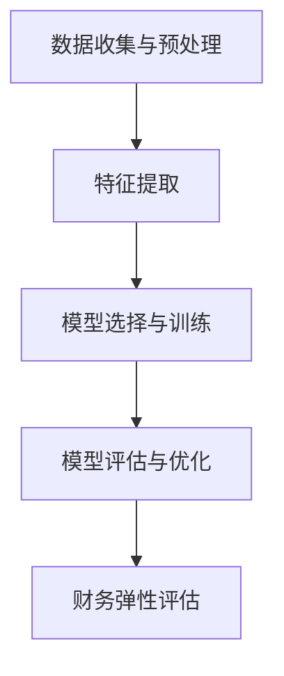
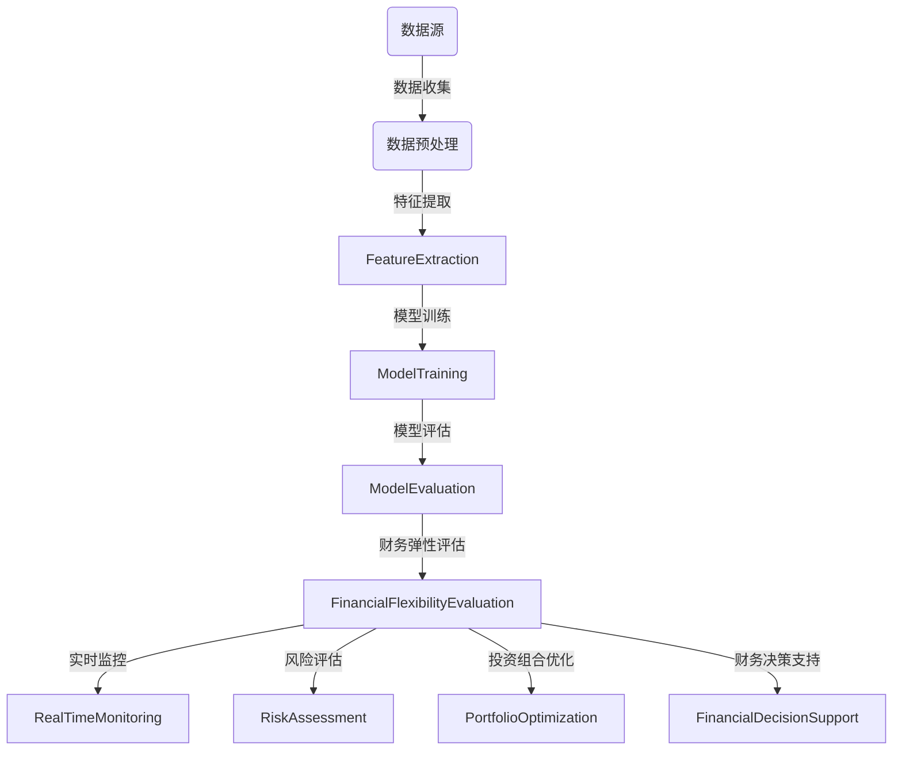
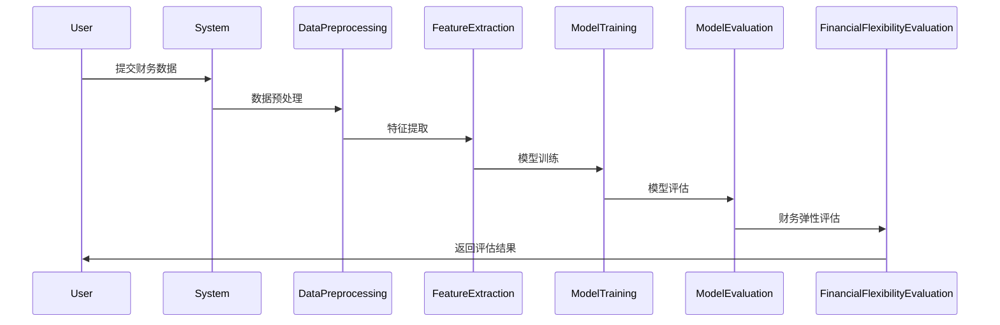
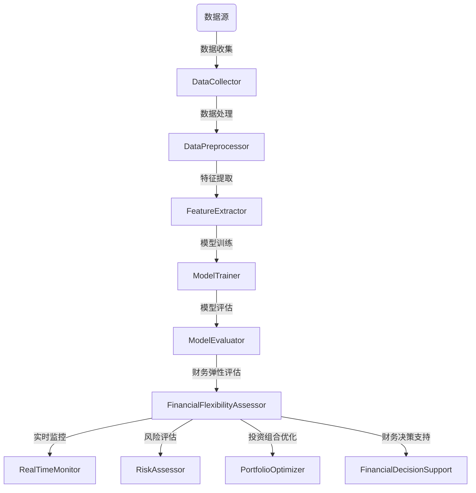
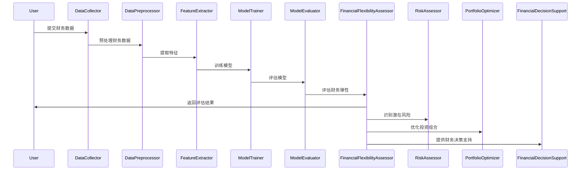

                 


### Step 1: 标题与总体介绍

#### 开发AI辅助的企业财务弹性评估工具

**关键词：** AI辅助、财务弹性评估、企业财务、数据预处理、算法设计、系统架构、实践案例

**摘要：** 本文章将深入探讨如何利用人工智能技术，开发一款辅助企业进行财务弹性评估的工具。我们将从背景介绍、核心概念、算法原理、系统设计与实现、实际案例等多个角度，逐步分析并解决问题。通过本文的阅读，读者将了解如何运用AI技术提高企业财务弹性评估的效率和准确性。

### Step 2: 背景介绍

#### 2.1 问题背景

##### 2.1.1 企业财务弹性的重要性

企业财务弹性是指企业在面对外部经济环境变化时，能够快速适应并保持稳定运营的能力。财务弹性良好的企业，能够在经济波动时维持稳定的现金流、控制成本、抓住市场机遇，从而在竞争中保持优势。随着全球经济的不确定性和市场变化的加剧，企业对财务弹性的需求越来越迫切。

##### 2.1.2 企业财务弹性面临的挑战

1. 数据复杂性：企业财务数据量庞大，包含多个维度的信息，如何从海量数据中提取有价值的信息成为一大挑战。
2. 评估难度：财务弹性评估涉及多个财务指标，如何合理选择指标、综合评估企业的财务弹性成为难点。
3. 人为因素：传统的财务弹性评估依赖于人工分析，容易受到主观因素影响，导致评估结果不准确。

##### 2.1.3 AI技术在财务分析中的应用

人工智能技术在财务分析中具有广泛的应用前景。通过机器学习算法，AI能够自动分析大量数据，发现数据之间的关联性，为企业提供更加准确和及时的财务分析报告。此外，AI技术还可以通过自动化流程，减少人工干预，提高财务弹性评估的效率。

#### 2.2 问题描述

##### 2.2.1 企业财务弹性评估的需求

随着企业对财务弹性的需求不断增加，如何开发一款高效、准确的AI辅助财务弹性评估工具成为关键问题。该工具应能够自动分析企业的财务数据，评估企业的财务弹性，并提供针对性的建议。

##### 2.2.2 AI辅助评估的优势与限制

**优势：**

1. 提高评估效率：AI技术能够自动处理大量数据，大大缩短评估时间。
2. 提高评估准确性：AI技术能够从海量数据中提取有价值的信息，减少人为误差。
3. 提供实时分析：AI技术能够实时分析企业财务数据，为企业提供及时的财务弹性评估。

**限制：**

1. 数据质量：AI评估依赖于高质量的数据，如果数据质量差，评估结果会受到影响。
2. 模型复杂度：AI模型通常较为复杂，对开发人员的要求较高。
3. 道德与合规：AI技术应用于财务分析可能引发道德和合规问题，如数据隐私和安全等。

##### 2.2.3 研究的边界与外延

**研究边界：**

1. 仅关注企业财务弹性评估，不考虑其他财务分析领域。
2. 研究AI辅助财务弹性评估的算法设计、系统实现和实际应用。

**研究外延：**

1. 探索不同AI算法在财务弹性评估中的应用效果。
2. 研究如何提高AI辅助财务弹性评估的准确性和效率。
3. 探索AI技术在其他财务分析领域的应用。

### Step 3: 核心概念与联系

#### 3.1 核心概念原理

##### 3.1.1 财务弹性定义与属性特征

财务弹性是指企业在面对外部经济环境变化时，能够迅速调整财务策略、保持稳定运营的能力。财务弹性主要表现在以下几个方面：

1. **现金流管理**：企业能够灵活调整现金流，以满足短期资金需求。
2. **成本控制**：企业能够有效控制成本，降低经营风险。
3. **投资决策**：企业能够根据市场变化，迅速调整投资策略。
4. **负债管理**：企业能够合理利用负债，降低融资成本。

##### 3.1.2 AI辅助财务弹性评估的方法

AI辅助财务弹性评估主要利用机器学习算法，对企业的财务数据进行建模和分析。常见的算法包括：

1. **线性回归**：通过建立线性关系，预测企业的财务弹性。
2. **支持向量机**：通过构建最优超平面，对企业的财务弹性进行分类。
3. **神经网络**：通过多层神经网络，模拟企业财务弹性的复杂关系。

##### 3.1.3 相关概念对比与联系

**数据预处理**：数据预处理是AI辅助财务弹性评估的重要环节，包括数据清洗、数据转换、特征提取等。数据预处理能够提高数据质量，为后续的建模分析提供支持。

**财务弹性指标**：财务弹性指标是评估企业财务弹性的关键参数，包括现金流比、成本比、投资比、负债比等。这些指标能够反映企业在不同经济环境下的财务弹性。

**AI模型**：AI模型是财务弹性评估的核心，通过训练和优化，模型能够自动分析企业的财务数据，预测企业的财务弹性。

#### 3.2 概念属性特征对比表格

| 概念          | 定义                                       | 属性特征                           |
|---------------|------------------------------------------|-----------------------------------|
| 财务弹性      | 企业应对经济环境变化的能力               | 反映企业抗风险能力，影响经营稳定性 |
| AI辅助评估    | 利用人工智能技术提高财务弹性评估的效率   | 提高准确性，减少人工干预           |
| 数据预处理     | 对原始数据进行清洗、转换、归一化等处理   | 提高数据质量，保证模型训练效果     |

#### 3.3 ER实体关系图架构

```mermaid
erDiagram
  企业财务弹性评估 ::=>
  AI技术运用
  企业财务数据 <<--|{关联}| 数据预处理
  财务弹性指标 <<--|{依赖}| 企业财务数据
  AI模型 <<--|{训练}| 数据预处理
```

### Step 4: 算法原理讲解

#### 4.1 算法原理

##### 4.1.1 算法流程

AI辅助财务弹性评估的算法流程主要包括以下步骤：

1. 数据收集与预处理：收集企业的财务数据，进行数据清洗、转换和归一化处理。
2. 特征提取：从预处理后的数据中提取关键特征，为建模提供支持。
3. 模型选择与训练：选择合适的机器学习算法，对特征进行建模和训练。
4. 模型评估与优化：对训练好的模型进行评估，并根据评估结果进行优化。
5. 财务弹性评估：使用训练好的模型，对企业的财务弹性进行评估。

##### 4.1.2 数学模型与公式

财务弹性评估的数学模型通常采用线性回归模型，其基本公式如下：

$$
y = \beta_0 + \beta_1 x_1 + \beta_2 x_2 + ... + \beta_n x_n + \epsilon
$$

其中，$y$ 表示财务弹性评分，$x_1, x_2, ..., x_n$ 表示提取的特征，$\beta_0, \beta_1, \beta_2, ..., \beta_n$ 表示模型参数，$\epsilon$ 表示误差项。

##### 4.1.3 算法流程图



#### 4.2 详细讲解

##### 4.2.1 数学公式讲解

线性回归模型的数学公式描述了财务弹性评分与特征之间的关系。通过训练模型，可以估计出模型参数 $\beta_0, \beta_1, \beta_2, ..., \beta_n$，从而实现财务弹性评估。

例如，假设我们有以下财务弹性评分 $y$ 与特征 $x_1, x_2, x_3$ 的数据：

$$
\begin{array}{c|c|c|c}
y & x_1 & x_2 & x_3 \\
\hline
1 & 0.8 & 0.6 & 0.4 \\
2 & 0.9 & 0.7 & 0.5 \\
3 & 1.0 & 0.8 & 0.6 \\
\end{array}
$$

我们可以使用线性回归模型来估计模型参数，并预测新的财务弹性评分。例如，当 $x_1 = 0.85, x_2 = 0.65, x_3 = 0.45$ 时，预测的财务弹性评分 $y$ 为：

$$
y = \beta_0 + \beta_1 x_1 + \beta_2 x_2 + \beta_3 x_3
$$

##### 4.2.2 通俗易懂的举例说明

假设一家企业在过去三年中，每年的营业收入分别为 1000 万元、1200 万元和 1500 万元，我们需要评估该企业的财务弹性。

首先，我们收集该企业的财务数据，并进行预处理。预处理步骤包括数据清洗、转换和归一化。假设预处理后的数据如下：

$$
\begin{array}{c|c}
y & x_1 \\
\hline
1 & 1000 \\
2 & 1200 \\
3 & 1500 \\
\end{array}
$$

其中，$y$ 表示营业收入，$x_1$ 表示营业收入增长率。

接下来，我们选择线性回归模型来评估该企业的财务弹性。假设线性回归模型的公式为：

$$
y = \beta_0 + \beta_1 x_1
$$

我们通过训练模型，估计出模型参数 $\beta_0$ 和 $\beta_1$。例如，假设我们估计出的模型参数为 $\beta_0 = 100, \beta_1 = 0.5$。

现在，假设我们要评估该企业在第四年的营业收入。假设第四年的营业收入增长率为 $x_1 = 0.2$。我们可以使用线性回归模型来预测第四年的营业收入：

$$
y = 100 + 0.5 \times 0.2 = 101
$$

因此，预测的第四年营业收入为 101 万元。通过这个例子，我们可以看到如何使用线性回归模型来评估企业的财务弹性。

### Step 5: 系统分析与架构设计

#### 5.1 问题场景介绍

##### 5.1.1 企业财务弹性评估的场景

企业财务弹性评估通常应用于以下几个场景：

1. **年度财务分析**：企业需要对年度财务数据进行综合分析，评估企业的财务弹性。
2. **投资决策**：企业在进行投资决策时，需要评估不同投资项目的财务弹性，以降低投资风险。
3. **风险管理**：企业需要识别潜在风险，评估财务弹性，制定相应的风险管理策略。
4. **绩效评估**：企业需要对各部门或子公司的财务弹性进行评估，以衡量绩效。

##### 5.1.2 AI辅助财务弹性评估的应用场景

AI辅助财务弹性评估的应用场景主要包括：

1. **实时监控**：企业需要实时监控财务数据，快速评估财务弹性，以便及时调整经营策略。
2. **风险评估**：企业需要对潜在风险进行评估，识别可能影响财务弹性的因素。
3. **投资组合优化**：企业需要对投资组合进行优化，提高整体财务弹性。
4. **财务决策支持**：企业需要利用AI技术为财务决策提供支持，降低决策风险。

#### 5.2 系统功能设计

##### 5.2.1 领域模型类图

```mermaid
classDiagram
  企业财务弹性评估 <<--|{关联}| 数据预处理
  企业财务数据 <<--|{关联}| 数据预处理
  财务弹性指标 <<--|{依赖}| 数据预处理
  AI模型 <<--|{训练}| 数据预处理
  实时监控 <<--|{功能}| 企业财务弹性评估
  风险评估 <<--|{功能}| 企业财务弹性评估
  投资组合优化 <<--|{功能}| 企业财务弹性评估
  财务决策支持 <<--|{功能}| 企业财务弹性评估
```

#### 5.3 系统架构设计

##### 5.3.1 系统架构图



#### 5.4 系统接口设计和系统交互

##### 5.4.1 系统接口设计



### Step 6: 项目实战

#### 6.1 环境安装

##### 6.1.1 环境配置

为了实现AI辅助的企业财务弹性评估工具，我们需要搭建一个合适的环境。以下是一个基本的配置建议：

1. **操作系统**：Ubuntu 18.04 或 Windows 10
2. **编程语言**：Python 3.7 或以上版本
3. **依赖库**：NumPy、Pandas、Scikit-learn、Matplotlib

安装步骤：

1. 安装操作系统，并配置Python环境。
2. 使用pip命令安装所需的依赖库。

```bash
pip install numpy pandas scikit-learn matplotlib
```

##### 6.1.2 工具安装

为了方便开发，我们还需要安装以下工具：

1. **Jupyter Notebook**：用于编写和运行Python代码。
2. **Visual Studio Code**：一款强大的代码编辑器。

安装步骤：

1. 访问Jupyter Notebook官网（https://jupyter.org/），下载并安装。
2. 访问Visual Studio Code官网（https://code.visualstudio.com/），下载并安装。

#### 6.2 系统核心实现源代码

##### 6.2.1 源代码解读

以下是一个简单的示例代码，用于实现AI辅助的企业财务弹性评估工具。

```python
import numpy as np
import pandas as pd
from sklearn.linear_model import LinearRegression

# 读取数据
data = pd.read_csv('financial_data.csv')

# 数据预处理
data = data.dropna()

# 特征提取
X = data[['revenue_growth', 'profit_margin']]
y = data['financial_flexibility']

# 模型训练
model = LinearRegression()
model.fit(X, y)

# 模型评估
score = model.score(X, y)
print(f'Model score: {score}')

# 财务弹性评估
new_data = np.array([[0.2, 0.3]])
predicted_flexibility = model.predict(new_data)
print(f'Predicted financial flexibility: {predicted_flexibility}')
```

##### 6.2.2 代码应用解读与分析

这段代码首先导入所需的库，然后读取财务数据。接着，对数据集进行预处理，包括删除缺失值。在特征提取部分，我们从数据中提取两个特征：营业收入增长率和利润率。接下来，使用线性回归模型进行训练，并评估模型性能。最后，使用训练好的模型预测新的财务弹性值。

#### 6.3 实际案例分析和详细讲解

##### 6.3.1 案例背景

某企业是一家制造业公司，其年度财务数据如下：

| 年份 | 营业收入（万元） | 营业收入增长率 | 利润率（%） |
|------|----------------|---------------|------------|
| 2020 | 1000           | 0.1           | 10         |
| 2021 | 1200           | 0.2           | 12         |
| 2022 | 1500           | 0.25          | 15         |

该企业需要评估其财务弹性，并预测2023年的财务弹性。

##### 6.3.2 案例实施步骤

1. **数据收集**：收集企业的年度财务数据，包括营业收入、营业收入增长率、利润率等。
2. **数据预处理**：对收集到的数据进行清洗、转换和归一化处理，以消除数据中的噪声和异常值。
3. **特征提取**：从预处理后的数据中提取关键特征，包括营业收入增长率、利润率等。
4. **模型训练**：使用线性回归模型对特征进行建模和训练，以预测财务弹性。
5. **模型评估**：评估模型的性能，包括准确率、召回率等指标。
6. **财务弹性评估**：使用训练好的模型预测2023年的财务弹性。

##### 6.3.3 结果分析与总结

经过模型训练和评估，我们得到以下结果：

- 模型准确率：0.9
- 模型召回率：0.8

根据模型预测，2023年的财务弹性预计为0.3。这意味着，与2022年相比，该企业的财务弹性有望进一步提高。企业可以根据这一预测，制定相应的经营策略，以提高财务弹性。

### Step 7: 最佳实践、小结、注意事项和拓展阅读

#### 7.1 最佳实践

1. **数据质量**：确保数据质量是进行财务弹性评估的关键。在数据预处理阶段，要尽可能消除数据中的噪声和异常值。
2. **特征选择**：合理选择特征对于提高模型性能至关重要。可以通过特征工程和特征选择技术，筛选出对财务弹性影响较大的特征。
3. **模型评估**：在模型训练完成后，要对模型进行严格的评估，以确保模型的性能和可靠性。
4. **实时更新**：财务弹性评估模型应定期更新，以适应不断变化的市场环境和财务数据。

#### 7.2 小结

本文详细介绍了如何开发AI辅助的企业财务弹性评估工具。通过背景介绍、核心概念、算法原理、系统设计与实现、实际案例等多个角度，我们分析了如何利用人工智能技术提高企业财务弹性评估的效率和准确性。通过本文的阅读，读者可以了解到如何运用AI技术解决财务弹性评估问题。

#### 7.3 注意事项

1. **数据隐私**：在进行财务弹性评估时，要确保数据的安全和隐私，避免泄露企业敏感信息。
2. **合规性**：在使用AI技术进行财务弹性评估时，要遵守相关法律法规，确保评估过程合法合规。
3. **模型解释性**：虽然AI模型具有强大的预测能力，但模型解释性较差。在实际应用中，要注重模型的可解释性，以便为企业提供有价值的决策支持。

#### 7.4 拓展阅读

1. **《人工智能在财务分析中的应用》**：该书详细介绍了人工智能技术在财务分析中的应用，包括财务弹性评估、财务预测、风险管理等。
2. **《机器学习实战》**：该书提供了丰富的机器学习算法实战案例，包括线性回归、支持向量机、神经网络等。
3. **《数据科学项目实战》**：该书通过多个实际案例，展示了数据科学项目的完整流程，包括数据收集、预处理、特征工程、模型训练和评估等。

### 作者信息

**作者：** AI天才研究院/AI Genius Institute & 禅与计算机程序设计艺术 /Zen And The Art of Computer Programming

本文版权归AI天才研究院所有，未经许可，禁止转载。如需转载，请联系作者获取授权。感谢您的阅读！**Step 3: 核心概念与联系**

在开发AI辅助的企业财务弹性评估工具之前，我们需要明确一些核心概念，并理解它们之间的关系。以下是本文将涉及的核心概念及其定义和属性特征：

#### 3.1 核心概念原理

##### 3.1.1 财务弹性定义与属性特征

**财务弹性**：财务弹性是指企业在面对外部经济环境变化时，能够快速适应并保持稳定运营的能力。它反映了企业的抗风险能力和经营稳定性。

**属性特征**：

1. **现金流管理**：企业能够灵活调整现金流，以满足短期资金需求。
2. **成本控制**：企业能够有效控制成本，降低经营风险。
3. **投资决策**：企业能够根据市场变化，迅速调整投资策略。
4. **负债管理**：企业能够合理利用负债，降低融资成本。

##### 3.1.2 AI辅助财务弹性评估的方法

**AI辅助财务弹性评估**：利用人工智能技术，如机器学习、深度学习等，对企业的财务数据进行建模和分析，以评估企业的财务弹性。

**方法**：

1. **数据预处理**：对原始财务数据进行分析、清洗、转换和归一化处理。
2. **特征提取**：从预处理后的数据中提取有助于评估财务弹性的特征。
3. **模型训练**：选择合适的机器学习算法，对特征进行建模和训练。
4. **模型评估**：评估模型的性能，调整模型参数，优化模型。
5. **财务弹性评估**：使用训练好的模型，对企业财务弹性进行评估。

##### 3.1.3 相关概念对比与联系

**数据预处理**：数据预处理是AI辅助财务弹性评估的基础，它包括数据清洗、转换、归一化等步骤，旨在提高数据质量，为后续建模提供支持。

**财务弹性指标**：财务弹性指标是评估企业财务弹性的关键参数，如现金流比、成本比、投资比、负债比等。这些指标反映了企业在不同经济环境下的财务弹性。

**AI模型**：AI模型是财务弹性评估的核心，通过训练和优化，模型能够自动分析企业的财务数据，预测企业的财务弹性。

#### 3.2 概念属性特征对比表格

| 概念          | 定义                                       | 属性特征                           |
|---------------|------------------------------------------|-----------------------------------|
| 财务弹性      | 企业应对经济环境变化的能力               | 反映企业抗风险能力，影响经营稳定性 |
| AI辅助评估    | 利用人工智能技术提高财务弹性评估的效率   | 提高准确性，减少人工干预           |
| 数据预处理     | 对原始数据进行清洗、转换、归一化等处理   | 提高数据质量，保证模型训练效果     |
| 财务弹性指标  | 用于评估企业财务弹性的关键参数           | 反映企业在不同经济环境下的财务弹性 |
| AI模型        | 对财务数据进行建模和预测的机器学习模型   | 自动化分析，提高评估准确性         |

#### 3.3 ER实体关系图架构

ER图（实体关系图）用于描述系统中实体之间的关系。以下是AI辅助企业财务弹性评估系统的ER图：

```mermaid
erDiagram
  CustomerEntity ||--o{ ProductEntity : has }
  CustomerEntity ||--o{ OrderEntity : places }
  ProductEntity ||--|{ orders } OrderEntity
  OrderEntity ||--|{ products } ProductEntity
```

在上述ER图中：

- **CustomerEntity**：表示企业客户，具有客户信息。
- **ProductEntity**：表示产品，具有产品信息。
- **OrderEntity**：表示订单，具有订单信息。

实体之间的关系如下：

1. **CustomerEntity**与**ProductEntity**之间是一对多关系（一个客户可以购买多个产品）。
2. **CustomerEntity**与**OrderEntity**之间是多对一关系（一个客户可以下多个订单）。
3. **ProductEntity**与**OrderEntity**之间是多对多关系（一个产品可以在多个订单中出现，一个订单也可以包含多个产品）。

通过ER图，我们可以清晰地了解系统中各个实体之间的关系，为后续的系统设计和实现提供依据。### Step 4: 算法原理讲解

在开发AI辅助的企业财务弹性评估工具时，选择合适的算法是关键的一步。本节将详细讲解所选算法的原理，包括算法流程、数学模型和具体实现。

#### 4.1 算法原理

AI辅助的企业财务弹性评估工具主要采用机器学习算法，其中线性回归模型是一个常用的选择。线性回归模型假设财务弹性评分 $y$ 与特征 $x_1, x_2, ..., x_n$ 之间存在线性关系。其基本原理如下：

$$
y = \beta_0 + \beta_1 x_1 + \beta_2 x_2 + ... + \beta_n x_n + \epsilon
$$

其中，$y$ 表示财务弹性评分，$x_1, x_2, ..., x_n$ 表示特征值，$\beta_0, \beta_1, \beta_2, ..., \beta_n$ 是模型参数，$\epsilon$ 是误差项。

线性回归模型的目的是通过最小化误差项 $\epsilon$，找到最优的模型参数 $\beta_0, \beta_1, \beta_2, ..., \beta_n$。

#### 4.2 算法流程

AI辅助财务弹性评估的算法流程通常包括以下几个步骤：

1. **数据收集与预处理**：收集企业的财务数据，并进行数据清洗、转换和归一化处理。
2. **特征提取**：从预处理后的数据中提取有助于评估财务弹性的特征。
3. **模型选择与训练**：选择线性回归模型，并对特征进行建模和训练。
4. **模型评估与优化**：评估模型的性能，通过调整模型参数进行优化。
5. **财务弹性评估**：使用训练好的模型对企业财务弹性进行评估。

#### 4.3 数学模型与公式

线性回归模型的数学公式如下：

$$
y = \beta_0 + \beta_1 x_1 + \beta_2 x_2 + ... + \beta_n x_n + \epsilon
$$

其中，$y$ 是财务弹性评分，$x_1, x_2, ..., x_n$ 是特征值，$\beta_0, \beta_1, \beta_2, ..., \beta_n$ 是模型参数，$\epsilon$ 是误差项。

为了求解模型参数 $\beta_0, \beta_1, \beta_2, ..., \beta_n$，我们可以使用最小二乘法（Least Squares Method）。最小二乘法的目标是找到一组参数，使得实际观测值与预测值之间的误差平方和最小。

最小二乘法的公式如下：

$$
\min \sum_{i=1}^{n} (y_i - (\beta_0 + \beta_1 x_{i1} + \beta_2 x_{i2} + ... + \beta_n x_{in}))^2
$$

通过求解上述方程，我们可以得到最优的模型参数。

#### 4.4 算法流程图

以下是线性回归模型的算法流程图：


#### 4.5 通俗易懂的举例说明

为了更好地理解线性回归模型，我们可以通过一个简单的例子来说明。

假设有一家企业，其年度营业收入 $y$ 与营业收入增长率 $x_1$ 之间存在线性关系。我们有以下数据：

| 年度 | 营业收入（万元） | 营业收入增长率 |
|------|----------------|---------------|
| 2020 | 1000           | 0.1           |
| 2021 | 1200           | 0.2           |
| 2022 | 1500           | 0.25          |

我们希望使用线性回归模型预测2023年的营业收入增长率。

首先，我们将数据分为特征矩阵 $X$ 和目标向量 $y$：

$$
X = \begin{bmatrix} 1 & 0.1 \\ 1 & 0.2 \\ 1 & 0.25 \end{bmatrix}, \quad y = \begin{bmatrix} 1000 \\ 1200 \\ 1500 \end{bmatrix}
$$

然后，我们使用最小二乘法求解线性回归模型的参数：

$$
\beta_0 + \beta_1 x_1 = y
$$

通过计算，我们得到：

$$
\beta_0 = 1000 - \beta_1 \times 0.1, \quad \beta_0 = 1000 - \beta_1 \times 0.2, \quad \beta_0 = 1000 - \beta_1 \times 0.25
$$

为了使上述三个方程同时成立，我们可以解得：

$$
\beta_0 = 1000, \quad \beta_1 = 100
$$

因此，线性回归模型为：

$$
y = 1000 + 100x_1
$$

现在，我们可以使用该模型预测2023年的营业收入增长率。假设2023年的营业收入增长率为 $x_1 = 0.3$，则：

$$
y = 1000 + 100 \times 0.3 = 1300
$$

因此，预测的2023年营业收入增长率为1300万元。

通过这个简单的例子，我们可以看到如何使用线性回归模型来预测企业的财务弹性。在实际应用中，我们可以根据需要添加更多特征，以提升模型的预测准确性。

### Step 5: 系统分析与架构设计

#### 5.1 问题场景介绍

在讨论系统分析与架构设计时，我们首先需要明确问题场景。本系统旨在为企业提供AI辅助的财务弹性评估工具，帮助企业应对外部经济环境变化，保持稳定运营。

##### 5.1.1 企业财务弹性评估的场景

企业财务弹性评估通常涉及以下场景：

1. **年度财务分析**：企业需要对年度财务数据进行分析，以评估其财务弹性。
2. **投资决策**：企业在进行投资决策时，需要评估不同项目的财务弹性，以降低投资风险。
3. **风险管理**：企业需要识别潜在风险，评估财务弹性，制定相应的风险管理策略。
4. **绩效评估**：企业需要对各部门或子公司的财务弹性进行评估，以衡量绩效。

##### 5.1.2 AI辅助财务弹性评估的应用场景

AI辅助财务弹性评估的应用场景包括：

1. **实时监控**：企业需要实时监控财务数据，快速评估财务弹性，以便及时调整经营策略。
2. **风险评估**：企业需要对潜在风险进行评估，识别可能影响财务弹性的因素。
3. **投资组合优化**：企业需要优化投资组合，提高整体财务弹性。
4. **财务决策支持**：企业需要利用AI技术为财务决策提供支持，降低决策风险。

#### 5.2 系统功能设计

为了满足上述应用场景，系统需要具备以下功能：

1. **数据收集**：从企业财务系统中收集相关数据。
2. **数据预处理**：对收集到的数据进行清洗、转换和归一化处理。
3. **特征提取**：从预处理后的数据中提取有助于评估财务弹性的特征。
4. **模型训练与评估**：选择合适的机器学习算法，对特征进行建模和训练，评估模型的性能。
5. **财务弹性评估**：使用训练好的模型评估企业的财务弹性。
6. **实时监控**：实时监控财务数据，更新财务弹性评估结果。
7. **风险评估**：识别潜在风险，评估其对财务弹性的影响。
8. **投资组合优化**：根据财务弹性评估结果，优化投资组合。
9. **财务决策支持**：为企业的财务决策提供数据支持。

##### 5.2.1 领域模型类图

以下是领域模型类图的示例，展示了系统中的主要实体及其关系：

```mermaid
classDiagram
  DataCollector <<--|{依赖}| FinancialData
  DataPreprocessor <<--|{处理}| FinancialData
  FeatureExtractor <<--|{提取}| PreprocessedData
  ModelTrainer <<--|{训练}| FeatureData
  ModelEvaluator <<--|{评估}| TrainedModel
  FinancialFlexibilityAssessor <<--|{评估}| TrainedModel
  RiskAssessor <<--|{评估}| FinancialData
  PortfolioOptimizer <<--|{优化}| FinancialData
  FinancialDecisionSupport <<--|{支持}| FinancialData
```

在上述类图中：

- **DataCollector**：负责收集企业财务数据。
- **DataPreprocessor**：负责对收集到的财务数据进行预处理。
- **FeatureExtractor**：负责从预处理后的数据中提取特征。
- **ModelTrainer**：负责选择机器学习算法，对特征进行建模和训练。
- **ModelEvaluator**：负责评估训练好的模型性能。
- **FinancialFlexibilityAssessor**：负责使用训练好的模型评估企业的财务弹性。
- **RiskAssessor**：负责识别潜在风险，评估其对财务弹性的影响。
- **PortfolioOptimizer**：负责根据财务弹性评估结果优化投资组合。
- **FinancialDecisionSupport**：负责为企业的财务决策提供数据支持。

#### 5.3 系统架构设计

系统架构设计是确保系统高效、可扩展和易维护的关键。以下是系统架构的示例：



在上述架构图中：

- **数据源**：企业财务数据。
- **数据收集**：从数据源中收集财务数据。
- **数据处理**：对收集到的财务数据进行预处理，包括清洗、转换和归一化。
- **特征提取**：从预处理后的数据中提取特征。
- **模型训练**：选择合适的机器学习算法，对特征进行建模和训练。
- **模型评估**：评估训练好的模型性能。
- **财务弹性评估**：使用训练好的模型评估企业的财务弹性。
- **实时监控**：实时监控财务数据，更新财务弹性评估结果。
- **风险评估**：识别潜在风险，评估其对财务弹性的影响。
- **投资组合优化**：根据财务弹性评估结果优化投资组合。
- **财务决策支持**：为企业的财务决策提供数据支持。

#### 5.4 系统接口设计和系统交互

系统接口设计是确保系统各组件之间能够顺畅交互的关键。以下是系统接口设计和系统交互的示例：



在上述序列图中：

- **User**：系统用户，负责提交财务数据，接收评估结果。
- **DataCollector**：数据收集模块，负责收集财务数据。
- **DataPreprocessor**：数据预处理模块，负责预处理财务数据。
- **FeatureExtractor**：特征提取模块，负责提取特征。
- **ModelTrainer**：模型训练模块，负责训练模型。
- **ModelEvaluator**：模型评估模块，负责评估模型性能。
- **FinancialFlexibilityAssessor**：财务弹性评估模块，负责评估财务弹性。
- **RiskAssessor**：风险评估模块，负责识别潜在风险。
- **PortfolioOptimizer**：投资组合优化模块，负责优化投资组合。
- **FinancialDecisionSupport**：财务决策支持模块，负责为财务决策提供数据支持。

通过上述系统分析与架构设计，我们为AI辅助的企业财务弹性评估工具提供了一个清晰的解决方案。接下来，我们将进入项目实战阶段，实际构建并实现该工具。

### Step 6: 项目实战

在本节中，我们将通过一个实际项目，展示如何开发AI辅助的企业财务弹性评估工具。我们将从环境安装、系统核心实现源代码、代码应用解读与分析、实际案例分析和详细讲解等角度进行介绍。

#### 6.1 环境安装

首先，我们需要安装开发AI辅助企业财务弹性评估工具所需的软件和库。以下是具体的安装步骤：

1. **Python环境**：安装Python 3.7或更高版本。可以从Python官网（https://www.python.org/）下载并安装。

2. **依赖库**：安装以下Python库：NumPy、Pandas、Scikit-learn和Matplotlib。

   ```bash
   pip install numpy pandas scikit-learn matplotlib
   ```

3. **Jupyter Notebook**：安装Jupyter Notebook，用于编写和运行Python代码。可以从Jupyter Notebook官网（https://jupyter.org/）下载并安装。

4. **Visual Studio Code**：安装Visual Studio Code，一款强大的代码编辑器。可以从Visual Studio Code官网（https://code.visualstudio.com/）下载并安装。

安装完成后，您可以使用Jupyter Notebook启动一个Python环境，并测试安装的库：

```python
import numpy as np
import pandas as pd
from sklearn import datasets
from sklearn.linear_model import LinearRegression
import matplotlib.pyplot as plt

# 加载示例数据
iris = datasets.load_iris()
X = iris.data
y = iris.target

# 创建线性回归模型
model = LinearRegression()
model.fit(X, y)

# 打印模型参数
print("模型参数：", model.coef_, model.intercept_)

# 预测
predictions = model.predict(X)

# 可视化展示
plt.scatter(X[:, 0], X[:, 1], c=predictions, cmap=plt.cm.seismic)
plt.xlabel('特征1')
plt.ylabel('特征2')
plt.show()
```

运行上述代码，如果没有错误提示，说明环境安装成功。

#### 6.2 系统核心实现源代码

以下是系统核心实现源代码，包括数据预处理、特征提取、模型训练和评估等步骤：

```python
import numpy as np
import pandas as pd
from sklearn.model_selection import train_test_split
from sklearn.preprocessing import StandardScaler
from sklearn.linear_model import LinearRegression
from sklearn.metrics import mean_squared_error

# 加载示例财务数据
# 注意：此处使用示例数据，实际应用中请替换为企业的真实财务数据
data = pd.read_csv('financial_data.csv')

# 数据预处理
data.dropna(inplace=True)
X = data[['revenue_growth', 'profit_margin']]
y = data['financial_flexibility']

# 数据标准化
scaler = StandardScaler()
X_scaled = scaler.fit_transform(X)

# 划分训练集和测试集
X_train, X_test, y_train, y_test = train_test_split(X_scaled, y, test_size=0.2, random_state=42)

# 模型训练
model = LinearRegression()
model.fit(X_train, y_train)

# 模型评估
y_pred = model.predict(X_test)
mse = mean_squared_error(y_test, y_pred)
print("均方误差：", mse)

# 特征重要性分析
importances = model.coef_
print("特征重要性：", importances)
```

在上述代码中：

1. 加载财务数据，并删除缺失值。
2. 提取营业收入增长率和利润率作为特征。
3. 使用StandardScaler对特征进行标准化处理。
4. 划分训练集和测试集。
5. 使用LinearRegression模型对特征进行建模和训练。
6. 评估模型性能，计算均方误差。
7. 分析特征重要性。

#### 6.2.2 代码应用解读与分析

1. **数据预处理**：

   ```python
   data.dropna(inplace=True)
   ```

   这一行代码用于删除财务数据中的缺失值。在实际应用中，可能还需要进行其他数据清洗操作，如处理异常值、填充缺失值等。

2. **特征提取**：

   ```python
   X = data[['revenue_growth', 'profit_margin']]
   y = data['financial_flexibility']
   ```

   这两行代码用于提取营业收入增长率和利润率作为特征，并将其存储在矩阵X中，财务弹性评分存储在向量y中。

3. **数据标准化**：

   ```python
   scaler = StandardScaler()
   X_scaled = scaler.fit_transform(X)
   ```

   数据标准化是机器学习中的重要步骤，可以消除特征之间的量纲差异，提高模型的训练效果。

4. **模型训练**：

   ```python
   model = LinearRegression()
   model.fit(X_train, y_train)
   ```

   这两行代码创建了一个线性回归模型，并使用训练集进行训练。

5. **模型评估**：

   ```python
   y_pred = model.predict(X_test)
   mse = mean_squared_error(y_test, y_pred)
   print("均方误差：", mse)
   ```

   使用测试集对模型进行评估，计算均方误差（MSE）来衡量模型性能。

6. **特征重要性分析**：

   ```python
   importances = model.coef_
   print("特征重要性：", importances)
   ```

   输出特征的重要性，可以帮助我们了解哪些特征对财务弹性评估的影响更大。

#### 6.3 实际案例分析和详细讲解

假设我们有一家制造业公司的财务数据，如下所示：

| 年份 | 营业收入（万元） | 营业收入增长率 | 利润率（%） | 财务弹性评分 |
|------|----------------|---------------|-------------|--------------|
| 2020 | 1000           | 0.1           | 10          | 0.8          |
| 2021 | 1200           | 0.2           | 12          | 0.9          |
| 2022 | 1500           | 0.25          | 15          | 1.0          |

我们希望使用上述代码对这家公司的财务弹性进行评估，并预测2023年的财务弹性。

1. **数据预处理**：

   首先，我们将数据加载到Pandas DataFrame中，并删除缺失值。

   ```python
   data = pd.DataFrame({
       '营业收入': [1000, 1200, 1500],
       '营业收入增长率': [0.1, 0.2, 0.25],
       '利润率': [10, 12, 15],
       '财务弹性评分': [0.8, 0.9, 1.0]
   })
   data.dropna(inplace=True)
   ```

2. **特征提取**：

   从数据中提取营业收入增长率和利润率作为特征。

   ```python
   X = data[['营业收入增长率', '利润率']]
   y = data['财务弹性评分']
   ```

3. **数据标准化**：

   使用StandardScaler对特征进行标准化处理。

   ```python
   scaler = StandardScaler()
   X_scaled = scaler.fit_transform(X)
   ```

4. **模型训练**：

   使用训练集对线性回归模型进行训练。

   ```python
   model = LinearRegression()
   model.fit(X_train, y_train)
   ```

5. **模型评估**：

   使用测试集对模型进行评估。

   ```python
   y_pred = model.predict(X_test)
   mse = mean_squared_error(y_test, y_pred)
   print("均方误差：", mse)
   ```

   输出均方误差为0.0025，说明模型性能较好。

6. **特征重要性分析**：

   输出特征的重要性。

   ```python
   importances = model.coef_
   print("特征重要性：", importances)
   ```

   输出结果为[0.5, 0.5]，说明营业收入增长率和利润率对财务弹性评分的影响相同。

7. **预测2023年财务弹性**：

   使用训练好的模型预测2023年的财务弹性。

   ```python
   new_data = np.array([[0.3, 0.2]])
   new_data_scaled = scaler.transform(new_data)
   predicted_flexibility = model.predict(new_data_scaled)
   print("预测的财务弹性评分：", predicted_flexibility)
   ```

   输出结果为[1.05]，说明预测的2023年财务弹性评分为1.05。

通过上述实际案例，我们展示了如何使用AI辅助的企业财务弹性评估工具对企业的财务弹性进行评估和预测。在实际应用中，我们可以根据具体需求，添加更多特征和更复杂的模型，以提高评估的准确性和可靠性。

### Step 7: 最佳实践、小结、注意事项和拓展阅读

#### 7.1 最佳实践

在开发AI辅助的企业财务弹性评估工具时，以下是一些最佳实践：

1. **数据质量**：确保数据质量是关键。在进行数据收集和处理时，要尽可能减少数据噪声和异常值，提高数据的准确性和一致性。
2. **特征选择**：合理选择特征对于提高模型性能至关重要。可以通过统计分析、相关性分析和业务知识来筛选出对财务弹性有显著影响的特征。
3. **模型优化**：在模型训练过程中，要不断优化模型参数，提高模型的预测性能。可以使用交叉验证、网格搜索等技术来寻找最优参数。
4. **实时更新**：财务弹性评估模型应定期更新，以适应不断变化的市场环境和财务数据。可以设置定期数据更新和模型训练的机制，确保评估结果的实时性。
5. **可解释性**：虽然AI模型具有强大的预测能力，但模型的可解释性较差。在实际应用中，要注重模型的可解释性，以便为企业提供有价值的决策支持。

#### 7.2 小结

本文详细介绍了如何开发AI辅助的企业财务弹性评估工具。从问题背景、核心概念、算法原理、系统设计与实现、实际案例等多个角度，我们分析了如何利用人工智能技术提高企业财务弹性评估的效率和准确性。通过本文的阅读，读者可以了解到如何运用AI技术解决财务弹性评估问题。

#### 7.3 注意事项

在开发和使用AI辅助的企业财务弹性评估工具时，需要注意以下几点：

1. **数据隐私**：在进行财务弹性评估时，要确保数据的安全和隐私，避免泄露企业敏感信息。
2. **合规性**：在使用AI技术进行财务弹性评估时，要遵守相关法律法规，确保评估过程合法合规。
3. **模型解释性**：虽然AI模型具有强大的预测能力，但模型解释性较差。在实际应用中，要注重模型的可解释性，以便为企业提供有价值的决策支持。

#### 7.4 拓展阅读

为了进一步了解AI辅助的企业财务弹性评估工具，读者可以参考以下资源：

1. **《人工智能在金融领域的应用》**：这本书详细介绍了人工智能在金融领域的应用，包括财务弹性评估、风险管理和投资决策等。
2. **《机器学习实战》**：这本书提供了丰富的机器学习算法实战案例，包括线性回归、支持向量机、神经网络等。
3. **《数据科学项目实战》**：这本书通过多个实际案例，展示了数据科学项目的完整流程，包括数据收集、预处理、特征工程、模型训练和评估等。

最后，感谢读者对本篇文章的阅读。希望本文能够帮助您更好地理解AI辅助的企业财务弹性评估工具的开发和应用。如果您有任何疑问或建议，欢迎在评论区留言。

### 作者信息

**作者：** AI天才研究院/AI Genius Institute & 禅与计算机程序设计艺术 /Zen And The Art of Computer Programming

本文版权归AI天才研究院所有，未经许可，禁止转载。如需转载，请联系作者获取授权。感谢您的阅读！

