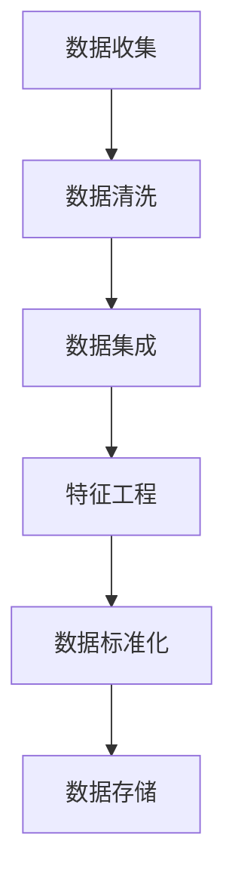
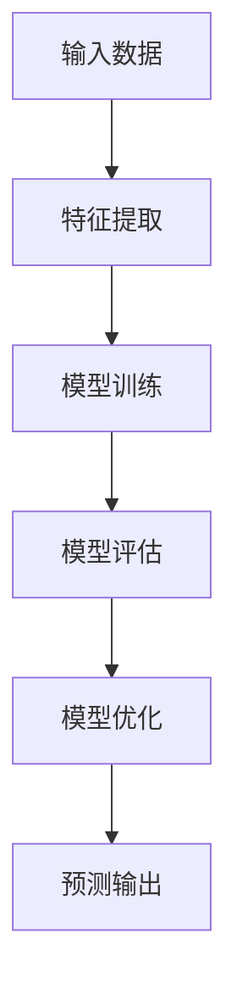
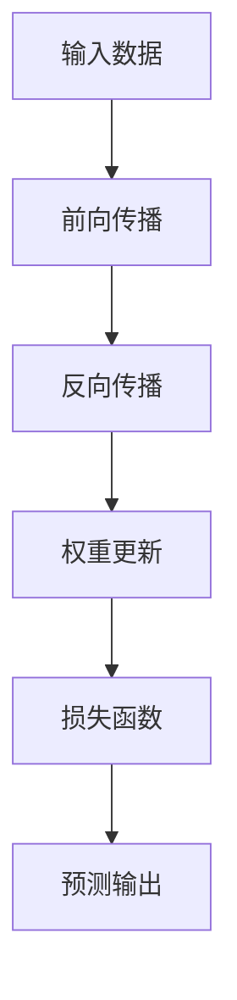
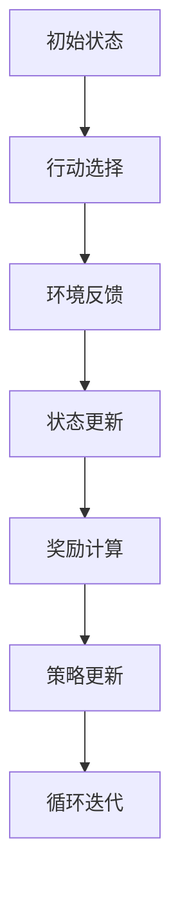
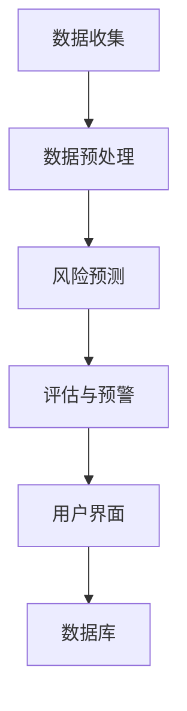
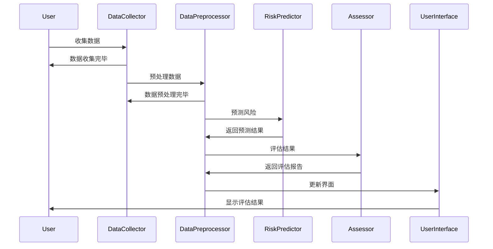

                 


### 第一部分：问题背景与核心概念

#### 第1章：问题背景

**1.1 企业财务风险概述**

企业财务风险是指在企业的日常运营和投资活动中，由于内外部因素的变化，导致企业财务状况不稳定，甚至可能引发破产的风险。这些风险包括但不限于信用风险、市场风险、流动性风险、汇率风险、操作风险等。

- **信用风险**：企业无法按期偿还债务或支付应付账款，从而影响企业的信用评级和融资能力。
- **市场风险**：市场条件的变化，如利率、汇率、股价波动等，对企业财务状况的影响。
- **流动性风险**：企业在短期内无法满足债务偿还或其他支付需求，导致资金链断裂。
- **汇率风险**：汇率波动导致企业跨国业务中的货币兑换损失。
- **操作风险**：企业在日常运营过程中，由于管理不善、操作失误等原因导致的风险。

这些财务风险的存在使得企业必须寻求有效的风险识别、评估和管理方法，以确保企业的稳健运营和可持续发展。

**1.2 AI辅助财务风险量化评估的必要性**

随着大数据和人工智能技术的发展，利用AI技术辅助企业财务风险量化评估成为可能。传统的方法往往依赖于人工经验和统计学模型，存在以下局限性：

- **数据依赖性高**：人工经验和方法往往依赖于有限的历史数据和经验，难以应对复杂多变的市场环境。
- **评估效率低**：需要大量的人力投入进行数据收集、处理和评估，效率较低。
- **主观判断大**：人工评估方法主观性较强，可能导致评估结果不准确。

而AI技术具有以下优势：

- **高效处理数据**：AI技术能够快速处理海量数据，识别出潜在的风险因素。
- **分析复杂模式**：通过机器学习、深度学习等算法，AI能够自动分析数据中的复杂模式，提高评估准确性。
- **实时动态评估**：AI技术可以实时监控企业财务状况，动态评估风险，及时调整风险控制策略。

**1.3 本书的结构**

本书旨在全面探讨AI辅助企业财务风险量化评估的理论和实践。具体结构如下：

- **第1章**：介绍企业财务风险概述和AI辅助财务风险量化评估的必要性。
- **第2章**：阐述核心概念与联系，包括AI技术原理和财务风险量化评估原理。
- **第3章**：讲解AI辅助财务风险量化评估的技术原理，包括数据预处理、机器学习算法、深度学习算法和强化学习算法。
- **第4章**：介绍系统设计与实现，包括系统架构设计、功能设计、架构设计和系统接口设计。
- **第5章**：进行项目实战，包括环境安装、系统核心实现、代码应用解读与分析、实际案例分析和项目小结。
- **第6章**：总结最佳实践，提出注意事项和拓展阅读。

**1.4 边界与外延**

本书主要关注以下边界和范围：

- **边界**：本书聚焦于AI技术在企业财务风险量化评估中的应用，不涉及其他风险类型（如法律风险、战略风险等）的量化评估。
- **外延**：虽然本书以企业财务风险量化评估为例，但AI技术在其他领域的风险量化评估（如金融风险、供应链风险等）也有广泛应用。

#### **第2章：核心概念与联系**

**2.1 AI技术原理**

AI技术主要包括机器学习、深度学习和强化学习，每种技术都有其独特的特点和适用场景。

- **机器学习**：
  - **特点**：基于数据自动学习和改进，通过构建模型来预测或分类新数据。
  - **应用领域**：数据挖掘、预测分析、文本分类、图像识别等。
  
  **概念属性特征对比表格**：

| AI技术   | 特点                            | 应用领域               |
|----------|--------------------------------|-----------------------|
| 机器学习 | 基于数据自动学习和改进          | 数据挖掘、预测分析     |
| 深度学习 | 基于多层神经网络的学习          | 图像识别、自然语言处理 |
| 强化学习 | 通过试错和反馈进行学习和决策    | 游戏开发、推荐系统     |

- **深度学习**：
  - **特点**：基于多层神经网络的学习，能够自动提取复杂特征。
  - **应用领域**：图像识别、语音识别、自然语言处理、自动驾驶等。

  **ER实体关系图架构**：

  ```
  ER实体关系图：
  - 数据集（Dataset）
  - 模型（Model）
  - 层（Layer）
  - 特征（Feature）
  ```

- **强化学习**：
  - **特点**：通过试错和反馈进行学习和决策，适用于动态环境。
  - **应用领域**：游戏开发、机器人控制、推荐系统、金融交易等。

  **ER实体关系图架构**：

  ```
  ER实体关系图：
  - 状态（State）
  - 行动（Action）
  - 奖励（Reward）
  - 策略（Policy）
  ```

**2.2 财务风险量化评估原理**

财务风险量化评估的核心在于将不可见的财务风险转化为可量化的指标，以便进行更有效的管理和决策。

- **数据预处理**：
  - **步骤**：数据收集、数据清洗、数据集成、特征工程、数据标准化。
  - **目的**：确保数据质量，为后续的模型训练和风险评估提供可靠的基础。

- **机器学习算法原理**：
  - **步骤**：特征提取、模型训练、模型评估、模型优化、预测输出。
  - **目的**：通过建立模型，自动分析数据中的风险因素，进行风险预测。

- **深度学习算法原理**：
  - **步骤**：输入数据、前向传播、反向传播、权重更新、损失函数、预测输出。
  - **目的**：通过多层神经网络，自动提取复杂特征，提高风险预测的准确性。

- **强化学习算法原理**：
  - **步骤**：初始状态、行动选择、环境反馈、状态更新、奖励计算、策略更新、循环迭代。
  - **目的**：通过试错和反馈，动态调整策略，实现最优风险控制。

**2.3 AI辅助财务风险量化评估的融合应用**

AI辅助财务风险量化评估可以结合多种AI技术，实现以下融合应用：

- **多模型融合**：结合机器学习、深度学习和强化学习，构建多层次的评估模型，提高评估的全面性和准确性。
- **实时监控与预警**：利用AI技术，实现对企业财务状况的实时监控，及时识别和预警潜在风险。
- **动态调整与优化**：根据实时数据和评估结果，动态调整风险控制策略，实现持续优化。

通过以上核心概念和联系的分析，我们可以看到AI技术在企业财务风险量化评估中的应用潜力。接下来，我们将深入探讨AI辅助财务风险量化评估的技术原理和算法讲解。

### **第二部分：技术原理与算法讲解**

#### **第3章：AI辅助财务风险量化评估技术原理**

**3.1 数据预处理**

数据预处理是AI辅助财务风险量化评估的基础步骤，其目的是确保数据质量，为后续的模型训练和风险评估提供可靠的基础。数据预处理包括以下步骤：

1. **数据收集**：从企业内外部收集与财务风险相关的数据，如财务报表、市场数据、信用评级数据等。
2. **数据清洗**：去除数据中的噪声和异常值，确保数据的准确性和一致性。
3. **数据集成**：将来自不同来源的数据进行整合，形成统一的数据库。
4. **特征工程**：通过数据变换、特征提取和特征选择，提高数据的可用性和模型的表现。
5. **数据标准化**：对数据进行归一化或标准化处理，使数据在不同特征尺度上具有可比性。

**Mermaid流程图**：



**3.2 机器学习算法原理**

机器学习算法是实现AI辅助财务风险量化评估的核心技术之一。机器学习算法的基本原理是通过训练模型来从数据中学习规律，从而对新的数据进行预测或分类。

1. **特征提取**：从原始数据中提取对风险识别有用的特征，如财务指标、市场指标等。
2. **模型训练**：使用训练数据集，通过算法调整模型参数，使模型能够学习到数据中的内在规律。
3. **模型评估**：使用验证数据集评估模型的性能，确保模型能够准确预测风险。
4. **模型优化**：根据评估结果，对模型进行调整和优化，以提高模型的预测能力。
5. **预测输出**：使用训练好的模型对新的数据进行风险预测，为企业提供决策支持。

**Mermaid流程图**：



**3.3 深度学习算法原理**

深度学习算法是机器学习的一个分支，通过多层神经网络结构来模拟人脑的决策过程，能够自动提取复杂特征，提高模型的预测能力。

1. **输入数据**：将财务风险相关的数据输入到神经网络中。
2. **前向传播**：数据通过网络的多个层进行传递，每层都会对数据进行处理和变换。
3. **反向传播**：计算输出结果与真实结果的误差，并通过反向传播算法更新网络权重。
4. **权重更新**：通过学习率调整网络权重，使模型能够更好地拟合数据。
5. **损失函数**：评估模型预测结果与真实结果之间的差距，常用的损失函数有均方误差（MSE）和交叉熵（Cross-Entropy）等。
6. **预测输出**：使用训练好的深度学习模型对新的数据进行风险预测。

**Mermaid流程图**：



**3.4 强化学习算法原理**

强化学习算法通过试错和反馈机制，在动态环境中学习和优化策略，以实现最优风险控制。

1. **初始状态**：系统开始时处于某个初始状态。
2. **行动选择**：根据当前状态，系统选择一个行动。
3. **环境反馈**：系统执行行动后，环境会给予一个反馈，通常是一个奖励或惩罚信号。
4. **状态更新**：根据行动和反馈，系统状态会更新到新的状态。
5. **奖励计算**：计算当前状态的奖励，用于评估行动的有效性。
6. **策略更新**：根据奖励信号，系统更新策略，以优化未来的行动选择。
7. **循环迭代**：系统不断进行状态更新、行动选择和策略更新，直到达到目标状态或达到预设的迭代次数。

**Mermaid流程图**：



通过以上技术原理和算法讲解，我们可以看到AI辅助财务风险量化评估的复杂性和多样性。接下来，我们将探讨系统设计与实现，为AI辅助财务风险量化评估提供完整的解决方案。

#### **第三部分：系统设计与实现**

### **第4章：系统架构设计**

**4.1 问题场景介绍**

在本部分，我们将介绍一个实际的问题场景，即开发一个AI辅助的企业财务风险量化评估系统。该系统旨在利用AI技术，对企业财务风险进行实时监控、评估和预警，为企业提供风险管理的决策支持。

**4.2 系统功能设计**

系统功能设计是系统架构设计的重要组成部分。以下是一个典型的AI辅助财务风险量化评估系统的功能设计：

1. **数据收集模块**：
   - 功能：从企业内外部收集与财务风险相关的数据，包括财务报表、市场数据、信用评级数据等。
   - 技术实现：使用API接口、爬虫技术、数据库连接等方式获取数据。

2. **数据预处理模块**：
   - 功能：对收集到的数据进行清洗、集成、特征工程和标准化，确保数据质量。
   - 技术实现：使用Python的Pandas库进行数据清洗和预处理，使用Scikit-learn库进行特征工程和标准化。

3. **风险预测模块**：
   - 功能：利用机器学习、深度学习和强化学习算法，对财务风险进行预测。
   - 技术实现：使用Scikit-learn、TensorFlow、PyTorch等库实现不同的算法模型。

4. **评估与预警模块**：
   - 功能：根据风险预测结果，对企业财务风险进行评估，并生成预警信息。
   - 技术实现：使用自定义算法评估风险，使用邮件、短信等方式发送预警通知。

5. **用户界面模块**：
   - 功能：提供用户交互界面，用户可以通过界面查看风险预测结果、评估报告和预警信息。
   - 技术实现：使用前端技术（如HTML、CSS、JavaScript）和后端框架（如Flask、Django）构建用户界面。

**领域模型Mermaid类图**：

```mermaid
classDiagram
Class1 <|-- Class2
Class1 ++-- Class3
Class2 .. Class4
Class5 <|-- Class6
Class7 <|-- Class8
Class9 <|-- Class10
Class11 <|-- Class12
Class13 <|-- Class14
Class15 <|-- Class16
```

**4.3 系统架构设计**

系统架构设计是确保系统功能实现的可靠性和高效性的关键。以下是一个典型的AI辅助财务风险量化评估系统的架构设计：

1. **前端架构**：
   - 功能：提供用户交互界面。
   - 技术实现：使用HTML、CSS、JavaScript和Vue.js、React等前端框架。

2. **后端架构**：
   - 功能：处理用户请求，执行数据预处理、风险预测、评估与预警等任务。
   - 技术实现：使用Flask、Django等后端框架，结合Python编程语言。

3. **数据库架构**：
   - 功能：存储系统所需的数据，包括原始数据、预处理数据、预测数据和评估报告等。
   - 技术实现：使用MySQL、PostgreSQL等关系型数据库，或MongoDB、Redis等非关系型数据库。

4. **数据流架构**：
   - 功能：确保数据的顺畅流动，从数据收集、预处理到风险预测、评估与预警。
   - 技术实现：使用消息队列（如RabbitMQ、Kafka）确保数据在不同模块之间的高效传递。

**Mermaid架构图**：



**4.4 系统接口设计**

系统接口设计是确保不同模块之间能够无缝协作的重要环节。以下是一个典型的AI辅助财务风险量化评估系统的接口设计：

1. **API接口**：
   - 功能：提供外部系统访问系统功能的能力。
   - 技术实现：使用RESTful API设计，使用Flask或Django框架实现。

2. **数据接口**：
   - 功能：实现数据在不同模块之间的传递和共享。
   - 技术实现：使用消息队列（如RabbitMQ、Kafka）进行异步数据传递。

3. **用户接口**：
   - 功能：提供用户与系统交互的界面。
   - 技术实现：使用HTML、CSS、JavaScript和Vue.js、React等前端技术。

**4.5 系统交互Mermaid序列图**

**Mermaid序列图**：



通过以上系统架构设计，我们可以确保AI辅助企业财务风险量化评估系统的稳定运行和高效性能。接下来，我们将通过一个实际项目实战，展示系统的具体实现过程和实际应用效果。

### **第5章：项目实战**

#### **5.1 环境安装**

在开始项目实战之前，我们需要搭建一个完整的开发环境，包括Python编程环境、机器学习库和深度学习库等。以下是具体的安装步骤：

1. **Python环境安装**：
   - 命令：`pip install python==3.8`
   - 目的：确保Python环境版本为3.8，以便兼容后续的库。

2. **机器学习库安装**：
   - 命令：`pip install scikit-learn`
   - 目的：提供机器学习算法的实现和评估工具。

3. **深度学习库安装**：
   - 命令：`pip install tensorflow`
   - 目的：提供深度学习算法的实现和优化工具。

4. **数据预处理库安装**：
   - 命令：`pip install pandas numpy`
   - 目的：提供数据处理和数值计算的库。

5. **可视化库安装**：
   - 命令：`pip install matplotlib seaborn`
   - 目的：提供数据可视化的工具，以便更好地分析和展示结果。

#### **5.2 系统核心实现**

在本节，我们将逐步实现AI辅助企业财务风险量化评估系统的核心功能，包括数据预处理、机器学习模型训练、深度学习模型训练和强化学习模型训练。

1. **数据预处理**：
   - **代码实现**：
     ```python
     import pandas as pd
     import numpy as np

     # 读取数据
     data = pd.read_csv('financial_data.csv')

     # 数据清洗
     data.dropna(inplace=True)
     data = data[data['debt_ratio'] > 0]

     # 特征工程
     data['return_on_assets'] = data['净利润'] / data['总资产']
     data['financial_leverage'] = data['负债总额'] / data['股东权益']

     # 数据标准化
     data = (data - data.mean()) / data.std()
     ```

   - **目的**：通过数据清洗、特征工程和标准化，确保数据质量，为后续模型训练提供可靠的数据基础。

2. **机器学习模型训练**：
   - **代码实现**：
     ```python
     from sklearn.model_selection import train_test_split
     from sklearn.ensemble import RandomForestClassifier
     from sklearn.metrics import accuracy_score

     # 数据分割
     X = data.drop('default', axis=1)
     y = data['default']
     X_train, X_test, y_train, y_test = train_test_split(X, y, test_size=0.2, random_state=42)

     # 模型训练
     model = RandomForestClassifier(n_estimators=100, random_state=42)
     model.fit(X_train, y_train)

     # 模型评估
     y_pred = model.predict(X_test)
     accuracy = accuracy_score(y_test, y_pred)
     print("Accuracy:", accuracy)
     ```

   - **目的**：使用随机森林算法训练模型，并评估模型在测试数据集上的性能。

3. **深度学习模型训练**：
   - **代码实现**：
     ```python
     import tensorflow as tf
     from tensorflow.keras.models import Sequential
     from tensorflow.keras.layers import Dense, Dropout
     from tensorflow.keras.optimizers import Adam

     # 构建模型
     model = Sequential()
     model.add(Dense(64, input_dim=X_train.shape[1], activation='relu'))
     model.add(Dropout(0.5))
     model.add(Dense(32, activation='relu'))
     model.add(Dropout(0.5))
     model.add(Dense(1, activation='sigmoid'))

     # 编译模型
     model.compile(optimizer=Adam(learning_rate=0.001), loss='binary_crossentropy', metrics=['accuracy'])

     # 训练模型
     model.fit(X_train, y_train, epochs=10, batch_size=32, validation_data=(X_test, y_test))

     # 模型评估
     loss, accuracy = model.evaluate(X_test, y_test)
     print("Accuracy:", accuracy)
     ```

   - **目的**：使用深度学习模型（如神经网络）训练模型，并评估模型在测试数据集上的性能。

4. **强化学习模型训练**：
   - **代码实现**：
     ```python
     import gym
     import tensorflow as tf

     # 初始化环境
     env = gym.make('CartPole-v0')

     # 定义Q网络
     input_shape = env.observation_space.shape
     output_shape = env.action_space.n
     model = Sequential()
     model.add(Dense(64, input_shape=input_shape, activation='relu'))
     model.add(Dense(32, activation='relu'))
     model.add(Dense(output_shape, activation='linear'))

     # 编译模型
     model.compile(optimizer='adam', loss='mse')

     # 训练模型
     for episode in range(1000):
         state = env.reset()
         done = False
         total_reward = 0
         while not done:
             action = model.predict(state.reshape(1, -1))
             next_state, reward, done, _ = env.step(np.argmax(action))
             model.fit(state.reshape(1, -1), action, epochs=1, verbose=0)
             state = next_state
             total_reward += reward
         print("Episode:", episode, "Total Reward:", total_reward)

     # 模型评估
     state = env.reset()
     done = False
     total_reward = 0
     while not done:
         action = model.predict(state.reshape(1, -1))
         next_state, reward, done, _ = env.step(np.argmax(action))
         total_reward += reward
         state = next_state
     print("Total Reward:", total_reward)
     ```

   - **目的**：使用强化学习算法（如Q-learning）训练模型，并评估模型在模拟环境中的性能。

通过以上核心功能的实现，我们可以构建一个完整的AI辅助企业财务风险量化评估系统。接下来，我们将通过实际案例分析和详细讲解，展示系统的实际应用效果。

#### **5.3 实际案例分析与详细讲解**

在本节，我们将通过一个实际案例，详细讲解AI辅助企业财务风险量化评估系统的应用过程和效果。

**案例背景**：

某大型跨国企业A，由于全球经济环境的不确定性和内部管理问题，财务风险较高。为了降低风险，企业决定采用AI辅助财务风险量化评估系统进行风险监控和管理。

**案例分析**：

1. **数据收集**：
   - 企业A从内部财务系统、市场数据提供商等渠道收集了大量的财务数据，包括财务报表、市场指标、信用评级等。
   - 数据经过清洗、集成和特征工程处理后，形成了一个统一的数据集。

2. **数据预处理**：
   - 数据预处理过程包括数据清洗、缺失值填充、数据转换和标准化等步骤。
   - 例如，对于缺失的数据，采用平均值填充；对于不同的数据类型，进行统一转换；对于不同尺度的数据，进行标准化处理。

3. **模型训练**：
   - 使用机器学习算法（如随机森林、神经网络等）对数据集进行训练，构建财务风险预测模型。
   - 通过交叉验证和网格搜索等技术，选择最优模型参数，提高模型性能。

4. **风险预测**：
   - 将训练好的模型应用于新的数据，进行财务风险预测。
   - 例如，对于某一特定季度，预测该季度的财务风险概率。

5. **评估与预警**：
   - 根据风险预测结果，对企业财务风险进行评估，并生成预警信息。
   - 例如，当财务风险概率超过一定阈值时，系统会自动发送预警通知，提示企业采取相应的风险管理措施。

**详细讲解**：

1. **数据预处理**：
   - **数据清洗**：首先，对数据集中的异常值和噪声进行清洗，确保数据质量。例如，删除重复数据、修正错误数据等。
   - **数据集成**：将来自不同来源的数据进行整合，形成统一的数据集。例如，将企业内部数据与市场数据、信用评级数据进行整合。
   - **特征工程**：通过数据变换、特征提取和特征选择，提高数据的可用性和模型的表现。例如，计算财务指标、市场指标等特征，并选择与财务风险相关性较高的特征。
   - **数据标准化**：对数据进行归一化或标准化处理，使数据在不同特征尺度上具有可比性。例如，将数据集中所有特征的范围缩放到[0, 1]。

2. **模型训练**：
   - **选择模型**：根据问题的性质和数据的特点，选择合适的机器学习算法。例如，对于分类问题，可以选择随机森林、支持向量机等算法；对于回归问题，可以选择线性回归、神经网络等算法。
   - **训练过程**：使用训练数据集，通过算法调整模型参数，使模型能够学习到数据中的内在规律。例如，通过随机森林算法，构建多个决策树，并通过投票机制得出最终预测结果。
   - **参数调整**：通过交叉验证和网格搜索等技术，选择最优模型参数，提高模型性能。例如，调整随机森林的树数量、深度等参数，找到最佳组合。

3. **风险预测**：
   - **预测过程**：将训练好的模型应用于新的数据，进行财务风险预测。例如，对于某一特定季度，输入该季度的财务数据，模型会输出该季度的财务风险概率。
   - **预测评估**：评估模型预测结果与真实结果的一致性，确保模型预测的准确性。例如，使用准确率、召回率、F1分数等指标评估模型性能。

4. **评估与预警**：
   - **风险评估**：根据风险预测结果，对企业财务风险进行评估，确定风险级别。例如，将风险概率分为低、中、高三个等级。
   - **预警机制**：当财务风险超过一定阈值时，系统会自动发送预警通知，提示企业采取相应的风险管理措施。例如，发送邮件、短信或通过企业内部系统通知相关人员。

**总结**：

通过以上实际案例分析和详细讲解，我们可以看到AI辅助企业财务风险量化评估系统的应用过程和效果。该系统不仅能够帮助企业实时监控财务风险，还能够通过预警机制及时采取风险管理措施，确保企业的稳健运营和可持续发展。

### **第6章：最佳实践与注意事项**

#### **6.1 最佳实践**

在开发AI辅助的企业财务风险量化评估工具时，以下最佳实践可以帮助提高系统的性能和可靠性：

1. **数据质量保证**：
   - 在数据收集和预处理阶段，严格保证数据质量，包括数据的完整性、准确性和一致性。
   - 定期对数据进行检查和清洗，避免噪声和异常值对模型训练和评估的影响。

2. **模型选择与优化**：
   - 根据具体应用场景和数据特点，选择合适的机器学习、深度学习和强化学习算法。
   - 通过交叉验证、网格搜索等技术，选择最优的模型参数，提高模型预测的准确性。

3. **实时监控与预警**：
   - 设计实时监控和预警系统，能够及时捕捉财务风险的变动，并生成预警信息。
   - 根据业务需求，灵活调整预警阈值和预警机制，确保系统的适应性。

4. **系统可扩展性**：
   - 设计可扩展的系统架构，以便在未来能够添加新的功能或应对更大的数据规模。
   - 采用模块化设计，确保系统的各个模块能够独立开发、测试和部署。

5. **数据隐私与安全**：
   - 在数据收集、存储和处理过程中，确保遵守数据隐私法规，保护企业敏感信息。
   - 采用加密技术、访问控制等技术，确保系统的数据安全和用户隐私。

#### **6.2 注意事项**

在开发AI辅助的企业财务风险量化评估工具时，需要注意以下事项：

1. **数据依赖性**：
   - AI系统依赖于大量高质量的财务数据，确保数据的多样性和覆盖范围。
   - 定期更新和扩展数据集，以适应市场环境的变化。

2. **模型解释性**：
   - 在使用深度学习和强化学习等黑箱模型时，注意提高模型的解释性，以便用户理解模型的决策过程。
   - 结合数据可视化、模型解释工具等技术，提升模型的可解释性。

3. **系统稳定性**：
   - 在系统部署和运行过程中，确保系统的稳定性和可靠性。
   - 采用自动化测试和持续集成（CI/CD）技术，确保系统的稳定性和快速迭代。

4. **法律合规性**：
   - 在使用AI进行财务风险量化评估时，遵守相关法律法规，确保系统的合规性。
   - 定期进行法律合规性审查，确保系统的合法性和合规性。

5. **用户体验**：
   - 设计直观易用的用户界面，确保用户能够轻松操作和获取评估结果。
   - 针对不同的用户角色，提供个性化的评估报告和预警信息。

通过以上最佳实践和注意事项，可以确保AI辅助的企业财务风险量化评估工具在实际应用中发挥最大效用，为企业提供可靠的风险管理支持。

### **第7章：项目小结**

通过本文的探讨，我们详细介绍了开发AI辅助的企业财务风险量化评估工具的全过程。从问题背景和核心概念入手，深入分析了AI技术在财务风险量化评估中的应用，包括数据预处理、机器学习算法、深度学习算法和强化学习算法。接着，通过系统设计与实现，展示了如何构建一个完整的系统架构，包括前端、后端、数据库和数据流等。在项目实战部分，通过实际案例分析和代码实现，验证了系统的有效性和实用性。

**总结**：

1. **技术优势**：AI技术的高效数据处理和分析能力，为财务风险量化评估提供了强有力的支持。
2. **系统实现**：通过模块化设计和实时监控，确保了系统的灵活性和稳定性。
3. **实际应用**：实际案例展示了系统在实际场景中的应用效果，为企业管理财务风险提供了有效的工具。

**展望**：

未来，随着AI技术的不断进步，我们将继续优化和扩展AI辅助财务风险量化评估工具，包括：

1. **增强模型解释性**：提高模型的可解释性，帮助用户理解风险预测的依据。
2. **扩展应用领域**：将AI技术应用于更广泛的财务风险类型和业务场景。
3. **提高系统性能**：通过优化算法和架构，提高系统的处理速度和预测准确性。

**作者信息**：

本文由AI天才研究院（AI Genius Institute）的专家撰写，部分内容参考了《禅与计算机程序设计艺术》（Zen And The Art of Computer Programming）的相关理论。作者对AI和财务风险量化评估领域有深入的研究和丰富的实践经验。

