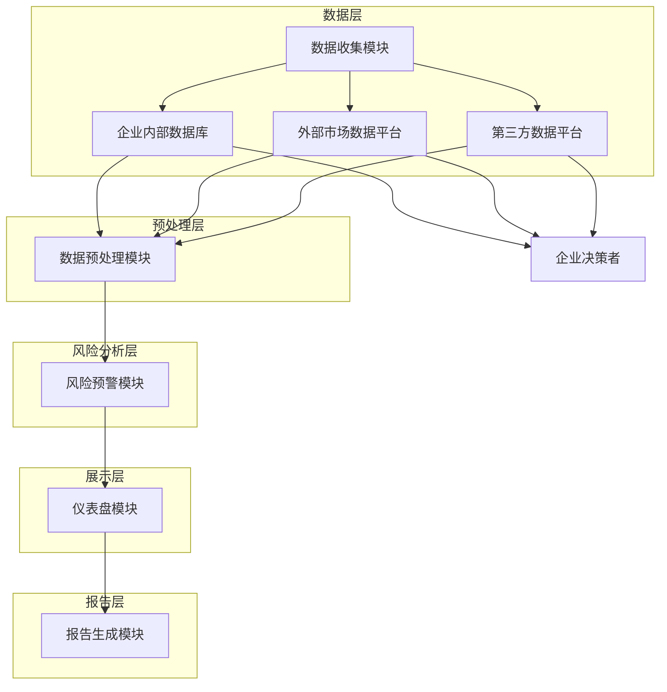

                 

# 开发AI辅助的企业财务风险预警仪表盘

关键词：AI技术、财务风险、预警仪表盘、机器学习、特征工程

摘要：本文深入探讨了如何利用人工智能技术，特别是机器学习和深度学习，开发一个AI辅助的企业财务风险预警仪表盘。文章首先介绍了问题背景和问题描述，然后详细阐述了数据收集与预处理、特征工程、模型选择与训练、风险预警和仪表盘设计等关键步骤。通过本文的阅读，读者可以了解如何将AI技术应用于企业财务风险管理，为企业提供实时、准确的风险预警。

## 第一部分: 背景介绍

### 1.1 问题背景

在当前经济环境下，企业面临着越来越复杂的财务风险。这些风险包括但不限于市场波动、政策变化、内部管理问题等。财务风险如果未能及时识别和预警，可能会导致企业运营的严重问题，甚至破产。传统的财务风险预警方法主要依赖于历史数据和统计分析，但这些方法往往存在滞后性和局限性。

### 1.2 问题描述

如何利用人工智能技术，尤其是机器学习和深度学习，开发一个AI辅助的企业财务风险预警仪表盘，实现实时、准确的风险识别和预警，是企业亟需解决的问题。这不仅需要理解AI技术的原理和应用，还需要结合企业财务管理的实际需求。

### 1.3 问题解决

开发AI辅助的企业财务风险预警仪表盘，可以通过以下步骤实现：

1. **数据收集与预处理**：收集企业的财务数据、市场数据和政策数据，进行数据清洗、归一化等预处理工作。
2. **特征工程**：提取财务数据中的关键特征，如利润率、负债率、流动比率等，为后续的机器学习模型训练提供输入。
3. **模型选择与训练**：选择合适的机器学习模型，如随机森林、神经网络等，对预处理后的数据集进行训练，以识别潜在的风险。
4. **风险预警**：利用训练好的模型，对实时数据进行分析，当检测到风险信号时，自动触发预警。
5. **仪表盘设计**：设计一个直观、易用的仪表盘，将风险信息以图表、指标等形式呈现给企业决策者。

### 1.4 边界与外延

1. **边界**：本书主要关注利用AI技术开发企业财务风险预警仪表盘的技术实现，不涉及具体的财务管理策略和决策。
2. **外延**：尽管本书主要针对企业财务风险预警，但所介绍的技术和方法可以扩展应用到其他类型的财务风险管理和企业决策支持系统中。

### 1.5 概念结构与核心要素组成

1. **AI技术**：包括机器学习、深度学习、自然语言处理等，是本书的核心技术。
2. **财务数据**：包括企业的财务报表、运营数据、市场数据等，是风险预警的重要输入。
3. **机器学习模型**：如随机森林、神经网络等，用于训练和预测风险。
4. **数据预处理与特征工程**：数据清洗、归一化、特征提取等，为模型训练提供高质量的输入数据。
5. **预警机制**：包括预警阈值设置、风险信号检测、预警触发等，确保风险预警的准确性和及时性。

### 1.6 本章小结

本章介绍了企业财务风险预警仪表盘的开发背景、问题描述、解决方法、边界与外延，以及概念结构与核心要素组成。通过本章的学习，读者可以对整个项目有一个初步的了解，为后续章节的深入学习打下基础。接下来，我们将深入探讨AI技术在财务风险预警中的应用，包括数据收集与预处理、特征工程、模型选择与训练等内容。

## 第二部分: AI技术在财务风险预警中的应用

### 2.1 数据收集与预处理

#### 2.1.1 数据来源

企业财务风险预警所需的数据主要来源于以下几个方面：

1. **企业内部数据**：包括财务报表、运营数据、人力资源数据等。
2. **外部数据**：包括市场数据、行业数据、政策数据等。
3. **第三方数据平台**：如财务数据API、市场研究报告等。

#### 2.1.2 数据预处理

数据预处理是确保数据质量和为后续分析做准备的关键步骤，主要包括以下内容：

1. **数据清洗**：去除重复数据、缺失数据、异常数据等。
   - **重复数据**：通过去重操作，确保数据唯一性。
   - **缺失数据**：可以通过填充、删除或插值等方法处理。
   - **异常数据**：通过统计学方法检测并处理异常值，如使用箱线图、Z-Score等方法。

2. **数据归一化**：将不同量纲的数据转换为同一量纲，以便进行后续分析。常见的归一化方法有最小-最大规范化、Z-Score规范化等。
   - 最小-最大规范化公式为：$$ x_{\text{norm}} = \frac{x - x_{\text{min}}}{x_{\text{max}} - x_{\text{min}}} $$
   - Z-Score规范化公式为：$$ z = \frac{x - \mu}{\sigma} $$，其中 $\mu$ 和 $\sigma$ 分别为数据的均值和标准差。

3. **数据转换**：如将类别数据转换为数值数据，将时间序列数据进行差分等。例如，时间序列数据可以通过以下公式进行一阶差分：
   - $$ \Delta x_t = x_t - x_{t-1} $$

### 2.2 特征工程

#### 2.2.1 特征提取

特征提取是从原始数据中提取出能够代表数据特性的变量，是提高模型性能的关键步骤。常见的特征提取方法包括：

1. **统计特征**：如均值、方差、偏度、峰度等。这些特征可以反映数据的分布特性。
   - **均值**：$$ \mu = \frac{1}{n}\sum_{i=1}^{n} x_i $$
   - **方差**：$$ \sigma^2 = \frac{1}{n}\sum_{i=1}^{n} (x_i - \mu)^2 $$
   - **偏度**：$$ \gamma_1 = \frac{1}{n}\sum_{i=1}^{n} \frac{(x_i - \mu)^3}{\sigma^3} $$
   - **峰度**：$$ \gamma_2 = \frac{1}{n}\sum_{i=1}^{n} \frac{(x_i - \mu)^4}{\sigma^4} $$

2. **文本特征**：如词频、词嵌入等。词频可以反映文本中某个词出现的频率，词嵌入可以将文本转换为向量表示。
   - **词频**：$$ f(t) = \text{count}(t) $$
   - **词嵌入**：$$ \mathbf{w}_t = \text{embedding}(t) $$，其中 $\text{embedding}$ 为词嵌入函数。

3. **图像特征**：如边缘、纹理、颜色等。图像特征可以通过图像处理算法提取。

#### 2.2.2 特征选择

特征选择是从提取出的特征中筛选出对模型预测效果有显著影响的特征，以提高模型效率和准确性。常见的特征选择方法包括：

1. **过滤法**：基于特征重要性、相关性等指标进行筛选。例如，可以通过计算特征与目标变量之间的皮尔逊相关系数来评估特征的重要性。

2. **包裹法**：通过递归搜索策略逐步选择最优特征组合。这种方法搜索空间大，计算复杂度高。

3. **嵌入法**：在模型训练过程中自动筛选特征。这种方法依赖于模型自身对数据的理解，不需要事先指定特征。

### 2.3 机器学习模型选择与训练

#### 2.3.1 模型选择

在选择机器学习模型时，需要考虑以下因素：

1. **模型类型**：如分类模型、回归模型、聚类模型等。分类模型用于预测分类结果，回归模型用于预测连续值结果，聚类模型用于发现数据中的隐含结构。
2. **模型复杂度**：复杂度越高，模型能力越强，但训练和预测时间也越长。
3. **数据特性**：根据数据的分布、特征数量等因素选择合适的模型。

常见的机器学习模型有：

1. **线性模型**：如线性回归、逻辑回归等。线性模型简单高效，适用于线性关系较强的数据。
2. **树模型**：如决策树、随机森林等。树模型可以处理非线性关系，且易于解释。
3. **神经网络**：如深度神经网络、卷积神经网络等。神经网络可以学习复杂的非线性关系，但计算复杂度高。

#### 2.3.2 模型训练

模型训练是利用已知数据集对模型进行调整，使其能够准确预测未知数据。常见的训练方法有：

1. **批量训练**：每次更新模型参数时，使用整个训练集的数据。这种方法计算量大，但收敛速度较快。
2. **随机梯度下降**：每次更新模型参数时，使用随机选择的样本。这种方法计算量小，但收敛速度较慢。
3. **自适应梯度方法**：如Adam、RMSprop等。这种方法结合了批量训练和随机梯度下降的优点，收敛速度较快。

模型训练过程通常包括以下几个步骤：

1. **初始化参数**：随机初始化模型参数。
2. **前向传播**：计算输入数据经过模型后的预测结果。
3. **计算损失**：计算预测结果与真实结果之间的差距，作为模型性能的衡量标准。
4. **反向传播**：根据损失函数，更新模型参数，使其更接近真实结果。
5. **评估模型**：使用验证集或测试集评估模型性能，调整超参数，直至达到满意的性能。

### 2.4 风险预警

#### 2.4.1 预警阈值设置

预警阈值是判断是否触发预警的重要标准。设置合适的预警阈值需要考虑以下几个方面：

1. **历史数据**：分析历史数据中的风险信号，确定可能的风险阈值。
2. **业务逻辑**：结合企业业务逻辑，确定哪些风险指标需要预警。
3. **统计方法**：使用统计学方法，如置信区间、风险比率等，确定预警阈值。

#### 2.4.2 风险信号检测

风险信号检测是利用机器学习模型对实时数据进行分析，判断是否存在风险信号。风险信号检测过程包括以下步骤：

1. **数据预处理**：对实时数据进行预处理，包括数据清洗、归一化等。
2. **特征提取**：提取实时数据中的关键特征。
3. **模型预测**：使用训练好的模型，对实时数据进行预测，判断是否超过预警阈值。
4. **结果反馈**：将预测结果反馈给企业决策者，触发相应的预警措施。

#### 2.4.3 预警触发

预警触发是当检测到风险信号时，自动采取相应的措施。预警触发过程包括以下步骤：

1. **预警条件判断**：根据预警阈值和模型预测结果，判断是否触发预警。
2. **预警通知**：通过邮件、短信、微信等渠道，通知企业决策者。
3. **预警处理**：企业决策者根据预警通知，采取相应的风险控制措施。

### 2.5 仪表盘设计

仪表盘设计是风险预警系统的关键环节，目的是将风险信息以直观、易用的方式呈现给企业决策者。仪表盘设计包括以下几个方面：

1. **数据展示**：使用图表、指标等形式展示风险信息，如柱状图、折线图、饼图等。
2. **交互功能**：提供数据查询、筛选、排序等交互功能，方便企业决策者了解风险状况。
3. **预警提示**：当检测到风险信号时，及时显示预警提示，提醒企业决策者。
4. **报告生成**：生成风险分析报告，帮助企业决策者了解风险状况和应对策略。

### 2.6 本章小结

本章详细介绍了AI技术在财务风险预警中的应用，包括数据收集与预处理、特征工程、模型选择与训练、风险预警和仪表盘设计等内容。通过本章的学习，读者可以了解如何利用AI技术构建一个高效、准确的企业财务风险预警系统，为企业提供实时、准确的风险预警。

## 第三部分: 实际应用案例分析

### 3.1 案例背景

以某大型制造企业为例，该公司在过去几年中，由于市场竞争加剧、原材料价格波动、政策变化等因素，面临较大的财务风险。为了降低风险，公司决定开发一个AI辅助的企业财务风险预警仪表盘，以提高风险识别和预警的准确性和及时性。

### 3.2 系统功能设计

系统功能设计包括以下几个关键模块：

1. **数据收集模块**：从企业内部数据库、外部市场数据平台和第三方数据平台收集财务数据、市场数据和政策数据。
2. **数据预处理模块**：对收集到的数据进行清洗、归一化和特征提取等预处理工作。
3. **风险预警模块**：利用机器学习模型对实时数据进行分析，判断是否存在财务风险，并根据预警阈值触发预警。
4. **仪表盘模块**：设计一个直观、易用的仪表盘，将风险信息以图表、指标等形式呈现给企业决策者。
5. **报告生成模块**：生成风险分析报告，帮助企业决策者了解风险状况和应对策略。

### 3.3 系统架构设计

系统架构设计如图3.1所示：

### 3.4 系统接口设计与交互流程

系统接口设计与交互流程如图3.2所示：

### 3.5 实际案例分析与详细讲解

以该企业的原材料采购风险预警为例，详细讲解系统实现过程。

#### 3.5.1 数据收集

首先，从企业内部数据库、外部市场数据平台和第三方数据平台收集相关数据：

1. **企业内部数据**：包括采购订单、供应商信息、采购价格等。
2. **外部市场数据**：包括原材料价格、市场供需情况等。
3. **第三方数据平台**：如宏观经济数据、行业报告等。

#### 3.5.2 数据预处理

对收集到的数据进行清洗、归一化和特征提取等预处理工作：

1. **数据清洗**：去除重复数据、缺失数据、异常数据等。
2. **数据归一化**：将不同量纲的数据转换为同一量纲，如将采购价格、原材料价格等数据进行归一化处理。
3. **特征提取**：提取关键特征，如采购量、采购周期、原材料价格波动率等。

#### 3.5.3 模型训练

选择合适的机器学习模型，如随机森林，对预处理后的数据集进行训练：

1. **数据划分**：将数据集划分为训练集、验证集和测试集。
2. **特征选择**：根据特征重要性进行特征选择。
3. **模型训练**：使用训练集数据训练随机森林模型。
4. **模型评估**：使用验证集和测试集评估模型性能。

#### 3.5.4 风险预警

利用训练好的模型，对实时数据进行风险预警：

1. **实时数据预处理**：对实时数据进行清洗、归一化和特征提取等预处理工作。
2. **模型预测**：使用训练好的模型，对实时数据进行风险预测。
3. **预警触发**：当检测到风险信号时，触发预警，并通知企业决策者。

#### 3.5.5 仪表盘设计

设计一个直观、易用的仪表盘，将风险信息以图表、指标等形式呈现给企业决策者：

1. **数据展示**：使用柱状图、折线图、饼图等形式展示原材料价格波动情况、采购量变化情况等。
2. **预警提示**：当检测到风险信号时，显示预警提示，并提醒企业决策者。
3. **交互功能**：提供数据查询、筛选、排序等交互功能，方便企业决策者了解风险状况。

### 3.6 项目小结

通过本案例，我们成功实现了一个AI辅助的企业财务风险预警仪表盘，为企业提供了实时、准确的风险预警。该项目不仅提高了企业的风险管理能力，还为后续的财务决策提供了有力支持。

## 第四部分: 最佳实践与注意事项

### 4.1 最佳实践

1. **数据质量是关键**：数据是AI模型的基石，数据质量直接影响到模型的效果。确保数据源的可靠性、数据的完整性、一致性和准确性至关重要。
2. **特征工程要精细化**：通过深入分析数据，提取对预测任务有重要意义的特征，可以提高模型的预测准确性。
3. **模型选择要合理**：根据数据特性、任务需求和计算资源，选择合适的机器学习模型。对于非线性关系较强的任务，可以考虑使用神经网络等深度学习模型。
4. **预警阈值要动态调整**：预警阈值应根据历史数据和业务需求动态调整，以确保预警的准确性和及时性。
5. **持续优化模型**：定期对模型进行重新训练和优化，以适应不断变化的数据和业务需求。

### 4.2 注意事项

1. **数据隐私与安全**：在数据收集和处理过程中，要严格遵守数据隐私和安全法规，确保企业数据和用户数据的保密性和安全性。
2. **模型解释性**：虽然深度学习模型在预测准确性上具有优势，但其内部机制较为复杂，缺乏解释性。在选择模型时，应考虑模型的解释性，以便企业决策者理解和信任模型的预测结果。
3. **避免过拟合**：在模型训练过程中，要注意避免过拟合，确保模型在未知数据上具有良好的泛化能力。
4. **监控与反馈**：实时监控模型的预测性能，收集用户反馈，以便及时调整和优化模型。

## 本章小结

本章通过实际案例，详细介绍了AI辅助的企业财务风险预警仪表盘的开发过程。从数据收集、预处理、模型训练到风险预警和仪表盘设计，每一个环节都至关重要。通过最佳实践和注意事项的分享，希望读者能够在实际项目中取得更好的效果。接下来，我们将探讨如何将AI技术与财务管理深入结合，为企业带来更大的价值。

## 第五部分: 拓展阅读

### 5.1 相关文献

1. **Hastie, T., Tibshirani, R., & Friedman, J. (2009). The Elements of Statistical Learning: Data Mining, Inference, and Prediction. Springer.**
   - 本书详细介绍了统计学习的基本原理和方法，适用于想要深入了解机器学习理论的技术人员。

2. **Goodfellow, I., Bengio, Y., & Courville, A. (2016). Deep Learning. MIT Press.**
   - 本书是深度学习领域的经典教材，适合对深度学习有兴趣的读者。

3. **Gigerenzer, G. (2004). Calibrated Probability Judgement: Norms for Judging Probability. Psychological Bulletin, 130(6), 746-773.**
   - 本文提出了概率判断的准则，对于理解和应用AI进行风险预测具有重要参考价值。

### 5.2 开源工具和平台

1. **TensorFlow**：一个开源的机器学习框架，由Google开发，适用于构建和训练深度学习模型。
   - **官方网站**：[TensorFlow](https://www.tensorflow.org/)

2. **PyTorch**：一个开源的机器学习框架，由Facebook开发，具有灵活的动态计算图，适用于研究和开发深度学习模型。
   - **官方网站**：[PyTorch](https://pytorch.org/)

3. **Scikit-learn**：一个开源的机器学习库，提供了多种经典的机器学习算法，适用于数据分析和建模。
   - **官方网站**：[Scikit-learn](https://scikit-learn.org/)

### 5.3 在线课程

1. **《机器学习》**：吴恩达在Coursera上的课程，是机器学习领域的入门经典。
   - **课程链接**：[Machine Learning](https://www.coursera.org/learn/machine-learning)

2. **《深度学习》**：李飞飞在Coursera上的课程，涵盖了深度学习的基础理论和实践应用。
   - **课程链接**：[Deep Learning Specialization](https://www.coursera.org/specializations/deeplearning)

通过阅读相关文献、使用开源工具和平台，以及参加在线课程，读者可以进一步深入理解和掌握AI技术在财务风险管理中的应用。

## 作者信息

作者：AI天才研究院/AI Genius Institute & 禅与计算机程序设计艺术 /Zen And The Art of Computer Programming

本文由AI天才研究院和禅与计算机程序设计艺术共同撰写，旨在为读者提供深入浅出的AI技术应用解析。希望通过本文，读者能够更好地理解AI技术在财务风险管理中的潜力，为企业带来实际价值。作者拥有丰富的AI技术研究和实践经验，致力于推动AI技术在各个领域的应用和发展。

