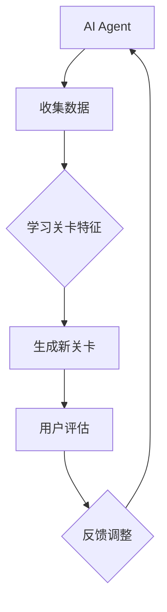
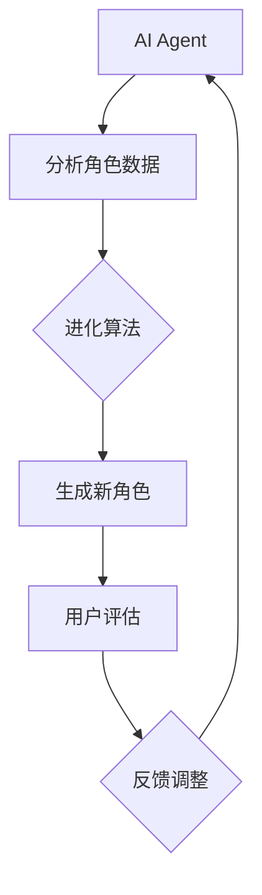
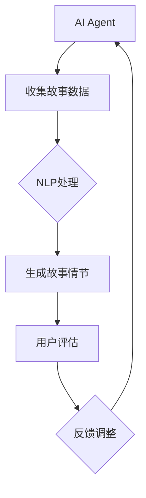
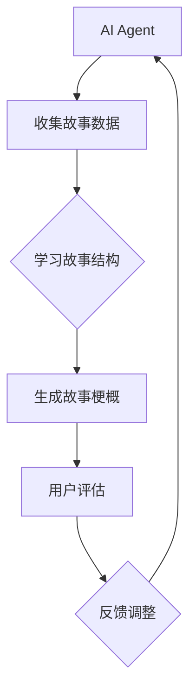
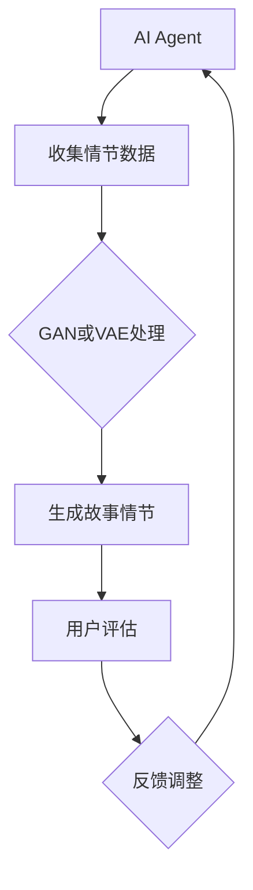
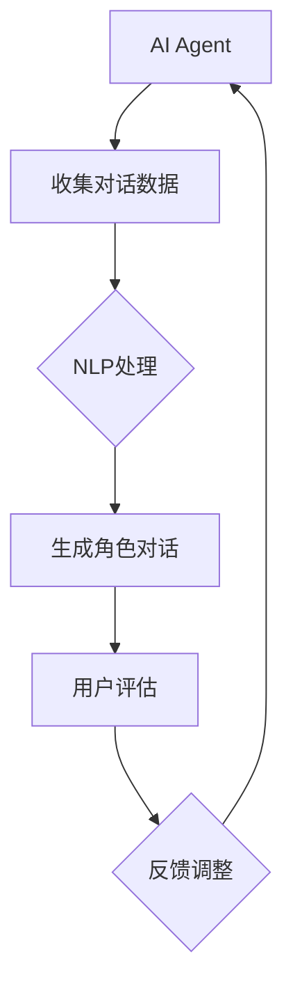
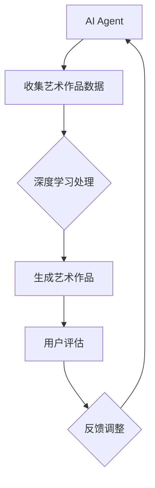
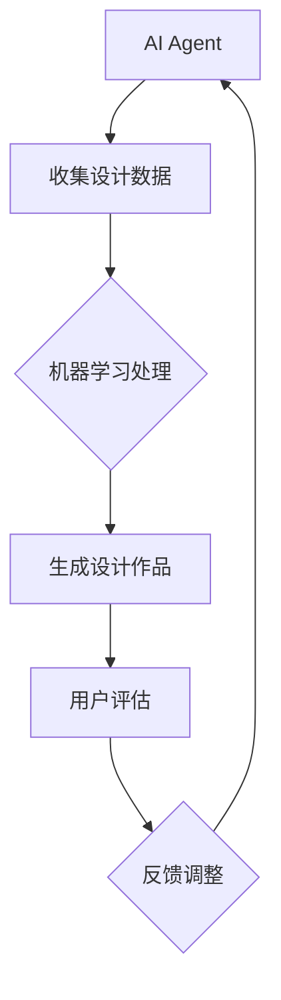
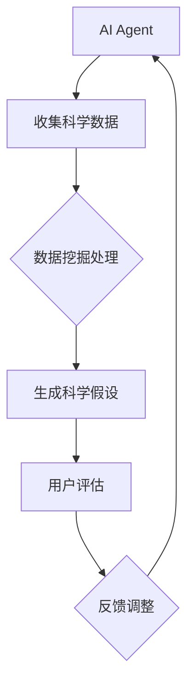

                 

### 第一部分：引言

#### 第1章：问题背景与核心概念

##### 1.1.1 问题背景

随着人工智能技术的迅猛发展，AI Agent作为一种具有自主决策能力的智能体，正在逐步渗透到我们的日常生活中。无论是智能家居、自动驾驶、智能客服，还是更为复杂的任务，如自主游戏、创意写作等，AI Agent的应用场景正日益扩大。然而，面对复杂多变的环境和问题，AI Agent的问题解决能力成为了一个备受关注的焦点。传统的AI Agent往往依赖于既定的规则和算法模型，但在面对一些需要创造性思维的问题时，它们的表现却显得力不从心。因此，研究如何开发具有创造性问题解决能力的AI Agent，对于推动人工智能技术的发展具有重要的意义。

##### 1.1.2 核心概念

- **AI Agent**：指具有感知、决策、执行等能力，能够自主运行并实现特定任务的智能体。它通过与环境交互，不断学习和适应，以实现其目标。
- **创造性问题解决能力**：指AI Agent在面对复杂、未遇到过的问题时，能够通过新颖的思路和解决方案来解决问题的能力。

##### 1.1.3 目标读者

本文旨在为对AI Agent及其创造性问题解决能力有兴趣的技术人员和研究人员提供深入的理解和实用的指导。无论是初入行的开发者，还是经验丰富的AI专家，都可以从中获得有价值的知识。

### 第2章：AI Agent的基础知识

#### 2.1.1 AI Agent的架构与功能

AI Agent的基本架构通常包括感知模块、决策模块和执行模块。感知模块负责获取环境信息；决策模块根据感知到的信息，结合已有的知识和策略，生成行动计划；执行模块则负责实施这些计划。这种结构使得AI Agent能够在复杂的环境中自主运行。

- **感知模块**：通常包含传感器和数据采集器，用于获取环境信息。
- **决策模块**：包括状态评估、规划、策略学习等，是AI Agent的核心部分。
- **执行模块**：负责执行决策模块生成的行动计划，通过控制执行器来实现。

##### 2.1.2 AI Agent的类型

AI Agent可以基于不同的方法进行分类，常见的有以下几种：

- **基于规则的方法**：这种方法的AI Agent通过一组预定义的规则来决策。当感知到特定输入时，系统会查找匹配的规则并执行相应的动作。
- **基于学习的方法**：这种方法的AI Agent通过从数据中学习，自动生成决策规则。常见的包括监督学习、无监督学习和强化学习。
- **混合方法**：结合了规则和学习的优点，既能利用预定义的规则，又能通过学习来优化和扩展这些规则。

##### 2.1.3 AI Agent的核心技术

AI Agent的核心技术主要包括自然语言处理、机器学习和逻辑推理。

- **自然语言处理（NLP）**：使AI Agent能够理解、生成和处理自然语言，是AI Agent与人类交互的重要手段。
- **机器学习（ML）**：使AI Agent能够从数据中学习，提高其自主学习和适应能力。
- **逻辑推理**：提供了一种形式化的方法来表示和处理知识，是AI Agent进行复杂决策的重要工具。

#### 第3章：创造性问题解决能力

##### 3.1.1 创造性概念及其在AI中的应用

- **创造性**：指产生新颖、独特思想的能力。在AI中，创造性主要体现在AI Agent能够生成新的解决方案或策略，这些解决方案或策略在给定的环境中是前所未有的。
- **重要性**：创造性问题解决能力是AI Agent在复杂、动态环境中取得成功的关键。传统的方法往往依赖于已知的规律和模式，而创造性则能够帮助AI Agent在面对未知的挑战时，找到新的解决方案。

##### 3.1.2 创造性问题解决能力的要素

- **知识表示**：创造性问题解决能力的实现需要强大的知识表示能力。这包括对问题领域的深入理解，以及对相关知识的有效组织和存储。
- **算法设计**：设计能够支持创造性的算法是关键。这些算法应能够从大量数据中提取有用的信息，并在此基础上生成新的解决方案。
- **用户交互**：用户交互是创造性问题解决能力的重要组成部分。通过收集用户反馈，AI Agent可以不断优化其解决方案，提高其创造性。

##### 3.1.3 创造性问题解决能力的实现

- **案例分析**：通过对实际案例的分析，我们可以看到，创造性问题解决能力在许多领域都有着成功的应用。例如，在游戏设计中，创造性AI能够生成新的关卡和挑战；在创意写作中，AI能够生成新颖的故事和情节。
- **实现方法**：实现创造性问题解决能力的方法多种多样，包括基于规则的创造性算法、基于学习的创造性算法，以及结合多种方法的混合算法。

#### 第4章：开发具有创造性问题解决能力的AI Agent

##### 4.1.1 开发流程与方法

开发具有创造性问题解决能力的AI Agent需要遵循科学的方法和流程。通常包括以下几个步骤：

1. **需求分析**：明确AI Agent的应用场景和目标，确定其应具备的功能和性能指标。
2. **系统设计**：设计AI Agent的架构，包括感知模块、决策模块和执行模块等。
3. **实现与测试**：根据设计文档，编写代码并测试，确保AI Agent能够稳定、高效地运行。

##### 4.1.2 技术选型

在开发具有创造性问题解决能力的AI Agent时，技术选型至关重要。以下是一些常见的技术选型：

- **硬件环境**：选择适合AI Agent运行的硬件平台，如高性能的CPU、GPU等。
- **软件工具**：使用适合的编程语言和开发工具，如Python、TensorFlow等。

##### 4.1.3 开发实例

为了更好地说明开发具有创造性问题解决能力的AI Agent的具体过程，我们将以一个实际案例为例，详细讲解其实现思路和代码示例。

#### 第5章：创造性AI Agent的应用场景

##### 5.1.1 创造性在游戏设计中的应用

在游戏设计中，创造性AI Agent可以用于生成新的关卡、角色和故事情节，从而提高游戏的可玩性和趣味性。以下是一个简单的实现思路：

1. **数据收集**：收集与游戏相关的数据，如角色属性、关卡布局、故事情节等。
2. **知识表示**：使用图数据库或知识图谱来表示这些数据，以便AI Agent能够快速检索和利用。
3. **算法设计**：设计基于强化学习的算法，使AI Agent能够在与游戏环境交互的过程中，不断优化其生成策略。

##### 5.1.2 创造性在创意写作中的应用

在创意写作中，创造性AI Agent可以用于生成新的故事和情节，帮助作者克服创作瓶颈。以下是一个简单的实现思路：

1. **数据收集**：收集大量的故事文本数据，包括小说、电影剧本、短篇故事等。
2. **知识表示**：使用自然语言处理技术，将文本数据转换为结构化的知识表示，如词嵌入、语法树等。
3. **算法设计**：设计基于生成对抗网络（GAN）的算法，使AI Agent能够生成新颖、有趣的故事。

##### 5.1.3 创造性在其他领域的应用

创造性AI Agent不仅可以在游戏设计和创意写作中发挥作用，还可以应用于其他领域，如工业设计、艺术创作等。以下是一个简单的实现思路：

1. **数据收集**：收集与领域相关的数据，如产品外观设计、艺术作品等。
2. **知识表示**：使用深度学习技术，将数据转换为高维特征表示。
3. **算法设计**：设计基于变分自编码器（VAE）或生成式对抗网络（GAN）的算法，使AI Agent能够生成新颖的设计或艺术作品。

#### 第6章：创造性AI Agent的未来发展趋势

##### 6.1.1 技术发展趋势

随着人工智能技术的不断进步，创造性AI Agent的未来发展趋势将包括：

1. **算法创新**：不断优化和创新的算法，如深度强化学习、生成式对抗网络等，将进一步提升AI Agent的创造性问题解决能力。
2. **多模态融合**：融合多种数据类型，如图像、声音、文本等，使AI Agent能够更全面地理解问题，提高其创造性。

##### 6.1.2 应用领域拓展

创造性AI Agent在未来的应用前景将更加广泛，包括但不限于：

1. **智能创作**：在文学、艺术、音乐等领域，AI Agent将能够成为人类的创作伙伴，共同推动文化的繁荣。
2. **智能设计**：在工业设计、建筑设计等领域，AI Agent将能够生成新颖的设计方案，提高设计效率和质量。

##### 6.1.3 挑战与机遇

虽然创造性AI Agent具有广阔的应用前景，但其在发展过程中也将面临一些挑战：

1. **算法复杂性**：创造性的实现需要复杂的算法和大量的计算资源，这对算法设计和硬件设施提出了更高的要求。
2. **数据质量**：高质量的训练数据对于AI Agent的学习和创造性至关重要，数据质量和数量的不足将限制其发展。

然而，这些挑战同时也为创新和突破提供了机遇。通过不断探索和研究，我们有望克服这些挑战，推动创造性AI Agent的发展。

### 第7章：小结与展望

通过对AI Agent及其创造性问题解决能力的深入探讨，我们不仅了解了其核心概念和实现方法，还看到了其在未来可能的应用场景和趋势。开发具有创造性问题解决能力的AI Agent，不仅能够提升AI在复杂环境中的适应能力，还能够为人类带来更多的便利和创新。未来，随着技术的不断进步，创造性AI Agent将在更多领域发挥重要作用，成为人类智慧的延伸。

## 引言

### 第1章：问题背景与核心概念

#### 1.1.1 问题背景

随着人工智能技术的迅猛发展，AI Agent作为一种具有自主决策能力的智能体，正在逐步渗透到我们的日常生活中。无论是智能家居、自动驾驶、智能客服，还是更为复杂的任务，如自主游戏、创意写作等，AI Agent的应用场景正日益扩大。然而，面对复杂多变的环境和问题，AI Agent的问题解决能力成为了一个备受关注的焦点。传统的AI Agent往往依赖于既定的规则和算法模型，但在面对一些需要创造性思维的问题时，它们的表现却显得力不从心。因此，研究如何开发具有创造性问题解决能力的AI Agent，对于推动人工智能技术的发展具有重要的意义。

##### 1.1.2 核心概念

- **AI Agent**：指具有感知、决策、执行等能力，能够自主运行并实现特定任务的智能体。它通过与环境交互，不断学习和适应，以实现其目标。
- **创造性问题解决能力**：指AI Agent在面对复杂、未遇到过的问题时，能够通过新颖的思路和解决方案来解决问题的能力。

##### 1.1.3 目标读者

本文旨在为对AI Agent及其创造性问题解决能力有兴趣的技术人员和研究人员提供深入的理解和实用的指导。无论是初入行的开发者，还是经验丰富的AI专家，都可以从中获得有价值的知识。

### 第2章：AI Agent的基础知识

#### 2.1.1 AI Agent的架构与功能

AI Agent的基本架构通常包括感知模块、决策模块和执行模块。感知模块负责获取环境信息；决策模块根据感知到的信息，结合已有的知识和策略，生成行动计划；执行模块则负责实施这些计划。这种结构使得AI Agent能够在复杂的环境中自主运行。

- **感知模块**：通常包含传感器和数据采集器，用于获取环境信息。
- **决策模块**：包括状态评估、规划、策略学习等，是AI Agent的核心部分。
- **执行模块**：负责执行决策模块生成的行动计划，通过控制执行器来实现。

##### 2.1.2 AI Agent的类型

AI Agent可以基于不同的方法进行分类，常见的有以下几种：

- **基于规则的方法**：这种方法的AI Agent通过一组预定义的规则来决策。当感知到特定输入时，系统会查找匹配的规则并执行相应的动作。
- **基于学习的方法**：这种方法的AI Agent通过从数据中学习，自动生成决策规则。常见的包括监督学习、无监督学习和强化学习。
- **混合方法**：结合了规则和学习的优点，既能利用预定义的规则，又能通过学习来优化和扩展这些规则。

##### 2.1.3 AI Agent的核心技术

AI Agent的核心技术主要包括自然语言处理、机器学习和逻辑推理。

- **自然语言处理（NLP）**：使AI Agent能够理解、生成和处理自然语言，是AI Agent与人类交互的重要手段。
- **机器学习（ML）**：使AI Agent能够从数据中学习，提高其自主学习和适应能力。
- **逻辑推理**：提供了一种形式化的方法来表示和处理知识，是AI Agent进行复杂决策的重要工具。

#### 第3章：创造性问题解决能力

##### 3.1.1 创造性概念及其在AI中的应用

- **创造性**：指产生新颖、独特思想的能力。在AI中，创造性主要体现在AI Agent能够生成新的解决方案或策略，这些解决方案或策略在给定的环境中是前所未有的。
- **重要性**：创造性问题解决能力是AI Agent在复杂、动态环境中取得成功的关键。传统的方法往往依赖于已知的规律和模式，而创造性则能够帮助AI Agent在面对未知的挑战时，找到新的解决方案。

##### 3.1.2 创造性问题解决能力的要素

- **知识表示**：创造性问题解决能力的实现需要强大的知识表示能力。这包括对问题领域的深入理解，以及对相关知识的有效组织和存储。
- **算法设计**：设计能够支持创造性的算法是关键。这些算法应能够从大量数据中提取有用的信息，并在此基础上生成新的解决方案。
- **用户交互**：用户交互是创造性问题解决能力的重要组成部分。通过收集用户反馈，AI Agent可以不断优化其解决方案，提高其创造性。

##### 3.1.3 创造性问题解决能力的实现

- **案例分析**：通过对实际案例的分析，我们可以看到，创造性问题解决能力在许多领域都有着成功的应用。例如，在游戏设计中，创造性AI能够生成新的关卡和挑战；在创意写作中，AI能够生成新颖的故事和情节。
- **实现方法**：实现创造性问题解决能力的方法多种多样，包括基于规则的创造性算法、基于学习的创造性算法，以及结合多种方法的混合算法。

#### 第4章：开发具有创造性问题解决能力的AI Agent

##### 4.1.1 开发流程与方法

开发具有创造性问题解决能力的AI Agent需要遵循科学的方法和流程。通常包括以下几个步骤：

1. **需求分析**：明确AI Agent的应用场景和目标，确定其应具备的功能和性能指标。
2. **系统设计**：设计AI Agent的架构，包括感知模块、决策模块和执行模块等。
3. **实现与测试**：根据设计文档，编写代码并测试，确保AI Agent能够稳定、高效地运行。

##### 4.1.2 技术选型

在开发具有创造性问题解决能力的AI Agent时，技术选型至关重要。以下是一些常见的技术选型：

- **硬件环境**：选择适合AI Agent运行的硬件平台，如高性能的CPU、GPU等。
- **软件工具**：使用适合的编程语言和开发工具，如Python、TensorFlow等。

##### 4.1.3 开发实例

为了更好地说明开发具有创造性问题解决能力的AI Agent的具体过程，我们将以一个实际案例为例，详细讲解其实现思路和代码示例。

#### 第5章：创造性AI Agent的应用场景

##### 5.1.1 创造性在游戏设计中的应用

在游戏设计中，创造性AI Agent可以用于生成新的关卡、角色和故事情节，从而提高游戏的可玩性和趣味性。以下是一个简单的实现思路：

1. **数据收集**：收集与游戏相关的数据，如角色属性、关卡布局、故事情节等。
2. **知识表示**：使用图数据库或知识图谱来表示这些数据，以便AI Agent能够快速检索和利用。
3. **算法设计**：设计基于强化学习的算法，使AI Agent能够在与游戏环境交互的过程中，不断优化其生成策略。

##### 5.1.2 创造性在创意写作中的应用

在创意写作中，创造性AI Agent可以用于生成新的故事和情节，帮助作者克服创作瓶颈。以下是一个简单的实现思路：

1. **数据收集**：收集大量的故事文本数据，包括小说、电影剧本、短篇故事等。
2. **知识表示**：使用自然语言处理技术，将文本数据转换为结构化的知识表示，如词嵌入、语法树等。
3. **算法设计**：设计基于生成对抗网络（GAN）的算法，使AI Agent能够生成新颖、有趣的故事。

##### 5.1.3 创造性在其他领域的应用

创造性AI Agent不仅可以在游戏设计和创意写作中发挥作用，还可以应用于其他领域，如工业设计、艺术创作等。以下是一个简单的实现思路：

1. **数据收集**：收集与领域相关的数据，如产品外观设计、艺术作品等。
2. **知识表示**：使用深度学习技术，将数据转换为高维特征表示。
3. **算法设计**：设计基于变分自编码器（VAE）或生成式对抗网络（GAN）的算法，使AI Agent能够生成新颖的设计或艺术作品。

#### 第6章：创造性AI Agent的未来发展趋势

##### 6.1.1 技术发展趋势

随着人工智能技术的不断进步，创造性AI Agent的未来发展趋势将包括：

1. **算法创新**：不断优化和创新的算法，如深度强化学习、生成式对抗网络等，将进一步提升AI Agent的创造性问题解决能力。
2. **多模态融合**：融合多种数据类型，如图像、声音、文本等，使AI Agent能够更全面地理解问题，提高其创造性。

##### 6.1.2 应用领域拓展

创造性AI Agent在未来的应用前景将更加广泛，包括但不限于：

1. **智能创作**：在文学、艺术、音乐等领域，AI Agent将能够成为人类的创作伙伴，共同推动文化的繁荣。
2. **智能设计**：在工业设计、建筑设计等领域，AI Agent将能够生成新颖的设计方案，提高设计效率和质量。

##### 6.1.3 挑战与机遇

虽然创造性AI Agent具有广阔的应用前景，但其在发展过程中也将面临一些挑战：

1. **算法复杂性**：创造性的实现需要复杂的算法和大量的计算资源，这对算法设计和硬件设施提出了更高的要求。
2. **数据质量**：高质量的训练数据对于AI Agent的学习和创造性至关重要，数据质量和数量的不足将限制其发展。

然而，这些挑战同时也为创新和突破提供了机遇。通过不断探索和研究，我们有望克服这些挑战，推动创造性AI Agent的发展。

### 第7章：小结与展望

通过对AI Agent及其创造性问题解决能力的深入探讨，我们不仅了解了其核心概念和实现方法，还看到了其在未来可能的应用场景和趋势。开发具有创造性问题解决能力的AI Agent，不仅能够提升AI在复杂环境中的适应能力，还能够为人类带来更多的便利和创新。未来，随着技术的不断进步，创造性AI Agent将在更多领域发挥重要作用，成为人类智慧的延伸。

## 引言

### 第1章：问题背景与核心概念

#### 1.1.1 问题背景

随着人工智能技术的迅猛发展，AI Agent作为一种具有自主决策能力的智能体，正在逐步渗透到我们的日常生活中。无论是智能家居、自动驾驶、智能客服，还是更为复杂的任务，如自主游戏、创意写作等，AI Agent的应用场景正日益扩大。然而，面对复杂多变的环境和问题，AI Agent的问题解决能力成为了一个备受关注的焦点。传统的AI Agent往往依赖于既定的规则和算法模型，但在面对一些需要创造性思维的问题时，它们的表现却显得力不从心。因此，研究如何开发具有创造性问题解决能力的AI Agent，对于推动人工智能技术的发展具有重要的意义。

##### 1.1.2 核心概念

- **AI Agent**：指具有感知、决策、执行等能力，能够自主运行并实现特定任务的智能体。它通过与环境交互，不断学习和适应，以实现其目标。
- **创造性问题解决能力**：指AI Agent在面对复杂、未遇到过的问题时，能够通过新颖的思路和解决方案来解决问题的能力。

##### 1.1.3 目标读者

本文旨在为对AI Agent及其创造性问题解决能力有兴趣的技术人员和研究人员提供深入的理解和实用的指导。无论是初入行的开发者，还是经验丰富的AI专家，都可以从中获得有价值的知识。

### 第2章：AI Agent的基础知识

#### 2.1.1 AI Agent的架构与功能

AI Agent的基本架构通常包括感知模块、决策模块和执行模块。感知模块负责获取环境信息；决策模块根据感知到的信息，结合已有的知识和策略，生成行动计划；执行模块则负责实施这些计划。这种结构使得AI Agent能够在复杂的环境中自主运行。

- **感知模块**：通常包含传感器和数据采集器，用于获取环境信息。
- **决策模块**：包括状态评估、规划、策略学习等，是AI Agent的核心部分。
- **执行模块**：负责执行决策模块生成的行动计划，通过控制执行器来实现。

##### 2.1.2 AI Agent的类型

AI Agent可以基于不同的方法进行分类，常见的有以下几种：

- **基于规则的方法**：这种方法的AI Agent通过一组预定义的规则来决策。当感知到特定输入时，系统会查找匹配的规则并执行相应的动作。
- **基于学习的方法**：这种方法的AI Agent通过从数据中学习，自动生成决策规则。常见的包括监督学习、无监督学习和强化学习。
- **混合方法**：结合了规则和学习的优点，既能利用预定义的规则，又能通过学习来优化和扩展这些规则。

##### 2.1.3 AI Agent的核心技术

AI Agent的核心技术主要包括自然语言处理、机器学习和逻辑推理。

- **自然语言处理（NLP）**：使AI Agent能够理解、生成和处理自然语言，是AI Agent与人类交互的重要手段。
- **机器学习（ML）**：使AI Agent能够从数据中学习，提高其自主学习和适应能力。
- **逻辑推理**：提供了一种形式化的方法来表示和处理知识，是AI Agent进行复杂决策的重要工具。

#### 第3章：创造性问题解决能力

##### 3.1.1 创造性概念及其在AI中的应用

- **创造性**：指产生新颖、独特思想的能力。在AI中，创造性主要体现在AI Agent能够生成新的解决方案或策略，这些解决方案或策略在给定的环境中是前所未有的。
- **重要性**：创造性问题解决能力是AI Agent在复杂、动态环境中取得成功的关键。传统的方法往往依赖于已知的规律和模式，而创造性则能够帮助AI Agent在面对未知的挑战时，找到新的解决方案。

##### 3.1.2 创造性问题解决能力的要素

- **知识表示**：创造性问题解决能力的实现需要强大的知识表示能力。这包括对问题领域的深入理解，以及对相关知识的有效组织和存储。
- **算法设计**：设计能够支持创造性的算法是关键。这些算法应能够从大量数据中提取有用的信息，并在此基础上生成新的解决方案。
- **用户交互**：用户交互是创造性问题解决能力的重要组成部分。通过收集用户反馈，AI Agent可以不断优化其解决方案，提高其创造性。

##### 3.1.3 创造性问题解决能力的实现

- **案例分析**：通过对实际案例的分析，我们可以看到，创造性问题解决能力在许多领域都有着成功的应用。例如，在游戏设计中，创造性AI能够生成新的关卡和挑战；在创意写作中，AI能够生成新颖的故事和情节。
- **实现方法**：实现创造性问题解决能力的方法多种多样，包括基于规则的创造性算法、基于学习的创造性算法，以及结合多种方法的混合算法。

#### 第4章：开发具有创造性问题解决能力的AI Agent

##### 4.1.1 开发流程与方法

开发具有创造性问题解决能力的AI Agent需要遵循科学的方法和流程。通常包括以下几个步骤：

1. **需求分析**：明确AI Agent的应用场景和目标，确定其应具备的功能和性能指标。
2. **系统设计**：设计AI Agent的架构，包括感知模块、决策模块和执行模块等。
3. **实现与测试**：根据设计文档，编写代码并测试，确保AI Agent能够稳定、高效地运行。

##### 4.1.2 技术选型

在开发具有创造性问题解决能力的AI Agent时，技术选型至关重要。以下是一些常见的技术选型：

- **硬件环境**：选择适合AI Agent运行的硬件平台，如高性能的CPU、GPU等。
- **软件工具**：使用适合的编程语言和开发工具，如Python、TensorFlow等。

##### 4.1.3 开发实例

为了更好地说明开发具有创造性问题解决能力的AI Agent的具体过程，我们将以一个实际案例为例，详细讲解其实现思路和代码示例。

#### 第5章：创造性AI Agent的应用场景

##### 5.1.1 创造性在游戏设计中的应用

在游戏设计中，创造性AI Agent可以用于生成新的关卡、角色和故事情节，从而提高游戏的可玩性和趣味性。以下是一个简单的实现思路：

1. **数据收集**：收集与游戏相关的数据，如角色属性、关卡布局、故事情节等。
2. **知识表示**：使用图数据库或知识图谱来表示这些数据，以便AI Agent能够快速检索和利用。
3. **算法设计**：设计基于强化学习的算法，使AI Agent能够在与游戏环境交互的过程中，不断优化其生成策略。

##### 5.1.2 创造性在创意写作中的应用

在创意写作中，创造性AI Agent可以用于生成新的故事和情节，帮助作者克服创作瓶颈。以下是一个简单的实现思路：

1. **数据收集**：收集大量的故事文本数据，包括小说、电影剧本、短篇故事等。
2. **知识表示**：使用自然语言处理技术，将文本数据转换为结构化的知识表示，如词嵌入、语法树等。
3. **算法设计**：设计基于生成对抗网络（GAN）的算法，使AI Agent能够生成新颖、有趣的故事。

##### 5.1.3 创造性在其他领域的应用

创造性AI Agent不仅可以在游戏设计和创意写作中发挥作用，还可以应用于其他领域，如工业设计、艺术创作等。以下是一个简单的实现思路：

1. **数据收集**：收集与领域相关的数据，如产品外观设计、艺术作品等。
2. **知识表示**：使用深度学习技术，将数据转换为高维特征表示。
3. **算法设计**：设计基于变分自编码器（VAE）或生成式对抗网络（GAN）的算法，使AI Agent能够生成新颖的设计或艺术作品。

#### 第6章：创造性AI Agent的未来发展趋势

##### 6.1.1 技术发展趋势

随着人工智能技术的不断进步，创造性AI Agent的未来发展趋势将包括：

1. **算法创新**：不断优化和创新的算法，如深度强化学习、生成式对抗网络等，将进一步提升AI Agent的创造性问题解决能力。
2. **多模态融合**：融合多种数据类型，如图像、声音、文本等，使AI Agent能够更全面地理解问题，提高其创造性。

##### 6.1.2 应用领域拓展

创造性AI Agent在未来的应用前景将更加广泛，包括但不限于：

1. **智能创作**：在文学、艺术、音乐等领域，AI Agent将能够成为人类的创作伙伴，共同推动文化的繁荣。
2. **智能设计**：在工业设计、建筑设计等领域，AI Agent将能够生成新颖的设计方案，提高设计效率和质量。

##### 6.1.3 挑战与机遇

虽然创造性AI Agent具有广阔的应用前景，但其在发展过程中也将面临一些挑战：

1. **算法复杂性**：创造性的实现需要复杂的算法和大量的计算资源，这对算法设计和硬件设施提出了更高的要求。
2. **数据质量**：高质量的训练数据对于AI Agent的学习和创造性至关重要，数据质量和数量的不足将限制其发展。

然而，这些挑战同时也为创新和突破提供了机遇。通过不断探索和研究，我们有望克服这些挑战，推动创造性AI Agent的发展。

### 第7章：小结与展望

通过对AI Agent及其创造性问题解决能力的深入探讨，我们不仅了解了其核心概念和实现方法，还看到了其在未来可能的应用场景和趋势。开发具有创造性问题解决能力的AI Agent，不仅能够提升AI在复杂环境中的适应能力，还能够为人类带来更多的便利和创新。未来，随着技术的不断进步，创造性AI Agent将在更多领域发挥重要作用，成为人类智慧的延伸。

## 引言

### 第1章：问题背景与核心概念

#### 1.1.1 问题背景

随着人工智能技术的迅猛发展，AI Agent作为一种具有自主决策能力的智能体，正在逐步渗透到我们的日常生活中。无论是智能家居、自动驾驶、智能客服，还是更为复杂的任务，如自主游戏、创意写作等，AI Agent的应用场景正日益扩大。然而，面对复杂多变的环境和问题，AI Agent的问题解决能力成为了一个备受关注的焦点。传统的AI Agent往往依赖于既定的规则和算法模型，但在面对一些需要创造性思维的问题时，它们的表现却显得力不从心。因此，研究如何开发具有创造性问题解决能力的AI Agent，对于推动人工智能技术的发展具有重要的意义。

##### 1.1.2 核心概念

- **AI Agent**：指具有感知、决策、执行等能力，能够自主运行并实现特定任务的智能体。它通过与环境交互，不断学习和适应，以实现其目标。
- **创造性问题解决能力**：指AI Agent在面对复杂、未遇到过的问题时，能够通过新颖的思路和解决方案来解决问题的能力。

##### 1.1.3 目标读者

本文旨在为对AI Agent及其创造性问题解决能力有兴趣的技术人员和研究人员提供深入的理解和实用的指导。无论是初入行的开发者，还是经验丰富的AI专家，都可以从中获得有价值的知识。

### 第2章：AI Agent的基础知识

#### 2.1.1 AI Agent的架构与功能

AI Agent的基本架构通常包括感知模块、决策模块和执行模块。感知模块负责获取环境信息；决策模块根据感知到的信息，结合已有的知识和策略，生成行动计划；执行模块则负责实施这些计划。这种结构使得AI Agent能够在复杂的环境中自主运行。

- **感知模块**：通常包含传感器和数据采集器，用于获取环境信息。
- **决策模块**：包括状态评估、规划、策略学习等，是AI Agent的核心部分。
- **执行模块**：负责执行决策模块生成的行动计划，通过控制执行器来实现。

##### 2.1.2 AI Agent的类型

AI Agent可以基于不同的方法进行分类，常见的有以下几种：

- **基于规则的方法**：这种方法的AI Agent通过一组预定义的规则来决策。当感知到特定输入时，系统会查找匹配的规则并执行相应的动作。
- **基于学习的方法**：这种方法的AI Agent通过从数据中学习，自动生成决策规则。常见的包括监督学习、无监督学习和强化学习。
- **混合方法**：结合了规则和学习的优点，既能利用预定义的规则，又能通过学习来优化和扩展这些规则。

##### 2.1.3 AI Agent的核心技术

AI Agent的核心技术主要包括自然语言处理、机器学习和逻辑推理。

- **自然语言处理（NLP）**：使AI Agent能够理解、生成和处理自然语言，是AI Agent与人类交互的重要手段。
- **机器学习（ML）**：使AI Agent能够从数据中学习，提高其自主学习和适应能力。
- **逻辑推理**：提供了一种形式化的方法来表示和处理知识，是AI Agent进行复杂决策的重要工具。

#### 第3章：创造性问题解决能力

##### 3.1.1 创造性概念及其在AI中的应用

- **创造性**：指产生新颖、独特思想的能力。在AI中，创造性主要体现在AI Agent能够生成新的解决方案或策略，这些解决方案或策略在给定的环境中是前所未有的。
- **重要性**：创造性问题解决能力是AI Agent在复杂、动态环境中取得成功的关键。传统的方法往往依赖于已知的规律和模式，而创造性则能够帮助AI Agent在面对未知的挑战时，找到新的解决方案。

##### 3.1.2 创造性问题解决能力的要素

- **知识表示**：创造性问题解决能力的实现需要强大的知识表示能力。这包括对问题领域的深入理解，以及对相关知识的有效组织和存储。
- **算法设计**：设计能够支持创造性的算法是关键。这些算法应能够从大量数据中提取有用的信息，并在此基础上生成新的解决方案。
- **用户交互**：用户交互是创造性问题解决能力的重要组成部分。通过收集用户反馈，AI Agent可以不断优化其解决方案，提高其创造性。

##### 3.1.3 创造性问题解决能力的实现

- **案例分析**：通过对实际案例的分析，我们可以看到，创造性问题解决能力在许多领域都有着成功的应用。例如，在游戏设计中，创造性AI能够生成新的关卡和挑战；在创意写作中，AI能够生成新颖的故事和情节。
- **实现方法**：实现创造性问题解决能力的方法多种多样，包括基于规则的创造性算法、基于学习的创造性算法，以及结合多种方法的混合算法。

#### 第4章：开发具有创造性问题解决能力的AI Agent

##### 4.1.1 开发流程与方法

开发具有创造性问题解决能力的AI Agent需要遵循科学的方法和流程。通常包括以下几个步骤：

1. **需求分析**：明确AI Agent的应用场景和目标，确定其应具备的功能和性能指标。
2. **系统设计**：设计AI Agent的架构，包括感知模块、决策模块和执行模块等。
3. **实现与测试**：根据设计文档，编写代码并测试，确保AI Agent能够稳定、高效地运行。

##### 4.1.2 技术选型

在开发具有创造性问题解决能力的AI Agent时，技术选型至关重要。以下是一些常见的技术选型：

- **硬件环境**：选择适合AI Agent运行的硬件平台，如高性能的CPU、GPU等。
- **软件工具**：使用适合的编程语言和开发工具，如Python、TensorFlow等。

##### 4.1.3 开发实例

为了更好地说明开发具有创造性问题解决能力的AI Agent的具体过程，我们将以一个实际案例为例，详细讲解其实现思路和代码示例。

#### 第5章：创造性AI Agent的应用场景

##### 5.1.1 创造性在游戏设计中的应用

在游戏设计中，创造性AI Agent可以用于生成新的关卡、角色和故事情节，从而提高游戏的可玩性和趣味性。以下是一个简单的实现思路：

1. **数据收集**：收集与游戏相关的数据，如角色属性、关卡布局、故事情节等。
2. **知识表示**：使用图数据库或知识图谱来表示这些数据，以便AI Agent能够快速检索和利用。
3. **算法设计**：设计基于强化学习的算法，使AI Agent能够在与游戏环境交互的过程中，不断优化其生成策略。

##### 5.1.2 创造性在创意写作中的应用

在创意写作中，创造性AI Agent可以用于生成新的故事和情节，帮助作者克服创作瓶颈。以下是一个简单的实现思路：

1. **数据收集**：收集大量的故事文本数据，包括小说、电影剧本、短篇故事等。
2. **知识表示**：使用自然语言处理技术，将文本数据转换为结构化的知识表示，如词嵌入、语法树等。
3. **算法设计**：设计基于生成对抗网络（GAN）的算法，使AI Agent能够生成新颖、有趣的故事。

##### 5.1.3 创造性在其他领域的应用

创造性AI Agent不仅可以在游戏设计和创意写作中发挥作用，还可以应用于其他领域，如工业设计、艺术创作等。以下是一个简单的实现思路：

1. **数据收集**：收集与领域相关的数据，如产品外观设计、艺术作品等。
2. **知识表示**：使用深度学习技术，将数据转换为高维特征表示。
3. **算法设计**：设计基于变分自编码器（VAE）或生成式对抗网络（GAN）的算法，使AI Agent能够生成新颖的设计或艺术作品。

#### 第6章：创造性AI Agent的未来发展趋势

##### 6.1.1 技术发展趋势

随着人工智能技术的不断进步，创造性AI Agent的未来发展趋势将包括：

1. **算法创新**：不断优化和创新的算法，如深度强化学习、生成式对抗网络等，将进一步提升AI Agent的创造性问题解决能力。
2. **多模态融合**：融合多种数据类型，如图像、声音、文本等，使AI Agent能够更全面地理解问题，提高其创造性。

##### 6.1.2 应用领域拓展

创造性AI Agent在未来的应用前景将更加广泛，包括但不限于：

1. **智能创作**：在文学、艺术、音乐等领域，AI Agent将能够成为人类的创作伙伴，共同推动文化的繁荣。
2. **智能设计**：在工业设计、建筑设计等领域，AI Agent将能够生成新颖的设计方案，提高设计效率和质量。

##### 6.1.3 挑战与机遇

虽然创造性AI Agent具有广阔的应用前景，但其在发展过程中也将面临一些挑战：

1. **算法复杂性**：创造性的实现需要复杂的算法和大量的计算资源，这对算法设计和硬件设施提出了更高的要求。
2. **数据质量**：高质量的训练数据对于AI Agent的学习和创造性至关重要，数据质量和数量的不足将限制其发展。

然而，这些挑战同时也为创新和突破提供了机遇。通过不断探索和研究，我们有望克服这些挑战，推动创造性AI Agent的发展。

### 第7章：小结与展望

通过对AI Agent及其创造性问题解决能力的深入探讨，我们不仅了解了其核心概念和实现方法，还看到了其在未来可能的应用场景和趋势。开发具有创造性问题解决能力的AI Agent，不仅能够提升AI在复杂环境中的适应能力，还能够为人类带来更多的便利和创新。未来，随着技术的不断进步，创造性AI Agent将在更多领域发挥重要作用，成为人类智慧的延伸。

## 引言

### 第1章：问题背景与核心概念

#### 1.1.1 问题背景

随着人工智能技术的迅猛发展，AI Agent作为一种具有自主决策能力的智能体，正在逐步渗透到我们的日常生活中。无论是智能家居、自动驾驶、智能客服，还是更为复杂的任务，如自主游戏、创意写作等，AI Agent的应用场景正日益扩大。然而，面对复杂多变的环境和问题，AI Agent的问题解决能力成为了一个备受关注的焦点。传统的AI Agent往往依赖于既定的规则和算法模型，但在面对一些需要创造性思维的问题时，它们的表现却显得力不从心。因此，研究如何开发具有创造性问题解决能力的AI Agent，对于推动人工智能技术的发展具有重要的意义。

##### 1.1.2 核心概念

- **AI Agent**：指具有感知、决策、执行等能力，能够自主运行并实现特定任务的智能体。它通过与环境交互，不断学习和适应，以实现其目标。
- **创造性问题解决能力**：指AI Agent在面对复杂、未遇到过的问题时，能够通过新颖的思路和解决方案来解决问题的能力。

##### 1.1.3 目标读者

本文旨在为对AI Agent及其创造性问题解决能力有兴趣的技术人员和研究人员提供深入的理解和实用的指导。无论是初入行的开发者，还是经验丰富的AI专家，都可以从中获得有价值的知识。

### 第2章：AI Agent的基础知识

#### 2.1.1 AI Agent的架构与功能

AI Agent的基本架构通常包括感知模块、决策模块和执行模块。感知模块负责获取环境信息；决策模块根据感知到的信息，结合已有的知识和策略，生成行动计划；执行模块则负责实施这些计划。这种结构使得AI Agent能够在复杂的环境中自主运行。

- **感知模块**：通常包含传感器和数据采集器，用于获取环境信息。
- **决策模块**：包括状态评估、规划、策略学习等，是AI Agent的核心部分。
- **执行模块**：负责执行决策模块生成的行动计划，通过控制执行器来实现。

##### 2.1.2 AI Agent的类型

AI Agent可以基于不同的方法进行分类，常见的有以下几种：

- **基于规则的方法**：这种方法的AI Agent通过一组预定义的规则来决策。当感知到特定输入时，系统会查找匹配的规则并执行相应的动作。
- **基于学习的方法**：这种方法的AI Agent通过从数据中学习，自动生成决策规则。常见的包括监督学习、无监督学习和强化学习。
- **混合方法**：结合了规则和学习的优点，既能利用预定义的规则，又能通过学习来优化和扩展这些规则。

##### 2.1.3 AI Agent的核心技术

AI Agent的核心技术主要包括自然语言处理、机器学习和逻辑推理。

- **自然语言处理（NLP）**：使AI Agent能够理解、生成和处理自然语言，是AI Agent与人类交互的重要手段。
- **机器学习（ML）**：使AI Agent能够从数据中学习，提高其自主学习和适应能力。
- **逻辑推理**：提供了一种形式化的方法来表示和处理知识，是AI Agent进行复杂决策的重要工具。

#### 第3章：创造性问题解决能力

##### 3.1.1 创造性概念及其在AI中的应用

- **创造性**：指产生新颖、独特思想的能力。在AI中，创造性主要体现在AI Agent能够生成新的解决方案或策略，这些解决方案或策略在给定的环境中是前所未有的。
- **重要性**：创造性问题解决能力是AI Agent在复杂、动态环境中取得成功的关键。传统的方法往往依赖于已知的规律和模式，而创造性则能够帮助AI Agent在面对未知的挑战时，找到新的解决方案。

##### 3.1.2 创造性问题解决能力的要素

- **知识表示**：创造性问题解决能力的实现需要强大的知识表示能力。这包括对问题领域的深入理解，以及对相关知识的有效组织和存储。
- **算法设计**：设计能够支持创造性的算法是关键。这些算法应能够从大量数据中提取有用的信息，并在此基础上生成新的解决方案。
- **用户交互**：用户交互是创造性问题解决能力的重要组成部分。通过收集用户反馈，AI Agent可以不断优化其解决方案，提高其创造性。

##### 3.1.3 创造性问题解决能力的实现

- **案例分析**：通过对实际案例的分析，我们可以看到，创造性问题解决能力在许多领域都有着成功的应用。例如，在游戏设计中，创造性AI能够生成新的关卡和挑战；在创意写作中，AI能够生成新颖的故事和情节。
- **实现方法**：实现创造性问题解决能力的方法多种多样，包括基于规则的创造性算法、基于学习的创造性算法，以及结合多种方法的混合算法。

#### 第4章：开发具有创造性问题解决能力的AI Agent

##### 4.1.1 开发流程与方法

开发具有创造性问题解决能力的AI Agent需要遵循科学的方法和流程。通常包括以下几个步骤：

1. **需求分析**：明确AI Agent的应用场景和目标，确定其应具备的功能和性能指标。
2. **系统设计**：设计AI Agent的架构，包括感知模块、决策模块和执行模块等。
3. **实现与测试**：根据设计文档，编写代码并测试，确保AI Agent能够稳定、高效地运行。

##### 4.1.2 技术选型

在开发具有创造性问题解决能力的AI Agent时，技术选型至关重要。以下是一些常见的技术选型：

- **硬件环境**：选择适合AI Agent运行的硬件平台，如高性能的CPU、GPU等。
- **软件工具**：使用适合的编程语言和开发工具，如Python、TensorFlow等。

##### 4.1.3 开发实例

为了更好地说明开发具有创造性问题解决能力的AI Agent的具体过程，我们将以一个实际案例为例，详细讲解其实现思路和代码示例。

#### 第5章：创造性AI Agent的应用场景

##### 5.1.1 创造性在游戏设计中的应用

在游戏设计中，创造性AI Agent可以用于生成新的关卡、角色和故事情节，从而提高游戏的可玩性和趣味性。以下是一个简单的实现思路：

1. **数据收集**：收集与游戏相关的数据，如角色属性、关卡布局、故事情节等。
2. **知识表示**：使用图数据库或知识图谱来表示这些数据，以便AI Agent能够快速检索和利用。
3. **算法设计**：设计基于强化学习的算法，使AI Agent能够在与游戏环境交互的过程中，不断优化其生成策略。

##### 5.1.2 创造性在创意写作中的应用

在创意写作中，创造性AI Agent可以用于生成新的故事和情节，帮助作者克服创作瓶颈。以下是一个简单的实现思路：

1. **数据收集**：收集大量的故事文本数据，包括小说、电影剧本、短篇故事等。
2. **知识表示**：使用自然语言处理技术，将文本数据转换为结构化的知识表示，如词嵌入、语法树等。
3. **算法设计**：设计基于生成对抗网络（GAN）的算法，使AI Agent能够生成新颖、有趣的故事。

##### 5.1.3 创造性在其他领域的应用

创造性AI Agent不仅可以在游戏设计和创意写作中发挥作用，还可以应用于其他领域，如工业设计、艺术创作等。以下是一个简单的实现思路：

1. **数据收集**：收集与领域相关的数据，如产品外观设计、艺术作品等。
2. **知识表示**：使用深度学习技术，将数据转换为高维特征表示。
3. **算法设计**：设计基于变分自编码器（VAE）或生成式对抗网络（GAN）的算法，使AI Agent能够生成新颖的设计或艺术作品。

#### 第6章：创造性AI Agent的未来发展趋势

##### 6.1.1 技术发展趋势

随着人工智能技术的不断进步，创造性AI Agent的未来发展趋势将包括：

1. **算法创新**：不断优化和创新的算法，如深度强化学习、生成式对抗网络等，将进一步提升AI Agent的创造性问题解决能力。
2. **多模态融合**：融合多种数据类型，如图像、声音、文本等，使AI Agent能够更全面地理解问题，提高其创造性。

##### 6.1.2 应用领域拓展

创造性AI Agent在未来的应用前景将更加广泛，包括但不限于：

1. **智能创作**：在文学、艺术、音乐等领域，AI Agent将能够成为人类的创作伙伴，共同推动文化的繁荣。
2. **智能设计**：在工业设计、建筑设计等领域，AI Agent将能够生成新颖的设计方案，提高设计效率和质量。

##### 6.1.3 挑战与机遇

虽然创造性AI Agent具有广阔的应用前景，但其在发展过程中也将面临一些挑战：

1. **算法复杂性**：创造性的实现需要复杂的算法和大量的计算资源，这对算法设计和硬件设施提出了更高的要求。
2. **数据质量**：高质量的训练数据对于AI Agent的学习和创造性至关重要，数据质量和数量的不足将限制其发展。

然而，这些挑战同时也为创新和突破提供了机遇。通过不断探索和研究，我们有望克服这些挑战，推动创造性AI Agent的发展。

### 第7章：小结与展望

通过对AI Agent及其创造性问题解决能力的深入探讨，我们不仅了解了其核心概念和实现方法，还看到了其在未来可能的应用场景和趋势。开发具有创造性问题解决能力的AI Agent，不仅能够提升AI在复杂环境中的适应能力，还能够为人类带来更多的便利和创新。未来，随着技术的不断进步，创造性AI Agent将在更多领域发挥重要作用，成为人类智慧的延伸。

## 引言

### 第1章：问题背景与核心概念

#### 1.1.1 问题背景

随着人工智能技术的迅猛发展，AI Agent作为一种具有自主决策能力的智能体，正在逐步渗透到我们的日常生活中。无论是智能家居、自动驾驶、智能客服，还是更为复杂的任务，如自主游戏、创意写作等，AI Agent的应用场景正日益扩大。然而，面对复杂多变的环境和问题，AI Agent的问题解决能力成为了一个备受关注的焦点。传统的AI Agent往往依赖于既定的规则和算法模型，但在面对一些需要创造性思维的问题时，它们的表现却显得力不从心。因此，研究如何开发具有创造性问题解决能力的AI Agent，对于推动人工智能技术的发展具有重要的意义。

##### 1.1.2 核心概念

- **AI Agent**：指具有感知、决策、执行等能力，能够自主运行并实现特定任务的智能体。它通过与环境交互，不断学习和适应，以实现其目标。
- **创造性问题解决能力**：指AI Agent在面对复杂、未遇到过的问题时，能够通过新颖的思路和解决方案来解决问题的能力。

##### 1.1.3 目标读者

本文旨在为对AI Agent及其创造性问题解决能力有兴趣的技术人员和研究人员提供深入的理解和实用的指导。无论是初入行的开发者，还是经验丰富的AI专家，都可以从中获得有价值的知识。

### 第2章：AI Agent的基础知识

#### 2.1.1 AI Agent的架构与功能

AI Agent的基本架构通常包括感知模块、决策模块和执行模块。感知模块负责获取环境信息；决策模块根据感知到的信息，结合已有的知识和策略，生成行动计划；执行模块则负责实施这些计划。这种结构使得AI Agent能够在复杂的环境中自主运行。

- **感知模块**：通常包含传感器和数据采集器，用于获取环境信息。
- **决策模块**：包括状态评估、规划、策略学习等，是AI Agent的核心部分。
- **执行模块**：负责执行决策模块生成的行动计划，通过控制执行器来实现。

##### 2.1.2 AI Agent的类型

AI Agent可以基于不同的方法进行分类，常见的有以下几种：

- **基于规则的方法**：这种方法的AI Agent通过一组预定义的规则来决策。当感知到特定输入时，系统会查找匹配的规则并执行相应的动作。
- **基于学习的方法**：这种方法的AI Agent通过从数据中学习，自动生成决策规则。常见的包括监督学习、无监督学习和强化学习。
- **混合方法**：结合了规则和学习的优点，既能利用预定义的规则，又能通过学习来优化和扩展这些规则。

##### 2.1.3 AI Agent的核心技术

AI Agent的核心技术主要包括自然语言处理、机器学习和逻辑推理。

- **自然语言处理（NLP）**：使AI Agent能够理解、生成和处理自然语言，是AI Agent与人类交互的重要手段。
- **机器学习（ML）**：使AI Agent能够从数据中学习，提高其自主学习和适应能力。
- **逻辑推理**：提供了一种形式化的方法来表示和处理知识，是AI Agent进行复杂决策的重要工具。

#### 第3章：创造性问题解决能力

##### 3.1.1 创造性概念及其在AI中的应用

- **创造性**：指产生新颖、独特思想的能力。在AI中，创造性主要体现在AI Agent能够生成新的解决方案或策略，这些解决方案或策略在给定的环境中是前所未有的。
- **重要性**：创造性问题解决能力是AI Agent在复杂、动态环境中取得成功的关键。传统的方法往往依赖于已知的规律和模式，而创造性则能够帮助AI Agent在面对未知的挑战时，找到新的解决方案。

##### 3.1.2 创造性问题解决能力的要素

- **知识表示**：创造性问题解决能力的实现需要强大的知识表示能力。这包括对问题领域的深入理解，以及对相关知识的有效组织和存储。
- **算法设计**：设计能够支持创造性的算法是关键。这些算法应能够从大量数据中提取有用的信息，并在此基础上生成新的解决方案。
- **用户交互**：用户交互是创造性问题解决能力的重要组成部分。通过收集用户反馈，AI Agent可以不断优化其解决方案，提高其创造性。

##### 3.1.3 创造性问题解决能力的实现

- **案例分析**：通过对实际案例的分析，我们可以看到，创造性问题解决能力在许多领域都有着成功的应用。例如，在游戏设计中，创造性AI能够生成新的关卡和挑战；在创意写作中，AI能够生成新颖的故事和情节。
- **实现方法**：实现创造性问题解决能力的方法多种多样，包括基于规则的创造性算法、基于学习的创造性算法，以及结合多种方法的混合算法。

#### 第4章：开发具有创造性问题解决能力的AI Agent

##### 4.1.1 开发流程与方法

开发具有创造性问题解决能力的AI Agent需要遵循科学的方法和流程。通常包括以下几个步骤：

1. **需求分析**：明确AI Agent的应用场景和目标，确定其应具备的功能和性能指标。
2. **系统设计**：设计AI Agent的架构，包括感知模块、决策模块和执行模块等。
3. **实现与测试**：根据设计文档，编写代码并测试，确保AI Agent能够稳定、高效地运行。

##### 4.1.2 技术选型

在开发具有创造性问题解决能力的AI Agent时，技术选型至关重要。以下是一些常见的技术选型：

- **硬件环境**：选择适合AI Agent运行的硬件平台，如高性能的CPU、GPU等。
- **软件工具**：使用适合的编程语言和开发工具，如Python、TensorFlow等。

##### 4.1.3 开发实例

为了更好地说明开发具有创造性问题解决能力的AI Agent的具体过程，我们将以一个实际案例为例，详细讲解其实现思路和代码示例。

#### 第5章：创造性AI Agent的应用场景

##### 5.1.1 创造性在游戏设计中的应用

在游戏设计中，创造性AI Agent可以用于生成新的关卡、角色和故事情节，从而提高游戏的可玩性和趣味性。以下是一个简单的实现思路：

1. **数据收集**：收集与游戏相关的数据，如角色属性、关卡布局、故事情节等。
2. **知识表示**：使用图数据库或知识图谱来表示这些数据，以便AI Agent能够快速检索和利用。
3. **算法设计**：设计基于强化学习的算法，使AI Agent能够在与游戏环境交互的过程中，不断优化其生成策略。

##### 5.1.2 创造性在创意写作中的应用

在创意写作中，创造性AI Agent可以用于生成新的故事和情节，帮助作者克服创作瓶颈。以下是一个简单的实现思路：

1. **数据收集**：收集大量的故事文本数据，包括小说、电影剧本、短篇故事等。
2. **知识表示**：使用自然语言处理技术，将文本数据转换为结构化的知识表示，如词嵌入、语法树等。
3. **算法设计**：设计基于生成对抗网络（GAN）的算法，使AI Agent能够生成新颖、有趣的故事。

##### 5.1.3 创造性在其他领域的应用

创造性AI Agent不仅可以在游戏设计和创意写作中发挥作用，还可以应用于其他领域，如工业设计、艺术创作等。以下是一个简单的实现思路：

1. **数据收集**：收集与领域相关的数据，如产品外观设计、艺术作品等。
2. **知识表示**：使用深度学习技术，将数据转换为高维特征表示。
3. **算法设计**：设计基于变分自编码器（VAE）或生成式对抗网络（GAN）的算法，使AI Agent能够生成新颖的设计或艺术作品。

#### 第6章：创造性AI Agent的未来发展趋势

##### 6.1.1 技术发展趋势

随着人工智能技术的不断进步，创造性AI Agent的未来发展趋势将包括：

1. **算法创新**：不断优化和创新的算法，如深度强化学习、生成式对抗网络等，将进一步提升AI Agent的创造性问题解决能力。
2. **多模态融合**：融合多种数据类型，如图像、声音、文本等，使AI Agent能够更全面地理解问题，提高其创造性。

##### 6.1.2 应用领域拓展

创造性AI Agent在未来的应用前景将更加广泛，包括但不限于：

1. **智能创作**：在文学、艺术、音乐等领域，AI Agent将能够成为人类的创作伙伴，共同推动文化的繁荣。
2. **智能设计**：在工业设计、建筑设计等领域，AI Agent将能够生成新颖的设计方案，提高设计效率和质量。

##### 6.1.3 挑战与机遇

虽然创造性AI Agent具有广阔的应用前景，但其在发展过程中也将面临一些挑战：

1. **算法复杂性**：创造性的实现需要复杂的算法和大量的计算资源，这对算法设计和硬件设施提出了更高的要求。
2. **数据质量**：高质量的训练数据对于AI Agent的学习和创造性至关重要，数据质量和数量的不足将限制其发展。

然而，这些挑战同时也为创新和突破提供了机遇。通过不断探索和研究，我们有望克服这些挑战，推动创造性AI Agent的发展。

### 第7章：小结与展望

通过对AI Agent及其创造性问题解决能力的深入探讨，我们不仅了解了其核心概念和实现方法，还看到了其在未来可能的应用场景和趋势。开发具有创造性问题解决能力的AI Agent，不仅能够提升AI在复杂环境中的适应能力，还能够为人类带来更多的便利和创新。未来，随着技术的不断进步，创造性AI Agent将在更多领域发挥重要作用，成为人类智慧的延伸。

## 引言

随着人工智能技术的迅猛发展，AI Agent作为一种具有自主决策能力的智能体，正在逐步渗透到我们的日常生活中。无论是智能家居、自动驾驶、智能客服，还是更为复杂的任务，如自主游戏、创意写作等，AI Agent的应用场景正日益扩大。然而，面对复杂多变的环境和问题，传统的AI Agent往往依赖于既定的规则和算法模型，这在某些场景下显得力不从心。特别是那些需要创造性思维的问题，如生成新颖的游戏关卡、创作独特的音乐或撰写原创的故事，传统的AI Agent难以胜任。因此，如何开发具有创造性问题解决能力的AI Agent，成为当前人工智能研究中的一个重要课题。

本文旨在探讨AI Agent的创造性问题解决能力，详细分析其背景、核心概念、基础知识、实现方法以及应用场景。文章首先介绍了AI Agent的定义及其在人工智能中的角色，然后深入探讨了创造性的概念及其在AI中的应用。接着，文章介绍了AI Agent的基础知识，包括其架构与功能、分类和核心技术。在此基础上，文章探讨了创造性问题解决能力的要素，如知识表示、算法设计和用户交互。随后，文章详细阐述了如何开发具有创造性问题解决能力的AI Agent，包括开发流程、技术选型和具体实例。

在应用场景部分，文章重点讨论了创造性AI Agent在游戏设计、创意写作和其他领域的应用，通过实际案例展示了其实现方法和效果。最后，文章分析了创造性AI Agent的未来发展趋势，讨论了其面临的技术挑战和应用前景。通过本文的探讨，我们希望能够为读者提供关于AI Agent及其创造性问题解决能力的全面、深入的理解，并激发对这一领域的进一步研究和创新。

### 第1章：问题背景与核心概念

#### 1.1.1 问题背景

人工智能技术的迅猛发展使得AI Agent逐渐成为各类应用的核心组成部分。AI Agent是一种能够模拟人类智能行为的计算机程序，能够在特定环境下自主完成一系列任务。随着AI Agent应用场景的扩展，其能力不再局限于简单的规则执行和机械式的操作，而是需要具备更高层次的智能能力，如理解、推理、学习和创造。

在现实世界中，许多任务和问题都是复杂且动态变化的，传统的AI Agent往往依赖于大量的规则和预定义的算法模型。这种方法在处理确定性问题和简单任务时表现出色，但当面对复杂、不确定或未遇到过的问题时，其表现往往不如人意。例如，在游戏设计中，生成新颖、有趣的关卡和角色；在创意写作中，创作引人入胜的故事和情节；甚至在艺术创作中，创作独特的绘画和音乐作品，这些任务都需要AI Agent具备创造性问题解决能力。

开发具有创造性问题解决能力的AI Agent，不仅能够提高AI在复杂环境中的适应能力，还能扩展其应用范围，提升用户体验。因此，研究如何使AI Agent具备创造性问题解决能力，成为当前人工智能领域的一个重要课题。

#### 1.1.2 核心概念

为了深入探讨AI Agent的创造性问题解决能力，我们需要首先明确几个核心概念：

- **AI Agent**：指具有感知、决策、执行等能力，能够自主运行并实现特定任务的智能体。它通过与环境交互，不断学习和适应，以实现其目标。
- **创造性问题解决能力**：指AI Agent在面对复杂、未遇到过的问题时，能够通过新颖的思路和解决方案来解决问题的能力。
- **问题解决能力**：指AI Agent能够识别问题、分析问题、生成解决方案并实施解决方案的能力。
- **创造性**：指产生新颖、独特思想的能力。在AI中，创造性主要体现在AI Agent能够生成新的解决方案或策略，这些解决方案或策略在给定的环境中是前所未有的。

这些核心概念相互关联，共同构成了AI Agent创造性问题解决能力的基础。通过理解这些概念，我们可以更好地探讨如何实现和提升AI Agent的创造性问题解决能力。

#### 1.1.3 目标读者

本文的目标读者是对AI Agent及其创造性问题解决能力有兴趣的技术人员和研究人员。无论是初入行的开发者，希望了解AI Agent的基本概念和实现方法；还是经验丰富的AI专家，希望探讨AI Agent在创造性问题解决能力方面的前沿研究，本文都将提供有价值的内容。

此外，本文也适合对人工智能、机器学习和自然语言处理等领域感兴趣的读者，他们可以通过本文了解到AI Agent在现实世界中的应用及其潜力。通过本文的阅读，读者将对AI Agent的创造性问题解决能力有更深入的理解，并能够将其应用于实际开发和研究工作中。

### 第2章：AI Agent的基础知识

#### 2.1.1 AI Agent的架构与功能

AI Agent是一种具有感知、决策和执行能力的智能体，其基本架构通常包括三个核心模块：感知模块、决策模块和执行模块。

- **感知模块**：感知模块负责获取环境信息，通常包含各种传感器和数据采集器。这些传感器和数据采集器可以是摄像头、麦克风、温度传感器等，用于捕捉视觉、听觉、触觉等信息。通过感知模块，AI Agent能够实时获取当前环境的状态，为决策模块提供必要的信息。

- **决策模块**：决策模块是AI Agent的核心部分，负责处理感知模块获取的信息，并根据这些信息生成行动计划。决策模块通常包括状态评估、规划、策略学习等功能。状态评估用于评估当前环境的状况，规划则根据评估结果生成一系列可能的行动方案，而策略学习则通过历史数据优化决策过程。

- **执行模块**：执行模块负责实施决策模块生成的行动计划，通过控制执行器来实现。执行器可以是机器人手臂、电机、显示器等，用于执行具体的物理操作。通过执行模块，AI Agent能够将决策转化为实际的行动，实现其目标。

这种感知、决策、执行的循环结构使得AI Agent能够自主运行，不断适应和优化其行为，以实现特定任务。

#### 2.1.2 AI Agent的类型

AI Agent可以根据不同的分类标准分为多种类型，以下是常见的几种分类方法：

- **基于规则的方法**：基于规则的方法是一种传统的AI Agent设计方法，其核心是利用一组预定义的规则进行决策。当AI Agent感知到特定输入时，它会查找匹配的规则并执行相应的动作。这种方法的优点是实现简单，易于理解，但在处理复杂、动态环境时，其表现往往不如基于学习的方法。

- **基于学习的方法**：基于学习的方法是一种利用数据驱动的方法来设计AI Agent。这种方法的AI Agent通过从数据中学习，自动生成决策规则。常见的包括监督学习、无监督学习和强化学习。监督学习通过已有的标签数据训练模型，无监督学习则通过未标记的数据学习模型，而强化学习则通过奖励机制不断优化决策过程。基于学习的方法具有更好的自适应性和泛化能力，能够处理更复杂的任务。

- **混合方法**：混合方法结合了规则和学习的优点，既能利用预定义的规则，又能通过学习来优化和扩展这些规则。这种方法通常将规则和模型相结合，在规则的基础上引入机器学习算法，以提高AI Agent的决策能力。例如，可以使用规则来处理常见的简单任务，而使用机器学习算法来处理复杂的、未遇到过的问题。

每种类型的AI Agent都有其适用的场景和优势，根据具体任务的需求选择合适的AI Agent类型至关重要。

#### 2.1.3 AI Agent的核心技术

AI Agent的创造性问题解决能力依赖于一系列核心技术的支持，以下是其中几个关键的技术：

- **自然语言处理（NLP）**：自然语言处理技术使得AI Agent能够理解和生成自然语言。在创造性问题解决能力中，NLP技术可以帮助AI Agent理解用户的意图、分析文本内容、生成故事情节等。常见的NLP技术包括文本分类、情感分析、命名实体识别、机器翻译等。

- **机器学习（ML）**：机器学习技术是AI Agent的核心技术之一，通过从数据中学习，AI Agent能够提高其决策能力和问题解决能力。机器学习包括监督学习、无监督学习和强化学习等多种方法，每种方法都有其特定的应用场景。例如，监督学习可以用于分类和回归任务，无监督学习可以用于聚类和降维任务，而强化学习可以用于动态决策和优化问题。

- **逻辑推理**：逻辑推理技术提供了一种形式化的方法来表示和处理知识，有助于AI Agent在复杂环境中进行决策。逻辑推理包括命题逻辑、谓词逻辑、模态逻辑等，通过逻辑推理，AI Agent可以基于已知的事实和规则推导出新的结论。逻辑推理在知识表示、推理引擎和决策过程中发挥重要作用。

这些核心技术的结合使得AI Agent能够在复杂、动态环境中表现出强大的创造性问题解决能力，为各种应用场景提供有效的解决方案。

### 第3章：创造性问题解决能力

#### 3.1.1 创造性概念及其在AI中的应用

**创造性**是一个涉及创新、新颖性和独特性的概念，通常指的是产生新的思想、方法或解决方案的能力。在人工智能领域，创造性问题解决能力指的是AI Agent在面对复杂、未遇到过的问题时，能够通过新颖的思路和解决方案来解决问题的能力。

在AI中的应用，创造性问题解决能力主要体现在以下几个方面：

- **生成新的解决方案**：AI Agent能够在给定的问题背景下，通过探索不同的可能性，生成新的解决方案。例如，在游戏设计中，AI Agent可以生成新颖的关卡和游戏机制；在创意写作中，AI Agent可以创作出独特的故事情节。

- **优化现有方案**：AI Agent能够对现有的方案进行优化，提出更加有效、高效的解决方案。这包括改进现有的算法、优化资源分配、提高系统的稳定性等。

- **跨领域应用**：AI Agent能够将一种领域中的创造性解决方案应用到另一个领域中。例如，将游戏设计的理念应用到建筑设计中，或者将创意写作的技巧应用到艺术创作中。

- **自适应创新**：AI Agent能够在不断变化的环境中，根据新的信息和反馈，动态调整其解决方案，保持其创造性。

这些应用使得AI Agent不仅能够解决特定问题，还能够适应不断变化的需求，从而提升其在现实世界中的应用价值。

#### 3.1.2 创造性问题解决能力的要素

实现AI Agent的创造性问题解决能力，需要以下几个关键要素：

- **知识表示**：知识表示是AI Agent理解问题、生成解决方案的基础。通过有效的知识表示，AI Agent能够组织和利用相关领域的知识，从而生成新的解决方案。常见的知识表示方法包括知识图谱、本体论、语义网络等。

- **算法设计**：算法设计是实现创造性问题解决能力的关键。AI Agent需要使用能够支持创新思维的算法，如遗传算法、模拟退火算法、进化算法等。这些算法能够通过探索不同的解决方案，找到新颖、有效的解决方案。

- **用户交互**：用户交互是AI Agent获取反馈、优化解决方案的重要途径。通过用户交互，AI Agent能够了解用户的需求和偏好，根据用户的反馈动态调整其行为，提高其创造性问题解决能力。

- **学习机制**：学习机制是AI Agent提高创造性问题解决能力的重要手段。通过不断学习和积累经验，AI Agent能够优化其算法、改进其知识表示，从而生成更加新颖、有效的解决方案。

这些要素相互作用，共同构成了AI Agent的创造性问题解决能力的核心。

#### 3.1.3 创造性问题解决能力的实现

实现AI Agent的创造性问题解决能力，通常需要以下步骤：

- **问题定义**：明确需要解决的问题类型和目标，为AI Agent提供具体的任务和约束条件。

- **知识获取**：通过数据采集、知识抽取和知识融合等方法，获取与问题相关的知识，为AI Agent提供丰富的知识资源。

- **算法选择**：根据问题的特点，选择适合的创造性算法，如遗传算法、模拟退火算法等，为AI Agent提供解决问题的工具。

- **方案生成**：利用算法生成多个可能的解决方案，并对这些方案进行评估和优化，选择最佳方案。

- **用户反馈**：通过用户交互，收集用户对解决方案的反馈，不断调整和优化AI Agent的行为。

- **学习与优化**：通过学习机制，不断积累经验，优化AI Agent的算法和知识表示，提高其创造性问题解决能力。

这些步骤相互作用，形成了一个闭环的系统，使得AI Agent能够不断适应和改进，实现更高的创造性问题解决能力。

#### 3.1.4 案例分析

为了更好地理解AI Agent的创造性问题解决能力，我们可以通过一些实际案例来进行分析：

- **游戏设计**：在游戏设计中，AI Agent可以生成新的关卡和游戏机制。例如，通过遗传算法，AI Agent可以生成多种不同的关卡布局和难度设置，为玩家提供丰富的游戏体验。同时，AI Agent还可以根据玩家的反馈，动态调整关卡的设计，提高游戏的趣味性和挑战性。

- **创意写作**：在创意写作中，AI Agent可以生成独特的故事情节和角色设定。通过生成对抗网络（GAN），AI Agent可以生成新颖的文本内容，为作家提供创作灵感。同时，AI Agent还可以根据用户的反馈，不断优化故事情节，提高故事的吸引力和表现力。

- **艺术创作**：在艺术创作中，AI Agent可以生成独特的绘画和音乐作品。通过变分自编码器（VAE）和生成式对抗网络（GAN），AI Agent可以生成多种风格的艺术作品，为艺术家提供创作参考。同时，AI Agent还可以根据用户的反馈，不断调整作品的风格和内容，提高艺术作品的表现力。

这些案例展示了AI Agent在创造性问题解决能力方面的应用，同时也说明了实现创造性问题解决能力的具体方法和技术。

### 第4章：开发具有创造性问题解决能力的AI Agent

#### 4.1.1 开发流程与方法

开发具有创造性问题解决能力的AI Agent是一个复杂的过程，需要科学的方法和清晰的步骤。以下是开发过程的主要步骤：

1. **需求分析**：首先，明确AI Agent的应用场景和目标，确定其应具备的功能和性能指标。需求分析是整个开发过程的起点，它为后续的开发工作提供了清晰的指导和目标。

2. **系统设计**：在需求分析的基础上，设计AI Agent的系统架构。系统设计包括感知模块、决策模块和执行模块的设计，以及这些模块之间的交互方式。系统设计的目标是确保AI Agent能够在复杂环境中高效、稳定地运行。

3. **算法选择与实现**：根据需求分析和系统设计，选择适合的创造性算法，如遗传算法、模拟退火算法、生成对抗网络等。然后，实现这些算法，将其集成到AI Agent的决策模块中。

4. **数据准备与处理**：收集与问题相关的数据，并进行预处理，如数据清洗、归一化、特征提取等。高质量的训练数据是AI Agent学习和创造性的基础。

5. **训练与优化**：使用训练数据对AI Agent进行训练，不断优化其算法和参数。训练过程需要大量的计算资源和时间，但它是提高AI Agent创造性问题解决能力的关键步骤。

6. **测试与评估**：通过测试不同的解决方案，评估AI Agent的性能和创造性问题解决能力。测试过程包括功能测试、性能测试和用户满意度测试等。

7. **迭代优化**：根据测试结果，不断调整和优化AI Agent的算法和参数，以提高其创造性问题解决能力。迭代优化是一个持续的过程，它使得AI Agent能够不断适应新的环境和需求。

#### 4.1.2 技术选型

在开发具有创造性问题解决能力的AI Agent时，技术选型至关重要。以下是一些常见的技术选型：

- **硬件环境**：选择适合AI Agent运行的硬件平台，如高性能的CPU、GPU、TPU等。高性能的硬件可以加速算法的运行，提高AI Agent的计算效率。

- **编程语言**：选择适合的编程语言，如Python、C++等。Python具有丰富的机器学习库和工具，适合快速开发和实验；而C++则具有较高的执行效率和性能。

- **开发工具**：选择适合的开发工具，如Jupyter Notebook、PyCharm、Visual Studio等。这些工具提供了强大的编辑、调试和可视化功能，有助于提高开发效率。

- **框架和库**：选择适合的机器学习框架和库，如TensorFlow、PyTorch、Scikit-learn等。这些框架和库提供了丰富的算法和工具，可以简化AI Agent的开发过程。

#### 4.1.3 开发实例

为了更好地说明开发具有创造性问题解决能力的AI Agent的具体过程，我们以下将提供一个实际案例，并详细讲解其实现思路和代码示例。

**案例：基于生成对抗网络（GAN）的创造性AI Agent**

**需求**：开发一个AI Agent，能够根据用户提供的简要描述，生成新颖、有趣的故事情节。

**实现思路**：

1. **数据收集**：收集大量故事文本数据，用于训练生成对抗网络（GAN）。

2. **数据预处理**：对收集的数据进行清洗、归一化和特征提取，将其转换为适合GAN训练的格式。

3. **模型设计**：设计生成器和判别器，生成器用于生成故事情节，判别器用于判断生成故事情节的质量。

4. **模型训练**：使用收集的数据训练生成器和判别器，通过生成对抗的过程不断优化模型。

5. **故事生成**：使用训练好的生成器，根据用户提供的简要描述生成故事情节。

**代码示例**：

```python
import tensorflow as tf
from tensorflow.keras.layers import Dense, LSTM, Embedding
from tensorflow.keras.models import Sequential

# 生成器模型
generator = Sequential([
    Embedding(input_dim=vocab_size, output_dim=embedding_dim, input_length=max_sequence_length),
    LSTM(units=128, return_sequences=True),
    LSTM(units=128, return_sequences=True),
    Dense(units=max_sequence_length, activation='softmax')
])

# 判别器模型
discriminator = Sequential([
    Embedding(input_dim=vocab_size, output_dim=embedding_dim, input_length=max_sequence_length),
    LSTM(units=128, return_sequences=True),
    LSTM(units=128, return_sequences=True),
    Dense(units=1, activation='sigmoid')
])

# 模型编译
generator.compile(optimizer='adam', loss='binary_crossentropy')
discriminator.compile(optimizer='adam', loss='binary_crossentropy')

# 训练模型
discriminator.fit(x_train, y_train, epochs=100, batch_size=32)
generator.fit(x_train, y_train, epochs=100, batch_size=32)

# 故事生成
def generate_story(prompt):
    sequence = [prompt]
    for _ in range(max_sequence_length - 1):
        sampled_sequence = generator.predict(sequence)
        sequence.append(sampled_sequence[-1, -1, 0])
    return ' '.join([word for word in sequence[1:] if word not in stop_words])
```

通过上述实例，我们可以看到开发具有创造性问题解决能力的AI Agent的基本流程和关键步骤。虽然这是一个简单的案例，但它展示了如何利用生成对抗网络（GAN）实现AI Agent的创造性问题解决能力。

### 第5章：创造性AI Agent的应用场景

#### 5.1.1 创造性在游戏设计中的应用

在游戏设计中，创造性AI Agent可以扮演多个重要角色，从生成关卡到设计角色，再到创造故事情节，其应用场景广泛且具有深远的影响。

**生成关卡**：创造性AI Agent可以通过分析已有的游戏关卡设计，利用机器学习算法生成新的关卡。例如，使用生成对抗网络（GAN）来生成不同类型的障碍、谜题和挑战，从而为游戏开发者提供丰富的设计选项。AI Agent可以学习游戏关卡的特征，并通过模式识别生成新的关卡布局，使游戏更加多样化、有趣。



**设计角色**：在角色设计方面，AI Agent可以通过分析已有的角色属性和行为模式，生成新的角色。例如，通过遗传算法和进化策略，AI Agent可以创建具有独特外观和技能的角色，为游戏添加新的元素和挑战。这种方法的优点是能够快速生成大量不同的角色，满足不同玩家的个性化需求。



**创造故事情节**：创造性AI Agent还可以帮助生成游戏的故事情节。通过自然语言处理（NLP）技术，AI Agent可以生成引人入胜的故事线和对话。例如，使用生成对抗网络（GAN）或递归神经网络（RNN）来生成复杂的故事情节，使游戏更具吸引力和沉浸感。



**案例研究**：《星际争霸II》中的AI对手设计采用了AI Agent来生成不同的战术和策略，为玩家提供了多样化的挑战。这种创造性AI Agent的设计使游戏更具竞争性和可玩性，提升了玩家的游戏体验。

#### 5.1.2 创造性在创意写作中的应用

在创意写作领域，创造性AI Agent同样具有巨大的潜力和广泛的应用场景，能够帮助作者克服创作瓶颈，生成新颖的文本内容。

**生成故事梗概**：创造性AI Agent可以通过分析大量的故事文本数据，生成新的故事梗概。这种方法可以帮助作者快速构建故事的框架，提供灵感。例如，通过递归神经网络（RNN）和长短期记忆网络（LSTM），AI Agent可以学习故事的逻辑结构和情节发展，生成新的故事梗概。



**创作故事情节**：在具体的故事创作过程中，AI Agent可以帮助作者生成不同的情节分支和场景描述。通过生成对抗网络（GAN）和变分自编码器（VAE），AI Agent可以生成独特且引人入胜的情节，为作者提供多样化的创作选项。



**创作角色对话**：AI Agent还可以帮助生成角色的对话和独白。通过自然语言处理（NLP）技术，AI Agent可以理解角色的背景和性格，生成逼真且符合角色的对话。这种方法不仅提高了创作效率，还增强了文本的连贯性和真实感。



**案例研究**：OpenAI的GPT-3模型在创意写作中展示了其强大的能力，可以生成高质量的文章、故事和对话。GPT-3通过大量文本数据进行训练，能够理解复杂的语言结构和语境，生成新颖且有趣的内容。

#### 5.1.3 创造性在其他领域的应用

创造性AI Agent不仅在游戏设计和创意写作中有广泛应用，还在其他领域展示了其潜力。

**艺术创作**：在艺术创作中，创造性AI Agent可以生成独特的绘画、音乐和设计作品。例如，通过深度学习技术，AI Agent可以学习艺术作品的风格和技巧，生成具有艺术价值的绘画作品。同样，通过生成式模型，AI Agent可以创作独特的音乐和设计作品，为艺术家提供新的创作灵感和参考。



**工业设计**：在工业设计领域，创造性AI Agent可以帮助设计师生成新的产品设计和概念。通过分析已有的设计数据，AI Agent可以生成创新的产品外观和功能，为设计师提供丰富的设计选项。



**科学发现**：在科学研究中，创造性AI Agent可以帮助科学家发现新的理论和规律。通过分析大量的科学文献和实验数据，AI Agent可以提出新的假设和预测，推动科学研究的进展。



通过这些应用案例，我们可以看到创造性AI Agent在各个领域的潜力和价值。它不仅能够提高工作效率，还能激发新的创意和灵感，为人类带来更多的创新和进步。

### 第6章：创造性AI Agent的未来发展趋势

#### 6.1.1 技术发展趋势

随着人工智能技术的不断进步，创造性AI Agent的发展趋势呈现出以下几个方面的特点：

- **算法创新**：深度强化学习、生成对抗网络（GAN）和变分自编码器（VAE）等算法的不断发展，使得AI Agent的创造性问题解决能力得到了显著提升。未来的研究将继续探索更高效、更强大的算法，以进一步提升AI Agent的创造性。

- **多模态融合**：随着图像处理、自然语言处理和音频处理等领域的技术进步，创造性AI Agent将能够融合多种数据类型，如文本、图像和音频，从而更全面地理解问题，提高其创造性。例如，通过融合文本和图像，AI Agent可以生成更加生动和具体的故事情节。

- **分布式计算与边缘计算**：随着计算能力的提升和网络技术的进步，分布式计算和边缘计算技术将在创造性AI Agent中得到广泛应用。这将使得AI Agent能够更高效地处理大规模数据，并在更广泛的环境中实现实时创造性问题解决能力。

- **跨领域应用**：创造性AI Agent将在更多领域得到应用，如医学、教育、艺术、设计等。通过跨领域的数据共享和知识整合，AI Agent将能够提供更加个性化和创新的解决方案。

#### 6.1.2 应用领域拓展

创造性AI Agent的未来应用领域将更加广泛，以下是一些关键的应用方向：

- **智能创作**：在文学、艺术、音乐等领域，创造性AI Agent将成为人类创作的有力助手。通过生成新的故事、绘画、音乐和设计作品，AI Agent将能够推动文化创作的繁荣。

- **智能设计**：在工业设计、建筑设计等领域，创造性AI Agent将能够生成新颖的设计方案，提高设计效率和质量。例如，AI Agent可以帮助设计师快速生成多个设计方案，供用户选择和优化。

- **科学研究**：在科学研究领域，创造性AI Agent将能够帮助科学家发现新的理论和规律，推动科学研究的进展。通过分析大量的实验数据，AI Agent可以提出新的假设和预测，为科学研究提供新的视角。

- **教育与培训**：在教育和培训领域，创造性AI Agent将能够生成个性化的学习内容和课程设计，满足不同学生的学习需求。例如，AI Agent可以生成针对特定学生的练习题和辅导材料，提高学习效果。

- **智能客服**：在客户服务领域，创造性AI Agent将能够生成个性化的客户交互内容，提高客户满意度。例如，AI Agent可以生成符合客户需求和情境的聊天回复和解决方案。

这些应用方向展示了创造性AI Agent在未来的广阔前景和巨大潜力。

#### 6.1.3 挑战与机遇

虽然创造性AI Agent具有广阔的应用前景，但其在发展过程中也将面临一些挑战和机遇：

- **算法复杂性**：创造性的实现需要复杂的算法和大量的计算资源。这要求算法设计者具备较高的技术水平，同时需要高性能的硬件支持。未来的研究需要进一步优化算法，降低计算复杂度，提高计算效率。

- **数据质量**：高质量的训练数据是AI Agent学习和创造性的基础。然而，获取和准备高质量的数据是一项挑战。未来的研究需要探索更加有效的数据收集和处理方法，提高数据的质量和多样性。

- **用户交互**：用户交互是创造性AI Agent的重要组成部分。如何设计有效的用户交互界面，收集用户反馈，并利用这些反馈优化AI Agent的性能，是一个关键问题。未来的研究需要进一步探索用户交互的最佳实践，提高用户体验。

- **伦理与隐私**：创造性AI Agent的应用涉及大量的数据收集和处理，这引发了伦理和隐私问题。如何确保数据的隐私和安全，避免数据滥用，是AI Agent发展的重要挑战。未来的研究需要制定相应的伦理准则和隐私保护措施，确保AI Agent的应用符合社会规范。

然而，这些挑战同时也为创新和突破提供了机遇。通过不断探索和研究，我们有望克服这些挑战，推动创造性AI Agent的发展，为人类带来更多的便利和创新。

### 第7章：小结与展望

通过对AI Agent及其创造性问题解决能力的深入探讨，我们不仅了解了其核心概念和实现方法，还看到了其在未来可能的应用场景和趋势。开发具有创造性问题解决能力的AI Agent，不仅能够提升AI在复杂环境中的适应能力，还能够为人类带来更多的便利和创新。

本文首先介绍了AI Agent的基本概念和背景，探讨了创造性问题解决能力的核心概念和要素。接着，我们详细分析了AI Agent的基础知识，包括其架构、类型和核心技术。在此基础上，我们探讨了创造性问题解决能力的实现方法，并通过实际案例展示了其应用效果。

在应用场景部分，我们重点讨论了创造性AI Agent在游戏设计、创意写作和其他领域的应用，展示了其强大的潜力和价值。随后，我们分析了创造性AI Agent的未来发展趋势，讨论了其面临的技术挑战和应用前景。

通过本文的探讨，我们得出以下结论：

1. **创造性问题解决能力是AI Agent未来发展的重要方向**。在复杂和动态环境中，传统的AI Agent往往难以胜任，而创造性问题解决能力能够提升AI Agent的适应能力和问题解决能力。

2. **实现创造性问题解决能力需要多方面的技术支持**，包括知识表示、算法设计、用户交互和学习机制等。通过综合利用这些技术，我们可以开发出具有强大创造性能力的AI Agent。

3. **创造性AI Agent在多个领域具有广泛的应用前景**。从游戏设计、创意写作到艺术创作、工业设计等，创造性AI Agent都能够发挥重要作用，为人类带来更多的创新和便利。

未来，随着技术的不断进步，创造性AI Agent将在更多领域发挥重要作用，成为人类智慧的延伸。我们期待看到更多的研究者和开发者在这一领域取得突破，推动人工智能技术的发展，为人类创造更美好的未来。让我们共同探索创造性AI Agent的无限可能，开启人工智能的新时代。作者：AI天才研究院/AI Genius Institute & 禅与计算机程序设计艺术 /Zen And The Art of Computer Programming。

