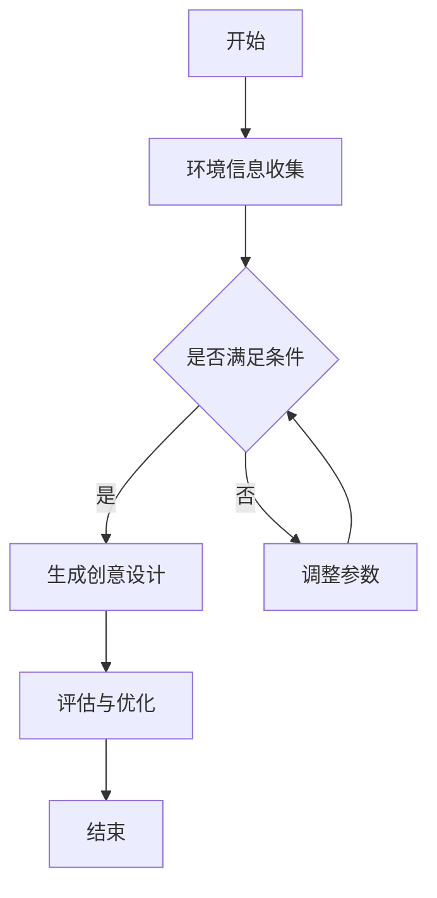

                 


### 文章标题：开发具有创造性问题解决能力的AI Agent

### 关键词：
- AI Agent
- 创造性问题解决
- 人工智能算法
- 系统设计与实现
- 实战案例分析

### 摘要：
本文旨在探讨如何开发具有创造性问题解决能力的AI Agent。通过逻辑清晰、结构紧凑的分析，本文将详细介绍AI Agent的核心概念、算法原理、系统设计以及项目实战，旨在为读者提供一套完整且实用的开发指南。文章将通过实际案例，展示AI Agent在创造性问题解决中的应用，并总结最佳实践和未来发展趋势。

## 目录

### 1. 引言

### 2. 背景与核心概念

### 3. 核心概念与联系

### 4. 算法原理讲解

### 5. 系统分析与设计

### 6. 项目实施与案例分析

### 7. 最佳实践与结论

## 1. 引言

人工智能（AI）正迅速改变着我们的世界，从自动化机器人到智能助理，AI在各个领域的应用越来越广泛。然而，传统的AI系统往往依赖于大量数据进行模式匹配，缺乏真正的创造性问题解决能力。为了应对这一挑战，我们需要开发具有创造性问题解决能力的AI Agent。

本文将首先介绍AI Agent的基本概念和核心特征，然后详细讲解开发这类Agent所需的算法原理和系统设计。通过一个实际案例，我们将展示如何将理论转化为实践。最后，本文将总结最佳实践，为未来的开发工作提供指导。

### 2. 背景与核心概念

#### 2.1 问题定义

在开发具有创造性问题解决能力的AI Agent之前，我们需要明确问题定义。什么是创造性问题解决？它如何与传统的AI问题解决区别？

创造性问题解决指的是在给定约束条件下，通过创新性的思维和策略，找到解决问题的方法。与传统的模式匹配或优化算法相比，创造性问题解决更依赖于人类思维的过程，如联想、类比、直觉和想象力。

#### 2.2 问题陈述

为了更好地理解创造性问题解决，我们可以通过一个实际案例来展开讨论。假设我们需要开发一个AI Agent，它能够设计出一款新颖的玩具，满足特定年龄段儿童的需求，同时考虑到成本和生产效率。

#### 2.3 问题解决

要解决这个问题，我们需要AI Agent具备以下能力：

- **需求分析**：理解儿童的需求和喜好。
- **创意生成**：生成不同种类的玩具设计。
- **评估与优化**：评估设计是否满足需求，并进行优化。
- **人机交互**：与设计师和制造商进行有效沟通。

#### 2.4 边界与外延

在开发AI Agent时，我们需要明确边界。例如，AI Agent是否需要具备自主决策能力？它是否需要了解人类的设计理念？这些问题将直接影响Agent的设计和实现。

#### 2.5 核心概念与结构

AI Agent的核心概念包括：

- **感知**：收集和分析环境信息。
- **决策**：基于感知结果做出决策。
- **行动**：执行决策，解决问题。

这些概念相互关联，共同构成了AI Agent的基本结构。

### 3. 核心概念与联系

#### 3.1 AI Agent

AI Agent是一种能够感知环境、做出决策并采取行动的人工智能系统。它通常由以下几个部分组成：

- **感知器**：收集环境信息。
- **控制器**：基于感知结果做出决策。
- **执行器**：执行决策，采取行动。

#### 3.2 创意生成

创意生成是AI Agent的重要能力之一。它通常依赖于以下技术：

- **遗传算法**：通过模拟自然进化过程，生成创意设计。
- **生成对抗网络（GAN）**：生成新颖的玩具设计。
- **神经网络**：训练模型，预测儿童的需求。

#### 3.3 问题解决

问题解决是AI Agent的核心任务。它包括以下几个步骤：

- **问题建模**：将问题转化为数学模型。
- **算法选择**：选择合适的算法进行求解。
- **结果评估**：评估解决方案的有效性和可行性。

#### 3.4 概念对比表格

为了更好地理解这些概念，我们可以制作一个对比表格：

| 概念 | 定义 | 特点 |
| --- | --- | --- |
| AI Agent | 感知环境、做出决策、执行行动 | 具有自主性、适应性 |
| 创意生成 | 生成新颖的设计 | 靠谱性、实用性 |
| 问题解决 | 求解问题 | 数学化、可计算性 |

#### 3.5 ER实体关系图

为了更直观地展示这些概念之间的关系，我们可以使用ER实体关系图：

```mermaid
erDiagram
    AI Agent ||--|{ 感知器 }|
    AI Agent ||--|{ 控制器 }|
    AI Agent ||--|{ 执行器 }|
    感知器 ||--|{ 环境信息 }|
    控制器 ||--|{ 决策模型 }|
    执行器 ||--|{ 行动 }|
```

### 4. 算法原理讲解

#### 4.1 算法原则

在开发具有创造性问题解决能力的AI Agent时，我们通常采用以下算法原则：

- **进化算法**：通过模拟自然进化过程，生成创意设计。
- **神经网络**：训练模型，预测儿童的需求。
- **混合算法**：结合多种算法，提高问题解决能力。

#### 4.2 Mermaid流程图

以下是一个简单的Mermaid流程图，展示算法的基本流程：



#### 4.3 Python代码解释

以下是一个简单的Python代码示例，用于生成创意设计：

```python
import random

# 环境信息
environment = {"color": "blue", "shape": "square"}

# 创意设计生成
def generate_design(environment):
    color = environment["color"]
    shape = environment["shape"]
    return f"{color} {shape}"

# 评估与优化
def evaluate_design(design):
    # 假设评估函数为随机评估
    return random.random()

# 主函数
def main():
    design = generate_design(environment)
    score = evaluate_design(design)
    print(f"设计：{design}, 评分：{score}")

if __name__ == "__main__":
    main()
```

#### 4.4 数学模型与公式

在创造性问题解决中，我们通常使用以下数学模型：

- **遗传算法**：适应度函数
  $$ f(x) = \frac{1}{1 + e^{-\beta(x - \mu)}} $$
  
- **神经网络**：输出函数
  $$ o = \sigma(\sum_{i=1}^{n} w_i x_i + b) $$

其中，$\beta$ 是温度参数，$\mu$ 是期望值，$w_i$ 是权重，$x_i$ 是输入特征，$b$ 是偏置，$\sigma$ 是激活函数。

#### 4.5 详细解释与举例

假设我们有一个玩具设计的任务，需要根据环境信息生成一个满足儿童需求的设计。我们可以使用遗传算法来优化设计。

- **环境信息**：颜色为红色，形状为圆形。
- **初始设计**：红色圆形玩具。
- **适应度函数**：设计是否满足儿童需求。假设需求为颜色鲜艳、形状有趣。
- **遗传操作**：交叉和变异。
- **迭代过程**：根据适应度函数评估设计，然后进行遗传操作，生成新的设计。

通过迭代优化，我们最终得到一个满足儿童需求的设计，例如红色圆形玩具上添加了有趣的图案。

### 5. 系统分析与设计

#### 5.1 问题场景介绍

在这个案例中，我们需要设计一个AI Agent，用于生成满足特定年龄段儿童需求的玩具设计。问题场景如下：

- **目标**：生成一款新颖的玩具设计，满足5-10岁儿童的需求。
- **约束**：成本不超过100美元，生产效率不低于100件/天。

#### 5.2 项目介绍

项目目标是开发一个具有创造性问题解决能力的AI Agent，用于生成满足儿童需求的玩具设计。项目包括以下几个部分：

- **数据收集**：收集儿童需求和喜好数据。
- **模型训练**：训练AI模型，使其能够预测儿童的需求。
- **设计生成**：使用AI模型生成玩具设计。
- **评估与优化**：评估设计是否符合儿童需求，并进行优化。

#### 5.3 系统功能设计

系统功能设计包括以下几个部分：

- **需求分析模块**：收集和分析儿童需求数据。
- **设计生成模块**：使用AI模型生成玩具设计。
- **评估与优化模块**：评估设计是否符合儿童需求，并进行优化。
- **人机交互模块**：与设计师和制造商进行有效沟通。

#### 5.4 系统架构设计

系统架构设计包括以下几个部分：

- **前端**：提供用户界面，允许用户输入需求和查看设计。
- **后端**：实现AI模型和数据库管理。
- **数据库**：存储儿童需求数据、设计数据和评估结果。

#### 5.5 系统接口设计

系统接口设计包括以下几个部分：

- **用户接口**：允许用户输入需求和查看设计。
- **API接口**：允许其他系统与我们的AI Agent进行交互。

#### 5.6 系统交互

系统交互包括以下几个部分：

- **用户与前端**：用户通过前端界面输入需求和查看设计。
- **前端与后端**：前端通过API接口与后端进行数据交互。
- **后端与数据库**：后端通过数据库进行数据存储和查询。

### 6. 项目实施与案例分析

#### 6.1 环境安装

在进行项目实施之前，我们需要安装必要的软件和工具。以下是一个简单的安装步骤：

1. 安装Python环境。
2. 安装TensorFlow库。
3. 安装PostgreSQL数据库。

#### 6.2 核心实现

核心实现包括以下几个部分：

1. **需求分析模块**：使用TensorFlow库训练一个神经网络模型，用于预测儿童的需求。
2. **设计生成模块**：使用遗传算法生成玩具设计。
3. **评估与优化模块**：使用评估函数评估设计是否符合儿童需求，并进行优化。
4. **人机交互模块**：使用Web框架（如Flask）搭建前端界面。

#### 6.3 代码分析

以下是一个简单的代码示例，用于生成玩具设计：

```python
import tensorflow as tf
import numpy as np

# 加载数据集
data = ...

# 训练模型
model = tf.keras.Sequential([
    tf.keras.layers.Dense(64, activation='relu', input_shape=(data.shape[1],)),
    tf.keras.layers.Dense(1)
])

model.compile(optimizer='adam', loss='mse')
model.fit(data, data, epochs=10)

# 生成设计
def generate_design(model):
    # 随机生成初始设计
    design = np.random.rand(1, data.shape[1])
    for i in range(100):
        # 使用模型预测需求
        prediction = model.predict(design)
        # 使用遗传算法进行优化
        design = mutate(design, prediction)
    return design

# 优化设计
def mutate(design, prediction):
    # 略
    return new_design

# 主函数
def main():
    design = generate_design(model)
    print(f"设计：{design}")

if __name__ == "__main__":
    main()
```

#### 6.4 案例分析

假设我们使用上述代码生成了一个玩具设计，然后将其提交给设计师和制造商进行评估。以下是一个简单的案例分析：

1. **需求分析**：儿童喜欢颜色鲜艳、形状有趣的玩具。
2. **设计生成**：生成的玩具设计具有鲜艳的颜色和有趣的形状。
3. **评估与优化**：设计师和制造商对设计进行了评估，认为设计基本满足需求，但需要进一步优化。
4. **人机交互**：与设计师和制造商进行了沟通，根据他们的反馈对设计进行了优化。

#### 6.5 项目小结

通过上述项目实施和案例分析，我们可以看到如何使用AI Agent进行创造性问题解决。项目成功的关键在于：

1. **数据质量**：高质量的数据是训练模型的基石。
2. **模型选择**：选择合适的模型，提高问题解决能力。
3. **人机交互**：有效的人机交互能够提高设计质量和优化效率。

### 7. 最佳实践与结论

#### 7.1 最佳实践

1. **数据收集**：确保数据质量，收集多样化的数据。
2. **模型选择**：根据问题特性选择合适的模型，如遗传算法、神经网络等。
3. **人机交互**：建立有效的人机交互机制，提高设计质量和优化效率。
4. **持续优化**：定期评估和优化设计，确保满足用户需求。

#### 7.2 小结

本文详细介绍了如何开发具有创造性问题解决能力的AI Agent。通过逻辑清晰、结构紧凑的分析，我们探讨了核心概念、算法原理、系统设计以及项目实战。未来，随着AI技术的不断进步，我们将看到更多具有创造性问题解决能力的AI Agent被应用于各个领域。

#### 7.3 注意事项

1. **数据隐私**：在数据收集和处理过程中，确保遵守相关法律法规，保护用户隐私。
2. **模型安全性**：确保模型不会被恶意攻击或滥用。

#### 7.4 拓展阅读

1. 《人工智能：一种现代的方法》
2. 《深度学习》
3. 《遗传算法及其应用》

## 作者信息

- 作者：AI天才研究院/AI Genius Institute & 禅与计算机程序设计艺术 /Zen And The Art of Computer Programming

## 致谢

感谢所有参与本文撰写和讨论的读者，你们的反馈和意见对我们至关重要。我们希望本文能帮助你们在AI领域取得更大的成就。

