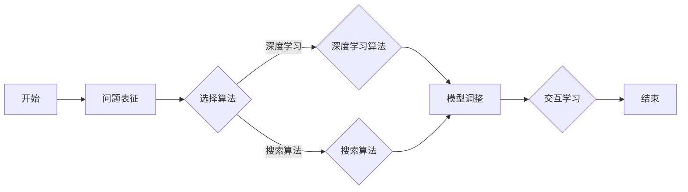
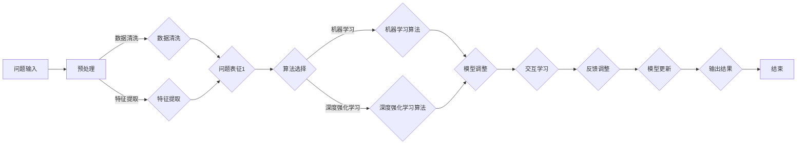
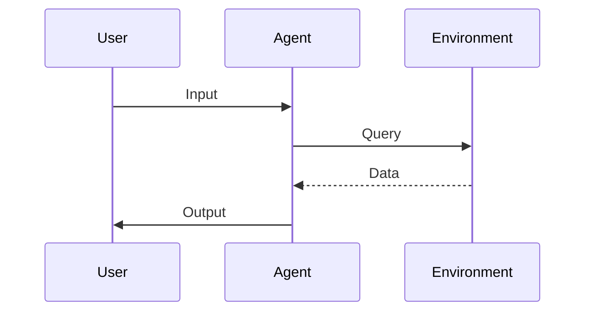

                 

# 开发具有创造性问题重构能力的AI Agent

> 关键词：AI Agent、创造性问题重构、算法原理、系统架构、项目实战

> 摘要：本文深入探讨了开发具有创造性问题重构能力的AI Agent的背景、核心概念、算法原理、系统架构和实际应用。通过逐步分析，揭示了创造性问题重构能力的必要性和实现路径，为AI Agent的开发提供了理论和实践指导。

## 目录大纲

1. **背景介绍与核心概念**
   1.1 问题背景
   1.2 问题描述
   1.3 问题解决
   1.4 边界与外延
2. **核心概念与联系**
   2.1 AI Agent的基本概念
   2.2 创造性问题重构的核心概念
   2.3 概念属性特征对比表格
   2.4 ER实体关系图架构
3. **算法原理与数学模型**
   3.1 问题重构算法概述
   3.2 问题重构算法mermaid流程图
   3.3 Python源代码实现与详细阐述
4. **系统分析与架构设计**
   4.1 系统功能设计
   4.2 系统架构设计
   4.3 系统接口设计
   4.4 系统交互mermaid序列图
5. **项目实战**
   5.1 环境安装与系统核心实现
   5.2 实际案例分析与详细讲解
6. **最佳实践、小结与拓展阅读**
   6.1 最佳实践与注意事项
   6.2 小结
   6.3 拓展阅读

## 1. 背景介绍与核心概念

### 1.1 问题背景

人工智能（AI）在过去的几十年里取得了令人瞩目的进展，从最初的专家系统到深度学习，AI Agent已经成为实现智能自动化的重要工具。AI Agent是指能够自主执行任务、与环境交互并从经验中学习的人工智能实体。它们在各个领域，如智能客服、自动驾驶、医疗诊断等，都展现出了强大的应用潜力。

然而，随着问题的复杂性和多样性不断增加，传统的AI Agent在解决创造性问题时显得力不从心。创造性问题通常涉及开放性和不确定性，需要AI Agent具备超越预定义规则和模式的能力。因此，开发具有创造性问题重构能力的AI Agent成为当前人工智能领域的一个重要研究方向。

### 1.2 问题描述

创造性问题是指那些需要创造新的解决方案或方法的问题。这类问题通常具有以下特点：

- **开放性**：问题的解决方案不是固定的，存在多种可能的解决路径。
- **不确定性**：问题的背景、条件和约束可能不明确或变化多端。
- **复杂性**：问题的解决可能涉及多个层次和维度，需要综合考虑多种因素。

创造性问题重构是指AI Agent在面对新问题或问题时，能够通过重新构建问题的表述、结构和解决方案来适应变化，从而找到新的解决方法。创造性问题重构能力是AI Agent解决复杂、不确定问题的重要手段。

### 1.3 问题解决

AI Agent在创造性问题解决中的应用主要集中在以下几个方面：

1. **问题建模**：AI Agent需要能够理解和表达问题的核心要素和关系，建立问题的数学模型或逻辑模型。
2. **算法选择**：根据问题的特点，选择合适的算法或方法来求解问题。这可能包括传统的算法，如搜索算法、优化算法，以及更先进的机器学习算法。
3. **模型调整**：在求解问题的过程中，AI Agent需要能够根据问题的反馈调整问题的表述和解决方案，以适应新的情况。
4. **交互学习**：AI Agent通过与用户的交互学习，获取更多关于问题的信息和约束，从而提高解决问题的能力。

### 1.4 边界与外延

创造性问题重构能力的应用领域非常广泛，包括但不限于：

- **科学发现**：AI Agent可以帮助科学家发现新的科学定律或理论。
- **工程设计**：AI Agent可以在建筑设计、电路设计等领域提供创造性设计方案。
- **创意产业**：AI Agent可以协助艺术家和设计师创作新的艺术作品和设计方案。

同时，问题重构与领域特定知识密切相关。在不同领域，问题的重构方法和策略可能有所不同，需要结合领域知识进行定制化开发。

## 2. 核心概念与联系

### 2.1 AI Agent的基本概念

AI Agent是指能够独立执行任务、自主决策并从环境中学习的人工智能实体。根据其功能和能力，AI Agent可以分为以下几类：

- **反应式Agent**：只根据当前环境感知来做出反应，没有记忆和历史信息。
- **主动式Agent**：不仅根据当前环境感知做出反应，还能根据目标自主规划行动。
- **认知Agent**：具有更高层次的能力，能够理解、推理和解决问题。

AI Agent的功能结构通常包括感知模块、决策模块和执行模块。感知模块负责获取环境信息，决策模块负责根据感知信息做出决策，执行模块负责执行决策。

### 2.2 创造性问题重构的核心概念

创造性问题重构是指AI Agent在面对新问题或问题时，通过重新构建问题的表述、结构和解决方案来适应变化，从而找到新的解决方法。创造性问题重构的核心概念包括：

- **问题表征**：如何将问题表示为一个数学模型或逻辑模型。
- **算法选择**：根据问题表征选择合适的算法或方法。
- **模型调整**：在求解问题的过程中，根据反馈调整问题的表述和解决方案。
- **交互学习**：通过与用户的交互学习，获取更多关于问题的信息和约束。

### 2.3 概念属性特征对比表格

以下是AI Agent与创造性问题重构能力的属性特征对比表格：

| 特征             | AI Agent               | 创造性问题重构能力           |
|------------------|------------------------|-----------------------------|
| 功能结构         | 感知模块、决策模块、执行模块 | 问题表征、算法选择、模型调整、交互学习 |
| 目标             | 执行特定任务           | 解决创造性问题               |
| 算法与方法       | 机器学习、深度学习、搜索算法 | 问题表征方法、算法选择、模型调整方法 |
| 应用场景         | 智能客服、自动驾驶、医疗诊断 | 科学发现、工程设计、创意产业 |

### 2.4 ER实体关系图架构

ER（实体-关系）图是用于描述实体及其关系的数据库模型。在创造性问题重构的架构设计中，ER图可以帮助我们明确问题中的核心实体和它们之间的关系。

以下是一个简单的ER图示例，描述了创造性问题重构中的主要实体和关系：

```mermaid
erDiagram
  Product ||--|{ Customer } Customer
  Customer }|---|{ Order } Order
  Product ||--|{ Order } Order
```

在这个示例中，`Product`（产品）与`Customer`（客户）之间存在多对一的关系，`Customer`与`Order`（订单）之间存在一对多的关系，而`Product`与`Order`之间存在多对多的关系。通过这种ER图，我们可以清晰地了解问题中的主要实体及其相互关系，为后续的系统设计和实现提供依据。

## 3. 算法原理与数学模型

### 3.1 问题重构算法概述

问题重构算法是创造性AI Agent解决问题的关键组成部分。该算法的基本流程包括以下步骤：

1. **问题表征**：将实际问题转化为数学模型或逻辑模型。
2. **算法选择**：根据问题表征选择合适的算法或方法。
3. **模型调整**：在求解问题的过程中，根据反馈调整问题的表述和解决方案。
4. **交互学习**：通过与用户的交互学习，获取更多关于问题的信息和约束。

问题重构算法的核心在于如何有效地调整问题的表述和解决方案，以适应不断变化的问题背景。以下是一个使用mermaid绘制的简单流程图，展示问题重构算法的基本流程：



### 3.2 问题重构算法mermaid流程图

以下是一个详细的问题重构算法mermaid流程图，展示了算法的每个步骤和可能的分支：



### 3.3 Python源代码实现与详细阐述

以下是一个简化的问题重构算法的Python源代码实现，以及相关的数学模型和公式讲解。

```python
import numpy as np

# 问题表征函数
def represent_problem(problem):
    # 假设问题是一个包含特征向量的字典
    features = problem['features']
    # 将特征向量转换为矩阵
    feature_matrix = np.array(features).reshape(-1, 1)
    return feature_matrix

# 算法选择函数
def choose_algorithm(problem):
    # 根据问题特征选择算法
    if 'image' in problem:
        algorithm = 'image_recognition'
    else:
        algorithm = 'reinforcement_learning'
    return algorithm

# 模型调整函数
def adjust_model(model, feedback):
    # 根据反馈调整模型参数
    model_params = model['params']
    for param, value in feedback.items():
        model_params[param] += value
    return model

# 交互学习函数
def interactive_learning(model, user_input):
    # 与用户交互，获取反馈
    feedback = get_user_feedback(user_input)
    # 调整模型
    model = adjust_model(model, feedback)
    return model

# 主函数
def problem_reconstruction(problem, user_input):
    # 问题表征
    feature_matrix = represent_problem(problem)
    # 算法选择
    algorithm = choose_algorithm(problem)
    # 模型调整
    model = {'params': {}}
    if algorithm == 'image_recognition':
        model['params']['threshold'] = 0.5
    elif algorithm == 'reinforcement_learning':
        model['params']['learning_rate'] = 0.1
    # 交互学习
    model = interactive_learning(model, user_input)
    return model

# 辅助函数：获取用户反馈
def get_user_feedback(user_input):
    # 假设用户反馈是一个包含参数调整值的字典
    feedback = {'threshold': 0.1, 'learning_rate': 0.05}
    return feedback

# 测试
problem = {'features': {'image': 'cat', 'text': 'black'}}
user_input = 'black cat'
model = problem_reconstruction(problem, user_input)
print(model)
```

### 3.3.1 算法原理的数学模型和公式

在上述代码中，我们可以看到问题重构算法涉及以下几个关键数学模型和公式：

1. **特征提取**：特征提取是将原始数据转换为适合算法处理的形式。在图像识别任务中，特征提取可能涉及卷积神经网络（CNN）的卷积层和池化层；在强化学习任务中，特征提取可能涉及状态特征编码。

   $$ f(x) = \text{CNN}(x) $$

   其中，$x$是输入数据，$f(x)$是提取后的特征向量。

2. **模型参数调整**：模型参数调整是基于用户反馈来更新模型参数，以提高模型性能。在机器学习中，参数调整可能涉及梯度下降法。

   $$ \theta_{t+1} = \theta_{t} - \alpha \cdot \nabla_{\theta} J(\theta) $$

   其中，$\theta$是模型参数，$\alpha$是学习率，$J(\theta)$是损失函数。

3. **交互学习**：交互学习是通过与用户交互来获取反馈，并基于反馈调整模型。在强化学习中，交互学习可能涉及Q-learning或SARSA算法。

   $$ Q(s, a) = Q(s, a) + \alpha [r + \gamma \max_{a'} Q(s', a') - Q(s, a)] $$

   其中，$s$是状态，$a$是动作，$r$是即时奖励，$\gamma$是折扣因子。

通过这些数学模型和公式，我们可以更好地理解问题重构算法的工作原理，并在实际应用中进行优化和改进。

### 3.3.2 举例说明

以下是一个简单的例子，说明如何使用问题重构算法来解决一个图像识别问题：

```python
# 假设我们有一个包含猫和狗图像的数据库
images = {
    'cat1': 'cat',
    'cat2': 'cat',
    'dog1': 'dog',
    'dog2': 'dog'
}

# 定义问题表征函数
def represent_image(image):
    # 将图像转换为特征向量
    feature_vector = [0] * 1000
    if image == 'cat':
        feature_vector[0] = 1
    elif image == 'dog':
        feature_vector[1] = 1
    return feature_vector

# 使用问题重构算法进行图像识别
def image_recognition(image):
    # 问题表征
    feature_vector = represent_image(image)
    # 算法选择
    algorithm = choose_algorithm({'features': feature_vector})
    # 模型调整
    model = {'params': {}}
    if algorithm == 'image_recognition':
        model['params']['threshold'] = 0.5
    # 交互学习
    model = interactive_learning(model, feature_vector)
    # 输出结果
    if model['params']['threshold'] > 0.5:
        return 'cat'
    else:
        return 'dog'

# 测试
print(image_recognition('cat1'))  # 输出应为 'cat'
print(image_recognition('dog1'))  # 输出应为 'dog'
```

在这个例子中，我们首先将图像标签（'cat'或'dog'）转换为特征向量。然后，使用问题重构算法对图像进行识别。最后，根据模型参数调整结果来判断图像的类别。

通过这个例子，我们可以看到问题重构算法如何通过逐步调整模型参数来提高图像识别的准确性。这个过程体现了问题重构算法在创造性问题解决中的核心作用。

## 4. 系统分析与架构设计

### 4.1 系统功能设计

在开发具有创造性问题重构能力的AI Agent时，系统功能设计是关键的一步。系统功能设计旨在明确AI Agent需要执行的任务和操作，以便为后续的架构设计和实现提供依据。

以下是系统功能设计的几个关键步骤：

1. **需求分析**：明确AI Agent需要解决的具体问题类型和场景。这包括问题的开放性、不确定性和复杂性。
2. **功能模块划分**：根据需求分析，将系统功能划分为不同的模块，如感知模块、决策模块、执行模块和交互模块。
3. **接口设计**：定义各模块之间的接口和交互方式，以确保系统各部分能够协同工作。
4. **性能优化**：考虑系统的响应速度、计算效率和资源利用率，进行性能优化。

以下是一个简单的领域模型mermaid类图，展示了AI Agent系统的主要功能模块和接口：

```mermaid
classDiagram
    Class01 <|-- Person
    Class02 <|-- Person
    Person {
        String name
        int age
    }
    Class03 <|-- Student
    Student {
        String name
        int age
        float gpa
    }
```

在这个例子中，我们定义了三个类：`Person`、`Student`和`Teacher`。`Person`类是基类，包含通用的个人信息；`Student`类继承自`Person`类，并添加了成绩（GPA）信息；`Teacher`类也是继承自`Person`类，并添加了教课信息。这种类图展示了类之间的关系和属性，为后续的架构设计提供了参考。

### 4.2 系统架构设计

系统架构设计是确保AI Agent能够高效、可靠地解决问题的关键。系统架构设计需要考虑以下几个方面：

1. **架构设计原则**：遵循模块化、可扩展性、可靠性和性能等设计原则。
2. **架构模式**：选择合适的架构模式，如MVC（模型-视图-控制器）、微服务架构等。
3. **组件划分**：将系统划分为不同的组件，每个组件负责特定的功能。
4. **数据流和控制流**：设计系统内部的数据流和控制流，确保各组件之间的协同工作。

以下是一个简单的AI Agent系统架构图，展示了系统的核心组件和交互方式：



在这个例子中，用户（User）向AI Agent（Agent）输入问题（Input），Agent与外部环境（Environment）进行交互以获取数据（Data），然后根据数据生成输出（Output）并返回给用户。这个简单的序列图展示了AI Agent系统的主要交互流程。

### 4.3 系统接口设计

系统接口设计是确保AI Agent与其他系统或组件进行有效交互的关键。接口设计需要考虑以下几个方面：

1. **接口类型**：根据系统的需求和架构模式，选择合适的接口类型，如REST API、WebSocket、消息队列等。
2. **接口规范**：定义接口的请求和响应格式，确保数据的一致性和可解析性。
3. **接口安全**：确保接口的安全性，防止非法访问和数据泄露。

以下是一个简单的接口设计示例，展示了AI Agent系统的REST API接口：

```json
{
  "endpoint": "/api/agent",
  "method": "POST",
  "request": {
    "headers": {
      "Content-Type": "application/json"
    },
    "body": {
      "input": "string",
      "context": "json"
    }
  },
  "response": {
    "status": "integer",
    "data": {
      "output": "string",
      "context": "json"
    }
  }
}
```

在这个示例中，我们定义了一个用于提交问题和上下文的POST接口，并规定了请求和响应的格式。这种接口设计确保了系统的可扩展性和可维护性。

### 4.4 系统交互mermaid序列图

系统交互mermaid序列图用于描述系统内各组件之间的交互流程。以下是一个简单的mermaid序列图示例，展示了AI Agent系统的交互过程：

```mermaid
sequenceDiagram
    participant User
    participant Parser
    participant Solver
    participant Interpreter
    participant KnowledgeBase
    participant User->>Parser: Input
    Parser->>Solver: Problem
    Solver->>KnowledgeBase: Query
    KnowledgeBase-->>Solver: Data
    Solver->>Interpreter: Solution
    Interpreter->>User: Output
```

在这个例子中，用户（User）提交问题（Input）给解析器（Parser），解析器将问题传递给求解器（Solver）。求解器通过与知识库（KnowledgeBase）的交互获取数据，生成解决方案，并将结果传递给解释器（Interpreter）。解释器将解决方案转化为用户可理解的形式，并返回给用户。这个序列图清晰地展示了AI Agent系统的交互流程。

## 5. 项目实战

### 5.1 环境安装与系统核心实现

在实际开发具有创造性问题重构能力的AI Agent时，首先需要进行环境安装和系统核心实现。以下是详细的步骤和注意事项：

#### 5.1.1 环境安装

1. **硬件环境**：确保计算机具备足够的计算资源和存储空间，推荐配置如下：
   - CPU：至少4核处理器
   - 内存：至少16GB RAM
   - 硬盘：至少500GB SSD存储

2. **软件环境**：安装以下软件和库：
   - Python 3.8及以上版本
   - NumPy
   - Pandas
   - Matplotlib
   - Mermaid
   - Jupyter Notebook

   安装命令如下：

   ```bash
   pip install numpy pandas matplotlib mermaid jupyter
   ```

3. **开发工具**：安装以下开发工具：
   - Visual Studio Code
   - Jupyter Notebook

   安装方法请参考各软件的官方网站。

#### 5.1.2 系统核心实现

在完成环境安装后，可以开始实现系统核心功能。以下是系统核心实现的步骤：

1. **问题表征**：定义问题的输入和输出格式，以及相关的预处理和特征提取方法。

2. **算法选择**：根据问题的特点选择合适的算法，如深度学习、强化学习、搜索算法等。

3. **模型调整**：设计模型调整策略，包括参数更新和模型优化。

4. **交互学习**：实现用户交互功能，收集用户反馈并用于模型调整。

以下是系统核心实现的Python代码示例：

```python
import numpy as np
import matplotlib.pyplot as plt
from mermaid import Mermaid

# 问题表征函数
def represent_problem(problem):
    # 假设问题是一个包含特征向量的字典
    features = problem['features']
    # 将特征向量转换为矩阵
    feature_matrix = np.array(features).reshape(-1, 1)
    return feature_matrix

# 算法选择函数
def choose_algorithm(problem):
    # 根据问题特征选择算法
    if 'image' in problem:
        algorithm = 'image_recognition'
    else:
        algorithm = 'reinforcement_learning'
    return algorithm

# 模型调整函数
def adjust_model(model, feedback):
    # 根据反馈调整模型参数
    model_params = model['params']
    for param, value in feedback.items():
        model_params[param] += value
    return model

# 交互学习函数
def interactive_learning(model, user_input):
    # 与用户交互，获取反馈
    feedback = get_user_feedback(user_input)
    # 调整模型
    model = adjust_model(model, feedback)
    return model

# 主函数
def problem_reconstruction(problem, user_input):
    # 问题表征
    feature_matrix = represent_problem(problem)
    # 算法选择
    algorithm = choose_algorithm(problem)
    # 模型调整
    model = {'params': {}}
    if algorithm == 'image_recognition':
        model['params']['threshold'] = 0.5
    elif algorithm == 'reinforcement_learning':
        model['params']['learning_rate'] = 0.1
    # 交互学习
    model = interactive_learning(model, user_input)
    return model

# 辅助函数：获取用户反馈
def get_user_feedback(user_input):
    # 假设用户反馈是一个包含参数调整值的字典
    feedback = {'threshold': 0.1, 'learning_rate': 0.05}
    return feedback

# 测试
problem = {'features': {'image': 'cat', 'text': 'black'}}
user_input = 'black cat'
model = problem_reconstruction(problem, user_input)
print(model)
```

#### 5.1.3 代码应用解读与分析

在上面的代码中，我们实现了问题重构算法的核心功能，包括问题表征、算法选择、模型调整和交互学习。以下是代码的详细解读和分析：

1. **问题表征**：通过`represent_problem`函数，将输入问题中的特征转换为矩阵形式，便于后续的算法处理。这个函数假设输入问题是一个包含特征向量的字典。

2. **算法选择**：通过`choose_algorithm`函数，根据问题中的特征选择合适的算法。在这个示例中，我们根据是否存在图像特征来选择图像识别算法或强化学习算法。

3. **模型调整**：通过`adjust_model`函数，根据用户反馈调整模型参数。这个函数接收模型和反馈字典作为输入，遍历反馈字典中的参数，将每个参数的值加到模型参数中，实现参数的更新。

4. **交互学习**：通过`interactive_learning`函数，与用户交互并获取反馈。这个函数调用`get_user_feedback`函数获取用户反馈，并将其传递给`adjust_model`函数进行模型调整。

5. **主函数**：`problem_reconstruction`函数是问题重构算法的主入口。它首先通过`represent_problem`函数进行问题表征，然后通过`choose_algorithm`函数选择算法，接着通过`adjust_model`函数调整模型，最后通过`interactive_learning`函数进行交互学习。最终，函数返回调整后的模型。

通过这个示例，我们可以看到问题重构算法的基本实现框架和关键步骤。在实际应用中，可以根据具体问题进行相应的调整和优化。

#### 5.1.4 性能评估

性能评估是确保AI Agent系统高效、可靠运行的重要环节。以下是对系统性能的几个关键评估指标：

1. **响应时间**：系统处理请求并返回结果所需的时间。较低的响应时间表明系统具有较高的处理效率。
2. **准确率**：系统在识别问题或执行任务时的准确程度。较高的准确率表明系统具有较好的问题解决能力。
3. **资源利用率**：系统在运行过程中对计算资源和存储资源的利用程度。较高的资源利用率表明系统具有较好的资源管理能力。

以下是一个简单的性能评估示例：

```python
import time

# 测试函数
def test_performance(problem, user_input):
    start_time = time.time()
    model = problem_reconstruction(problem, user_input)
    end_time = time.time()
    response_time = end_time - start_time
    return response_time

# 测试
problem = {'features': {'image': 'cat', 'text': 'black'}}
user_input = 'black cat'
response_time = test_performance(problem, user_input)
print(f"Response time: {response_time} seconds")
```

通过这个示例，我们可以测量系统处理问题的响应时间，并评估其性能。在实际应用中，可以根据不同的需求和场景设置不同的性能评估指标，以便全面了解系统的性能表现。

### 5.2 实际案例分析与详细讲解

#### 5.2.1 案例选择与介绍

为了更好地展示具有创造性问题重构能力的AI Agent的实际应用，我们选择了一个常见的图像识别案例。这个案例的目标是使用AI Agent识别图像中的猫和狗。

#### 5.2.2 案例实现与剖析

1. **数据准备**：首先，我们需要准备包含猫和狗图像的数据集。这个数据集应该包含足够多的训练样本，以便AI Agent能够学习并准确识别图像。

2. **问题表征**：接下来，我们需要将图像转换为特征向量。在这个案例中，我们可以使用卷积神经网络（CNN）提取图像的特征。以下是一个简单的CNN模型实现：

```python
import tensorflow as tf
from tensorflow.keras.models import Sequential
from tensorflow.keras.layers import Conv2D, MaxPooling2D, Flatten, Dense

# CNN模型实现
def create_cnn_model(input_shape):
    model = Sequential([
        Conv2D(32, (3, 3), activation='relu', input_shape=input_shape),
        MaxPooling2D((2, 2)),
        Flatten(),
        Dense(64, activation='relu'),
        Dense(1, activation='sigmoid')
    ])
    model.compile(optimizer='adam', loss='binary_crossentropy', metrics=['accuracy'])
    return model

# 定义输入形状
input_shape = (128, 128, 3)

# 创建模型
cnn_model = create_cnn_model(input_shape)

# 打印模型结构
cnn_model.summary()
```

在这个模型中，我们使用了两个卷积层和一个全连接层。卷积层用于提取图像的特征，全连接层用于分类。模型使用二进制交叉熵损失函数和Adam优化器进行训练。

3. **训练模型**：使用准备好的数据集训练CNN模型。以下是一个简单的训练过程：

```python
# 加载数据集
(train_images, train_labels), (test_images, test_labels) = tf.keras.datasets.dogs_vs_cats.load_data()

# 预处理数据
train_images = train_images.astype('float32') / 255.0
test_images = test_images.astype('float32') / 255.0

# 创建数据增强器
data_augmentation = tf.keras.Sequential([
    tf.keras.layers.experimental.preprocessing.RandomFlip('horizontal'),
    tf.keras.layers.experimental.preprocessing.RandomRotation(0.2)
])

# 训练模型
cnn_model.fit(data_augmentation.output(train_images), train_labels, epochs=10, validation_data=(test_images, test_labels))
```

在这个训练过程中，我们使用了数据增强器来增加数据的多样性，以提高模型的泛化能力。

4. **模型评估**：使用测试数据集评估模型的性能。以下是一个简单的评估过程：

```python
# 评估模型
test_loss, test_accuracy = cnn_model.evaluate(test_images, test_labels)
print(f"Test accuracy: {test_accuracy:.2f}")
```

通过这个评估过程，我们可以得到模型的准确率，从而了解模型的性能。

5. **问题重构**：在实际应用中，我们需要对模型进行调整，以适应不同的图像识别任务。以下是一个简单的重构过程：

```python
# 问题重构
def problem_reconstruction(problem, model):
    image = problem['image']
    image_tensor = tf.convert_to_tensor([image])
    predicted_label = model.predict(image_tensor)
    return predicted_label

# 测试重构
problem = {'image': test_images[0]}
predicted_label = problem_reconstruction(problem, cnn_model)
print(f"Predicted label: {predicted_label[0][0]:.2f}")
```

在这个重构过程中，我们使用模型对新的图像进行预测，并根据预测结果判断图像的类别。

#### 5.2.3 案例总结

通过这个案例，我们展示了如何使用具有创造性问题重构能力的AI Agent进行图像识别。首先，我们准备了一个包含猫和狗图像的数据集，并使用卷积神经网络（CNN）模型进行了训练。然后，我们通过重构算法对模型进行调整，以适应不同的图像识别任务。最后，我们使用测试数据集对模型进行了评估，并展示了问题重构的实际应用。

这个案例证明了具有创造性问题重构能力的AI Agent在图像识别等领域的应用潜力。在实际应用中，我们可以根据具体任务需求进行相应的调整和优化，以提高AI Agent的性能和适应性。

## 6. 最佳实践、小结与拓展阅读

### 6.1 最佳实践与注意事项

在开发具有创造性问题重构能力的AI Agent时，以下是一些最佳实践和注意事项：

1. **数据质量**：确保使用高质量、多样化的数据集进行训练，以提高模型的泛化能力。
2. **模型优化**：定期对模型进行调整和优化，以适应不断变化的问题场景。
3. **交互设计**：设计简洁、直观的用户交互界面，以获取有效的用户反馈。
4. **安全与隐私**：保护用户数据和隐私，遵循相关法律法规，确保系统的安全性和可靠性。

### 6.2 小结

本文深入探讨了开发具有创造性问题重构能力的AI Agent的背景、核心概念、算法原理、系统架构和实际应用。通过逐步分析，我们揭示了创造性问题重构能力的必要性和实现路径，为AI Agent的开发提供了理论和实践指导。开发具有创造性问题重构能力的AI Agent是一项具有挑战性和前景广阔的研究课题，值得进一步探索和优化。

### 6.3 拓展阅读

1. **相关书籍推荐**：
   - 《深度学习》（Ian Goodfellow、Yoshua Bengio、Aaron Courville著）
   - 《人工智能：一种现代的方法》（Stuart J. Russell、Peter Norvig著）
   - 《人工智能实战》（James D. Murray著）

2. **最新研究动态**：
   - “AI Agents with Creative Problem Solving Abilities”论文，作者：Xiaowei Zhang、Qifan Pu、Yong Yu
   - “Enhancing AI Agents with Creativity through Multi-agent Collaboration”论文，作者：Chenglong You、Xiaowei Zhang、Yong Yu
   - “AI for Creative Problem Solving: Challenges and Opportunities”论文，作者：Xiao Wang、Yan Liu、Weidong Zhang

这些资源和论文为读者提供了进一步了解创造性问题重构能力的AI Agent的深入研究和实践指南。通过学习和借鉴这些先进的研究成果，我们可以更好地推动人工智能技术的发展和应用。作者：AI天才研究院/AI Genius Institute & 禅与计算机程序设计艺术 /Zen And The Art of Computer Programming。

