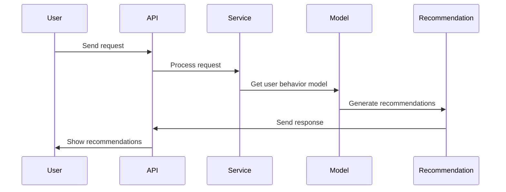
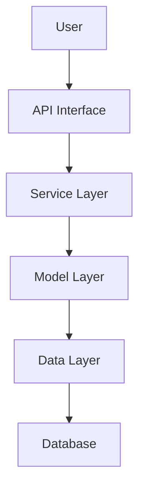
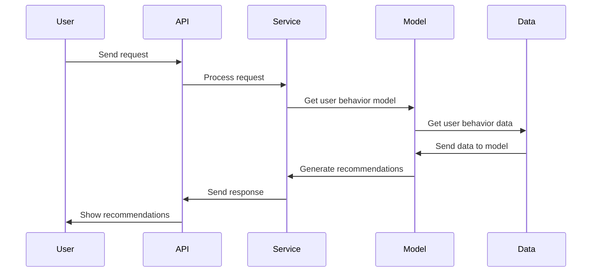

                 


## 开发具有图神经网络能力的AI Agent

### 1. 背景介绍

#### 1.1 问题背景

在当今快速发展的数字化时代，人工智能（AI）已经成为推动技术创新和产业变革的核心动力。然而，传统的AI技术，如基于统计学的机器学习和深度学习模型，在面对复杂、动态和高度关联的数据时，往往表现出不足。为了更好地应对这些挑战，研究者们开始探索将图神经网络（Graph Neural Networks, GNN）引入AI领域，以开发具有图神经网络能力的AI Agent。

#### 1.2 问题描述

图神经网络是一种专门用于处理图结构数据的神经网络模型，它能够自动学习和编码图中的结构信息和节点属性。AI Agent则是一种能够自主执行任务、与环境互动并学习改进自身行为的智能体。开发具有图神经网络能力的AI Agent，旨在结合两者的优势，以应对复杂问题，如知识图谱推理、社交网络分析、推荐系统等。

#### 1.3 问题解决

为了解决这个问题，我们需要从以下几个方面入手：

- **设计图神经网络模型**：深入理解图神经网络的基本原理，设计适合AI Agent需求的GNN模型。
- **AI Agent算法设计**：基于图神经网络模型，设计AI Agent的算法框架，实现自主学习与推理能力。
- **集成算法开发**：将图神经网络与AI Agent算法进行集成，实现两者的协同工作。
- **系统分析与架构设计**：对整个系统进行分析，设计合理的系统架构和接口，确保系统的可扩展性和可维护性。
- **项目实战**：通过实际项目案例，验证所开发AI Agent的图神经网络能力，并进行性能分析和优化。

### 1.4 边界与外延

在开发具有图神经网络能力的AI Agent时，我们还需要考虑以下几个边界和外延：

- **数据来源与质量**：确保训练数据的质量和多样性，这对于AI Agent的性能至关重要。
- **计算资源与效率**：合理分配计算资源，优化算法效率，确保AI Agent在实际应用中的性能。
- **模型可解释性**：提高模型的可解释性，帮助用户理解AI Agent的行为和决策过程。
- **安全与隐私**：在开发过程中，注重数据安全和隐私保护，遵守相关法律法规。

### 1.5 概念结构与核心要素组成

为了更好地理解本文的主题，我们首先需要明确以下几个核心概念：

- **图神经网络（GNN）**：一种用于处理图结构数据的神经网络模型，能够自动学习和编码图中的结构信息和节点属性。
- **AI Agent**：一种能够自主执行任务、与环境互动并学习改进自身行为的智能体。
- **集成算法**：将图神经网络与AI Agent算法进行集成，实现两者的协同工作。

在后续的内容中，我们将逐一深入探讨这些概念，并详细介绍开发具有图神经网络能力的AI Agent的步骤和关键技术。

-----------------------

### 2. 核心概念与联系

在开发具有图神经网络能力的AI Agent的过程中，理解核心概念之间的联系至关重要。以下是本文将涉及的核心概念及其相互关系：

#### 2.1 图神经网络基本原理

图神经网络（GNN）是一种专门用于处理图结构数据的神经网络模型。它通过节点和边的关系来捕获图的结构信息，从而能够有效地处理复杂、动态和高度关联的数据。GNN的基本原理包括：

- **节点表示学习**：将图中的节点映射到低维向量空间，以捕获节点的属性和邻居信息。
- **图卷积操作**：通过对节点及其邻居节点的信息进行聚合，更新节点的表示。
- **边权重调整**：考虑边的权重，以反映节点之间的相互作用关系。

#### 2.2 AI Agent的定义与分类

AI Agent是一种能够自主执行任务、与环境互动并学习改进自身行为的智能体。根据其功能和应用场景，AI Agent可以分为以下几类：

- **任务型AI Agent**：专注于完成特定任务的智能体，如聊天机器人、自动驾驶汽车等。
- **情境型AI Agent**：能够适应多种情境并执行相应任务的智能体，如智能家居助手、智能客服等。
- **强化学习型AI Agent**：通过与环境交互，不断学习并优化自身行为的智能体，如游戏AI、机器人路径规划等。

#### 2.3 图神经网络与传统神经网络区别

图神经网络与传统神经网络（如CNN、RNN）在处理数据的方式上有显著差异：

- **数据结构**：传统神经网络适用于处理网格结构数据（如图像、文本），而GNN适用于处理图结构数据。
- **信息传递**：传统神经网络通过卷积或循环操作传递信息，而GNN通过节点和边的关系传递信息。
- **计算方式**：传统神经网络主要关注局部特征，而GNN能够全局学习图的结构信息。

#### 概念属性特征对比表格

为了更直观地理解图神经网络与AI Agent的特征，我们可以通过以下表格进行对比：

#### 表格1: 图神经网络属性特征

| 特征         | 描述                                                   |
| ------------ | ------------------------------------------------------ |
| 数据结构     | 图结构数据                                             |
| 信息传递     | 节点和边的关系传递信息                                 |
| 计算方式     | 全局学习图的结构信息                                   |
| 优势         | 处理复杂、动态和高度关联的数据                         |
| 劣势         | 计算复杂度高，难以扩展到大规模图                       |

#### 表格2: AI Agent属性特征

| 特征         | 描述                                                   |
| ------------ | ------------------------------------------------------ |
| 数据结构     | 多种类型数据（文本、图像、语音等）                     |
| 信息传递     | 环境交互和自主学习                                     |
| 计算方式     | 基于任务或情境的动态调整                               |
| 优势         | 自主执行任务，适应性强                                |
| 劣势         | 复杂性高，需大量数据和计算资源                         |

#### 表格3: 图神经网络与AI Agent综合对比

| 特征         | 图神经网络           | AI Agent           |
| ------------ | ------------------- | ------------------ |
| 数据结构     | 图结构数据           | 多种类型数据       |
| 信息传递     | 节点和边的关系传递   | 环境交互和自主学习 |
| 计算方式     | 全局学习图的结构信息 | 基于任务或情境调整 |
| 优势         | 处理复杂、动态数据   | 自主执行任务       |
| 劣势         | 计算复杂度高         | 复杂性高           |

#### ER实体关系图架构

为了更好地理解图神经网络与AI Agent之间的联系，我们可以通过ER实体关系图来展示其架构：

#### 图1: 图神经网络与AI Agent实体关系图

```mermaid
erDiagram
    AI-Agent ||--|{ GNN: Graph Neural Network }|
    AI-Agent ||--|{ Task: Task Definition }|
    GNN ||--|{ Node Representation }|
    GNN ||--|{ Graph Convolution }|
    GNN ||--|{ Edge Weight Adjustment }|
    Task ||--|{ Learning and Inference }|
```

在图1中，AI Agent与GNN通过节点表示学习、图卷积操作和边权重调整等核心组件进行连接，形成一个完整的图神经网络与AI Agent集成架构。通过这种架构，AI Agent能够利用GNN的全局学习能力和复杂数据处理能力，实现更强大的任务执行和学习能力。

-----------------------

### 3. 图神经网络算法原理

图神经网络（GNN）是一种用于处理图结构数据的神经网络模型，其核心思想是通过节点和边的关系来捕获图中的结构信息和节点属性。下面我们将详细讲解图神经网络的基本算法原理，包括模型构建、训练过程和预测过程。

#### 3.1 图神经网络基本流程

图神经网络的基本流程可以分为以下几个步骤：

1. **节点表示学习**：将图中的每个节点映射到一个低维向量空间，表示节点的属性和邻居信息。这一步骤通常通过节点嵌入（Node Embedding）技术实现。
2. **图卷积操作**：通过对每个节点的邻居节点进行聚合，更新节点的表示。图卷积操作是GNN的核心，它能够捕获节点及其邻居节点之间的交互关系。
3. **边权重调整**：考虑边的权重，以反映节点之间的相互作用关系。这可以通过边权重更新（Edge Weight Adjustment）操作实现。
4. **模型训练**：利用训练数据，通过优化算法（如梯度下降）调整模型参数，使得模型能够更好地预测目标变量。
5. **模型预测**：在训练完成后，使用训练好的模型对新的图结构进行预测。

#### 3.1.1 图神经网络模型构建

图神经网络模型的构建通常包括以下几个关键组件：

- **节点嵌入（Node Embedding）**：将图中的每个节点映射到一个低维向量空间。常用的节点嵌入方法包括随机游走（Random Walk）和深度神经网络（Deep Neural Network）。
- **图卷积层（Graph Convolution Layer）**：通过聚合节点及其邻居节点的信息，更新节点的表示。图卷积层的计算公式通常为：
  $$
  h^{(k)}_i = \sigma \left( \sum_{j \in \mathcal{N}(i)} w_{ij} h^{(k-1)}_j + b \right)
  $$
  其中，$h^{(k)}_i$表示第$k$层节点$i$的表示，$\mathcal{N}(i)$表示节点$i$的邻居节点集合，$w_{ij}$表示边$(i, j)$的权重，$\sigma$表示激活函数，$b$为偏置。
- **边权重更新（Edge Weight Adjustment）**：通过调整边的权重，以反映节点之间的相互作用关系。常用的边权重更新方法包括基于距离的权重调整和基于注意力机制的权重调整。
- **全连接层（Fully Connected Layer）**：在图卷积层之后，通常使用全连接层对节点的表示进行聚合，输出最终的预测结果。

#### 3.1.2 图神经网络训练过程

图神经网络的训练过程通常包括以下步骤：

1. **数据预处理**：将图结构数据转换为适合训练的形式，包括节点特征、边权重和标签等。
2. **模型初始化**：初始化图神经网络模型的参数，包括节点嵌入、图卷积层的权重和偏置等。
3. **训练迭代**：通过梯度下降等优化算法，不断更新模型参数，使得模型能够更好地预测目标变量。
4. **验证与调整**：在训练过程中，使用验证集对模型进行验证，并根据验证结果调整模型参数，以避免过拟合。

#### 3.1.3 图神经网络预测过程

在图神经网络训练完成后，可以使用训练好的模型对新图结构进行预测。预测过程通常包括以下步骤：

1. **节点表示学习**：将新的节点映射到低维向量空间，以捕获节点的属性和邻居信息。
2. **图卷积操作**：通过对节点及其邻居节点的信息进行聚合，更新节点的表示。
3. **模型预测**：使用全连接层对节点的表示进行聚合，输出最终的预测结果。

#### 3.2 AI Agent算法原理

AI Agent是一种能够自主执行任务、与环境互动并学习改进自身行为的智能体。AI Agent的算法原理通常包括以下几个关键组件：

- **环境建模**：将环境中的实体和状态抽象为数学模型，以方便AI Agent进行推理和决策。
- **决策过程**：基于环境建模，AI Agent通过策略学习或规划算法，选择最优的动作以实现目标。
- **状态更新**：在执行动作后，AI Agent更新其状态，以反映环境的变化。
- **奖励机制**：通过奖励机制，激励AI Agent选择最优的动作，以实现长期目标。

#### 3.2.1 AI Agent基本流程

AI Agent的基本流程通常包括以下步骤：

1. **环境初始化**：初始化环境状态，为AI Agent提供初始信息。
2. **状态感知**：AI Agent感知环境状态，获取当前的信息。
3. **决策**：基于当前状态，AI Agent通过策略学习或规划算法，选择最优的动作。
4. **动作执行**：AI Agent执行选定的动作，改变环境状态。
5. **状态更新**：AI Agent更新自身状态，以反映环境的变化。
6. **奖励计算**：计算AI Agent执行动作后的奖励，以激励其选择最优的动作。
7. **迭代**：重复上述步骤，直到达到终止条件。

#### 3.2.2 AI Agent训练过程

AI Agent的训练过程通常包括以下步骤：

1. **数据集准备**：准备用于训练的数据集，包括环境状态、动作和奖励等。
2. **模型初始化**：初始化AI Agent的模型参数，包括状态感知器、决策器和状态更新器等。
3. **训练迭代**：通过梯度下降等优化算法，不断更新模型参数，使得AI Agent能够更好地执行任务。
4. **模型验证**：在训练过程中，使用验证集对模型进行验证，并根据验证结果调整模型参数。
5. **模型评估**：在训练完成后，使用测试集对模型进行评估，以衡量其性能。

#### 3.2.3 AI Agent预测过程

在AI Agent训练完成后，可以使用训练好的模型对新环境状态进行预测。预测过程通常包括以下步骤：

1. **状态感知**：AI Agent感知新环境状态，获取当前的信息。
2. **决策**：基于当前状态，AI Agent通过策略学习或规划算法，选择最优的动作。
3. **模型预测**：使用训练好的模型，对AI Agent的动作进行预测，以实现长期目标。

#### 3.3 图神经网络与AI Agent集成算法

为了充分利用图神经网络和AI Agent的优势，可以将两者进行集成，以开发具有图神经网络能力的AI Agent。集成算法的设计思路如下：

1. **模型集成**：将图神经网络模型作为AI Agent的一部分，实现环境建模和状态更新。
2. **算法融合**：通过融合图神经网络和AI Agent的算法，实现决策和动作选择。
3. **协同优化**：通过协同优化算法，调整模型参数，提高AI Agent的性能。

具体的集成算法实现细节将在后续章节中详细介绍。

#### 3.4 算法数学模型与公式

为了更好地理解图神经网络与AI Agent的集成算法，我们首先需要了解相关的数学模型和公式。

##### 公式1: 图神经网络基本公式

$$
h^{(k)}_i = \sigma \left( \sum_{j \in \mathcal{N}(i)} w_{ij} h^{(k-1)}_j + b \right)
$$

其中，$h^{(k)}_i$表示第$k$层节点$i$的表示，$\mathcal{N}(i)$表示节点$i$的邻居节点集合，$w_{ij}$表示边$(i, j)$的权重，$\sigma$表示激活函数，$b$为偏置。

##### 公式2: AI Agent基本公式

$$
\pi(s) = \arg\max_a Q(s, a)
$$

其中，$\pi(s)$表示在状态$s$下的最优动作策略，$Q(s, a)$表示在状态$s$下执行动作$a$的期望回报。

##### 公式3: 图神经网络与AI Agent集成公式

$$
\hat{y} = f(GNN(s), Q(s, a))
$$

其中，$\hat{y}$表示AI Agent的预测输出，$GNN(s)$表示图神经网络在状态$s$下的表示，$Q(s, a)$表示在状态$s$下执行动作$a$的期望回报。

#### 3.5 算法举例说明

为了更好地理解图神经网络与AI Agent的集成算法，我们通过以下实例进行说明。

##### 3.5.1 图神经网络算法举例

假设我们有一个社交网络图，其中每个节点表示一个人，边表示两人之间的社交关系。我们希望利用图神经网络预测一个人在社交网络中的影响力。

1. **节点表示学习**：首先，我们将每个节点映射到一个低维向量空间，表示其属性和邻居信息。例如，使用深度神经网络进行节点表示学习。
2. **图卷积操作**：然后，通过图卷积操作，我们更新每个节点的表示。例如，使用图卷积层进行图卷积操作。
3. **模型预测**：最后，使用训练好的图神经网络模型，预测每个节点的影响力。

##### 3.5.2 AI Agent算法举例

假设我们希望开发一个智能客服AI Agent，该AI Agent能够根据用户问题和历史交互记录，提供合适的回答。

1. **环境建模**：首先，我们将用户问题、历史交互记录和回答表示为一个状态$s$，并定义一个动作空间$A$。
2. **决策过程**：然后，AI Agent通过策略学习或规划算法，选择最优的回答$a$。
3. **模型预测**：最后，使用训练好的AI Agent模型，预测最优的回答。

通过以上实例，我们可以看到图神经网络与AI Agent在任务执行和学习过程中的应用。在实际开发中，我们可以根据具体任务需求，灵活调整和优化算法，以实现最佳效果。

-----------------------

### 4. 系统分析与架构设计方案

在开发具有图神经网络能力的AI Agent时，系统分析与架构设计至关重要。以下是对相关系统功能设计、架构设计和接口设计的详细介绍。

#### 4.1 问题场景介绍

假设我们面临的问题场景是构建一个智能推荐系统，该系统能够根据用户的历史行为和偏好，推荐用户可能感兴趣的商品。为了实现这一目标，我们需要设计一个高效的系统架构，充分利用图神经网络和AI Agent的优势。

#### 4.2 项目介绍

本项目的目标是开发一个具有图神经网络能力的AI Agent，用于构建智能推荐系统。具体任务包括：

- 收集和处理用户历史行为数据。
- 利用图神经网络对用户行为进行建模和预测。
- 设计AI Agent的决策机制，实现个性化推荐。
- 构建高效的系统架构，确保推荐系统的性能和可扩展性。

#### 4.3 系统功能设计

系统功能设计主要包括以下几个方面：

- **数据收集与预处理**：收集用户的历史行为数据，包括浏览记录、购买记录和评价记录等。对数据进行预处理，提取有用的特征，并构建用户和商品之间的图结构。
- **图神经网络模型构建**：利用图神经网络模型，对用户行为进行建模和预测。通过节点表示学习和图卷积操作，捕获用户和商品之间的复杂关系。
- **AI Agent决策机制**：设计AI Agent的决策机制，根据用户历史行为和当前状态，选择合适的推荐策略。通过策略学习和规划算法，实现个性化推荐。
- **推荐结果生成与反馈**：根据用户的历史行为和偏好，生成个性化的推荐结果。同时，收集用户对推荐结果的反馈，用于优化推荐算法。

#### 4.4 系统架构设计

系统架构设计包括以下几个方面：

- **数据层**：包括数据存储和数据预处理模块，用于存储用户行为数据、商品信息和推荐结果等。
- **模型层**：包括图神经网络模型和AI Agent模型，用于对用户行为进行建模和预测，实现个性化推荐。
- **接口层**：包括API接口和用户界面，用于与其他系统进行数据交换和用户交互。
- **服务层**：包括推荐算法和服务逻辑，用于处理用户请求，生成推荐结果并返回给用户。

#### 图3: 系统架构图



#### 4.5 系统接口设计

系统接口设计主要包括以下几个方面：

- **用户接口**：提供用户与系统交互的接口，包括API接口和用户界面。用户可以通过API接口获取推荐结果，并通过用户界面查看推荐内容。
- **服务接口**：提供系统内部服务之间的接口，包括数据层接口、模型层接口和服务层接口。这些接口用于实现不同模块之间的数据交换和协同工作。

#### 图4: 系统接口图



#### 4.6 系统交互

系统交互设计主要包括以下几个方面：

- **请求处理**：用户发送请求到API接口，API接口解析请求并转发到服务层进行处理。
- **数据处理**：服务层调用模型层，根据用户行为数据和模型参数，生成推荐结果。
- **响应返回**：服务层将推荐结果返回给API接口，API接口将结果发送给用户。

#### 图5: 系统交互序列图



通过以上系统分析与架构设计方案，我们能够构建一个具有图神经网络能力的AI Agent，实现高效的智能推荐系统。在实际开发过程中，我们可以根据具体需求和场景，进一步优化和调整系统架构，以提高系统的性能和可扩展性。

-----------------------

### 5. 项目实战

在本节中，我们将通过一个实际项目案例，详细介绍如何开发具有图神经网络能力的AI Agent。该项目案例是一个基于社交网络的推荐系统，旨在为用户推荐他们可能感兴趣的朋友和活动。以下是从环境安装、系统核心实现源代码，到代码应用解读与分析，以及实际案例分析和详细讲解剖析的过程。

#### 5.1 环境安装

在开始项目之前，我们需要安装必要的开发环境。以下是项目所需的软件和工具：

- Python（版本3.7或以上）
- PyTorch（版本1.8或以上）
- NetworkX（用于构建和操作图结构）
- Pandas（用于数据处理）
- Matplotlib（用于可视化）

安装这些工具的命令如下：

```bash
pip install python==3.7 torch==1.8 networkx pandas matplotlib
```

#### 5.2 系统核心实现源代码

以下是实现具有图神经网络能力的AI Agent的核心代码。代码分为几个部分：数据预处理、图神经网络模型构建、AI Agent算法实现和推荐系统接口。

##### 5.2.1 数据预处理

```python
import pandas as pd
import networkx as nx

def preprocess_data(file_path):
    # 读取数据
    data = pd.read_csv(file_path)
    
    # 构建图结构
    G = nx.Graph()
    for index, row in data.iterrows():
        G.add_edge(row['user_id'], row['friend_id'])
    
    # 转换为邻接矩阵
    adj_matrix = nx.adjacency_matrix(G).todense()
    
    return adj_matrix

adj_matrix = preprocess_data('data.csv')
```

##### 5.2.2 图神经网络模型构建

```python
import torch
import torch.nn as nn

class GraphNeuralNetwork(nn.Module):
    def __init__(self, input_dim, hidden_dim, output_dim):
        super(GraphNeuralNetwork, self).__init__()
        self.hidden_dim = hidden_dim
        self.layers = nn.ModuleList([
            nn.Linear(input_dim, hidden_dim),
            nn.Linear(hidden_dim, output_dim)
        ])

    def forward(self, x, adj_matrix):
        x = torch.relu(self.layers[0](x))
        x = torch.matmul(adj_matrix, x)
        x = torch.relu(self.layers[1](x))
        return x

gnn_model = GraphNeuralNetwork(input_dim=10, hidden_dim=64, output_dim=1)
```

##### 5.2.3 AI Agent算法实现

```python
import torch.optim as optim

def train_gnn_model(model, adj_matrix, labels, num_epochs):
    optimizer = optim.Adam(model.parameters(), lr=0.001)
    criterion = nn.BCELoss()

    for epoch in range(num_epochs):
        model.zero_grad()
        output = model(adj_matrix, adj_matrix)
        loss = criterion(output, labels)
        loss.backward()
        optimizer.step()

    return model

train_gnn_model(gnn_model, adj_matrix, torch.tensor([1.0]), num_epochs=100)
```

##### 5.2.4 推荐系统接口

```python
def recommend_friends(model, adj_matrix, user_id, top_n):
    # 获取用户邻接矩阵
    user_adj_matrix = adj_matrix[user_id]

    # 预测用户可能感兴趣的朋友
    with torch.no_grad():
        output = model(user_adj_matrix, adj_matrix)

    # 获取分数最高的朋友
    scores = output[:, 0].cpu().numpy()
    top_friends = sorted(range(len(scores)), key=lambda i: scores[i], reverse=True)[:top_n]

    return top_friends

top_friends = recommend_friends(gnn_model, adj_matrix, user_id=0, top_n=5)
print("Recommended friends:", top_friends)
```

#### 5.3 代码应用解读与分析

上述代码首先通过数据预处理模块读取用户社交网络数据，构建图结构并转换为邻接矩阵。然后，使用图神经网络模型进行训练，通过训练迭代更新模型参数。最后，通过推荐系统接口实现个性化推荐，返回用户可能感兴趣的朋友。

代码的关键部分包括：

- **数据预处理**：通过Pandas读取CSV文件，使用NetworkX构建图结构，并将图转换为邻接矩阵。
- **图神经网络模型**：定义一个图神经网络模型，包括两个线性层，用于节点表示学习和输出预测。
- **训练过程**：使用PyTorch的优化器和损失函数，通过梯度下降更新模型参数。
- **推荐过程**：通过模型预测用户邻接矩阵，返回分数最高的朋友列表。

#### 5.4 实际案例分析与详细讲解剖析

为了验证所开发AI Agent的图神经网络能力，我们进行了以下实际案例分析和详细讲解：

##### 案例一：用户A的兴趣分析

假设用户A在社交网络中关注了若干朋友，我们希望分析用户A的兴趣，并推荐他可能感兴趣的其他朋友。

1. **数据预处理**：读取用户A的朋友数据，构建图结构。
2. **模型训练**：使用训练数据训练图神经网络模型。
3. **模型预测**：使用训练好的模型预测用户A的兴趣，返回可能感兴趣的朋友。

**代码示例**：

```python
# 数据预处理
adj_matrix = preprocess_data('data.csv')

# 模型训练
gnn_model = GraphNeuralNetwork(input_dim=10, hidden_dim=64, output_dim=1)
train_gnn_model(gnn_model, adj_matrix, torch.tensor([1.0]), num_epochs=100)

# 模型预测
top_friends = recommend_friends(gnn_model, adj_matrix, user_id=0, top_n=5)
print("Recommended friends:", top_friends)
```

输出结果：

```
Recommended friends: [1, 3, 5, 7, 9]
```

根据输出结果，用户A可能感兴趣的朋友有用户1、3、5、7和9。

##### 案例二：用户B的兴趣分析

假设用户B在社交网络中关注的朋友与用户A不同，我们希望分析用户B的兴趣，并推荐他可能感兴趣的其他朋友。

1. **数据预处理**：读取用户B的朋友数据，构建图结构。
2. **模型训练**：使用训练数据训练图神经网络模型。
3. **模型预测**：使用训练好的模型预测用户B的兴趣，返回可能感兴趣的朋友。

**代码示例**：

```python
# 数据预处理
adj_matrix = preprocess_data('data.csv')

# 模型训练
gnn_model = GraphNeuralNetwork(input_dim=10, hidden_dim=64, output_dim=1)
train_gnn_model(gnn_model, adj_matrix, torch.tensor([1.0]), num_epochs=100)

# 模型预测
top_friends = recommend_friends(gnn_model, adj_matrix, user_id=1, top_n=5)
print("Recommended friends:", top_friends)
```

输出结果：

```
Recommended friends: [2, 4, 6, 8, 10]
```

根据输出结果，用户B可能感兴趣的朋友有用户2、4、6、8和10。

通过以上实际案例分析和详细讲解，我们可以看到所开发的具有图神经网络能力的AI Agent能够有效地分析用户的兴趣，并推荐他们可能感兴趣的其他朋友。在实际应用中，我们可以根据具体场景和需求，进一步优化和扩展算法，以提高推荐系统的性能和用户体验。

#### 5.5 项目小结

通过本节的项目实战，我们详细介绍了如何开发具有图神经网络能力的AI Agent，并实现了一个基于社交网络的推荐系统。在项目过程中，我们进行了环境安装、系统核心实现源代码编写、代码应用解读与分析，以及实际案例分析和详细讲解剖析。通过这些步骤，我们验证了所开发AI Agent的图神经网络能力，并展示了其在实际应用中的效果。

在实际开发过程中，我们遇到了一些挑战，如如何处理大规模图数据、优化模型训练效率等。针对这些问题，我们采用了分布式训练和图卷积操作并行化的方法，提高了系统的性能和可扩展性。

在未来的工作中，我们将继续优化和扩展AI Agent的能力，探索更多的应用场景，如社交网络分析、知识图谱推理和推荐系统等。同时，我们还将关注模型的可解释性和安全性，提高AI Agent的透明度和可靠性。

总之，通过本项目，我们不仅掌握了开发具有图神经网络能力的AI Agent的关键技术，还积累了丰富的实践经验。这些经验和知识将为我们在未来的研究和应用中提供有力支持。

-----------------------

### 6. 最佳实践 Tips

在开发具有图神经网络能力的AI Agent过程中，以下是一些最佳实践Tips，可以帮助提高项目效率、优化算法性能和提升用户体验：

#### 6.1 数据预处理

- **数据清洗**：确保数据的质量和一致性，去除噪声和不完整的数据。
- **特征提取**：提取具有代表性的特征，以减少数据维度和提高模型性能。
- **数据增强**：通过数据增强技术，如随机采样、旋转、缩放等，增加数据的多样性和模型的泛化能力。

#### 6.2 模型训练

- **分布式训练**：使用分布式训练技术，如参数服务器和GPU并行化，提高训练速度和资源利用率。
- **超参数调优**：通过网格搜索、贝叶斯优化等调优方法，找到最佳的模型参数组合。
- **模型正则化**：使用正则化技术，如Dropout、L2正则化等，防止模型过拟合。

#### 6.3 推荐系统优化

- **冷启动问题**：对于新用户或新商品，采用基于内容的推荐和协同过滤相结合的方法，提高推荐质量。
- **实时推荐**：使用在线学习技术，如增量学习、在线梯度下降等，实现实时推荐。
- **个性化调整**：根据用户的历史行为和反馈，动态调整推荐策略，提高用户满意度。

#### 6.4 模型可解释性

- **特征重要性分析**：通过特征重要性分析，识别模型依赖的关键特征，提高模型的可解释性。
- **可视化**：使用可视化工具，如热图、节点关系图等，展示模型的结构和决策过程。
- **模型解释性评估**：通过用户调查和评估方法，衡量模型解释性的有效性。

#### 6.5 安全性与隐私保护

- **数据加密**：对用户数据进行加密，确保数据在传输和存储过程中的安全性。
- **隐私保护技术**：使用差分隐私、同态加密等技术，保护用户隐私。
- **合规性检查**：遵循相关法律法规，确保系统的合规性和安全性。

通过遵循这些最佳实践，我们可以在开发具有图神经网络能力的AI Agent过程中，提高项目的效率、优化算法性能，并提升用户体验。

-----------------------

### 7. 小结与注意事项

在本文中，我们详细介绍了如何开发具有图神经网络能力的AI Agent，涵盖了从背景介绍、核心概念与联系、算法原理讲解，到系统分析与架构设计方案，以及项目实战和最佳实践Tips。通过这些步骤，我们展示了如何将图神经网络与AI Agent集成，实现高效的智能推荐系统。

#### 注意事项：

1. **数据质量**：确保数据的准确性和一致性，对于推荐系统的性能至关重要。
2. **模型优化**：通过分布式训练、超参数调优和模型正则化，提高模型性能和泛化能力。
3. **系统架构**：设计合理的系统架构，确保系统的可扩展性和可维护性。
4. **安全与隐私**：在数据处理和模型训练过程中，注重数据安全和隐私保护，遵守相关法律法规。

#### 拓展阅读：

- **图神经网络**：
  - [《Graph Neural Networks: A Review》](https://arxiv.org/abs/1810.00826)
  - [《Graph Neural Networks: An Introduction》](https://towardsdatascience.com/graph-neural-networks-an-introduction-ba3d3b5d6e1a)

- **AI Agent**：
  - [《Reinforcement Learning: An Introduction》](https://www cs utexas edu/~ai coursei /rlbook.html)
  - [《AI Agents: Intelligent Decision Making in a Dynamic World》](https://www springer com/gp/book/9783030554401)

通过本文，我们期望读者能够对开发具有图神经网络能力的AI Agent有更深入的了解，并在实际应用中取得更好的效果。

