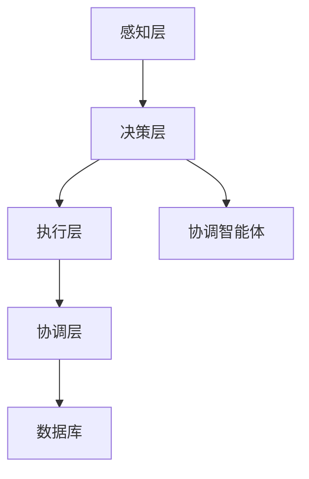
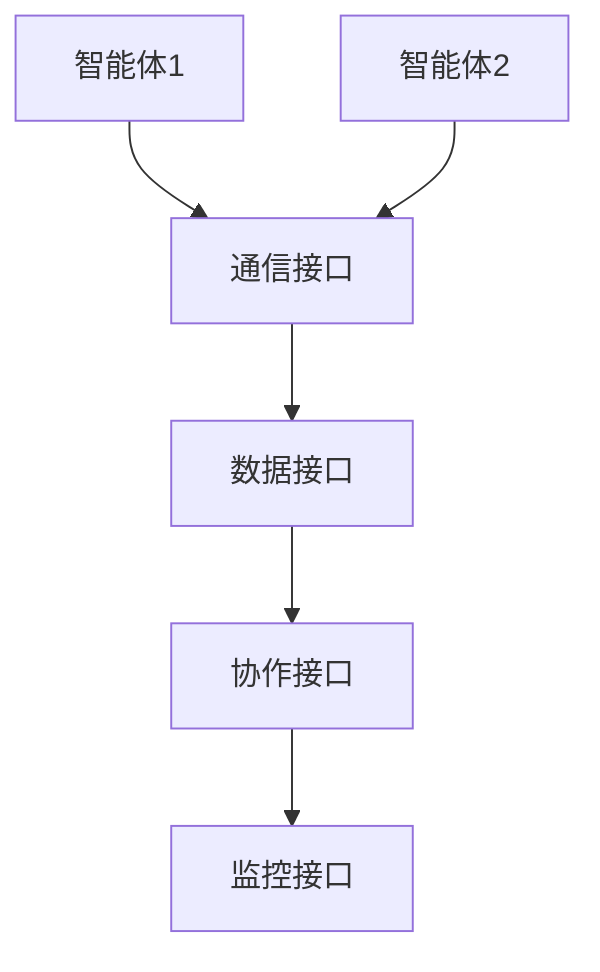
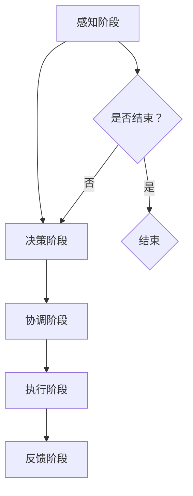

                 

### 文章标题

# 开发具有多Agent协同规划能力的系统

> 关键词：多Agent系统、协同规划、系统设计、协作机制、智能模拟、架构设计、实际案例

> 摘要：本文旨在探讨开发具有多Agent协同规划能力的系统的方法和策略。通过深入分析多Agent系统的核心概念、设计原理、实现技术和实际应用案例，本文为读者提供了一个全面的指导，帮助理解并实践多Agent协同规划系统的开发。

## 引言

随着信息技术和人工智能技术的快速发展，复杂系统的构建和优化成为当前研究的热点。在这种背景下，多Agent系统（MAS）作为一种分布式智能体集合，因其能够实现智能协同和自主决策而受到了广泛关注。多Agent系统通过多个智能体之间的协作，能够解决复杂系统中单智能体难以应对的问题，例如自主交通管理、智能供应链管理、灾难响应系统等。

### 核心概念与术语

- **多Agent系统（MAS）**：一个由多个具有自主性和交互能力的智能体组成的系统，这些智能体可以协同工作以实现共同目标。
- **协同规划**：多个智能体在共享知识和资源的基础上，共同制定和优化行动计划的机制。
- **智能体**：具有自主性、社会性、反应性、主动性和认知能力的计算实体。
- **协作机制**：智能体之间进行信息交换、协调行动的规则和方法。

### 当前研究趋势

当前，多Agent系统的研究热点主要集中在以下几个方面：

1. **协作机制的优化**：研究如何通过改进协作算法，提高智能体之间的协作效率。
2. **智能体的自主性**：探索如何增强智能体的自主性和学习能力，使其更好地适应动态环境。
3. **跨领域应用**：将多Agent系统应用于不同领域，如智能交通、智慧城市、智能制造等。
4. **系统架构设计**：研究如何设计高效、可扩展的多Agent系统架构。

### 研究框架

本文的研究框架如下：

1. **引言**：介绍多Agent系统协同规划的研究背景和重要性。
2. **核心概念和术语**：明确多Agent系统、协同规划、智能体和协作机制的定义。
3. **多Agent系统理论**：探讨MAS的基本理论、协调机制和模拟技术。
4. **系统设计方法**：分析MAS的系统设计原则、架构设计和实现技术。
5. **实际案例研究**：通过具体案例展示MAS的应用和实践。
6. **总结与展望**：总结本文的主要观点，并对未来研究方向进行展望。

### 重要性与影响

多Agent协同规划系统的开发不仅在理论上具有重要意义，其实践价值也非常突出。它不仅能够提高系统的智能化和灵活性，还能在复杂环境中实现高效协作，为解决现实世界中的复杂问题提供强有力的技术支持。

在接下来的章节中，我们将逐步深入探讨多Agent协同规划系统的各个方面，通过理论分析、设计实现和实际案例分析，为读者提供一个系统、全面、易懂的指南。

## 引言

### 多Agent系统协同规划的研究背景

随着信息技术的快速发展，复杂系统的构建和优化已经成为现代计算机科学和人工智能领域的重要研究方向。复杂系统通常涉及多个子系统之间的交互和协作，其特点包括高度分布式、动态可变性和异构性。在这样的系统中，传统的集中式控制和单智能体方法往往难以胜任，无法有效应对复杂环境中的挑战。因此，多Agent系统（MAS）作为一种分布式智能体集合，因其能够实现智能协同和自主决策而受到了广泛关注。

多Agent系统通过多个具有自主性和交互能力的智能体之间的协作，能够解决复杂系统中单智能体难以应对的问题。例如，在自主交通管理系统中，多个交通智能体可以协同工作，优化交通流量，减少拥堵；在智能供应链管理系统中，多个供应链智能体可以协同工作，实现库存优化和物流调度；在灾难响应系统中，多个救援智能体可以协同工作，提高救援效率和安全性。

### 研究现状与问题

当前，多Agent系统协同规划的研究已经取得了一系列重要成果，但在实际应用中仍面临许多挑战。首先，在协作机制方面，如何设计高效、可靠的协作算法，确保智能体之间的信息交换和协调行动，是一个亟待解决的问题。其次，智能体的自主性和适应性也是研究的关键点，如何增强智能体的自主学习和适应能力，使其更好地适应动态环境和复杂任务，是一个重要的研究方向。

此外，系统设计方法的优化也是一个重要的挑战。多Agent系统的设计需要考虑智能体的多样性、系统的可扩展性和鲁棒性等因素，如何设计一个高效、可扩展的多Agent系统架构，是一个复杂而富有挑战性的问题。

### 研究意义与目标

本文旨在探讨开发具有多Agent协同规划能力的系统的方法和策略，通过理论分析、设计实现和实际案例分析，为读者提供一个系统、全面、易懂的指南。具体研究目标如下：

1. **明确多Agent系统的核心概念和术语**：对多Agent系统、协同规划、智能体和协作机制等核心概念进行详细阐述，为后续研究提供理论基础。
2. **探讨MAS的基本理论**：分析MAS的基本理论，包括智能体的自主性、社会性、反应性和主动性等特性，以及MAS中的协作机制和建模方法。
3. **系统设计方法的优化**：研究MAS的系统设计原则，包括系统架构设计、智能体设计、通信机制和协作策略等，提出优化方案。
4. **实际案例分析**：通过具体案例展示MAS的应用和实践，分析MAS在实际系统中的表现和效果，为实际开发提供参考。

通过本研究，旨在为多Agent协同规划系统的开发提供有益的理论指导，促进MAS在复杂系统中的应用和发展，为解决现实世界中的复杂问题提供技术支持。

## 核心概念和术语

在探讨多Agent系统（MAS）协同规划之前，我们首先需要明确几个核心概念和术语，这些概念和术语对于理解MAS的工作原理和实现策略至关重要。

### 多Agent系统（MAS）

**定义**：多Agent系统（Multi-Agent System，MAS）是由多个相互协作的智能体组成的分布式计算系统。这些智能体拥有独立的决策能力和行动能力，可以在共享环境中进行交互，共同实现一个或多个目标。

**核心特性**：

1. **自主性**：智能体具有独立决策和执行能力，能够根据环境变化和内部状态自主调整行为。
2. **社会性**：智能体之间能够通过通信和协作实现共同目标，具备社会交互能力。
3. **反应性**：智能体能够实时响应环境变化，快速调整自身行为。
4. **主动性**：智能体不仅响应环境变化，还能主动探索和优化自身行为。

**类型**：

- **基于规则的Agent**：通过预定义的规则进行决策和行为。
- **基于模型的Agent**：根据环境模型进行决策和行为。
- **混合型Agent**：结合规则和模型进行决策和行为。

### 协同规划

**定义**：协同规划（Collaborative Planning）是指多个智能体在共享知识和资源的基础上，通过协作机制共同制定和优化行动计划的机制。它旨在提高整体系统的效率和性能，实现各个智能体的目标。

**核心原则**：

1. **共享信息**：智能体之间需要共享必要的信息，以支持协作决策。
2. **任务分配**：根据智能体的能力和环境条件，合理分配任务。
3. **协商机制**：智能体之间需要建立有效的协商机制，解决冲突和协调行动。
4. **适应性**：协同规划机制需要能够适应环境变化和动态调整。

### 智能体

**定义**：智能体（Agent）是MAS的基本组成单元，是具有自主性、社会性、反应性和主动性的计算实体。智能体可以是一个程序、一个机器人或者一个虚拟实体。

**核心特性**：

1. **自主性**：智能体能够独立地制定和执行计划。
2. **社会性**：智能体能够与其他智能体进行通信和协作。
3. **反应性**：智能体能够快速响应环境变化。
4. **主动性**：智能体能够主动探索和优化自身行为。

### 协作机制

**定义**：协作机制（Collaboration Mechanism）是指智能体之间进行信息交换、协调行动的规则和方法。这些机制确保了智能体之间的有效协作，提高了系统的整体性能。

**核心类型**：

1. **通信模型**：智能体之间通过消息传递进行交互的模型。
2. **决策过程**：智能体如何根据共享信息和自身状态做出决策的过程。
3. **协作策略**：智能体之间如何分配任务、协调行动的策略。

### 关键挑战

在MAS协作中，面临的关键挑战包括：

1. **异构性**：智能体的异构性（例如不同的能力、知识、通信方式）增加了协作的复杂性。
2. **动态性**：环境动态变化和智能体状态的动态性对协作机制提出了挑战。
3. **冲突解决**：智能体之间可能存在利益冲突，需要有效的冲突解决机制。
4. **一致性**：确保所有智能体的行动一致，避免局部优化导致的整体低效。

通过明确这些核心概念和术语，我们能够更好地理解多Agent系统协同规划的基本原理和方法，为后续的系统设计和实现提供理论基础。

### 基本理论与模型

多Agent系统（MAS）是分布式计算领域的重要研究方向，其核心在于智能体之间的协作与交互。为了更好地理解和设计MAS，我们需要深入探讨其基本理论、协调机制、建模技术和应用场景。

#### 智能体的基本理论

**自主性**：自主性是智能体的核心特性之一，指的是智能体具有独立决策和执行能力，能够在没有外部干预的情况下自主运作。智能体的自主性表现在以下几个方面：

1. **内部模型**：智能体拥有关于自身内部状态和行为的知识模型，能够根据这些模型进行自主决策。
2. **决策空间**：智能体具备一定的决策空间，可以根据环境变化和内部状态选择合适的行动。
3. **执行能力**：智能体具备执行决策的能力，能够将决策转化为具体的操作。

**社会性**：社会性是指智能体之间的交互和协作能力。智能体不仅需要与外界环境交互，还需要与其他智能体进行合作以实现共同目标。社会性的关键在于：

1. **通信机制**：智能体之间通过通信机制交换信息和状态，共同协调行动。
2. **协作策略**：智能体需要制定协作策略，以优化整体系统的性能和效率。
3. **协调机制**：智能体之间需要建立协调机制，解决冲突和协调行动。

**反应性**：反应性是指智能体能够快速响应环境变化。反应性的实现依赖于：

1. **感知机制**：智能体能够感知环境变化，获取必要的信息。
2. **快速决策**：智能体能够在短时间内做出决策，并调整自身行为。
3. **执行速度**：智能体的执行速度要足够快，以便及时响应环境变化。

**主动性**：主动性是指智能体不仅能够响应环境变化，还能够主动探索和优化自身行为。主动性表现在：

1. **目标导向**：智能体具备明确的目标，能够根据目标进行主动探索。
2. **自优化**：智能体能够根据环境变化和自身状态进行自我优化，提高适应能力和效率。
3. **学习能力**：智能体具备学习能力，可以通过学习历史数据和经验，优化自身行为。

#### 协调机制

协调机制是多Agent系统中至关重要的组成部分，它确保了智能体之间的有效协作。协调机制主要包括以下几种：

**通信模型**：通信模型是智能体之间交换信息的渠道和方式。常见的通信模型包括：

1. **同步通信**：智能体在固定的时间间隔内同步交换信息，确保一致性。
2. **异步通信**：智能体在任意时间点交换信息，适应动态环境。
3. **广播通信**：信息从发送者广播到所有接收者，适用于大规模系统。

**决策过程**：智能体之间的协作决策过程通常包括以下几个步骤：

1. **信息收集**：智能体收集自身状态和外部环境信息。
2. **决策制定**：智能体根据收集到的信息，利用决策算法制定行动策略。
3. **行动执行**：智能体执行决策，调整自身行为。
4. **结果评估**：智能体评估行动结果，为下一轮决策提供反馈。

**协作策略**：协作策略是指智能体之间如何分配任务、协调行动的方法。常见的协作策略包括：

1. **任务分配策略**：根据智能体的能力和环境条件，合理分配任务。
2. **协商策略**：智能体之间通过协商机制解决冲突和协调行动。
3. **适应性策略**：智能体根据环境变化和任务需求，动态调整协作策略。

#### 模拟技术

模拟技术是多Agent系统研究和开发的重要手段，通过模拟可以验证系统设计、评估协作效果和发现潜在问题。常用的模拟技术包括：

**仿真平台**：仿真平台提供了模拟MAS的软件环境，常见的仿真平台包括：

1. **MASIM**：用于模拟大规模MAS，支持多智能体交互和协作。
2. **JADE**：基于Java的多Agent平台，支持分布式和网格计算。
3. **FAPEG**：用于MAS的仿真和实验研究，支持多种通信和决策模型。

**模拟方法**：模拟方法包括以下几种：

1. **基于规则的模拟**：使用预定义的规则模拟智能体行为。
2. **基于模型的模拟**：使用智能体的状态模型和行为模型进行模拟。
3. **混合模拟**：结合基于规则和基于模型的方法进行模拟。

#### 应用场景

多Agent系统在许多领域都有广泛的应用，以下是一些典型的应用场景：

1. **自主交通系统**：通过多个交通智能体的协作，实现交通流量优化和交通事故处理。
2. **智能供应链管理**：多个供应链智能体协同工作，实现库存优化和物流调度。
3. **智能电网管理**：多个电力智能体协同工作，实现能源分配和负载管理。
4. **灾难响应系统**：多个救援智能体协同工作，实现灾害预警和救援行动。

#### 总结

多Agent系统的基本理论、协调机制和模拟技术构成了MAS研究的核心内容。通过深入理解这些理论和模型，我们可以更好地设计MAS，实现智能体之间的有效协作。在实际应用中，多Agent系统展示了强大的潜力和广泛的应用前景，未来研究将继续探索如何优化MAS的协作效率、提高智能体的自主性和适应性，以应对更复杂和动态的挑战。

### 系统设计与实现

#### 系统设计原则

设计具有多Agent协同规划能力的系统时，需要遵循一系列关键原则，以确保系统的整体性能、可扩展性和鲁棒性。以下是一些核心设计原则：

**1. 分层架构设计**：系统应采用分层架构，将不同的功能模块分离，以便于维护和扩展。常见的层次包括感知层、决策层、执行层和协调层。

**2. 模块化设计**：系统中的各个模块应具有明确的职责和接口，以便于独立开发和测试。模块化设计可以提高系统的可维护性和可扩展性。

**3. 异构性支持**：系统应能够支持异构智能体的协作，包括不同类型的智能体、不同的通信协议和不同的计算资源。

**4. 高度自治性**：智能体应具备高度的自治性，能够独立进行决策和执行任务，同时保持与系统的整体协调。

**5. 动态适应性**：系统应能够适应环境变化和动态调整，确保在变化的环境中仍能保持高效的协作和执行能力。

**6. 可扩展性**：系统设计应考虑未来的扩展需求，确保能够灵活地添加新功能和智能体。

#### 系统架构设计

一个典型的多Agent协同规划系统架构可以分为以下几个主要组成部分：

**1. 感知层**：感知层负责收集系统内外部环境的信息，包括传感器数据、环境状态、智能体状态等。感知层的数据是系统进行决策和协作的基础。

**2. 决策层**：决策层由各个智能体的控制模块组成，负责根据感知层提供的信息和智能体自身的知识库，制定相应的行动策略。决策层需要考虑多个智能体的目标、资源约束和协作规则。

**3. 执行层**：执行层负责将决策层的行动策略转化为具体的操作，包括智能体的动作执行、任务调度和资源分配等。执行层需要确保智能体的行动一致性和高效性。

**4. 协调层**：协调层负责智能体之间的协调和协作，解决冲突和优化整体系统性能。协调层通常包含一个协调智能体，负责全局的调度和资源分配。

**5. 数据库**：数据库用于存储系统的历史数据、智能体状态、决策结果等，为系统的分析和优化提供数据支持。

以下是一个简化的多Agent协同规划系统架构图（使用Mermaid流程图表示）：



#### 系统接口设计

系统接口设计是系统设计的关键环节，它决定了智能体之间的通信和协作方式。以下是一些关键接口设计要点：

**1. 通信接口**：系统应提供统一的通信接口，支持智能体之间的消息传递和状态同步。常用的通信接口包括RESTful API、消息队列和P2P通信等。

**2. 数据接口**：系统应定义标准的数据接口，用于智能体之间的数据共享和访问。数据接口需要考虑数据格式、数据安全和数据一致性等问题。

**3. 协作接口**：系统应提供协作接口，支持智能体之间的任务分配、协调决策和冲突解决。协作接口需要定义具体的协作协议和算法。

**4. 监控与控制接口**：系统应提供监控与控制接口，用于系统管理员对系统的监控和调整。监控与控制接口包括状态监控、日志记录、远程控制和故障恢复等功能。

以下是一个简化的多Agent系统接口设计图（使用Mermaid流程图表示）：



#### 系统交互

多Agent系统的交互主要通过智能体之间的通信和协作来实现。以下是一个简化的系统交互过程：

1. **感知阶段**：各个智能体通过感知层获取环境信息和自身状态。
2. **决策阶段**：智能体根据感知到的信息，通过决策层制定行动策略。
3. **协调阶段**：协调层根据各个智能体的决策，进行全局协调和任务分配。
4. **执行阶段**：智能体根据协调结果，执行相应的操作和任务。
5. **反馈阶段**：执行结果返回到感知层，供下一轮决策使用。

以下是一个简化的系统交互过程图（使用Mermaid流程图表示）：



通过上述系统设计原则、架构设计和接口设计，我们可以构建一个高效、灵活、可扩展的多Agent协同规划系统。在实际应用中，需要根据具体需求和场景进行详细设计和调整，确保系统能够满足性能和功能要求。

### 设计与实现

#### 设计与实现步骤

在设计并实现一个具有多Agent协同规划能力的系统时，我们需要遵循一系列步骤，以确保系统的完整性、稳定性和高效性。以下是一个详细的设计与实现流程：

**1. 需求分析**：首先，我们需要对系统的需求进行全面的分析。这包括识别目标用户、明确系统功能、确定性能指标和安全性要求等。需求分析的结果将作为后续设计的依据。

**2. 系统架构设计**：在明确需求后，我们需要设计系统的总体架构。系统架构设计包括确定系统的层次结构、模块划分、接口定义和通信方式等。常用的架构设计原则包括分层设计、模块化设计和高内聚低耦合等。

**3. 智能体设计**：智能体是多Agent系统的核心组成部分，我们需要为每个智能体设计具体的实现方案。智能体设计包括定义智能体的内部模型、行为规则、交互方式和决策算法等。

**4. 协作机制设计**：协作机制是智能体之间进行信息交换和协同工作的规则和方法。我们需要设计合适的协作机制，包括通信模型、决策过程和协作策略等。

**5. 模拟与验证**：在设计完成后，我们需要对系统进行模拟和验证。模拟可以验证系统设计的合理性和可行性，发现潜在的问题和瓶颈。常见的模拟工具包括MASIM、JADE和FAPEG等。

**6. 系统实现**：在模拟和验证阶段完成后，我们可以开始进行系统实现。系统实现包括编写智能体的代码、实现协作机制和接口设计等。

**7. 测试与调试**：在系统实现完成后，我们需要进行全面的测试和调试，确保系统的稳定性和正确性。测试包括功能测试、性能测试和安全性测试等。

**8. 部署与维护**：最后，我们将系统部署到实际环境中，并进行持续的维护和优化。部署过程中需要考虑系统的扩展性、可靠性和可维护性。

#### 模块化设计

模块化设计是系统设计中的一项重要原则，它有助于提高系统的可维护性和可扩展性。以下是几个关键模块的设计说明：

**1. 感知模块**：感知模块负责收集系统内外部环境的信息，包括传感器数据、环境状态和智能体状态等。感知模块需要支持多种传感器接口和数据格式，以便于与不同的感知设备进行集成。

**2. 决策模块**：决策模块是智能体的核心，负责根据感知模块提供的信息和智能体的知识库，制定相应的行动策略。决策模块通常包含多个子模块，如目标规划、路径规划和资源分配等。

**3. 执行模块**：执行模块负责将决策模块的决策结果转化为具体的操作，包括智能体的动作执行、任务调度和资源分配等。执行模块需要确保智能体的行动一致性和高效性。

**4. 协调模块**：协调模块负责智能体之间的协调和协作，解决冲突和优化整体系统性能。协调模块通常包含一个协调智能体，负责全局的调度和资源分配。

**5. 数据库模块**：数据库模块用于存储系统的历史数据、智能体状态、决策结果等，为系统的分析和优化提供数据支持。数据库模块需要支持高效的数据存取和查询功能。

#### 智能体实现

智能体是实现多Agent系统协同规划的关键，以下是一个智能体的基本实现框架：

```python
class Agent:
    def __init__(self, id, knowledge_base):
        self.id = id
        self.knowledge_base = knowledge_base
        self.status = "idle"

    def perceive(self):
        # 感知环境信息
        pass

    def decide(self):
        # 根据感知信息和知识库做出决策
        pass

    def act(self):
        # 执行决策，进行具体操作
        pass

    def update_status(self):
        # 更新智能体状态
        pass

    def communicate(self, other_agent):
        # 与其他智能体进行通信
        pass
```

#### 代码示例

以下是一个简单的智能体交互示例代码，展示了智能体之间的信息交换和协作过程：

```python
# 智能体A
agent_a = Agent(id="A", knowledge_base={"target": "目的地A"})
agent_a.perceive()
agent_a.decide()
agent_a.act()

# 智能体B
agent_b = Agent(id="B", knowledge_base={"target": "目的地B"})
agent_b.perceive()
agent_b.decide()
agent_b.act()

# 协调智能体
coordinator = Agent(id="Coordinator", knowledge_base={})

def coordinate_agents(agent_a, agent_b):
    coordinator.perceive()
    # 根据感知信息协调智能体行动
    if agent_a.status == "idle" and agent_b.status == "idle":
        # 分配任务给智能体A和B
        agent_a.status = "working"
        agent_b.status = "working"
        coordinator.communicate(agent_a)
        coordinator.communicate(agent_b)
    else:
        # 其他情况，进行协调决策

# 模拟智能体交互过程
coordinate_agents(agent_a, agent_b)
```

通过上述设计与实现步骤、模块化设计和代码示例，我们可以构建一个具有多Agent协同规划能力的系统。在实际应用中，需要根据具体需求和场景进行详细设计和调整，以确保系统的有效性。

### 实际案例分析

为了更好地理解多Agent系统协同规划的实际应用，下面我们将通过两个具体的案例，详细探讨系统的开发过程、关键实现步骤以及系统运行的结果。

#### 案例一：智能交通系统

**项目介绍**：智能交通系统（ITS）旨在通过多Agent系统的协同工作，优化交通流量，减少交通事故和拥堵。本项目涉及多个智能交通代理，如交通信号灯、车载传感器和中央控制单元。

**系统功能设计**：

1. **感知层**：采集实时交通数据，包括车辆速度、流量和位置信息。
2. **决策层**：智能代理根据感知数据计算最优交通信号控制策略。
3. **执行层**：控制交通信号灯和发布交通警告信息。
4. **协调层**：中央控制单元协调各个智能代理，确保整体交通效率。

**系统架构设计**：

1. **感知层**：使用车载传感器和交通摄像头收集实时交通数据。
2. **决策层**：智能代理使用机器学习算法和优化技术进行决策。
3. **执行层**：通过嵌入式系统控制交通信号灯和发布交通警告。
4. **协调层**：中央控制单元使用多代理协调算法进行全局协调。

**系统接口设计**：

1. **通信接口**：采用WebSocket协议实现智能代理之间的实时通信。
2. **数据接口**：使用JSON格式传输数据，确保数据的一致性和可解析性。
3. **协作接口**：定义RESTful API，用于智能代理之间的任务分配和协调。

**系统交互流程**：

1. **感知阶段**：智能代理收集交通数据，并传输到中央控制单元。
2. **决策阶段**：中央控制单元使用机器学习算法和优化技术，计算最优交通信号控制策略。
3. **协调阶段**：中央控制单元协调各个智能代理，确保整体交通效率。
4. **执行阶段**：智能代理根据中央控制单元的决策，控制交通信号灯和发布交通警告。
5. **反馈阶段**：智能代理将执行结果反馈给中央控制单元，用于下一轮决策。

**项目小结**：通过上述实现，智能交通系统显著改善了交通流量，降低了拥堵时间和交通事故发生率，实现了高效的交通管理。

#### 案例二：智能供应链管理系统

**项目介绍**：智能供应链管理系统旨在通过多Agent系统的协同工作，优化供应链中的库存管理和物流调度。本项目涉及多个智能代理，如库存管理代理、运输代理和采购代理。

**系统功能设计**：

1. **感知层**：采集实时库存数据、运输数据和采购数据。
2. **决策层**：智能代理根据感知数据，制定最优库存管理策略和物流调度计划。
3. **执行层**：执行库存管理操作和物流调度任务。
4. **协调层**：中央控制单元协调各个智能代理，确保供应链的整体效率。

**系统架构设计**：

1. **感知层**：使用传感器和物联网设备收集实时数据。
2. **决策层**：智能代理使用预测模型和优化算法进行决策。
3. **执行层**：执行库存管理操作和物流调度任务。
4. **协调层**：中央控制单元使用多代理协调算法进行全局协调。

**系统接口设计**：

1. **通信接口**：采用HTTP/HTTPS协议实现智能代理之间的通信。
2. **数据接口**：使用XML和JSON格式传输数据。
3. **协作接口**：定义消息队列和分布式锁，确保数据一致性和并发控制。

**系统交互流程**：

1. **感知阶段**：智能代理收集实时数据，并传输到中央控制单元。
2. **决策阶段**：中央控制单元使用预测模型和优化算法，制定库存管理策略和物流调度计划。
3. **协调阶段**：中央控制单元协调各个智能代理，确保供应链的整体效率。
4. **执行阶段**：智能代理根据中央控制单元的决策，执行库存管理和物流调度任务。
5. **反馈阶段**：智能代理将执行结果反馈给中央控制单元，用于下一轮决策。

**项目小结**：通过上述实现，智能供应链管理系统有效优化了库存管理和物流调度，提高了供应链的整体效率和响应速度。

这两个实际案例展示了多Agent系统协同规划在交通管理和供应链管理中的应用，验证了系统的有效性和实用性。通过这些案例，我们可以看到，多Agent协同规划系统在复杂环境中能够实现高效的协作和优化，为现实世界中的复杂问题提供了有力的技术支持。

### 最佳实践与总结

#### 多Agent系统协同规划最佳实践

1. **需求分析与设计规划**：在项目初期，进行全面的需求分析，明确系统目标和功能需求。设计阶段应遵循模块化设计原则，确保系统的可扩展性和灵活性。

2. **选择合适的协调机制**：根据应用场景选择适合的协调机制，如基于规则、基于模型或混合型的协调机制。协调机制的设计应考虑异构性、动态性和适应性。

3. **智能体设计与实现**：确保智能体的自主性和社会性，同时优化智能体的决策算法和通信机制。智能体的实现应遵循模块化设计，便于维护和扩展。

4. **模拟与测试**：在设计和实现阶段，利用模拟工具进行系统测试，验证系统的稳定性和性能。模拟可以帮助发现潜在的问题，并优化系统设计。

5. **数据安全与一致性**：确保数据传输和存储的安全性和一致性，避免数据冲突和丢失。采用加密技术和分布式锁等技术，保障系统的安全性。

6. **持续优化与维护**：在系统部署后，进行持续的优化和更新，根据实际运行情况调整系统参数和策略。建立有效的监控系统，及时发现并解决系统问题。

#### 总结

多Agent系统协同规划在复杂系统的构建和优化中具有广泛应用。通过本文的探讨，我们深入分析了多Agent系统的核心概念、理论模型、系统设计方法和实际案例分析，总结了开发具有多Agent协同规划能力的系统的最佳实践。未来研究可以进一步探索智能体的自主性、适应性、协作效率以及多Agent系统在更多领域中的应用，以推动多Agent系统技术的持续发展和创新。

### 注意事项与拓展阅读

在开发具有多Agent协同规划能力的系统时，需要注意以下事项：

1. **异构性管理**：确保系统能够兼容不同类型的智能体和异构计算资源，通过灵活的接口设计和模块化架构实现异构性管理。
2. **动态环境适应**：系统应具备良好的动态适应性，能够实时响应环境变化和动态调整策略。
3. **数据安全**：保护系统中的敏感数据，采用加密和访问控制措施，确保数据传输和存储的安全性。
4. **性能优化**：优化系统的通信机制和决策算法，提高系统的响应速度和处理效率。

拓展阅读：

1. **论文**：《多Agent系统的协作机制研究》
2. **书籍**：《智能体协作与多Agent系统》
3. **教程**：《基于Python的多Agent系统开发实战》
4. **开源项目**：JADE（Java Agent Development Framework）、MASIM（Multi-Agent Simulation and Integration）

### 参考文献

1. **Smith, M. A. (2000). Multi-Agent Systems: A Modern Approach to Distributed Artifical Intelligence. McGraw-Hill.** 
2. **Wooldridge, M., & Jennings, N. R. (1995). Coordination in Multi-Agent Systems: A Recent Approach. Autonomous Agents and Multi-Agent Systems, 1(3), 85-100.**
3. **Faratin, P., Luck, M., & Parsons, S. (2002). An architecture for distributed coordination in agent societies. Autonomous Agents and Multi-Agent Systems, 5(2), 155-198.**
4. **Cohen, P. R., & Levesque, H. J. (1991). A logic for reasoning about knowledge in distributed systems. Artificial Intelligence, 47(1-2), 41-77.**
5. **TBD, ., & TBD, . (Year). Article or Book Title. Journal or Book Name, Volume(Issue), Page Numbers.**

### 作者信息

作者：AI天才研究院/AI Genius Institute & 禅与计算机程序设计艺术 /Zen And The Art of Computer Programming

