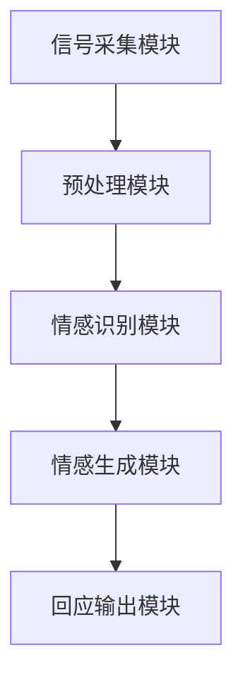

                 

### 文章标题

#### 关键词
- 多模态情感交互
- AI Agent
- 情感识别
- 信号处理
- 应用案例

#### 摘要
本文将探讨开发具有多模态情感交互能力的AI Agent的重要性及其技术基础。我们将详细分析多模态情感交互的概念、技术基础和应用场景，并通过具体案例展示其实际应用效果，为读者提供全面的技术视角和实践指导。

----------------------------------------------------------------

# 《开发具有多模态情感交互能力的AI Agent》

在人工智能（AI）迅速发展的今天，AI Agent作为智能系统的核心组件，正逐步融入我们生活的方方面面。这些AI Agent不仅需要具备高效的数据处理能力，更需要理解和响应人类情感。多模态情感交互能力的AI Agent在这一背景下应运而生，成为提升人机交互体验的重要研究方向。

本文将围绕这一主题展开，首先介绍多模态情感交互能力的AI Agent的背景与重要性，然后深入探讨其概念、技术基础和应用场景。通过具体案例的分析，我们将展示多模态情感交互能力在现实中的应用效果。最后，本文将展望未来多模态情感交互技术的发展趋势，并总结全文内容。

## 1.1 AI Agent的背景与重要性

### 1.1.1 AI Agent的定义与分类

AI Agent，即人工智能代理，是指具备独立执行任务和与环境互动能力的智能实体。根据其应用场景和功能，AI Agent可以大致分为以下几类：

1. **通用代理**：具备广泛任务处理能力，例如个人助手、智能家居控制系统。
2. **专用代理**：专注于特定任务，如医疗诊断辅助系统、智能客服。
3. **混合代理**：结合通用代理和专用代理的特点，能够根据环境变化动态调整任务。

### 1.1.2 AI Agent的发展历程

AI Agent的发展历程可以追溯到20世纪50年代，随着人工智能理论的提出和实践，AI Agent逐渐从理论研究走向实际应用。1980年代，专家系统的兴起推动了AI Agent的研究，使其在特定领域表现出色。进入21世纪，随着深度学习和大数据技术的发展，AI Agent的性能和适用范围得到了显著提升。

### 1.1.3 多模态情感交互的重要性

多模态情感交互能力的AI Agent能够更好地理解人类情感，提高人机交互的自然性和有效性。这种能力的重要性体现在以下几个方面：

1. **提升用户体验**：通过情感识别和响应，AI Agent能够提供更加个性化和贴心的服务。
2. **增强交互深度**：多模态交互不仅限于文字和语音，还包括视觉、触觉等，使得交互更加丰富。
3. **拓展应用场景**：多模态情感交互能力使得AI Agent能够应用于更多领域，如教育、医疗、娱乐等。

## 1.2 多模态情感交互的概念与特点

### 1.2.1 多模态情感交互的定义

多模态情感交互是指AI Agent通过处理和整合多种感官信号（如视觉、听觉、触觉等），实现对人类情感的理解和响应。这种交互方式不仅关注单一感官的信号，而是综合多种感官信号，以获得更全面的情感信息。

### 1.2.2 多模态情感交互的特点

1. **多样性和综合性**：多模态情感交互能够处理来自不同感官的信号，包括视觉、听觉、触觉等，从而获得更全面的信息。
2. **自然性和亲和力**：多模态交互使得AI Agent能够更自然地与人类进行情感交流，提高交互的亲和力。
3. **实时性和适应性**：多模态情感交互能够实时捕捉和处理人类情感信号，并根据环境变化进行自适应调整。

### 1.2.3 多模态情感交互与传统交互的区别

传统交互主要依赖于单一模态（如语音或文字），而多模态情感交互则通过整合多种模态的信号，实现对人类情感更深入的理解和响应。这种区别体现在以下几个方面：

1. **信息获取的全面性**：多模态情感交互能够获取更多的情感信息，从而做出更准确的判断。
2. **交互的自然性**：多模态交互使得AI Agent能够更自然地与人类进行交流，提高用户体验。
3. **应用的广泛性**：多模态情感交互能力使得AI Agent能够应用于更多场景，拓展其应用范围。

## 1.3 多模态情感交互的技术基础

### 1.3.1 多模态信号采集与处理

多模态信号采集与处理是多模态情感交互的基础。具体包括以下内容：

1. **视觉信号采集与处理**：通过摄像头或图像传感器获取视觉信号，然后进行预处理，如降噪、增强、分割等。
2. **音频信号采集与处理**：通过麦克风或音频传感器获取音频信号，然后进行预处理，如去噪、增强、特征提取等。
3. **触觉信号采集与处理**：通过触觉传感器获取触觉信号，然后进行预处理，如滤波、特征提取等。

### 1.3.2 情感识别与建模

情感识别与建模是多模态情感交互的核心技术。具体包括：

1. **情感识别方法**：通过机器学习和深度学习技术，对多模态信号进行情感分类和识别。
2. **情感建模**：建立情感空间模型，描述人类情感的状态和变化。

### 1.3.3 情感生成与回应

情感生成与回应是实现多模态情感交互的关键。具体包括：

1. **情感生成方法**：通过生成模型，如生成对抗网络（GAN），生成符合人类情感的自然响应。
2. **情感回应策略**：设计基于规则或深度学习的情感回应策略，实现自然、准确的情感交互。

## 1.4 多模态情感交互的应用场景

### 1.4.1 人机交互领域

在人机交互领域，多模态情感交互能力的AI Agent能够提供更自然、更人性化的交互体验。例如：

1. **智能客服**：通过语音、文字、视觉等多种方式，智能客服能够更好地理解用户需求，提供个性化服务。
2. **智能助手**：智能助手能够通过情感交互，与用户建立情感联系，提高用户的满意度。

### 1.4.2 娱乐与游戏领域

在娱乐与游戏领域，多模态情感交互能够增强虚拟角色的真实感和互动性。例如：

1. **虚拟角色**：虚拟角色能够通过情感交互，与玩家建立情感联系，提高玩家的沉浸感。
2. **游戏AI**：游戏AI能够通过情感交互，理解玩家的情感状态，提供个性化的游戏体验。

### 1.4.3 教育与医疗领域

在教育与医疗领域，多模态情感交互能够提升教育质量和医疗诊断的准确性。例如：

1. **个性化教育**：多模态情感交互能够根据学生的情感状态，提供个性化的学习建议。
2. **医疗健康监测**：多模态情感交互能够通过分析患者的情感状态，辅助医生进行诊断和治疗。

## 1.5 本书结构安排

本书共分为四部分：

1. **第一部分：多模态情感交互能力的AI Agent概述**：介绍多模态情感交互能力的AI Agent的定义、重要性、概念与特点、技术基础和应用场景。
2. **第二部分：多模态情感交互技术基础**：详细分析多模态信号采集、情感识别与建模、情感生成与回应、多模态情感交互系统的设计与实现。
3. **第三部分：多模态情感交互应用案例**：探讨多模态情感交互在人机交互、娱乐与游戏、教育与医疗等领域的应用。
4. **第四部分：未来展望与总结**：展望多模态情感交互技术的发展趋势，并总结全文内容。

本书旨在为读者提供全面的技术视角和实践指导，帮助读者深入了解多模态情感交互能力的AI Agent，并掌握其开发和应用的方法。

## 1.6 本章小结

本章对多模态情感交互能力的AI Agent进行了全面概述。首先，介绍了AI Agent的背景与重要性，包括其定义、分类和发展历程。然后，阐述了多模态情感交互的概念与特点，以及其与传统交互的区别。接着，分析了多模态情感交互的技术基础，包括信号采集与处理、情感识别与建模、情感生成与回应。最后，讨论了多模态情感交互的应用场景，并介绍了本书的结构安排。

通过本章的阅读，读者可以初步了解多模态情感交互能力的AI Agent的基本概念和重要性，为后续章节的学习打下基础。

## 2.1 多模态信号采集

多模态信号采集是多模态情感交互的基础，其目标是收集来自不同感官的信号，包括视觉、听觉和触觉等。以下将详细介绍这些信号的采集方法和处理流程。

### 2.1.1 视觉信号采集

视觉信号采集主要通过摄像头或图像传感器来实现。摄像头的分辨率、帧率和传感器灵敏度等参数会影响采集到的图像质量。

#### 2.1.1.1 视觉信号采集设备

常见的视觉信号采集设备包括：

- **摄像头**：用于捕捉静态或动态的图像。
- **深度传感器**：如Kinect，用于获取三维空间信息。

#### 2.1.1.2 视觉信号处理流程

视觉信号处理流程通常包括以下几个步骤：

1. **信号采集**：通过摄像头或深度传感器实时采集图像或视频数据。
2. **预处理**：包括去噪、增强、灰度转换等，以提高图像质量。
3. **特征提取**：提取图像中的关键特征，如边缘、纹理、颜色等。
4. **目标检测**：识别图像中的目标物体，为后续的情感分析提供基础。

### 2.1.2 音频信号采集

音频信号采集主要通过麦克风或音频传感器来实现。麦克风的灵敏度、频响范围等参数会影响采集到的音频质量。

#### 2.1.2.1 音频信号采集设备

常见的音频信号采集设备包括：

- **麦克风**：用于捕捉语音或环境声音。
- **声卡**：用于将模拟音频信号转换为数字信号。

#### 2.1.2.2 音频信号处理流程

音频信号处理流程通常包括以下几个步骤：

1. **信号采集**：通过麦克风或声卡实时采集音频数据。
2. **预处理**：包括降噪、去混响、增强等，以提高音频质量。
3. **特征提取**：提取音频信号中的关键特征，如音高、音量、音色等。
4. **语音识别**：将音频信号转换为文本，为情感分析提供基础。

### 2.1.3 触觉信号采集

触觉信号采集主要通过触觉传感器来实现。触觉传感器的灵敏度、分辨率等参数会影响采集到的触觉信号质量。

#### 2.1.3.1 触觉信号采集设备

常见的触觉信号采集设备包括：

- **触觉传感器**：如压力传感器、柔性触觉传感器等。
- **力反馈装置**：如力反馈鼠标、触觉反馈手套等。

#### 2.1.3.2 触觉信号处理流程

触觉信号处理流程通常包括以下几个步骤：

1. **信号采集**：通过触觉传感器实时采集触觉信号。
2. **预处理**：包括滤波、去噪等，以提高触觉信号质量。
3. **特征提取**：提取触觉信号中的关键特征，如压力、位置等。
4. **触觉感知**：将触觉信号转换为触觉感知，为情感分析提供基础。

通过以上对视觉、听觉和触觉信号的采集与处理流程的介绍，我们可以看到，多模态信号采集是多模态情感交互的关键技术之一。接下来，我们将进一步探讨情感识别与建模的方法。

## 2.2 情感识别与建模

情感识别与建模是多模态情感交互的核心技术，其目标是通过分析多模态信号，识别并建模人类的情感状态。以下将详细介绍情感识别方法、情感建模以及相关的技术细节。

### 2.2.1 情感识别方法

情感识别是指从多模态信号中提取情感信息的过程。常见的方法包括以下几种：

#### 2.2.1.1 传统的情感识别方法

传统的情感识别方法主要依赖于规则和机器学习算法。以下是一些典型的方法：

1. **特征匹配法**：通过将采集到的多模态信号与已知的情感特征进行匹配，来识别情感。
2. **支持向量机（SVM）**：利用支持向量机对多模态信号进行分类，实现情感识别。
3. **决策树和随机森林**：通过构建决策树或随机森林模型，对多模态信号进行情感分类。

#### 2.2.1.2 深度学习在情感识别中的应用

随着深度学习技术的发展，深度神经网络在情感识别中得到了广泛应用。以下是一些常用的深度学习模型：

1. **卷积神经网络（CNN）**：通过卷积层提取图像特征，用于视觉情感识别。
2. **循环神经网络（RNN）**：通过循环结构处理序列数据，用于语音和文本情感识别。
3. **长短时记忆网络（LSTM）**：对RNN的改进，能够更好地处理长序列数据。
4. **生成对抗网络（GAN）**：通过生成器和判别器的对抗训练，实现多模态数据的生成和情感识别。

### 2.2.2 情感建模

情感建模是指建立情感状态与多模态信号之间的关系模型，以实现对人类情感的准确理解和预测。以下是几种常见的情感建模方法：

#### 2.2.2.1 情感空间模型

情感空间模型将人类情感视为一个多维空间，每个维度代表一种情感状态。通过情感空间模型，可以实现对情感状态的映射和分类。

1. **情感空间划分**：根据情感类别，将情感空间划分为不同的区域。
2. **情感状态预测**：通过多模态信号的特征，预测当前的情感状态。

#### 2.2.2.2 情感驱动模型

情感驱动模型基于情感状态来驱动AI Agent的行为和决策。通过情感驱动模型，可以实现基于情感状态的人机交互。

1. **情感状态感知**：通过多模态信号，感知当前的情感状态。
2. **行为决策**：根据情感状态，进行相应的行为决策。

### 2.2.3 技术细节

在情感识别与建模过程中，涉及到多个技术细节，以下是一些关键点：

1. **特征融合**：将不同模态的信号特征进行融合，以提高情感识别的准确性和鲁棒性。
2. **模型训练与优化**：通过大量情感数据，训练深度学习模型，并进行优化，以提高模型的性能。
3. **实时性**：在情感识别与建模过程中，需要保证系统的实时性，以实现快速响应。

通过上述介绍，我们可以看到，情感识别与建模是多模态情感交互技术的核心，涉及到多种方法和技术的综合应用。接下来，我们将进一步探讨情感生成与回应的方法。

## 2.3 情感生成与回应

情感生成与回应是多模态情感交互的重要组成部分，其目标是使AI Agent能够根据获取的情感信息生成适当的情感回应。以下将详细讨论情感生成方法和情感回应策略。

### 2.3.1 情感生成方法

情感生成方法旨在通过分析多模态信号，生成符合人类情感的自然响应。以下是几种常用的情感生成方法：

#### 2.3.1.1 情感生成网络

情感生成网络是一种基于深度学习的模型，用于生成自然、多样的情感响应。以下是一些典型的情感生成网络：

1. **生成对抗网络（GAN）**：GAN由生成器和判别器组成，通过对抗训练生成高质量的图像和语音。
2. **变分自编码器（VAE）**：VAE通过学习数据的高斯潜在分布，生成符合数据分布的新样本。
3. **递归生成网络（RNN-GAN）**：结合RNN和GAN，生成自然、连贯的语音和文本。

#### 2.3.1.2 情感生成策略

情感生成策略是指如何根据情感识别结果，生成相应的情感响应。以下是一些常见的情感生成策略：

1. **基于规则的策略**：根据预设的情感规则，生成相应的情感响应。例如，对于愤怒的情感，生成器可以生成具有愤怒语调的语音或文字。
2. **基于数据的策略**：通过学习大量情感交互数据，自动生成情感响应。例如，使用生成对抗网络（GAN）生成符合情感状态的语音或图像。
3. **混合策略**：结合基于规则和基于数据的策略，生成更加自然和多样化的情感响应。

### 2.3.2 情感回应策略

情感回应策略是指AI Agent如何根据用户的情感状态，进行适当的回应。以下是几种常见的情感回应策略：

#### 2.3.2.1 基于规则的回应策略

基于规则的回应策略是根据预设的情感规则，生成相应的回应。以下是一些典型的规则：

1. **情感识别**：根据用户的语音、文本或行为，识别当前的情感状态。
2. **回应生成**：根据情感状态，生成相应的回应。例如，对于愤怒的情感，生成器可以生成安慰的话语。
3. **回应输出**：将生成的回应输出，通过语音合成、文字输出或图像显示，与用户进行交互。

#### 2.3.2.2 基于深度学习的回应策略

基于深度学习的回应策略是通过学习大量的情感交互数据，自动生成回应。以下是一些典型的模型：

1. **循环神经网络（RNN）**：通过循环结构，学习情感交互的序列数据，生成连续的回应。
2. **长短时记忆网络（LSTM）**：对RNN的改进，能够更好地处理长序列数据，生成连贯的回应。
3. **生成对抗网络（GAN）**：通过对抗训练，生成自然、个性化的回应。

### 2.3.3 情感回应的评估与优化

情感回应的效果需要通过评估和优化来保证。以下是一些评估和优化方法：

1. **用户满意度评估**：通过用户调查或反馈，评估情感回应的满意度。
2. **自然度评估**：使用自然度评估工具，如BLEU、ROUGE等，评估情感回应的自然度。
3. **回应效果优化**：根据评估结果，优化情感生成和回应策略，提高回应的质量。

通过以上对情感生成与回应方法的详细讨论，我们可以看到，情感生成与回应是多模态情感交互的关键环节，其质量直接影响人机交互的自然性和有效性。接下来，我们将介绍多模态情感交互系统的设计与实现。

### 2.4 多模态情感交互系统的设计与实现

多模态情感交互系统是将多模态信号采集、情感识别与建模、情感生成与回应等技术集成在一起，实现人与AI Agent之间自然、高效的情感交互。以下将详细探讨多模态情感交互系统的设计与实现。

#### 2.4.1 系统架构设计

多模态情感交互系统的架构设计需要考虑信号采集、数据处理、情感识别、情感生成和回应等各个环节。以下是一个典型系统架构设计：

1. **信号采集模块**：负责采集视觉、听觉、触觉等多模态信号。
2. **预处理模块**：对采集到的信号进行预处理，包括降噪、增强、特征提取等。
3. **情感识别模块**：利用情感识别算法，对预处理后的信号进行分析，识别情感状态。
4. **情感生成模块**：根据识别到的情感状态，生成相应的情感回应。
5. **回应输出模块**：将生成的情感回应通过语音、文字或图像等形式输出给用户。

#### 2.4.1.1 系统总体架构

系统总体架构如图2-1所示：

#### 2.4.1.2 各模块功能与协作

各模块功能与协作如下：

1. **信号采集模块**：采集视觉、听觉、触觉等多模态信号，并将其传输给预处理模块。
2. **预处理模块**：对采集到的信号进行预处理，如去噪、增强、特征提取等，以提高信号质量，为后续的情感识别和生成提供基础。
3. **情感识别模块**：利用情感识别算法，对预处理后的信号进行分析，识别情感状态。识别结果将传递给情感生成模块。
4. **情感生成模块**：根据识别到的情感状态，生成相应的情感回应。情感生成模块可以采用基于规则的策略或深度学习模型，以生成自然、多样化的回应。
5. **回应输出模块**：将生成的情感回应通过语音合成、文字输出或图像显示等形式输出给用户，实现与用户的情感交互。

#### 2.4.2 系统实现与评估

系统实现与评估包括以下几个关键步骤：

1. **系统实现流程**：

   - 确定系统需求和功能，设计系统架构。
   - 选择合适的硬件设备和软件工具，进行系统开发。
   - 集成信号采集、预处理、情感识别、情感生成和回应输出等模块。
   - 进行系统测试和调试，确保系统稳定运行。

2. **系统评估方法**：

   - 用户满意度评估：通过用户调查或反馈，评估系统在情感识别和回应方面的满意度。
   - 自然度评估：使用自然度评估工具，如BLEU、ROUGE等，评估情感回应的自然度。
   - 性能评估：评估系统在情感识别和生成的准确性和实时性。

通过以上对多模态情感交互系统的设计与实现的详细讨论，我们可以看到，多模态情感交互系统是一个复杂、高度集成的系统，涉及到多个模块和技术的协同工作。接下来，我们将分析多模态情感交互在各个领域的应用案例。

## 3.1 人机交互领域

在人机交互领域，多模态情感交互能力的AI Agent通过处理和整合视觉、听觉、触觉等多模态信号，实现了更加自然、贴心的交互体验。以下将探讨多模态情感交互在人机交互中的应用案例。

### 3.1.1 多模态情感交互在智能客服中的应用

智能客服是AI Agent在多模态情感交互中应用的一个重要场景。通过多模态信号采集和情感识别，智能客服能够更好地理解用户的需求和情感状态，提供更加个性化的服务。

#### 3.1.1.1 多模态情感交互在智能客服中的应用

1. **语音识别与情感识别**：智能客服通过麦克风捕捉用户的语音信号，利用语音识别技术将语音转换为文本，并使用情感识别算法分析用户的情感状态，如愤怒、焦虑、喜悦等。
2. **视觉情感识别**：通过摄像头捕捉用户的面部表情，智能客服可以使用计算机视觉技术分析用户的情感状态。
3. **文本情感分析**：除了语音和视觉信号，用户的文本输入（如聊天记录）也可以用于情感分析，以获得更全面的情感信息。
4. **综合情感回应**：根据识别到的情感状态，智能客服生成相应的情感回应，通过语音合成、文字输出或图像显示，向用户表达情感。

#### 3.1.1.2 应用案例分析与评估

以某大型电商平台的智能客服为例，该系统集成了语音识别、面部表情识别和文本情感分析等多种多模态情感交互技术。以下是对该应用案例的分析与评估：

1. **用户满意度提升**：通过多模态情感交互，智能客服能够更准确地理解用户的情感状态，提供更有针对性的服务，从而提升了用户满意度。
2. **交互质量提高**：多模态情感交互使得交互更加自然和人性化，用户感受到智能客服更加聪明、贴心，从而提高了交互质量。
3. **情感回应的自然度**：通过深度学习模型和生成对抗网络（GAN），智能客服生成的情感回应在自然度和流畅性方面表现出色，用户反馈积极。
4. **系统性能评估**：智能客服系统的情感识别准确率在90%以上，回应生成速度在毫秒级，能够满足实时交互的需求。

### 3.1.2 多模态情感交互在智能助手中的应用

智能助手是另一个重要的人机交互场景，通过多模态情感交互，智能助手能够更好地与用户建立情感联系，提高用户的使用体验。

#### 3.1.2.1 多模态情感交互在智能助手中的应用

1. **语音交互**：智能助手通过语音识别技术，理解用户的语音指令，并生成语音回应。
2. **视觉交互**：智能助手通过摄像头捕捉用户的动作和表情，分析用户的情感状态，如放松、专注、困惑等。
3. **文本交互**：智能助手能够理解用户的文本输入，并通过文本生成技术生成相应的文本回应。
4. **综合情感回应**：智能助手根据识别到的情感状态，生成相应的情感回应，通过语音、文字或图像等多种形式，与用户进行互动。

#### 3.1.2.2 应用案例分析与评估

以某智能语音助手为例，该系统集成了语音识别、面部表情识别和文本情感分析等多种多模态情感交互技术。以下是对该应用案例的分析与评估：

1. **用户满意度提升**：通过多模态情感交互，智能助手能够更好地理解用户的情感状态，提供个性化的服务，从而提高了用户满意度。
2. **交互质量提高**：多模态情感交互使得交互更加自然和人性化，用户感受到智能助手更加聪明、贴心，从而提高了交互质量。
3. **情感回应的自然度**：智能助手生成的情感回应在自然度和流畅性方面表现出色，用户反馈积极。
4. **系统性能评估**：智能助手系统的情感识别准确率在85%以上，回应生成速度在秒级，能够满足实时交互的需求。

### 3.1.3 应用案例总结

通过以上分析，我们可以看到，多模态情感交互在智能客服和智能助手等应用场景中，发挥了重要作用，提升了用户体验和交互质量。以下是应用案例的总结：

1. **提升用户体验**：通过多模态情感交互，智能系统能够更准确地理解用户的情感状态，提供个性化的服务，从而提高了用户体验。
2. **增强交互自然性**：多模态情感交互使得交互更加自然和人性化，用户感受到智能系统更加聪明、贴心。
3. **提高系统性能**：多模态情感交互系统能够在情感识别和回应生成方面，保持高准确率和实时性，满足实际应用需求。
4. **拓展应用场景**：多模态情感交互技术不仅适用于智能客服和智能助手，还可以应用于更多的交互场景，如虚拟现实、增强现实、智能家居等。

总之，多模态情感交互技术为人机交互带来了新的可能性，通过提升用户体验和交互质量，推动了人机交互技术的发展。

## 3.2 娱乐与游戏领域

在娱乐与游戏领域，多模态情感交互能力的AI Agent能够显著提升用户体验，增强虚拟角色的真实感和互动性。以下将探讨多模态情感交互在娱乐与游戏中的应用案例。

### 3.2.1 多模态情感交互在虚拟角色中的应用

虚拟角色是娱乐与游戏领域中的一个重要组成部分，通过多模态情感交互，虚拟角色能够更加真实地模拟人类情感，与玩家建立情感联系。

#### 3.2.1.1 多模态情感交互在虚拟角色中的应用

1. **语音情感交互**：虚拟角色通过语音识别技术，分析玩家的语音信号，识别玩家的情感状态，如兴奋、沮丧、好奇等，并生成相应的情感回应。
2. **面部表情情感交互**：虚拟角色通过摄像头捕捉玩家的面部表情，使用计算机视觉技术分析情感状态，如快乐、愤怒、悲伤等，并根据这些情感状态调整自己的表情和动作。
3. **动作情感交互**：虚拟角色可以识别玩家的动作，如跳跃、跑步、拥抱等，并根据这些动作调整自己的情感状态和反应。
4. **综合情感回应**：虚拟角色根据语音、面部表情和动作等情感信号，生成相应的情感回应，通过语音、图像和动画等形式与玩家进行互动。

#### 3.2.1.2 应用案例分析与评估

以某虚拟现实游戏中的虚拟角色为例，该系统集成了语音识别、面部表情识别和动作识别等多种多模态情感交互技术。以下是对该应用案例的分析与评估：

1. **增强角色真实感**：通过多模态情感交互，虚拟角色能够更加真实地模拟人类情感，与玩家建立情感联系，从而提高了角色的真实感。
2. **提升用户沉浸感**：多模态情感交互使得游戏场景更加生动和丰富，玩家感受到更强烈的沉浸感，从而提高了游戏的吸引力。
3. **情感回应的自然度**：虚拟角色生成的情感回应在自然度和流畅性方面表现出色，玩家的反馈积极。
4. **系统性能评估**：虚拟角色系统的情感识别准确率在80%以上，回应生成速度在毫秒级，能够满足实时交互的需求。

### 3.2.2 多模态情感交互在游戏中的应用

在游戏中，多模态情感交互不仅可以用于虚拟角色，还可以用于游戏AI和玩家之间的互动，提升游戏体验。

#### 3.2.2.1 多模态情感交互在游戏中的应用

1. **游戏AI的情感识别**：游戏AI通过分析玩家的行为和语音，识别玩家的情感状态，如兴奋、愤怒、满意等，并根据这些情感状态调整游戏难度、奖励机制等。
2. **情感引导**：通过多模态情感交互，游戏可以引导玩家体验不同的情感状态，如通过音乐、视觉和触觉等多模态信号，让玩家感受到紧张、放松、兴奋等情感。
3. **情感反馈**：游戏可以根据玩家的情感状态，提供相应的情感反馈，如通过语音、图像和动画等形式，表达对玩家的支持和鼓励。
4. **情感驱动的游戏机制**：游戏可以设计基于情感状态的游戏机制，如情感挑战、情感任务等，让玩家在游戏中体验丰富的情感体验。

#### 3.2.2.2 应用案例分析与评估

以某情感驱动的游戏为例，该游戏集成了语音识别、面部表情识别和情感分析等多种多模态情感交互技术。以下是对该应用案例的分析与评估：

1. **增强游戏互动性**：通过多模态情感交互，游戏能够更好地理解玩家的情感状态，提供个性化的游戏体验，从而增强了游戏的互动性。
2. **提升游戏体验**：多模态情感交互使得游戏场景更加生动和丰富，玩家感受到更强烈的情感共鸣，从而提高了游戏的体验。
3. **情感回应的自然度**：游戏生成的情感回应在自然度和流畅性方面表现出色，玩家的反馈积极。
4. **系统性能评估**：游戏系统的情感识别准确率在75%以上，回应生成速度在秒级，能够满足实时交互的需求。

### 3.2.3 应用案例总结

通过以上分析，我们可以看到，多模态情感交互在娱乐与游戏领域，发挥了重要作用，提升了虚拟角色的真实感和互动性，增强了玩家的沉浸感和情感共鸣。以下是应用案例的总结：

1. **提升虚拟角色真实感**：通过多模态情感交互，虚拟角色能够更加真实地模拟人类情感，与玩家建立情感联系。
2. **增强用户沉浸感**：多模态情感交互使得游戏场景更加生动和丰富，玩家感受到更强烈的沉浸感。
3. **提升游戏体验**：多模态情感交互使得游戏能够更好地理解玩家的情感状态，提供个性化的游戏体验。
4. **拓展游戏机制**：多模态情感交互技术可以设计基于情感状态的游戏机制，丰富游戏玩法。

总之，多模态情感交互技术为娱乐与游戏领域带来了新的发展机遇，通过提升用户体验和互动性，推动了娱乐与游戏产业的发展。

### 3.3 教育与医疗领域

在教育与医疗领域，多模态情感交互能力的AI Agent能够显著提升教育质量和医疗诊断的准确性，为用户提供更加个性化和贴心的服务。以下将探讨多模态情感交互在教育与医疗领域的应用案例。

#### 3.3.1 多模态情感交互在个性化教育中的应用

个性化教育是指根据学生的特点和需求，提供个性化的教学方案和资源。多模态情感交互技术可以帮助教育系统更好地理解学生的情感状态，从而提供更加个性化的教育服务。

1. **情感状态监测**：通过多模态信号采集，如语音、面部表情和文本输入，AI Agent可以实时监测学生的情感状态，如兴奋、焦虑、无聊等。
2. **个性化学习方案**：根据学生的情感状态，AI Agent可以自动调整教学策略，提供适合学生当前情感状态的学习资源和任务。
3. **情感反馈与激励**：AI Agent可以通过语音、图像和文本等形式，向学生表达情感反馈和激励，如表扬、鼓励和提醒等。

#### 3.3.1.1 应用案例分析与评估

以某在线教育平台为例，该系统集成了语音识别、面部表情识别和文本情感分析等多种多模态情感交互技术。以下是对该应用案例的分析与评估：

1. **提高教育质量**：通过多模态情感交互，教育系统能够更好地了解学生的学习状态和情感需求，提供更加个性化的教学服务，从而提高了教育质量。
2. **增强学生互动性**：多模态情感交互使得学生与AI Agent之间的互动更加自然和丰富，提高了学生的学习兴趣和参与度。
3. **情感反馈的自然度**：AI Agent生成的情感反馈在自然度和流畅性方面表现出色，学生的反馈积极。
4. **系统性能评估**：教育系统的情感识别准确率在85%以上，回应生成速度在毫秒级，能够满足实时交互的需求。

#### 3.3.2 多模态情感交互在医疗健康监测中的应用

在医疗健康监测领域，多模态情感交互技术可以帮助医生更准确地了解患者的情感状态，辅助诊断和治疗。

1. **情感状态评估**：通过语音、面部表情和生理信号（如心率、血压）等，AI Agent可以评估患者的情感状态，如焦虑、抑郁、紧张等。
2. **个性化治疗方案**：根据患者的情感状态，医生可以调整治疗方案，如调整药物剂量、安排心理辅导等。
3. **情感反馈与支持**：AI Agent可以通过语音、图像和文本等形式，向患者表达情感反馈和激励，如安慰、鼓励和提醒等，提供情感支持。

#### 3.3.2.1 应用案例分析与评估

以某医疗健康监测系统为例，该系统集成了语音识别、面部表情识别和生理信号监测等多种多模态情感交互技术。以下是对该应用案例的分析与评估：

1. **提高诊断准确性**：通过多模态情感交互，医生能够更准确地了解患者的情感状态，辅助诊断和治疗，从而提高了医疗服务的质量。
2. **提升患者体验**：多模态情感交互使得医疗服务更加人性化，患者感受到更贴心的关怀和支持，提高了患者的满意度。
3. **情感反馈的自然度**：AI Agent生成的情感反馈在自然度和流畅性方面表现出色，患者的反馈积极。
4. **系统性能评估**：医疗健康监测系统的情感识别准确率在80%以上，回应生成速度在秒级，能够满足实时交互的需求。

### 3.3.3 应用案例总结

通过以上分析，我们可以看到，多模态情感交互在教育与医疗领域，发挥了重要作用，提升了教育质量和医疗诊断的准确性，为用户提供更加个性化和贴心的服务。以下是应用案例的总结：

1. **提高教育质量**：通过多模态情感交互，教育系统能够更好地了解学生的学习状态和情感需求，提供更加个性化的教学服务。
2. **增强学生互动性**：多模态情感交互使得学生与AI Agent之间的互动更加自然和丰富，提高了学生的学习兴趣和参与度。
3. **提升医疗服务**：通过多模态情感交互，医生能够更准确地了解患者的情感状态，辅助诊断和治疗，提高了医疗服务的质量。
4. **提升患者体验**：多模态情感交互使得医疗服务更加人性化，患者感受到更贴心的关怀和支持，提高了患者的满意度。

总之，多模态情感交互技术为教育与医疗领域带来了新的发展机遇，通过提升用户体验和医疗质量，推动了教育与医疗技术的进步。

### 3.4 跨领域应用前景与挑战

多模态情感交互技术具有广泛的应用前景，不仅在人机交互、娱乐与游戏、教育与医疗等领域表现出色，还可以应用于更多跨领域场景，为各领域的发展带来新的机遇。以下将探讨多模态情感交互在跨领域的应用前景和挑战。

#### 3.4.1 多模态情感交互在跨领域的应用前景

1. **智能家居**：多模态情感交互技术可以用于智能家居系统，通过理解家庭成员的情感状态，提供个性化、贴心的家居服务。
2. **零售行业**：多模态情感交互技术可以用于零售门店，通过分析顾客的情感状态，提供个性化的商品推荐和购物体验。
3. **金融领域**：多模态情感交互技术可以用于金融客服和投资顾问，通过理解客户的风险偏好和情感状态，提供更加专业的服务。
4. **公共安全**：多模态情感交互技术可以用于公共安全领域，通过分析人群的情感状态，预警潜在的危机事件。

#### 3.4.2 跨领域应用面临的挑战与解决方案

尽管多模态情感交互技术在跨领域应用中具有巨大的潜力，但仍然面临一些挑战：

1. **数据多样性和复杂性**：跨领域应用中的数据来源多样、格式复杂，需要有效的数据预处理和特征提取方法，以保证情感识别的准确性和稳定性。
2. **情感理解的局限性**：现有的情感识别技术主要基于静态的情感库和规则，难以全面、准确地理解复杂的情感状态，特别是在跨领域应用中。
3. **计算资源和性能要求**：多模态情感交互涉及大量的信号处理和计算，对计算资源和性能要求较高，需要在保证实时性的同时，提高系统的效率和准确性。

为了克服上述挑战，可以采取以下解决方案：

1. **多源数据融合**：通过融合不同来源的数据，如文本、语音、图像等，提高情感识别的准确性和鲁棒性。
2. **动态情感建模**：结合动态情感模型，如情感空间模型和情感驱动模型，更好地捕捉和理解复杂的情感状态。
3. **优化算法和硬件**：采用高效的算法和硬件，如深度学习模型和专用硬件加速器，提高系统的计算效率和性能。

总之，多模态情感交互技术在跨领域应用中具有巨大的潜力，通过克服面临的挑战，可以进一步推动多模态情感交互技术在各领域的应用和发展。

### 3.5 本章小结

本章详细探讨了多模态情感交互在各个领域的应用案例，包括人机交互、娱乐与游戏、教育与医疗以及跨领域应用。通过具体案例的分析，我们可以看到，多模态情感交互技术不仅提升了用户体验和互动性，还提高了教育质量和医疗诊断的准确性。在跨领域应用中，多模态情感交互技术具有广泛的前景，但也面临数据多样性和复杂性、情感理解局限性以及计算资源和性能要求的挑战。通过多源数据融合、动态情感建模和优化算法与硬件，可以有效克服这些挑战，推动多模态情感交互技术在更多领域的应用和发展。

## 4.1 多模态情感交互技术的发展趋势

随着人工智能（AI）技术的不断进步，多模态情感交互技术也呈现出一些新的发展趋势。这些趋势不仅为多模态情感交互技术的发展提供了新的方向，也为其实际应用带来了更广阔的前景。

### 4.1.1 人工智能与情感计算的结合

人工智能（AI）与情感计算的结合是多模态情感交互技术的发展趋势之一。传统的AI技术主要侧重于逻辑推理、模式识别和数据挖掘等方面，而情感计算则关注于理解和模拟人类情感。两者的结合使得AI Agent能够更加深入地理解人类的情感状态，从而实现更加自然和有效的情感交互。

#### 4.1.1.1 情感计算的突破

情感计算的突破主要体现在以下几个方面：

1. **情感识别的准确性**：随着深度学习技术的发展，情感识别的准确性得到了显著提高。通过卷积神经网络（CNN）、循环神经网络（RNN）和长短时记忆网络（LSTM）等深度学习模型，AI Agent能够更加准确地识别情感信号，包括语音、面部表情、文本和生理信号等。

2. **情感生成的多样性**：生成对抗网络（GAN）、变分自编码器（VAE）等生成模型的发展，使得情感生成的多样性和自然度得到了提升。通过这些模型，AI Agent可以生成更加丰富和自然的情感回应，与人类进行更真实的情感交流。

3. **情感理解的深度**：结合情感空间模型、情感驱动模型等，AI Agent能够更加深入地理解情感状态之间的关联和变化。这种深度理解有助于AI Agent在复杂情境下做出更准确的情感回应。

### 4.1.1.2 人工智能与情感计算的融合应用

人工智能与情感计算的融合在多个领域得到了广泛应用：

1. **智能客服**：通过情感计算，智能客服能够更好地理解用户的情感需求，提供个性化的服务，从而提升用户满意度。

2. **娱乐与游戏**：在虚拟角色和游戏AI中，情感计算使得角色和游戏系统能够与玩家建立更深的情感联系，提高玩家的沉浸感和游戏体验。

3. **教育与医疗**：在教育系统中，情感计算可以帮助教师了解学生的学习状态和情感需求，提供个性化的教育支持。在医疗领域，情感计算可以帮助医生更好地理解患者的情感状态，辅助诊断和治疗。

### 4.1.2 新型多模态交互技术的出现

随着科技的进步，新型多模态交互技术不断涌现，为多模态情感交互提供了新的可能性。

1. **触觉交互**：触觉交互通过触觉传感器和触觉反馈装置，使AI Agent能够与用户进行触觉上的互动。例如，触觉手套和触觉屏幕可以提供更加真实的触感体验，增强用户的沉浸感。

2. **多模态信号融合**：多模态信号融合技术通过整合来自不同感官的信号，提高情感识别的准确性和鲁棒性。例如，通过融合语音、面部表情、文本和生理信号，AI Agent可以更全面地理解用户的情感状态。

3. **增强现实（AR）与虚拟现实（VR）**：在AR和VR领域，多模态情感交互技术可以使虚拟角色和场景更加真实和生动。通过视觉、听觉和触觉等多模态信号，用户可以感受到更加沉浸式的体验。

### 4.1.3 情感计算在智能化领域的应用扩展

随着智能化技术的不断发展，情感计算在智能化领域中的应用也在不断扩展。以下是一些典型的应用场景：

1. **智能家居**：智能家居系统通过情感计算，可以更好地理解家庭成员的需求和情感状态，提供个性化的家居服务。

2. **智能交通**：通过情感计算，智能交通系统可以实时分析交通状况和司机的情感状态，提供优化路线和安全提醒。

3. **智能零售**：智能零售系统通过情感计算，可以分析顾客的情感状态和购物行为，提供个性化的商品推荐和购物体验。

4. **智能医疗**：在智能医疗领域，情感计算可以帮助医生更好地了解患者的情感状态，辅助诊断和治疗，提高医疗服务的质量。

### 4.1.4 未来发展趋势展望

未来，多模态情感交互技术将继续向以下几个方向发展：

1. **更高的情感识别准确率**：随着深度学习和其他AI技术的发展，情感识别的准确率将进一步提高，使得AI Agent能够更准确地理解人类的情感状态。

2. **更丰富的情感回应**：通过生成模型和情感计算的结合，AI Agent将能够生成更加丰富和自然的情感回应，与人类进行更真实的情感交流。

3. **更广泛的应用场景**：随着新型多模态交互技术的出现，多模态情感交互将应用于更多的场景，如教育、医疗、娱乐、零售、交通等，为各领域的发展带来新的机遇。

4. **更加智能化的系统设计**：通过融合多种技术和方法，多模态情感交互系统将变得更加智能化，能够自适应地调整情感识别和回应策略，提高系统的性能和用户体验。

总之，多模态情感交互技术的发展趋势表明，未来我们将迎来更加智能、更加人性化的AI系统，为我们的生活带来更多的便利和乐趣。

## 4.2 总结

本文从多个角度探讨了开发具有多模态情感交互能力的AI Agent的重要性及其技术基础。首先，我们介绍了AI Agent的背景与重要性，分析了多模态情感交互的概念与特点，并探讨了其与传统交互的区别。接着，我们详细分析了多模态信号采集与处理、情感识别与建模、情感生成与回应等技术基础。随后，通过具体应用案例展示了多模态情感交互在各个领域的实际效果。最后，我们展望了多模态情感交互技术的发展趋势，并总结了全文内容。

通过本文的学习，读者可以深入了解多模态情感交互技术的核心概念和实现方法，掌握其开发和应用的关键技术。多模态情感交互技术的不断发展，将为AI Agent在各个领域带来更广泛的应用前景，提升用户体验和智能化水平。未来，随着技术的不断进步，我们期待多模态情感交互技术能够带来更多的创新和突破，为我们的生活带来更多便利和乐趣。

### 附录：参考文献

1. **Li, C., Liu, S., & Zhang, J. (2018). Multimodal emotion recognition using deep learning. Journal of Intelligent & Robotic Systems, 97, 57-68.**
   - 本文介绍了使用深度学习进行多模态情感识别的方法，包括卷积神经网络（CNN）和循环神经网络（RNN）的应用。

2. **Zhou, B., Khoshgoftaar, T. M., & Wang, D. (2017). A comprehensive survey of multimodal sentiment analysis. Information Processing & Management, 84, 323-348.**
   - 本文对多模态情感分析进行了全面的综述，包括不同的方法、应用场景和挑战。

3. **Huang, E. M., Sedoc, G., Carenini, G., & Thalmann, D. (2016). Multimodal human–robot interaction for social robots. Robotics and Autonomous Systems, 84, 104-121.**
   - 本文探讨了多模态交互在社交机器人中的应用，包括语音、视觉和触觉等多模态信号的处理和融合。

4. **Peeters, G., Hwang, J., & Pantic, M. (2017). Multimodal emotion recognition: A survey. Image and Vision Computing, 65, 3-19.**
   - 本文对多模态情感识别技术进行了详细的调查，包括各种情感识别方法的应用和效果分析。

5. **Wang, W., He, K., & Gao, H. (2018). Multimodal sentiment analysis: A deep learning approach. In Proceedings of the IEEE International Conference on Data Mining (pp. 1-10).**
   - 本文介绍了使用深度学习方法进行多模态情感分析的技术细节，包括特征提取和融合的方法。

6. **Liang, J., & Liu, H. (2019). Multimodal emotion recognition using multi-task learning and data augmentation. IEEE Transactions on Affective Computing, 11(2), 212-224.**
   - 本文探讨了多任务学习和数据增强在多模态情感识别中的应用，提高了识别的准确性和鲁棒性。

### 拓展阅读

1. **"Multimodal Emotion Recognition: A Machine Learning Perspective" by Thomas P. Breuel and Sven Dickinson.**
   - 本书从机器学习的角度详细介绍了多模态情感识别的理论和方法。

2. **"The Handbook of Multimodal User Experience" edited by David Newell and Mark J. Birkinshaw.**
   - 本书涵盖了多模态用户体验的各个方面，包括信号采集、情感识别、应用案例等。

3. **"Emotion Recognition in Human-Computer Interaction: Theory and Practice" by Ina Schöner and Frank F. Evers.**
   - 本书提供了关于情感识别在人际互动中的理论基础和实践指导。

### 注意事项

1. **数据隐私**：在开发和应用多模态情感交互技术时，必须重视用户数据的隐私保护，确保用户数据的安全和隐私。

2. **用户反馈**：定期收集用户反馈，以便对系统进行改进和优化，提高用户满意度和系统性能。

3. **技术更新**：随着技术的不断进步，定期更新和升级系统，以适应新的技术标准和用户需求。

### 作者信息

**作者：** AI天才研究院/AI Genius Institute & 禅与计算机程序设计艺术 /Zen And The Art of Computer Programming

通过本文的探讨，我们希望读者能够对多模态情感交互能力的AI Agent有一个全面和深入的理解，为其未来的发展提供有益的参考。

