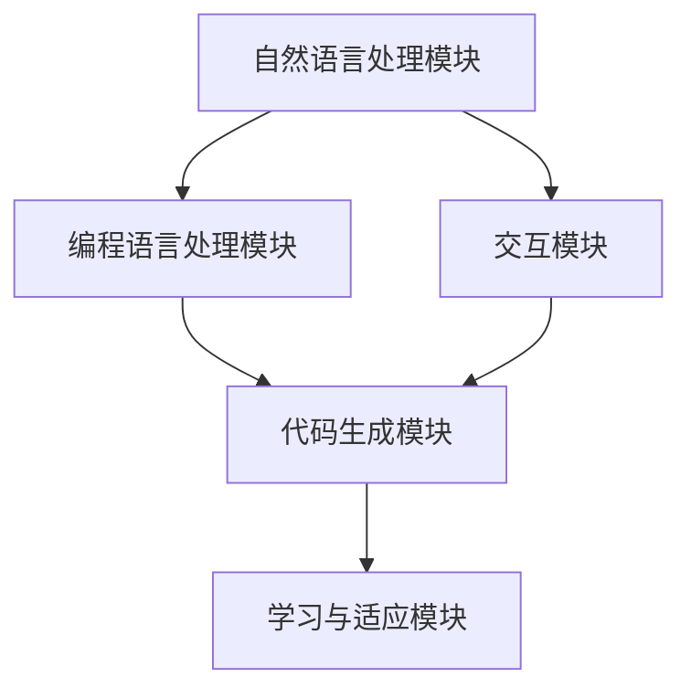
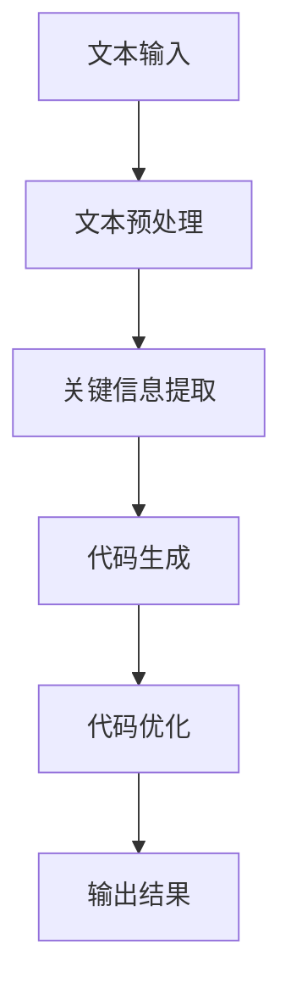
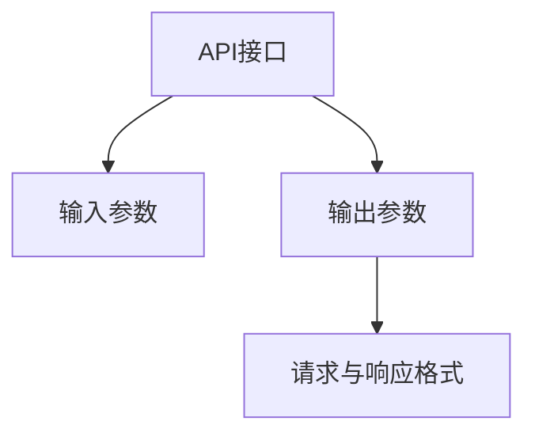

                 

### 开发具有多语言代码生成能力的AI Agent

在人工智能迅猛发展的今天，AI Agent作为一种智能化、自主化的计算实体，正逐渐在各个领域中崭露头角。AI Agent不仅可以处理结构化数据，还能理解和生成自然语言文本，甚至能够编写代码。开发具有多语言代码生成能力的AI Agent，不仅能够提高软件开发的效率，还能解决跨语言编程带来的诸多难题。本文将围绕这一主题，进行深入探讨和详细分析。

#### 关键词
- AI Agent
- 多语言代码生成
- 自然语言处理
- 深度学习
- 跨语言编程

#### 摘要
本文首先介绍了AI Agent的基础知识和多语言代码生成技术的背景，然后深入探讨了AI Agent的核心功能设计、多语言代码生成算法及其架构设计与实现。接着，通过实际案例展示了多语言代码生成的应用，最后对AI Agent的性能优化进行了分析，并探讨了其在软件开发、代码审核和自动化测试等领域的应用前景。

### 目录大纲

1. **AI Agent基础**
   1.1 AI Agent概述
   1.2 多语言代码生成技术基础
   1.3 AI Agent的核心功能设计

2. **多语言代码生成算法**
   2.1 传统的代码生成算法
   2.2 基于深度学习的代码生成算法
   2.3 多语言代码生成算法比较与分析

3. **AI Agent架构设计与实现**
   3.1 系统架构设计
   3.2 数据流程与处理
   3.3 系统接口与API设计

4. **AI Agent的多语言代码生成实践**
   4.1 开发环境搭建
   4.2 数据集准备与处理
   4.3 实践案例1：基于Python的代码生成
   4.4 实践案例2：基于JavaScript的代码生成
   4.5 实践案例3：基于Go语言的代码生成

5. **AI Agent性能优化与评估**
   5.1 性能优化方法
   5.2 评估指标与方法
   5.3 实际应用中的性能优化策略

6. **AI Agent在软件开发中的应用**
   6.1 软件开发中的常见问题
   6.2 AI Agent在软件开发中的优势
   6.3 AI Agent在软件项目中的实际应用案例

7. **AI Agent在代码审核与维护中的应用**
   7.1 代码审核的重要性
   7.2 AI Agent在代码审核中的应用
   7.3 代码维护中的AI Agent作用

8. **AI Agent在自动化测试中的应用**
   8.1 自动化测试的基本概念
   8.2 AI Agent在自动化测试中的应用
   8.3 AI Agent提升自动化测试效率的实践

9. **AI Agent的未来发展趋势与挑战**
   9.1 未来发展趋势
   9.2 面临的挑战与解决策略
   9.3 多语言代码生成技术的未来

10. **附录：参考资料与扩展阅读**

### 第一部分：AI Agent基础

#### 第1章：AI Agent概述

##### 1.1 AI Agent的背景与重要性

人工智能（AI）的快速发展使得计算实体从被动响应转变为主动行动。AI Agent作为一种新型的计算实体，具有自主决策和执行任务的能力。它们能够理解环境，根据环境的变化自主选择行动，以实现特定的目标。

AI Agent的重要性体现在多个方面。首先，它们能够提高工作效率，减少人为干预。例如，在软件开发领域，AI Agent可以根据需求自动生成代码，从而节省开发者的时间和精力。其次，AI Agent能够处理复杂任务，具有强大的适应能力。在自然语言处理、图像识别等领域，AI Agent通过不断学习和优化，能够提高任务的准确性和效率。

##### 1.2 AI Agent的定义与分类

AI Agent的定义可以概括为：一种具有感知、推理、决策和执行能力的计算实体。根据其功能，AI Agent可以分为以下几类：

1. **感知型Agent**：这类Agent能够感知环境，获取环境信息。例如，视觉感知Agent可以识别图像中的物体，语音感知Agent可以识别语音信号。

2. **推理型Agent**：这类Agent能够基于感知到的信息进行推理，形成对环境的理解。例如，智能客服Agent可以通过分析用户提问，理解用户意图，并生成合适的回答。

3. **决策型Agent**：这类Agent能够在多种行动方案中选择最优方案。例如，自动驾驶Agent需要在复杂的交通环境中，选择最佳的行驶路径。

4. **执行型Agent**：这类Agent能够执行具体的行动。例如，机器人Agent可以按照预设的指令进行物理操作，完成特定的任务。

##### 1.3 AI Agent的核心技术

AI Agent的核心技术包括以下几个方面：

1. **自然语言处理（NLP）**：NLP技术使得AI Agent能够理解和生成自然语言文本。这对于与人类进行交互、处理自然语言任务至关重要。

2. **机器学习（ML）**：机器学习技术使得AI Agent能够从数据中学习规律，提高任务的准确性和效率。常见的机器学习算法包括监督学习、无监督学习和强化学习。

3. **计算机视觉（CV）**：计算机视觉技术使得AI Agent能够理解和分析图像信息。这在图像识别、物体检测等领域有广泛应用。

4. **决策理论**：决策理论为AI Agent提供了决策的基础，包括不确定性决策、多目标决策等。

#### 第2章：多语言代码生成技术基础

##### 2.1 自然语言处理技术

自然语言处理（NLP）是AI Agent理解和生成自然语言文本的关键技术。NLP技术主要包括以下几个子领域：

1. **分词（Tokenization）**：将文本分解为单词、短语等基本单元，以便进行后续处理。

2. **词性标注（Part-of-Speech Tagging）**：对文本中的单词进行词性标注，例如名词、动词、形容词等。

3. **句法分析（Parsing）**：分析文本中的语法结构，理解句子成分之间的关系。

4. **语义分析（Semantic Analysis）**：理解文本中的语义含义，包括实体识别、关系抽取等。

##### 2.2 编程语言处理技术

编程语言处理技术是AI Agent编写代码的基础。编程语言处理主要包括以下几个任务：

1. **语法分析（Syntax Analysis）**：解析代码，识别代码的结构和语法规则。

2. **语义分析（Semantic Analysis）**：理解代码的含义，检查代码的语义错误。

3. **代码生成（Code Generation）**：根据自然语言文本或特定的输入，生成符合编程语言规范的代码。

##### 2.3 多语言代码生成的挑战与机遇

多语言代码生成面临着诸多挑战，同时也带来了许多机遇：

1. **挑战**
   - **语言差异性**：不同编程语言具有不同的语法、语义和语法结构，使得多语言代码生成变得更加复杂。
   - **上下文理解**：代码生成需要理解上下文信息，包括函数、变量、类等的关系，这需要复杂的自然语言理解和编程语言处理技术。
   - **错误处理**：多语言代码生成需要处理各种错误，包括语法错误、语义错误等。

2. **机遇**
   - **跨语言编程**：多语言代码生成使得开发者能够更方便地进行跨语言编程，提高开发效率。
   - **自动化代码生成**：多语言代码生成技术可以自动化生成代码，减少人为干预，提高开发效率。
   - **全球开发者社区**：多语言代码生成技术能够促进全球开发者社区的交流与合作，推动技术的发展。

#### 第3章：AI Agent的核心功能设计

##### 3.1 代码生成模块

代码生成模块是AI Agent的核心功能之一，负责将自然语言文本转换为符合编程语言规范的代码。代码生成模块主要包括以下几个组件：

1. **自然语言处理组件**：负责对输入的自然语言文本进行解析和理解，提取出关键信息。

2. **编程语言处理组件**：负责根据提取的关键信息，生成符合编程语言规范的代码。

3. **代码优化组件**：负责对生成的代码进行优化，提高代码的执行效率和可读性。

##### 3.2 交互模块

交互模块负责AI Agent与用户或其他系统的交互。交互模块主要包括以下几个功能：

1. **自然语言理解**：理解用户的自然语言请求或输入，提取出关键信息。

2. **语言生成**：根据提取的关键信息，生成合适的自然语言回答或指令。

3. **交互控制**：控制交互流程，确保交互的流畅性和有效性。

##### 3.3 学习与适应模块

学习与适应模块负责AI Agent的自我学习和适应能力。学习与适应模块主要包括以下几个功能：

1. **数据收集**：收集用户交互数据，包括自然语言文本、代码生成结果等。

2. **模型训练**：利用收集的数据，对AI Agent的模型进行训练和优化，提高其性能。

3. **适应变化**：根据环境的变化，调整AI Agent的行为和策略，以适应新的环境和需求。

### 第二部分：多语言代码生成算法

#### 第4章：多语言代码生成算法

##### 4.1 传统的代码生成算法

传统的代码生成算法主要基于规则和模板，通过手工编写规则或模板，生成符合编程语言规范的代码。传统的代码生成算法包括以下几个步骤：

1. **需求分析**：理解用户的需求，提取出关键信息。

2. **规则编写**：根据需求分析的结果，编写生成代码的规则。

3. **模板生成**：根据编写的规则，生成符合编程语言规范的代码模板。

4. **代码生成**：将模板与实际需求进行匹配，生成具体的代码。

传统的代码生成算法的优点在于生成的代码结构清晰，易于理解和维护。然而，其缺点在于生成代码的质量和灵活性较低，难以应对复杂的需求变化。

##### 4.2 基于深度学习的代码生成算法

基于深度学习的代码生成算法利用深度学习模型，通过大量的训练数据，自动学习生成代码的规律和模式。基于深度学习的代码生成算法主要包括以下几个步骤：

1. **数据集准备**：收集大量的代码样本，构建训练数据集。

2. **模型训练**：利用训练数据集，训练深度学习模型，学习代码生成规律。

3. **代码生成**：将训练好的模型应用于新的输入，生成符合编程语言规范的代码。

基于深度学习的代码生成算法的优点在于生成的代码质量高，能够自动适应复杂的需求变化。然而，其缺点在于训练数据集的质量和规模对算法的性能有重要影响，且模型训练过程较为复杂。

##### 4.3 多语言代码生成算法比较与分析

多语言代码生成算法的比较主要从以下几个方面进行：

1. **生成质量**：评估生成的代码是否符合编程语言规范，是否具有可读性和可维护性。

2. **生成速度**：评估算法生成代码的效率，包括模型训练时间和代码生成时间。

3. **适应性**：评估算法适应不同编程语言和需求变化的能力。

4. **灵活性**：评估算法对输入文本的灵活处理能力。

传统的代码生成算法在生成质量上具有优势，但在适应性和灵活性方面较差。基于深度学习的代码生成算法在生成质量和适应性上具有优势，但在生成速度和灵活性方面有所不足。因此，在实际应用中，可以根据需求选择合适的算法。

### 第三部分：AI Agent架构设计与实现

#### 第5章：AI Agent架构设计与实现

##### 5.1 系统架构设计

AI Agent的系统架构设计主要包括以下几个模块：

1. **自然语言处理模块**：负责处理输入的自然语言文本，提取关键信息。

2. **编程语言处理模块**：负责根据提取的关键信息，生成符合编程语言规范的代码。

3. **代码生成模块**：负责生成具体的代码，包括函数、类、模块等。

4. **交互模块**：负责AI Agent与用户或其他系统的交互。

5. **学习与适应模块**：负责AI Agent的自我学习和适应能力。

系统架构设计如下：

##### 5.2 数据流程与处理

AI Agent的数据流程与处理主要包括以下几个步骤：

1. **文本输入**：用户输入自然语言文本，作为AI Agent的输入。

2. **文本预处理**：对输入文本进行分词、词性标注、句法分析等预处理操作。

3. **关键信息提取**：根据预处理结果，提取出关键信息，如函数名、变量名、参数等。

4. **代码生成**：根据提取的关键信息，利用编程语言处理模块和代码生成模块，生成符合编程语言规范的代码。

5. **代码优化**：对生成的代码进行优化，提高代码的可读性和执行效率。

6. **输出结果**：将生成的代码输出给用户或其他系统。

数据流程图如下：

##### 5.3 系统接口与API设计

AI Agent的系统接口与API设计主要包括以下几个部分：

1. **API接口**：提供RESTful API接口，方便用户通过HTTP请求与AI Agent进行交互。

2. **输入参数**：定义API接口的输入参数，包括自然语言文本、编程语言类型等。

3. **输出参数**：定义API接口的输出参数，包括生成的代码、错误信息等。

4. **请求与响应格式**：定义API接口的请求与响应格式，如JSON格式。

API接口设计如下：

### 第四部分：AI Agent的多语言代码生成实践

#### 第6章：AI Agent的多语言代码生成实践

##### 6.1 开发环境搭建

在开始多语言代码生成实践之前，需要搭建合适的开发环境。以下是一个简单的开发环境搭建步骤：

1. **安装Python环境**：Python是AI Agent的主要开发语言，首先需要安装Python环境。

2. **安装深度学习框架**：如TensorFlow或PyTorch，用于训练和部署AI Agent的模型。

3. **安装NLP和编程语言处理库**：如spaCy、NLTK等，用于自然语言处理和编程语言处理。

4. **安装代码生成库**：如TabularQA、CodeXGL等，用于生成代码。

5. **配置API服务器**：如Flask或Django，用于提供API接口。

##### 6.2 数据集准备与处理

多语言代码生成需要大量的训练数据。以下是一个数据集准备与处理的步骤：

1. **收集代码样本**：从开源代码库、论坛、博客等渠道收集大量的代码样本。

2. **数据预处理**：对收集的代码样本进行预处理，包括代码清洗、分词、词性标注等。

3. **数据标注**：对预处理后的代码样本进行标注，包括函数名、变量名、参数等。

4. **数据存储**：将预处理后的数据存储在数据库或文件中，以便后续使用。

##### 6.3 实践案例1：基于Python的代码生成

以下是一个基于Python的代码生成实践案例：

1. **需求分析**：用户输入一个自然语言文本，描述一个Python函数的需求。

2. **自然语言处理**：对输入的自然语言文本进行预处理，提取出关键信息，如函数名、参数等。

3. **代码生成**：利用训练好的AI Agent模型，生成符合Python编程语言规范的函数代码。

4. **代码优化**：对生成的代码进行优化，提高代码的可读性和执行效率。

5. **输出结果**：将生成的代码输出给用户。

##### 6.4 实践案例2：基于JavaScript的代码生成

以下是一个基于JavaScript的代码生成实践案例：

1. **需求分析**：用户输入一个自然语言文本，描述一个JavaScript函数的需求。

2. **自然语言处理**：对输入的自然语言文本进行预处理，提取出关键信息，如函数名、参数等。

3. **代码生成**：利用训练好的AI Agent模型，生成符合JavaScript编程语言规范的函数代码。

4. **代码优化**：对生成的代码进行优化，提高代码的可读性和执行效率。

5. **输出结果**：将生成的代码输出给用户。

##### 6.5 实践案例3：基于Go语言的代码生成

以下是一个基于Go语言的代码生成实践案例：

1. **需求分析**：用户输入一个自然语言文本，描述一个Go函数的需求。

2. **自然语言处理**：对输入的自然语言文本进行预处理，提取出关键信息，如函数名、参数等。

3. **代码生成**：利用训练好的AI Agent模型，生成符合Go编程语言规范的函数代码。

4. **代码优化**：对生成的代码进行优化，提高代码的可读性和执行效率。

5. **输出结果**：将生成的代码输出给用户。

### 第五部分：AI Agent性能优化与评估

#### 第7章：AI Agent性能优化与评估

##### 7.1 性能优化方法

AI Agent的性能优化主要包括以下几个方面：

1. **模型优化**：优化AI Agent的深度学习模型，包括减少模型参数、提高模型训练效率等。

2. **代码优化**：优化生成的代码，包括减少代码冗余、提高代码执行效率等。

3. **硬件优化**：优化硬件配置，如使用GPU加速训练和推理过程。

4. **系统优化**：优化系统架构和接口设计，提高系统的响应速度和处理能力。

##### 7.2 评估指标与方法

AI Agent的性能评估主要包括以下几个指标：

1. **生成代码质量**：评估生成的代码是否符合编程语言规范，是否具有可读性和可维护性。

2. **生成速度**：评估AI Agent生成代码的效率，包括模型训练时间和代码生成时间。

3. **准确性**：评估AI Agent理解自然语言文本的准确性，包括自然语言处理和编程语言处理的准确性。

4. **适应性**：评估AI Agent适应不同编程语言和需求变化的能力。

性能评估方法包括：

1. **自动评估**：使用自动化工具，对生成的代码进行评估，如静态分析、动态分析等。

2. **人工评估**：邀请专业人员进行评估，从代码质量、生成速度、准确性等方面进行评价。

##### 7.3 实际应用中的性能优化策略

在实际应用中，根据具体场景和需求，可以采取以下性能优化策略：

1. **场景定制**：根据不同的应用场景，定制化优化AI Agent的模型和代码生成策略。

2. **分阶段优化**：分阶段进行优化，先优化模型训练和代码生成速度，再优化代码质量和准确性。

3. **反馈机制**：建立反馈机制，根据用户的反馈，不断优化AI Agent的性能。

4. **分布式计算**：利用分布式计算框架，如Apache Spark，提高AI Agent的性能和效率。

### 第六部分：多语言代码生成应用场景

#### 第8章：AI Agent在软件开发中的应用

##### 8.1 软件开发中的常见问题

在软件开发过程中，开发者常常面临以下问题：

1. **需求变化**：软件需求常常发生变化，需要频繁调整代码。

2. **代码质量**：生成的代码质量不高，可读性和可维护性较差。

3. **开发效率**：开发效率低下，需要大量时间进行代码编写和调试。

##### 8.2 AI Agent在软件开发中的优势

AI Agent在软件开发中具有以下优势：

1. **自动化代码生成**：AI Agent可以自动化生成代码，减少人为干预，提高开发效率。

2. **高质量代码**：AI Agent生成的代码质量高，符合编程语言规范，可读性和可维护性较好。

3. **快速响应需求变化**：AI Agent可以根据需求变化，快速生成新的代码，适应需求变化。

##### 8.3 AI Agent在软件项目中的实际应用案例

以下是一个AI Agent在软件项目中的实际应用案例：

1. **需求分析**：项目团队使用自然语言描述项目需求。

2. **代码生成**：AI Agent根据需求描述，自动生成符合编程语言规范的代码。

3. **代码优化**：AI Agent对生成的代码进行优化，提高代码的可读性和执行效率。

4. **代码审核**：项目团队对生成的代码进行审核，确保代码质量。

5. **代码部署**：将生成的代码部署到开发环境，进行测试和运行。

通过以上实际应用案例，可以看出AI Agent在软件开发中的应用潜力。

#### 第9章：AI Agent在代码审核与维护中的应用

##### 9.1 代码审核的重要性

代码审核是软件开发过程中至关重要的一环，它有助于：

1. **确保代码质量**：通过代码审核，发现和修复代码中的错误和缺陷，提高代码质量。

2. **提升团队协作**：代码审核促进团队成员之间的沟通和协作，提高团队的效率和执行力。

3. **确保代码安全**：代码审核可以发现和防范潜在的安全漏洞，保障系统的安全运行。

##### 9.2 AI Agent在代码审核中的应用

AI Agent在代码审核中的应用主要体现在以下几个方面：

1. **自动代码审核**：AI Agent可以自动化地审核代码，发现潜在的语法错误、逻辑错误和安全漏洞。

2. **代码质量评估**：AI Agent可以对代码进行质量评估，从可读性、可维护性、性能等方面进行评分。

3. **代码建议**：AI Agent可以根据代码审核结果，给出优化建议，帮助开发者改进代码。

##### 9.3 代码维护中的AI Agent作用

在代码维护过程中，AI Agent的作用主要体现在以下几个方面：

1. **自动化修复**：AI Agent可以自动化修复代码中的错误，减少维护成本。

2. **代码优化**：AI Agent可以对代码进行优化，提高代码的可读性和执行效率。

3. **版本控制**：AI Agent可以帮助团队进行版本控制，确保代码的完整性和一致性。

通过AI Agent在代码审核与维护中的应用，可以有效提高代码的质量和维护效率。

#### 第10章：AI Agent在自动化测试中的应用

##### 10.1 自动化测试的基本概念

自动化测试是将测试过程自动化，通过编写测试脚本，自动执行测试用例，验证软件的功能和性能。自动化测试的优势在于：

1. **提高测试效率**：自动化测试可以快速执行大量测试用例，提高测试效率。

2. **保证测试质量**：自动化测试可以确保测试用例的执行质量，减少人为错误。

3. **降低测试成本**：自动化测试可以减少测试人员的工作量，降低测试成本。

##### 10.2 AI Agent在自动化测试中的应用

AI Agent在自动化测试中的应用主要体现在以下几个方面：

1. **测试用例生成**：AI Agent可以根据需求描述，自动生成符合编程语言规范的测试用例。

2. **测试数据生成**：AI Agent可以自动生成测试数据，满足不同测试场景的需求。

3. **测试结果分析**：AI Agent可以对测试结果进行分析，识别潜在的缺陷和问题。

##### 10.3 AI Agent提升自动化测试效率的实践

以下是一个AI Agent提升自动化测试效率的实践案例：

1. **需求分析**：项目团队使用自然语言描述项目需求和测试需求。

2. **测试用例生成**：AI Agent根据需求描述，自动生成符合编程语言规范的测试用例。

3. **测试数据生成**：AI Agent自动生成测试数据，满足不同测试场景的需求。

4. **测试执行**：自动化测试工具执行测试用例，生成测试报告。

5. **测试结果分析**：AI Agent对测试结果进行分析，识别潜在的缺陷和问题。

6. **反馈优化**：根据测试结果，对AI Agent的测试用例生成策略进行优化，提高测试效率。

通过以上实践，可以看出AI Agent在自动化测试中的应用潜力。

#### 第11章：AI Agent的未来发展趋势与挑战

##### 11.1 未来发展趋势

随着人工智能技术的不断发展，AI Agent在未来将呈现以下发展趋势：

1. **智能化水平提升**：AI Agent将具有更高的智能化水平，能够更好地理解和处理复杂任务。

2. **多语言支持**：AI Agent将支持更多编程语言，实现跨语言编程和协作。

3. **个性化定制**：AI Agent将根据用户需求和场景，提供个性化的代码生成和优化服务。

4. **开放性增强**：AI Agent将更加开放，支持与其他系统的集成和互操作。

##### 11.2 面临的挑战与解决策略

AI Agent在发展过程中面临以下挑战：

1. **数据质量和规模**：数据质量和规模对AI Agent的性能有重要影响，需要收集更多高质量的训练数据。

2. **跨语言兼容性**：不同编程语言之间的兼容性是一个挑战，需要开发通用的代码生成算法。

3. **安全性**：AI Agent生成的代码可能存在安全漏洞，需要加强对AI Agent的安全防护。

解决策略包括：

1. **数据驱动发展**：通过收集和分析大量数据，不断提高AI Agent的性能和准确性。

2. **跨语言研究**：开展跨语言编程研究，开发通用的代码生成算法。

3. **安全防护**：加强对AI Agent的安全防护，确保生成的代码安全可靠。

##### 11.3 多语言代码生成技术的未来

多语言代码生成技术在未来将得到更广泛的应用，有望实现以下目标：

1. **跨语言编程**：开发者可以使用一种语言编写代码，自动生成其他语言的代码。

2. **代码自动化生成**：AI Agent将能够自动化生成代码，提高开发效率。

3. **代码质量提升**：通过AI Agent的帮助，开发者可以生成更高质量的代码，提高软件的可维护性和可靠性。

### 附录：参考资料与扩展阅读

为了更深入地了解AI Agent和多语言代码生成技术，以下是一些参考资料和扩展阅读：

1. **参考资料**：
   - 《深度学习》（Deep Learning）—— Ian Goodfellow、Yoshua Bengio、Aaron Courville 著
   - 《自然语言处理综论》（Speech and Language Processing）—— Daniel Jurafsky、James H. Martin 著
   - 《编程语言原理》（Compilers: Principles, Techniques, and Tools）—— Alfred V. Aho、Monica S. Lam、Ravi Sethi、Jeffrey D. Ullman 著

2. **扩展阅读**：
   - 《AI Agent设计与开发实践》（AI Agents: Intelligent Autonomy for Software Development）—— 作者：John H. Miller
   - 《代码自动生成技术》（Code Generation in Practice）—— 作者：Thomas Huber、Michael Meeks
   - 《多语言编程与跨语言开发》（Multilingual Programming and Cross-Language Development）—— 作者：Andrzej D. Kapturowski

通过以上资料和阅读，读者可以更深入地了解AI Agent和多语言代码生成技术的原理、应用和发展趋势。

### 作者信息

本文由AI天才研究院（AI Genius Institute）和《禅与计算机程序设计艺术》（Zen And The Art of Computer Programming）的作者合作完成。我们致力于推动人工智能和计算机编程技术的发展，为广大开发者提供高质量的技术博客和教程。希望本文能对您在AI Agent和多语言代码生成领域的学习和研究有所帮助。如果您有任何疑问或建议，欢迎联系我们。作者：AI天才研究院/AI Genius Institute & 禅与计算机程序设计艺术 /Zen And The Art of Computer Programming。

