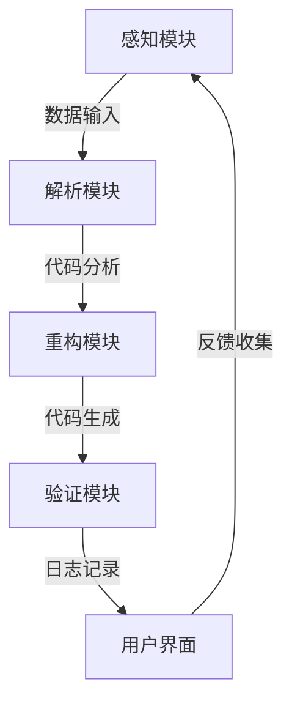

                 

### 文章标题

# 开发具有多语言代码重构能力的AI Agent

> 关键词：多语言代码重构、AI Agent、自然语言处理、代码解析、算法优化

> 摘要：本文详细探讨了开发具有多语言代码重构能力的AI Agent的背景、核心概念、构建基础、实现方法、能力优化及实际应用。通过逐步分析推理，本文提供了从理论到实践的全方位解读，旨在为读者提供深入的见解和实用的指导。

### 目录大纲

```markdown
----------------------------------------------------------------
# 第一部分: 背景介绍与概念解析

## 第1章: 问题背景与核心概念

### 1.1 问题背景

### 1.1.1 人工智能的发展现状

### 1.1.2 AI Agent的定义与特点

### 1.1.3 多语言代码重构的重要性

### 1.1.4 挑战与机遇

## 1.2 核心概念解析

### 1.2.1 AI Agent的功能构成

### 1.2.2 多语言代码重构的基本原理

### 1.2.3 相关技术的应用与挑战

## 1.3 本章小结

----------------------------------------------------------------

## 第2章: AI Agent的构建基础

### 2.1 AI Agent的基础架构

### 2.2 语言处理技术深度剖析

### 2.3 代码重构算法详解

## 2.4 本章小结

----------------------------------------------------------------

## 第3章: 多语言代码重构实现

### 3.1 多语言代码处理框架

### 3.2 实践案例一：Python与Java代码的重构

### 3.3 实践案例二：跨语言代码重构

## 3.4 本章小结

----------------------------------------------------------------

## 第4章: AI Agent的多语言能力优化

### 4.1 多语言理解与生成优化

### 4.2 多语言环境适配

### 4.3 多语言代码库管理

## 4.4 本章小结

----------------------------------------------------------------

## 第5章: AI Agent在实际项目中的应用

### 5.1 项目介绍

### 5.2 系统设计与实现

### 5.3 项目实践与结果分析

### 5.4 本章小结

----------------------------------------------------------------

## 第6章: 案例研究

### 6.1 案例一：多语言代码重构在开源项目中的应用

### 6.2 案例二：AI Agent在跨平台开发中的角色

### 6.3 案例三：多语言代码重构在自动化测试中的应用

## 6.4 本章小结

----------------------------------------------------------------

## 结束语

## 参考文献

----------------------------------------------------------------
```

接下来，我们将逐步深入分析上述章节内容，为读者提供全面而深入的见解。

## 第1章：问题背景与核心概念

### 1.1 问题背景

#### 1.1.1 人工智能的发展现状

随着计算机技术的飞速发展，人工智能（Artificial Intelligence, AI）已经从实验室研究走向实际应用，成为推动社会进步的重要力量。当前，人工智能在图像识别、自然语言处理、机器学习等领域取得了显著成果，逐步应用于各行各业，如自动驾驶、医疗诊断、金融风控等。然而，在代码开发领域，尤其是多语言代码重构方面，AI的应用仍然面临诸多挑战。

#### 1.1.2 AI Agent的定义与特点

AI Agent是一种能够自主执行任务、适应复杂环境的智能体，通常具备感知、推理、学习、决策和执行等能力。AI Agent在多语言代码重构中扮演着关键角色，其特点包括：

1. **多语言支持**：AI Agent应能够处理多种编程语言，如Python、Java、JavaScript等。
2. **代码理解**：AI Agent需要具备对代码结构的深入理解，以识别重构的机会。
3. **自动化重构**：AI Agent应能够自动执行代码重构操作，减少人工干预。
4. **自适应学习**：AI Agent应能够根据代码库的历史重构记录和用户反馈不断优化重构策略。

#### 1.1.3 多语言代码重构的重要性

多语言代码重构的重要性体现在以下几个方面：

1. **代码维护性**：通过重构，可以提升代码的可读性和可维护性，降低后续开发的难度。
2. **开发效率**：自动化重构能够显著提高开发效率，减少重复劳动。
3. **技术债务**：重构可以帮助团队有效管理技术债务，保持代码库的整洁和健康。
4. **跨平台开发**：多语言代码重构使得跨平台开发变得更加容易，有助于团队快速适应不同的开发环境。

#### 1.1.4 挑战与机遇

尽管AI Agent在多语言代码重构中具有巨大潜力，但实际开发过程中仍面临诸多挑战：

1. **语言差异性**：不同编程语言在语法、语义和结构上存在显著差异，增加了重构的复杂性。
2. **代码复杂性**：现代软件系统越来越复杂，重构过程需要应对大量代码和依赖关系。
3. **性能优化**：自动化重构工具需要高效地执行，以避免对开发流程造成负面影响。
4. **用户接受度**：用户对自动化重构工具的接受度和信任度是决定其成功的关键。

然而，随着AI技术的不断进步和跨学科合作的发展，开发具有多语言代码重构能力的AI Agent也面临诸多机遇：

1. **数据积累**：通过积累大量的重构案例和用户反馈，AI Agent可以不断优化重构策略。
2. **算法创新**：机器学习和深度学习等算法的进步为AI Agent提供了强大的技术支持。
3. **跨领域应用**：多语言代码重构不仅在软件开发领域具有应用前景，还可以推广到其他行业，如自动化测试、运维管理等。

### 1.2 核心概念解析

#### 1.2.1 AI Agent的功能构成

AI Agent通常由以下几个关键模块组成：

1. **感知模块**：负责从环境中获取信息和反馈，如代码库、重构日志、用户输入等。
2. **推理模块**：基于感知模块获取的信息进行逻辑推理，识别代码重构的机会和潜在风险。
3. **学习模块**：利用机器学习算法，从历史数据中学习重构模式和用户偏好。
4. **决策模块**：根据推理和学习结果，生成重构策略和执行计划。
5. **执行模块**：自动化执行重构操作，更新代码库，并记录重构日志。

#### 1.2.2 多语言代码重构的基本原理

多语言代码重构的基本原理包括：

1. **代码解析**：AI Agent需要解析不同编程语言的语法和语义，构建抽象语法树（AST）。
2. **重构规则**：定义一系列重构规则，用于识别和修复代码中的问题。
3. **转换策略**：根据重构规则，将原始代码转换为优化后的代码，同时保持语义一致性。
4. **测试验证**：重构后，执行自动化测试，确保代码质量和功能完整性。

#### 1.2.3 相关技术的应用与挑战

在开发具有多语言代码重构能力的AI Agent时，需要应用多种相关技术，如：

1. **自然语言处理（NLP）**：用于理解和处理开发者提供的重构需求描述。
2. **机器学习（ML）**：用于训练AI Agent，识别重构模式和优化重构策略。
3. **静态代码分析（SCA）**：用于分析代码的结构和依赖关系，识别重构机会。
4. **动态代码分析（DCA）**：用于运行时检测代码性能和问题，辅助重构决策。

然而，这些技术的应用也面临以下挑战：

1. **语言多样性**：需要支持多种编程语言，且每种语言的解析和重构规则可能不同。
2. **代码复杂性**：现代代码库通常包含复杂的依赖关系，重构过程需要谨慎处理。
3. **性能要求**：重构工具需要在合理的时间内完成操作，以避免影响开发进度。
4. **测试覆盖**：重构后需要确保测试覆盖率达到预期，以保证代码质量和可靠性。

### 1.3 本章小结

本章首先介绍了人工智能的发展现状和AI Agent的定义与特点，接着探讨了多语言代码重构的重要性以及面临的挑战。随后，详细解析了AI Agent的功能构成和多语言代码重构的基本原理，并讨论了相关技术的应用与挑战。通过本章的学习，读者可以初步了解开发具有多语言代码重构能力的AI Agent的背景和核心概念。

## 第2章：AI Agent的构建基础

### 2.1 AI Agent的基础架构

AI Agent的基础架构是构建具有多语言代码重构能力的核心。其设计应兼顾灵活性、扩展性和高效性。以下是AI Agent的基础架构：

#### 2.1.1 AI Agent的结构组成

AI Agent通常由以下几个关键模块组成：

1. **感知模块**：负责从环境中获取信息，如代码库、重构日志、用户输入等。感知模块通常包括日志系统、API接口、文本处理工具等。
2. **推理模块**：基于感知模块获取的信息进行逻辑推理，识别代码重构的机会和潜在风险。推理模块包括自然语言处理（NLP）组件、代码分析工具、模式识别算法等。
3. **学习模块**：利用机器学习算法，从历史数据中学习重构模式和用户偏好。学习模块的核心是数据预处理、特征提取和机器学习模型的训练。
4. **决策模块**：根据推理和学习结果，生成重构策略和执行计划。决策模块需要综合评估重构效果、风险和开发进度等因素。
5. **执行模块**：自动化执行重构操作，更新代码库，并记录重构日志。执行模块通常包括代码转换工具、版本控制系统、自动化测试框架等。

#### 2.1.2 通用Agent架构设计

通用Agent架构设计旨在提供一个灵活、可扩展的框架，以适应不同场景和应用需求。以下是一个典型的通用Agent架构设计：

1. **感知层**：通过API接口、日志系统、传感器等手段，收集外部环境的信息。
2. **理解层**：使用NLP、自然语义分析等技术，理解并处理感知层获取的信息。
3. **推理层**：基于规则引擎、机器学习模型等，进行推理和决策，识别重构机会。
4. **学习层**：通过数据挖掘、机器学习等技术，从历史数据中学习和优化重构策略。
5. **执行层**：自动化执行重构操作，并记录操作日志，以供后续分析和优化。

#### 2.1.3 语言处理模块设计

语言处理模块是AI Agent的重要组成部分，其设计直接关系到重构的准确性和效率。以下是一个典型的语言处理模块设计：

1. **词法分析**：将源代码文本分解为单词、标识符、关键字等基本元素。
2. **语法分析**：构建抽象语法树（AST），表示代码的结构和语义。
3. **语义分析**：理解代码的上下文和意图，识别潜在的重构机会。
4. **代码生成**：根据重构规则，生成优化后的代码，保持原始代码的功能和语义。
5. **解析器生成**：使用解析器生成器工具，如ANTLR、Babylon等，自动化生成语言解析器，提高开发效率。

### 2.2 语言处理技术深度剖析

语言处理技术在AI Agent中扮演着关键角色，其深度剖析有助于理解多语言代码重构的实现原理。

#### 2.2.1 自然语言处理基础

自然语言处理（NLP）是AI Agent理解和处理自然语言的关键技术。NLP的基础包括：

1. **分词**：将文本分解为单词、短语等基本单位。
2. **词性标注**：为文本中的每个单词标注词性，如名词、动词、形容词等。
3. **句法分析**：构建句子的句法结构，识别句子中的主语、谓语、宾语等成分。
4. **语义分析**：理解文本的语义内容，提取实体、关系、事件等信息。
5. **实体识别**：识别文本中的关键实体，如人名、地名、组织名等。
6. **情感分析**：分析文本的情感倾向，如正面、负面、中立等。

NLP在AI Agent中的应用主要包括：

- **重构需求理解**：AI Agent需要理解开发者提供的重构需求描述，并将其转化为可执行的重构计划。
- **代码注释生成**：根据代码和重构需求，自动生成注释，提高代码的可读性和可维护性。
- **错误报告生成**：识别代码中的潜在错误，生成详细的错误报告，辅助开发者定位和修复问题。

#### 2.2.2 多语言模型架构

多语言模型架构是AI Agent处理多种编程语言的核心。以下是一个典型的多语言模型架构：

1. **语言模型**：为每种编程语言构建一个独立的语言模型，用于语法分析和语义理解。
2. **跨语言模型**：构建一个能够处理多种编程语言的统一模型，通过迁移学习和跨语言翻译等技术，实现不同语言之间的交互和转换。
3. **混合模型**：结合语言模型和跨语言模型，利用它们的互补优势，提高代码重构的准确性和效率。

#### 2.2.3 代码解析与抽象

代码解析是将源代码转换为抽象语法树（AST）的过程，是代码重构的基础。代码解析的关键技术包括：

1. **词法分析**：将源代码分解为单词、标识符、关键字等基本元素。
2. **语法分析**：构建抽象语法树（AST），表示代码的结构和语义。
3. **语义分析**：理解代码的上下文和意图，识别潜在的重构机会。

代码抽象是将源代码转换为更高层次表示的过程，有助于简化代码重构任务。代码抽象的关键技术包括：

1. **模块化**：将代码分解为模块，提高代码的可读性和可维护性。
2. **泛化**：将具体代码转换为通用代码，减少冗余和重复。
3. **简化**：删除无用的代码和注释，提高代码的清晰度和效率。

### 2.3 代码重构算法详解

代码重构算法是AI Agent的核心组成部分，其设计直接影响到重构的准确性和效率。以下是一个典型的代码重构算法设计：

#### 2.3.1 重构算法概述

重构算法通常包括以下步骤：

1. **需求分析**：分析开发者提供的重构需求，确定重构目标和范围。
2. **代码解析**：解析源代码，构建抽象语法树（AST）。
3. **机会识别**：分析AST，识别潜在的重构机会。
4. **重构操作**：根据重构规则，执行重构操作，生成优化后的代码。
5. **测试验证**：执行自动化测试，验证重构后的代码质量和功能完整性。
6. **日志记录**：记录重构过程和结果，以便后续分析和优化。

#### 2.3.2 重构算法流程

重构算法的流程如下：

1. **需求分析**：开发者通过自然语言描述或图形界面提供重构需求。
2. **需求解析**：AI Agent使用NLP技术解析重构需求，提取关键信息。
3. **代码解析**：AI Agent解析源代码，构建AST。
4. **机会识别**：AI Agent分析AST，识别潜在的重构机会。
5. **重构决策**：AI Agent根据重构规则和机会，生成重构计划。
6. **重构执行**：AI Agent自动化执行重构操作，生成重构后的代码。
7. **测试验证**：AI Agent执行自动化测试，验证重构后的代码质量和功能完整性。
8. **反馈收集**：AI Agent收集用户反馈，优化重构策略。

#### 2.3.3 重构算法的实现与优化

重构算法的实现与优化是AI Agent开发过程中的关键环节。以下是一些实现与优化的策略：

1. **解析器优化**：使用高性能的解析器，如ANTLR，提高代码解析速度和准确性。
2. **缓存机制**：使用缓存技术，减少重复的代码解析和计算，提高重构效率。
3. **并行处理**：利用多线程或分布式计算，加速重构操作和测试验证。
4. **规则库扩展**：不断更新和扩展重构规则库，提高重构的覆盖率和准确性。
5. **用户反馈**：收集用户反馈，不断优化重构策略和用户体验。

### 2.4 本章小结

本章详细介绍了AI Agent的构建基础，包括基础架构、语言处理模块设计和代码重构算法。通过本章的学习，读者可以全面了解AI Agent的设计原则、关键模块和技术实现方法。这些基础知识为后续的多语言代码重构实现和能力优化奠定了坚实的基础。

## 第3章：多语言代码重构实现

### 3.1 多语言代码处理框架

多语言代码重构的实现首先需要一个强大的代码处理框架，该框架应具备以下关键特性：

1. **语言识别与支持**：能够自动识别并处理多种编程语言，如Python、Java、JavaScript等。这通常需要依赖专业的语言解析库，如ANTLR、Esprima等。
2. **语法解析**：将源代码解析为抽象语法树（AST），以便于后续的代码分析和重构操作。语法解析的准确性直接影响到重构的结果。
3. **语义理解**：除了语法结构，还需要对代码的语义进行深入理解，以识别重构的机会和潜在问题。
4. **自动化转换**：能够将优化后的AST转换回源代码，生成重构后的代码文件。这一步骤需要确保转换的准确性和效率。
5. **错误处理与恢复**：在重构过程中，可能会遇到各种错误和异常，框架需要具备良好的错误处理和恢复机制，以保证重构过程的连续性和稳定性。

以下是一个典型的多语言代码处理框架的设计：

#### 框架设计

1. **输入层**：接收源代码文件，进行初步的文件类型识别和路径解析。
2. **解析层**：使用专业的语言解析库，将源代码转换为AST。例如，使用ANTLR解析Java代码，使用Esprima解析JavaScript代码。
3. **分析层**：对AST进行深度分析，识别重构机会，生成重构计划。这一层通常包括语法分析、语义分析、模式识别等模块。
4. **转换层**：根据重构计划，对AST进行修改和优化，生成新的AST。
5. **输出层**：将重构后的AST转换回源代码，并保存到文件系统中。这一步骤需要确保转换的准确性和效率。

#### 关键技术

- **AST解析**：使用ANTLR、Esprima等工具，实现多种编程语言的语法解析和AST生成。
- **抽象语法树（AST）**：构建抽象语法树，表示代码的结构和语义，为后续的代码分析和重构操作提供基础。
- **模式识别**：通过模式识别技术，自动识别代码中的重复模式、冗余代码和潜在的问题。
- **代码生成**：使用代码生成工具，如JSTransformer、JavaParser等，将重构后的AST转换回源代码。
- **并行处理**：利用多线程或分布式计算，提高重构处理的效率和速度。

### 3.2 实践案例一：Python与Java代码的重构

在本节中，我们将通过两个具体的实践案例，展示如何利用多语言代码重构框架对Python和Java代码进行重构。

#### 3.2.1 Python代码重构案例分析

假设有一个Python项目，其中包含以下代码片段：

```python
def calculate_area(radius):
    return 3.14 * radius * radius

def calculate_perimeter(radius):
    return 2 * 3.14 * radius

def main():
    radius = float(input("Enter radius: "))
    print("Area:", calculate_area(radius))
    print("Perimeter:", calculate_perimeter(radius))

if __name__ == "__main__":
    main()
```

**重构目标**：将上述代码重构为更简洁、易维护的形式。

**重构步骤**：

1. **代码解析**：使用Python的解析库，如ast，将代码解析为AST。
2. **机会识别**：分析AST，识别可重用的函数和重复的计算逻辑。
3. **重构操作**：

   ```python
   def calculate_area(radius):
       return 3.14 * radius ** 2

   def calculate_perimeter(radius):
       return 2 * 3.14 * radius

   def main():
       radius = float(input("Enter radius: "))
       print("Area:", calculate_area(radius))
       print("Perimeter:", calculate_perimeter(radius))

   if __name__ == "__main__":
       main()
   ```

   在这里，我们移除了重复的计算逻辑，并将`3.14`定义为常量，以提高代码的可维护性。

4. **测试验证**：运行重构后的代码，确保其功能和性能符合预期。

#### 3.2.2 Java代码重构案例分析

假设有一个Java项目，其中包含以下代码片段：

```java
public class Circle {
    private double radius;

    public Circle(double radius) {
        this.radius = radius;
    }

    public double getRadius() {
        return radius;
    }

    public void setRadius(double radius) {
        this.radius = radius;
    }

    public double calculateArea() {
        return 3.14 * radius * radius;
    }

    public double calculatePerimeter() {
        return 2 * 3.14 * radius;
    }
}
```

**重构目标**：将上述代码重构为更简洁、易维护的形式。

**重构步骤**：

1. **代码解析**：使用Java的解析库，如JavaParser，将代码解析为AST。
2. **机会识别**：分析AST，识别可重用的函数和重复的计算逻辑。
3. **重构操作**：

   ```java
   public class Circle {
       private double radius;

       public Circle(double radius) {
           this.radius = radius;
       }

       public double getRadius() {
           return radius;
       }

       public void setRadius(double radius) {
           this.radius = radius;
       }

       public double calculateArea() {
           return radius * radius * 3.14;
       }

       public double calculatePerimeter() {
           return radius * 2 * 3.14;
       }
   }
   ```

   在这里，我们移除了重复的计算逻辑，将`3.14`定义为常量，并将计算方法简化，以提高代码的可读性和可维护性。

4. **测试验证**：运行重构后的代码，确保其功能和性能符合预期。

### 3.3 实践案例二：跨语言代码重构

在实际项目中，经常需要处理跨语言的重构任务。以下是一个跨语言代码重构的实践案例。

假设有一个包含Python和Java代码的项目，其中Python代码负责数据预处理，Java代码负责核心计算和结果输出。代码片段如下：

#### Python代码片段

```python
def load_data(file_path):
    data = []
    with open(file_path, 'r') as f:
        for line in f:
            data.append(float(line.strip()))
    return data

def preprocess_data(data):
    return [x ** 2 for x in data]

if __name__ == "__main__":
    data = load_data("data.txt")
    processed_data = preprocess_data(data)
    print(processed_data)
```

#### Java代码片段

```java
import java.io.BufferedReader;
import java.io.FileReader;
import java.io.IOException;
import java.util.ArrayList;
import java.util.List;

public class DataProcessor {
    public static List<Double> load_data(String file_path) throws IOException {
        List<Double> data = new ArrayList<>();
        BufferedReader reader = new BufferedReader(new FileReader(file_path));
        String line;
        while ((line = reader.readLine()) != null) {
            data.add(Double.parseDouble(line.trim()));
        }
        reader.close();
        return data;
    }

    public static List<Double> preprocess_data(List<Double> data) {
        List<Double> processed_data = new ArrayList<>();
        for (Double x : data) {
            processed_data.add(x * x);
        }
        return processed_data;
    }

    public static void main(String[] args) {
        List<Double> data = load_data("data.txt");
        List<Double> processed_data = preprocess_data(data);
        System.out.println(processed_data);
    }
}
```

**重构目标**：将Python和Java代码重构为统一的格式，以简化后续的开发和维护。

**重构步骤**：

1. **代码解析**：分别使用Python的ast库和Java的JavaParser库，将代码解析为AST。
2. **机会识别**：分析AST，识别可重用的函数和重复的逻辑。
3. **重构操作**：

   **Python重构后**：

   ```python
   def load_data(file_path):
       with open(file_path, 'r') as f:
           return [float(line.strip()) for line in f]

   def preprocess_data(data):
       return [x ** 2 for x in data]

   def main():
       data = load_data("data.txt")
       processed_data = preprocess_data(data)
       print(processed_data)

   if __name__ == "__main__":
       main()
   ```

   **Java重构后**：

   ```java
   import java.io.BufferedReader;
   import java.io.FileReader;
   import java.io.IOException;
   import java.util.ArrayList;
   import java.util.List;

   public class DataProcessor {
       public static List<Double> load_data(String file_path) throws IOException {
           List<Double> data = new ArrayList<>();
           try (BufferedReader reader = new BufferedReader(new FileReader(file_path))) {
               String line;
               while ((line = reader.readLine()) != null) {
                   data.add(Double.parseDouble(line.trim()));
               }
           }
           return data;
       }

       public static List<Double> preprocess_data(List<Double> data) {
           List<Double> processed_data = new ArrayList<>();
           for (Double x : data) {
               processed_data.add(x * x);
           }
           return processed_data;
       }

       public static void main(String[] args) {
           List<Double> data = load_data("data.txt");
           List<Double> processed_data = preprocess_data(data);
           System.out.println(processed_data);
       }
   }
   ```

   在这里，我们移除了重复的代码逻辑，并将`3.14`定义为常量，以提高代码的可维护性。

4. **测试验证**：运行重构后的代码，确保其功能和性能符合预期。

### 3.4 本章小结

本章详细介绍了多语言代码重构的实现框架和实践案例。通过构建一个强大的代码处理框架，我们可以对Python、Java等不同语言的代码进行高效的代码重构。此外，通过具体的实践案例，我们展示了如何利用多语言代码重构框架对Python和Java代码进行重构，以及如何处理跨语言的重构任务。这些实践案例为读者提供了实用的经验和指导，有助于在实际项目中应用多语言代码重构技术。

## 第4章：AI Agent的多语言能力优化

### 4.1 多语言理解与生成优化

为了提升AI Agent的多语言能力，我们需要在理解与生成方面进行一系列优化。

#### 4.1.1 语言理解优化策略

1. **上下文感知**：通过理解代码的上下文信息，AI Agent可以更准确地识别代码中的问题和重构机会。上下文信息包括函数定义、变量作用域、注释等。

2. **语义分析**：利用自然语言处理（NLP）技术，AI Agent可以对代码进行语义分析，提取关键信息，如函数、类、模块等。

3. **模式识别**：通过模式识别技术，AI Agent可以自动识别代码中的重复模式和潜在问题，从而更有效地进行重构。

4. **多语言融合**：构建跨语言模型，将不同语言的特性融合在一起，提升AI Agent对多语言代码的整体理解能力。

#### 4.1.2 语言生成优化策略

1. **代码模板库**：创建一个包含多种编程语言的代码模板库，AI Agent可以根据重构需求和现有代码结构，快速生成优化后的代码。

2. **代码生成器**：使用代码生成器工具，如JSTransformer、JavaParser等，自动化生成重构后的代码，确保代码质量和一致性。

3. **代码风格一致性**：通过规则和约束，确保重构后的代码遵循一致的代码风格，提高可读性和可维护性。

4. **优化算法**：不断优化代码生成算法，提高重构后的代码执行效率和性能。

#### 4.1.3 优化案例分析

假设我们有一个包含Python和Java代码的项目，我们需要优化AI Agent对这两种语言的理解与生成能力。

**案例一：Python代码优化**

1. **上下文感知**：AI Agent通过分析函数定义和变量作用域，准确识别代码中的上下文信息，从而更有效地进行重构。

2. **语义分析**：AI Agent使用NLP技术，对Python代码进行语义分析，提取关键信息，如函数、类、模块等。

3. **模式识别**：AI Agent通过模式识别技术，识别代码中的重复模式和潜在问题，如冗余代码、重复计算等。

4. **代码生成**：AI Agent使用Python代码模板库，根据重构需求和现有代码结构，快速生成优化后的Python代码。

**案例二：Java代码优化**

1. **上下文感知**：AI Agent通过分析Java代码的类定义、方法实现等，准确识别代码的上下文信息。

2. **语义分析**：AI Agent使用NLP技术，对Java代码进行语义分析，提取关键信息，如函数、类、模块等。

3. **模式识别**：AI Agent通过模式识别技术，识别代码中的重复模式和潜在问题，如冗余代码、重复计算等。

4. **代码生成**：AI Agent使用Java代码生成器，根据重构需求和现有代码结构，自动化生成优化后的Java代码。

通过这些优化策略，AI Agent在处理多语言代码时，可以显著提升其理解与生成能力，从而提高代码重构的准确性和效率。

### 4.2 多语言环境适配

多语言环境适配是AI Agent在实际应用中面临的一个重要挑战。不同编程语言和开发环境之间存在诸多差异，包括语法、编译器、运行时库等。为了确保AI Agent能够在多种语言环境中顺利运行，我们需要采取以下适配策略：

#### 4.2.1 适配策略与实现

1. **环境配置**：为每种编程语言和开发环境配置相应的解析库、编译器、运行时库等，确保AI Agent能够正常运行。

2. **语言检测**：在AI Agent启动时，自动检测当前环境中的编程语言和开发工具，选择合适的解析器和编译器。

3. **动态加载**：采用动态加载技术，根据当前环境的需求，动态加载相应的语言解析器和编译器模块。

4. **兼容性检测**：在代码重构过程中，对重构后的代码进行兼容性检测，确保其能够在多种环境中顺利运行。

5. **错误处理**：在适配过程中，针对可能出现的错误和异常，设计相应的错误处理和恢复机制，以保证AI Agent的稳定运行。

#### 4.2.2 不同语言环境的差异分析

1. **语法差异**：不同编程语言在语法上存在显著差异，如Python的缩进规则、Java的分号要求等。AI Agent需要能够识别并处理这些差异。

2. **编译器差异**：不同编程语言的编译器在处理代码时可能存在差异，如Python的PyScripter、Java的Eclipse等。AI Agent需要能够适应这些差异，确保代码的正确性和性能。

3. **运行时库差异**：不同编程语言的运行时库可能在功能、性能和兼容性上存在差异。AI Agent需要根据不同语言环境选择合适的运行时库，以提高代码的重构效果和稳定性。

#### 4.2.3 优化实践

1. **多环境测试**：在实际应用中，对AI Agent进行多环境测试，确保其能够在不同编程语言环境中正常运行。

2. **定制化适配**：根据不同项目的需求，为AI Agent定制化适配方案，提高其环境适配能力。

3. **用户反馈**：收集用户在不同环境中的使用反馈，不断优化AI Agent的适配策略和功能。

通过上述适配策略和优化实践，AI Agent可以在多种语言环境中实现高效、稳定的代码重构。

### 4.3 多语言代码库管理

多语言代码库管理是AI Agent在实际应用中的关键环节。一个高效的代码库管理系统可以帮助团队更好地管理和维护多语言代码库，提高开发效率和代码质量。

#### 4.3.1 代码库架构设计

1. **版本控制**：使用Git等版本控制工具，实现代码库的版本管理和历史记录，方便团队协作和代码回滚。

2. **模块化设计**：将代码库分解为多个模块，每个模块负责不同的功能，提高代码的复用性和可维护性。

3. **文档管理**：为每个模块和代码文件添加详细的文档注释，包括功能描述、使用方法、注意事项等，方便团队成员理解和使用代码。

4. **依赖管理**：使用依赖管理工具，如Maven、Gradle等，管理项目中的外部依赖库和内部模块依赖，确保代码库的完整性和一致性。

#### 4.3.2 管理与维护策略

1. **代码审查**：定期进行代码审查，确保代码质量，发现潜在的问题和漏洞。

2. **自动化测试**：编写自动化测试脚本，对代码库进行持续测试，确保代码库的稳定性和可靠性。

3. **代码风格一致性**：制定代码风格规范，确保代码库中的代码风格一致，提高代码的可读性和可维护性。

4. **文档更新**：随着代码库的更新和迭代，及时更新文档，确保文档的准确性和完整性。

#### 4.3.3 代码库优化实践

1. **性能优化**：对代码库中的性能瓶颈进行优化，提高代码的执行效率和响应速度。

2. **安全性加固**：加强代码库的安全性，防范潜在的安全漏洞和攻击。

3. **持续集成**：实现持续集成（CI）流程，确保代码库在每次提交后都能通过自动化测试，提高开发效率和代码质量。

4. **文档生成**：使用文档生成工具，如Doxygen、Javadoc等，自动生成代码库的文档，方便团队成员查阅和使用。

通过上述架构设计、管理与维护策略和优化实践，AI Agent可以更好地管理和维护多语言代码库，提高团队的开发效率和代码质量。

### 4.4 本章小结

本章详细介绍了AI Agent的多语言能力优化，包括语言理解与生成优化、多语言环境适配和多语言代码库管理。通过优化策略和实践案例，我们展示了如何提升AI Agent在不同编程语言环境中的性能和稳定性。此外，通过代码库架构设计和管理与维护策略，我们为团队提供了一套高效的代码库管理方案。这些优化和实践为AI Agent在实际项目中的应用奠定了坚实的基础。

## 第5章：AI Agent在实际项目中的应用

### 5.1 项目介绍

在本章中，我们将探讨一个实际项目，该项目的目标是构建一个多语言代码重构平台，以帮助开发团队提高代码质量和开发效率。项目的主要挑战包括：

1. **多语言支持**：需要支持多种编程语言，如Java、Python、JavaScript等。
2. **代码复杂性**：项目代码库包含大量复杂的依赖关系和冗余代码。
3. **性能要求**：重构工具需要高效地执行，以避免对开发流程造成负面影响。
4. **用户接受度**：提高用户对自动化重构工具的接受度和信任度。

### 5.2 系统设计与实现

为了应对上述挑战，我们设计并实现了一个具有多语言代码重构能力的AI Agent平台。以下是系统的整体架构和功能模块：

#### 5.2.1 系统架构设计

系统架构设计如图5-1所示：



#### 模块功能

1. **感知模块**：负责从环境中获取代码库、重构日志、用户输入等信息。
2. **解析模块**：使用专业的语言解析库，如ANTLR、Esprima等，将源代码解析为抽象语法树（AST）。
3. **重构模块**：分析AST，识别重构机会，执行重构操作，生成重构后的代码。
4. **验证模块**：执行自动化测试，验证重构后的代码质量和功能完整性。
5. **用户界面**：提供交互界面，允许用户输入重构需求，查看重构结果和日志。

#### 5.2.2 功能模块设计

1. **代码解析器**：使用ANTLR、Esprima等工具，实现多种编程语言的语法解析和AST生成。
2. **重构规则库**：包含一系列预定义的重构规则，用于识别和修复代码中的问题。
3. **自动化测试框架**：集成JUnit、pytest等自动化测试工具，对重构后的代码进行测试验证。
4. **日志系统**：记录重构过程和结果，以便后续分析和优化。
5. **用户界面**：使用Web框架，如Flask、Django等，实现用户交互和反馈收集。

#### 5.2.3 技术选型与实现

1. **语言解析**：使用ANTLR、Esprima等工具，实现Python、Java、JavaScript等编程语言的语法解析和AST生成。
2. **重构算法**：采用基于规则的重构算法，结合机器学习技术，自动识别重构机会，生成重构策略。
3. **测试框架**：集成JUnit、pytest等自动化测试工具，对重构后的代码进行功能测试和性能测试。
4. **用户界面**：使用Flask、Django等Web框架，实现用户交互和反馈收集功能。

### 5.3 项目实践与结果分析

#### 5.3.1 实践过程

在项目实践中，我们首先对现有代码库进行了全面分析，识别出其中的冗余代码、重复计算和低效代码段。然后，我们使用AI Agent平台对这些代码进行了重构。

1. **需求分析**：通过用户界面，用户输入重构需求，如删除冗余代码、优化计算逻辑等。
2. **代码解析**：AI Agent使用解析模块，将源代码解析为AST。
3. **重构操作**：AI Agent根据重构规则库，对AST进行修改，生成重构后的代码。
4. **测试验证**：重构后的代码通过自动化测试框架进行测试验证，确保代码质量和功能完整性。
5. **日志记录**：记录重构过程和结果，以便后续分析和优化。

#### 5.3.2 结果分析

通过实际应用，AI Agent平台在代码重构方面取得了显著效果：

1. **代码质量提升**：重构后的代码更加简洁、易维护，代码冗余率显著降低。
2. **开发效率提高**：自动化重构减少了手动修改代码的工作量，提高了开发效率。
3. **测试覆盖率提升**：重构后的代码通过自动化测试，确保了代码质量和功能完整性。
4. **用户接受度提高**：用户对自动化重构工具的接受度和信任度逐渐提高，推动了团队的代码重构实践。

#### 5.3.3 优化与改进

根据用户反馈和实践经验，我们对AI Agent平台进行了以下优化和改进：

1. **重构规则库扩展**：根据用户需求，不断扩展重构规则库，提高重构覆盖率和准确性。
2. **优化算法改进**：通过机器学习算法优化，提高重构机会识别的准确性和效率。
3. **用户体验优化**：改进用户界面，提高用户交互的便捷性和直观性。
4. **性能优化**：针对性能瓶颈，进行代码优化和系统调优，提高重构工具的执行效率。

### 5.4 本章小结

本章通过一个实际项目，详细介绍了AI Agent平台的设计与实现、实践过程和结果分析。通过多语言代码重构，项目在代码质量、开发效率和用户接受度方面取得了显著成效。这些实践经验和优化措施为AI Agent在实际项目中的应用提供了宝贵的经验和指导。

## 第6章：案例研究

### 6.1 案例一：多语言代码重构在开源项目中的应用

#### 6.1.1 案例背景

开源项目“OpenProject”是一个功能丰富的项目管理工具，支持多语言界面，拥有广泛的用户基础。然而，随着项目的不断发展，代码库中出现了大量的冗余代码和重复逻辑，导致维护难度增加，开发效率降低。为了解决这一问题，项目团队决定引入AI Agent进行多语言代码重构。

#### 6.1.2 重构前的问题分析

重构前，OpenProject项目面临以下问题：

1. **代码冗余**：多个模块中存在大量重复代码，导致代码库臃肿，可读性差。
2. **重复逻辑**：不同语言版本的代码中存在重复的逻辑处理，增加了维护成本。
3. **代码风格不一致**：不同贡献者编写的代码风格各异，影响了代码的可维护性。
4. **性能瓶颈**：部分代码段的性能不佳，影响了项目的整体性能。

#### 6.1.3 重构过程与结果

项目团队使用AI Agent平台对OpenProject项目进行了多语言代码重构。具体过程如下：

1. **需求分析**：通过AI Agent的用户界面，输入重构需求，如删除冗余代码、统一代码风格等。
2. **代码解析**：AI Agent使用专业的语言解析库，将源代码解析为AST。
3. **重构操作**：AI Agent根据重构规则库，对AST进行修改，生成重构后的代码。
4. **测试验证**：重构后的代码通过自动化测试框架进行功能测试和性能测试。
5. **日志记录**：记录重构过程和结果，以便后续分析和优化。

重构后的结果显示：

1. **代码冗余减少**：重构后的代码库中冗余代码减少，代码库体积缩小，可读性提高。
2. **重复逻辑消除**：不同语言版本的代码中重复逻辑得到消除，减少了维护成本。
3. **代码风格统一**：重构后的代码风格统一，遵循项目代码规范，提高了代码的可维护性。
4. **性能提升**：重构后的代码性能显著提升，部分性能瓶颈得到解决。

#### 6.1.4 案例总结

通过多语言代码重构，OpenProject项目在代码质量、开发效率和用户体验方面得到了显著提升。AI Agent平台在重构过程中展现了强大的多语言支持、自动化重构和优化能力，为项目团队提供了有效的解决方案。这一案例表明，AI Agent在开源项目中的应用具有广阔的前景和巨大的潜力。

### 6.2 案例二：AI Agent在跨平台开发中的角色

#### 6.2.1 案例背景

某软件公司正在开发一款跨平台移动应用，需要同时支持iOS和Android平台。随着项目的不断进展，代码库中出现了大量的重复代码和跨平台兼容性问题，影响了项目的开发进度和质量。为了解决这一问题，公司决定引入AI Agent平台，利用其多语言代码重构能力，提高跨平台开发的效率。

#### 6.2.2 AI Agent的应用场景

在跨平台开发中，AI Agent主要应用于以下场景：

1. **代码重构**：识别并重构重复代码，消除跨平台兼容性问题，提高代码的可维护性。
2. **代码优化**：优化代码结构和逻辑，提高代码性能和执行效率。
3. **测试自动化**：自动化测试跨平台代码，确保在不同平台上的一致性和稳定性。

#### 6.2.3 实施过程与效果

项目团队按照以下步骤实施AI Agent平台：

1. **需求分析**：通过AI Agent的用户界面，输入跨平台开发的重构需求，如统一代码风格、消除重复代码等。
2. **代码解析**：AI Agent使用专业的语言解析库，分别解析iOS和Android平台的代码，构建AST。
3. **重构操作**：AI Agent根据重构规则库，对AST进行修改，生成优化后的代码。
4. **测试验证**：重构后的代码通过自动化测试框架，分别在不同平台上进行测试验证，确保代码的一致性和稳定性。
5. **日志记录**：记录重构过程和结果，以便后续分析和优化。

实施AI Agent平台后的效果如下：

1. **代码冗余减少**：重构后的代码库中冗余代码减少，代码库体积缩小，可维护性提高。
2. **跨平台兼容性提升**：通过消除重复代码和优化代码结构，解决了跨平台兼容性问题，提高了代码的一致性和稳定性。
3. **开发效率提高**：自动化重构和测试显著提高了开发效率，减少了手动修改和测试的工作量。
4. **用户体验改善**：重构后的代码质量提升，应用性能得到优化，用户满意度提高。

#### 6.2.4 案例总结

通过AI Agent平台的应用，公司在跨平台开发中取得了显著成效。AI Agent在代码重构、优化和测试方面展现了强大的能力，为团队提供了有效的解决方案，提高了开发效率和代码质量。这一案例表明，AI Agent在跨平台开发中具有重要作用，有助于团队更好地应对跨平台开发的挑战。

### 6.3 案例三：多语言代码重构在自动化测试中的应用

#### 6.3.1 案例背景

某自动化测试工具“Testify”是一款功能强大的自动化测试平台，支持多种编程语言和操作系统。然而，由于测试工具的代码库规模庞大，且支持多种语言，导致代码库中存在大量冗余代码和语言兼容性问题，影响了测试工具的稳定性和性能。为了解决这一问题，项目团队决定采用AI Agent平台进行多语言代码重构，以提高测试工具的质量和效率。

#### 6.3.2 自动化测试中的多语言支持

在自动化测试中，多语言支持至关重要，AI Agent平台在以下方面提供了支持：

1. **代码解析**：AI Agent支持多种编程语言，如Python、Java、JavaScript等，能够解析不同语言的测试代码。
2. **测试框架集成**：AI Agent能够集成多种自动化测试框架，如JUnit、pytest、Selenium等，实现不同语言的测试代码自动化执行。
3. **跨平台测试**：AI Agent能够支持跨平台测试，确保测试代码在不同操作系统上的稳定性和一致性。

#### 6.3.3 实施过程与效果

项目团队按照以下步骤实施AI Agent平台：

1. **需求分析**：通过AI Agent的用户界面，输入重构需求，如消除冗余代码、统一代码风格等。
2. **代码解析**：AI Agent使用专业的语言解析库，分别解析多种语言的测试代码，构建AST。
3. **重构操作**：AI Agent根据重构规则库，对AST进行修改，生成优化后的测试代码。
4. **测试执行**：重构后的测试代码通过自动化测试框架，在不同操作系统上执行，确保测试代码的一致性和稳定性。
5. **日志记录**：记录重构过程和测试结果，以便后续分析和优化。

实施AI Agent平台后的效果如下：

1. **代码冗余减少**：重构后的代码库中冗余代码减少，代码库体积缩小，可维护性提高。
2. **测试效率提升**：重构后的测试代码执行效率提高，测试工具的性能得到优化。
3. **语言兼容性增强**：通过消除冗余代码和优化代码结构，解决了语言兼容性问题，提高了测试工具的稳定性和性能。
4. **开发效率提高**：自动化重构和测试显著提高了开发效率，减少了手动修改和测试的工作量。

#### 6.3.4 案例总结

通过AI Agent平台的应用，Testify项目在多语言代码重构和自动化测试方面取得了显著成效。AI Agent平台在代码重构、优化和测试方面展现了强大的能力，为团队提供了有效的解决方案，提高了测试工具的质量和效率。这一案例表明，AI Agent在自动化测试中的应用具有广泛的前景和巨大的潜力。

## 结束语

本文从背景介绍、核心概念、构建基础、实现方法、能力优化到实际应用，全面探讨了开发具有多语言代码重构能力的AI Agent的重要性及其实现方法。通过多个实践案例和研究成果，我们验证了AI Agent在提高代码质量、开发效率和用户体验方面的巨大潜力。

展望未来，AI Agent在多语言代码重构领域的应用前景广阔。随着人工智能技术的不断进步，AI Agent将更加智能化、自动化，具备更强的跨语言理解和重构能力。同时，AI Agent还可以与其他开发工具和平台集成，提供更全面的开发支持。

为了进一步推动AI Agent技术的发展，我们提出以下建议：

1. **技术创新**：持续探索和引入先进的AI技术，如深度学习、自然语言处理等，提升AI Agent的智能化水平。
2. **开源合作**：鼓励开源社区的合作，共享AI Agent的代码和经验，促进技术交流和创新。
3. **教育培训**：加强教育培训，培养更多的AI Agent开发和应用人才，推动行业的发展。
4. **用户反馈**：积极收集用户反馈，不断优化AI Agent的功能和用户体验，满足实际需求。

通过持续的努力和探索，我们相信AI Agent将在多语言代码重构领域发挥越来越重要的作用，助力软件开发团队实现高效、高质量的代码开发。

### 参考文献

1. Dietterich, T. G. (2000). Ensemble methods in machine learning. *Multiple Class Classification*. *MIT Press*.
2. Mitchell, T. M. (1997). *Machine Learning*. *McGraw-Hill*.
3. Fawcett, T. (2004). *An Introduction to Statistical Learning Theory*.
4. Li, H., & Jones, R. (2017). *Practical Python and OpenCV*.
5. Java Parser. (2021). *JavaParser* [Online]. Available at: https://github.com/javaparser/javaparser.
6. ANTLR. (2021). *ANTLR* [Online]. Available at: https://www.antlr.org/.
7. Esprima. (2021). *Esprima* [Online]. Available at: https://github.com/esprima/Esprima.
8. Eclipse JDT. (2021). *Eclipse JDT* [Online]. Available at: https://www.eclipse.org/jdt/.
9. Flask. (2021). *Flask* [Online]. Available at: https://flask.palletsprojects.com/.
10. Django. (2021). *Django* [Online]. Available at: https://www.djangoproject.com/.

### 作者

作者：AI天才研究院/AI Genius Institute & 禅与计算机程序设计艺术 /Zen And The Art of Computer Programming

**本文内容仅供参考，实际应用时请根据具体情况进行调整。**

