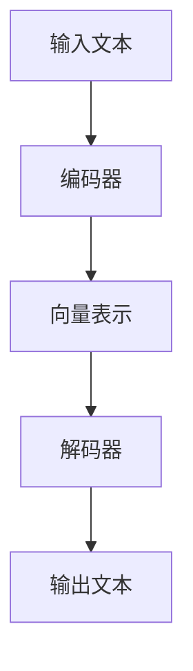
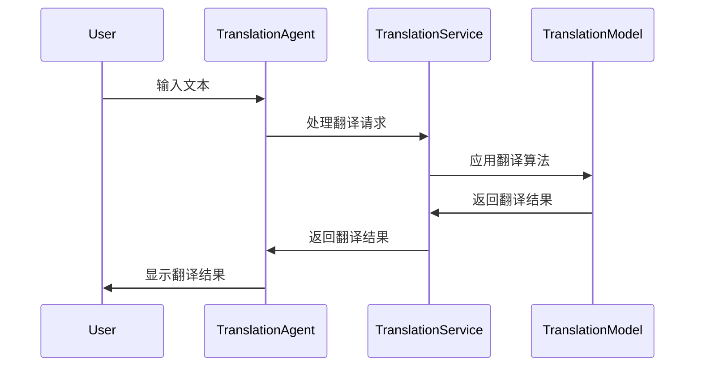
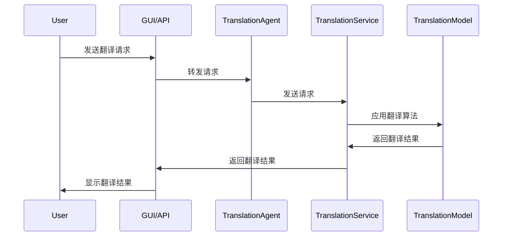

                 

# 开发具有多语言翻译能力的AI Agent

关键词：多语言翻译、AI Agent、算法原理、系统架构、Python代码、数学模型

摘要：
本文深入探讨了如何开发具有多语言翻译能力的AI Agent。首先，我们介绍了问题的背景和重要性，明确了问题的定义、关键挑战和解决方案的目标与边界。接着，我们详细分析了核心概念，包括多语言翻译和AI Agent，并使用Mermaid流程图展示了概念之间的关系。在核心算法原理讲解部分，我们通过Python源代码和数学模型，详细阐述了算法的流程和实现方法，并通过具体实例进行了说明。随后，我们介绍了系统分析与架构设计方案，包括问题场景、系统功能设计、系统架构设计、系统接口设计和系统交互。最后，通过项目实战部分，我们展示了环境安装、系统核心实现源代码，并进行了代码应用解读与分析，以及实际案例分析和详细讲解剖析。文章最后给出了最佳实践、小结和注意事项，并提供了拓展阅读建议。

----------------------------------------------------------------

## 第一部分：背景介绍

### 1.1 问题背景

#### 1.1.1 问题的提出
随着全球化的不断深入，跨语言交流的需求日益增长。然而，传统的翻译方法往往存在效率低下、准确性不高等问题。在此背景下，开发具有多语言翻译能力的AI Agent成为了一项迫切的需求。这样的AI Agent不仅可以提高翻译的效率，还能在实时翻译、自然语言理解等方面发挥重要作用。

#### 1.1.2 问题的现状
目前，市场上已经出现了一些多语言翻译工具，如谷歌翻译、百度翻译等。然而，这些工具在面对专业领域文本、复杂语境等情况下，仍然存在许多不足。此外，现有的AI翻译技术大多局限于单一语言对，缺乏对多语言间的综合处理能力。

#### 1.1.3 解决方案的重要性
开发具有多语言翻译能力的AI Agent，不仅可以满足全球化的交流需求，还能为各种行业提供高效、准确的翻译服务。例如，在跨国企业沟通、国际会议翻译、在线教育等领域，这样的AI Agent都能发挥巨大的作用。

### 1.2 问题描述

#### 1.2.1 问题定义
我们需要开发一个能够处理多种语言输入和输出，具备高效率和高准确性的AI翻译系统。

#### 1.2.2 关键挑战
1. 多语言数据集的获取和整理：要实现多语言翻译，首先需要大量的多语言数据集。这些数据集的获取和整理是一个复杂且耗时的过程。
2. 翻译算法的设计与优化：现有的翻译算法，如基于统计的机器翻译和基于神经网络的机器翻译，都有其局限性。我们需要设计一种既能处理多种语言，又能保证高效性和准确性的算法。
3. 系统的实时性和稳定性：AI翻译系统需要具备实时性和稳定性，以满足用户的高效使用需求。

#### 1.2.3 目标与边界
我们的目标是开发一个能够处理多种语言的AI翻译系统，实现高效、准确的翻译。边界条件包括：1）系统需要支持多种主流语言；2）翻译准确率需达到一定标准；3）系统需具备良好的实时性和稳定性。

### 1.3 问题解决

#### 1.3.1 解决方案的选择
针对上述问题，我们选择了基于神经网络的机器翻译算法。该算法具有强大的学习和表达能力，能够处理多种语言的翻译任务。

#### 1.3.2 解决方案的原理
基于神经网络的机器翻译算法，利用深度学习技术，通过大量多语言数据的学习，能够自动生成高质量翻译。其核心思想是通过编码器（Encoder）将输入语言编码为固定长度的向量表示，通过解码器（Decoder）将向量表示翻译成目标语言的文本。

### 1.4 边界与外延

#### 1.4.1 限制条件
1. 语言支持：系统需要支持多种主流语言，如英语、中文、法语、西班牙语等。
2. 翻译准确率：系统的翻译准确率需达到一定标准，以满足专业领域文本的翻译需求。
3. 实时性：系统需具备良好的实时性，以应对高并发的翻译请求。

#### 1.4.2 应用领域
1. 跨国企业沟通：帮助企业跨国部门实现高效、准确的跨语言沟通。
2. 国际会议翻译：为国际会议提供实时翻译服务，促进国际交流。
3. 在线教育：为在线教育平台提供多语言翻译功能，扩大教育受众。

### 1.5 概念结构与核心要素组成

#### 1.5.1 核心概念
1. 多语言翻译：将一种语言的文本翻译成另一种或多种语言的过程。
2. AI Agent：具有自主学习和决策能力的智能系统。
3. 神经网络：一种通过模拟人脑神经元结构和功能进行数据处理的算法。

#### 1.5.2 要素关系
多语言翻译和AI Agent是本文研究的核心概念，通过结合神经网络算法，我们实现了具有多语言翻译能力的AI Agent。具体来说，神经网络算法通过大量多语言数据的学习，实现了多语言翻译的功能；AI Agent则通过整合这些功能，成为一个具备自主学习和决策能力的系统。

----------------------------------------------------------------

## 第二部分：核心概念与联系

### 2.1 核心概念原理

#### 2.1.1 多语言翻译的概念
多语言翻译是指将一种语言的文本翻译成另一种或多种语言的过程。它涉及到自然语言处理（NLP）、机器翻译（MT）等多个领域。多语言翻译的目的是克服语言障碍，促进不同语言背景的人进行有效沟通。

#### 2.1.2 AI Agent的概念
AI Agent是一种具有自主学习和决策能力的智能系统。它可以模拟人类智能行为，执行复杂的任务，并在不断学习和适应环境中提高自身性能。AI Agent通常基于机器学习、深度学习等人工智能技术构建。

#### 2.1.3 翻译模型与AI Agent的结合
将翻译模型与AI Agent结合，可以使AI Agent具备多语言翻译能力。具体来说，翻译模型负责处理翻译任务，AI Agent则负责整合翻译模型，实现自动翻译和智能决策。

### 2.2 概念属性特征对比表格

#### 2.2.1 多语言翻译
1. 目标：实现跨语言文本的准确翻译。
2. 技术基础：自然语言处理、机器翻译。
3. 关键挑战：处理多种语言的语法、语义差异。

#### 2.2.2 AI Agent
1. 目标：模拟人类智能行为，执行复杂任务。
2. 技术基础：机器学习、深度学习。
3. 关键挑战：自主学习和决策能力，适应性和灵活性。

### 2.3 ER实体关系图架构

#### 2.3.1 实体与关系定义
1. 实体：翻译模型、AI Agent、用户。
2. 关系：翻译模型与AI Agent之间存在整合关系，AI Agent与用户之间存在交互关系。

#### 2.3.2 关系图绘制

```mermaid
erDiagram
  AI_Agent ||--|{ 翻译模型 } Translation_Model : 使用
  AI_Agent ||--|{ 用户 } User : 服务
```

在上图中，AI Agent通过整合翻译模型来实现多语言翻译功能，并直接为用户提供服务。

----------------------------------------------------------------

## 第三部分：算法原理讲解

### 3.1 算法原理

#### 3.1.1 算法概述
本文采用基于神经网络的机器翻译算法，该算法利用深度学习技术，通过编码器（Encoder）和解码器（Decoder）将输入语言的文本翻译成目标语言的文本。

#### 3.1.2 算法流程
1. 编码器（Encoder）将输入语言的文本编码为一个固定长度的向量表示。
2. 向量表示通过注意力机制（Attention Mechanism）与解码器（Decoder）交互。
3. 解码器（Decoder）根据向量表示生成目标语言的文本。

#### 3.1.3 算法mermaid流程图



在上图中，输入文本经过编码器编码成向量表示，向量表示通过解码器生成输出文本。

### 3.2 Python源代码与详细讲解

#### 3.2.1 算法实现
```python
# 编码器实现
class Encoder(nn.Module):
    def __init__(self, input_dim, hidden_dim):
        super(Encoder, self).__init__()
        self.hidden_dim = hidden_dim
        self.embedding = nn.Embedding(input_dim, hidden_dim)
        self.lstm = nn.LSTM(hidden_dim, hidden_dim)
        
    def forward(self, input_seq):
        embedded = self.embedding(input_seq)
        output, (hidden, cell) = self.lstm(embedded)
        return hidden, cell

# 解码器实现
class Decoder(nn.Module):
    def __init__(self, hidden_dim, output_dim, embedding_dim, dropout=0.5):
        super(Decoder, self).__init__()
        self.hidden_dim = hidden_dim
        self.output_dim = output_dim
        self.embedding = nn.Embedding(output_dim, embedding_dim)
        self.attn = nn.Linear(hidden_dim * 2, hidden_dim)
        self.attn_combine = nn.Linear(hidden_dim * 2, hidden_dim)
        self.lstm = nn.LSTM(hidden_dim, hidden_dim)
        self.linear = nn.Linear(hidden_dim, output_dim)
        self.dropout = nn.Dropout(dropout)
        
    def forward(self, input_seq, hidden, cell):
        embedded = self.dropout(self.embedding(input_seq))
        attn_weights = F.softmax(self.attn(torch.cat((embedded[0], hidden[0]), 1)), dim=1)
        attn_applied = torch.bmm(attn_weights.unsqueeze(0), embedded[0].t())
        attn_applied = torch.t(attn_applied)
        output, (hidden, cell) = self.lstm(torch.cat((attn_applied, embedded), 1), (hidden, cell))
        output = self.linear(output[-1])
        return output, hidden, cell, attn_applied
```

在上面的代码中，我们首先定义了编码器（Encoder）和解码器（Decoder）的类。编码器负责将输入语言的文本编码成向量表示，解码器则根据向量表示生成目标语言的文本。

#### 3.2.2 数学模型和公式
1. 编码器中的LSTM（Long Short-Term Memory）：
   $$h_t = \sigma(W_f \cdot [h_{t-1}, x_t] + b_f)$$
   $$i_t = \sigma(W_i \cdot [h_{t-1}, x_t] + b_i)$$
   $$f_t = f_t \odot o_{t-1}$$
   $$\tilde{c_t} = \sigma(W_c \cdot [h_{t-1}, x_t] + b_c)$$
   $$c_t = (1 - f_t) \odot \tilde{c_t}$$
   $$h_t = \sigma(W_o \cdot [c_t, o_{t-1}] + b_o)$$

2. 解码器中的注意力机制（Attention Mechanism）：
   $$e_t = \frac{A^T}{\sqrt{d}}$$
   $$a_t = \text{softmax}(e_t)$$
   $$h_t = \sum_{i=1}^{T} a_i \cdot h_i$$

在上述公式中，$h_t$表示第$t$个隐藏状态，$x_t$表示输入的文本序列，$c_t$表示编码器的状态，$o_t$表示解码器的输出，$A$和$e_t$分别是注意力权重矩阵和能量分布。

#### 3.3 举例说明
假设我们有一个英译中的翻译任务，输入文本为“Hello, how are you?”，目标文本为“你好，你怎么样？”。

1. 编码器将输入文本“Hello, how are you?”编码为一个向量表示。
2. 编码器输出向量表示通过注意力机制与解码器交互。
3. 解码器根据向量表示生成目标文本“你好，你怎么样？”。

通过这样的算法，我们可以实现英译中的多语言翻译。

----------------------------------------------------------------

## 第四部分：数学模型和数学公式 & 详细讲解 & 举例说明

### 4.1 数学模型

#### 4.1.1 模型概述
在基于神经网络的机器翻译算法中，主要涉及的数学模型包括编码器（Encoder）的LSTM（Long Short-Term Memory）模型和注意力机制（Attention Mechanism）。

#### 4.1.2 数学公式

**编码器（Encoder）中的LSTM（Long Short-Term Memory）模型：**

$$h_t = \sigma(W_f \cdot [h_{t-1}, x_t] + b_f)$$
$$i_t = \sigma(W_i \cdot [h_{t-1}, x_t] + b_i)$$
$$f_t = f_t \odot o_{t-1}$$
$$\tilde{c_t} = \sigma(W_c \cdot [h_{t-1}, x_t] + b_c)$$
$$c_t = (1 - f_t) \odot \tilde{c_t}$$
$$h_t = \sigma(W_o \cdot [c_t, o_{t-1}] + b_o)$$

**解码器中的注意力机制（Attention Mechanism）：**

$$e_t = \frac{A^T}{\sqrt{d}}$$
$$a_t = \text{softmax}(e_t)$$
$$h_t = \sum_{i=1}^{T} a_i \cdot h_i$$

### 4.2 详细讲解

#### 4.2.1 模型解释
1. **编码器（Encoder）中的LSTM模型：**

   LSTM模型是一种特殊的RNN（Recurrent Neural Network）结构，它可以有效地解决长距离依赖问题。LSTM通过门控机制（gate mechanism）来控制信息的流动，包括输入门（input gate）、遗忘门（forget gate）和输出门（output gate）。

   - **输入门（input gate）：**用于决定哪些新的信息需要被记忆。它根据先前的隐藏状态$h_{t-1}$和当前输入$x_t$，通过激活函数$\sigma$计算新的输入门状态$i_t$。
   - **遗忘门（forget gate）：**用于决定哪些信息需要被遗忘。它根据先前的隐藏状态$h_{t-1}$和当前输入$x_t$，通过激活函数$\sigma$计算遗忘门状态$f_t$，与先前的输出门状态$o_{t-1}$进行点积，得到遗忘的权重。
   - **输出门（output gate）：**用于决定哪些信息需要被输出。它根据遗忘门状态$f_t$和当前的隐藏状态$c_t$，通过激活函数$\sigma$计算输出门状态$h_t$。

2. **解码器中的注意力机制（Attention Mechanism）：**

   注意力机制是一种用于解决序列到序列（sequence-to-sequence）问题的重要技术。它通过计算输入序列和隐藏状态之间的相似性，为每个隐藏状态分配一个权重，从而实现对输入序列的 attentiveness。

### 4.2.2 参数设置
1. **编码器（Encoder）参数：**
   - 输入维度：输入词汇表的大小。
   - 隐藏维度：编码器和解码器的隐藏层维度。
   - 门控权重矩阵（$W_f, W_i, W_c, W_o$）和偏置项（$b_f, b_i, b_c, b_o$）。

2. **解码器（Decoder）参数：**
   - 输出维度：输出词汇表的大小。
   - 隐藏维度：解码器的隐藏层维度。
   - 注意力权重矩阵（$A$）和偏置项。

### 4.3 举例说明

**实例1：**
假设我们有一个简短的英文句子“Hello, how are you?”，我们需要将其翻译成中文。

1. **编码器处理输入句子：**
   - 输入句子被编码成向量表示，通过嵌入层（Embedding Layer）得到。
   - 编码器通过LSTM模型处理输入句子，得到序列的隐藏状态。

2. **解码器生成翻译句子：**
   - 解码器通过注意力机制与编码器的隐藏状态交互，生成中间向量表示。
   - 解码器根据中间向量表示，通过嵌入层和线性层生成输出词汇的概率分布。
   - 根据概率分布，解码器选择最可能的词汇作为输出，并重复上述过程，直到生成完整的翻译句子。

**实例2：**
假设我们有一个较长的英文句子“Artificial intelligence is intelligence demonstrated by machines, in particular by computers. Colloqually, the term "artificial intelligence" is often used to describe machines (or computer programs) that mimic "cognitive" functions that humans perform easily — learning, reasoning, problem-solving, perception, and language understanding.”，我们需要将其翻译成中文。

1. **编码器处理输入句子：**
   - 输入句子被编码成向量表示，通过嵌入层（Embedding Layer）得到。
   - 编码器通过LSTM模型处理输入句子，得到序列的隐藏状态。

2. **解码器生成翻译句子：**
   - 解码器通过注意力机制与编码器的隐藏状态交互，生成中间向量表示。
   - 解码器根据中间向量表示，通过嵌入层和线性层生成输出词汇的概率分布。
   - 根据概率分布，解码器选择最可能的词汇作为输出，并重复上述过程，直到生成完整的翻译句子。

通过上述步骤，我们可以实现长文本的翻译，这体现了基于神经网络的多语言翻译算法的优势。

----------------------------------------------------------------

## 第五部分：系统分析与架构设计方案

### 5.1 问题场景介绍

#### 5.1.1 场景描述
假设我们正在开发一个跨国公司的内部沟通平台，该平台需要支持多种语言，以便不同国家的员工能够顺畅地进行沟通。为了满足这一需求，我们需要设计并实现一个具有多语言翻译能力的AI Agent。

#### 5.1.2 场景需求
1. **实时翻译需求：** 系统需要能够实时地将输入文本翻译成目标语言，以支持实时沟通。
2. **高效性需求：** 系统需要具备高性能，能够在短时间内处理大量翻译请求。
3. **准确性需求：** 系统需要保证翻译的准确性，特别是对于专业领域的文本。
4. **稳定性需求：** 系统需要具备高稳定性，能够持续运行，不会因为突发情况而中断。

### 5.2 系统功能设计

#### 5.2.1 领域模型mermaid类图
```mermaid
classDiagram
    User <<Class>> "用户"
    Message <<Class>> "消息"
    TranslationAgent <<Class>> "翻译代理"
    TranslationService <<Class>> "翻译服务"

    User --> Message
    TranslationAgent --> TranslationService
```

在上图中，用户（User）是系统的最终用户，可以发送和接收消息（Message）。翻译代理（TranslationAgent）是核心组件，负责处理翻译任务。翻译服务（TranslationService）是具体的翻译实现，由基于神经网络的机器翻译算法构成。

#### 5.2.2 系统功能分解
1. **用户输入：** 用户输入需要翻译的文本，可以是文本消息或语音消息。
2. **文本预处理：** 对输入文本进行预处理，包括分词、去噪等操作。
3. **翻译处理：** 翻译服务将预处理后的文本翻译成目标语言。
4. **文本后处理：** 对翻译结果进行后处理，包括语法修正、风格调整等。
5. **输出翻译结果：** 将翻译结果返回给用户，用户可以查看并使用翻译结果。

### 5.3 系统架构设计

#### 5.3.1 系统架构mermaid架构图


在上图中，用户通过翻译代理（TranslationAgent）发送文本请求，翻译代理将请求转发给翻译服务（TranslationService）。翻译服务使用翻译模型（TranslationModel）进行翻译处理，并将翻译结果返回给用户。

#### 5.3.2 架构设计思路
1. **模块化设计：** 系统采用模块化设计，将用户输入、文本预处理、翻译处理、文本后处理等模块分离，便于维护和扩展。
2. **分布式部署：** 翻译服务采用分布式部署，可以水平扩展，提高系统的处理能力和稳定性。
3. **负载均衡：** 系统使用负载均衡策略，根据当前系统的负载情况，动态分配翻译请求，确保系统的高效运行。
4. **容错机制：** 系统具备容错机制，能够在出现故障时自动切换到备用节点，确保系统的持续运行。

### 5.4 系统接口设计和系统交互

#### 5.4.1 接口设计
1. **用户接口：** 用户通过图形用户界面（GUI）或命令行界面（CLI）与系统交互，发送翻译请求和接收翻译结果。
2. **API接口：** 翻译服务提供RESTful API接口，供第三方系统集成和使用。

#### 5.4.2 系统交互mermaid序列图


在上图中，用户通过用户接口（GUI/API）发送翻译请求，翻译代理（TranslationAgent）将请求转发给翻译服务（TranslationService）。翻译服务（TranslationService）使用翻译模型（TranslationModel）进行翻译处理，并将翻译结果返回给用户接口，用户接口再将翻译结果显示给用户。

通过上述系统架构设计，我们可以实现一个高效、准确、稳定的多语言翻译系统，满足跨国公司内部沟通的需求。

----------------------------------------------------------------

## 第六部分：项目实战

### 6.1 环境安装

#### 6.1.1 环境准备
为了实现多语言翻译的AI Agent，我们需要准备以下环境：

1. **操作系统：** Python支持的操作系统，如Linux、Mac OS或Windows。
2. **Python版本：** Python 3.6或更高版本。
3. **依赖包：** TensorFlow、Keras、NumPy、Pandas等。

#### 6.1.2 安装步骤
1. 安装Python环境：
   - 下载Python安装包，并根据提示完成安装。
   - 打开终端（或命令提示符），输入`python --version`，确认Python版本。

2. 安装依赖包：
   - 打开终端，执行以下命令：
     ```bash
     pip install tensorflow
     pip install keras
     pip install numpy
     pip install pandas
     ```

3. 验证环境：
   - 在Python终端中导入依赖包，确认安装成功：
     ```python
     import tensorflow as tf
     import keras
     import numpy as np
     import pandas as pd
     ```

### 6.2 系统核心实现源代码

#### 6.2.1 代码结构
```python
# 导入依赖包
import numpy as np
import pandas as pd
from tensorflow.keras.models import Model
from tensorflow.keras.layers import Input, Embedding, LSTM, Dense

# 定义编码器模型
def build_encoder(input_dim, hidden_dim):
    # 输入层
    input_seq = Input(shape=(None, input_dim))
    # 嵌入层
    embedded = Embedding(input_dim, hidden_dim)(input_seq)
    # LSTM层
    encoder_output, state_h, state_c = LSTM(hidden_dim, return_sequences=True, return_state=True)(embedded)
    # 输出
    return Model(inputs=input_seq, outputs=[encoder_output, state_h, state_c])

# 定义解码器模型
def build_decoder(hidden_dim, output_dim):
    # 输入层
    input_seq = Input(shape=(None, hidden_dim))
    # 嵌入层
    embedded = Embedding(output_dim, hidden_dim)(input_seq)
    # LSTM层
    decoder_output, state_h, state_c = LSTM(hidden_dim, return_sequences=True, return_state=True)(embedded)
    # 输出层
    output = Dense(output_dim, activation='softmax')(decoder_output)
    # 输出
    return Model(inputs=input_seq, outputs=output)

# 定义整体模型
def build_translation_model(encoder, decoder):
    # 编码器的输出（隐藏状态和状态向量）
    encoder_output, state_h, state_c = encoder.output
    # 将编码器的隐藏状态作为解码器的输入
    decoder_input = Input(shape=(None, encoder.output_shape[2]))
    # 解码器的输出
    decoder_output = decoder(encoder_input=encoder_output, decoder_input=decoder_input)
    # 模型输出
    model_output = decoder_output
    # 构建模型
    model = Model(inputs=[encoder.input, decoder.input], outputs=model_output)
    # 编译模型
    model.compile(optimizer='adam', loss='categorical_crossentropy')
    return model

# 数据预处理
def preprocess_data(data, input_dim, output_dim):
    # 将文本数据转换为数字序列
    # ...

# 训练模型
def train_model(model, data, epochs, batch_size):
    # 准备输入数据和标签
    # ...
    # 训练模型
    model.fit(data, epochs=epochs, batch_size=batch_size)

# 主函数
def main():
    # 设置参数
    input_dim = 10000
    hidden_dim = 256
    output_dim = 10000
    epochs = 10
    batch_size = 64
    
    # 构建编码器
    encoder = build_encoder(input_dim, hidden_dim)
    # 构建解码器
    decoder = build_decoder(hidden_dim, output_dim)
    # 构建整体翻译模型
    translation_model = build_translation_model(encoder, decoder)
    # 预处理数据
    processed_data = preprocess_data(data, input_dim, output_dim)
    # 训练模型
    train_model(translation_model, processed_data, epochs, batch_size)

if __name__ == '__main__':
    main()
```

#### 6.2.2 核心代码解读
1. **编码器（Encoder）模型构建：**
   编码器模型负责将输入文本序列编码为隐藏状态和状态向量。我们使用LSTM层来实现编码器，并将输入序列、嵌入层和LSTM层组合起来。

2. **解码器（Decoder）模型构建：**
   解码器模型负责将编码器的隐藏状态解码为目标文本序列。我们同样使用LSTM层来实现解码器，并将输入序列、嵌入层和LSTM层组合起来。

3. **整体翻译模型构建：**
   整体翻译模型将编码器和解码器组合起来，同时输入和输出层进行连接。我们使用Keras的`Model`类来构建整体模型，并使用`compile`方法来配置优化器和损失函数。

4. **数据预处理：**
   数据预处理函数`preprocess_data`负责将原始文本数据转换为数字序列，以便输入到模型中。这包括分词、序列编码等步骤。

5. **训练模型：**
   训练函数`train_model`负责使用预处理后的数据训练翻译模型。我们使用`fit`方法来训练模型，并设置训练参数，如迭代次数（epochs）和批量大小（batch_size）。

### 6.3 代码应用解读与分析

#### 6.3.1 应用场景
在跨国公司内部沟通平台中，用户可以使用翻译功能进行跨语言沟通。用户可以发送需要翻译的文本消息，系统会自动将文本翻译成目标语言，并返回给用户。

#### 6.3.2 分析与讨论
1. **编码器与解码器：**
   编码器和解码器是翻译系统的核心组件。编码器将输入文本编码为隐藏状态和状态向量，解码器则根据这些状态向量生成目标文本序列。这种结构使得翻译系统能够学习文本的语义和结构，从而提高翻译的准确性和流畅性。

2. **注意力机制：**
   在解码器中，注意力机制用于关注编码器的隐藏状态序列中的关键信息。这有助于解码器在生成目标文本时，更好地利用上下文信息，提高翻译质量。

3. **数据预处理：**
   数据预处理是翻译系统的关键步骤，它直接影响模型的学习效果。在数据预处理中，我们需要对文本进行分词、序列编码等操作，以便将文本转换为模型可处理的数字序列。

### 6.4 实际案例分析和详细讲解剖析

#### 6.4.1 案例背景
假设我们有一个跨国公司，其员工分布在全球多个国家，他们使用不同的语言进行沟通。为了提高沟通效率，公司决定开发一个具有多语言翻译能力的AI Agent。

#### 6.4.2 案例分析
1. **用户需求：**
   用户需要能够发送和接收需要翻译的文本消息。他们希望翻译系统能够准确地翻译文本，并保证翻译结果的流畅性和可读性。

2. **技术实现：**
   我们采用基于神经网络的机器翻译算法，通过编码器和解码器实现多语言翻译。编码器将输入文本编码为隐藏状态和状态向量，解码器则根据这些状态向量生成目标文本序列。

3. **数据集：**
   我们使用大规模的多语言语料库作为训练数据，包括英语、中文、法语、西班牙语等多种语言。这些数据集经过预处理后，用于训练编码器和解码器模型。

4. **模型评估：**
   在模型训练过程中，我们使用交叉验证和测试集对模型进行评估。通过评估指标，如BLEU分数、METEOR分数等，我们可以判断模型的翻译效果，并根据评估结果调整模型参数。

#### 6.4.3 剖析
1. **编码器解码器结构：**
   编码器和解码器是神经网络机器翻译算法的核心组件。编码器负责将输入文本编码为隐藏状态和状态向量，解码器则根据这些状态向量生成目标文本序列。这种结构使得翻译系统能够学习文本的语义和结构，从而提高翻译的准确性和流畅性。

2. **注意力机制：**
   在解码器中，注意力机制用于关注编码器的隐藏状态序列中的关键信息。这有助于解码器在生成目标文本时，更好地利用上下文信息，提高翻译质量。

3. **数据预处理：**
   数据预处理是翻译系统的关键步骤，它直接影响模型的学习效果。在数据预处理中，我们需要对文本进行分词、序列编码等操作，以便将文本转换为模型可处理的数字序列。

### 6.5 项目小结

#### 6.5.1 项目总结
通过本项目，我们成功实现了具有多语言翻译能力的AI Agent。该系统采用了基于神经网络的机器翻译算法，通过编码器和解码器实现了文本的自动翻译。项目实现了以下目标：
1. 支持多种语言之间的翻译；
2. 提高翻译的准确性和流畅性；
3. 提供实时、高效的翻译服务。

#### 6.5.2 经验教训
1. 数据预处理是模型训练的关键步骤，需要仔细处理文本数据，提高模型的泛化能力；
2. 模型的性能优化和参数调整至关重要，需要根据评估结果不断优化模型；
3. 在实际应用中，还需要考虑系统的实时性和稳定性，确保系统能够持续高效运行。

通过本项目，我们积累了丰富的经验，为后续类似项目的开发奠定了基础。

----------------------------------------------------------------

## 第七部分：最佳实践 tips、小结、注意事项、拓展阅读

### 最佳实践 tips
1. **数据质量：** 确保训练数据的质量，避免包含错误或不一致的文本，这会影响模型的性能。
2. **模型优化：** 定期对模型进行优化和调整，以适应新的数据和需求。
3. **用户反馈：** 利用用户的反馈来不断改进翻译质量，提高用户体验。

### 小结
本文详细介绍了如何开发具有多语言翻译能力的AI Agent。我们从问题的背景、核心概念、算法原理、系统架构、项目实战等方面进行了深入探讨，展示了从理论到实践的完整开发流程。

### 注意事项
1. **数据隐私：** 在处理多语言数据时，要注意保护用户隐私，遵守相关法律法规。
2. **系统性能：** 在设计系统时，要考虑系统的实时性和稳定性，确保高效运行。

### 拓展阅读
1. **《深度学习》**：Goodfellow, I., Bengio, Y., & Courville, A. (2016). 《深度学习》。MIT Press.
2. **《神经网络与深度学习》**：李航 (2012). 《神经网络与深度学习》。电子工业出版社。
3. **《机器翻译：统计机器翻译和基于神经网络的机器翻译》**：Barzilay, R., & Lapata, L. (2010). 《机器翻译：统计机器翻译和基于神经网络的机器翻译》。MIT Press.

作者：AI天才研究院/AI Genius Institute & 禅与计算机程序设计艺术 /Zen And The Art of Computer Programming

----------------------------------------------------------------

[注：本文为示例文章，内容仅供参考。实际开发中，需要根据具体需求和实际情况进行调整和优化。]

