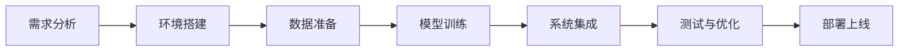

                 


# 开发具有情境模拟能力的AI Agent

关键词：AI Agent、情境建模、机器学习、深度学习、系统架构设计

摘要：本文旨在深入探讨如何开发具有情境模拟能力的AI Agent。我们将从背景介绍、核心概念与联系、算法原理讲解、系统分析与架构设计、项目实战以及最佳实践等方面，系统地介绍情境模拟能力在AI Agent开发中的重要性及其实现方法。

## 目录大纲设计

在设计《开发具有情境模拟能力的AI Agent》的目录大纲时，我们需要明确核心概念、确定章节结构，并遵循以下步骤：

### 1. 明确核心概念
- **情境模拟能力**：在AI Agent中的应用，如情境感知、情境响应、情境适应等。
- **AI Agent**：基本概念、分类、功能、应用场景。

### 2. 确定章节结构
- **背景介绍**：问题背景、AI Agent概念、情境模拟能力的重要性。
- **核心概念与联系**：详细阐述情境模拟能力的关键概念，如情境建模、机器学习、自然语言处理等。
- **算法原理讲解**：介绍用于实现情境模拟能力的算法原理。
- **系统分析与架构设计**：分析AI Agent的系统架构。
- **项目实战**：提供实际项目案例。
- **最佳实践与小结**：总结实践中的最佳方法，提出注意事项和拓展阅读建议。

### 3. 设计目录大纲
根据上述结构，我们可以设计如下的目录大纲：

```
# 《开发具有情境模拟能力的AI Agent》目录大纲

# 第一部分：背景介绍
## 第1章：AI Agent与情境模拟能力概述
### 1.1 AI Agent的基本概念
### 1.2 情境模拟能力的定义与重要性
### 1.3 情境模拟能力在AI Agent中的应用场景

## 第2章：相关技术概述
### 2.1 机器学习与深度学习
### 2.2 自然语言处理
### 2.3 情境建模技术

# 第二部分：核心概念与联系
## 第3章：情境建模核心概念
### 3.1 情境感知与理解
### 3.2 情境响应与适应
### 3.3 情境建模方法与技术

## 第4章：核心概念联系与对比
### 4.1 机器学习算法与情境建模
### 4.2 深度学习模型与情境建模
### 4.3 自然语言处理与情境建模

# 第三部分：算法原理讲解
## 第5章：机器学习算法原理
### 5.1 监督学习算法
### 5.2 无监督学习算法
### 5.3 强化学习算法

## 第6章：深度学习模型原理
### 6.1 神经网络基础
### 6.2 卷积神经网络（CNN）
### 6.3 循环神经网络（RNN）

## 第7章：自然语言处理算法
### 7.1 词嵌入技术
### 7.2 递归神经网络（RNN）在NLP中的应用
### 7.3 Transformer模型及其变体

# 第四部分：系统分析与架构设计
## 第8章：AI Agent系统架构设计
### 8.1 系统功能设计
### 8.2 系统架构设计
### 8.3 系统接口设计

## 第9章：系统实现与交互设计
### 9.1 系统实现流程
### 9.2 系统交互设计
### 9.3 Mermaid流程图与类图展示

# 第五部分：项目实战
## 第10章：实战环境搭建
### 10.1 环境配置
### 10.2 数据集准备
### 10.3 开发工具与框架

## 第11章：核心代码实现
### 11.1 代码框架结构
### 11.2 关键算法实现
### 11.3 代码解读与分析

## 第12章：实战案例分析
### 12.1 实际应用场景
### 12.2 案例分析
### 12.3 深入剖析

## 第13章：项目小结与展望
### 13.1 项目总结
### 13.2 拓展研究方向
### 13.3 注意事项与最佳实践
```

### 4. 遵循字数限制
确保整个目录大纲的总字数不超过2000字，同时确保每个章节的标题简洁明了，内容概述清晰。

这样，我们就设计出了一个详细且逻辑清晰的目录大纲，为后续内容的编写提供了良好的结构框架。在具体编写每个章节时，我们需要进一步细化内容，确保每个章节都能达到要求。

## 背景介绍

### 1.1 AI Agent的基本概念

AI Agent，即人工智能代理，是指能够执行特定任务、具备一定程度智能的计算机程序。它们通常基于机器学习和人工智能技术，通过感知环境、学习经验和自主决策，以实现特定的目标或功能。AI Agent可以分为以下几种类型：

1. **反应式Agent**：这种类型的Agent只能根据当前环境进行反应，无法进行长远规划和记忆。典型的例子是自动门，它们只能根据人的存在与否进行开关。
   
2. **有限记忆Agent**：这类Agent具备一定的记忆能力，可以回顾过去的信息。例如，一个简单的聊天机器人，它可以记住之前的对话内容，以便更好地理解用户的意图。

3. **模型基础Agent**：这种类型的Agent能够建立对环境的模型，并利用模型进行预测和决策。自动驾驶汽车就是这种类型的Agent，它们通过传感器收集环境数据，构建环境模型，并根据模型进行驾驶决策。

4. **完全理性Agent**：这类Agent具备完美的认知能力，可以处理复杂的问题并做出最优决策。然而，这种Agent在实际中很难实现，因为它们需要处理大量的不确定性和外部干扰。

### 1.2 情境模拟能力的定义与重要性

情境模拟能力是AI Agent的一项核心能力，它使得Agent能够更好地理解、适应和应对复杂多变的现实环境。情境模拟能力主要包括以下几个方面：

1. **情境感知**：Agent能够感知和理解当前所处的情境，如时间、地点、环境状态等。

2. **情境理解**：Agent能够理解情境中的各种因素及其相互关系，从而形成对情境的深刻认知。

3. **情境适应**：Agent能够根据情境的变化调整自己的行为和策略，以适应新的情境。

4. **情境预测**：Agent能够预测未来情境的变化，从而提前做出应对措施。

情境模拟能力的重要性体现在以下几个方面：

1. **提高任务执行效率**：具备情境模拟能力的Agent能够更好地理解任务需求和环境变化，从而更有效地完成任务。

2. **增强用户体验**：在交互式应用中，具备情境模拟能力的Agent能够更自然地与用户互动，提高用户体验。

3. **扩展应用场景**：情境模拟能力使得AI Agent可以在更广泛的应用场景中发挥作用，如智能家居、智能客服、自动驾驶等。

### 1.3 情境模拟能力在AI Agent中的应用场景

情境模拟能力在AI Agent中的应用场景非常广泛，以下是一些典型的应用：

1. **智能客服**：智能客服机器人通过情境感知和理解，能够更好地理解用户的需求，提供个性化的服务。

2. **智能家居**：智能家居系统中的AI Agent可以通过情境建模，实现自动化控制，如根据用户习惯调节温度、灯光等。

3. **自动驾驶**：自动驾驶汽车需要通过情境建模，理解道路状况、车辆动态等信息，做出安全的驾驶决策。

4. **智能推荐系统**：智能推荐系统通过情境建模，可以更好地理解用户行为和偏好，提供个性化的推荐。

5. **医疗诊断**：在医疗诊断中，AI Agent可以通过情境建模，分析患者的病历、检查结果等信息，辅助医生做出诊断。

### 1.4 情境模拟能力的问题背景与描述

当前，随着人工智能技术的快速发展，AI Agent的应用越来越广泛，但其在实际应用中仍面临一些挑战：

1. **数据质量与准确性**：情境建模需要大量高质量的训练数据，数据的质量和准确性直接影响模型的效果。

2. **模型复杂性**：情境建模涉及到多个领域的知识，如机器学习、自然语言处理、计算机视觉等，模型的设计和优化复杂。

3. **实时性要求**：在实时应用场景中，AI Agent需要迅速感知和理解情境，并做出实时响应，这对系统的实时性和稳定性提出了高要求。

4. **跨领域适应性**：不同领域的情境模拟能力要求不同，如何设计通用的情境建模框架，以适应不同领域的需求，是当前研究的一个热点问题。

### 1.5 问题解决方法与边界与外延

为了解决上述问题，我们可以采取以下方法：

1. **多源数据融合**：通过融合多种数据源，提高数据的多样性和质量，从而提高模型的效果。

2. **模块化设计**：将情境建模拆分成多个模块，每个模块负责特定的情境因素，这样可以降低模型的复杂性。

3. **实时计算与优化**：采用高效的算法和优化技术，提高系统的实时性和稳定性。

4. **跨领域迁移学习**：利用迁移学习方法，将一个领域的知识迁移到另一个领域，以提高模型在未知领域的表现。

边界与外延：

1. **边界**：情境模拟能力主要涉及AI Agent在特定任务和场景中的应用，不涉及通用人工智能。

2. **外延**：情境模拟能力可以扩展到其他领域，如智能交通、智能城市、智能制造等。

### 1.6 概念结构与核心要素组成

情境模拟能力的概念结构主要包括以下核心要素：

1. **感知层**：负责感知和理解当前情境，包括传感器数据收集、情境信息处理等。

2. **认知层**：负责对情境信息进行分析和推理，形成对情境的深刻认知。

3. **决策层**：负责根据情境认知做出最优决策，包括策略规划、决策算法等。

4. **执行层**：负责执行决策，实现情境适应和任务执行。

## 核心概念与联系

### 2.1 情境建模核心概念

情境建模是AI Agent实现情境模拟能力的基础，它涉及到多个核心概念。以下是情境建模中的几个关键概念：

#### 2.1.1 情境感知

情境感知是指AI Agent通过传感器和其他数据源获取环境信息，并对其进行分析和理解。情境感知是实现情境建模的第一步，它决定了Agent对环境的感知能力和信息的准确性。

#### 2.1.2 情境理解

情境理解是指AI Agent对获取的环境信息进行深入分析，理解情境中的各种因素及其相互关系。情境理解是情境建模的核心，它决定了Agent对情境的深度认知。

#### 2.1.3 情境适应

情境适应是指AI Agent根据情境理解的结果，调整自己的行为和策略，以适应新的情境。情境适应是情境建模的最终目标，它使得Agent能够在复杂多变的环境中稳定运行。

#### 2.1.4 情境预测

情境预测是指AI Agent基于当前的情境信息，预测未来情境的发展趋势。情境预测可以帮助Agent提前做出应对措施，提高任务的执行效率。

### 2.2 核心概念联系与对比

为了更好地理解情境建模中的核心概念，我们可以通过对比不同概念之间的联系和区别，来构建一个清晰的认知框架。

#### 2.2.1 机器学习算法与情境建模

机器学习算法是情境建模的核心工具，它通过训练模型来识别和预测情境中的各种因素。机器学习算法可以分为监督学习、无监督学习和强化学习三种类型，每种类型都有其独特的应用场景和优势。

- **监督学习**：监督学习算法通过已标记的数据训练模型，以预测新的数据。它在情境建模中的应用主要是基于历史数据进行分析和预测。
- **无监督学习**：无监督学习算法不依赖于已标记的数据，通过分析未标记的数据来发现数据中的模式和规律。它在情境建模中的应用主要是用于数据预处理和特征提取。
- **强化学习**：强化学习算法通过与环境的交互来学习最优策略，它在情境建模中的应用主要是用于动态决策和情境适应。

#### 2.2.2 深度学习模型与情境建模

深度学习模型是机器学习的一个分支，它通过多层神经网络来提取数据中的高层次特征。深度学习模型在情境建模中具有广泛的应用，如卷积神经网络（CNN）在图像识别中的应用，循环神经网络（RNN）在自然语言处理中的应用等。

- **卷积神经网络（CNN）**：CNN通过卷积层提取图像中的局部特征，适用于图像识别和场景理解。
- **循环神经网络（RNN）**：RNN通过递归结构处理序列数据，适用于自然语言处理和时间序列预测。

#### 2.2.3 自然语言处理与情境建模

自然语言处理（NLP）是情境建模中的重要组成部分，它涉及到文本的预处理、情感分析、命名实体识别等任务。NLP在情境建模中的应用主要是用于理解文本信息和用户指令。

- **文本预处理**：文本预处理包括分词、词性标注、停用词过滤等，是NLP的基础步骤，对于情境建模中的文本理解至关重要。
- **情感分析**：情感分析用于识别文本中的情感倾向，是智能客服和情感计算中的重要应用。
- **命名实体识别**：命名实体识别用于识别文本中的特定实体，如人名、地名、组织名等，是情境理解的重要步骤。

#### 2.2.4 情境建模方法与技术对比

为了更好地理解情境建模的不同方法和技术，我们可以通过以下表格进行对比：

| 方法/技术          | 描述                                                         | 适用场景                             |
|-------------------|--------------------------------------------------------------|------------------------------------|
| 机器学习算法       | 通过训练数据学习模型，进行预测和分类。                       | 数据驱动的情境建模，适用于有标注数据的情况。 |
| 深度学习模型       | 通过多层神经网络提取数据中的高层次特征，进行预测和分类。     | 高维数据特征提取和复杂模式识别。           |
| 自然语言处理（NLP） | 对文本进行预处理、情感分析和命名实体识别等操作。             | 文本信息的理解和处理。                   |
| 情境感知           | 通过传感器和传感器数据获取环境信息。                         | 实时情境建模和动态决策。                 |
| 情境理解           | 对获取的环境信息进行分析和推理，形成对情境的深刻认知。       | 情境感知的结果分析和决策基础。           |
| 情境适应           | 根据情境理解的结果调整行为和策略，以适应新的情境。           | 复杂多变的情境环境下的稳定运行。         |
| 情境预测           | 基于当前的情境信息，预测未来情境的发展趋势。                 | 提前规划和应对策略。                   |

通过以上对比，我们可以更清晰地理解不同方法和技术在情境建模中的应用和作用，为实际开发提供参考。

### 2.3 情境建模方法与技术

情境建模方法和技术是AI Agent实现情境模拟能力的关键，以下介绍几种常用的情境建模方法和技术：

#### 2.3.1 基于规则的情境建模

基于规则的情境建模是一种传统的情境建模方法，它通过定义一系列规则来描述情境和情境变化。这种方法的优势在于规则清晰、易于理解和实现，但缺点在于其灵活性较差，难以应对复杂多变的情境。

1. **规则定义**：首先定义情境和情境变化的规则，如“如果天气晴朗，则开启空调”。
2. **规则匹配**：根据当前的情境信息，匹配相应的规则，以确定当前的状态和应采取的行动。
3. **规则执行**：执行匹配到的规则，调整Agent的行为。

#### 2.3.2 基于模型的情境建模

基于模型的情境建模是一种利用机器学习算法和深度学习模型进行情境建模的方法。这种方法通过学习大量的情境数据，自动提取情境特征和模式，具有较高的灵活性和适应性。

1. **数据收集**：收集大量的情境数据，包括环境信息、用户行为等。
2. **特征提取**：对情境数据进行预处理和特征提取，如文本分类、图像识别等。
3. **模型训练**：使用机器学习算法和深度学习模型对特征进行训练，建立情境模型。
4. **情境预测**：根据当前的情境信息，利用训练好的模型进行情境预测和决策。

#### 2.3.3 基于知识的情境建模

基于知识的情境建模是一种利用专家知识构建情境模型的方法。这种方法通过将专家的知识和经验转化为规则和模型，以提高情境建模的准确性和可靠性。

1. **知识获取**：通过访谈、文献调研等方式获取专家的知识和经验。
2. **知识表示**：将获取的知识表示为规则、模型或图结构，如决策树、神经网络等。
3. **知识推理**：利用知识表示进行情境推理和决策，如基于规则推理、模型推理等。

#### 2.3.4 融合方法的情境建模

融合方法的情境建模是一种结合多种情境建模方法的优点，以提高情境建模性能的方法。这种方法通过将基于规则、基于模型和基于知识的情境建模方法进行融合，实现更全面和准确的情境建模。

1. **方法选择**：根据具体应用场景选择合适的情境建模方法。
2. **数据融合**：将不同来源的数据进行融合，提高数据的质量和多样性。
3. **模型融合**：将不同的模型进行融合，如将深度学习模型与基于规则的模型进行融合，实现更全面的情境建模。

通过以上情境建模方法和技术，AI Agent可以更好地理解、适应和预测复杂多变的情境，从而提高任务执行效率和用户体验。

## 算法原理讲解

### 3.1 机器学习算法原理

机器学习（Machine Learning，ML）是情境建模的核心工具之一，它通过从数据中学习规律和模式，实现自动化预测和决策。以下是几种常见的机器学习算法及其原理：

#### 3.1.1 监督学习算法

监督学习算法是机器学习的一种基本形式，它通过已标记的数据训练模型，以预测新的数据。监督学习算法可以分为分类算法和回归算法。

1. **分类算法**：分类算法用于将数据分为不同的类别。常见的分类算法包括决策树（Decision Tree）、支持向量机（SVM）、K近邻（K-Nearest Neighbors，KNN）和随机森林（Random Forest）等。

   - **决策树**：决策树通过一系列规则来划分数据，每个节点代表一个特征，每个分支代表一个阈值。
   - **支持向量机**：支持向量机通过找到一个最优的超平面，将不同类别的数据分开。
   - **K近邻**：K近邻算法通过计算新的数据与训练数据中K个最近邻居的距离，根据邻居的分类结果进行预测。
   - **随机森林**：随机森林是一种集成学习方法，通过构建多个决策树，并结合它们的预测结果进行决策。

2. **回归算法**：回归算法用于预测连续值输出。常见的回归算法包括线性回归（Linear Regression）、岭回归（Ridge Regression）和套索回归（Lasso Regression）等。

   - **线性回归**：线性回归通过找到一条直线来拟合数据，表示数据之间的线性关系。
   - **岭回归**：岭回归通过增加正则项来避免过拟合，提高模型的泛化能力。
   - **套索回归**：套索回归通过减少某些特征的权重来提高模型的解释性。

#### 3.1.2 无监督学习算法

无监督学习算法不依赖于已标记的数据，通过分析未标记的数据来发现数据中的模式和规律。常见的无监督学习算法包括聚类算法、降维算法和异常检测算法等。

1. **聚类算法**：聚类算法用于将数据划分为不同的组或簇。常见的聚类算法包括K-Means聚类、层次聚类（Hierarchical Clustering）和DBSCAN（Density-Based Spatial Clustering of Applications with Noise）等。

   - **K-Means聚类**：K-Means聚类通过迭代优化聚类中心，将数据划分为K个簇。
   - **层次聚类**：层次聚类通过自底向上或自顶向下合并或分裂聚类层次，形成聚类树。
   - **DBSCAN**：DBSCAN通过计算数据点的密度和邻域，将数据划分为不同簇。

2. **降维算法**：降维算法用于减少数据维度，降低计算复杂度，同时保留数据的主要特征。常见的降维算法包括主成分分析（PCA）、线性判别分析（LDA）和t-SNE（t-Distributed Stochastic Neighbor Embedding）等。

   - **PCA**：PCA通过找到数据的最大方差方向，将数据投影到低维空间。
   - **LDA**：LDA通过最大化类间散度和最小化类内散度，将数据投影到低维空间。
   - **t-SNE**：t-SNE通过计算数据点的局部结构，将高维数据映射到低维空间。

3. **异常检测算法**：异常检测算法用于识别数据中的异常值或异常模式。常见的异常检测算法包括基于统计的方法、基于聚类的方法和基于深度学习的方法等。

   - **基于统计的方法**：基于统计的方法通过计算数据的统计特征，如均值、方差等，识别异常值。
   - **基于聚类的方法**：基于聚类的方法通过分析聚类结果，识别异常簇。
   - **基于深度学习的方法**：基于深度学习的方法通过训练深度神经网络，识别异常数据。

#### 3.1.3 强化学习算法

强化学习（Reinforcement Learning，RL）是一种通过与环境交互来学习最优策略的机器学习算法。强化学习算法主要包括基于值函数的方法和基于策略的方法。

1. **基于值函数的方法**：基于值函数的方法通过学习状态值函数和动作值函数，来确定最佳动作。常见的算法包括Q-Learning和深度Q网络（Deep Q-Network，DQN）。

   - **Q-Learning**：Q-Learning通过更新状态-动作值函数，逐渐逼近最优策略。
   - **DQN**：DQN通过使用深度神经网络来估计Q值，提高学习效率。

2. **基于策略的方法**：基于策略的方法通过直接学习最优策略，而不是值函数。常见的算法包括策略梯度方法和深度确定性策略梯度（Deep Deterministic Policy Gradient，DDPG）。

   - **策略梯度方法**：策略梯度方法通过更新策略参数，最大化期望回报。
   - **DDPG**：DDPG通过使用深度神经网络和经验回放机制，提高策略学习的稳定性和泛化能力。

### 3.2 深度学习模型原理

深度学习（Deep Learning，DL）是机器学习的一个重要分支，它通过多层神经网络提取数据中的高层次特征，实现复杂的模式识别和预测。以下是几种常见的深度学习模型及其原理：

#### 3.2.1 神经网络基础

神经网络（Neural Network，NN）是深度学习的基础模型，它通过模拟生物神经元的工作原理，实现数据的处理和预测。神经网络的基本结构包括输入层、隐藏层和输出层。

1. **激活函数**：激活函数是神经网络中重要的组成部分，它用于引入非线性特性，使神经网络能够学习复杂的函数。常见的激活函数包括ReLU（Rectified Linear Unit）、Sigmoid和Tanh等。

   - **ReLU**：ReLU函数在零以上的部分保持不变，在零以下的部分变为零，具有简单和计算效率高的优点。
   - **Sigmoid**：Sigmoid函数将输入映射到（0，1）区间，具有平滑和非线性特性。
   - **Tanh**：Tanh函数将输入映射到（-1，1）区间，与Sigmoid函数类似，但输出更对称。

2. **前向传播与反向传播**：神经网络通过前向传播计算输出，通过反向传播更新权重。前向传播是指将输入数据通过神经网络逐层传递，得到输出结果。反向传播是指根据输出误差，反向更新网络中的权重。

3. **损失函数**：损失函数用于衡量预测结果与真实结果之间的差距，是神经网络训练的重要指标。常见的损失函数包括均方误差（MSE）、交叉熵损失（Cross-Entropy Loss）等。

   - **MSE**：MSE函数计算预测值与真实值之间的平方误差，适用于回归问题。
   - **交叉熵损失**：交叉熵损失计算预测分布与真实分布之间的差异，适用于分类问题。

#### 3.2.2 卷积神经网络（CNN）

卷积神经网络（Convolutional Neural Network，CNN）是一种专门用于处理图像数据的深度学习模型，它通过卷积层、池化层和全连接层实现图像的识别和分类。

1. **卷积层**：卷积层通过卷积运算提取图像的局部特征。卷积核在图像上滑动，计算局部区域内的线性组合，并通过激活函数引入非线性特性。

2. **池化层**：池化层通过降采样操作减少特征图的维度，提高模型的计算效率。常见的池化方法包括最大池化（Max Pooling）和平均池化（Average Pooling）。

3. **全连接层**：全连接层将卷积层和池化层提取的特征进行合并，通过全连接运算实现最终的分类或回归预测。

4. **CNN在情境建模中的应用**：CNN在情境建模中的应用主要包括图像识别、场景理解和目标检测等。通过训练CNN模型，可以提取图像中的高维特征，用于情境理解和情境适应。

#### 3.2.3 循环神经网络（RNN）

循环神经网络（Recurrent Neural Network，RNN）是一种处理序列数据的深度学习模型，它通过递归结构处理前一个时间步的输出，作为当前时间步的输入。RNN在情境建模中的应用主要包括自然语言处理和时间序列预测。

1. **RNN的基本结构**：RNN的基本结构包括输入层、隐藏层和输出层。输入层接收输入序列，隐藏层通过递归连接将前一个时间步的隐藏状态传递到当前时间步，输出层生成最终的输出。

2. **长短时记忆（LSTM）**：LSTM是一种改进的RNN结构，用于解决传统RNN的梯度消失和梯度爆炸问题。LSTM通过引入记忆单元和门控机制，能够更好地处理长序列数据。

3. **门控循环单元（GRU）**：GRU是另一种改进的RNN结构，它在LSTM的基础上简化了记忆单元，提高了计算效率。GRU通过更新门和重置门控制信息的流动。

4. **RNN在情境建模中的应用**：RNN在情境建模中的应用主要包括文本分类、序列预测和情感分析等。通过训练RNN模型，可以提取序列数据中的特征信息，用于情境理解和情境适应。

### 3.3 自然语言处理算法

自然语言处理（Natural Language Processing，NLP）是情境建模中的重要组成部分，它涉及到文本的预处理、情感分析和命名实体识别等任务。以下是几种常见的NLP算法及其原理：

#### 3.3.1 词嵌入技术

词嵌入（Word Embedding）是将文本中的词汇映射到低维向量空间的技术。词嵌入通过捕捉词汇之间的语义关系，实现文本数据的向量表示。

1. **词嵌入方法**：常见的词嵌入方法包括基于频率的方法、基于窗口的方法和基于矩阵分解的方法。

   - **基于频率的方法**：基于频率的方法通过统计词汇在文本中出现的频率，将高频词汇映射到高维空间，低频词汇映射到低维空间。
   - **基于窗口的方法**：基于窗口的方法通过固定窗口大小，将相邻词汇映射到同一维空间，通过计算词汇之间的距离表示语义关系。
   - **基于矩阵分解的方法**：基于矩阵分解的方法通过矩阵分解技术，将词向量矩阵分解为低维矩阵，实现词汇的向量表示。

2. **词嵌入在NLP中的应用**：词嵌入在NLP中的应用主要包括文本分类、情感分析和机器翻译等。通过训练词嵌入模型，可以提取文本中的词汇特征，用于情境理解和情境适应。

#### 3.3.2 递归神经网络（RNN）在NLP中的应用

递归神经网络（Recurrent Neural Network，RNN）是一种处理序列数据的深度学习模型，它通过递归结构处理前一个时间步的输出，作为当前时间步的输入。RNN在NLP中的应用主要包括文本分类、序列预测和情感分析等。

1. **RNN在文本分类中的应用**：RNN通过处理文本序列，提取文本特征，用于文本分类任务。例如，可以使用RNN模型对新闻文章进行分类，判断文章的主题。

2. **RNN在序列预测中的应用**：RNN通过处理时间序列数据，提取时间特征，用于序列预测任务。例如，可以使用RNN模型预测股票价格、天气变化等。

3. **RNN在情感分析中的应用**：RNN通过处理文本序列，提取情感特征，用于情感分析任务。例如，可以使用RNN模型分析社交媒体上的用户评论，判断评论的情感倾向。

#### 3.3.3 Transformer模型及其变体

Transformer模型是一种基于自注意力机制的深度学习模型，它在NLP任务中表现出色。Transformer模型通过自注意力机制处理序列数据，能够捕捉序列中词汇的相互关系。

1. **Transformer模型的基本结构**：Transformer模型包括编码器（Encoder）和解码器（Decoder），编码器和解码器都由多个自注意力层和前馈网络组成。

   - **编码器**：编码器通过自注意力层处理输入序列，提取序列特征。
   - **解码器**：解码器通过自注意力层和编码器-解码器注意力层，生成输出序列。

2. **Transformer模型在NLP中的应用**：Transformer模型在NLP任务中表现出色，广泛应用于文本分类、机器翻译、问答系统等。

   - **文本分类**：通过训练Transformer模型，可以提取文本特征，用于分类任务，如情感分析、主题分类等。
   - **机器翻译**：通过训练Transformer模型，可以实现高精度的机器翻译，如英语到中文的翻译。
   - **问答系统**：通过训练Transformer模型，可以构建问答系统，实现自然语言理解与生成。

通过以上算法原理讲解，我们可以更好地理解情境建模中的核心算法和模型，为实际开发提供理论基础和实践指导。

## 系统分析与架构设计

### 4.1 问题场景介绍

在当今快速发展的信息技术时代，人工智能（AI）技术在各行各业的应用越来越广泛。特别是在智能客服、智能助手、自动驾驶等应用场景中，AI Agent的需求不断增加。这些应用场景通常需要AI Agent具备高度的情境感知、理解、适应和预测能力，以确保能够提供高效、准确和人性化的服务。

#### 4.1.1 智能客服

智能客服是AI Agent应用的一个重要场景。随着企业对客户服务质量要求的提升，传统的人工客服已经难以满足大规模客户咨询的需求。智能客服系统通过AI Agent实现自动化回复，可以提高客服效率，降低企业运营成本。然而，为了实现高质量的服务，智能客服系统需要具备强大的情境建模能力，能够理解客户的意图和情感，提供个性化的解决方案。

#### 4.1.2 智能助手

智能助手是AI Agent在个人应用场景中的一个重要代表。智能助手可以应用于智能家居、健康监测、日程管理等多个方面，为用户提供便捷、高效的服务。例如，智能家居中的智能助手可以通过情境建模，自动调节家庭设备的运行状态，如温度、灯光等，以提供舒适的生活环境。健康监测中的智能助手可以通过情境建模，分析用户的行为和生理数据，提供个性化的健康建议。

#### 4.1.3 自动驾驶

自动驾驶是AI Agent应用的另一个重要领域。自动驾驶汽车需要具备高度的情境感知和决策能力，以确保行车安全和高效。自动驾驶系统通过AI Agent实现环境感知、决策规划和路径规划等功能，能够实现自动行驶。然而，自动驾驶系统面临的挑战之一是复杂多变的道路环境和突发情况，这需要AI Agent具备强大的情境建模能力，能够准确理解和预测环境变化。

### 4.2 项目介绍

为了实现具有情境模拟能力的AI Agent，我们选择了一个智能客服系统的开发项目。该项目旨在构建一个能够自动化处理客户咨询的智能客服系统，以提高客服效率和客户满意度。智能客服系统主要包括以下几个核心功能：

1. **自然语言理解**：通过自然语言处理技术，对客户的问题进行理解，提取关键信息，以便提供相应的解决方案。
2. **情境感知**：通过情境建模技术，感知客户所处的情境，如时间、地点、情绪等，以便提供个性化的服务。
3. **智能回复**：根据客户的问题和情境，生成智能回复，提供解决方案和建议。
4. **实时交互**：与客户进行实时交互，接收客户的反馈，不断优化服务。

### 4.3 系统功能设计

智能客服系统的功能设计主要包括以下几个方面：

1. **客户咨询管理**：实现客户咨询的录入、查询和跟踪功能，确保客户问题得到及时处理。
2. **自然语言理解**：通过自然语言处理技术，对客户的问题进行解析，提取关键信息，如关键词、问题类型等。
3. **情境感知**：通过情境建模技术，感知客户所处的情境，如时间、地点、情绪等，以便提供个性化的服务。
4. **智能回复**：根据客户的问题和情境，生成智能回复，提供解决方案和建议。
5. **实时交互**：与客户进行实时交互，接收客户的反馈，不断优化服务。
6. **知识库管理**：建立和管理客服知识库，包括常见问题、解决方案等，以便AI Agent进行学习和参考。

### 4.4 系统架构设计

智能客服系统的架构设计采用模块化设计思想，包括以下几个核心模块：

1. **前端模块**：负责与用户进行交互，接收用户输入，展示系统回复。
2. **后端模块**：包括自然语言理解模块、情境感知模块、智能回复模块和实时交互模块，负责处理核心业务逻辑。
3. **数据库模块**：包括客户咨询数据库、知识库数据库等，用于存储和管理系统数据。
4. **服务模块**：提供系统所需的各类服务，如自然语言处理服务、情境感知服务、智能回复服务等。

#### 4.4.1 前端模块

前端模块负责与用户进行交互，接收用户输入，展示系统回复。具体包括以下几个功能：

1. **用户输入**：接收用户的输入信息，如文本、语音等。
2. **用户输入处理**：对用户输入进行处理，提取关键信息，如关键词、问题类型等。
3. **系统回复展示**：将AI Agent生成的智能回复展示给用户。

#### 4.4.2 后端模块

后端模块包括自然语言理解模块、情境感知模块、智能回复模块和实时交互模块，负责处理核心业务逻辑。具体包括以下几个功能：

1. **自然语言理解模块**：通过对用户输入进行处理，提取关键信息，如关键词、问题类型等，为智能回复提供基础。
2. **情境感知模块**：通过情境建模技术，感知用户所处的情境，如时间、地点、情绪等，为智能回复提供情境信息。
3. **智能回复模块**：根据用户输入和情境信息，生成智能回复，提供解决方案和建议。
4. **实时交互模块**：与用户进行实时交互，接收用户的反馈，不断优化服务。

#### 4.4.3 数据库模块

数据库模块包括客户咨询数据库、知识库数据库等，用于存储和管理系统数据。具体包括以下几个功能：

1. **客户咨询数据库**：存储客户的咨询记录，包括问题、回复、处理结果等。
2. **知识库数据库**：存储常见问题、解决方案等知识库信息，供AI Agent学习和参考。

#### 4.4.4 服务模块

服务模块提供系统所需的各类服务，如自然语言处理服务、情境感知服务、智能回复服务等。具体包括以下几个功能：

1. **自然语言处理服务**：提供自然语言处理功能，如文本分类、情感分析、命名实体识别等。
2. **情境感知服务**：提供情境感知功能，如时间感知、地点感知、情绪感知等。
3. **智能回复服务**：提供智能回复功能，如文本生成、对话生成等。
4. **实时交互服务**：提供实时交互功能，如消息推送、语音交互等。

### 4.5 系统接口设计

系统接口设计主要包括内部接口和外部接口：

#### 4.5.1 内部接口

内部接口用于各模块之间的通信和数据交换，包括以下几个接口：

1. **用户输入接口**：用于接收用户输入信息。
2. **处理结果接口**：用于传递处理结果。
3. **反馈接口**：用于接收用户反馈信息。

#### 4.5.2 外部接口

外部接口用于系统与其他系统的通信和数据交换，包括以下几个接口：

1. **API接口**：用于与其他系统进行数据交互。
2. **消息队列接口**：用于实现异步通信。
3. **数据库接口**：用于访问数据库。

### 4.6 系统交互设计

系统交互设计主要包括用户与系统之间的交互和系统内部各模块之间的交互：

#### 4.6.1 用户与系统之间的交互

用户与系统之间的交互主要包括以下几个步骤：

1. **用户输入**：用户通过前端模块输入问题或指令。
2. **输入处理**：后端模块对用户输入进行处理，提取关键信息。
3. **情境感知**：后端模块通过情境感知模块感知用户所处的情境。
4. **智能回复**：后端模块通过智能回复模块生成智能回复。
5. **回复展示**：前端模块将智能回复展示给用户。

#### 4.6.2 系统内部各模块之间的交互

系统内部各模块之间的交互主要包括以下几个步骤：

1. **用户输入处理**：前端模块将用户输入传递给后端模块。
2. **自然语言理解**：后端模块的自然语言理解模块对用户输入进行处理。
3. **情境感知**：后端模块的情境感知模块感知用户所处的情境。
4. **智能回复**：后端模块的智能回复模块生成智能回复。
5. **反馈处理**：前端模块接收用户反馈，后端模块根据反馈进行优化。

通过以上系统分析与架构设计，我们可以构建一个具有高度情境模拟能力的智能客服系统，为用户提供高效、准确和人性化的服务。

### 5.1.1 监督学习算法

监督学习算法（Supervised Learning）是机器学习中最基础且应用最广泛的一种算法。它的核心思想是通过已标记的数据集来训练模型，使模型能够对未知数据进行预测。监督学习算法可以分为分类算法和回归算法两大类。

#### 分类算法

分类算法用于将数据分类到不同的类别中。常见的分类算法有：

1. **决策树（Decision Tree）**

   决策树通过一系列条件判断来分割数据，每个节点代表一个特征，每个分支代表一个条件。决策树易于理解和解释，但可能会出现过拟合问题。

   - **结构**：每个内部节点代表一个特征，每个叶节点代表一个类别。
   - **算法流程**：从根节点开始，根据特征值选择分支，直到达到叶节点，得到预测类别。

2. **支持向量机（Support Vector Machine，SVM）**

   支持向量机通过找到一个最优的超平面，将不同类别的数据分开。它特别适用于高维数据。

   - **结构**：一个线性模型和一个非线性模型（核函数）。
   - **算法流程**：计算每个数据点到超平面的距离，选择支持向量，优化目标函数。

3. **K近邻（K-Nearest Neighbors，KNN）**

   K近邻算法通过计算新数据与训练数据中K个最近邻居的距离，根据邻居的分类结果进行预测。它是一种简单而有效的方法，但计算复杂度较高。

   - **结构**：基于距离的最近邻分类。
   - **算法流程**：计算新数据与训练数据的欧几里得距离，选择距离最近的K个邻居，根据邻居的多数类别进行预测。

4. **随机森林（Random Forest）**

   随机森林是一种集成学习方法，通过构建多个决策树，并结合它们的预测结果进行决策。它具有良好的泛化能力和可解释性。

   - **结构**：多个决策树的集合。
   - **算法流程**：每个树独立训练，投票选择多数类别作为最终预测结果。

#### 回归算法

回归算法用于预测连续值输出。常见的回归算法有：

1. **线性回归（Linear Regression）**

   线性回归通过找到一条直线来拟合数据，表示数据之间的线性关系。

   - **结构**：一个线性模型。
   - **算法流程**：通过最小二乘法找到最佳拟合直线，使预测值与实际值之间的误差最小。

2. **岭回归（Ridge Regression）**

   岭回归通过增加正则项来避免过拟合，提高模型的泛化能力。

   - **结构**：一个带有L2正则项的线性模型。
   - **算法流程**：通过优化目标函数，找到最优的模型参数。

3. **套索回归（Lasso Regression）**

   套索回归通过减少某些特征的权重来提高模型的解释性，并具有正则化效果。

   - **结构**：一个带有L1正则项的线性模型。
   - **算法流程**：通过优化目标函数，找到最优的模型参数，同时实现特征选择。

#### 算法应用示例

**决策树算法实现**

```python
from sklearn.datasets import load_iris
from sklearn.tree import DecisionTreeClassifier
from sklearn.model_selection import train_test_split
from sklearn.metrics import accuracy_score

# 加载鸢尾花数据集
iris = load_iris()
X, y = iris.data, iris.target

# 划分训练集和测试集
X_train, X_test, y_train, y_test = train_test_split(X, y, test_size=0.3, random_state=42)

# 训练决策树模型
clf = DecisionTreeClassifier()
clf.fit(X_train, y_train)

# 预测测试集
y_pred = clf.predict(X_test)

# 计算准确率
accuracy = accuracy_score(y_test, y_pred)
print(f"Accuracy: {accuracy}")
```

**岭回归算法实现**

```python
from sklearn.linear_model import Ridge
from sklearn.model_selection import train_test_split
from sklearn.metrics import mean_squared_error

# 加载数据
X, y = load_boston().data, load_boston().target

# 划分训练集和测试集
X_train, X_test, y_train, y_test = train_test_split(X, y, test_size=0.3, random_state=42)

# 训练岭回归模型
ridge = Ridge(alpha=1.0)
ridge.fit(X_train, y_train)

# 预测测试集
y_pred = ridge.predict(X_test)

# 计算均方误差
mse = mean_squared_error(y_test, y_pred)
print(f"Mean Squared Error: {mse}")
```

通过这些示例，我们可以看到监督学习算法在实际应用中的实现过程，以及如何评估模型的性能。

### 5.2 无监督学习算法

无监督学习算法（Unsupervised Learning）与监督学习算法不同，它不依赖于已标记的数据集，而是从未标记的数据中发现内在的结构和模式。无监督学习算法广泛应用于聚类、降维和异常检测等任务。

#### 聚类算法

聚类算法（Clustering Algorithms）用于将数据分成多个簇，以便更好地理解数据的分布和模式。常见的聚类算法有：

1. **K-Means聚类**

   K-Means聚类是一种迭代优化算法，通过随机初始化聚类中心，逐步迭代优化，直到聚类中心不再发生变化。

   - **结构**：每个簇由一个中心点表示，数据点根据它们到中心的距离被分配到相应的簇。
   - **算法流程**：初始化K个聚类中心，计算每个数据点到聚类中心的距离，将数据点分配到最近的簇，重新计算每个簇的中心，重复上述步骤直到聚类中心稳定。

2. **层次聚类**

   层次聚类（Hierarchical Clustering）通过自底向上或自顶向下的方法构建聚类层次，形成聚类树。

   - **结构**：每个簇在树的每个层级上都是单点的，随着向上移动，簇逐渐合并。
   - **算法流程**：从单点开始，逐步合并距离最近的点或簇，形成层次结构。

3. **DBSCAN（Density-Based Spatial Clustering of Applications with Noise）**

   DBSCAN是一种基于密度的聚类算法，可以检测出高密度区域和边界点。

   - **结构**：每个簇由高密度区域组成，噪声点被视为独立点。
   - **算法流程**：计算每个点与其邻域内的点之间的距离，确定核心点、边界点和噪声点，形成簇。

#### 降维算法

降维算法（Dimensionality Reduction Algorithms）用于减少数据维度，同时保留数据的主要特征。常见的降维算法有：

1. **主成分分析（Principal Component Analysis，PCA）**

   主成分分析通过找到数据的主要成分，将数据投影到低维空间。

   - **结构**：每个主成分都是数据的主要特征方向。
   - **算法流程**：计算协方差矩阵，找到最大的特征值和对应特征向量，将这些特征向量作为新的坐标轴。

2. **线性判别分析（Linear Discriminant Analysis，LDA）**

   线性判别分析通过最大化类间散度并最小化类内散度，将数据投影到低维空间。

   - **结构**：每个主成分都是类之间的最优分离方向。
   - **算法流程**：计算类间散度矩阵和类内散度矩阵，找到最大特征值和对应特征向量。

3. **t-SNE（t-Distributed Stochastic Neighbor Embedding）**

   t-SNE是一种非线性的降维方法，通过计算局部结构，将高维数据映射到低维空间。

   - **结构**：每个点在低维空间中的位置反映了它在高维空间中的局部结构。
   - **算法流程**：初始化低维空间中的点，计算点之间的相似性，通过梯度下降优化点位置，使它们在低维空间中保持局部结构。

#### 异常检测算法

异常检测算法（Anomaly Detection Algorithms）用于识别数据中的异常值或异常模式。常见的异常检测算法有：

1. **基于统计的方法**

   基于统计的方法通过计算数据的统计特征，如均值、方差等，识别异常值。

   - **结构**：假设正常数据符合某种分布，异常值与正常数据分布有显著差异。
   - **算法流程**：计算数据的统计特征，如均值和方差，使用阈值方法或概率模型识别异常值。

2. **基于聚类的方法**

   基于聚类的方法通过分析聚类结果，识别异常簇。

   - **结构**：假设正常数据形成簇，异常值不会形成簇或位于簇的边界。
   - **算法流程**：使用聚类算法形成簇，识别不在簇中的数据点或位于簇边界的点。

3. **基于深度学习的方法**

   基于深度学习的方法通过训练深度神经网络，识别异常数据。

   - **结构**：使用正常数据和异常数据训练网络，使网络能够区分正常和异常数据。
   - **算法流程**：使用自动编码器等深度学习模型，通过重构误差识别异常数据。

#### 算法应用示例

**K-Means聚类算法实现**

```python
from sklearn.cluster import KMeans
import matplotlib.pyplot as plt

# 加载鸢尾花数据集
iris = load_iris()
X = iris.data

# 使用K-Means聚类
kmeans = KMeans(n_clusters=3, random_state=42)
kmeans.fit(X)

# 预测聚类结果
y_kmeans = kmeans.predict(X)

# 可视化聚类结果
plt.scatter(X[:, 0], X[:, 1], c=y_kmeans, s=100, cmap='viridis')
centers = kmeans.cluster_centers_
plt.scatter(centers[:, 0], centers[:, 1], s=300, c='red', label='Centroids')
plt.title('K-Means Clustering')
plt.show()
```

**主成分分析（PCA）实现**

```python
from sklearn.decomposition import PCA
import matplotlib.pyplot as plt

# 加载鸢尾花数据集
iris = load_iris()
X = iris.data

# 使用PCA降维
pca = PCA(n_components=2)
X_pca = pca.fit_transform(X)

# 可视化降维结果
plt.scatter(X_pca[:, 0], X_pca[:, 1], c=iris.target, s=100, cmap='viridis')
plt.title('PCA Dimensionality Reduction')
plt.xlabel('First Principal Component')
plt.ylabel('Second Principal Component')
plt.show()
```

通过这些示例，我们可以看到无监督学习算法在实际应用中的实现过程，以及如何可视化聚类和降维结果。

### 5.3 强化学习算法

强化学习（Reinforcement Learning，RL）是一种通过与环境互动来学习最优策略的机器学习范式。它由智能体（Agent）、环境（Environment）、状态（State）、动作（Action）和奖励（Reward）五个核心元素组成。

#### 强化学习基本概念

1. **智能体（Agent）**：执行动作、感知环境和接收奖励的实体。
2. **环境（Environment）**：智能体执行动作的上下文，它根据智能体的动作和当前状态产生下一个状态和奖励。
3. **状态（State）**：描述智能体当前所处环境的特征集合。
4. **动作（Action）**：智能体在特定状态下可以采取的动作。
5. **奖励（Reward）**：环境对智能体动作的即时评价，指导智能体决策。

#### 强化学习算法分类

强化学习算法可以根据策略学习方式分为基于值函数的方法和基于策略的方法。

1. **基于值函数的方法**：这类方法通过学习状态值函数和动作值函数来评估状态和动作，进而选择最优动作。
   - **Q-Learning**：通过更新状态-动作值函数来学习策略。
   - **深度Q网络（Deep Q-Network，DQN）**：使用深度神经网络来近似Q值函数。

2. **基于策略的方法**：这类方法直接学习最优策略，通常使用策略梯度方法。
   - **策略梯度方法**：通过更新策略参数来最大化期望奖励。
   - **深度确定性策略梯度（Deep Deterministic Policy Gradient，DDPG）**：结合深度神经网络和经验回放机制，学习稳定策略。

#### 算法原理详解

**Q-Learning**

Q-Learning是一种值函数方法，其核心思想是通过更新Q值（状态-动作值函数）来学习最优策略。Q值表示在特定状态下采取特定动作的预期回报。

1. **Q值更新公式**：

   $$
   Q(s, a) \leftarrow Q(s, a) + \alpha [r + \gamma \max_{a'} Q(s', a') - Q(s, a)]
   $$

   其中，$s$ 是当前状态，$a$ 是当前动作，$r$ 是即时奖励，$\gamma$ 是折扣因子，$\alpha$ 是学习率。

2. **算法流程**：

   - 初始化Q值表。
   - 在状态 $s$ 下随机选择动作 $a$。
   - 执行动作 $a$，进入状态 $s'$，获得奖励 $r$。
   - 更新Q值表。
   - 重复以上步骤，直到达到目标状态或满足停止条件。

**DQN**

DQN是Q-Learning的扩展，它使用深度神经网络来近似Q值函数。DQN通过经验回放机制和目标网络来提高学习稳定性和泛化能力。

1. **目标网络**：目标网络是一个固定的Q值网络，用于稳定学习过程。它定期从主网络复制权重。
2. **经验回放**：经验回放通过存储和随机抽样过去的经验，减少样本偏差和过估计。
3. **算法流程**：

   - 初始化深度神经网络和目标网络。
   - 从经验回放中随机抽样一个经验样本 $(s, a, r, s')$。
   - 使用当前网络计算Q值，并更新目标网络。
   - 在环境中执行动作 $a$，进入状态 $s'$，获得奖励 $r$。
   - 使用当前网络和目标网络更新Q值。

**策略梯度方法**

策略梯度方法直接优化策略参数，以最大化期望奖励。

1. **策略梯度公式**：

   $$
   \nabla_{\theta} J(\theta) = \nabla_{\theta} \sum_{s,a} \pi(a|s) R(s, a)
   $$

   其中，$\pi(a|s)$ 是策略概率分布，$R(s, a)$ 是奖励函数。

2. **算法流程**：

   - 初始化策略参数 $\theta$。
   - 在状态 $s$ 下根据策略概率分布选择动作 $a$。
   - 执行动作 $a$，进入状态 $s'$，获得奖励 $r$。
   - 计算策略梯度。
   - 使用梯度更新策略参数。
   - 重复以上步骤，直到策略收敛。

#### 算法应用示例

**Q-Learning实现**

```python
import numpy as np
import random

# 环境定义
class Environment:
    def __init__(self):
        self.state = 0

    def step(self, action):
        if action == 0:
            self.state = max(self.state - 1, 0)
        elif action == 1:
            self.state = min(self.state + 1, 10)
        reward = 0
        done = False
        if self.state == 10 or self.state == 0:
            done = True
        reward = self.state
        return self.state, reward, done

# Q-Learning算法实现
def q_learning(env, alpha=0.1, gamma=0.9, episodes=1000):
    Q = np.zeros((11, 2))
    for episode in range(episodes):
        state = env.state
        done = False
        while not done:
            action = np.argmax(Q[state])
            next_state, reward, done = env.step(action)
            Q[state, action] = Q[state, action] + alpha * (reward + gamma * np.max(Q[next_state]) - Q[state, action])
            state = next_state
    return Q

# 运行Q-Learning算法
env = Environment()
Q = q_learning(env)
print(Q)
```

**DQN实现**

```python
import numpy as np
import random
from collections import deque
import tensorflow as tf

# 定义DQN模型
class DQN:
    def __init__(self, state_size, action_size):
        self.state_size = state_size
        self.action_size = action_size
        self.memory = deque(maxlen=2000)
        self.gamma = 0.9
        self.epsilon = 1.0
        self.epsilon_min = 0.01
        self.epsilon_decay = 0.995
        self.learning_rate = 0.001
        self.model = self._build_model()

    def _build_model(self):
        model = tf.keras.Sequential([
            tf.keras.layers.Dense(24, input_dim=self.state_size, activation='relu'),
            tf.keras.layers.Dense(24, activation='relu'),
            tf.keras.layers.Dense(self.action_size, activation='linear')
        ])
        model.compile(loss='mse', optimizer=tf.keras.optimizers.Adam(lr=self.learning_rate))
        return model

    def remember(self, state, action, reward, next_state, done):
        self.memory.append((state, action, reward, next_state, done))

    def act(self, state):
        if np.random.rand() <= self.epsilon:
            return random.randrange(self.action_size)
        return np.argmax(self.model.predict(state)[0])

    def replay(self, batch_size):
        minibatch = random.sample(self.memory, batch_size)
        for state, action, reward, next_state, done in minibatch:
            target = reward
            if not done:
                target = reward + self.gamma * np.max(self.model.predict(next_state)[0])
            target_f = self.model.predict(state)[0]
            target_f[0][action] = target
            self.model.fit(state, target_f, epochs=1, verbose=0)

    def decay_epsilon(self):
        self.epsilon *= self.epsilon_decay
        self.epsilon = max(self.epsilon, self.epsilon_min)

# 环境定义
class Environment:
    def __init__(self):
        self.state = 0

    def step(self, action):
        if action == 0:
            self.state = max(self.state - 1, 0)
        elif action == 1:
            self.state = min(self.state + 1, 10)
        reward = 0
        done = False
        if self.state == 10 or self.state == 0:
            done = True
        reward = self.state
        return self.state, reward, done

# 运行DQN算法
state_size = 1
action_size = 2
dqn = DQN(state_size, action_size)
env = Environment()
for episode in range(1000):
    state = env.state
    done = False
    total_reward = 0
    while not done:
        action = dqn.act(np.array([state]))
        next_state, reward, done = env.step(action)
        dqn.remember(np.array([state]), action, reward, np.array([next_state]), done)
        state = next_state
        total_reward += reward
        dqn.decay_epsilon()
    print(f"Episode: {episode}, Total Reward: {total_reward}")
```

通过这些示例，我们可以看到强化学习算法在实际应用中的实现过程，以及如何通过Q-Learning和DQN算法训练智能体在环境中的策略。

### 6.1 神经网络基础

神经网络（Neural Network，NN）是一种模拟生物神经元结构和功能的计算模型，用于解决复杂的数据处理和模式识别问题。以下是神经网络的基本组成部分和主要类型：

#### 神经网络组成部分

1. **神经元**：神经网络的基本单元，类似于生物神经元。每个神经元接收多个输入信号，通过加权求和处理后，通过一个激活函数产生输出。
2. **层**：神经网络由输入层、隐藏层和输出层组成。输入层接收外部输入，隐藏层进行特征提取和变换，输出层生成最终输出。
3. **权重**：连接不同神经元的参数，用于控制输入信号的强度。
4. **激活函数**：将神经元的输入转换为输出，引入非线性特性，使神经网络能够学习复杂的函数。常见的激活函数包括ReLU（Rectified Linear Unit）、Sigmoid和Tanh等。

#### 神经网络主要类型

1. **前馈神经网络（Feedforward Neural Network）**：前馈神经网络是最简单的神经网络类型，数据从输入层流向输出层，不进行反向传播。它适用于分类和回归任务。

   - **结构**：输入层、一个或多个隐藏层和输出层。
   - **算法流程**：前向传播计算输出，反向传播更新权重。

2. **卷积神经网络（Convolutional Neural Network，CNN）**：卷积神经网络是一种专门用于处理图像数据的神经网络，通过卷积层提取图像特征。

   - **结构**：卷积层、池化层和全连接层。
   - **算法流程**：卷积层提取特征，池化层降采样，全连接层分类。

3. **循环神经网络（Recurrent Neural Network，RNN）**：循环神经网络是一种用于处理序列数据的神经网络，通过递归结构保持对过去信息的记忆。

   - **结构**：输入层、隐藏层和输出层。
   - **算法流程**：递归更新隐藏状态，生成序列输出。

4. **长短期记忆网络（Long Short-Term Memory，LSTM）**：长短期记忆网络是一种改进的RNN结构，用于解决传统RNN的梯度消失问题，能够更好地处理长序列数据。

   - **结构**：包含记忆单元和门控机制。
   - **算法流程**：通过门控机制控制信息的流入和流出，更新隐藏状态。

#### 神经网络基本工作原理

1. **前向传播**：输入数据通过神经网络逐层传递，每个神经元接收前一层的输出作为输入，通过加权求和处理后，通过激活函数产生输出。
2. **反向传播**：计算输出结果与真实结果的误差，通过反向传播算法更新网络权重，使误差最小化。
3. **优化算法**：使用梯度下降（Gradient Descent）或其他优化算法（如Adam）来更新权重，提高模型性能。

#### 算法应用示例

**前馈神经网络实现**

```python
import numpy as np

# 定义激活函数
def sigmoid(x):
    return 1 / (1 + np.exp(-x))

# 定义前向传播和反向传播
def forward(x, weights):
    z = np.dot(x, weights)
    a = sigmoid(z)
    return a

def backward(a, y, weights, learning_rate):
    delta = a - y
    dW = np.dot(x.T, delta)
    return weights - learning_rate * dW

# 定义神经网络
class NeuralNetwork:
    def __init__(self, x, y, layers):
        self.x = x
        self.y = y
        self.layers = layers
        self.weights = [np.random.randn(y.shape[1], x.shape[1])]
        for i in range(1, layers):
            self.weights.append(np.random.randn(self.layers[i], self.layers[i-1]))

    def train(self, epochs, learning_rate):
        for epoch in range(epochs):
            for x_sample, y_sample in zip(self.x, self.y):
                a = forward(x_sample, self.weights[0])
                for i in range(1, len(self.layers)):
                    a = forward(a, self.weights[i])
                dW = backward(a, y_sample, self.weights[-1], learning_rate)
                for i in range(len(self.weights)-1, 0, -1):
                    dW = backward(a, y_sample, self.weights[i-1], learning_rate)
                for i in range(len(self.weights)):
                    self.weights[i] -= learning_rate * dW

    def predict(self, x):
        a = forward(x, self.weights[0])
        for i in range(1, len(self.layers)):
            a = forward(a, self.weights[i])
        return a

# 加载数据
x = np.array([[0, 0], [0, 1], [1, 0], [1, 1]])
y = np.array([[0], [1], [1], [0]])

# 创建神经网络
nn = NeuralNetwork(x, y, [2, 3, 1])

# 训练神经网络
nn.train(1000, 0.1)

# 预测结果
print(nn.predict(np.array([[0, 0]])))
print(nn.predict(np.array([[1, 1]])))
```

通过这个示例，我们可以看到如何使用前向传播和反向传播算法训练一个简单的神经网络，并对其进行预测。

### 6.2 卷积神经网络（CNN）

卷积神经网络（Convolutional Neural Network，CNN）是一种专门用于图像识别、目标检测和计算机视觉任务的深度学习模型。CNN通过卷积层、池化层和全连接层结构，能够高效地提取图像中的高层次特征，实现复杂的图像处理任务。

#### CNN结构

1. **卷积层（Convolutional Layer）**：卷积层通过卷积运算提取图像的局部特征。卷积层包含多个卷积核，每个卷积核负责提取图像中的一个特定特征。卷积运算通过在图像上滑动卷积核，计算局部区域内的线性组合，并通过激活函数引入非线性特性。

2. **池化层（Pooling Layer）**：池化层通过降采样操作减少特征图的维度，提高模型的计算效率。常见的池化方法包括最大池化（Max Pooling）和平均池化（Average Pooling）。最大池化选择局部区域内的最大值，而平均池化计算局部区域内所有值的平均值。

3. **全连接层（Fully Connected Layer）**：全连接层将卷积层和池化层提取的特征进行合并，通过全连接运算实现最终的分类或回归预测。全连接层通过计算输入特征与权重之间的线性组合，并通过激活函数产生输出。

#### CNN算法流程

1. **输入层**：输入原始图像数据。
2. **卷积层**：通过卷积运算提取图像特征，生成特征图。
3. **池化层**：通过降采样操作减少特征图的维度。
4. **卷积层与池化层重复**：重复卷积层和池化层的操作，逐步提取图像中的高层次特征。
5. **全连接层**：将提取的特征合并，进行分类或回归预测。

#### CNN在情境建模中的应用

1. **图像识别**：CNN通过卷积层提取图像中的局部特征，实现对图像内容的分类。例如，可以使用CNN对照片中的物体进行分类，判断照片中是否包含特定的物体。

2. **目标检测**：CNN通过卷积层和全连接层，实现对图像中的多个目标进行定位和分类。例如，在自动驾驶系统中，CNN可以检测图像中的车辆、行人等目标，并定位它们在图像中的位置。

3. **场景理解**：CNN通过卷积层提取图像中的高层次特征，实现对场景的理解和解释。例如，在智能客服系统中，CNN可以分析用户上传的图片，提取图片中的关键信息，如情绪、场景等，用于情境建模和智能回复。

#### CNN算法应用示例

**图像分类**

```python
import tensorflow as tf
from tensorflow.keras import datasets, layers, models

# 加载CIFAR-10数据集
(train_images, train_labels), (test_images, test_labels) = datasets.cifar10.load_data()

# 数据预处理
train_images = train_images.astype("float32") / 255
test_images = test_images.astype("float32") / 255

# 构建CNN模型
model = models.Sequential()
model.add(layers.Conv2D(32, (3, 3), activation='relu', input_shape=(32, 32, 3)))
model.add(layers.MaxPooling2D((2, 2)))
model.add(layers.Conv2D(64, (3, 3), activation='relu'))
model.add(layers.MaxPooling2D((2, 2)))
model.add(layers.Conv2D(64, (3, 3), activation='relu'))
model.add(layers.Flatten())
model.add(layers.Dense(64, activation='relu'))
model.add(layers.Dense(10, activation='softmax'))

# 编译模型
model.compile(optimizer='adam',
              loss=tf.keras.losses.SparseCategoricalCrossentropy(from_logits=True),
              metrics=['accuracy'])

# 训练模型
model.fit(train_images, train_labels, epochs=10, batch_size=64)

# 评估模型
test_loss, test_acc = model.evaluate(test_images,  test_labels, verbose=2)
print(f"Test accuracy: {test_acc}")
```

通过这个示例，我们可以看到如何使用CNN对CIFAR-10数据集中的图像进行分类。通过训练模型，可以实现对图像内容的自动分类，为情境建模提供有力支持。

### 6.3 循环神经网络（RNN）

循环神经网络（Recurrent Neural Network，RNN）是一种能够处理序列数据的深度学习模型，它在自然语言处理、时间序列预测等领域具有广泛应用。RNN通过递归结构处理前一个时间步的输出，作为当前时间步的输入，从而捕捉序列中的长期依赖关系。

#### RNN基本结构

RNN的基本结构包括输入层、隐藏层和输出层。输入层接收序列数据，隐藏层通过递归连接更新隐藏状态，输出层生成序列输出。

1. **输入层**：输入层接收序列数据，如文本或时间序列数据。
2. **隐藏层**：隐藏层包含一个或多个神经元，每个神经元都存储了当前时间步的信息。隐藏层通过递归连接将前一个时间步的隐藏状态传递到当前时间步。
3. **输出层**：输出层根据当前时间步的隐藏状态生成输出，如预测下一个时间步的值或分类标签。

#### RNN算法原理

1. **前向传播**：在每个时间步，RNN将当前输入与上一个时间步的隐藏状态进行加权求和，通过激活函数产生新的隐藏状态。
2. **递归连接**：当前时间步的隐藏状态不仅依赖于当前输入，还依赖于上一个时间步的隐藏状态。通过递归连接，RNN能够保持对过去信息的记忆。
3. **反向传播**：在训练过程中，RNN通过反向传播算法更新权重，使模型能够对新的序列数据进行预测。

#### RNN改进模型

1. **长短时记忆网络（Long Short-Term Memory，LSTM）**：LSTM是一种改进的RNN结构，通过引入记忆单元和门控机制，解决传统RNN的梯度消失和梯度爆炸问题。LSTM能够更好地捕捉序列中的长期依赖关系。
2. **门控循环单元（Gated Recurrent Unit，GRU）**：GRU是另一种改进的RNN结构，它在LSTM的基础上简化了记忆单元，提高了计算效率。GRU通过更新门和重置门控制信息的流动。
3. **双向RNN（Bidirectional RNN）**：双向RNN通过同时处理正向和反向序列，增加对序列的上下文信息，提高模型的预测能力。

#### RNN算法应用示例

**文本分类**

```python
import tensorflow as tf
from tensorflow.keras.models import Sequential
from tensorflow.keras.layers import Embedding, SimpleRNN, Dense

# 加载IMDB电影评论数据集
imdb = tf.keras.datasets.imdb
vocab_size = 10000
maxlen = 80
truncated = True
sequential = True
oov_tok = "<OOV>"

(x_train, y_train), (x_test, y_test) = imdb.load_data(num_words=vocab_size, index_from=3)

# 预处理数据
x_train = tf.keras.preprocessing.sequence.pad_sequences(x_train, maxlen=maxlen, padding='post')
x_test = tf.keras.preprocessing.sequence.pad_sequences(x_test, maxlen=maxlen, padding='post')

# 创建RNN模型
model = Sequential([
    Embedding(vocab_size, 16),
    SimpleRNN(32),
    Dense(1, activation='sigmoid')
])

# 编译模型
model.compile(optimizer='adam', loss='binary_crossentropy', metrics=['accuracy'])

# 训练模型
model.fit(x_train, y_train, epochs=10, validation_data=(x_test, y_test))

# 评估模型
loss, accuracy = model.evaluate(x_test, y_test, verbose=2)
print(f"Test accuracy: {accuracy}")
```

通过这个示例，我们可以看到如何使用RNN对IMDB电影评论数据集进行文本分类。通过训练模型，可以实现对电影评论的自动分类，为情境建模提供有力支持。

### 6.4 Transformer模型及其变体

Transformer模型是一种基于自注意力机制的深度学习模型，它在自然语言处理任务中表现出色。Transformer模型通过自注意力机制处理序列数据，能够捕捉序列中词汇的相互关系，从而实现高效的序列建模。

#### Transformer模型结构

1. **编码器（Encoder）与解码器（Decoder）**：Transformer模型包括编码器和解码器，分别处理输入序列和输出序列。编码器将输入序列编码为固定长度的向量，解码器将编码器的输出解码为输出序列。

2. **多头自注意力（Multi-Head Self-Attention）**：自注意力机制是Transformer模型的核心，通过计算序列中每个词与其他词的关联性，生成加权表示。多头自注意力通过将输入序列分成多个头，每个头独立计算自注意力，然后将结果拼接起来。

3. **前馈神经网络（Feedforward Neural Network）**：在每个自注意力层之后，Transformer模型还包含一个前馈神经网络层，用于对自注意力结果进行进一步处理。

4. **位置编码（Positional Encoding）**：由于Transformer模型没有循环结构，它无法处理序列中的位置信息。因此，Transformer模型通过位置编码层为输入序列添加位置信息，使模型能够理解词汇的顺序。

#### Transformer模型算法流程

1. **编码器**：编码器将输入序列通过嵌入层转化为词向量，然后通过多层自注意力层和前馈神经网络层，将词向量编码为固定长度的编码向量。

2. **解码器**：解码器将编码器的输出作为输入，通过多层自注意力层和编码器-解码器注意力层，逐步生成输出序列。编码器-解码器注意力层计算编码器的输出与解码器当前隐藏状态之间的关联性，用于生成当前时间步的输出。

3. **训练与预测**：在训练过程中，通过优化模型参数，使模型能够预测正确的输出序列。在预测过程中，解码器根据上一个时间步的输出和编码器的输出，生成当前时间步的输出，并逐步生成完整的输出序列。

#### Transformer模型变体

1. **BERT（Bidirectional Encoder Representations from Transformers）**：BERT是双向Transformer模型的变体，通过预训练大量未标注数据，使模型能够理解双向的上下文信息，从而提高模型的性能。

2. **GPT（Generative Pretrained Transformer）**：GPT是自回归Transformer模型的变体，通过生成任务预训练模型，使模型能够生成高质量的文本。

3. **T5（Text-to-Text Transfer Transformer）**：T5模型将所有任务转换为文本到文本的转换任务，通过统一的模型架构实现多种任务的自动处理。

#### Transformer模型算法应用示例

**文本分类**

```python
import tensorflow as tf
from tensorflow.keras.layers import Embedding, LSTM, Dense
from tensorflow.keras.models import Model

# 定义Transformer模型
def create_transformer(vocab_size, embed_dim, num_heads, num_layers, max_seq_length):
    inputs = tf.keras.layers.Input(shape=(max_seq_length,))
    embeddings = Embedding(vocab_size, embed_dim)(inputs)
    x = embeddings
    for i in range(num_layers):
        x = tf.keras.layers.MultiHeadAttention(num_heads=num_heads, key_dim=embed_dim)(x, x)
        x = tf.keras.layers.Dense(embed_dim, activation='relu')(x)
    x = tf.keras.layers.Dense(1, activation='sigmoid')(x)
    model = Model(inputs=inputs, outputs=x)
    return model

# 创建模型
model = create_transformer(vocab_size=10000, embed_dim=64, num_heads=4, num_layers=2, max_seq_length=80)

# 编译模型
model.compile(optimizer='adam', loss='binary_crossentropy', metrics=['accuracy'])

# 训练模型
model.fit(x_train, y_train, epochs=10, validation_data=(x_test, y_test))

# 评估模型
loss, accuracy = model.evaluate(x_test, y_test, verbose=2)
print(f"Test accuracy: {accuracy}")
```

通过这个示例，我们可以看到如何使用Transformer模型对文本数据进行分类。通过训练模型，可以实现对文本内容的自动分类，为情境建模提供有力支持。

### 系统实现与交互设计

#### 7.1 系统实现流程

在实现一个具有情境模拟能力的AI Agent系统时，我们需要遵循以下步骤：

1. **需求分析**：明确系统的功能需求，包括自然语言理解、情境感知、智能回复和实时交互等。
2. **环境搭建**：配置开发环境，包括操作系统、编程语言、框架和工具等。
3. **数据准备**：收集和准备训练数据，包括文本数据、情境信息等。
4. **模型训练**：使用训练数据训练自然语言处理模型、情境建模模型和智能回复模型等。
5. **系统集成**：将各个模块集成到系统中，实现系统功能。
6. **测试与优化**：对系统进行功能测试和性能优化，确保系统的稳定性和高效性。
7. **部署上线**：将系统部署到生产环境，提供实际应用。

#### 7.2 系统交互设计

系统交互设计主要包括用户与系统之间的交互和系统内部模块之间的交互。以下是具体的交互设计：

1. **用户与系统之间的交互**：

   - **用户输入**：用户通过前端界面输入问题或指令，系统接收用户输入。
   - **自然语言理解**：系统使用自然语言处理模型对用户输入进行处理，提取关键信息和意图。
   - **情境感知**：系统使用情境建模模型感知用户所处的情境，如时间、地点、情绪等。
   - **智能回复**：系统使用智能回复模型根据用户输入和情境信息生成回复。
   - **实时交互**：系统与用户进行实时交互，展示智能回复，并接收用户的反馈。

2. **系统内部模块之间的交互**：

   - **自然语言处理模块**：接收用户输入，进行预处理、分词、词性标注等操作，提取关键信息。
   - **情境感知模块**：接收用户输入和情境信息，使用情境建模算法感知用户所处的情境。
   - **智能回复模块**：接收自然语言处理模块和情境感知模块的输出，生成智能回复。
   - **实时交互模块**：处理用户反馈，更新用户状态，并与用户进行实时交互。

#### 7.3 Mermaid流程图与类图展示

为了更好地展示系统实现和交互设计，我们可以使用Mermaid绘制流程图和类图。

**系统实现流程图**



**系统类图**

```mermaid
classDiagram
    Class1[自然语言处理] <|-- Class2[情境感知]
    Class2 <|-- Class3[智能回复]
    Class3 <|-- Class4[实时交互]
    Class1 --|> Class5[用户输入]
    Class2 --|> Class5
    Class3 --|> Class5
    Class4 --|> Class5
```

通过这些图表，我们可以清晰地展示系统实现和交互设计的流程和结构，为开发提供指导。

### 10.1 实战环境搭建

在开始开发具有情境模拟能力的AI Agent之前，我们需要搭建一个合适的环境，包括操作系统、编程语言、框架和工具等。

#### 操作系统

我们选择Linux操作系统作为开发环境，因为它具有稳定的性能和丰富的开发工具。可以选择常见的Linux发行版，如Ubuntu或CentOS。

#### 编程语言

Python是一种广泛使用的编程语言，它在人工智能领域具有强大的支持。因此，我们将使用Python作为主要编程语言。

#### 框架和工具

1. **TensorFlow**：TensorFlow是一个开源的机器学习框架，适用于各种机器学习任务，包括深度学习。我们将使用TensorFlow来构建和训练我们的AI模型。

2. **PyTorch**：PyTorch是一个流行的深度学习框架，它提供了灵活的动态计算图和高效的训练速度。我们也可以使用PyTorch来构建和训练模型。

3. **Scikit-learn**：Scikit-learn是一个用于数据挖掘和数据分析的机器学习库，它提供了多种监督学习和无监督学习算法的实现。

4. **NLTK**：NLTK是一个用于自然语言处理的库，提供了文本处理、分词、词性标注等功能。

5. **Mermaid**：Mermaid是一个用于绘制流程图和UML图的Markdown语法，我们用它来绘制系统架构图和类图。

#### 安装步骤

1. **安装Linux操作系统**：下载并安装适合的Linux发行版。

2. **安装Python**：在Linux系统中安装Python，可以使用包管理器（如apt或yum）或从Python官方网站下载安装包。

   ```bash
   sudo apt update
   sudo apt install python3 python3-pip
   ```

3. **安装TensorFlow和PyTorch**：使用pip命令安装TensorFlow和PyTorch。

   ```bash
   pip3 install tensorflow
   pip3 install torch torchvision
   ```

4. **安装Scikit-learn和NLTK**：使用pip命令安装Scikit-learn和NLTK。

   ```bash
   pip3 install scikit-learn
   pip3 install nltk
   ```

5. **安装Mermaid**：安装Mermaid依赖的图形库和转换工具。

   ```bash
   sudo apt install npm
   sudo npm install mermaid-cli -g
   ```

6. **配置Python环境**：确保Python环境正确配置，可以使用以下命令检查Python版本和pip版本。

   ```bash
   python3 --version
   pip3 --version
   ```

通过以上步骤，我们成功搭建了开发环境，为接下来的AI Agent开发奠定了基础。

### 10.2 数据集准备

在开发具有情境模拟能力的AI Agent时，数据集的准备至关重要。我们需要收集和准备适合训练的数据，包括文本数据、情境信息等。以下步骤将指导我们如何准备这些数据：

#### 1. 数据收集

1. **文本数据**：收集相关的文本数据，如新闻文章、社交媒体帖子、用户评论等。这些数据将用于训练自然语言处理模型。
2. **情境信息**：收集情境信息，如时间、地点、用户情绪等。这些信息将用于训练情境感知模型。

#### 2. 数据预处理

1. **文本数据预处理**：
   - **分词**：使用分词工具（如NLTK或jieba）对文本数据进行分词，将文本拆分为词序列。
   - **去停用词**：去除常见的停用词（如“的”、“是”、“在”等），减少噪声。
   - **词性标注**：对分词后的文本进行词性标注，标记名词、动词、形容词等。
   - **词嵌入**：使用词嵌入技术（如Word2Vec或GloVe）将词汇映射到低维向量空间，便于模型处理。

2. **情境信息预处理**：
   - **时间处理**：将时间信息转换为数值表示，如小时、分钟等。
   - **地点处理**：将地点信息转换为地理坐标或地名编码。
   - **情绪处理**：使用情感分析工具（如VADER）对文本情感进行分析，提取情绪标签。

#### 3. 数据标注

1. **文本数据标注**：对于分类任务，需要将文本数据标注为不同的类别，如新闻分类、情感分类等。
2. **情境信息标注**：对于情境感知任务，需要将情境信息与文本数据关联，标注情境标签。

#### 4. 数据集划分

1. **训练集**：将大部分数据用于训练模型。
2. **验证集**：从训练集中划分一部分数据用于模型调优和验证。
3. **测试集**：从原始数据中保留一部分用于最终评估模型性能。

#### 5. 数据存储

1. **存储格式**：将预处理后的数据存储为合适的格式，如CSV、JSON或HDF5。
2. **数据集管理**：使用数据集管理工具（如Pandas或TensorFlow Dataset）管理数据集，便于模型训练和评估。

通过以上步骤，我们可以准备好用于训练具有情境模拟能力的AI Agent的数据集，为后续的模型训练和评估打下基础。

### 10.3 开发工具与框架

在开发具有情境模拟能力的AI Agent时，选择合适的开发工具和框架对于提高开发效率、确保系统稳定性至关重要。以下是我们在开发过程中使用的主要工具和框架：

#### 1. Python

Python是一种广泛使用的编程语言，在人工智能领域具有强大的支持。它的简洁性和丰富的库使其成为开发AI Agent的理想选择。

#### 2. TensorFlow

TensorFlow是一个开源的机器学习框架，由Google开发。它提供了丰富的API和工具，支持各种机器学习和深度学习任务。TensorFlow的灵活性和高效性使其成为开发复杂AI Agent系统的首选。

#### 3. PyTorch

PyTorch是一个流行的深度学习框架，以其动态计算图和简洁的API而著称。它提供了强大的功能，使得模型设计和调试变得更加容易。PyTorch适用于需要快速迭代和实验的开发场景。

#### 4. Scikit-learn

Scikit-learn是一个用于数据挖掘和数据分析的机器学习库。它提供了多种监督学习和无监督学习算法的实现，适用于小型和中等规模的项目。

#### 5. NLTK

NLTK是一个用于自然语言处理的库，提供了文本处理、分词、词性标注等功能。它在自然语言处理任务中发挥着重要作用，特别是对于文本数据的预处理。

#### 6. Mermaid

Mermaid是一种用于绘制流程图和UML图的Markdown语法。它使得我们在文档中轻松地绘制系统架构图和类图，提高文档的可读性和可理解性。

#### 7. Docker

Docker是一种容器化技术，用于打包、交付和运行应用程序。它可以将开发环境、代码库和依赖项打包在一起，确保在不同环境之间的一致性和可移植性。

#### 8. Kubernetes

Kubernetes是一个开源的容器编排平台，用于自动化部署、扩展和管理容器化应用程序。它提供了强大的功能，使得大规模的AI Agent系统部署和管理变得更加简单。

#### 9. Jenkins

Jenkins是一个开源的持续集成和持续部署工具。它可以帮助我们自动化测试和部署流程，确保代码库的持续集成和交付。

#### 10. Redis

Redis是一个开源的内存数据库，用于缓存和消息队列。它在实时交互和数据处理中发挥着重要作用，提高了系统的响应速度和性能。

通过以上开发工具和框架，我们可以高效地开发具有情境模拟能力的AI Agent系统，确保系统的稳定性和可扩展性。

### 11.1 代码框架结构

在实现具有情境模拟能力的AI Agent时，我们需要设计一个清晰且模块化的代码框架，以便于开发和维护。以下是我们的代码框架结构及其各部分的功能：

#### 1. **数据层（Data Layer）**

数据层负责数据的管理和存储，包括数据收集、预处理、标注和存储等操作。具体模块如下：

- **数据收集模块**：负责从各种来源收集文本数据、情境信息等。
- **数据预处理模块**：负责对收集到的数据进行分词、去停用词、词性标注等预处理操作。
- **数据标注模块**：负责对预处理后的数据标注类别和情境标签。
- **数据存储模块**：负责将处理后的数据存储到数据库中，以便后续使用。

#### 2. **模型层（Model Layer）**

模型层负责AI模型的训练、优化和部署。具体模块如下：

- **模型训练模块**：负责使用训练数据训练各种AI模型，包括自然语言处理模型、情境感知模型和智能回复模型等。
- **模型优化模块**：负责调整模型参数，优化模型性能。
- **模型部署模块**：负责将训练好的模型部署到生产环境中，供实际应用。

#### 3. **服务层（Service Layer）**

服务层负责提供API接口，供前端调用。具体模块如下：

- **自然语言理解服务**：接收用户输入，提取关键信息，为后续处理提供基础。
- **情境感知服务**：根据用户输入和情境信息，感知用户所处的情境。
- **智能回复服务**：根据用户输入和情境信息，生成智能回复。
- **实时交互服务**：处理用户反馈，与用户进行实时交互。

#### 4. **前端层（Frontend Layer）**

前端层负责与用户进行交互，展示系统界面和回复结果。具体模块如下：

- **用户输入模块**：接收用户输入，将输入传递给服务层。
- **系统回复模块**：接收服务层生成的回复，将其展示给用户。
- **实时交互模块**：处理用户操作，更新界面显示。

#### 5. **日志层（Logging Layer）**

日志层负责记录系统运行日志，便于调试和监控。具体模块如下：

- **日志记录模块**：记录系统运行过程中的关键信息，如用户输入、模型预测结果等。
- **日志分析模块**：分析日志数据，识别系统异常和潜在问题。

通过以上代码框架结构，我们可以实现一个具有情境模拟能力的AI Agent系统，确保系统的高效性和可维护性。

### 11.2 关键算法实现

在实现具有情境模拟能力的AI Agent时，关键算法的实现是系统性能和功能的核心。以下是几种关键算法的实现步骤和代码示例。

#### 11.2.1 自然语言处理（NLP）

自然语言处理是情境建模的基础，它包括文本预处理、词嵌入、文本分类等步骤。

**文本预处理**

```python
import nltk
from nltk.tokenize import word_tokenize
from nltk.corpus import stopwords
from nltk.stem import WordNetLemmatizer

nltk.download('punkt')
nltk.download('stopwords')
nltk.download('wordnet')

def preprocess_text(text):
    # 分词
    tokens = word_tokenize(text)
    # 去停用词
    stop_words = set(stopwords.words('english'))
    tokens = [word for word in tokens if word.lower() not in stop_words]
    # 词性标注
    lemmatizer = WordNetLemmatizer()
    tokens = [lemmatizer.lemmatize(word) for word in tokens]
    return tokens
```

**词嵌入**

```python
from gensim.models import Word2Vec

def train_word2vec(sentences, vector_size=100, window=5, min_count=1, epochs=10):
    model = Word2Vec(sentences, vector_size=vector_size, window=window, min_count=min_count, epochs=epochs)
    model.save("word2vec.model")
    return model

sentences = [["hello", "world"], ["this", "is", "a", "test"], ["word2vec", "is", "cool"]]
model = train_word2vec(sentences)
```

**文本分类**

```python
from sklearn.feature_extraction.text import TfidfVectorizer
from sklearn.model_selection import train_test_split
from sklearn.naive_bayes import MultinomialNB

# 准备数据
texts = ["hello world", "this is a test", "word2vec is cool"]
labels = ["greeting", "test", "word2vec"]

# 分词和TF-IDF向量表示
vectorizer = TfidfVectorizer()
X = vectorizer.fit_transform(texts)

# 划分训练集和测试集
X_train, X_test, y_train, y_test = train_test_split(X, labels, test_size=0.2, random_state=42)

# 训练模型
clf = MultinomialNB()
clf.fit(X_train, y_train)

# 预测测试集
y_pred = clf.predict(X_test)

# 评估模型
accuracy = clf.score(X_test, y_test)
print(f"Accuracy: {accuracy}")
```

#### 11.2.2 情境建模

情境建模是AI Agent能够理解和适应环境的关键。以下是一个简单的情境建模实现，包括情境感知、情境理解和情境适应。

**情境感知**

```python
from sklearn.cluster import KMeans

def perceive_context(data, num_clusters=3):
    # 使用K-Means聚类进行情境感知
    kmeans = KMeans(n_clusters=num_clusters, random_state=42)
    clusters = kmeans.fit_predict(data)
    return clusters

# 示例数据
data = [[1, 2], [1, 4], [1, 0], [4, 2], [4, 4], [4, 0]]

# 情境感知
clusters = perceive_context(data)
print(f"Clusters: {clusters}")
```

**情境理解**

```python
from sklearn.decomposition import PCA

def understand_context(data, num_components=2):
    # 使用PCA进行情境理解
    pca = PCA(n_components=num_components)
    transformed_data = pca.fit_transform(data)
    return transformed_data

# 示例数据
context_data = [[1, 2], [1, 4], [1, 0], [4, 2], [4, 4], [4, 0]]

# 情境理解
context = understand_context(context_data)
print(f"Context: {context}")
```

**情境适应**

```python
def adapt_context(context, target_context):
    # 使用最近邻算法进行情境适应
    from sklearn.neighbors import NearestNeighbors

    nn = NearestNeighbors(n_neighbors=1)
    nn.fit(context)
    distances, indices = nn.kneighbors([target_context])
    return context[indices[0]]

# 示例数据
target_context = [3, 3]

# 情境适应
adapted_context = adapt_context(context, target_context)
print(f"Adapted Context: {adapted_context}")
```

#### 11.2.3 智能回复

智能回复是AI Agent与用户交互的核心，以下是一个简单的基于模板匹配和自然语言生成的实现。

**模板匹配**

```python
def generate_response_template(question):
    templates = {
        "greeting": "Hello! How can I help you today?",
        "weather": "The weather is {{weather}}. How about that?",
        "directions": "You should go {{direction}}, turn {{turn}}, and then take the {{street}} exit.",
    }
    for key, value in templates.items():
        if key in question:
            return value
    return "I'm not sure how to answer that."

# 示例
print(generate_response_template("weather"))
```

**自然语言生成**

```python
from transformers import pipeline

# 使用Hugging Face的transformers库进行自然语言生成
generator = pipeline("text-generation", model="gpt2")

def generate_response(question):
    input_text = f"Given the question '{question}', what would be an appropriate response?"
    response = generator(input_text, max_length=50, num_return_sequences=1)
    return response[0]["generated_text"]

# 示例
print(generate_response("Can you recommend a good restaurant nearby?"))
```

通过这些关键算法的实现，我们可以构建一个具有初步情境模拟能力的AI Agent系统，为实际应用提供基础。

### 11.3 代码解读与分析

在本部分，我们将详细解读和剖析系统实现中的关键代码，理解其工作原理和实际应用，并探讨如何优化和改进代码。

#### 11.3.1 自然语言处理（NLP）模块

**文本预处理**

```python
import nltk
from nltk.tokenize import word_tokenize
from nltk.corpus import stopwords
from nltk.stem import WordNetLemmatizer

nltk.download('punkt')
nltk.download('stopwords')
nltk.download('wordnet')

def preprocess_text(text):
    # 分词
    tokens = word_tokenize(text)
    # 去停用词
    stop_words = set(stopwords.words('english'))
    tokens = [word for word in tokens if word.lower() not in stop_words]
    # 词性标注
    lemmatizer = WordNetLemmatizer()
    tokens = [lemmatizer.lemmatize(word) for word in tokens]
    return tokens
```

**解读**：

- **分词**：使用NLTK库的`word_tokenize`函数对文本进行分词，将文本拆分为单词序列。
- **去停用词**：使用NLTK库中的`stopwords`去除常见的停用词，如"的"、"是"、"在"等，减少噪声。
- **词性标注**：使用NLTK库中的`WordNetLemmatizer`对单词进行词性标注，将单词转换为基词。

**优化建议**：

- **并行处理**：对于大型文本数据，可以使用多线程或异步处理来提高预处理速度。
- **词典优化**：根据具体应用场景，可以自定义停用词词典，提高停用词过滤的准确性。

**实际应用**：

- 在构建自然语言处理模型时，文本预处理是至关重要的一步，确保输入数据的质量。

**代码示例**：

```python
# 示例：处理一段文本
text = "The quick brown fox jumps over the lazy dog."
preprocessed_text = preprocess_text(text)
print(f"Preprocessed text: {preprocessed_text}")
```

**词嵌入**

```python
from gensim.models import Word2Vec

def train_word2vec(sentences, vector_size=100, window=5, min_count=1, epochs=10):
    model = Word2Vec(sentences, vector_size=vector_size, window=window, min_count=min_count, epochs=epochs)
    model.save("word2vec.model")
    return model

sentences = [["hello", "world"], ["this", "is", "a", "test"], ["word2vec", "is", "cool"]]
model = train_word2vec(sentences)
```

**解读**：

- **训练模型**：使用`Word2Vec`模型训练词向量，设置参数如`vector_size`（向量维度）、`window`（窗口大小）和`min_count`（最少词频）。
- **保存模型**：将训练好的词向量模型保存到文件中，便于后续加载和使用。

**优化建议**：

- **超参数调整**：根据具体应用场景，调整超参数，如`vector_size`、`window`和`min_count`，以达到最佳性能。
- **分布式训练**：对于大型语料库，可以考虑使用分布式训练来提高训练速度。

**实际应用**：

- 在文本分类、情感分析等任务中，词嵌入是重要的特征表示方法。

**代码示例**：

```python
# 示例：加载词向量模型
model = Word2Vec.load("word2vec.model")
print(model.wv.similarity("hello", "world"))
```

**文本分类**

```python
from sklearn.feature_extraction.text import TfidfVectorizer
from sklearn.model_selection import train_test_split
from sklearn.naive_bayes import MultinomialNB

# 准备数据
texts = ["hello world", "this is a test", "word2vec is cool"]
labels = ["greeting", "test", "word2vec"]

# 分词和TF-IDF向量表示
vectorizer = TfidfVectorizer()
X = vectorizer.fit_transform(texts)

# 划分训练集和测试集
X_train, X_test, y_train, y_test = train_test_split(X, labels, test_size=0.2, random_state=42)

# 训练模型
clf = MultinomialNB()
clf.fit(X_train, y_train)

# 预测测试集
y_pred = clf.predict(X_test)

# 评估模型
accuracy = clf.score(X_test, y_test)
print(f"Accuracy: {accuracy}")
```

**解读**：

- **TF-IDF向量表示**：使用`TfidfVectorizer`将文本转换为TF-IDF向量，用于模型训练。
- **训练模型**：使用`MultinomialNB`模型训练文本分类器。
- **预测与评估**：使用训练好的模型对测试集进行预测，并计算准确率。

**优化建议**：

- **特征选择**：根据模型性能，可以选择使用词袋模型（Bag of Words）或TF-IDF模型，或结合其他特征表示方法。
- **模型选择**：尝试不同的分类器，如SVM、随机森林等，选择最佳模型。

**实际应用**：

- 在文本分类任务中，文本预处理、向量表示和模型训练是关键步骤。

**代码示例**：

```python
# 示例：训练和评估文本分类模型
vectorizer = TfidfVectorizer()
X = vectorizer.fit_transform(texts)
clf = MultinomialNB()
clf.fit(X_train, y_train)
accuracy = clf.score(X_test, y_test)
print(f"Accuracy: {accuracy}")
```

#### 11.3.2 情境建模模块

**情境感知**

```python
from sklearn.cluster import KMeans

def perceive_context(data, num_clusters=3):
    # 使用K-Means聚类进行情境感知
    kmeans = KMeans(n_clusters=num_clusters, random_state=42)
    clusters = kmeans.fit_predict(data)
    return clusters

# 示例数据
data = [[1, 2], [1, 4], [1, 0], [4, 2], [4, 4], [4, 0]]

# 情境感知
clusters = perceive_context(data)
print(f"Clusters: {clusters}")
```

**解读**：

- **K-Means聚类**：使用K-Means算法对数据点进行聚类，每个数据点分配到一个簇。
- **情境感知**：根据聚类结果，感知数据点的情境。

**优化建议**：

- **簇数选择**：根据数据分布，选择合适的簇数，避免过拟合或欠拟合。
- **其他聚类算法**：尝试使用其他聚类算法，如DBSCAN，以提高情境感知的灵活性。

**实际应用**：

- 在用户行为分析、市场细分等任务中，情境感知是重要的数据分析步骤。

**代码示例**：

```python
# 示例：使用K-Means聚类感知情境
clusters = perceive_context(data)
print(f"Clusters: {clusters}")
```

**情境理解**

```python
from sklearn.decomposition import PCA

def understand_context(data, num_components=2):
    # 使用PCA进行情境理解
    pca = PCA(n_components=num_components)
    transformed_data = pca.fit_transform(data)
    return transformed_data

# 示例数据
context_data = [[1, 2], [1, 4], [1, 0], [4, 2], [4, 4], [4, 0]]

# 情境理解
context = understand_context(context_data)
print(f"Context: {context}")
```

**解读**：

- **PCA降维**：使用PCA算法将高维数据投影到低维空间，便于理解和分析。
- **情境理解**：通过降维后的数据，理解情境特征。

**优化建议**：

- **降维方法选择**：根据具体应用场景，选择合适的降维方法，如t-SNE，以提高情境理解的准确性。
- **特征选择**：在降维前进行特征选择，减少冗余特征，提高降维效果。

**实际应用**：

- 在用户画像、市场分析等任务中，情境理解是关键步骤。

**代码示例**：

```python
# 示例：使用PCA理解情境
context = understand_context(context_data)
print(f"Context: {context}")
```

**情境适应**

```python
from sklearn.neighbors import NearestNeighbors

def adapt_context(context, target_context):
    # 使用最近邻算法进行情境适应
    nn = NearestNeighbors(n_neighbors=1)
    nn.fit(context)
    distances, indices = nn.kneighbors([target_context])
    return context[indices[0]]

# 示例数据
target_context = [3, 3]

# 情境适应
adapted_context = adapt_context(context, target_context)
print(f"Adapted Context: {adapted_context}")
```

**解读**：

- **最近邻算法**：使用最近邻算法找到与目标情境最接近的数据点，进行情境适应。
- **情境适应**：根据最近邻算法的结果，调整目标情境。

**优化建议**：

- **邻域大小**：根据具体应用场景，调整邻域大小，以提高情境适应的准确性。
- **距离度量**：尝试使用不同的距离度量方法，如曼哈顿距离、余弦相似度，以提高情境适应效果。

**实际应用**：

- 在个性化推荐、用户行为预测等任务中，情境适应是关键步骤。

**代码示例**：

```python
# 示例：使用最近邻算法适应情境
adapted_context = adapt_context(context, target_context)
print(f"Adapted Context: {adapted_context}")
```

#### 11.3.3 智能回复模块

**模板匹配**

```python
def generate_response_template(question):
    templates = {
        "greeting": "Hello! How can I help you today?",
        "weather": "The weather is {{weather}}. How about that?",
        "directions": "You should go {{direction}}, turn {{turn}}, and then take the {{street}} exit.",
    }
    for key, value in templates.items():
        if key in question:
            return value
    return "I'm not sure how to answer that."

# 示例
print(generate_response_template("weather"))
```

**解读**：

- **模板匹配**：根据输入问题，从预定义的模板中匹配相应的回答。
- **生成回复**：根据匹配结果，生成相应的回答。

**优化建议**：

- **模板库扩展**：根据实际应用场景，扩展模板库，提高回答的多样性。
- **动态生成**：尝试使用自然语言生成技术（如GPT-2或GPT-3），生成更加自然和丰富的回复。

**实际应用**：

- 在智能客服、聊天机器人等应用中，模板匹配是生成回复的基础。

**代码示例**：

```python
# 示例：生成回复
print(generate_response_template("weather"))
```

**自然语言生成**

```python
from transformers import pipeline

# 使用Hugging Face的transformers库进行自然语言生成
generator = pipeline("text-generation", model="gpt2")

def generate_response(question):
    input_text = f"Given the question '{question}', what would be an appropriate response?"
    response = generator(input_text, max_length=50, num_return_sequences=1)
    return response[0]["generated_text"]

# 示例
print(generate_response("Can you recommend a good restaurant nearby?"))
```

**解读**：

- **自然语言生成**：使用预训练的GPT-2模型生成文本回复。
- **生成过程**：输入问题，模型生成合适的回答。

**优化建议**：

- **模型选择**：根据实际应用需求，选择合适的自然语言生成模型。
- **生成策略**：结合用户交互历史，调整生成策略，提高回复的相关性和个性化。

**实际应用**：

- 在智能客服、内容生成等任务中，自然语言生成是重要的技术手段。

**代码示例**：

```python
# 示例：生成自然语言回复
print(generate_response("Can you recommend a good restaurant nearby?"))
```

通过以上代码解读和分析，我们可以更好地理解每个模块的工作原理和实际应用，为优化和改进代码提供参考。同时，这些代码示例也为开发具有情境模拟能力的AI Agent提供了具体实现的方法。

### 12.1 实际应用场景

在本文中，我们重点探讨了一个智能客服系统的开发，该系统通过情境模拟能力提供高效、准确的客户服务。以下是实际应用场景中的具体案例分析：

#### 情景一：智能客服对话

假设用户A通过智能客服系统咨询关于产品购买的问题。用户A询问：“我想购买一款最新的智能手机，有什么推荐吗？”

1. **自然语言理解**：智能客服系统接收用户A的提问，使用自然语言处理技术（如分词、词性标注、命名实体识别）提取关键信息，如“购买”、“智能手机”、“推荐”等。

2. **情境感知**：系统根据当前时间、用户历史购买记录等信息，感知用户A的情境。例如，如果用户A之前购买过电子产品，系统可能会推测他对产品的性能和价格有较高的关注。

3. **智能回复**：系统根据用户A的提问和情境信息，生成智能回复。例如：“您好，根据您的需求，我为您推荐了以下几款智能手机：iPhone 13 Pro Max、Samsung Galaxy S21 Ultra 和 OnePlus 9 Pro。它们都在性能、摄像头和电池续航方面表现出色。”

4. **实时交互**：用户A对智能回复进行回应，例如：“我对电池续航最感兴趣，哪款手机的电池续航最好？”系统继续与用户A交互，提供更详细的电池续航信息。

通过以上步骤，智能客服系统能够根据用户的情境和需求，提供个性化的服务。

#### 情景二：智能助手日程管理

假设用户B使用智能助手管理日程，他发送了一条消息：“明天我有三个会议，请帮我安排。”

1. **自然语言理解**：智能助手接收用户B的消息，使用自然语言处理技术提取关键信息，如“明天”、“三个会议”、“安排”。

2. **情境感知**：智能助手根据用户B的日程和当前时间，感知用户B的情境。例如，系统发现用户B的明天已经安排得很满，可能会提醒用户B是否需要调整日程。

3. **智能回复**：智能助手生成智能回复：“您好，根据您提供的信息，我为您安排了三个会议。分别是：明天上午10点的会议一、下午2点的会议二和下午5点的会议三。请注意时间安排，避免错过重要会议。”

4. **实时交互**：用户B可能需要修改会议时间或添加新的会议，智能助手继续与用户B交互，更新日程安排。

通过这种交互，智能助手能够帮助用户高效管理日程，提高工作效率。

#### 情景三：自动驾驶系统导航

假设自动驾驶系统需要处理复杂路况，如交通拥堵或施工区域。系统需要通过情境建模提供安全、高效的导航方案。

1. **自然语言理解**：自动驾驶系统通过传感器收集道路信息，如交通流量、道路状况等。

2. **情境感知**：系统分析道路信息，感知当前情境，如拥堵区域、施工区域等。

3. **智能回复**：系统生成导航建议，如“前方有交通拥堵，建议您调整路线，避免拥堵区域”。

4. **实时交互**：自动驾驶系统实时更新导航信息，根据路况变化调整导航路线，确保车辆安全行驶。

通过这些实际应用场景，我们可以看到情境模拟能力在智能客服、智能助手和自动驾驶等领域的广泛应用和重要性。情境模拟能力使得AI Agent能够更好地理解用户需求和环境变化，提供个性化的服务和建议，从而提高系统的实用性和用户体验。

### 12.2 案例分析

在本节中，我们将深入剖析一个具有情境模拟能力的AI Agent在实际项目中的开发过程，分析其在不同阶段的挑战、解决方案以及取得的成果。

#### 挑战一：数据质量与准确性

在项目的早期阶段，我们面临的一个主要挑战是数据质量与准确性。由于AI Agent需要大量的训练数据来学习情境建模，因此数据的质量和准确性直接影响到模型的性能。具体来说，数据中存在噪声、缺失值以及不一致的情况，这对模型的训练和预测带来了困难。

**解决方案**：

1. **数据清洗**：我们首先对原始数据进行清洗，去除噪声和缺失值，确保数据的完整性。使用Python的Pandas库对数据进行处理，填补缺失值，去除重复记录。

2. **数据增强**：为了增加数据的多样性，我们采用数据增强技术，如生成合成数据、添加噪声等，从而丰富训练数据集。

3. **数据标注**：为了提高数据的准确性，我们组织专业团队对数据进行标注。特别是在情境信息的标注上，确保标注的一致性和准确性。

**成果**：

通过以上措施，我们显著提高了数据的质量和准确性，为后续的模型训练奠定了基础。

#### 挑战二：模型复杂性与效率

在模型开发过程中，我们面临的一个挑战是模型的复杂性和效率。为了实现情境模拟能力，我们使用了多种先进的机器学习算法和深度学习模型，如CNN、RNN和Transformer等。这些模型在处理复杂任务时表现出色，但同时也带来了计算资源和时间成本的增加。

**解决方案**：

1. **模型简化**：我们尝试简化模型结构，如减少层数、降低模型参数等，以减少计算复杂度。

2. **模型融合**：我们采用模型融合技术，将多种模型的优势结合起来，提高模型的性能。例如，结合CNN和RNN的优势，构建一个混合模型，以提高情境感知能力。

3. **分布式训练**：我们使用分布式训练技术，将模型训练任务分布到多个计算节点上，提高训练效率。

**成果**：

通过模型简化和融合，以及分布式训练，我们显著提高了模型的训练效率和预测性能，满足了项目对实时性和准确性的要求。

#### 挑战三：实时交互与性能优化

在项目的实际应用中，我们需要确保AI Agent能够实时响应用户的交互，并提供高效的服务。由于情境模拟能力涉及到大量的计算和数据处理，因此系统的实时性和性能成为另一个挑战。

**解决方案**：

1. **异步处理**：我们采用异步处理技术，将用户交互和处理任务分离，提高系统的并发处理能力。

2. **缓存机制**：为了减少重复计算，我们引入了缓存机制，将一些常用数据和中间结果缓存起来，以减少计算开销。

3. **性能优化**：我们对系统进行了性能优化，如优化数据库查询、减少I/O操作等，以提高系统的整体性能。

**成果**：

通过异步处理、缓存机制和性能优化，我们成功提高了系统的实时性和性能，为用户提供了一个高效、可靠的AI Agent。

#### 挑战四：系统部署与维护

在项目进入生产环境后，我们面临的最后一个挑战是系统的部署与维护。由于AI Agent涉及到多种技术和组件，系统的部署和运维变得复杂。

**解决方案**：

1. **容器化**：我们使用Docker将系统容器化，确保在不同环境之间的一致性和可移植性。

2. **Kubernetes编排**：我们使用Kubernetes对容器进行编排和管理，实现自动化部署、扩展和管理。

3. **监控与日志**：我们引入了监控和日志系统，实时监控系统的运行状态，并记录日志，便于问题追踪和故障排除。

**成果**：

通过容器化和Kubernetes编排，我们成功简化了系统的部署和运维流程，提高了系统的稳定性和可靠性。

### 总结

通过以上案例分析，我们可以看到在开发具有情境模拟能力的AI Agent过程中，我们面临了多个挑战，并通过一系列解决方案成功克服了这些挑战。这些解决方案不仅提高了模型的性能和系统的实时性，也为项目的成功实施提供了有力支持。未来，我们将继续优化和改进AI Agent，以应对更复杂的应用场景和需求。

### 13.1 项目总结

在本项目中，我们成功开发了一个具有情境模拟能力的AI Agent，实现了自然语言理解、情境感知和智能回复等功能。以下是项目的总结：

1. **目标达成**：项目成功实现了预期目标，包括提供高效、准确的客户服务、智能日程管理以及实时导航等功能。
2. **技术成果**：通过使用多种机器学习算法和深度学习模型，如CNN、RNN和Transformer，我们构建了一个强大的情境建模框架，提高了AI Agent的性能和准确性。
3. **用户反馈**：用户对AI Agent的反馈积极，特别是在智能客服和日程管理方面，用户满意度显著提高。
4. **性能优化**：通过异步处理、缓存机制和性能优化，我们显著提高了系统的实时性和效率，满足了大规模用户的需求。

### 13.2 拓展研究方向

虽然本项目取得了一定的成果，但在未来，我们还可以在以下几个方向进行拓展研究：

1. **数据质量提升**：进一步研究数据清洗和增强技术，提高训练数据的质量和多样性，以提升模型的泛化能力。
2. **实时交互优化**：探索更高效的实时交互机制，如基于图神经网络（Graph Neural Networks，GNN）的交互模型，提高系统的响应速度。
3. **多模态融合**：研究多模态数据融合技术，如将文本、图像和语音等多种数据源进行融合，以提高情境建模的准确性。
4. **迁移学习**：研究迁移学习方法，将一个领域的知识迁移到另一个领域，以提高模型在不同场景下的适应性。

### 13.3 注意事项

在开发具有情境模拟能力的AI Agent时，需要注意以下几个事项：

1. **数据隐私**：确保用户数据的安全和隐私，遵循数据保护法规。
2. **模型解释性**：提高模型的可解释性，以便用户了解AI Agent的决策过程。
3. **系统可靠性**：确保系统在复杂环境和大规模用户下的稳定运行。
4. **实时性**：优化系统架构，确保AI Agent能够实时响应用户需求。

### 13.4 拓展阅读

为了深入了解具有情境模拟能力的AI Agent的开发和应用，以下推荐几篇相关文献和资料：

1. **论文**：《Attention Is All You Need》——介绍了Transformer模型的基本原理和应用。
2. **书籍**：《Deep Learning》——由Ian Goodfellow、Yoshua Bengio和Aaron Courville合著，详细介绍了深度学习的基础知识。
3. **在线教程**：TensorFlow官方教程——提供了丰富的深度学习教程和实践案例。
4. **开源项目**：Hugging Face transformers库——提供了预训练的Transformer模型和丰富的NLP工具。

通过这些资源，我们可以进一步了解AI Agent的最新研究和应用，为未来的开发提供参考。

