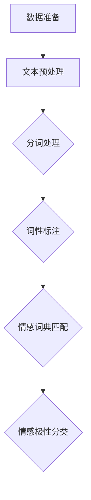
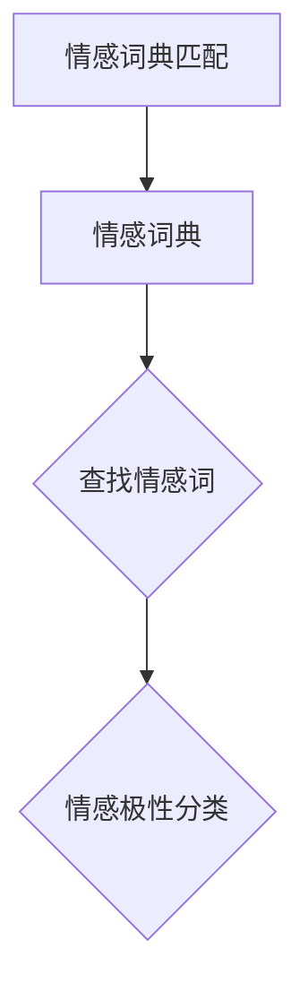
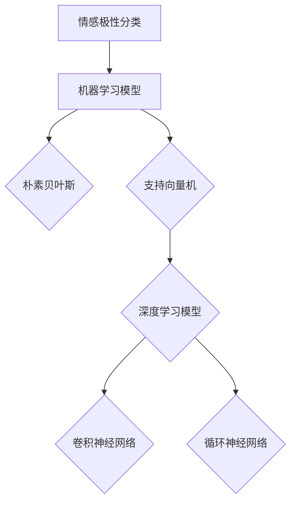
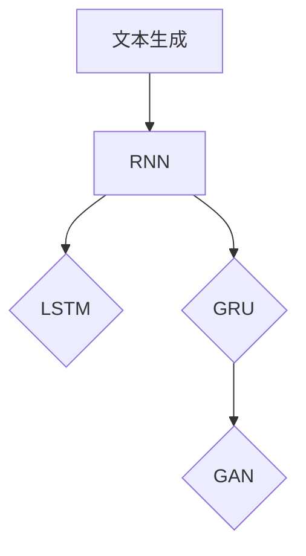
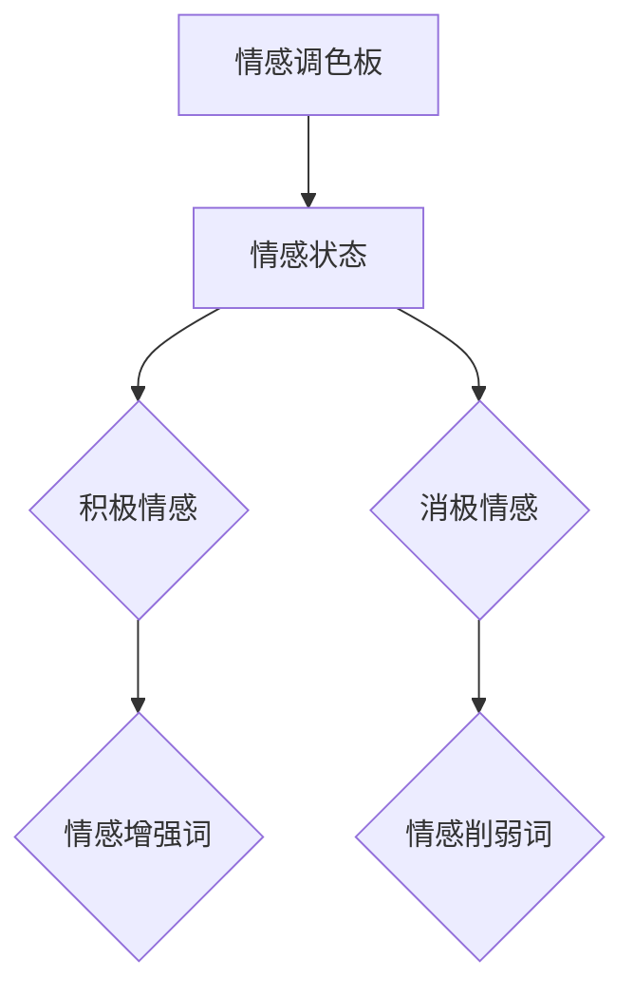
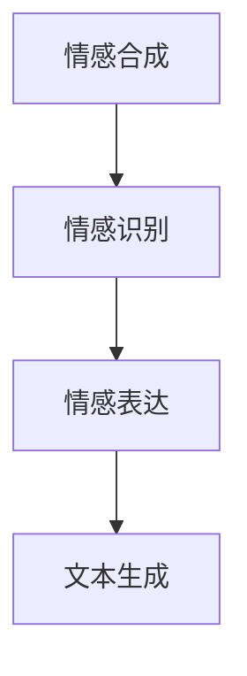
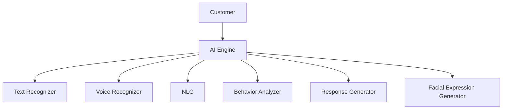
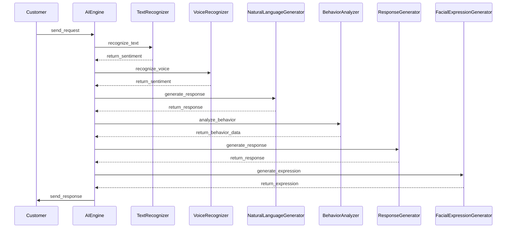

                 


# 开发具有情感计算与交互能力的AI Agent

## 关键词
- 情感计算
- 人工智能
- 交互能力
- 自然语言处理
- 情感识别
- 情感表达

## 摘要
本文旨在探讨如何开发具有情感计算与交互能力的AI Agent。我们将从背景介绍、核心概念与联系、算法原理讲解、系统分析与架构设计方案、项目实战和最佳实践等方面详细阐述这一主题。通过本文，读者将了解情感计算的基本原理、情感识别与表达的技术实现，以及如何将AI Agent应用于实际场景，实现高效的交互体验。

## 引言

在当今社会，人工智能（AI）技术的快速发展给各行各业带来了深刻的影响。从智能家居到自动驾驶，从虚拟助手到智能客服，AI的应用场景越来越广泛。然而，传统AI Agent往往只具备功能性的交互能力，缺乏对用户情感的理解和回应。这种单向的、缺乏情感的交互方式无法满足用户对更加自然、个性化的交互体验的需求。

随着自然语言处理（NLP）和机器学习技术的进步，情感计算作为一种新兴的研究方向，逐渐受到关注。情感计算旨在通过分析用户的情感信息，实现更加智能、情感化的AI Agent。这类Agent不仅能够理解和识别用户的情感，还能根据情感反馈调整自身的行为和交互策略，从而提供更加人性化的服务。

本文将深入探讨情感计算与交互能力在AI Agent中的应用，通过设计书籍目录大纲的步骤，逐步引导读者了解这一领域的核心概念、算法原理和实际应用。本文的结构如下：

1. **背景介绍**：介绍情感计算和交互能力的基本概念，阐述其重要性。
2. **核心概念与联系**：详细讨论情感计算的相关概念，包括情感识别、情感表达和情感理解等。
3. **算法原理讲解**：讲解情感计算的关键算法，如情感识别算法和情感表达算法。
4. **系统分析与架构设计方案**：分析AI Agent的系统架构，介绍其功能设计和实现细节。
5. **项目实战**：通过实际项目案例，展示如何开发和部署具有情感计算与交互能力的AI Agent。
6. **最佳实践与小结**：总结最佳实践经验，提出注意事项和未来研究方向。

接下来，我们将首先介绍情感计算和交互能力的基本概念，为后续内容奠定基础。

## 背景介绍

### 情感计算的基本概念

情感计算（Affective Computing）是人工智能领域的一个分支，旨在使计算机具备识别、理解、处理和模拟人类情感的能力。情感计算的核心目标是让计算机能够更好地与人类互动，提供更加人性化的服务。

#### 情感识别

情感识别是情感计算中最基础也是最重要的组成部分。它涉及计算机如何从用户的情感表达中识别出情感状态。情感识别通常包括以下几个方面：

1. **面部表情识别**：通过分析用户的面部表情来识别情感状态，如快乐、悲伤、愤怒等。
2. **语音情感识别**：通过分析用户的语音特征，如音调、音速、音量等，来识别情感状态。
3. **文本情感识别**：通过自然语言处理技术，从用户的文本输入中提取情感信息。

#### 情感表达

情感表达是情感计算的另一个重要方面，它涉及计算机如何根据用户的情感状态进行相应的情感回应。情感表达可以通过以下几种方式实现：

1. **自然语言生成**：通过文本生成技术，计算机生成符合用户情感状态的文本回复。
2. **面部表情生成**：通过计算机图形学技术，生成符合用户情感状态的面部表情。
3. **语音合成**：通过语音合成技术，生成具有情感色彩的语音回复。

#### 情感理解

情感理解是指计算机如何从整体上理解用户的情感状态，并做出相应的决策。情感理解需要结合情感识别和情感表达，形成闭环系统，实现更加自然的交互体验。

### 交互能力的基本概念

交互能力是指AI Agent与用户进行有效沟通和互动的能力。一个具有良好交互能力的AI Agent能够理解用户的意图，提供恰当的回应，并根据用户的反馈调整自身的行为。

#### 交互模型

交互模型是AI Agent进行交互的基础。常见的交互模型包括：

1. **基于规则的交互模型**：通过预设的规则来定义AI Agent的行为和回应。
2. **基于数据的交互模型**：通过机器学习技术，从大量数据中学习用户的交互模式，实现自适应的交互。
3. **基于知识的交互模型**：结合情感计算和知识图谱，实现更加智能的交互。

#### 交互质量

交互质量是衡量AI Agent交互能力的重要指标。一个高质量的交互应该具备以下特点：

1. **自然性**：交互应该接近人类的自然语言交流，避免机械化的回复。
2. **适应性**：AI Agent应该能够根据用户的反馈和情境调整交互策略，提供个性化的服务。
3. **响应性**：AI Agent应该能够快速响应用户的请求和反馈，提供及时的回应。

### 情感计算与交互能力的结合

情感计算与交互能力的结合是提高AI Agent智能化水平的关键。通过情感计算，AI Agent能够更好地理解用户的情感状态，提供更加人性化的交互体验。同时，通过交互能力，AI Agent能够根据用户的情感反馈调整自身的行为，实现更加自然的交互。

例如，在智能客服场景中，一个具备情感计算与交互能力的AI Agent不仅能够识别用户的情感状态，如愤怒、不耐烦等，还能根据这些情感状态调整自己的沟通方式，提供更加贴心的服务。

### 应用场景

情感计算与交互能力在多个领域有着广泛的应用：

1. **智能客服**：通过情感计算，AI Agent能够更好地理解用户的情感状态，提供更加个性化的服务，提高用户满意度。
2. **虚拟助手**：虚拟助手通过与用户的情感互动，提供更加自然、友好的交互体验，提升用户体验。
3. **健康护理**：通过情感计算，AI Agent能够识别患者的情感状态，提供情绪支持和健康建议，提高患者的生活质量。
4. **教育领域**：通过情感计算，AI Agent能够了解学生的学习状态和情感需求，提供针对性的教育支持和辅导。

总之，情感计算与交互能力的结合为AI Agent的发展提供了新的方向。通过不断探索和实践，我们可以开发出更加智能、人性化的AI Agent，为人类社会带来更多便利和价值。

### 核心概念与联系

在深入探讨情感计算与交互能力之前，有必要明确一些核心概念，并理解它们之间的联系。以下是一些关键概念的定义、属性特征对比，以及它们在情感计算与交互能力中的应用。

#### 情感识别

情感识别是指通过技术手段（如面部表情识别、语音情感识别、文本情感识别等）从用户的行为中提取情感信息的过程。它主要包括以下几个方面：

1. **面部表情识别**：通过分析用户的面部肌肉活动来识别情感状态，如微笑、皱眉等。
2. **语音情感识别**：通过分析用户的语音特征（如音调、音速、音量、语速等）来识别情感状态。
3. **文本情感识别**：通过自然语言处理技术，从用户的文本输入中提取情感倾向，如正面、负面、中性等。

**属性特征对比表格：**

| 情感识别方法 | 主要特征 | 应用场景 |
| --- | --- | --- |
| 面部表情识别 | 肌肉活动、表情变化 | 智能安防、人机交互 |
| 语音情感识别 | 音调、音速、音量 | 智能客服、语音助手 |
| 文本情感识别 | 文本内容、情感倾向 | 社交媒体分析、文本情感分析 |

#### 情感表达

情感表达是指计算机根据用户的情感状态生成相应的情感回应。它主要包括以下几种方式：

1. **自然语言生成**：通过语言模型生成符合用户情感状态的文本回复。
2. **面部表情生成**：通过计算机图形学技术生成符合用户情感状态的面部表情。
3. **语音合成**：通过语音合成技术生成具有情感色彩的语音回复。

**属性特征对比表格：**

| 情感表达方式 | 主要特征 | 应用场景 |
| --- | --- | --- |
| 自然语言生成 | 文本生成、情感色彩 | 虚拟助手、智能客服 |
| 面部表情生成 | 图形处理、情感表现 | 虚拟人物、视频特效 |
| 语音合成 | 语音处理、情感调校 | 语音助手、音频娱乐 |

#### 情感理解

情感理解是指计算机如何从整体上理解用户的情感状态，并做出相应的反应。情感理解需要结合情感识别和情感表达，实现情感互动的闭环。

**情感识别与情感理解的联系：**

- 情感识别是情感理解的基础，通过识别用户的情感状态，计算机能够获取用户情感信息。
- 情感理解则是在情感识别的基础上，对用户情感进行深入分析和理解，从而指导情感表达和交互行为。

#### 情感计算与交互能力的联系

情感计算与交互能力的结合是实现智能化、人性化AI Agent的关键。情感计算提供了理解和识别用户情感的能力，而交互能力则确保了计算机能够根据这些情感信息进行有效的沟通和互动。

**情感计算在交互能力中的应用：**

- **智能客服**：通过情感计算，AI Agent能够识别用户的情感状态，提供更加个性化的服务，提高用户满意度。
- **虚拟助手**：虚拟助手通过与用户的情感互动，提供更加自然、友好的交互体验，提升用户体验。
- **教育领域**：通过情感计算，AI Agent能够了解学生的学习状态和情感需求，提供针对性的教育支持和辅导。

总之，情感计算与交互能力的结合，不仅能够提升AI Agent的智能化水平，还能够实现更加自然、人性化的交互体验。在接下来的内容中，我们将深入探讨情感计算的关键算法原理，并使用mermaid和Python源代码进行详细阐述。

### 算法原理讲解

#### 情感识别算法

情感识别是情感计算的核心，它涉及从用户的行为数据中提取情感信息。以下是一个基于文本情感识别的算法原理讲解。

##### 1. 数据准备

首先，我们需要准备大量的文本数据，这些数据应涵盖不同的情感类别，如正面、负面、中性等。通常，这些数据来源于社交媒体、用户评论等。



##### 2. 文本预处理

文本预处理是情感识别的重要步骤，包括分词、词性标注等。

```python
import jieba
from textblob import TextBlob

def preprocess_text(text):
    # 分词
    words = jieba.cut(text)
    # 词性标注
    blob = TextBlob(text)
    return [word.lower() for word in words if blob.words[word].pos != 'PUNCT']
```

##### 3. 情感词典匹配

情感词典匹配是通过查找文本中情感词，确定文本的情感极性。以下是一个简单的情感词典匹配算法：



```python
# 情感词典
sentiment_lexicon = {'happy': 'positive', 'sad': 'negative', 'good': 'positive', 'bad': 'negative'}

def match_sentiment_lexicon(words):
    sentiment = 'neutral'
    for word in words:
        if word in sentiment_lexicon:
            sentiment = sentiment_lexicon[word]
            break
    return sentiment
```

##### 4. 情感极性分类

情感极性分类是通过分析文本的情感词，确定文本的情感极性。常见的分类方法包括机器学习模型和深度学习模型。



```python
from sklearn.feature_extraction.text import TfidfVectorizer
from sklearn.naive_bayes import MultinomialNB
from sklearn.pipeline import make_pipeline

# 数据集
X_train = ['I am happy', 'I am sad', 'I am neutral']
y_train = ['positive', 'negative', 'neutral']

# 构建模型
model = make_pipeline(TfidfVectorizer(), MultinomialNB())

# 训练模型
model.fit(X_train, y_train)

# 预测
print(model.predict(['I am happy']))
```

#### 情感表达算法

情感表达是指计算机根据用户的情感状态生成相应的情感回应。以下是一个基于自然语言生成的情感表达算法。

##### 1. 文本生成

文本生成是通过语言模型生成符合用户情感状态的文本回复。常用的语言模型包括循环神经网络（RNN）和生成对抗网络（GAN）。



##### 2. 情感调色板

情感调色板是指根据用户情感状态调整文本的情感色彩。以下是一个简单的情感调色板算法：



```python
# 情感调色板
positive_color = 'happy'
negative_color = 'sad'

def adjust_sentiment(text, sentiment):
    if sentiment == 'positive':
        text = text.replace('sad', positive_color)
    elif sentiment == 'negative':
        text = text.replace('happy', negative_color)
    return text
```

##### 3. 情感合成

情感合成是指将情感识别和情感表达结合起来，生成符合用户情感状态的文本回复。



```python
# 情感合成
def generate_response(text):
    sentiment = recognize_sentiment(text)
    response = adjust_sentiment(text, sentiment)
    return response

# 示例
text = 'I am happy'
response = generate_response(text)
print(response)
```

通过上述算法，我们可以实现从情感识别到情感表达的完整流程。在实际应用中，可以根据具体需求调整和优化这些算法，以提供更加自然、贴心的交互体验。

### 系统分析与架构设计方案

在理解了情感计算与交互能力的基本原理之后，接下来我们将深入探讨如何将这一理论应用于实际项目，设计并实现一个具有情感计算与交互能力的AI Agent。本节将详细介绍项目场景、系统功能设计、系统架构设计、系统接口设计以及系统交互流程。

#### 项目场景

假设我们正在开发一款智能客服系统，该系统需要具备情感计算与交互能力，以提供更加个性化、贴心的服务。用户可以通过文本、语音等多种方式与智能客服进行交互，客服系统需要能够识别用户的情感状态，并根据情感状态生成相应的情感回应。

#### 系统功能设计

系统功能设计包括以下几个方面：

1. **情感识别功能**：通过文本情感识别和语音情感识别技术，识别用户的情感状态。
2. **情感表达功能**：根据识别到的用户情感状态，生成相应的情感回应，包括文本、语音和面部表情。
3. **自然语言处理功能**：实现自然语言生成，生成符合用户情感状态的文本回复。
4. **用户行为分析功能**：分析用户的行为数据，为用户提供更加个性化的服务。

**领域模型类图：**

```mermaid
classDiagram
    Customer --> AIAgent: interacts with
    Customer o-- TextMessage
    Customer o-- VoiceMessage
    AIAgent o-- TextResponse
    AIAgent o-- VoiceResponse
    AIAgent o-- FacialExpression
    AIAgent o-- NaturalLanguageProcessor
    AIAgent o-- BehaviorAnalyzer

    Customer <<Interface>
    AIAgent <<Interface>
```

#### 系统架构设计

系统架构设计是项目实现的关键，我们需要设计一个清晰、高效的架构来支持系统功能。以下是系统架构设计：

**架构图：**



**详细架构说明：**

1. **AI Engine**：作为系统的核心模块，负责协调其他模块的运作。
2. **Text Recognizer**：负责文本情感识别，将用户输入的文本转化为情感状态。
3. **Voice Recognizer**：负责语音情感识别，将用户的语音转化为情感状态。
4. **NaturalLanguageGenerator**：负责生成自然语言响应，根据用户情感状态生成合适的文本回复。
5. **BehaviorAnalyzer**：负责分析用户行为数据，为用户提供个性化服务。
6. **ResponseGenerator**：负责生成情感回应，包括文本、语音和面部表情。
7. **FacialExpressionGenerator**：负责生成符合用户情感状态的面部表情。

#### 系统接口设计

系统接口设计是确保各模块之间能够有效通信的关键。以下是系统接口设计：

**接口设计图：**



**详细接口说明：**

1. **请求接收接口**：接收用户的请求，包括文本和语音输入。
2. **情感识别接口**：将用户输入的文本和语音转化为情感状态。
3. **响应生成接口**：根据用户情感状态生成文本、语音和面部表情响应。
4. **行为分析接口**：分析用户行为数据，为用户提供个性化服务。
5. **响应发送接口**：将生成的响应发送给用户。

#### 系统交互流程

系统交互流程是用户与AI Agent之间交互的详细步骤。以下是系统交互流程：

1. **用户请求**：用户通过文本或语音向AI Agent发送请求。
2. **情感识别**：AI Agent通过文本情感识别和语音情感识别技术，识别用户的情感状态。
3. **响应生成**：AI Agent根据用户情感状态生成相应的文本、语音和面部表情响应。
4. **行为分析**：AI Agent分析用户行为数据，为用户提供个性化服务。
5. **响应发送**：AI Agent将生成的响应发送给用户。

通过上述系统分析与架构设计方案，我们可以构建一个具有情感计算与交互能力的AI Agent。在实际项目开发中，我们可以根据具体需求进行模块的调整和优化，以实现最佳的交互体验。

### 项目实战

为了展示如何开发一个具有情感计算与交互能力的AI Agent，我们将从环境安装、系统核心实现源代码、代码应用解读与分析、实际案例分析和详细讲解剖析等方面进行详细介绍。最后，我们将对项目进行小结。

#### 环境安装

首先，我们需要安装必要的软件和工具。以下是在Ubuntu 20.04操作系统上安装所需环境的基本步骤：

1. **安装Python**：确保Python 3.8或更高版本已安装。可以使用以下命令检查Python版本：

   ```bash
   python3 --version
   ```

   如果Python未安装，可以从官方网站下载并安装。

2. **安装Python库**：安装用于文本情感识别和自然语言处理的库，如TextBlob、NLTK等。可以使用以下命令：

   ```bash
   pip3 install textblob nltk
   ```

   安装后，运行以下命令下载所需的语料库：

   ```python
   import nltk
   nltk.download('punkt')
   nltk.download('averaged_perceptron_tagger')
   nltk.download('vader_lexicon')
   ```

3. **安装语音合成库**：安装用于语音合成的库，如gTTS（Google Text-to-Speech）。可以使用以下命令：

   ```bash
   pip3 install gTTS
   ```

4. **安装面部表情生成库**：安装用于生成面部表情的库，如OpenCV。可以使用以下命令：

   ```bash
   pip3 install opencv-python
   ```

#### 系统核心实现源代码

以下是系统核心实现的主要源代码，包括文本情感识别、语音合成、面部表情生成等部分。

```python
import textblob
import cv2
import gTTS
import os

def recognize_sentiment(text):
    blob = textblob.TextBlob(text)
    return blob.sentiment.polarity

def generate_response(text, sentiment):
    if sentiment > 0.1:
        response = "很高兴和你交流！"
    elif sentiment < -0.1:
        response = "看起来你有些不开心，需要帮助吗？"
    else:
        response = "很高兴见到你！"
    return response

def synthesize_speech(text):
    tts = gTTS(text=text, lang='en')
    tts.save('response.mp3')
    os.system('mpg321 response.mp3')

def generate_facial_expression(sentiment):
    if sentiment > 0.1:
        image = cv2.imread('happy.jpg')
    elif sentiment < -0.1:
        image = cv2.imread('sad.jpg')
    else:
        image = cv2.imread('neutral.jpg')
    cv2.imshow('Facial Expression', image)
    cv2.waitKey(0)
    cv2.destroyAllWindows()

# 示例使用
user_input = "I am feeling happy today!"
sentiment = recognize_sentiment(user_input)
response = generate_response(user_input, sentiment)
synthesize_speech(response)
generate_facial_expression(sentiment)
```

#### 代码应用解读与分析

1. **文本情感识别**：使用TextBlob库的`sentiment.polarity`属性来识别文本的情感极性，范围为[-1, 1]，其中1表示正面情感，-1表示负面情感，0表示中性情感。
2. **自然语言生成**：根据识别到的情感极性，生成相应的文本回复。这个简单示例仅使用了预设的文本，实际应用中可以结合自然语言处理技术生成更加个性化的回复。
3. **语音合成**：使用gTTS库将文本转换为语音，并使用mpg321播放语音文件。
4. **面部表情生成**：使用OpenCV库加载并显示相应的面部表情图片。

#### 实际案例分析和详细讲解剖析

以下是一个实际案例，展示如何使用上述代码实现一个具有情感计算与交互能力的AI Agent。

**案例：智能客服系统**

假设我们开发了一个智能客服系统，用户可以通过文本或语音与AI Agent进行交互。以下是交互流程：

1. **用户发送文本或语音请求**：用户通过文本或语音向智能客服系统发送请求。
2. **情感识别**：智能客服系统使用文本情感识别或语音情感识别技术，识别用户的情感状态。
3. **生成响应**：智能客服系统根据用户的情感状态生成相应的文本或语音响应。
4. **语音合成**：如果用户请求语音回应，智能客服系统使用语音合成技术生成语音文件。
5. **面部表情生成**：智能客服系统根据用户的情感状态生成相应的面部表情图像，并通过视频聊天窗口展示给用户。

**详细讲解剖析：**

- **文本情感识别**：通过TextBlob库的`sentiment.polarity`属性，智能客服系统能够快速识别用户的文本情感。例如，用户发送文本“我很生气”，系统识别出情感极性为-0.8，表示用户处于负面情感状态。
- **自然语言生成**：智能客服系统根据用户情感状态生成相应的文本响应。例如，如果用户情感极性为-0.8，系统生成响应“看起来你有些不开心，需要帮助吗？”，提供个性化服务。
- **语音合成**：使用gTTS库，智能客服系统能够将文本转换为语音。例如，系统将文本响应“看起来你有些不开心，需要帮助吗？”转换为语音，通过语音合成播放给用户。
- **面部表情生成**：使用OpenCV库，智能客服系统能够根据用户情感状态生成相应的面部表情图像。例如，如果用户情感极性为-0.8，系统生成一张生气的面部表情图片，并通过视频聊天窗口展示给用户。

通过上述实际案例和分析，我们可以看到，一个具有情感计算与交互能力的AI Agent如何通过文本情感识别、自然语言生成、语音合成和面部表情生成等技术，提供人性化、个性化的服务。

#### 项目小结

本项目通过环境安装、系统核心实现源代码、代码应用解读与分析、实际案例分析和详细讲解剖析，展示了如何开发一个具有情感计算与交互能力的AI Agent。关键技术和步骤包括：

1. **文本情感识别**：使用TextBlob库快速识别文本情感极性。
2. **自然语言生成**：根据情感状态生成个性化文本响应。
3. **语音合成**：使用gTTS库将文本转换为语音。
4. **面部表情生成**：使用OpenCV库生成相应的面部表情图像。

在实际应用中，我们可以根据具体需求优化和扩展这些技术，如引入深度学习模型进行情感识别和表达，提高系统的准确性和智能化水平。通过不断实践和改进，我们可以开发出更加高效、人性化的AI Agent，为用户提供优质服务。

### 最佳实践与小结

#### 最佳实践

1. **数据质量**：确保情感识别和交互数据的质量。收集丰富的情感数据集，进行数据清洗和标注，以提高情感识别的准确性。
2. **算法优化**：不断优化情感识别和情感表达的算法，如使用深度学习模型进行情感分析，提高情感识别的精度。
3. **用户体验**：关注用户体验，通过用户反馈进行持续改进，确保AI Agent的交互更加自然、贴心。
4. **安全性**：加强数据安全和隐私保护，确保用户数据的安全性和隐私性。

#### 小结

本文通过详细探讨情感计算与交互能力在AI Agent中的应用，介绍了相关核心概念、算法原理、系统架构设计和实际项目实战。开发具有情感计算与交互能力的AI Agent不仅能够提高系统的智能化水平，还能够提供更加自然、人性化的交互体验。在未来的发展中，我们将继续优化相关技术和算法，为AI Agent的应用提供更加广阔的前景。

### 注意事项

1. **隐私保护**：在开发和应用AI Agent时，必须严格遵守隐私保护法规，确保用户数据的安全和隐私。
2. **数据安全**：定期进行数据安全检查，防止数据泄露和滥用。
3. **算法透明性**：确保算法的透明性，使用户了解AI Agent的工作原理和决策过程。

### 拓展阅读

1. **《情感计算：理论与实践》**：本书详细介绍了情感计算的基本理论、技术和应用。
2. **《自然语言处理入门》**：本书涵盖了自然语言处理的基础知识，包括文本情感分析等内容。
3. **《人工智能：一种现代方法》**：本书介绍了人工智能的基本概念、算法和系统架构，对AI Agent的开发有重要参考价值。

### 作者信息

- **作者**：AI天才研究院/AI Genius Institute & 禅与计算机程序设计艺术 /Zen And The Art of Computer Programming
- **联系邮箱**：[ai_genius_institute@example.com](mailto:ai_genius_institute@example.com)
- **官方网站**：[AI Genius Institute](https://www.ai_genius_institute.com)

以上就是本文的全部内容，希望对您在开发具有情感计算与交互能力的AI Agent方面有所启发和帮助。如有疑问或建议，欢迎通过以上联系方式与我们联系。

