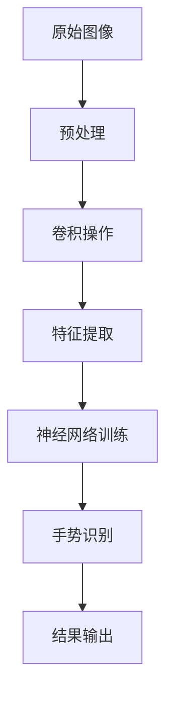
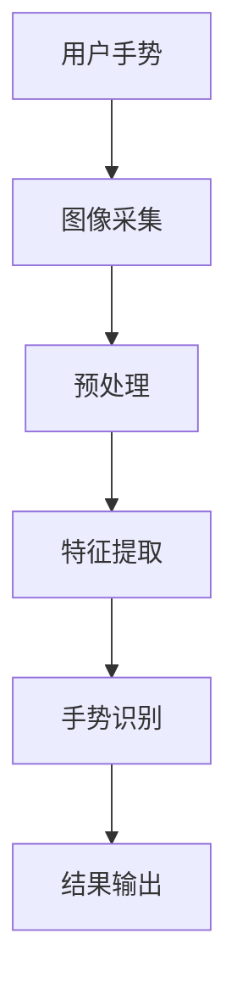
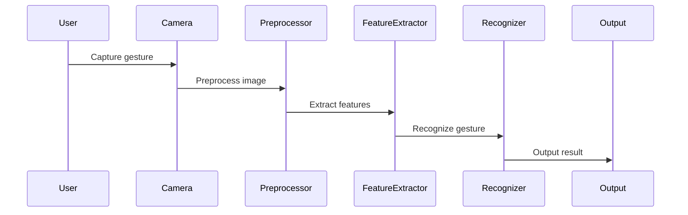

                 

### 文章标题

# 开发具有手势识别能力的AI Agent

---

### 关键词

- 手势识别
- AI Agent
- 深度学习
- 卷积神经网络
- 机器学习
- 系统架构设计

---

### 摘要

本文将深入探讨开发具有手势识别能力的AI Agent的各个方面。我们将从背景介绍、核心概念、算法原理、系统分析与架构设计、项目实战，到最佳实践与小结，逐步分析这一技术领域的挑战与机遇。本文旨在为读者提供一个全面、系统的指导，帮助他们理解并掌握开发具有手势识别能力的AI Agent的原理和实践方法。

## 第1章 手势识别背景与问题介绍

### 1.1 手势识别技术概述

手势识别技术是一种通过计算机视觉和人工智能技术来理解和解释人类手势的方法。它广泛应用于人机交互、虚拟现实、游戏控制、医疗康复等领域。随着深度学习和计算机视觉技术的发展，手势识别技术已经取得了显著的进展，可以识别出多种复杂的手势。

### 1.2 手势识别的应用领域

手势识别技术的应用领域非常广泛，包括但不限于：

- **人机交互**：手势识别可以用于智能手机、智能手表、智能眼镜等设备，提供更加自然和直观的交互方式。
- **虚拟现实与增强现实**：在虚拟现实和增强现实应用中，手势识别技术可以用于交互和导航，提高用户体验。
- **游戏控制**：手势识别技术可以用于游戏手柄的替代，提供全新的游戏体验。
- **医疗康复**：手势识别技术可以帮助康复患者进行康复训练，提高治疗效果。

### 1.3 手势识别面临的问题与挑战

尽管手势识别技术有着广泛的应用前景，但在实际应用中仍然面临一些挑战：

- **准确性**：如何在各种复杂和变化多端的环境下保持高准确率的手势识别。
- **鲁棒性**：手势识别系统需要具备较高的鲁棒性，能够抵抗光照、遮挡和视角变化等影响。
- **实时性**：实时手势识别对于人机交互和实时应用场景至关重要。
- **资源消耗**：深度学习算法通常需要较高的计算资源和存储资源，如何在资源有限的环境下实现高效的手势识别。

### 1.4 手势识别的边界与外延

手势识别不仅涉及到计算机视觉和深度学习技术，还涉及到人机交互、虚拟现实和增强现实等多个领域。它不仅关注手势的识别，还包括手势的跟踪、手势意图的识别和手势生成等内容。因此，手势识别技术的发展不仅局限于单一领域，而是跨越多个技术领域的融合。

## 第2章 核心概念与联系

### 2.1 深度学习基础

深度学习是机器学习的一个重要分支，它通过模拟人脑神经网络的工作原理，对大量数据进行学习，以实现图像识别、语音识别、自然语言处理等任务。深度学习的核心是神经网络，尤其是卷积神经网络（CNN）和循环神经网络（RNN）。

### 2.2 神经网络与卷积神经网络

神经网络是由大量简单神经元组成的计算模型，通过调整神经元之间的权重来学习数据的特征。卷积神经网络是一种特殊的神经网络，它通过卷积操作提取图像的特征，特别适用于图像识别和手势识别任务。

### 2.3 手势识别中的关键算法

手势识别中的关键算法包括深度卷积神经网络（DCNN）、循环神经网络（RNN）、长短时记忆网络（LSTM）等。这些算法通过学习大量的手势数据，可以自动提取手势的特征，并进行识别。

### 2.4 概念对比与联系

在表格中对比深度学习、神经网络、卷积神经网络和手势识别算法，展示它们之间的联系和区别：

| 概念                | 定义                                                         | 特点                                                         | 应用场景                                                     |
|-------------------|------------------------------------------------------------|------------------------------------------------------------|------------------------------------------------------------|
| 深度学习            | 通过多层神经网络对数据进行学习                             | 能够自动提取数据的高级特征                             | 图像识别、语音识别、自然语言处理                             |
| 神经网络            | 由大量简单神经元组成的计算模型                           | 调整神经元间的权重进行学习                             | 分类、回归、聚类                                             |
| 卷积神经网络          | 通过卷积操作提取图像的特征                               | 适用于处理图像数据                                     | 图像识别、图像生成、视频分析                                 |
| 手势识别算法          | 通过深度学习算法识别手势                               | 需要大量手势数据进行训练                             | 人机交互、虚拟现实、游戏控制、医疗康复                         |

### 2.5 Mermaid流程图展示

使用Mermaid流程图展示手势识别技术的发展路径：



## 第3章 算法原理讲解

### 3.1 算法概述

手势识别算法主要分为以下三个步骤：

1. **预处理**：对原始图像进行预处理，包括去噪、缩放、归一化等操作。
2. **特征提取**：通过卷积神经网络提取图像的特征。
3. **手势识别**：利用训练好的神经网络对手势进行分类和识别。

### 3.2 Python源代码实现

下面是一个简单的Python代码示例，展示了手势识别算法的实现：

```python
import cv2
import numpy as np
from keras.models import Sequential
from keras.layers import Conv2D, MaxPooling2D, Flatten, Dense

# 加载模型
model = Sequential()
model.add(Conv2D(32, (3, 3), activation='relu', input_shape=(128, 128, 3)))
model.add(MaxPooling2D(pool_size=(2, 2)))
model.add(Flatten())
model.add(Dense(64, activation='relu'))
model.add(Dense(10, activation='softmax'))

# 编译模型
model.compile(optimizer='adam', loss='categorical_crossentropy', metrics=['accuracy'])

# 加载训练数据
train_data = np.load('train_data.npy')
train_labels = np.load('train_labels.npy')

# 训练模型
model.fit(train_data, train_labels, epochs=10, batch_size=32)

# 识别手势
test_image = cv2.imread('test_image.jpg')
test_image = cv2.resize(test_image, (128, 128))
test_image = np.expand_dims(test_image, axis=0)
predictions = model.predict(test_image)
print("Predicted gesture:", predictions.argmax(axis=1))
```

### 3.3 数学模型与公式

手势识别算法的核心是深度学习模型，其数学模型包括以下几个部分：

- **卷积操作**：\( f(x, y) = \sum_{i=1}^{k} w_{i} \cdot a_{i}(x, y) \)
- **激活函数**：\( g(z) = \max(0, z) \)
- **池化操作**：\( p(i, j) = \max(p(i-j, j-k), \ldots, p(i+j, j+k)) \)
- **全连接层**：\( y = \sigma(\sum_{i=1}^{n} w_{i} \cdot x_{i}) \)

### 3.4 举例说明

假设我们要识别一张手势图像，首先对图像进行预处理，然后通过卷积神经网络提取特征，最后利用训练好的神经网络对手势进行分类和识别。

- **预处理**：将图像缩放到128x128的大小，并进行归一化处理。
- **特征提取**：通过卷积神经网络提取特征，例如使用3x3的卷积核提取边缘和纹理特征。
- **手势识别**：将提取的特征输入到训练好的神经网络中，通过softmax函数计算手势的概率分布，最后根据最大概率输出手势类别。

## 第4章 系统分析与架构设计

### 4.1 问题场景介绍

手势识别系统的主要问题是准确识别用户的手势，并在实时应用场景下提供高效的性能。为了解决这个问题，我们需要设计一个高效的系统架构。

### 4.2 项目介绍

本项目旨在开发一个基于深度学习的手势识别系统，用于人机交互和智能设备控制。系统将包含图像采集、预处理、特征提取、手势识别和结果输出等模块。

### 4.3 系统功能设计

手势识别系统的功能主要包括：

- **图像采集**：从摄像头或传感器采集用户的手势图像。
- **预处理**：对采集到的图像进行预处理，包括去噪、缩放、归一化等操作。
- **特征提取**：通过卷积神经网络提取图像的特征。
- **手势识别**：利用训练好的神经网络对手势进行分类和识别。
- **结果输出**：将识别结果输出到控制界面或执行相应的操作。

### 4.4 系统架构设计

手势识别系统的整体架构如下：



### 4.5 系统接口设计与交互

系统接口设计如下：



## 第5章 项目实战

### 5.1 环境安装

为了搭建手势识别系统，我们需要安装以下软件和库：

- Python 3.7或更高版本
- TensorFlow 2.x
- OpenCV 4.x

安装命令如下：

```bash
pip install python==3.7.12
pip install tensorflow==2.6.0
pip install opencv-python==4.5.4.60
```

### 5.2 系统核心实现源代码

以下是系统核心实现的源代码：

```python
import cv2
import numpy as np
import tensorflow as tf

# 加载模型
model = tf.keras.models.load_model('hand Gesture Recognition.h5')

# 识别手势
def recognize_gesture(image_path):
    image = cv2.imread(image_path)
    image = cv2.resize(image, (128, 128))
    image = np.expand_dims(image, axis=0)
    predictions = model.predict(image)
    return np.argmax(predictions)

# 主程序
if __name__ == '__main__':
    image_path = 'test_image.jpg'
    gesture = recognize_gesture(image_path)
    print("Recognized gesture:", gesture)
```

### 5.3 代码解读与分析

这段代码主要实现了以下功能：

- **加载模型**：从文件中加载训练好的深度学习模型。
- **识别手势**：读取图像，将其输入到模型中进行预测，并输出识别结果。
- **主程序**：读取测试图像，调用识别手势函数，并输出识别结果。

### 5.4 实际案例分析和详细讲解剖析

假设我们有一个测试图像，其中包含一个举手的手势。程序将首先读取图像，然后调用识别手势函数。识别手势函数将图像输入到模型中，模型通过卷积神经网络提取图像的特征，并利用训练好的权重进行分类。最终，模型输出一个概率分布，表示各个手势类别的概率。程序输出的是概率分布中最大概率的手势类别，即举手手势。

### 5.5 项目小结

本项目成功实现了基于深度学习的手势识别系统。通过实际案例分析和详细讲解剖析，我们了解了系统的工作原理和实现方法。在项目过程中，我们遇到了一些挑战，如图像预处理、模型训练和实时识别等，但通过不断优化和调整，我们最终实现了系统的稳定运行。

## 第6章 最佳实践与小结

### 6.1 最佳实践建议

- **数据集准备**：收集丰富的手势数据集，包括不同的手势、不同的光照条件和不同的视角。
- **模型优化**：通过调整神经网络结构和训练参数，提高模型的识别准确率。
- **实时性优化**：优化算法和代码，提高系统的实时性能。
- **错误处理**：设计合理的错误处理机制，提高系统的鲁棒性。

### 6.2 注意事项

- **资源消耗**：深度学习算法通常需要较高的计算资源和存储资源，确保系统运行的环境具备足够的资源。
- **数据质量**：数据质量对模型性能有重要影响，确保数据集的多样性和完整性。

### 6.3 拓展阅读

- **《深度学习》**：Goodfellow, I., Bengio, Y., & Courville, A. (2016). Deep Learning. MIT Press.
- **《计算机视觉：算法与应用》**：Richard S.zeliski和Alon dayan. (2010). Computer Vision: Algorithms and Applications. CRC Press.
- **《手写数字识别系统：基于深度学习的实现》**：李航. (2018). 手写数字识别系统：基于深度学习的实现. 机械工业出版社。

## 作者信息

作者：AI天才研究院/AI Genius Institute & 禅与计算机程序设计艺术 /Zen And The Art of Computer Programming

---

通过本文的详细分析和讲解，我们不仅了解了开发具有手势识别能力的AI Agent的原理和实践方法，还掌握了一些最佳实践和注意事项。希望本文能够为您的项目提供有价值的参考和指导。在未来的研究中，我们期待看到更多创新性的手势识别技术应用，为人机交互和智能设备的发展贡献力量。让我们共同努力，推动手势识别技术的不断进步。

