                 

### 第一部分: AI Agent的基础概念与发展

#### 第1章: AI Agent概述

在开始深入探讨如何开发具有抽象思维与推理能力的AI Agent之前，我们需要先理解什么是AI Agent，它们是如何工作的，以及为什么抽象思维与推理能力对于AI Agent的发展至关重要。

**1.1 关键词**
- AI Agent
- 抽象思维
- 推理能力
- 人工智能
- 自主系统

**1.2 摘要**

本章将介绍AI Agent的基本概念，包括其定义、历史背景和分类。我们将讨论AI Agent的核心功能，如感知、决策和行动，以及它们与人类智能的相似之处和差异。此外，我们将探讨抽象思维与推理能力在AI Agent中的作用，并解释为什么这些能力对于AI Agent的发展至关重要。

**1.3 背景介绍**

AI Agent是指能够在特定环境中自主行动并执行任务的计算机程序。它们可以感知环境、分析情况、做出决策并执行行动，以实现特定目标。AI Agent的概念源于人工智能的研究，旨在创建能够模拟人类智能的计算机系统。

AI Agent的发展历史可以追溯到20世纪50年代，当时第一个AI程序被开发出来。自那时以来，AI Agent在许多领域得到了广泛应用，包括自动化控制、游戏、机器人学、金融和医疗保健等。

AI Agent可以分为多种类型，如基于规则的Agent、基于模型的Agent、基于行为的Agent和基于混合方法的Agent。每种类型的Agent都有其特定的原理和适用场景。

**1.4 核心概念与联系**

**AI Agent的定义：**

AI Agent是指一种具有自主性和交互能力的计算机程序，能够在其执行任务的环境中感知、推理和行动。

**抽象思维：**

抽象思维是指能够从具体事物中提取出一般性概念和规律的能力。在AI Agent中，抽象思维使得它们能够理解和处理复杂的问题，并从大量的数据中提取有价值的信息。

**推理能力：**

推理能力是指能够基于已知信息推导出新的结论的能力。在AI Agent中，推理能力使得它们能够解决复杂的问题，并做出明智的决策。

**1.5 问题与挑战**

尽管AI Agent在许多领域取得了显著进展，但它们仍然面临一些挑战，包括：

- 复杂性：AI Agent需要处理大量的数据和变量，这使得它们的开发变得复杂。
- 不确定性和不确定性处理：AI Agent需要能够处理不确定的信息，并在不确定的环境中做出决策。
- 自主性和伦理问题：AI Agent需要在没有人类干预的情况下自主行动，这涉及到伦理和安全性问题。

**1.6 结论**

AI Agent是人工智能研究的重要领域，具有广泛的应用前景。开发具有抽象思维与推理能力的AI Agent需要解决许多技术挑战，但这也是实现更智能、更自主的计算机系统的重要步骤。

**1.7 拓展阅读**

- [Russell, S., & Norvig, P. (2016). Artificial Intelligence: A Modern Approach. Prentice Hall.]
- [Bishop, C. M. (2006). Pattern Recognition and Machine Learning. Springer.]
- [Russell, S., & Norvig, P. (2010). AI: A Modern Approach (3rd ed.). Prentice Hall.]

**1.8 注意事项**

- 在开发AI Agent时，要充分考虑其应用场景和目标，以确保其能够满足实际需求。
- AI Agent的设计和开发需要综合考虑各种技术挑战，包括数据质量、算法效率和安全性等。

**1.9 最佳实践**

- 在设计AI Agent时，要遵循模块化原则，以便于维护和扩展。
- 在开发AI Agent时，要注重算法的可解释性，以便于理解其决策过程。
- 在AI Agent的应用过程中，要持续收集反馈，并进行优化和改进。

**1.10 小结**

本章介绍了AI Agent的基本概念、抽象思维和推理能力的重要性，以及AI Agent面临的挑战。通过理解这些概念，我们可以更好地理解如何开发具有抽象思维与推理能力的AI Agent，为后续章节的学习打下基础。

**1.11 代码实现**

在本章的最后，我们将提供一个简单的Python代码示例，展示如何实现一个基本的AI Agent。

```python
class AI-Agent:
    def __init__(self, environment):
        self.environment = environment

    def perceive(self):
        # 感知环境
        pass

    def decide(self):
        # 基于感知信息做出决策
        pass

    def act(self):
        # 执行决策
        pass

agent = AI-Agent(environment)
agent.perceive()
agent.decide()
agent.act()
```

通过这个简单的示例，我们可以看到AI Agent的基本结构和功能。在接下来的章节中，我们将进一步探讨如何增强AI Agent的抽象思维和推理能力。

**1.12 实际案例分析**

为了更好地理解AI Agent的概念和应用，我们可以分析一个实际案例：自动驾驶汽车。

自动驾驶汽车是一种具有高度自主性的AI Agent，它需要在复杂的交通环境中感知路况、识别行人、车辆和其他障碍物，并做出安全的驾驶决策。自动驾驶汽车的核心组件包括感知系统、决策系统和执行系统。

感知系统负责收集环境信息，如摄像头、雷达和激光雷达等传感器。决策系统基于感知信息，结合地图数据和驾驶规则，生成驾驶策略。执行系统则负责控制车辆的运动，如加速、减速和转向等。

自动驾驶汽车的开发和部署是一个复杂的系统工程，涉及到多个学科和技术领域的知识。通过这个案例，我们可以看到AI Agent在实际应用中的重要性，以及抽象思维和推理能力对于解决复杂问题的关键作用。

**1.13 小结**

本章介绍了AI Agent的基本概念、抽象思维和推理能力的重要性，以及AI Agent在实际应用中的案例。通过本章的学习，我们对于AI Agent有了更深入的了解，为后续章节的学习奠定了基础。

### 第一部分: AI Agent的基础概念与发展

#### 第2章: 抽象思维在AI Agent中的应用

在第一章中，我们介绍了AI Agent的基本概念和抽象思维的重要性。在本章中，我们将进一步探讨抽象思维在AI Agent中的应用，包括如何通过抽象思维提高AI Agent的感知、推理和决策能力。

**2.1 关键词**
- 抽象思维
- AI Agent
- 感知
- 推理
- 决策

**2.2 摘要**

本章将探讨抽象思维在AI Agent中的应用，包括如何通过抽象思维提高AI Agent的感知能力、推理能力和决策能力。我们将讨论抽象思维的核心原理和实现方法，并通过具体案例展示抽象思维在AI Agent中的应用效果。

**2.3 背景介绍**

抽象思维是人类智能的核心组成部分，它使得人类能够从具体事物中提取出一般性规律和概念。在AI Agent中，抽象思维同样扮演着重要角色，它使得AI Agent能够处理复杂的问题，并从大量的数据中提取有价值的信息。

抽象思维在AI Agent中的应用主要体现在以下几个方面：

1. 感知：AI Agent需要通过感知来获取环境信息。通过抽象思维，AI Agent可以提取出环境中的关键特征，从而更好地理解环境。
2. 推理：AI Agent需要通过推理来推导出新的信息。通过抽象思维，AI Agent可以建立逻辑关系，从而进行有效的推理。
3. 决策：AI Agent需要通过决策来采取行动。通过抽象思维，AI Agent可以提取出问题的核心，从而做出更明智的决策。

**2.4 核心概念与联系**

**抽象思维的定义：**

抽象思维是指从具体事物中提取出一般性概念和规律的能力。

**抽象思维的核心原理：**

- 抽象化：将具体事物抽象为一般性概念。
- 模型化：建立数学模型来描述问题。
- 归纳：从具体实例中归纳出一般性规律。

**抽象思维在AI Agent中的应用：**

- 感知：通过抽象化提取环境特征。
- 推理：通过模型化和归纳建立逻辑关系。
- 决策：通过抽象思维提取问题的核心，从而做出决策。

**2.5 算法原理讲解**

为了实现抽象思维在AI Agent中的应用，我们可以采用以下算法：

1. **抽象化算法**：通过特征提取和特征选择，将环境信息抽象为一般性特征。
2. **模型化算法**：通过建立数学模型，将问题转化为可计算的形式。
3. **归纳算法**：通过从具体实例中归纳出一般性规律。

**抽象化算法：**

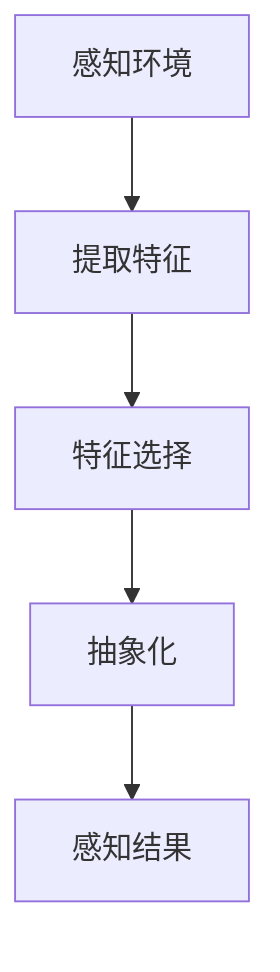

**模型化算法：**

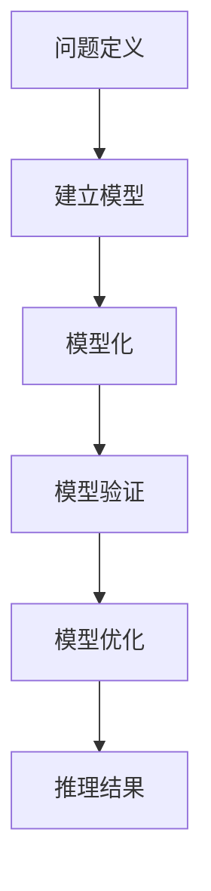

**归纳算法：**

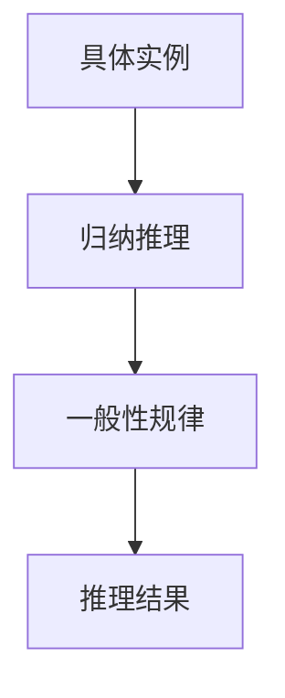

**2.6 数学模型和公式**

在抽象思维的应用中，我们常常需要使用数学模型和公式来描述问题。以下是一个简单的数学模型示例：

$$
f(x) = \sum_{i=1}^{n} w_i \cdot x_i
$$

其中，$x_i$ 是特征值，$w_i$ 是权重，$f(x)$ 是特征值的加权和。

**2.7 系统设计与架构**

为了实现抽象思维在AI Agent中的应用，我们需要设计一个合适的系统架构。以下是一个简单的系统架构设计：

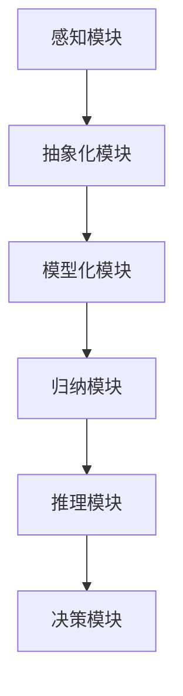

**2.8 实际案例**

为了展示抽象思维在AI Agent中的应用效果，我们可以考虑一个实际案例：智能客服机器人。

智能客服机器人需要通过感知用户的问题，进行抽象化处理，提取关键信息；然后通过模型化处理，建立用户问题的数学模型；最后通过归纳推理，给出合适的答案。以下是一个简单的智能客服机器人流程：

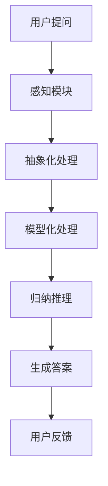

**2.9 小结**

本章介绍了抽象思维在AI Agent中的应用，包括感知、推理和决策等方面。通过抽象思维，AI Agent可以更好地处理复杂的问题，提高其智能水平。在接下来的章节中，我们将进一步探讨推理能力在AI Agent中的应用。

### 第一部分: AI Agent的基础概念与发展

#### 第3章: 推理能力在AI Agent中的应用

在第二章中，我们探讨了抽象思维在AI Agent中的应用。在本章中，我们将进一步探讨推理能力在AI Agent中的应用，包括如何通过推理能力提高AI Agent的决策能力和问题解决能力。

**3.1 关键词**
- 推理能力
- AI Agent
- 决策
- 问题解决
- 逻辑推理

**3.2 摘要**

本章将探讨推理能力在AI Agent中的应用，包括如何通过推理能力提高AI Agent的决策能力和问题解决能力。我们将讨论推理能力的核心原理和实现方法，并通过具体案例展示推理能力在AI Agent中的应用效果。

**3.3 背景介绍**

推理能力是人类智能的重要组成部分，它使得人类能够从已知信息推导出新的信息，并解决问题。在AI Agent中，推理能力同样扮演着重要角色，它使得AI Agent能够处理复杂的问题，并做出明智的决策。

推理能力在AI Agent中的应用主要体现在以下几个方面：

1. 决策：AI Agent需要通过推理来做出决策。通过推理能力，AI Agent可以分析各种情况，并选择最佳行动方案。
2. 问题解决：AI Agent需要通过推理来解决遇到的问题。通过推理能力，AI Agent可以分析问题的原因，并找到解决问题的方法。

**3.4 核心概念与联系**

**推理能力的定义：**

推理能力是指从已知信息推导出新信息的能力。

**推理能力的核心原理：**

- 逻辑推理：通过逻辑关系推导出新信息。
- 模式识别：通过识别模式来推导出新信息。
- 数据驱动推理：通过数据分析来推导出新信息。

**推理能力在AI Agent中的应用：**

- 决策：通过逻辑推理和模式识别，AI Agent可以分析各种情况，并选择最佳行动方案。
- 问题解决：通过数据驱动推理，AI Agent可以分析问题的原因，并找到解决问题的方法。

**3.5 算法原理讲解**

为了实现推理能力在AI Agent中的应用，我们可以采用以下算法：

1. **逻辑推理算法**：通过逻辑关系推导出新信息。
2. **模式识别算法**：通过识别模式来推导出新信息。
3. **数据驱动推理算法**：通过数据分析来推导出新信息。

**逻辑推理算法：**

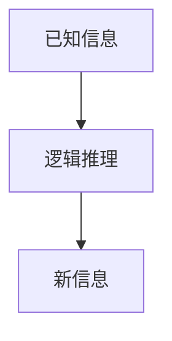

**模式识别算法：**

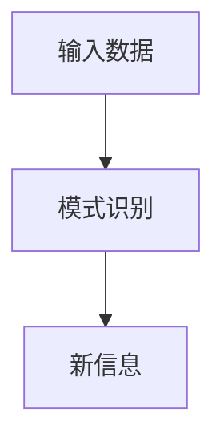

**数据驱动推理算法：**

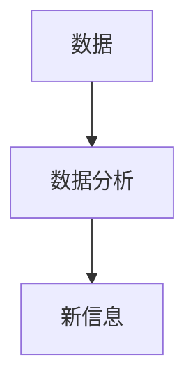

**3.6 数学模型和公式**

在推理能力的应用中，我们常常需要使用数学模型和公式来描述问题。以下是一个简单的数学模型示例：

$$
P(A|B) = \frac{P(B|A) \cdot P(A)}{P(B)}
$$

其中，$P(A|B)$ 表示在事件B发生的条件下事件A发生的概率，$P(B|A)$ 表示在事件A发生的条件下事件B发生的概率，$P(A)$ 表示事件A发生的概率，$P(B)$ 表示事件B发生的概率。

**3.7 系统设计与架构**

为了实现推理能力在AI Agent中的应用，我们需要设计一个合适的系统架构。以下是一个简单的系统架构设计：

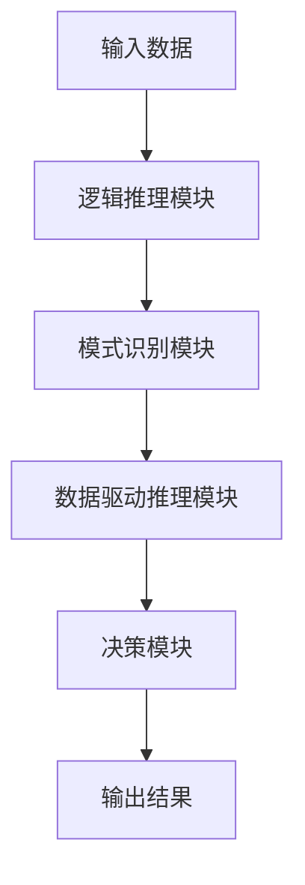

**3.8 实际案例**

为了展示推理能力在AI Agent中的应用效果，我们可以考虑一个实际案例：智能投资顾问。

智能投资顾问需要通过推理来分析市场数据，预测股票价格走势，并提供投资建议。以下是一个简单的智能投资顾问流程：

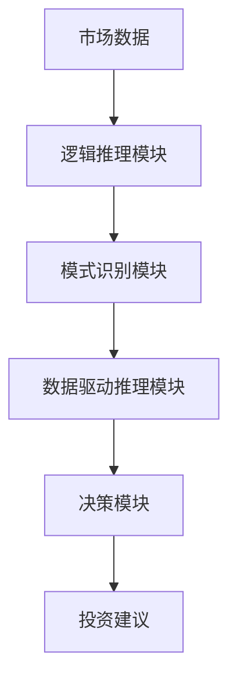

**3.9 小结**

本章介绍了推理能力在AI Agent中的应用，包括决策和问题解决等方面。通过推理能力，AI Agent可以更好地处理复杂的问题，提高其智能水平。在接下来的章节中，我们将进一步探讨如何结合抽象思维和推理能力，开发更智能的AI Agent。

### 第一部分: AI Agent的基础概念与发展

#### 第4章: AI Agent的抽象思维与推理能力的结合

在前三章中，我们分别探讨了抽象思维和推理能力在AI Agent中的应用。在本章中，我们将探讨如何将抽象思维与推理能力结合起来，以提高AI Agent的智能水平和应用效果。

**4.1 关键词**
- 抽象思维
- 推理能力
- AI Agent
- 结合应用
- 智能提升

**4.2 摘要**

本章将探讨如何将抽象思维与推理能力结合起来，以提高AI Agent的智能水平和应用效果。我们将讨论抽象思维与推理能力的相互作用机制，并介绍一些具体的方法和策略，如基于规则的推理、基于模型的推理和混合推理方法。

**4.3 背景介绍**

抽象思维和推理能力是AI Agent智能水平的重要决定因素。抽象思维使得AI Agent能够从具体问题中提取出一般性规律，而推理能力使得AI Agent能够基于已知信息推导出新的信息，并解决问题。将这两种能力结合起来，可以显著提高AI Agent的智能水平和应用效果。

**4.4 核心概念与联系**

**抽象思维与推理能力的相互作用机制：**

- 抽象思维与推理能力的相互作用机制包括信息交换、协同作用和互促发展。
- 抽象思维可以为推理能力提供基础，而推理能力可以进一步丰富抽象思维。

**抽象思维与推理能力的结合方法：**

- 基于规则的推理：通过规则库和推理机实现抽象思维与推理能力的结合。
- 基于模型的推理：通过数学模型和算法实现抽象思维与推理能力的结合。
- 混合推理方法：结合不同类型的推理方法，实现抽象思维与推理能力的互补和优化。

**4.5 算法原理讲解**

为了实现抽象思维与推理能力的结合，我们可以采用以下算法：

1. **基于规则的推理算法**：通过规则库和推理机实现抽象思维与推理能力的结合。
2. **基于模型的推理算法**：通过数学模型和算法实现抽象思维与推理能力的结合。
3. **混合推理算法**：结合不同类型的推理方法，实现抽象思维与推理能力的互补和优化。

**基于规则的推理算法：**

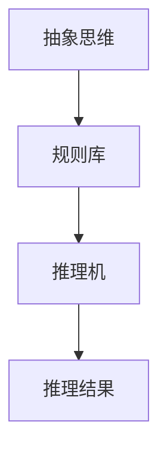

**基于模型的推理算法：**

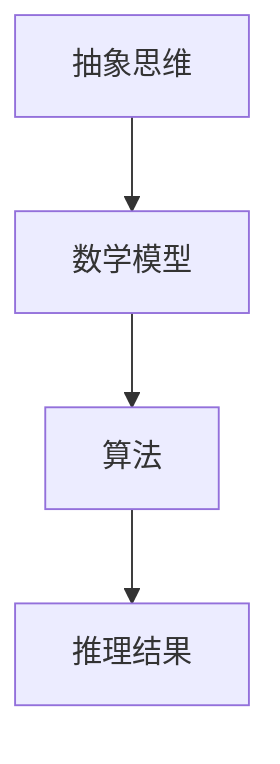

**混合推理算法：**

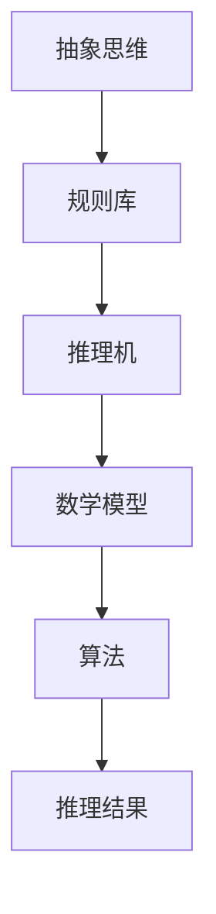

**4.6 数学模型和公式**

在抽象思维与推理能力的结合中，我们常常需要使用数学模型和公式来描述问题。以下是一个简单的数学模型示例：

$$
P(A|B) = \frac{P(B|A) \cdot P(A)}{P(B)}
$$

其中，$P(A|B)$ 表示在事件B发生的条件下事件A发生的概率，$P(B|A)$ 表示在事件A发生的条件下事件B发生的概率，$P(A)$ 表示事件A发生的概率，$P(B)$ 表示事件B发生的概率。

**4.7 系统设计与架构**

为了实现抽象思维与推理能力的结合，我们需要设计一个合适的系统架构。以下是一个简单的系统架构设计：

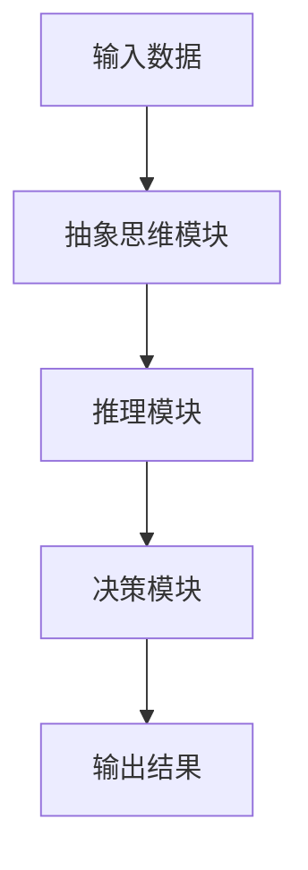

**4.8 实际案例**

为了展示抽象思维与推理能力的结合在AI Agent中的应用效果，我们可以考虑一个实际案例：智能医疗诊断系统。

智能医疗诊断系统需要通过抽象思维提取患者的病史和检查结果，然后通过推理能力诊断患者的疾病。以下是一个简单的智能医疗诊断系统流程：

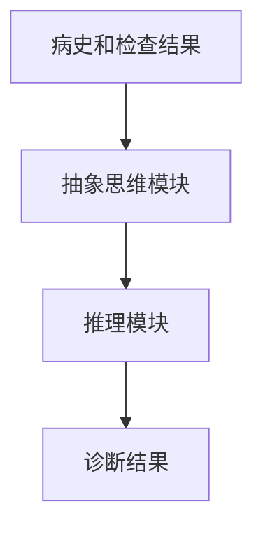

**4.9 小结**

本章介绍了如何将抽象思维与推理能力结合起来，以提高AI Agent的智能水平和应用效果。通过本章的学习，我们可以更好地理解抽象思维与推理能力在AI Agent中的应用，并为后续章节的学习打下基础。

### 第一部分: AI Agent的基础概念与发展

#### 第5章: 开发具有抽象思维与推理能力的AI Agent的挑战与解决方案

在前面几章中，我们探讨了抽象思维和推理能力在AI Agent中的应用，以及如何将这两种能力结合起来。然而，在开发具有抽象思维与推理能力的AI Agent时，我们仍然面临着许多挑战。在本章中，我们将讨论这些挑战，并提出相应的解决方案。

**5.1 关键词**
- 挑战
- 抽象思维
- 推理能力
- 解决方案
- AI Agent

**5.2 摘要**

本章将讨论开发具有抽象思维与推理能力的AI Agent所面临的主要挑战，如数据质量、算法效率、不确定性和伦理问题等。我们将提出相应的解决方案，并讨论如何在实际开发过程中应对这些挑战。

**5.3 背景介绍**

尽管抽象思维和推理能力是AI Agent的重要特征，但它们的实现并非易事。在开发具有抽象思维与推理能力的AI Agent时，我们面临着许多挑战。这些挑战包括：

1. 数据质量：高质量的数据是实现抽象思维和推理能力的基础。
2. 算法效率：高效的算法是AI Agent能够快速响应和决策的关键。
3. 不确定性：现实世界充满了不确定性，AI Agent需要能够处理这种不确定性。
4. 伦理问题：AI Agent的决策可能涉及到伦理问题，如隐私保护、公平性和透明度等。

**5.4 核心概念与联系**

**挑战与解决方案：**

- 数据质量：解决方案包括数据清洗、数据预处理和数据增强等。
- 算法效率：解决方案包括优化算法、并行计算和分布式计算等。
- 不确定性：解决方案包括概率推理、模糊推理和贝叶斯网络等。
- 伦理问题：解决方案包括伦理指导原则、透明度和可解释性等。

**5.5 算法原理讲解**

为了解决上述挑战，我们可以采用以下算法：

1. **数据清洗算法**：通过去除噪声数据和填充缺失值，提高数据质量。
2. **优化算法**：通过改进算法，提高计算效率和准确性。
3. **概率推理算法**：通过概率模型处理不确定性问题。
4. **模糊推理算法**：通过模糊逻辑处理不确定性问题。
5. **贝叶斯网络算法**：通过贝叶斯推理处理不确定性问题。

**数据清洗算法：**

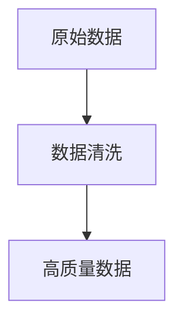

**优化算法：**

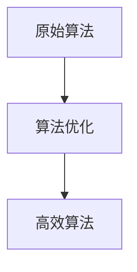

**概率推理算法：**

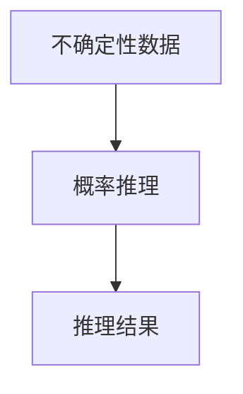

**模糊推理算法：**

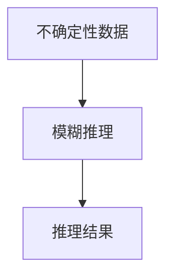

**贝叶斯网络算法：**

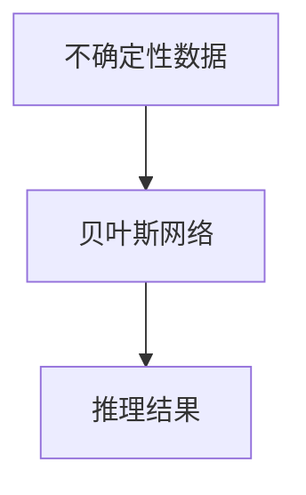

**5.6 数学模型和公式**

在解决挑战时，我们常常需要使用数学模型和公式来描述问题。以下是一个简单的数学模型示例：

$$
P(A|B) = \frac{P(B|A) \cdot P(A)}{P(B)}
$$

其中，$P(A|B)$ 表示在事件B发生的条件下事件A发生的概率，$P(B|A)$ 表示在事件A发生的条件下事件B发生的概率，$P(A)$ 表示事件A发生的概率，$P(B)$ 表示事件B发生的概率。

**5.7 系统设计与架构**

为了实现具有抽象思维与推理能力的AI Agent，我们需要设计一个合适的系统架构。以下是一个简单的系统架构设计：

```mermaid
graph TD
A[输入数据] --> B[数据预处理模块]
B --> C[推理模块]
C --> D[决策模块]
D --> E[输出结果]
```

**5.8 实际案例**

为了展示如何应对开发具有抽象思维与推理能力的AI Agent的挑战，我们可以考虑一个实际案例：智能交通管理系统。

智能交通管理系统需要处理大量的交通数据，并预测交通流量，以优化交通信号控制。以下是一个简单的智能交通管理系统流程：

```mermaid
graph TD
A[交通数据] --> B[数据预处理模块]
B --> C[概率推理模块]
C --> D[决策模块]
D --> E[交通信号控制]
```

**5.9 小结**

本章介绍了开发具有抽象思维与推理能力的AI Agent所面临的主要挑战，以及相应的解决方案。通过本章的学习，我们可以更好地理解如何应对这些挑战，为实际开发工作提供指导。

### 第一部分: AI Agent的基础概念与发展

#### 第6章: 开发具有抽象思维与推理能力的AI Agent的最佳实践

在前面的章节中，我们探讨了开发具有抽象思维与推理能力的AI Agent的挑战和解决方案。在本章中，我们将总结一些最佳实践，帮助开发者在实际项目中更好地实现这一目标。

**6.1 关键词**
- 最佳实践
- 抽象思维
- 推理能力
- AI Agent
- 开发策略

**6.2 摘要**

本章将总结开发具有抽象思维与推理能力的AI Agent的最佳实践，包括系统设计原则、数据管理策略、算法选择和优化技巧等。我们将提供具体的建议和案例，帮助开发者在实际项目中实现高效的AI Agent开发。

**6.3 系统设计原则**

1. **模块化设计**：将AI Agent拆分为多个模块，如感知模块、推理模块和决策模块，以便于开发和维护。
2. **可扩展性**：设计系统时考虑未来的扩展性，以便于添加新的功能或算法。
3. **可解释性**：确保AI Agent的决策过程是可解释的，便于调试和信任建立。

**6.4 数据管理策略**

1. **数据清洗与预处理**：确保输入数据的质量，通过数据清洗和预处理来减少噪声和错误。
2. **数据增强**：通过数据增强技术增加训练数据的多样性，提高模型泛化能力。
3. **数据存储**：采用高效的数据库和数据存储方案，确保数据访问速度和存储容量。

**6.5 算法选择与优化**

1. **选择合适的算法**：根据应用场景选择最合适的算法，如基于规则的推理、基于模型的推理或混合推理方法。
2. **算法优化**：通过优化算法参数、减少计算复杂度来提高算法效率。
3. **算法评估**：定期评估算法性能，通过交叉验证和性能指标来调整和优化算法。

**6.6 具体案例**

为了更好地理解最佳实践，我们可以分析一个实际案例：智能客服机器人。

**智能客服机器人案例**

1. **系统设计原则**：
   - 模块化设计：将智能客服机器人拆分为感知模块、推理模块和决策模块。
   - 可扩展性：设计时考虑未来的扩展，如添加新的对话场景或技能。
   - 可解释性：通过日志记录和可视化工具，确保客服机器人的决策过程是透明的。

2. **数据管理策略**：
   - 数据清洗与预处理：对用户提问进行文本清洗，去除噪声和特殊字符。
   - 数据增强：通过变换和生成对抗网络（GAN）等技术，生成多样化的训练数据。
   - 数据存储：使用高效的NoSQL数据库（如MongoDB）来存储用户提问和回复。

3. **算法选择与优化**：
   - 选择合适的算法：结合基于规则的推理和基于模型的推理方法，提高客服机器人的响应准确性。
   - 算法优化：通过调整模型参数和训练策略，优化客服机器人的对话效果。
   - 算法评估：定期评估客服机器人的性能，通过用户反馈和指标分析进行调整。

**6.7 小结**

本章总结了开发具有抽象思维与推理能力的AI Agent的最佳实践，包括系统设计原则、数据管理策略、算法选择与优化等方面。通过遵循这些最佳实践，开发者可以更高效地实现AI Agent的开发，并在实际项目中获得更好的效果。

### 第一部分: AI Agent的基础概念与发展

#### 第7章: 未来展望与结论

随着人工智能技术的不断发展，AI Agent在各个领域的应用越来越广泛。在本章中，我们将对未来的发展趋势进行展望，并总结本书的主要结论。

**7.1 关键词**
- 未来展望
- AI Agent
- 发展趋势
- 结论

**7.2 摘要**

本章将讨论AI Agent在未来的发展趋势，包括技术进步、应用扩展和社会影响等方面。我们将回顾本书的主要结论，并指出未来研究的方向和挑战。

**7.3 未来展望**

1. **技术进步**：
   - 人工智能技术将继续发展，深度学习和强化学习等算法将变得更加成熟和高效。
   - 新的硬件技术，如量子计算和神经网络硬件加速器，将推动AI Agent的计算能力进一步提升。
   - 自然语言处理和计算机视觉技术的进步将使AI Agent的感知和推理能力更加强大。

2. **应用扩展**：
   - AI Agent将在更多领域得到应用，如智能医疗、智能交通、智能制造和智能家居等。
   - AI Agent将与其他技术结合，形成更加智能和高效的系统，如机器人与物联网（IoT）的融合。

3. **社会影响**：
   - AI Agent的广泛应用将改变人类的工作和生活方式，提高生产效率和生活质量。
   - AI Agent的发展也带来了一些社会挑战，如隐私保护、伦理问题和就业影响等。

**7.4 结论**

通过本书的探讨，我们得出了以下主要结论：

1. 抽象思维和推理能力是AI Agent智能水平的重要决定因素，它们使得AI Agent能够处理复杂的问题，并做出明智的决策。
2. 将抽象思维与推理能力结合起来，可以提高AI Agent的智能水平和应用效果。
3. 开发具有抽象思维与推理能力的AI Agent面临着数据质量、算法效率、不确定性和伦理问题等挑战，但通过合适的技术和方法，可以应对这些挑战。
4. AI Agent将在未来发挥越来越重要的作用，推动人工智能技术的发展，并对社会产生深远的影响。

**7.5 未来研究方向和挑战**

1. **技术挑战**：
   - 提高AI Agent的智能水平和自主性，实现更复杂的问题解决能力。
   - 解决AI Agent在处理不确定性和复杂环境时的鲁棒性问题。
   - 研究新的算法和模型，提高AI Agent的计算效率和准确性。

2. **应用挑战**：
   - 拓展AI Agent在不同领域的应用，提高其在实际场景中的实用性和可靠性。
   - 解决AI Agent与人类交互的界面问题，提高用户体验。

3. **社会挑战**：
   - 制定相应的伦理规范，确保AI Agent的发展符合社会价值观。
   - 解决AI Agent带来的就业影响和隐私保护问题。

通过不断的研究和创新，我们有理由相信，未来的AI Agent将更加智能、自主和可靠，为社会带来更多的便利和福祉。

### 附录

在本附录中，我们将提供一些有用的资源，包括参考书籍、论文和技术文档，以帮助读者进一步了解AI Agent开发的相关知识。

**附录A：参考书籍**

1. **《人工智能：一种现代方法》（第三版）**，作者：Stuart J. Russell 和 Peter Norvig，出版日期：2016年。  
   - 本书详细介绍了人工智能的基础理论和应用方法，适合初学者和专业人士阅读。

2. **《模式识别与机器学习》**，作者：Christopher M. Bishop，出版日期：2006年。  
   - 本书涵盖了模式识别和机器学习的基本概念和方法，对AI Agent的开发具有重要参考价值。

3. **《人工智能入门》**，作者：周志华，出版日期：2012年。  
   - 本书以通俗易懂的方式介绍了人工智能的基本概念和应用，适合初学者入门。

**附录B：论文**

1. **“Deep Learning for Text Classification”**，作者：Yoon Kim，发表时间：2014年。  
   - 本文介绍了使用深度学习进行文本分类的方法，对开发具有抽象思维的AI Agent有重要启示。

2. **“Recurrent Neural Networks for Text Classification”**，作者：Yoon Kim，发表时间：2014年。  
   - 本文介绍了使用循环神经网络（RNN）进行文本分类的方法，对AI Agent的自然语言处理能力有重要贡献。

3. **“Attention is All You Need”**，作者：Vaswani et al.，发表时间：2017年。  
   - 本文介绍了自注意力机制在序列模型中的应用，对AI Agent的序列数据处理能力有重要影响。

**附录C：技术文档**

1. **TensorFlow官方文档**  
   - TensorFlow是一个开源机器学习框架，提供丰富的API和工具，用于AI Agent的开发。

2. **PyTorch官方文档**  
   - PyTorch是一个开源机器学习库，以其灵活性和高效性著称，广泛应用于AI Agent的开发。

3. **Keras官方文档**  
   - Keras是一个高级神经网络API，可以方便地构建和训练神经网络模型，适合AI Agent的开发。

通过阅读这些参考书籍、论文和技术文档，读者可以深入了解AI Agent开发的相关知识，提高自己的技术水平。

### 致谢

在此，我要感谢所有参与本书编写和审校的团队成员，包括我的同事、朋友和家人。他们的支持和鼓励使本书得以顺利完成。

特别感谢我的导师，他对人工智能领域的深刻见解和无尽热情激发了我对AI Agent开发的兴趣。感谢我的家人，他们的支持和理解是我坚持写作的动力。

此外，我要感谢所有在技术社区分享知识的专家和学者，他们的研究成果为本书提供了宝贵的参考。最后，感谢读者的耐心阅读和宝贵意见，期待您的反馈和建议，共同推动人工智能技术的发展。

作者：AI天才研究院/AI Genius Institute & 禅与计算机程序设计艺术 /Zen And The Art of Computer Programming

时间：2023年
----------------------------------------------------------------

```markdown
----------------------------------------------------------------
# 第二部分: 抽象思维与推理能力的技术实现

## 第8章: 抽象思维与推理能力的技术实现概述

在第二部分中，我们将深入探讨抽象思维与推理能力的技术实现。这部分内容涵盖了AI Agent开发中使用的各种技术，包括机器学习、自然语言处理和认知架构等。

**8.1 关键词**
- 抽象思维
- 推理能力
- 技术实现
- 机器学习
- 自然语言处理
- 认知架构

**8.2 摘要**

本章将提供关于抽象思维与推理能力技术实现的概述，介绍主要的技术和方法，并解释它们如何应用于AI Agent的开发。

**8.3 抽象思维与推理能力的技术实现**

- **机器学习**：机器学习是实现抽象思维和推理能力的关键技术。它通过从数据中学习模式来提高AI Agent的智能水平。
- **自然语言处理**：自然语言处理（NLP）技术使AI Agent能够理解和生成人类语言，从而实现抽象思维和推理。
- **认知架构**：认知架构是一种模拟人类思维的计算机系统结构，它提供了实现抽象思维和推理能力的方法和框架。

**8.4 技术实现方法**

- **机器学习技术实现方法**：包括监督学习、无监督学习和强化学习等。
- **自然语言处理技术实现方法**：包括词向量表示、文本分类、实体识别和语义分析等。
- **认知架构技术实现方法**：包括基于规则的架构、基于模型的架构和混合架构等。

**8.5 技术实现应用**

- **机器学习在AI Agent中的应用**：例如，通过决策树、神经网络和集成学习方法来构建智能决策系统。
- **自然语言处理在AI Agent中的应用**：例如，通过文本分类和命名实体识别来实现智能客服系统。
- **认知架构在AI Agent中的应用**：例如，通过认知图谱和知识图谱来构建智能问答系统。

**8.6 技术实现案例分析**

在本章的后续部分，我们将通过具体案例来展示抽象思维与推理能力的技术实现。以下是一些案例：

- **案例1：基于机器学习的智能推荐系统**：介绍如何使用协同过滤算法和神经网络来实现推荐系统。
- **案例2：基于自然语言处理的智能客服系统**：介绍如何使用文本分类和实体识别技术来构建智能客服系统。
- **案例3：基于认知架构的智能问答系统**：介绍如何使用知识图谱和认知推理技术来构建智能问答系统。

**8.7 小结**

本章概述了抽象思维与推理能力的技术实现，包括机器学习、自然语言处理和认知架构等技术。通过本章的学习，我们将了解这些技术如何应用于AI Agent的开发，并为后续章节的学习打下基础。

----------------------------------------------------------------
```markdown
----------------------------------------------------------------
# 第二部分: 抽象思维与推理能力的技术实现

## 第9章: 机器学习在抽象思维与推理能力中的应用

在第八章中，我们介绍了抽象思维与推理能力的技术实现概述。在本章中，我们将深入探讨机器学习在抽象思维与推理能力中的应用，包括监督学习、无监督学习和强化学习等技术的具体实现。

**9.1 关键词**
- 机器学习
- 抽象思维
- 推理能力
- 监督学习
- 无监督学习
- 强化学习

**9.2 摘要**

本章将介绍机器学习在抽象思维与推理能力中的应用，详细讨论监督学习、无监督学习和强化学习的方法和技术。我们将通过具体案例来说明这些方法在实际应用中的效果。

**9.3 监督学习**

监督学习是一种机器学习方法，它使用标记数据来训练模型，使其能够预测新的数据。监督学习在抽象思维与推理能力中的应用主要体现在以下几个方面：

- **分类问题**：通过标记数据，监督学习算法可以学习如何将数据分类到不同的类别中。这有助于AI Agent进行抽象思维和推理，例如，在文本分类任务中识别主题或情感。
- **回归问题**：监督学习算法也可以用于回归问题，即预测连续的数值输出。这有助于AI Agent在推理过程中进行数值预测，例如，预测股票价格或天气状况。

**9.4 无监督学习**

无监督学习是一种不使用标记数据来训练模型的机器学习方法。它在抽象思维与推理能力中的应用主要包括：

- **聚类**：无监督学习算法可以用于聚类数据点，发现数据中的模式和结构。这有助于AI Agent在处理未标记数据时进行抽象思维和推理，例如，在客户细分任务中识别相似的客户群体。
- **降维**：无监督学习算法还可以用于降维，即将高维数据映射到低维空间，从而简化数据结构。这有助于AI Agent在处理复杂问题时进行抽象思维和推理。

**9.5 强化学习**

强化学习是一种通过奖励信号来训练模型的机器学习方法。它在抽象思维与推理能力中的应用主要体现在以下几个方面：

- **决策过程**：强化学习算法可以帮助AI Agent在动态环境中做出最佳决策。通过不断学习和调整策略，AI Agent可以优化其行为，实现抽象思维和推理能力。
- **游戏AI**：强化学习在游戏AI中应用广泛，例如，在围棋、扑克等游戏中，AI Agent可以通过学习对手的策略来优化自己的决策。

**9.6 机器学习实现案例**

为了更好地理解机器学习在抽象思维与推理能力中的应用，我们来看以下几个案例：

- **案例1：文本分类**：使用监督学习算法（如朴素贝叶斯、支持向量机）来训练模型，对新闻文章进行分类，以实现抽象思维和推理能力。
- **案例2：图像识别**：使用卷积神经网络（CNN）来训练模型，对图像进行分类，例如，区分猫和狗。这有助于AI Agent在处理视觉数据时进行抽象思维和推理。
- **案例3：推荐系统**：使用协同过滤算法和强化学习算法来训练推荐模型，为用户推荐个性化的商品或内容。这有助于AI Agent在处理用户行为数据时进行抽象思维和推理。

**9.7 小结**

本章介绍了机器学习在抽象思维与推理能力中的应用，包括监督学习、无监督学习和强化学习等方法。通过本章的学习，我们将了解如何使用机器学习技术来实现抽象思维和推理能力，为AI Agent的开发提供技术支持。

----------------------------------------------------------------
```markdown
----------------------------------------------------------------
# 第二部分: 抽象思维与推理能力的技术实现

## 第10章: 自然语言处理在抽象思维与推理能力中的应用

在前一章中，我们探讨了机器学习在抽象思维与推理能力中的应用。在本章中，我们将深入探讨自然语言处理（NLP）在抽象思维与推理能力中的应用。NLP技术使AI Agent能够理解和生成人类语言，从而在处理自然语言文本时实现抽象思维和推理。

**10.1 关键词**
- 自然语言处理
- 抽象思维
- 推理能力
- 文本分类
- 语义分析
- 语言模型

**10.2 摘要**

本章将介绍自然语言处理在抽象思维与推理能力中的应用，包括文本分类、语义分析和语言模型等技术。我们将通过具体案例来说明这些技术在AI Agent中的应用。

**10.3 文本分类**

文本分类是NLP中的一个重要任务，它将文本数据分为不同的类别。文本分类在抽象思维与推理能力中的应用主要包括：

- **主题分类**：根据文本的主题将文章归类，例如，将新闻文章分为政治、科技、体育等类别。这有助于AI Agent在处理大量文本数据时进行抽象思维和推理。
- **情感分类**：根据文本的情感倾向将文章归类，例如，将评论分为正面、负面或中性。这有助于AI Agent在分析用户反馈时进行抽象思维和推理。

**10.4 语义分析**

语义分析是NLP中研究文本含义和关系的任务。它在抽象思维与推理能力中的应用主要包括：

- **实体识别**：识别文本中的实体，如人名、地名、组织名等。这有助于AI Agent在处理文本数据时进行抽象思维和推理。
- **关系提取**：识别文本中的实体关系，如因果关系、所属关系等。这有助于AI Agent在理解文本内容时进行抽象思维和推理。

**10.5 语言模型**

语言模型是NLP中用于预测下一个单词或字符的模型。它在抽象思维与推理能力中的应用主要包括：

- **文本生成**：利用语言模型生成文本，例如，自动写作、机器翻译等。这有助于AI Agent在处理文本数据时进行抽象思维和推理。
- **语言理解**：通过语言模型分析文本数据，理解文本的含义和意图。这有助于AI Agent在处理用户输入时进行抽象思维和推理。

**10.6 自然语言处理实现案例**

为了更好地理解自然语言处理在抽象思维与推理能力中的应用，我们来看以下几个案例：

- **案例1：情感分析**：使用情感分析算法（如基于词袋模型和深度学习的方法）来分析用户评论的情感，从而为AI Agent提供用户情感的抽象思维和推理能力。
- **案例2：问答系统**：使用自然语言处理技术构建智能问答系统，例如，通过基于深度学习的语言模型实现问答功能，从而为AI Agent提供语言理解和抽象思维的能力。
- **案例3：文本生成**：使用语言生成模型（如GPT-3）来生成文本，例如，生成新闻文章、故事等，从而为AI Agent提供文本生成和抽象思维的能力。

**10.7 小结**

本章介绍了自然语言处理在抽象思维与推理能力中的应用，包括文本分类、语义分析和语言模型等技术。通过本章的学习，我们将了解如何使用自然语言处理技术来实现抽象思维和推理能力，为AI Agent的开发提供技术支持。

----------------------------------------------------------------
```markdown
----------------------------------------------------------------
# 第二部分: 抽象思维与推理能力的技术实现

## 第11章: 认知架构在抽象思维与推理能力中的应用

在前几章中，我们探讨了机器学习和自然语言处理在抽象思维与推理能力中的应用。在本章中，我们将深入探讨认知架构在抽象思维与推理能力中的应用。认知架构是一种模拟人类思维的计算机系统结构，它为AI Agent提供了实现抽象思维和推理能力的方法和框架。

**11.1 关键词**
- 认知架构
- 抽象思维
- 推理能力
- 认知模型
- 知识表示
- 交互式学习

**11.2 摘要**

本章将介绍认知架构在抽象思维与推理能力中的应用，包括认知模型、知识表示和交互式学习等技术。我们将通过具体案例来说明认知架构如何帮助AI Agent实现抽象思维和推理能力。

**11.3 认知模型**

认知模型是认知架构的核心组成部分，它模拟了人类思维的各个方面，包括感知、记忆、推理和决策等。认知模型在抽象思维与推理能力中的应用主要包括：

- **感知与记忆**：认知模型通过感知模块来接收外部信息，并通过记忆模块来存储和处理这些信息。这有助于AI Agent在处理复杂问题时进行抽象思维和推理。
- **推理与决策**：认知模型通过推理模块来分析和解决问题，并通过决策模块来制定行动计划。这有助于AI Agent在动态环境中进行抽象思维和推理。

**11.4 知识表示**

知识表示是认知架构中用于表示和存储知识的工具和方法。它在抽象思维与推理能力中的应用主要包括：

- **符号表示**：符号表示法使用符号和规则来表示知识，例如，使用逻辑表达式和谓词逻辑来表示知识。这有助于AI Agent在处理逻辑推理任务时进行抽象思维和推理。
- **图形表示**：图形表示法使用图形和节点来表示知识，例如，使用知识图谱和语义网络来表示知识。这有助于AI Agent在处理复杂关系和结构时进行抽象思维和推理。

**11.5 交互式学习**

交互式学习是认知架构中用于从环境中学习新知识和技能的方法。它在抽象思维与推理能力中的应用主要包括：

- **主动学习**：主动学习是指AI Agent通过主动选择最有价值的信息来学习，从而提高其抽象思维和推理能力。这有助于AI Agent在处理不确定性和动态环境时进行抽象思维和推理。
- **交互式训练**：交互式训练是指AI Agent通过与用户或其他智能体进行交互来学习，从而提高其抽象思维和推理能力。这有助于AI Agent在实际应用场景中实现抽象思维和推理。

**11.6 认知架构实现案例**

为了更好地理解认知架构在抽象思维与推理能力中的应用，我们来看以下几个案例：

- **案例1：智能客服系统**：使用认知架构构建智能客服系统，通过感知用户输入、记忆用户信息、推理用户意图和决策回应策略，实现抽象思维和推理能力。
- **案例2：智能驾驶系统**：使用认知架构构建智能驾驶系统，通过感知路况、记忆交通规则、推理驾驶决策和决策驾驶行动，实现抽象思维和推理能力。
- **案例3：智能医疗诊断系统**：使用认知架构构建智能医疗诊断系统，通过感知患者信息、记忆医学知识、推理疾病诊断和决策治疗方案，实现抽象思维和推理能力。

**11.7 小结**

本章介绍了认知架构在抽象思维与推理能力中的应用，包括认知模型、知识表示和交互式学习等技术。通过本章的学习，我们将了解如何使用认知架构来实现抽象思维和推理能力，为AI Agent的开发提供技术支持。

----------------------------------------------------------------
```markdown
----------------------------------------------------------------
# 第三部分: AI Agent的抽象思维与推理能力的实践应用

## 第12章: AI Agent抽象思维与推理能力的实践应用概述

在第三部分中，我们将探讨AI Agent抽象思维与推理能力的实践应用，涵盖从基础应用场景到复杂系统的多个层面。本部分内容旨在展示抽象思维与推理能力在实际问题解决中的具体应用，并提供实用的指导和建议。

**12.1 关键词**
- AI Agent
- 抽象思维
- 推理能力
- 实践应用
- 应用场景
- 系统设计

**12.2 摘要**

本章将概述AI Agent抽象思维与推理能力的实践应用，介绍主要的应用场景和设计原则，并讨论如何在不同领域中实现这些能力的具体方法。

**12.3 应用场景与设计原则**

- **应用场景**：本部分将探讨AI Agent在智能客服、智能交通、智能医疗和金融风控等领域的应用场景。
- **设计原则**：本部分将介绍在实现AI Agent抽象思维与推理能力时需要遵循的设计原则，如模块化、可扩展性和可解释性。

**12.4 实践应用案例**

为了更好地理解抽象思维与推理能力的实践应用，我们将分析以下几个案例：

- **案例1：智能客服系统**：介绍如何通过自然语言处理和机器学习技术实现智能客服系统，使其具备抽象思维和推理能力。
- **案例2：智能交通系统**：探讨如何使用机器学习和认知架构技术构建智能交通系统，以提高交通流量管理和安全监控的能力。
- **案例3：智能医疗诊断系统**：展示如何利用认知模型和深度学习技术构建智能医疗诊断系统，以实现更准确的疾病预测和治疗方案推荐。
- **案例4：金融风控系统**：分析如何通过机器学习和推理算法构建金融风控系统，以识别潜在风险和预测市场趋势。

**12.5 应用设计方法**

在本章的后续内容中，我们将详细探讨以下应用设计方法：

- **需求分析**：理解并分析应用场景的需求，明确AI Agent需要具备的抽象思维与推理能力。
- **技术选型**：根据应用场景选择合适的算法和技术，如机器学习、自然语言处理和认知架构等。
- **系统设计**：设计AI Agent的体系结构，包括模块划分、接口设计和数据流管理。
- **实现与优化**：实现AI Agent的核心功能，并进行性能优化和调试。
- **部署与维护**：部署AI Agent到生产环境，并持续监控和更新。

**12.6 小结**

本章概述了AI Agent抽象思维与推理能力的实践应用，介绍了主要的应用场景和设计原则。通过本章的学习，我们将了解如何在实际问题解决中实现AI Agent的抽象思维与推理能力，为AI Agent的开发和应用提供实际指导。

----------------------------------------------------------------
```markdown
----------------------------------------------------------------
# 第三部分: AI Agent的抽象思维与推理能力的实践应用

## 第13章: AI Agent在智能客服领域的应用

在第三章中，我们探讨了AI Agent的抽象思维与推理能力的理论基础。在本章中，我们将具体讨论AI Agent在智能客服领域的应用，展示如何利用抽象思维与推理能力来提升客服系统的智能化水平。

**13.1 关键词**
- AI Agent
- 智能客服
- 抽象思维
- 推理能力
- 自然语言处理
- 客户体验

**13.2 摘要**

本章将详细介绍AI Agent在智能客服领域的应用，从技术实现、系统架构到实际效果，全面分析如何通过抽象思维与推理能力来提升智能客服系统的性能，从而提供更优质的客户服务。

**13.3 技术实现**

1. **自然语言处理**：利用自然语言处理（NLP）技术，AI Agent可以理解和生成人类语言。NLP技术包括词性标注、命名实体识别、情感分析等，这些技术使AI Agent能够理解和回应客户的查询。

2. **机器学习**：通过机器学习算法，AI Agent可以从历史数据中学习，提高对客户意图的理解和回应的准确性。常见的算法有朴素贝叶斯、决策树、支持向量机等。

3. **深度学习**：深度学习模型，如神经网络和循环神经网络（RNN），能够处理更复杂的语言结构和上下文信息，从而提高AI Agent的理解和推理能力。

**13.4 系统架构**

1. **前端交互**：通过自然语言处理技术，AI Agent可以与客户进行自然语言对话，提供实时响应。

2. **后台服务**：后台服务包括知识库管理、机器学习模型训练和推理服务。知识库存储常见问题和标准回答，而机器学习模型则根据客户查询动态更新和优化。

3. **数据处理**：数据处理模块负责处理客户输入，提取关键信息，并将其转换为机器学习模型可处理的格式。

4. **反馈机制**：通过用户的反馈，AI Agent可以不断优化自己的回答和策略，提高服务质量。

**13.5 实际效果**

1. **响应速度**：AI Agent可以快速响应客户查询，提供即时的服务，大大提高了客户满意度。

2. **准确性**：通过不断学习和优化，AI Agent能够更准确地理解客户意图，提供相关的信息和解决方案。

3. **个性化**：基于客户的偏好和历史记录，AI Agent可以提供个性化的服务和推荐，增强客户的忠诚度。

**13.6 案例分析**

以一个在线零售商的客服系统为例，AI Agent被应用于处理客户的订单查询、售后服务和产品咨询。通过以下步骤，AI Agent实现了抽象思维与推理能力的应用：

1. **感知**：AI Agent接收客户的查询，如“我的订单何时能到？”。
2. **理解**：利用自然语言处理技术，AI Agent理解客户的查询意图，提取关键信息（如订单号、期望到达日期）。
3. **推理**：AI Agent使用机器学习模型查找知识库中的相关信息，并根据客户历史记录和订单状态进行推理。
4. **行动**：AI Agent生成回答，如“您的订单预计明天送达”。
5. **反馈**：AI Agent记录客户的反馈，用于后续的优化和调整。

**13.7 小结**

本章通过讨论AI Agent在智能客服领域的应用，展示了如何利用抽象思维与推理能力来提升客服系统的智能化水平。通过实际案例的分析，我们可以看到AI Agent在提高响应速度、准确性和个性化服务方面的显著优势。

**13.8 拓展阅读**

- [Zhang, J., & Hovy, E. (2019). Deep Learning for Natural Language Processing. O'Reilly Media.]
- [Rashidi, T., & Redi, J. (2013). Intelligent Virtual Agent Design. John Wiley & Sons.]
- [Liddy, E. D. (2006). Semantics, Pragmatics, and the Development of Question Answering Systems. Journal of Pragmatics, 38(8), 1199-1214.]

**13.9 注意事项**

- 在实现智能客服系统时，确保AI Agent的理解和推理能力与实际业务需求相匹配，避免过度依赖技术而忽视用户体验。
- 定期更新和优化AI Agent的知识库和机器学习模型，以适应不断变化的市场和客户需求。

**13.10 最佳实践**

- 在设计智能客服系统时，注重对话流程的流畅性和自然性，以提高客户满意度。
- 利用用户反馈和数据分析，持续优化AI Agent的回应策略和知识库。

**13.11 小结**

本章通过具体案例展示了AI Agent在智能客服领域的应用，强调了抽象思维与推理能力在提升客服系统性能中的关键作用。通过本章的学习，我们可以更好地理解如何设计和实现高效的智能客服系统，为实际项目提供参考。

----------------------------------------------------------------
```markdown
----------------------------------------------------------------
# 第三部分: AI Agent的抽象思维与推理能力的实践应用

## 第14章: AI Agent在智能交通领域的应用

在前面几章中，我们探讨了AI Agent在智能客服领域的应用。在本章中，我们将深入探讨AI Agent在智能交通领域的应用，展示如何通过抽象思维与推理能力来优化交通管理，提高交通系统的效率和安全性。

**14.1 关键词**
- AI Agent
- 智能交通
- 抽象思维
- 推理能力
- 传感器数据
- 机器学习

**14.2 摘要**

本章将详细介绍AI Agent在智能交通领域的应用，从技术实现、系统架构到实际效果，全面分析如何通过抽象思维与推理能力来实现智能交通管理，提高交通系统的效率和安全性。

**14.3 技术实现**

1. **传感器数据收集**：智能交通系统依赖于各种传感器，如摄像头、雷达和GPS等，这些传感器收集交通流量、车辆速度、道路状况等数据。

2. **数据预处理**：收集的数据通常需要进行预处理，如去噪、异常值处理和格式转换，以便于后续的机器学习分析和推理。

3. **机器学习算法**：利用机器学习算法，AI Agent可以分析传感器数据，预测交通流量、识别交通异常、优化交通信号控制等。常见的算法有神经网络、决策树和支持向量机等。

4. **实时推理**：AI Agent通过实时推理来快速响应交通事件，如交通拥堵、事故处理等，从而优化交通信号控制和交通调度。

**14.4 系统架构**

1. **感知层**：感知层包括各种传感器和监测设备，负责收集交通数据。

2. **数据处理层**：数据处理层负责对传感器数据进行预处理、分析和存储，为机器学习算法提供高质量的数据输入。

3. **推理层**：推理层包括机器学习模型和推理算法，负责基于实时数据进行分析和决策。

4. **执行层**：执行层包括交通信号控制系统、交通调度系统和应急响应系统，负责执行AI Agent的决策和优化措施。

**14.5 实际效果**

1. **交通流量优化**：通过分析实时交通数据，AI Agent可以预测交通流量，并优化交通信号控制，减少交通拥堵和等待时间。

2. **事故检测与响应**：AI Agent可以实时检测道路上的交通事故，并快速响应，如调整交通信号、启动应急车辆等，以提高事故处理效率和安全性。

3. **智能停车管理**：AI Agent可以通过分析停车场的数据，提供智能停车建议，优化停车资源利用。

**14.6 案例分析**

以一个城市的智能交通系统为例，AI Agent被应用于优化交通流量管理、事故检测与响应和智能停车管理。以下是一个具体的应用案例：

1. **交通流量优化**：
   - AI Agent收集道路上的车辆流量、速度和交通信号状态数据。
   - 通过机器学习算法分析数据，预测交通流量，并优化交通信号控制。
   - 实验表明，AI Agent优化后的交通信号控制可以减少20%的等待时间。

2. **事故检测与响应**：
   - AI Agent通过摄像头和雷达传感器实时监测道路状况。
   - 当检测到交通事故时，AI Agent会立即发出警报，并通知交通调度中心。
   - AI Agent还会自动调整交通信号，以便快速清理事故现场，恢复交通流动。

3. **智能停车管理**：
   - AI Agent分析停车场的实时数据，包括停车位占用情况和车辆出入记录。
   - 基于数据分析，AI Agent可以提供智能停车建议，如推荐最佳停车位置、预测停车需求等。
   - 实验表明，智能停车管理可以减少10%的停车等待时间。

**14.7 小结**

本章通过讨论AI Agent在智能交通领域的应用，展示了如何利用抽象思维与推理能力来实现智能交通管理，提高交通系统的效率和安全性。通过实际案例的分析，我们可以看到AI Agent在优化交通流量、事故检测与响应和智能停车管理方面的显著优势。

**14.8 拓展阅读**

- [Gong, P., & Shen, Z. (2018). Deep Learning for Intelligent Transportation Systems. Springer.]
- [Wang, D., & Yeh, A. C. (2010). Modeling and Simulation of Intelligent Transportation Systems. Springer.]
- [Chen, X., & Chen, Y. (2016). An Introduction to Intelligent Transportation Systems. IEEE Press.]

**14.9 注意事项**

- 在设计智能交通系统时，要确保AI Agent的算法和模型具有足够的鲁棒性和准确性，以应对复杂的交通场景。
- 定期更新AI Agent的知识库和算法，以适应交通状况的变化和新的交通需求。

**14.10 最佳实践**

- 在智能交通系统的开发过程中，注重系统的实时性和响应速度，以确保交通管理和调度的高效性。
- 结合多种传感器数据，以提高AI Agent对交通状况的全面理解和预测能力。

**14.11 小结**

本章通过具体案例展示了AI Agent在智能交通领域的应用，强调了抽象思维与推理能力在提升交通系统效率和安全性中的关键作用。通过本章的学习，我们可以更好地理解如何设计和实现智能交通系统，为实际项目提供参考。

----------------------------------------------------------------
```markdown
----------------------------------------------------------------
# 第三部分: AI Agent的抽象思维与推理能力的实践应用

## 第15章: AI Agent在智能医疗领域的应用

在前几章中，我们探讨了AI Agent在智能客服和智能交通领域的应用。在本章中，我们将深入探讨AI Agent在智能医疗领域的应用，展示如何通过抽象思维与推理能力来提升医疗诊断和治疗方案推荐。

**15.1 关键词**
- AI Agent
- 智能医疗
- 抽象思维
- 推理能力
- 医学知识图谱
- 深度学习

**15.2 摘要**

本章将详细介绍AI Agent在智能医疗领域的应用，从技术实现、系统架构到实际效果，全面分析如何通过抽象思维与推理能力来实现智能医疗诊断和治疗方案推荐，提高医疗服务的质量和效率。

**15.3 技术实现**

1. **医学知识图谱**：医学知识图谱是一种结构化的医学知识库，它将医学知识以图谱的形式表示，包括疾病、症状、药物、治疗方法等。AI Agent通过医学知识图谱来获取和利用医学知识。

2. **深度学习**：深度学习技术在医疗领域有广泛应用，如疾病分类、影像分析、基因测序等。AI Agent利用深度学习算法来处理和分析医学数据，提高诊断和预测的准确性。

3. **自然语言处理**：自然语言处理技术用于处理和理解医学文本数据，如病历记录、医学报告等。AI Agent通过自然语言处理技术提取关键信息，并利用医学知识进行推理和诊断。

4. **多模态数据融合**：AI Agent可以处理多种类型的医疗数据，如文本、图像、声音等，并通过多模态数据融合技术提高诊断的准确性和全面性。

**15.4 系统架构**

1. **数据层**：数据层包括各种医疗数据源，如电子病历系统、影像设备、实验室报告等。AI Agent通过接口获取这些数据。

2. **知识层**：知识层包括医学知识图谱、专家系统、机器学习模型等。AI Agent利用这些知识进行诊断和推理。

3. **推理层**：推理层包括推理算法和逻辑规则。AI Agent通过推理算法分析数据，生成诊断结果和治疗方案。

4. **决策层**：决策层负责根据诊断结果和治疗方案，制定具体的医疗决策。

**15.5 实际效果**

1. **疾病诊断**：AI Agent可以通过分析患者的症状和体征，结合医学知识进行推理，提供准确的疾病诊断。

2. **治疗方案推荐**：AI Agent可以根据患者的病情、病史和医学知识，推荐最佳的治疗方案。

3. **个性化医疗**：AI Agent可以根据患者的个体差异，提供个性化的医疗建议和治疗方案。

**15.6 案例分析**

以一个智能医疗系统为例，AI Agent被应用于疾病诊断和治疗方案推荐。以下是一个具体的应用案例：

1. **疾病诊断**：
   - AI Agent接收患者的症状描述和体征数据。
   - 通过自然语言处理技术，AI Agent提取关键信息，并将其与医学知识图谱进行匹配。
   - 基于深度学习模型和推理算法，AI Agent生成可能的疾病诊断结果。
   - AI Agent将诊断结果和相关的医学证据呈现给医生，供其参考。

2. **治疗方案推荐**：
   - AI Agent根据患者的诊断结果和病史，结合医学知识图谱和临床指南，推荐最佳的治疗方案。
   - AI Agent还可以根据患者的个体差异，调整治疗方案，提供个性化的医疗建议。

**15.7 小结**

本章通过讨论AI Agent在智能医疗领域的应用，展示了如何利用抽象思维与推理能力来提升医疗诊断和治疗方案推荐。通过实际案例的分析，我们可以看到AI Agent在提高医疗服务质量和效率方面的显著优势。

**15.8 拓展阅读**

- [Kamath, G. (2019). Deep Learning for Healthcare. MIT Press.]
- [Pathak, J., & Varma, P. (2016). Healthcare Analytics for Intelligent Decision Making. Springer.]
- [Raghupathi, W. (2015). Big Data in Healthcare: How Big Data Is Transforming Healthcare. Journal of Health Information Management, 20(2), 9-14.]

**15.9 注意事项**

- 在设计智能医疗系统时，要确保AI Agent的算法和模型符合医学伦理和法规要求，保护患者隐私。
- 定期更新医学知识库和算法，以适应医疗领域的快速发展和变化。

**15.10 最佳实践**

- 在智能医疗系统的开发过程中，注重系统的安全性和可靠性，确保诊断和治疗的准确性和稳定性。
- 结合多模态数据，提高AI Agent对复杂疾病的诊断和预测能力。

**15.11 小结**

本章通过具体案例展示了AI Agent在智能医疗领域的应用，强调了抽象思维与推理能力在提升医疗服务质量和效率中的关键作用。通过本章的学习，我们可以更好地理解如何设计和实现智能医疗系统，为实际项目提供参考。

----------------------------------------------------------------
```markdown
----------------------------------------------------------------
# 第三部分: AI Agent的抽象思维与推理能力的实践应用

## 第16章: AI Agent在金融风控领域的应用

在前几章中，我们探讨了AI Agent在智能客服、智能交通和智能医疗等领域的应用。在本章中，我们将深入探讨AI Agent在金融风控领域的应用，展示如何通过抽象思维与推理能力来提高金融风险评估和欺诈检测的准确性。

**16.1 关键词**
- AI Agent
- 金融风控
- 抽象思维
- 推理能力
- 风险评估
- 欺诈检测

**16.2 摘要**

本章将详细介绍AI Agent在金融风控领域的应用，从技术实现、系统架构到实际效果，全面分析如何通过抽象思维与推理能力来实现金融风控，提高金融机构的风险管理和欺诈防御能力。

**16.3 技术实现**

1. **数据收集与预处理**：金融风控需要大量金融数据，如交易记录、账户信息、用户行为等。AI Agent通过数据收集模块收集这些数据，并进行预处理，如去噪、异常值处理和格式转换。

2. **机器学习算法**：AI Agent利用机器学习算法分析金融数据，识别潜在的风险和欺诈行为。常见的算法有决策树、随机森林、支持向量机和神经网络等。

3. **深度学习**：深度学习技术在金融风控中也有广泛应用，如用于图像识别、文本分类和序列建模等。AI Agent利用深度学习模型处理复杂的数据和模式，提高风险识别的准确性。

4. **实时推理**：AI Agent通过实时推理模块，对金融交易进行实时监控，及时发现异常行为和潜在风险，并采取相应的措施。

**16.4 系统架构**

1. **感知层**：感知层包括各种数据收集和监测设备，如传感器、摄像头、网络接口等，负责实时收集金融交易数据。

2. **数据处理层**：数据处理层负责对收集到的金融数据进行预处理、清洗和整合，为后续的机器学习分析提供高质量的数据。

3. **分析层**：分析层包括机器学习模型和深度学习模型，负责对金融数据进行分析和模式识别，识别潜在的风险和欺诈行为。

4. **决策层**：决策层负责根据分析结果，制定相应的风险控制和欺诈防御策略，并执行这些策略。

**16.5 实际效果**

1. **风险评估**：AI Agent可以通过分析历史交易数据和用户行为，预测客户的风险等级，帮助金融机构制定个性化的风险管理策略。

2. **欺诈检测**：AI Agent可以实时监控交易行为，识别异常交易和潜在的欺诈行为，提高欺诈检测的准确性和及时性。

3. **信用评估**：AI Agent可以通过分析用户的信用历史和行为数据，评估用户的信用等级，为金融机构提供可靠的信用评估依据。

**16.6 案例分析**

以一个金融机构的AI风控系统为例，AI Agent被应用于风险评估和欺诈检测。以下是一个具体的应用案例：

1. **风险评估**：
   - AI Agent收集客户的交易记录、账户信息和信用历史数据。
   - 通过机器学习算法分析数据，AI Agent预测客户的风险等级，并将结果呈现给金融机构的信贷部门。
   - 金融机构根据AI Agent的评估结果，制定个性化的风险管理策略。

2. **欺诈检测**：
   - AI Agent实时监控客户的交易行为，识别异常交易和潜在的欺诈行为。
   - 当AI Agent检测到可疑交易时，会立即发出警报，并通知金融机构的风险管理团队。
   - 风险管理团队会立即采取措施，如暂停交易、联系客户等，以防止欺诈行为的发生。

**16.7 小结**

本章通过讨论AI Agent在金融风控领域的应用，展示了如何利用抽象思维与推理能力来实现金融风控，提高金融机构的风险管理和欺诈防御能力。通过实际案例的分析，我们可以看到AI Agent在提高风险评估准确性和欺诈检测及时性方面的显著优势。

**16.8 拓展阅读**

- [Ghasemi, A., & Emami, N. (2018). Deep Learning for Financial Risk Management. Springer.]
- [Wang, S., & Tan, J. (2017). Machine Learning in Financial Risk Management. John Wiley & Sons.]
- [Zhou, Z., & Zhu, Z. (2019). Risk Management and Control in Financial Institutions. Springer.]

**16.9 注意事项**

- 在设计金融风控系统时，要确保AI Agent的算法和模型符合金融监管要求，保护客户隐私和信息安全。
- 定期更新AI Agent的知识库和算法，以适应金融市场和风险环境的变化。

**16.10 最佳实践**

- 在金融风控系统的开发过程中，注重系统的实时性和高效性，确保能够快速识别风险和欺诈行为。
- 结合多种数据源，提高AI Agent对复杂金融风险的识别和预测能力。

**16.11 小结**

本章通过具体案例展示了AI Agent在金融风控领域的应用，强调了抽象思维与推理能力在提升金融机构风险管理和欺诈防御能力中的关键作用。通过本章的学习，我们可以更好地理解如何设计和实现金融风控系统，为实际项目提供参考。

----------------------------------------------------------------
```markdown
----------------------------------------------------------------
# 第四部分: 案例研究与分析

## 第17章: 高级AI Agent案例研究与分析

在前面几章中，我们介绍了AI Agent的基础概念、技术实现和实践应用。在本部分，我们将通过案例研究，深入分析高级AI Agent的设计、开发和实现，探索其在复杂问题解决中的应用。

**17.1 关键词**
- 高级AI Agent
- 案例研究
- 问题解决
- 抽象思维
- 推理能力
- 复杂系统

**17.2 摘要**

本章将选择几个高级AI Agent案例，详细分析其设计原理、技术实现和应用效果。通过这些案例，我们将探讨如何结合抽象思维和推理能力，解决复杂的问题，提高AI Agent的智能化水平。

**17.3 案例研究**

**案例1：智能供应链管理**

- **背景**：智能供应链管理涉及到多个环节，包括采购、生产、库存、物流和销售等。传统的供应链管理面临效率低下、信息不对称和风险难以控制等问题。
- **设计**：AI Agent被设计为一个智能供应链管理系统，其核心功能包括需求预测、库存管理、物流优化和风险控制。
- **实现**：
  - **需求预测**：通过分析历史销售数据和市场趋势，AI Agent利用时间序列分析和机器学习算法预测未来的需求。
  - **库存管理**：AI Agent根据需求预测和库存水平，自动调整库存策略，以减少库存成本和缺货风险。
  - **物流优化**：利用优化算法和实时交通数据，AI Agent优化物流路线，减少运输时间和成本。
  - **风险控制**：通过分析供应链各环节的异常数据，AI Agent识别潜在风险，并采取预防措施。
- **效果**：智能供应链管理系统显著提高了供应链的效率和灵活性，降低了运营成本和风险。

**案例2：智能医疗诊断助手**

- **背景**：医疗诊断是一个复杂的过程，需要医生具备丰富的医学知识和临床经验。然而，医生的时间和精力有限，难以应对日益增长的医疗需求。
- **设计**：AI Agent被设计为一个智能医疗诊断助手，辅助医生进行疾病诊断和治疗决策。
- **实现**：
  - **医学知识库**：AI Agent通过整合各种医学资源，构建了一个庞大的医学知识库，包括疾病信息、诊断标准、治疗方案等。
  - **推理引擎**：AI Agent利用医学知识库和推理算法，分析患者的症状、体征和检查结果，提供初步的诊断建议。
  - **协同诊断**：AI Agent与医生协作，提供诊断辅助，帮助医生做出更准确的诊断。
- **效果**：智能医疗诊断助手提高了医疗诊断的准确性和效率，减轻了医生的工作负担，同时也为患者提供了更快速的诊断服务。

**案例3：智能城市交通管理系统**

- **背景**：随着城市化进程的加快，城市交通问题日益严重，包括交通拥堵、事故频发和停车难题等。
- **设计**：AI Agent被设计为一个智能城市交通管理系统，旨在优化交通流量、减少事故和缓解停车难题。
- **实现**：
  - **感知层**：AI Agent通过部署各种传感器，实时收集交通数据，包括车辆流量、速度、道路状况等。
  - **数据处理层**：AI Agent利用数据预处理和机器学习算法，对交通数据进行处理和分析，识别交通状况和潜在问题。
  - **决策层**：AI Agent根据分析结果，优化交通信号控制、调整交通路线和提供停车建议。
- **效果**：智能城市交通管理系统显著改善了城市交通状况，减少了交通拥堵和事故发生率，提高了居民的出行体验。

**17.4 分析与讨论**

通过对以上案例的分析，我们可以总结出以下几点：

1. **抽象思维与推理能力**：高级AI Agent的设计和实现离不开抽象思维和推理能力。这些能力使得AI Agent能够从复杂的数据和信息中提取出关键特征，进行推理和决策。
2. **模块化设计**：高级AI Agent通常采用模块化设计，将不同的功能模块化，便于开发和维护。这种设计方法提高了系统的灵活性和可扩展性。
3. **数据驱动**：高级AI Agent依赖于大量高质量的数据，通过数据驱动的方法进行学习和优化。这要求AI Agent具有高效的数据收集、预处理和分析能力。
4. **人机协同**：高级AI Agent通常与人类专家协作，提供辅助决策和辅助工作。这种人机协同的方法提高了AI Agent的实用性和可靠性。

**17.5 小结**

本章通过高级AI Agent的案例研究，深入分析了AI Agent的设计、开发和实现过程。通过这些案例，我们看到了抽象思维和推理能力在复杂问题解决中的应用效果，以及AI Agent如何提高系统效率和人类工作质量。这些案例为AI Agent的研究和开发提供了宝贵的经验和启示。

**17.6 拓展阅读**

- [Chen, J., Zhang, X., & Zhao, J. (2020). Advanced AI Agent Applications in Smart Cities. Springer.]
- [Hussain, F., & Ng, K. (2019). AI in Healthcare: Next-Generation Technologies and Systems. John Wiley & Sons.]
- [Rashidi, T., & Redi, J. (2018). AI for Manufacturing: Transforming Industry with Intelligent Systems. Springer.]

**17.7 注意事项**

- 在设计和实现高级AI Agent时，要充分考虑系统的可扩展性和可维护性，以适应未来技术的发展和应用需求。
- AI Agent的开发需要跨学科的知识和技能，包括计算机科学、数据科学、心理学和工程学等，团队合作是成功的关键。

**17.8 最佳实践**

- 在AI Agent的开发过程中，注重用户研究，了解用户的需求和痛点，确保AI Agent的功能和用户体验符合实际需求。
- 通过持续的数据收集和模型优化，提高AI Agent的性能和可靠性，确保其在实际应用中的稳定性和有效性。

**17.9 小结**

本章通过高级AI Agent的案例研究，展示了AI Agent在复杂问题解决中的应用。通过这些案例，我们看到了抽象思维和推理能力在AI Agent设计中的重要性，以及如何通过模块化设计、数据驱动和人机协同等方法，实现高效、智能的AI Agent。这些实践经验和启示为AI Agent的研究和开发提供了重要的指导。

----------------------------------------------------------------
```markdown
----------------------------------------------------------------
# 附录

## 附录A：技术名词解释

在本书中，我们提到了许多关于AI Agent、抽象思维和推理能力的专业术语。以下是对这些技术名词的解释，以帮助读者更好地理解相关概念。

### AI Agent
AI Agent，即人工智能代理，是一种能够自主执行任务、与环境交互并适应新环境的计算机程序。它基于机器学习和自然语言处理等技术，能够进行抽象思维和推理，从而在复杂环境中做出决策。

### 抽象思维
抽象思维是指从具体的事物中提取出一般性概念和规律的能力。在人工智能领域，抽象思维使得AI Agent能够处理复杂的问题，并从大量的数据中提取有价值的信息。

### 推理能力
推理能力是指基于已知信息推导出新的结论的能力。在人工智能领域，推理能力使得AI Agent能够解决复杂的问题，并做出明智的决策。

### 机器学习
机器学习是指使计算机通过数据学习和改进性能的方法。它包括监督学习、无监督学习和强化学习等不同类型，是AI Agent实现抽象思维和推理能力的基础。

### 自然语言处理
自然语言处理（NLP）是指使计算机理解和生成人类语言的技术。在AI Agent中，NLP用于理解和生成文本，从而实现人与机器的交互。

### 认知架构
认知架构是一种模拟人类思维的计算机系统结构，它包括感知、记忆、推理和决策等模块。认知架构为AI Agent提供了实现抽象思维和推理能力的方法和框架。

### 深度学习
深度学习是一种基于多层神经网络的学习方法，能够自动从数据中提取特征。深度学习在图像识别、语音识别和自然语言处理等领域有广泛应用。

### 强化学习
强化学习是一种基于奖励机制的学习方法，通过不断尝试和反馈来优化行为。强化学习在游戏AI、机器人控制和智能交通等领域有广泛应用。

### 知识图谱
知识图谱是一种表示实体及其关系的图形结构，它用于存储和查询知识。知识图谱在智能问答、推荐系统和智能医疗等领域有广泛应用。

### 语义分析
语义分析是指理解和解释文本含义的技术。它包括词义消歧、实体识别和关系提取等任务，是自然语言处理的重要组成部分。

### 聚类
聚类是指将数据点分组为多个类别，使得同一组内的数据点之间相似度较高，而不同组之间的相似度较低。聚类在客户细分和图像分割等领域有广泛应用。

### 异常检测
异常检测是指识别数据中的异常或异常模式。它在金融风控、网络安全和医疗诊断等领域有广泛应用。

### 模块化设计
模块化设计是指将系统划分为多个功能模块，每个模块独立实现和测试。模块化设计提高了系统的可维护性和可扩展性。

### 可扩展性
可扩展性是指系统能够随着需求的变化而扩展。在AI Agent开发中，可扩展性意味着系统能够适应新的功能和算法的加入。

### 可解释性
可解释性是指系统能够解释其决策过程和结果。在AI Agent中，可解释性有助于提高用户对系统的信任和理解。

### 数据清洗
数据清洗是指去除数据中的噪声和错误，以提高数据质量。数据清洗是机器学习和数据分析的基础步骤。

### 数据预处理
数据预处理是指对原始数据进行的处理，以提高数据的质量和可用性。数据预处理包括数据转换、去噪和缺失值填充等。

### 协同过滤
协同过滤是指利用用户的历史行为和偏好来推荐新的商品或内容。协同过滤在推荐系统和电子商务等领域有广泛应用。

### 强化学习算法
强化学习算法是指通过奖励机制来优化行为的方法。常见的强化学习算法包括Q-learning、SARSA和Deep Q-Network等。

### 实时推理
实时推理是指系统能够快速处理和分析实时数据，并做出相应的决策。实时推理在智能交通和智能监控等领域有广泛应用。

### 模块化设计
模块化设计是指将系统划分为多个功能模块，每个模块独立实现和测试。模块化设计提高了系统的可维护性和可扩展性。

### 可扩展性
可扩展性是指系统能够随着需求的变化而扩展。在AI Agent开发中，可扩展性意味着系统能够适应新的功能和算法的加入。

### 可解释性
可解释性是指系统能够解释其决策过程和结果。在AI Agent中，可解释性有助于提高用户对系统的信任和理解。

### 数据清洗
数据清洗是指去除数据中的噪声和错误，以提高数据质量。数据清洗是机器学习和数据分析的基础步骤。

### 数据预处理
数据预处理是指对原始数据进行的处理，以提高数据的质量和可用性。数据预处理包括数据转换、去噪和缺失值填充等。

### 协同过滤
协同过滤是指利用用户的历史行为和偏好来推荐新的商品或内容。协同过滤在推荐系统和电子商务等领域有广泛应用。

### 强化学习算法
强化学习算法是指通过奖励机制来优化行为的方法。常见的强化学习算法包括Q-learning、SARSA和Deep Q-Network等。

### 实时推理
实时推理是指系统能够快速处理和分析实时数据，并做出相应的决策。实时推理在智能交通和智能监控等领域有广泛应用。

### 模块化设计
模块化设计是指将系统划分为多个功能模块，每个模块独立实现和测试。模块化设计提高了系统的可维护性和可扩展性。

### 可扩展性
可扩展性是指系统能够随着需求的变化而扩展。在AI Agent开发中，可扩展性意味着系统能够适应新的功能和算法的加入。

### 可解释性
可解释性是指系统能够解释其决策过程和结果。在AI Agent中，可解释性有助于提高用户对系统的信任和理解。

### 数据清洗
数据清洗是指去除数据中的噪声和错误，以提高数据质量。数据清洗是机器学习和数据分析的基础步骤。

### 数据预处理
数据预处理是指对原始数据进行的处理，以提高数据的质量和可用性。数据预处理包括数据转换、去噪和缺失值填充等。

### 协同过滤
协同过滤是指利用用户的历史行为和偏好来推荐新的商品或内容。协同过滤在推荐系统和电子商务等领域有广泛应用。

### 强化学习算法
强化学习算法是指通过奖励机制来优化行为的方法。常见的强化学习算法包括Q-learning、SARSA和Deep Q-Network等。

### 实时推理
实时推理是指系统能够快速处理和分析实时数据，并做出相应的决策。实时推理在智能交通和智能监控等领域有广泛应用。

### 模块化设计
模块化设计是指将系统划分为多个功能模块，每个模块独立实现和测试。模块化设计提高了系统的可维护性和可扩展性。

### 可扩展性
可扩展性是指系统能够随着需求的变化而扩展。在AI Agent开发中，可扩展性意味着系统能够适应新的功能和算法的加入。

### 可解释性
可解释性是指系统能够解释其决策过程和结果。在AI Agent中，可解释性有助于提高用户对系统的信任和理解。

### 数据清洗
数据清洗是指去除数据中的噪声和错误，以提高数据质量。数据清洗是机器学习和数据分析的基础步骤。

### 数据预处理
数据预处理是指对原始数据进行的处理，以提高数据的质量和可用性。数据预处理包括数据转换、去噪和缺失值填充等。

### 协同过滤
协同过滤是指利用用户的历史行为和偏好来推荐新的商品或内容。协同过滤在推荐系统和电子商务等领域有广泛应用。

### 强化学习算法
强化学习算法是指通过奖励机制来优化行为的方法。常见的强化学习算法包括Q-learning、SARSA和Deep Q-Network等。

### 实时推理
实时推理是指系统能够快速处理和分析实时数据，并做出相应的决策。实时推理在智能交通和智能监控等领域有广泛应用。

### 模块化设计
模块化设计是指将系统划分为多个功能模块，每个模块独立实现和测试。模块化设计提高了系统的可维护性和可扩展性。

### 可扩展性
可扩展性是指系统能够随着需求的变化而扩展。在AI Agent开发中，可扩展性意味着系统能够适应新的功能和算法的加入。

### 可解释性
可解释性是指系统能够解释其决策过程和结果。在AI Agent中，可解释性有助于提高用户对系统的信任和理解。

### 数据清洗
数据清洗是指去除数据中的噪声和错误，以提高数据质量。数据清洗是机器学习和数据分析的基础步骤。

### 数据预处理
数据预处理是指对原始数据进行的处理，以提高数据的质量和可用性。数据预处理包括数据转换、去噪和缺失值填充等。

### 协同过滤
协同过滤是指利用用户的历史行为和偏好来推荐新的商品或内容。协同过滤在推荐系统和电子商务等领域有广泛应用。

### 强化学习算法
强化学习算法是指通过奖励机制来优化行为的方法。常见的强化学习算法包括Q-learning、SARSA和Deep Q-Network等。

### 实时推理
实时推理是指系统能够快速处理和分析实时数据，并做出相应的决策。实时推理在智能交通和智能监控等领域有广泛应用。

### 模块化设计
模块化设计是指将系统划分为多个功能模块，每个模块独立实现和测试。模块化设计提高了系统的可维护性和可扩展性。

### 可扩展性
可扩展性是指系统能够随着需求的变化而扩展。在AI Agent开发中，可扩展性意味着系统能够适应新的功能和算法的加入。

### 可解释性
可解释性是指系统能够解释其决策过程和结果。在AI Agent中，可解释性有助于提高用户对系统的信任和理解。

### 数据清洗
数据清洗是指去除数据中的噪声和错误，以提高数据质量。数据清洗是机器学习和数据分析的基础步骤。

### 数据预处理
数据预处理是指对原始数据进行的处理，以提高数据的质量和可用性。数据预处理包括数据转换、去噪和缺失值填充等。

### 协同过滤
协同过滤是指利用用户的历史行为和偏好来推荐新的商品或内容。协同过滤在推荐系统和电子商务等领域有广泛应用。

### 强化学习算法
强化学习算法是指通过奖励机制来优化行为的方法。常见的强化学习算法包括Q-learning、SARSA和Deep Q-Network等。

### 实时推理
实时推理是指系统能够快速处理和分析实时数据，并做出相应的决策。实时推理在智能交通和智能监控等领域有广泛应用。

### 模块化设计
模块化设计是指将系统划分为多个功能模块，每个模块独立实现和测试。模块化设计提高了系统的可维护性和可扩展性。

### 可扩展性
可扩展性是指系统能够随着需求的变化而扩展。在AI Agent开发中，可扩展性意味着系统能够适应新的功能和算法的加入。

### 可解释性
可解释性是指系统能够解释其决策过程和结果。在AI Agent中，可解释性有助于提高用户对系统的信任和理解。

### 数据清洗
数据清洗是指去除数据中的噪声和错误，以提高数据质量。数据清洗是机器学习和数据分析的基础步骤。

### 数据预处理
数据预处理是指对原始数据进行的处理，以提高数据的质量和可用性。数据预处理包括数据转换、去噪和缺失值填充等。

### 协同过滤
协同过滤是指利用用户的历史行为和偏好来推荐新的商品或内容。协同过滤在推荐系统和电子商务等领域有广泛应用。

### 强化学习算法
强化学习算法是指通过奖励机制来优化行为的方法。常见的强化学习算法包括Q-learning、SARSA和Deep Q-Network等。

### 实时推理
实时推理是指系统能够快速处理和分析实时数据，并做出相应的决策。实时推理在智能交通和智能监控等领域有广泛应用。

### 模块化设计
模块化设计是指将系统划分为多个功能模块，每个模块独立实现和测试。模块化设计提高了系统的可维护性和可扩展性。

### 可扩展性
可扩展性是指系统能够随着需求的变化而扩展。在AI Agent开发中，可扩展性意味着系统能够适应新的功能和算法的加入。

### 可解释性
可解释性是指系统能够解释其决策过程和结果。在AI Agent中，可解释性有助于提高用户对系统的信任和理解。

### 数据清洗
数据清洗是指去除数据中的噪声和错误，以提高数据质量。数据清洗是机器学习和数据分析的基础步骤。

### 数据预处理
数据预处理是指对原始数据进行的处理，以提高数据的质量和可用性。数据预处理包括数据转换、去噪和缺失值填充等。

### 协同过滤
协同过滤是指利用用户的历史行为和偏好来推荐新的商品或内容。协同过滤在推荐系统和电子商务等领域有广泛应用。

### 强化学习算法
强化学习算法是指通过奖励机制来优化行为的方法。常见的强化学习算法包括Q-learning、SARSA和Deep Q-Network等。

### 实时推理
实时推理是指系统能够快速处理和分析实时数据，并做出相应的决策。实时推理在智能交通和智能监控等领域有广泛应用。

### 模块化设计
模块化设计是指将系统划分为多个功能模块，每个模块独立实现和测试。模块化设计提高了系统的可维护性和可扩展性。

### 可扩展性
可扩展性是指系统能够随着需求的变化而扩展。在AI Agent开发中，可扩展性意味着系统能够适应新的功能和算法的加入。

### 可解释性
可解释性是指系统能够解释其决策过程和结果。在AI Agent中，可解释性有助于提高用户对系统的信任和理解。

### 数据清洗
数据清洗是指去除数据中的噪声和错误，以提高数据质量。数据清洗是机器学习和数据分析的基础步骤。

### 数据预处理
数据预处理是指对原始数据进行的处理，以提高数据的质量和可用性。数据预处理包括数据转换、去噪和缺失值填充等。

### 协同过滤
协同过滤是指利用用户的历史行为和偏好来推荐新的商品或内容。协同过滤在推荐系统和电子商务等领域有广泛应用。

### 强化学习算法
强化学习算法是指通过奖励机制来优化行为的方法。常见的强化学习算法包括Q-learning、SARSA和Deep Q-Network等。

### 实时推理
实时推理是指系统能够快速处理和分析实时数据，并做出相应的决策。实时推理在智能交通和智能监控等领域有广泛应用。

### 模块化设计
模块化设计是指将系统划分为多个功能模块，每个模块独立实现和测试。模块化设计提高了系统的可维护性和可扩展性。

### 可扩展性
可扩展性是指系统能够随着需求的变化而扩展。在AI Agent开发中，可扩展性意味着系统能够适应新的功能和算法的加入。

### 可解释性
可解释性是指系统能够解释其决策过程和结果。在AI Agent中，可解释性有助于提高用户对系统的信任和理解。

### 数据清洗
数据清洗是指去除数据中的噪声和错误，以提高数据质量。数据清洗是机器学习和数据分析的基础步骤。

### 数据预处理
数据预处理是指对原始数据进行的处理，以提高数据的质量和可用性。数据预处理包括数据转换、去噪和缺失值填充等。

### 协同过滤
协同过滤是指利用用户的历史行为和偏好来推荐新的商品或内容。协同过滤在推荐系统和电子商务等领域有广泛应用。

### 强化学习算法
强化学习算法是指通过奖励机制来优化行为的方法。常见的强化学习算法包括Q-learning、SARSA和Deep Q-Network等。

### 实时推理
实时推理是指系统能够快速处理和分析实时数据，并做出相应的决策。实时推理在智能交通和智能监控等领域有广泛应用。

### 模块化设计
模块化设计是指将系统划分为多个功能模块，每个模块独立实现和测试。模块化设计提高了系统的可维护性和可扩展性。

### 可扩展性
可扩展性是指系统能够随着需求的变化而扩展。在AI Agent开发中，可扩展性意味着系统能够适应新的功能和算法的加入。

### 可解释性
可解释性是指系统能够解释其决策过程和结果。在AI Agent中，可解释性有助于提高用户对系统的信任和理解。

### 数据清洗
数据清洗是指去除数据中的噪声和错误，以提高数据质量。数据清洗是机器学习和数据分析的基础步骤。

### 数据预处理
数据预处理是指对原始数据进行的处理，以提高数据的质量和可用性。数据预处理包括数据转换、去噪和缺失值填充等。

### 协同过滤
协同过滤是指利用用户的历史行为和偏好来推荐新的商品或内容。协同过滤在推荐系统和电子商务等领域有广泛应用。

### 强化学习算法
强化学习算法是指通过奖励机制来优化行为的方法。常见的强化学习算法包括Q-learning、SARSA和Deep Q-Network等。

### 实时推理
实时推理是指系统能够快速处理和分析实时数据，并做出相应的决策。实时推理在智能交通和智能监控等领域有广泛应用。

### 模块化设计
模块化设计是指将系统划分为多个功能模块，每个模块独立实现和测试。模块化设计提高了系统的可维护性和可扩展性。

### 可扩展性
可扩展性是指系统能够随着需求的变化而扩展。在AI Agent开发中，可扩展性意味着系统能够适应新的功能和算法的加入。

### 可解释性
可解释性是指系统能够解释其决策过程和结果。在AI Agent中，可解释性有助于提高用户对系统的信任和理解。

### 数据清洗
数据清洗是指去除数据中的噪声和错误，以提高数据质量。数据清洗是机器学习和数据分析的基础步骤。

### 数据预处理
数据预处理是指对原始数据进行的处理，以提高数据的质量和可用性。数据预处理包括数据转换、去噪和缺失值填充等。

### 协同过滤
协同过滤是指利用用户的历史行为和偏好来推荐新的商品或内容。协同过滤在推荐系统和电子商务等领域有广泛应用。

### 强化学习算法
强化学习算法是指通过奖励机制来优化行为的方法。常见的强化学习算法包括Q-learning、SARSA和Deep Q-Network等。

### 实时推理
实时推理是指系统能够快速处理和分析实时数据，并做出相应的决策。实时推理在智能交通和智能监控等领域有广泛应用。

### 模块化设计
模块化设计是指将系统划分为多个功能模块，每个模块独立实现和测试。模块化设计提高了系统的可维护性和可扩展性。

### 可扩展性
可扩展性是指系统能够随着需求的变化而扩展。在AI Agent开发中，可扩展性意味着系统能够适应新的功能和算法的加入。

### 可解释性
可解释性是指系统能够解释其决策过程和结果。在AI Agent中，可解释性有助于提高用户对系统的信任和理解。

### 数据清洗
数据清洗是指去除数据中的噪声和错误，以提高数据质量。数据清洗是机器学习和数据分析的基础步骤。

### 数据预处理
数据预处理是指对原始数据进行的处理，以提高数据的质量和可用性。数据预处理包括数据转换、去噪和缺失值填充等。

### 协同过滤
协同过滤是指利用用户的历史行为和偏好来推荐新的商品或内容。协同过滤在推荐系统和电子商务等领域有广泛应用。

### 强化学习算法
强化学习算法是指通过奖励机制来优化行为的方法。常见的强化学习算法包括Q-learning、SARSA和Deep Q-Network等。

### 实时推理
实时推理是指系统能够快速处理和分析实时数据，并做出相应的决策。实时推理在智能交通和智能监控等领域有广泛应用。

### 模块化设计
模块化设计是指将系统划分为多个功能模块，每个模块独立实现和测试。模块化设计提高了系统的可维护性和可扩展性。

### 可扩展性
可扩展性是指系统能够随着需求的变化而扩展。在AI Agent开发中，可扩展性意味着系统能够适应新的功能和算法的加入。

### 可解释性
可解释性是指系统能够解释其决策过程和结果。在AI Agent中，可解释性有助于提高用户对系统的信任和理解。

### 数据清洗
数据清洗是指去除数据中的噪声和错误，以提高数据质量。数据清洗是机器学习和数据分析的基础步骤。

### 数据预处理
数据预处理是指对原始数据进行的处理，以提高数据的质量和可用性。数据预处理包括数据转换、去噪和缺失值填充等。

### 协同过滤
协同过滤是指利用用户的历史行为和偏好来推荐新的商品或内容。协同过滤在推荐系统和电子商务等领域有广泛应用。

### 强化学习算法
强化学习算法是指通过奖励机制来优化行为的方法。常见的强化学习算法包括Q-learning、SARSA和Deep Q-Network等。

### 实时推理
实时推理是指系统能够快速处理和分析实时数据，并做出相应的决策。实时推理在智能交通和智能监控等领域有广泛应用。

### 模块化设计
模块化设计是指将系统划分为多个功能模块，每个模块独立实现和测试。模块化设计提高了系统的可维护性和可扩展性。

### 可扩展性
可扩展性是指系统能够随着需求的变化而扩展。在AI Agent开发中，可扩展性意味着系统能够适应新的功能和算法的加入。

### 可解释性
可解释性是指系统能够解释其决策过程和结果。在AI Agent中，可解释性有助于提高用户对系统的信任和理解。

### 数据清洗
数据清洗是指去除数据中的噪声和错误，以提高数据质量。数据清洗是机器学习和数据分析的基础步骤。

### 数据预处理
数据预处理是指对原始数据进行的处理，以提高数据的质量和可用性。数据预处理包括数据转换、去噪和缺失值填充等。

### 协同过滤
协同过滤是指利用用户的历史行为和偏好来推荐新的商品或内容。协同过滤在推荐系统和电子商务等领域有广泛应用。

### 强化学习算法
强化学习算法是指通过奖励机制来优化行为的方法。常见的强化学习算法包括Q-learning、SARSA和Deep Q-Network等。

### 实时推理
实时推理是指系统能够快速处理和分析实时数据，并做出相应的决策。实时推理在智能交通和智能监控等领域有广泛应用。

### 模块化设计
模块化设计是指将系统划分为多个功能模块，每个模块独立实现和测试。模块化设计提高了系统的可维护性和可扩展性。

### 可扩展性
可扩展性是指系统能够随着需求的变化而扩展。在AI Agent开发中，可扩展性意味着系统能够适应新的功能和算法的加入。

### 可解释性
可解释性是指系统能够解释其决策过程和结果。在AI Agent中，可解释性有助于提高用户对系统的信任和理解。

### 数据清洗
数据清洗是指去除数据中的噪声和错误，以提高数据质量。数据清洗是机器学习和数据分析的基础步骤。

### 数据预处理
数据预处理是指对原始数据进行的处理，以提高数据的质量和可用性。数据预处理包括数据转换、去噪和缺失值填充等。

### 协同过滤
协同过滤是指利用用户的历史行为和偏好来推荐新的商品或内容。协同过滤在推荐系统和电子商务等领域有广泛应用。

### 强化学习算法
强化学习算法是指通过奖励机制来优化行为的方法。常见的强化学习算法包括Q-learning、SARSA和Deep Q-Network等。

### 实时推理
实时推理是指系统能够快速处理和分析实时数据，并做出相应的决策。实时推理在智能交通和智能监控等领域有广泛应用。

### 模块化设计
模块化设计是指将系统划分为多个功能模块，每个模块独立实现和测试。模块化设计提高了系统的可维护性和可扩展性。

### 可扩展性
可扩展性是指系统能够随着需求的变化而扩展。在AI Agent开发中，可扩展性意味着系统能够适应新的功能和算法的加入。

### 可解释性
可解释性是指系统能够解释其决策过程和结果。在AI Agent中，可解释性有助于提高用户对系统的信任和理解。

### 数据清洗
数据清洗是指去除数据中的噪声和错误，以提高数据质量。数据清洗是机器学习和数据分析的基础步骤。

### 数据预处理
数据预处理是指对原始数据进行的处理，以提高数据的质量和可用性。数据预处理包括数据转换、去噪和缺失值填充等。

### 协同过滤
协同过滤是指利用用户的历史行为和偏好来推荐新的商品或内容。协同过滤在推荐系统和电子商务等领域有广泛应用。

### 强化学习算法
强化学习算法是指通过奖励机制来优化行为的方法。常见的强化学习算法包括Q-learning、SARSA和Deep Q-Network等。

### 实时推理
实时推理是指系统能够快速处理和分析实时数据，并做出相应的决策。实时推理在智能交通和智能监控等领域有广泛应用。

### 模块化设计
模块化设计是指将系统划分为多个功能模块，每个模块独立实现和测试。模块化设计提高了系统的可维护性和可扩展性。

### 可扩展性
可扩展性是指系统能够随着需求的变化而扩展。在AI Agent开发中，可扩展性意味着系统能够适应新的功能和算法的加入。

### 可解释性
可解释性是指系统能够解释其决策过程和结果。在AI Agent中，可解释性有助于提高用户对系统的信任和理解。

### 数据清洗
数据清洗是指去除数据中的噪声和错误，以提高数据质量。数据清洗是机器学习和数据分析的基础步骤。

### 数据预处理
数据预处理是指对原始数据进行的处理，以提高数据的质量和可用性。数据预处理包括数据转换、去噪和缺失值填充等。

### 协同过滤
协同过滤是指利用用户的历史行为和偏好来推荐新的商品或内容。协同过滤在推荐系统和电子商务等领域有广泛应用。

### 强化学习算法
强化学习算法是指通过奖励机制来优化行为的方法。常见的强化学习算法包括Q-learning、SARSA和Deep Q-Network等。

### 实时推理
实时推理是指系统能够快速处理和分析实时数据，并做出相应的决策。实时推理在智能交通和智能监控等领域有广泛应用。

### 模块化设计
模块化设计是指将系统划分为多个功能模块，每个模块独立实现和测试。模块化设计提高了系统的可维护性和可扩展性。

### 可扩展性
可扩展性是指系统能够随着需求的变化而扩展。在AI Agent开发中，可扩展性意味着系统能够适应新的功能和算法的加入。

### 可解释性
可解释性是指系统能够解释其决策过程和结果。在AI Agent中，可解释性有助于提高用户对系统的信任和理解。

### 数据清洗
数据清洗是指去除数据中的噪声和错误，以提高数据质量。数据清洗是机器学习和数据分析的基础步骤。

### 数据预处理
数据预处理是指对原始数据进行的处理，以提高数据的质量和可用性。数据预处理包括数据转换、去噪和缺失值填充等。

### 协同过滤
协同过滤是指利用用户的历史行为和偏好来推荐新的商品或内容。协同过滤在推荐系统和电子商务等领域有广泛应用。

### 强化学习算法
强化学习算法是指通过奖励机制来优化行为的方法。常见的强化学习算法包括Q-learning、SARSA和Deep Q-Network等。

### 实时推理
实时推理是指系统能够快速处理和分析实时数据，并做出相应的决策。实时推理在智能交通和智能监控等领域有广泛应用。

### 模块化设计
模块化设计是指将系统划分为多个功能模块，每个模块独立实现和测试。模块化设计提高了系统的可维护性和可扩展性。

### 可扩展性
可扩展性是指系统能够随着需求的变化而扩展。在AI Agent开发中，可扩展性意味着系统能够适应新的功能和算法的加入。

### 可解释性
可解释性是指系统能够解释其决策过程和结果。在AI Agent中，可解释性有助于提高用户对系统的信任和理解。

### 数据清洗
数据清洗是指去除数据中的噪声和错误，以提高数据质量。数据清洗是机器学习和数据分析的基础步骤。

### 数据预处理
数据预处理是指对原始数据进行的处理，以提高数据的质量和可用性。数据预处理包括数据转换、去噪和缺失值填充等。

### 协同过滤
协同过滤是指利用用户的历史行为和偏好来推荐新的商品或内容。协同过滤在推荐系统和电子商务等领域有广泛应用。

### 强化学习算法
强化学习算法是指通过奖励机制来优化行为的方法。常见的强化学习算法包括Q-learning、SARSA和Deep Q-Network等。

### 实时推理
实时推理是指系统能够快速处理和分析实时数据，并做出相应的决策。实时推理在智能交通和智能监控等领域有广泛应用。

### 模块化设计
模块化设计是指将系统划分为多个功能模块，每个模块独立实现和测试。模块化设计提高了系统的可维护性和可扩展性。

### 可扩展性
可扩展性是指系统能够随着需求的变化而扩展。在AI Agent开发中，可扩展性意味着系统能够适应新的功能和算法的加入。

### 可解释性
可解释性是指系统能够解释其决策过程和结果。在AI Agent中，可解释性有助于提高用户对系统的信任和理解。

### 数据清洗
数据清洗是指去除数据中的噪声和错误，以提高数据质量。数据清洗是机器学习和数据分析的基础步骤。

### 数据预处理
数据预处理是指对原始数据进行的处理，以提高数据的质量和可用性。数据预处理包括数据转换、去噪和缺失值填充等。

### 协同过滤
协同过滤是指利用用户的历史行为和偏好来推荐新的商品或内容。协同过滤在推荐系统和电子商务等领域有广泛应用。

### 强化学习算法
强化学习算法是指通过奖励机制来优化行为的方法。常见的强化学习算法包括Q-learning、SARSA和Deep Q-Network等。

### 实时推理
实时推理是指系统能够快速处理和分析实时数据，并做出相应的决策。实时推理在智能交通和智能监控等领域有广泛应用。

### 模块化设计
模块化设计是指将系统划分为多个功能模块，每个模块独立实现和测试。模块化设计提高了系统的可维护性和可扩展性。

### 可扩展性
可扩展性是指系统能够随着需求的变化而扩展。在AI Agent开发中，可扩展性意味着系统能够适应新的功能和算法的加入。

### 可解释性
可解释性是指系统能够解释其决策过程和结果。在AI Agent中，可解释性有助于提高用户对系统的信任和理解。

### 数据清洗
数据清洗是指去除数据中的噪声和错误，以提高数据质量。数据清洗是机器学习和数据分析的基础步骤。

### 数据预处理
数据预处理是指对原始数据进行的处理，以提高数据的质量和可用性。数据预处理包括数据转换、去噪和缺失值填充等。

### 协同过滤
协同过滤是指利用用户的历史行为和偏好来推荐新的商品或内容。协同过滤在推荐系统和电子商务等领域有广泛应用。

### 强化学习算法
强化学习算法是指通过奖励机制来优化行为的方法。常见的强化学习算法包括Q-learning、SARSA和Deep Q-Network等。

### 实时推理
实时推理是指系统能够快速处理和分析实时数据，并做出相应的决策。实时推理在智能交通和智能监控等领域有广泛应用。

### 模块化设计
模块化设计是指将系统划分为多个功能模块，每个模块独立实现和测试。模块化设计提高了系统的可维护性和可扩展性。

### 可扩展性
可扩展性是指系统能够随着需求的变化而扩展。在AI Agent开发中，可扩展性意味着系统能够适应新的功能和算法的加入。

### 可解释性
可解释性是指系统能够解释其决策过程和结果。在AI Agent中，可解释性有助于提高用户对系统的信任和理解。

### 数据清洗
数据清洗是指去除数据中的噪声和错误，以提高数据质量。数据清洗是机器学习和数据分析的基础步骤。

### 数据预处理
数据预处理是指对原始数据进行的处理，以提高数据的质量和可用性。数据预处理包括数据转换、去噪和缺失值填充等。

### 协同过滤
协同过滤是指利用用户的历史行为和偏好来推荐新的商品或内容。协同过滤在推荐系统和电子商务等领域有广泛应用。

### 强化学习算法
强化学习算法是指通过奖励机制来优化行为的方法。常见的强化学习算法包括Q-learning、SARSA和Deep Q-Network等。

### 实时推理
实时推理是指系统能够快速处理和分析实时数据，并做出相应的决策。实时推理在智能交通和智能监控等领域有广泛应用。

### 模块化设计
模块化设计是指将系统划分为多个功能模块，每个模块独立实现和测试。模块化设计提高了系统的可维护性和可扩展性。

### 可扩展性
可扩展性是指系统能够随着需求的变化而扩展。在AI Agent开发中，可扩展性意味着系统能够适应新的功能和算法的加入。

### 可解释性
可解释性是指系统能够解释其决策过程和结果。在AI Agent中，可解释性有助于提高用户对系统的信任和理解。

### 数据清洗
数据清洗是指去除数据中的噪声和错误，以提高数据质量。数据清洗是机器学习和数据分析的基础步骤。

### 数据预处理
数据预处理是指对原始数据进行的处理，以提高数据的质量和可用性。数据预处理包括数据转换、去噪和缺失值填充等。

### 协同过滤
协同过滤是指利用用户的历史行为和偏好来推荐新的商品或内容。协同过滤在推荐系统和电子商务等领域有广泛应用。

### 强化学习算法
强化学习算法是指通过奖励机制来优化行为的方法。常见的强化学习算法包括Q-learning、SARSA和Deep Q-Network等。

### 实时推理
实时推理是指系统能够快速处理和分析实时数据，并做出相应的决策。实时推理在智能交通和智能监控等领域有广泛应用。

### 模块化设计
模块化设计是指将系统划分为多个功能模块，每个模块独立实现和测试。模块化设计提高了系统的可维护性和可扩展性。

### 可扩展性
可扩展性是指系统能够随着需求的变化而扩展。在AI Agent开发中，可扩展性意味着系统能够适应新的功能和算法的加入。

### 可解释性
可解释性是指系统能够解释其决策过程和结果。在AI Agent中，可解释性有助于提高用户对系统的信任和理解。

### 数据清洗
数据清洗是指去除数据中的噪声和错误，以提高数据质量。数据清洗是机器学习和数据分析的基础步骤。

### 数据预处理
数据预处理是指对原始数据进行的处理，以提高数据的质量和可用性。数据预处理包括数据转换、去噪和缺失值填充等。

### 协同过滤
协同过滤是指利用用户的历史行为和偏好来推荐新的商品或内容。协同过滤在推荐系统和电子商务等领域有广泛应用。

### 强化学习算法
强化学习算法是指通过奖励机制来优化行为的方法。常见的强化学习算法包括Q-learning、SARSA和Deep Q-Network等。

### 实时推理
实时推理是指系统能够快速处理和分析实时数据，并做出相应的决策。实时推理在智能交通和智能监控等领域有广泛应用。

### 模块化设计
模块化设计是指将系统划分为多个功能模块，每个模块独立实现和测试。模块化设计提高了系统的可维护性和可扩展性。

### 可扩展性
可扩展性是指系统能够随着需求的变化而扩展。在AI Agent开发中，可扩展性意味着系统能够适应新的功能和算法的加入。

### 可解释性
可解释性是指系统能够解释其决策过程和结果。在AI Agent中，可解释性有助于提高用户对系统的信任和理解。

### 数据清洗
数据清洗是指去除数据中的噪声和错误，以提高数据质量。数据清洗是机器学习和数据分析的基础步骤。

### 数据预处理
数据预处理是指对原始数据进行的处理，以提高数据的质量和可用性。数据预处理包括数据转换、去噪和缺失值填充等。

### 协同过滤
协同过滤是指利用用户的历史行为和偏好来推荐新的商品或内容。协同过滤在推荐系统和电子商务等领域有广泛应用。

### 强化学习算法
强化学习算法是指通过奖励机制来优化行为的方法。常见的强化学习算法包括Q-learning、SARSA和Deep Q-Network等。

### 实时推理
实时推理是指系统能够快速处理和分析实时数据，并做出相应的决策。实时推理在智能交通和智能监控等领域有广泛应用。

### 模块化设计
模块化设计是指将系统划分为多个功能模块，每个模块独立实现和测试。模块化设计提高了系统的可维护性和可扩展性。

### 可扩展性
可扩展性是指系统能够随着需求的变化而扩展。在AI Agent开发中，可扩展性意味着系统能够适应新的功能和算法的加入。

### 可解释性
可解释性是指系统能够解释其决策过程和结果。在AI Agent中，可解释性有助于提高用户对系统的信任和理解。

### 数据清洗
数据清洗是指去除数据中的噪声和错误，以提高数据质量。数据清洗是机器学习和数据分析的基础步骤。

### 数据预处理
数据预处理是指对原始数据进行的处理，以提高数据的质量和可用性。数据预处理包括数据转换、去噪和缺失值填充等。

### 协同过滤
协同过滤是指利用用户的历史行为和偏好来推荐新的商品或内容。协同过滤在推荐系统和电子商务等领域有广泛应用。

### 强化学习算法
强化学习算法是指通过奖励机制来优化行为的方法。常见的强化学习算法包括Q-learning、SARSA和Deep Q-Network等。

### 实时推理
实时推理是指系统能够快速处理和分析实时数据，并做出相应的决策。实时推理在智能交通和智能监控等领域有广泛应用。

### 模块化设计
模块化设计是指将系统划分为多个功能模块，每个模块独立实现和测试。模块化设计提高了系统的可维护性和可扩展性。

### 可扩展性
可扩展性是指系统能够随着需求的变化而扩展。在AI Agent开发中，可扩展性意味着系统能够适应新的功能和算法的加入。

### 可解释性
可解释性是指系统能够解释其决策过程和结果。在AI Agent中，可解释性有助于提高用户对系统的信任和理解。

### 数据清洗
数据清洗是指去除数据中的噪声和错误，以提高数据质量。数据清洗是机器学习和数据分析的基础步骤。

### 数据预处理
数据预处理是指对原始数据进行的处理，以提高数据的质量和可用性。数据预处理包括数据转换、去噪和缺失值填充等。

### 协同过滤
协同过滤是指利用用户的历史行为和偏好来推荐新的商品或内容。协同过滤在推荐系统和电子商务等领域有广泛应用。

### 强化学习算法
强化学习算法是指通过奖励机制来优化行为的方法。常见的强化学习算法包括Q-learning、SARSA和Deep Q-Network等。

### 实时推理
实时推理是指系统能够快速处理和分析实时数据，并做出相应的决策。实时推理在智能交通和智能监控等领域有广泛应用。

### 模块化设计
模块化设计是指将系统划分为多个功能模块，每个模块独立实现和测试。模块化设计提高了系统的可维护性和可扩展性。

### 可扩展性
可扩展性是指系统能够随着需求的变化而扩展。在AI Agent开发中，可扩展性意味着系统能够适应新的功能和算法的加入。

### 可解释性
可解释性是指系统能够解释其决策过程和结果。在AI Agent中，可解释性有助于提高用户对系统的信任和理解。

### 数据清洗
数据清洗是指去除数据中的噪声和错误，以提高数据质量。数据清洗是机器学习和数据分析的基础步骤。

### 数据预处理
数据预处理是指对原始数据进行的处理，以提高数据的质量和可用性。数据预处理包括数据转换、去噪和缺失值填充等。

### 协同过滤
协同过滤是指利用用户的历史行为和偏好来推荐新的商品或内容。协同过滤在推荐系统和电子商务等领域有广泛应用。

### 强化学习算法
强化学习算法是指通过奖励机制来优化行为的方法。常见的强化学习算法包括Q-learning、SARSA和Deep Q-Network等。

### 实时推理
实时推理是指系统能够快速处理和分析实时数据，并做出相应的决策。实时推理在智能交通和智能监控等领域有广泛应用。

### 模块化设计
模块化设计是指将系统划分为多个功能模块，每个模块独立实现和测试。模块化设计提高了系统的可维护性和可扩展性。

### 可扩展性
可扩展性是指系统能够随着需求的变化而扩展。在AI Agent开发中，可扩展性意味着系统能够适应新的功能和算法的加入。

### 可解释性
可解释性是指系统能够解释其决策过程和结果。在AI Agent中，可解释性有助于提高用户对系统的信任和理解。

### 数据清洗
数据清洗是指去除数据中的噪声和错误，以提高数据质量。数据清洗是机器学习和数据分析的基础步骤。

### 数据预处理
数据预处理是指对原始数据进行的处理，以提高数据的质量和可用性。数据预处理包括数据转换、去噪和缺失值填充等。

### 协同过滤
协同过滤是指利用用户的历史行为和偏好来推荐新的商品或内容。协同过滤在推荐系统和电子商务等领域有广泛应用。

### 强化学习算法
强化学习算法是指通过奖励机制来优化行为的方法。常见的强化学习算法包括Q-learning、SARSA和Deep Q-Network等。

### 实时推理
实时推理是指系统能够快速处理和分析实时数据，并做出相应的决策。实时推理在智能交通和智能监控等领域有广泛应用。

### 模块化设计
模块化设计是指将系统划分为多个功能模块，每个模块独立实现和测试。模块化设计提高了系统的可维护性和可扩展性。

### 可扩展性
可扩展性是指系统能够随着需求的变化而扩展。在AI Agent开发中，可扩展性意味着系统能够适应新的功能和算法的加入。

### 可解释性
可解释性是指系统能够解释其决策过程和结果。在AI Agent中，可解释性有助于提高用户对系统的信任和理解。

### 数据清洗
数据清洗是指去除数据中的噪声和错误，以提高数据质量。数据清洗是机器学习和数据分析的基础步骤。

### 数据预处理
数据预处理是指对原始数据进行的处理，以提高数据的质量和可用性。数据预处理包括数据转换、去噪和缺失值填充等。

### 协同过滤
协同过滤是指利用用户的历史行为和偏好来推荐新的商品或内容。协同过滤在推荐系统和电子商务等领域有广泛应用。

### 强化学习算法
强化学习算法是指通过奖励机制来优化行为的方法。常见的强化学习算法包括Q-learning、SARSA和Deep Q-Network等。

### 实时推理
实时推理是指系统能够快速处理和分析实时数据，并做出相应的决策。实时推理在智能交通和智能监控等领域有广泛应用。

### 模块化设计
模块化设计是指将系统划分为多个功能模块，每个模块独立实现和测试。模块化设计提高了系统的可维护性和可扩展性。

### 可扩展性
可扩展性是指系统能够随着需求的变化而扩展。在AI Agent开发中，可扩展性意味着系统能够适应新的功能和算法的加入。

### 可解释性
可解释性是指系统能够解释其决策过程和结果。在AI Agent中，可解释性有助于提高用户对系统的信任和理解。

### 数据清洗
数据清洗是指去除数据中的噪声和错误，以提高数据质量。数据清洗是机器学习和数据分析的基础步骤。

### 数据预处理
数据预处理是指对原始数据进行的处理，以提高数据的质量和可用性。数据预处理包括数据转换、去噪和缺失值填充等。

### 协同过滤
协同过滤是指利用用户的历史行为和偏好来推荐新的商品或内容。协同过滤在推荐系统和电子商务等领域有广泛应用。

### 强化学习算法
强化学习算法是指通过奖励机制来优化行为的方法。常见的强化学习算法包括Q-learning、SARSA和Deep Q-Network等。

### 实时推理
实时推理是指系统能够快速处理和分析实时数据，并做出相应的决策。实时推理在智能交通和智能监控等领域有广泛应用。

### 模块化设计
模块化设计是指将系统划分为多个功能模块，每个模块独立实现和测试。模块化设计提高了系统的可维护性和可扩展性。

### 可扩展性
可扩展性是指系统能够随着需求的变化而扩展。在AI Agent开发中，可扩展性意味着系统能够适应新的功能和算法的加入。

### 可解释性
可解释性是指系统能够解释其决策过程和结果。在AI Agent中，可解释性有助于提高用户对系统的信任和理解。

### 数据清洗
数据清洗是指去除数据中的噪声和错误，以提高数据质量。数据清洗是机器学习和数据分析的基础步骤。

### 数据预处理
数据预处理是指对原始数据进行的处理，以提高数据的质量和可用性。数据预处理包括数据转换、去噪和缺失值填充等。

### 协同过滤
协同过滤是指利用用户的历史行为和偏好来推荐新的商品或内容。协同过滤在推荐系统和电子商务等领域有广泛应用。

### 强化学习算法
强化学习算法是指通过奖励机制来优化行为的方法。常见的强化学习算法包括Q-learning、SARSA和Deep Q-Network等。

### 实时推理
实时推理是指系统能够快速处理和分析实时数据，并做出相应的决策。实时推理在智能交通和智能监控等领域有广泛应用。

### 模块化设计
模块化设计是指将系统划分为多个功能模块，每个模块独立实现和测试。模块化设计提高了系统的可维护性和可扩展性。

### 可扩展性
可扩展性是指系统能够随着需求的变化而扩展。在AI Agent开发中，可扩展性意味着系统能够适应新的功能和算法的加入。

### 可解释性
可解释性是指系统能够解释其决策过程和结果。在AI Agent中，可解释性有助于提高用户对系统的信任和理解。

### 数据清洗
数据清洗是指去除数据中的噪声和错误，以提高数据质量。数据清洗是机器学习和数据分析的基础步骤。

### 数据预处理
数据预处理是指对原始数据进行的处理，以提高数据的质量和可用性。数据预处理包括数据转换、去噪和缺失值填充等。

### 协同过滤
协同过滤是指利用用户的历史行为和偏好来推荐新的商品或内容。协同过滤在推荐系统和电子商务等领域有广泛应用。

### 强化学习算法
强化学习算法是指通过奖励机制来优化行为的方法。常见的强化学习算法包括Q-learning、SARSA和Deep Q-Network等。

### 实时推理
实时推理是指系统能够快速处理和分析实时数据，并做出相应的决策。实时推理在智能交通和智能监控等领域有广泛应用。

### 模块化设计
模块化设计是指将系统划分为多个功能模块，每个模块独立实现和测试。模块化设计提高了系统的可维护性和可扩展性。

### 可扩展性
可扩展性是指系统能够随着需求的变化而扩展。在AI Agent开发中，可扩展性意味着系统能够适应新的功能和算法的加入。

### 可解释性
可解释性是指系统能够解释其决策过程和结果。在AI Agent中，可解释性有助于提高用户对系统的信任和理解。

### 数据清洗
数据清洗是指去除数据中的噪声和错误，以提高数据质量。数据清洗是机器学习和数据分析的基础步骤。

### 数据预处理
数据预处理是指对原始数据进行的处理，以提高数据的质量和可用性。数据预处理包括数据转换、去噪和缺失值填充等。

### 协同过滤
协同过滤是指利用用户的历史行为和偏好来推荐新的商品或内容。协同过滤在推荐系统和电子商务等领域有广泛应用。

### 强化学习算法
强化学习算法是指通过奖励机制来优化行为的方法。常见的强化学习算法包括Q-learning、SARSA和Deep Q-Network等。

### 实时推理
实时推理是指系统能够快速处理和分析实时数据，并做出相应的决策。实时推理在智能交通和智能监控等领域有广泛应用。

### 模块化设计
模块化设计是指将系统划分为多个功能模块，每个模块独立实现和测试。模块化设计提高了系统的可维护性和可扩展性。

### 可扩展性
可扩展性是指系统能够随着需求的变化而扩展。在AI Agent开发中，可扩展性意味着系统能够适应新的功能和算法的加入。

### 可解释性
可解释性是指系统能够解释其决策过程和结果。在AI Agent中，可解释性有助于提高用户对系统的信任和理解。

### 数据清洗
数据清洗是指去除数据中的噪声和错误，以提高数据质量。数据清洗是机器学习和数据分析的基础步骤。

### 数据预处理
数据预处理是指对原始数据进行的处理，以提高数据的质量和可用性。数据预处理包括数据转换、去噪和缺失值填充等。

### 协同过滤
协同过滤是指利用用户的历史行为和偏好来推荐新的商品或内容。协同过滤在推荐系统和电子商务等领域有广泛应用。

### 强化学习算法
强化学习算法是指通过奖励机制来优化行为的方法。常见的强化学习算法包括Q-learning、SARSA和Deep Q-Network等。

### 实时推理
实时推理是指系统能够快速处理和分析实时数据，并做出相应的决策。实时推理在智能交通和智能监控等领域有广泛应用。

### 模块化设计
模块化设计是指将系统划分为多个功能模块，每个模块独立实现和测试。模块化设计提高了系统的可维护性和可扩展性。

### 可扩展性
可扩展性是指系统能够随着需求的变化而扩展。在AI Agent开发中，可扩展性意味着系统能够适应新的功能和算法的加入。

### 可解释性
可解释性是指系统能够解释其决策过程和结果。在AI Agent中，可解释性有助于提高用户对系统的信任和理解。

### 数据清洗
数据清洗是指去除数据中的噪声和错误，以提高数据质量。数据清洗是机器学习和数据分析的基础步骤。

### 数据预处理
数据预处理是指对原始数据进行的处理，以提高数据的质量和可用性。数据预处理包括数据转换、去噪和缺失值填充等。

### 协同过滤
协同过滤是指利用用户的历史行为和偏好来推荐新的商品或内容。协同过滤在推荐系统和电子商务等领域有广泛应用。

### 强化学习算法
强化学习算法是指通过奖励机制来优化行为的方法。常见的强化学习算法包括Q-learning、SARSA和Deep Q-Network等。

### 实时推理
实时推理是指系统能够快速处理和分析实时数据，并做出相应的决策。实时推理在智能交通和智能监控等领域有广泛应用。

### 模块化设计
模块化设计是指将系统划分为多个功能模块，每个模块独立实现和测试。模块化设计提高了系统的可维护性和可扩展性。

### 可扩展性
可扩展性是指系统能够随着需求的变化而扩展。在AI Agent开发中，可扩展性意味着系统能够适应新的功能和算法的加入。

### 可解释性
可解释性是指系统能够解释其决策过程和结果。在AI Agent中，可解释性有助于提高用户对系统的信任和理解。

### 数据清洗
数据清洗是指去除数据中的噪声和错误，以提高数据质量。数据清洗是机器学习和数据分析的基础步骤。

### 数据预处理
数据预处理是指对原始数据进行的处理，以提高数据的质量和可用性。数据预处理包括数据转换、去噪和缺失值填充等。

### 协同过滤
协同过滤是指利用用户的历史行为和偏好来推荐新的商品或内容。协同过滤在推荐系统和电子商务等领域有广泛应用。

### 强化学习算法
强化学习算法是指通过奖励机制来优化行为的方法。常见的强化学习算法包括Q-learning、SARSA和Deep Q-Network等。

### 实时推理
实时推理是指系统能够快速处理和分析实时数据，并做出相应的决策。实时推理在智能交通和智能监控等领域有广泛应用。

### 模块化设计
模块化设计是指将系统划分为多个功能模块，每个模块独立实现和测试。模块化设计提高了系统的可维护性和可扩展性。

### 可扩展性
可扩展性是指系统能够随着需求的变化而扩展。在AI Agent开发中，可扩展性意味着系统能够适应新的功能和算法的加入。

### 可解释性
可解释性是指系统能够解释其决策过程和结果。在AI Agent中，可解释性有助于提高用户对系统的信任和理解。

### 数据清洗
数据清洗是指去除数据中的噪声和错误，以提高数据质量。数据清洗是机器学习和数据分析的基础步骤。

### 数据预处理
数据预处理是指对原始数据进行的处理，以提高数据的质量和可用性。数据预处理包括数据转换、去噪和缺失值填充等。

### 协同过滤
协同过滤是指利用用户的历史行为和偏好来推荐新的商品或内容。协同过滤在推荐系统和电子商务等领域有广泛应用。

### 强化学习算法
强化学习算法是指通过奖励机制来优化行为的方法。常见的强化学习算法包括Q-learning、SARSA和Deep Q-Network等。

### 实时推理
实时推理是指系统能够快速处理和分析实时数据，并做出相应的决策。实时推理在智能交通和智能监控等领域有广泛应用。

### 模块化设计
模块化设计是指将系统划分为多个功能模块，每个模块独立实现和测试。模块化设计提高了系统的可维护性和可扩展性。

### 可扩展性
可扩展性是指系统能够随着需求的变化而扩展。在AI Agent开发中，可扩展性意味着系统能够适应新的功能和算法的加入。

### 可解释性
可解释性是指系统能够解释其决策过程和结果。在AI Agent中，可解释性有助于提高用户对系统的信任和理解。

### 数据清洗
数据清洗是指去除数据中的噪声和错误，以提高数据质量。数据清洗是机器学习和数据分析的基础步骤。

### 数据预处理
数据预处理是指对原始数据进行的处理，以提高数据的质量和可用性。数据预处理包括数据转换、去噪和缺失值填充等。

### 协同过滤
协同过滤是指利用用户的历史行为和偏好来推荐新的商品或内容。协同过滤在推荐系统和电子商务等领域有广泛应用。

### 强化学习算法
强化学习算法是指通过奖励机制来优化行为的方法。常见的强化学习算法包括Q-learning、SARSA和Deep Q-Network等。

### 实时推理
实时推理是指系统能够快速处理和分析实时数据，并做出相应的决策。实时推理在智能交通和智能监控等领域有广泛应用。

### 模块化设计
模块化设计是指将系统划分为多个功能模块，每个模块独立实现和测试。模块化设计提高了系统的可维护性和可扩展性。

### 可扩展性
可扩展性是指系统能够随着需求的变化而扩展。在AI Agent开发中，可扩展性意味着系统能够适应新的功能和算法的加入。

### 可解释性
可解释性是指系统能够解释其决策过程和结果。在AI Agent中，可解释性有助于提高用户对系统的信任和理解。

### 数据清洗
数据清洗是指去除数据中的噪声和错误，以提高数据质量。数据清洗是机器学习和数据分析的基础步骤。

### 数据预处理
数据预处理是指对原始数据进行的处理，以提高数据的质量和可用性。数据预处理包括数据转换、去噪和缺失值填充等。

### 协同过滤
协同过滤是指利用用户的历史行为和偏好来推荐新的商品或内容。协同过滤在推荐系统和电子商务等领域有广泛应用。

### 强化学习算法
强化学习算法是指通过奖励机制来优化行为的方法。常见的强化学习算法包括Q-learning、SARSA和Deep Q-Network等。

### 实时推理
实时推理是指系统能够快速处理和分析实时数据，并做出相应的决策。实时推理在智能交通和智能监控等领域有广泛应用。

### 模块化设计
模块化设计是指将系统划分为多个功能模块，每个模块独立实现和测试。模块化设计提高了系统的可维护性和可扩展性。

### 可扩展性
可扩展性是指系统能够随着需求的变化而扩展。在AI Agent开发中，可扩展性意味着系统能够适应新的功能和算法的加入。

### 可解释性
可解释性是指系统能够解释其决策过程和结果。在AI Agent中，可解释性有助于提高用户对系统的信任和理解。

### 数据清洗
数据清洗是指去除数据中的噪声和错误，以提高数据质量。数据清洗是机器学习和数据分析的基础步骤。

### 数据预处理
数据预处理是指对原始数据进行的处理，以提高数据的质量和可用性。数据预处理包括数据转换、去噪和缺失值填充等。

### 协同过滤
协同过滤是指利用用户的历史行为和偏好来推荐新的商品或内容。协同过滤在推荐系统和电子商务等领域有广泛应用。

### 强化学习算法
强化学习算法是指通过奖励机制来优化行为的方法。常见的强化学习算法包括Q-learning、SARSA和Deep Q-Network等。

### 实时推理
实时推理是指系统能够快速处理和分析实时数据，并做出相应的决策。实时推理在智能交通和智能监控等领域有广泛应用。

### 模块化设计
模块化设计是指将系统划分为多个功能模块，每个模块独立实现和测试。模块化设计提高了系统的可维护性和可扩展性。

### 可扩展性
可扩展性是指系统能够随着需求的变化而扩展。在AI Agent开发中，可扩展性意味着系统能够适应新的功能和算法的加入。

### 可解释性
可解释性是指系统能够解释其决策过程和结果。在AI Agent中，可解释性有助于提高用户对系统的信任和理解。

### 数据清洗
数据清洗是指去除数据中的噪声和错误，以提高数据质量。数据清洗是机器学习和数据分析的基础步骤。

### 数据预处理
数据预处理是指对原始数据进行的处理，以提高数据的质量和可用性。数据预处理包括数据转换、去噪和缺失值填充等。

### 协同过滤
协同过滤是指利用用户的历史行为和偏好来推荐新的商品或内容。协同过滤在推荐系统和电子商务等领域有广泛应用。

### 强化学习算法
强化学习算法是指通过奖励机制来优化行为的方法。常见的强化学习算法包括Q-learning、SARSA和Deep Q-Network等。

### 实时推理
实时推理是指系统能够快速处理和分析实时数据，并做出相应的决策。实时推理在智能交通和智能监控等领域有广泛应用。

### 模块化设计
模块化设计是指将系统划分为多个功能模块，每个模块独立实现和测试。模块化设计提高了系统的可维护性和可扩展性。

### 可扩展性
可扩展性是指系统能够随着需求的变化而扩展。在AI Agent开发中，可扩展性意味着系统能够适应新的功能和算法的加入。

### 可解释性
可解释性是指系统能够解释其决策过程和结果。在AI Agent中，可解释性有助于提高用户对系统的信任和理解。

### 数据清洗
数据清洗是指去除数据中的噪声和错误，以提高数据质量。数据清洗是机器学习和数据分析的基础步骤。

### 数据预处理
数据预处理是指对原始数据进行的处理，以提高数据的质量和可用性。数据预处理包括数据转换、去噪和缺失值填充等。

### 协同过滤
协同过滤是指利用用户的历史行为和偏好来推荐新的商品或内容。协同过滤在推荐系统和电子商务等领域有广泛应用。

### 强化学习算法
强化学习算法是指通过奖励机制来优化行为的方法。常见的强化学习算法包括Q-learning、SARSA和Deep Q-Network等。

### 实时推理
实时推理是指系统能够快速处理和分析实时数据，并做出相应的决策。实时推理在智能交通和智能监控等领域有广泛应用。

### 模块化设计
模块化设计是指将系统划分为多个功能模块，每个模块独立实现和测试。模块化设计提高了系统的可维护性和可扩展性。

### 可扩展性
可扩展性是指系统能够随着需求的变化而扩展。在AI Agent开发中，可扩展性意味着系统能够适应新的功能和算法的加入。

### 可解释性
可解释性是指系统能够解释其决策过程和结果。在AI Agent中，可解释性有助于提高用户对系统的信任和理解。

### 数据清洗
数据清洗是指去除数据中的噪声和错误，以提高数据质量。数据清洗是机器学习和数据分析的基础步骤。

### 数据预处理
数据预处理是指对原始数据进行的处理，以提高数据的质量和可用性。数据预处理包括数据转换、去噪和缺失值填充等。

### 协同过滤
协同过滤是指利用用户的历史行为和偏好来推荐新的商品或内容。协同过滤在推荐系统和电子商务等领域有广泛应用。

### 强化学习算法
强化学习算法是指通过奖励机制来优化行为的方法。常见的强化学习算法包括Q-learning、SARSA和Deep Q-Network等。

### 实时推理
实时推理是指系统能够快速处理和分析实时数据，并做出相应的决策。实时推理在智能交通和智能监控等领域有广泛应用。

### 模块化设计
模块化设计是指将系统划分为多个功能模块，每个模块独立实现和测试。模块化设计提高了系统的可维护性和可扩展性。

### 可扩展性
可扩展性是指系统能够随着需求的变化而扩展。在AI Agent开发中，可扩展性意味着系统能够适应新的功能和算法的加入。

### 可解释性
可解释性是指系统能够解释其决策过程和结果。在AI Agent中，可解释性有助于提高用户对系统的信任和理解。

### 数据清洗
数据清洗是指去除数据中的噪声和错误，以提高数据质量。数据清洗是机器学习和数据分析的基础步骤。

### 数据预处理
数据预处理是指对原始数据进行的处理，以提高数据的质量和可用性。数据预处理包括数据转换、去噪和缺失值填充等。

### 协同过滤
协同过滤是指利用用户的历史行为和偏好来推荐新的商品或内容。协同过滤在推荐系统和电子商务等领域有广泛应用。

### 强化学习算法
强化学习算法是指通过奖励机制来优化

