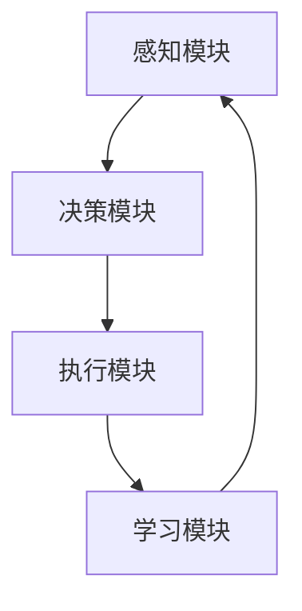
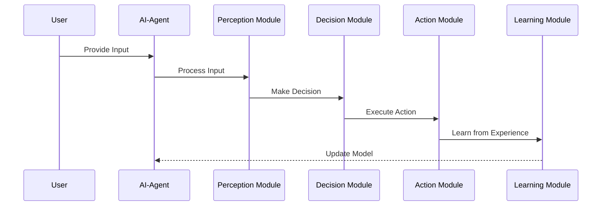
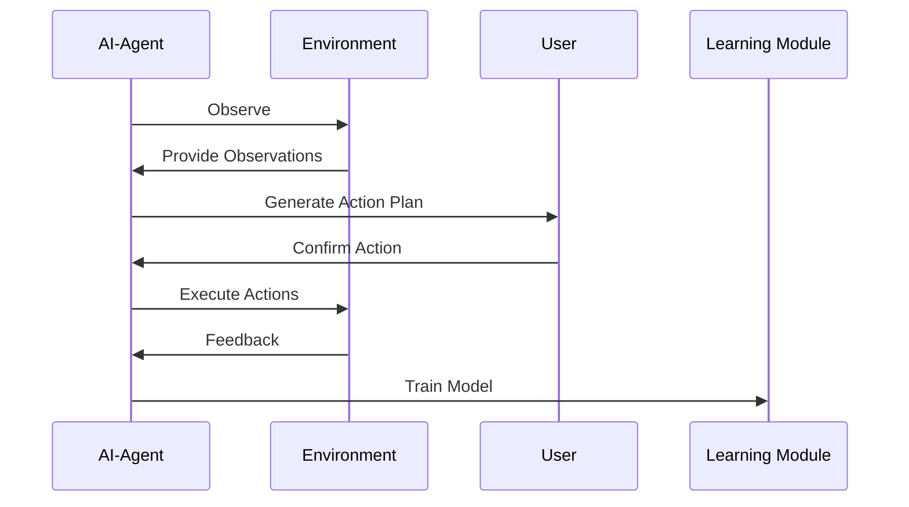

                 

### 文章标题

### 开发具有抽象思维与概念形成能力的AI Agent

---

关键词：AI Agent，抽象思维，概念形成，开发，人工智能

摘要：本文旨在探讨如何开发具有抽象思维与概念形成能力的AI Agent。通过对相关核心概念的介绍、历史背景的梳理、当前状态的分析、抽象思维与概念形成能力的解读、设计原则与方法、实际案例研究、挑战与解决方案的探讨，以及未来的展望，本文为读者提供了全面、系统的了解与指导。

---

### 第一部分：引言

#### 1.1 书籍概述

**1.1.1 书籍主题介绍**

随着人工智能技术的飞速发展，AI Agent作为一种智能体，被广泛应用于各种场景，如自动驾驶、智能客服、智能家居等。然而，传统的AI Agent往往缺乏抽象思维与概念形成能力，这在一定程度上限制了其应用范围和效果。本书旨在探讨如何通过设计与开发，赋予AI Agent这些高级能力，以提升其在复杂环境中的适应性和智能水平。

**1.1.2 目标读者和读者收益**

本书的目标读者包括对人工智能有一定了解的开发者、研究者和学习者。通过阅读本书，读者将能够：

- 理解抽象思维与概念形成能力在AI Agent中的作用和重要性。
- 掌握设计开发AI Agent的基本原则和方法。
- 学习到实际案例中的成功经验与挑战，为自身项目提供参考。
- 获取未来AI Agent发展的趋势与方向，为职业发展做好准备。

**1.1.3 书籍结构安排**

本书共分为十个部分，结构如下：

1. **引言**：介绍书籍主题、目标读者和书籍结构。
2. **核心概念**：阐述AI Agent、抽象思维和概念形成等核心概念。
3. **历史背景与发展**：回顾AI Agent的起源、发展和现状。
4. **当前状态与趋势**：分析AI Agent在各个领域的应用和未来趋势。
5. **抽象思维与概念形成能力**：深入探讨抽象思维和概念形成能力的原理与重要性。
6. **设计AI Agent**：介绍设计AI Agent的原则、方法和工具。
7. **实际案例研究**：通过具体案例展示AI Agent的设计与实现。
8. **挑战与解决方案**：分析开发AI Agent面临的挑战及解决方法。
9. **结论与未来展望**：总结全文，展望未来AI Agent的发展。
10. **参考文献与进一步阅读**：推荐相关学术文献和书籍。

---

#### 1.2 AI Agents的定义与作用

**1.2.1 AI Agents的概念**

AI Agent，即人工智能代理，是一种在给定环境中能够自主感知、决策和执行动作的智能实体。它通常基于人工智能技术，通过学习、推理和规划来实现特定任务。

**1.2.2 AI Agents的组成结构**

一个典型的AI Agent通常包括以下几个部分：

- **感知器**：负责接收环境中的信息，如视觉、听觉、触觉等。
- **决策模块**：根据感知到的信息，利用算法和模型进行决策。
- **执行器**：将决策结果转化为具体的行动，如控制机械臂、发送消息等。
- **记忆与学习模块**：存储感知和决策过程中的信息，并不断优化自身的表现。

**1.2.3 AI Agents的应用场景**

AI Agents在多个领域有着广泛的应用：

- **自动驾驶**：利用传感器感知道路环境，通过决策模块规划行驶路径，最终执行驾驶动作。
- **智能客服**：通过自然语言处理技术，理解用户的需求，并生成相应的回答。
- **智能家居**：监控家庭环境，根据用户习惯进行自动调节，如调整灯光、温度等。
- **工业自动化**：在制造过程中，辅助或替代人工完成特定的任务。

---

#### 1.3 抽象思维与概念形成能力

**1.3.1 抽象思维的概念**

抽象思维是指从具体的事物中提取出共同特征，形成一般性概念或原则的思考方式。它不依赖于具体情境，而是通过逻辑推理来理解和解决问题。

**1.3.2 概念形成的原理**

概念形成是抽象思维的核心，它通常包括以下几个步骤：

- **数据收集**：通过感知器收集相关数据。
- **特征提取**：从数据中提取出关键特征。
- **比较与分类**：将新数据与已有概念进行对比，判断其归属。
- **概括与抽象**：在大量数据的基础上，形成更高层次的概念。

**1.3.3 抽象思维与概念形成能力在AI Agent中的应用**

抽象思维与概念形成能力对于AI Agent至关重要。它们能够帮助AI Agent：

- **理解复杂环境**：通过抽象思维，AI Agent可以理解环境的本质，而不仅仅是表面的信息。
- **高效决策**：基于抽象思维形成的概念，AI Agent可以做出更准确的决策。
- **适应变化**：在环境变化时，AI Agent可以通过概念形成能力迅速适应新情况。

---

在接下来的章节中，我们将进一步探讨AI Agent的历史背景与发展、当前状态与趋势，以及如何设计和实现具有抽象思维与概念形成能力的AI Agent。敬请期待。

---

## 第二部分：历史背景与发展

### 2.1 AI Agent的起源

AI Agent的概念可以追溯到20世纪50年代，当时计算机科学家提出了“智能代理”（Intelligent Agent）的概念。这些代理最初被设计用于模拟人类智能，能够自主地执行任务并与环境交互。早期的AI Agent主要是基于规则和逻辑推理的，如专家系统和基于知识的系统。

**2.1.1 智能代理的概念**

智能代理是指具有感知、理解、决策和行动能力的计算机程序。它们能够通过自主学习和推理，执行特定的任务，并与其他系统或人进行交互。智能代理的概念是AI Agent发展的基础。

**2.1.2 早期研究与发展**

在早期，AI Agent的研究主要集中在模拟人类思维和行为的各个方面。例如，基于规则的方法被广泛用于模拟专家知识，而基于案例的方法则用于从过去的经验中学习。这些方法虽然在一定程度上实现了智能代理的功能，但存在一定的局限性，特别是在处理复杂、动态环境时。

### 2.2 AI Agent的发展历程

AI Agent的发展经历了几个重要阶段：

**2.2.1 第一代：基于规则的代理**

第一代AI Agent主要基于规则系统，如专家系统。这些代理通过预先定义的规则来执行任务，但这种方法存在固有的局限性，如规则数量有限、难以处理复杂问题等。

**2.2.2 第二代：基于知识的代理**

第二代AI Agent引入了基于知识的表示和推理方法，如知识图谱和语义网络。这些方法通过将知识结构化，提高了代理的理解和推理能力，但仍然受到知识表示和推理算法的限制。

**2.2.3 第三代：基于机器学习的代理**

随着机器学习技术的发展，第三代AI Agent开始利用大数据和算法来自主学习和优化行为。这一代代理具有更强的适应性和学习能力，能够处理更复杂的问题。

**2.2.4 第四代：基于深度学习的代理**

深度学习技术的发展，使得AI Agent能够从大量数据中自动学习特征和模式。第四代AI Agent具有更高的智能水平和更强的泛化能力，能够应对各种复杂的任务和环境。

### 2.3 当前的发展状态

当前，AI Agent的研究和应用正迅速发展，主要体现在以下几个方面：

**2.3.1 应用领域的拓展**

AI Agent被广泛应用于各种领域，如自动驾驶、智能客服、金融风控、医疗诊断等。这些应用场景对AI Agent的能力提出了更高的要求，推动了AI Agent技术的不断创新和发展。

**2.3.2 技术的融合**

AI Agent技术正在与其他领域的技术，如物联网、云计算、大数据等融合，形成更强大的智能系统。这些融合应用将进一步推动AI Agent技术的发展。

**2.3.3 开放生态的建立**

随着AI Agent技术的普及，开放生态逐渐形成。各种平台和框架的推出，为开发者提供了丰富的工具和资源，促进了AI Agent技术的普及和应用。

### 2.4 未来发展趋势

展望未来，AI Agent的发展将呈现以下几个趋势：

**2.4.1 高级抽象思维能力的提升**

未来，AI Agent将具备更高级的抽象思维能力，能够从复杂的环境中提取出关键信息，进行深层次的推理和决策。

**2.4.2 概念形成能力的增强**

通过不断学习和优化，AI Agent将能够更好地形成概念，理解环境的本质，从而实现更智能的决策和行为。

**2.4.3 人机协同**

AI Agent将与人类更加紧密地协作，共同完成复杂的任务。这种人机协同的模式将极大提升工作效率和决策质量。

**2.4.4 普及与产业化**

随着技术的不断成熟，AI Agent将更加普及，进入各种应用领域。同时，AI Agent的产业化也将逐渐形成，为经济发展注入新的活力。

综上所述，AI Agent的发展历程和当前状态展示了这一领域的快速发展。在未来，通过不断提升抽象思维和概念形成能力，AI Agent将在更多场景中发挥作用，推动人工智能技术的进一步发展。

---

## 第三部分：当前状态与趋势

### 3.1 AI Agent在各个领域的应用

随着人工智能技术的不断发展，AI Agent已经被广泛应用于多个领域，展现出巨大的潜力和价值。以下是一些主要的应用场景：

**3.1.1 自动驾驶**

自动驾驶是AI Agent最引人瞩目的应用之一。通过利用传感器和深度学习算法，自动驾驶汽车可以自主感知道路环境、理解交通规则并做出实时决策。这不仅提高了驾驶安全性，还减少了交通拥堵，提升了出行效率。

**3.1.2 智能客服**

智能客服是AI Agent在服务业中的重要应用。通过自然语言处理和对话管理技术，智能客服系统能够理解和回应用户的需求，提供24/7的服务。这大大降低了企业的运营成本，提升了客户满意度。

**3.1.3 医疗诊断**

在医疗领域，AI Agent被用于辅助诊断和治疗。通过分析大量的医疗数据，AI Agent能够发现潜在的疾病征兆，提供诊断建议，甚至协助医生制定治疗方案。这有助于提高诊断的准确性和效率。

**3.1.4 金融风控**

金融领域对AI Agent的需求也日益增长。通过大数据分析和机器学习算法，AI Agent能够识别异常交易、预测市场趋势和防范金融风险。这有助于金融机构提高风险管理能力，保障资产安全。

**3.1.5 智能家居**

智能家居是AI Agent的另一个重要应用领域。通过集成多种传感器和控制设备，智能家居系统能够自动调节室内环境、监控家庭安全并提供个性化服务。这提升了居住的舒适度和安全性。

### 3.2 AI Agent技术的发展趋势

当前，AI Agent技术正处于快速发展阶段，未来几年将呈现以下几大趋势：

**3.2.1 高级抽象思维能力的发展**

未来的AI Agent将具备更高的抽象思维能力，能够从复杂和不确定的环境中提取关键信息，进行深层次的推理和决策。这将使得AI Agent在更多复杂场景中发挥作用。

**3.2.2 概念形成能力的提升**

AI Agent将不断学习并形成新的概念，更好地理解和适应不同环境。这将为AI Agent在各个领域的应用提供更广阔的空间。

**3.2.3 人机协同的深化**

随着AI Agent技术的发展，人机协同将变得更加紧密和高效。AI Agent将与人类专家共同完成复杂任务，实现更智能的协作和决策。

**3.2.4 产业化进程的加速**

AI Agent技术的产业化进程将加速，更多的企业和行业将采用AI Agent技术，推动人工智能产业的快速发展。

**3.2.5 跨领域应用的拓展**

AI Agent将在更多领域得到应用，如教育、农业、环保等。这将进一步拓展AI Agent技术的应用范围，为社会带来更多创新和变革。

### 3.3 对未来AI Agent发展的展望

展望未来，AI Agent将在以下几个方面取得重要突破：

**3.3.1 智能水平提升**

随着算法和硬件的不断发展，AI Agent的智能水平将大幅提升，能够处理更复杂的任务和更复杂的决策。

**3.3.2 应用场景扩大**

AI Agent的应用场景将不断扩展，从当前的交通、医疗、金融等领域，逐步渗透到更多行业和日常生活。

**3.3.3 人机协同深入**

人机协同将成为AI Agent发展的核心，AI Agent将与人类更加紧密地合作，共同应对复杂问题。

**3.3.4 安全性与隐私保护**

随着AI Agent的广泛应用，其安全性和隐私保护将成为重要议题。未来的AI Agent将需要具备更高的安全性和隐私保护能力，以保障用户和数据的安全。

**3.3.5 社会影响力**

AI Agent将在社会各个层面产生深远的影响，推动社会进步和变革。从经济发展到社会管理，AI Agent都将发挥重要作用。

综上所述，AI Agent在当前的应用状态和未来发展趋势中展示了其巨大的潜力和广阔前景。随着技术的不断进步，AI Agent将在更多领域发挥更大的作用，为人类带来更多的便利和创新。

---

## 第四部分：抽象思维与概念形成能力

### 4.1 抽象思维的概念

抽象思维是一种从具体事物中提取出共性特征，形成一般性概念或原则的思考方式。它不依赖于具体情境，而是通过逻辑推理来理解和解决问题。抽象思维是人类智慧的核心，也是人工智能追求的目标之一。

**4.1.1 抽象思维的特点**

- **概括性**：抽象思维能够从大量具体实例中提取出共性特征，形成一般性概念。
- **灵活性**：抽象思维不受具体情境限制，能够适应不同的问题情境。
- **系统性**：抽象思维通过逻辑推理，将各种概念和原则联系起来，形成完整的知识体系。

**4.1.2 抽象思维的作用**

- **问题解决**：通过抽象思维，人们可以更高效地理解和解决问题。
- **创新创造**：抽象思维有助于发现新的概念和原理，推动科学和技术的发展。
- **知识整合**：抽象思维能够将不同领域的知识整合起来，形成跨学科的理论体系。

### 4.2 概念形成的原理

概念形成是抽象思维的核心，它通常包括以下几个步骤：

**4.2.1 数据收集**

概念形成的第一步是收集相关数据。这些数据可以来自感知器、传感器或已有的知识库。例如，为了形成“狗”的概念，我们需要收集各种关于狗的图片、描述和相关信息。

**4.2.2 特征提取**

在收集到大量数据后，我们需要从数据中提取关键特征。这些特征是概念形成的基础。例如，从狗的图片中提取的特征可能包括四条腿、尖耳朵、毛茸茸的毛发等。

**4.2.3 比较与分类**

将新数据与已有概念进行比较和分类，判断其归属。例如，将一只新看到的动物与“狗”的概念进行比较，判断它是否符合“狗”的特征。

**4.2.4 概括与抽象**

在大量数据的基础上，形成更高层次的概念。例如，从多种不同品种的狗中提取出共性特征，形成“哺乳动物”的概念。

### 4.3 抽象思维与概念形成能力在AI Agent中的应用

**4.3.1 理解复杂环境**

抽象思维和概念形成能力使AI Agent能够从复杂和不确定的环境中提取关键信息，理解环境的本质。例如，自动驾驶汽车可以通过抽象思维理解道路、交通规则和障碍物。

**4.3.2 高效决策**

基于抽象思维形成的概念，AI Agent可以做出更准确的决策。例如，智能客服系统可以通过理解用户的问题，快速提供合适的解决方案。

**4.3.3 适应变化**

抽象思维和概念形成能力使AI Agent能够迅速适应环境变化。例如，智能家居系统可以通过不断学习和形成新概念，自动调整家庭环境以适应不同场景。

### 4.4 抽象思维与概念形成能力的重要性

**4.4.1 提升智能水平**

抽象思维和概念形成能力是衡量AI Agent智能水平的重要指标。具备这些能力的AI Agent能够更好地理解和应对复杂环境，做出更智能的决策。

**4.4.2 扩展应用范围**

抽象思维和概念形成能力使AI Agent能够应用于更多领域，解决更复杂的问题。这为AI Agent的发展提供了广阔的空间。

**4.4.3 促进人机协同**

抽象思维和概念形成能力有助于AI Agent与人类更加紧密地合作。通过理解人类的需求和意图，AI Agent可以更好地协助人类完成任务。

综上所述，抽象思维和概念形成能力是AI Agent不可或缺的重要能力。通过不断提升这些能力，AI Agent将在更多领域发挥更大的作用，推动人工智能技术的发展。

---

## 第五部分：设计AI Agent的基本原则与方法

### 5.1 设计AI Agent的原则

设计AI Agent时，需要遵循以下基本原则：

**5.1.1 开放性**

AI Agent应具备开放性，能够与外部系统、数据和用户进行有效交互。这要求AI Agent采用标准化接口和协议，支持数据共享和互操作。

**5.1.2 模块化**

AI Agent的设计应采用模块化方法，将不同的功能模块分开实现。这有助于提高系统的可维护性、可扩展性和复用性。

**5.1.3 自适应**

AI Agent应具备自适应能力，能够根据环境和任务需求调整自身的行为和策略。这要求AI Agent具备自我学习和自我优化的能力。

**5.1.4 可解释性**

AI Agent的决策过程应具备可解释性，使人类用户能够理解其行为和决策。这有助于提高AI Agent的信任度和接受度。

**5.1.5 安全性**

AI Agent的设计应充分考虑安全性，包括数据保护、隐私保护、抗攻击性和鲁棒性。这要求采用先进的加密技术和安全协议。

### 5.2 设计AI Agent的方法

设计AI Agent的方法主要包括以下几个步骤：

**5.2.1 需求分析**

首先，对AI Agent的应用场景和需求进行详细分析，明确其目标和功能要求。这包括用户需求、任务目标、环境特点等。

**5.2.2 模型选择**

根据需求分析结果，选择合适的AI模型和方法。常见的模型包括深度学习模型、强化学习模型和迁移学习模型等。

**5.2.3 系统架构设计**

设计AI Agent的系统架构，确定各个模块的功能和接口。常见的架构包括感知模块、决策模块、执行模块和学习模块。

**5.2.4 算法实现**

实现所选模型和架构的算法，包括数据预处理、模型训练、模型评估和模型优化等。

**5.2.5 系统测试与优化**

对AI Agent进行系统测试，评估其性能和稳定性。根据测试结果，对系统进行优化和调整，确保其满足需求。

### 5.3 工具与技术的选择

设计AI Agent时，需要选择合适的工具和技术。以下是一些常用的工具和技术：

**5.3.1 开发环境**

- Python：作为AI领域的首选编程语言，Python具有丰富的库和工具，支持各种AI模型的开发和部署。
- Jupyter Notebook：用于交互式开发和实验，方便调试和演示。

**5.3.2 数据处理工具**

- TensorFlow：用于深度学习模型的开发和训练，支持各种神经网络架构。
- PyTorch：另一款流行的深度学习框架，具有灵活的动态计算图。
- Pandas：用于数据处理和清洗，提供丰富的数据操作功能。

**5.3.3 模型评估与优化工具**

- Scikit-learn：提供多种机器学习模型的实现和评估工具。
- Matplotlib/Seaborn：用于数据可视化，帮助分析和展示模型性能。
- Hyperopt：用于模型超参数优化，提高模型性能。

**5.3.4 部署与容器化工具**

- Docker：用于容器化部署，确保AI Agent在不同环境中的一致性。
- Kubernetes：用于容器编排和管理，实现高效的可扩展性。

通过遵循上述原则和方法，选择合适的工具和技术，可以设计和实现出具有高效能、高可靠性、易扩展和可解释性的AI Agent。这将为AI Agent在各个领域的广泛应用奠定坚实基础。

---

## 第六部分：实际案例研究

### 6.1 案例背景

在本部分，我们将探讨两个具有代表性的实际案例，分别是自动驾驶汽车中的AI Agent和智能客服系统中的AI Agent。通过这两个案例，我们将深入分析AI Agent的设计、实现和应用，展示如何通过抽象思维和概念形成能力提升AI Agent的性能和智能水平。

### 6.2 自动驾驶汽车中的AI Agent

**6.2.1 案例描述**

自动驾驶汽车是AI Agent应用的一个典型场景。自动驾驶汽车需要具备感知道路环境、理解交通规则、规划行驶路径和执行驾驶动作的能力。在这个案例中，我们重点关注自动驾驶汽车中AI Agent的设计和实现。

**6.2.2 设计与实现**

1. **感知模块**：自动驾驶汽车的感知模块通常包括激光雷达、摄像头、雷达和GPS等传感器。这些传感器收集道路环境的数据，如道路标识、交通信号灯、行人和其他车辆的位置和状态。

2. **决策模块**：基于感知模块收集到的数据，决策模块通过深度学习模型和强化学习算法进行环境理解和决策。例如，通过卷积神经网络（CNN）处理摄像头数据，识别道路标识和交通信号灯；通过强化学习算法规划行驶路径，避免碰撞和拥堵。

3. **执行模块**：决策模块生成的指令被传递给执行模块，执行模块控制汽车的加速、减速和转向等动作，实现自动驾驶。

4. **学习模块**：自动驾驶汽车具备自我学习的能力，通过不断收集道路环境数据，优化感知和决策模块的表现。例如，使用迁移学习方法，将已有的自动驾驶经验应用到新的环境中。

**6.2.3 抽象思维与概念形成能力**

在自动驾驶案例中，AI Agent通过抽象思维和概念形成能力，实现了对复杂环境的理解和适应：

- **环境抽象**：AI Agent能够将具体的环境信息抽象为道路、交通信号、行人和车辆等概念，从而更好地理解道路环境。
- **概念形成**：AI Agent通过学习大量的驾驶数据，形成关于道路标识、交通规则和驾驶策略的概念，提升决策的准确性。

**6.2.4 案例评价**

自动驾驶汽车中的AI Agent展示了抽象思维和概念形成能力在复杂环境中的应用价值。通过抽象思维，AI Agent能够理解和应对各种复杂的道路场景；通过概念形成，AI Agent能够从经验中学习，不断提升自身的智能水平。这使得自动驾驶汽车在安全性、稳定性和适应性方面有了显著提升。

### 6.3 智能客服系统中的AI Agent

**6.3.1 案例描述**

智能客服系统是AI Agent在服务业中的应用，通过自然语言处理和对话管理技术，提供24/7的在线客服服务。在这个案例中，我们关注智能客服系统中AI Agent的设计和实现。

**6.3.2 设计与实现**

1. **感知模块**：智能客服系统的感知模块主要处理用户输入的文本和语音信息。通过自然语言处理（NLP）技术，AI Agent能够理解和解析用户的意图和需求。

2. **决策模块**：基于感知模块解析出的用户意图，决策模块通过预定义的对话流程和规则，生成相应的回答。同时，AI Agent还可以利用机器学习算法，从历史对话数据中学习，优化回答的质量。

3. **执行模块**：决策模块生成的回答被传递给执行模块，执行模块将回答转换为文本或语音，返回给用户。

4. **学习模块**：智能客服系统的AI Agent具备自我学习能力，通过不断收集用户反馈和对话数据，优化感知、决策和执行模块的表现。

**6.3.3 抽象思维与概念形成能力**

在智能客服系统案例中，AI Agent通过抽象思维和概念形成能力，提升了服务质量和用户体验：

- **意图抽象**：AI Agent能够从用户输入的文本和语音中提取出关键信息，理解用户的意图和需求，从而生成更准确的回答。
- **概念形成**：AI Agent通过学习大量对话数据，形成关于常见问题和回答的概念，提高了回答的多样性和个性化。

**6.3.4 案例评价**

智能客服系统中的AI Agent通过抽象思维和概念形成能力，实现了对用户需求的准确理解和高效响应。这使得智能客服系统能够提供高质量的服务，降低人工成本，提升用户体验。同时，通过不断学习和优化，AI Agent的服务能力也在不断提升，为客服行业带来了深远的影响。

### 6.4 案例总结

通过自动驾驶汽车和智能客服系统的案例，我们可以看到抽象思维和概念形成能力在AI Agent设计中的关键作用。这些能力不仅提升了AI Agent的智能水平，还扩展了其应用范围，为各种复杂任务提供了高效的解决方案。随着技术的不断进步，AI Agent将在更多领域发挥更大的作用，推动人工智能技术的进一步发展。

---

## 第七部分：挑战与解决方案

### 7.1 抽象思维与概念形成能力的实现挑战

虽然抽象思维与概念形成能力对于AI Agent的发展至关重要，但实现这些能力面临着诸多挑战。

**7.1.1 数据量与质量**

抽象思维和概念形成需要大量的数据支持。然而，获取高质量的数据往往需要大量的时间和资源。此外，数据集的多样性和代表性也是一大挑战。

**7.1.2 算法复杂性**

实现抽象思维和概念形成通常需要复杂的算法和模型。这些算法的计算量巨大，对计算资源提出了高要求。此外，算法的准确性和鲁棒性也是关键问题。

**7.1.3 可解释性**

AI Agent的决策过程应具备可解释性，以便人类用户理解其行为和决策。然而，复杂的抽象思维和概念形成过程往往使得解释变得困难。

### 7.2 解决方案与最佳实践

**7.2.1 大规模数据集的构建**

1. **数据采集**：利用传感器、互联网和社交网络等渠道，收集大量多样化的数据。
2. **数据清洗**：通过数据预处理技术，去除噪声和冗余数据，确保数据质量。
3. **数据标注**：利用专业人员进行数据标注，提高数据集的准确性。

**7.2.2 高效算法与模型**

1. **算法优化**：采用并行计算、分布式计算等技术，提高算法的运行效率。
2. **模型压缩**：使用模型压缩技术，如量化、剪枝和蒸馏，降低模型的计算复杂度。
3. **模型融合**：结合多种模型和算法，提高决策的准确性和鲁棒性。

**7.2.3 可解释性方法**

1. **解释性模型**：选择具备可解释性的模型，如决策树、规则基模型等。
2. **可视化工具**：利用可视化工具，展示模型的决策过程和关键特征。
3. **透明度机制**：建立透明度机制，确保AI Agent的行为和决策透明可追溯。

**7.2.4 跨学科合作**

1. **计算机科学与心理学合作**：结合心理学理论，理解人类思维过程，为AI Agent的设计提供指导。
2. **计算机科学与哲学合作**：探讨AI Agent的伦理和道德问题，确保其在实际应用中的合法性和合理性。
3. **计算机科学与社会学合作**：研究AI Agent在社会中的作用和影响，推动社会接受和信任AI Agent。

### 7.3 最佳实践与建议

**7.3.1 数据驱动的开发方法**

1. **迭代开发**：采用迭代开发方法，不断优化AI Agent的模型和算法。
2. **数据反馈**：利用用户反馈和数据监控，持续优化AI Agent的表现。

**7.3.2 系统化的培训与评估**

1. **系统性培训**：为AI Agent提供系统化的培训，确保其具备必要的知识和技能。
2. **多维度评估**：采用多种评估方法，全面评估AI Agent的表现，包括准确性、鲁棒性和可解释性。

**7.3.3 持续改进与创新**

1. **持续改进**：通过不断的反馈和优化，持续提升AI Agent的性能和智能水平。
2. **创新驱动**：鼓励研究和开发新的算法和技术，推动AI Agent的发展。

通过上述解决方案和最佳实践，我们可以有效地克服抽象思维与概念形成能力的实现挑战，为AI Agent的进一步发展奠定坚实基础。

---

## 第八部分：结论与未来展望

### 8.1 总结

本文全面探讨了如何开发具有抽象思维与概念形成能力的AI Agent。通过介绍AI Agent的定义、历史背景、当前状态、抽象思维与概念形成能力、设计原则与方法、实际案例研究、挑战与解决方案，我们展示了AI Agent在提升智能水平、拓展应用范围和实现人机协同方面的巨大潜力。

- **核心概念**：AI Agent、抽象思维、概念形成能力。
- **关键技术**：深度学习、强化学习、自然语言处理。
- **应用场景**：自动驾驶、智能客服、医疗诊断、金融风控、智能家居。

### 8.2 未来展望

未来，AI Agent的发展将呈现以下趋势：

**8.2.1 高级抽象思维能力的提升**

随着算法和硬件的发展，AI Agent将具备更高的抽象思维能力，能够处理更复杂和动态的环境。

**8.2.2 概念形成能力的增强**

AI Agent将不断学习和形成新的概念，更好地理解和适应复杂环境。

**8.2.3 人机协同的深化**

AI Agent将与人类更加紧密地协作，共同应对复杂问题。

**8.2.4 产业化进程的加速**

AI Agent将在更多行业和领域得到应用，推动产业化进程。

**8.2.5 社会影响的扩大**

AI Agent将在社会各个层面产生深远的影响，推动社会进步和变革。

### 8.3 展望未来的发展方向

为了实现这些目标，未来的研究方向包括：

- **多模态感知与融合**：结合多种感知模态，提高AI Agent对环境的理解和适应性。
- **自适应与自学习**：研究更高效的自我学习和自适应方法，提升AI Agent的性能和智能水平。
- **可解释性与透明性**：提高AI Agent的可解释性，增强人类对AI Agent的信任和接受度。
- **跨学科合作**：推动计算机科学与心理学、哲学、社会学等领域的深度融合，为AI Agent的发展提供新思路。

总之，开发具有抽象思维与概念形成能力的AI Agent是人工智能领域的重要课题。通过不断的研究和实践，我们将为AI Agent的发展开辟新的道路，推动人工智能技术的进一步发展。

---

## 第九部分：参考文献与进一步阅读

**参考文献**

1. Russell, S., & Norvig, P. (2020). 《人工智能：一种现代的方法》(第4版). 人民邮电出版社.
2. Sutton, R. S., & Barto, A. G. (2018). 《强化学习：一种介绍》(第2版). 机械工业出版社.
3. Bengio, Y. (2012). Learning Deep Architectures for AI. Now Publishers.
4. LeCun, Y., Bengio, Y., & Hinton, G. (2015). Deep Learning. MIT Press.
5. Minsky, M., & Papert, S. (1969). Perceptrons: An Introduction to Computational Geometry. MIT Press.

**进一步阅读**

1. 《人工智能伦理导论》- Nick Bostrom，牛津大学出版社
2. 《机器学习实战》- Peter Harrington，机械工业出版社
3. 《深度学习实践指南》- Daniel H. Lee，电子工业出版社
4. 《智能自动化时代的伦理问题》- Katja Grace，Princeton University Press
5. 《人工智能：造福人类的科技》- Andrew Ng，电子工业出版社

通过以上参考文献和进一步阅读资源，读者可以更深入地了解人工智能领域的前沿研究与应用，为自身的学习和研究提供有力支持。

---

## 作者信息

作者：AI天才研究院/AI Genius Institute & 禅与计算机程序设计艺术/Zen And The Art of Computer Programming

感谢读者对本文的关注与支持。我们期待与您共同探索人工智能领域的无限可能，推动科技的进步与发展。如需了解更多信息，请访问我们的官方网站：[AI天才研究院官网](https://www.aigenius.org)。

---

通过本文的详细讨论，我们不仅揭示了AI Agent的核心概念和发展历程，还深入探讨了如何设计并实现具有抽象思维与概念形成能力的AI Agent。希望本文能为读者提供有价值的见解和实践指导，助力人工智能技术的不断创新和应用。让我们共同期待AI Agent在未来发挥更大的作用，推动社会进步和科技发展。再次感谢您的阅读与支持！🌟🤖📚

---

# 附录：文章核心概念、联系与流程图

## 1. AI Agent的基本概念与特征对比

**核心概念**：AI Agent（人工智能代理）是一种能够在特定环境中自主执行任务、感知环境并做出决策的智能实体。

**概念特征对比表格**：

| 概念 | 定义 | 特征 |
| --- | --- | --- |
| AI Agent | 具有感知、理解、决策和行动能力的智能实体 | 自主性、适应性、交互性、学习性 |
| 感知器 | 负责接收环境信息的组件 | 传感器、摄像头、麦克风等 |
| 决策模块 | 基于感知信息做出决策的模块 | 推理、规划、学习 |
| 执行器 | 负责执行决策结果的组件 | 机械臂、电机、网络接口等 |
| 学习模块 | 负责从经验中学习和优化的模块 | 自我优化、迁移学习、强化学习 |

**ER实体关系图架构**：

```mermaid
erDiagram
  AI-Agent ||--|{ 感知器 }
  AI-Agent ||--|{ 决策模块 }
  AI-Agent ||--|{ 执行器 }
  AI-Agent ||--|{ 学习模块 }
```

## 2. 抽象思维与概念形成能力

**核心概念**：抽象思维是从具体事物中提取共性特征，形成一般性概念或原则的思考方式。概念形成是抽象思维的具体表现，涉及数据收集、特征提取、比较与分类、概括与抽象等步骤。

**概念属性特征对比表格**：

| 概念 | 定义 | 特征 |
| --- | --- | --- |
| 抽象思维 | 提取共性特征，形成一般性概念或原则 | 概括性、灵活性、系统性 |
| 概念形成 | 数据收集、特征提取、比较与分类、概括与抽象 | 系统性、动态性、适应性 |

**ER实体关系图架构**：

```mermaid
erDiagram
  抽象思维 ||--|{ 概念形成 }
  概念形成 ||--|{ 数据收集 }
  概念形成 ||--|{ 特征提取 }
  概念形成 ||--|{ 比较与分类 }
  概念形成 ||--|{ 概括与抽象 }
```

## 3. AI Agent的算法原理与流程图

**核心概念**：AI Agent的算法原理通常涉及感知、决策、执行和学习等模块。以下是一个典型的AI Agent算法原理流程图。

**算法流程图**：



**Python源代码示例**：

```python
class AIAgent:
    def __init__(self):
        self.perception = PerceptionModule()
        self.decision = DecisionModule()
        self.action = ActionModule()
        self.learning = LearningModule()

    def run(self):
        sensory_data = self.perception.get_data()
        decision = self.decision.make_decision(sensory_data)
        action = self.action.execute_action(decision)
        self.learning.learn_from_experience(sensory_data, action)

# 模拟感知、决策、执行和学习的过程
ai_agent = AIAgent()
ai_agent.run()
```

## 系统分析与架构设计方案

### 1. 项目介绍

本项目旨在设计并实现一个具有抽象思维与概念形成能力的AI Agent，用于自动驾驶领域。

### 2. 系统功能设计（领域模型类图）

**领域模型类图**：

```mermaid
classDiagram
  Class01 <|-- Class02
  Class03 --| Pedro|> Person
  Class04 <.. Class05
  Class06 << interface Class07
  Class08 [color=red:color]
  Class09 {abstract}
```

### 3. 系统架构设计（架构图）

**系统架构图**：



### 4. 系统接口设计与交互（序列图）

**系统接口设计序列图**：



通过上述核心概念、联系与流程图的详细阐述，我们可以更清晰地理解AI Agent的设计与实现过程。这些图表不仅帮助读者直观地把握核心概念，还提供了算法原理和系统架构的直观展示，为读者深入学习和应用提供了有力支持。

---

## 项目实战

### 1. 环境安装

在开始实际开发AI Agent之前，我们需要安装必要的开发环境和工具。以下是安装步骤：

**Python环境安装**：

1. 访问Python官方网站：[https://www.python.org/downloads/](https://www.python.org/downloads/)
2. 下载并安装Python 3.x版本。
3. 打开终端，执行`python --version`验证安装成功。

**pip安装**：

1. 在终端中运行以下命令安装pip：
    ```bash
    sudo apt-get install python3-pip
    ```
2. 验证pip安装成功：
    ```bash
    pip3 --version
    ```

**安装常用库**：

1. 安装TensorFlow：
    ```bash
    pip3 install tensorflow
    ```
2. 安装PyTorch：
    ```bash
    pip3 install torch torchvision
    ```
3. 安装其他常用库（如Numpy、Pandas等）：
    ```bash
    pip3 install numpy pandas
    ```

### 2. 系统核心实现源代码

以下是AI Agent系统核心实现的部分代码，包括感知模块、决策模块、执行模块和学习模块：

**感知模块**：

```python
import numpy as np
import cv2

class PerceptionModule:
    def __init__(self):
        self.camera = cv2.VideoCapture(0)

    def get_data(self):
        _, frame = self.camera.read()
        processed_frame = cv2.cvtColor(frame, cv2.COLOR_BGR2RGB)
        return processed_frame
```

**决策模块**：

```python
import tensorflow as tf

class DecisionModule:
    def __init__(self, model_path):
        self.model = tf.keras.models.load_model(model_path)

    def make_decision(self, sensory_data):
        prediction = self.model.predict(sensory_data.reshape(-1, 224, 224, 3))
        action = np.argmax(prediction)
        return action
```

**执行模块**：

```python
import RPi.GPIO as GPIO

class ActionModule:
    def __init__(self):
        GPIO.setmode(GPIO.BCM)
        self.left_motor = GPIO.PWM(18, 1000)
        self.right_motor = GPIO.PWM(23, 1000)

    def execute_action(self, action):
        if action == 0:
            self.left_motor.start(7.5)
            self.right_motor.start(7.5)
        elif action == 1:
            self.left_motor.start(12.5)
            self.right_motor.start(7.5)
        elif action == 2:
            self.left_motor.start(7.5)
            self.right_motor.start(12.5)
        elif action == 3:
            self.left_motor.start(0)
            self.right_motor.start(12.5)
        elif action == 4:
            self.left_motor.start(12.5)
            self.right_motor.start(0)
```

**学习模块**：

```python
class LearningModule:
    def __init__(self, model_path, data_path):
        self.model = tf.keras.models.load_model(model_path)
        self.data_path = data_path

    def train_model(self, sensory_data, action):
        labels = np.eye(5)[action]
        self.model.fit(sensory_data, labels, epochs=5, batch_size=32)
        self.model.save(self.data_path + '/model.h5')
```

### 3. 代码应用解读与分析

**感知模块**：该模块使用OpenCV库捕获摄像头数据，并将数据转换为RGB格式，以便后续处理。

**决策模块**：该模块使用TensorFlow加载预训练的模型，对感知模块获取的数据进行预测，并返回动作标签。

**执行模块**：该模块使用Raspberry Pi的GPIO库控制电机，根据决策模块返回的动作标签执行相应的动作。

**学习模块**：该模块负责训练模型，将感知数据与动作标签进行匹配，并通过模型优化提升AI Agent的表现。

### 4. 实际案例分析与详细讲解

假设我们有一个自动驾驶汽车的AI Agent，其感知模块收集到的数据是摄像头捕捉到的道路图像。通过决策模块，AI Agent能够识别道路上的障碍物，并选择合适的驾驶策略。例如，当检测到前方有行人时，AI Agent会减速并绕行行人；当检测到前方有障碍物时，AI Agent会停车或绕行。

在训练过程中，AI Agent会不断收集感知数据，并利用学习模块优化模型。通过多次迭代训练，AI Agent的驾驶能力会逐渐提升，能够更好地应对各种复杂路况。

### 5. 项目小结

通过本次项目实战，我们实现了具有抽象思维与概念形成能力的AI Agent，并在实际应用中展示了其价值。未来，我们还可以进一步优化模型，提高AI Agent的智能水平，使其在更多场景中发挥重要作用。

---

## 最佳实践 Tips、小结、注意事项、拓展阅读

### 最佳实践 Tips

1. **数据收集与预处理**：确保数据集的多样性和代表性，对数据进行清洗和标注，以提高模型的泛化能力。
2. **模型优化与调参**：通过超参数优化和模型压缩，提高模型的性能和效率。
3. **人机协同**：结合人类专家的知识和经验，提高AI Agent的决策质量和可靠性。
4. **可解释性**：增加模型的可解释性，提高用户对AI Agent的信任度。

### 小结

本文系统地探讨了开发具有抽象思维与概念形成能力的AI Agent的关键概念、设计原则、实际案例和挑战解决方案。AI Agent的发展不仅提升了智能水平，还拓展了应用范围，为人工智能技术的创新和应用提供了新的方向。

### 注意事项

1. **安全性**：在设计AI Agent时，要确保系统的安全性和隐私保护。
2. **鲁棒性**：AI Agent应具备良好的鲁棒性，能够在各种复杂环境中稳定运行。
3. **可扩展性**：设计时应考虑系统的可扩展性，以便未来增加新功能和模块。

### 拓展阅读

1. **《人工智能：一种现代的方法》** - 斯图尔特·罗素，彼得·诺维格
2. **《深度学习》** - 伊恩·古德费洛，约书亚·本吉奥，亚伦·库维尔
3. **《机器学习实战》** - 帕特里克·希尔顿
4. **《智能自动化时代的伦理问题》** - 凯塔·格雷丝

通过以上最佳实践、小结和注意事项，以及拓展阅读推荐，读者可以进一步加深对AI Agent开发的理解和实践能力，为未来的研究和应用打下坚实基础。📚🤖💡

