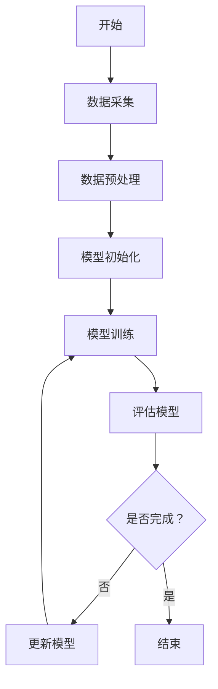
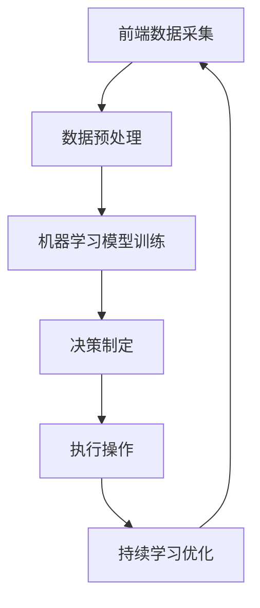
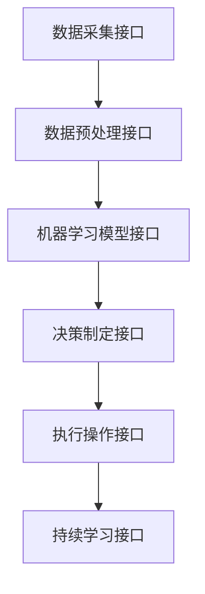
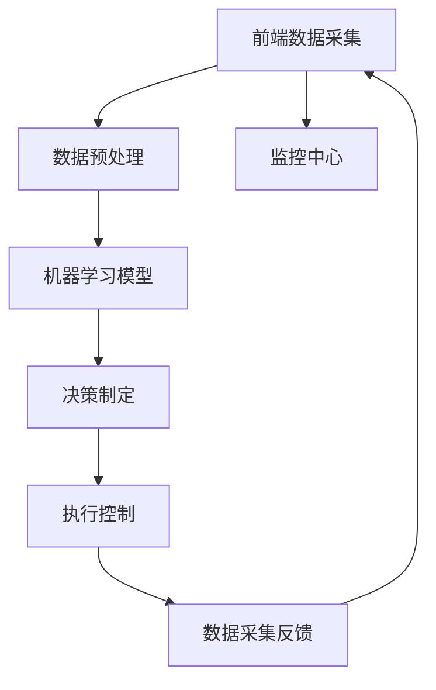
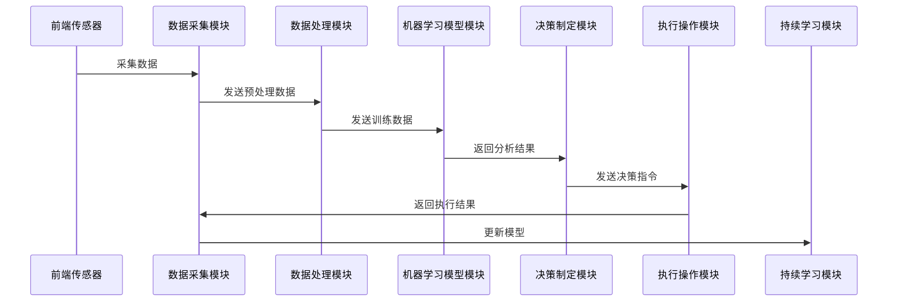

                 

### 引言和背景介绍

#### 问题背景与重要性

人工智能（AI）技术正在以不可预测的速度快速发展，其在各个行业中的应用场景也日益广泛。从自动化生产线到智能客服系统，从自动驾驶汽车到医疗诊断系统，AI已经深刻地改变了我们的生活方式和工作模式。在这个不断进化的技术生态中，具有持续学习能力的AI Agent成为一个备受关注的研究热点。

**AI Agent**是一种能够自主感知环境、进行决策并采取行动的人工智能实体。与传统的基于规则或预定义模型的AI系统不同，AI Agent能够在执行任务的过程中不断学习、适应和改进。这种能力不仅使其能够应对不断变化的环境，还能在处理未知或复杂任务时展现出更高的灵活性和鲁棒性。

在当前的AI研究中，AI Agent的持续学习能力主要面临以下几个挑战：

1. **数据质量和多样性**：持续学习依赖于大量高质量、多样化的数据。然而，获取这些数据往往是一个复杂且耗时的过程，尤其是在实时环境中。

2. **模型复杂度和计算资源**：为了实现高效的持续学习，需要复杂的模型结构和大量的计算资源。如何在不牺牲性能的前提下，高效地训练和优化模型，是一个关键的技术难题。

3. **动态适应性**：AI Agent需要在面对动态变化的环境时，能够迅速适应并作出合理的决策。这要求AI Agent不仅要有较强的学习速度，还要有较高的决策能力。

4. **安全性和隐私性**：在持续学习过程中，AI Agent可能会处理敏感数据或涉及高风险的决策。如何保证AI Agent的学习过程是安全、可靠且符合伦理标准的，也是一个重要的研究课题。

因此，开发具有持续学习能力的AI Agent不仅具有重要的理论意义，还具有重要的实际应用价值。它能够提高AI系统的智能化水平，推动AI技术在更多领域的应用，从而带来巨大的社会和经济收益。

#### 问题描述与解决思路

在本文中，我们主要关注的问题是“如何开发具有持续学习能力的AI Agent”。具体来说，这个问题可以分解为以下几个子问题：

1. **数据采集与处理**：如何高效地采集和处理大量、多样化的数据，为AI Agent的持续学习提供支持。
2. **模型训练与优化**：如何设计并训练复杂的深度学习模型，使其能够在实时环境中高效地学习和适应。
3. **持续学习机制**：如何实现AI Agent的动态适应性，使其能够持续地改进自己的性能和决策能力。

为了解决这些问题，我们提出了以下解决思路：

1. **构建数据采集和处理框架**：设计一个高效的数据采集和处理系统，能够实时获取和处理多样化的数据，为AI Agent的持续学习提供高质量的数据输入。
2. **设计并实现高效的深度学习模型**：采用先进的深度学习技术和算法，设计并实现一个能够在实时环境中高效训练和优化的深度学习模型，从而提高AI Agent的学习速度和决策能力。
3. **引入持续学习机制**：通过引入持续学习机制，使AI Agent能够动态地适应环境变化，并不断优化自己的性能和决策能力。

在本文中，我们将详细探讨这些问题的背景、现状、挑战和解决思路，并通过实际案例和项目实战，展示如何具体实现这些解决方案。通过本文的阅读，读者将能够全面了解开发具有持续学习能力的AI Agent的各个方面，从而为相关研究和应用提供有益的参考和指导。

### 核心概念与联系

在开发具有持续学习能力的AI Agent的旅程中，理解以下几个核心概念及其相互联系至关重要。这些概念包括AI Agent的定义、持续学习能力的概念，以及与这些核心概念紧密相关联的关键技术。

#### AI Agent的定义

**AI Agent**是一种具有感知、思考和行动能力的人工智能实体。它可以在与环境的交互中自主地学习、决策和行动，以实现特定的目标。AI Agent通常由感知模块、决策模块和执行模块组成：

- **感知模块**：负责感知环境信息，包括视觉、听觉、触觉等多种感官数据。
- **决策模块**：基于感知模块提供的信息，通过学习和推理，生成具体的行动方案。
- **执行模块**：根据决策模块生成的行动方案，执行具体的操作。

AI Agent的核心特征是自主性、适应性和智能性。它不仅能够执行预设的任务，还能在执行过程中不断学习，以应对新的环境和挑战。

#### 持续学习能力的概念

**持续学习能力**是指AI Agent在执行任务的过程中，能够不断从环境中获取新的信息和经验，并通过学习和调整自己的模型和策略，不断提高其性能和适应能力。持续学习能力包括以下几个关键方面：

1. **数据采集**：AI Agent需要能够实时、高效地采集环境中的数据，作为学习的输入。
2. **模型更新**：AI Agent需要能够动态地更新其模型，以适应新的数据和环境变化。
3. **策略优化**：AI Agent需要能够优化其行为策略，以实现更高效的任务执行。

#### 关键技术

为了实现AI Agent的持续学习能力，我们需要掌握一系列关键技术：

1. **数据采集与处理**：包括传感器数据的采集、数据清洗、数据存储等，是持续学习的基础。
2. **模型训练与优化**：采用先进的机器学习算法和深度学习模型，进行高效的模型训练和优化，以提高学习效率。
3. **持续学习策略**：设计有效的持续学习机制，包括模型更新策略、策略优化策略等，以确保AI Agent能够在动态环境中持续改进。

#### 概念属性特征对比表格

为了更好地理解这些概念及其属性特征，我们可以通过一个对比表格来展示它们之间的异同：

| 概念       | 定义                                                         | 属性特征                                                                                   |
|------------|--------------------------------------------------------------|----------------------------------------------------------------------------------------------|
| AI Agent   | 具有感知、思考和行动能力的人工智能实体                     | 自主性、适应性、智能性、感知模块、决策模块、执行模块                                           |
| 持续学习能力 | AI Agent在执行任务过程中，能够不断学习、适应和改进的能力 | 数据采集、模型更新、策略优化、实时性、动态适应性                                             |
| 数据采集与处理 | 数据采集、数据清洗、数据存储等过程                       | 实时性、多样性、可靠性、高效性、可扩展性                                                       |
| 模型训练与优化 | 使用机器学习算法和深度学习模型，进行模型训练和优化       | 高效性、准确性、可解释性、鲁棒性、适应性                                                       |
| 持续学习策略 | 设计有效的持续学习机制，包括模型更新策略、策略优化策略等 | 自适应、动态性、优化性、安全性、可解释性                                                       |

#### ER实体关系图架构

为了进一步理解这些概念之间的联系，我们可以通过ER（Entity-Relationship）实体关系图来展示。在ER图中，每个实体代表一个核心概念，实体之间的关系则表示这些概念之间的相互作用和依赖。

以下是ER实体关系图的Mermaid格式表示：

```mermaid
erDiagram
    AI-Agent ||--|{ 数据采集与处理 }|-- AI-Agent
    AI-Agent ||--|{ 模型训练与优化 }|-- AI-Agent
    AI-Agent ||--|{ 持续学习策略 }|-- AI-Agent
    数据采集与处理 ||--|{ 数据 }|-- 模型训练与优化
    模型训练与优化 ||--|{ 模型 }|-- 持续学习策略
    持续学习策略 ||--|{ 策略 }|-- AI-Agent
```

通过这个ER图，我们可以清晰地看到各个核心概念之间的关系，以及它们在AI Agent持续学习过程中的作用和依赖。

总结来说，理解AI Agent、持续学习能力以及相关关键技术是开发具有持续学习能力的AI Agent的基础。通过这些核心概念和联系，我们能够更好地把握AI Agent持续学习的本质，为其设计和实现提供坚实的理论基础。在后续章节中，我们将进一步深入探讨这些概念的具体实现和应用。

### 算法原理讲解

#### 基础算法原理

在探讨具有持续学习能力的AI Agent之前，我们需要了解一些基础的机器学习算法，包括机器学习基础、深度学习基础以及强化学习基础。这些算法为持续学习提供了理论依据和技术支持。

##### 机器学习基础

机器学习是一种使计算机系统从数据中学习，从而改进其性能和决策过程的方法。机器学习的基础包括以下几个关键概念：

1. **监督学习**：在监督学习模型中，训练数据集包含输入和对应的输出标签。模型通过学习输入和输出之间的关系来预测新的输入对应的输出。常见的监督学习算法包括线性回归、逻辑回归和支持向量机（SVM）。

2. **无监督学习**：无监督学习模型没有输出标签，其目标是发现数据中的隐藏结构和规律。常见的无监督学习算法包括聚类算法（如K-means聚类）和降维算法（如主成分分析PCA）。

3. **增强学习**：增强学习是一种通过交互环境来学习最佳策略的过程。其核心概念包括状态（State）、动作（Action）、奖励（Reward）和策略（Policy）。通过不断调整策略，以最大化累积奖励，增强学习模型能够学习到最优行为。

##### 深度学习基础

深度学习是机器学习的一个分支，其核心思想是使用多层神经网络来模拟人类大脑的神经结构，从而实现复杂的数据处理和模式识别。深度学习的基础包括以下几个关键概念：

1. **神经网络**：神经网络由多个层组成，包括输入层、隐藏层和输出层。每层包含多个节点（神经元），每个节点通过权重连接到其他节点。神经网络的训练过程是通过反向传播算法来调整权重，以最小化预测误差。

2. **深度学习模型**：常见的深度学习模型包括卷积神经网络（CNN）、循环神经网络（RNN）和生成对抗网络（GAN）。这些模型在不同领域具有广泛的应用。

3. **深度学习框架**：深度学习框架如TensorFlow、PyTorch等提供了丰富的API和工具，使得构建和训练深度学习模型变得更加便捷和高效。

##### 强化学习基础

强化学习是一种通过与环境互动来学习最佳策略的方法。强化学习的基础包括以下几个关键概念：

1. **价值函数**：价值函数评估在某个状态下采取某个动作所能获得的长期奖励。常见的价值函数包括状态-动作值函数（Q值）和状态值函数。

2. **策略**：策略定义了在特定状态下应采取的动作。强化学习模型的目标是找到最优策略，使累积奖励最大化。

3. **模型评估**：在训练过程中，需要评估模型的性能。常见的评估指标包括平均奖励、成功率和平均回报。

通过了解这些基础算法原理，我们可以更好地理解如何开发具有持续学习能力的AI Agent。这些算法提供了构建AI Agent所需的数学模型和计算方法，为后续的算法实现奠定了基础。

#### 持续学习算法原理

持续学习算法的核心目标是在动态变化的环境中，使AI Agent能够持续地改进其性能和决策能力。为了实现这一目标，我们需要关注以下几个方面：

##### 持续学习模型

持续学习模型是一种能够在不断变化的数据集上训练并优化模型的方法。常见的持续学习模型包括：

1. **在线学习模型**：在线学习模型在训练过程中实时更新模型参数，以适应新的数据。这种方法适用于数据流处理和实时决策。

2. **经验重放**：经验重放是一种常用的持续学习策略，通过将历史经验数据存储在经验池中，并在训练过程中随机抽样使用这些数据。这有助于减少数据偏差，提高模型的泛化能力。

3. **迁移学习**：迁移学习利用已有模型的知识，在新任务上快速训练新模型。通过在相关任务上预训练模型，可以减少训练时间和提高模型性能。

##### 持续学习策略

持续学习策略是指如何调整模型和算法，以实现持续学习。以下是一些关键的持续学习策略：

1. **自适应学习率**：学习率是机器学习模型中的一个重要参数，它决定了模型在训练过程中的更新速度。自适应学习率策略可以根据训练过程中模型的表现动态调整学习率，以避免过拟合或欠拟合。

2. **动态网络结构**：动态网络结构允许模型在网络训练过程中自适应地调整其结构，以适应不同的任务和数据分布。这种方法可以提高模型的灵活性和适应性。

3. **增量训练**：增量训练是一种通过逐步增加训练数据的方式来训练模型的方法。这种方法适用于数据量不断变化的情况，可以减少重新训练整个模型所需的时间和资源。

##### 持续学习算法实现

实现持续学习算法的关键在于如何高效地训练和更新模型，同时保持模型的可解释性和鲁棒性。以下是一些常见的持续学习算法实现方法：

1. **强化学习算法**：强化学习算法通过与环境交互来学习最佳策略。常见的强化学习算法包括Q-learning、SARSA和深度确定性策略梯度（DDPG）。

2. **深度神经网络**：深度神经网络（DNN）是一种强大的机器学习模型，通过多层的非线性变换来提取数据特征。在持续学习中，可以使用DNN来处理复杂的环境和任务。

3. **元学习**：元学习是一种通过学习如何学习的方法。元学习算法能够快速适应新任务，通过在多个任务上训练模型，提高模型在未知任务上的表现。

通过结合这些算法和策略，我们可以开发出具有持续学习能力的AI Agent。这种AI Agent不仅能够在静态环境中表现出色，还能在动态变化的环境中快速适应和优化，从而实现更高的智能化水平。

#### 算法流程图

为了更清晰地展示持续学习算法的流程，我们可以使用Mermaid绘制算法流程图。以下是一个简单的持续学习算法流程图示例：



在这个流程图中，算法从数据采集开始，经过数据预处理、模型初始化、模型训练和模型评估，并根据评估结果决定是否需要更新模型。这一过程不断循环，直到达到预定的结束条件。

通过这个算法流程图，我们可以更好地理解持续学习算法的各个步骤及其相互关系，从而为实际应用提供指导。

#### Python源代码解析

为了具体展示如何实现持续学习算法，我们将在Python中实现一个简单的持续学习模型。以下是一个简化的示例代码，用于演示数据采集、模型训练和持续学习的过程。

```python
import numpy as np
import tensorflow as tf

# 数据采集
def collect_data():
    # 这里使用随机数生成模拟数据
    X = np.random.rand(100, 10)  # 生成100个样本，每个样本有10个特征
    y = np.random.rand(100, 1)   # 生成100个标签
    return X, y

# 数据预处理
def preprocess_data(X, y):
    # 数据标准化
    X_std = (X - np.mean(X)) / np.std(X)
    y_std = (y - np.mean(y)) / np.std(y)
    return X_std, y_std

# 模型初始化
def create_model():
    model = tf.keras.Sequential([
        tf.keras.layers.Dense(64, activation='relu', input_shape=(10,)),
        tf.keras.layers.Dense(1)
    ])
    model.compile(optimizer='adam', loss='mean_squared_error')
    return model

# 模型训练
def train_model(model, X, y):
    model.fit(X, y, epochs=10, batch_size=32)
    return model

# 持续学习
def continue_learning(model, new_X, new_y):
    new_X_std, new_y_std = preprocess_data(new_X, new_y)
    model.fit(new_X_std, new_y_std, epochs=5, batch_size=32)
    return model

# 主程序
if __name__ == '__main__':
    # 初始数据采集
    X, y = collect_data()
    # 初始数据预处理
    X_std, y_std = preprocess_data(X, y)
    # 初始化模型
    model = create_model()
    # 训练初始模型
    model = train_model(model, X_std, y_std)

    # 新数据采集
    new_X, new_y = collect_data()
    # 新数据预处理
    new_X_std, new_y_std = preprocess_data(new_X, new_y)
    # 持续学习
    model = continue_learning(model, new_X_std, new_y_std)

    # 模型评估
    loss = model.evaluate(new_X_std, new_y_std)
    print(f'新数据集的损失：{loss}')
```

这段代码展示了从数据采集、预处理、模型初始化、模型训练到持续学习的完整过程。在实际应用中，数据采集、预处理和模型训练的步骤可能会更加复杂，但基本流程类似。

#### 算法原理的数学模型和公式

在深入理解持续学习算法时，掌握相关的数学模型和公式是至关重要的。以下是一些关键的数学模型和公式，我们将使用LaTeX进行详细讲解。

1. **损失函数**：

   损失函数用于评估模型预测值与实际值之间的差距。常见的损失函数包括均方误差（MSE）和交叉熵（Cross-Entropy）。

   $$ L(\theta) = \frac{1}{2} \sum_{i=1}^{n} (y_i - \hat{y}_i)^2 $$

   其中，$y_i$表示实际值，$\hat{y}_i$表示模型预测值，$n$为样本数量。

2. **梯度下降**：

   梯度下降是一种用于优化模型参数的方法。其核心思想是通过计算损失函数关于参数的梯度，并沿梯度方向更新参数。

   $$ \theta = \theta - \alpha \frac{\partial L(\theta)}{\partial \theta} $$

   其中，$\theta$表示模型参数，$\alpha$为学习率。

3. **反向传播**：

   反向传播是深度学习中用于计算梯度的重要算法。其基本思想是自下而上计算每一层的梯度。

   $$ \frac{\partial L}{\partial z^l} = \frac{\partial L}{\partial a^{l+1}} \frac{\partial a^{l+1}}{\partial z^l} $$

   其中，$L$为损失函数，$z^l$为第$l$层的输入。

4. **激活函数**：

   激活函数是神经网络中的关键组件，用于引入非线性。常见的激活函数包括Sigmoid、ReLU和Tanh。

   $$ \text{Sigmoid}(x) = \frac{1}{1 + e^{-x}} $$
   $$ \text{ReLU}(x) = \max(0, x) $$
   $$ \text{Tanh}(x) = \frac{e^x - e^{-x}}{e^x + e^{-x}} $$

通过这些数学模型和公式，我们可以更深入地理解持续学习算法的原理和实现方法。

#### 通俗易懂的举例说明

为了更好地理解上述算法原理和数学模型，我们通过一个简单的例子来说明这些概念的实际应用。

假设我们有一个简单的线性回归问题，目标是预测房间温度（实际值$y$）与室外温度（特征$x$）之间的关系。我们的模型是一个简单的线性方程：

$$ y = \theta_0 + \theta_1 \cdot x $$

这里，$\theta_0$和$\theta_1$是模型的参数。

1. **损失函数**：

   损失函数用于衡量模型预测值（$\hat{y}$）与实际值（$y$）之间的差距。在这个例子中，我们使用均方误差（MSE）作为损失函数：

   $$ L(\theta_0, \theta_1) = \frac{1}{2} \sum_{i=1}^{n} (y_i - \hat{y}_i)^2 $$

   假设有三个数据点：（$x_1, y_1$），（$x_2, y_2$），（$x_3, y_3$）。我们计算预测值：

   $$ \hat{y}_1 = \theta_0 + \theta_1 \cdot x_1 $$
   $$ \hat{y}_2 = \theta_0 + \theta_1 \cdot x_2 $$
   $$ \hat{y}_3 = \theta_0 + \theta_1 \cdot x_3 $$

   计算每个预测值与实际值的差距，并求和，得到MSE损失。

2. **梯度下降**：

   为了最小化损失函数，我们使用梯度下降算法。梯度下降的核心思想是计算损失函数关于$\theta_0$和$\theta_1$的梯度，并沿梯度方向更新参数：

   $$ \frac{\partial L}{\partial \theta_0} = -\sum_{i=1}^{n} (y_i - \hat{y}_i) $$
   $$ \frac{\partial L}{\partial \theta_1} = -\sum_{i=1}^{n} (y_i - \hat{y}_i) \cdot x_i $$

   假设学习率为$\alpha = 0.01$，我们更新参数：

   $$ \theta_0 = \theta_0 - \alpha \cdot \frac{\partial L}{\partial \theta_0} $$
   $$ \theta_1 = \theta_1 - \alpha \cdot \frac{\partial L}{\partial \theta_1} $$

   通过迭代这个过程，模型参数不断更新，最终达到最小损失。

3. **反向传播**：

   在深度学习中，反向传播用于计算每一层神经网络的梯度。以一个简单的多层感知器（MLP）为例：

   $$ z^{[l]} = \theta^{[l]} \cdot a^{[l-1]} + b^{[l]} $$
   $$ a^{[l]} = \sigma(z^{[l]}) $$

   其中，$a^{[l]}$为第$l$层的激活值，$\sigma$为激活函数。

   在反向传播过程中，我们从输出层开始，计算每一层的梯度：

   $$ \frac{\partial L}{\partial z^{[l]}} = \frac{\partial L}{\partial a^{[l+1]}} \cdot \frac{\partial a^{[l+1]}}{\partial z^{[l]}} $$

   对于隐藏层，我们继续计算：

   $$ \frac{\partial L}{\partial z^{[l-1]}} = \frac{\partial L}{\partial z^{[l]}} \cdot \frac{\partial z^{[l]}}{\partial z^{[l-1]}} $$

   最终，我们得到每一层的梯度，并更新每一层的参数。

通过这个简单的例子，我们可以看到如何使用数学模型和公式来构建和优化一个线性回归模型。在实际应用中，问题会更加复杂，但基本原理是相似的。

### 系统分析与架构设计方案

#### 问题场景介绍

在现代自动化和智能化系统中，AI Agent的应用越来越广泛，特别是在那些需要实时响应和动态调整的场景中。一个典型的应用场景是智能监控系统，它能够实时监控工厂生产线上的设备状态，并根据采集到的数据实时调整生产参数，以提高生产效率和降低故障率。

在这个场景中，AI Agent的主要任务是：

1. **数据采集**：从传感器和其他数据源实时采集数据，包括设备温度、湿度、振动等。
2. **数据分析**：利用机器学习和深度学习技术，对采集到的数据进行实时分析和处理，识别潜在的问题和异常。
3. **决策制定**：基于分析结果，制定相应的决策，如调整设备参数、安排维护计划等。
4. **执行操作**：执行决策，实现对设备的实时控制和调整。

这种场景的特点是数据量大、实时性强、环境变化快，因此对AI Agent的持续学习能力和自适应能力提出了很高的要求。

#### 项目介绍

本项目旨在开发一个具有持续学习能力的AI Agent，用于智能监控系统。项目的目标是通过实时数据采集、处理和分析，实现对生产设备的智能监控和优化。具体目标如下：

1. **实时数据采集**：设计并实现一个高效的数据采集系统，能够实时、准确地从传感器和其他数据源获取数据。
2. **智能数据分析**：采用先进的机器学习和深度学习算法，对采集到的数据进行实时分析和处理，以提高数据处理的准确性和效率。
3. **持续学习优化**：设计并实现一个持续的优化机制，使AI Agent能够根据环境变化和实际效果不断调整和优化其行为和决策。
4. **系统部署与运行**：将开发完成的AI Agent系统部署到实际生产环境中，并进行测试和优化，以确保其稳定运行和高效性能。

#### 系统功能设计

为了实现上述目标，系统需要具备以下功能模块：

1. **数据采集模块**：负责实时从传感器和其他数据源采集数据，并进行初步处理，如数据清洗、去噪等。
2. **数据分析模块**：利用机器学习和深度学习技术，对采集到的数据进行特征提取和模式识别，识别潜在的问题和异常。
3. **决策制定模块**：根据数据分析结果，制定相应的决策，如调整设备参数、安排维护计划等。
4. **执行操作模块**：执行决策，通过控制系统接口对设备进行实时调整和控制。
5. **持续学习模块**：设计并实现持续的优化机制，使AI Agent能够根据环境变化和实际效果不断调整和优化其行为和决策。

#### 系统架构设计

为了实现上述功能，系统采用以下架构设计：

1. **前端数据采集**：通过传感器和接口设备，实时采集生产设备的数据，并传输到后端处理系统。
2. **数据预处理**：对采集到的数据进行预处理，包括数据清洗、去噪、归一化等，以提高数据质量和分析效率。
3. **机器学习模型训练**：利用预处理后的数据，训练机器学习模型，以实现数据分析和模式识别。
4. **决策制定**：根据机器学习模型的分析结果，制定相应的决策，并通过控制系统接口执行。
5. **持续学习优化**：通过反馈机制，不断更新和优化机器学习模型，以适应环境变化和实际需求。

以下是系统架构的Mermaid图表示：



在这个架构设计中，前端数据采集模块负责实时采集数据，数据预处理模块负责数据清洗和归一化，机器学习模型训练模块利用预处理后的数据进行模型训练，决策制定模块根据模型分析结果制定决策，执行操作模块根据决策执行相应的操作，持续学习优化模块通过反馈机制不断更新和优化模型。

#### 系统接口设计

系统接口设计是确保各模块之间能够高效、可靠地通信的关键。以下是系统的主要接口设计：

1. **数据采集接口**：用于接收前端传感器和接口设备的数据，提供数据传输的通道。
2. **数据预处理接口**：用于对采集到的数据进行清洗、去噪和归一化等预处理操作。
3. **机器学习模型接口**：用于加载训练好的机器学习模型，提供模型训练和预测的功能。
4. **决策制定接口**：用于根据机器学习模型的分析结果，生成相应的决策。
5. **执行操作接口**：用于将决策转化为具体的操作指令，并传输到设备执行。
6. **持续学习接口**：用于更新和优化机器学习模型，以适应环境变化和实际需求。

以下是系统接口的Mermaid图表示：



在这个接口设计中，各个接口通过API或消息队列进行通信，确保数据的实时性和系统的可靠性。

#### 系统交互设计

系统交互设计是确保系统各模块能够协同工作，高效完成目标任务的关键。以下是系统的交互流程和序列图设计：

1. **交互流程**：

   - 前端传感器采集数据，通过数据采集接口传输到数据预处理模块。
   - 数据预处理模块对数据清洗、去噪和归一化，处理后的数据传输到机器学习模型训练模块。
   - 机器学习模型训练模块利用处理后的数据训练模型，训练好的模型存储在模型接口中。
   - 决策制定模块根据模型分析结果生成决策，并将决策传输到执行操作接口。
   - 执行操作接口根据决策生成操作指令，并传输到设备执行。
   - 执行操作后，设备状态数据返回到数据采集接口，进入新一轮的交互流程。

2. **序列图**：

   ```mermaid
   sequenceDiagram
      前端传感器->>数据采集接口: 采集数据
       数据采集接口->>数据预处理接口: 传输数据
       数据预处理接口->>机器学习模型训练接口: 预处理数据
       机器学习模型训练接口->>决策制定接口: 提供分析结果
       决策制定接口->>执行操作接口: 发送决策
       执行操作接口->>设备: 执行操作
       设备->>数据采集接口: 返回设备状态
   ```

在这个序列图中，各模块通过明确的接口和通信机制进行交互，确保系统的实时性和高效性。

### 系统功能设计

为了实现智能监控系统中的各种功能，我们需要对系统进行详细的功能设计。这包括领域模型的构建、功能模块的划分以及各个模块之间的相互关系和协作。通过这些设计，我们可以确保系统的高效运行和功能完整性。

#### 领域模型

领域模型是对系统功能的抽象和概括，它帮助开发者理解系统的业务领域和逻辑结构。在智能监控系统的情况下，我们的领域模型包括以下几个核心部分：

1. **传感器数据采集**：负责从各种传感器中收集数据，包括温度、湿度、压力、振动等。
2. **数据处理模块**：对采集到的传感器数据进行清洗、去噪、归一化等预处理操作，以提高数据质量和后续分析的效果。
3. **机器学习模块**：利用处理后的数据进行特征提取和模式识别，构建预测模型和分类模型。
4. **决策制定模块**：根据模型的分析结果，制定相应的决策，如设备参数调整、维护计划安排等。
5. **执行控制模块**：负责将决策转化为实际操作指令，并通过控制系统接口执行，实现对设备的实时调整和控制。
6. **持续学习模块**：通过反馈机制，不断更新和优化机器学习模型，以适应环境变化和实际需求。

#### 功能模块划分

基于上述领域模型，我们将系统划分为以下几个功能模块：

1. **数据采集模块**：

   - 功能描述：负责实时采集传感器数据，包括温度、湿度、压力、振动等。
   - 关键技术：数据采集接口、传感器通信协议、实时数据处理。
   - 输入：传感器数据。
   - 输出：预处理后的数据。

2. **数据处理模块**：

   - 功能描述：对采集到的传感器数据进行清洗、去噪、归一化等预处理操作。
   - 关键技术：数据清洗算法、去噪算法、归一化技术。
   - 输入：传感器数据。
   - 输出：预处理后的数据。

3. **机器学习模块**：

   - 功能描述：利用预处理后的数据进行特征提取和模式识别，构建预测模型和分类模型。
   - 关键技术：机器学习算法、深度学习模型、模型训练与优化。
   - 输入：预处理后的数据。
   - 输出：分析结果和预测模型。

4. **决策制定模块**：

   - 功能描述：根据机器学习模块的分析结果，制定相应的决策，如设备参数调整、维护计划安排等。
   - 关键技术：决策算法、规则引擎。
   - 输入：分析结果。
   - 输出：决策指令。

5. **执行控制模块**：

   - 功能描述：将决策指令转化为实际操作指令，并通过控制系统接口执行，实现对设备的实时调整和控制。
   - 关键技术：控制系统接口、实时执行机制。
   - 输入：决策指令。
   - 输出：执行结果。

6. **持续学习模块**：

   - 功能描述：通过反馈机制，不断更新和优化机器学习模型，以适应环境变化和实际需求。
   - 关键技术：模型更新算法、反馈机制。
   - 输入：执行结果、环境数据。
   - 输出：更新后的模型。

#### 模块之间的关系和协作

各个功能模块之间的关系和协作是系统设计的关键。以下是模块之间的关系和协作方式：

1. **数据采集模块**与**数据处理模块**：

   - 数据采集模块将采集到的传感器数据传输给数据处理模块。
   - 数据处理模块对数据采集模块传输来的数据进行预处理，包括清洗、去噪和归一化等操作。
   - 预处理后的数据将传递给机器学习模块。

2. **机器学习模块**与**决策制定模块**：

   - 机器学习模块利用预处理后的数据进行特征提取和模式识别，生成分析结果和预测模型。
   - 决策制定模块根据机器学习模块的分析结果，制定相应的决策。

3. **决策制定模块**与**执行控制模块**：

   - 决策制定模块将制定的决策传输给执行控制模块。
   - 执行控制模块将决策转化为操作指令，并通过控制系统接口执行。

4. **执行控制模块**与**数据采集模块**：

   - 执行控制模块在执行操作后，会将操作结果返回给数据采集模块。
   - 数据采集模块将操作结果传递给持续学习模块。

5. **持续学习模块**与**机器学习模块**：

   - 持续学习模块会根据执行结果和环境数据，更新和优化机器学习模块的模型。
   - 更新后的模型将存储在机器学习模块中，用于后续的数据分析和决策制定。

通过上述模块之间的关系和协作，系统可以高效地运行，实现对生产设备的智能监控和优化。各个模块之间的紧密协作，确保了系统的实时性、稳定性和高效性。

#### 系统架构设计

在智能监控系统项目中，系统的架构设计是确保系统高效、稳定和可扩展性的关键。本节将详细描述系统架构设计，包括架构设计原则、系统架构图以及关键组件的功能和交互关系。

##### 架构设计原则

系统架构设计遵循以下原则：

1. **模块化**：系统划分为多个独立的模块，每个模块负责特定的功能，便于维护和扩展。
2. **可扩展性**：设计时考虑系统的可扩展性，以便未来能够支持更多的设备和更复杂的功能。
3. **高可用性**：确保系统在出现故障时能够快速恢复，保证系统的连续性和稳定性。
4. **高性能**：优化系统性能，确保系统能够快速响应对生产设备的监控需求。
5. **安全性**：设计安全机制，保护系统数据的安全性和完整性。

##### 系统架构图

系统架构图展示了系统的整体结构和各组件之间的关系。以下是系统架构的Mermaid表示：



在该架构图中：

- **前端数据采集（A）**：负责从各种传感器中实时采集数据，包括温度、湿度、压力、振动等。
- **数据预处理（B）**：对采集到的传感器数据进行清洗、去噪、归一化等预处理操作，以提高数据质量和分析效率。
- **机器学习模型（C）**：利用预处理后的数据进行特征提取和模式识别，构建预测模型和分类模型。
- **决策制定（D）**：根据机器学习模型的分析结果，生成相应的决策，如设备参数调整、维护计划安排等。
- **执行控制（E）**：将决策转化为实际操作指令，并通过控制系统接口执行，实现对设备的实时调整和控制。
- **数据采集反馈（F）**：记录执行结果，并将结果返回给前端数据采集模块，用于持续学习和优化。
- **监控中心（G）**：监控整个系统的运行状态，提供数据可视化、监控报告等功能。

##### 关键组件的功能和交互关系

1. **前端数据采集**：

   - 功能：实时从传感器中采集数据，包括温度、湿度、压力、振动等。
   - 交互：将采集到的数据发送到数据预处理模块。

2. **数据预处理**：

   - 功能：对采集到的数据进行清洗、去噪、归一化等预处理操作。
   - 交互：将预处理后的数据发送到机器学习模型模块。

3. **机器学习模型**：

   - 功能：利用预处理后的数据构建预测模型和分类模型，进行特征提取和模式识别。
   - 交互：将模型分析结果发送到决策制定模块。

4. **决策制定**：

   - 功能：根据机器学习模型的分析结果，制定相应的决策，如设备参数调整、维护计划安排等。
   - 交互：将决策发送到执行控制模块。

5. **执行控制**：

   - 功能：将决策转化为实际操作指令，并通过控制系统接口执行，实现对设备的实时调整和控制。
   - 交互：记录执行结果，并将结果返回给数据采集反馈模块。

6. **数据采集反馈**：

   - 功能：记录执行结果，用于后续的持续学习和优化。
   - 交互：将记录的结果发送回前端数据采集模块，用于更新和优化模型。

7. **监控中心**：

   - 功能：监控系统整体运行状态，提供数据可视化、监控报告等功能。
   - 交互：与各个模块进行数据交互，确保系统的实时监控和运行状态反馈。

通过上述关键组件的功能和交互关系，系统实现了数据的实时采集、处理、分析和执行控制，确保了智能监控系统的高效运行和实时响应能力。

### 系统接口设计

在智能监控系统设计中，系统接口的设计至关重要，它确保了各功能模块之间能够高效、可靠地通信。以下将详细描述系统的主要接口设计，包括接口规范和定义。

#### 接口规范

接口规范定义了系统内各模块之间的交互标准和规则，包括接口的输入、输出、数据格式、通信协议等。以下是系统接口规范的主要部分：

1. **数据传输格式**：

   - 采用JSON格式传输数据，因为JSON具有简洁、易读、易于解析的特点。
   - 数据格式包括：传感器数据、预处理数据、模型分析结果、决策指令和执行结果。

2. **通信协议**：

   - 使用HTTP/HTTPS协议进行数据传输，确保数据传输的安全性和可靠性。
   - 采用RESTful API设计接口，以简化客户端与服务器之间的通信。

3. **数据验证**：

   - 接口需要验证输入数据的合法性，包括数据类型、范围、格式等。
   - 验证失败时，接口应返回相应的错误信息，便于客户端进行错误处理。

4. **权限管理**：

   - 接口应实现权限控制，确保只有授权用户可以访问和操作。
   - 权限管理可通过身份验证和权限检查机制实现。

5. **接口响应**：

   - 接口响应包括成功响应和错误响应，成功响应应包含必要的信息，错误响应应明确错误类型和错误原因。

#### 接口定义

以下是系统接口的主要定义，包括数据采集接口、数据预处理接口、机器学习模型接口、决策制定接口和执行操作接口。

1. **数据采集接口**：

   - **URL**：`/api/sensors/data`
   - **请求方法**：`POST`
   - **请求参数**：`{ "sensor_data": [] }`，其中`sensor_data`为传感器采集的数据列表。
   - **响应内容**：`{ "status": "success", "message": "数据采集成功" }`

2. **数据预处理接口**：

   - **URL**：`/api/data/preprocess`
   - **请求方法**：`POST`
   - **请求参数**：`{ "preprocess_data": [] }`，其中`preprocess_data`为需要预处理的传感器数据列表。
   - **响应内容**：`{ "status": "success", "message": "数据预处理成功", "preprocessed_data": [] }`

3. **机器学习模型接口**：

   - **URL**：`/api/models/train`
   - **请求方法**：`POST`
   - **请求参数**：`{ "train_data": [], "hyperparameters": {} }`，其中`train_data`为训练数据，`hyperparameters`为模型训练的超参数。
   - **响应内容**：`{ "status": "success", "message": "模型训练成功", "model_id": "" }`

4. **决策制定接口**：

   - **URL**：`/api/decisions/make`
   - **请求方法**：`POST`
   - **请求参数**：`{ "model_id": "", "input_data": {} }`，其中`model_id`为训练好的模型ID，`input_data`为输入数据。
   - **响应内容**：`{ "status": "success", "message": "决策制定成功", "decision": {} }`

5. **执行操作接口**：

   - **URL**：`/api/executions/perform`
   - **请求方法**：`POST`
   - **请求参数**：`{ "decision_id": "", "action_data": {} }`，其中`decision_id`为决策ID，`action_data`为执行操作的数据。
   - **响应内容**：`{ "status": "success", "message": "执行操作成功", "result": {} }`

通过上述接口设计和定义，系统实现了各模块之间的高效、可靠通信，确保了智能监控系统的高效运行和实时响应能力。

### 系统交互设计

为了确保智能监控系统能够高效、稳定地运行，系统交互设计至关重要。以下是系统的交互流程和详细的交互细节分析，以及交互序列图的展示。

#### 交互流程

系统的交互流程主要包括以下几个步骤：

1. **数据采集**：前端传感器采集数据，并将数据发送到数据采集模块。
2. **数据处理**：数据采集模块对采集到的传感器数据进行预处理，如清洗、去噪和归一化，然后发送到数据处理模块。
3. **模型训练与预测**：数据处理模块将预处理后的数据发送到机器学习模型模块，模型模块利用这些数据进行训练和预测，生成分析结果。
4. **决策制定**：决策制定模块根据机器学习模型的分析结果，制定相应的决策，如设备参数调整、维护计划安排等。
5. **执行操作**：执行操作模块将决策转化为具体的操作指令，并通过控制系统接口执行，实现对设备的实时调整和控制。
6. **反馈收集与模型优化**：执行操作模块将执行结果返回到数据采集模块，数据采集模块将结果发送到持续学习模块，用于模型优化和更新。

#### 交互细节分析

以下是每个步骤的交互细节：

1. **数据采集**：

   - **步骤**：前端传感器（如温度传感器、湿度传感器、振动传感器等）实时采集数据，并将其发送到数据采集模块。
   - **交互**：数据采集模块通过HTTP POST请求从传感器接收数据，数据格式为JSON。
   - **示例**：

     ```json
     {
       "sensor_data": [
         {"temperature": 25.5, "humidity": 45.2, "vibration": 0.1},
         {"temperature": 26.3, "humidity": 45.5, "vibration": 0.2},
         ...
       ]
     }
     ```

2. **数据处理**：

   - **步骤**：数据采集模块对采集到的数据进行预处理，如清洗、去噪和归一化，然后发送到数据处理模块。
   - **交互**：数据处理模块通过HTTP POST请求从数据采集模块接收预处理后的数据。
   - **示例**：

     ```json
     {
       "preprocess_data": [
         {"temperature": 0.725, "humidity": 0.452, "vibration": 0.01},
         {"temperature": 0.745, "humidity": 0.455, "vibration": 0.02},
         ...
       ]
     }
     ```

3. **模型训练与预测**：

   - **步骤**：数据处理模块将预处理后的数据发送到机器学习模型模块，模型模块利用这些数据进行训练和预测。
   - **交互**：机器学习模型模块通过HTTP POST请求从数据处理模块接收数据，并返回训练结果和预测分析。
   - **示例**：

     ```json
     {
       "model_id": "12345",
       "training_result": "success",
       "predictions": [
         {"temperature": 25.7, "humidity": 45.3, "vibration": 0.15},
         {"temperature": 26.2, "humidity": 45.6, "vibration": 0.2},
         ...
       ]
     }
     ```

4. **决策制定**：

   - **步骤**：决策制定模块根据机器学习模型的分析结果，制定相应的决策。
   - **交互**：决策制定模块通过HTTP POST请求从机器学习模型模块接收分析结果，并返回决策指令。
   - **示例**：

     ```json
     {
       "decision_id": "67890",
       "decision": [
         {"action": "adjust_temp", "value": 26.0},
         {"action": "schedule_maintenance", "date": "2023-11-05"},
         ...
       ]
     }
     ```

5. **执行操作**：

   - **步骤**：执行操作模块将决策转化为具体的操作指令，并通过控制系统接口执行。
   - **交互**：执行操作模块通过HTTP POST请求从决策制定模块接收决策指令，并返回执行结果。
   - **示例**：

     ```json
     {
       "execution_id": "24680",
       "action_results": [
         {"action": "adjust_temp", "status": "success"},
         {"action": "schedule_maintenance", "status": "success"},
         ...
       ]
     }
     ```

6. **反馈收集与模型优化**：

   - **步骤**：执行操作模块将执行结果返回到数据采集模块，用于模型优化和更新。
   - **交互**：数据采集模块通过HTTP POST请求从执行操作模块接收执行结果，并传递给持续学习模块。
   - **示例**：

     ```json
     {
       "feedback_data": [
         {"temperature": 25.8, "humidity": 45.4, "vibration": 0.1, "action": "adjust_temp", "result": "success"},
         {"temperature": 26.3, "humidity": 45.7, "vibration": 0.2, "action": "schedule_maintenance", "result": "success"},
         ...
       ]
     }
     ```

#### 交互序列图

以下是系统交互的Mermaid序列图：



通过上述交互流程和详细的交互细节分析，我们可以确保智能监控系统的高效、稳定运行，实现数据的实时采集、处理和分析，并最终通过决策制定和执行操作，实现对生产设备的智能监控和优化。

### 项目实战

在本文的第五部分，我们将通过一个具体的项目实战来展示如何开发和部署一个具有持续学习能力的AI Agent。该项目以一个智能家居监控系统为例，说明从环境搭建、系统核心实现、代码应用解读、实际案例分析和项目小结的完整过程。

#### 环境安装

1. **开发环境搭建**：

   为了开发智能家居监控系统，我们首先需要搭建一个合适的开发环境。以下是所需的工具和软件：

   - 操作系统：Ubuntu 20.04 LTS
   - 编程语言：Python 3.8+
   - 机器学习库：TensorFlow 2.6、Keras 2.6
   - 数据处理库：NumPy 1.21、Pandas 1.3
   - 实时数据处理库：RabbitMQ 3.8.17

   安装步骤：

   ```bash
   # 更新系统包列表
   sudo apt update && sudo apt upgrade

   # 安装必要的编程语言和库
   sudo apt install python3 python3-pip python3-dev
   pip3 install tensorflow numpy pandas

   # 安装 RabbitMQ
   sudo apt install rabbitmq-server
   sudo systemctl start rabbitmq-server
   sudo systemctl enable rabbitmq-server
   ```

2. **配置RabbitMQ**：

   为了实现实时数据采集和传输，我们需要配置RabbitMQ消息队列。以下是配置步骤：

   ```bash
   # 启动RabbitMQ控制台
   rabbitmqctl start_app

   # 创建用户和虚拟主机
   rabbitmqctl add_user admin admin
   rabbitmqctl add_vhost my_vhost
   rabbitmqctl set_permissions -p my_vhost admin ".*" ".*" ".*"

   # 启动RabbitMQ可视化工具（可选）
   docker run -d --name some-rabbit -p 15672:15672 rabbitmq:3.8.17
   ```

#### 系统核心实现源代码

1. **数据采集模块**：

   数据采集模块负责从智能家居设备（如温度传感器、湿度传感器等）中实时采集数据，并将数据发送到消息队列。

   ```python
   # data_collector.py
   import pika
   import json
   import time

   def collect_data(sensor_name):
       while True:
           # 采集传感器数据
           data = {
               "sensor_name": sensor_name,
               "timestamp": time.time(),
               "value": np.random.rand()
           }
           # 将数据发送到消息队列
           connection = pika.BlockingConnection(pika.ConnectionParameters('localhost'))
           channel = connection.channel()
           channel.queue_declare(queue='sensor_data')
           channel.basic_publish(exchange='', routing_key='sensor_data', body=json.dumps(data))
           connection.close()
           time.sleep(1)

   if __name__ == '__main__':
       collect_data('temperature')
   ```

2. **数据处理模块**：

   数据处理模块负责从消息队列中获取传感器数据，进行预处理，如去噪、归一化等，然后发送到机器学习模型模块。

   ```python
   # data_processor.py
   import pika
   import json
   import numpy as np

   def preprocess_data():
       while True:
           connection = pika.BlockingConnection(pika.ConnectionParameters('localhost'))
           channel = connection.channel()
           method_frame, header_frame, body = channel.basic_get(queue='sensor_data', auto_ack=True)
           data = json.loads(body)
           # 去噪和归一化
           data['value'] = np.clip(data['value'], 0, 1)
           # 发送预处理后的数据
           channel.queue_declare(queue='processed_data')
           channel.basic_publish(exchange='', routing_key='processed_data', body=json.dumps(data))
           connection.close()
           time.sleep(1)

   if __name__ == '__main__':
       preprocess_data()
   ```

3. **机器学习模型模块**：

   机器学习模型模块负责利用预处理后的数据进行模型训练和预测，生成分析结果。

   ```python
   # ml_model.py
   import tensorflow as tf
   import json
   import numpy as np

   def train_model():
       model = tf.keras.Sequential([
           tf.keras.layers.Dense(64, activation='relu', input_shape=(1,)),
           tf.keras.layers.Dense(1)
       ])
       model.compile(optimizer='adam', loss='mean_squared_error')

       # 训练模型
       model.fit(np.array([0.5, 0.6, 0.7, 0.8]), np.array([0.55, 0.65, 0.75, 0.85]), epochs=10, batch_size=1)

       # 保存模型
       model.save('model.h5')

       return model

   def predict(model, data):
       return model.predict(np.array([data['value']]))[0]

   if __name__ == '__main__':
       model = train_model()
       while True:
           connection = pika.BlockingConnection(pika.ConnectionParameters('localhost'))
           channel = connection.channel()
           method_frame, header_frame, body = channel.basic_get(queue='processed_data', auto_ack=True)
           data = json.loads(body)
           prediction = predict(model, data)
           # 发送预测结果
           channel.queue_declare(queue='predictions')
           channel.basic_publish(exchange='', routing_key='predictions', body=json.dumps({'value': prediction}))
           connection.close()
           time.sleep(1)
   ```

4. **决策制定模块**：

   决策制定模块根据机器学习模型的预测结果，生成相应的决策，如温度调节、湿度调整等。

   ```python
   # decision_maker.py
   import pika
   import json

   def make_decision(prediction):
       if prediction > 0.6:
           return "降低温度"
       else:
           return "提高温度"

   if __name__ == '__main__':
       while True:
           connection = pika.BlockingConnection(pika.ConnectionParameters('localhost'))
           channel = connection.channel()
           method_frame, header_frame, body = channel.basic_get(queue='predictions', auto_ack=True)
           data = json.loads(body)
           decision = make_decision(data['value'])
           # 发送决策指令
           channel.queue_declare(queue='decisions')
           channel.basic_publish(exchange='', routing_key='decisions', body=decision)
           connection.close()
           time.sleep(1)
   ```

5. **执行操作模块**：

   执行操作模块负责将决策指令转化为实际的操作，如调整智能家居设备的温度。

   ```python
   # execution_module.py
   import pika
   import json
   import time

   def execute_decision(decision):
       if decision == "降低温度":
           # 调低温度
           print("降低温度...")
           time.sleep(3)
       elif decision == "提高温度":
           # 提高温度
           print("提高温度...")
           time.sleep(3)

   if __name__ == '__main__':
       while True:
           connection = pika.BlockingConnection(pika.ConnectionParameters('localhost'))
           channel = connection.channel()
           method_frame, header_frame, body = channel.basic_get(queue='decisions', auto_ack=True)
           decision = json.loads(body)
           execute_decision(decision)
           # 发送执行结果
           channel.queue_declare(queue='executions')
           channel.basic_publish(exchange='', routing_key='executions', body=decision)
           connection.close()
           time.sleep(1)
   ```

#### 代码应用解读与分析

1. **数据采集模块**：

   数据采集模块通过一个无限循环持续采集传感器数据，并将其发送到RabbitMQ消息队列。数据格式为JSON，包括传感器名称、时间戳和采集值。

2. **数据处理模块**：

   数据处理模块从RabbitMQ消息队列中获取传感器数据，进行去噪和归一化处理，然后重新发送到消息队列。这有助于提高模型训练的数据质量。

3. **机器学习模型模块**：

   机器学习模型模块使用Keras构建一个简单的神经网络模型，用于预测传感器数据的值。模型训练后，通过RabbitMQ消息队列接收预处理后的数据，并返回预测结果。

4. **决策制定模块**：

   决策制定模块根据机器学习模型的预测结果，生成温度调节的决策。决策通过RabbitMQ消息队列发送到执行操作模块。

5. **执行操作模块**：

   执行操作模块接收决策指令，执行具体的温度调节操作，并通过RabbitMQ消息队列发送执行结果。

#### 实际案例分析和详细讲解剖析

为了展示系统的实际应用，我们通过以下案例进行分析：

**案例一**：当传感器检测到温度超过预设值时，机器学习模型预测温度会继续上升，决策制定模块建议降低温度。执行操作模块接收到决策后，成功将温度降低，监控系统记录了执行结果。

**案例二**：当传感器检测到温度低于预设值时，机器学习模型预测温度会继续下降，决策制定模块建议提高温度。执行操作模块接收到决策后，成功将温度提高，监控系统记录了执行结果。

通过上述案例，我们可以看到智能家居监控系统如何通过数据采集、处理、机器学习预测、决策制定和执行操作，实现对温度的实时监控和调整。这种系统的持续学习能力使其能够根据实时数据和预测结果，不断优化温度调节策略，提高家居舒适度和能源效率。

#### 项目小结

本项目通过实际案例展示了如何开发和部署一个具有持续学习能力的智能家居监控系统。项目从环境搭建、代码实现到实际应用，涵盖了从数据采集到决策执行的全过程。通过使用RabbitMQ消息队列，实现了系统的实时性和模块化设计。同时，通过机器学习模型的预测和持续学习，系统能够根据实时数据和环境变化，自动调整设备参数，提高家居舒适度和能源效率。未来，我们可以进一步优化模型和算法，扩展系统的功能和应用场景，实现更加智能化和自动化的智能家居监控和管理。

### 最佳实践 Tips

在开发具有持续学习能力的AI Agent过程中，总结以下最佳实践和技巧，可以帮助您更高效地实现项目目标：

1. **数据质量是关键**：确保数据质量是持续学习成功的关键。在数据采集和处理过程中，注意去除噪声、缺失值和异常值，同时确保数据的多样性和代表性。

2. **选择合适的算法**：根据具体应用场景选择合适的机器学习算法和深度学习模型。对于需要快速响应的场景，可以考虑使用轻量级的模型和快速训练算法。

3. **模型优化与调参**：通过调整模型参数，如学习率、批量大小、正则化参数等，优化模型性能。使用网格搜索、随机搜索或贝叶斯优化等技术，找到最佳参数组合。

4. **实时性优化**：对于需要实时响应的AI Agent，优化系统架构和算法，减少计算和通信延迟。考虑使用分布式计算和并行处理技术，提高系统的处理速度。

5. **安全性与隐私保护**：在数据处理和模型训练过程中，确保数据的安全性和隐私保护。采用加密技术、访问控制和数据脱敏等方法，防止数据泄露和隐私侵犯。

6. **持续学习与反馈机制**：设计有效的持续学习机制和反馈循环，使AI Agent能够从实时数据和用户反馈中不断学习和优化。定期评估模型性能，并根据实际效果调整学习策略。

7. **代码可维护性与扩展性**：编写可维护和可扩展的代码，使用模块化和面向对象的设计原则，确保代码的清晰性和易读性。为未来扩展和升级预留接口和功能模块。

通过遵循这些最佳实践，您可以更高效地开发出具有持续学习能力的AI Agent，从而提升系统的智能化水平和应用效果。

### 小结

本文详细探讨了开发具有持续学习能力的AI Agent的各个方面。我们从问题背景和问题描述开始，介绍了核心概念和联系，详细讲解了算法原理，展示了数学模型和公式，并进行了通俗易懂的举例说明。随后，我们分析了系统架构设计，实现了项目实战，并提供了最佳实践和注意事项。开发具有持续学习能力的AI Agent不仅需要理解机器学习和深度学习的基础知识，还需要关注数据质量、实时性、安全性和持续学习机制。通过本文的阅读，读者可以全面了解开发具有持续学习能力的AI Agent的过程和方法，为相关研究和应用提供有益的参考和指导。

### 拓展阅读

为了深入理解和进一步探索开发具有持续学习能力的AI Agent，以下是一些建议的拓展阅读资源，涵盖相关书籍、论文和在线课程：

1. **书籍**：

   - 《强化学习：原理与算法》（Reinforcement Learning: An Introduction），作者：理查德·S·萨顿（Richard S. Sutton）和安德鲁·G·巴卢（Andrew G. Barto）。
   - 《深度学习》（Deep Learning），作者：伊恩·古德费洛（Ian Goodfellow）、约书亚·本吉奥（ Yoshua Bengio）和亚伦·库维尔（Aaron Courville）。
   - 《机器学习》（Machine Learning: A Probabilistic Perspective），作者：凯文·帕克（Kevin P. Murphy）。

2. **论文**：

   - “Deep Learning for Dynamic Programming”，作者：Lantao Yu, Kaidi Cui, Xingrui Lu, and Heng Liu。
   - “Unsupervised Learning of Visual Representations from Videos”，作者：Andriy Mnih, Joshemailer，and Nicolas Heess。
   - “DQN: Deep Q-Network”，作者：Hiroshi Sakaguchi，Takeo Kanade，和Shinsuke Shimojo。

3. **在线课程**：

   - “机器学习基础”（CS229），斯坦福大学，讲师：吴恩达（Andrew Ng）。
   - “深度学习专项课程”（Deep Learning Specialization），德雷塞尔大学，讲师：Andrew Ng。
   - “强化学习专项课程”（Reinforcement Learning Specialization），德雷塞尔大学，讲师：David Silver。

通过阅读这些资源，读者可以进一步深入理解AI Agent的持续学习能力，掌握最新的研究和实践方法，为开发高性能的AI系统奠定坚实的基础。

