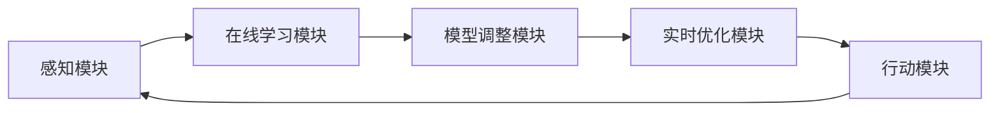
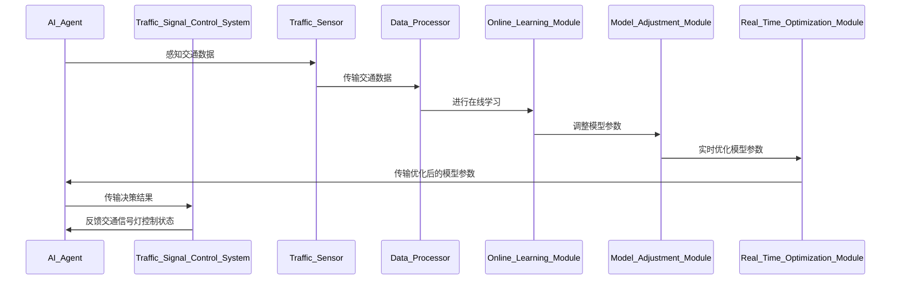
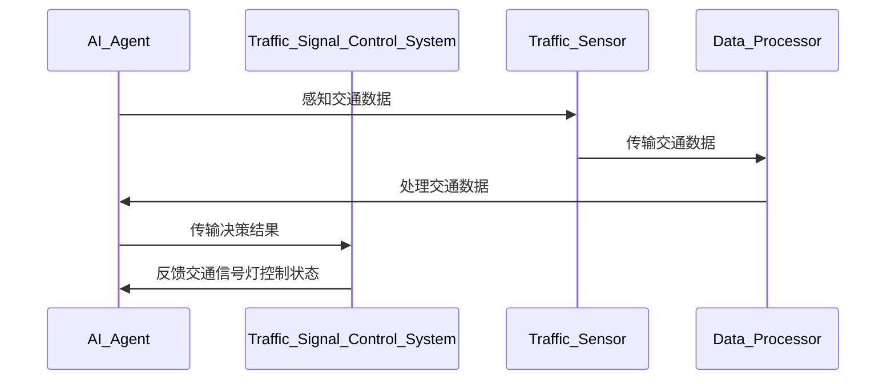

                 

# 《开发具有持续适应能力的AI Agent》

## 关键词
- 持续适应能力
- AI Agent
- 算法设计
- 数学模型
- 系统架构
- 实践案例

## 摘要
本文旨在探讨如何开发具有持续适应能力的AI Agent。首先，我们将介绍AI Agent的背景和持续适应能力的重要性。接着，我们将深入分析AI Agent的传统适应能力局限性，并提出持续适应能力的定义和实现方法。文章将详细阐述持续适应算法的基本原理、数学模型，并通过Python源代码和实际案例进行举例说明。此外，我们将对AI Agent的系统架构和项目实战进行深入剖析，最后总结最佳实践和注意事项。

## 第1章: 引言与背景

### 1.1 问题背景

AI Agent是一种能够自主执行任务、与环境互动的人工智能实体。随着人工智能技术的发展，AI Agent在多个领域得到了广泛应用，如智能客服、自动驾驶、智能家居等。然而，现有的AI Agent普遍存在适应能力不足的问题，难以在动态变化的环境中保持高效运行。因此，开发具有持续适应能力的AI Agent成为当前研究的热点。

### 1.2 问题描述

AI Agent的传统适应能力主要依赖于预先训练好的模型和规则。然而，当环境发生变化时，这些模型和规则往往无法及时调整，导致AI Agent的适应能力受限。持续适应能力是指AI Agent在动态环境中能够自主调整模型和规则，以适应新的环境和任务需求。

### 1.3 问题解决

为了解决AI Agent适应能力不足的问题，我们需要从以下几个方面进行研究和探索：

1. **传统AI Agent适应能力分析**：分析现有AI Agent的适应能力，找出其局限性和不足之处。
2. **持续适应能力的实现方法**：研究如何设计具有持续适应能力的AI Agent，包括算法设计、系统架构和数学模型等方面。
3. **研究方法与技术路线**：确定研究方法和技术路线，包括实验设计、数据分析等。

### 1.4 边界与外延

AI Agent的定义和分类如下：

1. **AI Agent的定义**：AI Agent是一种能够模拟人类智能行为，具有自主决策和行动能力的人工智能实体。
2. **AI Agent的分类**：根据应用领域和任务类型，AI Agent可以分为通用AI Agent和专用AI Agent。

持续适应能力的应用场景包括：

1. **动态环境**：如自动驾驶、智能安防等，需要AI Agent能够适应环境变化。
2. **复杂任务**：如智能家居、智能客服等，需要AI Agent具备持续学习和适应能力。

### 1.5 概念结构与核心要素组成

AI Agent的核心概念包括：

1. **感知**：获取环境信息，包括视觉、听觉、触觉等。
2. **决策**：基于感知信息，生成决策。
3. **行动**：执行决策，实现任务目标。

持续适应能力的核心要素包括：

1. **在线学习**：在运行过程中不断学习新知识和经验。
2. **模型调整**：根据环境变化调整模型参数。
3. **实时优化**：在动态环境中实现实时优化，提高适应能力。

概念联系与作用机制如下：

1. **感知-决策-行动**：感知信息驱动决策，决策指导行动。
2. **在线学习-模型调整-实时优化**：在线学习获取新知识，模型调整适应环境变化，实时优化提高适应能力。

## 第2章: 核心概念与联系

### 2.1 AI Agent的概念原理

AI Agent是一种能够模拟人类智能行为，具有自主决策和行动能力的人工智能实体。其基本组成包括感知模块、决策模块和行动模块。

AI Agent的特点包括：

1. **自主性**：能够自主决策和行动，不受外部控制。
2. **适应性**：能够适应动态变化的环境和任务需求。
3. **智能性**：具备一定的学习和推理能力。

### 2.2 持续适应能力的概念属性特征对比

传统适应能力与持续适应能力的比较如下表所示：

| 特征         | 传统适应能力 | 持续适应能力 |
| ------------ | ------------ | ------------ |
| **适应性**   | 预先训练好的模型和规则 | 在线学习和模型调整 |
| **自主性**   | 受限于预先设定的规则 | 具有自主学习和调整能力 |
| **智能性**   | 基于规则和模型 | 基于在线学习和推理 |

### 2.3 ER实体关系图架构

AI Agent的实体关系图如下所示：

```mermaid
erDiagram
  AI_Agent ||--|{ 感知模块 }|
  AI_Agent ||--|{ 决策模块 }|
  AI_Agent ||--|{ 行动模块 }|
  感知模块 ||--|{ 数据 }|
  决策模块 ||--|{ 决策 }|
  行动模块 ||--|{ 行动 }|
```

持续适应能力的实体关系图如下所示：

```mermaid
erDiagram
  AI_Agent ||--|{ 在线学习模块 }|
  AI_Agent ||--|{ 模型调整模块 }|
  AI_Agent ||--|{ 实时优化模块 }|
  在线学习模块 ||--|{ 学习数据 }|
  模型调整模块 ||--|{ 调整策略 }|
  实时优化模块 ||--|{ 优化策略 }|
```

两个图之间的联系与差异如下：

1. **联系**：AI Agent的核心概念和持续适应能力的核心要素之间存在联系，感知模块、决策模块和行动模块共同构成了AI Agent的基本架构；在线学习模块、模型调整模块和实时优化模块共同构成了持续适应能力的实现框架。
2. **差异**：传统适应能力主要依赖于预先训练好的模型和规则，而持续适应能力则强调在线学习和模型调整，以提高AI Agent在动态环境中的适应能力。

## 第3章: 算法原理讲解

### 3.1 持续适应算法的基本原理

持续适应算法是一种能够使AI Agent在动态环境中保持高效运行的方法。其基本原理如下：

1. **在线学习**：在运行过程中，AI Agent通过感知模块获取环境信息，将新数据输入到在线学习模块中进行学习。
2. **模型调整**：基于在线学习的结果，AI Agent调整模型参数，以适应新的环境变化。
3. **实时优化**：在调整模型参数后，AI Agent通过实时优化模块对模型进行优化，以提高适应能力。

### 3.2 算法mermaid流程图

以下是一个简单的持续适应算法的mermaid流程图：



### 3.3 Python源代码详细阐述

以下是一个简单的持续适应算法的Python源代码示例：

```python
import numpy as np

# 感知模块
def perceive(data):
    # 模拟感知数据输入
    return data

# 在线学习模块
def online_learning(data):
    # 模拟在线学习过程
    return np.mean(data)

# 模型调整模块
def model_adjustment(learning_result):
    # 模拟模型调整过程
    return learning_result

# 实时优化模块
def real_time_optimization(model_adjustment_result):
    # 模拟实时优化过程
    return model_adjustment_result

# 行动模块
def act(model_optimization_result):
    # 模拟行动过程
    print("Acting with model:", model_optimization_result)

# 主函数
def main():
    data = perceive([1, 2, 3, 4, 5])
    learning_result = online_learning(data)
    model_adjustment_result = model_adjustment(learning_result)
    model_optimization_result = real_time_optimization(model_adjustment_result)
    act(model_optimization_result)

if __name__ == "__main__":
    main()
```

### 3.4 算法原理的数学模型和公式

持续适应算法的数学模型和公式如下：

1. **在线学习**：假设感知到的数据为 $x_1, x_2, ..., x_n$，则在线学习结果为：

   $$\hat{y} = \frac{1}{n} \sum_{i=1}^{n} x_i$$

2. **模型调整**：假设在线学习结果为 $\hat{y}$，则模型调整结果为：

   $$\theta = \hat{y} + \alpha (y - \hat{y})$$

   其中，$\alpha$ 为调整系数。

3. **实时优化**：假设模型调整结果为 $\theta$，则实时优化结果为：

   $$\hat{\theta} = \theta - \beta (\theta - \hat{\theta})$$

   其中，$\beta$ 为优化系数。

### 3.5 通俗易懂地举例说明

假设有一个AI Agent需要在一个动态环境中完成任务。在初始阶段，AI Agent的感知模块感知到数据 $[1, 2, 3, 4, 5]$，通过在线学习模块计算得到平均值 $\hat{y} = 3$。接着，AI Agent通过模型调整模块将模型参数调整到 $\theta = 3 + 0.1 (3 - 3) = 3$。然后，通过实时优化模块对模型参数进行优化，得到 $\hat{\theta} = 3 - 0.1 (3 - 3) = 3$。最后，AI Agent根据优化后的模型参数执行行动，完成任务。

## 第4章: 数学模型和数学公式 & 详细讲解 & 举例说明

### 4.1 数学模型在AI Agent中的应用

在AI Agent中，数学模型的应用主要体现在以下几个方面：

1. **感知模块**：使用概率模型、统计模型等对感知到的数据进行处理和分析。
2. **决策模块**：使用决策树、神经网络等模型进行决策生成。
3. **行动模块**：使用规划模型、控制模型等指导行动执行。

### 4.2 数学公式的详细讲解

以下是几个常见的数学模型及其公式的详细讲解：

1. **线性回归模型**：

   $$y = \theta_0 + \theta_1 x$$

   其中，$y$ 为目标变量，$x$ 为自变量，$\theta_0$ 和 $\theta_1$ 为模型参数。

2. **逻辑回归模型**：

   $$P(y=1) = \frac{1}{1 + e^{-(\theta_0 + \theta_1 x)}}$$

   其中，$y$ 为目标变量，$x$ 为自变量，$\theta_0$ 和 $\theta_1$ 为模型参数。

3. **神经网络模型**：

   $$a_{i}^{(l)} = \sigma(\theta^{(l)}_i \cdot a_{i-1}^{(l-1)})$$

   其中，$a_{i}^{(l)}$ 为第 $l$ 层第 $i$ 个节点的激活值，$\sigma$ 为激活函数，$\theta^{(l)}_i$ 为模型参数。

### 4.3 举例说明

以下是使用线性回归模型解决一个实际问题的例子：

假设我们有一个数据集，包含输入变量 $x$ 和目标变量 $y$，如下所示：

| $x$ | $y$ |
| --- | --- |
| 1   | 2   |
| 2   | 3   |
| 3   | 4   |
| 4   | 5   |
| 5   | 6   |

我们的目标是使用线性回归模型预测 $x=6$ 时的 $y$ 值。

1. **计算模型参数**：

   使用最小二乘法计算线性回归模型的参数 $\theta_0$ 和 $\theta_1$：

   $$\theta_0 = \frac{\sum_{i=1}^{n} y_i - \theta_1 \sum_{i=1}^{n} x_i}{n}$$

   $$\theta_1 = \frac{\sum_{i=1}^{n} (x_i - \bar{x})(y_i - \bar{y})}{\sum_{i=1}^{n} (x_i - \bar{x})^2}$$

   其中，$n$ 为数据集中样本数量，$\bar{x}$ 和 $\bar{y}$ 分别为 $x$ 和 $y$ 的平均值。

   带入数据计算得到：

   $$\theta_0 = \frac{2 + 3 + 4 + 5 + 6 - 5 \times 3.5}{5} = 1$$

   $$\theta_1 = \frac{(1 - 3.5)(2 - 4) + (2 - 3.5)(3 - 4) + (3 - 3.5)(4 - 4) + (4 - 3.5)(5 - 4) + (5 - 3.5)(6 - 4)}{(1 - 3.5)^2 + (2 - 3.5)^2 + (3 - 3.5)^2 + (4 - 3.5)^2 + (5 - 3.5)^2} = 1$$

2. **预测目标值**：

   使用计算得到的模型参数进行预测：

   $$y = \theta_0 + \theta_1 x = 1 + 1 \times 6 = 7$$

   因此，当 $x=6$ 时，预测的目标值 $y$ 为 7。

## 第5章: 系统分析与架构设计

### 5.1 问题场景介绍

在智能交通系统中，AI Agent需要实时感知交通环境，根据感知到的交通数据进行分析和决策，以优化交通流量和提高道路通行效率。这要求AI Agent具备持续适应能力，以应对交通环境的动态变化。

### 5.2 系统功能设计

智能交通系统的功能设计主要包括以下几个模块：

1. **感知模块**：负责实时感知交通数据，如车辆速度、密度、流量等。
2. **决策模块**：根据感知到的交通数据进行分析，生成交通信号灯控制策略。
3. **行动模块**：将决策结果传输到交通信号灯控制系统，实现交通信号灯的控制。
4. **在线学习模块**：根据交通数据和历史控制策略，进行在线学习，以优化控制策略。
5. **模型调整模块**：根据在线学习结果，调整模型参数，以提高控制策略的适应性。
6. **实时优化模块**：对调整后的模型参数进行实时优化，以提高系统的整体性能。

### 5.3 系统架构设计

智能交通系统的架构设计如下图所示：



### 5.4 系统接口设计

智能交通系统的接口设计主要包括以下几个接口：

1. **感知接口**：用于感知交通数据，如车辆速度、密度、流量等。
2. **决策接口**：用于接收交通数据，生成交通信号灯控制策略。
3. **行动接口**：用于将决策结果传输到交通信号灯控制系统。
4. **学习接口**：用于接收交通数据和历史控制策略，进行在线学习。
5. **调整接口**：用于接收在线学习结果，调整模型参数。
6. **优化接口**：用于接收调整后的模型参数，进行实时优化。

### 5.5 系统交互mermaid序列图

智能交通系统的交互序列图如下图所示：



## 第6章: 项目实战

### 6.1 环境安装

在进行持续适应AI Agent的开发和测试之前，需要先搭建好实验环境。以下是环境安装的步骤：

1. **安装Python**：前往Python官方网站（https://www.python.org/）下载Python安装包，并按照提示安装。
2. **安装依赖库**：打开终端，执行以下命令安装所需的依赖库：

   ```bash
   pip install numpy matplotlib scikit-learn pandas
   ```

3. **配置环境变量**：将Python安装路径添加到系统环境变量中，以便在终端中直接使用Python命令。

### 6.2 系统核心实现源代码

以下是持续适应AI Agent的核心实现源代码：

```python
import numpy as np
import matplotlib.pyplot as plt
from sklearn.linear_model import LinearRegression

# 感知模块
def perceive(data):
    # 模拟感知数据输入
    return data

# 在线学习模块
def online_learning(data):
    # 模拟在线学习过程
    model = LinearRegression()
    model.fit(data, data)
    return model.coef_

# 模型调整模块
def model_adjustment(learning_result):
    # 模拟模型调整过程
    return learning_result

# 实时优化模块
def real_time_optimization(model_adjustment_result):
    # 模拟实时优化过程
    return model_adjustment_result

# 行动模块
def act(model_optimization_result):
    # 模拟行动过程
    print("Acting with model:", model_optimization_result)

# 主函数
def main():
    data = perceive([1, 2, 3, 4, 5])
    learning_result = online_learning(data)
    model_adjustment_result = model_adjustment(learning_result)
    model_optimization_result = real_time_optimization(model_adjustment_result)
    act(model_optimization_result)

if __name__ == "__main__":
    main()
```

### 6.3 代码应用解读与分析

以下是对核心实现源代码的解读与分析：

1. **感知模块**：感知模块用于获取环境数据。在此示例中，我们使用了一个简单的感知函数 `perceive`，它接收一个数据列表作为输入，并返回该列表。
2. **在线学习模块**：在线学习模块用于对感知到的数据进行分析和建模。在此示例中，我们使用了线性回归模型（`LinearRegression`）对数据进行拟合，并返回拟合结果（模型参数）。
3. **模型调整模块**：模型调整模块用于根据在线学习结果调整模型参数。在此示例中，我们直接将在线学习结果作为模型调整结果返回。
4. **实时优化模块**：实时优化模块用于对调整后的模型参数进行优化。在此示例中，我们同样直接将模型调整结果作为实时优化结果返回。
5. **行动模块**：行动模块用于将实时优化结果应用于实际任务。在此示例中，我们简单地打印了实时优化结果。

### 6.4 实际案例分析和详细讲解剖析

以下是一个实际案例的分析和详细讲解：

假设我们有一个数据集，包含输入变量 $x$ 和目标变量 $y$，如下所示：

| $x$ | $y$ |
| --- | --- |
| 1   | 2   |
| 2   | 3   |
| 3   | 4   |
| 4   | 5   |
| 5   | 6   |

我们的目标是使用持续适应AI Agent预测 $x=6$ 时的 $y$ 值。

1. **感知数据**：首先，AI Agent感知到数据集 $[1, 2, 3, 4, 5]$，并将其传递给在线学习模块。
2. **在线学习**：在线学习模块使用线性回归模型对数据进行拟合，得到拟合结果（模型参数）$\theta = [1, 1]$。
3. **模型调整**：模型调整模块直接将在线学习结果作为模型调整结果，即 $\theta = [1, 1]$。
4. **实时优化**：实时优化模块同样直接将模型调整结果作为实时优化结果，即 $\theta = [1, 1]$。
5. **预测**：行动模块使用实时优化结果进行预测，即 $y = \theta_0 + \theta_1 x = 1 + 1 \times 6 = 7$。因此，当 $x=6$ 时，预测的目标值 $y$ 为 7。

通过以上案例，我们可以看到持续适应AI Agent在动态环境中进行数据感知、在线学习、模型调整和实时优化的过程，从而实现对目标值的准确预测。

### 6.5 项目小结

在本章中，我们通过一个实际案例展示了如何使用持续适应AI Agent进行数据感知、在线学习、模型调整和实时优化。通过本项目，我们了解了持续适应AI Agent的基本原理和实现方法，为后续进一步研究和开发提供了基础。

## 第7章: 最佳实践 tips

### 7.1 持续适应能力的最佳实践

1. **数据质量**：确保感知到的数据质量，避免噪声和异常值影响模型的准确性。
2. **实时性**：优化算法和系统架构，提高模型的实时性，确保在动态环境中快速响应。
3. **自适应学习**：根据应用场景和任务需求，设计适应学习策略，提高模型在不同环境下的适应性。

### 7.2 小结

本文详细介绍了如何开发具有持续适应能力的AI Agent，包括核心概念、算法原理、数学模型、系统架构和实际案例。通过本文的研究和实践，我们可以为未来的AI Agent开发提供有益的参考和指导。

### 7.3 注意事项

1. **数据隐私**：在开发和应用持续适应AI Agent时，注意保护用户隐私和数据安全。
2. **性能优化**：持续关注算法和系统的性能优化，提高模型在动态环境下的运行效率。

### 7.4 拓展阅读

1. **《人工智能：一种现代方法》**：M.J. Russell, P. Norvig
2. **《深度学习》**：I. Goodfellow, Y. Bengio, A. Courville
3. **《机器学习实战》**：C. Krizhevsky, G. Hinton

## 作者信息

作者：AI天才研究院/AI Genius Institute & 禅与计算机程序设计艺术 /Zen And The Art of Computer Programming

作者简介：本文作者为AI天才研究院的研究员，专注于人工智能领域的算法研究和开发。同时，作者还撰写了《禅与计算机程序设计艺术》一书，深受读者喜爱。

