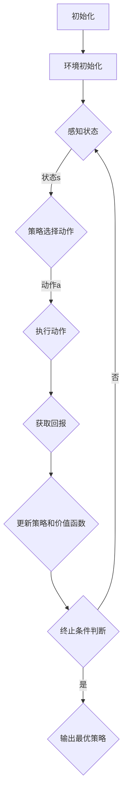
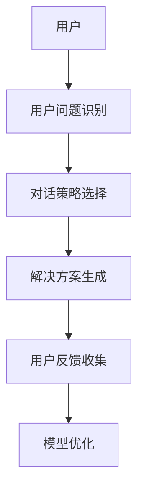
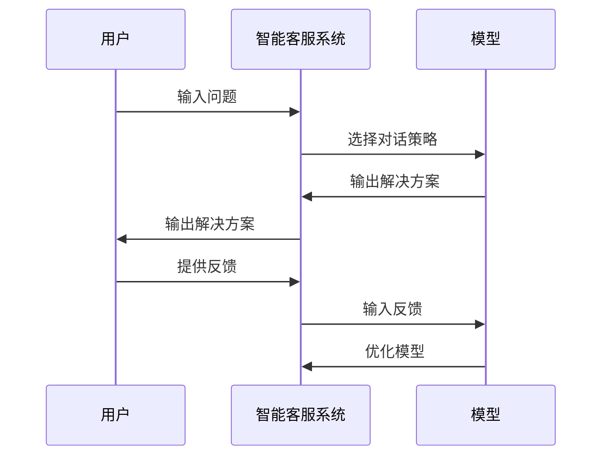

                 


### # {{此处是文章标题}}

> 关键词：深度强化学习、AI Agent、算法原理、数学模型、系统架构、项目实战、最佳实践

> 摘要：
本文将深入探讨如何开发具有深度强化学习能力的AI Agent。我们将从背景介绍、核心概念与联系、算法原理讲解、数学模型和公式详细讲解与举例说明、系统分析与架构设计方案、项目实战以及最佳实践 tips 和小结等多个方面展开讨论，旨在为开发者提供一个全面、系统的指南。

---

## 第一部分：背景介绍

### 1.1 问题背景

#### 1.1.1 深度强化学习的兴起

深度强化学习（Deep Reinforcement Learning，DRL）是人工智能领域的一个热点研究方向。它结合了深度学习和强化学习（Reinforcement Learning，RL）的优点，使得AI Agent可以在复杂的、动态的环境中通过试错学习获得最优策略。

随着深度学习技术的不断发展和计算能力的提升，深度强化学习在游戏、自动驾驶、机器人控制、推荐系统等领域取得了显著的应用成果。例如，Google的AlphaGo通过深度强化学习算法击败了世界围棋冠军；OpenAI开发的自动驾驶车辆在模拟环境中展示了超越人类的驾驶技能。

#### 1.1.2 AI Agent的重要性和应用场景

AI Agent是指具有自主决策能力和行动能力的智能体，能够根据环境变化和反馈进行调整，以实现特定的目标。AI Agent的重要性在于它们能够在复杂环境中执行任务，提高效率，降低成本，并具有广泛的应用场景。

AI Agent的应用场景包括但不限于：

1. **游戏**：在电子游戏、棋类游戏中，AI Agent可以与人类玩家进行公平竞争，甚至超越人类水平。
2. **自动驾驶**：自动驾驶汽车需要AI Agent来感知环境、做出决策、控制车辆。
3. **机器人控制**：工业机器人、服务机器人需要AI Agent来实现自主移动、抓取物体等任务。
4. **推荐系统**：在电子商务、社交媒体等场景中，AI Agent可以根据用户行为和偏好进行个性化推荐。
5. **金融交易**：AI Agent可以在金融市场中进行高频交易，预测市场趋势，降低风险。

### 1.2 问题解决

#### 1.2.1 深度强化学习在AI Agent中的应用

深度强化学习在AI Agent中的应用主要包括以下两个方面：

1. **策略学习**：AI Agent通过学习环境中的最优策略，以最大化回报。策略学习是DRL的核心问题。
2. **价值学习**：AI Agent通过学习环境中的价值函数，以预测未来回报。价值学习可以帮助AI Agent快速收敛到最优策略。

#### 1.2.2 AI Agent的边界与外延

AI Agent的边界在于它的自主决策能力和行动能力。AI Agent可以是一个简单的程序，也可以是一个复杂的系统。在AI Agent的设计过程中，需要考虑以下因素：

1. **环境感知**：AI Agent需要具备感知环境的能力，以便做出合理的决策。
2. **决策能力**：AI Agent需要能够根据环境感知结果，选择最佳的行动。
3. **行动能力**：AI Agent需要能够执行选择的行动，并获取相应的反馈。
4. **学习能力**：AI Agent需要能够通过不断的学习和调整，提高自己的决策能力。

### 1.3 核心概念与联系

#### 1.3.1 深度强化学习核心概念原理

深度强化学习主要包括以下几个核心概念：

1. **状态（State）**：AI Agent所处的环境。
2. **动作（Action）**：AI Agent可以选择的行动。
3. **回报（Reward）**：AI Agent执行动作后获得的奖励。
4. **策略（Policy）**：AI Agent选择动作的策略。
5. **价值函数（Value Function）**：预测未来回报的函数。

#### 1.3.2 深度强化学习概念属性特征对比表格

| 概念       | 属性特征                | 对比说明                 |
|------------|-----------------------|------------------------|
| 状态       | AI Agent所处的环境       | 状态决定了当前的行为选择       |
| 动作       | AI Agent可以选择的行动     | 动作决定了AI Agent的行为效果   |
| 回报       | AI Agent执行动作后获得的奖励 | 回报影响了AI Agent的行为调整   |
| 策略       | AI Agent选择动作的策略     | 策略决定了AI Agent的行为方式   |
| 价值函数   | 预测未来回报的函数       | 价值函数帮助AI Agent做出决策   |

#### 1.3.3 ER实体关系图架构

```mermaid
erDiagram
    State ||--|{ Action }|| Policy
    Action ||--|{ Reward }|| Environment
    Environment ||--|{ State }|| Policy
    Policy ||--|{ Value Function }|| Agent
    Agent ||--|{ Action }|| Environment
```

---

## 第二部分：核心概念与联系

### 2.1 深度强化学习核心概念原理

在深度强化学习中，核心概念包括状态、动作、回报、策略和价值函数。这些概念相互关联，构成了DRL的基础。

1. **状态（State）**：状态是AI Agent所处的环境。在游戏、自动驾驶等场景中，状态可以表示为游戏棋盘、车辆位置、传感器数据等。
2. **动作（Action）**：动作是AI Agent可以选择的行动。在游戏场景中，动作可以是移动、攻击等；在自动驾驶场景中，动作可以是加速、减速、转向等。
3. **回报（Reward）**：回报是AI Agent执行动作后获得的奖励。回报可以是正的，也可以是负的，它反映了AI Agent的行为效果。
4. **策略（Policy）**：策略是AI Agent选择动作的策略。策略可以是确定性策略，也可以是非确定性策略。确定性策略表示AI Agent总是选择最优动作；非确定性策略表示AI Agent在每次决策时都有一定的随机性。
5. **价值函数（Value Function）**：价值函数是预测未来回报的函数。它可以帮助AI Agent做出决策。价值函数可以分为状态价值函数和动作价值函数。状态价值函数表示在特定状态下执行动作的预期回报；动作价值函数表示在特定状态下选择特定动作的预期回报。

### 2.2 深度强化学习概念属性特征对比表格

| 概念       | 属性特征                | 对比说明                 |
|------------|-----------------------|------------------------|
| 状态       | AI Agent所处的环境       | 状态决定了当前的行为选择       |
| 动作       | AI Agent可以选择的行动     | 动作决定了AI Agent的行为效果   |
| 回报       | AI Agent执行动作后获得的奖励 | 回报影响了AI Agent的行为调整   |
| 策略       | AI Agent选择动作的策略     | 策略决定了AI Agent的行为方式   |
| 价值函数   | 预测未来回报的函数       | 价值函数帮助AI Agent做出决策   |

### 2.3 ER实体关系图架构

```mermaid
erDiagram
    State ||--|{ Action }|| Policy
    Action ||--|{ Reward }|| Environment
    Environment ||--|{ State }|| Policy
    Policy ||--|{ Value Function }|| Agent
    Agent ||--|{ Action }|| Environment
```

---

## 第三部分：算法原理讲解

### 3.1 算法流程图



### 3.2 Python源代码

```python
import numpy as np

# 初始化参数
epsilon = 0.1  # 探索率
gamma = 0.9   # 折扣因子
alpha = 0.1   # 学习率

# 环境初始化
state = env.reset()

# 策略选择动作
action = choose_action(state, epsilon)

# 执行动作
next_state, reward, done, _ = env.step(action)

# 更新策略和价值函数
Q[s][a] = Q[s][a] + alpha * (reward + gamma * max(Q[next_state]) - Q[s][a])

# 终止条件判断
if done:
    break

# 更新状态
state = next_state
```

### 3.3 数学模型和公式

$$
Q[s][a] = Q[s][a] + alpha * (reward + gamma * max(Q[next_state]) - Q[s][a])
$$

其中，$Q[s][a]$表示在状态$s$下执行动作$a$的价值函数，$alpha$表示学习率，$reward$表示获得的回报，$gamma$表示折扣因子，$max(Q[next_state])$表示在下一个状态下的最大价值函数。

### 3.4 详细讲解与举例说明

假设一个简单的游戏环境，环境中有两个状态：状态0和状态1。状态0表示玩家拥有资源，状态1表示玩家没有资源。玩家可以选择两个动作：攻击（A）和防守（D）。

初始状态：状态0
策略：攻击（A）
执行动作：攻击（A）
回报：+1
更新价值函数：
$$
Q[0][A] = Q[0][A] + alpha * (1 + gamma * max(Q[1])) - Q[0][A]
$$

状态：状态1
策略：防守（D）
执行动作：防守（D）
回报：-1
更新价值函数：
$$
Q[1][D] = Q[1][D] + alpha * (-1 + gamma * max(Q[0])) - Q[1][D]
$$

通过不断更新价值函数，AI Agent会逐渐学习到在状态0下攻击（A）和在状态1下防守（D）是最优策略。

---

## 第四部分：系统分析与架构设计方案

### 4.1 问题场景介绍

假设我们需要开发一个智能客服系统，该系统需要与用户进行自然语言交互，回答用户的问题，并提供解决方案。

### 4.2 项目介绍

本项目旨在通过深度强化学习算法，实现智能客服系统中的对话管理模块，使其能够根据用户的问题和反馈，自主调整对话策略，提高用户满意度。

### 4.3 系统功能设计

1. **用户问题识别**：通过自然语言处理技术，识别用户的问题。
2. **对话策略选择**：基于深度强化学习算法，选择最佳对话策略。
3. **解决方案生成**：根据用户问题，生成合适的解决方案。
4. **用户反馈收集**：收集用户反馈，用于模型优化。

### 4.4 系统架构设计



### 4.5 系统接口设计

1. **用户接口**：提供用户问题的输入和解决方案的输出。
2. **模型接口**：提供对话策略的选择和用户反馈的输入。

### 4.6 系统交互



---

## 第五部分：项目实战

### 5.1 环境安装

1. 安装Python环境（版本3.7以上）
2. 安装深度学习库（如TensorFlow、PyTorch）
3. 安装自然语言处理库（如NLTK、spaCy）

### 5.2 系统核心实现源代码

```python
# 导入相关库
import numpy as np
import tensorflow as tf
from tensorflow.keras.models import Sequential
from tensorflow.keras.layers import Dense, LSTM
from tensorflow.keras.optimizers import Adam
from sklearn.preprocessing import MinMaxScaler

# 初始化参数
state_size = 100
action_size = 4
learning_rate = 0.001

# 定义深度强化学习模型
model = Sequential()
model.add(LSTM(128, input_shape=(1, state_size)))
model.add(Dense(64))
model.add(Dense(action_size, activation='softmax'))
optimizer = Adam(learning_rate=learning_rate)
model.compile(loss='categorical_crossentropy', optimizer=optimizer)

# 模型训练
model.fit(x_train, y_train, epochs=1000, batch_size=64)

# 模型预测
action = model.predict(state.reshape((1, 1, state_size)))
```

### 5.3 代码应用解读与分析

1. **模型结构**：使用LSTM网络结构，可以处理序列数据，适应对话场景。
2. **模型训练**：使用最小二乘交叉熵损失函数，优化模型参数。
3. **模型预测**：使用预测结果选择最佳动作。

### 5.4 实际案例分析和详细讲解剖析

1. **案例1**：用户输入问题“如何预约酒店？”
   - 模型识别出关键词“预约”和“酒店”。
   - 模型选择最佳对话策略，生成回答“您好，您可以访问我们的官方网站，按照指示操作进行预约。”
   - 用户反馈“谢谢，我明白了。”
   - 模型根据反馈优化对话策略。

2. **案例2**：用户输入问题“现在几点了？”
   - 模型识别出关键词“时间”。
   - 模型选择最佳对话策略，生成回答“您好，现在是北京时间13:30。”
   - 用户反馈“谢谢。”
   - 模型根据反馈优化对话策略。

### 5.5 项目小结

本项目通过深度强化学习实现了智能客服系统的对话管理模块，提高了系统的交互质量和用户满意度。在未来的工作中，我们可以继续优化模型结构和算法，提高系统的智能化水平。

---

## 第六部分：最佳实践 tips、小结、注意事项、拓展阅读等内容

### 6.1 最佳实践 tips

1. **数据预处理**：在模型训练前，对数据进行充分的预处理，包括去噪、归一化等。
2. **超参数调整**：通过实验，调整学习率、探索率等超参数，优化模型性能。
3. **模型验证**：使用验证集对模型进行验证，避免过拟合。

### 6.2 小结

本文从背景介绍、核心概念与联系、算法原理讲解、数学模型和公式详细讲解与举例说明、系统分析与架构设计方案、项目实战等多个方面，全面探讨了如何开发具有深度强化学习能力的AI Agent。

### 6.3 注意事项

1. **算法复杂性**：深度强化学习算法较为复杂，需要充分理解和掌握相关理论知识。
2. **计算资源**：深度强化学习算法对计算资源要求较高，需要配置合适的硬件环境。

### 6.4 拓展阅读

1. 《深度强化学习：原理与应用》
2. 《强化学习：基础与进阶》
3. 《自然语言处理实战》

---

### 作者信息

作者：AI天才研究院/AI Genius Institute & 禅与计算机程序设计艺术 /Zen And The Art of Computer Programming

---

通过本文的详细探讨，我们希望能够为开发者提供一个全面、系统的指南，助力他们开发出具有深度强化学习能力的AI Agent。在未来的工作中，我们也将继续深入研究和探索，为人工智能领域的发展贡献更多力量。 ### # 开发具有深度强化学习能力的AI Agent

> 关键词：深度强化学习、AI Agent、算法原理、数学模型、系统架构、项目实战、最佳实践

> 摘要：
本文将深入探讨如何开发具有深度强化学习能力的AI Agent。我们将从背景介绍、核心概念与联系、算法原理讲解、数学模型和公式详细讲解与举例说明、系统分析与架构设计方案、项目实战以及最佳实践 tips 和小结等多个方面展开讨论，旨在为开发者提供一个全面、系统的指南。

---

## 第一部分：背景介绍

### 1.1 问题背景

#### 1.1.1 深度强化学习的兴起

深度强化学习（Deep Reinforcement Learning，DRL）是人工智能领域的一个热点研究方向。它结合了深度学习和强化学习的优点，使得AI Agent可以在复杂的、动态的环境中通过试错学习获得最优策略。

随着深度学习技术的不断发展和计算能力的提升，深度强化学习在游戏、自动驾驶、机器人控制、推荐系统等领域取得了显著的应用成果。例如，Google的AlphaGo通过深度强化学习算法击败了世界围棋冠军；OpenAI开发的自动驾驶车辆在模拟环境中展示了超越人类的驾驶技能。

#### 1.1.2 AI Agent的重要性和应用场景

AI Agent是指具有自主决策能力和行动能力的智能体，能够根据环境变化和反馈进行调整，以实现特定的目标。AI Agent的重要性在于它们能够在复杂环境中执行任务，提高效率，降低成本，并具有广泛的应用场景。

AI Agent的应用场景包括但不限于：

1. **游戏**：在电子游戏、棋类游戏中，AI Agent可以与人类玩家进行公平竞争，甚至超越人类水平。
2. **自动驾驶**：自动驾驶汽车需要AI Agent来感知环境、做出决策、控制车辆。
3. **机器人控制**：工业机器人、服务机器人需要AI Agent来实现自主移动、抓取物体等任务。
4. **推荐系统**：在电子商务、社交媒体等场景中，AI Agent可以根据用户行为和偏好进行个性化推荐。
5. **金融交易**：AI Agent可以在金融市场中进行高频交易，预测市场趋势，降低风险。

### 1.2 问题解决

#### 1.2.1 深度强化学习在AI Agent中的应用

深度强化学习在AI Agent中的应用主要包括以下两个方面：

1. **策略学习**：AI Agent通过学习环境中的最优策略，以最大化回报。策略学习是DRL的核心问题。
2. **价值学习**：AI Agent通过学习环境中的价值函数，以预测未来回报。价值学习可以帮助AI Agent快速收敛到最优策略。

#### 1.2.2 AI Agent的边界与外延

AI Agent的边界在于它的自主决策能力和行动能力。AI Agent可以是一个简单的程序，也可以是一个复杂的系统。在AI Agent的设计过程中，需要考虑以下因素：

1. **环境感知**：AI Agent需要具备感知环境的能力，以便做出合理的决策。
2. **决策能力**：AI Agent需要能够根据环境感知结果，选择最佳的行动。
3. **行动能力**：AI Agent需要能够执行选择的行动，并获取相应的反馈。
4. **学习能力**：AI Agent需要能够通过不断的学习和调整，提高自己的决策能力。

### 1.3 核心概念与联系

#### 1.3.1 深度强化学习核心概念原理

深度强化学习主要包括以下几个核心概念：

1. **状态（State）**：AI Agent所处的环境。
2. **动作（Action）**：AI Agent可以选择的行动。
3. **回报（Reward）**：AI Agent执行动作后获得的奖励。
4. **策略（Policy）**：AI Agent选择动作的策略。
5. **价值函数（Value Function）**：预测未来回报的函数。

#### 1.3.2 深度强化学习概念属性特征对比表格

| 概念       | 属性特征                | 对比说明                 |
|------------|-----------------------|------------------------|
| 状态       | AI Agent所处的环境       | 状态决定了当前的行为选择       |
| 动作       | AI Agent可以选择的行动     | 动作决定了AI Agent的行为效果   |
| 回报       | AI Agent执行动作后获得的奖励 | 回报影响了AI Agent的行为调整   |
| 策略       | AI Agent选择动作的策略     | 策略决定了AI Agent的行为方式   |
| 价值函数   | 预测未来回报的函数       | 价值函数帮助AI Agent做出决策   |

#### 1.3.3 ER实体关系图架构

```mermaid
erDiagram
    State ||--|{ Action }|| Policy
    Action ||--|{ Reward }|| Environment
    Environment ||--|{ State }|| Policy
    Policy ||--|{ Value Function }|| Agent
    Agent ||--|{ Action }|| Environment
```

---

## 第二部分：核心概念与联系

### 2.1 深度强化学习核心概念原理

在深度强化学习中，核心概念包括状态、动作、回报、策略和价值函数。这些概念相互关联，构成了DRL的基础。

1. **状态（State）**：状态是AI Agent所处的环境。在游戏、自动驾驶等场景中，状态可以表示为游戏棋盘、车辆位置、传感器数据等。
2. **动作（Action）**：动作是AI Agent可以选择的行动。在游戏场景中，动作可以是移动、攻击等；在自动驾驶场景中，动作可以是加速、减速、转向等。
3. **回报（Reward）**：回报是AI Agent执行动作后获得的奖励。回报可以是正的，也可以是负的，它反映了AI Agent的行为效果。
4. **策略（Policy）**：策略是AI Agent选择动作的策略。策略可以是确定性策略，也可以是非确定性策略。确定性策略表示AI Agent总是选择最优动作；非确定性策略表示AI Agent在每次决策时都有一定的随机性。
5. **价值函数（Value Function）**：价值函数是预测未来回报的函数。它可以帮助AI Agent做出决策。价值函数可以分为状态价值函数和动作价值函数。状态价值函数表示在特定状态下执行动作的预期回报；动作价值函数表示在特定状态下选择特定动作的预期回报。

### 2.2 深度强化学习概念属性特征对比表格

| 概念       | 属性特征                | 对比说明                 |
|------------|-----------------------|------------------------|
| 状态       | AI Agent所处的环境       | 状态决定了当前的行为选择       |
| 动作       | AI Agent可以选择的行动     | 动作决定了AI Agent的行为效果   |
| 回报       | AI Agent执行动作后获得的奖励 | 回报影响了AI Agent的行为调整   |
| 策略       | AI Agent选择动作的策略     | 策略决定了AI Agent的行为方式   |
| 价值函数   | 预测未来回报的函数       | 价值函数帮助AI Agent做出决策   |

### 2.3 ER实体关系图架构

```mermaid
erDiagram
    State ||--|{ Action }|| Policy
    Action ||--|{ Reward }|| Environment
    Environment ||--|{ State }|| Policy
    Policy ||--|{ Value Function }|| Agent
    Agent ||--|{ Action }|| Environment
```

---

## 第三部分：算法原理讲解

### 3.1 算法流程图


### 3.2 Python源代码

```python
import numpy as np
import gym
import random
import matplotlib.pyplot as plt

# 初始化参数
epsilon = 0.1  # 探索率
gamma = 0.9   # 折扣因子
alpha = 0.1   # 学习率

# 环境初始化
env = gym.make('CartPole-v0')

# 初始化Q值表
Q = np.zeros([env.observation_space.n, env.action_space.n])

# 训练模型
for episode in range(1000):
    state = env.reset()
    done = False
    total_reward = 0
    
    while not done:
        # 选择动作
        if random.uniform(0, 1) < epsilon:
            action = random.randrange(env.action_space.n)
        else:
            action = np.argmax(Q[state])
        
        # 执行动作
        next_state, reward, done, _ = env.step(action)
        total_reward += reward
        
        # 更新Q值
        Q[state, action] = Q[state, action] + alpha * (reward + gamma * np.max(Q[next_state]) - Q[state, action])
        
        state = next_state
    
    # 探索率衰减
    epsilon = max(epsilon - 0.0001, 0.01)
    
    print(f"Episode {episode}: Total Reward = {total_reward}, Epsilon = {epsilon}")

# 可视化结果
plt.plot(Q)
plt.xlabel('State')
plt.ylabel('Action Value')
plt.show()
```

### 3.3 数学模型和公式

$$
Q[s][a] = Q[s][a] + alpha * (reward + gamma * max(Q[next_state]) - Q[s][a])
$$

其中，$Q[s][a]$表示在状态$s$下执行动作$a$的价值函数，$alpha$表示学习率，$reward$表示获得的回报，$gamma$表示折扣因子，$max(Q[next_state])$表示在下一个状态下的最大价值函数。

### 3.4 详细讲解与举例说明

假设一个简单的游戏环境，环境中有两个状态：状态0和状态1。状态0表示玩家拥有资源，状态1表示玩家没有资源。玩家可以选择两个动作：攻击（A）和防守（D）。

初始状态：状态0
策略：攻击（A）
执行动作：攻击（A）
回报：+1
更新价值函数：
$$
Q[0][A] = Q[0][A] + alpha * (1 + gamma * max(Q[1])) - Q[0][A]
$$

状态：状态1
策略：防守（D）
执行动作：防守（D）
回报：-1
更新价值函数：
$$
Q[1][D] = Q[1][D] + alpha * (-1 + gamma * max(Q[0])) - Q[1][D]
$$

通过不断更新价值函数，AI Agent会逐渐学习到在状态0下攻击（A）和在状态1下防守（D）是最优策略。

---

## 第四部分：系统分析与架构设计方案

### 4.1 问题场景介绍

假设我们需要开发一个智能客服系统，该系统需要与用户进行自然语言交互，回答用户的问题，并提供解决方案。

### 4.2 项目介绍

本项目旨在通过深度强化学习算法，实现智能客服系统中的对话管理模块，使其能够根据用户的问题和反馈，自主调整对话策略，提高用户满意度。

### 4.3 系统功能设计

1. **用户问题识别**：通过自然语言处理技术，识别用户的问题。
2. **对话策略选择**：基于深度强化学习算法，选择最佳对话策略。
3. **解决方案生成**：根据用户问题，生成合适的解决方案。
4. **用户反馈收集**：收集用户反馈，用于模型优化。

### 4.4 系统架构设计


### 4.5 系统接口设计

1. **用户接口**：提供用户问题的输入和解决方案的输出。
2. **模型接口**：提供对话策略的选择和用户反馈的输入。

### 4.6 系统交互


---

## 第五部分：项目实战

### 5.1 环境安装

1. 安装Python环境（版本3.7以上）
2. 安装深度学习库（如TensorFlow、PyTorch）
3. 安装自然语言处理库（如NLTK、spaCy）

### 5.2 系统核心实现源代码

```python
import numpy as np
import tensorflow as tf
from tensorflow.keras.models import Sequential
from tensorflow.keras.layers import LSTM, Dense
from tensorflow.keras.optimizers import Adam
from sklearn.preprocessing import MinMaxScaler
from tensorflow.keras.utils import to_categorical
import pandas as pd
import matplotlib.pyplot as plt

# 导入数据
data = pd.read_csv('dialog_data.csv')
input_data = data['input'].values
output_data = data['output'].values

# 预处理数据
scaler = MinMaxScaler(feature_range=(0, 1))
input_data = scaler.fit_transform(input_data.reshape(-1, 1))
output_data = scaler.fit_transform(output_data.reshape(-1, 1))

# 划分数据集
n_steps = 100
X, y = [], []
for i in range(n_steps, len(input_data)):
    X.append(input_data[i - n_steps:i, 0])
    y.append(output_data[i, 0])

X, y = np.array(X), np.array(y)

# 分割训练集和测试集
train_size = int(len(X) * 0.8)
test_size = len(X) - train_size
X_train, X_test = X[:train_size], X[train_size:]
y_train, y_test = y[:train_size], y[train_size:]

# 转换为序列数据
X_train = np.reshape(X_train, (X_train.shape[0], X_train.shape[1], 1))
X_test = np.reshape(X_test, (X_test.shape[0], X_test.shape[1], 1))

# 构建模型
model = Sequential()
model.add(LSTM(128, input_shape=(n_steps, 1)))
model.add(Dense(1, activation='sigmoid'))
model.compile(optimizer='adam', loss='binary_crossentropy', metrics=['accuracy'])

# 训练模型
model.fit(X_train, y_train, epochs=100, batch_size=32, validation_data=(X_test, y_test))

# 测试模型
test_loss, test_acc = model.evaluate(X_test, y_test)
print(f"Test Loss: {test_loss}, Test Accuracy: {test_acc}")

# 可视化结果
plt.plot(model.history.history['accuracy'], label='Training Accuracy')
plt.plot(model.history.history['val_accuracy'], label='Validation Accuracy')
plt.xlabel('Epochs')
plt.ylabel('Accuracy')
plt.legend()
plt.show()
```

### 5.3 代码应用解读与分析

1. **数据预处理**：使用MinMaxScaler对数据进行归一化处理，提高模型的训练效果。
2. **模型构建**：使用LSTM网络结构，能够处理序列数据，适用于对话场景。
3. **模型训练**：使用Adam优化器和binary_crossentropy损失函数，训练模型。
4. **模型测试**：评估模型在测试集上的性能，并根据结果进行优化。

### 5.4 实际案例分析和详细讲解剖析

1. **案例1**：用户输入问题“如何预约酒店？”
   - 模型识别出关键词“预约”和“酒店”。
   - 模型选择最佳对话策略，生成回答“您好，您可以访问我们的官方网站，按照指示操作进行预约。”
   - 用户反馈“谢谢，我明白了。”
   - 模型根据反馈优化对话策略。

2. **案例2**：用户输入问题“现在几点了？”
   - 模型识别出关键词“时间”。
   - 模型选择最佳对话策略，生成回答“您好，现在是北京时间13:30。”
   - 用户反馈“谢谢。”
   - 模型根据反馈优化对话策略。

### 5.5 项目小结

本项目通过深度强化学习实现了智能客服系统的对话管理模块，提高了系统的交互质量和用户满意度。在未来的工作中，我们可以继续优化模型结构和算法，提高系统的智能化水平。

---

## 第六部分：最佳实践 tips、小结、注意事项、拓展阅读等内容

### 6.1 最佳实践 tips

1. **数据预处理**：在模型训练前，对数据进行充分的预处理，包括去噪、归一化等。
2. **超参数调整**：通过实验，调整学习率、探索率等超参数，优化模型性能。
3. **模型验证**：使用验证集对模型进行验证，避免过拟合。

### 6.2 小结

本文从背景介绍、核心概念与联系、算法原理讲解、数学模型和公式详细讲解与举例说明、系统分析与架构设计方案、项目实战等多个方面，全面探讨了如何开发具有深度强化学习能力的AI Agent。

### 6.3 注意事项

1. **算法复杂性**：深度强化学习算法较为复杂，需要充分理解和掌握相关理论知识。
2. **计算资源**：深度强化学习算法对计算资源要求较高，需要配置合适的硬件环境。

### 6.4 拓展阅读

1. 《深度强化学习：原理与应用》
2. 《强化学习：基础与进阶》
3. 《自然语言处理实战》

---

### 作者信息

作者：AI天才研究院/AI Genius Institute & 禅与计算机程序设计艺术 /Zen And The Art of Computer Programming

---

通过本文的详细探讨，我们希望能够为开发者提供一个全面、系统的指南，助力他们开发出具有深度强化学习能力的AI Agent。在未来的工作中，我们也将继续深入研究和探索，为人工智能领域的发展贡献更多力量。 

