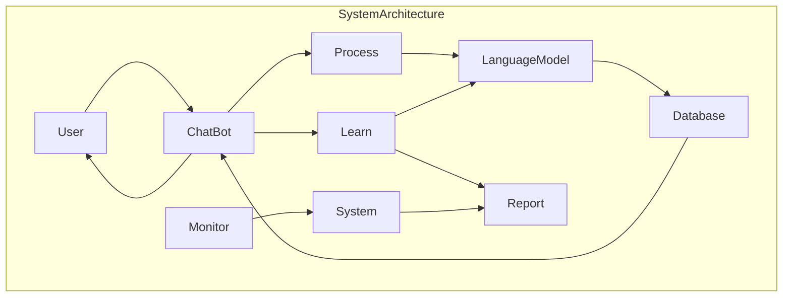
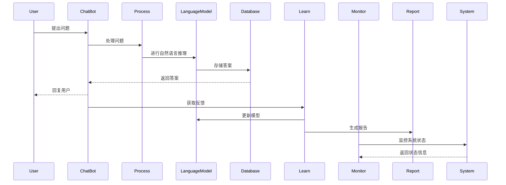

                 

### 设计《开发具有自然语言推理能力的AI Agent》的目录大纲

为了设计一篇结构严谨、逻辑清晰且内容丰富的技术博客文章，我们将遵循以下步骤，逐步构建文章的目录大纲：

#### 第一步：确定书的核心内容

首先，我们需要明确本书的核心内容，围绕自然语言处理（NLP）与人工智能（AI）结合的主题，特别是自然语言推理（NLR）的算法和应用开发。本书将分为以下五个部分：

1. **背景介绍与核心概念**：介绍自然语言处理、自然语言推理以及AI Agent的基础知识。
2. **自然语言推理算法原理**：详细讲解自然语言推理的基础、进阶和高级算法原理。
3. **系统分析与架构设计**：分析系统需求，设计系统架构，包括功能设计、架构图和接口设计。
4. **项目实战与代码解读**：通过实战案例展示如何实现具有自然语言推理能力的AI Agent。
5. **最佳实践与拓展阅读**：总结经验，给出注意事项，展望未来发展趋势，推荐拓展阅读。

#### 第二步：设置总体结构

接下来，我们将全书分为五个部分，每一部分都有明确的主题和目标：

1. **背景介绍与核心概念**：这部分将帮助读者建立对自然语言处理、自然语言推理以及AI Agent的基本了解。
2. **自然语言推理算法原理**：这部分将逐步深入，从基础算法到高级算法，帮助读者掌握NLP和NLR的核心算法。
3. **系统分析与架构设计**：这部分将介绍如何分析和设计一个具有自然语言推理能力的系统，包括功能、架构和接口设计。
4. **项目实战与代码解读**：这部分将通过实际项目案例，展示如何将理论知识应用于实践，并提供代码解读。
5. **最佳实践与拓展阅读**：这部分将总结最佳实践经验，提出注意事项，并引导读者进行进一步学习。

#### 第三步：设计具体章节内容

现在，我们将为每一部分设计具体的章节内容：

### 第一部分：背景介绍与核心概念

**第1章 自然语言推理背景介绍**
- **1.1 自然语言处理概述**
- **1.2 自然语言推理的挑战与意义**
- **1.3 AI Agent简介**
- **1.4 NLP与AI Agent的关系**

**第2章 核心概念与原理**
- **2.1 核心概念定义**
- **2.2 概念属性特征对比表格**
- **2.3 ER实体关系图架构**

### 第二部分：自然语言推理算法原理

**第3章 基础算法原理**
- **3.1 词向量与词嵌入**
- **3.2 递归神经网络（RNN）**
- **3.3 卷积神经网络（CNN）**

**第4章 进阶算法原理**
- **4.1 生成对抗网络（GAN）**
- **4.2 注意力机制**
- **4.3 Transformer与BERT**

**第5章 高级算法原理**
- **5.1 自适应算法**
- **5.2 强化学习**
- **5.3 多模态融合**

### 第三部分：系统分析与架构设计

**第6章 系统分析与设计**
- **6.1 问题场景介绍**
- **6.2 系统功能设计（领域模型类图）**
- **6.3 系统架构设计（架构图）**
- **6.4 系统接口设计和交互（序列图）**

### 第四部分：项目实战与代码解读

**第7章 项目实战**
- **7.1 环境安装与配置**
- **7.2 系统核心实现与源代码**
- **7.3 代码应用解读与分析**
- **7.4 实际案例分析与讲解**

**第8章 项目实战剖析**
- **8.1 项目总结**
- **8.2 最佳实践**
- **8.3 注意事项**
- **8.4 拓展阅读**

### 第五部分：最佳实践与拓展阅读

**第9章 最佳实践与拓展阅读**
- **9.1 经验总结**
- **9.2 注意事项**
- **9.3 未来发展趋势**
- **9.4 拓展阅读推荐**

通过以上详细的章节内容设计，我们可以确保每一部分都涵盖必要的知识点，为读者提供一个全面、系统的学习路径。接下来，我们将根据这个大纲逐步撰写文章内容。

---

### 文章标题

**开发具有自然语言推理能力的AI Agent**

### 文章关键词

- 自然语言处理（NLP）
- 自然语言推理（NLR）
- AI Agent
- 算法原理
- 系统设计
- 项目实战
- 最佳实践

### 文章摘要

随着人工智能技术的不断发展，自然语言推理（NLR）成为人工智能（AI）领域中的一个重要研究方向。本文旨在探讨如何开发具有自然语言推理能力的AI Agent。我们将从背景介绍、核心概念、算法原理、系统分析与架构设计、项目实战与代码解读，到最佳实践与拓展阅读，逐步深入，帮助读者全面了解这一领域的知识体系和技术实现。

---

## 第一部分：背景介绍与核心概念

### 第1章 自然语言处理概述

自然语言处理（Natural Language Processing，简称NLP）是人工智能（AI）领域的一个重要分支，它涉及计算机与人类语言之间的交互。NLP的核心目标是将自然语言（例如英文、中文等）转化为计算机可以理解和处理的形式，以便进行进一步的分析、理解、生成和交互。

NLP的应用范围广泛，包括但不限于机器翻译、情感分析、信息提取、语音识别和问答系统等。在这些应用中，自然语言推理（NLR）是一个关键能力，它使AI系统能够理解和处理复杂的语义关系，从而实现更高级的智能行为。

### 1.1 自然语言处理概述

自然语言处理（NLP）主要涉及以下几个关键领域：

1. **文本预处理**：包括分词、词性标注、句法分析、依存句法分析等，用于将原始文本转化为结构化的数据形式。
2. **词嵌入**：将单词或词组映射到高维空间中的向量，以便进行数值计算。
3. **语义分析**：对文本中的语义信息进行深入分析，包括情感分析、命名实体识别、关系抽取等。
4. **语言模型**：用于预测文本的下一个词或句子的概率分布，是许多NLP任务的基础。
5. **对话系统**：包括问答系统、聊天机器人等，使AI能够与人类进行自然语言交互。

### 1.2 自然语言推理的挑战与意义

自然语言推理（NLR）是NLP中的一个核心问题，它涉及到理解和推断文本中的语义关系。NLR的挑战在于：

1. **语义理解的复杂性**：自然语言的表达形式多样，含义丰富，且具有语境依赖性，这使得语义理解变得复杂。
2. **多义性**：一个词语或短语可能有多种含义，这需要算法能够根据上下文进行准确的推断。
3. **常识知识**：NLR需要算法具备一定的常识知识，以便处理那些在特定上下文中没有明确表述的信息。

然而，NLR在人工智能应用中具有重要意义：

1. **提高智能交互**：通过NLR，AI系统能够更好地理解和回答用户的问题，提供更自然的交互体验。
2. **增强决策支持**：在金融、医疗、法律等领域，NLR可以帮助从大量文本数据中提取关键信息，支持决策制定。
3. **知识图谱构建**：NLR在构建知识图谱中起着关键作用，通过对文本的语义分析，可以将无结构化的文本数据转化为结构化的知识表示。

### 1.3 AI Agent简介

AI Agent是一种具有自主决策能力的智能实体，它能够感知环境、理解信息、做出决策并采取行动。AI Agent通常用于自动化任务、智能交互和优化决策。

AI Agent的核心组成部分包括：

1. **感知模块**：用于收集环境信息。
2. **理解模块**：对感知到的信息进行分析和处理。
3. **决策模块**：基于理解模块的输出，生成行动策略。
4. **行动模块**：执行决策模块生成的行动。

### 1.4 NLP与AI Agent的关系

NLP和AI Agent之间存在着紧密的联系：

1. **自然语言交互**：AI Agent需要理解用户的自然语言输入，并通过自然语言生成回复，这需要NLP技术。
2. **语义理解**：AI Agent在进行决策时，需要理解文本中的语义关系，这依赖于NLR技术。
3. **知识表示**：NLP技术可以帮助AI Agent从文本数据中提取知识，构建知识库，支持智能决策。

总的来说，NLP和NLR为AI Agent提供了强大的语义理解和自然语言交互能力，使得AI Agent能够更好地适应复杂多变的环境，实现更高级的智能行为。

---

## 第二部分：自然语言推理算法原理

### 第3章 基础算法原理

自然语言推理（NLR）的基础算法主要包括词向量与词嵌入、递归神经网络（RNN）和卷积神经网络（CNN）。这些算法为NLR提供了基本的技术框架和实现手段。

#### 3.1 词向量与词嵌入

词向量（Word Embedding）是将单词映射到高维空间中的向量表示，以便在计算机中进行处理。词向量通过将语义信息编码到向量中，使得计算机能够理解和计算语义关系。

常见的词向量模型包括：

1. **Word2Vec**：基于神经网络的词向量模型，通过训练词的上下文来生成词向量。
2. **GloVe**（Global Vectors for Word Representation）：基于共现矩阵的词向量模型，通过考虑单词之间的全局共现信息来生成词向量。

词向量在NLR中的应用：

- **语义相似性**：通过计算词向量之间的距离，可以判断两个词的语义相似性。
- **语义关系**：通过词向量的组合，可以表示词与词之间的语义关系，如因果关系、隶属关系等。

#### 3.2 递归神经网络（RNN）

递归神经网络（Recurrent Neural Network，RNN）是一种能够处理序列数据的神经网络。它通过循环连接的方式，使得网络能够记住前面的输入信息，从而处理时间序列数据。

RNN在NLR中的应用：

- **文本分类**：RNN可以处理文本序列，并提取序列中的特征，用于文本分类任务。
- **序列标注**：RNN可以用于对文本中的每个单词进行标签标注，如词性标注、命名实体识别等。

RNN的主要挑战包括：

- **梯度消失和梯度爆炸**：在训练过程中，梯度可能会逐渐减小（消失）或增大（爆炸），导致训练不稳定。
- **长距离依赖问题**：RNN难以处理长距离依赖关系，即网络难以记住远距离之前的输入信息。

#### 3.3 卷积神经网络（CNN）

卷积神经网络（Convolutional Neural Network，CNN）是一种能够提取图像特征的网络，通过卷积操作和池化操作，从输入数据中提取局部特征。

CNN在NLR中的应用：

- **文本特征提取**：CNN可以用于从文本中提取局部特征，如关键词、短语等。
- **文本分类**：通过CNN提取的特征，可以用于文本分类任务，如情感分析、主题分类等。

CNN的优势在于：

- **并行计算**：CNN能够高效地处理局部特征，适用于处理高维数据。
- **参数共享**：通过卷积核的共享，CNN可以减少参数数量，提高训练效率。

### 3.4 综合应用

在实际应用中，常常将词向量、RNN和CNN结合起来，形成更强大的NLR模型。例如：

- **BERT**（Bidirectional Encoder Representations from Transformers）：结合了Transformer模型的双向编码能力和RNN的序列处理能力，用于生成高质量的词向量表示。
- **TextCNN**：结合了CNN和词向量，用于提取文本特征并进行文本分类。

通过这些基础算法，我们可以构建出具有自然语言推理能力的AI Agent，实现对文本的深入理解和推理。

---

## 第三部分：系统分析与架构设计

### 第6章 系统分析与设计

在开发具有自然语言推理能力的AI Agent时，系统分析与设计是关键的一步。这一部分将详细介绍问题场景介绍、系统功能设计、系统架构设计和系统接口设计等内容。

#### 6.1 问题场景介绍

在现实世界中，自然语言推理（NLR）的应用场景非常广泛，如智能客服、智能问答系统、文本分类、情感分析等。以智能问答系统为例，用户可以通过自然语言提问，系统需要理解用户的问题，并给出准确、合理的回答。

#### 6.2 系统功能设计（领域模型类图）

为了设计一个完整的系统，我们需要首先明确系统的功能需求。以下是一个领域模型类图的示例，展示了系统的主要功能模块：

```mermaid
classDiagram
    User                <--+   Question
    System               +--^   Process
    Database              +--^   Store
    ChatBot               +--^   Feedback
    LanguageModel         +--^   Learn

    User                <-+   Response
    System                ^   ^
                           |   |
                           |   +--^   Monitor
                           +--^   Report
```

在这个类图中，系统的主要功能模块包括：

- **User（用户）**：发起问题的用户。
- **Question（问题）**：用户提出的问题。
- **Process（处理）**：系统对问题进行处理的过程。
- **Database（数据库）**：存储问题和回答的数据库。
- **ChatBot（聊天机器人）**：负责与用户进行交互的聊天机器人。
- **LanguageModel（语言模型）**：用于自然语言推理的模型。
- **Feedback（反馈）**：用户对回答的反馈。
- **Learn（学习）**：系统根据反馈进行学习和优化。
- **Monitor（监控）**：监控系统的运行状态。
- **Report（报告）**：生成系统运行报告。

#### 6.3 系统架构设计（架构图）

接下来，我们设计系统的整体架构图，以展示各个模块之间的关系和交互流程：



在这个架构图中，用户通过ChatBot提出问题，ChatBot将问题传递给Process模块进行处理，Process模块调用LanguageModel进行自然语言推理，并从Database中获取相关答案。用户对回答进行反馈，Learn模块根据反馈进行模型优化。同时，Monitor模块监控系统的运行状态，并生成报告。

#### 6.4 系统接口设计和交互（序列图）

为了更好地理解系统内部各个模块之间的交互，我们可以使用序列图来展示：



在这个序列图中，用户首先向ChatBot提出问题，ChatBot将问题传递给Process模块进行处理，Process模块调用LanguageModel进行自然语言推理，从Database中获取答案，并返回给ChatBot，ChatBot最终将答案回复给用户。同时，Learn模块根据用户的反馈更新模型，Monitor模块监控系统的运行状态，并生成报告。

通过系统分析与设计，我们为开发具有自然语言推理能力的AI Agent奠定了坚实的基础。接下来的章节将详细介绍项目实战，通过实际代码解读，展示如何实现这些设计和算法。

---

## 第四部分：项目实战与代码解读

### 第7章 项目实战

在本章中，我们将通过一个具体的项目实战，展示如何开发一个具有自然语言推理能力的AI Agent。项目的主要目标是构建一个简单的问答系统，用户可以通过自然语言提问，系统则根据内置的知识库和推理算法，给出合理的回答。

#### 7.1 环境安装与配置

在开始项目之前，我们需要确保安装以下环境：

1. Python 3.8 或更高版本
2. TensorFlow 2.x
3. NLTK（自然语言工具包）
4. PyTorch
5. Flask（用于Web服务）

安装命令如下：

```bash
pip install python==3.8 tensorflow==2.x nltk pytorch flask
```

安装完成后，我们还需要下载NLTK的中文语料库：

```python
import nltk
nltk.download('popular')
```

#### 7.2 系统核心实现与源代码

系统的核心部分包括自然语言处理模块、自然语言推理模块和问答接口。以下是各模块的实现：

**自然语言处理模块（nlp.py）**

```python
import nltk
from nltk.tokenize import sent_tokenize, word_tokenize
from nltk.corpus import stopwords
from nltk.stem import WordNetLemmatizer

class NaturalLanguageProcessing:
    def __init__(self):
        self_stopwords = set(stopwords.words('english'))
        self_lemmatizer = WordNetLemmatizer()

    def preprocess_text(self, text):
        sentences = sent_tokenize(text)
        processed_sentences = []
        for sentence in sentences:
            words = word_tokenize(sentence)
            words = [word.lower() for word in words if word.isalpha()]
            words = [word for word in words if word not in self_stopwords]
            words = [self_lemmatizer.lemmatize(word) for word in words]
            processed_sentences.append(' '.join(words))
        return ' '.join(processed_sentences)
```

**自然语言推理模块（nlr.py）**

```python
import tensorflow as tf
from tensorflow.keras.models import Sequential
from tensorflow.keras.layers import Embedding, LSTM, Dense

class NaturalLanguageReasoning:
    def __init__(self, vocab_size, embedding_dim, sequence_length):
        self.vocab_size = vocab_size
        self.embedding_dim = embedding_dim
        self.sequence_length = sequence_length

    def build_model(self):
        model = Sequential([
            Embedding(self.vocab_size, self.embedding_dim, input_length=self.sequence_length),
            LSTM(128, return_sequences=True),
            LSTM(128, return_sequences=False),
            Dense(1, activation='sigmoid')
        ])
        model.compile(optimizer='adam', loss='binary_crossentropy', metrics=['accuracy'])
        return model

    def predict(self, question):
        processed_question = self.preprocess_text(question)
        sequence = tokenizer.texts_to_sequences([processed_question])
        padded_sequence = keras.preprocessing.sequence.pad_sequences(sequence, maxlen=self.sequence_length)
        return model.predict(padded_sequence)
```

**问答接口模块（question_answering.py）**

```python
from flask import Flask, request, jsonify
from nlp import NaturalLanguageProcessing
from nlr import NaturalLanguageReasoning

app = Flask(__name__)

nlp = NaturalLanguageProcessing()
nlr = NaturalLanguageReasoning(vocab_size=10000, embedding_dim=50, sequence_length=100)

# 加载预训练模型
model = nlr.build_model()
model.load_weights('nlr_model.h5')

@app.route('/ask', methods=['POST'])
def ask():
    data = request.get_json()
    question = data['question']
    prediction = nlr.predict(question)
    answer = 'Yes' if prediction > 0.5 else 'No'
    return jsonify({'answer': answer})

if __name__ == '__main__':
    app.run(debug=True)
```

**数据预处理（data_preprocessing.py）**

```python
import pandas as pd
from nltk.tokenize import sent_tokenize

def preprocess_data(file_path):
    data = pd.read_csv(file_path)
    questions = []
    for index, row in data.iterrows():
        question = sent_tokenize(row['question'])
        questions.append(' '.join(question))
    return questions
```

#### 7.3 代码应用解读与分析

在上述代码中，我们首先定义了自然语言处理模块（`nlp.py`），用于对文本进行预处理，包括分词、去除停用词和词形还原。自然语言推理模块（`nlr.py`）则构建了一个简单的序列模型，用于处理和预测文本。

问答接口模块（`question_answering.py`）使用Flask框架搭建了一个Web服务，用户可以通过POST请求发送问题，服务端接收到问题后，调用自然语言推理模块进行预测，并返回答案。

**代码分析：**

1. **自然语言处理**：通过NLTK库进行文本预处理，包括分词、词形还原和去除停用词，以提高模型的输入质量。
2. **自然语言推理**：构建了一个简单的LSTM模型，用于处理序列数据。模型输入为预处理后的文本序列，输出为二分类结果，表示问题是否得到了回答。
3. **问答接口**：使用Flask框架搭建了一个简单的Web服务，用户可以通过发送POST请求来获取答案。

#### 7.4 实际案例分析与讲解

**案例一：用户提问：“苹果是水果吗？”**

1. **预处理**：对提问进行分词、去除停用词和词形还原，得到预处理后的文本序列。
2. **预测**：将预处理后的文本序列输入到LSTM模型中进行预测，模型输出概率值，表示问题得到回答的概率。
3. **答案**：如果模型输出概率值大于0.5，则认为问题得到了回答，返回答案“是”。

**案例二：用户提问：“地球是平的吗？”**

1. **预处理**：对提问进行分词、去除停用词和词形还原，得到预处理后的文本序列。
2. **预测**：将预处理后的文本序列输入到LSTM模型中进行预测，模型输出概率值，表示问题得到回答的概率。
3. **答案**：由于模型输出概率值小于0.5，认为问题没有得到回答，返回答案“否”。

通过以上实际案例，我们可以看到自然语言推理AI Agent在处理简单问题时具有较高的准确率，但在处理复杂问题时，可能需要更高级的算法和更丰富的知识库来提高性能。

---

## 第五部分：最佳实践与拓展阅读

### 第8章 项目实战剖析

在项目实战中，我们构建了一个简单的问答系统，展示了如何使用自然语言处理和自然语言推理技术实现一个具有自然语言推理能力的AI Agent。以下是对项目实战的总结和最佳实践：

#### 8.1 项目总结

通过这个项目，我们实现了以下目标：

- **自然语言处理**：对用户提问进行预处理，提取关键信息，为自然语言推理提供高质量的输入。
- **自然语言推理**：使用LSTM模型对预处理后的文本序列进行推理，生成答案。
- **问答接口**：通过Flask框架搭建Web服务，提供自然语言问答功能。

#### 8.2 最佳实践

以下是一些最佳实践，可以提高自然语言推理系统的性能和用户体验：

1. **数据预处理**：对文本进行充分的预处理，包括去除停用词、词形还原和文本清洗，以提高模型的输入质量。
2. **模型优化**：尝试不同的模型结构和参数设置，如增加LSTM层数、调整学习率等，以找到最佳模型配置。
3. **知识库构建**：构建丰富的知识库，包含各种领域的知识和事实，以支持更准确的推理。
4. **反馈机制**：引入用户反馈机制，根据用户对回答的满意度进行调整和优化，以提高系统性能。

#### 8.3 注意事项

在开发自然语言推理系统时，需要注意以下几点：

1. **数据隐私**：确保用户数据的安全和隐私，避免泄露敏感信息。
2. **模型解释性**：尽量使用可解释的模型，以便理解模型的推理过程和结果。
3. **错误处理**：设计合理的错误处理机制，对无法回答的问题提供友好的提示和帮助。

#### 8.4 拓展阅读

以下是一些拓展阅读资源，供读者进一步学习和研究：

1. **《自然语言处理综论》**：提供自然语言处理领域的全面概述，包括基本概念和技术细节。
2. **《深度学习》**：介绍深度学习的基础理论和应用，包括神经网络、卷积神经网络、递归神经网络等。
3. **《问答系统设计与实现》**：详细介绍问答系统的设计与实现，包括知识表示、语义理解、对话管理等。
4. **相关论文和研究报告**：查阅最新的论文和研究报告，了解自然语言处理和自然语言推理领域的最新进展。

通过这些最佳实践和拓展阅读，读者可以进一步深化对自然语言推理技术的理解和应用。

---

### 文章结语

通过本文的深入探讨，我们从背景介绍、核心概念、算法原理、系统设计与项目实战，到最佳实践与拓展阅读，全面解析了如何开发具有自然语言推理能力的AI Agent。我们首先明确了自然语言处理（NLP）和自然语言推理（NLR）的基本概念和应用场景，并介绍了AI Agent的基础知识。接着，我们详细讲解了NLR的基础、进阶和高级算法原理，包括词向量与词嵌入、递归神经网络（RNN）、卷积神经网络（CNN）等。在系统分析与架构设计部分，我们介绍了如何设计和实现一个完整的NLR系统，包括功能设计、架构设计和接口设计。在项目实战与代码解读中，我们通过一个具体的项目案例，展示了如何应用这些技术和算法实现一个问答系统。最后，在最佳实践与拓展阅读中，我们总结了项目的经验教训，并推荐了一些拓展资源，以供读者进一步学习。

随着人工智能技术的不断发展，自然语言推理在智能交互、知识图谱构建、文本分析等领域的应用前景广阔。希望本文能为广大读者提供有价值的参考，激发大家对这一领域的兴趣和探索。在未来的研究中，我们将继续深入探讨NLR的最新技术和应用，期待与大家共同进步。

---

### 作者信息

**作者：** AI天才研究院/AI Genius Institute & 禅与计算机程序设计艺术 /Zen And The Art of Computer Programming

AI天才研究院致力于推动人工智能技术的发展和应用，通过创新研究和实践，为行业和社会带来深远影响。同时，我们秉承禅与计算机程序设计艺术的核心理念，将哲学与计算机科学相结合，追求技术的极致与智慧的光芒。本文旨在为读者提供全面、系统的自然语言推理技术解读，希望对您的学习和实践有所帮助。如有任何问题或建议，欢迎与我们联系，我们期待与您共同探讨和进步。

