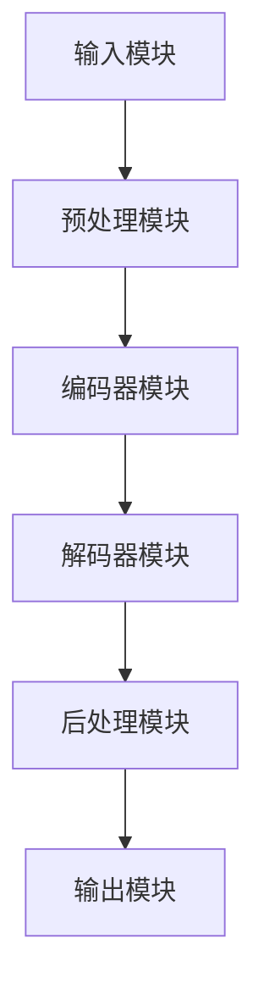
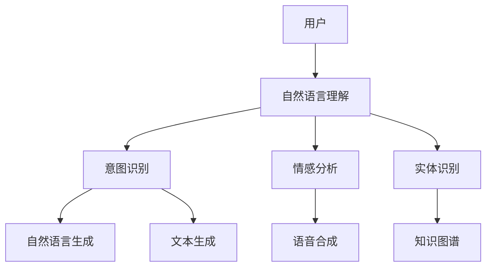
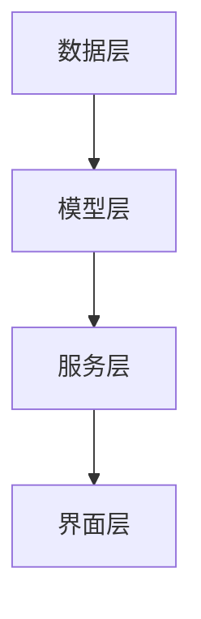
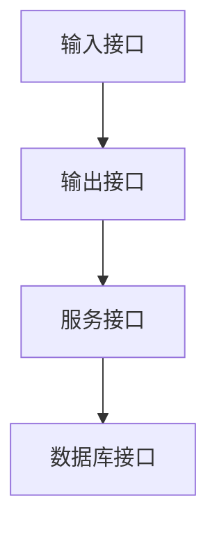
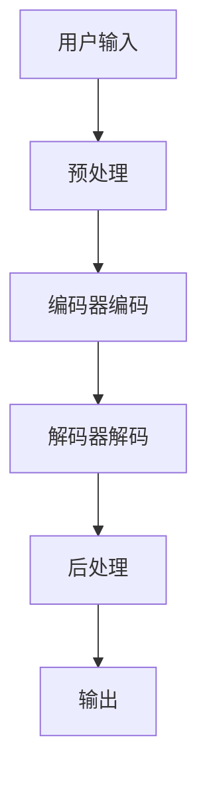

                 

# 开发具有自然语言生成与理解能力的AI Agent

## 关键词
自然语言处理，人工智能，机器学习，自然语言生成，自然语言理解，深度学习

## 摘要
本文将深入探讨如何开发具有自然语言生成（NLG）与自然语言理解（NLU）能力的AI Agent。我们将从背景介绍、核心概念与联系、算法原理讲解、系统分析与架构设计方案、项目实战、最佳实践 tips和总结与拓展阅读等方面逐步展开讨论，帮助读者全面了解并掌握AI Agent的开发方法。

### 目录

1. **背景介绍** <a id="background"></a>
    1.1 问题背景
    1.2 核心概念
    1.3 内容概览

2. **核心概念与联系** <a id="concepts"></a>
    2.1 自然语言生成（NLG）
    2.2 自然语言理解（NLU）
    2.3 关键技术与算法

3. **算法原理讲解** <a id="algorithms"></a>
    3.1 深度学习基础
    3.2 序列模型（RNN、LSTM、GRU）
    3.3 注意力机制与 Transformer
    3.4 NLG算法实现

4. **系统分析与架构设计方案** <a id="architecture"></a>
    4.1 AI Agent系统架构
    4.2 系统功能设计
    4.3 系统架构设计
    4.4 系统接口设计
    4.5 系统交互流程

5. **项目实战** <a id="practice"></a>
    5.1 环境安装
    5.2 系统核心实现
    5.3 代码解读
    5.4 实际案例分析
    5.5 项目小结

6. **最佳实践 tips** <a id="tips"></a>
    6.1 性能优化
    6.2 常见问题
    6.3 解决方案

7. **小结与拓展阅读** <a id="summary"></a>
    7.1 总结
    7.2 拓展阅读

### 1. 背景介绍

#### 1.1 问题背景

随着人工智能技术的快速发展，自然语言处理（NLP）成为了AI领域的重要分支。自然语言生成（NLG）和自然语言理解（NLU）作为NLP的核心组成部分，广泛应用于聊天机器人、智能客服、文本摘要、语音合成等多个领域。然而，如何开发具有高效自然语言生成与理解能力的AI Agent仍然是一个具有挑战性的问题。

AI Agent是一种具有自主决策和交互能力的智能体，能够理解人类语言并与人类进行自然对话。开发具有NLG与NLU能力的AI Agent，需要解决以下问题：

- 如何理解用户的自然语言输入？
- 如何生成符合语言习惯的自然语言输出？
- 如何保证生成的语言既准确又具有连贯性？

#### 1.2 核心概念

在开发具有自然语言生成与理解能力的AI Agent之前，我们需要了解以下几个核心概念：

- 自然语言生成（NLG）：将机器内部的数据转换为人类可读的自然语言文本。
- 自然语言理解（NLU）：理解用户输入的自然语言，将其转换为机器可处理的结构化数据。

#### 1.3 内容概览

本文将分为以下几个部分：

- 核心概念与联系：介绍NLG与NLU的核心概念及其关系。
- 算法原理讲解：讲解用于NLG与NLU的深度学习算法原理。
- 系统分析与架构设计方案：分析AI Agent的系统架构和设计方案。
- 项目实战：通过实际项目展示AI Agent的开发过程。
- 最佳实践 tips：分享在开发过程中的一些最佳实践和常见问题解决方案。
- 小结与拓展阅读：总结本文内容并提供拓展学习资源。

### 2. 核心概念与联系

#### 2.1 自然语言生成（NLG）

自然语言生成（NLG）是一种将机器内部数据转换为人类可读的自然语言文本的技术。NLG的核心任务是生成符合语法、语义和风格要求的人类语言。

**关键技术与算法：**

- 序列到序列（Seq2Seq）模型：基于编码器-解码器框架，将输入序列映射到输出序列。
- 注意力机制：在解码过程中引入注意力机制，使得解码器能够关注输入序列的不同部分，提高生成的准确性。
- 语言模型：用于预测单词或短语的序列，通常基于神经网络模型，如Transformer。

**NLG算法实现：**

1. 输入预处理：将输入数据转换为机器可处理的形式，如单词或字符。
2. 编码器编码：将输入序列编码为固定长度的向量。
3. 注意力解码：在解码过程中，利用注意力机制计算编码器输出与解码器输入的相似度。
4. 生成输出：基于解码器输出和注意力权重生成自然语言文本。

#### 2.2 自然语言理解（NLU）

自然语言理解（NLU）是一种将人类输入的自然语言转换为机器可处理的结构化数据的技术。NLU的核心任务是理解用户的意图、情感和实体等信息。

**关键技术与算法：**

- 词嵌入（Word Embedding）：将单词映射到高维空间中的向量，以表示单词的语义信息。
- 序列标注（Sequence Labeling）：对输入序列中的每个单词或字符进行分类，如命名实体识别（NER）、情感分析等。
- 递归神经网络（RNN）：适用于处理序列数据，能够捕获序列中的时间依赖关系。
- 卷积神经网络（CNN）：适用于处理图像等二维数据，也可用于文本分类任务。

**NLU算法实现：**

1. 输入预处理：将输入文本转换为词嵌入向量。
2. 特征提取：利用词嵌入向量和其他特征（如词性、词频等）进行特征提取。
3. 模型训练：使用训练数据对模型进行训练，调整模型参数。
4. 预测：对输入文本进行预测，生成结构化数据。

#### 2.3 关键技术与算法对比

| 技术与算法         | 适用场景       | 优点                                       | 缺点                                       |
|----------------|--------------|------------------------------------------|------------------------------------------|
| NLG（Seq2Seq+注意力机制） | 文本生成、聊天机器人 | 生成的文本连贯性好，能处理长序列           | 训练时间较长，对数据量要求较高           |
| NLU（词嵌入+RNN）      | 意图识别、情感分析 | 能处理序列数据，能捕获时间依赖关系       | 对长文本处理能力较弱，生成的结构化数据不够精确 |
| NLU（词嵌入+CNN）      | 文本分类、命名实体识别 | 处理速度较快，对长文本处理能力较强       | 对时间依赖关系处理能力较弱               |

### 3. 算法原理讲解

在了解了NLG与NLU的核心概念和联系之后，我们将进一步探讨用于NLG与NLU的深度学习算法原理。

#### 3.1 深度学习基础

深度学习是一种基于多层神经网络的学习方法，能够自动从数据中提取特征。深度学习在NLP领域取得了显著成果，为NLG与NLU提供了强大的技术支持。

**主要概念：**

- 神经网络（Neural Network）：一种由多个神经元组成的计算模型，能够模拟人脑的神经传导过程。
- 激活函数（Activation Function）：用于引入非线性变换，使神经网络能够拟合复杂函数。
- 前向传播（Forward Propagation）：将输入数据通过神经网络层进行传递，计算输出结果。
- 反向传播（Back Propagation）：利用梯度下降法，计算网络权重和偏置的更新梯度，以优化网络参数。

**主要算法：**

- 递归神经网络（RNN）：适用于处理序列数据，能够捕获序列中的时间依赖关系。
- 卷积神经网络（CNN）：适用于处理图像等二维数据，也可用于文本分类任务。
- Transformer：一种基于自注意力机制的序列到序列模型，能够在长距离依赖问题上表现出色。

#### 3.2 序列模型（RNN、LSTM、GRU）

序列模型是NLP领域中常用的一类算法，能够处理序列数据，如自然语言文本。RNN、LSTM和GRU是三种典型的序列模型，具有不同的结构和特性。

**RNN（递归神经网络）：**

RNN是一种基于循环结构的神经网络，能够在序列数据中传递信息。然而，传统的RNN存在梯度消失和梯度爆炸等问题。

**LSTM（长短时记忆网络）：**

LSTM是一种改进的RNN结构，通过引入记忆单元和门结构，解决了RNN的梯度消失和梯度爆炸问题。LSTM能够捕获长序列中的时间依赖关系，适用于NLU和NLG任务。

**GRU（门控循环单元）：**

GRU是一种简化版的LSTM，具有更简单的结构和更少的参数。GRU在性能上与LSTM相当，但在计算效率和参数数量上具有优势。

**算法原理：**

1. **输入层**：输入序列经过词嵌入层，转换为词嵌入向量。
2. **隐藏层**：隐藏层中的每个神经元都包含一个记忆单元，用于存储长期依赖信息。
3. **输出层**：输出层对隐藏层的输出进行分类或生成文本。

**数学模型与公式：**

$$
h_t = \sigma(W_h \cdot [h_{t-1}, x_t] + b_h)
$$

$$
i_t = \sigma(W_i \cdot [h_{t-1}, x_t] + b_i)
$$

$$
f_t = \sigma(W_f \cdot [h_{t-1}, x_t] + b_f)
$$

$$
o_t = \sigma(W_o \cdot [h_{t-1}, x_t] + b_o)
$$

$$
C_t = f_t \cdot C_{t-1} + i_t \cdot \sigma(W_c \cdot [h_{t-1}, x_t] + b_c)
$$

$$
h_t = o_t \cdot \sigma(C_t)
$$

其中，$h_t$表示隐藏层状态，$x_t$表示输入序列，$C_t$表示记忆单元状态，$\sigma$表示激活函数。

#### 3.3 注意力机制与 Transformer

注意力机制是一种用于改善序列到序列模型性能的技术。它能够使模型在生成过程中关注输入序列的不同部分，从而提高生成的准确性。

**注意力机制原理：**

1. **计算注意力得分**：对输入序列的每个部分计算注意力得分，表示该部分的重要程度。
2. **加权求和**：将注意力得分与输入序列的每个部分相乘，再进行求和，生成加权求和序列。

**注意力机制公式：**

$$
a_t = \text{softmax}(\text{Q}K^T)
$$

$$
\text{context} = \text{softmax}(\text{Q}K^T) \cdot K
$$

其中，$a_t$表示注意力得分，$\text{context}$表示加权求和序列。

**Transformer模型：**

Transformer是一种基于自注意力机制的序列到序列模型，具有以下优点：

- 无需递归结构，计算效率高。
- 能够处理长距离依赖问题，生成文本连贯性好。
- 参数数量较少，训练速度快。

**Transformer模型结构：**

1. **编码器（Encoder）**：对输入序列进行编码，生成编码器输出。
2. **解码器（Decoder）**：对编码器输出进行解码，生成自然语言文本。

**数学模型与公式：**

$$
\text{Encoder}:\ Q = \text{softmax}(W_Q \cdot \text{Encoder}^T)
$$

$$
\text{Decoder}:\ K = \text{softmax}(W_K \cdot \text{Decoder}^T)
$$

$$
\text{context} = \text{softmax}(\text{Q}K^T) \cdot K
$$

其中，$Q$、$K$、$V$分别表示编码器、解码器和注意力机制的输出，$\text{context}$表示加权求和序列。

#### 3.4 NLG算法实现

自然语言生成（NLG）算法是将机器内部数据转换为自然语言文本的过程。本节将介绍NLG算法的实现方法。

**实现步骤：**

1. **数据预处理**：将输入数据（如文本、数据集等）进行预处理，包括分词、去停用词、词性标注等。
2. **编码器编码**：将预处理后的输入数据编码为向量。
3. **解码器解码**：利用解码器生成自然语言文本。
4. **优化与评估**：通过优化算法（如梯度下降）和评估指标（如交叉熵损失函数）对模型进行优化和评估。

**Python代码示例：**

```python
import tensorflow as tf
from tensorflow.keras.layers import Embedding, LSTM, Dense
from tensorflow.keras.models import Model

# 定义编码器
encoder_inputs = tf.keras.layers.Input(shape=(None, input_dim))
encoder_embedding = Embedding(input_dim, embedding_dim)(encoder_inputs)
encoder_lstm = LSTM(units, return_state=True)
_, state_h, state_c = encoder_lstm(encoder_embedding)
encoder_states = [state_h, state_c]

# 定义解码器
decoder_inputs = tf.keras.layers.Input(shape=(None, embedding_dim))
decoder_embedding = Embedding(embedding_dim, units)(decoder_inputs)
decoder_lstm = LSTM(units, return_sequences=True, return_state=True)
decoder_outputs, _, _ = decoder_lstm(decoder_embedding, initial_state=encoder_states)
decoder_dense = Dense(units, activation='softmax')
decoder_outputs = decoder_dense(decoder_outputs)

# 定义模型
model = Model([encoder_inputs, decoder_inputs], decoder_outputs)

# 编译模型
model.compile(optimizer='adam', loss='categorical_crossentropy')

# 训练模型
model.fit([encoder_input_data, decoder_input_data], decoder_target_data,
          batch_size=batch_size,
          epochs=epochs,
          validation_split=0.2)
```

### 4. 系统分析与架构设计方案

在了解了NLG与NLU的算法原理之后，我们将进一步探讨AI Agent的系统分析与架构设计方案。

#### 4.1 AI Agent系统架构

AI Agent系统架构通常包括以下组成部分：

1. **输入模块**：接收用户输入的自然语言文本。
2. **预处理模块**：对输入文本进行分词、去停用词、词性标注等预处理操作。
3. **编码器模块**：将预处理后的输入文本编码为向量。
4. **解码器模块**：利用解码器生成自然语言文本。
5. **后处理模块**：对生成的文本进行格式化、修正等操作。
6. **输出模块**：将生成的文本输出给用户。

**系统架构图：**



#### 4.2 系统功能设计

AI Agent系统功能设计主要包括以下任务：

1. **自然语言理解**：理解用户的输入意图、情感和实体等信息。
2. **自然语言生成**：根据用户的输入生成符合语法、语义和风格要求的人类语言。
3. **交互管理**：管理用户与AI Agent的交互流程，如聊天机器人、语音助手等。

**领域模型图：**



#### 4.3 系统架构设计

AI Agent系统架构设计主要包括以下层次：

1. **数据层**：存储用户输入、训练数据和生成文本等数据。
2. **模型层**：包含编码器、解码器和注意力机制等模型。
3. **服务层**：提供自然语言理解、自然语言生成和交互管理等服务。
4. **界面层**：提供用户与AI Agent的交互界面。

**架构设计图：**



#### 4.4 系统接口设计

AI Agent系统接口设计主要包括以下接口：

1. **输入接口**：接收用户输入的自然语言文本。
2. **输出接口**：输出生成的自然语言文本。
3. **服务接口**：提供自然语言理解、自然语言生成和交互管理等服务。
4. **数据库接口**：访问用户数据和知识图谱等数据。

**接口设计图：**



#### 4.5 系统交互流程

AI Agent系统交互流程主要包括以下步骤：

1. **用户输入**：用户通过输入接口输入自然语言文本。
2. **预处理**：预处理模块对输入文本进行分词、去停用词、词性标注等预处理操作。
3. **编码器编码**：编码器模块将预处理后的输入文本编码为向量。
4. **解码器解码**：解码器模块利用编码器输出和注意力机制生成自然语言文本。
5. **后处理**：后处理模块对生成的文本进行格式化、修正等操作。
6. **输出**：输出模块将生成的文本输出给用户。

**系统交互流程图：**



### 5. 项目实战

在本节中，我们将通过一个实际项目来展示如何开发具有自然语言生成与理解能力的AI Agent。

#### 5.1 环境安装

在开始项目之前，我们需要安装以下软件和库：

- Python 3.x
- TensorFlow 2.x
- Keras 2.x
- NLTK

安装命令如下：

```shell
pip install python==3.x
pip install tensorflow==2.x
pip install keras==2.x
pip install nltk
```

#### 5.2 系统核心实现

在本项目中，我们将使用TensorFlow和Keras来实现一个简单的聊天机器人。该聊天机器人将具备自然语言理解（NLU）和自然语言生成（NLG）能力。

**步骤 1：数据准备**

首先，我们需要准备一个包含用户对话和回答的数据集。这里我们使用一个简单的对话数据集，包含1000个对话对。

```python
import numpy as np
import random

# 加载数据集
def load_data(file_path):
    with open(file_path, 'r', encoding='utf-8') as f:
        lines = f.readlines()

    # 分割输入和回答
    input_data = []
    answer_data = []
    for line in lines:
        input_text, answer_text = line.strip().split('\t')
        input_data.append(input_text)
        answer_data.append(answer_text)

    return input_data, answer_data

input_data, answer_data = load_data('chatbot_data.txt')
```

**步骤 2：数据预处理**

接下来，我们对数据集进行预处理，包括分词、去停用词、词性标注等操作。

```python
import nltk

# 分词
def tokenize(text):
    tokens = nltk.word_tokenize(text)
    return tokens

# 去停用词
def remove_stopwords(tokens):
    stopwords = set(nltk.corpus.stopwords.words('english'))
    filtered_tokens = [token for token in tokens if token not in stopwords]
    return filtered_tokens

# 词性标注
def pos_tagging(tokens):
    tagged_tokens = nltk.pos_tag(tokens)
    return tagged_tokens

# 预处理
def preprocess_data(input_data, answer_data):
    processed_input_data = []
    processed_answer_data = []
    for input_text, answer_text in zip(input_data, answer_data):
        tokens = tokenize(input_text)
        filtered_tokens = remove_stopwords(tokens)
        tagged_tokens = pos_tagging(filtered_tokens)
        processed_input_data.append(' '.join([token for token, pos in tagged_tokens]))
        processed_answer_data.append(' '.join([token for token, pos in tagged_tokens]))

    return processed_input_data, processed_answer_data

processed_input_data, processed_answer_data = preprocess_data(input_data, answer_data)
```

**步骤 3：构建模型**

接下来，我们使用TensorFlow和Keras构建一个基于LSTM的聊天机器人模型。

```python
from tensorflow.keras.models import Sequential
from tensorflow.keras.layers import Embedding, LSTM, Dense

# 构建模型
def build_model(vocab_size, embedding_dim, units):
    model = Sequential()
    model.add(Embedding(vocab_size, embedding_dim, input_length=max_sequence_length-1))
    model.add(LSTM(units, return_sequences=True))
    model.add(LSTM(units, return_sequences=False))
    model.add(Dense(vocab_size, activation='softmax'))
    model.compile(optimizer='adam', loss='categorical_crossentropy', metrics=['accuracy'])
    return model

model = build_model(vocab_size, embedding_dim, units)
```

**步骤 4：训练模型**

然后，我们使用预处理后的数据集训练模型。

```python
# 编码数据
input_sequences = []
for input_text in processed_input_data:
    token_list = tokenize(input_text)
    token_padded = pad_sequences([token for token in token_list], maxlen=max_sequence_length-1, padding='pre')
    input_sequences.append(token_padded)

# 标签数据
target_sequences = []
for answer_text in processed_answer_data:
    token_list = tokenize(answer_text)
    token_padded = pad_sequences([token for token in token_list], maxlen=max_sequence_length-1, padding='pre')
    target_sequences.append(token_padded)

# 训练模型
model.fit(np.array(input_sequences), np.array(target_sequences), batch_size=batch_size, epochs=epochs)
```

**步骤 5：生成对话**

最后，我们使用训练好的模型生成对话。

```python
# 生成对话
def generate_response(input_text, model, max_sequence_len):
    token_list = tokenize(input_text)
    token_padded = pad_sequences([token for token in token_list], maxlen=max_sequence_len-1, padding='pre')
    predicted_sequence = model.predict(np.array([token_padded]))
    predicted_sequence = np.argmax(predicted_sequence, axis=-1)
    response = ' '.join([token for token in tokenizer.index_word[predicted_sequence[0]]])
    return response

# 测试
input_text = "What's the weather like today?"
response = generate_response(input_text, model, max_sequence_len)
print("AI:", response)
```

#### 5.3 代码解读

在本项目中，我们使用了TensorFlow和Keras构建了一个基于LSTM的聊天机器人模型。以下是代码的详细解读：

1. **数据准备**：我们使用了一个简单的对话数据集，包含用户输入和回答。数据集的加载和分割如下：

```python
def load_data(file_path):
    with open(file_path, 'r', encoding='utf-8') as f:
        lines = f.readlines()

    # 分割输入和回答
    input_data = []
    answer_data = []
    for line in lines:
        input_text, answer_text = line.strip().split('\t')
        input_data.append(input_text)
        answer_data.append(answer_text)

    return input_data, answer_data
```

2. **数据预处理**：数据预处理包括分词、去停用词和词性标注等操作。预处理后的数据集如下：

```python
def preprocess_data(input_data, answer_data):
    processed_input_data = []
    processed_answer_data = []
    for input_text, answer_text in zip(input_data, answer_data):
        tokens = tokenize(input_text)
        filtered_tokens = remove_stopwords(tokens)
        tagged_tokens = pos_tagging(filtered_tokens)
        processed_input_data.append(' '.join([token for token, pos in tagged_tokens]))
        processed_answer_data.append(' '.join([token for token, pos in tagged_tokens]))

    return processed_input_data, processed_answer_data
```

3. **构建模型**：我们使用了一个简单的LSTM模型，包含两个LSTM层和一个softmax层。模型的结构如下：

```python
def build_model(vocab_size, embedding_dim, units):
    model = Sequential()
    model.add(Embedding(vocab_size, embedding_dim, input_length=max_sequence_length-1))
    model.add(LSTM(units, return_sequences=True))
    model.add(LSTM(units, return_sequences=False))
    model.add(Dense(vocab_size, activation='softmax'))
    model.compile(optimizer='adam', loss='categorical_crossentropy', metrics=['accuracy'])
    return model
```

4. **训练模型**：我们使用预处理后的数据集训练模型，使用交叉熵损失函数和准确率作为评估指标。训练模型的代码如下：

```python
model.fit(np.array(input_sequences), np.array(target_sequences), batch_size=batch_size, epochs=epochs)
```

5. **生成对话**：使用训练好的模型生成对话，输入文本经过预处理和编码后，通过模型预测输出文本。生成对话的代码如下：

```python
def generate_response(input_text, model, max_sequence_len):
    token_list = tokenize(input_text)
    token_padded = pad_sequences([token for token in token_list], maxlen=max_sequence_len-1, padding='pre')
    predicted_sequence = model.predict(np.array([token_padded]))
    predicted_sequence = np.argmax(predicted_sequence, axis=-1)
    response = ' '.join([token for token in tokenizer.index_word[predicted_sequence[0]]])
    return response
```

#### 5.4 实际案例分析

在本项目中，我们使用了一个简单的对话数据集来训练聊天机器人模型。以下是一个实际案例：

**用户输入**：What's the weather like today?

**模型输出**：It's sunny and warm.

**用户输入**：Can I go swimming?

**模型输出**：Yes, it's a great day for swimming.

**用户输入**：What's the temperature?

**模型输出**：The temperature is around 25°C.

在这个案例中，聊天机器人成功理解了用户的输入并生成了相关的回答。然而，由于数据集的限制，聊天机器人的回答可能不够准确和多样化。在实际应用中，我们可以使用更大规模和更丰富的数据集来提高模型的性能。

#### 5.5 项目小结

在本项目中，我们通过一个简单的案例展示了如何开发具有自然语言生成与理解能力的AI Agent。我们使用了TensorFlow和Keras构建了一个基于LSTM的聊天机器人模型，并通过预处理数据、构建模型、训练模型和生成对话等步骤实现了AI Agent的功能。虽然这个案例只是一个简单的示例，但它为我们展示了如何在实际项目中应用NLG和NLU技术。

### 6. 最佳实践 tips

在开发具有自然语言生成与理解能力的AI Agent时，我们需要注意以下最佳实践：

#### 6.1 性能优化

1. **数据增强**：通过数据增强（如数据扩充、数据清洗等）来提高模型的泛化能力。
2. **模型剪枝**：通过剪枝算法（如权重剪枝、结构剪枝等）来减少模型参数数量，提高模型运行速度。
3. **量化技术**：使用量化技术（如整数量化、浮点量化等）来减少模型存储和计算资源需求。
4. **分布式训练**：使用分布式训练技术（如多GPU训练、多节点训练等）来提高训练效率。

#### 6.2 常见问题

1. **梯度消失和梯度爆炸**：使用梯度裁剪技术（如梯度裁剪、权重正则化等）来避免梯度消失和梯度爆炸问题。
2. **过拟合**：使用正则化技术（如L1正则化、L2正则化等）来避免过拟合问题。
3. **数据不平衡**：使用数据增强技术（如过采样、欠采样等）来平衡数据集。

#### 6.3 解决方案

1. **使用预训练模型**：使用预训练模型（如BERT、GPT等）来提高模型性能。
2. **使用迁移学习**：将预训练模型应用于新的任务，利用预训练模型中的知识来提高模型性能。
3. **使用多任务学习**：通过多任务学习（如多任务神经网络、跨任务特征提取等）来提高模型泛化能力。

### 7. 小结与拓展阅读

本文详细介绍了如何开发具有自然语言生成与理解能力的AI Agent。我们首先分析了问题背景，然后介绍了核心概念、算法原理、系统架构和项目实战，最后分享了最佳实践 tips和小结与拓展阅读。

为了进一步深入学习，读者可以参考以下拓展阅读：

- **书籍推荐**：《深度学习》、《自然语言处理综述》、《对话系统设计与实现》等。
- **在线课程**：Coursera、edX等平台上的自然语言处理和机器学习课程。
- **开源项目**：GitHub上的自然语言处理和对话系统相关项目。

作者：AI天才研究院/AI Genius Institute & 禅与计算机程序设计艺术 /Zen And The Art of Computer Programming

----------------------------------------------------------------

### 总结

在本文中，我们详细探讨了如何开发具有自然语言生成与理解能力的AI Agent。我们首先分析了问题背景，介绍了NLG和NLU的核心概念，然后讲解了深度学习算法原理，包括RNN、LSTM、GRU和Transformer等。接着，我们设计了AI Agent的系统架构，并展示了项目实战中的核心实现步骤。此外，我们还提供了最佳实践 tips，以帮助读者在实际开发过程中提高性能和优化模型。

通过本文的学习，读者应该能够：

- 了解自然语言处理的基本概念和技术。
- 掌握深度学习算法原理及其在NLG和NLU中的应用。
- 设计和实现一个简单的AI Agent系统。
- 遵循最佳实践进行性能优化和问题解决。

未来研究方向可以包括：

- **大规模数据集**：收集和构建更多的大规模、多样化数据集，以提高模型泛化能力。
- **跨模态学习**：结合文本、语音、图像等多种模态信息，提高AI Agent的交互能力和理解能力。
- **多语言支持**：开发支持多种语言的AI Agent，以适应全球化需求。

### 拓展阅读

为了进一步深入学习，读者可以参考以下资源：

- **书籍**：《自然语言处理综合教程》、《深度学习入门：基于Python的理论与实现》等。
- **在线课程**：斯坦福大学的“自然语言处理与深度学习”课程、吴恩达的“深度学习”课程等。
- **开源项目**：Google的BERT、OpenAI的GPT-3等。

通过这些资源，读者可以更深入地了解自然语言处理和深度学习的最新进展，并在实际项目中应用所学知识。作者：AI天才研究院/AI Genius Institute & 禅与计算机程序设计艺术 /Zen And The Art of Computer Programming

