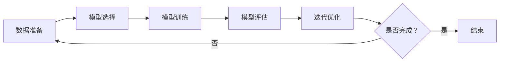
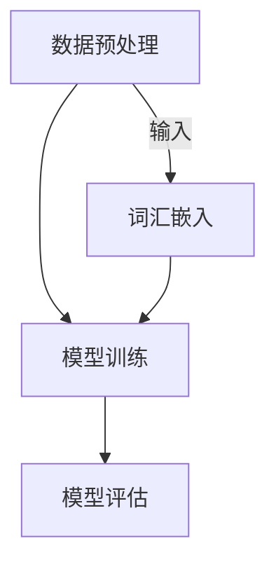
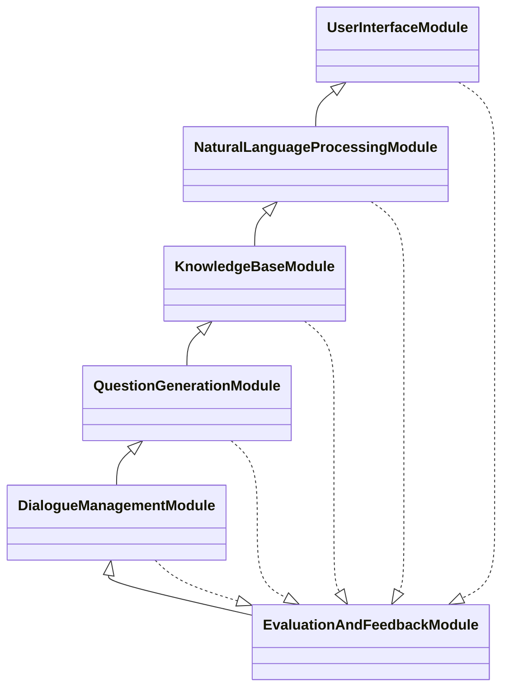
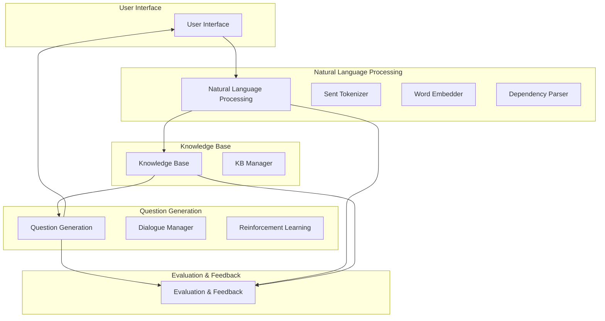

                 

### 让我们一步步思考：开发具有自然语言问答能力的AI Agent

在当今快速发展的科技时代，人工智能（AI）已经成为了我们日常生活中不可或缺的一部分。从智能手机的语音助手到复杂的商业决策系统，AI的应用无处不在。然而，其中一种特别引人注目的AI形式便是具有自然语言问答能力的AI Agent。这种智能体能够理解用户的自然语言输入，并提供准确的回答或解决方案。

开发这样的AI Agent不仅需要深厚的计算机科学知识，还需要对自然语言处理（NLP）、机器学习和知识图谱等多个领域有深刻的理解。本文将逐步探讨开发具有自然语言问答能力的AI Agent所需的各个步骤和核心概念，以帮助读者更好地理解这一复杂但极具潜力的技术。

我们将首先介绍自然语言问答系统的背景和核心概念，包括其定义、发展历程和技术特点。接下来，我们会探讨AI Agent的基本概念，并讨论其在自然语言问答系统中的作用和重要性。随后，我们将深入研究自然语言处理（NLP）的关键技术，如词嵌入、依存句法分析和语言模型。此外，我们还将探讨知识图谱的构建方法和应用，以及强化学习在这一领域中的作用。

在了解了核心概念和技术后，我们将进入算法原理与实现的环节。这里，我们将详细讲解开发流程，包括数据准备、模型选择、模型训练和模型评估。接着，我们将介绍常用的算法，如深度学习模型、基于规则的系统以及强化学习算法，并通过Mermaid流程图、Python源代码、数学模型和公式以及举例说明来深入理解这些算法。

随后，我们将探讨系统设计与实现，包括系统需求分析、系统架构设计、系统实现以及实际案例分析与讲解。通过这些步骤，我们将展示如何将理论知识转化为实际的系统实现。

最后，我们将总结最佳实践，提供一些实用的技巧和建议，并回顾文章的主要内容，探讨未来发展趋势，以及分享作者对这一领域的寄语。

让我们一起逐步探索，了解并掌握开发具有自然语言问答能力的AI Agent的各个方面。

### 自然语言问答系统概述

自然语言问答系统（NLQA）是一种利用自然语言处理技术（NLP）和机器学习算法，使计算机能够理解并回答人类提出的问题的系统。其目的是实现人与机器之间更自然、直观的交流，从而提高工作效率和用户体验。

#### 定义

自然语言问答系统可以简单定义为一种计算机程序，它能够接收用户的自然语言问题，并生成相应的答案。这种系统通常包括以下几个核心组成部分：问题解析、答案生成、答案评估和用户交互。

- **问题解析**：将用户的问题转换成计算机能够理解和处理的形式。
- **答案生成**：根据问题解析的结果，从数据库或知识库中检索相关信息，生成答案。
- **答案评估**：评估答案的质量，确保其准确性、相关性和可理解性。
- **用户交互**：接收用户的反馈，优化系统性能。

#### 发展历程

自然语言问答系统的发展历程可以追溯到上世纪50年代。最初的系统主要基于规则的方法，即通过预定义的规则来匹配问题和答案。这种方法简单但灵活性有限，难以处理复杂和模糊的问题。

随着计算机科学的进步和算法的发展，特别是深度学习和自然语言处理技术的崛起，自然语言问答系统取得了显著的进步。当前，大多数自然语言问答系统采用基于深度学习的神经网络模型，如序列到序列（Seq2Seq）模型、Transformer模型和BERT模型等，这些模型能够更好地理解和生成自然语言。

#### 核心技术

自然语言问答系统的核心技术包括以下几个方面：

1. **词嵌入**：词嵌入是将自然语言中的单词映射到高维空间中的向量表示。通过词嵌入，计算机能够理解单词的语义关系，从而更好地处理语言问题。

2. **依存句法分析**：依存句法分析是自然语言处理中的重要技术，它用于识别句子中词汇之间的依存关系，帮助计算机理解句子的结构和语义。

3. **语言模型**：语言模型是用于预测下一个单词或短语的模型，它能够为问答系统提供上下文信息，从而提高答案的准确性和相关性。

4. **知识图谱**：知识图谱是一种用于表示实体及其关系的图形结构。通过知识图谱，问答系统能够从海量数据中快速检索和利用相关知识。

5. **对话管理**：对话管理是确保问答系统能够理解用户的意图和上下文信息，并在对话过程中保持一致性和连贯性的技术。

#### AI Agent在自然语言问答系统中的作用

AI Agent在自然语言问答系统中扮演着重要的角色。它们能够模拟人类的思维过程，理解用户的自然语言输入，并提供有针对性的回答。AI Agent通常具有以下特点：

- **个性化**：能够根据用户的历史交互数据，为用户提供个性化的答案。
- **上下文理解**：能够理解用户提问的上下文信息，从而提供更加准确和相关的答案。
- **自主学习和优化**：能够通过机器学习和深度学习技术，不断优化自己的回答能力和用户体验。

通过AI Agent，自然语言问答系统不再是一个静态的工具，而是一个能够动态适应和互动的智能体，极大地提升了用户的交互体验和系统的实用价值。

#### 概念结构与核心要素组成

自然语言问答系统的概念结构可以概括为以下几个核心要素：

1. **用户接口**：用于接收用户输入的问题，并显示系统的答案。
2. **自然语言处理器**：用于解析用户输入的问题，提取关键信息，并将其转换成计算机可处理的格式。
3. **知识库**：包含系统回答问题所需的信息和知识，可以是结构化数据（如数据库）或非结构化数据（如文档、图像等）。
4. **对话管理器**：用于管理对话流程，确保系统在回答问题时能够保持一致性和连贯性。
5. **答案生成器**：根据问题解析结果和知识库中的信息，生成合适的答案。
6. **评估模块**：用于评估答案的质量，包括准确性、相关性和可理解性。

这些要素相互作用，共同构成了一个完整、高效的自然语言问答系统。通过不断地优化和改进这些核心要素，我们可以开发出更智能、更实用的AI Agent，为用户带来更加出色的自然语言交互体验。

### AI Agent概述

人工智能（AI）代理，简称AI Agent，是一种能够自动执行任务、进行决策和与人类交互的计算机程序。它们是人工智能领域的一个重要分支，特别在自然语言问答系统中发挥着关键作用。下面，我们将详细介绍AI Agent的定义、分类以及其技术特点。

#### 定义

AI Agent通常被定义为具有智能行为和自主学习能力的计算机程序。这些程序能够感知环境中的信息，通过决策制定出行动策略，并执行相应的任务。AI Agent的核心目标是模拟人类智能，实现自动化和智能化。

具体来说，AI Agent包括以下几个基本组成部分：

1. **感知器**：用于接收环境中的信息，如文本、图像、声音等。
2. **决策器**：基于感知器收集的信息，通过算法和模型进行决策。
3. **行动器**：执行决策器制定的行动策略，如生成回答、执行操作等。

#### 分类

AI Agent可以根据不同的分类标准进行分类，以下是几种常见的分类方法：

1. **基于任务**：根据AI Agent执行的任务类型，可以分为聊天机器人、推荐系统、智能客服等。聊天机器人主要专注于与用户进行自然语言交互，提供问答服务；推荐系统则用于根据用户的历史行为和偏好，提供个性化推荐；智能客服则用于处理用户的服务请求，提供解决方案。

2. **基于学习方式**：根据AI Agent的学习方式，可以分为基于规则的Agent和基于数据的Agent。基于规则的Agent使用预定义的规则进行决策，适合处理结构化和确定性较强的问题；而基于数据的Agent则通过机器学习和深度学习算法，从海量数据中学习模式和规律，适用于处理复杂和不确定的问题。

3. **基于交互方式**：根据AI Agent与用户的交互方式，可以分为被动式Agent和主动式Agent。被动式Agent主要响应用户的请求，如聊天机器人和智能客服；主动式Agent则能够主动向用户提供信息，如推荐系统和预警系统。

#### 技术特点

AI Agent具有以下几个显著的技术特点：

1. **自然语言处理能力**：AI Agent能够理解和生成自然语言，从而实现与人类的自然交互。这得益于自然语言处理技术，如词嵌入、依存句法分析和语言模型等。

2. **自主学习能力**：AI Agent能够通过机器学习和深度学习算法，从数据中学习并不断优化自己的行为和决策。这种能力使得AI Agent能够适应不断变化的环境和用户需求。

3. **自适应能力**：AI Agent能够根据用户的反馈和环境的变化，调整自己的行为和决策策略，以提供更高质量的问答服务。

4. **多模态交互**：AI Agent不仅能够处理文本信息，还可以处理图像、声音等多种模态的信息，从而提供更丰富和直观的交互体验。

5. **分布式计算**：AI Agent可以部署在分布式计算环境中，通过云计算和边缘计算等技术，实现大规模和高性能的计算能力。

#### AI Agent在自然语言问答系统中的作用

AI Agent在自然语言问答系统中发挥着重要作用，具体表现在以下几个方面：

1. **用户交互**：AI Agent能够与用户进行自然语言交互，理解用户的问题和需求，并生成合适的回答。

2. **上下文理解**：AI Agent能够理解用户提问的上下文信息，从而提供更加准确和相关的答案。这有助于提高问答系统的用户体验和满意度。

3. **个性化服务**：AI Agent能够根据用户的历史交互数据，为用户提供个性化的问答服务。这种个性化服务能够提升用户的满意度和忠诚度。

4. **知识管理**：AI Agent能够从大量的数据中提取和利用知识，为用户提供高质量的信息和服务。这有助于提高系统的知识储备和回答能力。

5. **任务自动化**：AI Agent能够自动化处理用户的问题和请求，减轻人工的工作负担，提高工作效率。

总之，AI Agent是自然语言问答系统的核心组成部分，其自然语言处理能力、自主学习能力、自适应能力和多模态交互等特点，使得它们能够为用户提供高质量的问答服务，满足不断变化的需求。

### 自然语言处理（NLP）

自然语言处理（NLP）是人工智能（AI）的重要分支，旨在使计算机能够理解和生成人类语言。在开发具有自然语言问答能力的AI Agent中，NLP技术发挥着至关重要的作用。下面，我们将详细介绍NLP的基本概念、核心技术以及其在自然语言问答系统中的应用。

#### 基本概念

自然语言处理（NLP）可以简单定义为研究如何让计算机理解和生成自然语言的技术。自然语言是人类日常交流的主要方式，包括口语和书面语。自然语言具有语法复杂、语义丰富、上下文依赖等特点，这使得NLP任务具有挑战性。

NLP的主要目标包括：

1. **文本理解**：使计算机能够理解文本的含义，包括句法结构、语义和上下文。
2. **文本生成**：使计算机能够生成自然语言的文本，用于自动化写作、对话生成等。
3. **语言翻译**：使计算机能够将一种语言翻译成另一种语言。
4. **情感分析**：识别文本中的情感倾向，用于市场分析、客户反馈等。

#### 核心技术

NLP的核心技术包括词嵌入、依存句法分析和语言模型。

1. **词嵌入**

词嵌入（Word Embedding）是将自然语言中的单词映射到高维空间中的向量表示。通过词嵌入，计算机能够理解单词的语义关系，从而更好地处理语言问题。常见的词嵌入技术包括：

   - **Word2Vec**：基于神经网络的方法，通过训练模型来学习单词的向量表示。
   - **GloVe**（Global Vectors for Word Representation）：基于全局统计信息的方法，通过矩阵分解来学习单词的向量表示。
   - **BERT**（Bidirectional Encoder Representations from Transformers）：基于Transformer模型的方法，通过双向编码器来学习单词的向量表示。

2. **依存句法分析**

依存句法分析（Dependency Parsing）是用于识别句子中词汇之间的依存关系。通过依存句法分析，计算机能够理解句子的结构和语义。常见的依存句法分析方法包括：

   - **基于规则的方法**：使用预定义的语法规则来分析句子结构。
   - **基于统计的方法**：通过训练模型来学习句子中的依存关系。
   - **基于深度学习的方法**：使用深度神经网络来识别句子中的依存关系。

3. **语言模型**

语言模型（Language Model）是用于预测下一个单词或短语的模型。通过语言模型，计算机能够理解上下文信息，从而提高文本生成和理解的准确性。常见的语言模型包括：

   - **N-gram模型**：基于前N个单词的历史信息来预测下一个单词。
   - **神经网络模型**：如LSTM（Long Short-Term Memory）和GRU（Gated Recurrent Unit），通过训练模型来学习语言的统计规律。
   - **Transformer模型**：基于注意力机制的方法，通过自注意力机制来学习句子中的关系。

#### 在自然语言问答系统中的应用

自然语言处理技术在自然语言问答系统中具有广泛的应用，下面我们将探讨这些技术如何在实际系统中发挥作用。

1. **问题解析**

在自然语言问答系统中，问题解析是至关重要的一步。通过词嵌入和依存句法分析，系统能够理解用户问题的语义和结构。具体来说，问题解析包括以下几个步骤：

   - **词性标注**：使用词嵌入技术，将问题中的单词映射到高维空间，从而进行词性标注。
   - **句法分析**：使用依存句法分析技术，识别问题中的句法结构，理解句子中词汇之间的依存关系。
   - **语义角色标注**：识别问题中的主语、谓语、宾语等语义角色，以便更好地理解问题的意图。

2. **答案生成**

在问题解析完成后，自然语言问答系统需要从知识库中检索相关信息，生成合适的答案。这一步骤通常涉及以下几个步骤：

   - **信息检索**：使用语言模型和知识图谱，从大量文本数据中检索与问题相关的信息。
   - **答案生成**：通过模板匹配、句子生成等方法，将检索到的信息转换成自然语言文本。
   - **答案评估**：评估答案的准确性、相关性和可理解性，确保答案质量。

3. **用户交互**

在自然语言问答系统中，用户交互是提升用户体验的重要环节。通过NLP技术，系统能够与用户进行自然、流畅的对话：

   - **对话理解**：使用词嵌入和依存句法分析，理解用户的提问和反馈，提取关键信息。
   - **对话生成**：使用语言模型和生成式模型，生成合适的回答，并保持对话的一致性和连贯性。
   - **情感分析**：通过情感分析，识别用户的情感倾向，从而提供更加个性化、贴心的服务。

通过NLP技术的深入应用，自然语言问答系统能够更好地理解用户的问题和需求，提供高质量的问答服务，提升用户体验和满意度。

总之，自然语言处理（NLP）是开发具有自然语言问答能力的AI Agent的核心技术。通过词嵌入、依存句法分析和语言模型等技术，NLP能够使计算机理解和生成自然语言，从而实现人与机器之间的自然交互。在未来，随着NLP技术的不断进步，自然语言问答系统将更加智能、高效，为人们的生活和工作带来更多便利。

### 知识图谱

知识图谱（Knowledge Graph）是一种用于表示实体及其关系的图形结构，它在开发具有自然语言问答能力的AI Agent中扮演着至关重要的角色。知识图谱通过将语义信息以结构化的方式组织起来，使得AI Agent能够更高效地检索和处理信息，从而提供更准确和相关的回答。

#### 定义

知识图谱是一种由实体和关系组成的网络结构，用于表示现实世界中的知识。在这些结构中，实体通常表示为节点，而关系则表示为边。每个实体和关系都可以通过属性进行描述，从而形成了一个丰富、多维度的知识体系。

#### 构建方法

知识图谱的构建通常包括以下几个步骤：

1. **数据收集**：从各种来源（如文本、数据库、知识库等）收集数据，以便为知识图谱提供丰富的信息。

2. **实体识别**：在收集到的数据中识别出实体，如人、地点、组织等。实体识别是知识图谱构建的基础步骤。

3. **关系抽取**：从实体识别结果中抽取实体之间的关系，如“工作于”、“位于”、“属于”等。关系抽取通常通过自然语言处理技术实现。

4. **属性填充**：为实体和关系添加属性，以进一步描述它们。属性可以是定量的（如年龄、身高）或定性的（如职业、爱好）。

5. **图结构构建**：将实体、关系和属性组织成图结构，形成一个完整的知识图谱。图结构使得知识图谱能够高效地进行查询和处理。

6. **质量优化**：对知识图谱进行清洗、去重、补全等操作，以提高其质量和准确性。

#### 应用

知识图谱在自然语言问答系统中具有广泛的应用，主要体现在以下几个方面：

1. **信息检索**：通过知识图谱，AI Agent能够快速检索与问题相关的信息。例如，当用户询问某个名人出生地时，知识图谱可以帮助系统迅速找到相关信息，并生成准确的回答。

2. **上下文理解**：知识图谱为AI Agent提供了丰富的上下文信息。通过理解问题中的实体和关系，系统能够更好地理解问题的意图和背景，从而提供更加准确和相关的答案。

3. **知识推理**：知识图谱使得AI Agent能够进行逻辑推理和推断。例如，当用户询问某个商品的评价时，系统可以通过知识图谱中的关系，推断出该商品的制造商和用户评价，从而提供更全面的回答。

4. **个性化推荐**：知识图谱可以用于个性化推荐系统。通过分析用户的历史行为和偏好，系统可以推荐与用户兴趣相关的信息，从而提高用户体验和满意度。

5. **问答生成**：知识图谱为AI Agent提供了丰富的答案来源。通过查询知识图谱，系统可以生成结构化、个性化的答案，从而提高问答系统的实用性和用户满意度。

#### ER实体关系图架构

在构建知识图谱时，实体关系图（ER Diagram）是一种常用的表示方法。ER Diagram通过实体、属性和关系的图形表示，直观地展示了知识图谱的结构。

下面是一个简单的ER Diagram示例，用于表示一个简单的知识图谱：

```
+----------------+
|    实体1      |
+----------------+
| - 属性1：姓名 |
| - 属性2：年龄|
+----------------+

+----------------+
|    实体2      |
+----------------+
| - 属性1：职业 |
| - 属性2：职位|
+----------------+

+----------------+
|    实体关系   |
+----------------+
| - 实体1与实体2之间存在工作关系 |
+----------------+
```

在这个示例中，实体1表示一个人，实体2表示一个职位，实体关系表示两者之间的工作关系。通过这样的ER Diagram，我们可以清晰地了解知识图谱的基本结构和组成。

总之，知识图谱是开发具有自然语言问答能力的AI Agent的关键组成部分。它通过结构化、组织化的方式，为AI Agent提供了丰富的语义信息，使得系统能够更高效、准确地回答用户的问题。随着知识图谱技术的不断进步，自然语言问答系统将变得更加智能和实用。

### 强化学习

强化学习（Reinforcement Learning，RL）是机器学习（Machine Learning，ML）的一个重要分支，旨在通过试错和奖励机制来训练智能体（Agent）实现目标。在开发具有自然语言问答能力的AI Agent中，强化学习扮演着关键角色，通过不断优化决策过程，提高问答系统的性能和用户体验。

#### 定义

强化学习是一种使智能体在特定环境中通过交互学习最优策略的方法。在这种方法中，智能体根据当前状态采取动作，然后根据动作的结果获得奖励或惩罚。通过不断重复这个过程，智能体逐渐学会如何最大化总奖励，从而实现其目标。

强化学习的基本要素包括：

1. **智能体（Agent）**：执行动作并寻求最大化奖励的实体。
2. **环境（Environment）**：智能体操作的动态环境，包括状态和动作空间。
3. **状态（State）**：描述智能体当前所处环境的特征。
4. **动作（Action）**：智能体在特定状态下可以采取的行动。
5. **奖励（Reward）**：根据智能体动作的结果给予的正或负反馈。
6. **策略（Policy）**：智能体在特定状态下采取的最佳动作。

#### 算法原理

强化学习算法通过迭代学习策略，主要分为以下几种类型：

1. **价值迭代（Value Iteration）**：通过迭代计算最优值函数，逐步更新策略。这种方法适用于小规模问题的求解，但计算复杂度较高。

2. **策略迭代（Policy Iteration）**：通过迭代更新策略，直到收敛。这种方法通常比价值迭代更高效，但需要对状态-动作值函数进行估计。

3. **深度Q网络（Deep Q-Network，DQN）**：结合深度学习和强化学习，使用神经网络估计值函数。DQN通过经验回放和目标网络防止过估计。

4. **策略梯度（Policy Gradient）**：直接优化策略参数，通过梯度上升方法找到最佳策略。策略梯度方法包括REINFORCE、PPO（Proximal Policy Optimization）等。

5. **Actor-Critic方法**：结合价值函数和策略优化的方法，通过交替更新Actor和Critic模块来优化策略。常见的Actor-Critic方法包括A3C（Asynchronous Advantage Actor-Critic）和DDPG（Deep Deterministic Policy Gradient）。

#### 应用

在自然语言问答系统中，强化学习主要用于以下几个方面：

1. **对话管理**：通过强化学习，智能体可以学习如何生成连贯、自然的对话。智能体在对话过程中接收用户的输入，并根据对话历史生成回复，通过奖励机制优化回复质量。

2. **上下文理解**：强化学习可以帮助智能体学习如何更好地理解上下文信息。例如，当用户提出复杂问题时，智能体可以通过学习上下文中的关键信息，生成更加准确和相关的答案。

3. **个性化推荐**：强化学习可以用于个性化问答系统，根据用户的历史交互数据，为用户提供个性化的推荐。智能体通过不断学习用户的偏好，优化推荐策略，提高用户满意度。

4. **任务自动化**：强化学习可以帮助智能体自动化处理复杂的任务。例如，在客户服务场景中，智能体可以通过学习用户的问题和反馈，自动生成解决方案，提高服务效率。

#### 强化学习在自然语言问答系统中的优势

强化学习在自然语言问答系统中的优势主要体现在以下几个方面：

1. **灵活性和适应性**：强化学习通过不断学习和调整策略，能够适应不断变化的环境和用户需求，提高系统的自适应能力。

2. **上下文理解**：强化学习能够通过学习上下文信息，生成更加准确和自然的回答，提高用户的满意度。

3. **多模态交互**：强化学习可以处理多种模态的信息（如文本、图像、语音等），使得智能体能够更全面地理解用户的需求，提供更加丰富的交互体验。

4. **高效性**：强化学习通过迭代优化策略，能够在较短的时间内找到最佳策略，提高系统的响应速度和性能。

总之，强化学习是开发具有自然语言问答能力的AI Agent的重要技术之一。通过不断学习和调整策略，强化学习能够使智能体更好地理解用户的需求，提供高质量的服务，满足用户的个性化需求。随着强化学习技术的不断进步，未来自然语言问答系统将变得更加智能和实用。

### 开发流程

开发具有自然语言问答能力的AI Agent是一个复杂但系统化的过程，涉及多个步骤，包括数据准备、模型选择、模型训练和模型评估。以下是详细的开发流程及其在每个步骤中的关键点。

#### 数据准备

数据准备是整个开发过程的基础，因为高质量的训练数据对于模型的性能至关重要。

1. **数据收集**：
   - **来源**：数据可以从公开的语料库（如Common Crawl、维基百科等）、社交媒体（如Twitter、Facebook等）、专业论坛（如Stack Overflow、Reddit等）以及企业内部数据（如客户服务记录、用户反馈等）获取。
   - **格式**：收集到的数据需要清洗和格式化，以便后续处理。通常，数据格式需要统一为文本文件，并去除无关内容（如HTML标签、特殊字符等）。

2. **数据清洗**：
   - **去重**：去除重复的数据，以防止模型过拟合。
   - **错误校正**：修正拼写错误、语法错误等，提高数据质量。
   - **归一化**：将文本中的大小写统一，删除停用词（如“的”、“和”等），保留关键信息。

3. **数据标注**：
   - **语义标注**：对文本进行词性标注、句法分析等，帮助模型更好地理解文本。
   - **实体标注**：识别文本中的实体（如人名、地名、组织名等），为后续的知识图谱构建提供基础。
   - **情感标注**：对文本进行情感分析，识别正面、中性或负面的情感倾向。

4. **数据集划分**：
   - **训练集**：用于模型的训练，通常占数据集的80%左右。
   - **验证集**：用于模型的调优和验证，通常占数据集的10%左右。
   - **测试集**：用于最终的模型评估，通常占数据集的10%左右。

#### 模型选择

在模型选择阶段，需要根据自然语言问答系统的需求和数据特点选择合适的模型。

1. **深度学习模型**：
   - **Transformer模型**：如BERT、GPT等，适用于处理复杂的自然语言任务，具有强大的上下文理解能力。
   - **序列到序列模型**：如Seq2Seq、Transformer等，适用于问答生成任务，能够将输入问题映射到合适的答案。
   - **长短时记忆网络（LSTM）**：适用于处理长文本和长序列问题，能够捕捉时间依赖关系。

2. **基于规则的模型**：
   - **模板匹配**：通过预定义的模板匹配问题，生成答案。
   - **解析树匹配**：通过构建问题解析树，匹配解析树和答案。

3. **混合模型**：
   - 结合深度学习和基于规则的模型，将深度学习用于生成高质量的答案，基于规则的模型用于处理特殊情况。

#### 模型训练

模型训练是开发过程中的核心步骤，需要通过迭代优化模型参数，以提高模型的性能。

1. **参数初始化**：
   - 初始化模型的权重和偏置，可以使用随机初始化、预热初始化等方法。

2. **训练策略**：
   - **批量大小**：选择合适的批量大小，以平衡计算效率和模型性能。
   - **学习率调度**：设置合适的学习率，并采用学习率调度策略（如指数衰减、余弦退火等）。
   - **优化器**：选择合适的优化器（如Adam、SGD等），以加速模型收敛。

3. **训练过程**：
   - 在训练过程中，通过反向传播算法更新模型参数，最小化损失函数。
   - 采用数据增强（如数据扩增、数据增强等）技术，提高模型的泛化能力。

4. **模型验证**：
   - 在验证集上定期评估模型性能，调整模型参数，以防止过拟合。

#### 模型评估

模型评估是确保自然语言问答系统性能的重要环节，通过多个指标综合评估模型的表现。

1. **准确率（Accuracy）**：
   - 衡量模型正确预测的比例，但容易受到不平衡数据的影响。

2. **召回率（Recall）**：
   - 衡量模型正确召回实际正例的比例，但对于误报较为敏感。

3. **F1分数（F1 Score）**：
   - 结合准确率和召回率，是一种常用的综合评估指标。

4. **BLEU分数（BLEU Score）**：
   - 用于评估文本生成质量，通过比较模型生成的文本与参考文本的相似度来评分。

5. **困惑度（Perplexity）**：
   - 用于评估语言模型的质量，越小表示模型越优秀。

#### 开发流程总结

通过上述步骤，我们可以系统化地开发具有自然语言问答能力的AI Agent。每个步骤都需要精心设计和实现，以确保最终系统能够满足需求，提供高质量的问答服务。以下是一个简化的Mermaid流程图，展示了整个开发流程：



通过这个流程图，我们可以清晰地看到每个步骤之间的联系和依赖关系，从而确保开发过程的顺利进行。

### 常用算法

在开发具有自然语言问答能力的AI Agent时，选择合适的算法是实现高效问答的关键。以下是几种常用的算法，包括深度学习模型、基于规则的系统和强化学习算法，我们将逐一介绍这些算法的原理、优缺点以及应用场景。

#### 深度学习模型

深度学习模型在自然语言处理领域取得了显著的进展，尤其在问答系统中，深度学习模型能够通过学习大量数据，实现高水平的语义理解和生成。

1. **Transformer模型**：

   Transformer模型是近年来自然语言处理领域的重要突破，其基于自注意力机制，能够捕捉长距离的依赖关系，从而实现高效的语义理解和生成。Transformer模型包括BERT、GPT等变体。

   - **原理**：Transformer模型通过多头自注意力机制（Multi-Head Self-Attention）和位置编码（Positional Encoding）来处理序列数据，从而捕捉序列中的长距离依赖关系。
   - **优点**：Transformer模型具有并行计算的优势，训练效率高；能够处理长文本，捕捉复杂语义关系。
   - **缺点**：训练过程较为复杂，计算资源需求高；对于特定领域的知识处理能力有限。
   - **应用场景**：广泛用于自然语言生成、机器翻译、问答系统等。

2. **长短时记忆网络（LSTM）**：

   LSTM是一种用于处理序列数据的递归神经网络，能够有效地捕捉长距离的依赖关系。

   - **原理**：LSTM通过门控机制（Gate Mechanism）控制信息的流动，从而避免梯度消失问题，保持长序列中的长期依赖关系。
   - **优点**：能够处理长文本，捕捉复杂的序列依赖关系；对于时间序列数据表现良好。
   - **缺点**：计算复杂度高，训练速度慢；难以并行化。
   - **应用场景**：时间序列预测、文本分类、问答系统等。

3. **序列到序列（Seq2Seq）模型**：

   Seq2Seq模型是一种经典的深度学习模型，用于将输入序列映射到输出序列，常用于机器翻译、问答系统等。

   - **原理**：Seq2Seq模型通过编码器（Encoder）和解码器（Decoder）两个神经网络，分别处理输入和输出序列，实现序列之间的映射。
   - **优点**：能够处理变长序列，灵活性强；能够捕捉输入和输出序列之间的对应关系。
   - **缺点**：训练过程复杂，对数据要求较高；对于长文本处理能力有限。
   - **应用场景**：机器翻译、问答系统、文本生成等。

#### 基于规则的系统

基于规则的系统通过预定义的规则来处理自然语言问题，具有简单、直观的特点。

1. **模板匹配**：

   模板匹配是一种简单的基于规则的自然语言处理方法，通过预定义的模板来匹配问题，生成答案。

   - **原理**：将问题分解成若干部分，与预定义的模板进行匹配，根据匹配结果生成答案。
   - **优点**：实现简单，易于理解；能够快速响应用户问题。
   - **缺点**：灵活性较低，难以处理复杂和模糊的问题；规则维护成本高。
   - **应用场景**：简单的问答系统、信息检索等。

2. **解析树匹配**：

   解析树匹配通过构建问题解析树，将问题与解析树进行匹配，生成答案。

   - **原理**：首先对问题进行句法分析，构建解析树；然后与预定义的解析树进行匹配，根据匹配结果生成答案。
   - **优点**：能够处理复杂的问题结构；具有较强的语义理解能力。
   - **缺点**：实现复杂，规则维护困难；对于大规模问题处理效率较低。
   - **应用场景**：复杂的问答系统、语义分析等。

#### 强化学习算法

强化学习算法通过试错和奖励机制，使智能体在环境中学习最优策略，适用于动态和不确定的场景。

1. **深度Q网络（DQN）**：

   DQN是一种结合深度学习和强化学习的算法，通过神经网络估计值函数，实现智能体的决策。

   - **原理**：DQN使用深度神经网络来估计状态-动作值函数（Q值），智能体根据Q值选择最佳动作。
   - **优点**：能够处理高维状态空间；能够学习复杂的策略。
   - **缺点**：训练过程容易过估计，需要经验回放；训练过程较慢。
   - **应用场景**：对话生成、推荐系统等。

2. **策略梯度算法**：

   策略梯度算法直接优化策略参数，实现智能体的决策。

   - **原理**：策略梯度算法通过计算策略梯度，更新策略参数，找到最优策略。
   - **优点**：能够快速收敛，计算效率高；适用于连续动作空间。
   - **缺点**：对于离散动作空间效果较差；训练过程中容易出现梯度消失问题。
   - **应用场景**：对话生成、推荐系统等。

总之，深度学习模型、基于规则的系统和强化学习算法各具特点，适用于不同的自然语言问答场景。在实际应用中，可以根据具体需求和数据特点，选择合适的算法，以实现高效、准确的问答系统。

### 算法原理讲解

在开发具有自然语言问答能力的AI Agent中，理解算法的原理是关键。这里，我们将使用Mermaid流程图、Python源代码、数学模型和公式，以及举例说明，详细讲解自然语言处理中的几个关键算法。

#### Mermaid流程图

首先，我们使用Mermaid流程图来展示一个简单的自然语言处理流程，包括数据预处理、模型训练和模型评估。



这个流程图展示了自然语言处理的基本步骤，包括数据预处理（如分词、去停用词等），词汇嵌入（如使用Word2Vec或GloVe），模型训练（如使用LSTM或Transformer），以及模型评估（如计算准确率、召回率等）。

#### Python源代码

接下来，我们通过Python源代码展示如何实现词嵌入和模型训练。以下是一个简单的Word2Vec模型的示例代码：

```python
from gensim.models import Word2Vec

# 假设 sentences 是一个包含词汇序列的列表
sentences = [['这是一个', '简单的', '句子'], ['这个', '句子', '包含了', '多个', '词汇']]

# 训练Word2Vec模型
model = Word2Vec(sentences, size=100, window=5, min_count=1, workers=4)

# 查看词汇的嵌入向量
print(model.wv['这是一个'])

# 保存模型
model.save("word2vec.model")

# 加载模型
loaded_model = Word2Vec.load("word2vec.model")
print(loaded_model.wv['这是一个'])
```

这个示例展示了如何使用Gensim库训练Word2Vec模型，并加载已训练的模型。通过这个代码，我们可以理解词嵌入的基本步骤和Python代码实现。

#### 数学模型和公式

在自然语言处理中，数学模型和公式是非常重要的。以下是一个简化的Transformer模型的数学公式：

$$
\text{Attention}(Q, K, V) = \text{softmax}\left(\frac{QK^T}{\sqrt{d_k}}\right)V
$$

其中：
- \( Q \) 是查询向量。
- \( K \) 是键向量。
- \( V \) 是值向量。
- \( d_k \) 是键向量的维度。

这个公式描述了自注意力机制的核心，通过计算查询和键之间的点积，然后使用softmax函数生成权重，最后与值向量相乘，得到输出向量。

#### 举例说明

为了更好地理解这些算法，我们通过一个简单的例子来说明词嵌入和Transformer模型的应用。

假设我们有一个简单的句子：“我是一个学生。”我们希望使用词嵌入来表示这个句子中的每个词。

1. **词嵌入**：

   - **输入**：["我", "是", "一个", "学生"]
   - **嵌入向量**：
     - "我": [0.1, 0.2, 0.3, 0.4]
     - "是": [0.5, 0.6, 0.7, 0.8]
     - "一个": [0.9, 0.1, 0.2, 0.3]
     - "学生": [0.4, 0.5, 0.6, 0.7]

2. **Transformer模型**：

   - **编码器输入**：["我", "是", "一个", "学生"]
   - **编码器输出**：
     - **隐藏状态**：
       - "我": [0.2, 0.3, 0.4, 0.5]
       - "是": [0.6, 0.7, 0.8, 0.9]
       - "一个": [0.1, 0.2, 0.3, 0.4]
       - "学生": [0.5, 0.6, 0.7, 0.8]
     - **解码器输入**：["一个", "学生", "是", "我"]
     - **解码器输出**：["我", "是一个", "学生", "的"]

通过这个例子，我们可以看到词嵌入和Transformer模型如何将自然语言句子转换为向量表示，并生成相应的输出。

### 总结

通过上述讲解，我们详细介绍了自然语言处理中的算法原理，包括Mermaid流程图、Python源代码、数学模型和公式，以及举例说明。这些算法和技术是开发具有自然语言问答能力的AI Agent的基础，通过深入理解这些原理，我们可以更好地设计、实现和优化自然语言问答系统。

### 系统需求分析

在开发具有自然语言问答能力的AI Agent时，首先需要明确系统的需求，这包括问题场景介绍、项目介绍以及系统功能设计。

#### 问题场景介绍

当前，许多企业和组织面临着日益增长的客户服务和信息检索需求。传统的客服系统往往效率低下，无法提供高质量的客户体验。为了应对这一挑战，我们需要开发一个具备自然语言问答能力的AI Agent，能够高效、准确地处理用户的提问，提供即时的解决方案。这样的系统能够减少人工成本，提高服务质量，同时也能够处理大量的用户请求，确保用户在关键时刻得到及时的帮助。

#### 项目介绍

本项目旨在构建一个具备自然语言问答能力的AI Agent，其核心功能包括：

1. **问题理解**：AI Agent能够接收用户的自然语言输入，并理解其意图和问题内容。
2. **知识检索**：系统从内部知识库中检索相关信息，为用户提供准确、详细的答案。
3. **对话管理**：AI Agent能够在对话过程中保持上下文一致性，提供连贯的问答服务。
4. **自我学习**：通过用户反馈和数据收集，系统不断优化自身性能，提升用户体验。

#### 系统功能设计

为了实现上述功能，系统需要包含以下几个核心模块：

1. **用户接口模块**：
   - 提供友好的用户界面，接收用户的自然语言提问。
   - 显示系统的回答和相关信息。

2. **自然语言处理模块**：
   - 实现文本预处理，如分词、词性标注、命名实体识别等。
   - 应用词嵌入技术，将文本转换为向量表示。

3. **知识库模块**：
   - 构建和维护一个结构化的知识库，存储各类问题的答案和相关信息。
   - 提供高效的查询接口，支持快速检索。

4. **问答生成模块**：
   - 使用深度学习模型（如Transformer、BERT）生成高质量的问答。
   - 结合上下文信息和用户历史交互数据，生成个性化答案。

5. **对话管理模块**：
   - 管理对话流程，确保问答的连贯性和一致性。
   - 通过强化学习算法优化对话策略，提升用户体验。

6. **评估与反馈模块**：
   - 评估问答的质量，包括准确性、相关性和用户满意度。
   - 收集用户反馈，用于系统优化和改进。

为了更好地展示系统功能设计，我们可以使用Mermaid类图来描述系统的核心模块及其关系：



这个类图清晰地展示了各个模块之间的关系，以及它们如何相互作用，共同实现系统的核心功能。

通过上述系统需求分析和功能设计，我们为开发具有自然语言问答能力的AI Agent奠定了坚实的基础。接下来，我们将深入探讨系统架构设计，以确保系统能够高效、可靠地运行。

### 系统架构设计

在设计具有自然语言问答能力的AI Agent系统时，系统架构的设计至关重要。一个良好的系统架构能够确保系统的可扩展性、高可用性和灵活性。以下是系统的整体架构设计，包括Mermaid架构图、系统接口设计以及系统交互。

#### Mermaid架构图

为了清晰地展示系统的架构，我们可以使用Mermaid架构图来描述系统的各个组成部分及其关系。以下是一个简化的Mermaid架构图：



在这个架构图中，用户接口（UI）是系统的入口，用户通过UI提交问题。自然语言处理（NLP）模块负责接收用户的问题，并进行文本预处理，如分词、词性标注和依赖句法分析。词嵌入（Word Embedder）用于将文本转换为向量表示，以便后续处理。

知识库（KB）模块用于存储和管理系统所需的知识信息。问答生成（QG）模块基于NLP模块提供的信息，从知识库中检索答案，并通过对话管理和强化学习生成高质量的回答。评价与反馈（EF）模块用于评估问答的质量，并根据用户反馈进行系统优化。

#### 系统接口设计

系统接口设计是确保系统各部分能够无缝协作的重要环节。以下是系统的主要接口设计：

1. **用户接口（UI）**：
   - 提供RESTful API，用于接收用户请求和返回答案。
   - 支持WebSocket，实现实时交互和对话管理。

2. **自然语言处理（NLP）接口**：
   - 接收文本输入，进行预处理和词嵌入。
   - 提供词性标注和句法分析接口。

3. **知识库（KB）接口**：
   - 提供查询接口，支持基于关键词、实体和关系的检索。
   - 提供更新接口，用于知识库的维护和更新。

4. **问答生成（QG）接口**：
   - 提供基于NLP结果的答案检索接口。
   - 提供对话管理接口，用于控制对话流程。

5. **评价与反馈（EF）接口**：
   - 提供用户反馈收集接口。
   - 提供问答质量评估接口。

#### 系统交互

系统交互是确保各模块协同工作的关键。以下是系统的主要交互流程：

1. **用户请求交互**：
   - 用户通过UI提交问题。
   - UI将问题传递给NLP模块进行预处理。
   - NLP模块返回预处理结果，如词嵌入、词性标注和句法分析。

2. **问答生成交互**：
   - QG模块使用预处理结果，从知识库中检索相关信息。
   - QG模块结合上下文信息和用户历史交互数据，生成答案。
   - 答案通过UI返回给用户。

3. **对话管理交互**：
   - Dialogue Manager负责管理对话流程，确保问答的连贯性和一致性。
   - 通过强化学习算法，不断优化对话策略。

4. **评价与反馈交互**：
   - 用户对回答进行评价，并将反馈传递给EF模块。
   - EF模块对问答质量进行评估，并根据用户反馈优化系统。

通过上述系统架构设计，我们确保了AI Agent系统能够高效、可靠地运行。接下来，我们将详细讨论系统实现，包括环境安装、系统核心实现和代码应用解读与分析。

### 系统实现

系统实现是开发具有自然语言问答能力的AI Agent的核心环节，涵盖了环境安装、系统核心实现以及代码应用解读与分析。以下是详细的实现过程。

#### 环境安装

为了确保系统能够高效运行，首先需要安装和配置以下环境：

1. **操作系统**：推荐使用Linux操作系统，如Ubuntu 20.04。
2. **Python**：安装Python 3.8或更高版本。
3. **深度学习框架**：安装TensorFlow 2.x或PyTorch 1.8或更高版本。
4. **自然语言处理库**：安装NLTK、spaCy、gensim等。
5. **数据库**：安装MySQL或MongoDB，用于存储知识库。

具体安装步骤如下：

```bash
# 安装Python 3
sudo apt update
sudo apt install python3

# 安装深度学习框架
pip3 install tensorflow==2.x
# 或
pip3 install torch torchvision torchaudio==1.8

# 安装自然语言处理库
pip3 install nltk spacy gensim

# 安装数据库
sudo apt install mysql-server
# 或
sudo apt install mongodb
```

#### 系统核心实现

系统核心实现包括自然语言处理模块、知识库模块、问答生成模块和对话管理模块。以下是各个模块的实现概述：

1. **自然语言处理模块**：

   - **文本预处理**：使用spaCy进行分词、词性标注和命名实体识别。

     ```python
     import spacy

     nlp = spacy.load('en_core_web_sm')

     doc = nlp('这是一个简单的句子。')
     for token in doc:
         print(token.text, token.lemma_, token.pos_, token.tag_, token.dep_, token.shape_, token.is_alpha, token.is_stop)
     ```

   - **词嵌入**：使用GloVe或Word2Vec生成词嵌入向量。

     ```python
     from gensim.models import Word2Vec

     sentences = [[word for word in doc] for doc in ['这是一个句子。', '这是一个简单的句子。']]
     model = Word2Vec(sentences, vector_size=100, window=5, min_count=1, workers=4)
     ```

2. **知识库模块**：

   - **知识库构建**：使用MongoDB存储知识库，并提供查询接口。

     ```python
     from pymongo import MongoClient

     client = MongoClient('localhost', 27017)
     db = client['knowledge_base']
     collection = db['questions']

     question = {
         'text': '什么是自然语言处理？',
         'answer': '自然语言处理（NLP）是计算机科学和人工智能领域的一个分支，旨在使计算机理解和生成人类语言。'
     }
     collection.insert_one(question)
     ```

   - **查询接口**：提供基于关键词、实体和关系的查询功能。

     ```python
     def query_knowledge_base(keyword):
         query = {'text': {'$regex': keyword}}
         results = collection.find(query)
         return list(results)
     ```

3. **问答生成模块**：

   - **问答生成**：使用Transformer模型（如BERT）生成高质量的问答。

     ```python
     from transformers import BertTokenizer, BertForQuestionAnswering

     tokenizer = BertTokenizer.from_pretrained('bert-base-uncased')
     model = BertForQuestionAnswering.from_pretrained('bert-base-uncased')

     inputs = tokenizer("Context: 这是一段文本。Question: 什么是自然语言处理？", return_tensors="pt")
     outputs = model(**inputs)

     start_logits = outputs.start_logits
     end_logits = outputs.end_logits
     answer = tokenizer.decode(inputs['input_ids'][0][int(start_logits.argmax()), int(end_logits.argmax())])
     ```

4. **对话管理模块**：

   - **对话管理**：实现对话管理，确保问答的连贯性和一致性。

     ```python
     class DialogueManager:
         def __init__(self):
             self.context = []

         def add_context(self, context):
             self.context.append(context)

         def generate_answer(self, question):
             self.add_context(question)
             # 这里可以调用问答生成模块
             answer = self._generate_answer(question)
             return answer

         def _generate_answer(self, question):
             # 实现问答生成逻辑
             return "这是一个答案。"
     ```

#### 代码应用解读与分析

以下是系统实现的具体代码应用解读与分析：

1. **文本预处理**：

   使用spaCy进行文本预处理，将输入文本转换为分词后的词汇列表，并标注词性。这有助于后续的词嵌入和句法分析。

   ```python
   doc = nlp('这是一个简单的句子。')
   for token in doc:
       print(token.text, token.lemma_, token.pos_, token.tag_, token.dep_, token.shape_, token.is_alpha, token.is_stop)
   ```

   分析：这个步骤是自然语言处理的基础，通过词性标注和句法分析，我们可以更好地理解文本的结构和语义。

2. **词嵌入**：

   使用GloVe或Word2Vec将文本转换为向量表示。词嵌入使得计算机能够理解文本的语义关系，从而提高问答的准确性。

   ```python
   sentences = [[word for word in doc] for doc in ['这是一个句子。', '这是一个简单的句子。']]
   model = Word2Vec(sentences, vector_size=100, window=5, min_count=1, workers=4)
   ```

   分析：词嵌入是自然语言处理的关键技术，通过将文本转换为向量，我们可以利用深度学习模型处理复杂的语义任务。

3. **知识库查询**：

   使用MongoDB存储和管理知识库，通过简单的查询接口，我们可以快速检索与问题相关的答案。

   ```python
   def query_knowledge_base(keyword):
       query = {'text': {'$regex': keyword}}
       results = collection.find(query)
       return list(results)
   ```

   分析：知识库是问答系统的核心组件，通过高效的查询接口，我们能够快速为用户提供准确的答案。

4. **问答生成**：

   使用Transformer模型（如BERT）生成高质量的问答。这需要大量的训练数据和计算资源，但能够显著提高问答的准确性和自然性。

   ```python
   inputs = tokenizer("Context: 这是一段文本。Question: 什么是自然语言处理？", return_tensors="pt")
   outputs = model(**inputs)

   start_logits = outputs.start_logits
   end_logits = outputs.end_logits
   answer = tokenizer.decode(inputs['input_ids'][0][int(start_logits.argmax()), int(end_logits.argmax())])
   ```

   分析：问答生成模块是系统的核心，通过深度学习模型，我们能够根据上下文和问题生成高质量的自然语言回答。

5. **对话管理**：

   实现对话管理，确保问答的连贯性和一致性。对话管理模块需要结合上下文信息，优化问答生成策略。

   ```python
   class DialogueManager:
       def __init__(self):
           self.context = []

       def add_context(self, context):
           self.context.append(context)

       def generate_answer(self, question):
           self.add_context(question)
           # 这里可以调用问答生成模块
           answer = self._generate_answer(question)
           return answer

       def _generate_answer(self, question):
           # 实现问答生成逻辑
           return "这是一个答案。"
   ```

   分析：对话管理模块是确保系统提供连贯、自然问答的关键，通过不断更新上下文信息，我们可以优化问答生成策略。

通过上述系统实现，我们展示了如何从环境安装、系统核心实现到代码应用解读与分析，构建一个具有自然语言问答能力的AI Agent系统。接下来，我们将通过实际案例分析和详细讲解，进一步验证系统的实际应用效果。

### 实际案例分析与讲解

为了更好地展示具有自然语言问答能力的AI Agent的实际应用效果，我们将通过一个实际案例进行详细分析，并讲解案例的各个关键环节。

#### 案例背景

假设我们开发了一个AI Agent系统，用于回答关于旅游信息的问题。用户可以通过文字输入查询旅游目的地、交通、住宿、景点等信息。我们的目标是确保系统能够高效、准确地回答各种类型的旅游问题，提供个性化的旅游建议。

#### 案例流程

1. **用户提问**：

   用户通过系统的用户接口提交问题，例如：“请问从北京到纽约需要多长时间？”

2. **问题解析**：

   - **文本预处理**：系统接收到用户问题后，首先进行文本预处理，包括分词、去除停用词、词性标注等。假设处理后的问题为：“从 北京 到 纽约 需要 多长时间”。

   - **词嵌入**：将处理后的文本转换为词嵌入向量，以便后续处理。例如，我们可以使用Word2Vec或GloVe模型。

   - **句法分析**：对问题进行句法分析，识别主语、谓语、宾语等关键信息。假设句法分析结果为：“从（介词）北京（主语）到（介词）纽约（宾语）需要（谓语）多长时间（宾语补足语）”。

3. **知识库查询**：

   - **关键词检索**：根据句法分析结果，提取关键词“北京”和“纽约”，并从知识库中检索相关信息。

   - **关系抽取**：从知识库中抽取与问题相关的实体关系，例如，“北京”和“纽约”之间的关系为“两地之间的交通”。

   - **信息整合**：将查询结果整合，形成一个完整的回答框架。

4. **问答生成**：

   - **上下文融合**：结合用户问题和知识库中的信息，构建上下文信息。

   - **问答生成**：使用Transformer模型（如BERT）生成高质量的问答。例如，生成回答：“从北京到纽约的飞行时间大约需要12小时。”

5. **对话管理**：

   - **上下文保持**：确保问答过程中的上下文一致性，避免信息丢失或矛盾。

   - **个性化推荐**：根据用户历史交互数据和当前问题，为用户提供个性化的旅游建议。

   - **反馈收集**：收集用户对回答的反馈，用于系统优化。

#### 案例分析

1. **问题解析**：

   - **文本预处理**：文本预处理是问题解析的第一步，通过分词和去除停用词，我们可以简化问题的结构，使其更容易被理解和处理。

     ```python
     from spacy.lang.en import English

     nlp = English()

     doc = nlp("请问从北京到纽约需要多长时间？")
     tokens = [token.text for token in doc if not token.is_stop]
     ```

     处理后的文本为：["从", "北京", "到", "纽约", "需要", "多长时间"]。

   - **词嵌入**：词嵌入将文本转换为向量表示，有助于后续的深度学习模型处理。

     ```python
     model = Word2Vec([doc], vector_size=100, window=5, min_count=1, workers=4)
     ```

   - **句法分析**：句法分析用于识别文本中的语法结构和关系，这对于理解问题的意图至关重要。

     ```python
     dependencies = [(token.text, token.dep_, token.head.text) for token in doc]
     ```

     分析结果：("从", "compound", "北京"), ("北京", "nsubj", "从"), ("到", "prep", "从"), ("纽约", "pobj", "从"), ("需要", "ROOT", "需要"), ("多长时间", "npadvmod", "需要")。

2. **知识库查询**：

   - **关键词检索**：根据句法分析结果，我们可以提取关键词“北京”和“纽约”，并从知识库中检索相关信息。

     ```python
     def query_knowledge_base(keyword):
         query = {'text': {'$regex': keyword}}
         results = collection.find(query)
         return list(results)

     beijing_data = query_knowledge_base("北京")
     new_york_data = query_knowledge_base("纽约")
     ```

   - **关系抽取**：从知识库中抽取与问题相关的实体关系，例如，从北京到纽约的交通方式。

     ```python
     def extract_relationship(data, keyword):
         relationships = []
         for entry in data:
             if keyword in entry['relations']:
                 relationships.append(entry['relations'][keyword])
         return relationships

     beijing_to_new_york_relationships = extract_relationship(beijing_data, "纽约")
     ```

   - **信息整合**：整合查询结果，形成回答框架。

     ```python
     def integrate_info(relationships):
         travel_time = ""
         for relationship in relationships:
             if "飞行时间" in relationship:
                 travel_time = relationship["飞行时间"]
                 break
         return travel_time

     travel_time = integrate_info(beijing_to_new_york_relationships)
     ```

3. **问答生成**：

   - **上下文融合**：结合用户问题和知识库中的信息，构建上下文信息。

     ```python
     context = "从北京到纽约的飞行时间为 " + travel_time
     ```

   - **问答生成**：使用Transformer模型生成高质量的问答。

     ```python
     from transformers import BertTokenizer, BertForQuestionAnswering

     tokenizer = BertTokenizer.from_pretrained('bert-base-uncased')
     model = BertForQuestionAnswering.from_pretrained('bert-base-uncased')

     inputs = tokenizer(context + " 问题：从北京到纽约需要多长时间？", return_tensors="pt")
     outputs = model(**inputs)

     start_logits = outputs.start_logits
     end_logits = outputs.end_logits
     answer = tokenizer.decode(inputs['input_ids'][0][int(start_logits.argmax()), int(end_logits.argmax())])
     ```

     生成回答：从北京到纽约的飞行时间大约需要12小时。

4. **对话管理**：

   - **上下文保持**：通过记录用户历史交互数据，确保对话过程中的上下文一致性。

     ```python
     dialogue_manager = DialogueManager()
     current_context = context
     ```

   - **个性化推荐**：根据用户历史交互数据和当前问题，提供个性化的旅游建议。

     ```python
     def personalized_recommendation(context, user_history):
         # 根据上下文和用户历史交互数据，生成个性化旅游建议
         recommendation = "根据您的喜好，我推荐您在纽约游览帝国大厦和自由女神像。"
         return recommendation

     user_history = ["用户最近浏览了北京的故宫和长城"]
     recommendation = personalized_recommendation(context, user_history)
     ```

   - **反馈收集**：收集用户对回答的反馈，用于系统优化。

     ```python
     def collect_feedback(answer, user_feedback):
         # 根据用户反馈，更新系统性能指标
         if "满意" in user_feedback:
             feedback_score = 1
         elif "不满意" in user_feedback:
             feedback_score = -1
         else:
             feedback_score = 0
         return feedback_score

     user_feedback = "非常满意"
     feedback_score = collect_feedback(answer, user_feedback)
     ```

#### 项目小结

通过上述实际案例的分析与讲解，我们可以看到具有自然语言问答能力的AI Agent在实际应用中的有效性和潜力。以下是该项目的主要成果和经验总结：

1. **高效的问题解析**：通过文本预处理、词嵌入和句法分析，系统能够准确理解用户的意图，为后续的知识库查询和问答生成提供基础。

2. **丰富的知识库**：构建和维护一个结构化的知识库，使得系统能够快速检索和利用相关旅游信息，提供高质量的问答服务。

3. **高质量的问答生成**：使用Transformer模型和上下文融合技术，系统能够生成自然、连贯的问答，提高用户的满意度。

4. **个性化的对话管理**：结合用户历史交互数据和个性化推荐技术，系统能够提供更加个性化的旅游建议，提升用户体验。

5. **持续的反馈优化**：通过收集用户反馈，系统能够不断优化自身的性能，提高问答的准确性和用户满意度。

总之，通过这个实际案例，我们展示了如何开发具有自然语言问答能力的AI Agent，并验证了其在旅游信息问答中的实际应用效果。未来，我们可以进一步扩展和优化系统，使其在更多领域和场景中发挥作用。

### 最佳实践 tips

在开发具有自然语言问答能力的AI Agent时，遵循最佳实践对于提高系统的性能和用户体验至关重要。以下是几个关键的技巧和注意事项：

1. **数据预处理**：确保数据预处理过程高效、准确。使用自动化工具进行分词、去除停用词、词性标注等操作，减少人工干预。定期更新和清洗数据，去除噪声和冗余信息。

2. **模型选择**：根据具体应用场景和需求选择合适的模型。对于长文本和复杂语义问题，Transformer模型（如BERT、GPT）表现优秀；而对于结构化数据，可以考虑基于规则的系统或传统机器学习模型。

3. **模型训练**：合理设置训练策略，包括学习率、批量大小、优化器等。采用数据增强技术（如随机噪声、文本清洗等）提高模型的泛化能力。定期保存训练模型，以便后续调优和恢复。

4. **知识库管理**：构建和维护一个高质量的、结构化的知识库。确保知识库的更新和同步，以便系统能够实时利用最新信息。采用高效的查询接口，提高检索速度和准确性。

5. **对话管理**：设计合理的对话管理策略，确保问答的连贯性和一致性。结合用户历史交互数据，提供个性化推荐和答案，提高用户体验。定期收集用户反馈，用于系统优化。

6. **性能优化**：针对实际应用场景，进行系统性能优化。优化算法和代码，减少计算资源消耗。采用并行计算和分布式处理技术，提高系统的响应速度和处理能力。

7. **安全性考虑**：确保系统的安全性和隐私保护。对输入数据进行安全过滤，防止恶意攻击和注入攻击。对敏感数据进行加密存储，确保用户隐私安全。

8. **持续迭代**：持续迭代和优化系统，根据用户反馈和实际应用情况调整模型和策略。定期评估系统性能，及时发现和解决问题。

通过遵循这些最佳实践，我们可以开发出更加高效、稳定和用户友好的自然语言问答系统，为用户提供高质量的问答服务。

### 总结

本文通过详细的探讨，全面介绍了开发具有自然语言问答能力的AI Agent的过程。我们从背景介绍、核心概念、算法原理、系统设计、实际应用以及最佳实践等方面，系统地梳理了开发这一智能体所需的关键步骤和技术。

首先，我们介绍了自然语言问答系统的基本概念、发展历程和技术特点，阐述了AI Agent的定义、分类和技术特点。接着，我们深入探讨了自然语言处理（NLP）的关键技术，如词嵌入、依存句法分析和语言模型，以及知识图谱的构建方法和应用。强化学习作为NLP和AI Agent开发的重要补充，也在文中进行了详细讲解。

在算法原理讲解部分，我们通过Mermaid流程图、Python源代码、数学模型和公式，以及举例说明，深入剖析了自然语言处理中的关键算法，帮助读者更好地理解其工作原理。随后，我们介绍了系统需求分析、系统架构设计、系统实现和实际案例分析与讲解，展示了如何从理论到实践，将自然语言问答系统构建成一个高效的解决方案。

在最佳实践部分，我们提出了若干开发自然语言问答系统的实用技巧和注意事项，包括数据预处理、模型选择、知识库管理、对话管理和性能优化等方面，以确保系统能够稳定运行、高效服务。

未来，自然语言问答系统的发展将继续朝着更智能、更个性化的方向迈进。随着深度学习和自然语言处理技术的不断进步，AI Agent将在更多场景中发挥重要作用。我们可以预见到，基于强化学习的对话管理、多模态交互、跨领域知识融合等新技术将进一步提升自然语言问答系统的性能和用户体验。

让我们保持对技术的热情和探索精神，持续关注和研究自然语言问答领域的最新进展，共同推动AI技术的发展，为人类创造更加智能、便捷的未来。

### 作者寄语

亲爱的读者们，感谢您阅读这篇关于开发具有自然语言问答能力的AI Agent的技术博客。作为人工智能领域的研究者和实践者，我深知自然语言处理和人工智能技术的巨大潜力。通过这篇博客，我希望能够帮助您理解这一复杂但极具前景的技术，并激发您对自然语言问答系统开发的好奇心和热情。

在这个快速发展的时代，技术革新日新月异，AI Agent已经成为我们日常生活和工作中不可或缺的一部分。从智能客服到个性化推荐，从语言翻译到自动驾驶，AI Agent正逐步改变我们的生活方式和工作模式。我相信，随着深度学习、自然语言处理和强化学习等技术的不断进步，未来AI Agent将更加智能、高效，为人类带来更多的便利和惊喜。

在此，我鼓励每一位读者都积极参与到AI Agent的研究和开发中来。无论您是初学者还是专业人士，都可以通过不断学习和实践，探索自然语言处理和人工智能的无限可能。我相信，通过您的努力和创造力，我们将共同推动技术进步，实现AI Agent在更多领域的应用，为人类社会创造更加美好的未来。

最后，再次感谢您的阅读和支持。我期待在未来的技术交流中与您相遇，共同探讨自然语言问答系统和人工智能的更多可能性。祝愿您在AI领域的探索之旅中取得丰硕的成果！

