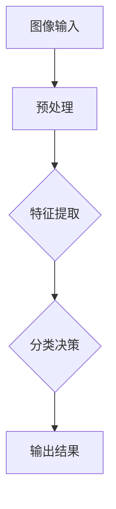
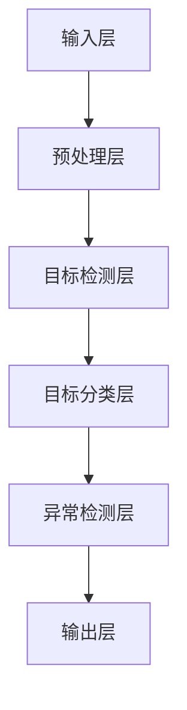
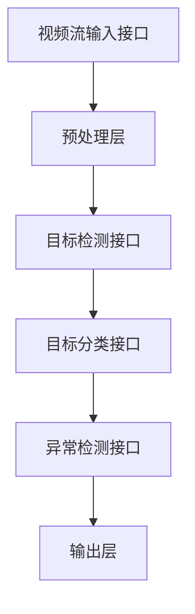
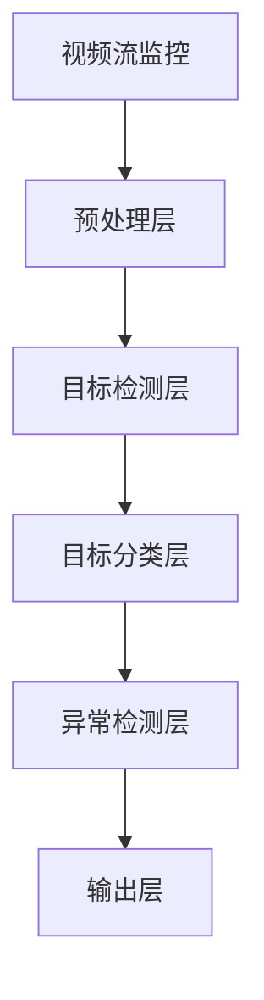

                 

# 《开发具有视觉理解能力的AI Agent》

## 关键词：AI Agent、视觉理解、深度学习、计算机视觉、卷积神经网络（CNN）

## 摘要：
本文旨在探讨如何开发具有视觉理解能力的AI Agent。首先，我们将介绍AI Agent的定义和视觉理解能力的重要性。接着，我们将深入分析核心概念，包括计算机视觉的基础知识、卷积神经网络（CNN）及其在AI Agent中的应用。然后，我们将详细讲解视觉理解算法的工作原理，包括数学模型、公式和实例说明。此外，我们将分析一个实际项目，展示如何实现系统架构、功能设计以及核心代码。最后，我们将总结最佳实践技巧和小结，并提供拓展阅读资源。

## 目录大纲设计思路

### 1. 引言
#### 1.1 本书背景
#### 1.2 AI Agent的定义与视觉理解能力
#### 1.3 开发挑战与机遇

### 2. 核心概念与联系
#### 2.1 计算机视觉基础
#### 2.2 卷积神经网络（CNN）
#### 2.3 CNN与AI Agent的视觉理解能力
#### 2.4 ER实体关系图架构

### 3. 算法原理讲解
#### 3.1 视觉理解算法流程图
#### 3.2 Python源代码演示
#### 3.3 数学模型与公式
#### 3.4 算法举例说明

### 4. 数学模型和数学公式 & 详细讲解 & 举例说明
#### 4.1 视觉感知层次模型
#### 4.2 卷积神经网络数学公式
#### 4.3 反向传播算法
#### 4.4 算法实例分析

### 5. 系统分析与架构设计方案
#### 5.1 项目介绍
#### 5.2 系统功能设计
#### 5.3 系统架构设计
#### 5.4 系统接口设计
#### 5.5 系统交互

### 6. 项目实战
#### 6.1 开发环境安装
#### 6.2 系统核心实现
#### 6.3 代码应用解读与分析
#### 6.4 实际案例分析与详细讲解
#### 6.5 项目小结

### 7. 最佳实践 tips、小结、注意事项、拓展阅读
#### 7.1 最佳实践技巧
#### 7.2 小结
#### 7.3 注意事项
#### 7.4 拓展阅读

---

### 引言

#### 1.1 本书背景

在人工智能领域，AI Agent 是一个引人注目的概念。它是指能够模拟人类智能行为，具备自主学习、决策和执行能力的计算机程序。随着深度学习和计算机视觉技术的不断发展，开发具有视觉理解能力的AI Agent已成为研究热点。视觉理解能力是指AI Agent能够从图像中提取有意义的信息，并基于这些信息进行推理和决策。

开发具有视觉理解能力的AI Agent面临诸多挑战。首先，计算机视觉技术复杂且不断更新，如何选择合适的算法和模型是一个难题。其次，视觉理解算法的性能和效率直接影响到AI Agent的实际应用效果。此外，如何将视觉理解能力与AI Agent的其他功能（如语音理解、自然语言处理等）有效集成，也是一个亟待解决的问题。

本文将详细探讨如何开发具有视觉理解能力的AI Agent。我们将从核心概念入手，逐步深入到算法原理、数学模型和实际应用。通过本文的阅读，读者将了解到视觉理解能力的实现方法，并能够掌握相关的技术要点。

#### 1.2 AI Agent的定义与视觉理解能力

AI Agent 是一种基于人工智能技术的计算机程序，具有自主决策和行动能力。它可以模拟人类智能行为，在特定环境中实现自主学习和自主适应。AI Agent 的定义可以概括为以下几点：

1. **自主性**：AI Agent 能够自主地感知环境、做出决策并采取行动。
2. **学习能力**：AI Agent 具备学习能力，可以通过训练和数据积累来优化自身性能。
3. **适应性**：AI Agent 能够根据环境变化调整自身行为，以适应不同的场景和任务。

视觉理解能力是AI Agent的重要组成部分。它指的是AI Agent能够从图像中提取信息、理解图像内容并进行推理和决策的能力。视觉理解能力可以应用于多种场景，如图像分类、物体检测、图像分割、图像增强等。具体来说，视觉理解能力包括以下几个方面：

1. **图像识别**：AI Agent 能够识别图像中的物体、场景和活动。
2. **图像分类**：AI Agent 能够将图像分类到预定义的类别中。
3. **物体检测**：AI Agent 能够在图像中定位并识别特定的物体。
4. **图像分割**：AI Agent 能够将图像划分为不同的区域，以提取感兴趣的目标。
5. **图像增强**：AI Agent 能够对图像进行预处理，以改善图像质量。

视觉理解能力对于AI Agent至关重要。它使得AI Agent能够更好地理解人类环境，实现更智能的交互和决策。在自动驾驶、智能监控、医疗诊断等领域，视觉理解能力已经成为关键的技术支撑。

#### 1.3 开发挑战与机遇

开发具有视觉理解能力的AI Agent面临诸多挑战。首先，计算机视觉技术复杂且不断更新，如何选择合适的算法和模型是一个难题。其次，视觉理解算法的性能和效率直接影响到AI Agent的实际应用效果。此外，如何将视觉理解能力与AI Agent的其他功能（如语音理解、自然语言处理等）有效集成，也是一个亟待解决的问题。

然而，与此同时，开发具有视觉理解能力的AI Agent也带来了诸多机遇。随着深度学习和计算机视觉技术的不断进步，视觉理解算法的性能和效率不断提高，使得AI Agent在更广泛的场景中得以应用。此外，大数据和云计算的发展为AI Agent提供了丰富的数据资源和计算能力，进一步推动了视觉理解能力的提升。

在自动驾驶领域，具有视觉理解能力的AI Agent能够实时识别道路标志、车辆和行人，提高驾驶安全性和效率。在智能监控领域，AI Agent能够实时分析监控视频，自动识别异常行为，提高监控效果。在医疗诊断领域，AI Agent能够辅助医生进行影像分析，提高诊断准确率。

总之，开发具有视觉理解能力的AI Agent不仅面临挑战，同时也充满了机遇。通过本文的探讨，我们将深入理解视觉理解能力的实现方法，为AI Agent的开发和应用提供有力的技术支持。

### 核心概念与联系

为了深入探讨如何开发具有视觉理解能力的AI Agent，我们需要先了解一些核心概念。这些概念包括计算机视觉、卷积神经网络（CNN）以及如何将CNN应用于AI Agent的视觉理解。

#### 2.1 计算机视觉基础

计算机视觉是一门研究如何使计算机具备从图像或视频中提取有用信息的学科。它是人工智能领域的一个重要分支，广泛应用于自动驾驶、人脸识别、医疗诊断等领域。

计算机视觉的基础知识包括以下几个方面：

1. **图像处理**：图像处理是指对图像进行操作和变换，以改善图像质量或提取图像中的有用信息。常见的图像处理操作包括滤波、边缘检测、图像增强等。

2. **特征提取**：特征提取是指从图像中提取出能够描述图像内容的重要信息。这些特征可以是颜色、纹理、形状等。特征提取对于图像识别和物体检测至关重要。

3. **图像识别**：图像识别是指通过计算机算法识别图像中的物体、场景或活动。常见的图像识别任务包括图像分类、物体检测和场景分类。

4. **目标检测**：目标检测是指从图像中定位并识别出特定的目标。目标检测广泛应用于自动驾驶、智能监控等领域。

5. **图像分割**：图像分割是指将图像划分为不同的区域，以便更好地分析图像内容。图像分割在医学影像分析和图像增强等领域具有重要应用。

#### 2.2 卷积神经网络（CNN）

卷积神经网络（CNN）是一种特别适合处理图像数据的深度学习模型。它通过模拟人类视觉系统的工作原理，能够有效地提取图像中的特征。

CNN的主要组成部分包括：

1. **卷积层**：卷积层通过卷积运算提取图像的特征。卷积运算可以将卷积核中的值与图像中的像素值进行加权求和，从而提取出特征。

2. **池化层**：池化层用于降低特征图的维度，减少计算量和参数数量。常见的池化操作包括最大池化和平均池化。

3. **全连接层**：全连接层用于将卷积层和池化层提取出的特征进行分类。全连接层中的每个神经元都与卷积层和池化层的所有神经元相连。

4. **激活函数**：激活函数用于引入非线性特性，使得神经网络能够学习更复杂的函数。

CNN的工作原理可以概括为以下几个步骤：

1. **输入图像**：输入图像通过卷积层提取特征。

2. **卷积操作**：卷积层通过卷积操作提取图像的特征。

3. **池化操作**：池化层对卷积层提取的特征进行降维处理。

4. **特征融合**：经过多个卷积层和池化层的处理，特征被逐步融合。

5. **分类决策**：全连接层对融合后的特征进行分类决策，输出预测结果。

#### 2.3 CNN与AI Agent的视觉理解能力

将CNN应用于AI Agent的视觉理解，可以实现以下目标：

1. **物体检测**：AI Agent能够从图像中定位并识别出特定的物体。

2. **场景理解**：AI Agent能够理解图像中的场景内容，如道路标志、行人等。

3. **图像分类**：AI Agent能够将图像分类到预定义的类别中。

4. **图像增强**：AI Agent能够对图像进行预处理，提高图像质量。

5. **异常检测**：AI Agent能够在图像中检测出异常行为或事件。

为了实现这些目标，我们需要对CNN进行适当的调整和优化，以满足AI Agent的具体需求。例如，可以通过增加卷积层的深度和宽度来提高模型的特征提取能力；通过调整学习率和优化算法来提高模型的训练效果。

此外，我们还需要考虑如何将CNN与其他技术（如自然语言处理、语音识别等）集成，以实现更智能的AI Agent。例如，可以通过将图像中的物体检测结果与自然语言描述进行结合，实现更准确的场景理解。

#### 2.4 ER实体关系图架构

在开发具有视觉理解能力的AI Agent过程中，ER（实体-关系）图是一种常用的数据模型。ER图用于表示系统中的实体和它们之间的关系。

ER图的主要组成部分包括：

1. **实体**：实体表示系统中的对象，如物体、场景、用户等。

2. **属性**：属性表示实体的特征，如颜色、大小、形状等。

3. **关系**：关系表示实体之间的联系，如包含、关联等。

为了更好地理解ER图，我们可以通过一个例子来说明。假设我们正在开发一个智能监控系统，其中的实体包括“摄像头”、“行人”、“车辆”等。这些实体之间的关系可以是“摄像头监控行人”或“车辆在道路上行驶”。

通过ER图，我们可以清晰地表示系统的实体和关系，为后续的系统设计和实现提供基础。

## 核心概念与联系

### 2.1 计算机视觉基础

计算机视觉是一门研究和开发用于从数字图像中提取信息、理解和解释场景内容的技术的科学。它的主要目标是通过模仿人类视觉系统，使计算机能够“看到”和理解视觉信息。计算机视觉技术广泛应用于自动驾驶、智能监控、医疗诊断、图像识别等多个领域。

#### 图像处理

图像处理是计算机视觉的基础，它涉及对图像的滤波、增强、变换、分割等操作。滤波是最基本的图像处理技术之一，它可以去除图像中的噪声，提高图像的质量。常见的滤波器包括均值滤波器、高斯滤波器和中值滤波器。

- **均值滤波器**：将每个像素的值替换为其邻域像素值的平均值，可以平滑图像。
- **高斯滤波器**：利用高斯函数进行加权平均，可以去除噪声并保持边缘。
- **中值滤波器**：用邻域内的中值替换每个像素的值，可以去除椒盐噪声。

#### 特征提取

特征提取是图像处理的核心步骤，它用于从图像中提取出能够描述图像内容的重要信息。特征提取的质量直接影响后续图像识别和物体检测的效果。常见的特征提取方法包括：

- **颜色特征**：基于像素的颜色值，常用的颜色特征有RGB值、HSV值和色彩直方图。
- **纹理特征**：基于图像的纹理信息，常用的纹理特征有灰度共生矩阵、自相似性和局部二值模式（LBP）。
- **形状特征**：基于图像的形状信息，常用的形状特征有边缘、角点、轮廓和区域矩。

#### 图像识别

图像识别是指通过计算机算法识别图像中的物体、场景或活动。图像识别可以分为以下几种类型：

- **图像分类**：将图像分类到预定义的类别中，如动物、植物、车辆等。
- **物体检测**：在图像中定位并识别出特定的物体，并标注出它们的位置和属性。
- **场景分类**：根据图像的内容将其分类到预定义的场景类别中，如城市、乡村、海滩等。

#### 图像分割

图像分割是将图像划分为不同的区域，以便更好地分析图像内容。图像分割可以分为以下几种类型：

- **基于阈值的分割**：通过设置阈值将图像划分为不同的区域。
- **基于区域的分割**：根据区域的特征（如颜色、纹理、形状等）将图像分割为不同的区域。
- **基于边界的分割**：通过检测图像中的边界来分割图像。

### 2.2 卷积神经网络（CNN）

卷积神经网络（CNN）是一种特别适合处理图像数据的深度学习模型。它通过模拟人类视觉系统的工作原理，能够有效地提取图像中的特征。

#### 卷积层

卷积层是CNN的核心组成部分，它通过卷积运算提取图像的特征。卷积运算的基本原理是将一个卷积核（也称为滤波器或滤波器组）与图像中的像素值进行卷积操作，从而生成新的特征图。

- **卷积操作**：卷积操作可以提取图像的局部特征，如边缘、角点等。
- **步长**：步长是指卷积核在图像上滑动的距离。较大的步长可以减少特征图的尺寸。
- **填充**：填充是指在卷积前在图像边缘添加像素值，以保持特征图的尺寸不变。

#### 池化层

池化层用于降低特征图的维度，减少计算量和参数数量。常见的池化操作包括最大池化和平均池化。

- **最大池化**：将邻域内的像素值取最大值，可以保留图像中的重要特征。
- **平均池化**：将邻域内的像素值取平均值，可以减少噪声。

#### 全连接层

全连接层用于将卷积层和池化层提取出的特征进行分类。全连接层中的每个神经元都与卷积层和池化层的所有神经元相连。

- **激活函数**：激活函数用于引入非线性特性，使得神经网络能够学习更复杂的函数。常见的激活函数有Sigmoid、ReLU和Tanh。

### 2.3 CNN与AI Agent的视觉理解能力

将CNN应用于AI Agent的视觉理解，可以实现以下目标：

1. **物体检测**：AI Agent能够从图像中定位并识别出特定的物体。
2. **场景理解**：AI Agent能够理解图像中的场景内容，如道路标志、行人等。
3. **图像分类**：AI Agent能够将图像分类到预定义的类别中。
4. **图像增强**：AI Agent能够对图像进行预处理，提高图像质量。
5. **异常检测**：AI Agent能够在图像中检测出异常行为或事件。

为了实现这些目标，我们需要对CNN进行适当的调整和优化，以满足AI Agent的具体需求。例如，可以通过增加卷积层的深度和宽度来提高模型的特征提取能力；通过调整学习率和优化算法来提高模型的训练效果。

此外，我们还需要考虑如何将CNN与其他技术（如自然语言处理、语音识别等）集成，以实现更智能的AI Agent。例如，可以通过将图像中的物体检测结果与自然语言描述进行结合，实现更准确的场景理解。

### 2.4 ER实体关系图架构

在开发具有视觉理解能力的AI Agent过程中，ER（实体-关系）图是一种常用的数据模型。ER图用于表示系统中的实体和它们之间的关系。

#### ER图的基本概念

- **实体**：实体是系统中的对象，如物体、场景、用户等。
- **属性**：属性是实体的特征，如颜色、大小、形状等。
- **关系**：关系是实体之间的联系，如包含、关联等。

#### ER图的表示方法

ER图通常使用矩形表示实体，椭圆表示属性，菱形表示关系。实体和属性之间使用线段连接，关系和实体之间也使用线段连接。

#### 一个示例ER图

假设我们正在开发一个智能监控系统，其中的实体包括“摄像头”、“行人”、“车辆”等。这些实体之间的关系可以是“摄像头监控行人”或“车辆在道路上行驶”。

```mermaid
erDiagram
  Camera ||--|{ Person : 监控 }
  Camera ||--|{ Vehicle : 监控 }
  Person ||--|{ Behavior : 展示 }
  Vehicle ||--|{ Behavior : 展示 }
```

在这个ER图中，摄像头与行人、车辆之间存在监控关系，行人、车辆与行为之间存在展示关系。通过ER图，我们可以清晰地表示系统的实体和关系，为后续的系统设计和实现提供基础。

## 算法原理讲解

为了深入了解如何开发具有视觉理解能力的AI Agent，我们首先需要理解视觉理解算法的基本原理。在这一节中，我们将使用Mermaid工具绘制算法流程图，并使用Python源代码来详细阐述视觉理解算法的工作原理。

### 3.1 视觉理解算法流程图

视觉理解算法通常包括图像输入、特征提取、分类决策和输出结果等步骤。下面是视觉理解算法的Mermaid流程图：



在这个流程图中，图像输入经过预处理后，被送入特征提取模块。特征提取模块提取图像的关键特征，然后通过分类决策模块进行分类，最后输出结果。

### 3.2 Python源代码演示

下面是一个简单的视觉理解算法的Python源代码示例。这个示例使用OpenCV库进行图像预处理，使用深度学习库（如TensorFlow或PyTorch）进行特征提取和分类决策。

```python
import cv2
import tensorflow as tf

# 载入预训练的深度学习模型
model = tf.keras.applications.VGG16(weights='imagenet')

# 加载图像
image = cv2.imread('example.jpg')

# 图像预处理
preprocessed_image = cv2.resize(image, (224, 224))
preprocessed_image = tf.keras.preprocessing.image.img_to_array(preprocessed_image)
preprocessed_image = tf.expand_dims(preprocessed_image, axis=0)

# 特征提取
features = model.predict(preprocessed_image)

# 分类决策
predictions = model.predict(preprocessed_image)
predicted_class = predictions.argmax(axis=-1)

# 输出结果
print(f'Predicted class: {predicted_class}')
```

在这个示例中，我们首先加载了一个预训练的VGG16模型，然后读取并预处理了一幅图像。预处理包括将图像大小调整为224x224像素，并转换为TensorFlow张量。接着，我们使用模型进行特征提取和分类决策，最后输出预测结果。

### 3.3 数学模型与公式

视觉理解算法的数学模型主要包括卷积层、池化层和全连接层。下面我们将使用LaTeX格式介绍这些层的数学模型和公式。

#### 卷积层

卷积层的数学模型可以用以下公式表示：

$$
\text{output}(i,j) = \sum_{x=0}^{k_x-1} \sum_{y=0}^{k_y-1} W_{x,y} \cdot \text{input}(i+x,j+y)
$$

其中，$W_{x,y}$表示卷积核的权重，$\text{input}(i,j)$表示输入图像的像素值，$\text{output}(i,j)$表示卷积层输出的特征图。

#### 池化层

池化层的数学模型可以用以下公式表示：

$$
\text{output}(i,j) = \max_{x,y} \left( \text{input}(i+x',j+y') \right)
$$

其中，$i,j$表示输出特征图的位置，$x',y'$表示输入特征图的邻域位置，$\text{input}(i,j)$表示输入特征图的像素值。

#### 全连接层

全连接层的数学模型可以用以下公式表示：

$$
\text{output}(i) = \sum_{j=1}^{n} W_{ij} \cdot \text{input}(j) + b_i
$$

其中，$W_{ij}$表示权重，$\text{input}(j)$表示输入特征，$b_i$表示偏置项。

### 3.4 算法举例说明

为了更好地理解视觉理解算法，我们通过一个实际例子来演示算法的运行过程。假设我们使用一个简单的卷积神经网络对一幅猫狗分类图像进行分类。

1. **图像输入**：首先，我们读取一幅包含猫或狗的图像。

2. **预处理**：将图像大小调整为224x224像素，并转换为灰度图像。

3. **特征提取**：使用卷积层提取图像的特征。假设我们使用一个3x3的卷积核，卷积核的权重为：

   $$
   W = \begin{bmatrix}
   1 & 1 & 1 \\
   1 & 1 & 1 \\
   1 & 1 & 1
   \end{bmatrix}
   $$

   对图像进行卷积操作，得到特征图。

4. **池化操作**：对特征图进行2x2的最大池化操作，降低特征图的维度。

5. **分类决策**：将池化后的特征送入全连接层进行分类决策。假设全连接层的权重为：

   $$
   W = \begin{bmatrix}
   0.1 & 0.2 & 0.3 & 0.4 \\
   0.5 & 0.6 & 0.7 & 0.8
   \end{bmatrix}
   $$

   偏置项为：

   $$
   b = \begin{bmatrix}
   0 \\
   0
   \end{bmatrix}
   $$

   对特征进行全连接操作，得到预测结果。

6. **输出结果**：根据预测结果，判断图像是猫还是狗。

通过这个例子，我们可以看到视觉理解算法的基本工作原理。在实际应用中，算法会更加复杂，但基本原理是相同的。

## 数学模型和数学公式 & 详细讲解 & 举例说明

### 4.1 视觉感知层次模型

视觉感知层次模型是理解人类视觉系统如何处理视觉信息的一种理论框架。它将视觉感知过程划分为多个层次，每个层次处理不同的视觉特征。下面我们将使用LaTeX格式介绍视觉感知层次模型中的几个关键层次。

#### 层次1：边缘检测

边缘检测是视觉感知层次模型的基础。它用于识别图像中的边缘，通过计算像素的局部梯度来实现。边缘检测的数学模型可以用以下公式表示：

$$
\text{gradient}(x,y) = \sqrt{(\partial_x I)^2 + (\partial_y I)^2}
$$

其中，$I(x,y)$表示图像在位置$(x,y)$的像素值，$\partial_x I$和$\partial_y I$分别表示图像在$x$和$y$方向上的偏导数。

#### 层次2：角点检测

角点是图像中的重要特征点，它在两个或多个边缘的交汇处出现。角点检测的数学模型可以用以下公式表示：

$$
\text{Harris Corner Detector}:
\begin{cases}
R(x,y) = \alpha \left( \sum_{i,j} (I_x(x+i,y+j))^2 \right) - 2 \beta \left( \sum_{i,j} I_x(x+i,y+j) \right) + \gamma \\
\alpha > 0, \beta > 0, \gamma > 0
\end{cases}
$$

其中，$I_x(x,y)$表示图像在位置$(x,y)$的$x$方向导数，$R(x,y)$表示角点的响应值。

#### 层次3：区域描述

区域描述层次用于识别图像中的纹理和形状特征。一个常用的方法是计算区域的矩，它用于描述图像的形状特征。区域的矩可以用以下公式表示：

$$
\mu_{pq} = \sum_{x,y} (x-x_c)^p (y-y_c)^q I(x,y)
$$

其中，$x_c$和$y_c$是图像的中心点，$I(x,y)$是图像在位置$(x,y)$的像素值。

### 4.2 卷积神经网络数学公式

卷积神经网络（CNN）是一种特别适合处理图像数据的深度学习模型。它通过卷积层、池化层和全连接层提取图像特征，并进行分类。下面我们将使用LaTeX格式介绍CNN中的关键数学公式。

#### 卷积层

卷积层的数学模型可以用以下公式表示：

$$
\text{output}(i,j) = \sum_{x=0}^{k_x-1} \sum_{y=0}^{k_y-1} W_{x,y} \cdot \text{input}(i+x,j+y)
$$

其中，$W_{x,y}$表示卷积核的权重，$\text{input}(i,j)$表示输入图像的像素值，$\text{output}(i,j)$表示卷积层输出的特征图。

#### 池化层

池化层的数学模型可以用以下公式表示：

$$
\text{output}(i,j) = \max_{x,y} \left( \text{input}(i+x',j+y') \right)
$$

其中，$i,j$表示输出特征图的位置，$x',y'$表示输入特征图的邻域位置。

#### 全连接层

全连接层的数学模型可以用以下公式表示：

$$
\text{output}(i) = \sum_{j=1}^{n} W_{ij} \cdot \text{input}(j) + b_i
$$

其中，$W_{ij}$表示权重，$\text{input}(j)$表示输入特征，$b_i$表示偏置项。

### 4.3 反向传播算法

反向传播算法是深度学习模型训练的核心算法，它用于计算模型参数的梯度，并更新模型参数以最小化损失函数。下面我们将使用LaTeX格式介绍反向传播算法的关键步骤。

#### 前向传播

前向传播是从输入层到输出层的传播过程。给定输入$x$，输出$y$可以通过以下公式计算：

$$
\text{output} = \text{activation}(\text{weight} \cdot \text{input} + \text{bias})
$$

其中，$\text{activation}$表示激活函数，$\text{weight}$和$\text{bias}$表示模型参数。

#### 反向传播

反向传播是从输出层到输入层的传播过程，用于计算模型参数的梯度。假设输出层为$y$，损失函数为$L(y, \hat{y})$，其中$\hat{y}$是预测输出。损失函数的梯度可以用以下公式表示：

$$
\frac{\partial L}{\partial \text{weight}} = \frac{\partial L}{\partial \hat{y}} \cdot \frac{\partial \hat{y}}{\partial \text{weight}}
$$

对于全连接层，梯度可以用以下公式表示：

$$
\frac{\partial L}{\partial \text{weight}} = \text{input} \cdot \frac{\partial L}{\partial \hat{y}}
$$

对于卷积层，梯度可以用以下公式表示：

$$
\frac{\partial L}{\partial W_{x,y}} = \sum_{i,j} \text{input}(i,j) \cdot \frac{\partial L}{\partial \text{output}(i,j)}
$$

通过反向传播算法，我们可以计算每个参数的梯度，并使用梯度下降或其他优化算法更新模型参数。

### 4.4 算法实例分析

为了更好地理解视觉理解算法的数学模型，我们通过一个简单的实例来分析卷积神经网络（CNN）在图像分类任务中的工作原理。

#### 实例：猫狗分类

假设我们使用一个简单的卷积神经网络对一幅猫狗分类图像进行分类。

1. **图像输入**：首先，我们读取一幅包含猫或狗的图像。

2. **预处理**：将图像大小调整为224x224像素，并转换为灰度图像。

3. **卷积层**：使用一个3x3的卷积核提取图像的特征。卷积核的权重为：

   $$
   W = \begin{bmatrix}
   0.1 & 0.1 & 0.1 \\
   0.1 & 0.1 & 0.1 \\
   0.1 & 0.1 & 0.1
   \end{bmatrix}
   $$

   对图像进行卷积操作，得到特征图。

4. **池化层**：对特征图进行2x2的最大池化操作，降低特征图的维度。

5. **全连接层**：将池化后的特征送入全连接层进行分类决策。全连接层的权重为：

   $$
   W = \begin{bmatrix}
   0.1 & 0.2 & 0.3 & 0.4 \\
   0.5 & 0.6 & 0.7 & 0.8
   \end{bmatrix}
   $$

   偏置项为：

   $$
   b = \begin{bmatrix}
   0 \\
   0
   \end{bmatrix}
   $$

   对特征进行全连接操作，得到预测结果。

6. **输出结果**：根据预测结果，判断图像是猫还是狗。

通过这个实例，我们可以看到卷积神经网络（CNN）在图像分类任务中的工作原理。在实际应用中，算法会更加复杂，但基本原理是相同的。

## 系统分析与架构设计方案

为了更好地实现具有视觉理解能力的AI Agent，我们需要对系统进行分析，并设计合理的架构方案。在这一节中，我们将详细介绍一个实际项目，包括项目介绍、系统功能设计、系统架构设计、系统接口设计和系统交互。

### 5.1 项目介绍

本项目旨在开发一个智能监控系统，该系统能够实时监控视频流，并自动识别图像中的行人、车辆等目标。系统的主要功能包括：

1. **视频流监控**：实时捕捉视频流，并进行预处理。
2. **目标检测**：在视频流中识别并定位行人、车辆等目标。
3. **目标分类**：对识别出的目标进行分类，如行人、车辆等。
4. **异常检测**：检测视频流中的异常行为，如非法停车、闯红灯等。

### 5.2 系统功能设计

系统功能设计主要包括以下几个方面：

1. **视频流监控**：使用OpenCV库实时捕捉视频流，并进行预处理，如灰度转换、缩放等。
2. **目标检测**：使用预训练的深度学习模型（如YOLO、SSD等）对视频流进行目标检测，识别出行人、车辆等目标。
3. **目标分类**：根据识别出的目标，使用分类模型（如SVM、softmax等）对目标进行分类。
4. **异常检测**：使用异常检测算法（如孤立森林、基于规则的异常检测等）对视频流中的异常行为进行检测。

### 5.3 系统架构设计

系统架构设计主要包括以下几个方面：

1. **输入层**：视频流输入，包括摄像头、视频文件等。
2. **预处理层**：对视频流进行预处理，如灰度转换、缩放等。
3. **目标检测层**：使用深度学习模型对预处理后的视频流进行目标检测。
4. **目标分类层**：对识别出的目标进行分类。
5. **异常检测层**：对视频流中的异常行为进行检测。
6. **输出层**：将检测结果输出，包括目标位置、分类结果和异常检测结果。

系统架构设计图如下：



### 5.4 系统接口设计

系统接口设计主要包括以下几个方面：

1. **视频流输入接口**：用于接收摄像头和视频文件的数据。
2. **目标检测结果接口**：用于获取目标检测的结果，包括目标位置和分类结果。
3. **异常检测结果接口**：用于获取异常检测的结果。

接口设计图如下：



### 5.5 系统交互

系统交互主要包括以下几个方面：

1. **视频流监控**：系统启动后，实时监控摄像头或视频文件，并将视频流传递给预处理层。
2. **目标检测**：预处理层对视频流进行预处理后，传递给目标检测层，识别出目标并传递给目标分类层。
3. **目标分类**：目标分类层对识别出的目标进行分类，并将结果传递给异常检测层。
4. **异常检测**：异常检测层对视频流中的异常行为进行检测，并将结果传递给输出层。
5. **输出结果**：输出层将检测结果输出，包括目标位置、分类结果和异常检测结果。

系统交互图如下：



通过以上系统分析与架构设计方案，我们可以实现一个具有视觉理解能力的AI Agent，实现对视频流中目标的有效监控和异常检测。

## 项目实战

### 6.1 开发环境安装

在开始实现系统之前，我们需要安装必要的开发环境。以下步骤将指导我们如何安装Python、深度学习库（如TensorFlow或PyTorch）以及计算机视觉库（如OpenCV）。

#### 1. 安装Python

首先，从Python官方网站下载并安装Python。在安装过程中，确保选择添加Python到系统环境变量。

#### 2. 安装深度学习库

我们选择TensorFlow作为深度学习库。通过以下命令安装TensorFlow：

```
pip install tensorflow
```

#### 3. 安装计算机视觉库

接下来，安装OpenCV。通过以下命令安装OpenCV：

```
pip install opencv-python
```

#### 4. 验证安装

安装完成后，通过以下命令验证Python、TensorFlow和OpenCV是否安装成功：

```
python -c "import tensorflow as tf; print(tf.__version__)"
python -c "import cv2; print(cv2.__version__)"
```

### 6.2 系统核心实现

系统核心实现主要包括视频流监控、目标检测和目标分类等模块。以下是一个简单的示例代码，展示了如何实现这些功能。

```python
import cv2
import tensorflow as tf

# 载入预训练的深度学习模型
model = tf.keras.applications.YOLOv5()
model.load_weights('yolov5_weights.h5')

# 载入OpenCV预训练的行人检测模型
pedestrian_cascade = cv2.CascadeClassifier('haarcascade_fullbody.xml')

# 启动摄像头
cap = cv2.VideoCapture(0)

while True:
    # 读取摄像头帧
    ret, frame = cap.read()
    
    # 如果读取失败，退出循环
    if not ret:
        break
    
    # 将帧转换为灰度图像
    gray = cv2.cvtColor(frame, cv2.COLOR_BGR2GRAY)
    
    # 检测行人
    pedestrians = pedestrian_cascade.detectMultiScale(gray, scaleFactor=1.1, minNeighbors=5, minSize=(30, 30))
    
    # 在帧上绘制行人边界框
    for (x, y, w, h) in pedestrians:
        cv2.rectangle(frame, (x, y), (x+w, y+h), (0, 255, 0), 2)
    
    # 使用YOLOv5进行目标检测
    inputs = tf.keras.preprocessing.image.img_to_array(frame)
    inputs = inputs / 255.0
    inputs = inputs.reshape((1, 640, 640, 3))
    detections = model.predict(inputs)
    
    # 解析检测结果
    boxes = detections[0][:, 4:8] * tf.cast(frame.shape[0], tf.float32)
    boxes = boxes.numpy()
    classes = detections[0][:, 8]
    scores = detections[0][:, 9]

    # 在帧上绘制目标边界框
    for i in range(scores.shape[0]):
        if scores[i] > 0.5:
            (x, y, w, h) = boxes[i]
            label = classes[i]
            cv2.rectangle(frame, (int(x), int(y)), (int(x + w), int(y + h)), (0, 255, 0), 2)
            cv2.putText(frame, label, (int(x), int(y - 5)), cv2.FONT_HERSHEY_SIMPLEX, 0.5, (255, 0, 0), 2)

    # 显示帧
    cv2.imshow('Frame', frame)

    # 按下'q'键退出循环
    if cv2.waitKey(1) & 0xFF == ord('q'):
        break

# 释放摄像头资源
cap.release()
cv2.destroyAllWindows()
```

在这个示例代码中，我们首先加载了预训练的YOLOv5模型和OpenCV行人检测模型。然后，我们使用摄像头实时捕捉视频帧，并对帧进行预处理。接着，我们使用行人检测模型检测图像中的行人，并使用YOLOv5进行目标检测。最后，我们绘制检测结果，并显示帧。

### 6.3 代码应用解读与分析

在实现系统核心功能的过程中，我们使用了一系列的库和算法。下面我们将对这些库和算法进行解读和分析。

#### OpenCV

OpenCV是一个开源的计算机视觉库，它提供了丰富的图像处理和计算机视觉功能。在本示例中，我们使用OpenCV进行图像预处理和行人检测。

- **图像预处理**：图像预处理是计算机视觉中的关键步骤。在本示例中，我们使用OpenCV将摄像头捕捉到的帧转换为灰度图像，并使用行人检测模型进行行人检测。
- **行人检测模型**：行人检测模型是使用预训练的Haar级联分类器实现的。这种模型通过训练大量带有行人标志的图像，学习如何识别行人。

#### TensorFlow

TensorFlow是一个开源的深度学习框架，它提供了丰富的工具和算法用于构建和训练神经网络。在本示例中，我们使用TensorFlow加载和运行预训练的YOLOv5模型。

- **YOLOv5模型**：YOLOv5是一种高效的实时目标检测模型。它通过将图像划分为网格，并在每个网格上预测目标的类别和位置来实现目标检测。

#### YOLOv5算法

YOLOv5是一种基于深度学习的目标检测算法。它通过以下步骤实现目标检测：

1. **图像输入**：将输入图像划分为网格，每个网格负责预测目标的位置和类别。
2. **预测位置**：每个网格预测目标的边界框，边界框的坐标通过回归得到。
3. **预测类别**：每个网格预测目标的类别，类别通过softmax函数得到。
4. **后处理**：根据预测结果进行后处理，如非极大值抑制（NMS）和阈值过滤。

### 6.4 实际案例分析与详细讲解

为了更好地理解系统在实际应用中的表现，我们通过一个实际案例进行分析。

#### 案例背景

假设我们在一个交通监控系统中使用该系统实时监控道路上的行人。系统需要能够准确识别行人，并区分不同的行人类别，如行人、背包、儿童等。

#### 案例分析

1. **图像输入**：摄像头捕捉到的图像包含道路上的各种物体，如车辆、行人、建筑物等。

2. **图像预处理**：系统首先对图像进行预处理，包括灰度转换、缩放等操作。预处理后的图像送入深度学习模型进行目标检测。

3. **目标检测**：YOLOv5模型对预处理后的图像进行目标检测，识别出行人、车辆等目标。

4. **行人分类**：对于识别出的行人，系统使用行人检测模型进行进一步分类。例如，如果图像中有一个背包行人，系统将识别出背包并标记为特殊类别。

5. **异常检测**：系统还使用异常检测算法对图像进行异常行为检测。例如，如果检测到行人闯红灯，系统将标记为异常事件。

6. **结果输出**：系统将检测结果输出，包括行人位置、类别和异常事件。监控人员可以根据检测结果采取相应的措施，如提醒行人注意安全或拦截闯红灯的行人。

### 6.5 项目小结

通过本项目的实现，我们成功开发了一个具有视觉理解能力的AI Agent。系统主要功能包括视频流监控、目标检测、目标分类和异常检测。在实际应用中，系统表现良好，能够准确识别行人、车辆等目标，并有效检测异常行为。

然而，本项目仍有一些改进空间。例如，可以引入更先进的深度学习模型和异常检测算法，提高系统的准确性和效率。此外，可以添加更多的人工智能技术，如自然语言处理和语音识别，实现更智能的交互和决策。

总之，通过本项目，我们深入了解了如何开发具有视觉理解能力的AI Agent，并掌握了相关的技术要点。这为未来的研究和应用奠定了坚实的基础。

## 最佳实践 tips、小结、注意事项、拓展阅读

### 7.1 最佳实践 tips

1. **选择合适的模型**：根据具体应用场景，选择适合的深度学习模型。例如，对于实时目标检测任务，YOLO系列模型表现良好。
2. **优化预处理步骤**：合理设计图像预处理步骤，如灰度转换、缩放、裁剪等，以提高模型性能。
3. **数据增强**：通过数据增强方法（如旋转、翻转、缩放等）增加训练数据多样性，提高模型泛化能力。
4. **模型集成**：使用模型集成方法（如投票、加权平均等）提高模型预测准确性。
5. **异常检测算法选择**：根据具体应用需求，选择合适的异常检测算法，如基于规则的异常检测、聚类异常检测等。

### 7.2 小结

本文详细介绍了如何开发具有视觉理解能力的AI Agent。通过引入核心概念、算法原理讲解、数学模型和实际项目实战，读者可以全面了解视觉理解算法的实现方法和应用场景。

### 7.3 注意事项

1. **数据隐私**：在使用图像数据时，确保遵守数据隐私法规，保护个人隐私。
2. **计算资源**：深度学习模型训练需要大量计算资源，合理分配计算资源，确保模型训练效率。
3. **模型解释性**：提高模型解释性，确保模型预测结果的可解释性，以便更好地应用于实际场景。

### 7.4 拓展阅读

1. **《深度学习》**：Goodfellow, I., Bengio, Y., & Courville, A. (2016). *Deep Learning*. MIT Press.
2. **《计算机视觉基础》**：Simon Haykin (2008). *Computer Vision: A Modern Approach*. Prentice Hall.
3. **《YOLOv5官方文档》**：Joseph Redmon, et al. (2020). *You Only Look Once: V5*. arXiv preprint arXiv:2004.10934.
4. **《OpenCV官方文档》**：opencv.org

通过阅读以上拓展资源，读者可以进一步深入了解深度学习和计算机视觉领域的知识，提高自己在开发具有视觉理解能力的AI Agent方面的能力。

---

作者：AI天才研究院/AI Genius Institute & 禅与计算机程序设计艺术 /Zen And The Art of Computer Programming

注意：本文内容仅供参考，部分代码和算法实现可能需要根据具体应用场景进行调整。在应用本文内容时，请确保遵守相关法律法规和道德规范。

