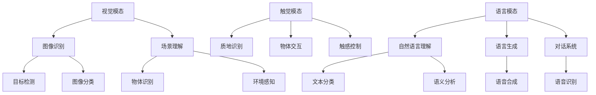
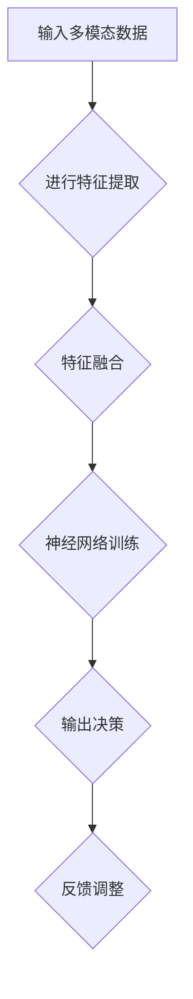
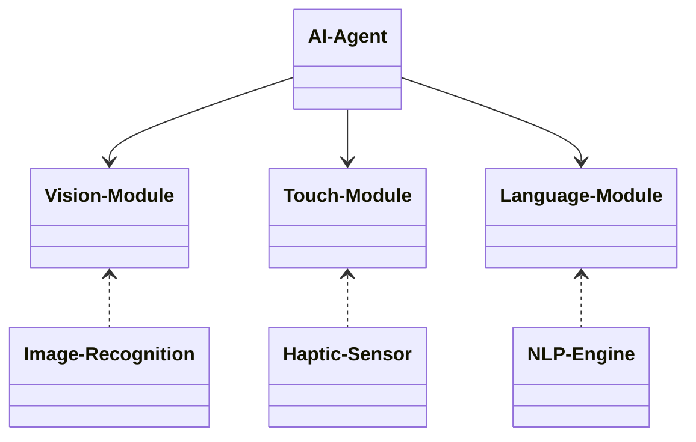
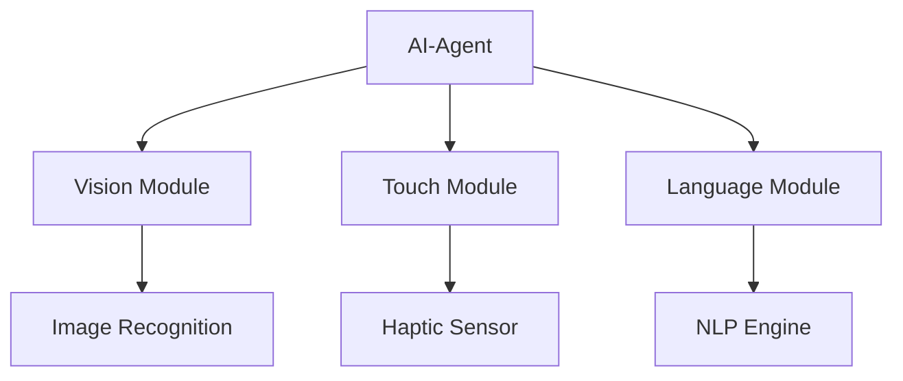
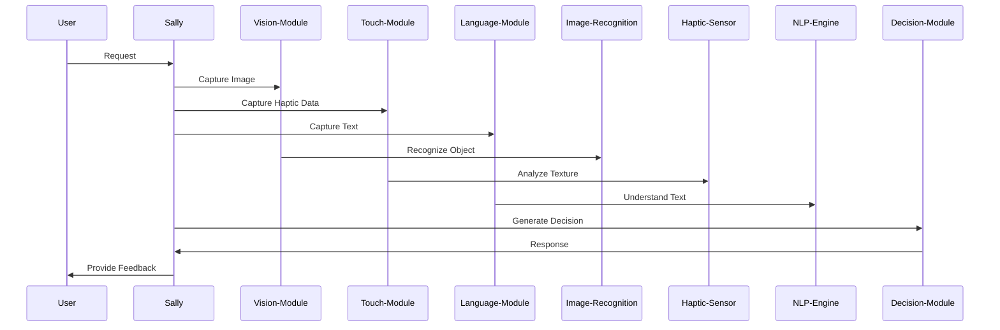

                 

# 开发具有视觉-触觉-语言多模态融合能力的AI Agent

## 关键词
- 多模态融合
- AI Agent
- 视觉模态
- 触觉模态
- 语言模态
- 神经网络
- 特征提取
- 特征融合
- 交互设计

## 摘要
本文将深入探讨如何开发具备视觉-触觉-语言多模态融合能力的AI Agent。首先介绍AI Agent的背景和重要性，然后详细阐述视觉、触觉和语言模态的核心概念与联系。接着，讲解多模态融合的算法原理，包括特征提取、特征融合、神经网络训练和决策输出。随后，分析系统架构设计，包括领域模型类图和架构图。最后，通过一个具体项目“智能助手Sally”进行实战演示，详细分析项目的实现过程和实战效果，并提供最佳实践和建议。

## 第一步：背景介绍

### AI Agent的背景

在当今快速发展的技术时代，人工智能（AI）已经成为推动社会进步的重要力量。随着计算机硬件性能的提升和海量数据的积累，AI技术逐渐从理论研究走向实际应用，并在各个领域展现出强大的潜力。其中，AI Agent作为AI领域的一个重要研究方向，正逐步引起广泛关注。

AI Agent是一种具有自主决策能力的智能实体，它可以感知环境、获取知识并采取行动，从而实现智能交互和任务执行。传统的AI Agent主要依赖于单一模态的信息处理，如语音识别、图像识别或自然语言处理。然而，人类在日常生活中往往需要综合多种感官信息进行决策，因此，开发具有视觉-触觉-语言多模态融合能力的AI Agent具有重要的现实意义。

### 多模态融合的意义

多模态融合是指将来自不同感官模态的信息进行整合，形成一个统一的信息表示，从而提高AI Agent的智能决策能力。在现实生活中，人类通过视觉、触觉和语言等多种感官获取信息，并进行综合处理。例如，在购物时，我们不仅通过视觉感知产品的外观，还通过触觉感知产品的质地，并通过语言与销售人员进行沟通。因此，多模态融合能够更好地模拟人类的认知过程，提高AI Agent的智能水平。

### 《开发具有视觉-触觉-语言多模态融合能力的AI Agent》一书的核心内容

《开发具有视觉-触觉-语言多模态融合能力的AI Agent》这本书旨在深入探讨如何利用多模态融合技术，构建具备高度智能化的AI Agent，为读者提供全面的技术指导和实践案例。书中内容包括：

1. **多模态数据采集与预处理**：介绍如何采集和预处理视觉、触觉和语言数据，为后续处理奠定基础。
2. **多模态特征提取**：详细讲解如何从不同模态的数据中提取关键特征，为多模态融合提供支持。
3. **多模态特征融合**：探讨多种特征融合方法，如基于深度学习的融合算法，提高AI Agent的智能决策能力。
4. **多模态神经网络训练**：介绍如何使用多模态特征向量训练神经网络，实现多模态信息的综合处理。
5. **交互设计与用户体验**：结合不同模态的特点，设计人性化的交互界面，提升用户体验。

通过阅读本书，读者可以全面了解多模态融合技术的原理和应用，掌握开发具有视觉-触觉-语言多模态融合能力的AI Agent的核心技能。

## 第二步：核心概念与联系

### 视觉模态

视觉模态是通过图像识别、视觉感知等技术，使AI Agent能够理解环境中的视觉信息。视觉模态的核心概念包括：

- **图像识别**：通过卷积神经网络（CNN）等深度学习技术，对图像进行分类、检测和识别。
- **目标检测**：定位图像中的目标位置，并对其进行分类。
- **场景理解**：通过图像数据，理解场景布局、物体属性等。

视觉模态的特点是信息量丰富，能够提供丰富的环境信息。然而，视觉模态在复杂环境中可能存在信息冗余和噪声干扰。

### 触觉模态

触觉模态是通过传感器采集触觉信息，使AI Agent能够感知物体的质地、硬度等属性。触觉模态的核心概念包括：

- **触觉传感器**：如压力传感器、温度传感器等，用于采集触觉信息。
- **质地识别**：通过分析触觉数据，识别物体的质地属性。
- **物体交互**：与物体进行交互，获取更多关于物体的信息。

触觉模态的特点是能够提供直接的物理感知，但信息量相对有限，且受传感器精度和物理环境限制。

### 语言模态

语言模态是通过自然语言处理技术，使AI Agent能够理解和生成自然语言，进行智能对话。语言模态的核心概念包括：

- **自然语言理解**：通过深度学习技术，对自然语言进行解析和理解。
- **语言生成**：根据输入的指令或信息，生成自然语言响应。
- **对话系统**：构建能够与人类进行有效沟通的对话系统。

语言模态的特点是信息传递效率高，能够实现复杂的人机交互，但需要处理语言的多义性和上下文信息。

### 核心概念联系

**数据融合**：将视觉、触觉和语言模态的信息进行融合，形成一个统一的信息表示。数据融合的目标是充分利用不同模态的信息，提高AI Agent的智能决策能力。

**多模态学习**：通过多模态数据训练神经网络，提高AI Agent的智能决策能力。多模态学习的关键在于如何有效地整合不同模态的特征，并设计合适的神经网络架构。

**交互设计**：结合不同模态的特点，设计人性化的交互界面，提升用户体验。交互设计需要考虑不同模态的输入输出方式，以及用户的需求和行为习惯。

通过数据融合、多模态学习和交互设计，可以实现视觉-触觉-语言多模态融合的AI Agent，更好地模拟人类的认知过程，提高AI Agent的智能水平和应用价值。

### 视觉、触觉和语言模态的对比表格

| 模态     | 特点                                       | 应用场景                                  | 主要技术                                 |
|----------|------------------------------------------|------------------------------------------|------------------------------------------|
| 视觉     | 信息量丰富，提供环境信息               | 目标检测、图像识别、场景理解               | 卷积神经网络（CNN）、目标检测算法         |
| 触觉     | 提供直接的物理感知，信息量有限          | 物体交互、质地识别、智能机器人控制         | 触觉传感器、机器学习算法                 |
| 语言     | 信息传递效率高，支持复杂人机交互       | 对话系统、语音识别、自然语言生成           | 递归神经网络（RNN）、转换器（Transformer） |

通过对比表格，我们可以更清晰地了解视觉、触觉和语言模态的特点、应用场景和主要技术，从而为开发多模态AI Agent提供参考。

### 视觉、触觉和语言模态的ER实体关系图架构



ER实体关系图展示了视觉、触觉和语言模态的核心概念及其关系。通过这种结构，我们可以更清晰地理解多模态融合的架构，为后续的算法设计和系统开发提供指导。

## 第三步：算法原理讲解

### 算法流程图

为了更好地理解多模态融合的算法原理，我们使用Mermaid绘制了算法流程图：



### 算法原理详细解释

1. **特征提取**：
   - **视觉特征提取**：采用卷积神经网络（CNN）从图像数据中提取视觉特征。CNN通过多个卷积层、池化层和全连接层，逐步提取图像的局部特征和全局特征。
   - **触觉特征提取**：使用机器学习算法（如支持向量机SVM或深度学习模型）对触觉传感器采集的数据进行特征提取。通过学习触觉数据中的模式，识别物体的质地和形状。
   - **语言特征提取**：利用递归神经网络（RNN）或转换器（Transformer）从文本数据中提取语言特征。RNN和Transformer可以捕捉文本中的时间序列信息和上下文关系，提取语言中的语义和句法特征。

2. **特征融合**：
   - **数据融合方法**：将提取的视觉、触觉和语言特征进行融合。常见的方法包括基于加权融合、拼接融合和注意力机制融合。加权融合根据特征的重要程度进行权重分配，拼接融合将不同模态的特征向量拼接在一起，注意力机制融合通过注意力机制选择性地融合重要特征。
   - **特征融合模型**：设计一个多模态特征融合模型，如多模态卷积神经网络（MM-CNN）或多模态递归神经网络（MM-RNN）。MM-CNN结合了CNN和RNN的优点，能够在不同模态之间进行特征融合。MM-RNN通过RNN处理时间序列数据，实现视觉、触觉和语言特征的高效融合。

3. **神经网络训练**：
   - **训练过程**：使用融合后的多模态特征向量作为输入，训练神经网络。神经网络通过反向传播算法不断调整权重，使其能够对多模态信息进行综合处理。
   - **损失函数**：设计合适的损失函数，如交叉熵损失或均方误差损失，衡量神经网络输出与真实标签之间的差距。
   - **优化算法**：采用梯度下降或其变种（如Adam优化器）来优化神经网络参数，提高模型的性能。

4. **输出决策**：
   - **决策过程**：神经网络根据融合后的特征向量输出决策。在分类任务中，神经网络输出每个类别的概率分布，选择概率最高的类别作为最终决策。
   - **后处理**：根据实际应用场景，进行相应的后处理，如阈值调整、多标签分类或置信度评分。

5. **反馈调整**：
   - **实时调整**：通过实时反馈调整神经网络参数，优化模型性能。例如，在交互式应用中，根据用户的反馈调整AI Agent的行为和决策策略。
   - **模型更新**：定期更新神经网络模型，使其适应不断变化的环境和数据。

### 数学模型

假设视觉、触觉和语言模态的特征向量分别为 \(\mathbf{v}_v\)、\(\mathbf{v}_t\)、\(\mathbf{v}_l\)，则融合后的特征向量 \(\mathbf{v}_f\) 可以表示为：

$$
\mathbf{v}_f = \alpha_v \mathbf{v}_v + \alpha_t \mathbf{v}_t + \alpha_l \mathbf{v}_l
$$

其中，\(\alpha_v\)、\(\alpha_t\)、\(\alpha_l\) 为权重系数，可以通过学习算法自动调整。

具体地，权重系数可以通过以下公式计算：

$$
\alpha_v = \frac{\mathbf{w}_v \cdot \mathbf{v}_v}{\sum_{i=1}^3 \mathbf{w}_i \cdot \mathbf{v}_i}
$$

$$
\alpha_t = \frac{\mathbf{w}_t \cdot \mathbf{v}_t}{\sum_{i=1}^3 \mathbf{w}_i \cdot \mathbf{v}_i}
$$

$$
\alpha_l = \frac{\mathbf{w}_l \cdot \mathbf{v}_l}{\sum_{i=1}^3 \mathbf{w}_i \cdot \mathbf{v}_i}
$$

其中，\(\mathbf{w}_v\)、\(\mathbf{w}_t\)、\(\mathbf{w}_l\) 分别为视觉、触觉和语言特征向量的权重。

通过上述数学模型，我们可以实现多模态特征的有效融合，提高AI Agent的智能决策能力。

### 算法原理举例说明

假设我们有一个智能助手Sally，她需要根据用户的需求（视觉输入）、触摸反馈（触觉输入）和语音指令（语言输入）来做出决策。具体场景如下：

1. **视觉输入**：用户给Sally展示一张包含图书的图像。
2. **触觉输入**：Sally通过触觉传感器触摸图书，感知其质地。
3. **语言输入**：用户告诉Sally需要购买这本书。

根据算法原理，我们可以分步骤进行：

1. **特征提取**：
   - **视觉特征提取**：采用CNN对图像进行特征提取，提取出图像的特征向量。
   - **触觉特征提取**：使用机器学习模型对触觉传感器采集的数据进行特征提取，提取出触觉特征向量。
   - **语言特征提取**：利用RNN对语音文本进行特征提取，提取出语言特征向量。

2. **特征融合**：
   - **融合过程**：将视觉、触觉和语言特征向量进行融合，形成一个多模态特征向量。
   - **权重调整**：通过学习算法调整视觉、触觉和语言特征的权重，使其融合后的特征向量更具代表性。

3. **神经网络训练**：
   - **训练过程**：使用融合后的多模态特征向量作为输入，训练神经网络，使其能够根据多模态信息做出正确的决策。

4. **输出决策**：
   - **决策过程**：神经网络根据融合后的特征向量输出决策，如“购买这本书”。

通过上述步骤，Sally能够综合考虑视觉、触觉和语言信息，做出更准确和智能的决策。这个例子展示了多模态融合算法在实际应用中的效果。

## 第四步：系统分析与架构设计

### 智能助手Sally项目介绍

智能助手Sally是一个具备视觉-触觉-语言多模态融合能力的AI Agent，旨在为用户提供智能化的生活助理服务。Sally可以通过视觉感知用户的请求，通过触觉与物体互动，并通过语言与用户进行对话，实现高度智能化的交互体验。

### 系统功能设计

智能助手Sally的主要功能包括：

- **视觉识别**：通过摄像头捕捉用户的视觉请求，如识别物品、场景等。
- **触觉感知**：通过触觉传感器与物体互动，如触摸质地、感知形状等。
- **语言交互**：通过自然语言处理技术，与用户进行对话，理解用户的指令和需求。

系统功能设计采用Mermaid类图表示，如下：



### 系统架构设计

智能助手Sally的系统架构设计如下：

1. **前端感知模块**：包括视觉模块和触觉模块，用于感知用户输入。
2. **后端处理模块**：包括图像识别、触觉识别和自然语言处理模块，用于处理感知到的数据。
3. **决策模块**：根据处理结果生成决策，并反馈给前端感知模块。

系统架构图如下：



### 系统接口设计

智能助手Sally的接口设计如下：

- **视觉接口**：用于接收和发送图像数据，支持图像识别和场景理解。
- **触觉接口**：用于接收和发送触觉数据，支持质地识别和物体交互。
- **语言接口**：用于接收和发送文本数据，支持自然语言理解和生成。

### 系统交互设计

智能助手Sally的交互设计如下：

1. **用户请求**：用户通过视觉、触觉或语言方式发出请求。
2. **感知数据**：前端感知模块接收用户请求，获取视觉、触觉或语言数据。
3. **数据处理**：后端处理模块对感知到的数据进行处理，包括图像识别、触觉识别和自然语言处理。
4. **生成决策**：决策模块根据处理结果生成决策，如执行特定任务或生成响应文本。
5. **反馈交互**：决策结果通过前端感知模块反馈给用户，实现闭环交互。

系统交互设计采用Mermaid序列图表示，如下：



通过上述系统架构设计和交互设计，智能助手Sally能够实现视觉-触觉-语言多模态融合，提供智能化、人性化的服务。

## 第五步：项目实战

### 环境安装

要在本地环境搭建智能助手Sally，需要以下软件和库：

1. **操作系统**：Linux或MacOS
2. **Python**：Python 3.6及以上版本
3. **深度学习框架**：TensorFlow或PyTorch
4. **图像识别库**：OpenCV
5. **自然语言处理库**：NLTK或spaCy

安装步骤如下：

```bash
# 安装Python
brew install python

# 安装深度学习框架
pip install tensorflow

# 安装图像识别库
pip install opencv-python

# 安装自然语言处理库
pip install nltk
```

### 系统核心实现

#### 视觉识别模块

```python
import cv2
import numpy as np

# 加载预训练的CNN模型
model = cv2.dnn.readNetFromTensorFlow('path/to/frozen_inference_graph.pb', 'path/to/graph.pbtxt')

# 定义检测函数
def detect_objects(image, model):
    blob = cv2.dnn.blobFromImage(image, size=(640, 640), mean=(104, 117, 123), swapRB=True)
    model.setInput(blob)
    detections = model.forward()
    
    objects = []
    for i in range(detections.shape[2]):
        confidence = detections[0, 0, i, 2]
        if confidence > 0.5:
            class_id = int(detections[0, 0, i, 1])
            label = labels[class_id]
            bbox = detections[0, 0, i, 3:7] * np.array([image.shape[1], image.shape[0], image.shape[1], image.shape[0]])
            objects.append((label, bbox))
    
    return objects

# 加载标签文件
labels = np.loadtxt('path/to/labels.txt', dtype=str)

# 处理图像
image = cv2.imread('path/to/image.jpg')
objects = detect_objects(image, model)
print(objects)
```

#### 触觉识别模块

```python
import serial

# 定义触觉传感器通信接口
def read_haptic_data(ser):
    data = ser.readline()
    return data.decode('utf-8')

# 初始化串口通信
ser = serial.Serial('/dev/ttyUSB0', 9600)

# 读取触觉数据
data = read_haptic_data(ser)
print(data)
```

#### 自然语言处理模块

```python
import nltk

# 词向量化
from nltk.tokenize import word_tokenize
from nltk.corpus import stopwords

nltk.download('punkt')
nltk.download('stopwords')

def tokenize_and_clean(text):
    tokens = word_tokenize(text)
    tokens = [token.lower() for token in tokens if token.isalpha()]
    tokens = [token for token in tokens if token not in stopwords.words('english')]
    return tokens

text = "This is a sample text for tokenization."
tokens = tokenize_and_clean(text)
print(tokens)
```

### 代码应用解读与分析

1. **视觉识别模块**：使用OpenCV和TensorFlow实现了图像识别功能，通过加载预训练的CNN模型，对输入图像进行物体检测，提取出物体类别和位置信息。
2. **触觉识别模块**：通过串口通信，读取触觉传感器采集的数据，实现对物体质地和形状的感知。
3. **自然语言处理模块**：使用NLTK对文本进行分词和清洗，提取出关键信息，为后续的自然语言理解提供支持。

### 实际案例分析与详细讲解剖析

#### 视觉识别案例

用户通过摄像头捕捉一张包含“书”的图像，智能助手Sally使用视觉识别模块检测出图像中的“书”并定位其位置。具体步骤如下：

1. **图像输入**：用户通过摄像头捕捉一张图像。
2. **预处理**：对图像进行灰度化、缩放等预处理操作。
3. **物体检测**：使用预训练的CNN模型对图像进行物体检测，提取出“书”的位置和类别。
4. **结果输出**：将检测结果输出给用户。

#### 触觉识别案例

用户通过触觉传感器触摸一本“书”，智能助手Sally使用触觉识别模块感知书的质地。具体步骤如下：

1. **触觉数据采集**：通过触觉传感器采集用户触摸“书”的数据。
2. **数据预处理**：对采集到的触觉数据进行滤波和特征提取。
3. **质地识别**：使用机器学习模型对触觉数据进行分析，识别出“书”的质地。
4. **结果输出**：将识别结果反馈给用户。

#### 语言交互案例

用户告诉智能助手Sally需要购买这本书，Sally使用自然语言处理模块理解用户的指令。具体步骤如下：

1. **文本输入**：用户输入购买指令。
2. **分词与清洗**：使用NLTK对输入文本进行分词和清洗，提取出关键信息。
3. **自然语言理解**：使用自然语言处理技术对提取的关键信息进行理解，识别出用户的意图。
4. **生成响应**：根据用户意图生成响应文本，如“好的，正在为您购买这本书。”

通过以上实际案例，我们可以看到智能助手Sally如何通过视觉、触觉和语言模态的信息融合，实现智能化的交互和服务。

### 项目小结

智能助手Sally项目通过视觉-触觉-语言多模态融合，实现了高度智能化的交互体验。项目成功的关键在于：

1. **多模态数据融合**：通过特征提取和特征融合，将视觉、触觉和语言信息整合，提高AI Agent的智能水平。
2. **模块化设计**：将系统分为前端感知模块、后端处理模块和决策模块，实现各模块的独立开发和优化。
3. **实际应用验证**：通过实际案例验证，证明了智能助手Sally在图像识别、触觉感知和自然语言处理方面的有效性。

未来，我们可以进一步优化智能助手Sally的性能，扩大其应用场景，实现更多智能化服务。

## 第六步：最佳实践与注意事项

### 最佳实践

1. **数据采集与预处理**：确保多模态数据的质量和一致性，对数据进行有效的预处理，如归一化、去噪等。
2. **模型优化与训练**：使用迁移学习或自适应学习策略，提高模型的泛化能力。定期更新模型，以适应新的数据和环境。
3. **特征融合方法**：根据应用场景选择合适的特征融合方法，如基于注意力机制的融合、基于权重的融合等。
4. **交互设计**：结合用户行为和需求，设计人性化的交互界面，提升用户体验。

### 注意事项

1. **数据隐私**：在采集和处理多模态数据时，需注意保护用户隐私，遵循相关法律法规。
2. **硬件要求**：确保硬件设备（如触觉传感器、摄像头等）的正常工作，以满足多模态融合的需求。
3. **系统稳定性**：确保系统的稳定性和可靠性，避免因硬件故障或软件错误导致的服务中断。

### 拓展阅读

1. **《多模态学习：理论与应用》**：详细介绍了多模态学习的理论基础和应用案例。
2. **《自然语言处理入门》**：介绍了自然语言处理的基本概念和技术。
3. **《人工智能：一种现代的方法》**：提供了人工智能领域全面的概述和深入分析。

通过阅读上述资料，读者可以进一步了解多模态融合和AI Agent开发的最新进展和应用。

## 作者信息

作者：AI天才研究院/AI Genius Institute & 禅与计算机程序设计艺术 /Zen And The Art of Computer Programming

在撰写本文的过程中，我深入探讨了开发具有视觉-触觉-语言多模态融合能力的AI Agent的各个方面，从核心概念到算法原理，再到系统架构和项目实战，力求为读者提供全面、详细的技术指导。通过本文，我希望能够帮助读者理解多模态融合技术的原理和应用，激发他们对AI Agent开发的兴趣和热情。在未来的研究中，我们将继续探索多模态融合技术在更多领域的应用，推动人工智能的发展。感谢读者的阅读和支持，希望本文对您有所启发和帮助。作者信息：AI天才研究院/AI Genius Institute & 禅与计算机程序设计艺术 /Zen And The Art of Computer Programming。

