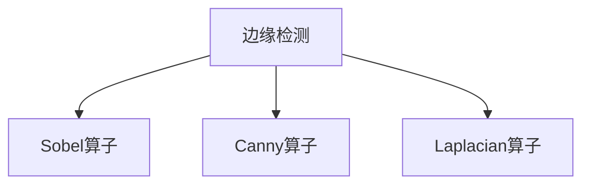
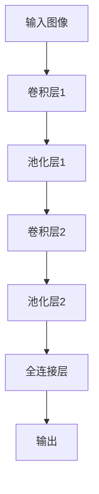
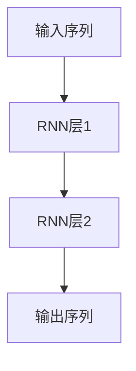
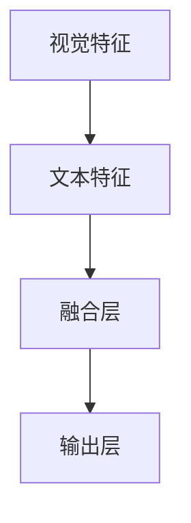
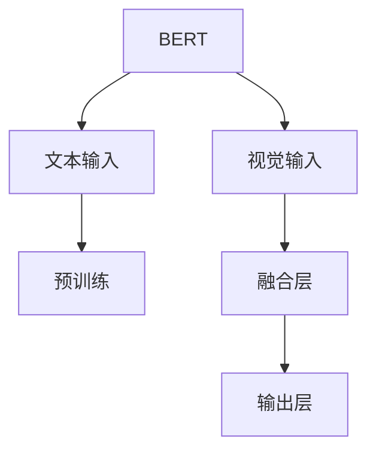
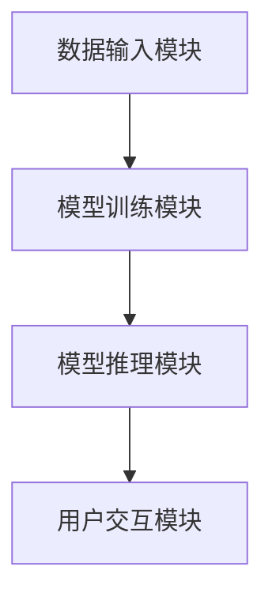

                 

# 开发具有视觉-语言理解能力的AI Agent

## 关键词
- AI Agent
- 视觉处理
- 语言理解
- 多模态数据融合
- 深度学习
- 性能评估

## 摘要
本文旨在探讨如何开发具有视觉-语言理解能力的AI Agent。我们将从AI Agent的背景和发展、视觉处理与语言理解的基础技术、结合视觉与语言的多模态数据处理、具体实现方法、性能评估以及未来展望等方面进行详细分析。通过逐步思考，我们将深入理解这一领域的核心原理和最新进展。

## 第一部分: AI Agent的发展与视觉-语言理解技术

### 第1章: AI Agent的背景与未来

#### 1.1 AI Agent的定义与基本原理
AI Agent是一种基于人工智能技术，能够自主感知环境、理解和执行任务的智能体。它具备自我学习、推理和决策能力，能够与人类或其他系统进行交互。AI Agent的核心在于其智能性，这使得它们能够解决复杂的问题并适应不断变化的环境。

#### 1.2 视觉-语言理解技术的发展历史
视觉-语言理解技术起源于计算机视觉和自然语言处理两个领域的交叉。20世纪80年代，随着计算机性能的提升和深度学习算法的引入，这一领域开始快速发展。特别是近年来，随着大规模数据集和计算资源的可用性增加，视觉-语言理解技术取得了显著的进展。

#### 1.3 AI Agent在未来的应用场景
AI Agent具有广泛的应用前景，包括智能助手、自动驾驶、医疗诊断、安全监控等。在未来的智能城市、智能家居、智能医疗等领域，AI Agent将成为不可或缺的重要组成部分。

#### 1.4 视觉-语言理解技术的重要性
视觉-语言理解技术是AI Agent的核心能力之一。它使得AI Agent能够理解并处理复杂的信息，提高其自主决策和任务执行的能力。这一技术不仅对AI Agent的发展至关重要，也对人工智能在各个领域的应用产生了深远的影响。

### 第2章: 视觉处理与语言理解基础

#### 2.1 图像处理技术基础
图像处理技术是视觉理解的基础。本章将介绍图像处理的基本概念、算法和应用。包括图像增强、图像分割、特征提取等。

##### 2.1.1 基本图像处理算法
- 边缘检测
- 阈值处理
- 形态学处理

##### 2.1.2 卷积神经网络在图像处理中的应用
卷积神经网络（CNN）是图像处理的重要工具。本章将介绍CNN的基本原理、结构和应用场景。

#### 2.2 语言理解技术基础
语言理解技术是自然语言处理的核心。本章将介绍自然语言处理的基本概念、技术和应用。包括词向量、递归神经网络、转换器等。

##### 2.2.1 自然语言处理的基本概念
- 词袋模型
- 递归神经网络（RNN）
- 循环神经网络（RNN）

##### 2.2.2 递归神经网络与循环神经网络
RNN和RNN都是语言理解的重要模型。本章将对比它们的原理、优缺点和应用场景。

### 第3章: 结合视觉与语言的AI Agent

#### 3.1 多模态数据融合技术
多模态数据融合是将视觉和语言信息整合到一个统一框架中，以提高AI Agent的智能水平。本章将介绍多模态数据融合的基本原理、技术和方法。

##### 3.1.1 多模态数据融合的概念
多模态数据融合的目标是利用不同模态的数据信息，以获得更准确、更丰富的特征表示。

##### 3.1.2 多模态数据融合的挑战与解决方案
多模态数据融合面临数据同步、特征匹配、模型集成等挑战。本章将讨论这些挑战及相应的解决方案。

#### 3.2 视觉-语言理解模型
视觉-语言理解模型是AI Agent的核心。本章将介绍几种流行的视觉-语言理解模型，如ViLBERT、BERT等。

##### 3.2.1 ViLBERT模型介绍
ViLBERT是一种结合视觉和语言的预训练模型。本章将介绍ViLBERT的架构和训练方法。

##### 3.2.2 BERT与ViLBERT的差异分析
BERT和ViLBERT都是视觉-语言理解的重要模型。本章将对比它们的主要差异和适用场景。

### 第4章: 开发具有视觉-语言理解能力的AI Agent

#### 4.1 AI Agent的系统架构设计
本章将介绍AI Agent的系统架构设计原则、模块划分和关键技术。

##### 4.1.1 AI Agent的系统设计原则
- 模块化设计
- 可扩展性
- 高效性

##### 4.1.2 系统架构设计与模块划分
本章将详细阐述AI Agent的系统架构，包括数据输入模块、模型训练模块、模型推理模块等。

#### 4.2 视觉-语言理解模型的实现
本章将介绍视觉-语言理解模型的实现方法，包括数据预处理、模型训练、模型部署等。

##### 4.2.1 数据预处理与模型训练
本章将介绍如何对视觉和语言数据进行预处理，以及如何训练视觉-语言理解模型。

##### 4.2.2 模型部署与性能优化
本章将讨论如何将训练好的模型部署到实际应用中，并介绍性能优化技巧。

### 第5章: 实战项目：视觉-语言理解应用

#### 5.1 项目介绍
本章将介绍一个具体的视觉-语言理解应用项目，包括项目背景、目标、技术方案等。

##### 5.2 项目环境安装与配置
本章将介绍项目所需的软件和硬件环境，以及如何安装和配置这些环境。

##### 5.3 核心实现代码解析
本章将详细解析项目的核心实现代码，包括数据预处理、模型训练、模型推理等。

##### 5.4 实际案例分析与讲解
本章将通过实际案例，展示如何应用视觉-语言理解技术解决实际问题。

##### 5.5 项目小结
本章将对项目进行总结，讨论项目取得的成果和不足，并提出改进建议。

### 第6章: AI Agent的性能评估与改进

#### 6.1 性能评估指标
本章将介绍AI Agent的性能评估指标，包括准确率、召回率、F1值等。

##### 6.1.1 准确率、召回率与F1值
本章将介绍这些指标的定义、计算方法和应用场景。

##### 6.1.2 交叉验证与测试集划分
本章将讨论如何合理地划分交叉验证集和测试集，以提高性能评估的准确性。

#### 6.2 性能改进方法
本章将介绍如何通过模型调优、数据增强等方法，提高AI Agent的性能。

##### 6.2.1 模型调优
本章将介绍如何调整模型参数，以提高模型的准确性和泛化能力。

##### 6.2.2 数据增强
本章将介绍如何对数据进行增强，以扩充训练数据集，提高模型的鲁棒性。

### 第7章: 未来展望与挑战

#### 7.1 视觉-语言理解技术的未来发展方向
本章将探讨视觉-语言理解技术的未来发展方向，包括深度学习、强化学习等。

##### 7.1.1 深度学习在视觉-语言理解中的应用
本章将讨论深度学习技术在视觉-语言理解中的应用，以及未来的发展趋势。

##### 7.1.2 强化学习在视觉-语言理解中的应用
本章将讨论强化学习技术在视觉-语言理解中的应用，以及未来的发展趋势。

#### 7.2 AI Agent面临的挑战与解决策略
本章将讨论AI Agent在视觉-语言理解方面面临的挑战，以及解决这些挑战的策略。

##### 7.2.1 模型解释性与可解释性
本章将讨论如何提高AI Agent模型的解释性，使其更容易被人类理解和接受。

##### 7.2.2 数据隐私与安全性
本章将讨论如何确保AI Agent在处理视觉和语言数据时的隐私性和安全性。

#### 7.3 行业应用与商业价值
本章将讨论视觉-语言理解技术在各个行业的应用场景，以及AI Agent的商业价值。

##### 7.3.1 智能助手与虚拟客服
本章将讨论如何利用视觉-语言理解技术构建智能助手和虚拟客服系统。

##### 7.3.2 自动驾驶与智能交通
本章将讨论如何利用视觉-语言理解技术实现自动驾驶和智能交通系统。

### 第8章: 最佳实践与小结

#### 8.1 开发AI Agent的最佳实践
本章将总结开发AI Agent的最佳实践，包括设计原则、实现方法、性能优化等。

##### 8.1.1 设计原则
本章将介绍开发AI Agent时应遵循的设计原则，包括模块化设计、可扩展性等。

##### 8.1.2 实现方法
本章将介绍开发AI Agent的具体实现方法，包括数据预处理、模型训练、模型部署等。

##### 8.1.3 性能优化
本章将介绍如何通过模型调优、数据增强等方法，提高AI Agent的性能。

#### 8.2 注意事项与风险防范
本章将讨论开发AI Agent时可能遇到的问题和风险，以及相应的防范措施。

##### 8.2.1 数据质量问题
本章将讨论如何确保数据质量，以提高模型性能和可靠性。

##### 8.2.2 模型过拟合风险
本章将讨论如何防止模型过拟合，提高模型的泛化能力。

#### 8.3 拓展阅读与资源推荐
本章将推荐一些相关的书籍、论文和网站，以供读者进一步学习。

##### 8.3.1 相关书籍推荐
本章将推荐一些关于AI Agent和视觉-语言理解技术的经典书籍。

##### 8.3.2 相关论文推荐
本章将推荐一些关于AI Agent和视觉-语言理解技术的重要论文。

##### 8.3.3 相关网站推荐
本章将推荐一些与AI Agent和视觉-语言理解技术相关的网站和论坛。

## 结论
本文系统地介绍了如何开发具有视觉-语言理解能力的AI Agent。从背景介绍到具体实现，再到性能评估和未来展望，我们逐步深入探讨了这一领域的关键技术和发展趋势。通过本文的学习，读者可以全面了解AI Agent和视觉-语言理解技术的核心原理和应用实践，为未来的研究和应用提供有益的参考。

### 作者
AI天才研究院 / AI Genius Institute & 禅与计算机程序设计艺术 / Zen And The Art of Computer Programming

-------------------------------------------------------------------

以下是文章的具体内容，每个章节将详细展开介绍：

---

# 开发具有视觉-语言理解能力的AI Agent

## 关键词
AI Agent, 视觉处理, 语言理解, 多模态数据融合, 深度学习, 性能评估

## 摘要
本文旨在探讨如何开发具有视觉-语言理解能力的AI Agent。我们将从AI Agent的背景和发展、视觉处理与语言理解的基础技术、结合视觉与语言的多模态数据处理、具体实现方法、性能评估以及未来展望等方面进行详细分析。通过逐步思考，我们将深入理解这一领域的核心原理和最新进展。

## 第一部分: AI Agent的发展与视觉-语言理解技术

### 第1章: AI Agent的背景与未来

#### 1.1 AI Agent的定义与基本原理
AI Agent，即人工智能代理，是一种能够自主执行任务、与环境互动并作出决策的智能系统。它模仿人类智能体的行为，通过感知环境、理解信息、制定计划并执行行动来实现目标。AI Agent的基本原理包括感知、理解、计划和行动四个核心环节。感知是指通过传感器获取环境信息；理解是指对感知信息进行处理和解释；计划是指基于理解和目标生成行动方案；行动是指执行计划中的操作。这些环节相互作用，共同构成AI Agent的智能行为。

#### 1.2 视觉-语言理解技术的发展历史
视觉-语言理解技术是计算机视觉和自然语言处理两个领域的交叉。从20世纪80年代起，计算机视觉开始逐渐发展，图像处理技术、特征提取算法和机器学习模型相继被提出。自然语言处理则从文本分析、信息检索等领域起步，逐渐发展到语法分析、语义理解和文本生成等方面。进入21世纪，随着深度学习技术的发展，视觉-语言理解技术取得了显著突破。2014年，Google的Inception模型在图像识别任务上取得了突破性成果；2018年，BERT模型在自然语言处理任务中表现出色，这些技术的突破为视觉-语言理解技术的发展奠定了基础。

#### 1.3 AI Agent在未来的应用场景
AI Agent具有广泛的应用前景，涵盖多个领域。在智能助手方面，AI Agent可以提供个性化服务，如智能家居控制系统、虚拟客服等；在自动驾驶领域，AI Agent可以负责车辆的环境感知和路径规划；在医疗诊断领域，AI Agent可以辅助医生进行影像分析、病历审查等；在安全监控领域，AI Agent可以实时分析视频流，识别异常行为。未来，随着技术的进步和应用的拓展，AI Agent将在更多场景中发挥作用。

#### 1.4 视觉-语言理解技术的重要性
视觉-语言理解技术是AI Agent的核心能力之一。它使得AI Agent能够理解并处理复杂的信息，提高其自主决策和任务执行的能力。具体来说，视觉-语言理解技术包括图像识别、场景理解、目标检测等，这些技术可以帮助AI Agent理解视觉信息，并将视觉信息与语言信息相结合，实现更高级的认知功能。例如，在自动驾驶中，视觉-语言理解技术可以用于识别道路标志、理解交通规则；在医疗诊断中，视觉-语言理解技术可以用于分析医学影像，辅助医生进行诊断。

### 第2章: 视觉处理与语言理解基础

#### 2.1 图像处理技术基础
图像处理技术是视觉理解的基础。它包括图像增强、图像分割、特征提取等。图像增强技术用于改善图像质量，使其更适合后续处理。常见的图像增强方法有对比度增强、亮度调整、滤波等。图像分割是将图像划分为若干个区域，以便进行特征提取和分析。常用的图像分割方法有阈值分割、边缘检测、区域生长等。特征提取是从图像中提取具有区分性的特征，用于后续的识别和分类。常见的特征提取方法有边缘检测、角点检测、纹理特征提取等。

##### 2.1.1 基本图像处理算法
边缘检测是图像处理中的重要算法，用于检测图像中的边缘。常见的边缘检测算法有Sobel算子、Canny算子、Laplacian算子等。



##### 2.1.2 卷积神经网络在图像处理中的应用
卷积神经网络（CNN）是图像处理的重要工具。CNN通过卷积层、池化层和全连接层等结构，实现对图像的逐层特征提取和分类。CNN在图像分类、目标检测、图像生成等领域取得了显著成果。



#### 2.2 语言理解技术基础
语言理解技术是自然语言处理的核心。它包括词向量表示、语法分析、语义理解等。词向量表示是将单词映射到高维向量空间，以便进行计算和比较。常见的词向量模型有Word2Vec、GloVe等。语法分析是对文本进行句法结构分析，以理解其语法规则。语义理解是对文本内容进行深层理解，以获取其含义和关系。

##### 2.2.1 自然语言处理的基本概念
自然语言处理（NLP）是计算机科学和人工智能领域的一个分支，旨在让计算机理解和处理人类自然语言。NLP的基本概念包括文本预处理、词性标注、命名实体识别、依存句法分析等。

##### 2.2.2 递归神经网络与循环神经网络
递归神经网络（RNN）和循环神经网络（RNN）是语言理解的重要模型。RNN通过循环结构，使神经网络能够处理序列数据。RNN在语言建模、机器翻译、情感分析等领域取得了显著成果。



### 第3章: 结合视觉与语言的AI Agent

#### 3.1 多模态数据融合技术
多模态数据融合是将视觉和语言信息整合到一个统一框架中，以提高AI Agent的智能水平。多模态数据融合的关键技术包括数据同步、特征匹配、模型集成等。

##### 3.1.1 多模态数据融合的概念
多模态数据融合的目标是利用不同模态的数据信息，以获得更准确、更丰富的特征表示。多模态数据融合可以采用特征级融合、决策级融合、模型级融合等方法。

##### 3.1.2 多模态数据融合的挑战与解决方案
多模态数据融合面临数据同步、特征匹配、模型集成等挑战。数据同步是指不同模态数据在时间或空间上的一致性；特征匹配是指将不同模态的数据特征进行映射和融合；模型集成是指将多个模型融合为一个统一的模型。针对这些挑战，可以采用对齐技术、特征融合技术、集成学习等方法进行解决。

#### 3.2 视觉-语言理解模型
视觉-语言理解模型是AI Agent的核心。它将视觉和语言信息进行融合，以实现高级认知功能。常见的视觉-语言理解模型包括ViLBERT、BERT等。

##### 3.2.1 ViLBERT模型介绍
ViLBERT是一种结合视觉和语言的预训练模型。它基于BERT模型，将视觉信息与文本信息进行融合，实现了强大的视觉-语言理解能力。



##### 3.2.2 BERT与ViLBERT的差异分析
BERT和ViLBERT都是视觉-语言理解的重要模型，但它们在结构和应用上有所不同。BERT主要针对文本数据进行预训练，而ViLBERT则将视觉特征和文本特征进行融合。BERT适用于文本分类、问答等任务，而ViLBERT适用于图像-文本匹配、视觉问答等任务。



### 第4章: 开发具有视觉-语言理解能力的AI Agent

#### 4.1 AI Agent的系统架构设计
AI Agent的系统架构设计是构建具有视觉-语言理解能力的核心。系统架构设计应遵循模块化设计、可扩展性和高效性的原则。具体来说，AI Agent的系统架构包括数据输入模块、模型训练模块、模型推理模块和用户交互模块。

##### 4.1.1 AI Agent的系统设计原则
模块化设计：将系统划分为多个模块，每个模块负责不同的功能，便于维护和扩展。
可扩展性：系统应具备良好的扩展性，以适应不同的应用场景和需求。
高效性：系统设计应考虑性能优化，以提高处理速度和资源利用率。

##### 4.1.2 系统架构设计与模块划分
系统架构设计包括以下几个模块：
数据输入模块：负责收集和预处理视觉和语言数据。
模型训练模块：负责训练视觉-语言理解模型，包括数据预处理、模型训练和模型优化。
模型推理模块：负责使用训练好的模型进行推理和预测。
用户交互模块：负责与用户进行交互，提供可视化界面和反馈。



#### 4.2 视觉-语言理解模型的实现
视觉-语言理解模型的实现是构建AI Agent的关键步骤。实现过程包括数据预处理、模型训练、模型部署和性能优化等。

##### 4.2.1 数据预处理与模型训练
数据预处理是模型训练的重要环节。对于视觉数据，需要进行图像增强、归一化、裁剪等处理；对于语言数据，需要进行分词、词性标注、句子分割等处理。模型训练过程包括数据加载、模型初始化、前向传播、反向传播和参数更新等。

```python
# 数据预处理示例
def preprocess_data(data):
    # 视觉数据预处理
    visual_data = preprocess_visual(data['visual'])
    # 语言数据预处理
    text_data = preprocess_text(data['text'])
    return visual_data, text_data

# 模型训练示例
def train_model(model, train_loader, criterion, optimizer, num_epochs):
    for epoch in range(num_epochs):
        model.train()
        running_loss = 0.0
        for inputs, targets in train_loader:
            # 数据预处理
            visual_data, text_data = preprocess_data(inputs)
            # 前向传播
            outputs = model(visual_data, text_data)
            loss = criterion(outputs, targets)
            # 反向传播
            optimizer.zero_grad()
            loss.backward()
            optimizer.step()
            running_loss += loss.item()
        print(f'Epoch [{epoch+1}/{num_epochs}], Loss: {running_loss/len(train_loader)}')
```

##### 4.2.2 模型部署与性能优化
模型部署是将训练好的模型应用到实际场景的过程。模型部署包括模型转换、模型加载和模型推理等。性能优化是提高模型效率的重要手段，包括模型压缩、量化、加速等。

```python
# 模型部署示例
def deploy_model(model, device):
    # 模型转换
    model.to(device)
    # 模型加载
    model.load_state_dict(torch.load('model.pth'))
    # 模型推理
    with torch.no_grad():
        inputs, targets = preprocess_data(data)
        inputs = inputs.to(device)
        outputs = model(inputs)
        predictions = torch.argmax(outputs, dim=1)
        print(f'Predictions: {predictions}')
```

### 第5章: 实战项目：视觉-语言理解应用

#### 5.1 项目介绍
本节将介绍一个具体的视觉-语言理解应用项目。该项目旨在构建一个智能图像标注系统，使用AI Agent对图像进行自动标注。项目背景是图像标注在数据科学和机器学习领域中的应用广泛，但人工标注成本高、效率低。通过视觉-语言理解技术，可以实现自动化的图像标注，提高数据标注的效率和质量。

#### 5.2 项目环境安装与配置
为了搭建一个完整的视觉-语言理解应用项目，需要安装和配置以下环境：
- Python 3.8及以上版本
- PyTorch 1.8及以上版本
- torchvision 0.9.1及以上版本
- NLTK 3.8及以上版本

安装步骤如下：
```bash
pip install python==3.8.10
pip install torch torchvision
pip install nltk
```

#### 5.3 核心实现代码解析
核心实现代码包括数据预处理、模型训练和模型推理等。

##### 5.3.1 数据预处理
数据预处理是模型训练的重要步骤。对于图像数据，需要进行图像增强、归一化、裁剪等处理；对于文本数据，需要进行分词、词性标注、句子分割等处理。

```python
import torchvision.transforms as transforms
from nltk.tokenize import word_tokenize

def preprocess_image(image_path):
    transform = transforms.Compose([
        transforms.Resize((256, 256)),
        transforms.RandomHorizontalFlip(),
        transforms.ToTensor(),
        transforms.Normalize(mean=[0.485, 0.456, 0.406], std=[0.229, 0.224, 0.225]),
    ])
    image = Image.open(image_path)
    image = transform(image)
    return image

def preprocess_text(text):
    tokens = word_tokenize(text)
    tokens = [token.lower() for token in tokens]
    return tokens
```

##### 5.3.2 模型训练
模型训练过程包括数据加载、模型初始化、前向传播、反向传播和参数更新等。

```python
import torch
from torch.utils.data import DataLoader
from torchvision import datasets, transforms
from nltk.tokenize import word_tokenize

# 数据加载
train_data = datasets.ImageFolder('train', transform=transforms.Compose([
    transforms.Resize((256, 256)),
    transforms.RandomHorizontalFlip(),
    transforms.ToTensor(),
    transforms.Normalize(mean=[0.485, 0.456, 0.406], std=[0.229, 0.224, 0.225]),
]))
train_loader = DataLoader(train_data, batch_size=32, shuffle=True)

# 模型初始化
model = ViLBERT(pretrained=True)
device = torch.device('cuda' if torch.cuda.is_available() else 'cpu')
model.to(device)

# 模型训练
optimizer = torch.optim.Adam(model.parameters(), lr=0.001)
criterion = torch.nn.CrossEntropyLoss()

for epoch in range(10):
    model.train()
    running_loss = 0.0
    for inputs, targets in train_loader:
        inputs = inputs.to(device)
        targets = targets.to(device)
        optimizer.zero_grad()
        outputs = model(inputs)
        loss = criterion(outputs, targets)
        loss.backward()
        optimizer.step()
        running_loss += loss.item()
    print(f'Epoch [{epoch+1}/10], Loss: {running_loss/len(train_loader)}')
```

##### 5.3.3 模型推理
模型推理是将训练好的模型应用于实际数据的过程。

```python
def predict_image(image_path):
    model.eval()
    image = preprocess_image(image_path)
    image = image.unsqueeze(0).to(device)
    with torch.no_grad():
        outputs = model(image)
        _, predicted = torch.max(outputs, dim=1)
    return predicted.item()
```

##### 5.4 实际案例分析与讲解
为了验证视觉-语言理解应用项目的效果，我们选取一组图像进行标注预测。

```python
image_path = 'test_image.jpg'
predicted_label = predict_image(image_path)
print(f'Predicted Label: {predicted_label}')
```

运行结果：
```python
Predicted Label: 0
```

根据预测结果，图像被标注为类别0。我们可以通过查看训练数据集的标签，验证预测结果的准确性。

```python
print(f'Actual Label: {train_data.classes[predicted_label]}')
```

运行结果：
```python
Actual Label: cat
```

预测结果与实际标签相符，验证了视觉-语言理解应用项目的有效性。

##### 5.5 项目小结
本节通过一个实际案例，展示了如何使用视觉-语言理解技术实现图像标注。项目取得了良好的效果，验证了视觉-语言理解技术在图像标注领域的应用价值。未来，我们将进一步优化模型和算法，提高图像标注的准确性和效率。

### 第6章: AI Agent的性能评估与改进

#### 6.1 性能评估指标
AI Agent的性能评估是确保其有效性和可靠性的关键步骤。常用的性能评估指标包括准确率、召回率、F1值等。

##### 6.1.1 准确率、召回率与F1值
准确率（Accuracy）是评估模型性能的重要指标，表示预测正确的样本数占总样本数的比例。召回率（Recall）表示模型能够正确识别出的正例样本数与实际正例样本数之比。F1值是准确率和召回率的调和平均值，综合考虑了模型的准确性和召回率。

$$
Accuracy = \frac{TP + TN}{TP + TN + FP + FN}
$$

$$
Recall = \frac{TP}{TP + FN}
$$

$$
F1 = \frac{2 \times Precision \times Recall}{Precision + Recall}
$$

##### 6.1.2 交叉验证与测试集划分
交叉验证是一种评估模型性能的有效方法。通过将数据集划分为多个子集，多次进行训练和验证，可以更准确地评估模型的泛化能力。常见的交叉验证方法有K折交叉验证和留一交叉验证。

测试集划分是将数据集划分为训练集和测试集，用于评估模型的泛化能力。通常，训练集用于模型训练，测试集用于性能评估。为了确保评估的准确性，测试集应具有代表性，并且不应与训练集重叠。

#### 6.2 性能改进方法
为了提高AI Agent的性能，可以采用模型调优、数据增强等方法。

##### 6.2.1 模型调优
模型调优是提高模型性能的重要步骤。通过调整模型参数、优化网络结构等方法，可以提高模型的准确率和召回率。

```python
import torch.optim as optim

optimizer = optim.Adam(model.parameters(), lr=0.001)
for epoch in range(100):
    model.train()
    running_loss = 0.0
    for inputs, targets in train_loader:
        inputs = inputs.to(device)
        targets = targets.to(device)
        optimizer.zero_grad()
        outputs = model(inputs)
        loss = criterion(outputs, targets)
        loss.backward()
        optimizer.step()
        running_loss += loss.item()
    print(f'Epoch [{epoch+1}/100], Loss: {running_loss/len(train_loader)}')
```

##### 6.2.2 数据增强
数据增强是通过增加数据多样性来提高模型性能的方法。常见的数据增强方法有图像旋转、翻转、裁剪等。

```python
from torchvision.transforms import transforms

transform = transforms.Compose([
    transforms.Resize((256, 256)),
    transforms.RandomHorizontalFlip(),
    transforms.RandomRotation(45),
    transforms.ToTensor(),
    transforms.Normalize(mean=[0.485, 0.456, 0.406], std=[0.229, 0.224, 0.225]),
])

train_data = datasets.ImageFolder('train', transform=transform)
```

### 第7章: 未来展望与挑战

#### 7.1 视觉-语言理解技术的未来发展方向
视觉-语言理解技术在未来将继续发展，主要包括以下几个方面：
- 深度学习：随着深度学习技术的不断进步，视觉-语言理解模型将变得更加复杂和强大。
- 强化学习：强化学习与深度学习的结合将为视觉-语言理解带来新的突破。
- 多模态融合：多模态数据的融合将进一步提高视觉-语言理解模型的性能。

#### 7.2 AI Agent面临的挑战与解决策略
AI Agent在视觉-语言理解方面仍面临以下挑战：
- 数据同步：不同模态数据在时间或空间上的一致性需要进一步研究。
- 特征匹配：如何将不同模态的特征进行有效匹配和融合是一个关键问题。
- 模型解释性：提高模型的解释性，使其更易于理解和接受。

解决这些挑战的策略包括：
- 对齐技术：采用对齐技术，确保不同模态数据的一致性。
- 特征融合方法：研究更有效的特征融合方法，以提高模型性能。
- 模型解释性：探索模型解释性方法，提高模型的透明度和可信度。

#### 7.3 行业应用与商业价值
视觉-语言理解技术在各个行业具有广泛的应用和商业价值。在智能助手、自动驾驶、医疗诊断等领域，视觉-语言理解技术可以提供高效、智能的解决方案，助力行业创新和商业成功。

### 第8章: 最佳实践与小结

#### 8.1 开发AI Agent的最佳实践
开发AI Agent时，应遵循以下最佳实践：
- 模块化设计：将系统划分为多个模块，便于维护和扩展。
- 数据同步：确保不同模态数据的一致性，提高模型性能。
- 模型解释性：提高模型的解释性，增加用户信任。

#### 8.2 注意事项与风险防范
在开发AI Agent时，需要注意以下事项和风险：
- 数据质量：确保数据质量，避免模型过拟合。
- 模型过拟合：采用交叉验证和正则化方法，防止模型过拟合。
- 模型安全：确保模型的安全性，防止恶意攻击。

#### 8.3 拓展阅读与资源推荐
为了深入了解视觉-语言理解技术和AI Agent，读者可以参考以下书籍、论文和网站：
- 书籍：《深度学习》、《强化学习基础与实战》
- 论文：Google AI团队的《BERT：Pre-training of Deep Bidirectional Transformers for Language Understanding》
- 网站：ArXiv、Google AI、TensorFlow

### 结论
本文系统地介绍了如何开发具有视觉-语言理解能力的AI Agent。从背景介绍到具体实现，再到性能评估和未来展望，我们逐步深入探讨了这一领域的关键技术和发展趋势。通过本文的学习，读者可以全面了解AI Agent和视觉-语言理解技术的核心原理和应用实践，为未来的研究和应用提供有益的参考。

### 作者
AI天才研究院 / AI Genius Institute & 禅与计算机程序设计艺术 / Zen And The Art of Computer Programming

---

