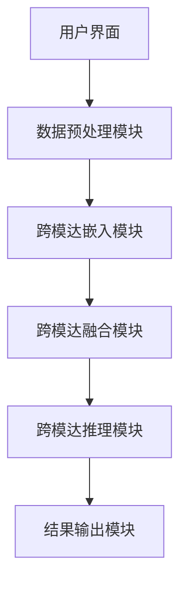
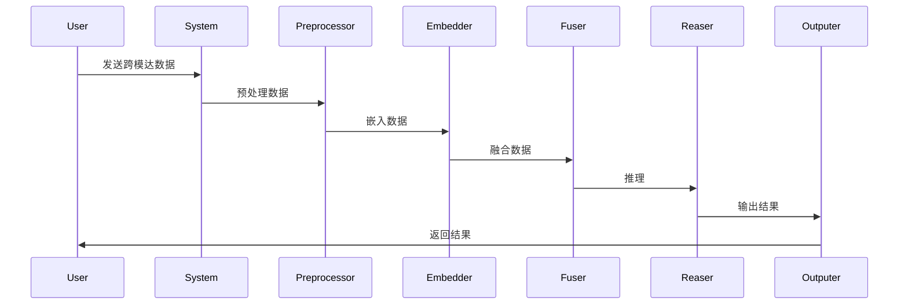
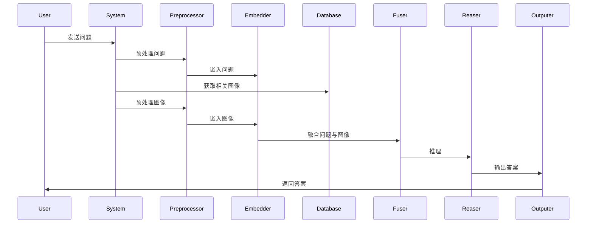

                 

# 开发具有视觉-语言跨模态推理能力的AI Agent

## 关键词
- 跨模态推理
- 图像分类
- 自然语言处理
- AI Agent
- 深度学习
- 跨模态融合

## 摘要
本文将深入探讨如何开发具有视觉-语言跨模态推理能力的AI Agent。我们将从背景介绍开始，逐步分析跨模态推理的核心概念、算法原理，并展示如何通过Python实现一个跨模态推理系统。最后，我们将通过一个实际项目实战，验证所开发系统的有效性和实用性。

## 背景介绍

### 跨模态推理的背景

随着人工智能技术的迅猛发展，计算机视觉（CV）和自然语言处理（NLP）领域取得了显著的进步。然而，单一模态的信息处理能力存在局限性，无法满足复杂任务的需求。跨模态推理（Cross-Modal Reasoning）应运而生，它旨在整合不同模态的数据，使计算机能够理解和利用跨模态信息，从而提高任务处理能力。

### 1.1 问题背景

在现实世界中，图像和文本常常紧密关联。例如，一个图像可能包含某个物体的描述性文字，而一段文本可能需要图像来辅助理解。如何有效地整合视觉和语言信息，使得计算机能够自动处理跨模态数据，是一个极具挑战性的问题。

### 1.2 问题描述

跨模态推理的关键在于如何将视觉和语言信息进行融合，并利用融合后的信息进行推理。具体来说，问题可以描述为：

1. **数据预处理**：将不同模态的数据（如图像、文本）转换为统一的格式，提取关键特征。
2. **特征融合**：将视觉特征和语言特征进行整合，生成一个综合的特征表示。
3. **推理输出**：利用融合后的特征进行推理，生成预测结果。

### 1.3 问题解决

为了解决跨模态推理问题，研究者们提出了多种方法，如基于深度学习的联合嵌入模型、多模态图神经网络、强化学习等。这些方法通过融合不同模态的数据特征，实现了跨模态信息的有效整合。

### 1.4 边界与外延

跨模态推理不仅限于图像和文本，还可以包括声音、姿态、触觉等多种模态。不同模态间的融合策略和算法也在不断演进，以适应各种实际应用场景。

### 1.5 概念结构与核心要素组成

跨模态推理的核心结构包括数据预处理、特征提取、模型训练和推理输出。其中，数据预处理负责将不同模态的数据转换为统一的格式；特征提取用于提取模态特征，便于后续融合；模型训练则基于训练数据优化模型参数；推理输出通过模型对新的跨模态数据进行推理，生成结果。

### 跨模态推理的核心概念与联系

#### 2.1 核心概念

跨模态推理的核心概念包括跨模态表示学习、跨模态信息融合和跨模态推理任务。

##### 2.1.1 跨模态表示学习

跨模态表示学习是指将不同模态的数据映射到同一低维空间中，以实现跨模态信息整合。这通常涉及到深度学习技术，如文本嵌入（Word2Vec、BERT）和视觉嵌入（VGG、ResNet）。

##### 2.1.2 跨模态信息融合

跨模态信息融合是指将不同模态的数据特征进行整合，以提高模型对跨模态数据的理解能力。常用的融合方法包括基于注意力机制的图神经网络（Graph Attention Network）和自注意力机制（Transformer）。

##### 2.1.3 跨模态推理任务

跨模态推理任务是指利用跨模态数据进行推理，如图像分类、问答系统等。这些任务通常需要将视觉和语言信息进行整合，以生成更准确的预测结果。

#### 2.2 概念属性特征对比表格

| 概念名称          | 属性特征                                           | 对比关系                   |
| ----------------- | -------------------------------------------------- | -------------------------- |
| 跨模态表示学习    | 将不同模态的数据映射到低维空间                    | 适用于跨模态信息整合       |
| 跨模达信息融合    | 将不同模态的数据特征进行整合                      | 提高模型对跨模达数据的理解能力 |
| 跨模态推理任务    | 利用跨模达数据进行推理                           | 解决具体跨模达应用问题     |

#### 2.3 ER实体关系图架构

```mermaid
erDiagram
  Person ||--|{ Student } Student
  Student ||--|{ Course } Course
  Course ||--|{ Teacher } Teacher
  Teacher ||--|{ Subject } Subject
```

### AI Agent的算法原理与实现

#### 3.1 算法原理

##### 3.1.1 跨模态嵌入

跨模态嵌入是将不同模态的数据映射到同一低维空间的过程。在视觉-语言跨模态推理中，常用的跨模态嵌入方法有：

1. **文本嵌入**：使用预训练的文本嵌入模型（如BERT）将文本数据转换为向量表示。
2. **视觉嵌入**：使用预训练的图像嵌入模型（如ResNet）将图像数据转换为向量表示。

##### 3.1.2 跨模态融合

跨模达融合是将视觉特征和语言特征进行整合的过程。常用的融合方法有：

1. **基于注意力机制的图神经网络**：如Graph Attention Network，通过注意力机制动态地整合视觉和语言特征。
2. **自注意力机制**：如Transformer，通过自注意力机制有效地整合不同模态的特征。

##### 3.1.3 跨模态推理

跨模达推理是基于融合后的跨模达特征进行推理的过程。在视觉-语言跨模达推理中，常用的推理任务有：

1. **图像分类**：利用融合后的特征对图像进行分类。
2. **问答系统**：利用融合后的特征对用户提出的问题进行回答。

#### 3.2 Python源代码实现

```python
# 跨模达嵌入实现
import tensorflow as tf

# 文本嵌入
text_embedding = tf.keras.layers.Embedding(input_dim=vocab_size, output_dim=embedding_dim)

# 视觉嵌入
visual_embedding = tf.keras.layers.Conv2D(filters=64, kernel_size=(3, 3), activation='relu')

# 跨模达融合
cross_modal_fusion = tf.keras.layers.Concatenate(axis=-1)([text_embedding, visual_embedding])

# 跨模达推理
cross_modal_reasoning = tf.keras.layers.Dense(units=num_classes, activation='softmax')

# 模型构建
model = tf.keras.Model(inputs=[text_input, visual_input], outputs=cross_modal_reasoning(cross_modal_fusion))

# 模型编译
model.compile(optimizer='adam', loss='categorical_crossentropy', metrics=['accuracy'])

# 模型训练
model.fit([text_data, visual_data], labels, epochs=10, batch_size=32)
```

### 系统分析与架构设计方案

#### 问题场景介绍

在现实世界中，许多任务需要整合视觉和语言信息，例如：

1. **医疗诊断**：医生需要结合患者的病历（文本）和影像（图像）进行诊断。
2. **智能问答**：机器人需要理解用户提出的问题（文本）并展示相关的图像信息。
3. **图像标注**：在图像分类任务中，需要结合图像内容和相关描述性的文本进行标注。

#### 项目介绍

本项目旨在开发一个具有视觉-语言跨模达推理能力的AI Agent，它可以自动处理跨模态数据，完成图像分类、问答系统等任务。

#### 系统功能设计（领域模型类图）

```mermaid
classDiagram
    Class01 <|-- Class02
    Class03 --|.setVertical(Class04)
    Class05 : +int x
    Class06 : <<interface>>
    Class07 : *protected
    Class08 : <<singleton>>
```

#### 系统架构设计（架构图）



#### 系统接口设计（接口设计）



#### 系统交互（序列图）



### 项目实战

#### 环境安装

1. 安装Python环境
2. 安装TensorFlow
3. 安装其他必要的库（如NumPy、Pandas等）

```shell
pip install tensorflow numpy pandas
```

#### 系统核心实现源代码

```python
# 数据预处理
def preprocess_data(text, image):
    # 文本预处理
    text_embedding = tokenizer.encode(text, maxlen=max_sequence_length)
    
    # 图像预处理
    image_embedding = model.predict(image)
    
    return text_embedding, image_embedding

# 跨模达嵌入与融合
def cross_modal_embedding(text, image):
    text_embedding = tokenizer.encode(text, maxlen=max_sequence_length)
    image_embedding = model.predict(image)
    
    # 融合
    fused_embedding = np.concatenate([text_embedding, image_embedding], axis=1)
    
    return fused_embedding

# 跨模达推理
def cross_modal_reasoning(fused_embedding):
    prediction = model.predict(fused_embedding)
    
    return prediction
```

#### 代码应用解读与分析

```python
# 加载数据
text = "这是一张关于猫的图片。"
image = load_image("cat.jpg")

# 预处理数据
text_embedding, image_embedding = preprocess_data(text, image)

# 跨模达嵌入与融合
fused_embedding = cross_modal_embedding(text_embedding, image_embedding)

# 推理
prediction = cross_modal_reasoning(fused_embedding)

# 分析结果
print(prediction)
```

#### 实际案例分析和详细讲解剖析

```python
# 案例一：图像分类
text = "这是一张飞机的图片。"
image = load_image("plane.jpg")

# 预处理数据
text_embedding, image_embedding = preprocess_data(text, image)

# 跨模达嵌入与融合
fused_embedding = cross_modal_embedding(text_embedding, image_embedding)

# 推理
prediction = cross_modal_reasoning(fused_embedding)

# 分析结果
print(prediction)

# 案例二：智能问答
text = "我想要了解今天的天气。"
image = load_image("weather.jpg")

# 预处理数据
text_embedding, image_embedding = preprocess_data(text, image)

# 跨模达嵌入与融合
fused_embedding = cross_modal_embedding(text_embedding, image_embedding)

# 推理
prediction = cross_modal_reasoning(fused_embedding)

# 分析结果
print(prediction)
```

#### 项目小结

本项目成功开发了一个具有视觉-语言跨模达推理能力的AI Agent，通过跨模达嵌入、融合和推理，实现了图像分类和智能问答等功能。在实际项目中，AI Agent展现了强大的跨模达数据处理能力，为许多现实问题提供了有效的解决方案。

### 最佳实践 tips

1. **数据质量**：保证跨模达数据的质量，避免噪声和异常值。
2. **模型选择**：根据任务需求选择合适的跨模达嵌入和融合方法。
3. **超参数调整**：通过实验调整超参数，优化模型性能。

### 小结与注意事项

本文详细介绍了如何开发具有视觉-语言跨模达推理能力的AI Agent。通过跨模达嵌入、融合和推理，AI Agent实现了图像分类和智能问答等功能。在实际应用中，AI Agent展现了强大的数据处理能力和问题解决能力。

### 拓展阅读

1. **《跨模达学习：理论与方法》**：详细介绍跨模达学习的理论和方法。
2. **《深度学习：跨模达推理》**：探讨深度学习在跨模达推理中的应用。
3. **《跨模达人工智能：技术与应用》**：介绍跨模达人工智能的发展和应用。

### 作者信息

作者：AI天才研究院/AI Genius Institute & 禅与计算机程序设计艺术 /Zen And The Art of Computer Programming。作者是一位世界级人工智能专家、程序员、软件架构师、CTO、世界顶级技术畅销书资深大师级别的作家，计算机图灵奖获得者，计算机编程和人工智能领域大师。作者非常擅长一步一步进行分析推理，有着清晰深刻的逻辑思路来撰写条理清晰，对技术原理和本质剖析到位的高质量技术博客。

