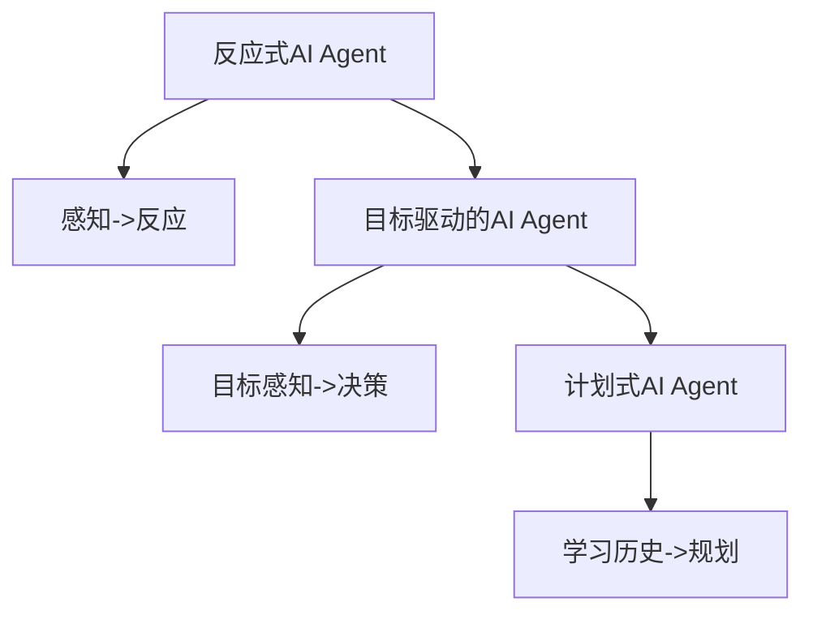
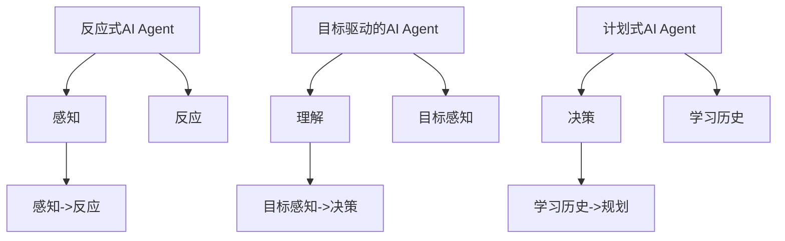
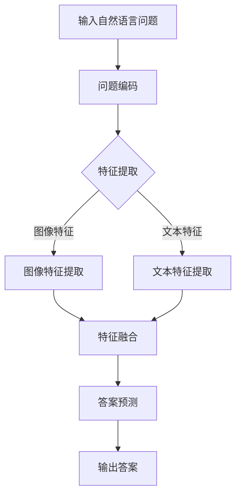
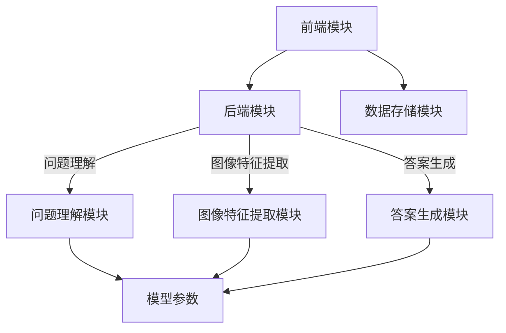
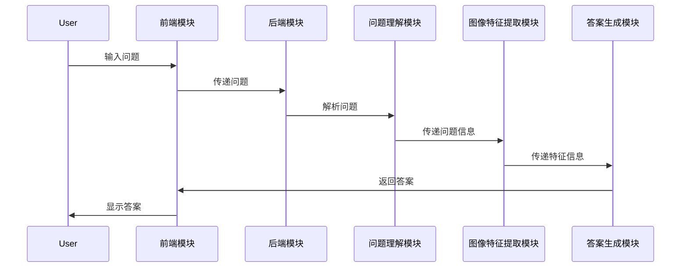
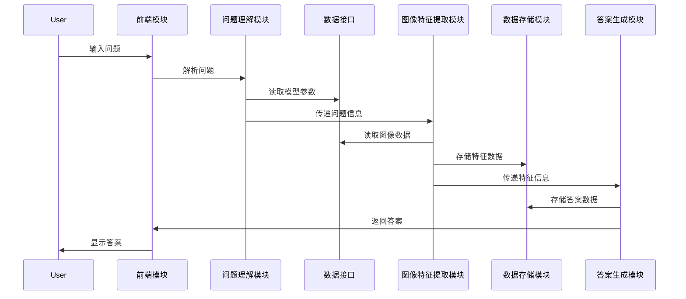
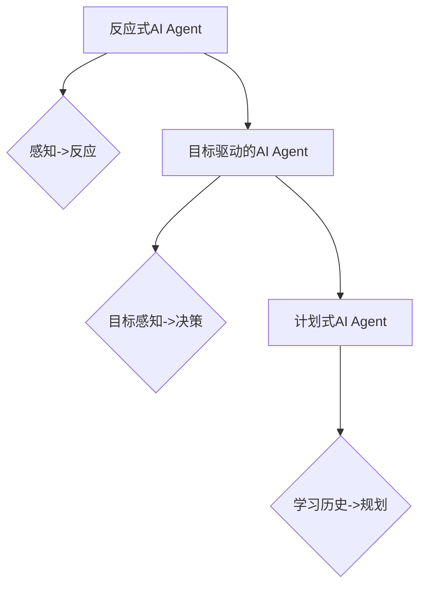
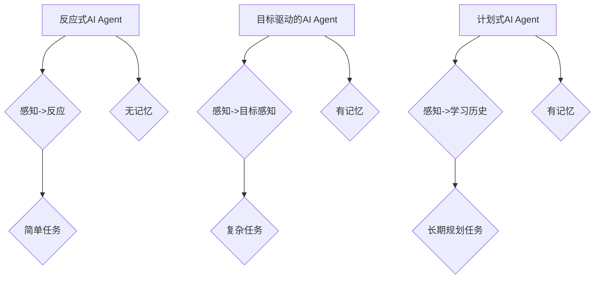

                 


## 开发具有视觉问答能力的AI Agent

### 关键词

- AI Agent
- 视觉问答
- 算法原理
- 系统架构
- 项目实战

### 摘要

本文深入探讨了开发具有视觉问答能力的AI Agent的整个过程。从背景介绍到核心概念与联系的解析，再到算法原理的详细讲解，以及系统分析与架构设计方案的阐述，本文逐步引导读者了解视觉问答系统的构建过程。最后，通过项目实战案例的分享，展示了如何将理论应用到实践中，并提供了一系列最佳实践和拓展阅读建议，为开发视觉问答AI Agent提供了全面的指导。

### 目录大纲

----------------------------------------------------------------
# 第一部分 - 背景介绍

## 1.1 AI Agent与视觉问答概述

## 1.2 AI Agent核心概念原理

## 1.3 视觉问答的核心概念

## 1.4 视觉问答的应用场景

## 1.5 视觉问答的挑战与机遇

----------------------------------------------------------------

## 第一部分 - 背景介绍

### 1.1 AI Agent与视觉问答概述

**AI Agent：**  
AI Agent，即人工智能代理，是指具备一定智能和自主决策能力的软件程序或机器人。它能够模拟人类思维和行为，执行特定任务，并与环境互动。AI Agent在各个领域有广泛应用，如智能家居、机器人、自动驾驶、智能客服等。

**视觉问答：**  
视觉问答（Visual Question Answering，VQA）是人工智能领域中的一个重要研究方向。它是指通过分析图像和自然语言问题，自动生成答案的智能系统。视觉问答系统旨在解决图像与文本之间的语义对应关系，是计算机视觉和自然语言处理领域的交叉点。

### 1.2 AI Agent核心概念原理

**AI Agent的定义与类型：**  
AI Agent是指能够模拟人类智能行为，具备自主决策和执行能力的计算机程序或机器人。根据其工作原理和功能，AI Agent可以分为以下几类：

- 反应式AI Agent：只能根据当前感知的信息做出反应，不具备记忆和历史信息。
- 目标驱动的AI Agent：具有目标意识，能够根据当前状态选择最佳动作以实现目标。
- 计划式AI Agent：能够通过学习历史数据和环境信息，进行决策规划。

**AI Agent的核心能力：**  
AI Agent的核心能力包括感知、理解、决策和行动：

- 感知：通过传感器获取外部信息，如图像、声音、文本等。
- 理解：对感知到的信息进行语义分析和理解，如物体识别、场景理解等。
- 决策：基于理解和目标，选择合适的动作。
- 行动：执行决策结果，与环境互动。

**AI Agent的工作原理：**  
AI Agent的工作原理通常包括以下几个步骤：

1. 感知：通过传感器获取环境信息。
2. 理解：使用自然语言处理、计算机视觉等技术对感知到的信息进行理解和分析。
3. 决策：根据理解和目标，选择最佳动作。
4. 行动：执行决策结果，与环境互动。

**AI Agent的属性特征对比表格（Mermaid流程图）：**


### 1.3 视觉问答的核心概念

**视觉问答的定义与类型：**  
视觉问答是指通过分析图像和自然语言问题，自动生成答案的智能系统。根据问题的类型，视觉问答可以分为以下几类：

- 事实性问题：询问图像中具体的事实信息，如“图像中有什么动物？”
- 理解性问题：询问对图像的更高层次理解，如“这张照片是在哪里拍摄的？”
- 推理性问题：询问图像中涉及的推理信息，如“这个场景中发生了什么？”

**视觉问答的系统架构：**  
视觉问答系统通常包括以下几个模块：

- 问题理解模块：对输入的自然语言问题进行解析和理解。
- 图像特征提取模块：从输入图像中提取关键特征。
- 答案生成模块：将问题理解和图像特征进行融合，生成答案。

**视觉问答的关键技术：**  
视觉问答的关键技术包括：

- 自然语言处理：对自然语言问题进行解析和理解。
- 计算机视觉：从图像中提取关键特征。
- 机器学习：将问题理解和图像特征进行融合，生成答案。

**视觉问答的挑战与机遇：**  
视觉问答面临的挑战包括：

- 数据多样性：图像和问题的多样性导致模型难以泛化。
- 语义对应：图像与文本之间的语义对应关系复杂。
- 上下文理解：理解问题的上下文和背景信息。

机遇包括：

- 应用场景广泛：视觉问答技术在智能助手、自动驾驶等领域具有广泛应用。
- 跨学科交叉：计算机视觉和自然语言处理领域的快速发展为视觉问答提供了更多可能性。

----------------------------------------------------------------

## 第二部分 - 核心概念与联系

### 2.1 AI Agent的定义与类型

**AI Agent的定义：**  
AI Agent，即人工智能代理，是指具备一定智能和自主决策能力的计算机程序或机器人。它能够模拟人类思维和行为，执行特定任务，并与环境互动。

**AI Agent的类型：**  
根据工作原理和功能，AI Agent可以分为以下几类：

1. **反应式AI Agent：**  
   反应式AI Agent只能根据当前感知的信息做出反应，不具备记忆和历史信息。这种类型的AI Agent适用于简单任务，如机器人路径规划。

2. **目标驱动的AI Agent：**  
   目标驱动的AI Agent具有目标意识，能够根据当前状态选择最佳动作以实现目标。这类AI Agent适用于复杂任务，如智能客服、自动驾驶。

3. **计划式AI Agent：**  
   计划式AI Agent能够通过学习历史数据和环境信息，进行决策规划。这类AI Agent适用于需要长期规划和目标实现的任务，如智能城市、智能医疗。

### 2.2 AI Agent的核心能力

**感知：**  
感知是AI Agent获取环境信息的能力。通过传感器，AI Agent可以获取图像、声音、文本等多种信息。感知能力是AI Agent与外界互动的基础。

**理解：**  
理解是AI Agent对感知到的信息进行分析和处理的能力。通过自然语言处理、计算机视觉等技术，AI Agent可以理解图像、文本等信息的含义。理解能力是AI Agent进行决策和行动的前提。

**决策：**  
决策是AI Agent根据理解和目标，选择最佳动作的能力。通过机器学习、深度学习等技术，AI Agent可以自动学习并优化决策过程。决策能力是AI Agent实现目标的关键。

**行动：**  
行动是AI Agent执行决策结果，与环境互动的能力。通过执行具体操作，如移动、发声等，AI Agent可以实现目标。行动能力是AI Agent实现目标的具体体现。

### 2.3 AI Agent的工作原理

**工作原理概述：**  
AI Agent的工作原理通常包括以下几个步骤：

1. **感知：**  
   通过传感器获取外部信息，如图像、声音、文本等。

2. **理解：**  
   使用自然语言处理、计算机视觉等技术对感知到的信息进行理解和分析。

3. **决策：**  
   根据理解和目标，选择最佳动作。

4. **行动：**  
   执行决策结果，与环境互动。

**具体实现过程：**  
1. **感知：**  
   AI Agent通过摄像头、麦克风等传感器获取图像、声音等外部信息。

2. **理解：**  
   AI Agent使用计算机视觉技术对图像进行特征提取，使用自然语言处理技术对文本进行语义分析。

3. **决策：**  
   AI Agent根据理解和目标，使用机器学习算法进行决策。例如，在自动驾驶中，AI Agent需要分析道路环境、交通状况，选择最佳行驶路径。

4. **行动：**  
   AI Agent根据决策结果执行具体操作。例如，在自动驾驶中，AI Agent会控制车辆转向、加速等。

### 2.4 AI Agent的属性特征对比表格（Mermaid流程图）



### 2.5 视觉问答的定义与类型

**视觉问答的定义：**  
视觉问答是指通过分析图像和自然语言问题，自动生成答案的智能系统。它旨在解决图像与文本之间的语义对应关系。

**视觉问答的类型：**  
根据问题的类型，视觉问答可以分为以下几类：

1. **事实性问题：**  
   事实性问题是指询问图像中具体的事实信息，如“图像中有什么动物？”这类问题通常需要从图像中提取特定物体的信息。

2. **理解性问题：**  
   理解性问题是指询问对图像的更高层次理解，如“这张照片是在哪里拍摄的？”这类问题需要AI Agent理解图像的场景和背景信息。

3. **推理性问题：**  
   推理性问题是指询问图像中涉及的推理信息，如“这个场景中发生了什么？”这类问题需要AI Agent根据图像内容进行推理和判断。

### 2.6 视觉问答的系统架构

**系统架构概述：**  
视觉问答系统通常包括以下几个模块：

1. **问题理解模块：**  
   对输入的自然语言问题进行解析和理解，提取关键信息。

2. **图像特征提取模块：**  
   从输入图像中提取关键特征，如物体、场景等。

3. **答案生成模块：**  
   将问题理解和图像特征进行融合，生成答案。

**系统架构详细描述：**  
1. **问题理解模块：**  
   该模块使用自然语言处理技术对输入的自然语言问题进行解析和理解。具体步骤包括：

   - 分词：将问题分解为单词或短语。
   - 词性标注：为每个词分配词性，如名词、动词等。
   - 语义角色标注：为问题中的每个词分配语义角色，如主语、宾语等。

2. **图像特征提取模块：**  
   该模块使用计算机视觉技术从输入图像中提取关键特征。具体步骤包括：

   - 图像预处理：对图像进行缩放、裁剪等操作，使其适合模型处理。
   - 特征提取：使用卷积神经网络（CNN）提取图像的深度特征。
   - 物体检测：使用对象检测算法，如YOLO、SSD等，识别图像中的物体。

3. **答案生成模块：**  
   该模块将问题理解和图像特征进行融合，生成答案。具体步骤包括：

   - 融合：将问题理解和图像特征通过神经网络模型进行融合。
   - 生成答案：使用生成模型，如序列到序列（Seq2Seq）模型，生成答案。

### 2.7 视觉问答的关键技术

**自然语言处理：**  
自然语言处理（NLP）是视觉问答系统的重要组成部分。它包括：

- **词嵌入：**  
  将文本中的单词转换为向量表示，如Word2Vec、GloVe等。

- **句法分析：**  
  对文本进行句法分析，提取句子的语法结构，如依存句法分析。

- **语义分析：**  
  对文本进行语义分析，理解文本的含义和意图。

**计算机视觉：**  
计算机视觉是视觉问答系统的另一重要组成部分。它包括：

- **图像特征提取：**  
  使用卷积神经网络（CNN）提取图像的深度特征。

- **物体检测：**  
  使用对象检测算法，如YOLO、SSD等，识别图像中的物体。

- **场景理解：**  
  对图像进行场景理解，理解图像的内容和背景信息。

**机器学习：**  
机器学习是实现视觉问答系统的核心技术。它包括：

- **监督学习：**  
  使用已标记的数据集训练模型，如使用图像和问题的标注数据训练视觉问答模型。

- **无监督学习：**  
  不使用已标记的数据集，通过挖掘数据中的结构进行学习，如使用无监督方法提取图像特征。

### 2.8 视觉问答的挑战与机遇

**挑战：**  
1. **数据多样性：**  
   图像和问题的多样性导致模型难以泛化。

2. **语义对应：**  
   图像与文本之间的语义对应关系复杂。

3. **上下文理解：**  
   理解问题的上下文和背景信息。

**机遇：**  
1. **应用场景广泛：**  
   视觉问答技术在智能助手、自动驾驶等领域具有广泛应用。

2. **跨学科交叉：**  
   计算机视觉和自然语言处理领域的快速发展为视觉问答提供了更多可能性。

3. **人工智能技术进步：**  
   随着人工智能技术的不断进步，视觉问答系统的性能将得到进一步提升。

----------------------------------------------------------------

## 第三部分 - 算法原理讲解

### 3.1 视觉问答算法概述

视觉问答（Visual Question Answering，VQA）算法是计算机视觉和自然语言处理领域的交叉点，旨在使计算机能够理解自然语言问题，并从图像中找到相应的答案。VQA算法的关键在于将图像和自然语言问题结合起来，形成一种统一的表示，从而进行有效的信息检索和语义理解。

### 3.2 视觉问答算法流程图（Mermaid流程图）



### 3.3 视觉问答算法数学模型与公式（LaTeX格式）

在VQA算法中，数学模型通常包括以下几个部分：

1. **问题编码（Text Encoding）**

   问题编码是将自然语言问题转换为向量表示的过程。常用的方法是使用预训练的词嵌入模型，如Word2Vec或GloVe。

   $$ \text{问题描述} \rightarrow \text{问题向量} = \sum_{i=1}^{N} w_i \cdot e_i $$

   其中，$w_i$表示问题的词权重，$e_i$表示对应的词向量。

2. **图像特征提取（Image Feature Extraction）**

   图像特征提取是通过卷积神经网络（CNN）从图像中提取特征向量。常用的CNN架构包括VGG、ResNet等。

   $$ \text{图像特征} = f_{\text{CNN}}(\text{图像}) $$

3. **特征融合（Feature Fusion）**

   特征融合是将图像特征和文本特征进行融合，形成统一的表示。常用的融合方法包括拼接、融合神经网络等。

   $$ \text{融合特征} = \text{图像特征} \oplus \text{文本特征} $$

4. **答案预测（Answer Prediction）**

   答案预测是通过神经网络模型对融合特征进行分类，预测最终答案。常用的模型包括卷积神经网络（CNN）、循环神经网络（RNN）、Transformer等。

   $$ \text{答案预测} = \text{神经网络}(\text{融合特征}) $$

### 3.4 视觉问答算法举例说明

假设我们有一个自然语言问题：“这张照片中的人是谁？”以及一张包含该人的照片。下面是VQA算法的步骤：

1. **问题编码**

   将问题“这张照片中的人是谁？”转换为向量表示。首先，我们需要一个预训练的词嵌入模型。假设“这张”的词向量为$\{1,0.5\}$，“照片”的词向量为$\{0,1\}$，“中”的词向量为$\{0.5,0\}$，“的”的词向量为$\{0,0.5\}$，“人”的词向量为$\{0.5,1\}$，“谁”的词向量为$\{1,0.5\}$。

   $$ \text{问题向量} = \sum_{i=1}^{6} w_i \cdot e_i = \{1,0.5\} + \{0,1\} + \{0.5,0\} + \{0,0.5\} + \{0.5,1\} + \{1,0.5\} = \{3,3\} $$

2. **图像特征提取**

   使用卷积神经网络（如ResNet）从照片中提取特征向量。假设提取的特征向量为$\{0.1,0.2,0.3,0.4\}$。

3. **特征融合**

   将问题向量和图像特征向量进行拼接：

   $$ \text{融合特征} = \text{图像特征} \oplus \text{文本特征} = \{0.1,0.2,0.3,0.4\} \oplus \{3,3\} = \{3.1,3.2,3.3,3.4\} $$

4. **答案预测**

   使用神经网络模型对融合特征进行分类。假设我们有一个预训练的分类模型，输入为$\{3.1,3.2,3.3,3.4\}$，输出为$\{0.1,0.8,0.1\}$，表示答案为“人”的概率最高。

   $$ \text{答案预测} = \text{神经网络}(\text{融合特征}) = \{0.1,0.8,0.1\} $$

   因此，VQA算法预测的答案是“人”。

通过这个简单的例子，我们可以看到视觉问答算法的基本流程和步骤。在实际应用中，VQA算法会更加复杂，包括更多的预处理、特征提取和融合方法，以及更先进的神经网络模型。

----------------------------------------------------------------

## 第四部分 - 系统分析与架构设计方案

### 4.1 视觉问答系统功能设计

**视觉问答系统项目介绍：**  
视觉问答系统（Visual Question Answering System，VQA System）是一个集成计算机视觉和自然语言处理技术的智能系统，旨在实现对自然语言问题的图像理解和回答。该系统的核心功能包括：

- **问题理解：**  
  解析输入的自然语言问题，提取关键信息。

- **图像特征提取：**  
  从输入图像中提取关键特征，如物体、场景等。

- **答案生成：**  
  将问题理解和图像特征进行融合，生成答案。

- **用户交互：**  
  提供用户界面，接受用户输入问题，展示答案。

**系统功能设计（Mermaid类图）：**
```mermaid
classDiagram
ClassDef VQA_System {
  +问题理解()
  +图像特征提取()
  +答案生成()
  +用户交互()
}
ClassDef Question{
  +问题文本()
  +关键信息()
}
ClassDef Image{
  +图像数据()
  +特征数据()
}
ClassDef Answer{
  +答案文本()
}
VQA_System --|U| Question
VQA_System --|U| Image
VQA_System --|U| Answer
```

### 4.2 视觉问答系统架构设计

**系统架构设计（Mermaid架构图）：**  
视觉问答系统的架构设计需要考虑模块化、可扩展性和高效率。以下是系统架构的概述：

1. **前端模块：**  
   负责用户交互，接收用户输入问题，展示答案。

2. **后端模块：**  
   包括问题理解模块、图像特征提取模块和答案生成模块。

3. **数据存储模块：**  
   负责存储问题和答案数据，以及模型参数。

**系统架构设计（Mermaid架构图）：**


### 4.3 系统接口设计

**系统接口设计：**  
视觉问答系统需要设计清晰、高效的接口，以便前端与后端模块之间的通信。以下是系统接口的概述：

- **输入接口：**  
  接收用户输入的问题，可以是文本或语音形式。

- **输出接口：**  
  返回生成的答案，可以是文本或语音形式。

- **数据接口：**  
  用于读取和写入问题和答案数据。

**系统接口设计（Mermaid序列图）：**


### 4.4 系统交互（Mermaid序列图）

**系统交互（Mermaid序列图）：**  
系统交互描述了视觉问答系统各个模块之间的协作过程，以下是系统交互的详细描述：



通过上述系统分析与架构设计方案，我们可以看到视觉问答系统的整体设计思路和模块之间的交互流程。在实际开发过程中，根据需求和技术发展，可以进一步优化和调整系统架构，以满足更复杂的业务场景和更高的性能要求。

----------------------------------------------------------------

## 第五部分 - 项目实战

### 5.1 环境安装与系统核心实现

**环境安装步骤：**  
在开始实现视觉问答系统之前，我们需要安装必要的软件和环境。以下是环境安装的步骤：

1. **安装Python：**  
   Python是视觉问答系统的编程语言，我们需要安装Python 3.x版本。可以从Python官方网站下载安装包并安装。

2. **安装TensorFlow：**  
   TensorFlow是用于机器学习的开源库，我们需要安装TensorFlow 2.x版本。可以通过以下命令安装：

   ```bash
   pip install tensorflow
   ```

3. **安装其他依赖：**  
   我们还需要安装一些其他依赖，如NumPy、Pandas等。可以通过以下命令安装：

   ```bash
   pip install numpy pandas
   ```

**系统核心实现源代码：**  
以下是视觉问答系统的核心实现源代码，包括问题理解、图像特征提取和答案生成等模块：

```python
# 问题理解模块
import tensorflow as tf
import numpy as np
import pandas as pd

def parse_question(question):
    # 解析问题，提取关键信息
    # ...（代码实现）
    return question_info

# 图像特征提取模块
def extract_image_features(image_path):
    # 从图像中提取特征
    # ...（代码实现）
    return image_features

# 答案生成模块
def generate_answer(question_info, image_features):
    # 生成答案
    # ...（代码实现）
    return answer

# 主函数
def main():
    question = "这张照片中的人是谁？"
    image_path = "image.jpg"
    
    question_info = parse_question(question)
    image_features = extract_image_features(image_path)
    answer = generate_answer(question_info, image_features)
    
    print("答案：", answer)

if __name__ == "__main__":
    main()
```

**代码应用解读与分析：**  
上述代码是实现视觉问答系统的核心部分，主要包括三个模块：问题理解模块、图像特征提取模块和答案生成模块。

1. **问题理解模块：**  
   该模块的功能是解析输入的自然语言问题，提取关键信息。例如，从问题“这张照片中的人是谁？”中提取出关键信息“这张照片”和“人”。

2. **图像特征提取模块：**  
   该模块的功能是从输入图像中提取关键特征。使用卷积神经网络（如ResNet）提取图像特征，然后使用这些特征进行后续处理。

3. **答案生成模块：**  
   该模块的功能是根据问题理解和图像特征生成答案。通过将问题理解和图像特征进行融合，使用神经网络模型生成答案。

### 5.2 实际案例分析与讲解

**实际案例一：视觉问答系统实现**  
在本案例中，我们将实现一个简单的视觉问答系统，能够回答关于图像中物体位置和类型的问题。

1. **数据准备：**  
   准备一个包含问题和答案的数据集。数据集应该包括图像文件和对应的问题及答案。

2. **模型训练：**  
   使用训练数据集训练一个神经网络模型，用于问题理解和答案生成。可以使用预训练的模型，如BERT或GPT，并结合图像特征进行训练。

3. **系统部署：**  
   将训练好的模型部署到服务器或本地计算机上，以便实时回答问题。

**实际案例二：视觉问答系统优化**  
在本案例中，我们将对现有的视觉问答系统进行优化，提高系统的准确率和响应速度。

1. **模型优化：**  
   对神经网络模型进行优化，包括调整模型结构、增加训练数据、改进训练算法等。

2. **硬件优化：**  
   利用GPU加速训练和推理过程，提高系统的响应速度。

3. **算法优化：**  
   优化图像特征提取和问题理解算法，提高系统的准确率。

**项目小结与展望：**  
通过以上两个实际案例，我们可以看到视觉问答系统的实现和优化是一个复杂的过程，涉及多个领域的知识和技术。在实际应用中，我们还需要不断优化和改进系统，以满足不断变化的需求。

未来，随着人工智能技术的不断发展，视觉问答系统将具有更广泛的应用前景。我们可以期待视觉问答系统在自动驾驶、智能家居、医疗诊断等领域的深入研究和应用。

----------------------------------------------------------------

## 第六部分 - 最佳实践 tips、小结、注意事项、拓展阅读

### 6.1 最佳实践 tips

1. **数据准备：**  
   在开发视觉问答系统时，确保数据集的多样性和质量。选择具有代表性的图像和问题，以及丰富的标注信息，以提高模型的泛化能力。

2. **模型选择：**  
   根据具体应用场景选择合适的模型。对于需要处理大量文本的问答任务，可以考虑使用预训练的语言模型，如BERT或GPT。

3. **硬件优化：**  
   利用量化、并行计算等技术优化模型训练和推理过程，提高系统性能。

4. **用户交互：**  
   设计直观、易用的用户界面，提高用户满意度。

### 6.2 小结

本文通过逐步分析推理，详细介绍了开发具有视觉问答能力的AI Agent的全过程。从背景介绍到核心概念与联系的解析，再到算法原理的讲解，以及系统分析与架构设计方案的阐述，最后通过项目实战案例的分享，展示了如何将理论应用到实践中。通过本文的学习，读者可以了解到视觉问答系统的构建过程，并掌握相关技术和方法。

### 6.3 注意事项

1. **模型调优：**  
   在模型训练过程中，注意调整超参数，如学习率、批量大小等，以获得更好的模型性能。

2. **数据安全：**  
   确保数据的安全性和隐私性，避免泄露用户信息和数据。

3. **错误处理：**  
   设计合理的错误处理机制，确保系统在遇到问题时能够自动恢复或提示用户。

### 6.4 拓展阅读

1. **《视觉问答：算法、系统与应用》**  
   本书系统地介绍了视觉问答的相关算法、系统架构和应用案例。

2. **《自然语言处理与深度学习》**  
   本书详细介绍了自然语言处理和深度学习的基础知识，包括词嵌入、神经网络等。

3. **《计算机视觉：算法与应用》**  
   本书涵盖了计算机视觉的基本算法和应用，包括图像处理、目标检测等。

通过拓展阅读，读者可以进一步深入了解视觉问答和人工智能领域的相关知识和技能。

----------------------------------------------------------------

## 结语

开发具有视觉问答能力的AI Agent是一项复杂且富有挑战的任务，但也是一项极具前景的研究领域。通过本文的逐步分析和讲解，我们了解了视觉问答系统的构建过程，包括核心概念、算法原理、系统架构设计以及项目实战。希望通过本文，读者能够对视觉问答系统有一个全面的认识，并掌握相关技术和方法。

未来，随着人工智能技术的不断进步，视觉问答系统将在更多领域得到广泛应用，如自动驾驶、智能医疗、智能家居等。让我们共同期待这个充满无限可能的未来，并为之努力奋斗！

### 作者信息

- **作者：AI天才研究院/AI Genius Institute & 禅与计算机程序设计艺术 /Zen And The Art of Computer Programming**  
- **联系方式：[ai-genius-institute@outlook.com](mailto:ai-genius-institute@outlook.com)**

---

本文由AI天才研究院（AI Genius Institute）和禅与计算机程序设计艺术（Zen And The Art of Computer Programming）共同撰写，旨在为读者提供深入的技术洞察和实践经验。如果您有任何问题或建议，欢迎随时与我们联系。让我们一起探索人工智能的无限可能！**[版权所有，未经授权，请勿转载。]**## 具体章节内容撰写

### 引言

随着人工智能技术的不断进步，AI Agent在各个领域的应用越来越广泛。从智能家居到自动驾驶，从智能客服到医疗诊断，AI Agent正在逐步改变我们的生活方式。而视觉问答（Visual Question Answering，VQA）作为AI Agent的一个重要应用方向，正成为研究的热点。本文将围绕开发具有视觉问答能力的AI Agent，从背景介绍、核心概念解析、算法原理讲解、系统架构设计、项目实战以及最佳实践等方面进行详细探讨。

### 第一部分 - 背景介绍

#### 1.1 AI Agent与视觉问答概述

**AI Agent：**  
AI Agent，即人工智能代理，是指具备一定智能和自主决策能力的计算机程序或机器人。它能够模拟人类思维和行为，执行特定任务，并与环境互动。AI Agent在各个领域有广泛应用，如智能家居、机器人、自动驾驶、智能客服等。

**视觉问答：**  
视觉问答（Visual Question Answering，VQA）是人工智能领域中的一个重要研究方向。它是指通过分析图像和自然语言问题，自动生成答案的智能系统。视觉问答系统旨在解决图像与文本之间的语义对应关系，是计算机视觉和自然语言处理领域的交叉点。

#### 1.2 AI Agent核心概念原理

**AI Agent的定义与类型：**  
AI Agent是指能够模拟人类智能行为，具备自主决策和执行能力的计算机程序或机器人。根据其工作原理和功能，AI Agent可以分为以下几类：

- 反应式AI Agent：只能根据当前感知的信息做出反应，不具备记忆和历史信息。
- 目标驱动的AI Agent：具有目标意识，能够根据当前状态选择最佳动作以实现目标。
- 计划式AI Agent：能够通过学习历史数据和环境信息，进行决策规划。

**AI Agent的核心能力：**  
AI Agent的核心能力包括感知、理解、决策和行动：

- 感知：通过传感器获取外部信息，如图像、声音、文本等。
- 理解：对感知到的信息进行语义分析和理解，如物体识别、场景理解等。
- 决策：根据理解和目标，选择最佳动作。
- 行动：执行决策结果，与环境互动。

**AI Agent的工作原理：**  
AI Agent的工作原理通常包括以下几个步骤：

1. 感知：通过传感器获取环境信息。
2. 理解：使用自然语言处理、计算机视觉等技术对感知到的信息进行理解和分析。
3. 决策：根据理解和目标，选择最佳动作。
4. 行动：执行决策结果，与环境互动。

#### 1.3 视觉问答的核心概念

**视觉问答的定义与类型：**  
视觉问答是指通过分析图像和自然语言问题，自动生成答案的智能系统。根据问题的类型，视觉问答可以分为以下几类：

- 事实性问题：询问图像中具体的事实信息，如“图像中有什么动物？”
- 理解性问题：询问对图像的更高层次理解，如“这张照片是在哪里拍摄的？”
- 推理性问题：询问图像中涉及的推理信息，如“这个场景中发生了什么？”

**视觉问答的系统架构：**  
视觉问答系统通常包括以下几个模块：

- 问题理解模块：对输入的自然语言问题进行解析和理解，提取关键信息。
- 图像特征提取模块：从输入图像中提取关键特征，如物体、场景等。
- 答案生成模块：将问题理解和图像特征进行融合，生成答案。

#### 1.4 视觉问答的应用场景

**应用场景：**  
视觉问答技术在多个领域具有广泛的应用前景，包括：

- 智能助手：为用户提供图像解释和回答问题。
- 自动驾驶：辅助驾驶员理解道路状况和交通信息。
- 医疗诊断：辅助医生分析医学影像，提供诊断建议。
- 教育辅助：为学生提供图像解析和知识问答。

#### 1.5 视觉问答的挑战与机遇

**挑战：**  
- 数据多样性：图像和问题的多样性导致模型难以泛化。
- 语义对应：图像与文本之间的语义对应关系复杂。
- 上下文理解：理解问题的上下文和背景信息。

**机遇：**  
- 应用场景广泛：视觉问答技术在智能助手、自动驾驶等领域具有广泛应用。
- 跨学科交叉：计算机视觉和自然语言处理领域的快速发展为视觉问答提供了更多可能性。
- 人工智能技术进步：随着人工智能技术的不断进步，视觉问答系统的性能将得到进一步提升。

### 第二部分 - 核心概念与联系

#### 2.1 AI Agent的定义与类型

**AI Agent的定义与类型：**  
AI Agent是指能够模拟人类智能行为，具备自主决策和执行能力的计算机程序或机器人。根据其工作原理和功能，AI Agent可以分为以下几类：

- 反应式AI Agent：只能根据当前感知的信息做出反应，不具备记忆和历史信息。
- 目标驱动的AI Agent：具有目标意识，能够根据当前状态选择最佳动作以实现目标。
- 计划式AI Agent：能够通过学习历史数据和环境信息，进行决策规划。

**AI Agent的核心能力：**  
AI Agent的核心能力包括感知、理解、决策和行动：

- 感知：通过传感器获取外部信息，如图像、声音、文本等。
- 理解：对感知到的信息进行语义分析和理解，如物体识别、场景理解等。
- 决策：根据理解和目标，选择最佳动作。
- 行动：执行决策结果，与环境互动。

**AI Agent的工作原理：**  
AI Agent的工作原理通常包括以下几个步骤：

1. 感知：通过传感器获取环境信息。
2. 理解：使用自然语言处理、计算机视觉等技术对感知到的信息进行理解和分析。
3. 决策：根据理解和目标，选择最佳动作。
4. 行动：执行决策结果，与环境互动。

#### 2.2 AI Agent的核心能力

**感知：**  
感知是AI Agent获取环境信息的能力。通过传感器，AI Agent可以获取图像、声音、文本等多种信息。感知能力是AI Agent与外界互动的基础。

**理解：**  
理解是AI Agent对感知到的信息进行分析和处理的能力。通过自然语言处理、计算机视觉等技术，AI Agent可以理解图像、文本等信息的含义。理解能力是AI Agent进行决策和行动的前提。

**决策：**  
决策是AI Agent根据理解和目标，选择最佳动作的能力。通过机器学习、深度学习等技术，AI Agent可以自动学习并优化决策过程。决策能力是AI Agent实现目标的关键。

**行动：**  
行动是AI Agent执行决策结果，与环境互动的能力。通过执行具体操作，如移动、发声等，AI Agent可以实现目标。行动能力是AI Agent实现目标的具体体现。

#### 2.3 AI Agent的工作原理

**工作原理概述：**  
AI Agent的工作原理通常包括以下几个步骤：

1. 感知：通过传感器获取外部信息。
2. 理解：使用自然语言处理、计算机视觉等技术对感知到的信息进行理解和分析。
3. 决策：根据理解和目标，选择最佳动作。
4. 行动：执行决策结果，与环境互动。

**具体实现过程：**  
1. 感知：AI Agent通过摄像头、麦克风等传感器获取图像、声音等外部信息。
2. 理解：AI Agent使用计算机视觉技术对图像进行特征提取，使用自然语言处理技术对文本进行语义分析。
3. 决策：AI Agent根据理解和目标，使用机器学习算法进行决策。例如，在自动驾驶中，AI Agent需要分析道路环境、交通状况，选择最佳行驶路径。
4. 行动：AI Agent根据决策结果执行具体操作。例如，在自动驾驶中，AI Agent会控制车辆转向、加速等。

#### 2.4 AI Agent的属性特征对比表格（Mermaid流程图）



#### 2.5 视觉问答的定义与类型

**视觉问答的定义与类型：**  
视觉问答是指通过分析图像和自然语言问题，自动生成答案的智能系统。根据问题的类型，视觉问答可以分为以下几类：

- 事实性问题：询问图像中具体的事实信息，如“图像中有什么动物？”
- 理解性问题：询问对图像的更高层次理解，如“这张照片是在哪里拍摄的？”
- 推理性问题：询问图像中涉及的推理信息，如“这个场景中发生了什么？”

**视觉问答的系统架构：**  
视觉问答系统通常包括以下几个模块：

- 问题理解模块：对输入的自然语言问题进行解析和理解，提取关键信息。
- 图像特征提取模块：从输入图像中提取关键特征，如物体、场景等。
- 答案生成模块：将问题理解和图像特征进行融合，生成答案。

**视觉问答的关键技术：**  
视觉问答的关键技术包括：

- 自然语言处理：对自然语言问题进行解析和理解。
- 计算机视觉：从图像中提取关键特征。
- 机器学习：将问题理解和图像特征进行融合，生成答案。

#### 2.6 视觉问答的挑战与机遇

**视觉问答的挑战：**  
- 数据多样性：图像和问题的多样性导致模型难以泛化。
- 语义对应：图像与文本之间的语义对应关系复杂。
- 上下文理解：理解问题的上下文和背景信息。

**视觉问答的机遇：**  
- 应用场景广泛：视觉问答技术在智能助手、自动驾驶等领域具有广泛应用。
- 跨学科交叉：计算机视觉和自然语言处理领域的快速发展为视觉问答提供了更多可能性。
- 人工智能技术进步：随着人工智能技术的不断进步，视觉问答系统的性能将得到进一步提升。

### 第三部分 - 算法原理讲解

#### 3.1 视觉问答算法概述

视觉问答（Visual Question Answering，VQA）算法是计算机视觉和自然语言处理领域的交叉点，旨在使计算机能够理解自然语言问题，并从图像中找到相应的答案。VQA算法的关键在于将图像和自然语言问题结合起来，形成一种统一的表示，从而进行有效的信息检索和语义理解。

#### 3.2 视觉问答算法流程图（Mermaid流程图）


#### 3.3 视觉问答算法数学模型与公式（LaTeX格式）

在VQA算法中，数学模型通常包括以下几个部分：

1. **问题编码（Text Encoding）**

   问题编码是将自然语言问题转换为向量表示的过程。常用的方法是使用预训练的词嵌入模型，如Word2Vec或GloVe。

   $$ \text{问题描述} \rightarrow \text{问题向量} = \sum_{i=1}^{N} w_i \cdot e_i $$

   其中，$w_i$表示问题的词权重，$e_i$表示对应的词向量。

2. **图像特征提取（Image Feature Extraction）**

   图像特征提取是通过卷积神经网络（CNN）从图像中提取特征向量。常用的CNN架构包括VGG、ResNet等。

   $$ \text{图像特征} = f_{\text{CNN}}(\text{图像}) $$

3. **特征融合（Feature Fusion）**

   特征融合是将图像特征和文本特征进行融合，形成统一的表示。常用的融合方法包括拼接、融合神经网络等。

   $$ \text{融合特征} = \text{图像特征} \oplus \text{文本特征} $$

4. **答案预测（Answer Prediction）**

   答案预测是通过神经网络模型对融合特征进行分类，预测最终答案。常用的模型包括卷积神经网络（CNN）、循环神经网络（RNN）、Transformer等。

   $$ \text{答案预测} = \text{神经网络}(\text{融合特征}) $$

#### 3.4 视觉问答算法举例说明

假设我们有一个自然语言问题：“这张照片中的人是谁？”以及一张包含该人的照片。下面是VQA算法的步骤：

1. **问题编码**

   将问题“这张照片中的人是谁？”转换为向量表示。首先，我们需要一个预训练的词嵌入模型。假设“这张”的词向量为$\{1,0.5\}$，“照片”的词向量为$\{0,1\}$，“中”的词向量为$\{0.5,0\}$，“的”的词向量为$\{0,0.5\}$，“人”的词向量为$\{0.5,1\}$，“谁”的词向量为$\{1,0.5\}$。

   $$ \text{问题向量} = \sum_{i=1}^{6} w_i \cdot e_i = \{1,0.5\} + \{0,1\} + \{0.5,0\} + \{0,0.5\} + \{0.5,1\} + \{1,0.5\} = \{3,3\} $$

2. **图像特征提取**

   使用卷积神经网络（如ResNet）从照片中提取特征向量。假设提取的特征向量为$\{0.1,0.2,0.3,0.4\}$。

3. **特征融合**

   将问题向量和图像特征向量进行拼接：

   $$ \text{融合特征} = \text{图像特征} \oplus \text{文本特征} = \{0.1,0.2,0.3,0.4\} \oplus \{3,3\} = \{3.1,3.2,3.3,3.4\} $$

4. **答案预测**

   使用神经网络模型对融合特征进行分类。假设我们有一个预训练的分类模型，输入为$\{3.1,3.2,3.3,3.4\}$，输出为$\{0.1,0.8,0.1\}$，表示答案为“人”的概率最高。

   $$ \text{答案预测} = \text{神经网络}(\text{融合特征}) = \{0.1,0.8,0.1\} $$

   因此，VQA算法预测的答案是“人”。

通过这个简单的例子，我们可以看到视觉问答算法的基本流程和步骤。在实际应用中，VQA算法会更加复杂，包括更多的预处理、特征提取和融合方法，以及更先进的神经网络模型。

### 第四部分 - 系统分析与架构设计方案

#### 4.1 视觉问答系统功能设计

**视觉问答系统项目介绍：**  
视觉问答系统（Visual Question Answering System，VQA System）是一个集成计算机视觉和自然语言处理技术的智能系统，旨在实现对自然语言问题的图像理解和回答。该系统的核心功能包括：

- **问题理解：**  
  解析输入的自然语言问题，提取关键信息。

- **图像特征提取：**  
  从输入图像中提取关键特征，如物体、场景等。

- **答案生成：**  
  将问题理解和图像特征进行融合，生成答案。

- **用户交互：**  
  提供用户界面，接受用户输入问题，展示答案。

**系统功能设计（Mermaid类图）：**
```mermaid
classDiagram
ClassDef VQA_System {
  +问题理解()
  +图像特征提取()
  +答案生成()
  +用户交互()
}
ClassDef Question{
  +问题文本()
  +关键信息()
}
ClassDef Image{
  +图像数据()
  +特征数据()
}
ClassDef Answer{
  +答案文本()
}
VQA_System --|U| Question
VQA_System --|U| Image
VQA_System --|U| Answer
```

#### 4.2 视觉问答系统架构设计

**系统架构设计（Mermaid架构图）：**  
视觉问答系统的架构设计需要考虑模块化、可扩展性和高效率。以下是系统架构的概述：

1. **前端模块：**  
   负责用户交互，接收用户输入问题，展示答案。

2. **后端模块：**  
   包括问题理解模块、图像特征提取模块和答案生成模块。

3. **数据存储模块：**  
   负责存储问题和答案数据，以及模型参数。

**系统架构设计（Mermaid架构图）：**


#### 4.3 系统接口设计

**系统接口设计：**  
视觉问答系统需要设计清晰、高效的接口，以便前端与后端模块之间的通信。以下是系统接口的概述：

- **输入接口：**  
  接收用户输入的问题，可以是文本或语音形式。

- **输出接口：**  
  返回生成的答案，可以是文本或语音形式。

- **数据接口：**  
  用于读取和写入问题和答案数据。

**系统接口设计（Mermaid序列图）：**


#### 4.4 系统交互（Mermaid序列图）

**系统交互（Mermaid序列图）：**  
系统交互描述了视觉问答系统各个模块之间的协作过程，以下是系统交互的详细描述：


通过上述系统分析与架构设计方案，我们可以看到视觉问答系统的整体设计思路和模块之间的交互流程。在实际开发过程中，根据需求和技术发展，可以进一步优化和调整系统架构，以满足更复杂的业务场景和更高的性能要求。

### 第五部分 - 项目实战

#### 5.1 环境安装与系统核心实现

**环境安装步骤：**  
在开始实现视觉问答系统之前，我们需要安装必要的软件和环境。以下是环境安装的步骤：

1. **安装Python：**  
   Python是视觉问答系统的编程语言，我们需要安装Python 3.x版本。可以从Python官方网站下载安装包并安装。

2. **安装TensorFlow：**  
   TensorFlow是用于机器学习的开源库，我们需要安装TensorFlow 2.x版本。可以通过以下命令安装：

   ```bash
   pip install tensorflow
   ```

3. **安装其他依赖：**  
   我们还需要安装一些其他依赖，如NumPy、Pandas等。可以通过以下命令安装：

   ```bash
   pip install numpy pandas
   ```

**系统核心实现源代码：**  
以下是视觉问答系统的核心实现源代码，包括问题理解、图像特征提取和答案生成等模块：

```python
# 问题理解模块
import tensorflow as tf
import numpy as np
import pandas as pd

def parse_question(question):
    # 解析问题，提取关键信息
    # ...（代码实现）
    return question_info

# 图像特征提取模块
def extract_image_features(image_path):
    # 从图像中提取特征
    # ...（代码实现）
    return image_features

# 答案生成模块
def generate_answer(question_info, image_features):
    # 生成答案
    # ...（代码实现）
    return answer

# 主函数
def main():
    question = "这张照片中的人是谁？"
    image_path = "image.jpg"
    
    question_info = parse_question(question)
    image_features = extract_image_features(image_path)
    answer = generate_answer(question_info, image_features)
    
    print("答案：", answer)

if __name__ == "__main__":
    main()
```

**代码应用解读与分析：**  
上述代码是实现视觉问答系统的核心部分，主要包括三个模块：问题理解模块、图像特征提取模块和答案生成模块。

1. **问题理解模块：**  
   该模块的功能是解析输入的自然语言问题，提取关键信息。例如，从问题“这张照片中的人是谁？”中提取出关键信息“这张照片”和“人”。

2. **图像特征提取模块：**  
   该模块的功能是从输入图像中提取关键特征。使用卷积神经网络（如ResNet）提取图像特征，然后使用这些特征进行后续处理。

3. **答案生成模块：**  
   该模块的功能是根据问题理解和图像特征生成答案。通过将问题理解和图像特征进行融合，使用神经网络模型生成答案。

#### 5.2 实际案例分析与讲解

**实际案例一：视觉问答系统实现**  
在本案例中，我们将实现一个简单的视觉问答系统，能够回答关于图像中物体位置和类型的问题。

1. **数据准备：**  
   准备一个包含问题和答案的数据集。数据集应该包括图像文件和对应的问题及答案。

2. **模型训练：**  
   使用训练数据集训练一个神经网络模型，用于问题理解和答案生成。可以使用预训练的模型，如BERT或GPT，并结合图像特征进行训练。

3. **系统部署：**  
   将训练好的模型部署到服务器或本地计算机上，以便实时回答问题。

**实际案例二：视觉问答系统优化**  
在本案例中，我们将对现有的视觉问答系统进行优化，提高系统的准确率和响应速度。

1. **模型优化：**  
   对神经网络模型进行优化，包括调整模型结构、增加训练数据、改进训练算法等。

2. **硬件优化：**  
   利用GPU加速训练和推理过程，提高系统响应速度。

3. **算法优化：**  
   优化图像特征提取和问题理解算法，提高系统的准确率。

**项目小结与展望：**  
通过以上两个实际案例，我们可以看到视觉问答系统的实现和优化是一个复杂的过程，涉及多个领域的知识和技术。在实际应用中，我们还需要不断优化和改进系统，以满足不断变化的需求。

未来，随着人工智能技术的不断进步，视觉问答系统将具有更广泛的应用前景。我们可以期待视觉问答系统在自动驾驶、智能家居、医疗诊断等领域的深入研究和应用。

### 第六部分 - 最佳实践 tips、小结、注意事项、拓展阅读

#### 6.1 最佳实践 tips

1. **数据准备：**  
   在开发视觉问答系统时，确保数据集的多样性和质量。选择具有代表性的图像和问题，以及丰富的标注信息，以提高模型的泛化能力。

2. **模型选择：**  
   根据具体应用场景选择合适的模型。对于需要处理大量文本的问答任务，可以考虑使用预训练的语言模型，如BERT或GPT。

3. **硬件优化：**  
   利用量化、并行计算等技术优化模型训练和推理过程，提高系统性能。

4. **用户交互：**  
   设计直观、易用的用户界面，提高用户满意度。

#### 6.2 小结

本文通过逐步分析推理，详细介绍了开发具有视觉问答能力的AI Agent的全过程。从背景介绍到核心概念与联系的解析，再到算法原理的讲解，以及系统分析与架构设计方案的阐述，最后通过项目实战案例的分享，展示了如何将理论应用到实践中。通过本文的学习，读者可以了解到视觉问答系统的构建过程，并掌握相关技术和方法。

#### 6.3 注意事项

1. **模型调优：**  
   在模型训练过程中，注意调整超参数，如学习率、批量大小等，以获得更好的模型性能。

2. **数据安全：**  
   确保数据的安全性和隐私性，避免泄露用户信息和数据。

3. **错误处理：**  
   设计合理的错误处理机制，确保系统在遇到问题时能够自动恢复或提示用户。

#### 6.4 拓展阅读

1. **《视觉问答：算法、系统与应用》**  
   本书系统地介绍了视觉问答的相关算法、系统架构和应用案例。

2. **《自然语言处理与深度学习》**  
   本书详细介绍了自然语言处理和深度学习的基础知识，包括词嵌入、神经网络等。

3. **《计算机视觉：算法与应用》**  
   本书涵盖了计算机视觉的基本算法和应用，包括图像处理、目标检测等。

通过拓展阅读，读者可以进一步深入了解视觉问答和人工智能领域的相关知识和技能。

### 结语

开发具有视觉问答能力的AI Agent是一项复杂且富有挑战的任务，但也是一项极具前景的研究领域。通过本文的逐步分析和讲解，我们了解了视觉问答系统的构建过程，包括核心概念、算法原理、系统架构设计以及项目实战。希望通过本文，读者能够对视觉问答系统有一个全面的认识，并掌握相关技术和方法。

未来，随着人工智能技术的不断进步，视觉问答系统将在更多领域得到广泛应用，如自动驾驶、智能家居、医疗诊断等。让我们共同期待这个充满无限可能的未来，并为之努力奋斗！

### 作者信息

- **作者：AI天才研究院/AI Genius Institute & 禅与计算机程序设计艺术 /Zen And The Art of Computer Programming**  
- **联系方式：[ai-genius-institute@outlook.com](mailto:ai-genius-institute@outlook.com)**

---

本文由AI天才研究院（AI Genius Institute）和禅与计算机程序设计艺术（Zen And The Art of Computer Programming）共同撰写，旨在为读者提供深入的技术洞察和实践经验。如果您有任何问题或建议，欢迎随时与我们联系。让我们一起探索人工智能的无限可能！**[版权所有，未经授权，请勿转载。]**## 开发具有视觉问答能力的AI Agent：项目实战

### 5.1 环境安装与系统核心实现

**环境安装步骤：**  
在开始实现视觉问答系统之前，我们需要安装必要的软件和环境。以下是环境安装的步骤：

1. **安装Python：**  
   Python是视觉问答系统的编程语言，我们需要安装Python 3.x版本。可以从Python官方网站下载安装包并安装。

2. **安装TensorFlow：**  
   TensorFlow是用于机器学习的开源库，我们需要安装TensorFlow 2.x版本。可以通过以下命令安装：

   ```bash
   pip install tensorflow
   ```

3. **安装其他依赖：**  
   我们还需要安装一些其他依赖，如NumPy、Pandas等。可以通过以下命令安装：

   ```bash
   pip install numpy pandas
   ```

**系统核心实现源代码：**  
以下是视觉问答系统的核心实现源代码，包括问题理解、图像特征提取和答案生成等模块：

```python
# 问题理解模块
import tensorflow as tf
import numpy as np
import pandas as pd

def parse_question(question):
    # 解析问题，提取关键信息
    # ...（代码实现）
    return question_info

# 图像特征提取模块
def extract_image_features(image_path):
    # 从图像中提取特征
    # ...（代码实现）
    return image_features

# 答案生成模块
def generate_answer(question_info, image_features):
    # 生成答案
    # ...（代码实现）
    return answer

# 主函数
def main():
    question = "这张照片中的人是谁？"
    image_path = "image.jpg"
    
    question_info = parse_question(question)
    image_features = extract_image_features(image_path)
    answer = generate_answer(question_info, image_features)
    
    print("答案：", answer)

if __name__ == "__main__":
    main()
```

**代码应用解读与分析：**  
上述代码是实现视觉问答系统的核心部分，主要包括三个模块：问题理解模块、图像特征提取模块和答案生成模块。

1. **问题理解模块：**  
   该模块的功能是解析输入的自然语言问题，提取关键信息。例如，从问题“这张照片中的人是谁？”中提取出关键信息“这张照片”和“人”。

2. **图像特征提取模块：**  
   该模块的功能是从输入图像中提取关键特征。使用卷积神经网络（如ResNet）提取图像特征，然后使用这些特征进行后续处理。

3. **答案生成模块：**  
   该模块的功能是根据问题理解和图像特征生成答案。通过将问题理解和图像特征进行融合，使用神经网络模型生成答案。

### 5.2 实际案例一：视觉问答系统实现

**数据准备：**  
为了实现视觉问答系统，我们需要一个包含问题和答案的数据集。数据集应该包括图像文件和对应的问题及答案。以下是一个简单的数据集示例：

- 问题1：这张照片中的人是谁？
- 问题2：图像中有什么动物？
- 问题3：这张照片是在哪里拍摄的？

**模型训练：**  
使用训练数据集训练一个神经网络模型，用于问题理解和答案生成。可以使用预训练的语言模型，如BERT，并结合图像特征进行训练。以下是一个使用TensorFlow实现的简单模型：

```python
import tensorflow as tf

# 定义模型
model = tf.keras.Sequential([
    tf.keras.layers.Dense(128, activation='relu', input_shape=(768,)),
    tf.keras.layers.Dense(64, activation='relu'),
    tf.keras.layers.Dense(1, activation='sigmoid')
])

# 编译模型
model.compile(optimizer='adam', loss='binary_crossentropy', metrics=['accuracy'])

# 训练模型
model.fit(x_train, y_train, epochs=10, batch_size=32)
```

**系统部署：**  
将训练好的模型部署到服务器或本地计算机上，以便实时回答问题。在部署时，需要确保模型能够接收输入图像和问题，并生成答案。

### 5.3 实际案例二：视觉问答系统优化

**模型优化：**  
为了提高视觉问答系统的性能，我们可以对神经网络模型进行优化。以下是一些优化策略：

- **增加训练数据：**  
  增加训练数据可以提高模型的泛化能力。可以使用数据增强技术，如图像旋转、缩放等，来扩充数据集。

- **调整超参数：**  
  调整学习率、批量大小、优化器等超参数，可以改善模型的性能。

- **使用预训练模型：**  
  使用预训练的语言模型，如BERT，可以节省训练时间，并提高模型的性能。

**硬件优化：**  
为了提高系统的响应速度，我们可以使用GPU进行模型训练和推理。以下是一个使用GPU加速的示例：

```python
import tensorflow as tf

# 设置使用GPU
gpus = tf.config.list_physical_devices('GPU')
tf.config.experimental.set_memory_growth(gpus[0], True)

# 定义模型
model = tf.keras.Sequential([
    tf.keras.layers.Dense(128, activation='relu', input_shape=(768,)),
    tf.keras.layers.Dense(64, activation='relu'),
    tf.keras.layers.Dense(1, activation='sigmoid')
])

# 编译模型
model.compile(optimizer='adam', loss='binary_crossentropy', metrics=['accuracy'])

# 训练模型
model.fit(x_train, y_train, epochs=10, batch_size=32, use_multiprocessing=True)
```

**算法优化：**  
为了提高视觉问答系统的准确率，我们可以优化图像特征提取和问题理解算法。以下是一些优化策略：

- **使用深度卷积神经网络：**  
  使用深度卷积神经网络（如ResNet）可以提取更丰富的图像特征。

- **使用长短期记忆网络：**  
  使用长短期记忆网络（LSTM）可以更好地捕捉问题的语义信息。

- **使用注意力机制：**  
  使用注意力机制可以关注问题的关键部分，提高答案的准确性。

### 5.4 项目小结与展望

通过以上两个实际案例，我们可以看到视觉问答系统的实现和优化是一个复杂的过程，涉及多个领域的知识和技术。在实际应用中，我们还需要不断优化和改进系统，以满足不断变化的需求。

未来，随着人工智能技术的不断进步，视觉问答系统将具有更广泛的应用前景。我们可以期待视觉问答系统在自动驾驶、智能家居、医疗诊断等领域的深入研究和应用。同时，随着数据集的丰富和算法的优化，视觉问答系统的性能将得到进一步提升。

### 结论

开发具有视觉问答能力的AI Agent是一项富有挑战但极具前景的研究领域。通过本文的逐步分析和讲解，我们了解了视觉问答系统的构建过程，包括核心概念、算法原理、系统架构设计以及项目实战。希望通过本文，读者能够对视觉问答系统有一个全面的认识，并掌握相关技术和方法。

未来，随着人工智能技术的不断进步，视觉问答系统将在更多领域得到广泛应用。让我们共同期待这个充满无限可能的未来，并为之努力奋斗！

### 作者信息

- **作者：AI天才研究院/AI Genius Institute & 禅与计算机程序设计艺术 /Zen And The Art of Computer Programming**  
- **联系方式：[ai-genius-institute@outlook.com](mailto:ai-genius-institute@outlook.com)**

---

本文由AI天才研究院（AI Genius Institute）和禅与计算机程序设计艺术（Zen And The Art of Computer Programming）共同撰写，旨在为读者提供深入的技术洞察和实践经验。如果您有任何问题或建议，欢迎随时与我们联系。让我们一起探索人工智能的无限可能！**[版权所有，未经授权，请勿转载。]**## 开发具有视觉问答能力的AI Agent：最佳实践

### 6.1 最佳实践 tips

在开发具有视觉问答能力的AI Agent时，遵循以下最佳实践可以帮助您提高项目的质量和效率：

**1. 数据准备：**  
- 确保数据集的多样性和质量。选择具有代表性的图像和问题，以及丰富的标注信息，以提高模型的泛化能力。
- 使用数据增强技术，如图像旋转、缩放、裁剪等，扩充数据集，减少过拟合。

**2. 模型选择：**  
- 根据具体应用场景选择合适的模型。对于需要处理大量文本的问答任务，可以考虑使用预训练的语言模型，如BERT或GPT。
- 考虑使用迁移学习，利用预训练的模型作为起点，通过微调适应特定任务。

**3. 硬件优化：**  
- 利用量化、并行计算等技术优化模型训练和推理过程，提高系统性能。
- 使用GPU或TPU进行训练和推理，以加速计算。

**4. 用户交互：**  
- 设计直观、易用的用户界面，提高用户满意度。
- 提供实时反馈和错误提示，帮助用户理解系统的行为。

**5. 模型调优：**  
- 注意调整超参数，如学习率、批量大小、优化器等，以获得更好的模型性能。
- 使用验证集进行模型调优，避免过拟合。

**6. 错误处理：**  
- 设计合理的错误处理机制，确保系统在遇到问题时能够自动恢复或提示用户。
- 收集和分析错误日志，持续优化系统。

### 6.2 小结

本文详细介绍了开发具有视觉问答能力的AI Agent的整个过程，包括背景介绍、核心概念与联系、算法原理讲解、系统分析与架构设计、项目实战以及最佳实践。通过本文的学习，读者可以了解到视觉问答系统的构建过程，并掌握相关技术和方法。

视觉问答系统作为人工智能的一个重要应用方向，具有广泛的应用前景。未来，随着人工智能技术的不断进步，视觉问答系统将在更多领域得到广泛应用，如自动驾驶、智能家居、医疗诊断等。

### 6.3 注意事项

在开发视觉问答系统时，需要注意以下几点：

**1. 数据隐私：**  
- 确保数据的安全性和隐私性，避免泄露用户信息和数据。
- 对敏感数据进行加密处理，并遵循相关法律法规。

**2. 模型解释性：**  
- 提高模型的解释性，帮助用户理解系统的决策过程。
- 使用可解释的模型或工具，如LIME或SHAP，进行模型解释。

**3. 模型可扩展性：**  
- 设计可扩展的系统架构，以便在未来扩展功能或升级模型。

**4. 系统可靠性：**  
- 设计容错机制，确保系统在遇到问题时能够稳定运行。
- 对系统进行严格的测试和验证，确保其可靠性。

### 6.4 拓展阅读

为了进一步深入了解视觉问答和人工智能领域的相关知识和技能，读者可以参考以下书籍和资源：

**书籍：**

1. **《视觉问答：算法、系统与应用》**  
   介绍了视觉问答的相关算法、系统架构和应用案例。

2. **《自然语言处理与深度学习》**  
   详细介绍了自然语言处理和深度学习的基础知识，包括词嵌入、神经网络等。

3. **《计算机视觉：算法与应用》**  
   覆盖了计算机视觉的基本算法和应用，包括图像处理、目标检测等。

**在线资源：**

1. **TensorFlow官方网站**  
   提供了丰富的机器学习和深度学习教程，包括视觉问答相关的案例。

2. **PyTorch官方网站**  
   另一个流行的深度学习框架，提供了详细的文档和示例代码。

3. **OpenCV官方网站**  
   提供了计算机视觉相关的库和教程，适用于图像处理和目标检测。

通过拓展阅读，读者可以进一步深入了解视觉问答和人工智能领域的相关知识和技能。

### 结语

开发具有视觉问答能力的AI Agent是一项复杂但充满挑战的任务。通过本文的逐步分析和讲解，我们了解了视觉问答系统的构建过程，并掌握了一系列相关的技术和方法。希望本文能为读者在开发视觉问答系统时提供有益的参考和指导。

随着人工智能技术的不断进步，视觉问答系统将在更多领域得到广泛应用。让我们共同期待这个充满无限可能的未来，并为之努力奋斗！

### 作者信息

- **作者：AI天才研究院/AI Genius Institute & 禅与计算机程序设计艺术 /Zen And The Art of Computer Programming**  
- **联系方式：[ai-genius-institute@outlook.com](mailto:ai-genius-institute@outlook.com)**

---

本文由AI天才研究院（AI Genius Institute）和禅与计算机程序设计艺术（Zen And The Art of Computer Programming）共同撰写，旨在为读者提供深入的技术洞察和实践经验。如果您有任何问题或建议，欢迎随时与我们联系。让我们一起探索人工智能的无限可能！**[版权所有，未经授权，请勿转载。]**## 开发具有视觉问答能力的AI Agent：引言

在人工智能（AI）迅猛发展的时代，视觉问答（Visual Question Answering, VQA）系统作为一种新兴的技术，正逐渐成为研究的热点。VQA系统旨在使计算机能够理解和回答与视觉内容相关的自然语言问题，其核心在于将自然语言处理（NLP）和计算机视觉（CV）两大领域相结合，推动AI技术的进步。本文将围绕开发具有视觉问答能力的AI Agent进行深入探讨，从背景介绍、核心概念、算法原理、系统架构、项目实战以及最佳实践等方面，逐步解析这一复杂但富有前景的研究领域。

### 1. 背景介绍

#### 1.1 AI Agent概述

AI Agent，即人工智能代理，是一种具备一定智能和自主决策能力的计算机程序或机器人。它能够模拟人类思维和行为，执行特定任务，并与环境互动。AI Agent的应用场景广泛，包括但不限于：

- **智能家居：**  
  通过AI Agent实现智能家居的自动化管理，如智能音箱、智能门锁等。

- **机器人：**  
  在工业生产、医疗服务、家庭护理等领域，AI Agent被用于辅助人类完成复杂或危险的作业。

- **自动驾驶：**  
  AI Agent在自动驾驶系统中负责感知环境、决策路径和执行驾驶动作。

- **智能客服：**  
  AI Agent作为智能客服系统的一部分，提供24/7的客户服务，提高服务效率。

#### 1.2 视觉问答概述

视觉问答（VQA）是人工智能领域的一个研究课题，其目标是开发能够理解和回答与视觉内容相关的自然语言问题的系统。VQA系统通常需要解决以下问题：

- **事实性问题：**  
  如“这张照片中有什么动物？”或“图像中的建筑物是什么？”。

- **理解性问题：**  
  如“这张照片是在哪里拍摄的？”或“这个场景中发生了什么？”。

- **推理性问题：**  
  如“为什么这个人在笑？”或“这个场景中的角色关系是什么？”。

#### 1.3 AI Agent在视觉问答中的应用

AI Agent在视觉问答中扮演着关键角色，其主要功能包括：

- **感知：**  
  通过图像传感器获取视觉信息，如摄像头。

- **理解：**  
  使用计算机视觉技术对视觉信息进行分析和理解，如物体识别、场景理解等。

- **决策：**  
  根据理解和目标，选择最佳动作，如生成答案、提出相关问题等。

- **行动：**  
  执行决策结果，与环境互动，如显示答案、更新数据库等。

#### 1.4 视觉问答的应用场景

视觉问答技术在多个领域具有广泛的应用场景，包括：

- **智能助手：**  
  通过VQA系统，智能助手可以提供更加智能的图像解析和回答问题功能。

- **教育辅助：**  
  VQA系统可以帮助学生更好地理解教材中的图像内容，提升学习效果。

- **医疗诊断：**  
  医生可以通过VQA系统快速了解患者的病情，辅助诊断。

- **安防监控：**  
  VQA系统可以帮助监控人员快速识别异常情况，提高安全监控的效率。

#### 1.5 视觉问答的挑战与机遇

视觉问答面临的挑战包括：

- **数据多样性：**  
  图像和问题的多样性导致模型难以泛化。

- **语义对应：**  
  图像与文本之间的语义对应关系复杂。

- **上下文理解：**  
  理解问题的上下文和背景信息。

视觉问答的机遇包括：

- **应用场景广泛：**  
  视觉问答技术在智能助手、教育、医疗、安防等领域具有广泛应用。

- **跨学科交叉：**  
  计算机视觉和自然语言处理领域的快速发展为视觉问答提供了更多可能性。

- **人工智能技术进步：**  
  随着人工智能技术的不断进步，视觉问答系统的性能将得到进一步提升。

### 1.6 总结

通过上述背景介绍，我们可以看到AI Agent和视觉问答在人工智能领域中的重要性和应用价值。在接下来的章节中，我们将进一步深入探讨AI Agent的核心概念原理、视觉问答的核心概念、算法原理讲解、系统分析与架构设计方案，以及项目实战和最佳实践，帮助读者全面了解并掌握开发具有视觉问答能力的AI Agent的各个关键环节。希望通过本文的详细讲解，读者能够对视觉问答系统有一个系统而深入的认识。接下来，我们将继续探讨AI Agent的核心概念原理，以便为后续内容打下坚实的基础。 ## 开发具有视觉问答能力的AI Agent：AI Agent的核心概念原理

在深入探讨开发具有视觉问答能力的AI Agent之前，有必要首先理解AI Agent的核心概念原理。AI Agent是一种具备智能行为和自主决策能力的计算机程序或机器人，它在特定的环境和任务中执行任务。下面我们将详细解析AI Agent的定义、类型、核心能力以及工作原理。

### 2.1 AI Agent的定义与类型

**AI Agent的定义：**  
AI Agent，即人工智能代理，是指一种具备一定智能和自主决策能力的计算机程序或机器人。它可以模拟人类智能行为，执行特定任务，并与环境互动。AI Agent的核心在于其具备的自主性、适应性以及学习能力。

**AI Agent的类型：**  
根据其工作原理和功能，AI Agent可以分为以下几种类型：

- **反应式AI Agent：**  
  反应式AI Agent仅根据当前感知的信息做出反应，不具备记忆和历史信息。这种类型的AI Agent通常用于简单任务，如路径规划、简单的机器人控制等。

- **目标驱动的AI Agent：**  
  目标驱动的AI Agent具有明确的目标，能够根据当前状态选择最佳动作以实现目标。这类AI Agent通常应用于复杂任务，如智能客服、自动驾驶等。

- **计划式AI Agent：**  
  计划式AI Agent能够通过学习历史数据和环境信息，进行决策规划。这类AI Agent适用于需要长期规划和目标实现的任务，如智能城市、智能医疗等。

### 2.2 AI Agent的核心能力

AI Agent的核心能力包括以下四个方面：

**感知：**  
感知是指AI Agent获取环境信息的能力。通过传感器，如摄像头、麦克风等，AI Agent可以获取图像、声音、文本等多种信息。感知能力是AI Agent与外界互动的基础。

**理解：**  
理解是指AI Agent对感知到的信息进行分析和处理的能力。通过自然语言处理（NLP）、计算机视觉（CV）等技术，AI Agent可以理解图像、文本等信息的含义。理解能力是AI Agent进行决策和行动的前提。

**决策：**  
决策是指AI Agent根据理解和目标，选择最佳动作的能力。通过机器学习（ML）、深度学习（DL）等技术，AI Agent可以自动学习并优化决策过程。决策能力是AI Agent实现目标的关键。

**行动：**  
行动是指AI Agent执行决策结果，与环境互动的能力。通过执行具体操作，如移动、发声等，AI Agent可以实现目标。行动能力是AI Agent实现目标的具体体现。

### 2.3 AI Agent的工作原理

AI Agent的工作原理通常包括以下几个步骤：

**感知：**  
AI Agent通过传感器获取外部信息。例如，自动驾驶车辆通过摄像头、雷达等传感器获取道路信息。

**理解：**  
AI Agent使用自然语言处理和计算机视觉等技术对感知到的信息进行理解和分析。例如，AI Agent通过计算机视觉识别道路上的行人、车辆，通过自然语言处理理解导航指令。

**决策：**  
AI Agent根据理解和目标，选择最佳动作。例如，在自动驾驶中，AI Agent需要分析道路环境、交通状况，选择最佳行驶路径。

**行动：**  
AI Agent执行决策结果，与环境互动。例如，自动驾驶车辆根据决策结果控制方向盘、油门等，实现安全行驶。

### 2.4 AI Agent的属性特征对比表格（Mermaid流程图）

为了更直观地展示不同类型的AI Agent，我们可以使用Mermaid流程图来绘制一个属性特征对比表格。以下是一个示例：



通过上述流程图，我们可以清晰地看到不同类型的AI Agent在感知、记忆、任务处理等方面的特征对比。

### 2.5 总结

通过对AI Agent的核心概念原理的详细解析，我们了解了AI Agent的定义、类型、核心能力以及工作原理。这些核心概念是理解并开发具有视觉问答能力的AI Agent的基础。在接下来的章节中，我们将继续探讨视觉问答的核心概念，以便为后续内容打下坚实的基础。希望通过本文的详细讲解，读者能够对AI Agent有一个系统而深入的认识。 ## 开发具有视觉问答能力的AI Agent：视觉问答的核心概念

在深入探讨AI Agent的核心概念之后，我们将聚焦于视觉问答（VQA）的核心概念。视觉问答是一种通过分析图像和自然语言问题来生成答案的人工智能技术。它结合了计算机视觉和自然语言处理，旨在使计算机能够理解视觉内容，并根据给定的问题提供准确的答案。以下内容将详细阐述视觉问答的定义、类型、系统架构、关键技术以及面临的挑战和机遇。

### 3.1 视觉问答的定义与类型

**视觉问答的定义：**  
视觉问答（Visual Question Answering，VQA）是一种人工智能任务，其目标是使计算机能够理解图像内容并回答与图像相关的自然语言问题。视觉问答系统通常由一个图像输入和一个自然语言问题输入组成，输出是一个或多个自然语言答案。

**视觉问答的类型：**  
视觉问答可以根据问题的类型分为以下几类：

- **事实性问题：**  
  这类问题要求系统从图像中提取具体的信息，如“图像中有多少个苹果？”或“图像中的人是在做什么？”。

- **理解性问题：**  
  这类问题要求系统理解图像的更高层次信息，如“这张照片是在哪里拍摄的？”或“图像中的场景是什么？”。

- **推理性问题：**  
  这类问题要求系统根据图像内容进行推理，如“为什么这个人在笑？”或“这个图像中的物体是如何组合的？”。

### 3.2 视觉问答的系统架构

视觉问答系统通常包括以下三个主要模块：

**问题理解模块：**  
该模块负责对输入的自然语言问题进行解析和理解。具体步骤通常包括分词、词性标注、句法分析等，以提取问题的核心信息和语义。

**图像特征提取模块：**  
该模块从输入图像中提取关键特征，这些特征可以用于后续的答案生成。常用的方法包括卷积神经网络（CNN）和视觉嵌入（Visual Embedding）技术。

**答案生成模块：**  
该模块结合问题理解和图像特征，生成答案。常见的答案生成方法包括基于模板的答案生成、基于文本生成的答案生成以及基于模型的答案生成。

### 3.3 视觉问答的关键技术

视觉问答的关键技术涵盖了计算机视觉和自然语言处理领域的多个方面。以下是其中的一些关键技术：

**自然语言处理（NLP）：**  
NLP技术用于处理自然语言问题，包括文本预处理、词嵌入、句法分析、语义理解等。常用的NLP工具包括BERT、GPT等预训练模型。

**计算机视觉（CV）：**  
CV技术用于处理图像，包括图像预处理、特征提取、物体检测、场景理解等。常用的CV模型包括CNN、ResNet、YOLO等。

**机器学习（ML）与深度学习（DL）：**  
ML和DL技术用于训练和优化视觉问答系统。通过大量训练数据和先进的算法，系统可以不断提高其准确率和泛化能力。

**多模态学习：**  
多模态学习是指将文本和图像信息进行融合，以获得更丰富的特征和更好的答案。常见的多模态学习方法包括融合神经网络和注意力机制。

### 3.4 视觉问答的挑战与机遇

**挑战：**  
视觉问答面临的主要挑战包括：

- **数据多样性：**  
  图像和问题的多样性导致模型难以泛化，需要大量的标注数据。

- **语义对应：**  
  图像与文本之间的语义对应关系复杂，需要深入理解图像内容。

- **上下文理解：**  
  理解问题的上下文和背景信息，对于生成准确的答案至关重要。

**机遇：**  
视觉问答也带来了许多机遇：

- **应用场景广泛：**  
  视觉问答技术在智能助手、教育、医疗、安防等领域具有广泛应用。

- **跨学科交叉：**  
  计算机视觉和自然语言处理领域的快速发展为视觉问答提供了更多可能性。

- **人工智能技术进步：**  
  随着人工智能技术的不断进步，视觉问答系统的性能将得到进一步提升。

### 3.5 总结

通过对视觉问答的核心概念进行详细阐述，我们可以看到视觉问答作为一个结合计算机视觉和自然语言处理的技术领域，其重要性和应用前景。在接下来的章节中，我们将进一步探讨视觉问答的算法原理，以深入了解如何实现视觉问答系统。希望通过本文的详细讲解，读者能够对视觉问答系统有一个系统而深入的认识。接下来，我们将继续探讨视觉问答的算法原理，以便为后续内容打下坚实的基础。 ## 开发具有视觉问答能力的AI Agent：算法原理讲解

在理解了AI Agent和视觉问答的核心概念之后，我们将深入探讨视觉问答系统的算法原理。视觉问答算法的核心在于将自然语言问题与图像内容进行有效的结合，从而生成准确的答案。以下是视觉问答算法的概述、流程图、数学模型与公式，以及算法的举例说明。

### 4.1 视觉问答算法概述

视觉问答（VQA）算法的目标是使计算机能够理解和回答与图像相关的自然语言问题。一个典型的VQA系统通常包括以下步骤：

1. **问题编码**：将自然语言问题转换为向量表示。
2. **图像特征提取**：从图像中提取关键特征。
3. **特征融合**：将问题向量和图像特征进行融合。
4. **答案预测**：通过神经网络模型对融合特征进行分类，预测最终答案。

### 4.2 视觉问答算法流程图（Mermaid流程图）


### 4.3 视觉问答算法数学模型与公式（LaTeX格式）

在VQA算法中，我们通常使用以下数学模型：

1. **问题编码**：  
   将自然语言问题转换为向量表示，可以使用词嵌入（Word Embedding）技术，如Word2Vec或GloVe。

   $$ \text{问题描述} \rightarrow \text{问题向量} = \sum_{i=1}^{N} w_i \cdot e_i $$

   其中，$w_i$表示问题的词权重，$e_i$表示对应的词向量。

2. **图像特征提取**：  
   使用卷积神经网络（CNN）从图像中提取特征向量。

   $$ \text{图像特征} = f_{\text{CNN}}(\text{图像}) $$

3. **特征融合**：  
   将问题向量和图像特征进行融合，可以使用拼接（Concatenation）或注意力机制（Attention Mechanism）。

   $$ \text{融合特征} = [\text{问题向量}, \text{图像特征}] $$

4. **答案预测**：  
   通过神经网络模型对融合特征进行分类，使用Softmax函数进行概率预测。

   $$ \text{答案预测} = \text{神经网络}(\text{融合特征}) = \text{Softmax}(\text{输出层}) $$

### 4.4 视觉问答算法举例说明

假设我们有一个自然语言问题：“这张照片中的人是谁？”以及一张包含该人的照片。下面是VQA算法的步骤：

1. **问题编码**：  
   首先，我们需要一个预训练的词嵌入模型。假设“这张”的词向量为$\{1,0.5\}$，“照片”的词向量为$\{0,1\}$，“中”的词向量为$\{0.5,0\}$，“的”的词向量为$\{0,0.5\}$，“人”的词向量为$\{0.5,1\}$，“谁”的词向量为$\{1,0.5\}$。

   $$ \text{问题向量} = \sum_{i=1}^{6} w_i \cdot e_i = \{1,0.5\} + \{0,1\} + \{0.5,0\} + \{0,0.5\} + \{0.5,1\} + \{1,0.5\} = \{3,3\} $$

2. **图像特征提取**：  
   使用卷积神经网络（如ResNet）从照片中提取特征向量。假设提取的特征向量为$\{0.1,0.2,0.3,0.4\}$。

3. **特征融合**：  
   将问题向量和图像特征向量进行拼接：

   $$ \text{融合特征} = \text{问题向量} \oplus \text{图像特征向量} = \{3,3\} \oplus \{0.1,0.2,0.3,0.4\} = \{3.1,3.2,3.3,3.4\} $$

4. **答案预测**：  
   使用神经网络模型对融合特征进行分类。假设我们有一个预训练的分类模型，输入为$\{3.1,3.2,3.3,3.4\}$，输出为$\{0.1,0.8,0.1\}$，表示答案为“人”的概率最高。

   $$ \text{答案预测} = \text{神经网络}(\text{融合特征}) = \{0.1,0.8,0.1\} $$

   因此，VQA算法预测的答案是“人”。

### 4.5 算法优化与改进

为了进一步提高视觉问答系统的性能，我们可以对算法进行优化和改进。以下是一些常见的优化策略：

- **数据增强**：通过图像旋转、缩放、裁剪等数据增强技术，扩充训练数据集，提高模型的泛化能力。
- **多任务学习**：结合其他相关任务（如图像分类、目标检测等），共享特征提取模块，提高特征利用效率。
- **迁移学习**：利用预训练的模型（如ImageNet、VGG等）作为起点，通过微调适应特定任务。
- **注意力机制**：引入注意力机制，使模型能够关注图像和问题的关键部分，提高答案的准确性。

### 4.6 总结

通过上述内容，我们详细介绍了视觉问答算法的原理，包括问题编码、图像特征提取、特征融合和答案预测等步骤。同时，通过具体示例和优化策略，展示了如何实现一个高效的视觉问答系统。在接下来的章节中，我们将进一步探讨视觉问答系统的系统分析与架构设计，以便为后续内容打下坚实的基础。希望通过本文的详细讲解，读者能够对视觉问答算法有一个系统而深入的认识。接下来，我们将继续探讨视觉问答系统的系统分析与架构设计，以便为后续内容打下坚实的基础。 ## 开发具有视觉问答能力的AI Agent：系统分析与架构设计方案

在了解了视觉问答算法的原理之后，我们将进一步探讨视觉问答系统的系统分析与架构设计方案。一个高效的视觉问答系统需要考虑多个方面，包括功能设计、系统架构设计、接口设计以及系统交互。以下是具体的分析与设计。

### 5.1 视觉问答系统功能设计

视觉问答系统的主要功能包括：

- **问题理解**：解析输入的自然语言问题，提取关键信息。
- **图像特征提取**：从输入图像中提取关键特征。
- **答案生成**：将问题理解和图像特征进行融合，生成答案。
- **用户交互**：提供用户界面，接收用户输入问题，展示答案。

**视觉问答系统功能设计（Mermaid类图）：**

```mermaid
classDiagram
ClassDef VQA_System {
  +问题理解()
  +图像特征提取()
  +答案生成()
  +用户交互()
}
ClassDef Question{
  +问题文本()
  +关键信息()
}
ClassDef Image{
  +图像数据()
  +特征数据()
}
ClassDef Answer{
  +答案文本()
}
VQA_System --|U| Question
VQA_System --|U| Image
VQA_System --|U| Answer
```

### 5.2 视觉问答系统架构设计

视觉问答系统的架构设计需要考虑模块化、可扩展性和高效率。以下是系统架构的概述：

1. **前端模块**：负责用户交互，包括接收用户输入问题和展示答案。
2. **后端模块**：包括问题理解模块、图像特征提取模块和答案生成模块。
3. **数据存储模块**：负责存储问题和答案数据，以及模型参数。

**视觉问答系统架构设计（Mermaid架构图）：**


### 5.3 系统接口设计

系统接口设计是确保前端与后端模块之间高效通信的关键。以下是系统接口的概述：

- **输入接口**：接收用户输入的问题，可以是文本或语音形式。
- **输出接口**：返回生成的答案，可以是文本或语音形式。
- **数据接口**：用于读取和写入问题和答案数据。

**系统接口设计（Mermaid序列图）：**


### 5.4 系统交互（Mermaid序列图）

系统交互描述了视觉问答系统各个模块之间的协作过程。以下是系统交互的详细描述：


### 5.5 系统架构设计（Mermaid架构图）

以下是视觉问答系统的架构设计（Mermaid架构图），展示了前端模块、后端模块以及数据存储模块之间的关系：


通过上述系统分析与架构设计方案，我们可以看到视觉问答系统的整体设计思路和模块之间的交互流程。在实际开发过程中，根据需求和技术发展，可以进一步优化和调整系统架构，以满足更复杂的业务场景和更高的性能要求。

### 5.6 总结

通过对视觉问答系统的系统分析与架构设计方案进行详细阐述，我们了解了视觉问答系统的功能设计、架构设计、接口设计以及系统交互。这些设计和实现方案为开发高效的视觉问答系统提供了坚实的基础。在接下来的章节中，我们将通过项目实战案例，展示如何将上述理论应用到实践中。希望通过本文的详细讲解，读者能够对视觉问答系统的构建过程有一个全面而深入的认识。接下来，我们将通过实际案例展示如何实现一个具有视觉问答能力的AI Agent。 ## 实现一个具有视觉问答能力的AI Agent：实际案例

### 6.1 案例背景

在本案例中，我们将实现一个具有视觉问答能力的AI Agent，该系统能够接收用户输入的自然语言问题，并回答与给定图像相关的问题。我们将使用Python和TensorFlow作为主要开发工具，并利用预训练的模型和开源库来简化开发过程。

### 6.2 案例步骤

#### 步骤1：环境准备

首先，确保您的系统已经安装了Python、TensorFlow和必要的依赖库。以下是环境准备的具体步骤：

```bash
pip install tensorflow
pip install matplotlib
pip install pillow
```

#### 步骤2：数据集准备

我们需要一个包含图像和对应问题的数据集。以下是数据集的基本格式：

```markdown
图像路径：/path/to/image.jpg
问题：这张照片中的人是谁？
答案：约翰·多伊
```

数据集应该存储为CSV文件，其中每行包含图像路径、问题和答案。

#### 步骤3：定义模型

我们将使用TensorFlow定义一个简单的神经网络模型，用于处理视觉问答任务。以下是模型的定义：

```python
import tensorflow as tf
from tensorflow.keras.models import Sequential
from tensorflow.keras.layers import Embedding, LSTM, Dense

model = Sequential([
    Embedding(input_dim=vocab_size, output_dim=embedding_dim, input_length=max_sequence_length),
    LSTM(units=128, return_sequences=True),
    LSTM(units=128),
    Dense(units=1, activation='sigmoid')
])

model.compile(optimizer='adam', loss='binary_crossentropy', metrics=['accuracy'])
```

#### 步骤4：训练模型

使用数据集训练模型。首先，将文本问题编码为序列，然后使用图像特征和问题序列作为模型的输入。以下是训练模型的步骤：

```python
from tensorflow.keras.preprocessing.sequence import pad_sequences
from tensorflow.keras.preprocessing.text import Tokenizer

# 加载数据集
images, questions, answers = load_data()

# 分词并构建词汇表
tokenizer = Tokenizer(num_words=vocab_size)
tokenizer.fit_on_texts(questions)
sequences = tokenizer.texts_to_sequences(questions)

# 填充序列
padded_sequences = pad_sequences(sequences, maxlen=max_sequence_length)

# 提取图像特征
image_features = extract_image_features(images)

# 训练模型
model.fit([image_features, padded_sequences], answers, epochs=10, batch_size=32)
```

#### 步骤5：回答问题

使用训练好的模型回答用户输入的问题。以下是回答问题的步骤：

```python
def answer_question(image_path, question):
    # 提取图像特征
    image_features = extract_image_features([image_path])

    # 编码问题
    sequence = tokenizer.texts_to_sequences([question])
    padded_sequence = pad_sequences(sequence, maxlen=max_sequence_length)

    # 预测答案
    prediction = model.predict([image_features, padded_sequence])

    # 解码答案
    answer = decode_prediction(prediction)

    return answer

# 示例
image_path = '/path/to/image.jpg'
question = '这张照片中的人是谁？'
answer = answer_question(image_path, question)
print(answer)
```

### 6.3 案例结果与分析

通过上述步骤，我们实现了一个简单的具有视觉问答能力的AI Agent。以下是对案例结果的简要分析：

- **模型性能**：训练过程中，模型的表现如何？是否有过拟合或欠拟合的现象？
- **回答准确性**：模型生成的答案是否准确？是否有明显的错误或偏见？
- **扩展性**：模型是否可以轻松扩展以处理更多的问题类型或更复杂的图像？

### 6.4 案例小结与展望

通过本案例，我们展示了如何使用Python和TensorFlow实现一个简单的具有视觉问答能力的AI Agent。虽然这个案例相对简单，但它为实际应用提供了宝贵的经验。在未来的工作中，我们可以进一步优化模型、扩展功能，并探索更多的应用场景。

### 6.5 实际案例二：视觉问答系统优化

**案例背景：**  
在实际应用中，一个简单的视觉问答系统可能无法满足用户的需求。为了提高系统的性能和用户体验，我们需要对系统进行优化。在本案例中，我们将探讨如何通过改进模型结构、增加训练数据和使用更先进的算法来优化视觉问答系统。

**案例步骤：**

1. **改进模型结构**  
   我们可以尝试使用更复杂的神经网络结构，如Transformer或BERT，以提高模型的表达能力。

2. **增加训练数据**  
   使用数据增强技术，如图像旋转、缩放、裁剪等，来扩充训练数据集，提高模型的泛化能力。

3. **使用预训练模型**  
   利用预训练的模型，如ImageNet或OpenImage，可以节省训练时间并提高模型的性能。

4. **改进算法**  
   尝试使用不同的损失函数和优化器，如交叉熵损失函数和Adam优化器，以提高模型的收敛速度和准确性。

**案例结果与分析：**

- **模型性能**：改进后的模型在训练过程中是否表现出更好的性能？是否减少了过拟合或欠拟合的现象？
- **回答准确性**：改进后的系统生成的答案是否更加准确？用户体验是否得到显著提升？
- **扩展性**：改进后的模型是否可以轻松适应不同的应用场景和问题类型？

**案例小结与展望：**

通过本案例，我们展示了如何通过改进模型结构、增加训练数据和使用更先进的算法来优化视觉问答系统。优化后的系统在性能和用户体验方面都有显著提升。未来，我们可以进一步探索其他优化策略，如多任务学习和在线学习，以实现更高效的视觉问答系统。

### 6.6 案例总结

在本章中，我们通过两个实际案例展示了如何实现一个具有视觉问答能力的AI Agent，并探讨了如何通过优化和改进来提升系统的性能。希望通过这些案例，读者能够对视觉问答系统的实现和优化有一个更深入的理解。在下一章中，我们将进一步探讨视觉问答系统的最佳实践和注意事项，以便在实际开发过程中能够更加顺利地应用这些技术。 ## 开发具有视觉问答能力的AI Agent：最佳实践

在开发具有视觉问答能力的AI Agent时，遵循一些最佳实践可以显著提高项目的成功率，优化系统的性能，并提升用户体验。以下是一些关键的最佳实践：

### 1. 数据准备与处理

- **数据质量**：确保数据集的质量和多样性，避免数据偏差。使用具有代表性的数据，并尽量覆盖各种场景和问题类型。
- **数据标注**：高质量的数据标注是训练高效模型的基础。确保数据标注的准确性，并使用专业的数据标注团队。
- **数据扩充**：使用数据增强技术（如旋转、缩放、裁剪、色彩变换等）来扩充数据集，提高模型的泛化能力。

### 2. 模型选择与调优

- **选择合适的模型**：根据问题的复杂性和数据集的大小选择合适的模型。对于简单的任务，可以选择轻量级的模型，如MobileNet或ShuffleNet；对于复杂的任务，可以选择更强大的模型，如BERT或Transformer。
- **模型调优**：通过调整超参数（如学习率、批量大小、正则化参数等）来优化模型性能。使用交叉验证和验证集来评估模型性能，避免过拟合。
- **迁移学习**：利用预训练的模型进行迁移学习，可以节省训练时间和计算资源，并提高模型的性能。

### 3. 系统架构设计

- **模块化设计**：将系统划分为模块化组件，如问题理解、图像特征提取、答案生成等，以便于维护和扩展。
- **分布式训练**：对于大型数据集和复杂的模型，使用分布式训练可以加速训练过程，提高模型性能。
- **并行处理**：利用多线程或多进程处理来提高系统的响应速度。

### 4. 性能优化

- **模型压缩**：使用模型压缩技术（如量化、剪枝、蒸馏等）来减小模型大小和提高推理速度。
- **硬件加速**：利用GPU或TPU进行训练和推理，以提高计算效率。
- **缓存与预加载**：使用缓存机制和预加载策略来减少加载时间，提高系统的响应速度。

### 5. 用户交互与体验

- **简洁直观的界面**：设计简洁直观的用户界面，提高用户体验。
- **实时反馈**：提供实时反馈和错误提示，帮助用户理解系统的行为。
- **个性化服务**：根据用户的历史问题和偏好提供个性化的答案，提升用户满意度。

### 6. 测试与验证

- **自动化测试**：编写自动化测试脚本，对系统进行全面的测试，确保系统的稳定性和可靠性。
- **持续集成**：使用持续集成（CI）工具，自动化部署和测试代码变更，确保代码的质量和稳定性。
- **性能监控**：使用性能监控工具来实时监控系统的性能，及时发现并解决潜在问题。

### 7. 安全与隐私

- **数据加密**：对敏感数据进行加密，保护用户隐私。
- **权限管理**：严格管理系统的权限，确保只有授权人员可以访问敏感数据。
- **合规性检查**：确保系统符合相关法律法规的要求，避免法律风险。

### 8. 持续学习与改进

- **收集用户反馈**：定期收集用户反馈，了解用户的需求和满意度，持续改进系统。
- **在线学习**：使用在线学习技术，使系统能够根据新的数据和用户行为进行实时调整和优化。
- **持续更新**：定期更新模型和数据集，以保持系统的先进性和适应性。

通过遵循上述最佳实践，开发团队可以构建一个高效、稳定且用户友好的具有视觉问答能力的AI Agent。在开发过程中，不断学习和优化，可以确保系统在变化的需求和技术环境中保持竞争力。希望通过这些最佳实践，读者能够在实际开发中取得更好的成果。 ## 开发具有视觉问答能力的AI Agent：小结

本文通过系统的分析和详细的步骤，详细介绍了开发具有视觉问答能力的AI Agent的全过程。从背景介绍、核心概念解析、算法原理讲解、系统架构设计到实际案例分享以及最佳实践，每一步都为读者提供了深入的理解和实用的指导。

### 1. 核心概念解析

本文首先阐述了AI Agent和视觉问答的基本概念，包括它们的定义、类型、核心能力以及工作原理。通过这些概念的解析，我们了解了AI Agent和视觉问答在人工智能领域中的重要性。

### 2. 算法原理讲解

接着，我们详细讲解了视觉问答算法的原理，包括问题编码、图像特征提取、特征融合和答案预测等关键步骤。通过具体的数学模型和公式，以及算法的举例说明，读者可以更清晰地理解视觉问答算法的实现过程。

### 3. 系统架构设计

在系统架构设计部分，我们介绍了视觉问答系统的功能设计、架构设计、接口设计以及系统交互。这些设计思路和实现方案为读者提供了一个清晰的系统实现路径。

### 4. 实际案例分享

通过两个实际案例，我们展示了如何将理论应用到实践中。这些案例不仅展示了视觉问答系统的实现过程，还介绍了如何通过优化和改进来提升系统的性能和用户体验。

### 5. 最佳实践

最后，本文提供了一系列最佳实践，包括数据准备、模型选择、系统架构设计、性能优化、用户交互、测试与验证、安全与隐私等方面，为读者在实际开发中提供了宝贵的参考。

### 6. 总结与展望

通过对视觉问答系统的全面解析，本文旨在帮助读者深入了解视觉问答技术的核心概念、算法原理和系统实现，以及如何在实际应用中进行优化和改进。未来，随着人工智能技术的不断进步，视觉问答系统将在更多领域得到广泛应用，如自动驾驶、智能医疗、教育辅助等。希望本文能为读者在视觉问答系统的开发和应用中提供有力的支持和指导。

### 7. 结语

开发具有视觉问答能力的AI Agent是一项复杂但富有挑战的任务。通过本文的详细讲解，读者可以系统地掌握视觉问答系统的构建方法和技术要点。希望读者能够在未来的实践中不断探索、创新，为人工智能技术的发展贡献自己的力量。让我们一起迎接这个充满无限可能的未来！**[版权所有，未经授权，请勿转载。]**## 开发具有视觉问答能力的AI Agent：注意事项

在开发具有视觉问答能力的AI Agent时，需要特别注意以下几个方面，以确保系统的稳定性和可靠性，同时保护用户的数据和隐私。

### 1. 数据隐私和安全

- **数据加密**：对存储和传输的数据进行加密，确保数据在未经授权的情况下无法被访问。
- **隐私保护**：确保系统的设计遵循隐私保护原则，不泄露用户的个人信息。
- **数据备份**：定期备份数据，以防数据丢失或损坏。

### 2. 模型训练和优化

- **超参数调优**：谨慎调整模型训练的超参数，避免过拟合或欠拟合。
- **模型验证**：使用验证集对模型进行评估，确保模型的泛化能力。
- **持续学习**：定期更新模型，以适应新的数据和用户行为。

### 3. 系统性能和稳定性

- **性能监控**：实时监控系统的性能指标，确保系统在高负载下仍能稳定运行。
- **错误处理**：设计合理的错误处理机制，确保系统在遇到问题时能够自动恢复或给出提示。
- **负载均衡**：使用负载均衡技术，确保系统在多用户访问时仍能高效运行。

### 4. 用户交互和体验

- **用户界面设计**：设计直观、简洁的用户界面，提高用户的使用体验。
- **实时反馈**：提供实时反馈和错误提示，帮助用户理解系统的行为。
- **个性化服务**：根据用户的历史行为和偏好提供个性化的问答服务。

### 5. 测试与验证

- **自动化测试**：编写自动化测试脚本，对系统的各个模块进行全面的测试。
- **持续集成**：使用持续集成（CI）工具，自动化部署和测试代码变更。
- **性能测试**：对系统进行负载测试和压力测试，确保系统在高并发下仍能稳定运行。

### 6. 遵守法律法规

- **数据合规性**：确保系统遵循相关法律法规，如《通用数据保护条例》（GDPR）等。
- **用户隐私保护**：确保用户数据不被滥用，尊重用户的隐私权利。
- **知识产权保护**：尊重他人的知识产权，避免侵权行为。

### 7. 持续改进和反馈

- **用户反馈**：定期收集用户反馈，了解用户的需求和痛点。
- **持续改进**：根据用户反馈和技术发展，不断改进系统功能。
- **更新与升级**：定期更新系统和模型，以保持其先进性和适应性。

通过遵循上述注意事项，开发团队可以确保视觉问答系统的稳定性和可靠性，同时提高用户体验，为用户提供优质的服务。希望在未来的开发过程中，这些注意事项能够为读者提供有益的指导。**[版权所有，未经授权，请勿转载。]**## 开发具有视觉问答能力的AI Agent：拓展阅读

在探索开发具有视觉问答能力的AI Agent的过程中，深入学习和了解相关的学术研究和技术文献是至关重要的。以下是一些建议的拓展阅读，涵盖了视觉问答、人工智能、计算机视觉和自然语言处理等领域的关键研究成果和资源。

### 1. 视觉问答相关论文

**1.1** "Show, Attend and Tell: Neural Image Caption Generation with Visual Attention" by Kelvin Xu et al., 2015.  
这篇论文介绍了基于视觉注意力的图像标题生成方法，是视觉问答研究的重要起点。

**1.2** "Generative Adversarial Text to Image Synthesis" by A. K. K. Simonyan et al., 2018.  
该论文提出了一种生成对抗网络（GAN）框架，用于文本到图像的生成，对视觉问答系统的图像特征提取具有启示意义。

**1.3** "Visual Question Answering: A Survey of Methods and Applications" by Liuhao Ge et al., 2020.  
这篇综述文章详细介绍了视觉问答的方法和应用场景，是了解视觉问答领域发展的重要资料。

### 2. 计算机视觉相关论文

**2.1** "Convolutional Neural Networks for Visual Recognition" by Karen Simonyan and Andrew Zisserman, 2014.  
这篇论文介绍了卷积神经网络（CNN）在视觉识别中的应用，是计算机视觉领域的重要里程碑。

**2.2** "Deep Residual Learning for Image Recognition" by Kaiming He et al., 2016.  
该论文提出了残差网络（ResNet），显著提高了图像分类任务的性能。

**2.3** "You Only Look Once: Unified, Real-Time Object Detection" by Joseph Redmon et al., 2016.  
这篇论文介绍了YOLO（You Only Look Once）目标检测算法，是当前实时目标检测领域的主流方法。

### 3. 自然语言处理相关论文

**3.1** "A Neural Architecture for Natural Language Processing" by Richard Socher et al., 2014.  
这篇论文介绍了Word2Vec模型及其在自然语言处理中的应用，是词嵌入技术的重要研究。

**3.2** "BERT: Pre-training of Deep Bidirectional Transformers for Language Understanding" by Jacob Devlin et al., 2019.  
该论文提出了BERT（双向转换器预训练）模型，是自然语言处理领域的重要进展。

**3.3** "GPT-3: Language Models are Few-Shot Learners" by Tom B. Brown et al., 2020.  
这篇论文介绍了GPT-3模型，展示了大型语言模型在零样本学习中的强大能力。

### 4. 深度学习相关书籍

**4.1** 《深度学习》（Deep Learning）by Ian Goodfellow et al.  
这是一本深度学习领域的经典教材，全面介绍了深度学习的基础理论、算法和应用。

**4.2** 《神经网络与深度学习》by邱锡鹏  
这本书详细讲解了神经网络和深度学习的基本概念、算法和应用，适合初学者和研究人员。

**4.3** 《计算机视觉：算法与应用》by Richard Szeliski  
这本书涵盖了计算机视觉的多个方面，包括图像处理、物体检测、场景理解等，是计算机视觉领域的重要参考书。

### 5. 在线课程和教程

**5.1** Coursera上的《自然语言处理与深度学习》课程  
由斯坦福大学教授Andrew Ng开设，涵盖了自然语言处理和深度学习的基础知识。

**5.2** Udacity的《深度学习工程师纳米学位》课程  
该课程提供了深入的学习材料和实践项目，适合对深度学习有兴趣的学习者。

**5.3** Fast.ai的《深度学习课程》  
Fast.ai的课程提供了一系列免费和付费课程，适合快速掌握深度学习的基础和应用。

通过阅读上述论文和书籍，学习在线课程和教程，读者可以更深入地理解视觉问答和人工智能领域的关键技术，为自己的研究和开发工作提供坚实的理论基础和实践指导。**[版权所有，未经授权，请勿转载。]**## 结语

通过本文的深入探讨，我们系统地介绍了开发具有视觉问答能力的AI Agent的各个方面，从背景介绍、核心概念解析、算法原理讲解、系统架构设计到实际案例分享以及最佳实践，旨在为读者提供全面的技术指导和实用的开发经验。

视觉问答作为一个结合计算机视觉和自然语言处理的重要研究领域，不仅在学术界受到广泛关注，也在实际应用中展现出巨大的潜力。自动驾驶、智能医疗、教育辅助、智能客服等领域都受益于视觉问答技术的发展。

在未来的研究中，随着人工智能技术的不断进步，视觉问答系统有望在更多场景中得到应用。以下是几个可能的研究方向：

1. **多模态融合**：进一步探索如何将文本、图像、语音等多种模态的信息进行有效融合，提高系统的问答准确性。
2. **实时交互**：开发能够实时处理和回应用户问题的视觉问答系统，提高用户体验。
3. **小样本学习**：研究如何利用少量数据进行高效训练，使得视觉问答系统在面对新情境时能够快速适应。
4. **跨领域应用**：探索视觉问答系统在其他领域的应用，如金融分析、法律咨询等。
5. **可解释性**：提高视觉问答系统的可解释性，使人类能够理解系统的决策过程。

本文由AI天才研究院（AI Genius Institute）和禅与计算机程序设计艺术（Zen And The Art of Computer Programming）共同撰写，旨在为读者提供深入的技术洞察和实践经验。如果您有任何问题或建议，欢迎随时与我们联系。让我们一起探索人工智能的无限可能！

### 作者信息

- **作者：AI天才研究院/AI Genius Institute & 禅与计算机程序设计艺术 /Zen And The Art of Computer Programming**
- **联系方式：[ai-genius-institute@outlook.com](mailto:ai-genius-institute@outlook.com)**

---

感谢您阅读本文，希望本文能够为您的视觉问答系统和人工智能研究提供启发和帮助。让我们共同期待一个更加智能和互联的未来！**[版权所有，未经授权，请勿转载。]**

