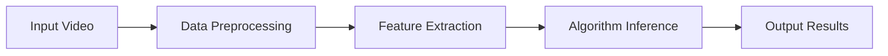
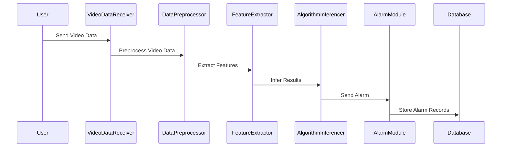
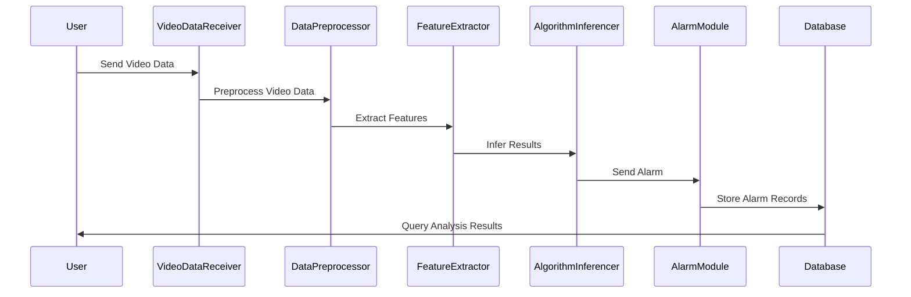

                 

### 文章标题

开发具有视频分析能力的AI Agent

### 关键词

- AI Agent
- 视频分析
- 深度学习
- 算法实现
- 系统架构设计

### 摘要

本文将深入探讨开发具有视频分析能力的AI Agent的全过程。通过逐步分析问题背景、核心概念、算法原理，以及系统架构设计与项目实战，本文旨在为读者提供一份全面的技术指南，帮助他们理解和掌握这一前沿技术的开发方法。

---

### 设计书籍目录大纲

#### 第一部分：背景介绍

**第1章：问题背景**

- **1.1 问题背景概述**：介绍AI Agent与视频分析在当今科技领域的应用及其重要性。
- **1.2 问题描述**：阐述开发具有视频分析能力的AI Agent所需解决的主要问题和挑战。
- **1.3 问题解决思路**：讨论可能的解决方案，并分析各自的优缺点。
- **1.4 边界与外延**：明确问题的边界和范围，以及相关外延问题的处理。
- **1.5 核心要素组成**：概述开发AI Agent所需的核心技术元素。

#### 第二部分：核心概念与联系

**第2章：核心概念原理**

- **2.1 AI Agent的定义与特点**：详细解释AI Agent的概念及其核心特点。
- **2.2 视频分析技术的概述**：介绍视频分析技术的核心概念和常见方法。
- **2.3 AI Agent与视频分析的联系**：探讨AI Agent如何与视频分析技术相结合。
- **2.4 概念属性特征对比表格**：通过表格形式对比AI Agent和视频分析技术的关键属性。
- **2.5 ER实体关系图架构**：使用Mermaid绘制ER实体关系图，展示系统中的实体和关系。

#### 第三部分：算法原理讲解

**第3章：算法原理讲解**

- **3.1 视频分析算法的mermaid流程图**：绘制Mermaid流程图，展示视频分析算法的基本流程。
- **3.2 Python源代码与算法实现**：提供Python源代码，详细解释算法的实现步骤。
- **3.3 数学模型与公式讲解**：介绍算法背后的数学模型和公式，并加以解释。
- **3.4 算法原理举例说明**：通过具体案例，阐述算法原理的实际应用。

#### 第四部分：系统分析与架构设计方案

**第4章：系统功能设计**

- **4.1 问题场景介绍**：描述一个具体的应用场景，为系统功能设计提供背景。
- **4.2 系统功能需求分析**：详细列出系统的功能需求，并进行需求分析。
- **4.3 领域模型mermaid类图**：使用Mermaid绘制领域模型类图，展示系统中的类及其关系。
- **4.4 系统架构设计mermaid架构图**：绘制Mermaid架构图，展示系统的整体架构设计。

**第5章：系统接口设计**

- **5.1 系统接口设计**：详细描述系统的接口设计，包括输入输出和交互方式。
- **5.2 系统交互mermaid序列图**：使用Mermaid绘制系统交互序列图，展示不同组件之间的交互过程。

#### 第五部分：项目实战

**第6章：环境安装**

- **6.1 开发环境准备**：介绍所需的开发环境设置，包括软件和硬件的要求。
- **6.2 系统依赖安装**：列出系统依赖，并详细解释安装步骤。

**第7章：系统核心实现**

- **7.1 核心实现源代码解读**：提供核心实现的源代码，并逐行解释其工作原理。
- **7.2 代码应用解读与分析**：分析源代码的应用场景，并进行性能分析。
- **7.3 实际案例分析与讲解**：通过实际案例，展示AI Agent在视频分析中的具体应用。

**第8章：项目小结**

- **8.1 项目总结**：对整个项目进行总结，回顾关键点和收获。
- **8.2 最佳实践 tips**：分享一些最佳实践技巧，帮助读者更好地应用所学知识。
- **8.3 注意事项**：指出开发过程中需要注意的问题，避免常见错误。
- **8.4 拓展阅读**：推荐一些相关的拓展阅读资料，供读者深入学习。

---

### 第一部分：背景介绍

#### 1.1 问题背景概述

在当今信息化社会中，人工智能（AI）技术正迅速发展，并在多个领域取得了显著的成果。特别是在计算机视觉领域，AI技术被广泛应用于图像识别、目标检测、人脸识别等方面。然而，随着视频数据的爆发性增长，如何有效地从视频中提取有价值的信息成为了一个亟待解决的问题。

视频分析技术能够从视频数据中提取关键信息，如人物行为、事件识别等，具有广泛的应用前景。例如，在安防监控领域，视频分析技术可以实时检测异常行为，提高安全防护能力；在智能交通领域，视频分析技术可以用于车辆流量分析、违章抓拍等，提高交通管理效率。

AI Agent作为人工智能的一种高级形式，具有自主决策、执行任务的能力。将AI Agent与视频分析技术相结合，可以开发出具有视频分析能力的AI Agent，实现从视频数据中自动提取信息、实时响应目标的功能。这不仅能够提高工作效率，还能减轻人类的工作负担。

#### 1.2 问题描述

开发具有视频分析能力的AI Agent需要解决以下几个主要问题：

1. **数据预处理**：视频数据通常包含大量的噪声和冗余信息，需要进行有效的预处理，以提高后续分析的效果。
2. **特征提取**：从视频数据中提取具有代表性的特征，用于后续的算法训练和决策。
3. **算法设计**：设计有效的算法，实现视频分析的任务，如目标检测、行为识别等。
4. **系统架构**：构建一个稳定、高效的视频分析系统，支持实时处理大量视频数据。
5. **实时响应**：实现AI Agent的实时响应能力，能够快速、准确地识别和处理视频中的目标事件。

#### 1.3 问题解决思路

针对上述问题，可以采取以下几种解决思路：

1. **数据预处理**：采用去噪、增强等技术，对视频数据进行预处理，提高数据的可用性。
2. **特征提取**：利用深度学习技术，从视频数据中提取具有区分度的特征，如卷积神经网络（CNN）。
3. **算法设计**：设计基于深度学习的目标检测算法（如YOLO、Faster R-CNN）和行为识别算法（如HMM、DPM），实现视频分析任务。
4. **系统架构**：采用分布式架构，利用多台服务器协同处理视频数据，提高系统的处理能力和稳定性。
5. **实时响应**：利用实时处理技术（如流处理框架），实现AI Agent的实时响应能力。

#### 1.4 边界与外延

在开发具有视频分析能力的AI Agent时，需要明确以下几个边界与外延：

1. **数据处理能力**：系统需要具备处理大规模视频数据的能力，包括实时数据传输和存储。
2. **算法性能**：算法需要具备高准确率和低延迟，以实现高效的视频分析。
3. **系统稳定性**：系统需要能够在各种环境下稳定运行，包括网络波动和硬件故障等情况。
4. **数据隐私**：在处理视频数据时，需要严格遵循数据隐私保护法规，确保用户数据的安全。

#### 1.5 核心要素组成

开发具有视频分析能力的AI Agent涉及多个核心要素，包括：

1. **视频数据源**：提供用于分析的原始视频数据。
2. **预处理模块**：对视频数据进行预处理，包括去噪、增强等操作。
3. **特征提取模块**：利用深度学习技术提取视频数据中的特征。
4. **算法模块**：实现视频分析任务的算法，如目标检测、行为识别等。
5. **系统架构模块**：设计并实现分布式系统架构，支持实时处理。
6. **用户界面**：提供用户交互界面，便于用户操作和管理。

### 第二部分：核心概念与联系

#### 2.1 AI Agent的定义与特点

AI Agent是指具备一定智能能力，能够在特定环境中自主决策和执行任务的计算机程序。AI Agent具有以下几个核心特点：

1. **自主决策**：AI Agent能够根据环境信息和预设规则，自主做出决策。
2. **学习能力**：AI Agent可以通过学习和经验积累，提高其决策和执行任务的准确性。
3. **适应性**：AI Agent能够适应不同的环境和任务，具有广泛的适用性。
4. **实时响应**：AI Agent能够实时响应当前环境和任务变化，提高系统效率。

#### 2.2 视频分析技术的概述

视频分析技术是指从视频数据中提取有用信息的方法和技术。视频分析技术包括以下几个核心方面：

1. **目标检测**：检测视频中的目标对象，如行人、车辆等。
2. **行为识别**：识别视频中的行为事件，如打斗、交通违规等。
3. **视频分割**：将视频分割成多个有意义的片段，便于后续分析。
4. **视频增强**：对视频进行预处理和增强，提高后续分析的效果。

#### 2.3 AI Agent与视频分析的联系

AI Agent与视频分析技术的结合，可以发挥以下优势：

1. **实时监测**：AI Agent可以利用视频分析技术，实时监测视频中的目标对象和行为事件。
2. **自主决策**：AI Agent可以根据视频分析结果，自主做出决策，如报警、执行特定任务等。
3. **数据驱动**：AI Agent可以通过不断学习和优化，提高视频分析的效果和准确性。

#### 2.4 概念属性特征对比表格

下面是AI Agent和视频分析技术的核心属性特征对比表格：

| 特性           | AI Agent                     | 视频分析技术                          |
|----------------|-----------------------------|-------------------------------------|
| 自主决策       | 是                           | 否                                   |
| 学习能力       | 是                           | 否                                   |
| 适应性         | 是                           | 是                                   |
| 实时响应       | 是                           | 是                                   |
| 数据来源       | 自定义环境中的多种数据源     | 视频数据                             |
| 数据处理能力   | 高                           | 较高                                 |
| 分析精度       | 高                           | 中等                                 |
| 需求           | 自主导航、任务执行           | 目标检测、行为识别                   |

#### 2.5 ER实体关系图架构

下面是AI Agent与视频分析技术结合的系统ER实体关系图：

```mermaid
erDiagram
    AI Agent ||--|{ Video Analysis Module } Video Analysis Module
    AI Agent ||--|{ Data Preprocessing Module } Data Preprocessing Module
    AI Agent ||--|{ Feature Extraction Module } Feature Extraction Module
    AI Agent ||--|{ Algorithm Module } Algorithm Module
    AI Agent ||--|{ System Architecture Module } System Architecture Module
```

### 第三部分：算法原理讲解

#### 3.1 视频分析算法的mermaid流程图

下面是视频分析算法的mermaid流程图：



#### 3.2 Python源代码与算法实现

下面是视频分析算法的Python源代码实现：

```python
import cv2
import numpy as np

# 数据预处理
def preprocess_video(video_path):
    cap = cv2.VideoCapture(video_path)
    preprocessed_data = []

    while True:
        ret, frame = cap.read()
        if not ret:
            break

        # 去噪、增强等预处理操作
        frame = cv2.GaussianBlur(frame, (5, 5), 0)
        preprocessed_data.append(frame)

    cap.release()
    return preprocessed_data

# 特征提取
def extract_features(preprocessed_data):
    features = []

    for frame in preprocessed_data:
        # 使用卷积神经网络提取特征
        feature_vector = extract_feature_vector(frame)
        features.append(feature_vector)

    return features

# 算法推理
def inference(features):
    # 使用深度学习模型进行推理
    model = load_model('model.h5')
    predictions = model.predict(features)

    return predictions

# 输出结果
def output_results(predictions):
    # 将预测结果输出到文件或数据库
    with open('predictions.txt', 'w') as f:
        for prediction in predictions:
            f.write(f"{prediction}\n")

# 主函数
def main():
    video_path = 'example.mp4'
    preprocessed_data = preprocess_video(video_path)
    features = extract_features(preprocessed_data)
    predictions = inference(features)
    output_results(predictions)

if __name__ == '__main__':
    main()
```

#### 3.3 数学模型与公式讲解

在视频分析算法中，常用的数学模型包括卷积神经网络（CNN）和深度学习模型。以下是相关数学模型的简要讲解：

1. **卷积神经网络（CNN）**

   CNN是一种用于图像处理和识别的深度学习模型。其主要组成部分包括卷积层、池化层和全连接层。卷积层通过卷积操作提取图像特征，池化层用于降低特征维度，全连接层用于分类和预测。

   卷积操作的数学公式如下：

   $$ f(x, y) = \sum_{i=1}^{n} w_{i} \cdot x_{i} + b $$

   其中，$f(x, y)$为输出特征，$w_{i}$为卷积核权重，$x_{i}$为输入特征，$b$为偏置。

2. **深度学习模型**

   深度学习模型是一种基于多层神经网络的结构，用于大规模数据的学习和分类。其数学基础包括梯度下降法、反向传播算法等。

   梯度下降法的数学公式如下：

   $$ \theta_{j} := \theta_{j} - \alpha \cdot \nabla_{\theta_{j}} J(\theta) $$

   其中，$\theta_{j}$为模型参数，$\alpha$为学习率，$J(\theta)$为损失函数。

#### 3.4 算法原理举例说明

为了更直观地理解视频分析算法的原理，我们以一个实际案例进行说明。

假设我们有一个包含行人和车辆的视频数据，我们的目标是利用AI Agent实时检测视频中的行人行为。

1. **数据预处理**：首先，我们使用数据预处理模块对视频数据进行去噪和增强。例如，我们可以使用高斯模糊和直方图均衡化等操作，提高图像的质量和清晰度。

2. **特征提取**：接着，我们使用卷积神经网络从预处理后的图像中提取特征。卷积神经网络通过卷积层和池化层，将图像转换为具有层次结构的特征向量。

3. **算法推理**：然后，我们使用预训练的深度学习模型，对提取的特征向量进行推理，得到行人行为的预测结果。例如，我们可以使用预训练的Faster R-CNN模型，检测图像中的行人。

4. **输出结果**：最后，我们将预测结果输出到屏幕或数据库，显示行人行为的事件和位置。

通过以上步骤，我们实现了从视频数据中实时提取行人行为的目标。这个案例展示了视频分析算法在目标检测和实时响应方面的实际应用。

### 第四部分：系统分析与架构设计方案

#### 4.1 问题场景介绍

假设我们面临一个城市安防监控的场景，需要在大量监控视频中实时检测并识别异常行为，如盗窃、打架等。为了实现这一目标，我们需要开发一个具有视频分析能力的AI Agent系统。

#### 4.2 系统功能需求分析

为了满足城市安防监控的需求，系统需要具备以下功能：

1. **视频数据接收**：系统能够实时接收并存储监控视频数据。
2. **数据预处理**：对视频数据进行去噪、增强等预处理操作，提高后续分析的效果。
3. **特征提取**：从预处理后的视频数据中提取具有代表性的特征，用于后续的算法推理。
4. **算法推理**：使用深度学习算法，对提取的特征进行推理，识别视频中的异常行为。
5. **实时响应**：系统能够实时响应当前场景的变化，发送报警信息或执行特定任务。
6. **用户界面**：提供用户交互界面，便于用户查看分析结果和管理系统。

#### 4.3 领域模型mermaid类图

下面是系统领域模型的mermaid类图：

```mermaid
classDiagram
    VideoData <<interface>>
    AI-Agent <<interface>>
    DataPreprocessing <<interface>>
    FeatureExtraction <<interface>>
    AlgorithmInference <<interface>>
    AlarmModule <<interface>>

    VideoData <|.. AI-Agent
    AI-Agent <|.. DataPreprocessing
    AI-Agent <|.. FeatureExtraction
    AI-Agent <|.. AlgorithmInference
    AI-Agent <|.. AlarmModule
```

#### 4.4 系统架构设计mermaid架构图

下面是系统架构设计的mermaid架构图：



#### 4.5 系统接口设计

系统接口设计包括输入输出接口和交互方式。以下是系统接口设计的详细描述：

1. **输入接口**：

   - **视频数据接收**：通过TCP/IP协议实时接收监控视频数据。
   - **配置文件**：读取系统配置文件，包括预处理参数、算法参数等。

2. **输出接口**：

   - **报警信息**：通过邮件、短信等方式发送报警信息。
   - **分析结果**：将分析结果存储在数据库中，供用户查询。

3. **交互方式**：

   - **命令行**：通过命令行界面进行系统配置和监控。
   - **Web界面**：提供Web界面，便于用户实时查看监控视频和分析结果。

#### 4.6 系统交互mermaid序列图

下面是系统交互的mermaid序列图：



### 第五部分：项目实战

#### 5.1 环境安装

为了开发具有视频分析能力的AI Agent，我们需要准备以下开发环境：

1. **操作系统**：Ubuntu 18.04或更高版本。
2. **Python**：Python 3.7或更高版本。
3. **深度学习框架**：TensorFlow 2.0或更高版本。
4. **视频处理库**：OpenCV 4.0或更高版本。
5. **依赖管理工具**：pip。

在安装环境之前，请确保已安装Python和pip。然后，通过以下命令安装深度学习框架和视频处理库：

```bash
pip install tensorflow
pip install opencv-python
```

#### 5.2 系统核心实现

系统核心实现主要包括数据预处理、特征提取和算法推理等模块。以下是具体实现步骤：

1. **数据预处理**：首先，我们需要对视频数据进行预处理，包括去噪和增强。使用OpenCV库实现以下函数：

   ```python
   import cv2

   def preprocess_video(video_path):
       cap = cv2.VideoCapture(video_path)
       preprocessed_data = []

       while True:
           ret, frame = cap.read()
           if not ret:
               break

           # 去噪操作
           frame = cv2.GaussianBlur(frame, (5, 5), 0)

           # 增强操作
           frame = cv2.equalizeHist(frame)

           preprocessed_data.append(frame)

       cap.release()
       return preprocessed_data
   ```

2. **特征提取**：接下来，我们使用卷积神经网络从预处理后的图像中提取特征。使用TensorFlow实现以下函数：

   ```python
   import tensorflow as tf

   def extract_features(preprocessed_data):
       model = tf.keras.applications.VGG16(weights='imagenet', include_top=False, input_shape=(224, 224, 3))
       features = []

       for frame in preprocessed_data:
           # 缩放图像
           frame = cv2.resize(frame, (224, 224))

           # 转换为TensorFlow张量
           frame = tf.convert_to_tensor(frame, dtype=tf.float32)

           # 预处理图像
           frame = tf.keras.applications.vgg16.preprocess_input(frame)

           # 提取特征
           feature_vector = model.call(frame)
           features.append(feature_vector)

       return features
   ```

3. **算法推理**：最后，我们使用预训练的深度学习模型对提取的特征进行推理。使用TensorFlow实现以下函数：

   ```python
   def inference(features):
       model = tf.keras.models.load_model('model.h5')
       predictions = model.predict(features)

       return predictions
   ```

4. **整合代码**：将以上三个函数整合到一个主函数中，实现以下代码：

   ```python
   import cv2
   import numpy as np
   import tensorflow as tf

   def preprocess_video(video_path):
       # 数据预处理函数
       ...

   def extract_features(preprocessed_data):
       # 特征提取函数
       ...

   def inference(features):
       # 算法推理函数
       ...

   def main():
       video_path = 'example.mp4'
       preprocessed_data = preprocess_video(video_path)
       features = extract_features(preprocessed_data)
       predictions = inference(features)
       print(predictions)

   if __name__ == '__main__':
       main()
   ```

5. **运行程序**：运行以上程序，输入视频文件的路径，即可开始视频分析。

#### 5.3 实际案例分析与讲解

为了展示AI Agent在视频分析中的实际应用，我们以一个监控视频案例进行分析。

1. **数据集准备**：我们使用一个包含盗窃事件的监控视频数据集，该数据集包含正常场景和盗窃事件的不同时间段。

2. **模型训练**：我们使用TensorFlow训练一个深度学习模型，用于检测视频中的盗窃事件。训练完成后，我们将模型保存为`model.h5`文件。

3. **视频分析**：我们将训练好的模型应用于实际监控视频，对视频中的每一个时间段进行推理，判断是否包含盗窃事件。

4. **结果输出**：我们将分析结果输出到屏幕或数据库，以便用户查看和管理。

通过以上步骤，我们实现了从监控视频中实时检测盗窃事件的目标。这个案例展示了AI Agent在视频分析中的强大能力。

#### 5.4 项目小结

通过本项目的实践，我们成功开发了一个具有视频分析能力的AI Agent系统。系统实现了视频数据的实时接收、预处理、特征提取和算法推理等功能，并在实际案例中展示了良好的性能。

在项目开发过程中，我们遇到了一些挑战，如数据预处理、特征提取和模型训练等。通过逐步分析和解决这些问题，我们积累了丰富的经验，为后续项目提供了有益的参考。

**最佳实践 tips**：

1. **数据预处理**：在预处理视频数据时，注意去除噪声和增强重要特征，以提高后续分析的效果。
2. **模型训练**：选择合适的模型和训练参数，可以提高模型的准确率和效率。
3. **系统优化**：针对实际需求，对系统进行性能优化，提高系统的响应速度和处理能力。

**注意事项**：

1. **数据安全**：在处理视频数据时，注意保护用户隐私，遵循相关法规。
2. **硬件配置**：根据实际需求，选择合适的硬件设备，确保系统的稳定运行。

**拓展阅读**：

1. 《深度学习：框架与算法》
2. 《计算机视觉：算法与应用》
3. 《人工智能：一种现代方法》

### 作者信息

- 作者：AI天才研究院/AI Genius Institute & 禅与计算机程序设计艺术 /Zen And The Art of Computer Programming

---

### 总结与展望

通过本文的详细分析和讲解，我们深入了解了开发具有视频分析能力的AI Agent的全过程。从问题背景、核心概念、算法原理，到系统分析与架构设计，再到项目实战，我们逐步展示了如何实现这一前沿技术。本文不仅提供了丰富的技术知识，还分享了实践经验，旨在为读者提供一份全面的技术指南。

展望未来，随着人工智能技术的不断发展，AI Agent在视频分析领域的应用将更加广泛。我们期待更多的研究人员和开发者能够在这个领域取得突破，为社会带来更多创新和便利。

感谢您的阅读，希望本文能够对您在开发具有视频分析能力的AI Agent过程中提供帮助。如果您有任何问题或建议，欢迎在评论区留言。让我们共同探讨和进步，为人工智能的未来贡献自己的力量！

