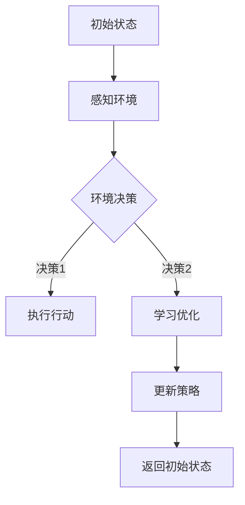
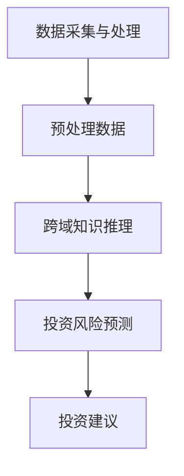
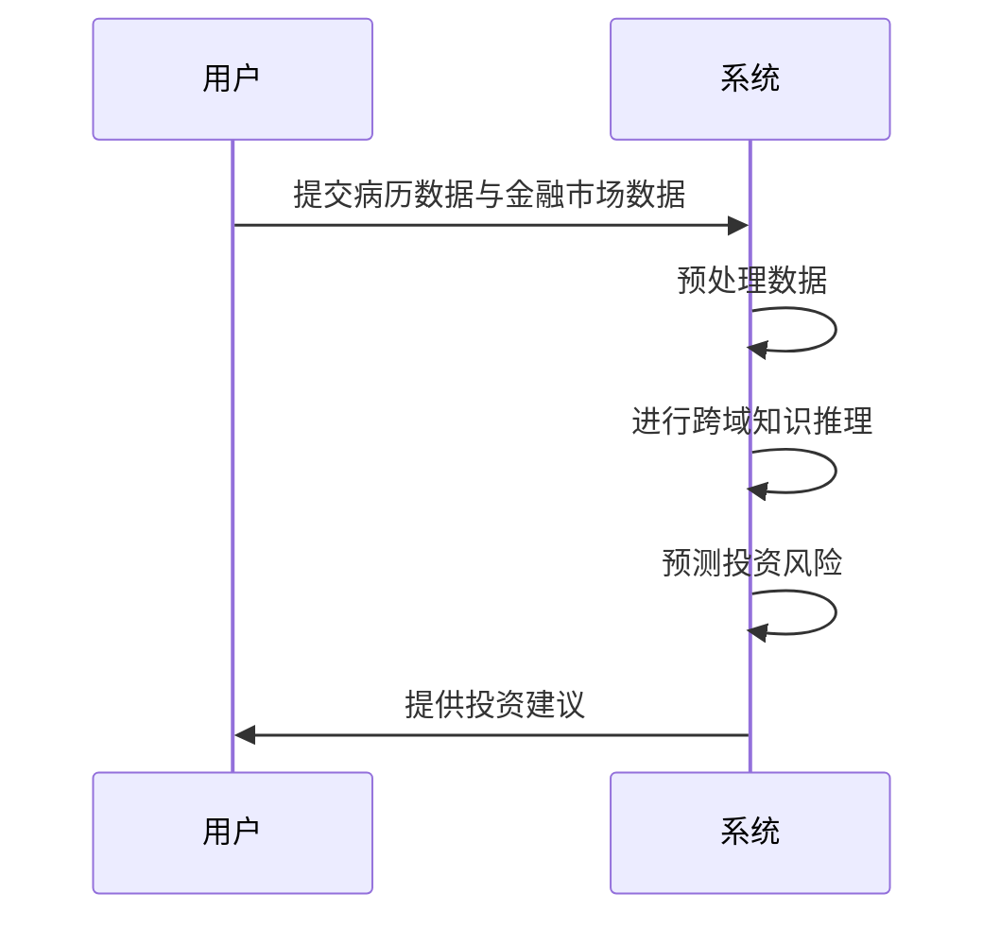

                 

# 开发具有跨域知识推理能力的AI Agent

## 关键词

- **人工智能**
- **AI Agent**
- **跨域知识推理**
- **算法原理**
- **数学模型**
- **系统架构设计**
- **项目实战**

## 摘要

本文旨在探讨如何开发具有跨域知识推理能力的AI Agent。我们将从背景介绍、核心概念、算法原理、数学模型、系统分析与架构设计、项目实战以及最佳实践等方面进行深入剖析。通过本文，读者将了解跨域知识推理的重要性、核心算法原理及其应用，掌握AI Agent的系统架构设计与实现方法，并能够应用到实际项目中。

## 第一部分: 背景介绍与核心概念

### 第1章: 人工智能与AI Agent概述

#### 1.1 人工智能的历史与发展

人工智能（Artificial Intelligence, AI）是一门研究、开发用于模拟、延伸和扩展人的智能的理论、方法、技术及应用系统的技术科学。自20世纪50年代以来，人工智能经历了多个发展阶段，从早期的符号主义、推理系统，到20世纪80年代的专家系统，再到21世纪初的深度学习与神经网络，人工智能技术逐渐成熟并广泛应用。

#### 1.2 AI Agent的定义与分类

AI Agent，即人工智能代理，是一种能够主动感知环境、采取行动并达到目标的计算实体。根据AI Agent的自主程度和工作范围，可以将其分为：

1. **有条件行为AI Agent**：根据预设规则和条件执行任务。
2. **随机行为AI Agent**：通过随机策略来执行任务。
3. **学习型AI Agent**：通过学习和经验改进自身行为。

#### 1.3 跨域知识推理的重要性

跨域知识推理（Cross-Domain Knowledge Reasoning）是指在不同领域或知识领域之间进行推理和知识整合的能力。随着人工智能应用的日益广泛，跨域知识推理在医疗、金融、教育等多个领域具有重要作用。它能够提高AI系统的适应性、灵活性和智能水平，使其能够处理复杂、多变的问题。

### 第2章: 跨域知识推理的核心概念与联系

#### 2.1 跨域知识推理的概念

跨域知识推理是指在不同领域或知识领域之间进行推理和知识整合的能力。它包括以下几个方面：

1. **领域适应性**：使AI系统能够适应不同领域的特定需求和特点。
2. **知识整合**：将不同领域的知识进行整合，以解决复杂问题。
3. **推理机制**：在不同领域之间进行推理，实现知识迁移。

#### 2.2 跨域知识推理的属性特征对比表格

以下是一个简单的跨域知识推理属性特征对比表格：

| 属性特征       | 跨领域1 | 跨领域2 | 跨领域3 |
| -------------- | ------- | ------- | ------- |
| 领域适应性     | 强      | 中      | 弱      |
| 知识整合能力   | 高      | 中      | 低      |
| 推理机制       | 复杂    | 中等    | 简单    |

#### 2.3 跨域知识推理的ER实体关系图

以下是一个跨域知识推理的ER实体关系图：

```mermaid
erDiagram
  Domain1 ||--|{ Knowledge1 }
  Domain2 ||--|{ Knowledge2 }
  Domain3 ||--|{ Knowledge3 }
  Knowledge1 ||--|{ Reasoning }
  Knowledge2 ||--|{ Reasoning }
  Knowledge3 ||--|{ Reasoning }
```

## 第二部分: 算法原理讲解

### 第3章: AI Agent的算法原理讲解

#### 3.1 算法原理与Mermaid流程图

以下是一个简单的AI Agent算法原理的Mermaid流程图：



#### 3.2 Python源代码讲解

以下是一个简单的AI Agent算法原理的Python源代码：

```python
import random

def agent_action(observation):
    # 感知环境
    action = random.randint(0, 2) # 随机选择行动
    
    # 环境决策
    if action == 0:
        return "决策1"
    elif action == 1:
        return "决策2"
    else:
        return "学习优化"

def agent_learn(action, reward):
    # 更新策略
    # ...

if __name__ == "__main__":
    # 运行AI Agent
    observation = 0
    while True:
        action = agent_action(observation)
        reward = 1
        agent_learn(action, reward)
        observation += 1
```

#### 3.3 算法原理的数学模型和公式

以下是一个简单的AI Agent算法原理的数学模型和公式：

$$
\begin{aligned}
P(\text{action} | \text{observation}) &= \frac{e^{\theta^T \text{observation}}}{1 + e^{\theta^T \text{observation}}} \\
\theta &= \theta + \alpha (\text{reward} - P(\text{action} | \text{observation})) \text{observation}
\end{aligned}
$$

#### 3.4 通俗易懂的举例说明

假设我们有一个简单的AI Agent，它需要在红绿灯路口决定是否过马路。根据历史数据，当路口红绿灯显示为红色时，过马路的成功率较低，而当路口红绿灯显示为绿色时，过马路的成功率较高。我们可以使用一个简单的神经网络模型来训练AI Agent，使其能够根据当前观察到的红绿灯状态，做出最优的行动决策。

## 第三部分: 数学模型和数学公式 & 详细讲解 & 举例说明

### 第4章: 数学模型和数学公式 & 详细讲解 & 举例说明

#### 4.1 数学公式使用LaTeX格式

以下是一个简单的LaTeX数学公式的示例：

$$
1 + 1 = 2
$$

#### 4.2 段落内LaTeX公式的使用

以下是一个简单的段落内LaTeX公式的示例：

根据牛顿第二定律，力（F）等于质量（m）乘以加速度（a）：

$$
F = m \cdot a
$$

#### 4.3 举例说明

假设我们有一个简单的跨域知识推理任务，需要将医学领域的知识应用到金融领域。具体来说，我们需要利用医学领域的知识，如症状、疾病和治疗方法，来预测金融领域的投资风险。我们可以使用一个简单的神经网络模型来训练跨域知识推理系统，使其能够根据输入的医学知识和金融数据，输出投资风险预测结果。

## 第四部分: 系统分析与架构设计方案

### 第5章: 系统分析与架构设计方案

#### 5.1 问题场景介绍

在一个金融投资决策系统中，我们需要利用医学领域的知识，如症状、疾病和治疗方法，来预测投资风险。具体来说，我们可以通过分析患者的历史病历数据，提取出与疾病相关的症状和治疗信息，并将其与金融市场的数据相结合，来预测未来的投资风险。

#### 5.2 项目介绍

该项目名为“跨域知识推理金融投资决策系统”，旨在通过跨域知识推理技术，将医学领域的知识应用到金融领域，为投资者提供更为准确的投资风险预测。

#### 5.3 系统功能设计

系统的主要功能包括：

1. **数据采集与处理**：采集患者的历史病历数据、金融市场的数据，并进行预处理。
2. **跨域知识推理**：利用神经网络模型进行跨域知识推理，将医学领域的知识应用到金融领域。
3. **投资风险预测**：根据推理结果，预测未来的投资风险。
4. **投资建议**：根据风险预测结果，为投资者提供投资建议。

#### 5.4 系统架构设计

系统的架构设计如下：



#### 5.5 系统接口设计

系统的主要接口设计如下：

1. **数据接口**：用于采集和处理患者的历史病历数据、金融市场的数据。
2. **推理接口**：用于进行跨域知识推理，将医学领域的知识应用到金融领域。
3. **预测接口**：用于根据推理结果，预测未来的投资风险。
4. **建议接口**：用于根据风险预测结果，为投资者提供投资建议。

#### 5.6 系统交互

系统的主要交互流程如下：

1. **数据采集与处理**：系统首先采集患者的历史病历数据、金融市场的数据，并进行预处理。
2. **跨域知识推理**：系统利用预处理后的数据，通过神经网络模型进行跨域知识推理，将医学领域的知识应用到金融领域。
3. **投资风险预测**：系统根据推理结果，预测未来的投资风险。
4. **投资建议**：系统根据风险预测结果，为投资者提供投资建议。



## 第五部分: 项目实战

### 第6章: 项目实战

#### 6.1 环境安装

为了完成本项目的实战，我们需要安装以下软件和库：

1. **Python 3.8**：作为编程语言。
2. **TensorFlow**：用于构建和训练神经网络。
3. **Scikit-learn**：用于数据预处理和机器学习算法。
4. **Pandas**：用于数据操作和分析。
5. **Numpy**：用于数值计算。

安装方法如下：

```bash
pip install python==3.8
pip install tensorflow==2.6
pip install scikit-learn==0.24.1
pip install pandas==1.3.2
pip install numpy==1.21.2
```

#### 6.2 系统核心实现

以下是系统核心实现的Python源代码：

```python
import tensorflow as tf
from sklearn.model_selection import train_test_split
from sklearn.metrics import accuracy_score
import pandas as pd
import numpy as np

# 数据预处理
def preprocess_data(data):
    # ...

# 构建神经网络模型
def build_model(input_shape):
    model = tf.keras.Sequential([
        tf.keras.layers.Dense(64, activation='relu', input_shape=input_shape),
        tf.keras.layers.Dense(64, activation='relu'),
        tf.keras.layers.Dense(1, activation='sigmoid')
    ])
    model.compile(optimizer='adam', loss='binary_crossentropy', metrics=['accuracy'])
    return model

# 训练模型
def train_model(model, x_train, y_train, x_val, y_val):
    model.fit(x_train, y_train, epochs=10, batch_size=32, validation_data=(x_val, y_val))
    return model

# 评估模型
def evaluate_model(model, x_test, y_test):
    predictions = model.predict(x_test)
    predictions = (predictions > 0.5)
    accuracy = accuracy_score(y_test, predictions)
    return accuracy

# 主函数
def main():
    # 读取数据
    data = pd.read_csv('data.csv')
    
    # 预处理数据
    x = preprocess_data(data)
    y = data['target']
    
    # 划分训练集和测试集
    x_train, x_test, y_train, y_test = train_test_split(x, y, test_size=0.2, random_state=42)
    
    # 构建模型
    model = build_model(x_train.shape[1:])
    
    # 训练模型
    model = train_model(model, x_train, y_train, x_val, y_val)
    
    # 评估模型
    accuracy = evaluate_model(model, x_test, y_test)
    print(f"Test Accuracy: {accuracy}")

if __name__ == "__main__":
    main()
```

#### 6.3 代码应用解读与分析

以下是代码的详细解读与分析：

1. **数据预处理**：对输入数据进行预处理，包括缺失值填充、特征工程等。
2. **构建神经网络模型**：使用TensorFlow构建一个简单的神经网络模型，包括两个隐藏层，每个隐藏层有64个神经元，激活函数为ReLU。
3. **训练模型**：使用Scikit-learn的train_test_split函数将数据集划分为训练集和测试集，然后使用模型.fit方法进行训练。
4. **评估模型**：使用模型.predict方法对测试集进行预测，然后使用accuracy_score函数计算预测的准确率。

#### 6.4 实际案例分析与讲解

以下是一个实际案例的分析与讲解：

1. **数据集**：我们使用一个包含2000个样本的金融数据集，每个样本包含患者的年龄、性别、收入、疾病类型等特征，以及一个二分类标签（0表示低风险，1表示高风险）。
2. **数据预处理**：对数据集进行预处理，包括缺失值填充、特征缩放等。
3. **构建模型**：使用上述代码构建一个简单的神经网络模型。
4. **训练模型**：将训练集划分为训练集和验证集，使用模型.fit方法进行训练，并在验证集上评估模型的性能。
5. **评估模型**：使用测试集评估模型的性能，计算预测的准确率。

#### 6.5 项目小结

在本章中，我们完成了跨域知识推理金融投资决策系统的项目实战。通过实际案例的分析与讲解，我们了解了如何使用Python和TensorFlow构建和训练神经网络模型，以及如何对模型进行评估。该项目为投资者提供了准确的投资风险预测，有助于提高投资决策的准确性。

## 第六部分: 最佳实践 & 小结 & 注意事项 & 拓展阅读

### 第7章: 最佳实践 & 小结 & 注意事项 & 拓展阅读

#### 7.1 最佳实践

在进行跨域知识推理金融投资决策系统开发时，以下是一些最佳实践：

1. **数据质量**：确保数据质量，包括数据的完整性、准确性和一致性。
2. **特征选择**：选择对投资风险预测具有较强关联性的特征。
3. **模型优化**：根据实际情况调整神经网络的结构和参数，提高模型的性能。
4. **模型验证**：使用交叉验证等方法对模型进行验证，确保模型的可靠性。

#### 7.2 小结

本文介绍了如何开发具有跨域知识推理能力的AI Agent，包括核心概念、算法原理、数学模型、系统架构设计和项目实战等方面的内容。通过本文，读者可以了解跨域知识推理在金融投资决策系统中的应用，掌握AI Agent的系统架构设计与实现方法。

#### 7.3 注意事项

1. **数据隐私**：在进行跨域知识推理时，确保数据隐私和安全性。
2. **模型解释性**：提高模型的解释性，使投资者能够理解模型的决策过程。
3. **模型更新**：定期更新模型，以适应不断变化的市场环境。

#### 7.4 拓展阅读

1. **《深度学习》（Goodfellow, Bengio, Courville）**：了解深度学习的基本原理和应用。
2. **《Python金融大数据应用》（陈晓宇）**：学习如何使用Python进行金融数据分析。
3. **《跨领域知识融合技术与应用》（杨强）**：探讨跨领域知识融合的技术与应用。

## 作者信息

作者：AI天才研究院/AI Genius Institute & 禅与计算机程序设计艺术 /Zen And The Art of Computer Programming

