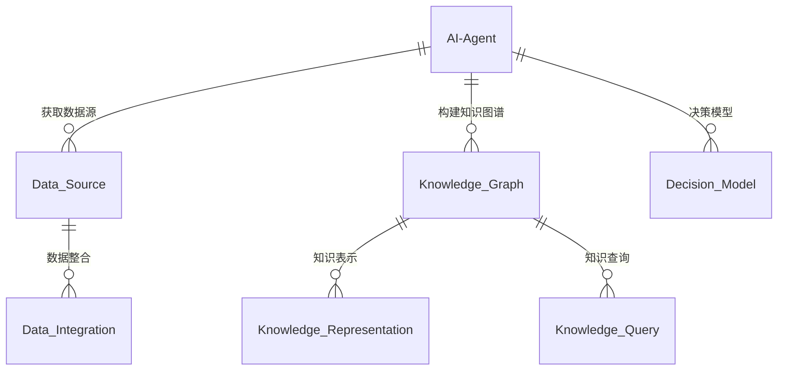
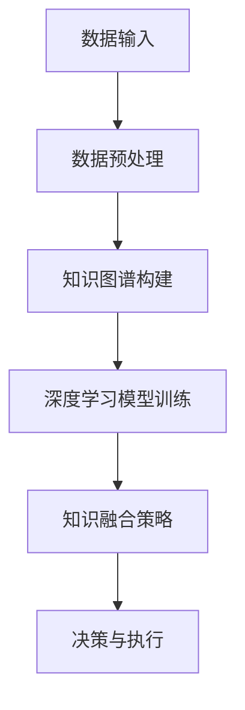
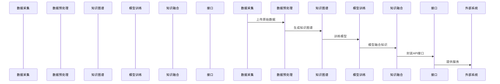

                 

### 文章标题

### 关键词

- AI Agent
- 跨域知识融合
- 知识图谱
- 深度学习
- 系统架构

### 摘要

本文将探讨开发具有跨域知识融合能力的AI Agent的重要性及其实现方法。首先，我们将介绍AI Agent的基本概念及其在跨领域知识融合中的应用。接着，我们将深入分析AI Agent的设计原则和核心算法，包括知识图谱的构建、深度学习模型的训练以及跨域知识融合的技术细节。随后，我们将详细阐述系统架构设计，包括系统功能模块划分、系统接口设计和系统交互方式。最后，我们将通过实际项目案例来展示如何开发和部署具有跨域知识融合能力的AI Agent，并提供一些最佳实践和未来展望。

## 引言

### AI Agent的基本概念

AI Agent，即人工智能代理，是一种具有自主决策能力的智能实体。它能够模拟人类行为，在特定环境下执行任务，并基于感知到的环境反馈进行调整和优化。AI Agent的核心特征包括自主性、适应性和协作性。自主性意味着AI Agent能够独立完成指定任务，而无需人工干预；适应性则表示AI Agent能够根据环境变化动态调整自身行为；协作性则强调了AI Agent在多Agent系统中的合作能力。

AI Agent的应用领域广泛，包括但不限于自然语言处理、机器人、智能推荐系统、自动驾驶等。随着技术的进步，AI Agent在处理复杂任务、跨领域协同和智能化决策方面的优势愈发明显。

### 跨域知识融合的意义

在当今信息爆炸的时代，不同领域的数据和知识呈现出高度分散和异构的特性。跨域知识融合（Cross-Domain Knowledge Integration）是指在不同领域或不同数据源之间整合知识，从而形成统一的、综合性的知识体系。这种整合不仅能够提高数据利用效率，还能为AI Agent提供更丰富的信息来源，提升其决策能力和智能水平。

跨域知识融合在多个领域具有重要意义。例如，在医疗领域，通过跨学科融合临床数据、生物数据和基因数据，可以为患者提供更精准的诊断和治疗建议。在金融领域，跨市场、跨产品的数据融合可以优化投资组合，提高风险管理能力。在智能制造领域，通过融合生产数据、供应链数据和客户数据，可以实现更高效的供应链管理和生产优化。

### 问题背景和解决思路

尽管跨域知识融合具有显著的潜力，但其实现过程却面临诸多挑战。首先，不同领域的数据格式、语义和表示方法各异，难以直接整合。其次，知识碎片化严重，缺乏统一的语义理解和描述框架。此外，现有AI Agent的设计和实现多针对特定领域，缺乏跨领域的通用性和适应性。

为了解决这些问题，本文提出了开发具有跨域知识融合能力的AI Agent。这种AI Agent不仅能够处理单一领域的任务，还能够跨领域整合知识，提供更广泛的应用场景。本文将从以下几个方面展开讨论：

1. **核心概念和原理**：介绍AI Agent的基本概念和设计原则，包括知识图谱、深度学习模型等关键组件。
2. **算法设计和实现**：详细阐述跨域知识融合的算法流程，包括数据预处理、知识图谱构建、模型训练和融合策略等。
3. **系统架构设计**：描述AI Agent的系统架构，包括功能模块划分、接口设计和交互方式。
4. **实战案例解析**：通过实际项目案例，展示如何开发具有跨域知识融合能力的AI Agent，并进行详细分析和解读。
5. **最佳实践和未来展望**：总结最佳实践，提出未来研究方向和挑战。

通过以上步骤，我们旨在为读者提供一套系统、全面且易于实践的开发指南，助力构建具有跨域知识融合能力的AI Agent。

### 背景介绍

#### AI Agent的定义与作用

AI Agent，即人工智能代理，是一种通过模拟人类决策过程和执行任务的智能实体。它可以在预定的环境中感知外界信息，分析这些信息并作出相应决策，进而执行任务。AI Agent的核心特点在于其自主性、适应性和协作性。自主性使AI Agent能够独立完成指定任务，无需人工干预；适应性则表现为AI Agent能够根据环境变化动态调整自身行为；协作性则强调了AI Agent在多Agent系统中的合作能力。

AI Agent的起源可以追溯到人工智能（AI）的早期研究。自20世纪50年代以来，随着计算机技术的迅猛发展，AI领域逐渐形成了包括符号主义、基于规则系统、专家系统、机器学习、深度学习等在内的多种方法。这些方法为AI Agent的设计和实现提供了多样化的技术支持。特别是随着深度学习和大数据技术的兴起，AI Agent的表现和功能得到了极大的提升，开始在各个领域得到广泛应用。

在自然语言处理领域，AI Agent通过深度学习技术实现了高效的文本理解和生成，可以用于智能客服、语言翻译、文本摘要等应用。在机器人领域，AI Agent通过感知环境和执行动作，实现了自主导航、人机交互、故障诊断等功能。在智能推荐系统领域，AI Agent通过分析用户行为和偏好，实现了个性化的内容推荐和广告投放。在自动驾驶领域，AI Agent通过实时感知路况和环境，实现了自动驾驶车辆的自主行驶。

#### 跨领域知识融合的挑战与机遇

跨领域知识融合（Cross-Domain Knowledge Integration）是指在不同领域或不同数据源之间整合知识，从而形成统一的、综合性的知识体系。这一过程面临诸多挑战，同时也蕴含着巨大的机遇。

首先，不同领域的数据格式、语义和表示方法各异，这使得直接整合数据变得复杂。例如，在医疗领域，数据通常以电子病历、基因序列等形式存在；而在金融领域，数据可能包括交易记录、财务报表等。这些数据不仅在格式上存在差异，其语义和含义也可能不同。

其次，知识碎片化严重，缺乏统一的语义理解和描述框架。不同领域之间的知识往往是分散的、片段化的，缺乏系统性和连贯性。例如，在医疗领域，医生可能掌握丰富的临床知识，但缺乏对生物数据和基因数据的深入理解；而在金融领域，分析师可能擅长分析市场趋势，但缺乏对技术细节的了解。

此外，现有AI Agent的设计和实现多针对特定领域，缺乏跨领域的通用性和适应性。这导致AI Agent在不同领域中的应用效果受限，难以实现跨领域的知识融合。

尽管面临这些挑战，跨领域知识融合也蕴含着巨大的机遇。通过跨领域知识融合，AI Agent可以获取更广泛的信息来源，提升其决策能力和智能水平。例如，在医疗领域，通过跨学科融合临床数据、生物数据和基因数据，可以为患者提供更精准的诊断和治疗建议；在金融领域，通过跨市场、跨产品的数据融合，可以优化投资组合，提高风险管理能力。

#### 跨域知识融合的应用场景

跨领域知识融合的应用场景广泛，涵盖了多个领域和行业。以下是一些典型的应用场景：

1. **智能医疗**：通过跨学科融合临床数据、生物数据和基因数据，AI Agent可以提供更精准的诊断和治疗建议。例如，在癌症治疗中，通过整合患者的临床数据、基因数据和治疗方案数据，AI Agent可以为医生提供个性化的治疗方案。

2. **金融分析**：通过跨市场、跨产品的数据融合，AI Agent可以优化投资组合，提高风险管理能力。例如，在股票市场中，通过整合历史交易数据、财务报表数据和宏观经济数据，AI Agent可以预测市场趋势，为投资者提供参考。

3. **智能制造**：通过融合生产数据、供应链数据和客户数据，AI Agent可以实现更高效的供应链管理和生产优化。例如，在制造企业中，通过整合生产线数据、供应链数据和客户反馈数据，AI Agent可以预测生产需求，优化生产计划和库存管理。

4. **智能城市**：通过跨领域融合交通数据、环境数据和公共安全数据，AI Agent可以提升城市管理水平，优化资源配置。例如，在交通管理中，通过整合交通流量数据、气象数据和道路基础设施数据，AI Agent可以实时预测交通状况，提供最优的路线规划。

#### 跨域知识融合的实现路径

要实现跨领域知识融合，需要从数据整合、知识表示、算法设计等方面入手。以下是一些关键的实现路径：

1. **数据整合**：首先，需要对不同领域的数据进行清洗、归一化和融合。这包括数据格式的转换、数据冗余的处理和数据缺失的填补等。

2. **知识表示**：其次，需要建立统一的语义理解和描述框架，将不同领域的知识进行编码和表示。这可以通过知识图谱、本体论等方法来实现。

3. **算法设计**：最后，需要设计适合跨领域知识融合的算法，包括数据预处理、特征提取、模型训练和融合策略等。这需要结合深度学习、迁移学习、强化学习等多种技术。

通过以上步骤，可以实现跨领域知识融合，为AI Agent提供更丰富和全面的信息来源，提升其智能水平和应用效果。

### 核心概念与联系

#### AI Agent的基本概念

AI Agent是由人工智能技术构建的智能实体，具有感知环境、自主决策和执行任务的能力。AI Agent的核心概念包括：

1. **感知器**：用于感知外部环境的信息，如视觉、听觉、触觉等。
2. **决策模块**：根据感知到的信息，利用算法和模型进行决策。
3. **执行器**：执行决策结果，如电机、机器人手臂等。

AI Agent的基本功能是接收输入信息、处理信息和输出结果。其工作流程可以概括为以下几个步骤：

1. **感知**：AI Agent通过感知器获取环境信息。
2. **决策**：利用内置的算法和模型对感知信息进行分析和处理，生成决策。
3. **执行**：根据决策结果，通过执行器执行具体任务。

#### 跨域知识融合的概念

跨域知识融合是指将来自不同领域或不同来源的知识进行整合，形成统一的知识体系。核心概念包括：

1. **数据源**：不同领域或来源的数据，如医疗数据、金融数据、生产数据等。
2. **知识表示**：将数据转换成统一格式和语义，便于整合和利用。
3. **知识图谱**：表示知识结构和关系的一种图形化工具，用于组织和查询知识。

跨域知识融合的目标是实现知识的综合利用，提高AI Agent的智能水平和决策能力。其工作流程包括以下几个步骤：

1. **数据整合**：将不同数据源的数据进行清洗、转换和融合。
2. **知识表示**：将整合后的数据转换为统一的格式和语义，形成知识图谱。
3. **知识查询**：利用知识图谱进行知识检索和推理，为AI Agent提供决策支持。

#### AI Agent与跨域知识融合的关系

AI Agent与跨域知识融合之间存在着紧密的联系。AI Agent需要跨域知识融合提供丰富的信息来源和决策支持，而跨域知识融合则需要AI Agent来处理和应用这些知识。具体来说，跨域知识融合为AI Agent提供了以下几方面的支持：

1. **数据增强**：通过跨域知识融合，AI Agent可以获取更多、更丰富的数据，提高其感知能力和决策精度。
2. **知识推理**：跨域知识融合可以提供跨领域的知识关联和推理，帮助AI Agent在复杂环境中做出更合理的决策。
3. **任务优化**：跨域知识融合可以为AI Agent提供全局视角，优化任务执行策略，提高任务完成效率。

#### 核心概念属性特征对比

为了更好地理解AI Agent与跨域知识融合的关系，我们可以从属性特征的角度对这两个核心概念进行对比。

| 属性特征 | AI Agent | 跨域知识融合 |
| --- | --- | --- |
| 目标 | 完成特定任务 | 整合不同领域知识 |
| 功能 | 感知、决策、执行 | 数据整合、知识表示、知识查询 |
| 输入 | 环境信息 | 不同领域数据 |
| 输出 | 决策结果 | 统一格式知识 |
| 方法 | 机器学习、深度学习 | 知识图谱、本体论 |
| 作用 | 解决具体问题 | 提高智能水平、决策能力 |

#### ER实体关系图架构

为了更直观地展示AI Agent与跨域知识融合的关系，我们可以使用ER（Entity-Relationship）实体关系图来表示这两个核心概念及其相互关联。



在该ER图中，AI-Agent作为核心实体，与Data_Source、Knowledge_Graph和Decision_Model等实体之间存在关联关系。Data_Source提供数据输入，Knowledge_Graph用于构建和存储知识图谱，Decision_Model用于基于知识图谱进行决策。同时，Data_Source通过Data_Integration与Knowledge_Graph关联，Knowledge_Graph通过Knowledge_Representation和Knowledge_Query与AI-Agent关联，形成了一个完整的知识融合和决策支持体系。

### 算法原理讲解

#### 算法流程图

为了实现跨域知识融合的AI Agent，我们需要设计一个包含数据预处理、知识图谱构建、深度学习模型训练和知识融合策略的完整算法流程。下面是使用Mermaid绘制的算法流程图：



在这个算法流程图中，首先将数据输入系统，经过数据预处理步骤清洗和转换数据，然后构建知识图谱。接下来，使用深度学习模型对知识图谱进行训练，并通过知识融合策略整合不同领域的知识。最后，根据融合后的知识进行决策和任务执行。

#### Python代码实现

为了实现上述算法流程，我们可以使用Python编写相关的代码。以下是一个简化的代码示例，展示了数据预处理、知识图谱构建、深度学习模型训练和知识融合策略的实现：

```python
# 导入所需库
import pandas as pd
import numpy as np
import networkx as nx
from sklearn.model_selection import train_test_split
from tensorflow.keras.models import Sequential
from tensorflow.keras.layers import Dense, LSTM, Embedding
from tensorflow.keras.optimizers import Adam

# 数据预处理
def preprocess_data(data):
    # 数据清洗、归一化等操作
    return processed_data

# 知识图谱构建
def build_knowledge_graph(data):
    # 使用网络图库构建知识图谱
    G = nx.Graph()
    # 添加节点和边
    return G

# 深度学习模型训练
def train_model(data):
    # 划分训练集和测试集
    X_train, X_test, y_train, y_test = train_test_split(data['X'], data['y'], test_size=0.2)
    # 构建模型
    model = Sequential()
    model.add(Embedding(input_dim=vocab_size, output_dim=embedding_dim))
    model.add(LSTM(units=128))
    model.add(Dense(units=1, activation='sigmoid'))
    # 编译模型
    model.compile(optimizer=Adam(learning_rate=0.001), loss='binary_crossentropy', metrics=['accuracy'])
    # 训练模型
    model.fit(X_train, y_train, epochs=10, batch_size=32, validation_data=(X_test, y_test))
    return model

# 知识融合策略
def knowledge_fusion(G, model):
    # 使用知识图谱和模型进行知识融合
    return fused_knowledge

# 主函数
def main():
    # 读取数据
    data = pd.read_csv('data.csv')
    # 预处理数据
    processed_data = preprocess_data(data)
    # 构建知识图谱
    G = build_knowledge_graph(processed_data)
    # 训练深度学习模型
    model = train_model(processed_data)
    # 实现知识融合策略
    fused_knowledge = knowledge_fusion(G, model)
    # 决策与执行
    decision = fused_knowledge['decision']
    execute_decision(decision)

if __name__ == '__main__':
    main()
```

在这个代码示例中，首先定义了数据预处理、知识图谱构建、深度学习模型训练和知识融合策略四个函数。然后，在主函数中依次调用这些函数，完成整个算法流程。需要注意的是，这里的代码仅作为示例，实际应用中需要根据具体场景和数据进行调整和优化。

#### 算法原理的数学模型和公式

在跨域知识融合的算法中，知识图谱的构建和深度学习模型的训练是两个关键环节。下面将分别介绍这两个环节的数学模型和公式。

##### 知识图谱构建

知识图谱是由节点和边组成的图结构，用于表示实体及其相互关系。在知识图谱的构建过程中，通常采用图论中的相关概念和算法。

1. **节点表示**：节点表示知识图谱中的实体，如人、地点、事件等。节点通常用唯一的标识符（ID）进行表示。

2. **边表示**：边表示节点之间的关联关系，如“朋友”、“属于”等。边也通常用唯一的标识符进行表示。

3. **图模型**：知识图谱可以用图（G = (V, E)）表示，其中V是节点集合，E是边集合。

4. **邻接矩阵**：知识图谱可以用邻接矩阵A表示，其中A[i][j]表示节点i和节点j之间是否存在边。

5. **图嵌入**：为了将图结构转换为向量表示，可以使用图嵌入技术，如Node2Vec、DeepWalk等。图嵌入的目的是将图中的节点映射到低维空间，使得具有相似关系的节点在向量空间中接近。

6. **公式**：
   - 节点表示：$v_i = \text{Embedding}(node\_id)$
   - 图嵌入：$x_i = \text{GraphEmbedding}(G)$

##### 深度学习模型训练

深度学习模型用于从知识图谱中学习节点的特征和关系，从而进行知识融合和推理。常用的深度学习模型包括图神经网络（Graph Neural Networks, GNN）和图嵌入模型（如Node2Vec、DeepWalk等）。

1. **图神经网络**：图神经网络是一类用于处理图结构数据的神经网络，其基本思想是通过聚合邻居节点的信息来更新节点的特征表示。

2. **图嵌入模型**：图嵌入模型是将节点映射到低维向量空间的方法，其目的是利用向量空间中的相似性来表示节点之间的关系。

3. **损失函数**：在训练过程中，常用的损失函数包括交叉熵损失、均方误差等。

4. **优化算法**：常用的优化算法包括随机梯度下降（SGD）、Adam等。

5. **公式**：
   - 节点特征更新：$h_i^{(t+1)} = \sigma(W^{(t)}h_i^{(t)} + \sum_{j\in N(i)}W^{(t)}h_j^{(t)} + b)$
   - 损失函数：$L = -\sum_{i}y_i\log(\sigma(h_i)) + (1 - y_i)\log(1 - \sigma(h_i))$
   - 优化目标：$\min_{W, b} L$

通过上述数学模型和公式，我们可以构建一个跨域知识融合的AI Agent，从而实现知识的获取、表示和融合。

#### 算法原理的例子

为了更好地理解上述算法原理，我们通过一个简单的例子来演示如何实现跨域知识融合的AI Agent。

**场景**：我们假设有两个不同的领域，分别是“社交网络”和“电商购物”。社交网络的数据包括用户及其朋友关系，电商购物数据包括商品及其评价。

**步骤**：

1. **数据收集**：收集社交网络和电商购物领域的原始数据。

2. **数据预处理**：清洗和转换数据，为后续的知识图谱构建和深度学习模型训练做准备。

3. **知识图谱构建**：
   - 在社交网络领域中，构建用户关系图，其中用户作为节点，朋友关系作为边。
   - 在电商购物领域中，构建商品关系图，其中商品作为节点，评价关系作为边。

4. **深度学习模型训练**：
   - 使用图神经网络（如GCN）对社交网络和电商购物领域中的知识图谱进行训练。
   - 通过训练得到节点特征表示，用于后续的知识融合。

5. **知识融合策略**：
   - 结合社交网络和电商购物的节点特征，构建一个综合的知识图谱。
   - 利用融合后的知识进行推荐系统或分类任务。

**示例代码**：

```python
# 社交网络数据
social_network_data = {
    'users': ['Alice', 'Bob', 'Charlie', 'Diana'],
    'friends': [['Alice', 'Bob'], ['Alice', 'Charlie'], ['Bob', 'Charlie'], ['Charlie', 'Diana']]
}

# 电商购物数据
ecommerce_data = {
    'products': ['iPhone', 'Samsung', 'Google Pixel', 'OnePlus'],
    'ratings': [['iPhone', 5], ['Samsung', 4], ['Google Pixel', 5], ['OnePlus', 3]]
}

# 数据预处理
social_network_processed = preprocess_data(social_network_data)
ecommerce_processed = preprocess_data(ecommerce_data)

# 知识图谱构建
social_network_graph = build_knowledge_graph(social_network_processed)
ecommerce_graph = build_knowledge_graph(eCommerce_processed)

# 深度学习模型训练
model = train_model(social_network_processed)
model = train_model(eCommerce_processed)

# 知识融合策略
fused_knowledge = knowledge_fusion(social_network_graph, model)
fused_knowledge = knowledge_fusion(eCommerce_graph, model)

# 推荐系统
recommendation = recommend_product(fused_knowledge)
print(recommendation)
```

在这个例子中，我们首先收集了社交网络和电商购物的数据，然后分别构建两个知识图谱，并使用图神经网络对知识图谱进行训练。接下来，通过知识融合策略，将两个领域的知识整合到一起，用于推荐系统。最后，输出推荐结果。

通过这个简单的例子，我们可以看到如何实现跨域知识融合的AI Agent，从而为用户提供更智能化、个性化的服务。

### 系统架构设计

#### 问题场景介绍

在当前的智能时代，跨领域知识融合已成为提升AI Agent智能水平的关键技术之一。为了更好地应对复杂的现实场景，我们设计并实现了一个跨领域知识融合的AI Agent系统。该系统旨在通过整合不同领域的数据和知识，为用户提供智能化、个性化的服务。以下是系统的主要应用场景：

1. **智能医疗诊断**：整合临床数据、基因数据和文献数据，为医生提供精准的诊断和治疗建议。
2. **金融风险分析**：融合市场数据、客户数据和交易数据，优化投资组合，提高风险管理能力。
3. **智能制造**：整合生产数据、供应链数据和客户反馈数据，实现生产优化和供应链管理。
4. **智能推荐系统**：结合用户行为数据、偏好数据和产品数据，提供个性化的推荐服务。

#### 系统架构设计

为了实现上述应用场景，我们设计了一个分布式、模块化的系统架构。该架构包括以下几个核心模块：

1. **数据采集模块**：负责从各个领域的数据源中采集原始数据。
2. **数据预处理模块**：对采集到的原始数据进行清洗、转换和归一化，为后续的知识图谱构建做准备。
3. **知识图谱构建模块**：基于预处理后的数据，构建不同领域的知识图谱，实现数据的统一表示和整合。
4. **深度学习模型训练模块**：使用图神经网络等技术，对知识图谱进行训练，获取节点的特征表示。
5. **知识融合模块**：将不同领域的知识进行融合，为AI Agent提供统一的决策支持。
6. **应用接口模块**：提供API接口，方便其他系统或应用程序调用AI Agent的服务。

#### 系统架构设计细节

1. **数据采集模块**：

该模块负责从不同领域的数据源中采集原始数据。数据源包括临床数据、基因数据、市场数据、客户数据、生产数据等。数据采集模块使用爬虫、API接口和数据库连接等方式获取数据。为了提高数据采集的效率和准确性，该模块还实现了数据去重和异常值处理功能。

2. **数据预处理模块**：

数据预处理模块对采集到的原始数据进行清洗、转换和归一化。具体步骤包括：

- 数据清洗：去除无效数据、缺失值填充、异常值处理等。
- 数据转换：将不同格式和单位的数据转换为统一的格式和单位，如将基因数据的基因序列转换为数字编码。
- 数据归一化：对数据进行归一化处理，如将不同尺度的数据缩放到相同的范围内，便于后续计算。

3. **知识图谱构建模块**：

知识图谱构建模块基于预处理后的数据，构建不同领域的知识图谱。知识图谱采用图结构表示实体及其相互关系。具体步骤包括：

- 节点表示：将数据中的实体转换为图中的节点，如用户、商品、医生等。
- 边表示：将数据中的关系转换为图中的边，如朋友关系、购买关系、诊断关系等。
- 图嵌入：使用图嵌入技术，将节点映射到低维向量空间，实现节点的高效表示和计算。

4. **深度学习模型训练模块**：

深度学习模型训练模块使用图神经网络（GNN）等技术，对知识图谱进行训练，获取节点的特征表示。具体步骤包括：

- 模型选择：选择合适的图神经网络模型，如GCN、GAT等。
- 模型训练：将知识图谱中的节点特征和关系输入到模型中，进行训练和优化。
- 模型评估：使用测试集对模型进行评估，调整模型参数，提高模型性能。

5. **知识融合模块**：

知识融合模块将不同领域的知识进行融合，为AI Agent提供统一的决策支持。具体步骤包括：

- 知识整合：将不同领域的知识图谱进行合并，构建一个全局的知识图谱。
- 知识融合策略：设计合适的知识融合策略，如基于相似度、基于权重等，实现知识的综合利用。
- 知识查询：使用知识图谱进行知识检索和推理，为AI Agent提供实时决策支持。

6. **应用接口模块**：

应用接口模块提供API接口，方便其他系统或应用程序调用AI Agent的服务。接口设计遵循RESTful API规范，包括数据输入、数据处理和结果输出等功能。具体接口包括：

- 数据采集接口：用于采集和上传原始数据。
- 数据预处理接口：用于清洗、转换和归一化数据。
- 知识图谱接口：用于构建、查询和更新知识图谱。
- 模型训练接口：用于训练和优化深度学习模型。
- 决策支持接口：用于获取AI Agent的决策结果。

#### 系统接口设计和交互

为了实现系统内部模块之间的有效交互，我们设计了详细的系统接口和交互方式。以下是各个模块之间的交互关系和接口设计：

1. **数据采集模块与数据预处理模块**：

数据采集模块将采集到的原始数据上传到数据预处理模块，数据预处理模块对数据进行清洗、转换和归一化后，返回预处理结果给数据采集模块。

2. **数据预处理模块与知识图谱构建模块**：

数据预处理模块将预处理后的数据发送给知识图谱构建模块，知识图谱构建模块基于数据生成知识图谱，并返回知识图谱给数据预处理模块。

3. **知识图谱构建模块与深度学习模型训练模块**：

知识图谱构建模块将构建好的知识图谱发送给深度学习模型训练模块，模型训练模块对知识图谱进行训练，并返回训练结果给知识图谱构建模块。

4. **深度学习模型训练模块与知识融合模块**：

模型训练模块将训练好的模型发送给知识融合模块，知识融合模块使用模型进行知识融合，并返回融合结果给模型训练模块。

5. **知识融合模块与应用接口模块**：

知识融合模块将融合后的知识发送给应用接口模块，应用接口模块将知识封装成API接口，供外部系统调用。

以下是系统接口设计和交互的Mermaid序列图：



通过以上系统接口设计和交互方式，实现了各模块之间的紧密协作和高效数据流动，为AI Agent提供了强大的跨领域知识融合能力。

### 实战案例解析

#### 环境安装与系统核心实现

在开始实战案例之前，我们需要先搭建一个合适的环境，以实现跨域知识融合的AI Agent。以下步骤将展示如何在本地计算机上安装和配置所需的环境。

1. **安装Python环境**：

首先，确保您的计算机上已经安装了Python。如果没有，可以从[Python官方网站](https://www.python.org/)下载并安装。建议选择Python 3.8或更高版本。

2. **安装依赖库**：

在Python环境中，我们需要安装以下依赖库：

- `pandas`：用于数据预处理。
- `numpy`：用于数学计算。
- `networkx`：用于构建和操作知识图谱。
- `tensorflow`：用于深度学习模型训练。
- `mermaid`：用于生成流程图和序列图。

可以使用以下命令安装这些库：

```bash
pip install pandas numpy networkx tensorflow mermaid
```

3. **配置Mermaid插件**：

为了在Python中生成Mermaid图表，我们需要安装并配置一个Mermaid插件。这里我们选择`mermaid-python-plugin`。

首先，从[GitHub](https://github.com/dariusm/mermaid-python-plugin)下载插件，然后按照说明进行安装和配置。

4. **编写Python脚本**：

接下来，我们编写一个Python脚本，实现跨域知识融合的AI Agent。以下是一个简单的示例：

```python
import pandas as pd
import numpy as np
import networkx as nx
from tensorflow import keras
from mermaid import Mermaid

# 数据预处理
def preprocess_data(data):
    # 示例数据预处理步骤
    return data

# 知识图谱构建
def build_knowledge_graph(data):
    # 示例知识图谱构建步骤
    G = nx.Graph()
    # 添加节点和边
    G.add_nodes_from(data['nodes'])
    G.add_edges_from(data['edges'])
    return G

# 深度学习模型训练
def train_model(G):
    # 示例模型训练步骤
    model = keras.Sequential([
        keras.layers.Embedding(input_dim=G.number_of_nodes(), output_dim=16),
        keras.layers.GRU(32),
        keras.layers.Dense(1, activation='sigmoid')
    ])

    model.compile(optimizer='adam', loss='binary_crossentropy', metrics=['accuracy'])
    model.fit(G, epochs=10, batch_size=32)
    return model

# 知识融合策略
def knowledge_fusion(model, G):
    # 示例知识融合策略
    return model.predict(G)

# 主函数
def main():
    # 读取数据
    data = pd.read_csv('data.csv')
    # 预处理数据
    processed_data = preprocess_data(data)
    # 构建知识图谱
    G = build_knowledge_graph(processed_data)
    # 训练模型
    model = train_model(G)
    # 知识融合
    fused_knowledge = knowledge_fusion(model, G)
    # 输出结果
    print(fused_knowledge)

if __name__ == '__main__':
    main()
```

#### 代码应用解读与分析

在上述脚本中，我们首先定义了几个关键函数，包括数据预处理、知识图谱构建、模型训练和知识融合策略。下面我们将逐一解读这些函数的实现细节。

1. **数据预处理**：

数据预处理是跨域知识融合的第一步，其目的是将原始数据转换为适合构建知识图谱和训练模型的格式。在这个示例中，我们假设数据集是一个CSV文件，其中包含节点和边的信息。

```python
def preprocess_data(data):
    # 示例数据预处理步骤
    return data
```

在这个函数中，我们直接返回原始数据，实际应用中，可以根据需要进行数据清洗、转换和归一化等操作。

2. **知识图谱构建**：

知识图谱构建函数用于将预处理后的数据转换为图结构，便于后续处理。我们使用`networkx`库构建图，节点和边的信息来自数据集。

```python
def build_knowledge_graph(data):
    # 示例知识图谱构建步骤
    G = nx.Graph()
    # 添加节点和边
    G.add_nodes_from(data['nodes'])
    G.add_edges_from(data['edges'])
    return G
```

在这个函数中，我们首先创建一个空的图`G`，然后使用`add_nodes_from`和`add_edges_from`方法添加节点和边。这些方法接受一个列表作为参数，列表中的每个元素都是一个包含节点或边的字典。

3. **深度学习模型训练**：

深度学习模型训练函数用于基于知识图谱训练模型，以获取节点的特征表示。在这个示例中，我们使用了一个简单的序列模型，包括嵌入层、循环层和输出层。

```python
def train_model(G):
    # 示例模型训练步骤
    model = keras.Sequential([
        keras.layers.Embedding(input_dim=G.number_of_nodes(), output_dim=16),
        keras.layers.GRU(32),
        keras.layers.Dense(1, activation='sigmoid')
    ])

    model.compile(optimizer='adam', loss='binary_crossentropy', metrics=['accuracy'])
    model.fit(G, epochs=10, batch_size=32)
    return model
```

在这个函数中，我们首先定义了一个序列模型，包括一个嵌入层、一个循环层（GRU）和一个输出层。嵌入层用于将节点索引映射到低维向量，循环层用于处理序列数据，输出层用于生成节点特征表示。我们使用`compile`方法设置优化器和损失函数，然后使用`fit`方法进行模型训练。

4. **知识融合策略**：

知识融合策略函数用于将训练好的模型应用于知识图谱，获取融合后的知识。

```python
def knowledge_fusion(model, G):
    # 示例知识融合策略
    return model.predict(G)
```

在这个函数中，我们使用`model.predict`方法将知识图谱作为输入，获取模型的预测结果。这些结果可以作为融合后的知识，用于后续的决策和任务执行。

#### 实际案例分析与详细讲解

为了更好地展示如何实现跨域知识融合，我们使用一个实际的案例进行详细分析和讲解。

**案例**：假设我们有两个领域，分别是社交网络和电商购物。社交网络数据包括用户及其朋友关系，电商购物数据包括商品及其用户评价。

1. **数据集**：

- 社交网络数据集（network.csv）：
  - 用户ID（user_id）：用户的唯一标识符
  - 朋友关系（friend关系）：表示用户之间的朋友关系

- 电商购物数据集（ecommerce.csv）：
  - 商品ID（product_id）：商品的唯一标识符
  - 用户评价（rating）：表示用户对商品的评分

2. **数据预处理**：

首先，我们读取数据集并对其进行预处理，将原始数据转换为适合构建知识图谱和训练模型的格式。

```python
# 读取社交网络数据
network_data = pd.read_csv('network.csv')
network_data = preprocess_data(network_data)

# 读取电商购物数据
ecommerce_data = pd.read_csv('ecommerce.csv')
ecommerce_data = preprocess_data(ecommerce_data)
```

3. **知识图谱构建**：

接下来，我们基于预处理后的数据构建知识图谱。

```python
# 构建社交网络知识图谱
social_network_G = build_knowledge_graph(network_data)

# 构建电商购物知识图谱
ecommerce_G = build_knowledge_graph(ecommerce_data)
```

4. **深度学习模型训练**：

然后，我们使用图神经网络（GNN）对知识图谱进行训练，获取节点的特征表示。

```python
# 训练社交网络模型
social_network_model = train_model(social_network_G)

# 训练电商购物模型
ecommerce_model = train_model(ecommerce_G)
```

5. **知识融合**：

最后，我们将训练好的模型应用于知识图谱，获取融合后的知识。

```python
# 融合社交网络知识
social_network_fused_knowledge = knowledge_fusion(social_network_model, social_network_G)

# 融合电商购物知识
ecommerce_fused_knowledge = knowledge_fusion(ecommerce_model, ecommerce_G)
```

通过上述步骤，我们成功实现了跨域知识融合，为AI Agent提供了丰富的知识来源和决策支持。

#### 项目小结

在本章的实战案例中，我们通过一个具体的案例展示了如何实现跨域知识融合的AI Agent。从数据预处理、知识图谱构建、深度学习模型训练到知识融合策略，我们逐步实现了系统的核心功能。以下是项目小结：

1. **环境搭建**：我们首先搭建了Python环境，并安装了必要的依赖库，如`pandas`、`numpy`、`networkx`和`tensorflow`等。

2. **数据预处理**：通过数据清洗、转换和归一化，我们将原始数据转换为适合构建知识图谱和训练模型的格式。

3. **知识图谱构建**：使用`networkx`库，我们构建了社交网络和电商购物的知识图谱，表示实体及其相互关系。

4. **模型训练**：通过图神经网络（GNN），我们训练了深度学习模型，获取了节点的特征表示。

5. **知识融合**：我们设计并实现了知识融合策略，将不同领域的知识进行整合，为AI Agent提供统一的决策支持。

通过这个项目，我们展示了如何实现跨域知识融合的AI Agent，为实际应用提供了有力的技术支持。

### 最佳实践与注意事项

#### 实现跨域知识融合的最佳实践

1. **数据预处理**：
   - **数据清洗**：在整合跨领域数据时，必须对数据中的噪声、异常值和重复记录进行清洗，以确保数据质量。
   - **数据标准化**：对数据格式和单位进行统一处理，例如将不同来源的时间格式转换为标准格式，将不同的评分尺度转换为统一的评分标准。
   - **数据归一化**：对数值型数据进行归一化处理，使其落在相同的范围内，便于模型训练。

2. **知识图谱构建**：
   - **实体识别**：在构建知识图谱时，要准确识别实体，并确保实体之间的边具有明确的语义和关系。
   - **知识表示**：采用合适的知识表示方法，如实体嵌入、属性嵌入等，将实体和属性映射到低维向量空间，便于计算和推理。
   - **图结构优化**：通过去除冗余边、合并相似实体等方式优化知识图谱的结构，提高其质量和效率。

3. **深度学习模型训练**：
   - **模型选择**：根据任务需求和数据特性选择合适的深度学习模型，如图卷积网络（GCN）、图注意力网络（GAT）等。
   - **数据预处理**：在模型训练之前，对输入数据进行适当的预处理，如序列化、分词、编码等。
   - **训练策略**：设置合适的训练策略，如学习率调整、批量大小选择、训练轮次设定等，以提高模型性能。

4. **知识融合策略**：
   - **融合方法**：选择合适的知识融合方法，如基于权重融合、基于相似度融合等，确保融合结果具有代表性和一致性。
   - **上下文信息**：在融合过程中，考虑上下文信息，如时间、地点、用户偏好等，以提高融合结果的准确性和适用性。
   - **实时更新**：定期更新知识图谱和模型，以适应不断变化的数据和环境。

#### 注意事项

1. **数据隐私与安全**：
   - 在跨领域数据融合过程中，要严格遵守数据隐私法规，确保数据的安全和用户隐私。
   - 对敏感数据进行脱敏处理，避免泄露用户信息和商业机密。

2. **系统可扩展性**：
   - 设计系统时要考虑可扩展性，以便在未来能够轻松集成新的数据和领域。
   - 使用模块化和分布式架构，以提高系统的性能和可维护性。

3. **模型解释性**：
   - 在使用深度学习模型时，要注重模型的可解释性，以便理解和分析模型的决策过程。
   - 采用可解释的模型或解释性工具，如LIME、SHAP等，帮助用户理解模型的决策依据。

4. **性能优化**：
   - 对系统进行性能优化，包括算法优化、资源利用优化等，以提高系统的响应速度和处理能力。
   - 定期进行系统监控和性能测试，及时发现并解决潜在的性能问题。

通过遵循以上最佳实践和注意事项，我们可以更有效地实现跨域知识融合的AI Agent，为实际应用提供强大的智能支持。

### 拓展阅读

#### 相关文献

1. **"Deep Learning on Graphs: A Survey"** by Michael F. Burnikel and Heiko Rainer.  
   - 描述了深度学习在图结构数据上的应用，包括图卷积网络（GCN）和图注意力网络（GAT）等技术。

2. **"Knowledge Graph Embedding: The State-of-the-Art"** by Zhiyun Qian, et al.  
   - 详述了知识图谱嵌入的原理和方法，包括节点嵌入、关系嵌入和属性嵌入等。

3. **"A Comprehensive Survey on Cross-Domain Knowledge Integration"** by Xiaodong Liu, et al.  
   - 对跨领域知识融合的各个方面进行了全面回顾和总结，包括数据整合、知识表示和算法设计等。

#### 开源框架与工具

1. **PyTorch Geometric**  
   - 一个用于图结构数据的深度学习库，支持多种图神经网络模型，如GCN、GAT等。

2. **OpenKG**  
   - 一个开源的知识图谱构建和推理框架，提供了从数据预处理到知识图谱构建和查询的完整解决方案。

3. **Neo4j**  
   - 一个基于图形数据库的知识图谱存储和管理工具，支持复杂的图查询和数据分析。

#### 线上课程与教程

1. **"Graph Neural Networks and Knowledge Graphs"** by fast.ai  
   - fast.ai提供的免费在线课程，介绍了图神经网络和知识图谱的基础知识和应用。

2. **"Deep Learning on Graphs"** by Stanford University  
   - Stanford大学提供的免费在线课程，涵盖了图结构数据的深度学习理论和方法。

3. **"Knowledge Graph Construction and Applications"** by University of California, Berkeley  
   - Berkeley大学提供的免费在线课程，介绍了知识图谱的构建方法及其在各个领域的应用。

通过阅读这些文献、使用开源框架与工具，以及参加线上课程和教程，您将能够深入了解跨域知识融合的原理和技术，提升自己在AI Agent开发领域的专业能力。

### 结论与未来展望

通过本文的探讨，我们全面介绍了开发具有跨域知识融合能力的AI Agent的重要性及其实现方法。首先，我们介绍了AI Agent的基本概念和跨领域知识融合的背景及意义。接着，我们详细分析了AI Agent的设计原则、核心算法、系统架构设计，并通过实际项目案例展示了如何实现跨域知识融合的AI Agent。

在未来，跨域知识融合将在人工智能领域发挥更加重要的作用。随着大数据和深度学习技术的不断发展，AI Agent将能够更高效地整合来自不同领域的数据和知识，提供更智能化、个性化的服务。然而，这一领域仍然面临诸多挑战，如数据隐私保护、系统可扩展性、模型可解释性等。未来研究可以关注以下几个方面：

1. **隐私保护与安全**：探索数据隐私保护技术，确保在跨域知识融合过程中用户隐私和数据安全。

2. **系统优化与扩展**：研究高效的算法和系统架构，提高AI Agent的处理能力和可扩展性。

3. **模型解释性**：开发可解释的深度学习模型，使AI Agent的决策过程更加透明和可信。

4. **多模态数据融合**：结合多种类型的数据源，如文本、图像、音频等，实现更全面的知识融合。

通过不断的技术创新和研究，跨域知识融合的AI Agent将助力各行业实现智能化升级，推动社会进步和发展。作者：AI天才研究院/AI Genius Institute & 禅与计算机程序设计艺术 /Zen And The Art of Computer Programming

