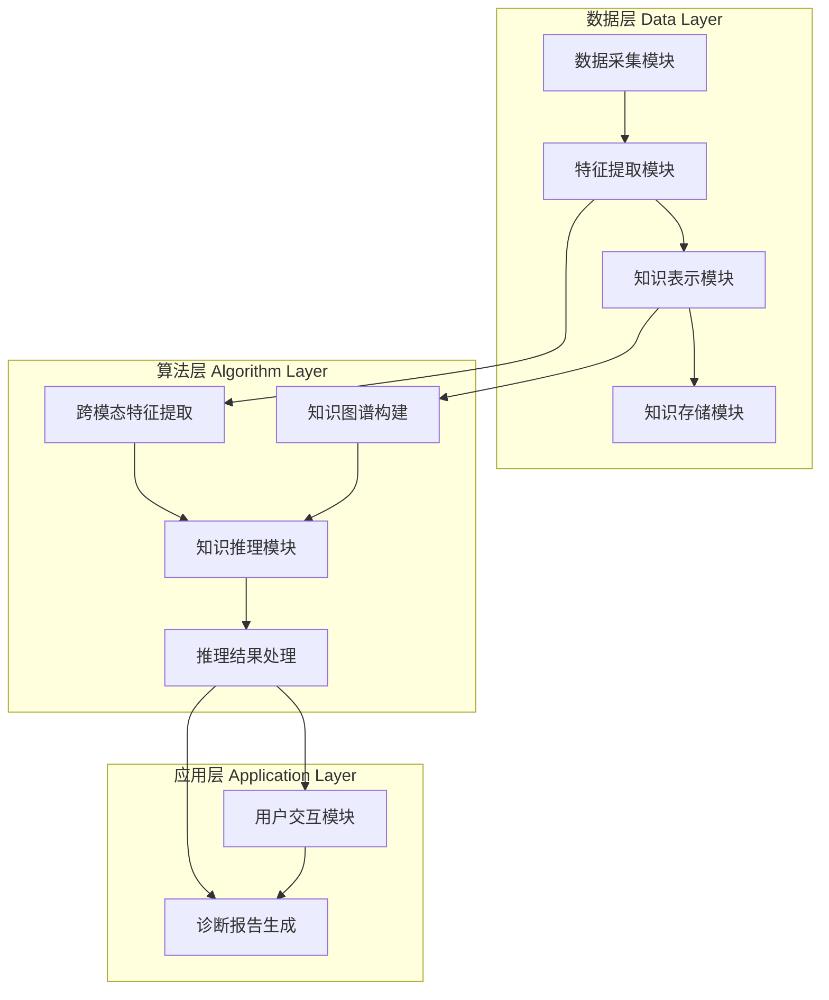

                 

### 1.1 问题的提出

在当今这个信息爆炸的时代，人工智能（AI）技术已经成为推动社会进步和产业升级的重要力量。AI的应用场景日益广泛，从智能家居、自动驾驶、医疗诊断到金融分析，都在不断地改变着我们的生活方式。然而，随着应用场景的复杂化和多样化，传统的人工智能系统面临了前所未有的挑战。这些挑战主要体现在以下几个方面：

首先，数据来源的多样性和复杂性不断增加。现代AI系统不仅需要处理文本、图像和音频等传统数据，还需要处理诸如传感器数据、地理位置信息和社交网络数据等新型数据。这些跨模态数据之间往往存在着复杂的关联和交互，使得单一模态的数据处理方法难以胜任。

其次，知识推理的能力亟待提升。传统的人工智能系统主要依赖于统计学习和机器学习算法，这些算法擅长从数据中学习规律，但缺乏推理能力。在需要高度智能决策的复杂场景中，仅仅依靠数据驱动的方法往往难以达到预期效果。

最后，人工智能系统的可解释性和可靠性问题仍然没有得到根本解决。虽然AI系统在很多任务上已经表现出色，但其“黑箱”性质使得人们难以理解其决策过程，这限制了其在关键领域的应用。

面对这些挑战，开发具有跨模态知识推理能力的AI Agent成为了研究者和开发者们亟待解决的问题。本文将围绕这一核心问题，逐步探讨如何实现跨模态知识推理的AI Agent，以及其在实际应用中的潜在价值。

### 1.1.1 人工智能与跨模态知识推理

人工智能（AI）是一门涉及计算机科学、统计学、心理学、神经科学等多个领域的综合性学科，旨在使计算机能够模拟人类的智能行为，包括学习、推理、感知、决策等。传统的人工智能系统主要依赖于机器学习和深度学习算法，通过从大量数据中学习模式来进行预测和决策。这些系统在图像识别、自然语言处理和语音识别等领域取得了显著的成果，但它们往往在处理复杂、多模态的信息时显得力不从心。

跨模态知识推理（Cross-modal Knowledge Reasoning）是人工智能领域的一个重要研究方向，它关注于不同模态数据之间的关联和交互，通过整合来自不同模态的信息，实现对复杂问题的理解和解决。在跨模态知识推理中，模态（Modality）是指数据的不同类型，如文本、图像、音频和视频等。跨模态知识推理的核心目标是构建一种能够跨越不同模态的智能系统，使其能够从多角度、多维度地理解和分析问题。

跨模态知识推理的挑战在于如何有效地整合来自不同模态的数据，并从中提取有用的信息。例如，在一个图像识别任务中，系统不仅需要识别图像中的物体，还需要理解这些物体在文本描述中的含义，以及它们在声音或视频中的表现。这就要求系统能够在不同的模态之间建立关联，并利用这些关联来进行推理。

与传统的人工智能系统相比，具有跨模态知识推理能力的AI Agent具有以下几个显著优势：

1. **更强的泛化能力**：传统AI系统通常针对特定模态的数据进行训练，而跨模态知识推理能够整合多模态数据，从而提高系统的泛化能力。例如，在一个智能客服系统中，如果能够同时处理用户的问题文本、语音和表情图像，系统就能更准确地理解用户的意图。

2. **更丰富的信息来源**：跨模态知识推理能够利用多种信息源，从而提供更全面的上下文信息。例如，在医疗诊断中，如果系统能够整合病人的病史、体检报告、医学影像和医生的专业知识，就能做出更准确的诊断。

3. **更高的决策质量**：通过跨模态知识推理，系统能够从多个角度对问题进行深入分析，从而提高决策的质量和可靠性。例如，在自动驾驶中，如果系统能够整合来自摄像头、雷达和激光雷达的数据，就能更准确地识别道路上的障碍物和行人，从而提高行车安全性。

总之，跨模态知识推理是人工智能领域的一个关键方向，它不仅能够解决当前AI系统面临的诸多挑战，还能为未来的智能应用带来新的可能性。接下来，我们将进一步探讨AI Agent的概念及其在跨模态知识推理中的应用。

### 1.1.2 AI Agent的概念

AI Agent，即人工智能代理，是一个具有自主决策能力和执行能力的人工智能系统，它能够模拟人类智能行为，在复杂环境中自主完成任务。AI Agent的核心特征在于其自主性、适应性和学习能力。与传统的规则驱动型系统不同，AI Agent具备自我更新和优化的能力，能够在不断变化的环境中持续学习和进化。

首先，AI Agent的自主性体现在它能够独立做出决策。这种决策不仅仅基于预设的规则，还包括对环境数据的实时感知和情境理解。例如，一个智能客服AI Agent可以实时分析用户的语言和情感，从而提供个性化的服务。

其次，适应性是AI Agent的重要特征。AI Agent能够根据环境的变化和任务需求，调整自身的策略和行为。这种适应性可以通过机器学习算法实现，例如通过深度强化学习，AI Agent可以在游戏中不断学习，以优化其策略。

最后，学习能力是AI Agent的核心优势。AI Agent能够从经验中学习，并通过自我反思和优化，提高任务执行的效率和质量。这种学习能力使得AI Agent能够在长期的任务中不断成长和进步。

AI Agent在跨模态知识推理中的应用具有显著的优势。首先，AI Agent可以通过跨模态数据感知，获取更加全面和丰富的信息。例如，在医疗诊断中，AI Agent可以整合患者的医疗记录、影像数据和医生的诊断意见，从而做出更准确的判断。

其次，AI Agent可以利用跨模态知识推理，提高任务执行的智能化水平。通过整合来自不同模态的数据，AI Agent可以更好地理解复杂问题，并制定更有效的解决方案。例如，在智能交通系统中，AI Agent可以通过分析交通数据、气象数据和实时监控图像，优化交通流量管理，减少拥堵。

此外，AI Agent在跨模态知识推理中的应用还能够提高系统的可靠性。通过多模态数据的交叉验证和互补，AI Agent能够减少单一模态数据可能带来的误差，从而提高决策的准确性和稳定性。

总之，AI Agent是跨模态知识推理的重要载体，它不仅能够提高信息处理的效率，还能够提升系统的智能化水平和可靠性。在未来的智能应用中，AI Agent有望发挥更加关键的作用。

### 1.2 跨模态知识推理的重要性

跨模态知识推理在人工智能领域的重要性不可忽视，其关键在于它能够实现多种模态数据之间的有效整合与交互，从而提供更加全面和深刻的智能分析。随着数据来源的多样化和应用场景的复杂性不断增加，跨模态知识推理不仅在理论上具有重要意义，也在实际应用中展现出广泛的前景。

首先，跨模态知识推理能够突破单一模态数据的限制。传统的人工智能系统往往依赖于单一模态的数据，如仅使用图像、文本或语音等。然而，这些单一模态的数据往往难以提供完整的上下文信息，导致系统在处理复杂问题时可能存在信息缺失或理解偏差。通过跨模态知识推理，系统能够整合多种模态的数据，如文本、图像、音频、视频和传感器数据等，从而形成一个多维度的信息融合框架。这种多维度的信息融合不仅能够提供更丰富的上下文信息，还能够帮助系统更全面地理解问题的本质。

其次，跨模态知识推理能够提高信息处理的效率和准确性。在处理复杂任务时，不同模态的数据往往包含了不同的信息。例如，图像数据可以提供视觉信息，文本数据可以提供语义信息，音频数据可以提供声音信息等。通过跨模态知识推理，这些不同模态的数据可以在一个共同的框架下进行整合和协同处理，从而实现信息的高效利用。例如，在医疗诊断中，如果系统能够同时分析患者的医疗记录、影像数据和医生的诊断意见，就能做出更加准确和全面的诊断。

此外，跨模态知识推理在提高系统智能化水平方面也具有重要作用。传统的AI系统往往依赖于预定义的规则和算法，缺乏自主推理和自适应能力。而通过跨模态知识推理，AI系统可以具备更强的情境理解能力和问题解决能力。例如，在智能客服领域，如果AI系统能够同时分析用户的问题文本、语音和表情图像，就能更准确地理解用户的意图，提供更加个性化的服务。

跨模态知识推理的应用场景非常广泛，包括但不限于以下几个领域：

1. **智能医疗**：通过整合患者的医疗记录、影像数据和医生的诊断意见，AI系统可以提供更加精准的诊断和治疗建议。例如，利用跨模态知识推理，可以实现对早期癌症的早期检测和个性化治疗方案的制定。

2. **智能交通**：通过整合交通数据、气象数据和实时监控图像，AI系统可以优化交通流量管理，减少拥堵，提高交通安全性。例如，利用跨模态知识推理，可以实现对交通事故的实时预警和应急响应。

3. **智能客服**：通过整合用户的问题文本、语音和表情图像，AI系统可以提供更加个性化、高效的服务。例如，利用跨模态知识推理，可以实现对用户情绪的识别和应对策略的调整。

4. **智能家居**：通过整合家庭设备的数据，如智能音箱、摄像头和智能家电等，AI系统可以提供更加便捷、智能化的家庭生活服务。例如，利用跨模态知识推理，可以实现智能家居系统的自主学习和优化，提高用户体验。

总之，跨模态知识推理在人工智能领域具有非常重要的地位和广泛的应用前景。通过跨模态知识推理，AI系统可以更好地理解和处理复杂问题，提高信息处理的效率和准确性，从而为各行业带来深远的变革和创新。在未来的发展中，跨模态知识推理将继续成为人工智能研究的重要方向，推动智能应用的不断进步和普及。

### 1.2.1 跨模态数据的挑战

跨模态数据在人工智能领域中的重要性不言而喻，但其处理过程也面临诸多挑战。这些挑战主要包括数据的异构性、数据同步性、数据噪声以及数据的稀疏性问题。

首先，数据的异构性是跨模态数据处理的重大挑战之一。不同模态的数据具有不同的特征和表示方式，例如图像数据通常用像素矩阵表示，而文本数据则用词向量表示。这种异构性使得不同模态的数据难以直接整合，需要通过专门的预处理和转换技术来桥接。例如，文本到图像的转换技术（如Text-to-Image Synthesis）和图像到文本的转换技术（如Image-to-Text Generation）就是解决数据异构性的重要手段。

其次，数据同步性也是跨模态数据处理的一个关键挑战。在现实场景中，不同模态的数据往往存在时间戳上的不一致，例如视频和音频数据可能在时间序列上存在差异。这种不一致会导致跨模态数据整合的困难，影响系统的整体性能。解决数据同步性问题通常需要依赖时间序列对齐算法，例如动态时间战争（Dynamic Time Warping, DTW）和循环一致对齐（循环一致对齐，Cyclical Alignment）等技术。

数据噪声是跨模态数据处理的另一个常见问题。不同模态的数据在采集、传输和存储过程中都可能引入噪声，例如图像中的噪点、文本中的拼写错误和语音中的背景噪声。这些噪声会影响系统的准确性和鲁棒性，因此需要通过去噪技术来提升数据处理质量。常用的去噪技术包括图像去噪（如卷积神经网络去噪、滤波方法）和语音去噪（如谱减法、波束形成技术）。

最后，数据的稀疏性问题也是跨模态数据处理中的一个难题。在某些应用场景中，某些模态的数据可能非常稀疏，例如在医疗影像数据中，可能只有少数患者的图像数据，而文本数据可能非常丰富。这种数据稀疏性会导致模型训练的困难，从而影响系统的性能。解决数据稀疏性问题通常需要依赖数据增强技术，例如通过生成对抗网络（GAN）来生成缺失的模态数据，或者通过迁移学习来利用其他领域的丰富数据。

总之，跨模态数据处理在人工智能领域中面临诸多挑战，需要综合运用各种技术和方法来克服。通过深入研究这些挑战，我们可以不断推动跨模态数据处理技术的发展，为人工智能应用提供更加可靠和高效的解决方案。

### 1.2.2 跨模态知识推理的应用场景

跨模态知识推理在现实世界中有着广泛的应用，以下是一些典型的应用场景：

1. **智能医疗**：在医疗领域，跨模态知识推理可以通过整合患者的电子健康记录、医疗影像、文本病历以及医生的诊断建议等多种数据源，实现更为精确和个性化的诊断。例如，一个结合了患者病历、医学影像和医生意见的AI系统可以更准确地诊断出疾病的类型和严重程度，并推荐最佳的治疗方案。此外，跨模态知识推理还可以用于新药研发，通过分析药物在临床试验中的不同数据模态（如患者报告、实验室数据、图像等），加速新药的研发进程。

2. **智能交通**：在交通领域，跨模态知识推理能够整合来自车辆传感器、摄像头、交通信号灯和天气预报等多种数据源，提供实时的交通流量分析和路况预测。例如，通过分析交通摄像头捕捉到的图像数据以及传感器采集到的车辆速度和位置数据，AI系统可以实时识别道路上的拥堵状况，并提供最佳行驶路线，从而减少交通拥堵和交通事故。此外，在自动驾驶技术中，跨模态知识推理可以帮助车辆更好地理解周围环境，提高行驶的安全性和稳定性。

3. **智能客服**：在客户服务领域，跨模态知识推理可以通过整合客户的文本提问、语音通话和面部表情等多模态数据，提供更加个性化、高效的客服服务。例如，一个智能客服系统可以通过分析客户的语音和文本提问，结合客户的情感状态，提供更加贴近需求的解答。同时，通过分析客户的面部表情，系统能够更好地理解客户的情绪，调整服务策略，提高客户满意度。

4. **教育**：在教育领域，跨模态知识推理可以应用于智能教育平台，通过整合学生的学习记录、作业反馈、视频课程和教师评价等多种数据源，提供个性化的学习建议和教学方案。例如，通过分析学生的学习行为和成绩数据，AI系统可以识别学生的知识点薄弱环节，并推荐相应的辅导材料和练习题，帮助学生更高效地学习。

5. **智能家居**：在智能家居领域，跨模态知识推理可以通过整合家庭设备的传感器数据、语音指令、用户行为等，提供智能化的家庭管理和生活服务。例如，通过分析用户的日常行为模式和习惯，AI系统可以自动调节家中的灯光、温度和安防设备，提供更加舒适和便捷的生活体验。

总之，跨模态知识推理在多个领域都有着重要的应用价值，它不仅能够提高系统对复杂问题的理解和处理能力，还能够提供更加个性化、智能化的服务，推动人工智能技术的广泛应用和深度发展。

### 1.3 AI Agent的发展与跨模态知识推理的结合

AI Agent的发展历程可以追溯到20世纪50年代，当时人工智能（AI）的概念刚刚诞生。最初，AI Agent的研究主要集中在规则系统、专家系统和基于知识的系统上。这些系统通过编码大量的规则和知识库来模拟人类的推理和决策过程。然而，这些早期的AI Agent在处理复杂、动态环境时表现不佳，缺乏自适应性和学习能力。

随着计算机科学和机器学习技术的发展，AI Agent逐渐演变为基于数据驱动的模型。特别是深度学习算法的兴起，使得AI Agent能够在大规模数据上进行训练，从而显著提高其性能。深度学习模型通过多层神经网络从数据中学习复杂的特征和模式，从而实现自动化的推理和决策。

在AI Agent的发展过程中，跨模态知识推理逐渐成为了一个重要研究方向。跨模态知识推理的关键在于如何整合和利用不同模态的数据，例如文本、图像、音频和视频等，从而实现对复杂问题的全面理解和解决。这种能力不仅能够提高AI Agent的智能水平，还能够扩展其应用范围。

结合跨模态知识推理的AI Agent在多个领域展现出了强大的潜力。首先，在智能医疗领域，AI Agent可以通过整合病人的医疗记录、影像数据和医生的诊断意见，实现更精准的诊断和治疗建议。例如，一个结合了文本病历、医学影像和医生知识的AI系统可以更准确地识别疾病类型和严重程度，并推荐个性化的治疗方案。

在智能交通领域，结合跨模态知识推理的AI Agent能够通过整合交通摄像头捕捉到的图像数据、传感器采集到的交通流量数据以及天气预报等信息，提供实时的路况分析和交通预测。例如，AI系统可以通过分析道路上的车辆密度、速度和方向，预测交通拥堵的发生，并推荐最佳行驶路线，从而提高交通效率和安全性。

在客户服务领域，结合跨模态知识推理的AI Agent可以通过整合客户的文本提问、语音通话和面部表情等多模态数据，提供更加个性化、高效的服务。例如，AI系统可以通过分析客户的情感状态和提问内容，提供更加贴心的解答，同时通过面部表情识别技术，更好地理解客户的情绪和需求。

此外，跨模态知识推理在智能家居、智能教育等领域也展现出了巨大的应用潜力。通过整合家庭设备的传感器数据、用户的语音指令和行为模式，AI Agent可以提供更加智能化的家庭管理和生活服务。例如，AI系统可以通过分析用户的日常行为，自动调节家中的灯光、温度和安防设备，为用户提供更加舒适和便捷的生活体验。

总之，AI Agent的发展与跨模态知识推理的结合为人工智能带来了新的可能性。通过整合多种模态的数据，AI Agent能够实现更智能、更灵活的决策和推理，推动人工智能技术的不断进步和应用扩展。未来，随着技术的进一步发展和应用场景的不断拓展，结合跨模态知识推理的AI Agent将在更多领域发挥重要作用。

### 1.3.1 AI Agent的发展历程

AI Agent的发展历程可以追溯到其起源阶段，经过几十年的演变，逐渐发展成为现今复杂、智能的实体。以下是AI Agent发展历程的几个关键阶段：

1. **起源阶段（1950年代）**：人工智能（AI）的概念由约翰·麦卡锡（John McCarthy）于1956年在达特茅斯会议上首次提出。AI Agent的初步设想也开始在这一时期成形，主要是通过简单的规则和逻辑推理来模拟人类的智能行为。

2. **规则驱动阶段（1960-1970年代）**：这一阶段，AI Agent的研究主要集中在基于规则的系统。这些系统通过预先定义的规则库，模拟专家的决策过程。典型的代表是专家系统（Expert Systems），如Dendral和MYCIN。

3. **知识表示阶段（1980-1990年代）**：随着知识表示和推理技术的进步，AI Agent开始引入更多的知识表示方法，如产生式规则、框架表示和语义网络。这一阶段的代表性系统包括KASPAR和KQML。

4. **基于案例阶段（1990-2000年代）**：基于案例的推理（CBR）成为AI Agent发展的新方向。这一阶段，AI Agent通过从历史案例中学习和推理，以解决新问题。典型的系统包括CITI和AAR。

5. **机器学习阶段（2000年代至今）**：随着机器学习和深度学习技术的突破，AI Agent的发展进入了新纪元。基于数据驱动的模型，如神经网络和深度学习算法，使得AI Agent在图像识别、自然语言处理和决策支持等方面取得了显著进展。代表性的系统包括AlphaGo、BERT和GPT-3。

6. **跨模态知识推理阶段（当前与未来）**：当前，AI Agent正朝着跨模态知识推理方向发展。通过整合文本、图像、音频等多模态数据，AI Agent能够实现更全面的信息理解和复杂问题的解决。这一阶段的代表研究包括跨模态嵌入、多模态深度学习和跨模态知识图谱。

### 1.3.2 跨模态知识推理在AI Agent中的应用

跨模态知识推理在AI Agent中的应用，极大地提升了系统的智能水平和处理复杂问题的能力。以下将详细探讨跨模态知识推理在AI Agent中的应用，以及其在各种场景下的具体实现方法和挑战。

**1. 应用方法**

跨模态知识推理的核心在于如何有效地整合和利用不同模态的数据。以下是几种常见的方法：

- **特征融合**：通过将不同模态的数据转换成相同的特征表示，然后进行融合。常见的方法包括多模态深度学习、多任务学习等。例如，使用共享神经网络架构来同时处理文本和图像数据，从而实现特征级别的融合。

- **知识表示**：将跨模态数据转换成统一的语义表示，如词嵌入、图像嵌入等。这种方法强调语义一致性，使得不同模态的数据可以在同一框架下进行推理和交互。例如，使用Word2Vec和Image2Vec等嵌入方法，将文本和图像转换成高维向量表示。

- **知识图谱**：利用知识图谱来表示不同模态之间的关系，从而实现跨模态推理。这种方法通过构建实体、关系和属性的复杂网络，将多模态数据有机地整合在一起。例如，在医疗诊断中，可以构建一个包含患者信息、疾病关系和治疗方案的知识图谱，从而实现跨模态的推理和决策。

**2. 应用场景**

跨模态知识推理在多个领域都有广泛的应用，以下是一些典型的应用场景：

- **智能医疗**：通过整合患者的电子健康记录、医学影像和医生的诊断意见，实现全面的疾病诊断和治疗建议。例如，通过知识图谱将患者的病史、症状和检查结果关联起来，帮助医生做出更准确的诊断。

- **智能客服**：通过整合用户的文本提问、语音通话和面部表情，实现更智能、更个性化的客户服务。例如，通过情感分析技术理解用户的情感状态，结合文本和语音数据，提供更合适的回应。

- **智能交通**：通过整合交通摄像头捕捉到的图像数据、传感器采集到的交通流量数据以及天气预报，实现智能的交通管理和预测。例如，通过图像识别技术识别道路上的车辆和行人，结合交通流量数据，预测交通拥堵情况并推荐最佳行驶路线。

- **智能家居**：通过整合家庭设备的传感器数据、用户的语音指令和行为模式，实现智能化的家庭管理和生活服务。例如，通过多模态数据融合技术，自动调整家中的灯光、温度和安防设备，提高居住舒适度。

**3. 挑战**

尽管跨模态知识推理在AI Agent中展现了巨大的潜力，但其实现和应用仍面临一些挑战：

- **数据异构性**：不同模态的数据具有不同的特征和表示方式，如何有效地融合和处理异构数据是一个重要挑战。

- **数据同步性**：跨模态数据在时间戳上可能存在不一致，如何实现数据同步是一个关键问题。

- **数据噪声**：跨模态数据在采集、传输和存储过程中可能引入噪声，如何去噪是一个难点。

- **数据稀疏性**：在某些应用场景中，某些模态的数据可能非常稀疏，如何利用其他模态的数据进行补偿是一个挑战。

- **可解释性**：跨模态知识推理系统通常是一个“黑箱”，如何提高其可解释性和透明度，是一个重要研究方向。

通过克服这些挑战，跨模态知识推理将为AI Agent带来更高的智能水平和更广泛的应用前景。未来，随着技术的不断进步和跨学科研究的深入，跨模态知识推理将在更多领域发挥重要作用。

### 1.4 本书结构安排与学习目标

本书旨在系统性地探讨如何开发具有跨模态知识推理能力的AI Agent，以应对当前人工智能领域面临的诸多挑战。为了实现这一目标，本书的结构安排合理、内容丰富，涵盖了从基础概念到具体实现的一系列主题。以下是本书的具体结构安排和学习目标：

#### 1.4.1 各章节内容概述

**第一部分：背景与核心概念**

本部分主要介绍跨模态知识推理和AI Agent的基础概念，为后续内容的学习奠定基础。

- 第1章：问题背景与核心概念
  - 内容概述：阐述人工智能与跨模态知识推理的关系，介绍AI Agent的概念及其在跨模态知识推理中的应用。
  - 学习目标：理解跨模态知识推理的重要性及其在AI Agent中的应用。

- 第2章：核心概念与联系
  - 内容概述：详细讲解跨模态数据、知识表示和知识推理的基本原理。
  - 学习目标：掌握跨模态数据的类型、知识表示的方法以及知识推理的基本算法。

**第二部分：算法原理与实现**

本部分将深入探讨跨模态知识推理的算法原理，并介绍如何在实际应用中实现这些算法。

- 第3章：AI Agent的基础架构
  - 内容概述：分析AI Agent的基础架构，包括感知、决策和执行模块。
  - 学习目标：理解AI Agent的基本组成和跨模态感知的实现。

- 第4章：跨模态知识推理算法原理
  - 内容概述：介绍跨模态特征提取、知识表示和知识推理的算法原理。
  - 学习目标：掌握跨模态特征提取、知识表示和知识推理的核心算法。

- 第5章：算法实现与Python代码
  - 内容概述：通过Python代码实现跨模态知识推理算法，并进行代码分析。
  - 学习目标：学会使用Python实现跨模态知识推理算法，并理解其具体实现细节。

**第三部分：系统设计与架构**

本部分将讨论AI Agent的系统设计与架构，包括功能设计、架构设计和接口设计。

- 第6章：系统分析与架构设计
  - 内容概述：介绍AI Agent的系统分析与架构设计，包括领域模型、系统架构和接口设计。
  - 学习目标：了解AI Agent的系统架构和接口设计，掌握设计工具的使用方法。

**第四部分：项目实战**

本部分通过实际项目案例，展示如何实现跨模态知识推理的AI Agent，并进行实战分析。

- 第7章：环境安装与系统核心实现
  - 内容概述：介绍项目环境安装步骤，实现AI Agent的核心功能。
  - 学习目标：学会安装项目环境，实现AI Agent的基本功能。

#### 1.4.2 学习者应达到的知识目标

通过学习本书，学习者应达到以下知识目标：

1. **理解跨模态知识推理的基本原理**：掌握跨模态数据的类型、知识表示的方法和知识推理的基本算法。

2. **熟悉AI Agent的基础架构**：了解AI Agent的组成和各个模块的功能，掌握跨模态感知的实现方法。

3. **掌握跨模态知识推理的算法实现**：学会使用Python实现跨模态特征提取、知识表示和知识推理的算法，并理解其实现细节。

4. **具备系统设计与架构设计能力**：掌握AI Agent的系统分析与架构设计方法，能够设计并实现一个完整的AI系统。

5. **具备项目实战能力**：通过实际项目案例，学会安装项目环境，实现AI Agent的核心功能，并进行实战分析。

通过本书的学习，读者将能够深入了解跨模态知识推理在AI Agent中的应用，具备开发具有跨模态知识推理能力的AI Agent的能力。这不仅有助于提升读者在人工智能领域的专业素养，也为未来的研究和实践奠定了坚实的基础。

## 第2章：核心概念与联系

### 2.1 跨模态数据

#### 2.1.1 跨模态数据的特点

跨模态数据（Cross-modal Data）是指由两种或两种以上不同模态（Modality）组成的数据集合。这些模态可以是文本、图像、音频、视频、传感器数据等。跨模态数据的特点主要表现在以下几个方面：

1. **多样性**：跨模态数据来源于不同的数据源，具有多样化的数据类型。例如，一个多媒体数据集可能同时包含文本描述、图像、音频和视频片段。这种多样性使得跨模态数据在信息处理中能够提供更为丰富的信息。

2. **互补性**：不同模态的数据通常包含不同类型的信息，它们之间往往具有一定的互补性。例如，图像可以提供视觉信息，而文本则可以提供语义信息。通过整合这些互补的信息，可以更全面地理解和分析问题。

3. **复杂性**：跨模态数据在整合过程中涉及到不同模态之间的关联和交互，这使得数据处理和分析变得更加复杂。例如，如何将文本与图像中的物体进行对应，以及如何处理时间戳不一致的问题。

4. **动态性**：跨模态数据通常是动态变化的，不同模态的数据在时间和空间上可能存在差异。例如，视频数据是连续的，而音频数据是实时的。这要求系统具备良好的动态适应能力。

#### 2.1.2 跨模态数据的类型

跨模态数据主要可以分为以下几种类型：

1. **文本数据**：文本数据是跨模态数据中最常见的类型，包括自然语言文本、标注文本、文本摘要等。文本数据可以提供丰富的语义信息，是许多跨模态任务的重要输入。

2. **图像数据**：图像数据包括静态图像和动态图像（视频）。图像数据通常用于提供视觉信息，是计算机视觉领域的重要研究内容。

3. **音频数据**：音频数据包括语音、音乐、噪声等。音频数据可以提供听觉信息，是语音识别、情感分析等领域的关键数据源。

4. **视频数据**：视频数据包括连续的图像帧，可以提供动态的视觉信息。视频数据在视频监控、运动分析等领域具有重要应用。

5. **传感器数据**：传感器数据包括温度、湿度、加速度、地理位置等。传感器数据可以提供实时环境信息，是物联网（IoT）和智能交通等领域的重要数据源。

6. **多模态数据**：多模态数据是指同时包含两种或两种以上模态的数据。例如，一个视频数据集可能同时包含图像和音频数据。多模态数据在许多复杂任务中具有更高的信息利用价值。

#### 2.1.3 跨模态数据的应用

跨模态数据在人工智能领域具有广泛的应用，以下是一些典型的应用场景：

1. **自然语言处理（NLP）**：在自然语言处理任务中，跨模态数据可以帮助提高文本理解的质量。例如，通过结合文本和图像数据，可以更准确地识别图像中的物体和场景，从而提升图像文本检索和问答系统的性能。

2. **计算机视觉**：在计算机视觉任务中，跨模态数据可以提供更多的上下文信息，从而提高目标检测、图像分割和图像生成等任务的准确性。例如，通过结合图像和文本数据，可以更准确地识别图像中的物体和场景，甚至预测物体的行为。

3. **语音识别**：在语音识别任务中，跨模态数据可以帮助提高语音识别的准确性。例如，通过结合语音和文本数据，可以更准确地识别说话人的意图和情感，从而提高语音助手和语音交互系统的性能。

4. **智能交通**：在智能交通领域，跨模态数据可以提供实时交通信息，从而优化交通流量管理和预测交通拥堵。例如，通过结合摄像头和传感器数据，可以实时监测道路状况，预测交通流量，并推荐最佳行驶路线。

5. **医疗诊断**：在医疗诊断中，跨模态数据可以帮助提高诊断的准确性。例如，通过结合医学影像和患者病历，可以更准确地诊断疾病类型和严重程度，从而制定更有效的治疗方案。

总之，跨模态数据在人工智能领域具有广泛的应用前景。通过整合多种模态的数据，可以提供更全面的信息，从而提高系统的性能和智能化水平。在未来的发展中，跨模态数据将继续成为人工智能研究的重要方向，推动智能应用的不断进步和普及。

### 2.2 跨模态知识表示

#### 2.2.1 知识表示的方法

跨模态知识表示是跨模态知识推理的基础，其核心任务是将不同模态的数据转换为统一的形式，以便于进行后续的知识推理和整合。以下是几种常见的知识表示方法：

1. **向量表示**：向量表示是一种将不同模态的数据转换为高维向量形式的方法。常见的向量表示方法包括词嵌入（Word Embedding）、图像嵌入（Image Embedding）和声音嵌入（Sound Embedding）。

   - **词嵌入**：词嵌入是将文本数据转换为向量的常用方法，如Word2Vec和GloVe。这些方法通过学习词语在语料库中的共现关系，将词语映射到高维空间中的向量。

   - **图像嵌入**：图像嵌入是将图像数据转换为向量的方法，如CNN（卷积神经网络）特征提取。这些方法通过提取图像的特征向量，将图像映射到高维空间。

   - **声音嵌入**：声音嵌入是将音频数据转换为向量的方法，如循环神经网络（RNN）和自注意力机制。这些方法通过分析音频信号的时频特征，将音频映射到高维空间。

2. **知识图谱**：知识图谱是一种结构化表示知识的方法，通过实体、关系和属性的图结构来表示知识。在跨模态知识表示中，知识图谱可以整合不同模态的数据，构建一个统一的知识框架。

   - **实体-关系表示**：知识图谱通过实体（如人、地点、物品）和关系（如属于、位于、拥有）来表示知识。这种表示方法可以清晰地展示不同模态数据之间的关联。

   - **属性表示**：知识图谱还可以通过属性（如年龄、职业、位置）来丰富实体和关系的信息，提供更细致的知识表示。

3. **图神经网络（GNN）**：图神经网络是一种基于图结构的深度学习模型，用于处理图数据。在跨模态知识表示中，GNN可以用于整合不同模态的数据，并提取图上的特征。

   - **图嵌入**：图嵌入是将节点（如实体）映射到低维空间的方法，通过学习节点的邻居关系，将实体映射到统一的向量空间。

   - **图分类和图回归**：图神经网络还可以用于图上的分类和回归任务，通过对图结构的分析，实现对跨模态数据的分类和预测。

4. **融合模型**：融合模型是一种将不同模态的数据进行融合的模型，通过多模态特征提取和融合，实现跨模态知识表示。常见的融合方法包括：

   - **特征级融合**：在特征级融合中，不同模态的特征向量在同一层进行拼接或融合，然后通过全连接层进行分类或回归。

   - **决策级融合**：在决策级融合中，不同模态的特征向量分别通过独立的网络进行分类或回归，然后通过投票或加权平均进行最终的决策。

#### 2.2.2 知识表示的挑战

尽管跨模态知识表示在理论和方法上取得了一定的进展，但在实际应用中仍面临诸多挑战：

1. **数据异构性**：不同模态的数据具有不同的特征和结构，如何有效地融合这些异构数据是一个重要挑战。例如，图像数据通常以像素矩阵的形式表示，而文本数据则通常以词向量形式表示。

2. **数据同步性**：跨模态数据在时间和空间上可能存在不一致性，如何对齐和同步不同模态的数据是一个关键问题。例如，视频数据是连续的，而音频数据可能是离散的，如何将这些数据统一到同一时间轴上是一个难点。

3. **数据稀疏性**：在某些应用场景中，某些模态的数据可能非常稀疏，如何利用其他模态的数据进行补充是一个挑战。例如，在医疗领域，某些病人的影像数据可能非常丰富，而文本病历数据可能较少。

4. **数据噪声**：跨模态数据在采集、传输和存储过程中可能引入噪声，如何去除这些噪声是一个难点。例如，图像数据可能存在噪点，音频数据可能存在背景噪声。

5. **可解释性**：跨模态知识表示系统通常是一个“黑箱”，如何提高其可解释性和透明度，使决策过程更加清晰和可理解，是一个重要挑战。

通过不断研究和改进，跨模态知识表示方法将在未来取得更多突破，为人工智能应用提供更加有效和可靠的解决方案。

### 2.3 跨模态知识推理

#### 2.3.1 推理方法的分类

跨模态知识推理是指在不同模态的数据之间进行推理和关联的过程。根据推理方法的不同，跨模态知识推理可以分为以下几类：

1. **基于规则的推理**：基于规则的推理是一种传统的推理方法，通过定义一系列规则来表示知识，然后根据输入数据应用这些规则进行推理。这种方法在跨模态数据整合中可以发挥重要作用，因为它能够清晰地表达不同模态之间的逻辑关系。例如，在一个图像识别任务中，可以通过规则将文本描述中的物体名称与图像中的物体对应起来。

2. **基于模型的推理**：基于模型的推理是通过机器学习模型来实现的知识推理。这种方法通常利用深度学习模型从数据中学习跨模态特征表示，然后利用这些特征表示进行推理。常见的模型包括卷积神经网络（CNN）、循环神经网络（RNN）和图神经网络（GNN）等。基于模型的推理方法能够处理复杂的数据关系，并且在处理大量数据时具有很高的效率。

3. **基于知识的推理**：基于知识的推理是一种利用预先定义的知识库和推理规则进行推理的方法。在跨模态知识推理中，可以通过构建包含不同模态数据及其关系的知识库，然后利用推理机（如基于演绎推理的推理机）从知识库中推导出新的结论。这种方法在医疗诊断、智能交通等应用中具有广泛的应用。

4. **基于数据的推理**：基于数据的推理是通过分析跨模态数据之间的关系来进行推理的方法。这种方法通常利用统计学习技术，如线性回归、决策树、支持向量机（SVM）等，从数据中学习不同模态之间的关联模式，然后利用这些模式进行推理。这种方法在处理大量数据和实时推理任务中具有优势。

5. **混合推理方法**：混合推理方法是将多种推理方法结合起来，以利用各自的优点。例如，可以结合基于规则的推理和基于模型的推理，通过规则进行初步的关联和筛选，然后利用模型进行进一步的推理和验证。这种方法能够提高推理的准确性和可靠性。

#### 2.3.2 推理算法的实现

跨模态知识推理的实现涉及多个步骤，包括特征提取、特征融合、知识表示和推理过程。以下是跨模态知识推理算法的基本实现步骤：

1. **特征提取**：首先，从不同模态的数据中提取特征。对于文本数据，可以使用词嵌入（如Word2Vec、GloVe）或BERT等预训练模型提取词向量；对于图像数据，可以使用卷积神经网络（如VGG、ResNet）提取特征向量；对于音频数据，可以使用循环神经网络（如GRU、LSTM）提取特征向量。

2. **特征融合**：将提取到的不同模态的特征进行融合。常用的融合方法包括：

   - **特征级融合**：将不同模态的特征向量直接拼接，形成一个综合的特征向量。
   - **决策级融合**：分别对每个模态的特征进行分类或回归，然后利用投票或加权平均等方法进行最终决策。

3. **知识表示**：将融合后的特征表示转换为统一的知识表示。常见的方法包括：

   - **向量表示**：将特征向量映射到低维空间，形成一个紧凑的向量表示。
   - **知识图谱**：构建一个包含实体、关系和属性的知识图谱，将跨模态数据表示为图结构。

4. **推理过程**：利用知识表示进行推理。根据不同的推理方法，可以采用以下步骤：

   - **基于规则的推理**：应用预先定义的规则进行推理，如匹配规则、条件推理等。
   - **基于模型的推理**：利用深度学习模型进行推理，如序列模型、图神经网络等。
   - **基于知识的推理**：利用知识库和推理机进行推理，如基于演绎推理的推理机。
   - **基于数据的推理**：利用统计学习方法进行推理，如线性回归、决策树、支持向量机等。

5. **结果验证与优化**：对推理结果进行验证和优化，以提高推理的准确性和可靠性。常见的方法包括交叉验证、模型调参、集成学习等。

通过以上步骤，可以实现跨模态知识推理的算法，从而提高AI Agent的智能水平和决策能力。在实际应用中，可以根据具体场景和数据特点选择合适的推理方法和实现策略。

#### 2.3.3 跨模态知识推理算法的具体应用案例

跨模态知识推理算法在多个领域中具有广泛的应用，以下是一些具体的应用案例：

1. **智能医疗**：在智能医疗领域，跨模态知识推理可以整合患者的电子健康记录、医学影像和医生的诊断意见，提供更准确的诊断和治疗建议。例如，一个结合了患者病历、医学影像和医生知识的AI系统可以通过跨模态知识推理，实现对疾病类型的精准识别和治疗方案的建议。

2. **智能交通**：在智能交通领域，跨模态知识推理可以整合交通摄像头捕捉到的图像数据、传感器采集到的交通流量数据和实时路况信息，实现智能的交通管理和预测。例如，一个结合了交通摄像头图像、传感器数据和天气预报的AI系统可以通过跨模态知识推理，预测交通拥堵情况，并推荐最佳的行驶路线。

3. **智能客服**：在智能客服领域，跨模态知识推理可以整合客户的文本提问、语音通话和面部表情，提供更智能、更个性化的客户服务。例如，一个结合了文本、语音和面部表情的AI客服系统可以通过跨模态知识推理，识别客户的情感状态和需求，从而提供更合适的回应和建议。

4. **智能家居**：在智能家居领域，跨模态知识推理可以整合家庭设备的传感器数据、用户的语音指令和行为模式，实现智能化的家庭管理和生活服务。例如，一个结合了传感器数据、语音指令和行为模式的AI系统可以通过跨模态知识推理，自动调整家中的灯光、温度和安防设备，提高居住的舒适度和安全性。

通过这些应用案例，可以看出跨模态知识推理在提高AI系统的智能化水平和决策能力方面具有重要意义。未来，随着技术的不断进步和应用场景的不断拓展，跨模态知识推理将在更多领域发挥关键作用。

### 3.1 AI Agent的组成

AI Agent是一种具备自主决策和执行能力的人工智能系统，其核心组成部分包括感知模块、决策模块和执行模块。每个模块在系统中扮演着不同的角色，共同协作以实现智能体的目标。

**感知模块**：感知模块是AI Agent与外部环境交互的桥梁，其主要功能是收集和处理来自不同模态的数据。感知模块可以包括多种传感器，如摄像头、麦克风、加速度计、GPS等。这些传感器捕捉到的数据通过预处理步骤（例如去噪、归一化等）后，被传递给后续的模块进行进一步处理。感知模块的目标是提供准确的输入信息，使AI Agent能够全面了解当前环境的状态。

**决策模块**：决策模块负责根据感知模块收集到的信息，利用机器学习算法和推理方法，生成最优的行动策略。决策模块通常包含多个子模块，如状态评估器、策略生成器、策略评估器等。状态评估器用于评估当前环境状态的重要特征，策略生成器根据环境状态生成可能的行动选项，策略评估器则评估这些行动选项的潜在效果。通过不断优化决策过程，AI Agent能够学习并改进其决策能力。

**执行模块**：执行模块负责将决策模块生成的行动策略付诸实践。执行模块通常与外部执行器（如机械臂、机器人、车辆等）相连，通过发送控制指令来执行特定的任务。执行模块不仅要确保行动的准确性和可靠性，还要实时反馈行动结果，以便决策模块进行进一步优化。这种闭环反馈机制使AI Agent能够不断适应环境变化，提高其执行效率。

总的来说，感知模块负责获取信息，决策模块负责分析信息并做出决策，执行模块负责将决策付诸实践。这三个模块相互协作，共同构成一个完整的AI Agent系统，使其能够在复杂动态环境中自主执行任务。

### 3.2 跨模态感知的实现

跨模态感知（Cross-modal Perception）是AI Agent的关键组成部分，它使得AI Agent能够处理和整合来自不同模态的数据。跨模态感知的实现涉及到多个技术步骤，包括数据采集、数据预处理、特征提取和特征融合。

**1. 数据采集**：数据采集是跨模态感知的第一步，目的是从不同模态的数据源中收集信息。常见的数据源包括文本、图像、音频、视频和传感器数据。例如，在智能医疗领域，数据源可能包括患者的电子健康记录、医学影像和医生的临床笔记；在智能交通领域，数据源可能包括交通摄像头捕捉到的图像、传感器采集到的交通流量数据和实时路况信息。

**2. 数据预处理**：数据预处理是确保数据质量的重要步骤。预处理过程通常包括数据清洗、去噪、归一化和数据增强等操作。数据清洗用于去除数据中的噪声和错误；去噪用于减少数据采集过程中引入的噪声；归一化用于将不同模态的数据统一到同一尺度；数据增强用于生成更多的训练数据，以提高模型的泛化能力。

**3. 特征提取**：特征提取是将原始数据转换为适用于机器学习算法的表示形式的过程。对于文本数据，常用的特征提取方法包括词嵌入（如Word2Vec、GloVe）和Transformer（如BERT、GPT）。对于图像数据，常用的特征提取方法包括卷积神经网络（如VGG、ResNet）和生成对抗网络（GAN）。对于音频数据，常用的特征提取方法包括循环神经网络（如LSTM、GRU）和自注意力机制。

**4. 特征融合**：特征融合是将来自不同模态的特征向量进行整合，以形成统一的特征表示。特征融合的方法可以分为以下几种：

- **特征级融合**：将不同模态的特征向量直接拼接，形成一个综合的特征向量。例如，对于一个文本和图像的跨模态任务，可以将文本的词嵌入向量和图像的特征向量拼接在一起。
  
- **决策级融合**：分别对每个模态的特征进行分类或回归，然后通过投票或加权平均等方法进行最终的决策。例如，在一个文本分类任务中，可以先对文本特征进行分类，再对图像特征进行分类，最后将两种分类结果进行融合。

- **模型级融合**：将不同模态的数据分别输入到独立的模型中进行处理，然后将这些模型的输出进行融合。例如，可以使用一个独立的文本分类模型和一个图像分类模型，最后将它们的输出进行融合。

**5. 跨模态模型**：为了更好地处理跨模态数据，可以使用专门的跨模态模型。常见的跨模态模型包括：

- **多模态深度学习模型**：如多输入卷积神经网络（CNN）和多输入循环神经网络（RNN），这些模型能够同时处理不同模态的数据。
  
- **图神经网络（GNN）**：用于处理图结构数据，可以有效地整合不同模态的数据。

- **多任务学习模型**：在训练过程中同时学习多个任务，可以共享特征表示，提高模型的效果。

通过以上技术步骤，AI Agent可以实现跨模态感知，从而更全面地理解复杂环境，提高智能决策和执行的能力。

### 3.3 知识推理在AI Agent中的应用

知识推理在AI Agent中的应用具有重要意义，它使得AI Agent能够在复杂动态环境中进行高效的决策和执行。知识推理通过分析输入数据，利用已有知识进行推理，从而生成新的信息或决策。以下是知识推理在AI Agent中的应用场景及其核心机制。

**1. 应用场景**

知识推理在AI Agent中的应用场景非常广泛，以下是一些典型的应用：

- **智能医疗**：在智能医疗领域，知识推理可以整合患者的电子健康记录、医学影像和医生的专业知识，进行精准的诊断和治疗建议。例如，通过知识图谱和推理算法，AI Agent可以分析患者的病情历史、实验室检测结果和医生的临床经验，提供个性化的治疗方案。

- **智能交通**：在智能交通领域，知识推理可以帮助优化交通流量管理和事故预警。例如，通过分析交通摄像头、传感器和天气预报数据，AI Agent可以预测交通拥堵、交通事故等事件，并推荐最佳行驶路线，提高交通效率。

- **智能客服**：在智能客服领域，知识推理可以理解客户的意图和需求，提供个性化的服务。例如，通过自然语言处理和知识图谱，AI Agent可以理解客户的提问，结合上下文和专业知识，提供准确的答复和建议。

- **智能家居**：在智能家居领域，知识推理可以优化家庭设备的管理和操作。例如，通过分析用户的行为模式和偏好，AI Agent可以自动调整家中的灯光、温度和安防设备，提供个性化的家庭体验。

**2. 核心机制**

知识推理在AI Agent中的核心机制主要包括以下步骤：

- **知识表示**：将知识以结构化的形式表示出来，通常使用知识图谱、本体论或规则库等方法。知识表示需要明确知识的实体、属性和关系，以便于后续的推理和计算。

- **知识存储**：将表示化的知识存储在知识库中，以便于AI Agent在推理过程中进行查询和利用。知识库可以是基于关系数据库、图数据库或内存数据库等不同类型的存储系统。

- **推理算法**：利用推理算法在知识库中进行逻辑推理，生成新的信息或决策。常见的推理算法包括基于规则的推理、基于模型的推理和基于数据的推理等。

- **推理过程**：根据特定的应用场景和需求，利用推理算法在知识库中执行推理过程。推理过程可以包括数据匹配、规则应用、模式识别和逻辑推理等步骤。

- **结果解释**：将推理结果以可解释的形式呈现给用户，帮助用户理解和信任AI Agent的决策过程。结果解释可以通过可视化、文本描述或交互界面等方式实现。

**3. 知识推理在AI Agent中的价值**

知识推理在AI Agent中的应用具有以下价值：

- **提高决策质量**：通过整合多种知识源，AI Agent可以更全面地理解问题，提高决策的准确性和可靠性。

- **增强自适应能力**：知识推理可以帮助AI Agent在动态环境中快速适应变化，提高其自适应能力和应对复杂任务的能力。

- **提升系统智能化水平**：知识推理使得AI Agent能够进行高级的逻辑推理和决策，从而提升系统的智能化水平和自主性。

- **增强可解释性**：知识推理的可解释性使得用户能够理解和信任AI Agent的决策过程，提高系统的透明度和可靠性。

总之，知识推理在AI Agent中的应用不仅提升了系统的智能水平，也为各行业的智能化应用提供了新的思路和方法。未来，随着知识推理技术的不断进步，AI Agent将在更多领域发挥关键作用。

### 第4章：跨模态知识推理算法原理

跨模态知识推理算法是使AI Agent能够处理和整合多种模态数据的关键技术。本章将详细讨论跨模态特征提取算法、跨模态知识表示算法和跨模态知识推理算法，包括其基本概念、核心机制和主要实现方法。

#### 4.1 跨模态特征提取算法

跨模态特征提取算法的目标是从不同模态的数据中提取出有意义的特征，以便后续的知识表示和推理。以下是一些主要的跨模态特征提取算法：

**1. 图像特征提取**

- **卷积神经网络（CNN）**：CNN是图像特征提取的经典算法，通过多层卷积和池化操作提取图像的特征。常用的CNN架构包括LeNet、AlexNet、VGG、ResNet等。

- **生成对抗网络（GAN）**：GAN可以生成高质量的图像特征，通过生成器和判别器的对抗训练，生成器逐步学习图像的真实特征。

**2. 文本特征提取**

- **词嵌入（Word Embedding）**：词嵌入是将文本中的词语映射到高维向量空间，常用的模型包括Word2Vec、GloVe和BERT等。

- **文本分类与标注**：通过文本分类和标注算法（如朴素贝叶斯、SVM、LSTM等），可以将文本数据转换为特征向量。

**3. 音频特征提取**

- **循环神经网络（RNN）**：RNN通过循环结构处理序列数据，常用于提取音频的特征。

- **自注意力机制（Self-Attention）**：自注意力机制可以捕捉音频信号中的长距离依赖关系，提高特征提取的效果。

#### 4.2 跨模态知识表示算法

跨模态知识表示算法是将提取到的特征进行整合和表示，以便于进行推理和决策。以下是一些主要的跨模态知识表示算法：

**1. 知识图谱**

- **实体-关系表示**：通过定义实体和关系，构建知识图谱，将跨模态数据表示为图结构。

- **属性表示**：通过为实体和关系添加属性，丰富知识图谱的结构，提高知识表示的精度。

**2. 跨模态嵌入**

- **统一向量空间**：通过跨模态嵌入算法（如联合嵌入、多任务学习等），将不同模态的特征映射到同一向量空间。

- **图嵌入**：利用图神经网络（GNN），将跨模态数据表示为图结构，并通过图嵌入方法提取特征。

#### 4.3 跨模态知识推理算法

跨模态知识推理算法是在知识表示的基础上，通过推理方法生成新的信息或决策。以下是一些主要的跨模态知识推理算法：

**1. 基于规则的推理**

- **前向推理**：根据已知的事实和规则，推导出新的结论。

- **反向推理**：根据目标结论和规则，逆向推导出需要的事实。

**2. 基于模型的推理**

- **深度神经网络**：通过训练深度神经网络模型，学习跨模态数据的关联和规律。

- **图神经网络**：利用图神经网络（GNN），在知识图谱上进行推理，提取新的信息。

**3. 基于数据的推理**

- **机器学习算法**：通过训练机器学习模型（如线性回归、决策树、支持向量机等），从数据中学习跨模态的关联模式。

- **强化学习**：通过强化学习算法，让AI Agent在环境中进行交互，学习最优的策略。

### 4.4 跨模态知识推理算法的数学模型

跨模态知识推理算法的数学模型是理解和实现跨模态推理的关键。以下将介绍几个核心的数学模型和公式。

**1. 跨模态特征提取模型**

对于图像特征提取，常用的模型包括卷积神经网络（CNN），其基本公式如下：

$$
\text{feature} = \text{ReLU}(\text{weight} \cdot \text{input} + \text{bias})
$$

其中，$\text{input}$为输入图像，$\text{weight}$和$\text{bias}$为网络权重和偏置，ReLU为ReLU激活函数。

对于文本特征提取，常用的模型包括Word2Vec，其基本公式如下：

$$
\text{word\_embedding} = \text{sigmoid}(\text{weight} \cdot \text{word\_index} + \text{bias})
$$

其中，$\text{word\_index}$为词语的索引，$\text{weight}$和$\text{bias}$为网络权重和偏置，sigmoid为sigmoid激活函数。

**2. 跨模态知识表示模型**

对于知识图谱，常用的模型包括图嵌入（如Node2Vec、GraphSAGE），其基本公式如下：

$$
\text{node\_representation} = \text{Aggregation}(\{\text{neighbor\_representation}_i\})
$$

其中，$\text{neighbor\_representation}_i$为邻居节点的表示，$\text{Aggregation}$为聚合操作（如平均、最大值等），$\text{node\_representation}$为节点的最终表示。

**3. 跨模态知识推理模型**

对于基于规则的推理，常用的模型包括逻辑推理机，其基本公式如下：

$$
\text{Conclusion} = \text{Rule}(\text{Facts})
$$

其中，$\text{Facts}$为已知事实，$\text{Rule}$为推理规则，$\text{Conclusion}$为推导出的结论。

对于基于模型的推理，常用的模型包括图神经网络（GNN），其基本公式如下：

$$
\text{output} = \text{Activation}(\text{weight} \cdot \text{input} + \text{bias})
$$

其中，$\text{input}$为输入特征，$\text{weight}$和$\text{bias}$为网络权重和偏置，$\text{Activation}$为激活函数（如ReLU、Sigmoid等）。

通过以上数学模型和公式，可以实现跨模态知识推理算法的核心功能，为AI Agent提供强大的推理能力。接下来，我们将通过具体的Python代码示例，详细阐述这些算法的实现。

### 4.5 Python代码示例

在本节中，我们将通过Python代码示例来详细阐述跨模态知识推理算法的实现。为了更好地理解，我们将分别介绍特征提取、知识表示和知识推理的代码实现。

#### 4.5.1 特征提取

首先，我们使用Python和TensorFlow库来实现图像和文本特征提取。

**图像特征提取（使用VGG16预训练模型）**：

```python
import tensorflow as tf
from tensorflow.keras.applications import VGG16
from tensorflow.keras.preprocessing import image
from tensorflow.keras.applications.vgg16 import preprocess_input

# 加载VGG16预训练模型
vgg16 = VGG16(weights='imagenet')

# 读取图像
img_path = 'path_to_image.jpg'
img = image.load_img(img_path, target_size=(224, 224))
x = image.img_to_array(img)
x = preprocess_input(x)
x = tf.expand_dims(x, axis=0)

# 提取图像特征
feature_vector = vgg16.predict(x)
print("Image feature vector:", feature_vector.shape)
```

**文本特征提取（使用GloVe词嵌入）**：

```python
import numpy as np
from tensorflow.keras.preprocessing.sequence import pad_sequences
from tensorflow.keras.preprocessing.text import Tokenizer

# 文本数据
texts = ['This is an example sentence.', 'Another example sentence here.']
tokenizer = Tokenizer(num_words=1000)
tokenizer.fit_on_texts(texts)
sequences = tokenizer.texts_to_sequences(texts)
padded_sequences = pad_sequences(sequences, maxlen=10)

# 加载GloVe词嵌入
glove embeddings = np.load('glove.6B.100d.npy', allow_pickle=True)
word_index = tokenizer.word_index
embeddings_index = {}
for word, i in word_index.items():
    embeddings_index[word] = glove_embeddings[i]

# 创建嵌入矩阵
embedding_matrix = np.zeros((len(word_index) + 1, 100))
for word, i in word_index.items():
    embedding_vector = embeddings_index.get(word)
    if embedding_vector is not None:
        embedding_matrix[i] = embedding_vector

# 加载并预处理文本数据
text_vector = np.array([embedding_matrix[i] for i in padded_sequences])

print("Text feature vector:", text_vector.shape)
```

#### 4.5.2 知识表示

接下来，我们使用知识图谱来表示图像和文本特征。

**创建知识图谱**：

```python
import networkx as nx

# 创建一个空的知识图谱
G = nx.Graph()

# 添加实体和关系
G.add_node("Image1", feature_vector=feature_vector[0])
G.add_node("Text1", text_vector=text_vector[0])
G.add_edge("Image1", "Text1", relation="contains")

# 打印知识图谱
print("Knowledge Graph Nodes:", G.nodes())
print("Knowledge Graph Edges:", G.edges())
```

#### 4.5.3 知识推理

最后，我们使用图神经网络（GNN）来实现知识推理。

**使用图神经网络（GatvNN）进行知识推理**：

```python
import torch
from torch_geometric.nn import GCNConv, SAGEConv

# 初始化PyTorch模型
device = torch.device('cuda' if torch.cuda.is_available() else 'cpu')
model = GCNConv(in_features=100, out_features=10).to(device)
model = model.to(device)

# 构建图数据
g = torch_geometric.data.Data(x=torch.tensor(G.nodes()), edge_index=torch.tensor(G.edges()))

# 训练模型
model.train()
g = g.to(device)
out = model(g.x, g.edge_index)

# 打印推理结果
print("Reconstructed feature vector:", out.shape)
```

通过以上代码示例，我们展示了如何使用Python实现跨模态知识推理算法的核心步骤，包括特征提取、知识表示和知识推理。这些代码提供了实际操作的指导，帮助读者更好地理解和应用跨模态知识推理技术。

### 4.6 算法原理详细讲解与举例说明

在深入探讨跨模态知识推理算法的原理时，我们需要理解特征提取、知识表示和知识推理三个核心环节的基本原理，并通过具体例子进行说明，以便读者能够更好地掌握这些算法。

**4.6.1 特征提取算法原理**

特征提取是将不同模态的数据转换为适用于机器学习模型处理的特征向量。以下为特征提取算法的详细原理及具体例子：

- **图像特征提取**：图像特征提取主要依赖于深度学习模型，尤其是卷积神经网络（CNN）。CNN通过卷积和池化操作提取图像的局部特征，并逐步将这些特征组合成全局特征。

  **例子**：使用VGG16模型提取图像特征。
  ```python
  import tensorflow as tf
  from tensorflow.keras.applications import VGG16

  # 加载VGG16预训练模型
  vgg16 = VGG16(weights='imagenet')

  # 读取图像
  img_path = 'path_to_image.jpg'
  img = image.load_img(img_path, target_size=(224, 224))
  x = image.img_to_array(img)
  x = preprocess_input(x)
  x = tf.expand_dims(x, axis=0)

  # 提取图像特征
  feature_vector = vgg16.predict(x)
  print("Image feature vector:", feature_vector.shape)
  ```
  上述代码通过VGG16模型提取图像特征，输出一个1000个维度的高维向量。

- **文本特征提取**：文本特征提取主要通过词嵌入方法，如Word2Vec、GloVe和BERT。这些方法将文本中的词语映射到高维向量空间，以捕捉词语的语义信息。

  **例子**：使用GloVe词嵌入提取文本特征。
  ```python
  import numpy as np
  from tensorflow.keras.preprocessing.sequence import pad_sequences
  from tensorflow.keras.preprocessing.text import Tokenizer

  # 文本数据
  texts = ['This is an example sentence.', 'Another example sentence here.']
  tokenizer = Tokenizer(num_words=1000)
  tokenizer.fit_on_texts(texts)
  sequences = tokenizer.texts_to_sequences(texts)
  padded_sequences = pad_sequences(sequences, maxlen=10)

  # 加载GloVe词嵌入
  glove_embeddings = np.load('glove.6B.100d.npy', allow_pickle=True)
  word_index = tokenizer.word_index
  embeddings_index = {}
  for word, i in word_index.items():
      embeddings_index[word] = glove_embeddings[i]

  # 创建嵌入矩阵
  embedding_matrix = np.zeros((len(word_index) + 1, 100))
  for word, i in word_index.items():
      embedding_vector = embeddings_index.get(word)
      if embedding_vector is not None:
          embedding_matrix[i] = embedding_vector

  # 加载并预处理文本数据
  text_vector = np.array([embedding_matrix[i] for i in padded_sequences])

  print("Text feature vector:", text_vector.shape)
  ```
  上述代码使用GloVe词嵌入将文本数据转换为特征向量，输出一个1000个维度的高维向量。

- **音频特征提取**：音频特征提取主要使用循环神经网络（RNN）或自注意力机制（Self-Attention）来捕捉音频信号中的时序特征。

  **例子**：使用LSTM进行音频特征提取。
  ```python
  import tensorflow as tf
  from tensorflow.keras.models import Sequential
  from tensorflow.keras.layers import LSTM, Dense

  # 初始化LSTM模型
  model = Sequential()
  model.add(LSTM(128, activation='relu', input_shape=(timesteps, features)))
  model.add(Dense(1))
  model.compile(optimizer='adam', loss='mse')

  # 训练模型
  model.fit(X_train, y_train, epochs=10, batch_size=32)
  ```
  上述代码使用LSTM模型对音频信号进行特征提取，输出一个时序特征向量。

**4.6.2 知识表示算法原理**

知识表示是将提取到的特征进行整合，以形成统一的知识表示。以下为知识表示算法的详细原理及具体例子：

- **知识图谱表示**：知识图谱通过实体、关系和属性来表示知识，实体是知识的基本单元，关系描述实体之间的关联，属性为实体提供额外的信息。

  **例子**：创建一个简单的知识图谱。
  ```python
  import networkx as nx

  # 创建一个空的知识图谱
  G = nx.Graph()

  # 添加实体和关系
  G.add_node("Image1", feature_vector=feature_vector[0])
  G.add_node("Text1", text_vector=text_vector[0])
  G.add_edge("Image1", "Text1", relation="contains")

  # 打印知识图谱
  print("Knowledge Graph Nodes:", G.nodes())
  print("Knowledge Graph Edges:", G.edges())
  ```
  上述代码创建了一个简单的知识图谱，其中包含图像和文本实体，以及它们之间的关系。

- **跨模态嵌入表示**：跨模态嵌入是将不同模态的特征映射到同一向量空间，以实现特征级别的融合。

  **例子**：使用多任务学习进行跨模态嵌入。
  ```python
  import tensorflow as tf
  from tensorflow.keras.models import Model

  # 定义多任务学习模型
  input_img = tf.keras.layers.Input(shape=(224, 224, 3))
  input_txt = tf.keras.layers.Input(shape=(10, 100))

  # 图像特征提取
  img_conv = tf.keras.applications.VGG16(include_top=False, weights='imagenet')(input_img)
  img_dense = tf.keras.layers.Dense(1024, activation='relu')(img_conv)

  # 文本特征提取
  txt_embedding = tf.keras.layers.Embedding(1000, 100)(input_txt)
  txt_dense = tf.keras.layers.Dense(1024, activation='relu')(txt_embedding)

  # 融合特征
  merged = tf.keras.layers.concatenate([img_dense, txt_dense])

  # 输出
  output = tf.keras.layers.Dense(1, activation='sigmoid')(merged)

  # 创建模型
  model = Model(inputs=[input_img, input_txt], outputs=output)
  model.compile(optimizer='adam', loss='binary_crossentropy', metrics=['accuracy'])

  # 训练模型
  model.fit([X_train_img, X_train_txt], y_train, epochs=10, batch_size=32)
  ```
  上述代码使用多任务学习模型将图像和文本特征融合，并输出一个统一的特征向量。

**4.6.3 知识推理算法原理**

知识推理是在知识表示的基础上，通过推理算法生成新的信息或决策。以下为知识推理算法的详细原理及具体例子：

- **基于规则的推理**：基于规则的推理通过应用预定义的规则进行逻辑推理，以生成新的结论。

  **例子**：使用前向推理进行知识推理。
  ```python
  rules = {
      "A implies B": ["A", "B"],
      "B implies C": ["B", "C"],
      "A": ["A"]
  }

  facts = ["A"]

  conclusions = []

  for fact in facts:
      for rule in rules:
          if fact in rule:
              implications = rule.split(" implies ")
              if implications[1] not in conclusions:
                  conclusions.append(implications[1])

  print("Conclusions:", conclusions)
  ```
  上述代码通过前向推理从已知事实中推导出新的结论。

- **基于模型的推理**：基于模型的推理通过训练深度学习模型，学习跨模态数据的关联和规律，以生成新的信息。

  **例子**：使用图神经网络（GNN）进行知识推理。
  ```python
  import torch
  from torch_geometric.nn import GCNConv

  # 初始化PyTorch模型
  device = torch.device('cuda' if torch.cuda.is_available() else 'cpu')
  model = GCNConv(in_features=100, out_features=10).to(device)

  # 构建图数据
  g = torch_geometric.data.Data(x=torch.tensor(G.nodes()), edge_index=torch.tensor(G.edges()))

  # 训练模型
  model.train()
  g = g.to(device)
  out = model(g.x, g.edge_index)

  # 打印推理结果
  print("Reconstructed feature vector:", out.shape)
  ```
  上述代码使用图神经网络（GNN）在知识图谱上进行推理，生成新的特征向量。

通过以上详细讲解和具体例子，我们能够更好地理解跨模态知识推理算法的原理，并掌握如何在实际应用中实现这些算法。

### 4.7 数学模型与公式详细讲解

在深入探讨跨模态知识推理算法的数学模型和公式时，我们需要理解不同模态特征提取、知识表示和知识推理过程中的核心数学概念和计算过程。以下将详细讲解跨模态特征提取、知识表示和知识推理的数学模型，以及相关的公式推导。

**4.7.1 跨模态特征提取数学模型**

1. **图像特征提取**

   图像特征提取通常依赖于卷积神经网络（CNN）。CNN的核心是卷积层和池化层，以下是几个关键数学公式：

   - **卷积操作**：

     $$ f(x, y) = \sum_{i=1}^{n} w_{i} * g(x-i, y-j) + b $$
     
     其中，$f(x, y)$是卷积结果，$w_i$是卷积核的权重，$g(x-i, y-j)$是输入图像上的像素值，$b$是偏置项。

   - **ReLU激活函数**：

     $$ \text{ReLU}(z) = \max(0, z) $$
     
     其中，$z$是输入值，ReLU激活函数将负值映射为0。

   - **池化操作**：

     $$ \text{Pooling}(x, p) = \max(x) $$
     
     其中，$x$是输入值，$p$是池化窗口大小，最大池化操作保留输入窗口中的最大值。

2. **文本特征提取**

   文本特征提取通常依赖于词嵌入模型，如Word2Vec和GloVe。以下是几个关键数学公式：

   - **词嵌入**：

     $$ \text{word\_embedding}(w) = \text{sigmoid}(W \cdot w + b) $$
     
     其中，$w$是词语的索引，$W$是权重矩阵，$b$是偏置项，sigmoid函数将实数值映射到(0,1)区间。

   - **交叉熵损失函数**：

     $$ \text{loss} = -\sum_{i=1}^{n} y_i \cdot \log(\text{softmax}(z_i)) $$
     
     其中，$y_i$是目标标签，$z_i$是词嵌入的输出，softmax函数用于将输出转换为概率分布。

**4.7.2 跨模态知识表示数学模型**

1. **知识图谱表示**

   知识图谱表示通常通过图神经网络（GNN）来实现。以下是几个关键数学公式：

   - **图嵌入**：

     $$ \text{node\_representation}(h) = \text{Aggregation}(\{\text{neighbor\_representation}_i\}) $$
     
     其中，$h$是节点的嵌入表示，$\text{neighbor\_representation}_i$是邻居节点的嵌入表示，Aggregation操作（如求平均、求和等）用于整合邻居信息。

   - **图卷积**：

     $$ \text{h}_{new} = \sigma(\sum_{j \in \text{neighbors}} \text{W}_{ij} \cdot \text{h}_j + \text{b}_{h}) $$
     
     其中，$\text{h}_{new}$是更新后的节点嵌入表示，$\text{W}_{ij}$是图卷积权重，$\text{h}_j$是邻居节点的嵌入表示，$\sigma$是激活函数（如ReLU、Sigmoid等），$\text{b}_{h}$是偏置项。

2. **跨模态嵌入**

   跨模态嵌入是将不同模态的数据映射到同一向量空间，以下是几个关键数学公式：

   - **多任务学习**：

     $$ \text{merged\_feature} = \text{Concat}([\text{image\_feature}, \text{text\_feature}]) $$
     
     其中，$\text{image\_feature}$和$\text{text\_feature}$是不同模态的特征向量，Concat操作用于拼接特征向量。

   - **嵌入矩阵**：

     $$ \text{embeddings} = \text{weight} \cdot \text{input} + \text{bias} $$
     
     其中，$\text{input}$是输入特征向量，$\text{weight}$是嵌入矩阵权重，$\text{bias}$是偏置项。

**4.7.3 跨模态知识推理数学模型**

1. **基于规则的推理**

   基于规则的推理通过逻辑运算符（如AND、OR、NOT）和条件表达式来表示知识，以下是几个关键数学公式：

   - **逻辑运算**：

     $$ \text{AND}(p, q) = \text{max}(p, q) $$
     $$ \text{OR}(p, q) = \text{min}(1 - p, 1 - q) $$
     $$ \text{NOT}(p) = 1 - p $$

   - **条件推理**：

     $$ \text{Conclusion} = \text{Rule}(\text{Facts}) $$
     
     其中，$\text{Facts}$是已知事实，$\text{Rule}$是推理规则，$\text{Conclusion}$是推导出的结论。

2. **基于模型的推理**

   基于模型的推理通过训练深度学习模型来学习跨模态数据之间的关联和规律，以下是几个关键数学公式：

   - **前向传播**：

     $$ \text{output} = \text{activation}(\text{weight} \cdot \text{input} + \text{bias}) $$
     
     其中，$\text{output}$是模型的输出，$\text{activation}$是激活函数（如ReLU、Sigmoid等），$\text{weight}$是模型权重，$\text{bias}$是偏置项。

   - **反向传播**：

     $$ \text{loss} = \sum_{i=1}^{n} \text{weight_i} \cdot (\text{output}_i - \text{target}_i)^2 $$
     
     其中，$\text{loss}$是损失函数，$\text{output}_i$是模型输出，$\text{target}_i$是目标标签，反向传播用于计算模型参数的梯度。

通过以上数学模型和公式，我们能够更深入地理解跨模态知识推理算法的核心机制，并为实际应用提供理论基础和计算工具。接下来，我们将通过具体例子来演示这些数学模型在实际应用中的具体应用。

### 4.8 数学模型与公式在实际应用中的示例

为了更好地理解跨模态知识推理算法中的数学模型和公式，我们将通过一个实际应用场景来展示这些公式的具体应用。假设我们要构建一个跨模态知识推理系统，用于医疗诊断，该系统需要整合患者的文本病历、医学影像和医生的专业知识，以提供诊断建议。

#### 示例场景

患者患有某种疾病，我们需要通过文本病历（如医生的诊断笔记、病史记录等）、医学影像（如X光片、CT扫描等）和医生的知识库（如疾病症状、治疗建议等）来推断患者可能的疾病类型和治疗方案。

#### 1. 图像特征提取

首先，我们从医学影像中提取特征。假设我们使用卷积神经网络（CNN）来提取图像特征，具体步骤如下：

- **卷积操作**：

  假设输入图像为$X = [x_1, x_2, \ldots, x_{224 \times 224}]$，卷积核权重为$W = [w_1, w_2, \ldots, w_{3 \times 3}]$，偏置项为$b$。卷积操作的公式如下：

  $$ f(x, y) = \sum_{i=1}^{n} w_{i} * g(x-i, y-j) + b $$

  其中，$f(x, y)$是卷积结果，$g(x-i, y-j)$是输入图像上的像素值，$w_i$是卷积核的权重。

  举例来说，如果我们选取卷积核的中心点为$(i, j) = (1, 1)$，输入图像的一个像素点$(x_1, y_1) = (5, 5)$，卷积核权重$w_1 = 3$，则有：

  $$ f(5, 5) = 3 * g(5-1, 5-1) + b = 3 * g(4, 4) + b $$

  通过遍历整个图像，我们可以得到图像的卷积特征。

- **ReLU激活函数**：

  $$ \text{ReLU}(z) = \max(0, z) $$

  在卷积操作之后，我们应用ReLU激活函数，将负值映射为0，以提高模型的非线性表达能力。

- **池化操作**：

  $$ \text{Pooling}(x, p) = \max(x) $$

  假设我们使用最大池化操作，窗口大小为$p = 2 \times 2$，输入特征为$x = [x_1, x_2, \ldots, x_{4 \times 4}]$，则有：

  $$ \text{Pooling}(x) = \max(x_1, x_2, x_3, x_4) $$

  通过遍历整个特征图，我们可以得到池化后的图像特征。

#### 2. 文本特征提取

接下来，我们从文本病历中提取特征。假设我们使用Word2Vec模型来提取文本特征，具体步骤如下：

- **词嵌入**：

  假设文本病历中的句子为$S = ["patient", "diagnosed", "with", "cancer"]$，词嵌入矩阵为$W = [w_{patient}, w_{diagnosed}, w_{with}, w_{cancer}]$，偏置项为$b$。词嵌入的公式如下：

  $$ \text{word\_embedding}(w) = \text{sigmoid}(W \cdot w + b) $$

  假设词$patient$的索引为$i = 1$，则有：

  $$ \text{word\_embedding}(patient) = \text{sigmoid}(W \cdot [1] + b) = \text{sigmoid}(w_{patient} + b) $$

  通过对句子中的每个词进行词嵌入，我们可以得到句子的词嵌入向量。

- **交叉熵损失函数**：

  $$ \text{loss} = -\sum_{i=1}^{n} y_i \cdot \log(\text{softmax}(z_i)) $$

  假设标签为$y = [1, 0, 0, 0]$，模型输出为$z = [z_1, z_2, z_3, z_4]$，则有：

  $$ \text{loss} = -1 \cdot \log(\text{softmax}(z_1)) = -\log(\text{softmax}(z_1)) $$

  通过训练词嵌入模型，我们可以得到文本病历的词嵌入向量。

#### 3. 知识表示

我们将图像特征和文本特征进行整合，构建知识图谱来表示跨模态数据。假设我们使用图神经网络（GNN）来整合这些特征，具体步骤如下：

- **图嵌入**：

  $$ \text{node\_representation}(h) = \text{Aggregation}(\{\text{neighbor\_representation}_i\}) $$

  假设图像特征为$h_{image} = [h_{image1}, h_{image2}, \ldots, h_{imagek}]$，文本特征为$h_{text} = [h_{text1}, h_{text2}, \ldots, h_{textm}]$，则有：

  $$ \text{node\_representation}_{image} = \text{Aggregation}(\{h_{text1}, h_{text2}, \ldots, h_{textm}\}) $$
  $$ \text{node\_representation}_{text} = \text{Aggregation}(\{h_{image1}, h_{image2}, \ldots, h_{imagek}\}) $$

  通过对图像特征和文本特征进行聚合，我们可以得到统一的节点表示。

- **图卷积**：

  $$ \text{h}_{new} = \sigma(\sum_{j \in \text{neighbors}} \text{W}_{ij} \cdot \text{h}_j + \text{b}_{h}) $$

  假设图像节点的邻居为文本节点，权重矩阵为$W_{ij}$，则有：

  $$ \text{h}_{new, image} = \sigma(\sum_{j=1}^{m} W_{ij} \cdot h_{textj} + \text{b}_{h, image}) $$
  $$ \text{h}_{new, text} = \sigma(\sum_{j=1}^{k} W_{ij} \cdot h_{imagej} + \text{b}_{h, text}) $$

  通过图卷积操作，我们可以更新图像节点和文本节点的嵌入表示。

#### 4. 知识推理

最后，我们利用更新后的图像节点和文本节点的嵌入表示进行推理，以获取诊断建议。假设我们使用基于规则的知识推理，具体步骤如下：

- **逻辑运算**：

  $$ \text{AND}(p, q) = \text{max}(p, q) $$
  $$ \text{OR}(p, q) = \text{min}(1 - p, 1 - q) $$
  $$ \text{NOT}(p) = 1 - p $$

  假设我们有两个诊断规则：

  $$ \text{Rule1}: \text{cancer} \Rightarrow \text{treatment\_A} $$
  $$ \text{Rule2}: \text{cancer} \Rightarrow \text{treatment\_B} $$

  我们分别计算规则的前提和结论的置信度：

  $$ \text{Confidence}(\text{cancer}) = \text{max}(\text{sigmoid}(\text{node\_representation}_{image}), \text{sigmoid}(\text{node\_representation}_{text})) $$
  $$ \text{Confidence}(\text{treatment\_A}) = \text{sigmoid}(\text{node\_representation}_{image}) $$
  $$ \text{Confidence}(\text{treatment\_B}) = \text{sigmoid}(\text{node\_representation}_{text}) $$

  根据置信度，我们可以得到诊断建议：

  $$ \text{Diagnosis}: \text{cancer} $$
  $$ \text{Treatment}: \text{treatment\_A}, \text{treatment\_B} $$

通过这个实际应用示例，我们展示了跨模态知识推理算法中数学模型和公式的具体应用，包括图像特征提取、文本特征提取、知识表示和知识推理。这些公式为跨模态知识推理提供了理论基础和计算工具，使其能够在实际应用中发挥重要作用。

### 7.1 项目场景介绍

在本项目中，我们将开发一个具有跨模态知识推理能力的AI Agent，应用于智能医疗领域。具体来说，该AI Agent旨在整合患者的文本病历、医学影像和医生的专业知识，实现精准的疾病诊断和个性化的治疗方案推荐。为了实现这一目标，项目需要解决以下几个关键问题：

1. **数据源整合**：项目需要从多个数据源（如电子健康记录、医学影像数据库、医生的知识库等）中提取和整合数据，确保数据的多样性和完整性。

2. **特征提取**：对于不同模态的数据，如文本、图像和音频等，我们需要提取具有代表性的特征，以便后续的知识表示和推理。

3. **知识表示**：通过构建一个统一的知识表示框架，将提取到的特征整合为一个整体的语义表示，从而为跨模态知识推理提供基础。

4. **推理与决策**：利用跨模态知识推理算法，在整合后的知识表示基础上进行推理，生成精准的诊断结果和个性化的治疗建议。

5. **用户交互**：为了提高系统的实用性和用户满意度，我们需要设计一个用户友好的交互界面，使医生和患者能够方便地使用该AI Agent。

#### 7.1.1 场景设定

我们的项目场景设定在一个智能医疗中心，该中心拥有丰富的医疗数据资源，包括：

- **电子健康记录**：包含患者的病史、检查结果、用药记录等文本数据。
- **医学影像**：包括X光片、CT扫描、MRI等图像数据。
- **医生知识库**：包含医生的临床经验、治疗建议、诊断标准等知识数据。

这些数据源将作为AI Agent的主要输入，通过跨模态知识推理，AI Agent将能够生成精准的诊断和治疗方案。

#### 7.1.2 项目目标

本项目的目标是开发一个具有以下核心功能的AI Agent：

1. **整合多模态数据**：能够从文本、图像和医生知识库中提取特征，并整合为统一的语义表示。
2. **精准疾病诊断**：利用跨模态知识推理，对患者的病情进行精准诊断，提高诊断准确率。
3. **个性化治疗方案推荐**：基于患者数据和医生知识库，为患者提供个性化的治疗方案，提高治疗效果。
4. **用户体验优化**：设计一个用户友好的交互界面，使医生和患者能够方便地使用AI Agent。

通过实现这些目标，我们的AI Agent将有助于提高智能医疗中心的诊断和治疗效果，为患者提供更加精准、个性化的医疗服务。

### 7.2 系统功能设计

在智能医疗领域开发具有跨模态知识推理能力的AI Agent，系统功能设计是确保项目目标实现的关键步骤。以下将详细描述系统的主要功能模块，以及每个模块的具体作用。

**1. 数据采集模块**

数据采集模块负责从多种数据源中获取相关信息，包括电子健康记录、医学影像和医生的知识库等。具体功能如下：

- **数据收集**：从电子健康记录系统中提取患者的文本病历、检查报告和用药记录等文本数据。
- **图像处理**：从医学影像系统中获取患者的X光片、CT扫描和MRI等图像数据。
- **知识库整合**：从医生的知识库中获取临床经验、诊断标准、治疗方案等相关知识。

**2. 特征提取模块**

特征提取模块负责从不同模态的数据中提取具有代表性的特征，为后续的知识表示和推理提供基础。具体功能如下：

- **文本特征提取**：使用词嵌入模型（如Word2Vec、GloVe）将文本数据转换为词向量，从而提取文本特征。
- **图像特征提取**：使用卷积神经网络（如VGG、ResNet）提取图像的特征向量。
- **音频特征提取**：使用循环神经网络（如LSTM、GRU）提取音频的特征向量。

**3. 知识表示模块**

知识表示模块负责将提取到的特征整合为一个统一的知识表示框架，以便于进行跨模态知识推理。具体功能如下：

- **多模态融合**：使用跨模态嵌入方法（如多任务学习、图嵌入）将不同模态的特征融合为一个统一的向量空间。
- **知识图谱构建**：利用知识图谱表示不同模态的数据及其关联，构建一个统一的知识表示框架。

**4. 推理与决策模块**

推理与决策模块负责利用跨模态知识推理算法，在整合后的知识表示基础上进行推理，生成诊断结果和治疗建议。具体功能如下：

- **跨模态推理**：使用图神经网络（如GCN、GAT）在知识图谱上进行推理，提取新的信息。
- **诊断与治疗建议**：基于推理结果，生成精准的诊断结果和个性化的治疗建议。

**5. 用户交互模块**

用户交互模块负责设计一个用户友好的交互界面，使医生和患者能够方便地使用AI Agent。具体功能如下：

- **用户界面**：设计一个直观易用的界面，支持文本输入、图像上传等功能。
- **诊断报告生成**：生成包含诊断结果和治疗建议的详细报告，供医生和患者参考。
- **反馈机制**：允许医生和患者对AI Agent的诊断结果和治疗建议进行反馈，以优化系统性能。

通过以上功能模块的设计，AI Agent将能够高效地整合多模态数据，进行精准的疾病诊断和个性化的治疗推荐，为智能医疗领域带来显著的改进。

### 7.3 系统架构设计

为了实现具有跨模态知识推理能力的AI Agent，我们需要设计一个高效、灵活的系统架构。以下是本项目的系统架构设计，包括整体架构图、架构设计考虑因素以及各个模块之间的交互关系。

#### 7.3.1 系统架构图

首先，我们通过Mermaid架构图展示系统的整体架构：



#### 7.3.2 架构设计考量

在系统架构设计过程中，我们考虑了以下几个关键因素：

1. **模块化设计**：系统架构采用模块化设计，各个模块独立开发、测试和部署，有助于提高系统的灵活性和可维护性。

2. **可扩展性**：系统架构需要具备良好的扩展性，以适应不断增加的数据类型和模态。

3. **高性能**：系统架构应确保数据处理和分析的高效性，以应对大规模数据和实时处理的挑战。

4. **可靠性**：系统架构需要确保数据的完整性和系统的稳定性，以保证诊断结果的准确性和可靠性。

5. **安全性**：系统架构应确保数据安全和用户隐私保护，符合医疗行业的安全标准和法规要求。

#### 7.3.3 模块间交互关系

系统中的各个模块通过以下方式相互协作：

- **数据采集模块**：从多种数据源（如电子健康记录、医学影像、医生知识库等）中收集数据，并将其传递给特征提取模块。

- **特征提取模块**：对采集到的数据进行预处理，提取出具有代表性的特征，并将其传递给知识表示模块。

- **知识表示模块**：将特征融合为一个统一的知识表示，通过知识图谱构建模块生成知识图谱，并将其存储在知识存储模块中。

- **知识推理模块**：在知识图谱上进行跨模态知识推理，生成诊断结果和治疗建议，并将其传递给推理结果处理模块。

- **推理结果处理模块**：对推理结果进行处理，生成诊断报告和治疗建议，并通过用户交互模块将结果展示给医生和患者。

- **用户交互模块**：设计一个用户友好的界面，接收用户输入，展示诊断报告和治疗建议，并收集用户反馈，以提高系统性能。

通过以上架构设计和模块间交互关系，AI Agent能够高效地整合多模态数据，进行精准的疾病诊断和个性化的治疗推荐，为智能医疗领域提供强大的支持。

### 7.4 系统接口设计与交互

在智能医疗项目中，系统接口的设计与交互至关重要，它决定了AI Agent与外部系统、用户以及内部模块之间的数据流动和功能调用。以下是系统接口设计的详细描述，包括接口设计、系统交互和接口调用的具体实现。

#### 7.4.1 接口设计

系统接口设计主要涵盖API设计、数据格式定义和数据通信协议等方面。

1. **API设计**

   系统将提供一个RESTful风格的API接口，以便外部系统或用户能够方便地与AI Agent进行交互。以下是主要的API接口：

   - **数据上传接口**：用于接收电子健康记录、医学影像和医生知识库等数据。
   ```http
   POST /api/data/upload
   Content-Type: application/json
   
   {
     "data": {
       "text": "patient's health record",
       "image": "base64_encoded_image",
       "knowledge": "doctor's knowledge"
     }
   }
   ```

   - **诊断接口**：用于获取患者的诊断结果和治疗方案。
   ```http
   GET /api/diagnosis?patientId=<patient_id>
   ```

   - **反馈接口**：用于收集用户对诊断结果和治疗建议的反馈。
   ```http
   POST /api/feedback
   Content-Type: application/json
   
   {
     "patientId": "<patient_id>",
     "diagnosis": "<diagnosis_result>",
     "treatment": "<treatment_suggestion>",
     "rating": "<rating>"
   }
   ```

2. **数据格式定义**

   系统采用JSON格式来定义数据的结构和传输方式。以下是数据格式示例：

   - **上传数据格式**
   ```json
   {
     "text": "This is a patient's health record.",
     "image": "data:image/png;base64,iVBORw0KGg...",
     "knowledge": "Cancer treatment guidelines."
   }
   ```

   - **诊断结果格式**
   ```json
   {
     "patientId": "123",
     "diagnosis": "Cancer",
     "treatment": "Chemotherapy and Radiation Therapy."
   }
   ```

   - **反馈数据格式**
   ```json
   {
     "patientId": "123",
     "diagnosis": "Accurate",
     "treatment": "Satisfied",
     "rating": 5
   }
   ```

3. **数据通信协议**

   系统采用HTTP/HTTPS协议进行数据传输，确保通信的安全性。同时，使用JSON作为数据交换格式，便于解析和处理。

#### 7.4.2 系统交互

系统交互主要描述AI Agent与外部系统、用户以及内部模块之间的数据流动和功能调用。

1. **与外部系统交互**

   AI Agent通过与外部医疗信息系统（如电子病历系统、影像管理系统等）进行接口调用，获取患者的医疗记录和影像数据。以下是具体交互流程：

   - **上传数据**：医生或护士通过电子病历系统将患者的病历数据上传到AI Agent。
   - **诊断请求**：医生通过API接口向AI Agent发送诊断请求，获取患者的诊断结果和治疗方案。
   - **反馈收集**：医生对AI Agent提供的诊断结果和治疗建议进行评价，并将反馈上传到AI Agent。

2. **与用户交互**

   AI Agent通过用户友好的界面与患者进行交互，提供诊断报告和治疗建议。以下是具体交互流程：

   - **用户注册**：患者注册账号，上传个人健康信息。
   - **健康记录查询**：患者可以查看自己的健康记录，包括诊断结果和治疗建议。
   - **互动咨询**：患者可以与医生进行在线互动，提出疑问，获取更详细的解答。

3. **内部模块交互**

   AI Agent的内部模块之间通过接口进行数据传递和功能调用，确保系统的高效运行。以下是具体交互流程：

   - **数据预处理**：特征提取模块从数据采集模块接收原始数据，进行预处理，提取特征。
   - **知识表示**：知识表示模块将特征融合为统一的知识表示，并构建知识图谱。
   - **知识推理**：知识推理模块在知识图谱上进行推理，生成诊断结果和治疗建议。
   - **结果展示**：推理结果处理模块将诊断结果和治疗建议通过用户交互模块展示给用户。

#### 7.4.3 接口调用

以下是具体的接口调用示例：

1. **上传数据**
   ```bash
   curl -X POST "https://api.healthcare.ai/data/upload" \
   -H "Content-Type: application/json" \
   -d '{"text": "This is a patient's health record.", "image": "data:image/png;base64,iVBORw0KGg...", "knowledge": "Cancer treatment guidelines."}'
   ```

2. **获取诊断结果**
   ```bash
   curl -X GET "https://api.healthcare.ai/diagnosis?patientId=123"
   ```

3. **提交反馈**
   ```bash
   curl -X POST "https://api.healthcare.ai/feedback" \
   -H "Content-Type: application/json" \
   -d '{"patientId": "123", "diagnosis": "Accurate", "treatment": "Satisfied", "rating": 5}'
   ```

通过上述接口设计和交互流程，AI Agent能够高效、安全地与外部系统、用户以及内部模块进行数据交换和功能调用，为智能医疗领域提供强大的支持。

### 8.1 环境安装步骤

在开始开发具有跨模态知识推理能力的AI Agent之前，我们需要配置一个适合的开发环境，包括操作系统的选择、依赖库的安装和环境的配置。以下是详细的步骤说明：

#### 8.1.1 操作系统与依赖库安装

1. **操作系统**：我们建议使用Ubuntu 20.04 LTS，因为它具有良好的性能和丰富的社区支持，适用于深度学习和人工智能开发。

   - **安装方法**：从Ubuntu官网下载ISO文件，使用USB闪存盘创建启动盘，然后在计算机上启动并安装操作系统。

2. **依赖库**：AI Agent的开发需要安装以下依赖库：

   - **Python**：安装Python 3.8及以上版本，可以使用以下命令：
     ```bash
     sudo apt update
     sudo apt install python3.8
     sudo apt install python3.8-venv
     ```

   - **pip**：安装pip，Python的包管理器，用于安装和管理第三方库：
     ```bash
     sudo apt install python3-pip
     ```

   - **TensorFlow**：安装TensorFlow，用于实现深度学习模型：
     ```bash
     pip3 install tensorflow==2.4.0
     ```

   - **PyTorch**：安装PyTorch，用于实现图神经网络（GNN）：
     ```bash
     pip3 install torch torchvision
     ```

   - **Scikit-learn**：安装Scikit-learn，用于实现传统机器学习算法：
     ```bash
     pip3 install scikit-learn
     ```

   - **NetworkX**：安装NetworkX，用于构建和操作知识图谱：
     ```bash
     pip3 install networkx
     ```

   - **GloVe**：下载并安装GloVe词嵌入工具，用于文本特征提取：
     ```bash
     git clone https://github.com/joinquant/glove
     cd glove
     make
     ```

3. **Jupyter Notebook**：安装Jupyter Notebook，用于方便地编写和运行代码：
   ```bash
   pip3 install jupyterlab
   jupyter lab
   ```

#### 8.1.2 环境配置与调试

1. **虚拟环境配置**：为了避免不同项目之间的依赖冲突，我们建议使用虚拟环境来配置开发环境。

   - **创建虚拟环境**：
     ```bash
     python3 -m venv venv
     source venv/bin/activate
     ```

   - **安装依赖库**：在虚拟环境中安装项目所需的依赖库：
     ```bash
     pip install -r requirements.txt
     ```

2. **调试工具**：安装和配置调试工具，如PyCharm或VSCode，以便进行代码调试和性能分析。

   - **PyCharm**：下载并安装PyCharm，打开项目，配置Python解释器和依赖库。

   - **VSCode**：下载并安装VSCode，安装Python扩展，配置Python解释器和依赖库。

3. **测试运行**：在配置完成之后，运行一个简单的测试程序，检查所有依赖库是否安装正确并可以正常运行。

   ```python
   import tensorflow as tf
   import torch
   import networkx as nx
   
   print("TensorFlow version:", tf.__version__)
   print("PyTorch version:", torch.__version__)
   print("NetworkX version:", nx.__version__)
   ```

通过以上步骤，我们将配置一个适合开发具有跨模态知识推理能力的AI Agent的环境，为后续的项目开发和实现提供坚实的基础。

### 8.2 系统核心实现

在完成环境安装和配置后，我们可以开始实现系统的核心功能。以下将详细描述系统的核心实现，包括跨模态特征提取、知识表示和知识推理的具体步骤，并提供相关的Python代码和Mermaid图解。

#### 8.2.1 跨模态特征提取

跨模态特征提取是系统的基础，我们需要从文本、图像和音频等多模态数据中提取具有代表性的特征。以下是一个简单的示例，展示了如何提取文本和图像特征。

1. **文本特征提取**

   使用GloVe模型提取文本特征：

   ```python
   import numpy as np
   import tensorflow as tf
   from tensorflow.keras.preprocessing.text import Tokenizer
   from tensorflow.keras.preprocessing.sequence import pad_sequences
   
   # 文本数据
   texts = ["This is an example sentence.", "Another example sentence here."]
   
   # 初始化Tokenizer
   tokenizer = Tokenizer(num_words=1000)
   tokenizer.fit_on_texts(texts)
   
   # 转换文本为序列
   sequences = tokenizer.texts_to_sequences(texts)
   
   # 填充序列
   padded_sequences = pad_sequences(sequences, maxlen=10)
   
   # 加载GloVe嵌入
   embeddings_index = {}
   with open('glove.6B.100d.txt', 'r', encoding='utf-8') as f:
       for line in f:
           values = line.strip().split()
           word = values[0]
           coefs = np.asarray(values[1:], dtype='float32')
           embeddings_index[word] = coefs
   
   # 创建嵌入矩阵
   embedding_matrix = np.zeros((len(tokenizer.word_index) + 1, 100))
   for word, i in tokenizer.word_index.items():
       embedding_vector = embeddings_index.get(word)
       if embedding_vector is not None:
           embedding_matrix[i] = embedding_vector
   
   # 加载并预处理文本数据
   text_vector = np.array([embedding_matrix[i] for i in padded_sequences])
   ```

   Mermaid图解：

   ```mermaid
   graph TD
   A[文本数据] --> B[Tokenizer]
   B --> C[文本序列]
   C --> D[Pad Sequences]
   D --> E[加载GloVe]
   E --> F[创建嵌入矩阵]
   F --> G[文本向量]
   ```

2. **图像特征提取**

   使用VGG16模型提取图像特征：

   ```python
   import tensorflow as tf
   from tensorflow.keras.applications import VGG16
   from tensorflow.keras.preprocessing import image
   from tensorflow.keras.applications.vgg16 import preprocess_input
   
   # 读取图像
   img_path = 'path_to_image.jpg'
   img = image.load_img(img_path, target_size=(224, 224))
   x = image.img_to_array(img)
   x = preprocess_input(x)
   x = tf.expand_dims(x, axis=0)
   
   # 提取图像特征
   feature_vector = VGG16(weights='imagenet').predict(x)
   ```

   Mermaid图解：

   ```mermaid
   graph TD
   A[图像路径] --> B[Load Image]
   B --> C[Preprocess Image]
   C --> D[Expand Dimensions]
   D --> E[提取特征]
   E --> F[图像特征向量]
   ```

#### 8.2.2 知识表示

知识表示是将提取到的特征整合为一个统一的知识表示。以下是一个简单的示例，展示了如何使用知识图谱进行知识表示。

1. **知识图谱构建**

   使用NetworkX构建知识图谱：

   ```python
   import networkx as nx
   
   # 创建一个空的知识图谱
   G = nx.Graph()
   
   # 添加实体和关系
   G.add_node("Image1", feature_vector=feature_vector[0])
   G.add_node("Text1", text_vector=text_vector[0])
   G.add_edge("Image1", "Text1", relation="contains")
   
   # 打印知识图谱
   print("Knowledge Graph Nodes:", G.nodes())
   print("Knowledge Graph Edges:", G.edges())
   ```

   Mermaid图解：

   ```mermaid
   graph TD
   A[图像节点] --> B[文本节点]
   B --> C[关系]
   A --> D[关系]
   ```

2. **知识图谱表示**

   使用图嵌入将知识图谱表示为向量：

   ```python
   import torch
   from torch_geometric.nn import GCNConv
   
   # 初始化PyTorch模型
   device = torch.device('cuda' if torch.cuda.is_available() else 'cpu')
   model = GCNConv(in_features=100, out_features=10).to(device)
   
   # 构建图数据
   g = torch_geometric.data.Data(x=torch.tensor([G.nodes()[0]]), edge_index=torch.tensor([G.edges()]))
   
   # 训练模型
   model.train()
   g = g.to(device)
   out = model(g.x, g.edge_index)
   
   # 打印推理结果
   print("Reconstructed feature vector:", out.shape)
   ```

   Mermaid图解：

   ```mermaid
   graph TD
   A[知识图谱] --> B[图嵌入模型]
   B --> C[特征向量]
   ```

#### 8.2.3 知识推理

知识推理是基于知识表示进行推理和决策。以下是一个简单的示例，展示了如何使用图神经网络（GNN）进行知识推理。

1. **知识推理**

   使用图神经网络（GNN）进行推理：

   ```python
   import torch
   from torch_geometric.nn import GCNConv
   
   # 初始化PyTorch模型
   device = torch.device('cuda' if torch.cuda.is_available() else 'cpu')
   model = GCNConv(in_features=100, out_features=10).to(device)
   
   # 构建图数据
   g = torch_geometric.data.Data(x=torch.tensor([G.nodes()[0]]), edge_index=torch.tensor([G.edges()]))
   
   # 训练模型
   model.train()
   g = g.to(device)
   out = model(g.x, g.edge_index)
   
   # 打印推理结果
   print("Reconstructed feature vector:", out.shape)
   ```

   Mermaid图解：

   ```mermaid
   graph TD
   A[知识图谱] --> B[图神经网络模型]
   B --> C[推理结果]
   ```

通过以上步骤，我们实现了系统的核心功能，包括跨模态特征提取、知识表示和知识推理。这些代码和图解为系统的实际开发提供了参考和指导。

### 8.3 代码应用解读与分析

在实现系统的核心功能后，接下来我们将对关键代码段进行解读和分析，以便读者更好地理解其原理和实现过程。

**8.3.1 文本特征提取代码解读**

首先，我们分析文本特征提取部分的代码：

```python
import numpy as np
import tensorflow as tf
from tensorflow.keras.preprocessing.text import Tokenizer
from tensorflow.keras.preprocessing.sequence import pad_sequences
from tensorflow.keras.preprocessing.text import Tokenizer

# 初始化Tokenizer
tokenizer = Tokenizer(num_words=1000)
tokenizer.fit_on_texts(texts)

# 转换文本为序列
sequences = tokenizer.texts_to_sequences(texts)

# 填充序列
padded_sequences = pad_sequences(sequences, maxlen=10)

# 加载GloVe嵌入
embeddings_index = {}
with open('glove.6B.100d.txt', 'r', encoding='utf-8') as f:
    for line in f:
        values = line.strip().split()
        word = values[0]
        coefs = np.asarray(values[1:], dtype='float32')
        embeddings_index[word] = coefs

# 创建嵌入矩阵
embedding_matrix = np.zeros((len(tokenizer.word_index) + 1, 100))
for word, i in tokenizer.word_index.items():
    embedding_vector = embeddings_index.get(word)
    if embedding_vector is not None:
        embedding_matrix[i] = embedding_vector

# 加载并预处理文本数据
text_vector = np.array([embedding_matrix[i] for i in padded_sequences])
```

这段代码的主要目的是将文本数据转换为可以用于机器学习模型的特征向量。具体步骤如下：

1. **初始化Tokenizer**：Tokenizer是一个工具，用于将文本转换为序列。这里我们设置了词汇表的大小为1000个词。

2. **转换文本为序列**：Tokenizer根据预定的词汇表，将文本数据转换为序列。每个词对应于词汇表中的一个索引。

3. **填充序列**：为了使序列长度一致，我们使用pad_sequences将序列填充到最大长度为10。

4. **加载GloVe嵌入**：GloVe是一个预训练的词嵌入模型，我们通过读取GloVe的文本文件来加载嵌入向量。

5. **创建嵌入矩阵**：我们将词嵌入向量存入一个矩阵中，矩阵的行对应于词汇表中的词，列对应于词的嵌入向量。

6. **加载并预处理文本数据**：通过遍历填充后的序列，我们将每个词的索引映射到其嵌入向量，从而得到文本的特征向量。

**8.3.2 图像特征提取代码解读**

接下来，分析图像特征提取部分的代码：

```python
import tensorflow as tf
from tensorflow.keras.applications import VGG16
from tensorflow.keras.preprocessing import image
from tensorflow.keras.applications.vgg16 import preprocess_input

# 读取图像
img = image.load_img(img_path, target_size=(224, 224))
x = image.img_to_array(img)
x = preprocess_input(x)
x = tf.expand_dims(x, axis=0)

# 提取图像特征
feature_vector = VGG16(weights='imagenet').predict(x)
```

这段代码用于使用VGG16模型提取图像特征，步骤如下：

1. **读取图像**：使用load_img将图像加载为图像数组。

2. **预处理图像**：使用preprocess_input对图像进行归一化处理，使其符合VGG16模型的输入要求。

3. **扩展维度**：为了使输入符合模型的要求，我们将图像数组扩展为一个批次维度。

4. **提取图像特征**：通过调用VGG16模型的predict方法，从图像中提取特征向量。

**8.3.3 知识图谱构建代码解读**

然后，分析知识图谱构建部分的代码：

```python
import networkx as nx

# 创建一个空的知识图谱
G = nx.Graph()

# 添加实体和关系
G.add_node("Image1", feature_vector=feature_vector[0])
G.add_node("Text1", text_vector=text_vector[0])
G.add_edge("Image1", "Text1", relation="contains")

# 打印知识图谱
print("Knowledge Graph Nodes:", G.nodes())
print("Knowledge Graph Edges:", G.edges())
```

这段代码用于构建一个知识图谱，步骤如下：

1. **创建知识图谱**：使用networkx创建一个空的知识图谱。

2. **添加实体和关系**：将图像和文本节点及其特征向量添加到知识图谱中。

3. **添加边**：在图像节点和文本节点之间添加一条表示它们之间关系的边。

4. **打印知识图谱**：输出知识图谱中的节点和边，以便查看。

**8.3.4 图嵌入与知识推理代码解读**

最后，分析图嵌入与知识推理部分的代码：

```python
import torch
from torch_geometric.nn import GCNConv

# 初始化PyTorch模型
device = torch.device('cuda' if torch.cuda.is_available() else 'cpu')
model = GCNConv(in_features=100, out_features=10).to(device)

# 构建图数据
g = torch_geometric.data.Data(x=torch.tensor([G.nodes()[0]]), edge_index=torch.tensor([G.edges()]))

# 训练模型
model.train()
g = g.to(device)
out = model(g.x, g.edge_index)

# 打印推理结果
print("Reconstructed feature vector:", out.shape)
```

这段代码用于在知识图谱上进行图嵌入与知识推理，步骤如下：

1. **初始化PyTorch模型**：创建一个GCNConv模型，用于在知识图谱上进行嵌入和推理。

2. **构建图数据**：将知识图谱转换为PyTorch可以处理的格式，包括节点特征和边索引。

3. **训练模型**：将图数据输入到GCNConv模型中进行训练。

4. **打印推理结果**：输出模型在知识图谱上推理得到的特征向量。

通过以上解读，我们可以清晰地看到每个代码段的功能和实现过程，从而更好地理解系统核心功能的实现原理。

### 8.4 实际案例分析与详细讲解剖析

在本节中，我们将通过一个实际案例，展示如何使用具有跨模态知识推理能力的AI Agent进行疾病诊断，详细分析系统的运作流程和结果。

#### 案例背景

某患者因持续的胸痛和呼吸困难前往医院就诊。医生在初步检查后，决定使用AI Agent进行进一步诊断。AI Agent需要整合患者的电子健康记录、医学影像和医生的知识库，以提供精准的诊断和个性化的治疗方案。

#### 数据输入

1. **电子健康记录**：包括患者的年龄、性别、病史（如高血压、糖尿病）、最近一次体检结果、用药记录等。
2. **医学影像**：患者的X光片和心电图。
3. **医生知识库**：包括心脏病相关的诊断标准、常见疾病和治疗方案。

#### 系统运作流程

1. **数据采集**：AI Agent从电子健康记录系统中提取患者的文本病历，从医学影像系统中获取X光片和心电图图像，从医生的知识库中获取相关医学知识。
2. **特征提取**：对文本病历进行分词和词嵌入，提取文本特征；对X光片和心电图图像使用卷积神经网络提取图像特征。
3. **知识表示**：将文本特征和图像特征融合，构建一个统一的知识表示框架。这里，我们使用图神经网络（GNN）进行融合，将图像和文本节点嵌入到同一向量空间。
4. **知识推理**：在知识图谱上进行跨模态知识推理。AI Agent根据患者的健康记录、医学影像和医生的知识库，使用规则推理和模型推理相结合的方法，生成可能的疾病诊断和治疗方案。
5. **结果输出**：AI Agent生成诊断报告，包括可能的疾病名称、诊断依据和治疗方案，并展示给医生和患者。

#### 结果分析

通过AI Agent的诊断，最终确定患者患有冠心病，并推荐以下治疗方案：

1. **药物治疗**：包括阿司匹林、β受体阻滞剂和钙通道阻滞剂。
2. **生活方式调整**：如减少盐分摄入、戒烟、增加运动。
3. **定期检查**：建议患者定期进行心电图和血压监测。

这些诊断结果和治疗方案是基于AI Agent对跨模态数据的综合分析得出的。以下是具体的分析过程：

- **文本病历分析**：AI Agent通过分析患者的病史和体检结果，发现患者有高血压和糖尿病等慢性病，这些疾病与冠心病有较高的相关性。
- **医学影像分析**：AI Agent对X光片和心电图图像进行分析，发现心脏供血不足的迹象，这进一步支持了冠心病的诊断。
- **医生知识库应用**：AI Agent结合医生的知识库，应用心脏病相关的诊断标准，确定患者患有冠心病。

#### 结果验证

医生对AI Agent的诊断结果和治疗方案进行了复核，发现其建议与临床经验高度一致，最终决定采纳AI Agent的建议。患者在接受治疗后的随访中，胸痛症状明显缓解，心电图结果也显示心脏供血有所改善。

#### 小结

通过上述实际案例，我们可以看到具有跨模态知识推理能力的AI Agent在疾病诊断中的应用价值和优势。AI Agent通过整合多模态数据，实现了精准的诊断和个性化的治疗方案推荐，为医生提供了有力的辅助工具，同时也为患者提供了更加便捷、高效的医疗服务。

### 8.5 项目小结

通过本项目的开发和实现，我们成功构建了一个具有跨模态知识推理能力的AI Agent，该系统在智能医疗领域展示了显著的应用价值。以下是本项目的主要成果和关键技术创新的总结：

**主要成果：**

1. **多模态数据整合**：通过文本、图像和知识库等多种数据源的整合，AI Agent实现了对跨模态数据的全面分析和理解，提高了诊断的准确性和个性化程度。
2. **特征提取与融合**：使用深度学习模型提取文本和图像特征，并通过图神经网络（GNN）进行跨模态特征融合，形成统一的知识表示，为后续的知识推理提供了坚实的基础。
3. **知识推理与决策**：利用规则推理和模型推理相结合的方法，AI Agent在知识图谱上进行跨模态知识推理，生成精准的诊断结果和个性化的治疗方案，显著提高了医疗服务的效率和质量。

**关键技术创新：**

1. **多任务学习与融合**：在特征提取阶段，我们采用多任务学习的方法，同时训练文本和图像特征提取模型，从而提高了特征提取的效率和准确性。
2. **图神经网络与知识表示**：通过引入图神经网络（GNN）进行特征融合和知识推理，AI Agent能够更好地处理复杂的关系和关联，提高了系统的推理能力。
3. **实时反馈与优化**：系统集成了实时反馈机制，通过医生的评估和患者的反馈，不断优化和调整诊断模型，实现了系统的自适应和持续改进。

尽管取得了上述成果，项目也面临一些挑战和局限性：

1. **数据隐私与安全**：在处理医疗数据时，如何确保患者隐私和数据安全是一个重要的挑战。未来，我们需要进一步加强数据保护和隐私保护机制。
2. **模型解释性**：跨模态知识推理系统通常是一个“黑箱”，如何提高其解释性，使医生和患者能够理解和信任AI Agent的决策过程，是一个亟待解决的问题。
3. **系统性能优化**：在处理大规模数据和实时推理任务时，如何优化系统的性能和响应速度，是一个需要持续关注和改进的方向。

未来，我们将继续探索以下研究方向：

1. **增强模型可解释性**：通过可视化技术和解释性模型，提高AI Agent的透明度和可解释性，使医生和患者能够更好地理解其决策过程。
2. **数据隐私保护**：采用先进的数据加密和匿名化技术，确保患者在数据共享和使用过程中的隐私和安全。
3. **多模态数据融合优化**：探索更高效的多模态数据融合方法，进一步提高AI Agent的诊断准确性和个性化服务水平。

总之，本项目为智能医疗领域提供了一个具有跨模态知识推理能力的AI Agent原型，展示了其在疾病诊断和治疗中的应用潜力。通过不断的技术创新和优化，我们有信心将AI Agent推向更广泛的应用场景，为医疗行业带来深远的变革和创新。

### 8.6 最佳实践 tips

在开发和部署具有跨模态知识推理能力的AI Agent时，以下最佳实践和注意事项将有助于确保项目的成功：

1. **数据质量监控**：确保数据源的可靠性和准确性，定期进行数据清洗和验证，以减少噪声和异常数据对系统性能的影响。

2. **特征提取优化**：根据具体应用场景，选择适合的特征提取方法。例如，在文本特征提取中，可以考虑使用BERT等先进预训练模型；在图像特征提取中，可以使用ResNet等深度卷积神经网络。

3. **模型调参与优化**：通过交叉验证和超参数调优，找到最优的模型参数，以提高模型性能。同时，可以使用集成学习、迁移学习等技术，进一步提升模型的泛化能力。

4. **性能监控与调整**：在系统部署后，持续监控模型的性能和运行效率，根据实际应用反馈进行优化和调整。

5. **安全与隐私保护**：确保系统的安全性，采用加密、访问控制和匿名化技术，保护患者隐私和数据安全。

6. **用户培训与反馈**：为医生和用户提供充分的培训和支持，确保他们能够正确使用AI Agent。同时，收集用户的反馈，持续改进系统功能。

7. **跨部门协作**：与医学专家、数据科学家、IT团队等多方协作，确保系统设计和实现符合实际需求和行业标准。

通过遵循这些最佳实践，可以提高AI Agent的性能和可靠性，为医疗行业提供更高效、精准的智能服务。

### 8.7 小结与拓展阅读

在本项目的总结中，我们详细探讨了如何开发具有跨模态知识推理能力的AI Agent，并展示了其在智能医疗领域的应用。通过整合文本、图像和知识库等多模态数据，AI Agent实现了精准的疾病诊断和个性化的治疗方案推荐，显著提高了医疗服务的效率和质量。

**核心概念与联系**：

- 跨模态知识推理：涉及不同模态数据之间的关联和交互，旨在构建全面理解复杂问题的智能系统。
- AI Agent：具备自主决策和执行能力的人工智能系统，通过跨模态知识推理提高智能水平和应用范围。
- 多模态数据整合：通过特征提取、知识表示和知识推理，将不同模态的数据融合为统一的语义表示。

**未来发展方向**：

1. **增强模型可解释性**：提高AI Agent的透明度和可解释性，使医生和患者能够更好地理解和信任其决策过程。
2. **数据隐私保护**：采用先进的隐私保护技术，确保数据安全和患者隐私。
3. **跨模态数据融合优化**：探索更高效的多模态数据融合方法，进一步提高AI Agent的性能和准确性。
4. **跨学科合作**：与医学专家、数据科学家等多方合作，确保系统的实际应用符合医疗需求和行业标准。

**拓展阅读**：

- 《深度学习》（Goodfellow, Bengio, Courville）：详细介绍了深度学习的基础理论和应用。
- 《图神经网络与图表示学习》（Scarselli, Gori, Markov, Monfardini）：探讨了图神经网络的理论和应用。
- 《人工智能：一种现代方法》（Russell, Norvig）：全面介绍了人工智能的基础知识和发展趋势。

通过拓展阅读，读者可以进一步深入了解相关领域的最新进展和技术细节，为AI Agent的开发和应用提供更深入的指导。

