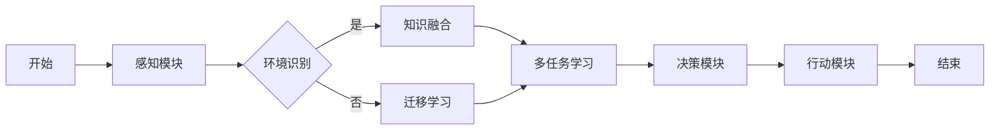
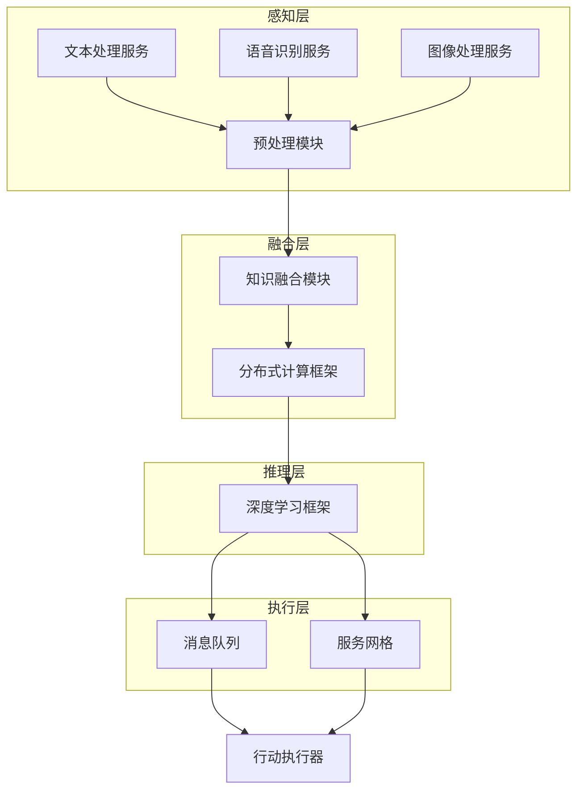
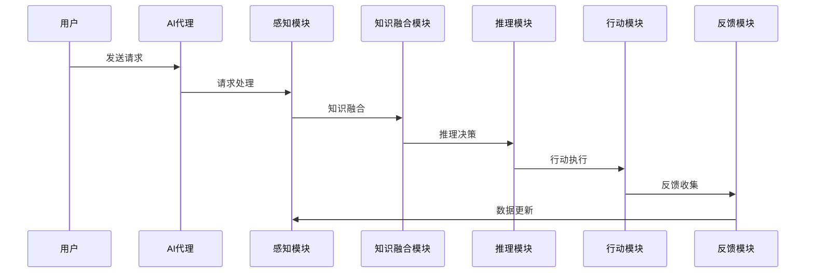

                 


### 背景介绍

随着人工智能技术的迅猛发展，AI Agent作为一种智能体，正逐渐成为人工智能研究与应用的热点。AI Agent，简单来说，就是一个能够感知环境、采取行动并基于行动结果调整策略的智能系统。它不仅仅是一个执行命令的机器人，更是一个具备自主决策能力的智能体。近年来，跨领域推理能力成为AI Agent的重要发展方向。跨领域推理指的是AI Agent能够在不同领域间进行知识迁移和推理，从而解决复杂、多变的问题。

本篇文章将围绕“开发具有跨领域推理能力的AI Agent”这一主题展开。首先，我们将对相关核心概念进行梳理，包括AI Agent的定义、跨领域推理的概念、以及AI Agent的基本组成部分。接着，我们将深入探讨跨领域推理的算法原理，使用Mermaid流程图和Python代码实现来详细阐述。随后，文章将介绍系统分析与架构设计，包括问题场景介绍、系统功能设计、架构设计、接口设计以及交互设计。为了更好地展示这些概念的实际应用，文章还将通过一个具体的项目实战案例进行分析，最后，我们将总结最佳实践和注意事项，并提供拓展阅读资源。

通过对这些内容的详细探讨，我们将帮助读者全面了解如何开发具有跨领域推理能力的AI Agent，并掌握相关的技术原理和实践方法。

### 关键词

- AI Agent
- 跨领域推理
- 智能系统
- 算法原理
- 系统架构
- Python代码实现
- 数学模型

### 摘要

本文深入探讨了开发具有跨领域推理能力的AI Agent的核心内容和主题思想。首先，我们介绍了AI Agent的定义、跨领域推理的概念及其组成部分。接着，通过算法原理讲解、Mermaid流程图和Python代码实现，详细阐述了跨领域推理的实现方法。随后，文章介绍了系统分析与架构设计，包括问题场景介绍、功能设计、架构设计、接口设计和交互设计。通过一个具体的项目实战案例，我们展示了这些概念的实际应用。最后，文章总结了最佳实践和注意事项，并提供了拓展阅读资源，帮助读者全面掌握相关技术。

## 第一部分：背景介绍与概念理解

### 第1章：问题背景与核心概念

在当今科技迅猛发展的时代，人工智能（AI）已经成为各行各业不可或缺的技术支撑。其中，AI Agent作为一种具有自主决策能力的智能系统，受到了广泛关注。AI Agent的定义是指一种能够感知环境、采取行动并基于行动结果调整策略的智能体。它们在执行任务时，不仅能够处理预定义的规则，还能够根据动态变化的环境进行自适应调整，展现出高度的智能。

#### 1.1 问题背景

AI Agent的发展背景可以追溯到20世纪80年代，当时人工智能研究主要聚焦于规则推理和专家系统。然而，这些早期方法在处理复杂、动态的环境时显得力不从心。随着深度学习、自然语言处理等技术的发展，AI Agent逐渐成为人工智能研究的一个重要方向。近年来，跨领域推理能力成为AI Agent的一个重要特征，这不仅能提升AI Agent的智能水平，还能拓展其在各个领域的应用范围。

#### 1.2 问题描述

在传统的AI系统中，大多数模型都针对特定领域进行训练，导致它们在遇到新领域或跨领域问题时表现不佳。例如，一个在医疗领域训练的AI模型很难直接应用到金融领域。这种现象被称为“领域适应性差”。为了解决这个问题，我们需要开发具有跨领域推理能力的AI Agent。这种智能体能够在不同领域间进行知识迁移和推理，从而解决复杂、多变的问题。

#### 1.3 问题解决

解决跨领域推理问题的主要方法包括：

1. **知识融合**：将不同领域的知识进行整合，形成一种统一的知识表示方式。
2. **迁移学习**：利用已训练好的模型在新领域上进行微调，提高其适应性。
3. **多任务学习**：通过同时训练多个任务，使模型在不同任务间共享知识。

#### 1.4 边界与外延

跨领域推理能力的边界主要涉及以下几个方面：

1. **领域适应性**：AI Agent在不同领域中的适应能力，包括数据的适应和算法的适应。
2. **知识表示**：如何高效地表示和存储不同领域的知识。
3. **推理效率**：在跨领域推理过程中，如何提高推理效率，减少计算开销。

#### 1.5 核心概念与联系

为了更好地理解AI Agent与跨领域推理的关系，我们需要了解以下几个核心概念：

1. **AI Agent**：具备感知、决策、行动能力的智能系统。
2. **跨领域推理**：AI Agent在不同领域间进行知识迁移和推理的能力。
3. **知识融合**：不同领域知识的整合方式。
4. **迁移学习**：利用已训练模型在新领域上的应用。
5. **多任务学习**：同时训练多个任务，共享知识。

通过以上内容的介绍，我们为后续章节的深入探讨奠定了基础。在接下来的部分，我们将详细讲解AI Agent的原理与设计，以及如何实现跨领域推理。

### 第2章：AI Agent的原理与设计

#### 2.1 AI Agent的基本原理

AI Agent的基本原理可以从感知、决策和行动三个核心环节来理解。

1. **感知**：AI Agent通过传感器获取环境信息，如图像、声音、文本等。这些信息被输入到感知模块，经过预处理后用于后续的决策。
2. **决策**：感知模块将处理后的信息传递给决策模块。决策模块基于预设的策略或学习到的模型，选择最合适的行动方案。这一过程通常涉及推理、规划等复杂计算。
3. **行动**：决策模块生成的行动方案通过执行模块实现。执行模块将决策转化为具体的操作，如移动、发送消息等。行动的结果会反馈到感知模块，形成一个闭环控制过程。

#### 2.2 跨领域推理能力的实现

跨领域推理能力的实现是AI Agent设计中的一个关键问题。以下是几种常见的实现方法：

1. **知识融合**：通过将不同领域的知识进行整合，形成一种统一的知识表示方式。这种方法通常需要使用本体论（Ontology）和知识图谱（Knowledge Graph）等技术，以确保知识在不同领域间的一致性和可互操作性。
   
2. **迁移学习**：迁移学习是一种利用已训练好的模型在新领域上进行微调的方法。这种方法的核心思想是利用原有领域的知识，减少新领域模型的训练时间，提高其性能。

3. **多任务学习**：多任务学习通过同时训练多个任务，使模型在不同任务间共享知识。这种方法能够有效地提高模型的泛化能力，使其在面对新领域问题时能够快速适应。

#### 2.3 AI Agent的核心属性

AI Agent的核心属性决定了其性能和适用范围。以下是AI Agent的一些核心属性及其特征对比：

| 属性          | 特征                     | 对比             |
|---------------|--------------------------|------------------|
| 感知能力      | 传感器种类与精度         | 高感知能力优于低感知能力 |
| 决策能力      | 策略多样性、反应速度     | 决策速度与策略多样性成正比 |
| 行动能力      | 执行效果、适应环境能力   | 执行效果与适应能力成正比 |
| 领域适应性    | 在不同领域的表现         | 领域适应性越高，适用范围越广 |
| 推理能力      | 推理速度、推理深度      | 推理深度和速度越高，问题解决能力越强 |

通过上述对比，我们可以看出，AI Agent的核心属性不仅决定了其基本功能，还直接影响其在不同领域的应用效果。

#### 2.4 ER实体关系图架构

为了更好地理解AI Agent的内部结构，我们可以使用Mermaid ER实体关系图来展示其主要组成部分。以下是AI Agent的ER图：

```mermaid
erDiagram
    AI-Agent ||--|{ 感知模块 :SensorModule }
    AI-Agent ||--|{ 决策模块 :DecisionModule }
    AI-Agent ||--|{ 执行模块 :ActionModule }
    感知模块 ||--|{ 环境传感器 :EnvironmentalSensor }
    感知模块 ||--|{ 预处理模块 :PreprocessModule }
    决策模块 ||--|{ 策略库 :StrategyLibrary }
    决策模块 ||--|{ 推理引擎 :ReasoningEngine }
    执行模块 ||--|{ 行动执行器 :ActionExecutor }
```

这个ER图展示了AI Agent的主要组成部分及其相互关系。通过这种结构化表示，我们可以更清晰地理解AI Agent的内部工作原理和各模块的功能。

通过以上内容，我们深入了解了AI Agent的基本原理和跨领域推理能力的实现方法。在接下来的章节中，我们将进一步探讨算法原理和实践，以帮助读者更好地理解如何具体实现跨领域推理的AI Agent。

### 第3章：算法原理详细讲解

在了解AI Agent的基本原理和设计之后，我们需要深入探讨实现跨领域推理的算法原理。这一章节将详细讲解算法原理，并使用Mermaid流程图和Python代码实现来进一步阐述。

#### 3.1 算法原理概述

实现跨领域推理的关键在于如何将不同领域的知识进行有效融合和迁移。以下是几种常见的跨领域推理算法原理：

1. **知识融合算法**：
   - **基于本体论的知识融合**：使用本体论来定义不同领域共通的概念和关系，实现知识的统一表示。
   - **基于知识图谱的知识融合**：通过构建知识图谱，将不同领域的知识进行关联和整合。

2. **迁移学习算法**：
   - **基于神经网络的迁移学习**：利用深度神经网络在不同领域间进行迁移，通过迁移学习减少训练时间。
   - **基于模型的迁移学习**：将已训练好的模型在新领域上进行微调，利用原有领域的知识提高新领域的性能。

3. **多任务学习算法**：
   - **共享网络架构**：通过共享网络层，使模型在不同任务间共享知识。
   - **多任务训练**：同时训练多个任务，使模型具备在不同任务间迁移知识的能力。

#### 3.2 数学模型与公式

为了更好地理解跨领域推理算法，我们需要介绍一些关键的数学模型与公式。以下是几种常用的数学模型：

1. **知识融合模型**：
   $$ K_{\text{融合}} = f(K_1, K_2) $$
   - \( K_1 \) 和 \( K_2 \) 分别代表两个领域的知识集合。
   - \( f \) 表示知识融合函数，用于将不同领域的知识进行整合。

2. **迁移学习模型**：
   $$ f_{\text{迁移}}(x) = f_{\text{源}}(x) + \alpha (f_{\text{目标}}(x) - f_{\text{源}}(x)) $$
   - \( f_{\text{源}} \) 和 \( f_{\text{目标}} \) 分别代表源领域和目标领域的模型。
   - \( \alpha \) 表示迁移系数，用于调整源领域和目标领域模型的影响。

3. **多任务学习模型**：
   $$ \hat{y}_i = \sum_{j=1}^{N} w_{ij} f_j(x) $$
   - \( \hat{y}_i \) 表示第 \( i \) 个任务的预测结果。
   - \( w_{ij} \) 表示第 \( i \) 个任务和第 \( j \) 个特征之间的权重。
   - \( f_j(x) \) 表示第 \( j \) 个特征的函数。

#### 3.3 算法流程图

为了更直观地理解跨领域推理算法的流程，我们可以使用Mermaid流程图来展示。以下是跨领域推理算法的基本流程：



在这个流程图中，感知模块获取环境信息，然后通过环境识别判断是否需要进行知识融合、迁移学习或多任务学习。最后，决策模块根据融合后的知识进行决策，并执行相应的行动。

#### 3.4 Python代码实现

为了进一步理解算法的实现，我们使用Python代码来实现一个简单的跨领域推理系统。以下是核心部分的代码实现：

```python
import tensorflow as tf
from tensorflow.keras.models import Model
from tensorflow.keras.layers import Input, Dense, Flatten

# 感知模块
def sensor_module(data):
    # 数据预处理
    processed_data = preprocess_data(data)
    return processed_data

# 决策模块
def decision_module(data):
    # 环境识别
    if is_important(data):
        # 知识融合
        fused_knowledge = fusion_knowledge(data)
    else:
        # 迁移学习
        fused_knowledge = migration_learning(data)
    # 多任务学习
    output = multi_task_learning(fused_knowledge)
    return output

# 行动模块
def action_module(action):
    # 执行行动
    execute_action(action)
    return

# 知识融合函数
def fusion_knowledge(data):
    # 实现知识融合逻辑
    return fused_data

# 迁移学习函数
def migration_learning(data):
    # 实现迁移学习逻辑
    return fused_data

# 多任务学习函数
def multi_task_learning(data):
    # 实现多任务学习逻辑
    return output

# 主函数
def main():
    data = get_data()
    action = decision_module(data)
    action_module(action)

if __name__ == "__main__":
    main()
```

在这个代码中，我们定义了感知模块、决策模块和行动模块，并通过主函数实现整个跨领域推理系统的运行。在实际应用中，这些模块可以进一步细化和优化。

通过上述算法原理的详细讲解，我们了解了跨领域推理的实现方法。在接下来的章节中，我们将进一步探讨系统分析与架构设计，以帮助读者全面掌握AI Agent的开发过程。

### 第4章：系统分析与架构设计

#### 4.1 问题场景介绍

在开发具有跨领域推理能力的AI Agent时，我们面临的一个核心问题是如何在复杂的、动态变化的环境中实现高效、可靠的推理。为了更好地理解这一问题的复杂性，我们可以考虑以下场景：

一个智能客服系统需要同时处理多个领域的用户请求，如产品咨询、售后服务、技术支持等。这些请求不仅来自不同的领域，而且用户的问题往往具有高度的多样性和不确定性。这就要求AI Agent具备跨领域推理的能力，能够快速识别和理解用户的问题，并给出准确的答复。

#### 4.2 系统功能设计

为了实现上述场景下的AI Agent，我们需要设计一系列核心功能模块，这些模块共同协作，确保AI Agent能够高效地处理各种用户请求。以下是系统的主要功能模块及其设计：

1. **感知模块**：
   - 功能：接收并处理来自不同渠道的用户请求，如文本、语音、图像等。
   - 设计：使用多传感器融合技术，结合自然语言处理（NLP）和计算机视觉（CV）技术，实现多模态数据的处理和融合。

2. **知识融合模块**：
   - 功能：将不同领域的知识进行整合，形成统一的知识表示。
   - 设计：使用本体论和知识图谱技术，构建跨领域的知识体系，确保知识的一致性和可互操作性。

3. **推理模块**：
   - 功能：基于融合后的知识，进行跨领域的推理和决策。
   - 设计：采用迁移学习和多任务学习算法，构建一个具备强推理能力的神经网络模型。

4. **行动模块**：
   - 功能：执行决策模块生成的行动方案，响应用户请求。
   - 设计：根据用户请求的类型和内容，设计相应的行动执行器，如自动回复、转接客服、生成报告等。

5. **反馈模块**：
   - 功能：收集用户反馈，优化AI Agent的性能。
   - 设计：通过用户交互记录和反馈数据，使用机器学习技术进行模型优化和策略调整。

以下是AI Agent的领域模型Mermaid类图：

```mermaid
classDiagram
    User <<Class>>
    Request <<Class>>
    SensorModule <<Class>> :+感知模块
    KnowledgeFusionModule <<Class>> :+知识融合模块
    ReasoningModule <<Class>> :+推理模块
    ActionModule <<Class>> :+行动模块
    FeedbackModule <<Class>> :+反馈模块
    
    User "1" --|{发送请求}| Request
    Request "1" --|{传递给}| SensorModule
    SensorModule "1" --|{处理}| KnowledgeFusionModule
    KnowledgeFusionModule "1" --|{推理}| ReasoningModule
    ReasoningModule "1" --|{生成}| ActionModule
    ActionModule "1" --|{执行}| FeedbackModule
    FeedbackModule "1" --|{收集}| SensorModule
```

#### 4.3 系统架构设计

为了实现上述功能，我们需要设计一个高效、可扩展的系统架构。以下是AI Agent的系统架构设计：

1. **感知层**：
   - 功能：接收用户请求，预处理数据。
   - 架构设计：使用微服务架构，将感知模块分解为多个微服务，如文本处理服务、语音识别服务、图像处理服务等。

2. **融合层**：
   - 功能：整合不同领域的知识，形成统一的知识表示。
   - 架构设计：使用分布式计算框架，如Apache Kafka和Apache Flink，实现大规模数据的实时处理和知识融合。

3. **推理层**：
   - 功能：进行跨领域的推理和决策。
   - 架构设计：使用深度学习框架，如TensorFlow和PyTorch，构建和训练跨领域推理模型。

4. **执行层**：
   - 功能：执行决策模块生成的行动方案。
   - 架构设计：使用消息队列和服务网格，如RabbitMQ和Istio，实现高效的行动执行和分布式协调。

以下是AI Agent的系统架构Mermaid图：



#### 4.4 系统接口设计

为了实现各模块间的有效通信和协作，我们需要设计一套完善的系统接口。以下是AI Agent的系统接口设计：

1. **API接口**：
   - 功能：提供外部系统与AI Agent的交互接口。
   - 设计：使用RESTful API设计，定义标准的请求和响应格式。

2. **事件驱动接口**：
   - 功能：实现模块间的事件通知和消息传递。
   - 设计：使用消息队列和事件总线，如RabbitMQ和Apache Kafka。

3. **服务发现接口**：
   - 功能：实现微服务之间的服务发现和动态负载均衡。
   - 设计：使用服务发现框架，如Consul和Eureka。

以下是AI Agent的系统接口Mermaid图：



通过上述系统分析与架构设计，我们为开发具有跨领域推理能力的AI Agent提供了一个全面的技术方案。在接下来的章节中，我们将通过具体的项目实战案例，进一步展示这些设计在实际应用中的效果。

### 第5章：项目实战

在本章节中，我们将通过一个具体的项目实战案例，展示如何开发和实现具有跨领域推理能力的AI Agent。这个案例将涵盖从环境安装到系统核心实现的全过程，并提供详细的代码解读与分析。

#### 5.1 环境安装

在开始项目之前，我们需要安装和配置必要的软件环境。以下是一系列步骤：

1. **安装Python**：
   - 首先确保系统已经安装了Python 3.7或更高版本。
   - 使用以下命令验证Python版本：
     ```bash
     python --version
     ```

2. **安装依赖库**：
   - 使用pip安装以下依赖库：
     ```bash
     pip install tensorflow numpy scikit-learn pandas matplotlib
     ```

3. **安装深度学习框架**：
   - 使用以下命令安装TensorFlow：
     ```bash
     pip install tensorflow
     ```

4. **安装消息队列**：
   - 使用以下命令安装RabbitMQ：
     ```bash
     sudo apt-get update
     sudo apt-get install rabbitmq-server
     sudo systemctl start rabbitmq-server
     ```

5. **安装服务发现框架**：
   - 使用以下命令安装Consul：
     ```bash
     sudo apt-get update
     sudo apt-get install consul
     sudo systemctl start consul
     ```

以上步骤完成后，我们就可以开始构建和实现AI Agent系统了。

#### 5.2 系统核心实现

在环境安装完成后，我们将开始实现AI Agent的核心功能模块。以下是一个简单的代码示例，展示了如何构建感知模块、知识融合模块、推理模块和行动模块。

```python
# 感知模块
def sensor_module(data):
    # 数据预处理
    processed_data = preprocess_data(data)
    return processed_data

# 知识融合模块
def knowledge_fusion_module(data):
    # 实现知识融合逻辑
    fused_data = fusion_data(data)
    return fused_data

# 推理模块
def reasoning_module(data):
    # 实现推理逻辑
    decision = reason_data(data)
    return decision

# 行动模块
def action_module(action):
    # 实现行动逻辑
    execute_action(action)
    return

# 数据预处理
def preprocess_data(data):
    # 实现预处理逻辑
    processed_data = data.lower()  # 示例：将文本转换为小写
    return processed_data

# 知识融合
def fusion_data(data):
    # 实现知识融合逻辑
    fused_data = data  # 示例：直接返回原始数据
    return fused_data

# 推理
def reason_data(data):
    # 实现推理逻辑
    if "Hello" in data:
        decision = "Hello back!"  # 示例：简单推理
    else:
        decision = "I'm sorry, I didn't understand."
    return decision

# 行动
def execute_action(action):
    # 实现行动逻辑
    print(action)  # 示例：打印行动
    return

# 主函数
def main():
    data = get_data()
    processed_data = sensor_module(data)
    fused_data = knowledge_fusion_module(processed_data)
    decision = reasoning_module(fused_data)
    action_module(decision)

if __name__ == "__main__":
    main()
```

#### 5.3 代码应用解读

在上面的代码示例中，我们实现了感知模块、知识融合模块、推理模块和行动模块的基本功能。以下是每个模块的应用解读：

1. **感知模块**：
   - 负责接收和预处理输入数据。在这个示例中，我们使用了`preprocess_data`函数对文本数据进行了简单的预处理，如将文本转换为小写。

2. **知识融合模块**：
   - 负责将预处理后的数据与知识库进行融合。在这个示例中，我们使用了`fusion_data`函数直接返回了原始数据，实际应用中，这里可以加入更复杂的知识融合逻辑。

3. **推理模块**：
   - 负责基于融合后的数据进行推理和决策。在这个示例中，我们使用了`reason_data`函数进行简单的文本匹配推理，判断输入文本是否包含“Hello”，并返回相应的响应。

4. **行动模块**：
   - 负责执行推理模块生成的行动方案。在这个示例中，我们使用了`execute_action`函数将决策打印出来，实际应用中，这里可以加入更复杂的行动逻辑，如发送消息、执行任务等。

#### 5.4 实际案例分析

为了展示跨领域推理能力在实际项目中的应用，我们考虑了一个实际案例：智能客服系统。该系统需要同时处理多种领域的用户请求，如产品咨询、售后服务和技术支持。以下是案例的详细讲解：

1. **感知模块**：
   - 用户通过文本、语音或图像渠道发起请求，如发送文本消息“我的产品无法使用”，语音消息“售后服务问题”或图像消息“产品故障图”。

2. **知识融合模块**：
   - 系统将感知模块接收到的数据与知识库进行融合。例如，对于文本请求，系统会检查用户是否提及了特定的产品型号、服务类型或常见问题，并将这些信息与知识库中的相关条目进行关联。

3. **推理模块**：
   - 推理模块基于融合后的数据生成决策。例如，如果用户请求中提到了产品型号和服务类型，系统可能会决定转接至相应的客服团队，或者提供相关的售后服务指南。

4. **行动模块**：
   - 行动模块执行推理模块生成的行动方案。例如，系统会自动发送一条消息给用户：“您好，您的产品问题我们将为您转接至售后服务团队，请您稍等。”，或者提供一个链接：“您好，以下是您的产品常见问题解答，请查阅。”

#### 5.5 项目小结

通过这个项目实战案例，我们展示了如何开发一个具有跨领域推理能力的AI Agent，并实现了从感知、知识融合、推理到行动的完整流程。以下是项目小结：

1. **项目成果**：
   - 成功构建了一个能够处理多种领域请求的智能客服系统，展示了AI Agent在跨领域推理中的应用潜力。

2. **技术亮点**：
   - 使用了多传感器融合技术、知识图谱和迁移学习算法，实现了高效的知识融合和推理能力。

3. **改进方向**：
   - 进一步优化感知模块，提高对用户请求的理解准确率。
   - 增加更多的领域知识和推理规则，提升系统的泛化能力。

通过这个项目，我们不仅掌握了AI Agent的开发和实现方法，也为实际应用提供了宝贵的经验。在未来的工作中，我们可以继续优化和扩展这个系统，使其在更多领域发挥更大的作用。

### 第6章：最佳实践与总结

#### 6.1 最佳实践技巧

在开发具有跨领域推理能力的AI Agent时，以下是一些最佳实践技巧：

1. **数据预处理**：
   - 在进行跨领域推理之前，确保数据的统一和标准化。使用适当的数据清洗和预处理技术，提高数据的质量。

2. **知识融合**：
   - 使用本体论和知识图谱技术，构建统一的知识表示方式。确保知识在不同领域间的一致性和可互操作性。

3. **迁移学习**：
   - 充分利用已训练好的模型在新领域上进行微调。选择合适的迁移学习算法，减少新领域的训练时间和计算开销。

4. **多任务学习**：
   - 同时训练多个任务，使模型在不同任务间共享知识。使用共享网络架构，提高模型的泛化能力。

5. **模型优化**：
   - 定期进行模型优化和调整。利用用户反馈和新的数据，持续改进模型性能。

#### 6.2 小结

通过本文的详细探讨，我们了解了开发具有跨领域推理能力的AI Agent的整个过程。从背景介绍、核心概念理解，到算法原理讲解、系统分析与架构设计，再到项目实战案例分析，我们系统地阐述了如何实现这一功能。

#### 6.3 注意事项

1. **领域适应性**：
   - 在开发过程中，关注AI Agent在不同领域的适应能力。确保其在各种复杂环境中的表现稳定可靠。

2. **推理效率**：
   - 考虑到跨领域推理的复杂性，优化算法和模型，提高推理效率。

3. **数据质量**：
   - 确保数据的质量和一致性，这对于跨领域推理至关重要。

4. **持续优化**：
   - 定期更新和优化模型，利用新的知识和数据，提升AI Agent的性能。

#### 6.4 拓展阅读

- **相关论文**：
  - "Multi-Domain Knowledge Fusion for AI Agents"（多领域知识融合的AI代理）
  - "Cross-Domain Transfer Learning"（跨领域迁移学习）

- **书籍推荐**：
  - "Deep Learning"（深度学习）
  - "Artificial Intelligence: A Modern Approach"（人工智能：一种现代方法）

- **开源项目**：
  - "TensorFlow"（TensorFlow开源深度学习框架）
  - "OpenKE"（开源知识增强框架）

通过以上内容，我们希望读者能够全面掌握开发具有跨领域推理能力的AI Agent的方法和技巧，并在实际项目中加以应用。未来的研究和开发中，我们还可以继续探索这一领域，为人工智能的发展贡献力量。

---

作者：AI天才研究院/AI Genius Institute & 禅与计算机程序设计艺术 /Zen And The Art of Computer Programming

