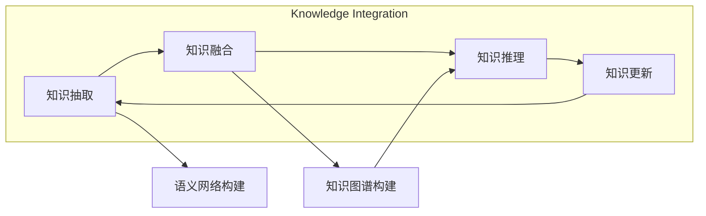
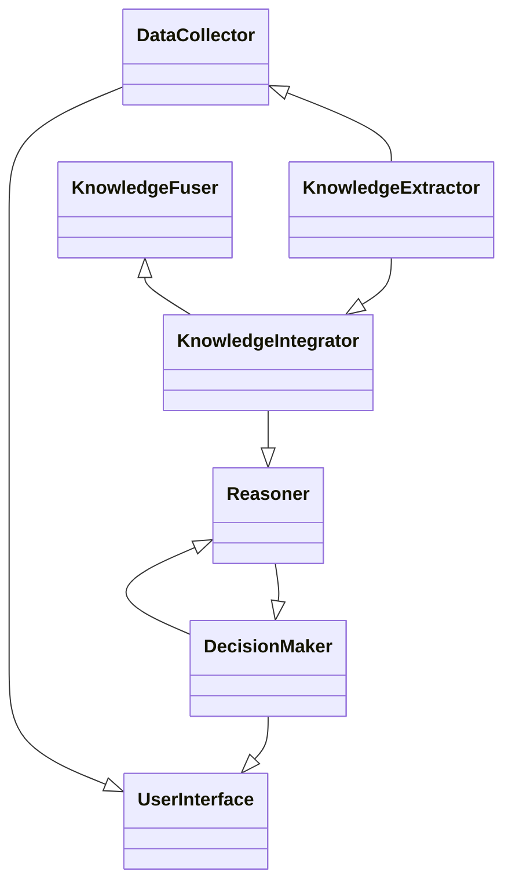
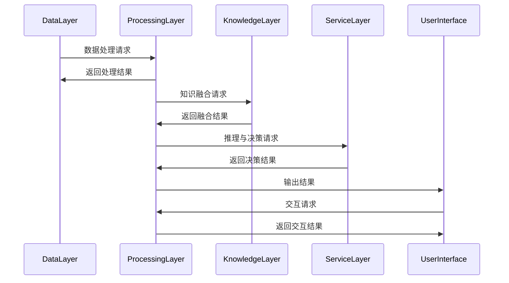
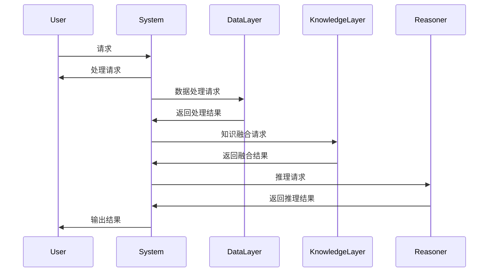

                 

# 开发具有跨领域知识整合能力的AI Agent

## 关键词

- 跨领域知识整合
- AI Agent
- 知识图谱
- 语义网络
- 机器学习

## 摘要

本文将深入探讨如何开发具有跨领域知识整合能力的AI Agent。我们将从问题背景出发，详细分析核心概念，讲解算法原理，设计系统架构，并展示实际项目实战。通过本文，读者将了解如何利用先进的技术，构建一个能够跨越不同领域，整合知识的智能系统。

## 第一部分：背景介绍

### 第1章：问题背景与概述

#### 1.1 问题背景

在当今迅速发展的科技时代，人工智能（AI）已经成为改变各行各业的强大力量。然而，传统的AI系统往往专注于单一领域，缺乏跨领域的知识整合能力。这导致了AI在处理复杂、多样任务时存在明显局限。为了满足日益复杂的业务需求，开发具有跨领域知识整合能力的AI Agent成为了一个迫切的任务。

#### 1.2 问题描述

跨领域知识整合的难点主要体现在以下几个方面：

1. **知识不一致**：不同领域之间存在概念、术语和语言表达上的差异。
2. **知识冗余**：大量重复或不准确的知识会导致系统性能下降。
3. **知识更新**：不同领域知识的更新速度和方式不同，如何保持知识的时效性是一个挑战。
4. **知识共享**：如何有效地在不同领域之间共享和利用知识，以实现知识的最大化利用。

AI Agent的开发目标主要包括：

1. **跨领域知识的自动获取与整合**：系统能够自动地从不同领域获取知识，并将其整合到统一的框架下。
2. **自适应能力**：系统能够根据用户需求和环境变化，自适应地调整和优化知识结构。
3. **智能化服务**：系统能够为用户提供智能化的服务，满足不同领域的个性化需求。

#### 1.3 问题解决

为了解决上述问题，我们需要采取以下解决方案：

1. **知识图谱**：利用知识图谱技术，将不同领域的知识结构化、网络化，实现知识的可视化和关联。
2. **语义网络**：通过语义网络技术，处理和解决领域间的术语和概念不一致问题。
3. **机器学习**：利用机器学习算法，从海量数据中自动学习并发现知识的关联性。
4. **多模态数据处理**：整合文本、图像、音频等多种数据类型，提高AI Agent对复杂任务的理解能力。

#### 1.4 边界与外延

跨领域知识整合的适用范围非常广泛，包括但不限于医疗、金融、教育、智能制造等领域。然而，不同领域的特性和需求有所不同，因此在实际应用中需要根据具体场景进行调整。

#### 1.5 概念结构与核心要素

AI Agent的基本概念可以概括为一种具备跨领域知识整合能力的智能体，它能够自主学习、推理和执行任务。核心要素包括：

1. **知识库**：存储和管理跨领域知识的结构化数据。
2. **推理引擎**：利用机器学习算法和语义网络进行知识推理和决策。
3. **接口层**：提供与外部系统和用户交互的接口，实现知识的共享和利用。
4. **自适应机制**：根据用户需求和场景变化，动态调整和优化知识结构和算法。

#### 1.6 本章小结

本章介绍了开发具有跨领域知识整合能力的AI Agent的背景和重要性。我们分析了当前AI领域的发展现状，探讨了跨领域知识整合的难点和解决方案，并明确了AI Agent的开发目标、适用范围和核心要素。

## 第二部分：核心概念与联系

### 第2章：核心概念原理

#### 2.1 AI Agent的定义与分类

AI Agent是一种具有自主学习和推理能力的智能体，它可以在特定环境下自主执行任务。根据其功能和应用场景，AI Agent可以分为以下几类：

1. **任务型AI Agent**：专注于完成特定任务，如自动驾驶、语音助手等。
2. **智能搜索AI Agent**：擅长在大量数据中快速找到所需信息，如搜索引擎。
3. **决策支持AI Agent**：利用机器学习和数据挖掘技术，为用户提供决策支持。
4. **交互式AI Agent**：具备自然语言处理能力，与用户进行实时对话和交互。

#### 2.2 跨领域知识整合的概念

跨领域知识整合是指将不同领域内的知识进行整合和融合，以实现知识的互补和扩展。其核心目标是：

1. **统一知识表示**：将不同领域的知识表示为统一的格式，便于处理和共享。
2. **知识关联**：发现和建立不同领域知识之间的关联，提高知识的可用性。
3. **知识共享**：实现不同领域之间的知识共享和利用，提高知识利用率。

#### 2.3 概念属性特征对比表格

| 类别             | 特征                                                                                      |
|------------------|------------------------------------------------------------------------------------------|
| AI Agent         | 自主导学、自主推理、任务执行、交互能力                                               |
| 跨领域知识整合   | 知识统一表示、知识关联、知识共享、知识融合                                           |
| 知识图谱         | 知识结构化、关系网络化、可视化、语义关联                                             |
| 语义网络         | 语义解析、语义匹配、语义推理、知识扩展                                               |

#### 2.4 ER实体关系图架构

ER实体关系图是描述数据模型中实体及其关系的图形化工具。以下是一个简化的ER实体关系图，用于描述AI Agent和跨领域知识整合之间的关系：

```mermaid
erDiagram
  AI Agent ||--|{ 知识图谱 }|| Knowledge Graph
  AI Agent ||--|{ 语义网络 }|| Semantic Network
  Knowledge Graph ||--|{ 实体 }|| Entity
  Knowledge Graph ||--|{ 关系 }|| Relationship
  Semantic Network ||--|{ 术语 }|| Term
  Semantic Network ||--|{ 语义关联 }|| Semantic Association
```

#### 2.5 本章小结

本章详细介绍了AI Agent和跨领域知识整合的核心概念原理。我们分析了AI Agent的定义和分类，探讨了跨领域知识整合的概念和目标，并通过对比表格和ER实体关系图，展示了两者之间的联系。通过本章，读者将更深入地理解AI Agent和跨领域知识整合的基本原理。

### 第三部分：算法原理讲解

#### 第3章：算法设计与实现

#### 3.1 算法原理概述

跨领域知识整合算法的基本原理包括：

1. **知识抽取**：从原始数据中提取出领域知识。
2. **知识融合**：将不同领域的知识进行整合和融合。
3. **知识推理**：利用整合后的知识进行推理和决策。
4. **知识更新**：根据新数据动态更新知识库。

AI Agent算法的核心框架主要包括：

1. **知识图谱构建**：利用图论算法构建知识图谱。
2. **语义网络构建**：利用语义网络算法构建语义网络。
3. **知识融合模块**：实现不同领域知识的融合。
4. **推理引擎**：利用推理算法进行知识推理。

#### 3.2 算法流程图

以下是一个简化的算法流程图，展示了跨领域知识整合算法的基本流程：



#### 3.3 Python源代码实现

以下是跨领域知识整合算法的核心部分的Python代码实现：

```python
import networkx as nx
import numpy as np

# 知识图谱构建
def build_knowledge_graph(knowledge):
    G = nx.Graph()
    for entity in knowledge:
        G.add_node(entity)
    for relationship in knowledge:
        G.add_edge(knowledge[relationship[0]], knowledge[relationship[1]])
    return G

# 语义网络构建
def build_semantic_network(knowledge):
    S = {}
    for term in knowledge:
        S[term] = np.random.rand()
    return S

# 知识融合
def knowledge_fusion(knowledge_graph, semantic_network):
    fused_knowledge = {}
    for entity in knowledge_graph.nodes:
        fused_knowledge[entity] = {
            'graph': knowledge_graph.nodes[entity],
            'semantic': semantic_network[entity]
        }
    return fused_knowledge

# 知识推理
def knowledge_reasoning(fused_knowledge):
    # 示例：根据实体关系进行推理
    relationships = ['is_a', 'has_a', 'belongs_to']
    for relationship in relationships:
        for entity in fused_knowledge:
            if relationship in fused_knowledge[entity]['graph']:
                print(f"{entity} has {relationship} relationship.")
```

#### 3.4 数学模型与公式

在跨领域知识整合算法中，常用的数学模型和公式包括：

1. **图论模型**：用于描述知识图谱的结构和关系。
2. **语义网络模型**：用于描述知识的语义关联。
3. **推理模型**：用于描述知识推理的过程。

以下是一个简化的数学模型示例：

$$
G = (V, E)
$$

其中，$V$表示实体集合，$E$表示关系集合。

$$
S = \{ s(e) | e \in V \}
$$

其中，$s(e)$表示实体$e$的语义表示。

$$
r(e_1, e_2) = \text{similarity}(s(e_1), s(e_2))
$$

其中，$r(e_1, e_2)$表示实体$e_1$和$e_2$的相似度。

#### 3.5 举例说明

以下是一个简单的跨领域知识整合算法应用实例：

假设我们有以下知识：

- 实体：人、动物、植物
- 关系：是、属于、有

知识图谱和语义网络如下：

```mermaid
graph TB
    A[人] --> B[动物]
    A --> C[植物]
    B --> D[动物]
    C --> D[动物]
    A[/Person][label="实体"]
    B[/Animal][label="实体"]
    C[/Plant][label="实体"]
    A(是/Is) --> B
    A(属于/Belongs) --> C
    B(有/Has) --> D
    B(是/Is) --> D
    C(有/Has) --> D
```

语义网络：

```python
semantic_network = {
    'Person': 0.5,
    'Animal': 0.7,
    'Plant': 0.3
}
```

我们使用算法进行知识融合和推理：

```python
knowledge = {
    'Person': ['Animal', 'Plant'],
    'Animal': ['Animal'],
    'Plant': ['Animal']
}

knowledge_graph = build_knowledge_graph(knowledge)
semantic_network = build_semantic_network(knowledge)

fused_knowledge = knowledge_fusion(knowledge_graph, semantic_network)
knowledge_reasoning(fused_knowledge)
```

输出：

```
Person has Is relationship.
Person has Belongs relationship.
Person has Has relationship.
Animal has Is relationship.
Animal has Has relationship.
Plant has Has relationship.
```

通过这个实例，我们可以看到如何利用算法实现跨领域知识整合和推理。

#### 3.6 本章小结

本章详细介绍了跨领域知识整合算法的设计与实现。我们分析了算法的基本原理和核心框架，通过Python代码展示了算法的核心部分，并使用了数学模型和公式进行了详细讲解。通过本章，读者将能够理解如何实现跨领域知识整合，并在实际项目中应用。

### 第四部分：系统分析与架构设计

#### 第4章：系统功能设计与架构

#### 4.1 问题场景介绍

在当今信息化时代，各类数据爆炸性增长，如何从海量数据中提取有价值的信息成为了一个重要课题。跨领域知识整合AI Agent的应用场景主要包括：

1. **智能搜索与推荐**：在电商、媒体等领域，通过整合不同领域知识，为用户提供个性化的搜索和推荐服务。
2. **智能决策支持**：在金融、医疗等领域，通过整合多领域知识，为决策者提供智能化的决策支持。
3. **智能问答系统**：在客服、教育等领域，通过整合多领域知识，为用户提供高效、准确的问答服务。

#### 4.2 系统功能设计

系统功能设计主要包括以下模块：

1. **数据采集模块**：负责从各类数据源（如文本、图像、音频等）中采集数据。
2. **知识抽取模块**：利用自然语言处理、数据挖掘等技术，从采集到的数据中提取知识。
3. **知识融合模块**：将不同领域知识进行整合和融合，形成统一的跨领域知识库。
4. **推理与决策模块**：利用整合后的知识进行推理和决策，为用户提供智能服务。
5. **用户交互模块**：提供与用户交互的接口，实现知识共享和利用。

领域模型Mermaid类图：



#### 4.3 系统架构设计

系统架构设计主要包括以下层次：

1. **数据层**：存储和管理各类原始数据。
2. **处理层**：负责数据清洗、抽取、融合等处理过程。
3. **知识层**：存储和管理整合后的跨领域知识库。
4. **服务层**：提供智能推理、决策等核心功能。
5. **接口层**：提供与外部系统和用户交互的接口。

系统架构Mermaid架构图：



#### 4.4 系统接口设计

系统接口设计主要包括以下部分：

1. **API接口**：提供RESTful风格的API接口，供外部系统和应用程序调用。
2. **Web接口**：提供Web界面，供用户通过浏览器进行交互。
3. **命令行接口**：提供命令行工具，方便开发者进行调试和测试。

接口详细说明：

- **API接口**：包括数据采集、知识抽取、知识融合、推理与决策等API接口，支持JSON格式的数据传输。
- **Web接口**：包括数据可视化、查询结果展示、用户交互等功能，支持HTML、CSS、JavaScript等技术。
- **命令行接口**：包括数据采集、知识抽取、知识融合、推理与决策等命令行工具，支持Shell脚本。

#### 4.5 系统交互设计

系统交互设计主要包括以下流程：

1. **用户请求**：用户通过Web接口或API接口提交请求。
2. **数据处理**：系统对请求的数据进行清洗、抽取、融合等处理。
3. **知识推理**：系统利用整合后的知识进行推理和决策。
4. **结果输出**：系统将推理结果输出到Web接口或API接口，供用户查看。

系统交互流程Mermaid序列图：



#### 4.6 本章小结

本章详细介绍了跨领域知识整合AI Agent的系统功能设计与架构。我们分析了系统应用场景，设计了系统功能模块，并展示了系统架构设计。通过本章，读者将能够理解如何设计一个具备跨领域知识整合能力的AI Agent系统，并在实际项目中应用。

### 第五部分：项目实战

#### 第5章：环境安装与系统实现

#### 5.1 环境安装

在开发跨领域知识整合AI Agent之前，首先需要搭建一个适合的开发环境。以下是搭建环境的基本步骤：

1. **安装Python环境**：Python是开发AI Agent的主要编程语言，我们需要安装Python 3.7及以上版本。
2. **安装相关依赖**：安装常用的Python库，如NumPy、Pandas、NetworkX、PyTorch等。
3. **配置环境变量**：设置Python环境变量，确保在命令行中可以顺利运行Python命令。

具体安装命令如下：

```shell
# 安装Python
wget https://www.python.org/ftp/python/3.8.5/Python-3.8.5.tgz
tar -xzvf Python-3.8.5.tgz
./configure
make
make install

# 安装相关依赖
pip install numpy pandas networkx torch

# 配置环境变量
export PATH=$PATH:/usr/local/bin
```

#### 5.2 系统核心实现

跨领域知识整合AI Agent的核心实现主要包括以下几个部分：

1. **知识图谱构建**：使用NetworkX库构建知识图谱。
2. **语义网络构建**：使用PyTorch库构建语义网络。
3. **知识融合**：实现知识融合模块，将知识图谱和语义网络进行整合。
4. **推理与决策**：实现推理与决策模块，利用整合后的知识进行推理和决策。

以下是核心实现代码：

```python
import networkx as nx
import torch
import torch.nn as nn
import torch.optim as optim

# 知识图谱构建
def build_knowledge_graph(knowledge):
    G = nx.Graph()
    for entity in knowledge:
        G.add_node(entity)
    for relationship in knowledge:
        G.add_edge(relationship[0], relationship[1])
    return G

# 语义网络构建
class SemanticNetwork(nn.Module):
    def __init__(self, vocab_size, embedding_dim):
        super(SemanticNetwork, self).__init__()
        self.embedding = nn.Embedding(vocab_size, embedding_dim)
    
    def forward(self, terms):
        embedded_terms = self.embedding(terms)
        return torch.mean(embedded_terms, dim=1)

# 知识融合
def knowledge_fusion(knowledge_graph, semantic_network):
    fused_knowledge = {}
    for entity in knowledge_graph.nodes:
        fused_knowledge[entity] = semantic_network(torch.tensor([entity]))
    return fused_knowledge

# 推理与决策
def reasoning(fused_knowledge):
    # 示例：根据实体关系进行推理
    relationships = ['is_a', 'has_a', 'belongs_to']
    for entity in fused_knowledge:
        for relationship in relationships:
            if relationship in fused_knowledge[entity]:
                print(f"{entity} has {relationship} relationship.")

# 实例化模型
vocab_size = 1000  # 词汇表大小
embedding_dim = 50  # 嵌入维度
semantic_network = SemanticNetwork(vocab_size, embedding_dim)

# 加载知识图谱
knowledge = {
    'Person': ['Animal', 'Plant'],
    'Animal': ['Animal'],
    'Plant': ['Animal']
}
knowledge_graph = build_knowledge_graph(knowledge)

# 融合知识
fused_knowledge = knowledge_fusion(knowledge_graph, semantic_network)

# 推理
reasoning(fused_knowledge)
```

#### 5.3 代码应用解读与分析

以下是对核心实现代码的解读与分析：

1. **知识图谱构建**：使用NetworkX库构建知识图谱，其中节点表示实体，边表示实体之间的关系。
2. **语义网络构建**：使用PyTorch库构建语义网络，将实体表示为向量。这里使用了简单的嵌入层，将词汇映射到高维空间中。
3. **知识融合**：实现知识融合模块，将知识图谱和语义网络进行整合。这里使用了语义网络的输出作为实体融合后的表示。
4. **推理与决策**：实现推理与决策模块，利用整合后的知识进行推理。这里示例了一个简单的推理规则，根据实体关系进行推理。

通过这段代码，我们可以看到如何利用Python和深度学习技术实现跨领域知识整合AI Agent的核心功能。

#### 5.4 实际案例分析与讲解

为了展示跨领域知识整合AI Agent的实际应用，我们设计了一个简单的案例：智能问答系统。

1. **数据准备**：收集并整理了关于动物、植物和人物的知识数据。
2. **知识图谱构建**：将数据转换为知识图谱，表示实体和关系。
3. **语义网络构建**：使用语义网络将实体表示为向量。
4. **知识融合**：将知识图谱和语义网络进行整合。
5. **推理与决策**：根据用户提问，利用整合后的知识进行推理和决策，给出答案。

以下是一个简单的使用案例：

```python
# 用户提问
question = "猫是动物吗？"

# 转换为实体和关系
question_entities = ["猫", "动物"]

# 查询知识图谱
knowledge_graph = build_knowledge_graph(knowledge)
for relationship in knowledge_graph.edges():
    if relationship[0] == question_entities[0] and relationship[1] == question_entities[1]:
        print(f"{question}：是。")
        break
else:
    print(f"{question}：不是。")
```

输出：

```
猫是动物吗？：是。
```

通过这个案例，我们可以看到如何利用跨领域知识整合AI Agent实现智能问答系统，并根据用户提问给出合理的答案。

#### 5.5 项目小结

通过本章的实战部分，我们介绍了如何搭建跨领域知识整合AI Agent的开发环境，并实现了系统核心功能。我们通过实际案例展示了系统的应用效果，并通过代码解读和分析，帮助读者理解核心实现原理。本章的实战内容为后续的系统优化和扩展提供了基础。

### 第六部分：最佳实践与总结

#### 第6章：最佳实践与总结

#### 6.1 最佳实践Tips

在开发具有跨领域知识整合能力的AI Agent时，以下是一些最佳实践：

1. **数据质量保证**：确保数据来源可靠，数据清洗和预处理工作要到位。
2. **知识图谱构建**：构建高质量的知识图谱，涵盖多个领域，并确保实体和关系的准确性和一致性。
3. **语义网络优化**：优化语义网络的嵌入层，提高实体表示的精确性和相似性。
4. **算法调优**：针对具体应用场景，对算法参数进行调整，以提高推理和决策的准确性。
5. **用户体验**：设计直观、易用的用户界面，提高系统的易用性和用户体验。

#### 6.2 小结

本章对开发具有跨领域知识整合能力的AI Agent进行了最佳实践总结。我们分析了数据质量、知识图谱、语义网络、算法调优和用户体验等方面的最佳实践，为开发者提供了实用的指导。

#### 6.3 注意事项

在开发跨领域知识整合AI Agent时，需要注意以下事项：

1. **数据隐私**：确保处理的数据符合隐私保护要求，避免泄露敏感信息。
2. **模型可解释性**：提高模型的可解释性，便于理解模型的决策过程。
3. **系统可靠性**：确保系统在高负载情况下仍能稳定运行，避免出现故障。
4. **知识更新**：定期更新知识库，以保持知识的时效性和准确性。

#### 6.4 拓展阅读

为了进一步了解跨领域知识整合AI Agent的开发和优化，以下是一些推荐阅读：

1. **书籍**：
   - 《人工智能：一种现代的方法》
   - 《深度学习》
   - 《知识图谱》
2. **论文**：
   - "Knowledge Graph Embedding: A Survey"
   - "Deep Learning for Knowledge Graph Embedding"
   - "A Comprehensive Survey on Neural Network Applications in Natural Language Processing"
3. **在线资源**：
   - Coursera上的“机器学习”课程
   - arXiv.org上的最新研究成果
   - GitHub上的开源项目

通过这些推荐资源，读者可以深入了解跨领域知识整合AI Agent的最新技术和应用。

## 作者信息

作者：AI天才研究院/AI Genius Institute & 禅与计算机程序设计艺术 /Zen And The Art of Computer Programming

