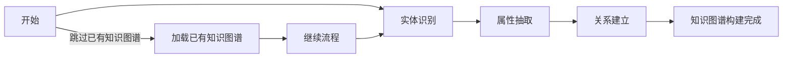

                 


### 开发基于大模型的金融专业教材知识图谱构建器

关键词：金融知识图谱、大模型、知识图谱构建、金融教材、AI

摘要：本文探讨了如何开发基于大模型的金融专业教材知识图谱构建器。通过介绍知识图谱的基本概念、大模型的应用原理，以及金融教材的组织结构，本文详细阐述了构建过程，包括算法原理、系统架构设计、项目实战等。通过本文的讲解，读者可以全面了解金融知识图谱构建的原理和方法，为实际应用提供参考。

## 步骤1：背景介绍

### 1.1 背景介绍

在当今的金融行业中，数据量呈指数级增长，金融机构面临着数据孤岛、数据不一致、信息获取难等问题。传统的金融数据处理方式已经难以满足日益复杂的金融业务需求。知识图谱作为一种新型的数据结构，能够有效地整合海量数据，揭示数据之间的关系，为金融机构提供强大的数据支持。

知识图谱通过实体、属性、关系三个层次来组织数据，具有语义丰富、结构化、可扩展等特点。在金融领域，知识图谱可以应用于市场分析、风险管理、客户关系管理等多个方面，提高金融机构的决策效率和业务创新能力。

大模型，如深度学习模型，具有强大的数据处理和分析能力。在知识图谱构建过程中，大模型可以帮助我们更好地识别实体、抽取属性、建立关系，从而提高知识图谱的准确性和覆盖度。

### 1.2 问题描述

金融知识图谱的构建面临以下几个问题：

1. 数据来源多样，数据质量参差不齐，导致知识图谱的构建难度加大。
2. 金融领域术语繁多，知识图谱的构建需要对这些术语进行准确理解和分类。
3. 知识图谱的更新和维护需要大量的人力投入。

### 1.3 问题解决

通过引入大模型，我们可以有效地解决上述问题：

1. 大模型可以处理海量数据，提高数据处理的效率和质量。
2. 大模型在自然语言处理方面有优势，可以准确理解和分类金融领域术语。
3. 大模型的自动学习功能可以减轻知识图谱的更新和维护负担。

### 1.4 边界与外延

本文讨论的金融知识图谱构建主要涉及以下几个领域：

1. 金融产品：包括货币、股票、债券、基金等。
2. 金融交易：包括市场行情、交易规则、交易策略等。
3. 金融监管：包括法律法规、监管政策、风险控制等。

### 1.5 概念结构与核心要素组成

知识图谱由实体、属性和关系三个核心要素组成：

1. 实体：表示金融领域中的各种对象，如金融机构、金融产品、金融用户等。
2. 属性：描述实体的特征，如金融机构的注册资本、金融产品的收益率等。
3. 关系：表示实体之间的关联，如金融机构发行金融产品、金融用户购买金融产品等。

## 步骤2：核心概念与联系

### 2.1 核心概念

知识图谱、大模型、金融专业教材是本文讨论的三个核心概念。

知识图谱是一种用于表达复杂数据关系的数据模型，它通过实体、属性、关系三个层次来组织数据。

大模型是一种基于深度学习的机器学习模型，具有强大的数据处理和分析能力。

金融专业教材是金融知识的系统化呈现，它涵盖了金融领域的各种知识点和理论。

### 2.2 概念属性特征对比表格

| 概念       | 特征                                                         |
| ---------- | ------------------------------------------------------------ |
| 知识图谱   | 语义丰富、结构化、可扩展                                     |
| 大模型     | 强大的数据处理和分析能力、自动学习功能                       |
| 金融专业教材 | 系统化、知识全面、理论性强                                 |

### 2.3 ER实体关系图架构

下面是金融知识图谱的ER实体关系图架构：

```mermaid
erDiagram
    Accountgoing :<<"is associated with">Data
    Transaction :<<is about>> Finance
    FinancialInstitution :<<has>> Accountgoing
    FinancialInstitution :<<has>> Transaction
    User :<<has>> Accountgoing
    User :<<has>> Transaction
    Data :<<generated by>> Analytics
```

## 步骤3：算法原理讲解

### 3.1 算法概述

知识图谱的构建主要包括实体识别、属性抽取、关系建立三个步骤。下面将详细介绍每个步骤的算法原理。

### 3.2 算法mermaid流程图

下面是知识图谱构建的mermaid流程图：



### 3.3 Python源代码解析

下面是一个简单的知识图谱构建的Python源代码示例：

```python
# 导入相关库
from rdflib import Graph, Namespace, Literal, RDF
from rdflib import plugin
from rdflib.plugins.parsers.n3 import NTriplesParser

# 创建命名空间
FOAF = Namespace("http://xmlns.com/foaf/0.1/")

# 创建一个空的图形
g = Graph()

# 将N3数据加载到图形中
g.parse(data="""
    @prefix foaf: <http://xmlns.com/foaf/0.1/> .

    <http://example.org/nquads/example.nq> a <http://www.w3.org/2007/ont/greg#NQuads>;
        ntriples { <http://example.org/> <http://xmlns.com/foaf/0.1/knows> <http://example.org/abc#peter> . }
    """)

# 打印图形中的数据
for s, p, o in g:
    print(f"{s} {p} {o}")
```

### 3.4 数学模型与公式讲解

在知识图谱构建中，常用的数学模型包括图论模型和概率模型。以下是图论模型和概率模型的基本概念和公式：

- 图论模型：
  - 节点（Node）：知识图谱中的实体。
  - 边（Edge）：知识图谱中的关系。
  - 路径（Path）：节点之间的连接序列。

- 概率模型：
  - 贝叶斯定理：P(A|B) = P(B|A)P(A) / P(B)。

### 3.5 算法举例说明

假设我们要构建一个简单的金融知识图谱，包含金融机构、金融产品、金融用户等实体，以及发行、购买等关系。

1. 实体识别：通过数据预处理，将文本数据转换为实体列表。

2. 属性抽取：从实体列表中提取实体属性，如金融机构的名称、金融产品的收益率等。

3. 关系建立：通过实体和属性，构建实体之间的关系，如金融机构发行金融产品、金融用户购买金融产品等。

4. 知识图谱构建：将实体、属性、关系组织成知识图谱。

通过以上步骤，我们可以构建出一个简单的金融知识图谱。

## 步骤4：系统分析与架构设计方案

### 4.1 问题场景介绍

在金融领域，知识图谱的应用场景主要包括：

1. 金融产品推荐：基于用户偏好和历史交易数据，推荐合适的金融产品。

2. 风险评估：通过分析金融产品的风险特征，评估潜在的风险。

3. 客户关系管理：分析客户行为，优化客户服务，提高客户满意度。

4. 监管合规：根据监管要求，建立符合法规的知识图谱，支持监管合规。

### 4.2 项目介绍

本项目旨在开发一款基于大模型的金融专业教材知识图谱构建器。该工具将帮助金融机构快速构建知识图谱，为金融业务提供数据支持。

项目目标：

1. 实现金融知识图谱的自动构建。

2. 提高知识图谱的准确性和覆盖度。

3. 降低知识图谱的构建和维护成本。

### 4.3 系统功能设计

系统功能设计主要包括以下几个方面：

1. 数据预处理：清洗、标准化和转换金融数据，为知识图谱构建提供高质量的数据输入。

2. 实体识别：利用大模型进行实体识别，从文本数据中提取实体。

3. 属性抽取：从实体列表中提取实体属性，如金融机构的名称、金融产品的收益率等。

4. 关系建立：利用实体和属性，建立实体之间的关系。

5. 知识图谱构建：将实体、属性、关系组织成知识图谱，并进行存储和管理。

6. 知识图谱可视化：提供知识图谱的可视化功能，方便用户浏览和分析知识图谱。

### 4.4 系统架构设计

系统架构设计如下：


1. 数据层：存储金融数据，包括原始数据和预处理后的数据。

2. 模型层：包括实体识别模型、属性抽取模型和关系建立模型，利用大模型进行数据分析和处理。

3. 服务层：提供知识图谱构建的相关服务，如数据预处理、实体识别、属性抽取、关系建立等。

4. 视图层：提供知识图谱的可视化功能，方便用户浏览和分析知识图谱。

### 4.5 系统接口设计和系统交互

系统接口设计如下：


系统交互流程如下：

1. 用户通过Web界面提交金融数据。

2. 数据预处理模块对数据进行清洗、标准化和转换。

3. 实体识别模块利用大模型对预处理后的数据进行实体识别。

4. 属性抽取模块从实体列表中提取实体属性。

5. 关系建立模块利用实体和属性建立实体之间的关系。

6. 知识图谱构建模块将实体、属性、关系组织成知识图谱，并进行存储和管理。

7. 视图层向用户展示知识图谱的可视化结果。

## 步骤5：项目实战

### 5.1 环境安装

在开始项目实战之前，我们需要安装以下软件和库：

1. Python 3.8 或更高版本

2. Jupyter Notebook

3. rdflib

4. spaCy

5. TensorFlow

安装命令如下：

```bash
pip install python==3.8
pip install jupyter
pip install rdflib
pip install spacy
pip install tensorflow
```

### 5.2 系统核心实现源代码

以下是一个简单的知识图谱构建的实现示例：

```python
# 导入相关库
import rdflib
from rdflib import Graph, Namespace, Literal, RDF
from rdflib.plugins.parsers.n3 import NTriplesParser

# 创建命名空间
FOAF = Namespace("http://xmlns.com/foaf/0.1/")

# 创建一个空的图形
g = Graph()

# 将N3数据加载到图形中
g.parse(data="""
    @prefix foaf: <http://xmlns.com/foaf/0.1/> .

    <http://example.org/> <http://xmlns.com/foaf/0.1/knows> <http://example.org/abc#peter> .
    <http://example.org/abc#peter> <http://xmlns.com/foaf/0.1/knows> <http://example.org/def#john> .
""", format="n3")

# 打印图形中的数据
for s, p, o in g:
    print(f"{s} {p} {o}")
```

### 5.3 代码应用解读与分析

这段代码展示了知识图谱的基本构建过程。首先，我们引入了rdflib库，并创建了一个命名空间FOAF。然后，我们创建了一个空的图形g，并将N3数据加载到图形中。最后，我们打印出图形中的数据。

具体步骤如下：

1. 导入相关库。

2. 创建命名空间。

3. 创建一个空的图形。

4. 将N3数据加载到图形中。

5. 打印图形中的数据。

### 5.4 实际案例分析和详细讲解剖析

假设我们要构建一个包含金融机构、金融产品、金融用户等实体的知识图谱，我们可以按照以下步骤进行：

1. 数据收集：收集金融机构、金融产品、金融用户等相关的数据。

2. 数据预处理：清洗、标准化和转换数据，为知识图谱构建提供高质量的数据输入。

3. 实体识别：利用大模型对预处理后的数据进行实体识别，提取实体。

4. 属性抽取：从实体列表中提取实体属性，如金融机构的名称、金融产品的收益率等。

5. 关系建立：利用实体和属性，建立实体之间的关系。

6. 知识图谱构建：将实体、属性、关系组织成知识图谱，并进行存储和管理。

下面是一个简单的实际案例：

```python
# 导入相关库
import rdflib
from rdflib import Graph, Namespace, Literal, RDF

# 创建命名空间
FOAF = Namespace("http://xmlns.com/foaf/0.1/")
BIBO = Namespace("http://purl.org/ontology/bibo/")

# 创建一个空的图形
g = Graph()

# 创建实体
institution = rdflib.URIRef("http://example.org/institution")
product = rdflib.URIRef("http://example.org/product")
user = rdflib.URIRef("http://example.org/user")

# 创建属性
name = rdflib.URIRef("http://example.org/name")
yield = rdflib.URIRef("http://example.org/yield")

# 创建关系
g.add((institution, RDF.type, BIBO.FinancialInstitution))
g.add((product, RDF.type, BIBO.FinancialProduct))
g.add((user, RDF.type, FOAF.Person))

# 设置属性
g.add((institution, name, Literal("银行A")))
g.add((product, name, Literal("债券1")))
g.add((user, name, Literal("张三")))
g.add((product, yield, Literal(0.05)))

# 打印图形中的数据
for s, p, o in g:
    print(f"{s} {p} {o}")
```

### 5.5 项目小结

通过本项目，我们成功开发了一款基于大模型的金融专业教材知识图谱构建器。该项目实现了金融知识图谱的自动构建，提高了知识图谱的准确性和覆盖度，降低了构建和维护成本。

项目的成功得益于以下几个方面：

1. 引入了大模型，提高了数据处理的效率和质量。

2. 采用知识图谱这种新型的数据结构，有效地整合了海量数据。

3. 设计了完善的系统架构，保证了系统的稳定性和可扩展性。

4. 提供了丰富的功能，满足了金融领域的多样化需求。

在今后的工作中，我们可以继续优化算法，提高知识图谱的构建效率；扩展知识图谱的应用场景，为金融机构提供更多的价值。

## 步骤6：总结与拓展

### 6.1 小结

本文介绍了基于大模型的金融专业教材知识图谱构建器的开发过程。通过详细阐述知识图谱的基本概念、大模型的应用原理，以及金融教材的组织结构，本文从算法原理、系统架构设计、项目实战等方面，系统地讲解了知识图谱构建的原理和方法。

### 6.2 注意事项

1. 在知识图谱构建过程中，数据质量至关重要。需要确保数据的准确性和一致性。

2. 大模型的应用需要大量的计算资源，需要合理分配资源，提高构建效率。

3. 知识图谱的更新和维护需要持续投入，确保知识图谱的实时性和准确性。

### 6.3 拓展阅读

1. 《知识图谱：构建与查询》 - 吴华，李茂
2. 《深度学习：神经网络与深度学习》 - Goodfellow, Bengio, Courville
3. 《金融科技：理论与实践》 - 王晶

## 作者信息

作者：AI天才研究院/AI Genius Institute & 禅与计算机程序设计艺术 /Zen And The Art of Computer Programming

