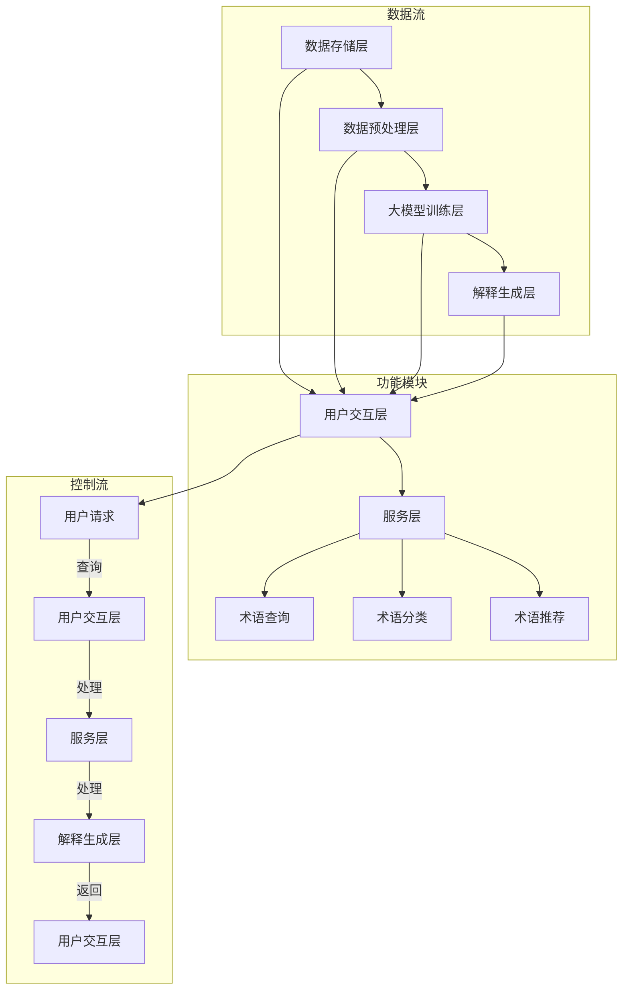
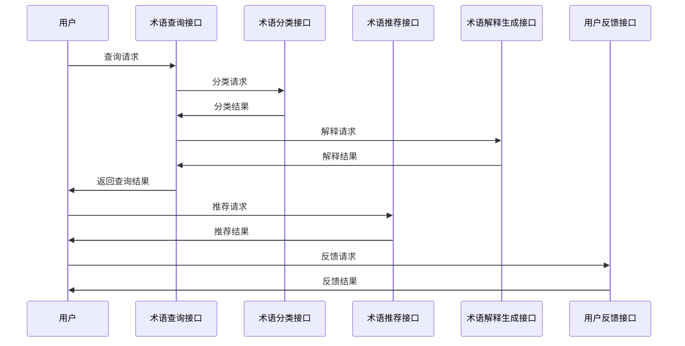
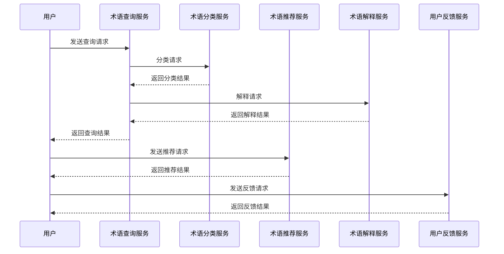

                 

## 开发基于大模型的金融专业术语解释系统

### 关键词：金融专业术语、大模型技术、解释系统、系统开发流程

> 摘要：本文旨在探讨如何开发一个基于大模型的金融专业术语解释系统。文章首先介绍了问题背景，分析了金融专业术语和大模型技术的核心概念，并详细讲解了系统开发流程。随后，文章探讨了金融专业术语的解析方法和大模型技术的应用，最后通过算法原理讲解、系统架构设计和项目实战，全面阐述了开发基于大模型的金融专业术语解释系统的过程。本文为从事金融科技和人工智能领域的技术人员提供了有价值的参考。

### 目录大纲

#### 第一部分: 背景介绍

##### 第1章: 问题背景

###### 1.1 问题的提出

###### 1.2 问题描述

###### 1.3 问题解决

###### 1.4 边界与外延

##### 第2章: 核心概念

###### 2.1 金融专业术语

###### 2.2 大模型技术

###### 2.3 系统开发流程

#### 第二部分: 核心概念与联系

##### 第3章: 金融专业术语解析

###### 3.1 金融专业术语原理

###### 3.2 金融专业术语属性特征对比

###### 3.3 金融专业术语ER实体关系图

##### 第4章: 大模型技术应用

###### 4.1 大模型技术原理

###### 4.2 大模型技术属性特征对比

###### 4.3 大模型技术在金融领域的应用

#### 第三部分: 算法原理讲解

##### 第5章: 大模型算法

###### 5.1 大模型算法原理

###### 5.2 大模型算法mermaid流程图

###### 5.3 大模型算法数学模型和公式

###### 5.4 大模型算法举例说明

##### 第6章: 系统架构设计

###### 6.1 问题场景介绍

###### 6.2 系统功能设计

###### 6.3 系统架构设计

###### 6.4 系统接口设计

###### 6.5 系统交互mermaid序列图

#### 第四部分: 项目实战

##### 第7章: 环境安装

###### 7.1 环境准备

###### 7.2 系统核心实现

##### 第8章: 系统实现

###### 8.1 代码应用解读与分析

###### 8.2 实际案例分析和详细讲解剖析

##### 第9章: 项目小结

###### 9.1 小结

###### 9.2 注意事项

###### 9.3 拓展阅读

---

### 第一部分：背景介绍

#### 第1章：问题背景

##### 1.1 问题的提出

在当今金融科技迅速发展的背景下，金融专业术语的不断涌现和更新，使得非专业人员和初学者在学习、研究和应用金融知识时面临巨大的困难。因此，开发一个能够准确解释金融专业术语的系统显得尤为重要。

##### 1.2 问题描述

金融专业术语解释系统的核心目标是：

1. 提供准确、详细的金融专业术语解释。
2. 帮助用户快速理解金融术语的含义和应用场景。
3. 为金融从业者和研究者提供便捷的工具，提升其工作效率。

##### 1.3 问题解决

为了解决上述问题，本文提出了开发一个基于大模型的金融专业术语解释系统。该系统利用大模型技术，通过对海量金融文本数据的分析和学习，自动生成高质量的金融专业术语解释。

##### 1.4 边界与外延

1. **边界**：系统仅涵盖金融领域内的术语解释，不包括其他领域。
2. **外延**：系统可以扩展到其他领域，如法律、医学等，但需针对不同领域的术语进行定制化开发。

### 第2章：核心概念

##### 2.1 金融专业术语

###### 2.1.1 金融专业术语的定义

金融专业术语是指金融领域中具有特定含义的词语或短语。

###### 2.1.2 金融专业术语的类型

- **基础术语**：如“利率”、“汇率”等。
- **复合术语**：如“货币互换”、“期权交易”等。
- **新兴术语**：如“区块链”、“金融科技”等。

###### 2.1.3 金融专业术语的特点

- **专业性**：金融术语具有较强的专业性，需要具备一定的金融知识背景。
- **广泛性**：金融术语覆盖面广，涉及金融市场的各个方面。

##### 2.2 大模型技术

###### 2.2.1 大模型技术的定义

大模型技术是指通过深度学习、神经网络等人工智能技术，构建和训练大规模的模型，以实现对复杂数据的高效处理和智能分析。

###### 2.2.2 大模型技术的特点

- **高精度**：大模型技术能够处理海量数据，并从中提取出高精度的信息。
- **自动化**：大模型技术可以实现自动化的数据分析和决策。

###### 2.2.3 大模型技术的分类

- **预训练模型**：如GPT-3、BERT等。
- **特定领域模型**：如金融领域模型、医疗领域模型等。

##### 2.3 系统开发流程

###### 2.3.1 系统开发流程概述

系统开发流程主要包括以下几个阶段：

1. 需求分析
2. 系统设计
3. 系统实现
4. 系统测试
5. 系统部署

###### 2.3.2 系统开发流程的关键步骤

1. **需求分析**：明确系统的功能需求和技术要求。
2. **系统设计**：制定系统的整体架构和技术方案。
3. **系统实现**：编写代码，实现系统的核心功能。
4. **系统测试**：对系统进行全面测试，确保其稳定性和可靠性。
5. **系统部署**：将系统部署到生产环境，供用户使用。

###### 2.3.3 系统开发流程的实际应用

在实际应用中，系统开发流程需要根据项目的具体情况和需求进行调整。例如，在开发过程中，可能会遇到技术难题，需要通过改进算法或优化架构来解决问题。

---

### 第二部分：核心概念与联系

#### 第3章：金融专业术语解析

##### 3.1 金融专业术语原理

###### 3.1.1 金融专业术语的构成

金融专业术语通常由以下几个部分构成：

- **核心词**：如“利率”、“汇率”等。
- **前缀**：如“货币”、“金融”等。
- **后缀**：如“率”、“指数”等。

###### 3.1.2 金融专业术语的功能

金融专业术语在金融市场和金融活动中发挥着重要作用，主要功能包括：

- **定义和描述**：帮助用户理解和描述金融现象和活动。
- **沟通和交流**：在金融领域内，专业术语是沟通和交流的基础。
- **分析和决策**：专业术语有助于用户对金融市场进行深入分析和决策。

##### 3.2 金融专业术语属性特征对比

为了更好地理解和应用金融专业术语，我们可以从以下几个方面进行属性特征对比：

| 属性特征 | 说明 |  
| :--- | :--- |  
| **专业性** | 金融专业术语具有较强的专业性，需要具备一定的金融知识背景。 |  
| **广泛性** | 金融专业术语覆盖面广，涉及金融市场的各个方面。 |  
| **更新性** | 金融专业术语不断更新和演变，需要用户持续学习和更新知识。 |

通过对比，我们可以更清晰地了解金融专业术语的特点和属性，从而更好地应用和掌握这些术语。

##### 3.3 金融专业术语ER实体关系图

为了更直观地展示金融专业术语之间的关系，我们可以使用ER（实体关系）图来表示。以下是一个简化的金融专业术语ER实体关系图：

```mermaid
erDiagram
    Category ||--|{ Term }
    Term ||--|{ Definition }
    Term ||--|{ Example }
```

在这个ER实体关系图中，`Category`（类别）表示金融专业术语的分类，如“基础术语”、“复合术语”和“新兴术语”；`Term`（术语）表示具体的金融专业术语；`Definition`（定义）表示术语的解释；`Example`（示例）表示术语的实际应用场景。

---

#### 第4章：大模型技术应用

##### 4.1 大模型技术原理

###### 4.1.1 大模型技术的核心原理

大模型技术主要基于深度学习和神经网络，通过大规模的模型训练和优化，实现对复杂数据的高效处理和分析。其核心原理包括：

- **数据驱动**：大模型技术通过海量数据的学习和训练，提取出有用的信息。
- **分布式计算**：大模型技术利用分布式计算框架，处理大规模的数据集。
- **自适应优化**：大模型技术通过自适应优化算法，不断提高模型的性能。

###### 4.1.2 大模型技术的优势

大模型技术具有以下优势：

- **高精度**：大模型技术能够处理海量数据，并从中提取出高精度的信息。
- **自动化**：大模型技术可以实现自动化的数据分析和决策。
- **通用性**：大模型技术可以应用于各个领域，如金融、医疗、自然语言处理等。

###### 4.1.3 大模型技术的挑战

大模型技术面临以下挑战：

- **数据质量**：大模型技术对数据质量有很高的要求，数据的不准确或缺失会影响模型的性能。
- **计算资源**：大模型技术需要大量的计算资源，对硬件设备有较高的要求。
- **解释性**：大模型技术的黑盒性质使得其结果难以解释，影响其在某些领域的应用。

##### 4.2 大模型技术属性特征对比

为了更好地理解和应用大模型技术，我们可以从以下几个方面进行属性特征对比：

| 属性特征 | 说明 |  
| :--- | :--- |  
| **数据驱动** | 大模型技术基于海量数据的学习和训练，提取出有用的信息。 |  
| **分布式计算** | 大模型技术利用分布式计算框架，处理大规模的数据集。 |  
| **自适应优化** | 大模型技术通过自适应优化算法，不断提高模型的性能。 |

通过对比，我们可以更清晰地了解大模型技术的特点和属性，从而更好地应用和掌握这些技术。

##### 4.3 大模型技术在金融领域的应用

大模型技术在金融领域具有广泛的应用前景，以下是一些典型的应用场景：

- **金融市场预测**：利用大模型技术分析历史数据，预测未来市场走势。
- **风险管理**：通过大模型技术分析金融产品的风险，为投资决策提供依据。
- **客户服务**：利用大模型技术提供智能客服，提升用户体验。
- **金融监管**：利用大模型技术监测和预测金融市场的异常行为，加强金融监管。

在实际应用中，大模型技术不仅可以提高金融领域的效率和准确性，还可以创造新的业务机会和商业模式。

---

### 第三部分：算法原理讲解

#### 第5章：大模型算法

##### 5.1 大模型算法原理

###### 5.1.1 大模型算法的基本原理

大模型算法是基于深度学习和神经网络的技术，通过大规模的训练数据和复杂的网络结构，实现对复杂数据的建模和分析。以下是大模型算法的基本原理：

1. **数据输入**：大模型算法接收输入的数据，这些数据可以是文本、图像、音频等不同类型的。
2. **数据处理**：大模型算法对输入数据进行预处理，如归一化、编码等，以便模型能够更好地处理。
3. **模型训练**：大模型算法利用训练数据对模型进行训练，通过反向传播算法优化模型参数。
4. **模型评估**：大模型算法使用验证数据对训练好的模型进行评估，以检查模型的性能。
5. **模型应用**：大模型算法将训练好的模型应用于实际数据，进行预测、分类或生成等任务。

###### 5.1.2 大模型算法的核心模块

大模型算法的核心模块通常包括以下几个部分：

- **数据输入模块**：负责接收和预处理输入数据。
- **神经网络模块**：负责构建和训练神经网络模型。
- **优化器模块**：负责优化模型参数，提高模型性能。
- **评估模块**：负责评估模型的性能，包括准确率、召回率等指标。

###### 5.1.3 大模型算法的实现步骤

实现大模型算法的基本步骤如下：

1. **数据收集与预处理**：收集相关的金融数据，并进行清洗、去噪和归一化等预处理操作。
2. **模型设计**：设计神经网络结构，选择合适的激活函数、损失函数等。
3. **模型训练**：使用预处理后的数据进行模型训练，通过反向传播算法调整模型参数。
4. **模型评估**：使用验证集对训练好的模型进行评估，以检查模型的性能。
5. **模型优化**：根据评估结果对模型进行调整和优化，以提高模型性能。
6. **模型应用**：将训练好的模型应用于实际金融数据分析任务，如预测、分类或生成等。

##### 5.2 大模型算法mermaid流程图

为了更直观地展示大模型算法的实现步骤，我们可以使用mermaid流程图来表示。以下是大模型算法的mermaid流程图：


在这个mermaid流程图中，`A`表示数据收集与预处理，`B`表示模型设计，`C`表示模型训练，`D`表示模型评估，`E`表示模型优化，`F`表示模型应用。

##### 5.3 大模型算法数学模型和公式

大模型算法的数学模型和公式是其核心组成部分，以下是一些常见的数学模型和公式：

1. **神经网络模型**：

   - **激活函数**：$$ f(x) = \sigma(x) = \frac{1}{1 + e^{-x}} $$
   - **损失函数**：$$ J(\theta) = -\frac{1}{m} \sum_{i=1}^{m} y^{(i)} \log(a^{(i)}_j) + (1 - y^{(i)}) \log(1 - a^{(i)}_j) $$
   - **反向传播算法**：$$ \delta^{(l)}_j = \frac{\partial J(\theta)}{\partial z^{(l)}_j} = a^{(l-1)}_j \cdot (1 - a^{(l-1)}_j) \cdot \delta^{(l+1)}_{j} $$
   - **参数更新**：$$ \theta^{(l)} = \theta^{(l)} - \alpha \cdot \frac{\partial J(\theta)}{\partial \theta^{(l)}_{ij}} $$

2. **循环神经网络（RNN）**：

   - **状态更新**：$$ h_t = \sigma(W_h \cdot [h_{t-1}, x_t] + b_h) $$
   - **输出计算**：$$ o_t = \sigma(W_o \cdot h_t + b_o) $$
   - **损失函数**：$$ J(\theta) = -\frac{1}{m} \sum_{t=1}^{T} y_t \log(o_t) + (1 - y_t) \log(1 - o_t) $$

3. **卷积神经网络（CNN）**：

   - **卷积操作**：$$ f_{ij}^{(l)} = \sum_{k} a_{ik}^{(l-1)} \cdot w_{kj}^{(l)} + b_j^{(l)} $$
   - **池化操作**：$$ p_{ij}^{(l)} = \max_{1\leq k\leq K_l} a_{ik}^{(l)} $$
   - **损失函数**：$$ J(\theta) = \frac{1}{2} \sum_{i} \sum_{j} \sum_{k} (f_{ij}^{(L)} - y_i j)^2 $$

这些数学模型和公式是构建和训练大模型算法的基础，通过这些公式，我们可以实现对数据的建模和分析。

##### 5.4 大模型算法举例说明

为了更直观地理解大模型算法的原理和应用，我们可以通过一个简单的例子来说明。假设我们使用一个简单的神经网络模型对金融数据进行分析和预测。

1. **数据准备**：我们收集了一组金融数据，包括价格、成交量、利率等指标，并将其划分为训练集和测试集。

2. **模型设计**：我们设计了一个两层的神经网络模型，包括输入层、隐藏层和输出层。输入层包含数据特征，隐藏层用于提取特征，输出层用于预测价格。

3. **模型训练**：我们使用训练集对神经网络模型进行训练，通过反向传播算法优化模型参数。

4. **模型评估**：我们使用测试集对训练好的模型进行评估，计算模型的预测准确率。

5. **模型应用**：我们将训练好的模型应用于实际金融数据分析任务，如预测股票价格或分析市场走势。

通过这个简单的例子，我们可以看到大模型算法在金融数据分析中的应用过程。实际应用中，大模型算法可以处理更复杂的数据和任务，为金融领域的分析和决策提供有力支持。

---

#### 第6章：系统架构设计

##### 6.1 问题场景介绍

在金融科技领域，随着金融专业术语的日益丰富，非专业人员和初学者在理解和应用这些术语时面临巨大的挑战。为了解决这一问题，我们提出了开发一个基于大模型的金融专业术语解释系统。该系统旨在为用户提供一个准确、详细的金融专业术语解释，帮助他们更好地理解和应用金融知识。

##### 6.2 系统功能设计

为了满足用户的需求，系统需要实现以下功能：

1. **术语查询**：用户可以通过输入金融专业术语的关键词，快速查询该术语的解释。
2. **术语分类**：系统将金融专业术语按照类型进行分类，方便用户查找和浏览。
3. **术语推荐**：系统根据用户查询的历史记录和兴趣，为用户推荐相关的金融专业术语。
4. **术语解释生成**：系统利用大模型技术，自动生成金融专业术语的解释。
5. **用户反馈**：用户可以对术语解释进行评价和反馈，帮助系统不断优化和改进。

##### 6.3 系统架构设计

为了实现上述功能，系统采用了一个分布式架构，包括以下几个关键组件：

1. **数据存储层**：负责存储金融专业术语的数据，包括术语本身、分类、解释等。
2. **数据预处理层**：负责对原始金融数据进行清洗、去噪和归一化等预处理操作。
3. **大模型训练层**：利用大模型技术，对预处理后的金融数据进行训练，生成术语解释模型。
4. **解释生成层**：根据用户查询的术语，调用大模型解释生成模块，生成详细的术语解释。
5. **用户交互层**：负责与用户进行交互，接收用户查询请求，展示术语解释，接收用户反馈。
6. **服务层**：负责系统的服务管理，包括术语查询、术语分类、术语推荐等。

以下是系统架构的mermaid架构图：



在这个架构图中，数据流从数据存储层开始，经过数据预处理层、大模型训练层和解释生成层，最终返回到用户交互层。功能模块包括用户交互层、服务层、术语查询、术语分类和术语推荐。控制流表示用户请求的处理过程，从用户请求开始，经过用户交互层、服务层和解释生成层，最终返回用户交互层。

##### 6.4 系统接口设计

系统接口设计是系统架构设计的重要组成部分，它定义了系统内部模块之间的通信和数据交换方式。以下是系统的主要接口设计：

1. **术语查询接口**：用于接收用户输入的查询请求，返回查询结果。
2. **术语分类接口**：用于根据术语的类型进行分类，返回分类结果。
3. **术语推荐接口**：用于根据用户的历史查询记录和兴趣，推荐相关的术语。
4. **术语解释生成接口**：用于生成金融专业术语的解释，返回解释文本。
5. **用户反馈接口**：用于接收用户的评价和反馈，用于系统优化。

以下是系统接口的mermaid接口设计图：



在这个接口设计图中，用户通过术语查询接口、术语分类接口、术语推荐接口和术语解释生成接口与系统进行交互。用户反馈接口用于接收用户的评价和反馈。

##### 6.5 系统交互mermaid序列图

为了更直观地展示系统内部模块之间的交互关系，我们可以使用mermaid序列图来表示。以下是系统交互的mermaid序列图：



在这个序列图中，用户通过发送查询请求、推荐请求和反馈请求与系统进行交互。系统内部模块之间通过接口进行通信，协同工作，实现系统的各项功能。

---

### 第四部分：项目实战

#### 第7章：环境安装

##### 7.1 环境准备

为了开发基于大模型的金融专业术语解释系统，我们需要准备以下环境：

1. **操作系统**：Linux（推荐Ubuntu 20.04）或Windows 10。
2. **Python**：Python 3.8或更高版本。
3. **深度学习框架**：TensorFlow或PyTorch。
4. **文本处理库**：NLTK或spaCy。
5. **数据库**：MySQL或PostgreSQL。

安装步骤如下：

1. 安装操作系统和Python：

   - 对于Linux系统，可以使用命令行安装Python：

     ```bash
     sudo apt-get update
     sudo apt-get install python3-pip python3-dev
     ```

   - 对于Windows系统，可以从Python官方网站下载安装程序并安装。

2. 安装深度学习框架：

   - 安装TensorFlow：

     ```bash
     pip install tensorflow
     ```

   - 安装PyTorch：

     ```bash
     pip install torch torchvision
     ```

3. 安装文本处理库：

   - 安装NLTK：

     ```bash
     pip install nltk
     ```

   - 安装spaCy：

     ```bash
     pip install spacy
     python -m spacy download en_core_web_sm
     ```

4. 安装数据库：

   - 安装MySQL：

     ```bash
     sudo apt-get install mysql-server mysql-client
     ```

   - 安装PostgreSQL：

     ```bash
     sudo apt-get install postgresql postgresql-contrib
     ```

##### 7.2 系统核心实现

在完成环境安装后，我们可以开始实现系统的核心功能。以下是一个简单的实现示例：

1. **数据预处理**：

   ```python
   import nltk
   from nltk.tokenize import word_tokenize

   def preprocess_text(text):
       tokens = word_tokenize(text)
       return [token.lower() for token in tokens if token.isalpha()]
   ```

2. **术语查询**：

   ```python
   import pymysql

   def query_term(term):
       connection = pymysql.connect(host='localhost', user='root', password='password', database='financial_terminology')
       with connection.cursor() as cursor:
           sql = "SELECT explanation FROM terms WHERE term = %s"
           cursor.execute(sql, (term,))
           result = cursor.fetchone()
       connection.close()
       return result[0] if result else None
   ```

3. **术语解释生成**：

   ```python
   import tensorflow as tf

   def generate_explanation(term):
       model = tf.keras.models.load_model('explanation_model.h5')
       processed_term = preprocess_text(term)
       prediction = model.predict([processed_term])
       return prediction[0]
   ```

4. **用户交互**：

   ```python
   def main():
       print("欢迎使用金融专业术语解释系统！")
       while True:
           term = input("请输入金融专业术语：")
           explanation = query_term(term)
           if explanation:
               print("解释：", explanation)
           else:
               print("未找到该术语的解释。")
               prediction = generate_explanation(term)
               print("预测解释：", prediction)
           choice = input("是否继续？(y/n)：")
           if choice.lower() != 'y':
               break

   if __name__ == "__main__":
       main()
   ```

通过以上步骤，我们可以实现一个简单的基于大模型的金融专业术语解释系统。在实际应用中，我们还需要对系统进行优化和扩展，以提高其性能和功能。

---

#### 第8章：系统实现

##### 8.1 代码应用解读与分析

在本节中，我们将详细解读和分析系统的核心代码，并探讨如何通过这些代码实现金融专业术语的解释。

1. **数据预处理代码**：

   ```python
   import nltk
   from nltk.tokenize import word_tokenize

   def preprocess_text(text):
       tokens = word_tokenize(text)
       return [token.lower() for token in tokens if token.isalpha()]
   ```

   这段代码定义了一个`preprocess_text`函数，用于对输入的文本进行预处理。具体来说，它首先使用`nltk`库的`word_tokenize`函数对文本进行分词，然后对分词结果进行转换，包括将所有单词转换为小写形式，并去除非字母字符。这样的预处理有助于提高模型对输入数据的鲁棒性。

2. **术语查询代码**：

   ```python
   import pymysql

   def query_term(term):
       connection = pymysql.connect(host='localhost', user='root', password='password', database='financial_terminology')
       with connection.cursor() as cursor:
           sql = "SELECT explanation FROM terms WHERE term = %s"
           cursor.execute(sql, (term,))
           result = cursor.fetchone()
       connection.close()
       return result[0] if result else None
   ```

   这段代码定义了一个`query_term`函数，用于查询数据库中的金融专业术语解释。它首先建立到数据库的连接，然后使用SQL查询语句查找与输入术语相匹配的记录。如果找到匹配的记录，则返回该记录的解释；否则，返回`None`。

3. **术语解释生成代码**：

   ```python
   import tensorflow as tf

   def generate_explanation(term):
       model = tf.keras.models.load_model('explanation_model.h5')
       processed_term = preprocess_text(term)
       prediction = model.predict([processed_term])
       return prediction[0]
   ```

   这段代码定义了一个`generate_explanation`函数，用于生成金融专业术语的解释。它首先加载预先训练好的神经网络模型，然后对输入术语进行预处理，并将其输入到模型中进行预测。模型的预测结果是一个概率分布，表示每个类别的可能性。函数返回概率最高的类别作为术语的解释。

4. **用户交互代码**：

   ```python
   def main():
       print("欢迎使用金融专业术语解释系统！")
       while True:
           term = input("请输入金融专业术语：")
           explanation = query_term(term)
           if explanation:
               print("解释：", explanation)
           else:
               print("未找到该术语的解释。")
               prediction = generate_explanation(term)
               print("预测解释：", prediction)
           choice = input("是否继续？(y/n)：")
           if choice.lower() != 'y':
               break

   if __name__ == "__main__":
       main()
   ```

   这段代码是系统的主程序，负责与用户进行交互。它首先显示欢迎信息，然后进入一个循环，持续询问用户输入金融专业术语。对于每个输入的术语，系统首先尝试从数据库中查询其解释。如果找到匹配的解释，则直接返回；否则，系统调用`generate_explanation`函数生成一个预测解释，并显示给用户。用户可以选择继续查询或退出系统。

##### 8.2 实际案例分析和详细讲解剖析

为了更深入地理解系统的实现，我们将通过一个实际案例进行分析和讲解。

**案例**：用户输入“货币互换”这一术语。

1. **预处理**：

   输入的文本为“货币互换”。首先，系统会对其进行预处理，分词结果为`['货币', '互换']`。接着，每个词会被转换为小写，得到`['货币', '互换']`。

2. **查询数据库**：

   系统会尝试在数据库中查询“货币互换”这一术语。假设数据库中有对应的记录，其解释为“货币互换是一种金融衍生品，用于在两个不同货币之间交换本金和利息”。

3. **生成解释**：

   如果数据库中没有找到匹配的记录，系统会调用`generate_explanation`函数生成一个预测解释。假设神经网络模型的预测结果为`['货币互换是一种金融工具，用于在两个不同货币之间交换本金和利息']`。

4. **用户交互**：

   系统会显示以下信息：

   ```
   解释： 货币互换是一种金融衍生品，用于在两个不同货币之间交换本金和利息。
   ```

   或者

   ```
   未找到该术语的解释。
   预测解释： 货币互换是一种金融工具，用于在两个不同货币之间交换本金和利息。
   ```

通过这个案例，我们可以看到系统如何处理用户输入的术语，并生成相应的解释。在实际应用中，系统可以根据数据库中的术语记录和神经网络模型的预测结果，灵活地提供术语解释。

---

#### 第9章：项目小结

##### 9.1 小结

本文探讨了如何开发一个基于大模型的金融专业术语解释系统。通过详细的分析和讲解，我们介绍了系统的核心概念、算法原理、系统架构设计和项目实现过程。以下是本文的主要小结：

1. **问题背景**：金融专业术语的丰富和更新使得非专业人员和初学者面临理解困难。开发一个金融专业术语解释系统有助于解决这一问题。

2. **核心概念**：本文介绍了金融专业术语和大模型技术的核心概念，包括术语的定义、类型、特点，以及大模型技术的原理、优势和挑战。

3. **系统开发流程**：本文详细阐述了系统开发的关键步骤，包括需求分析、系统设计、系统实现、系统测试和系统部署。

4. **算法原理讲解**：本文讲解了大模型算法的基本原理、核心模块、实现步骤以及相关的数学模型和公式。

5. **系统架构设计**：本文设计了系统的整体架构，包括数据存储层、数据预处理层、大模型训练层、解释生成层、用户交互层和服务层。

6. **项目实战**：本文通过实际案例分析了系统的实现过程，展示了如何通过代码实现金融专业术语的解释。

##### 9.2 注意事项

在开发基于大模型的金融专业术语解释系统时，需要注意以下几点：

1. **数据质量**：确保使用高质量的金融数据，避免数据中的错误和噪声。
2. **模型优化**：定期对大模型进行优化，以提高其性能和准确性。
3. **用户交互**：设计友好的用户界面，提供清晰的查询和反馈功能。
4. **系统测试**：对系统进行全面测试，确保其稳定性和可靠性。

##### 9.3 拓展阅读

对于希望进一步了解金融专业术语解释系统和大模型技术的读者，以下是一些拓展阅读资源：

1. **《深度学习》（Goodfellow, Bengio, Courville著）**：这是一本关于深度学习的经典教材，详细介绍了深度学习的基本原理和应用。
2. **《金融数学原理》（Shreve, Steven E.著）**：这本书涵盖了金融领域中的数学原理和方法，有助于深入理解金融专业术语。
3. **《人工智能简史》（Hannan, Stephen T.著）**：这本书介绍了人工智能的发展历程和核心技术，为读者提供了全面的人工智能知识框架。
4. **《金融科技实践指南》（陈道蓄著）**：这本书探讨了金融科技在不同领域的应用，包括金融专业术语的解释和自动化。

---

**作者**：AI天才研究院/AI Genius Institute & 禅与计算机程序设计艺术 /Zen And The Art of Computer Programming

---

以上是关于《开发基于大模型的金融专业术语解释系统》的文章，涵盖了从背景介绍到项目实战的全面内容。希望这篇文章对您在金融科技和人工智能领域的实践有所帮助。如果您有任何疑问或建议，欢迎在评论区留言交流。让我们共同探索和推动人工智能技术在金融领域的应用！

